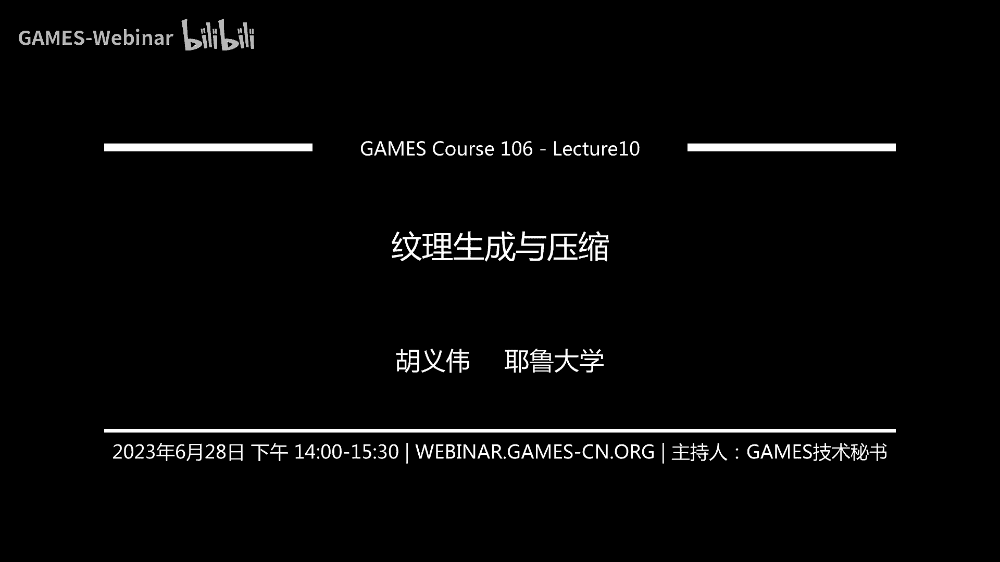
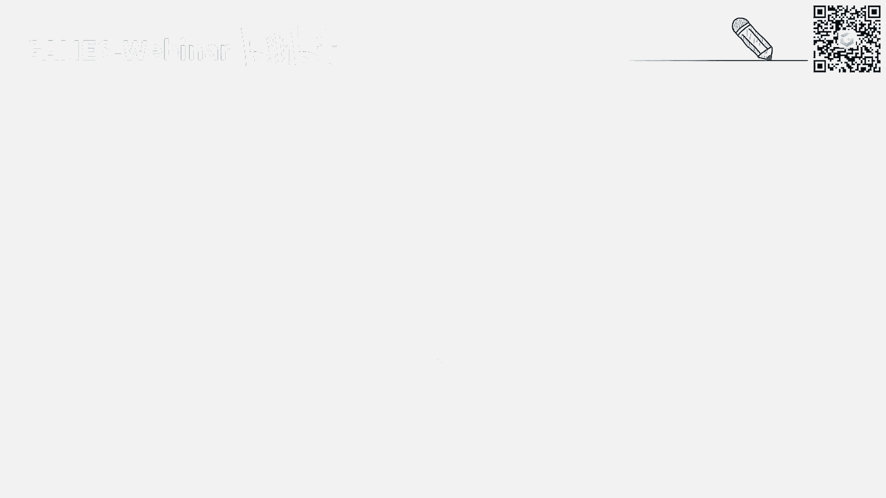
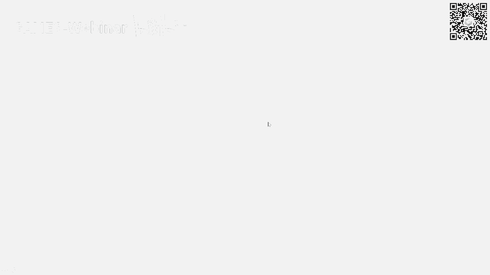

# GAMES106-现代图形绘制流水线原理与实践 - P10：10. 纹理生成与压缩 - GAMES-Webinar - BV1Uo4y1J7ie

ok ok不好意思，今天晚了一些，大家好，各位同学，大家好，我是胡一伟啊，我之前刚刚从耶鲁大学毕业，现在在罗比research做research scientist。

然后我今天呢给大家讲的这个课程的名字，就叫做这个纹理生成与压缩，我们今天的内容主要分为三个部分，第一个部分是纹理的简介，第二部分是简，然后讲一下纹理是如何生成的，一般的方法。

然后最后的话讲一下纹理的使用和压缩。

首先我们简介一下什么是纹理，纹理是一个非常常见的一个单元。

在整个这个流水线中，一般来说的话，我们谈到纹理，就首先我们会把它与这个材质联系在一起，就是说如果有一个场景的话，它只有几何建模，如果没有纹理的话，那么这个场景渲染出来的话就没有颜色。

或者说它根本就没有办法被渲染，而纹理或者材质的话，定义了这个几何物体，它如何与光进行交互的，我们整个渲染过程，在整个渲染过程中，纹理是或者材质是不可或缺的，一般来说的话。

就是如果我们讲到更细节一点的纹理定义，通常来说，它在这个程序中被表达为一个多维的固定数组，比如说一维的，二维和三维的数组，里面呢可以储存不同类型的元素，比如说浮点类型，整形等等。

它本质上可能是一个就是一个固定的，多维的固定速度，所以呢他除了这个材质的表达之外，它还可以表达深度，还有这种帧缓存等等，而这节课，我们主要还是围绕着这个材质的表达来展开，因为这也是材质它最多应用的地方。

在整个这个图形学的渲染中的话，材质是非常重要的组成部分，就是几何材质，它都是怎么说呢，你要去渲染以后，这种非常真实的图片，这两个是非常非常就是关键的，它在数学上一般会定义为这个b2 d f。

就是这个双向分反射分布函数，如果同学们之前学过就是图形学的基础课程，肯定对这个完全不陌生，因为它这个它是这个渲染方程中的一个，核心的组成部分，这个渲染方程大概就是定义了这个。

比如说一束光如何与这个几何表面啊，一个不透明的几何表面如何进行交互，然后这束光比如说我们想计算这个出射光的话，我们相当于要对所有的入射光进行一个积分，而这些入射光它相当于它的这个反射率。

就是这像这样一个这个b2 d f，就定义了这样一个入射光的反射率，通常来说的话它是一个4d4 维的函数，为什么他这个因为这个反射力的话，他必须要有这个入射方向和出射方向，两个方向做定义，而每个方向呢。

它通常来说它可以在这个球面坐标系中所定义，给定义在一个单位球上，所以它一般来说会被参数化为theta和phi，因此它一共是四维的，也就是说出射光它一个sea和fi，入射光它也seed和fi。

所以是一个四维函数，而这个四维函数呢，你想想看这个四维函数它维度非常的高，通常来说的话嗯，如果大家学过之前的基础的图形学课程，知道，如果你要得到这个b i g f，通常可能需要一些那个。

比如说仪器对这个对一个物体进行采集，而且他描述的往往是一个单一的材质，比如说啊铝啊，这种纸板啊，对不对等等，但是真实世界上的很多的物体的话，实际上是由各种各样的材质所组成的。

因为比如说就比如说你周围的这种地板啊，地砖啊，它实际上来说，它每一个地方的材质都有所不一样，你不能用完全的单一的，比如说我这个是金的，这个是银色这种来表达，那么如何我们去表达这种呃。

类似于就是复杂的比较复杂的材质呢，可能大家也之前了解过，就是说如果你要描述这个材质的空间变化的话，就比如说我们一个一个比如说面前的一堵墙，强壮的每一个点就是因为风化腐蚀，可能它的材质都会变化。

这种材质的空间变化的话，就需要我们引入新的变量，x，这个x就是定义了这个材质在空间上那个分布，也就是说我们除了它，就像对于每一个x，我们都有一个他一个这样的一个b2 d f，所以因此的话。

我们可以定义这个special berry的这个b2 d f，这个special varing b d f，因为我们加入x这个分量，因为我们假设x是定义在这个物体的这个uv space。

比如说它这个表面的，对不对，我们不考虑3333维空间了，我们可以理解，把这个s0 ，b2 d f定义为像是一个六位的函数，但是我们也可以看到这个四，不论是四维还是六维。

他这个他这个相当于这个维度非常的高，你比方说啊特别维度高的时候，你就是说你要描述这样的函数的话，你你通常来说需要一个，比如说你要做测量的话，可能需要一个很大的一个表去储储存它。

这个你需要一个644d的一个数字，或者6d的个数组去存储它，因此它实际上就是这种表达，很少在这种实时渲染或真实感渲染中，他运用了，因为他的一个是很难够很难以被表达，第二个就是他你要你要得到精确的测量。

这种代价很大，因此的话一般来说在整个实时渲染中啊，我们他都不会这些，不论是这种什么4d的b，2d或者6d的这种s b b r d f，通常来说都不会被直接用的，所以说大家都会用这种解析模型去逼近它。

比如说大家非常那熟悉的，可能大家医学的这个图形学都知道，比如说缝缝模型啊，对不对，就是这个最最非常简单，high bo liberation模型，就是这种非常简单的。

通过直觉上来表达了这样的一个解析函数，解析函数它的优点是什么呢，原来的话b d不是一个四维的函数，因为它要精确的记录，他每一个入射光和初始光的方向，它的之间的关系，对不对，但是解析函数的话。

他就没有位数了，为什么呢，它只需要储存几个有限的参数，比如说这个服务模型，可能你只需要储存那个shining值，那个比如说阿尔法值一个参数，我就可以定义类似于一种材质。

所以说它的维度从一个四维降到了零维，也就是说几乎是不需要有任何的储存空间的，而我们这个在现在来说，现在这种渲染中的话，最经典的这种p p r工作流，比如说呃不呃，lv le meti工作流。

它也是由这种解析的模型来构成的，比如说像这样的一个啊b r d f f2 ，它通常都是由两个部分组成，因为因为现在为了这个他表达的更加的方便性，对它，它它相当于我们要提升他的这个表达的能力吗。

你通常来说不会把拆成两步，一个是慢反式的分量f d，一个是镜面反射分量fs对不对，然后呢通常来说的话，fs的话大家肯定也知道了，镜面反射分量通常来说可以用一个，比如说microphy model。

一般来说这就是一个非常经典的这种p p2 ，p b2 模型，对不对，然后它的这个d的话，它是一个法线分布函数，对不对，并描述了这个novel，它怎么样在这个micro fi下面进行变化的。

通常来说可能有一个g g x函数去表达它，以及它还有比如说f2 里面包含了dfg 3项，对不对，f是ffee项，大家肯定也知道，就是你在一个比较低的一个角度看的时候，它的反射都会增强。

这就是它的分裂点效应，还有即使交易try或者说shadow masking，像就是描述了这个可能在这微表面下，它这个是怎么样，是相当于是怎么样的一个遮挡关系，statistic统计学上的遮挡关系。

因此呢我们有这样的一个解析函数的话，我们就能够把这个维度极大的下降，也就是说这样的一个函数表达，其实上来说是零维的，为什么呢，我们定义这样的一个这样的一个b2 d f的话，我们只需要几个值就可以定。

第一个是lv 6值，对不对，还有一个是metallic值以及normal，是它这个法线方向，就是michael的这样的法线方向，不不是不是这种，不是这种微微表面的这种statistically法线方向。

以及他raghness值，以及比如说可能还有一些呃，它上面的一些其他的一些参数，比如说你刚才说的f0 ，其实上就是也是有一个参数，但通常来说你整个pp r工作流可能就是会表达。

albedo metallic法线，normal以及roughness 4个值，我们就可以定义一种b l d f，所以我们极大的就是把这个维度，从一个四维降到了一个零维，也就是说。

我们只需要通过有限的变量就能够储存，就能够表达这样的一个b2 d f，因此呢，它的一个好处就是我们去表达这个sd b2 df，就会非常简单，我们就可以把一个六维的s b r d f。

降低成一个二维的一个纹理，对不对，所以说我们看到的很多种纹理表达，其实本质上来说，你可以把它理解为，它也是一种s v b2 js的表达，他的话他会把这种lbl值，metallic值。

法线方向以及raghness，是去用一张2d图给储存起来，对不对，每个2d图就是一张2d的纹理，因此的话它就可以相当于是把一个6d的，中立地的s t b r e f，降降成为一个二维的一个纹理。

叫多通道，这个纹理，像一般来说的话，用一个用纹理表达的pp r材质，可能有各种各样的这种所谓的纹理图，对不对，我们刚才你也举的就是lv。

do normal raghness metallic是非常基本的。

我们一般来说general来说，你可能还有其他各种各样的这种材质图，比如说我或者纹理图，比如说高度图，high map，或者说ao图，或者说还有这种各项异性的anthropic map。

或者说还有它的透明度的图等等，所以说这些图呢他都可以用纹理表达，而这么多的多通道纹理，它这样的话它就可以表达一个pp r材质，所以说所以说这就是这个怎么说呢，这就是用这种纹理表达材质。

它是更加的compact，比起传统的那种s b b r d f的表达来说，所以说大量的这种纹理就是广泛的，在这种实时渲染中被使用，然后下面我们介绍一下这个纹理的生成部分，纹理的生成其实是多种多样的。

就是我们刚才也看到了，就是很多的这个纹理。

它是可以适应，是个2d图，对不对，那我们只而且你想看，就是从整个图形学发展到最先的时候，就是不考虑很多风格化的渲染，我们一开始的时候就是做的就是真实感的渲染，所以说我们要把一个纹理。

相当于我们需要需要我们的纹理和材质表达，对真实世界的物体，就是说相当于说能够更好地表达，真实世界的物体，因此呢一个最直接的获得这个纹理，材质图的方法是什么，就是拿你的相机，你的手机去拍照。

所以说在传统方法来讲，就是说我们可以把拍到的照片，然后怎么样去某种方法去转化为这样的一个，纹理图，对不对，一般来说的话可能一个非常简单的方法，就是ok我们拍一个平面的照片，比如说因为纹理嘛。

刚才我们看到很多，比如说那个砖墙，对不对，有地面或者说人的皮肤，你可以拍一个比较local的一个局部的照片呢，然后我们呢我们可以通过一些方法去处理，把它处理成这样的一个沟通的材质图。

比如说你看看很多多段采用处理，比如说l videl vido，实际上他就是把这个原来一张可能上，有光照信息的一个一个2d的图片，rgb图片转化为一张把光照信息去掉，只有它原本的颜色。

原来的颜色的这样一档v f图片，它本质上来说可能是把一个rgb的一个图片，转化为这个这样的一个多通道处理，你也可以理解为我用不同的滤镜，可以生成这样的图，比如说no wap嘛，对不对。

你可以说你拿一个类似于nomap滤镜，你可以把它这个颜色变成那种偏偏蓝色的，那就成一个normap，所以在最开始的时候就artist，可能他们就是oris，就是拿photoshop去去做这种事情。

但是这种事情他处理得到的结果，可能不是physically base，就是说就是它不是非常精确，不是说好像就能够完全的，就是按照物理的规律去，完全就是重建出他这样真实的问题。

他很可能就是实际上来说在很多的渲染场景中，真实的这种工业界渲染场景中，大多数的需求是physically plausible，就看起来它是合理的，不是要求说跟测量一样，它是完全要是物理上非常精确的。

因为你要精确的还原它的材质的话，你需要知道它的光照信息，你需要知道你的这个照片的这个什么，比如说你的位置信息等等，你才能从完全的重建出它的它的纹理，所以说这个是非常困难的。

所以一般来说的纹理生成是通过图片，然后再转换，但是呢这种过程呢其实也是非常讲究技巧，就是说并不是那么容易啊，甚至我尤其是比如说你还要把一个纹理，放在一个这个贴图，贴到这个几米水上。

贴到你的你的这个几何上等等，还要考虑各种各样的因素，还有啊除所以说呢各种各样的算法就衍生出来，帮助这个艺术家，他们生成各种各样的这样的材质纹理，比如说如果大家就对这个graph。

计算机统计学的研究有点了解的话，知道这是最早的算法，比如说是这个纹理合成，就是刚才我们说的，就是你拍你拍到一个平面图片的时候呢，你没有办法去拍个全貌，因为你可能只能拍一个局部。

因为比如说你只能拍到墙的一个小的patch，你想要去把这小的配置合成，会更大的东西就叫做纹理合成，或者说有没有更直接的材质转换工具，比如说我能直接把一个rgb图转化为，比如说多通道的这种纹理图。

因为本质上来说刚才也说过，你可能可以把理解为你是用不同的filter，去生成这样的一个纹理，纹理合成的话实际上是一个非常经典的算法，它这个可以，我觉得他的这个发明可以追溯到上个世纪，可能90年代了。

就是说他的问题，其实就是解决一个非常简单的问题，尤其是在那个当年，可能那个相机分辨率都非常低的情况下，就问就问，假设我就拍到的这个纹理特别小的话，我如何能够生成更大的图片呢，比如说我只能拍到一个这个。

一个有裂缝的墙的一个局部，我能如果能够把它生成一个，比如说更大的一张图片，这就是一个非常经典的一个纹理合成算法，但是我们要需要注意的一点就是什么呢，它跟这个他跟那个超分辨有什么区别呢。

就是其实大家可能知道这个超分辨，就是你也是把一张小图生成一张更大的图，对不对，但他这个跟超分辨有什么区别呢，知识区别就是什么呢，就是区别就是纹理的合成的话，它不改变它的一个尺度，也就是说什么意思呢。

我刚才说的，你想让把一个小的一个pad生成更大的一个图片，我们并不是说把这个patch缩放成更大的图片，而是我们希望它这个patch的这个尺度是不变，但是我们需要很多很多这样的patch。

就比如说呃什么意思呢，我们比如说我们拍了一个假设，一个比如说这个地砖对不对，我们拍摄这个地砖，我们不是想，我们假设把图，这个地砖，以相同的尺度贴到我们这个场景模型中的时候，我希望他有更多的地砖，对不对。

而不是说我只是把地砖给放大了而已，所以说我们希望他有更多的，比如我拍了一块砖，就我我想在这个地面上铺满十块这样的砖，我是希望就是重复这样的砖，但是比较比如说有一些的这个variation有点变化。

但是我想要更多的砖，而不是说只是把一块砖放大了，往我这个地面上贴，所以呢它是它是跟超分辨本质区别，就是纹理合成，不是改变它的，不会改变它的物理上，或者说它的这个实际上的一个尺度。

缺点的话就是纹理合成的一个，缺点的话其实也是非常明显，就是你将来是文理合成，它是这个整个这个发展，追溯到是就是上上个世纪的，对不对，就是说上次因为上次那个时候，总体来说他这个分辨率是比较低的，对不对。

然后那个时候我拟合成上哪，看的是我ok我有一张64的分辨率，我能不能分辨，是就是比如说合成成一张256的分辨率，这样可能能够重用，或者说能够这样的话，能够相当于说能够有更大的一些呃。

尺度的就是尺度不变的情况，我有更多的这样的pattern，pattern上有些vation，这样的话，我就可以til在我这个这个这个墙面上，或者说地面上了，但是问题就是说这种分辨率。

它是一个比较大的一个限制，而且就是呃呃而且就是什么，它这个实际上它纹理合成的算法，目前来看很多物理合成算法都不是特别的完美，比如说有明显有肉眼可见的瑕疵，还有就是它整体的分辨率就是偏低，为什么呢。

现在就比如说现在的整个游戏，或者说电影是这种设计中需要的纹理材质，通常是高分辨率，也就是说通常需要呃，至少我觉得至少是1k2 k的，就是至少他现在这种比如说如果玩游戏的话。

知道这种高清材质包可能都是4k8 k的，这种你仅仅仅仅的1k的分辨率，或者说很多大部分的这种文章，或者是以前那种工作，都是，假设你的实际工作的分辨率，都是在512左右的，通常来说是不太够用。

而且纹理合成算法大多数的这些算法，它的这个复杂复杂度，它跟它的这个分辨率是有直接相关的，也就是说你你在像素理论上来说，我可以把这个算法应用到比如4k以上，但是问题是你一旦这样做的话。

你的这个运行速度会变得非常非常的慢，因此的话就是想克服这样的一个问题，就是所以说现在很多的这个材质的设计，都是用了什么，用了这个过程式的这种纹理的生成过程，是纹理生成的。

就是大家可能知道一些比较简单的一些过程是，问题是比如说啊这个checkboard的七班格，或者说一些那个burning noise这种比较简单，但是现在复杂的，比如工业界中常用的。

就是用这种计算图的方法去生成纹理，像这种是no graph的方法去生成纹理，通常来说你可以在这个blender里面有这种什么，cd graph，这种其实都是相似的。

就是说通过一段程序去计算出更加复杂的一些，python出来，比如说我们一开始有很多的noise啊，然后把这些noise通过一些东西去blend混合，然后再去调它的颜色啊，然后再去调它的这种什么呃。

比如说他这种pattern的分布啊等等，就是我可以组成组成一张，就是实际上来说，看起来跟真实图片非常像的一张，但是它是过程式的纹理，这个过程是纹理，它的这个好处是什么，第一个是它有非常强的可编辑性。

你看它是一张计算图，你想它每个节点都是可编辑的，你想要比如说把把面前的这个这个地砖，你说我要改变它的skill，对不对，我会说我想把这个把这个白色的，把这个脏的部分变得更脏。

它实际上有几个参数可以直接调，或者说你想把前这个这个地砖变得很干净，它也可以直接调，所以它它的边界性是非常强，它也完全可编辑性，除此之外就是说它是一个计算出来的一张图，它理论上来之后。

你的分辨率它只是一个参数，而a已知参数设为8k，它就可以计算出8k的，所以他就是他这样的话，它的分辨率理论上是无穷，而且有无无限尺度的细节，其次的话就是一般是如果是一个高度优化的。

这样的一个这个这个note graph system的话，它可以达到交互式设计，也就是说我们可以直接把这个图直接计算图，比如说在这种3d max或者maya，插件里面直接应用。

然后呢我们可以实时的去看它，就对它进行编辑，然后获得一些feedback，比如说我这个这个场景，在这个场景中实时的做一个real time rendering，就结果怎么样，我觉得不满意的话。

我可以立马改参数，然后他就可以重新给我渲染，因此的话他这种他这种过程式的纹理呃，它的使用上实际上是比一些pixel的纹理，更更好用一些，但是它最大的缺点是什么呢，就是它的不好设计。

我们刚才说的很多的图片，你说我们可以很简单的拿这个照片啊，去呃去拍照，然后去转换，或者或者说你直接去网上搜，就可以搜到很多这样的素材，但是你要设计这样的一个计算图，你如果没有任何的专业背景的话。

或者说你没有任何经验的话，是很难设计出这样的一个一个过程，是纹理图的，然后过程是纹理图，比如说像这种substance的话，adobe substance它有它是一系列的套件，可以支持这样的一个过程。

是模拟生成，包括它可以用pa substance painter，也就是说他可以用这种笔刷，去在这个jameter上刷这些纹理，就是你的笔刷实际上就是一个procedure。

就是这样的一个过程的一个纹理计算图，这样的话你可以程序式的，相当于相当于在这个在这个在这个几何模型上，对它进行化，所以说它整个设计流程也是非常的，就就是相对非常的简易的，但是我刚才就说了句话。

就是如果这些这些这些过程中，问他最大的缺点就是它设计非常难，所以其实大量的这些研究还在说，我们能不能还是用这种图片的方法表，但是我们能够简化这个操作，对不对，我们从真实世界中拍照或者什么上网或者材质。

然后呢我们可以快速的，比如说生成这种高清的这种材质，是不是，所以很多职业研究开始研究这方面内容，就比如说呃比如说最近的，比如说深度学习的兴起，大家都想ok我能不能原来我们的拍照，比如说你想要用。

比如说好好的相机，然后比如说在一个光源比较好的情况下去拍，那我们能不能，而且你得到的结果，我刚才说你还需要用这种什么photoshop去处理，那我们现在能不能说能不能用，直接用手机去对应到。

比如说东西进行拍摄，然后你拍摄得到结果呢，你会然后你再用一些这种深度学习方法去去，相当于去学它到底是他physically，他物理上是如何去正确的表达的，因此呢他他如果你在渲染系统重新render的话。

会发现它其实跟真正真实拍到的照片，其实非常像，包括还有刚才说这个问题，就是你如果只拍到一张平面的图片的话，你是你，你还需要后期的时候把它给贴在你的几何上，对不对，你你这种什么，比如你这种什么，比如专。

比如这种什么墙面或者这种平面的这种纹理，还是比较好拍的，比如说你可以你可以比较简单的拍，不用不用做uv unwrapping，但是你想把一个复杂的东西直接贴到其复杂角，美学上还是很复杂的。

所以现在还有很多的工作，就是直接相当于是做这种几何和纹理的重建，包括一些呃有很多方法，比如说他利用这微分渲染，或者现在大量的在用nerf做这种东西，除此之外呢，还有一些工作。

就是我们就想的是能不能有一些更好的方法，比如说example base方法对纹理进行编辑，因为刚才所说的过程是纹理的优势，就是说你可以通过调参数对纹理进行编辑，而你如何去对一个。

比如说我有一张比如模拟图，我怎么样进行编辑呢，也是一个好问题，就是它是如果是只是一个贴图的话，现在的方法可能还是就通过photoshop去做，或者说不过不过从去年或者前2年开始。

现在defusion model了，我们就可以用更加powerful的方法了，但是我们还是希望能够用其他的方法，比如说用一些example base或者说tt base的方法。

而不是通过像是用photoshop一样对纹理的，相当于每个像素进行这种逐像素的编辑，这种像这种效率是比较低下的，所以说我刚才其实也就提到了一些，比如说这种什么diffusion model a i。

其实现在来说，从可能从前2年开始，去年和前年开始这个搭理这种出现，包括stevideusion的出现的话，会导致整个纹理的生成，workflow也会呃产生很大的变化，比如说之前有一个。

比如说这个这个是一个，之前是有一个这个material artist在网上泡着他们的，他觉得他的一个很很不错的工作，也就是原来的情况下，你看它它最左边那个图是他，我我用手机拍张照片，对不对。

然后呢他这一点呢就是我做几个prop，对我crop几个几个几个小小pad之后呢，我把它贴贴在用photoshop贴贴在一起之后，贴贴贴成一个更大一点的这个纹理，对不对，更完整的纹理。

但是有个问题是什么呢，我们需要这个纹理，它是一个title，也就是说他你会你会看出它til完之后呢，他明显可以看见纹理之间存在的接缝，这实际上也是纹理和纹理合成立很大的问题，就是说你没有办法。

有时候没有办法保证你合成的纹理，或者说你得到的拍照得到的纹理，它是一个无缝的，也就是说你可以比如说啊，因为我可以无缝的那一块一块的像砖一样，贴满整个墙面，看得出你的缝，像你比如马赛克这种砖块一样。

你实际上都是有缝的，那怎么办呢，所以说你可以用搭理这种，比如说用打理这种得到一个这种smith smoothness的，就simply output，一般的话你需要消除这些phone。

你可能需要我提二次去做那种pixel based iting，是非常麻烦的，你这样的话，用搭理这种generative ai，去做这种无缝的处理之后呢，我们再把这些东西对不对。

放到比如说substance sampler，这种这种什么材质图转化工具，让它生成这种pp r材质图，也就是说在整个ai时代的话，他这种纹理的这种工作流，实际上来说也会得到非常大的改变。

而且刚才说的这个是，你还是要从真实世界中获得纹理，这个人抄手机拍照，现在包括现在大量的这种text base的，generating model的话。

你完全可以通过比如说这种text from me的进行这种，获得大量这种variation，然后从中挑选自己喜欢的纹理，对不对，diffusion model，包括很多。

还有这种现在的control control net，这种这种都可以去获得各种各样的这种，2d平面的纹理，而且现在还有很多工作在做这种什么，43d上的，直接是获得的文理rett这种工作。

然后我们最后可以把这些diffusion model，得到的纹理，再通过各种各样的材质图生成工具，对应得到对应的pp r材质图，也就是说这种传统的这种。

也就是说我们刚开始说这种pixel base的方法，因为现在ai的工具出现，变得实际上来说有很多的这种可能性，整个wflow也会得到其他的改变，我们再回到我们最后再回到这个过程，是纹理上去。

就是大家有没有想过，就是过程问题，刚才说它本质其实是一段程序，对不对，它是一个node graph，你的node实际上就是一个小函数，对不对，你把你这些小函数的输入和输入连在一起，它实际上就是一段程序。

对不对，但你也知道现在的现在的transformer，可能大家了解ai的话，就transformer这么强，现在包括微软的那个可怕可怕了，这种program synthesis。

实际上也是也是一个非常popular的话题，你其实可拍了，它也是一个非常强的一个a r k，能够帮助人进行编程，那么想看我们能不能去直接生成程序式的纹理，实际上是可能的，就是现在已经只是从去年开始。

因为去年是很多这种generative model的一个爆发期，很多的这种也有我现在工作去研究，比如说gb t架构。

这种transformer架构，我们去直接去生成一段程序，用这段程序相当于是去表达一个计算图，去表达一个程序式纹理，这样的话就相当于是我们不仅仅可以在pixel base上。

做出这种generative ai，我们甚至也可以在这种procedure这个space上，或者在这种program space上做这奖励率瑞文案，所以说我觉得整个纹理生成在这个呃。

这个ai时代也是这个可能性是非常大的，然后我们来到了这个最后的toy，就是啊我们是我们生成了这个纹理，对不对，我们最终还是要把这个纹理用到我们的这个。

实时的渲染管线，或者说离线中渲染中，对不对，然后呢就是问题就是，我们如何去正确使用这个纹理呢，看似纹理的使用其实非常简单，因为大多数纹理的因为纹理怎么说呢，它是一个非常非常basic的一个单元，对不对。

呃，在整个渲染管线中，实际上来说大量的这个纹理的使用，通常来说都是已经被will pad到一个比如a api里面，说，或者说实际上是硬件集成的，或者api集成的功能了，但大家也没有想过啊。

就如何正确的使用纹理，但是的话呃，实际上它跟正常速度的使用是不太一样的，他虽然在表达我们刚才说了，他的他的就是理论上的表达，就是一个速度，对不对，但是我们的我们从这个怎么说，从更理论上来的角度来说。

纹理是表达什么文理，文理文理是表达什么纹理，我刚才说的就是，我们使用纹理去逼近一个自然界中的一个，一个材质，对不对，自然界这种材质的话，它是一个连续的一个东西，对不对，我们认为我们拍照得到这个纹理。

实际上是对这个离散自然界中，连续这种信号的一个采样，对不对，它是储存的，是一个经过什么一个离散化的一个连续的信号，我们对文理的访问的话，实际上是对于这样的一个，离散化信号的一个重建，对不对。

我们是想要去重建出它原来这个连续的信号，对不对，因此的话我们访问纹理的话，我们需要访问是0~1之间的一个小数，通常需要用小数做到sm，因此的话我们怎么样去采用一个，比如说是呃，0。

1的这样的一个一个一个一个一个position，对不对，所以而且一个很重要的问题，就是一个采样频率的问题，就是如果大家学过，比如信号理论，比如说信号理论的话，也知道，就是如果你的采样频率不高不低的话。

你会产生这种走样的一个问题，也就是说比如说刚才这个例子，就是远方的这种纹理上的这种文素text，分布的是非常密集的，就表示了什么，理论上来说他那边的一个信号频率是非常高的。

因为你可以理解为他他那个就相当于他的变化，变化率非常的高，对不对，因为他离得很远，他在这个screen space上的变化率非常高，如果我们只是简单的用点采样的话，它会产生这种走样的信号。

点采样就是啊我们就就踩，就踩那个最最离家最近的样样本，如果你这样简单采样的话，你会导致它这个产生走量的信号，因此我们通常要进行滤波，滤波的话，什么滤波少，因为我们是这种fixed。

就是我们已经是有一个我们的分辨率是固定的，情况下的话，你必须通过滤波的方法去预调一下，它的高频信号，让它看起来更加更加平滑，也就是说你的像面采样的时候就是用滤波方法，你的你的你的远处的时候。

你看起来就是虽然他这吕布对的也不是特别好，但是你可以看见他远处的时候，不会产生那么奇怪的这种pattern，他这种python最直接表示，就比如你这个黑色的线都不直了，对不对，因为他就看成一个锯齿形。

你有的时候会翻译成比如锯齿，对不对，我们所以要我们，所以呢我们所以要需要一种方法去抗对抗，这个剧情，就是抗锯齿或者说反走，要一般来说的话，对不对，我们可以通过增大采样率。

但是实际上除了这个性能会下降之外，有可能你也没法增大采样，因为你是你的这个纹理的分辨率是固定的，所以你一般来说我能考虑到性能，你也不能说实时的去做这个滤波，对不对，那我们是怎么样解决呢。

所以因此的话就是实际上来说，一个在同学里面就是特别实时渲染中呃，呃它的一个一个一个hilosophy或者一个哲学，就是说什么很多东西呢，如果你能够预处理，我们就预处理了，实施的时候我们就把它固定住。

直接去访问就行了，为了它的速度考虑，对不对，一般来说的话，纹理这种东西它通常是跟几何绑定起来，对不对，而且通常来说纹理在运行时不会变，所以它储存的值不太会变，因此我们对每一块纹理我都可以。

我们刚才说的是一种方法，是实时的要去做这个滤波，我们是不是能够提前把这个包给，相当于把这个提前把这个做这个profiting，对不对，所谓的procreator其实非常简单。

就是我们要产生这个所谓的mmap，mamap本质就是做prefering，相当于我用一个filter去对这个滤波之后，他你像因为滤波的话，他会把这个图片做的不一下就不做了，模糊它的分辨率因此会降低。

因此我们会把一张图片之后一张图片做成不同，就是从mamap 0是原图，一直到它最低的，这个mmap可能是1x1的这种单位做，做到一种，其实都是，我们先把提前把这种滤波滤波好之后呢。

我们就可以在new new map上再进行采用，比如说什么意思呢，就比如说像右边这张图，你可以看出，如果是没有明白的话，我们就是最简单粗暴的点采样的话，你会发现这种大量的远方，可以看到大量的这种巨石。

就是因为我们的信号采样频率太低了，我们只是踩那个最近邻，就是那个年年呃啊那个这个最近0度，不是那个就是假设你没有me map的话，然后你又做最近邻采样的话，你会发现他这个全都是锯齿，对不对。

你看起来就是因为你的重建信号屏，你的你的重建的信号是不是有问题的，就是你的重建的信号是错误的，所以你你你你的这个你的这个对面全都是锯齿，而你做trilinear me map之后。

你的你因为你做了一波之后，相当于是我采样的时候，是在me更高等级mini map上做采样的之后，也就是说我实际上是我采样的那个点，它进行了预波，所以它看起来的话。

他就是相当于是把那些高频信号给丢掉了之后，它看起来就是更加的一些，就相当于是更加的smooth一些，你至少可以，虽然这个trainer没卖，并不是最好，因为它比起我们这个一左边所说的，各项异性滤波。

后面会讲到这种最高战力波，它还是有出现这种模糊的现象，但是它看起来比如说它已经不会存在，上面那个图中，就是远处会产生大量聚酯溶现象，而且而且它反而是其实是一个非常光滑的，一个一个过渡。

mini map的话，我之前也提到过，就是整个这个整个这个纹理单元，实际上是一个很well pad单元，就是me map，可能大家也不需要去手动去生成，它通常用api就可以生成。

只是需要占用一些额外的空间，这其实是一个比较简单的一个计算题，也就是说，比如说你你因为我每个mmap，相当于是是原来的一半，那也就是横轴纵轴都是它一半大小，所以它这个第n级的me max d n。

减一级的mimp 4分之一，对不对，当然还有一个问题，就是说你如果要求api生成的话，你需要这个纹理的维度是二的n次方，因为你每次相当于就是你的这个你这个横轴，纵轴减一半嘛，所以说他这个mimap呢。

通常需要额外的这样的一个，1/3的一个储存空间，如果就这样，你这是一个其实很简单的一个计算题了，但是考虑到我其实咱是考虑到，我们这个得到了这个性能提升，就是说你得到质量提升。

就是说这个y3 分之一储存空间，其实还是更加值得，还有一个问题就是什么呢，就是啊我们如何才能知道啊采用哪一张mfi，就是我们刚才说me map采样的，它这个规则，就是假设我们觉得我们采样的那个点。

它那个信号频率很高的话，我们就要采更高等级的命脉，因为那更高等级命脉表示，他把高频信号给滤掉了之后，它是一个它是一个，它是经过了一个profiting的一个一个一个图片。

所以我们要采一个prefer引用的东西，那么我们如何决定我们应该采哪张b map，所以说就是通常来说的话，你可以理解为什么，就是我们要一旦我们觉得他的这个频频率越高。

我们就要踩的这个amy map成积越大。

那么我们应该怎么决定它的，实际上我们刚才看到很多图，就是一个一个一个general的id，就是说你看他离我们，比如说他那个他越密集，对不对，他他比如他的屏幕，他这个text在这个屏幕空间分布越密集。

代表它的频率越高，对不对，通常来说它越密集的，为什么会越密集呢，就是它它在屏幕空间上，它的uv的变化是更加剧烈的，对不对，因此呢我们需要得到它这个屏幕空间上，uv变化的一个剧烈剧烈程度。

如果他在屏幕空间上它的剧烈越剧烈的话，我们就需要去，我们就需要去采用更大层级的mmap，然而一个问题是，我们怎样得到它，这个我们怎么样去描述它，这个uv在屏幕空间上的变化，这个程度呢，就通常来说的话。

gpu管线里面在执行这个pixel shading的时候，它是以2x2降零破的进行并行计算的，这样的并行计算的话，表表示它可以很方便计算，一个叫dd和d d y的东西，就是screen space。

对某一个这个变量的一个一个一个梯度，比如说以x方向直接的话，它就可以硬件就可以帮助计算它的uv，uv纹理坐标，它的这个在x方向这个梯度，比如说du dx dvd d v d x，对不对。

我们当然还有这个d u d y，和这个d v d y等等，从而可以估算这个对应的这个等级，而估算这个方式呢，通常也是同一个经验式的一个估算方式，通常来说，比如说可能是把这两个这个梯度。

相当于是得得到他这个磨磨的log，对不对，我们可以通过比如px，它就是相当于是你可以大概理解为，实际实际中不是不是可能不是，那么不是这么写，因为每他每个a p i写的都不一样，它但是你可以理解。

比如px可能就是计算出来，就是你要采哪个mim等级，对不对，这种其实更最后只直观的这个理解，就是说呢你的屏幕空间这个模越大，对不对，你这个表示它的梯度越大，表示什么。

它这个就uv坐标在屏幕上变化的更剧烈，也就是说我就变化了，就变化了一个pixel，我是我发现我的uv都变都变得很大了，对不对，或者说变得很小了，这就说明他这个频率就是非常的高，因此呢我们就要采采样。

相当于是更大层级或者说更深的这样的命脉，因为更深的秘密，它它就这种filter，就就就相当于是做这种filter的范围越大，因此的话相当于就是说我们能够比较怎么说呢。

比较reasonable去估算这样的一个mamap等级，去从而取得一个比较reasonable的一个采样，就generally说，这可能还是一个比较所谓的physically，plausible的。

而不是一个非常精确的结果，但是大量的实验表明，这这这些结果其实是这都是很reas，都是就是从视觉上来讲是很reasonable，啊还有但是还有一个问题就是什么呢，就是说me map的话。

刚哎就是刚才就是我们看到。

就是它都是正方形的，它要求你me map是二的n次方，对不对，正方形的mmm，他这个一层层计算完之后，它是很多很多正方形mm，但是有个问题就是说什么呢，就是说呃如果像像这个右边这张图的话，可以看见什么。

就说他在这个实际上来说，很多情况下，他这个就纹纹理相当于是uv坐标那个分布的话，它并不是完全真正好好是一个正方形的，对不对，你可以理解为有一个有一堵墙，你开一堵墙的时候，对不对。

你你这种墙体你越远的时候对它频率，他这个他这个uv的分布越密，对不对，你这个时候他你用me map做的是做的非常好，因为它它是它在screen space上，就是一个完整的一个正方形。

但是比如说像这个右图里边，它这个平面就你是斜的，对不对，所以你看这个平面的那个那小块，比如说你像采样那个像素点的时候呢，你理论上来说，你想要sample的是是它一个椭圆形的区域。

而不是说是一个完完全全的一个圆形的区域，对不对，也就是说这实际上来说这就是一个呃，这就是一个很大的问题，就是说你这个mini map uv space，你在做这个preputer。

但是在你这个实际的screen space上，其实是有存在一个比较大的差别，这就导致了什么呢，导致了我们需要一种更加更加好的，一种采样方法，也就是说我们通常来说，现在大多数，比如游戏里面。

或者说实时渲染里面都用的是antopic future，也就是说各项异性的采样，各项异性采样和各项同性采样，就是很明显的区别，就是说你你在看远处的地方，也就是说你看这个特别是斜的地面，对不对，刚才说的。

如果这个墙它没有什么问题，因为你正着看这个墙，你斜的这个地面的话，你会发现你实际上你需要prefer你去，他是个椭圆形的，而是在你的mimap做的时候，它是做一个是圆形的，或者它是正方形的东西，对不对。

所以你看到之后，你如果直接用传统的mini map做那种isle topic，比如说你用training也可以，它的远处都是糊的，就是它它实际上它重建效果是不是特别好的，对不对。

而你用anneal chic field，也就是你考虑到这种各向异性的差异，很简单，就是说我们很很简单的一个思路，就是说你看这个椭圆对，所以我这个我这个sample的这个分布，它是要遵循一个椭圆的规则。

而不是说我就是在一个原型上，这个mmap上做出直接sample，对不对，它这个区别呢就是刚才就是所说的，就是你的view space跟你的texas space差别很大。

你texas space假设你是正着看他的，而你的views space实际上是一个，你可能是在一个很奇怪的一个方法，比如说你是在接近似于近似于90度倾斜，非常倾斜的方向看它的。

所以这就会导致非常明显的区别，因此的话这种各项异性的采样啊，就是变得非常的popular，而各项异性采样往往需要怎么说，就需要进行一些实时的一些sample，就比如说我们需要一些实时的去sample啊。

不同的一样的一个对他sample，这个你你你需要carry，这uv坐标周围的不同的这种采样点，不同数量采样点，通常来说你的样本数量越多，你的你的相当于是你的重建，重建的这个信号就越精准。

从通常来说你这个得到的结果就越清晰，他当然这样的话也会需要你得到，需要更需要有更高的这样的一个计算代价，就比如说下面这张图，从这个没有没有这种呃，就是说最近零开始我们有两个两个采样点，四个采样点。

八个采样点等等，你会看到它这个从业质量越来越好，我们刚才讲的就是纹理的这样的一个一个采样，对不对，我们刚才也说了，你要纹理generation b map的话，你需要需要额外的1/3的容量。

而我们之前讲到文理生产的时候，我们又提到了这个现代的这个呃，这个呃这个游戏啊，或者说电影里面渲染的话，我们需要的是高清材质，这种高清材质的话，它可能怎么说呢，就是你1k2 k是不够，你要4k你4k的话。

我不知道你有没有想过一个4k的一个rgb，如果解压之后是多大的一个一个相当于，因为大多数你储存的时候都是g pg或者png形式，处理，都是压缩过的，如果你完全以数组的方式储存，一张4k的纹理的话。

是多大的，是非常大的，你想想看，你如果是一个三通道rgb大小的话，你需要48兆，而你的main map的话需要64兆，而更加离谱的是什么，离谱的是假设你是hdr贴图的话，对不对，你是flow的形式的话。

你就需要更大，你的命脉的话肯定要占用1/4个g大小，所以你想想看你，我把这么大的一个啊，这么大4k的东西往这个这个gpu memory里面搬，也不是每个人的gpu memory都是那种33080。

3090这种基本mary在1212g，24g的那种，所以就算你10+24，你三秒都多少是这个哦，texture对，而且这还是仅仅是一个rgb 3种的了，我们要储存的可能是一个刚才说的是。

我们tal map也是一种multi channel，你要你要albedo，你要normal，要raoughness，对不对，你要一堆的这样的一个贴图，所以说你不压缩，直接把它展展开。

放在这个gpu里面肯定是吃不消的，所以我们需要尽我们可能去压缩这个纹理大小，而我们刚才说的就是，你通常来说我们这个纹理既然是图片，对不对，不论是lv的或者是normal，它都是图片，我们放到硬盘上。

通常都是这个k g p g r p g来储存，那我们放在这个gpu显存的时候，能还是用这些一般的压缩图像，要是算法的，比如说像这个像右边这种，用gp夹子看起来质量可能也ok，对不对。

虽然你其实仔细看会发现他很多地方都不乐，我们回答这个问题之前，我们首先要理解理解文理的一个重要特性，就比如说我们想设计一个纹理压缩算法的话，这个或者说我们要想设计一个文件啊，就我们要设计文件的时候。

我们要考虑到哪些点，对不对，文理的一个非常重要的特点，就是它需要什么，他需要在gpu中，gpu中用，对不对，它需要随机的一个单点的范围，也就是说啊，也就是说什么我们需要对，我们需要有这样的一个。

非常快速的单点查询算法，这个单点查询算法是能够高度并行化执行的，因为这个这个pixel shader它是并行执行的，也就是说我们要我们要输入，ok我们要作为一个query，对不对。

这个query我们输入这个uv坐标，然后我们要返回这个纹理值，对不对，因此假设你想看我们要有一个压缩算法的话，能够同达到，相当于就是说能够满足这样的一个，随机单点访问的要求，它需要有哪些特性呢。

比如说它的解码速度要非常的快，这个纹理夹纹理解压需要，相当于是你以为你文理的这个query，可能是要query很多次，尤其是你要做一些这种filter的时，well time filter的时候。

你可能要去做query很多次，你不可能说我解码解码特别慢，也就是说你的在解码的速度，应该是非常非常快的，因此对这个他解码的速度要求是非常之高的，而且它是什么，它要求就是随机访问，也就是说什么叫随机访问。

就是说我的解码希望我什么，希望能够就是对这个uv的这个周围，或者是这个local，他有这个local型，就是说他对这个uv坐标，这个这个局部范围内可能进行一些这个，因为毕竟你要你要开压缩算法。

你肯定要推进lol范围内进行一些，其他的一些处理查询，但是你不会说我我访问，比如说一个优惠，比如访问三三这个坐标，我要对非常远的一个这个像素点，比如说100 100，我要去对它进行一些操作计算。

你这样的话你会占用非常大的额外资源，对不对，因为我随机的，我我只希望我每次减压的这个过程中，只需要消耗一点点计算资源，并且我消耗一点点额外的，比如说储存需求是不是，其次的话我们还需要什么。

还需要这个可变压缩比，因为我们刚才说的就是说，我们不可能是认为每一个人的这个，它的这个他这个gpu的型号都是一模一样，而且gpu的gpu在移动端，桌面端都有不同的表现能力，对不对，通常来说的话。

我们假设这个桌桌面积的gpu会有更大的显存，至少是比如8g的，或者说24g的等等，因此我们比如说我们我们需要用质量，而不是说我们一家压缩的更大，移动端，我们假设他这个通常来说，它的gpu没有多大的显存。

对不对，而且显存可能比较慢，因此我们需要提供更大的一些压缩比，所以呢我刚才讲的这种传统的这种g g p g，或者2t p n g，这种有可能比如小波变换，那些类似的这种压缩算法，它是很难。

或者说不太方便去应用到这些纹理中的，因此我们对纹理的压缩需要单独的一些算法，纹理压缩一些算法一般来说是基于block算法，基于block算法，它一个非常大的优势。

就是刚才讲的是local的访问的local型，就是说你不会要求说我解压一个像素点，结果我还要去访问，离我这个像素点离得非常远的，一个一个一个一个小数，或者说一个一个对对，相当于对离我非常远的一个地方。

进行一些操作计算，而通常来说纹理压缩算法有一些吧，比如以前有很多种，比如说这种x3 text compression等等，反正就是你可以在网上查到很多这样的一个，document的去描述这些问题。

压缩算法到底是怎么计算的，通常来说的话，你可以理解，为什么它都是将一个一组像素块去压缩，连一个比如固定长度的一个向量，也就是说首先我们要把一个图片进行分组，然后相当于是把每一组像素块。

都压缩为一个固定长度，然后当时解压的时候呢，就把这个固定长度向上还原，成绩有箱子快，比如说这个a s t c是一个非常呃，其实非常常用的一个压缩算法，就是像不同数量的一些像素亚。

都压缩为这个128比特的一个向量，从而它可以达到不同的一个程度的压缩比，对不对，通常来说它的比特率越高，它的这个读到图片就更加清晰，我们比如说，因为我们比如说可以举一个最简单的例子，比如说一个纹理。

我们可以把它分别为多个数据块，每个数据块你可以理解为就是一个，对不对，比如说这个a b c d，e f g组成的一个这样的一个16 4x4的，16个，一个16个，比如说16个这样一个slot一个数据块。

对不对，我们就可以把这样的一个4x4的一个数据块，原来比如说未压缩的状态，假设我们假设我们一个他一个slot，里面是一个bug，对不对，比如说是一个bug，一个bug可以表示很多，比如说一个儿童道。

对不对，他原来是16个bt，我们比如说我把压缩成什么，压缩成一个八bt，这样的会达到了这个二比一的压缩，二比一的压缩率，我们可以再举一个简单的例子，看看这个东西到底是如何做做这个压缩。

比如说一个非常简单的例子，就是一个b c1 ，刚才也说的那个就是一个d d x 10里面嘛，点d x 10里面的一个标准，这就是我们要压缩一个4x4的一个，怎么样去压缩一个4x4的。

一个r g b的一个数据块，对不对，我们可以算一下4x4的一个rgb的数据块，rgb嘛，对不对，rgb每个是是是888对888，所以是三个bt，所以它原来一共是48个by的，对不对。

48个原来是48的一个bt，相当于是一个对一个16 16x2，是一个16的一个rgb的数据块，我们先把压缩成什么，压缩成像右边这样的格式，右边这样的格式的话，它就是有两个这样的一个颜色值。

它它两个两个颜色值，它它每个颜色值实际上都是经过创k的部分，就是被压缩过的，相当于它的rgb，它相当于是他只用了一个什么呢，只用了相当于只用了16位，去表达原来的一个24位的，一个一个一个rgb数据库。

所以说他现在是每个color是只占用两个bt，对不对，除此之外呢，它还有什么，它还有颜色索引，颜色索引的话就是说你刚刚看的d c b a这种，他这种是16个颜色缩影，每个颜色缩影呢相当于每一个颜色。

所以它占两个bs，对不对，所以他一共这么多，加起来一共只占了八个bt，比刚才我们比较的48个bt相比的话，它达到了一个6米，这样压缩比他怎么样去编解码呢，实际上也是非常的巧妙的一个变解法。

也就是说它不是说有两个颜色值吗，对不对，然后他拍实物颜色每个颜色，所以是两个bt，所以这两个bt呢可以什么表示四种编码，四种编法就是两个by 00啊，对不对，就是相当于是你看到这个右边的这个。

这个这个文字是对应的四个，所以就是00011011，对不对，表达了四种颜色，这四种颜色呢就是由color 0和color 1，两个这种track过这种颜色值所进行排列组合，将来进行blend组合得到的。

也就是说它相当于是整个数据块呢，只只有存在四种颜色，对不对，这四种颜色呢就是刚才就是这四种颜色呢，它分别用这种000101表示，而四种颜色呢怎么表达呢，它比如说零零的话就对应的color。

001的话对应的color 1，比如说一零的话，它就相当于是把color 10和color一以二比一的方法，是blender到一起，对不对，一的话。

他就是把color 0和color一以一比二的形式不到一起，所以说他用这种方式就能够得到一个呃，相对来说比较高的压缩比，而且你像他这种东西，它在解码的过程中，他只需要访问这样一个数据块。

而且他做这个解码操作的时候是非常简单，相当于我只需要去访问这个数据库里面的，我只需要fetch这个color 0和color 1，再加上我fish这什么，我fish这个相当于是我这个我这个格子里面。

表示到底是哪个index，我是零零还是零一还是一零就ok了，我不需要去对很远的地方进行分，而且我占用的这种额外的计算资源，或者储存资源是非常低的，而而而这种纹理压缩呢，相当于除了这个按键的那个bc 1。

对不对，b c这个b c这个价格还有很多种，好像从一到b c，一到b c7 吧，他们相当于为什么他们会对不同的数据类型，有不同的编码方式，比如说刚才说的是rgb的编码，对不对，我们可以说我们还可以。

比如说像这个右图这边，你看他是bc到b c5 ，它是它可以编码为，比如说r g b，或者说它可以有这个阿尔法值，或者说它还有这one compucolor，比如你只有一个r一个red通道，一个红通道。

或者说你还有这个两个通道，比如说八八通道的这种two component color等等，所以说你每一种不同的数据类型，它可能还有这种编码方式，它也可能会会会不断的改变，我们刚才也说了。

就是除了这种b c对不对，还有b c这个家族，还有就是什么，还有a s t c是非常广泛使用的，还有这种什么etc etc，二中各种各样的编码，那么问题就是说什么，假设你有一张图片之后，对不对。

你你你你你这个你你想把这个程序deploy到这，移动端或deploy到你的桌面端上去之后，你你还要额外的相当于压成不同的编码类型，因为比如说你右边这张图显示。

就是说你可能bc的话比较适合dance top，比如说你这个s t c可能比较适合模板，那我是不是说每个东西还要再，相当于说处理两分，你比如说我我我处理两分，我我有我有必要吗，对不对，所以说。

所以说我们希望就是有一种这个纹理，数据交换系统的，比如说这种叫做basis universal的一个系统，它可以生成一种这样的一个中间的压缩数据，并且这种压缩数据能快速的转，编码为其中的其他压缩类型。

这样的话就是导致就是我们可以复用，我们的压缩数据，我们不需要去保留多个压缩副本，而且我们比如说我们在deploy，我们的这种嗯程序的时候呢，我们只要去啊储存这个dog basis，这种储存方式可以。

然后它在实时的在相当于在在运行的时候，它就可以被快速的变解码为其他的这种，这种数据类型，这样的话我们可以说有效的节省，我们这个这个deploy这个存储量，最后的话就是还要提到。

就是你既然都讲到纹理压缩的对比，我们之前讲了一个方法，就是啊这个analytic model。

你还记得大家还记得就是analytical，这个b r d f就是解析了b r d f，相比原来的这种4d的b r d f，你一下子从四维压到了零尾，那我们同样的对不对，你你假设一个2d的纹理。

我能不能直接从2d压到零为呢，是不是其实是可能的，那就是所谓的这种过程是纹理，对不对，因为过程是纹理，你只要储存储存什么，他那几个参数就ok了，或者你只要储存一段程序，就理论上来说，你这个情商来说。

你是fix less的，也就是你实际上是一个零维的东西，就是你人上来说，你最最极限的压缩是被什么，把一个纹理再给你压成零尾的东西，那么那么大家肯定想，那为什么形象中的很多。

其实呃看到这种游戏中实时渲染中，很没有多少人用这种过程是纹理的，就或者说大多数过程中为你用的时候，你都是先转化为材质图，然后再去用，我就说你先bake出bake成材质图，我们在用的，那没有什么。

没有人直接在说uv坐标上直接evaluate，这个过程是为适时的去做这种事呢，大家可以想一下，它其实最本质的就是刚才说的那个纹理的使用，对不对，刚才有可能记得文理的使用。

纹理的使用是你要考虑到你这个纹理，你你的频率的问题，对不对，你如果说你这个纹理的频率高的话，我需要做什么，我需要进行me map，我需要进行批prefer，对不对，这样的话我可以把高频项目滤掉。

看起来更正常一些，你不城市为例的话，怎么做这些做怎么做这种所谓的prefer ing的，对不对，你你每个点都是实时的要进行计算的，对不对，你要实施这计算的话。

那ok那我做实时的实时的filtering的话，你这样的话你的计算单价就会非常的高，尤其是你的这个过程中，文你还变得特别特别复杂的时候，你就会变得很有问题，而且还有一个点。

就是你纹理的压缩的一个一个关键点就是什么，你要做point query，就是让你点查询，对不对，点查询就是说你在uv，我给你uv，你立马给我给我这个结果，但是通常来说。

比如说刚才看到那个软件adobe substance，他没有办法做点查询，因为他他的很多的那种纹理，就是他过程是文理中间的那些啊，操作都是future这个你的filter。

你怎么你filter可以可以做点查权，但是很多情况下你是没有办法说等等，你修好也没法做检查，学他你你你future没法子填上去，你你你你这种东西就是你没有办法做检查，行程之后。

你导致你想要去value的一个pixel的话，你需要把整个图都value出来，我才能知道，这就失去了你这个你这个纹理，这个压缩的这个优势了，你相当于我还是需要把它给expend，到一个完整的图。

我再去主要在于fish到你这个pixel的值，所以你其实是本末倒置了，还有最大的问题就是说你value这个纹理，你你只是一个pretty noise，你做一个query。

也许ok或者你做个checkboy，你也许ok，但是你要做这种复杂的，你这个解压的过程是不是特别特别慢，是不是，而且你还要做大量这种query，所以这个其实都是一系列的一个问题。

就是它不太适合在实时渲染中使用，它优势确实很大，几乎为零的储存空间，因为它只要储存参数，我们对他缺点，就是刚才说的就是解码非常的困难，你没有办法做点查询，你没有办法，这个你每次evaluate的话。

它很慢，你你可以做到什么，你可以做到interactive的级别，就是说你可以在3d max玛雅中，那种什么实时的这种retracer中啊做，但是你没有办法说我在游戏中做重视。

因为游戏中你要做到啊60帧，120帧，这种很难，而且你没有办法提前计算，就me map，你没有办法做prefer，你要做实力波，所以这些导致了你这理论上来说呃，呃很很好很不错。

但实际上来说就是很难以使用，当然了，也有一些方法，也许能克服其中那么一点点的这种装备，比如说有一些研究所，ok我能不能解析的做个滤波对，因为前段滤波的话，我们一般可能就是做一个做一个filter。

对不对，你理论上来说我可以做一个假设，我们假设能不能去做一个把这个filter这color，这个就相当于这个这个这个这个卷积的过程，用一个neo model去表达出来。

也就是说我们提前我们不是value那个点，我们直接去value的那个卷积的那个解析形式，行不行啊，就有些研究就是做做这个做这些方向的，那general来说呢，就是他的这个总的来说它是一个可泛化性不强。

因为它实际上它它是它是它这个它可能对，具体到某一种这个数学形式，它可能能够给你推导出一种，卷积的一种解析形式，但是你说刚才我们说no graph这种东西，你现在没有任何的工具能够实实说。

我能对它做进行解析一波，因为这东西实在太复杂了，对，所以我们今天的这个课程总结，就是讲了几个几点吧，第一个就是什么是文理，对不对，我们主要今年文理，不该说就是它可以表达很多东西。

但是我们这节课主要讲的还是这个纹理和材质，之间的关系，其他的话，然后就讲了两个重点，一个是有纹理的生成，生成就是如何去获得我们的文明，就是就是比如说我们可以通过照片或者啊，或者通过过程式的纹理啊。

或者现在有大量的攻击，用算法a啊啊，对不对，diffusion model啊等等，然后呢，我们最后讲了一下这个纹理的使用和压缩，因为我们生成了纹理之后呢，我们要把它拉到角美学上。

最终我们需要在这个实时管线中进行渲染，而实时管线中呢，纹理单元通常是一个well pc的待遇，大家可能不需要很care他怎么word，但是从理论上来说，我们还需要还是是。

最好是知道他具体应该是实际是怎么工作的，而且我们也非常如何，能够改善它可能存在的一些问题，所以说我们今天讲的文理的使用和压缩，使用的话，我们需要考虑的就是纹理的这样的一个滤波，和他的这个频率问题。

以及我们为什么要做这个mamap，对不对，以及为什么需要做做这个anta，nartropic filtering等等，最后呢我们考虑到这个纹理的压缩算法，就是我们也说这个纹理的压缩啊。

它其实是一个非常重要的，你不能说直接把一个大图片往gpu里面加载，对不对，你必须需要一个压缩的形式放在gpu里面啊，问你的这个解压需要注意哪些点，以及怎么样去设计，以及什么样的压缩算法。

是一个比较好的一个压缩算法，也是一个比较呃有一次话题，而且其实比如今年也有呃，今年比如也有最新的这种研究工作，这项车能不能用这个神经网络，或者说用这种ai的方法去做这个纹理的压缩，比如说你。

你只要能够满足我刚才所说的几个要求，比如点查询啊，对不对，包括这个快速的解压等等，你实际上来说就可以成为一个不错的压缩算法，你如果说你不是仅仅是主动与这个block base的话。

你也可以说设计你自己的压缩算法，所以说今天的课程内容大概就到此结束了，就是同学们如果有什么问题可以可以可以留言，还有同学有问题吗，如果没有问题的话，可能今天就先这样了，我估计也下播了。

好谢谢大家前来观看。

