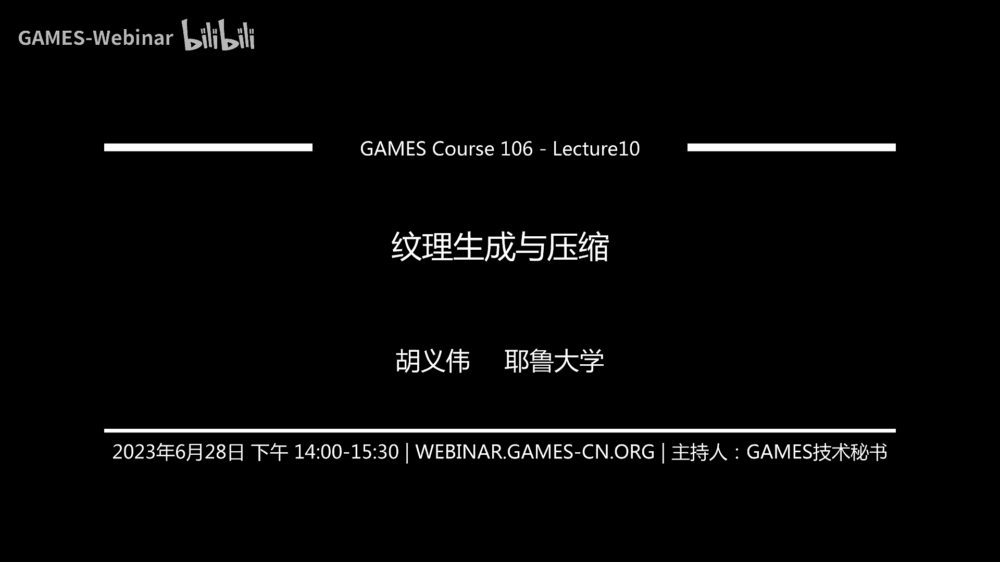
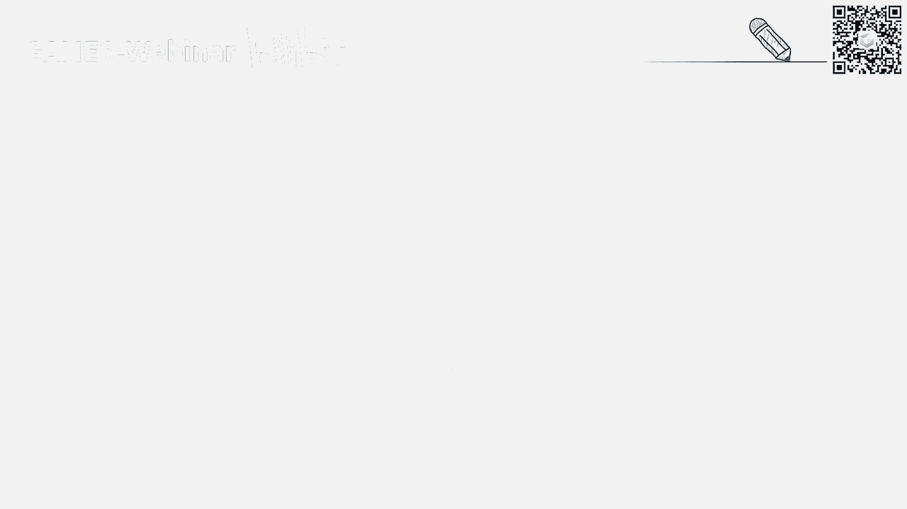
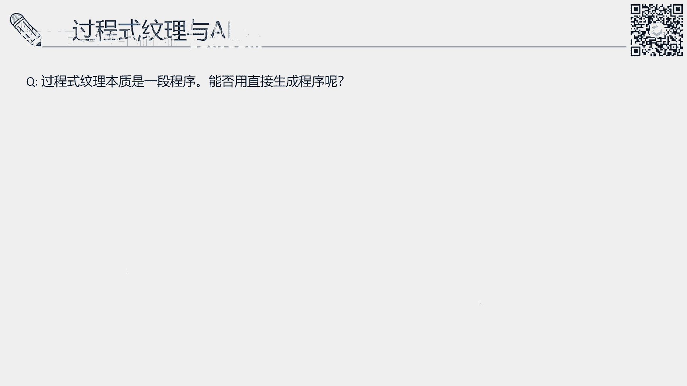
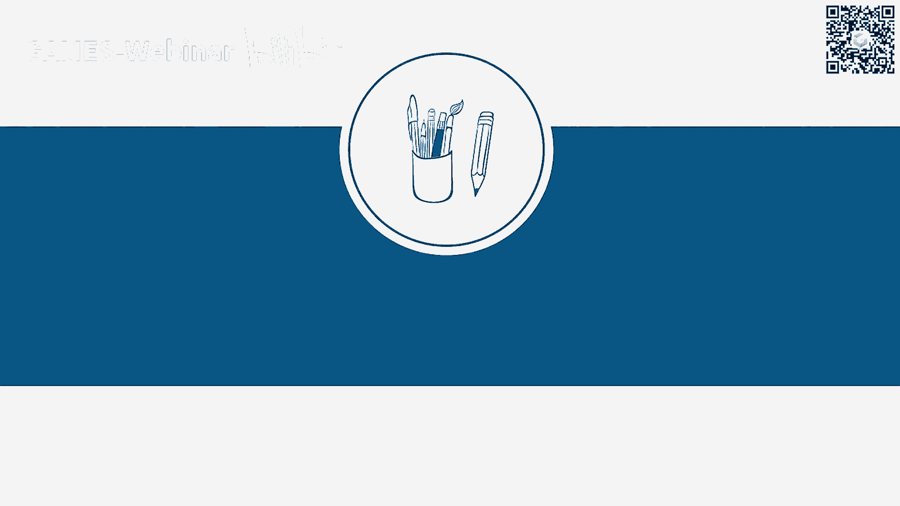
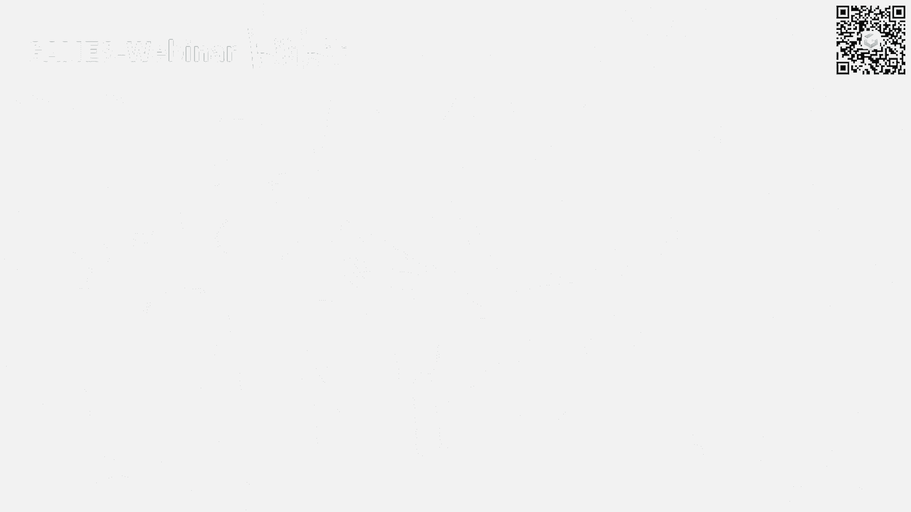
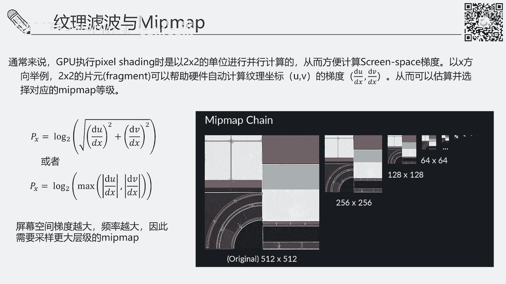
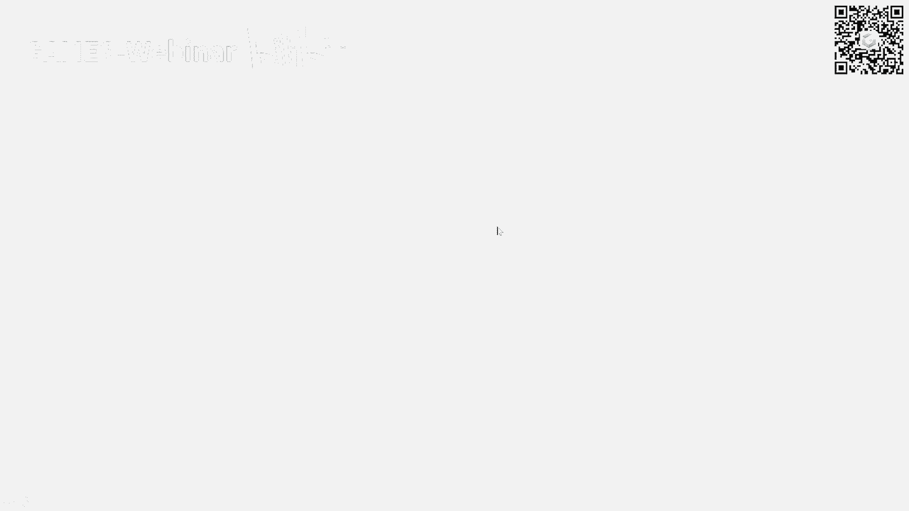

# GAMES106-现代图形绘制流水线原理与实践 - P10：纹理生成与压缩 🎨

在本节课中，我们将要学习纹理在计算机图形学中的核心作用，探讨如何生成纹理，并深入了解在实时渲染管线中高效使用和压缩纹理的关键技术。

## 什么是纹理？ 📖

上一节我们介绍了课程概述，本节中我们来看看纹理的基本定义。纹理是计算机图形学中一个非常常见的单元。

在整个渲染流水线中，纹理通常与材质联系在一起。如果一个场景只有几何建模而没有纹理，那么渲染出来的结果就没有颜色，甚至无法被渲染。纹理或材质定义了几何物体如何与光进行交互，在整个渲染过程中是不可或缺的。

从更细节的程序角度定义，纹理通常被表达为一个多维的固定数组，例如一维、二维或三维数组。数组中可以储存不同类型的元素，如浮点数或整数。它本质上是一个固定的多维数组。除了表达材质，纹理还可以表达深度信息或帧缓存等数据。本节课我们主要围绕材质的表达来展开，因为这是纹理最主要的应用领域。

在图形学渲染中，几何和材质都是渲染出真实感图像的关键组成部分。材质在数学上一般定义为**双向反射分布函数**。如果同学们学过图形学基础课程，对此应该不陌生。它是渲染方程中的一个核心组成部分。

渲染方程定义了一束光如何与一个不透明的几何表面进行交互。要计算某点的出射光，需要对所有入射光进行积分。而**双向反射分布函数**就定义了入射光的反射率。通常它是一个**4维函数**。这是因为反射率必须由入射方向和出射方向共同定义，每个方向可以在球面坐标系中用两个角度参数化，因此一共是四个维度。

然而，真实世界中的物体通常由多种材质组成，例如一面墙会因为风化腐蚀，各点的材质都有所变化。为了描述材质的空间变化，我们需要引入新的变量 **x**，它定义了材质在空间上的分布。对于每个空间点 **x**，都有一个对应的**双向反射分布函数**。因此，我们可以定义**空间变化的双向反射分布函数**。由于加入了空间分量 **x**，这个函数可以看作一个**6维函数**。

无论是4维还是6维，这样的函数维度都非常高。要描述这样的函数，通常需要一个巨大的查找表来储存，例如一个4维或6维的数组。这种表达方式在实时渲染或真实感渲染中很少直接使用，因为一方面难以表达，另一方面精确测量的代价很大。

因此，在实时渲染中，通常不会直接使用高维的**双向反射分布函数**，而是使用解析模型去逼近它。例如大家熟悉的冯模型，就是一种通过直觉建立的简单解析函数。

解析函数的优点在于，它将原本的4维函数降维到了几乎零维。原来的**双向反射分布函数**需要精确记录每个入射和出射方向的关系，而解析函数只需要储存几个有限的参数。例如冯模型可能只需要储存一个光泽度参数。因此，它的维度从一个四维降到了零维，几乎不需要任何储存空间。

在现代渲染中，最经典的**基于物理的渲染**工作流也是由这种解析模型构成的。一个常见的**双向反射分布函数**通常由两部分组成：漫反射分量和镜面反射分量。镜面反射分量通常可以用一个微表面模型来描述，例如经典的**GGX**法线分布函数。完整的模型可能包含**D**、**F**、**G**三项。

使用这样的解析函数，我们可以将维度极大地降低。定义一种材质可能只需要几个值，例如基础色、金属度、法线方向和粗糙度。这样，我们就把一个4维函数降到了零维，仅通过有限的变量就能表达一种材质。

因此，表达**空间变化的双向反射分布函数**也变得非常简单。我们可以把一个6维的**空间变化的双向反射分布函数**，降低成一个二维的纹理。我们看到的许多纹理表达，本质上都可以理解为**空间变化的双向反射分布函数**的表达。它会将基础色、金属度、法线方向和粗糙度等值用一张2D图储存起来。每一张2D图就是一张2D纹理。

因此，一个6维的**空间变化的双向反射分布函数**就被降维成了一个二维的多通道纹理。一般来说，一个用纹理表达的**基于物理的渲染**材质可能包含各种各样的纹理图。

以下是几种常见的纹理图类型：
*   **基础色图**：定义表面的基本颜色。
*   **法线图**：通过RGB颜色编码表面法线的微小变化，模拟凹凸细节。
*   **粗糙度图**：定义表面不同区域的粗糙程度。
*   **金属度图**：定义表面不同区域的金属属性。
*   **高度图**：以灰度值表示表面的高度信息。
*   **环境光遮蔽图**：预计算的环境光遮蔽信息。
*   **各向异性图**：定义表面各向异性的属性。
*   **透明度图**：定义表面的透明区域。

这些多通道纹理共同表达了一个**基于物理的渲染**材质。比起传统的**空间变化的双向反射分布函数**表达，用纹理表达材质更加紧凑。因此，纹理被广泛地应用于实时渲染中。

## 纹理是如何生成的？ 🛠️

上一节我们介绍了纹理的基本概念及其与材质的关系，本节中我们来看看纹理是如何生成的。纹理的生成方法是多种多样的。

我们刚才看到，很多纹理是2D图像。从图形学发展初期开始，如果不考虑风格化渲染，我们最初的目标就是真实感渲染。因此，我们需要纹理和材质表达能够更好地模拟真实世界的物体。最直接获得纹理材质图的方法就是用相机或手机拍照。

在传统方法中，我们可以把拍到的照片通过某种方法转化为纹理图。一个非常简单的方法是拍摄一个平面的局部照片，例如砖墙、地面或皮肤，然后通过处理将其转化为可用的材质图。例如，基础色图实际上是将一张可能包含光照信息的RGB图片，转化为只保留物体原本颜色的图片。本质上，这可能是一个将RGB图片转化为多通道图的过程。你也可以理解为使用不同的滤镜生成不同的图，例如法线图滤镜。

在最初，艺术家可能使用Photoshop等软件手动处理。但这种方法得到的结果可能不是完全基于物理的，即不是非常精确地按照物理规律重建出真实的纹理。在大多数工业界渲染场景中，需求通常是“视觉上合理”，而不是要求与物理测量完全一致。因为要精确还原材质，需要知道拍照时的光照、位置等信息，这非常困难。

因此，纹理生成通常是通过图片转换，但这个过程非常讲究技巧。将纹理贴到几何体上时，还需要考虑各种因素。于是，各种算法应运而生，帮助艺术家生成材质纹理。

如果你对计算机图形学研究有所了解，会知道最早的算法之一是纹理合成。问题在于，当你只能拍到一个物体局部的小块纹理时，如何生成更大的纹理图像？例如，你只拍到一面有裂缝的墙的局部，如何生成一整面墙的纹理？这就是经典的纹理合成算法。

需要注意的是，纹理合成与超分辨率重建有本质区别。纹理合成不改变纹理的物理尺度。我们不是将一个小块纹理放大，而是希望在不改变其尺度的情况下，生成更多相似的纹理块。例如，我们拍了一块地砖，希望在地面上铺满十块这样的砖，而不是把一块砖放大十倍贴上去。

纹理合成算法的一个明显缺点是，很多算法并不完美，可能存在肉眼可见的瑕疵。此外，整体分辨率通常偏低。早期的研究通常在512x512左右的分辨率下进行，但对于现代游戏或电影设计，通常需要至少1K、2K甚至4K、8K的高分辨率材质。将传统纹理合成算法应用到高分辨率时，运行速度会变得非常慢。

为了克服这些问题，现在很多材质设计采用了过程式纹理生成。过程式纹理是通过程序计算生成的纹理。大家可能知道一些简单的过程式纹理，例如棋盘格或柏林噪声。但在工业界中，常用的是通过节点图的方法生成纹理，例如Blender中的**Shader Editor**或**Geometry Nodes**。

这种方法通过一段程序（节点图）计算出复杂的图案。我们可以从一些基础噪声开始，通过混合、调色、调整图案分布等操作，最终组合成一张看起来非常真实的图像，但它是过程式生成的。

以下是过程式纹理的主要优点：
*   **极强的可编辑性**：节点图中的每个参数都是可编辑的，可以轻松调整纹理的尺度、颜色、脏旧程度等。
*   **理论上无限的分辨率**：纹理是计算出来的，分辨率只是一个参数，可以设为任意值，如8K。
*   **无限尺度的细节**：可以支持非常精细的细节。
*   **交互式设计**：在优化的节点图系统中，可以实时编辑参数并查看渲染反馈。

然而，过程式纹理最大的缺点是设计困难。从网上搜索或拍照获得素材相对容易，但设计一个复杂的节点图需要专业背景和经验。像Adobe Substance这样的软件套件支持过程式纹理生成，其笔刷工具本质上也是过程式的，允许用户在几何模型上程序化地绘制纹理，简化了设计流程。但总体来说，设计过程式纹理依然具有挑战性。

因此，大量研究致力于简化操作，例如从真实世界拍照或上网搜索材质，然后快速生成高清材质。随着深度学习的兴起，出现了新的可能性。例如，能否直接用手机拍摄物体，然后使用深度学习方法学习其物理属性，从而生成正确的材质图？这样在渲染系统中重新渲染时，结果会与真实照片非常相似。

此外，将平面纹理贴到复杂几何体上也很复杂。现在有很多工作直接进行几何和纹理的联合重建，例如利用微分渲染或神经辐射场等技术。

还有一些工作研究如何更好地对纹理进行编辑。过程式纹理的优势在于可以通过调参进行编辑，而对于一张普通的贴图，传统方法可能只能通过Photoshop进行逐像素编辑，效率低下。因此，研究者探索基于样例或文本的方法进行纹理编辑。

近年来，随着扩散模型等生成式AI的出现，整个纹理生成的工作流程发生了巨大变化。例如，艺术家可以先用手机拍照，裁剪出几个小块，拼合成更大的纹理。但这样合成的纹理可能存在接缝。使用扩散模型进行生成后，可以无缝地处理这些接缝，然后再通过材质图转化工具生成**基于物理的渲染**材质图。

在AI时代，甚至不需要从真实世界获取纹理。完全可以通过文本描述，利用扩散模型生成大量变化的纹理，然后从中挑选。结合ControlNet等技术，可以获得各种2D平面纹理。现在还有许多研究致力于直接生成3D物体的纹理。

最后，回到过程式纹理。过程式纹理本质上是一段程序，节点图就是由小函数连接而成的程序。考虑到现在Transformer架构在程序合成方面的强大能力，直接生成表达过程式纹理的程序也成为可能。从去年开始，已经有一些研究工作利用GPT或Transformer架构生成程序，来表达程序式纹理。因此，在AI时代，纹理生成的可能性非常广阔。

## 纹理的使用与压缩 💾

上一节我们探讨了纹理的各种生成方法，本节中我们来看看生成纹理后，如何在实时渲染管线中正确使用和高效压缩纹理。

纹理的使用看似简单，因为纹理是一个非常基础的单元，在渲染管线中大量的纹理操作通常已经被硬件或API集成。但如何“正确”使用纹理，实际上有更深层的考虑。

从理论角度来说，纹理用于逼近自然界中连续的材质信号。我们拍照得到的纹理，是对自然界连续信号的离散化采样。访问纹理，实际上是对这个离散化信号的重建，目的是重建出原始的连续信号。因此，我们访问纹理时，通常需要访问0到1之间的小数坐标，并进行插值。

一个很重要的问题是采样频率。如果采样频率不足，会产生走样问题。例如，当远处的纹理像素在屏幕空间分布非常密集时，表示该处的信号频率非常高。如果只是简单地使用最近邻点采样，会产生走样的锯齿状图案。

因此，我们通常需要进行滤波。滤波可以预消除高频信号，使结果看起来更平滑。例如，使用双线性滤波后，远处虽然会变模糊，但不会产生奇怪的锯齿图案。为了对抗锯齿，我们需要抗锯齿或反走样技术。

在实时渲染中，一个核心思想是：很多东西如果能预处理，就尽量预处理，以提升运行时速度。纹理通常与几何绑定，且在运行时不会改变。因此，我们可以对纹理进行预处理。

一个关键的预处理技术是生成**Mipmap**。**Mipmap**的本质就是预滤波。我们使用滤波器对原始纹理进行滤波，生成一系列分辨率逐级减半的图片。**Mipmap 0**是原图，**Mipmap 1**是长宽各减半的图，以此类推，直到最小如1x1的图。

在采样时，我们可以根据需要在不同层级的**Mipmap**上进行采样。例如，当信号频率高（如远处）时，就采样更高层级的**Mipmap**，因为那层已经滤除了高频信号，看起来会更平滑。虽然**Mipmap**比起后面要讲的各向异性滤波，在斜面上仍有模糊现象，但它能有效避免远处出现大量锯齿。

**Mipmap**的生成通常由API自动完成，但要求纹理的维度是2的幂次方，因为每次长宽都减半。**Mipmap**需要额外的储存空间，大约占原始纹理的1/3。考虑到它带来的质量提升，这额外的空间通常是值得的。

那么，如何决定采样哪一层**Mipmap**呢？核心思想是：纹理在屏幕空间上变化越剧烈（频率越高），就需要采样更高层级的**Mipmap**。

在GPU管线中，执行像素着色时是以2x2的像素块为单位并行计算的。这方便硬件计算屏幕空间梯度。我们可以得到纹理坐标在屏幕x和y方向上的梯度。通过一个经验公式，可以根据这些梯度的大小估算出应该采样的**Mipmap**层级。梯度越大，说明纹理坐标在屏幕空间变化越剧烈，频率越高，因此需要采样更高层级的**Mipmap**。这种方法在视觉上是合理的。

但是，**Mipmap**存在一个问题：它假设滤波区域在纹理空间是圆形的（或正方形的）。然而，当表面倾斜时，屏幕空间的一个像素可能对应纹理空间的一个椭圆形区域。如果直接用**Mipmap**进行各向同性滤波，在斜面上会导致过度模糊。

因此，我们需要一种更好的采样方法：**各向异性滤波**。各向异性滤波考虑了屏幕空间与纹理空间的这种差异。它的思路是，采样时遵循一个椭圆形的区域，而不是圆形。这样，在斜面上也能得到更清晰的结果。

各向异性滤波通常需要实时采样纹理坐标周围不同数量的采样点。采样点越多，重建的信号越精准，结果越清晰，但计算代价也越高。从最近邻采样，到2个、4个、8个采样点，质量会逐步提升。

接下来讨论纹理压缩。我们之前提到，现代渲染需要高清材质，例如4K纹理。一张未压缩的4K RGB纹理（每通道8位）需要占用约48MB内存。加上**Mipmap**，可能需要约64MB。如果是HDR贴图（浮点数格式），占用空间更大。一个完整的**基于物理的渲染**材质包含多张贴图，如果不压缩，GPU显存将不堪重负。

因此，我们需要尽可能压缩纹理。虽然纹理在硬盘上通常以JPEG、PNG等格式储存，但这些通用图像压缩算法不一定适合在GPU中使用。

纹理有一个非常重要的特性：它需要在GPU中被快速、随机地单点访问。像素着色器是并行执行的，我们需要一个查询：输入UV坐标，快速返回纹理值。

因此，一个适合GPU的纹理压缩算法需要具备以下特性：
*   **解码速度极快**：纹理查询非常频繁，解码必须高效。
*   **支持随机访问**：解码一个像素时，最好只依赖其局部周围的数据，而不需要访问很远的数据。
*   **可变压缩比**：为了适应不同平台（如桌面端大显存和移动端小显存），需要能提供不同的压缩质量。

传统的JPEG、PNG或基于小波变换的压缩算法很难满足这些要求。因此，我们需要专门的纹理压缩算法。

纹理压缩算法通常基于块。它的一个巨大优势是访问的局部性：解压一个像素时，只需要访问其所属的数据块。常见的算法家族有**BC**、**ASTC**、**ETC2**等。

它们的基本思想是将图像分成多个像素块（如4x4），然后将每个块压缩为一个固定长度的数据。例如，**ASTC**算法可以将不同数量的像素块压缩为128比特，从而达到不同的压缩比。比特率越高，图像越清晰。

以**BC1**格式为例，它用于压缩一个4x4的RGB数据块。原始数据占用48字节。**BC1**将其压缩为：两个16位的代表色（共4字节），加上16个2位的索引（共4字节），总计8字节，达到了6:1的压缩比。解码时，根据索引值，在两个代表色或其混合色中选择一个，操作非常简单快速。

除了**BC**家族，还有**ASTC**、**ETC2**等多种编码。问题在于，为了部署到不同平台，我们可能需要为同一张纹理准备多种压缩格式的副本。为了解决这个问题，出现了像**Basis Universal**这样的通用纹理交换系统。它可以生成一种中间压缩数据，并能快速转码为其他压缩类型，从而避免储存多个副本，节省存储空间。

最后，我们思考一个理论上的极限压缩。回想我们之前提到的解析材质模型，它将一个4维的**双向反射分布函数**压缩到了零维（几个参数）。那么，一个2D纹理能否也压缩到零维呢？理论上是可以的，那就是过程式纹理。过程式纹理只需要储存几个参数或一段程序，储存开销几乎为零。

那么，为什么实时渲染中不直接大量使用过程式纹理，而是先烘焙成纹理贴图再使用呢？原因在于纹理使用的核心要求：

1.  **无法高效预滤波**：过程式纹理每个点都是实时计算的，难以像位图那样预先生成**Mipmap**。实时进行滤波计算代价很高。
2.  **难以进行快速点查询**：过程式纹理的求值可能依赖于全局计算，无法做到仅根据UV坐标就快速返回单个像素值。为了得到一个像素的值，可能需要计算整个纹理，这违背了纹理压缩的初衷。
3.  **复杂过程式纹理求值慢**：对于复杂的节点图，实时求值可能很慢，难以满足游戏高帧率的要求。

因此，尽管过程式纹理在储存上优势巨大，但由于解码困难、无法快速点查询、难以预滤波等缺点，使其难以在实时渲染中直接使用。当然，也有一些研究尝试克服部分问题，例如尝试推导某些过程式纹理滤波的解析形式，或用神经网络逼近滤波过程，但泛化性不强。

## 课程总结 📝

本节课我们一起学习了纹理在图形学中的核心知识。

首先，我们明确了纹理的定义，并重点探讨了纹理与材质之间的关系。纹理是表达材质空间变化的重要工具。

其次，我们深入探讨了纹理的生成。获取纹理的方法多种多样，包括从照片转换、设计过程式纹理，以及利用现代AI工具如扩散模型进行生成。

最后，我们学习了纹理的使用和压缩。在实时渲染管线中使用纹理时，需要考虑滤波和频率问题，因此引入了**Mipmap**和各向异性滤波等技术。为了高效利用GPU显存，纹理必须进行