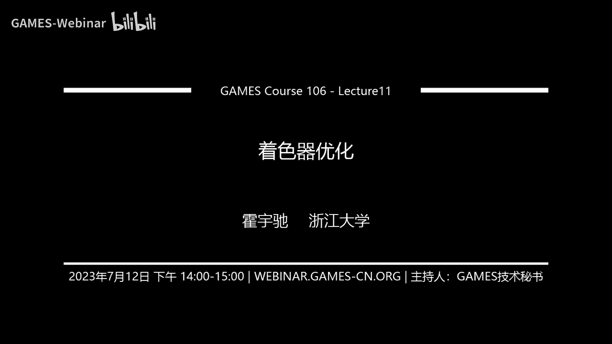
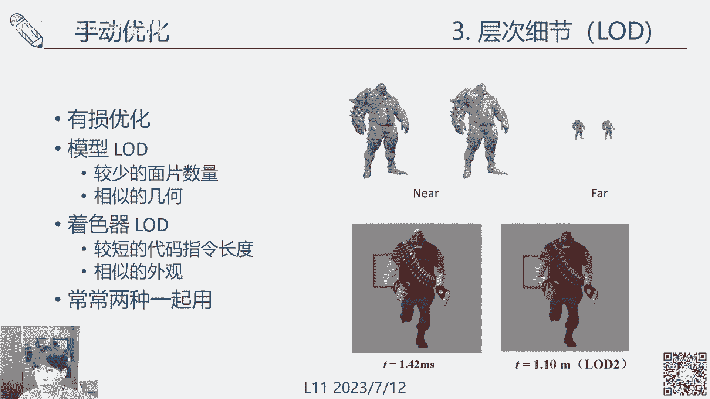
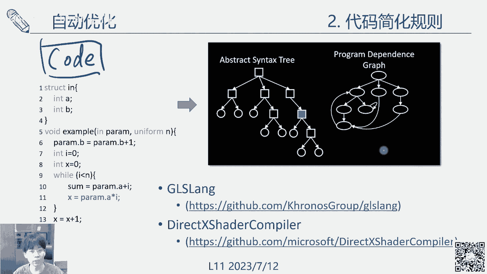
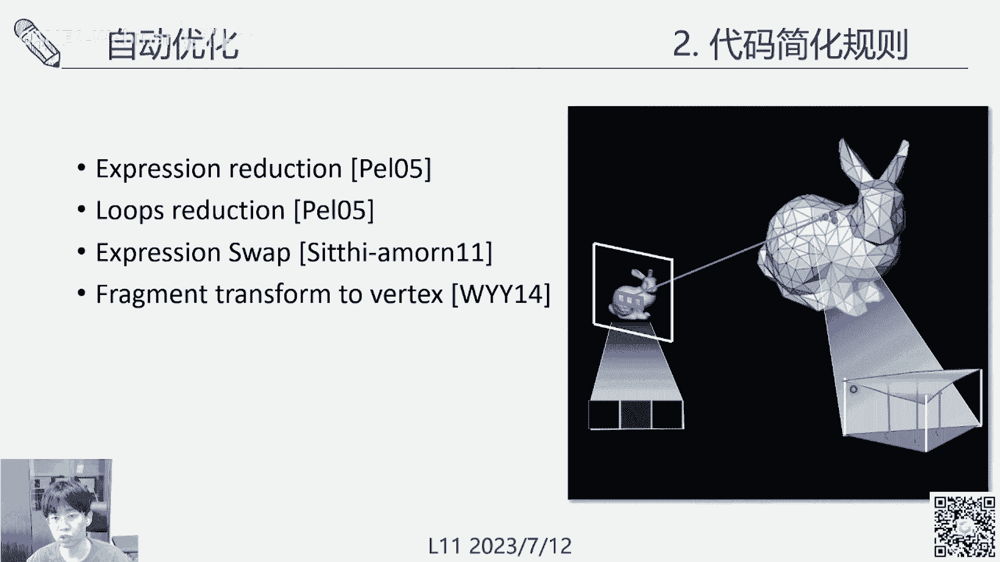

# GAMES106-现代图形绘制流水线原理与实践 - P11：11. 着色器优化 - GAMES-Webinar - BV1Uo4y1J7ie

这里面去做嗯，所以啊我们今天讲的这个水准优化，主次机优化，其实是更多的是偏向一些代码优化的一些东西。

第一个说到这个优化吧，它单是有两种优化方法，一个是手动优化，一个是自动优化，我们先讲一下这个字啊。

这这块的话呃，在这个，一个是首先是动机，为什么要做一个缺点优化，这个是由这个SHADER本身的一些性质引起的，像今天的话一些3A游戏啊，一些大的游戏里面，这个虚的其实是越来越复杂的，像这种啊。

这是一个SHADER给他的一个material Buff，可以看到中间的节点非常多，要去取不同的材质，不同的呃一些转移，最后面全部拼起来，那他把他这些一长串的一个逻辑，展开成一个代码之后。

其实一个SHADER代码就变得非常的巨大，这个庞大的代码里面要去运行这个每像素，去运行这个庞大的代码，会造成一个非常大的危害，所以我们只能算是加速这个的计算，就是啊加速游戏的一个整个绘制的核。

心的一个核心，另外呢啊因为这个fragment追的，特别是现在那些第2trading这些，他是要每个像素去执行一次，那我们的各种设备，从当时的IPHONE960640，然后到今天的一群pro。

这个分辨率其实已经涨了不止十倍了，并且它的刷新率也在不停的涨啊，从最开始的30HZ，60hz，然后到这个一生pro是需要90HZ，那甚至有一些啊，像那个奥克斯，这些都是放120HZ去设置的。

那在这么高的分辨率，还有这么高的刷新率下，怎么样去做作，那这个问题，那做这个水准的优化呢啊有几种方法手动优化，首先啊一种是在B阶段去做它的优化，就我们下地方啊给他这个图是一个追随example。

左边是原始，我们写个，右边是编辑编译出来的一些中心代码啊，一些汇编代码可以看到，其实呃一段很短的一个编辑器，一个三个圆点的，或者是那个CD加代码，最后编译出来的是一个非常长的一些指令串。

然后在没串的时候呢，实际上这个冰淇我对这个一些优化给做掉了，这就是编译阶段的一些优化，比如说像这个左边两个coding哦，在这边加了一个，当你的啊一个赋值，然后最后面这两份代码编译出来的。

其实是同样的一个指令集，像这种东西，这个编译器已经帮我们给搞定了，然后T还，大概是有这几大类啊，主要是在一些常量，还有一些变量上面去做一些优化，首先第一个是常量的传播啊，像这种我们一个值X等于一啊。

然后最后面就是它X，如果这个编译器，可以检测到这两个东西的相关性，它可以直接帮我们把这个变量的赋值给拿掉了，然后像一些第二种是常用的折叠，像X等于XY，这两个东西，其实是同样去给到了一个Z做一个赋值。

第一期如果可以检测到这个相关的一些关联性，那他同样可以去做这个啊，一些中间变量的一些折叠或删减，就是他可以做的复写传播，这些传播主要是指一些呃，A复制到B啊，XY先把X赋值。

然后X传播到YY传播到一个return，那这个东西有一个渐进式的传播过程，如果编译器可以检测到这个过程的话，也可以同样把它给消除掉，然后一些公共体表的消除，这种的话是其实是啊一些更高阶的编辑优化了。

就是说他可能会检测到某一些关关系式，它是可以互相替代的，这样是X加Y和Y加X，其实都可以用一个tempt去表达这个关系式，包括这个乘以2×6，他也可以做一些算式上的一些符合，那最后面就会把这个。

这里其实应该是个TP乘以八，这个东西有一个小小的，比如到时候我会改掉，所以这个下面是Z等于time乘以八，然后直接return z，就把这个复杂的一些OP给节省掉了，还有一些是无用代码的消除。

这个我们刚才其实讲过了，就是一些当米扣的这个X值完全没有变化的，那呃可能这个编译器直接帮我们省略掉了，就是比较容易检测到的，还有一些方法的内联或者内啊啊，常见的就是一些cg function。

如果说我们去显示的，去把这个SUBFUNCTION去定义成1line的话，那些内联函数的话，他会直接帮我们把这个sub，function给替换成一件代码啊，最后去放到这个，一听有问题的话。

中间然后呢呃非常复杂的变形的话，那就不去打开了，但是要提一下这个B使用的编辑器，还有我们使用的，而且他的不一定是稳定啊，他有时候会不会有时候不管，养成良好的代码习惯，然后除了编剧的话呢。

我们真正可以人为操作的人为控制的，更多是在这个执行阶段的一个优化，其实现在优化呢，这个我们主要还是讨论一些手动的优化了，既可以优化代码，就是说你可能会把一些复杂的操作简化掉，能把一些啊路啊。

一些循环啊什么的给干掉，这个是代码级的优化还是算法级的优化，算法级的优化呢，更多是去体现在这个用不同的算法去实现，同一个事情，在一些复杂度上的优化，然后这个一些资深程序员可能会很严重。

在这个过程就是更体现你们马力的时候，然后呃关于图像嘛，质量就是说我们去优化一段代码之后呢，大部分情况下呢，它是如果说我们做这个coding优化的话，其实我们的目标是做一个无损的优化。

就是说我们修改这个代码可分的提升了，但是我的性能不需要它不要下降，但是呢有时候也是会有损的，就是我们用一些近似算法，像一些啊，用一些texture去替代一些计算等等，这个怎么样去做这个图像。

就是说我们做一些近似之后，它会损失多少的质量，这个时候通常是一些资深的程序员呢，它其实可以直接去分析出来啊，比如说在一些DEBUTE场景啊，或者一些光的远近，他可以去判断这个事情啊。

当然最后最不济的话呢，还可以去run1些真正的把这个设计的一下，去哪看的，matrix是测，这些都是去评判他的一些优化质量的视频，然后的话最后的话是这个接触性能分析工具，这个东西。

我们前后期的其实各种各样的工具，然后哪些是AI啊，IO瓶颈，哪些是迭代的瓶颈，这些东西其实大家呃，要可以去通过这些分析工具找出来，去做一些优化呃，但是在做出优化的时候呢，其实通常是跟那个硬件高度相关的。

我们必须是知道这个GPU，还有几集的注射器体积的缓冲啊，然后这些每集的啊存储缓冲之间的他一个代价，比如像一些需要的memory是在一个log rather block。

this thread还是可共享的，然后eglobal memory是画block，但是它的速度比较慢啊，然后如果要去读些啊CPU上的一些数据，那就是特别慢的，这些都是大家心里在做的事情的时候需要有数。

这边的话有几个做手动优化的，是一个简单的一些基本准则吧，就是说要去清晰，这个是代码所能造成的一些它所消耗的计算器，比如说像这个我最先是那个MD的dog panzer，给出的一个东西吧，然后他这个V啊。

GP2就是就是这个向量积存T的一个啊，容量最好呢，这个寄存器是少用能少用，但是如果用的话，那就不要超出他的上限啊，它会动态的在做进行，变到了一个编译器代码之后，他会去动态的显示每一行。

它所产生的这个寄存器的消耗，这些是可以看到的，然后一些共享内存啊，LDSS还有shared memory，这些东西其实都可以可以通过一些profile里拿出来，像IBS学院MARY那些啊。

就是更慢一些的一些缓冲了，然后如果这些东西都抄出来的话，最后还会去拿一些嗯显存那些2G显存什么的，直接做QUINARY去造那些临时寄存啊，做一些寄存器来使用，但这种这种东西应该是尽量的去避免。

然后第二个比较重要的准则是减少一些IO，像一些内存IO，一些内核显存，还有寄存器的一些相关的读解，能尽量的减少，尤其是CPU啊，内存到显存的路线，这个是非常要啊，注意到第二个就是一些东西的避免一些空档。

有现在的话他们是优化过的一些，如果老版本的话，还有一些，特别是不是对SA的一些硬件上面有注意，这个读写的话，它是有序读写的，就是说啊简单的一个规则，就是说一个相邻的thread，相邻的那个pixel。

他如果是在一个block，你去读那个memory的时候读显存，还有读内存的时候，音量是一整块一整块来读，如果是交叉轴，它中间有一个pride，已经是非常细节的东西了。

一般是要拼到128给DESTRIDE，然后的话也可以去教较好的读出来，如果是一种完全随机的读写，这个基本上会把你这个整个程序卡崩掉，这些需要注意，然后一些减少代码循环啊，包括一些代码的分支。

if else这些东西尽量能少用就少用了，然后复杂OP在cos这些东西，其实都是用一些特殊的一些指令集啊，它一些特殊的啊计计算单元去实现的，这并不能够用那种简单的LLU去做，所以这种事尽量避免。

如果要用的话呢，呃在绘制里面其实有很多近似的，是可以像sn cos这种数值算法，其实都有一些近似的，就是用查表，简单来讲，它就是会把一个常用的一个数值范围取一，先做好了啊。

这些你可以直接去找这些简化方向，就直接用个卡插板的方式拿出来它的一个结果，这个也可以，如果不需要非常高的精度的时候啊，这些都是足够的，然后去网上的话就是一些啊更一些一些tips，做优化的时候可以常用的。

比如说是常用的一些策略上，其实把这些T移到这个顶点着色器里面去，这个其实在后面会有一个更进一步的展开，因为在那个我们说到在这个fragmentation of pixel，所里面去。

它是要图像素去做一个计算的，那像这个球啊，你可以看到它顶点数量，其实就会比这个像素的数量低了很多，那如果是说在顶点上去做一个图层，上做一个计算，然后把这个颜色传到这个FRAGMENTOR。

是这就可以做很大的一个计算啊，讲话像这个ground lighting，左边给的图是，其实ground lighting就是直接顶点计算颜色，另外还有一些像UV坐标变换的新的坐标计算，有些天赋球变化。

还有物质赛这些啊，不是这么高频的东西呢，其实都可以去移到指定的注射器上面去，对这个画质其实不会产生太大的影响，然后呢第二个TT就是说啊用一些预计算，其实也是查表，就是一些复杂的预计算，可以啊。

复杂的计算可以提前算出来，然后存储下来，像这些一些noise noise啊，啊这些noise如果是要去啊，用一个数值方法去计算，其实很耗时，那一个简单的方法，就是我直接把这些东西生存好。

然后我直接啊只做一个UV的一个采样，uniform采样，我就可以直接在上面去得到一个，比较好的一些noise啊，这个在在simple的时候其实很重要，然后还有一些是像这种复杂的NBACLUSION。

nba pollution的话，由于他这个是你可以认为它就是一个自遮挡嘛，就是个模型自身相关性比较大，所以也可以认为是接近静态的东西，可以先预计算下来，那就不用在实施的时候去做采样。

还有在一些夸张点的话，那就是说一些，其实整个trading的结果都可以预计算，然后去烘培下来，作为一张纹理，这个主要一般是用在一些背景上面，还有一些啊静态光源上面，这样整个场景房间。

如果说我们只需要做一个纹理的读取，然后直接把颜色给出来，那计算量就相当低了，另外呢还有一个措施的，刚好读刚才那个用保存数算是反过来的，有时候是我们需要去用计算机保存的，比如像这个PBR模型啊。

呃有时候是需要去用这个propane和NDOTV，去采样一个LET纹理，然后这样子的话会多一个多一次保存，但是反过来呢，就是说嗯，其实也可以用一些算式的方式去数值函数，去逼近这个东西啊，就像右边这样。

这些就可以直接计算出这个呃卡table看情况，如果是说我们需要减小计算，然后这个访存带宽还比较宽裕的话，其实可以反过来就是比较灵活的事情，还有一些，常数代替一些地方，但是对正确的说法。

就是说这个数值给到编译器，会帮你去把它处理掉，提前弄好啊，然后你不要去给太多的这些影视的，如果是这些数值是确定的，不要服太多的这个floating，不要自作多太多的变量，这个东西不好。

然后的话像一些啊派出派half，half pie这种常用的东西，直接把它啊DEFI好不学，不要在月经时候去计算这些啊，刚才这些东西其实跟那个编译器优化，只是游戏相关的编译器嘛，有时候能兑换。

有时候不能优化到，我们还是尽量养成一些良好的代码习惯，另外再下一个就是一些低精度数，像这个编译器里面啊，SHADER里面float half这些都是可以支持的，像高精度的，然后用到这些像HDR。

还有一些UV啊，还有一些数值，你如果确定可控的话，那半精度其实也够啊，那这个系的话像一些要怎样颜色的话，用fix也够了，主要是在一些mobile device上面会比较敏感啊，剩下几个tip。

一个是右键进行标量计算，就是像左边这个地方嘛，是先把这个有两个标量，一个向量，然后向量乘标量，我们先把标量全部乘上来，再乘向量，那最后面的话其实这个只是有一个三个乘法，但是如果反过来。

我们先把一个标量和向量乘上了，展开了就变成一个三维，这会产生一个三个乘法，然后这个地方再乘一次，又会变成三个乘法，这个计算量加倍，所以的话优先去能够合并的，把一些维度比较低的计算合并掉啊。

这个是一个技巧，然后分支分支是需要避免的，因为我们的GPU其实是那个FI啊，MD就是single instruction，Artical data，就是说啊他的指令控制器其实是非常少的。

机动单点比较多啊，是这样的话呢，呃可能是几个reg，32个spread啊，一个直线，一个指令流程，如果16流程里面产生了分支，像这个一等于一啊，叉叉叉这样的话，那就求他。

其实你可以认为它分支里和分之外啊，两个东西它都分别执行了一遍，因为他只有一个指令串去避免这种情况呢，就是用一些啊并行化的一些OP去替代下的if else，像这if x等于等于零。

其实是可以纯粹的去使用一些数值的方法，就是van equal，这个地方你可以看一下啊，这个其实不难理解，就算一个啊，sin x减Y它如果相等的话，那就会反复返回一个零嘛。

所以就可以直接用这种并行的一个东西，去替代掉，做法就是减少一些20的数量，所以从软件工程的角度呢，摔的不成功呢，刚才那个是会更干净，但是你在试用的时候，其实是又要把一些税的合并起来啊。

不能用大税上面去降低他们之间的一些传输啊，减少pass的数量，这种都是一些，然后除了这种啊这技巧的，我们在上上期空气技巧其实是个人的修，为了看大家的修行，那更多的一些常用的。

可以规范化的一些东西是层次细节，OK我看有些问题分享点，这样就可以，意思是说呃LDLD的话一般就是一个原理，基本的原理，近大原材能有更多的模型，它远地方能更稀疏的模型，就是在Mac上。

然后着色器其实也有同样的一个LD，在近的地方我们用一个啊带有比较的一个LD，就是他的代表他们更强和地图更复杂，但是远的地方可以用一个简化掉的，然后D啊一个水准，所以在我们真的好，这个地方应该是max。

你比如说像那个我们更具体一点的话，像非得上做一个层次，细节大概有什么样的呢，一个就是一个方向模型的迭代，比如说这个LD0啊，一二是最就持续可用不同的光照模型啊，去做同一个事情，GGX是最复杂的计算。

最真实的同时也会最慢，然后可以换成独立，从，然后再远一点的话呢，立风的话有一些MICHAEL啊，一些啊主表面散射一些特征，然后再远点就可能用啊一个uniform的一个采样，就只要有一个简单的颜色就做。

甚至是说啊原地方的就用一些一计算的，可computer的一个颜色，这就行了，然后另一种LD的设置呢，就是说把这个我们最终能光大成在哪，拆分成不同的成分，然后去用这个层次。

那个光的成分去做一个LD最近的地方啊，你可以认为是有一个，我们可以把所有的component都加上来，你把这ACULAR也加上，然后稍微远一点呢，SPECULAR可以去掉，只留DEBU，那这种是一种啊。

还有带远一点的地方呢啊，可以把这个intellect这种东西都可以去掉，链接光这些东西都可以拿掉对，然后这个烘培烘培刚才也讲过了，就是把这些颜色提前放到这个啊。

the text the texture里面去，呃，然后的话因为你烘培弹的像一些集合，嗯嗯啊，那你就随着这个集合的LD，自动的去做一个简化了，然后这个新的看try也可以有一些整理的心啊。

他也可以有LD啊，去做这个4。6，接下来，其他的可能更像个工程，投递一些商品进行学术。

在公司上啊，首先是motivation，就是这个手动优化，其实就是我们刚才讲他是一个非常惊艳性的，非常工整的一个东西，你这个程序员要知道怎么去调整那个代码啊，然后要知道怎么修改这个评估。

这个修改或者代码的效果怎么样，这个也要经验，要怎么平衡质量和速度，所以也需要经验，那常常呢就是说不同的FD不停的try不同TT，其实是比较枯燥和比较繁琐的一个过程，那所谓自动的话呢。

就是我们把这个东西全部给自动化啊，要让计算机自动调整这个代码，计算机器自动评估这个代码在调整之后的质量，然后之后去自动去找这个质量和速度的平衡，把这个整个东西都自动化，那他整个框架的是这样的啊。

就是说螺丝器进行优化，那首先我们的input是一个啊SHADER，一个shader code，一个着色器的一个code，然后除了这个code之外呢，我们一般这个它我们需要优化的场景，Mesh。

还有他的一些permuniform gm，像风暴什么东西，其实也是需要作为这个中优化框架的一个输入，因为从原理上来说呢，这个水井扣会产生在它所产生的结果和L，是跟场景和跟那个parameter相关的。

然后这个格射器呢，他会去尝试产生不同的这个啊，优化后的一个代码，这个优化后的代码呢，他要去评估他们的一个质量，像这个啊通常的话会把它顺出来，这个最蠢的一个办法，但是也是一个智能效果最好的一个办法。

然后我们要找他的一个潘尼托前沿，因为不同的视角，你看啊，我们如果画出来一个横坐标是它的一个误差，粽子表示一个时间，那我们要做一个时间和误差的平衡，那肯定是希望是在这个要么就是使用费用。

要么就是这个啊艾尔之中，就是在这个叛逆多线上面，去找我们所需要的LOD，或者是我们选择需要的一些优化的设置，有时候呢你也可以去培训，比如说像我们就是啊项目里面的话，可能会给到一个误差上限。

就是说我们这个误差不能大点的值，那么点到了这个插上线之后，去找这个时间是U的一个点，那或者反过来给定了一个啊时间，大学我们去找这个补差最low的，这就是它实际的一个用法，然后对于不同的这些东西吧。

像这个怎样去优化这个着色，可以产生一些啊它的一些various，然后有各种各样的工作，怎么样去评估它的一些误差啊，嗯更好加速这个帕尼克现在寻找队友，又产生了另外一大类的工作。

我们会后面会简单的去覆盖一下这些事情啊，这里这些东西呢啊，就构成了这两个方面的研究吧，就构成了这个呃，税的减速简化的一个主要的一些研究内容，然后我们再再来开开心一点啊，就是说这是一段文字器代码。

就是给定了一段总是代码自动器简化，就是去替换中其中一个变量一般是真理，其中的啊有可能是变量或者是随机sample吧，其中的变量，然后尝试对这些变量去做一些替换，或者是做一些简化的操作地方。

他如果是就这个bin这个arrival，他尝试去把它简化成，把其中一个FS给拿掉，所以然后呢，当然DPS拿掉了前面这个相关的一个依赖性，这个PS这一行也可以拿掉了，这就是一个产生一个SHAVARI。

这是其中一个规则，然后给到了之后呢，就可以得到这个变种，然后直接把这个变种拿到这个编译出来，最好放在机里面跑一跑啊，然后他的场景里面跑一跑，这个场景里面需要编辑不同的SYMPURATION，不同的材质。

不同的camera去把这个估计一下这个变种的质量，就可以得到一个普通模式啊，当然还要评估一下他的普通门面是直接跑起来，这个东西啊就可以撤了，就是这样，然后下一步的话这个东西要不断迭代。

就是如果simple这个好，那他可能会更尝试的去做其他的简化，还有其搜一个这个再去做简化，他去搜想试法，第二行啊，做一下解放奥数，第二行把这个后面这些地方也去去，再去做一下普通的c cot。

还有更凶的就是不断迭代，那自己最暴力的情况，那可能就是一个直接给一个ambient，作为他的一个输出，这个整个东西去多去评估遍，话说刚才给他可以给他做前面那中间一些细节，就是说怎么样转换代码。

有哪些型号，然后啊怎么找到最优，这个整个一个框架，就是构成了这个我们真正去做的事情，呃，代码简化，首先是呃嗯这个其实也是编辑的东西了，比如说比如说给定一个代码2×7加三，那呃上个编辑的原理的话。

那应该知道就可以生成一个pass to pass pass key啊，然后他等下一个STG都快抽象语法术，这个是更抽象更简洁的一个表达。

在我们真正做的时候呢，是会把这个学的代码用一些glam，或者是一些啊dire compiler这些工具，它可以帮我们自动的去把这个后的风气，养成一个自身法术，然后还有一个是他的一些内地的对其依赖关系。

和这个抽象明白旅顺或者sample的去尿，然后去修改，然后我们再根据这个rap找出来啊，我，有的东西都不需要了，那我们就会把对应的那个code，从这个dependent ground找到，它也是对应的。

上图扣的也是事情，最后去产生一个新的代码啊，然后这个产生的代码呢，一般来说你要去做一下语法检查啊，这个是比较基本的啊，如果不行的话，可以直接丢到水准里面，坦白去做，有条件差，这个都没问题。

然后群体的一些简化规则，最常见的就是啊也是比较有效的一个就是简化，就是表达式简化，像一个normalize，像这个东西，他可能把这个IDIR拿掉，你可以把LDIR拿掉，就不知道就可以产生不同的变种。

我们这个叫自动计算机自动去看嗯，然后第二个是loop production，就是有一些循环啊，可能不清啊，那个比较小的问题就行了，这个主要是放在一些收敛一些，那个迭代算法一些，比如像你找一个什么最优化。

要有个递归最优这种东西的话，其实可以去降低一下它的循环的次数，然后像一些表达式的替换，把这个替换成这个，或者反过来把这个替换成这个，就是NTL替换成N乘H，这也是它的产生的效果是很多的，H是办法。

你表达的是那个一个物体表面的一个normal，这些东西都是有的。

然后一个比较一些效果比较好的，就是这个把一些fragment的piece的一些代码，从一上移到这个TX水的上面去，这个其实我们刚才已经讲到了，在手动优化的时候已经讲到了，就是一些看一下的话。

就是个pad加DC这个这两块，完全这些基层颜色全部都移到这个去了，然后开始追的算出一个演奏，这就是我们最终的它的呃，从你的意义上理解呢，就是他干了一些事情，我算一个三个点的，三个顶点的一个值。

然后啊啊就每一个兵它的一个重心坐标，每个。

这个顶点的value就是不上，然后啊更进一步呢，就是说我们现在因为有些TELLATION嘛，有些绝对比，就是说如果说我们不是移到一个JM去学的啊，不是移到TX水的，我们移到这个啊。

Technation shader，那其实就是可以做一个力度更细的一个，进行逼近了，因为一个原始的三角面片，我现在可以分成很多个分技巧的三角面片，然后我们算这些细小的三角面片，上面的是纸，你可以看离线。

然后还有一种是做这个呃信号以后的话，就是我们呃用一些看看啊，content的一些量去替代掉它原来的一些呃变量，这样子的话如果是一些值啊，比如说某一个变量。

它在这当前的thing configuration上面，它的变化比较smooth变化不大，那他就可以被替换掉，一种常见的就是说比如说一些背景啊，像一些平庸的群是物体，它的背景离我们很远。

那清晰跟方向相关的变量，其实就基本上方向无关了，这些东西有可能最后都被这个能量去改掉，然后再来的话是一个一些高阶的逼近，就说我们用一些desire曲面啊，或者什么去逼近这个函数啊。

就是这个你可以认为就是刚才那个啊，一些进行逼近的一个进化版，像这个用北大船走了之后，可以做一个非线性的一个高阶的一个baking，这些是一些常见的策略，OK呃给到了这些策略之后，简化策略呢。

那我们有了简化策略，有了简化的SHADER，那接下来就是这个大概就可以连起来了啊，首先是把这个SHADER扣放到这个啊，一些编辑器上面去，ST和一些赖数编辑部居然后就去尝试啊，对。

然后再给你整个系统去输入一些，你这个定configuration，Fighting real material，然后去产生大量的啊。

去尝试去搜索这个SHADER的一些arrival和expression，然后去做apply，各种各样的一些表达式进行简化表达式啊，然后去生存新的一个create vari1些变种水的变种。

然后去评估这个水的变种啊，最后再递归表达对产生各种各样的一些呃，LD等于C的，这里面一个核心的问题就是这个喷是非常多的，他可能有上万个，然后我们在产生的变种的时候呢，呃一般不会去盲搜，因为盲搜的话啊。

或者是那个暴力周的话变得太多啊，特别是我们现在的些现代的追的很长，你这个combination太多，所以会用一些啊，genetic program1些拼音算法计算法的话，我们就给你出一。

就是如果一个父节点，它也产生了一个F1个C的，它的质量和error都比较好，我们还有他的数字简单一个小书，希望去听这个shader violent去进一步简化，就是有这么一个嗯父子的关系。

有优秀的trade van产生更多的一个变种，基于他就是这么一个事嗯，具体的话我就不展开了，所以是不是我们学的这里面的内容，然后的话呃展开评估一个变种吧，因为它也很耗时，我要有各种各样的视角。

各种各样的性能啊，有时候呢我们评估的规则也不一样，是如果说我评估一个，简单的评估一个那个颜色的话，还好一个LQ什么的就行了，但有时候是要评估他这个能耗啊，这个东西就会更啰嗦一些。

甚至有时候要比那七八糟的，那么实际使用的时候去确定的，这个没有一个是所谓的一个最优的东西，所以给他这么大的这么一些复杂的评估方法，评估很很拉，然后变种也很多，那怎么加速产生这个优化空间。

就是啊初中优化的一个核心问题和，所以我这地方啊，今天会讲两个核心的一个问题吧，呃觉得比较重要的一个就是，有一个是两个优化的策略，第一个就是用贪心算法去做优化，我们原来的话会说哦。

产生很多那个啊各种各样的东西去填满，这个空间，好一点的话呢，就是说能够想到连这个潘尼托前沿去，他的一些指点点啊，如果当前这个从这个最难用的一个原始的水准，开始去搜一个啊它的一个最优的一个子节点啊。

哪个地方，然后再沿着这个地方用一个餐厅的方法去搜，下一个下一个下一个下来，当然这个地方啊肯定会漏啊，但是它的时间上，只能是说我们可以做一个时间和质量上的B啊，这为琼州的话，他这个是np hard的问题。

所以啊你用弹性去逼近，那肯定会漏，然后他另外一个策略，就是说他不去直接去啊，评估这个着色器的运行时间，那样你就省掉了一些KY的时间，甚至省省掉了一些这个实际浪的时间，他直接根据商业调查数据。

还有一项能力和操作数，然后去做一个加成啊，平均值来估计呃，这也会有产生一些误差，然后的话对于着色器的误差呢，就是它的绘制质量的误差，它啊弄了一个是这个误差缓冲，它就是说做某个啊，比如说某个表达式的简化。

它产生了多少误差，然后他会把这个，操作和误差的值做一个tale推塔，然后去存起来，那下一次在其他shade van的时候，再去碰到同样的一个操作啊，去删减同样一个节点的时候，就可以拿这个缓冲拿来去理存。

去替代表最真实的run嗯，这个就是它的一个基本的能力，然后这是第一个，然后第二个我觉得比较重要的是这个啊，实时的一个FICATION，所以我们知道这个刚才所讨论，那些虚的简化方法呢。

其实都是一些离线的东西啊，那我们在实施的时候，因为我们在游戏过程中啊，是每一帧或者是每一个场景它在时时变化的，那有没有办法去说我们在边变化，再根据在这个游戏运行的过程中，去优化这个税的。

这就是来到这个呃，Real time shader，Runtime，Shader optimization，它的一个核心思路，就是需要去降低它的一个优化空间，在最开始的时候呢，他会给到一个新的代码。

然后去在第四季是谁的rate吗，Sha sha rummliquan ru，去产生一些大量的水的value，那雷神把这个看啊，完了呢，这个裁缝店的话，他就根据这个SHADER之间的一些相似度。

还有它的一些包括一些东西去做CLAVERING，把这个整个空间变得很小啊，然后在每集上呼吸里面的带，那么在RUNTIME的时候呢，呃我们就不去搜索这个东西了，我们直接拿这个呃简化的空间。

还有一些简化掉了一些啊，SHADOTOMMY去做一个匹配啊，在一些比较小的一些空间里面，去找一个最优的一个解，所以呢就可以达到一个实时的一个实时优化，软优化的一个事情，然后第三个呢就是呃我提一下。

就是这个shader transformer，这个是它这个机器学习水等简化与嗯啊，简单来说呢就是说把这个语言模型啊，我们像因为可以你认为这就是一个全封了，现在是做那个资源源处理吧，啊挺牛逼的。

我们就用shader transformer，就用transformer的结构直接去解读这个呃，Shader code，让他们去网络来估计我们这个学者的质量，简单来说就是这个网络大概是这个结构。

它要接受很多很多很多样的东西，一个是嗯一个fat code，然后还有一些我们的场景configuration，然后经过一系列的全form tension，后面才输出一个优化的一个表达。

这个表达呢是可以做自由的一些删减的，就基我们就去黑，他也没说啊，节点打掉之后啊，群加群就可以得到这个简化，后续啊，其实就是把这个呃把这个C的扣的一个编码，然后映射到他的，他的这个想要控制里面的一个嗯。

那句啊就是做这么个事儿啊，这样的话就可以把这个一些计算误差的，一些代码，那些特别是一些观看的时候，那些这封面图加起来，然后的话到了这个是之后呢，我们来看看结果吧，就是说这个数据的到底有多大的能力啊。

就是说像在这些人的模型等等模型，在这些皮啊，皮肤表达模型上面啊，可以达到不同的，然后这个LD上，对应的是第三个节点，然后，快的，然后后面几天应该，啊那个tank我就不考虑了。

这几个点就会取出来做这个LD，然后这是另一个example，就是同样就是就是多目标了，因为它既优化了这个时间与优化，所以他画出来这个很符是一个啊，那没的一个空间，但同样其实在这个空间里面。

也可以去找这个判断图啊，这个是变的，这就可以做多目标的BO，应该是对今天的这个主课就讲了。

