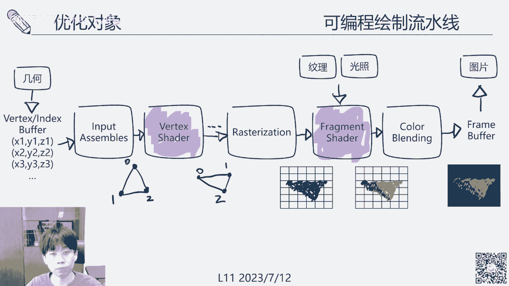
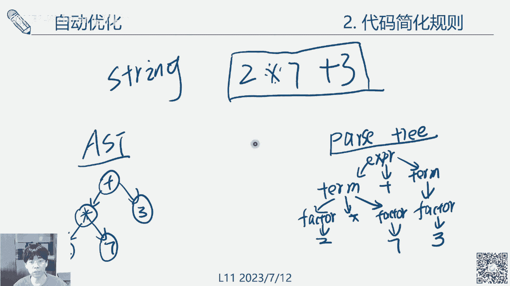
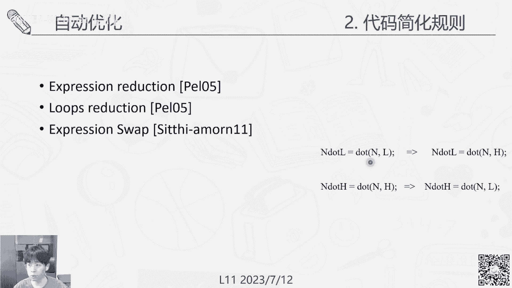

# GAMES106-现代图形绘制流水线原理与实践 - P11：11. 着色器优化 🚀

在本节课中，我们将要学习着色器优化的核心概念、手动与自动优化的方法，以及如何在实际项目中应用这些技巧来提升图形渲染的性能。

## 概述

着色器是现代图形渲染的核心，其性能直接影响游戏的帧率和体验。随着游戏画面越来越复杂，着色器代码也变得异常庞大。在高分辨率和高刷新率的设备上，优化着色器计算变得至关重要。本节课将系统性地介绍着色器优化的动机、手动优化技巧以及前沿的自动优化框架。

## 优化动机与分类

首先，我们来探讨为什么要进行着色器优化。这主要由着色器本身的性质和现代硬件需求决定。如今3A游戏中的着色器逻辑非常复杂，展开后的代码量巨大。这些代码需要在每个像素上执行，而设备的分辨率和刷新率（如从640p 30Hz到4K 120Hz）已增长数十倍，计算压力巨大。因此，优化着色器是加速整个渲染流程的核心。

优化方法主要分为两类：**手动优化**和**自动优化**。我们先从手动优化讲起。

## 手动优化

手动优化依赖于开发者的经验，主要在两个阶段进行：编译阶段和执行阶段。

### 编译阶段优化

编译器在将高级着色器代码（如HLSL/GLSL）转换为底层指令时，会自动进行一系列优化。开发者应养成良好的代码习惯，以利于编译器工作。

以下是编译器常见的优化类型：

*   **常量传播**：如果变量被赋值为常量，编译器会直接使用该常量值，消除变量。
    *   例如：`float x = 1.0; return x;` 会被优化为 `return 1.0;`
*   **常量折叠**：编译器会预先计算常量表达式的结果。
    *   例如：`float z = 2.0 * 4.0;` 会被折叠为 `float z = 8.0;`
*   **复写传播**：检测并消除一连串的赋值传播，减少中间变量。
*   **公共子表达式消除**：识别并重用重复的计算表达式。
    *   例如：`float a = x + y; float b = y + x;` 可能被优化为只计算一次 `x+y`。
*   **无用代码消除**：移除从未被使用或结果恒定的代码。
*   **函数内联**：将小的内联函数调用直接替换为函数体代码，减少调用开销。

需要注意的是，不同编译器的优化能力并不稳定。因此，手动编写清晰、高效的代码是基础。

### 执行阶段优化

这是开发者可以主动控制的主要领域，可分为代码级优化和算法级优化。

*   **代码级优化**：简化复杂操作、消除冗余循环等。
*   **算法级优化**：用不同的、计算复杂度更低的算法实现相同效果。

优化目标通常是**无损优化**，即提升性能而不损失画质。但有时也会采用**有损优化**，例如使用纹理采样替代复杂计算，或使用近似算法。资深开发者能通过分析（如在特定场景下观察）或工具（如帧调试器、性能分析器）来评估质量损失是否可接受。

进行优化时，必须对硬件有深入了解。需要清楚GPU各级存储（如寄存器、共享内存、全局显存）的访问代价。例如，寄存器访问最快，共享内存次之，全局显存较慢，而读取CPU内存的数据则非常慢。

以下是手动优化的一些基本准则：

*   **控制寄存器使用**：尽量少用寄存器，但不要超出硬件上限。超出部分会使用更慢的显存作为临时寄存器，应尽量避免。
*   **减少I/O操作**：尽量减少内存、显存和寄存器之间的读写，特别是避免CPU与GPU之间的频繁数据交换。
*   **避免随机内存访问**：GPU喜欢连续、对齐的内存访问模式。相邻线程（像素）应访问相邻的内存地址，以实现高效的合并访问。完全随机的读写会严重降低性能。
*   **减少分支和循环**：尽量避免复杂的`if-else`分支和循环，因为GPU的SIMD架构可能导致所有分支路径都被执行。可以用数学技巧替代分支，例如用 `step()` 或 `saturate()` 函数。
*   **简化复杂运算**：尽量避免`sin`, `cos`, `pow`, `sqrt`等复杂运算。在精度要求不高时，可以使用查找表或近似公式。
*   **使用低精度数据类型**：在可行的情况下，使用`half`或`fixed`代替`float`，特别是在移动设备上。
*   **优先进行标量计算**：合并低维度的计算，避免不必要的向量展开。
    *   优化前：`float3 result = (a * s1) * s2;` （先进行向量*标量，产生3次乘法，再乘标量，又产生3次乘法）
    *   优化后：`float3 result = a * (s1 * s2);` （先合并标量，只进行1次标量乘法和3次向量乘法）

除了代码技巧，还有一些常用的高级策略：

*   **将计算上移至顶点着色器**：顶点数量通常远少于像素数量。将一些逐像素计算（如简单的漫反射光照、UV变换）移到顶点着色器中进行，然后通过插值传递给片元着色器，可以大幅减少计算量。
*   **使用预计算和烘焙**：将复杂的静态计算结果（如噪声纹理、环境光遮蔽、甚至整个光照结果）预先计算并存储为纹理。在运行时只需简单的纹理采样，计算开销极低。
*   **用计算换采样**：有时情况相反。例如在PBR模型中，可以用数值函数逼近查找纹理的操作，用计算来节省纹理采样的带宽。
*   **使用常量**：给编译器明确的常量，而不是变量，有助于其进行优化。将常用常数（如`PI`）预定义为常量。

### 层次细节（LOD）技术

LOD是工程中规范化的优化手段，其基本原理是“近详远略”。

对于着色器LOD，可以通过以下方式实现：

*   **不同复杂度的光照模型**：近处使用复杂的GGX BRDF模型，中距离使用Blinn-Phong模型，远处则使用简单的朗伯漫反射甚至恒定颜色。
*   **拆分光照成分**：近处包含所有光照成分（漫反射、高光、间接光等），随距离增加逐步移除高光、间接光等成分。
*   **结合几何LOD**：为不同精度的模型网格搭配不同复杂度的着色器。

## 自动优化

手动优化依赖经验，过程繁琐。自动优化旨在将整个过程自动化。

自动优化框架的流程如下：
1.  **输入**：原始着色器代码、场景网格、材质参数等。因为着色器输出与场景和参数相关。
2.  **变种生成**：系统自动应用各种简化规则（如删除指令、替换表达式、计算上移），生成大量优化后的着色器变种。
3.  **质量与性能评估**：在给定场景和参数下，运行并评估每个变种的渲染误差和性能。
4.  **寻找帕累托前沿**：在“误差-时间”的二维空间中，寻找最优的权衡曲线。根据项目需求（如设定最大误差或目标帧时间）在曲线上选择最合适的变种。

这个领域的核心研究围绕两点展开：如何生成有效的变种，以及如何高效地评估并找到最优解。

### 代码简化与变种生成

系统会将着色器代码解析为抽象语法树或依赖图。常见的简化规则包括：
*   **表达式简化**：例如删除`normalize()`操作。
*   **循环简化**：减少迭代次数。
*   **表达式替换**：用数学上近似但更简单的表达式替换原式。
*   **计算上移**：自动识别可将片元着色器中的计算上移至顶点着色器或曲面细分着色器的代码。
*   **常量替换**：用常量替代变化平缓的变量。
*   **高阶逼近**：使用样条曲线等复杂函数逼近原着色器函数。

### 搜索策略与加速

变种空间可能非常庞大，暴力搜索不现实。常用策略包括：
*   **遗传/进化算法**：将变种视为个体，让性能好、误差小的“父代”产生“子代”变种，逐步进化。
*   **贪心算法**：从原始着色器开始，每次选择当前最优的简化操作，逐步推进。虽然可能错过全局最优解，但速度较快。
*   **性能预测模型**：不直接运行着色器，而是通过统计指令数、纹理采样数等来预估性能，加速评估。
*   **误差缓存**：记录每种简化操作带来的典型误差值。当在其他着色器中遇到相同操作时，直接使用缓存值估算，避免重复运行评估。

### 实时着色器优化

上述方法多为离线优化。实时优化旨在游戏运行过程中动态调整着色器。

核心思路是**大幅缩减搜索空间**：
1.  离线阶段，针对大量着色器变种进行聚类分析，将相似的变种归为一类。
2.  运行时，根据当前帧的上下文（如相机位置、物体距离），在一个很小的、预计算好的优化空间（即几个聚类中心）中快速匹配并选择最优的简化着色器，从而实现实时切换。

### 基于机器学习的优化（Shader Transformer）

这是前沿研究方向，将着色器代码视为一种语言，使用Transformer等神经网络模型来处理。
*   模型输入包括原始着色器代码和场景配置。
*   模型经过训练后，可以直接输出优化后的代码表达，或指导如何进行代码简化。
*   这种方法有望学习到更深层次的优化模式，但需要大量的训练数据。

## 总结

本节课我们一起深入学习了着色器优化的各个方面。

我们首先了解了优化的动机：应对复杂着色器和高分辨率、高刷新率带来的性能挑战。接着，我们系统学习了**手动优化**的技巧，包括编译器优化原理、减少I/O、避免分支、使用LOD等实用准则和策略。这些是图形程序员必备的实战经验。

然后，我们探讨了**自动优化**的前沿领域。了解了自动优化框架如何通过生成变种、评估质量、搜索帕累托前沿来替代繁琐的手工优化。我们还介绍了加速搜索的策略、实时优化的思路，以及基于机器学习的Shader Transformer等新兴技术。

优化是性能（时间）与质量（误差）之间的永恒权衡。无论是手动还是自动方法，目的都是在这条权衡曲线上，为我们的项目找到最合适的那个点。掌握这些原理和方法，将帮助你写出更高效、更优雅的图形代码。