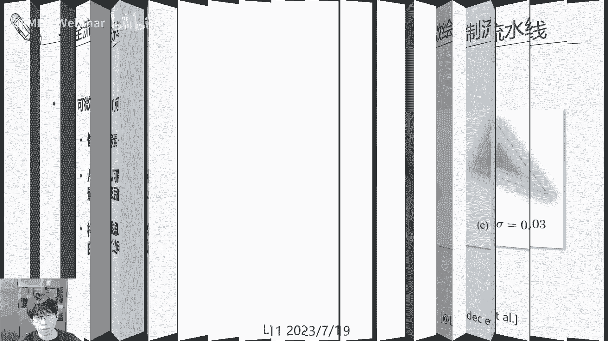

# GAMES106-现代图形绘制流水线原理与实践 - P12：12 流水线LOD技术 🎯

在本节课中，我们将要学习图形绘制流水线中的LOD技术。LOD是“Level of Detail”的缩写，即细节层次技术。它的核心目标是通过简化场景中不同物体的细节，来提升渲染效率，同时尽可能保持视觉质量。我们将探讨LOD的不同类型、实现方法，并深入了解前沿的可微绘制流水线如何用于生成LOD资产。

---

## LOD技术概述与回顾 📚

上一节我们介绍了图形流水线的优化技术。本节中，我们来看看如何将这些技术整合到流水线中，实现整体的加速效果。

LOD技术主要应用于几何、纹理和着色器等各类资产。其核心思想是根据物体与观察者的距离或重要性，动态选择不同复杂度的资产版本进行渲染。

以下是LOD技术的主要分类：
*   **离散LOD**：资产有多个预先生成的、不同细节等级的离散版本。
*   **连续LOD**：资产细节可以连续、平滑地变化。
*   **视角相关LOD**：根据观察方向，对物体的不同部分应用不同的细节等级。
*   **层次结构LOD**：将场景组织成树状结构，根据需要展开或折叠节点。

---

## 离散LOD与切换策略 🔄

离散LOD是最常见的形式。它预先生成多个不同细节层级的模型（如LOD0为最高细节，LOD1、LOD2等依次简化）。其优点是通用性好，但缺点是层级切换时可能产生视觉上的“跳跃”现象。

为了缓解“跳跃”问题，可以采用以下技术：
*   **延迟切换**：不在精确的临界距离切换，而是增加一个缓冲区间。
*   **几何变形**：在两个LOD层级之间进行顶点插值，实现平滑过渡。
*   **透明度混合**：在切换时对两个层级的渲染结果进行Alpha混合。

在渲染时，需要为每个物体动态选择合适的LOD层级。以下是常见的切换准则：
*   **基于距离**：计算物体代表点（如中心点）到摄像机的距离。
*   **基于屏幕投影面积**：计算物体包围球或包围盒在屏幕空间中的投影面积。
*   **基于目标面片数**：为维持稳定帧率，设定场景总面片数预算，并据此为物体分配LOD。

---

## 连续LOD与视角相关LOD 📐

连续LOD通过数学方法（如顶点折叠、边分裂）实现细节的连续变化，完全避免了视觉跳跃，过渡非常自然。它常用于地形渲染。

视角相关LOD则更加智能。它认识到，对于一个物体，并非所有部分都需要同等细节。例如，一个兔子模型，其侧面轮廓需要高细节以保持形状，而正面平坦区域则可以用较少的面片表示。这种方法能更高效地分配计算资源。

---

## 层次结构LOD与地形应用 🗺️

层次结构LOD将场景组织成树（如四叉树、八叉树）。根节点是粗糙表示，子节点包含更精细的细节。渲染时，根据观察条件决定遍历到树的哪一层。这特别适合管理大型场景，如开放世界。

在实际应用中，上述技术常混合使用。地形渲染是LOD技术的经典应用场景。

以下是几种常见的地形LOD技术：
*   **ROAM**：一种实时优化自适应网格算法，它既是连续的，也是视角相关的。它根据地形的起伏程度和与相机的距离，动态细分或合并三角形网格。
*   **Chunked LOD**：将地形分块，每块包含一个层次细节结构。根据块与相机的距离选择细节层级，并在块间使用几何变形来避免接缝处的跳跃。
*   **Clipmaps**：采用环状层次网格，离摄像机近的区域使用密集网格，远的区域使用稀疏网格。实现简单，易于流式加载。
*   **Geometry Clipmaps**：使用四叉树层次结构存储地形细节，能在不同区域实现非均匀的细节密度，有效减少总面片数。

---

## 可微绘制流水线 🤖

前面我们介绍了传统的LOD生成方法。近年来，基于可微绘制流水线来自动优化LOD资产成为了研究热点。

要理解可微绘制，首先需区分正向与逆向绘制：
*   **正向绘制**：输入场景参数（几何、材质、光照、相机），通过渲染管线输出图像。`图像 = 渲染管线(场景参数)`
*   **逆向绘制**：给定图像，反向推断出产生该图像的场景参数。
*   **可微绘制**：将正向渲染管线构建为一个可微函数。这意味着我们可以计算最终图像像素颜色相对于任何输入参数（如顶点位置、纹理颜色）的梯度。

通过可微绘制，我们可以设定一个优化目标（如：在纹理分辨率降低一半的情况下，使渲染结果与原图尽可能相似）。然后，利用梯度下降法，自动调整简化后的资产参数，以最小化目标损失函数。这为生成高质量的LOD资产提供了新的自动化途径。

实现全流水线的可微性，需要打通每一个环节：
1.  **图像损失**：计算简化结果与参考图之间的差异（如L2损失、SSIM）。
2.  **混合层可微**：处理多通道渲染结果的混合（如Alpha混合），梯度可以按权重反向传播。
3.  **着色器可微**：这是核心挑战。着色器代码包含大量不连续操作（如`clip`, `step`）。研究如**AutoDiff**的工作，通过引入平滑的滤波核来处理这些不连续性，使得自动微分能够进行。
4.  **光栅化可微**：将屏幕像素的梯度映射回三角形面片。已有如**Soft Rasterizer**等工作，通过用连续函数近似深度测试（`z-buffer`）中的`min`操作来实现。
5.  **几何可微**：最终，梯度被传递到顶点位置，指导几何形状的优化。

---

## 基于图像的简化技术 🖼️

这是一种极致的LOD技术：直接用一张或多张预处理好的图像来替代复杂的几何体和着色计算。

以下是几种基于图像的简化技术：
*   **广告牌**：用一个始终面向相机的四边形贴图来代表物体。适合远处或本身缺乏立体感的物体（如云、树冠）。
*   **布告板云**：用多个广告牌从不同角度代表一个物体的不同部分，精度更高。
*   **图像缓存**：将远景物体渲染到纹理上，后续直接绘制这些纹理，大幅降低绘制调用。
*   **替身**：预计算物体从多个视角观察到的图像，存储在一张纹理中。实时渲染时，根据当前视角对预计算图像进行采样和插值。这是目前游戏中非常常用的远景简化技术。
*   **纹理深度图**：将一组离散物体的几何信息烘焙到一张带深度的纹理上，再将其三角化成简化的网格，用于替代复杂的远景群。

---

## 总结 🎓

本节课中我们一起学习了图形流水线中的LOD技术。我们从离散LOD、连续LOD等基本概念入手，探讨了它们在地形渲染等场景中的具体应用。接着，我们深入了解了前沿的**可微绘制流水线**，它利用梯度下降自动优化LOD资产，代表了该领域的新方向。最后，我们介绍了极致的**基于图像的简化技术**，如广告牌和替身，这些是游戏中优化远景渲染的实用手段。

掌握这些技术，能够帮助我们在视觉效果和渲染性能之间找到最佳平衡，是开发现代图形应用和游戏的关键能力。