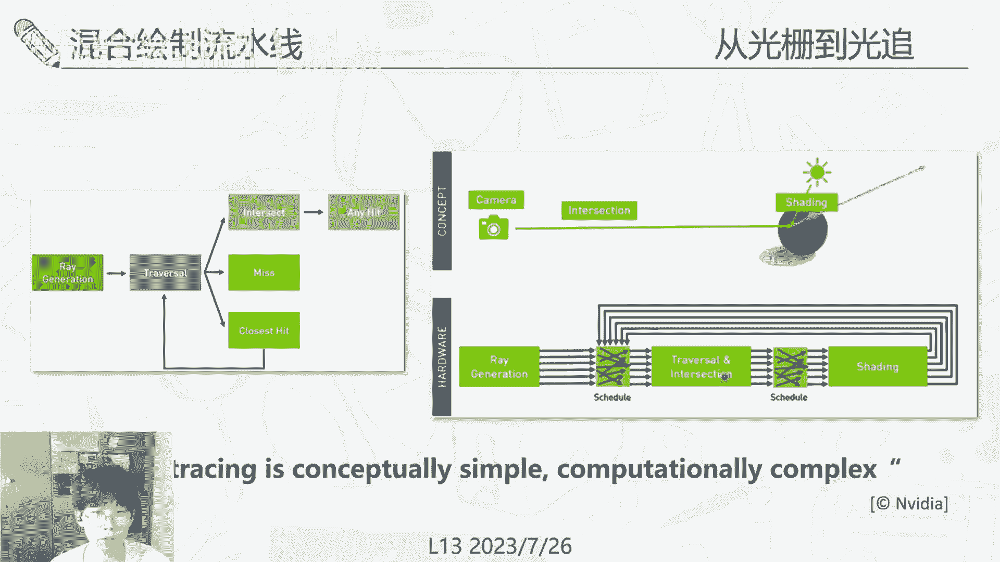

# GAMES106-现代图形绘制流水线原理与实践 - P13：13. 流水线新进展 🚀

在本节课中，我们将探讨现代图形绘制流水线的一些最新发展趋势。课程内容将涵盖从虚拟化技术到光线追踪的演进，以及数据驱动方法如何改变传统的图形管线。这些进展旨在提升渲染的真实感、效率以及内容创作的自动化程度。

---

## 传统流水线回顾

上一节课程我们深入探讨了延迟渲染等技术。本节开始，我们先回顾当前行业中广泛使用的两种主要实时绘制范式。

第一种是基于光栅化的传统实时绘制流水线。它的核心思想是将三维面片投影到二维屏幕空间，然后逐像素进行着色计算。

第二种重要的行业标准是延迟渲染。它通常使用两个绘制通道：第一个通道生成几何与材质信息（G-Buffer），第二个通道基于G-Buffer进行光照计算。延迟渲染的缺陷在于它主要包含局部空间信息，对于全局光照的支持有限。当前有一些方法进行补救，例如光照探针和体素全局光照，但这些方法的质量通常不够高。

有别于这两种重要范式，实时绘制和光栅化流水线中还存在其他一些绘制方法。

---

## 趋向一：虚拟化技术

接下来，我们看看一个重要的技术趋向：虚拟纹理与虚拟几何。

### 虚拟纹理

虚拟纹理的概念出现较早，其灵感来源于计算机系统中的虚拟内存。虚拟内存允许程序使用超出物理内存容量的地址空间，通过映射和页面调度机制按需从硬盘加载数据。

虚拟纹理将这一思想应用于纹理管理。在大型3A游戏中，场景（如整个城市）可能需要近乎无限大的纹理。虚拟纹理通过一个巨大的虚拟纹理空间和页表来解决这个问题。当游戏引擎需要访问纹理时，先查询页表。如果命中，则直接从GPU显存中获取；如果未命中，则从硬盘加载所需的纹理块。

虚拟纹理有几个优点：支持高清大规模纹理、动态按需调度以减少内存和带宽消耗、通过统一访问避免零散小纹理带来的管理和拼合开销。

虚拟纹理具有层次细节结构。不同层级的纹理块相互对应，且每块的大小固定，便于用页表索引。页表本身也具有层次结构，允许在不同层级间查找。在实际使用时，如果某个层级的物理纹理未加载，可以方便地使用其上层较低分辨率的纹理进行替代。

虚拟纹理的一个小缺点是需要在渲染前进行预加载。通常需要一个额外的反馈通道来探测哪些纹理块是当前可见且需要的，如果不存在则触发加载。由于这个通道数据量小，对性能影响很低。

近年来，硬件虚拟纹理已被集成到图形API中。其用法与软件实现类似，但具体硬件实现因厂商而异，并未完全公开。

最后，我们看一下虚拟纹理的示例。在视角变化时，每一小块代表一个虚拟纹理块。由远及近，加载的纹理块及其细节层级在不断变化。远处可能使用固定的大块纹理，走近后这些块会被细分为更小、更高清的块。

### 虚拟几何

基于虚拟纹理的概念，近一两年最重要的进展之一是虚拟几何，例如虚幻引擎5中的Nanite系统。其核心思想很简单：既然纹理可以通过虚拟化技术做得很大，那么下一步就是将几何体也做得很大，包含海量的三角面片。这样就不需要依赖高精度的法线贴图来模拟细节，艺术家在ZBrush等软件中创作的高精度模型可以直接作为素材导入游戏。

虚拟几何的基本思路与虚拟纹理相似，但实现更复杂，因为几何体的合并、存储等操作比纹理更复杂。

第一个区别在于数据加载的判定。虚拟纹理可以通过一个轻量的反馈通道来确定需要加载哪些纹理块。但对于虚拟几何，必须经过完整的光栅化投影，才能知道哪些部分是可见且需要的。如果为了获取反馈而预先光栅化所有几何，就失去了虚拟几何的意义。因此，虚拟几何的块加载主要依赖于遮挡剔除技术。

在UE5中，使用了一种层次化的深度缓冲来进行遮挡剔除。它将面片分簇，利用视锥剔除和遮挡剔除快速排除大簇的面片，而无需处理每个小面片。它还利用了帧间的连续性：假设相邻帧间可见性变化不大，因此先将上一帧可见的面片绘制出来，生成一个深度缓冲，用这个深度缓冲剔除掉当前帧大部分不可见面片，然后再绘制剩余的新增细节面片。由于帧间相关性很高，这种缓存命中率在实践中非常高。

第二个重要的技术点是光栅化加速。传统光栅化的性能与面片数量相关。如果有很多小面片，每个都向帧缓冲写入完整的G-Buffer数据，带宽消耗会非常大。Nanite采用的策略是：对于小面片，不写入完整的G-Buffer，而是只写入一个实例ID、簇ID和深度值。在后续的真正着色阶段，再通过这些ID去读取具体的几何和材质信息。这是一种软件光栅化的做法。它采用混合技术：对大面片使用传统的硬件光栅化（效率更高），对小面片使用软件光栅化（效率比硬件处理小面片更高）。

第三个重要点是保留了几何的层次细节结构，并建立了复杂的串流机制来实时加载超大几何场景。它根据簇进行面片划分，并在簇之间构建LOD层次结构，形成一棵树。父节点包含子节点，但表达的是同一物体的不同细节程度。在渲染时，如果绘制了父节点，其子节点就不需要绘制。系统会根据视点变化维持一个“切割”，确保显存中有一个合适的细节层级集合。当需要加载子节点时，可以暂时用父节点替代，保证任何时刻都能渲染出内容，尽管细节可能不足。之后再使用时间抗锯齿等策略进行帧间混合，以减少几何突变的视觉瑕疵。

以上就是虚拟纹理和虚拟几何的概述。下一个值得关注的重点是：

---

## 趋向二：从光栅化到光线追踪

首先，我们回顾一下光栅化与光线追踪的区别。光栅化是本课程讨论了很久的技术。

光线追踪是一种更物理的方法。它不是将面片投影到相机，而是从相机发射光线，与场景中的几何体求交。求交后，根据材质属性计算光线的反射、折射方向，并在场景中不断弹射，直到找到光源。这种方法模拟了光线在场景中的多次弹射和能量传输，能更好地描述全局光照。

可以看到，上图是传统的光栅化管线。当然，现在也有一些方法在光栅化管线中加入全局光照，但这些通常需要大量艺术家调整，且物理准确性不一定高。像镜面反射、折射等效果在光栅化方法中很难完美实现。

路径追踪或光线追踪可以保证所有视觉效果尽可能逼近真实世界的物理结果。需要指出的是，路径追踪或光线追踪也并非能实现所有特效，一些如焦散等效果也需要更特殊的算法。但对于大部分游戏场景而言，路径追踪产生的结果比传统光栅化流水线的效果要好很多。

这是一些效果对比图。左边是没有路径追踪/光线追踪的结果，右边是加入后的结果。可以看到光泽感、阴影过渡都更加真实，整体写实感提升很多。

那么，既然光线追踪效果更好，为何我们现在主要用光栅化？因为光栅化速度快，而光线追踪慢。因此，人们想办法将两者混合起来：一些用光栅化能快速实现的效果就用光栅化，一些必须用光线追踪才能做好的效果就用光线追踪。这就产生了混合绘制流水线，也是当前许多游戏采用的主流方法。

例如，直接光和硬阴影用光栅化可以做得很好；软阴影光栅化可以逼近，但不如光线追踪好；全局光照则更多使用光线追踪。此外，环境光遮蔽、透明效果、后处理反射等都可以用不同的技术组件进行混合。

它们的实现逻辑上很简单，但真正混合管线却很复杂。因为光线追踪的硬件管线与光栅化完全不同。光栅化管线是：顶点着色器 -> 光栅化 -> 片段着色器。光线追踪管线是：发射光线 -> 硬件加速遍历与求交 -> 着色 -> 可能继续弹射。这两个流程迥异，光线追踪的API无法直接嵌入现有的光栅化框架中。

具体来说，光线追踪的逻辑很简单：生成光线，遍历场景，有三种情况：未命中、命中任意点或命中最近点，然后做相应处理。但其计算非常复杂，因为所有光线的方向、与场景的求交（尤其是与层次包围盒BVH的遍历）都各不相同，很难做高效的硬件并行。

NVIDIA为此付出了大量努力，其OptiX光线追踪引擎从2010年就已提出，经过多年发展才在消费级市场得以应用。实现上非常复杂，一部分需要硬件支持，一部分需要软件支持。在硬件上，例如NVIDIA的Ada架构，进行实时光线追踪需要用到RT Core、Tensor Core以及一些如微网格的定制硬件。软件上，目前常用的API如OptiX、DirectX Raytracing都提供了光线追踪接口，开发者可以直接调用。

总的来说，这是一个巨大的发展。但是，光栅化与光线追踪的混合流水线目前仍有许多不足。

---

### 光线追踪的挑战与AI辅助

首先，即使有硬件加速，光线追踪仍然很慢。因为光线追踪本质上是一个蒙特卡洛积分过程，需要采样。采样就会产生噪声。采样率越低，噪声越大；在直接光难以到达的暗部，噪声尤其明显。这种结果无法直接用于游戏画面。

因此产生了许多利用人工智能进行后处理或加速的方法。降噪是一个基本技术：给定一个有噪声的图像以及其G-Buffer信息，可以利用先验知识进行滤波平滑。这是一个非常有前景的技术。

这里将简要介绍一些重要的经典工作，为大家提供一个脉络。由于时间关系，我们只做概括性浏览。

*   **图像空间降噪**：2017年迪士尼的工作《Kernel Prediction》使用神经网络为每个像素预测一个滤波核。神经网络的输入是G-Buffer和噪声图像。其基本思想是：如果物体在颜色或空间上有连续性，滤波器可以更好地在物体内部进行卷积。网络将高频的颜色信息与低频基础色分离，使得网络无需学习所有光照变化。
*   **路径空间降噪**：图像空间降噪自然延伸到路径空间降噪。每个像素背后是许多光线路径，路径空间维度太高。2021年的工作通过嵌入和流形学习，将高维路径信息映射到特征空间，使特征更平滑，便于降噪。
*   **重要性采样**：除了后处理降噪，还可以在采样阶段做文章。蒙特卡洛采样中，如果采样分布越接近被积函数的重要性分布，积分噪声就越低。因此有一些工作用神经网络去逼近这个最优采样分布。
*   **强化学习采样**：2020年的工作将采样问题形式化为强化学习问题，训练一个Q网络和策略网络，在巨大的采样空间中智能地选择采样点，以提高效率。
*   **Combiner网络**：前述降噪结果可能是有偏的。在低采样率下效果好，但在高采样率下，未经降噪的路径追踪结果本身误差可能更低。Combiner工作提出用一个神经网络，将降噪前的无偏结果和降噪后的有偏结果进行加权混合，确保最终结果在高采样率下也能收敛到正确解。
*   **时空样本重用**：重用时间上（上一帧）和空间上（相邻像素）的采样样本，增加当前像素的样本密度。构建一个样本池，从中重采样以提升输入图像质量，并可与其他降噪结果结合。
*   **帧预测**：渲染一帧太慢时，可以用上一帧直接预测下一帧。在图形绘制中，我们可以用很低代价获取下一帧的G-Buffer，从而基于下一帧的G-Buffer和上一帧的绘制结果来预测下一帧，质量比传统的视频帧预测更好。
*   **神经超分辨率**：渲染一张低分辨率图像，然后用神经网络进行上采样补全细节。这篇工作主要利用多帧历史信息，用时域信息弥补空域信息的缺失。超分辨率在工业中应用广泛，如DLSS和FSR，但具体实现未开源。

以上是关于混合绘制的讨论。下一个趋向，我们来讨论从物理驱动到数据驱动的变化。

---

## 趋向三：从物理驱动到数据驱动

物理驱动指的是我们一直讨论的图形管线：基于物理模型进行计算，如光线传输、基于物理的材质模型等。这是一个知识驱动的过程。

计算机视觉中的感知任务，现在更多是数据驱动：通过大量数据和标签，让神经网络自动拟合规则。

近年来，这两个领域的融合趋势非常明显，尤其是在神经场景表示出现之后。例如，神经辐射场就是用神经网络方法来完成场景呈现的任务。可微分渲染则是用神经网络建模渲染过程的反向传播。

这可能对未来传统图形管线产生根本性改变。传统上我们用显式的网格几何来表达物体，然后渲染。但最近像NeRF这样的工作，可以用神经网络表达一个场景的辐射场。在任意位置输入坐标和视角方向，网络可以返回该点的颜色和密度。然后通过体渲染沿光线积分，得到最终颜色。这与医学体绘制原理类似。其好处是，它直接使用拍摄的照片进行优化，可以渲染出真实感极强的画面，极大丰富了数字素材库。许多引擎已支持直接渲染NeRF这类表示。

另一个重要工作是Instant NGP。它在体渲染部分与NeRF类似，区别在于场景表示。它不使用单一的大网络，而是使用哈希网格进行小块局部表达，再通过一个小型解码网络得到颜色和密度。由于优化时只需更新局部参数，速度极快，使得训练和渲染接近实时。

接下来是SDF方法。SDF也用神经网络，但它表达的是有符号距离场，即空间中每点到最近物体表面的距离。其好处是可以方便地通过Marching Cubes等方法提取出显式网格几何，从而与现有工程化管线对接。

还有一些工作是物理基础的反向渲染，不优化SDF场，而是直接优化网格顶点位置和纹理材质，通过可微光线追踪将梯度传回，实现从图像到三维模型的自动优化。

下一个重要的是AIGC。前述内容主要是从2D到3D的跨模态转换。AIGC已经可以实现更广泛的跨模态资产生成和转换。例如，根据一段文字描述生成三维场景或物体的神经表示，这为虚拟内容创作带来了巨大的想象空间。

除了模型生成，还有纹理生成。给定一个白模，可以根据文字描述自动生成精细的贴图。以及灯光生成：给定一个室内场景，神经网络可以自动生成灯光的亮度、样式和合理摆放位置。

最后一个趋势是AI计算逐渐融入图形计算。传统绘制主要基于GPU，核心计算单元是计算着色器，光线追踪则用到RT Core。现在有一些工作探索使用更通用的NPU来进行全局光照等绘制任务。它们改变了流水线逻辑，从基于面片或光线绘制，转变为按物体绘制，逐步叠加每个物体对场景的光照影响，并用神经网络学习每个物体的光传输函数。

---

## 课程总结 🎯

本节课中，我们一起学习了现代图形绘制流水线的几个新进展。

首先，探讨了从虚拟纹理到虚拟几何的虚拟化技术，用于实现高精度材质和几何的流式加载。
其次，分析了从光栅化到光线追踪的演进趋势，以及混合渲染管线面临的挑战和AI辅助解决方案。
最后，讨论了从物理驱动渲染到数据驱动方法的转变，包括神经场景表示、AIGC内容生成等，这些技术正在深刻改变图形学的内容创作和渲染方式。

这也是GAMES106课程的最后一讲。感谢大家一直以来的观看。

---

接下来是讨论时间。今天的话题比较发散，主要是方向性的探讨。另外，助教反馈在几何优化部分的作业提交数量有所减少，如果大家遇到难度或需要解答，可以提出探讨。如果对某些作业不感兴趣，也可以跳过，选择后面更感兴趣的作业来完成。

如果没有其他问题，我们稍等片刻就结束今天的直播。

好的，今天我们就先到这里。