# GAMES106-现代图形绘制流水线原理与实践 - P4：4. 图形绘制流水线的基本原理与实践(三) - GAMES-Webinar - BV1Uo4y1J7ie

好各位同学，那我们今天就开始那个绘制流水线原理。

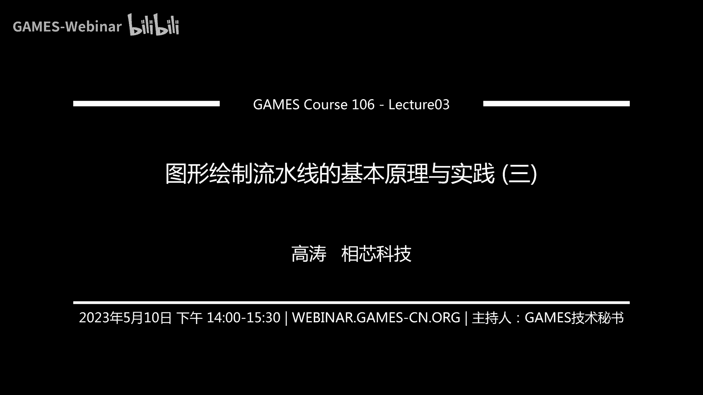

的第三课时嗯，然后按照我们的课程安排，第一个课时是working的基本架构绘制流程，然后第二课程时working的绘制对象，创建内存管理，以及它的调试工具和方法，然后第三个课程呢我会去说。

第三课程呢我们就会准备是沃克的多线程同步，还有一些基于移动端的一些常见优化和实践，然后这个优化呢，有一部分是来自于我自己的那个，一个开发的经验，ok然后我看到评论，有同学说作业二运行不了怎么办。

这个我回答一下，因为我们的作业二是直接拿的，他这个样例的这个代码去实现的，大家可以看到，其实他这里用了一个扩展是nv sh确定rate，然后这个我们去改一下就可以了，因为他是英伟达最先提出来的。

所以说英伟达在working里面先实现了一个扩展，然后当我们想要用的时候，其实那个还是有一个，有一个官方的扩展可以使用，但是官方的扩展也是跟你的硬件有关系，大家可以选择这个。

这个working的一个官方的扩展，这个fragment的shrate，我们也会到时候嗯，过几天，我们的助教也会把homework的这个扩展给改掉，改成那个这个官方的扩展。

ok然后我运行一下大概的效果吧，大家可以看一下，就是在你的相机的时候，我会看到嗯，视野中间会比较清晰，然后四周会比较模糊，然后用颜色去区分的就是绿色最清晰的，红色的是最模糊的，大概就是这样的一个效果。

当我把这个关掉的时候，是所有人都是按照最清晰的方式来渲染，ok，然后这个主要是，因为他这个扩展用的是英伟达的扩展，所以说有部分同学如果你的设备是英伟达的话，是没有办法去。

就不是因为拿新卡可能没有办法运行，这个我们也会去改一下，但是也不是所有的设备都支持这个作业，二，因为它始终需要你的硬件设备跟驱动，支持这个协定rate这个功能你才能够使用。

这个并不是working的一个核心功能，所以说它都是以扩展的功能来实现的，最后都会以扩展的方式来提供，ok然后我们回到，然后大家对注意一有没有有问题的话，也可以在那个弹幕弹幕里面直接说。

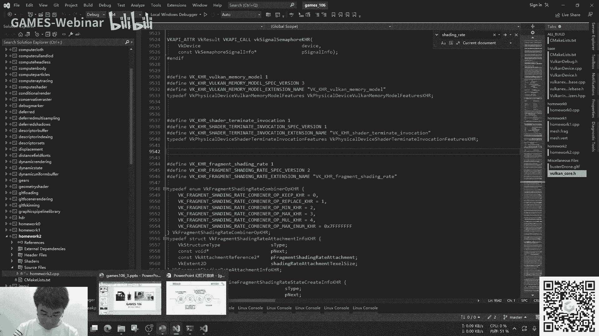

ok那么我们就回到我们的这个我们的课程，一个是working的同步原语。

第二个是frame graph，第三个是walking的优化，然后我们首先来看乌克同步原语这个图片。

我们这边的图片是有一个呃，working的一个基本的框架，它的多线程框架，那么在我们的host其实就是我们cpu端，device就是我们的gpu。

然后它有一个working会有若干条command buffer，每条command的办法其实就是你的gpu的命令的堆栈，然后qu队列就是cpu端把这个命令扔给gpu，然后gpu会去去真正的执行。

是通过比如说是通过队列的任务，一条条的队列去结束执行，然后我们这边看到嗯，我们可以看到我们这边的同步原语，主要是有三种同步的信号，一种是栅栏，第二种是事件，第三个是那个信号量，我们先讲栅栏。

栅栏这个东西就比较嗯，相对来说理解起来会比较简单，它是一个相对来说颗粒度是最大的一种同步，源于它的同步的结果，只有我这条kana buffer是否完成了。

然后我们在n条command buffer给gpu的时候，gpu会会去改变它那个分就是栅栏的状态，然后我们外面的cpu端可以去通过获取的方式，获取他那个炸弹的方式这个状态，然后判断他有没有那个执行完成。

然后也可以通过那个wait的方式，这个wait方式会跟那个操作系统的锁会有呃，就是依赖于操作系统的调度，来实现这个wait的方式，所以说它会占用的资源会比较少。

当然你也可以用类似于spin lock的这种方式，去做while循环，然后每次循环的去去判断获取状态，然后去判断，ok这是我们的栅栏，这个东西栅栏你可以等价于约等于等价吧，g o finish。

约等于等价于它的gl，就保证你的所有的那个gpu调用都完成了，然后第二个呢是事件事件，这个事情是嗯它的颗粒度会更细，他是说我们的working的buffer会有各种命令命令，各种嗯各种命令。

然后它可以在一个命令结束的时候，把这个事件给设置它的状态，比如事件我已经完成了，然后设置这个事件呢是cpu跟gpu他们都能去设置，都可以去设置这个事件嗯，但是这个等待这个事情只有gpu能等待。

cpu端是不能像栅栏一样，我去通过系统调用，去等待你的这个事件是否完成，它只能通过cpu端，只会说我去获取一下，我这个事件有没有完成，然后gpu会去那个，但是gpu的去命令他可以去等待。

比如说我这个gpu的一条命令去实现，它依赖了另外几个事件完成呃，就比如说我gpu是做这个后处理，这个后处理需要一个什么几把法完成，那么当我几把法完成的时候呢，我就可以通过一个事件去通知。

另外一个做后处理的那个他们的buffer，ok你可以去干活了，其实就是一个有一个嗯拓扑排序的这种概念，当我的事件优先于想要之前的某个事件完成，我才能完成继续下去的时候，就可以通过事件来完成。

然后第三个呢是信号量，信号量的事情，事情呢是呃简单的理解是可以把它当做呃，command buffer之间的一个相互的等待，当我这条可怕的buffer。

我需要有另外一条commander buffer执行完，我才能够在gpu端去执行，你可以简单的理解成是gpu之间的一个命令，等待之间的一个等待的方式，所以在我们的cpu端。

其实并不能够显示的去修改cpu端，不能解释的去设置这个信号量，也不能去等待这个信号量，这个是纯粹的是给gpu之间的使用，就按照我们看到的原图，我们可以看到那个信号量，其实是队列和队列之间去做同步的。

然后事件是一般用于command buffer和command buffer，之间做同步，当然你的cpu我们也能够去获取这个事情，这个有一个地方会比较好的，就是说我们在做gpu性能分析的时候。

在open g的时代，我们只能通过显卡厂商，通过给一些那个提供，然后我们知道某条记录cpu的命令花了多少时间，这个命令干完了，然后有了事件之后呢，其实你不依赖于全场上，你可以自己写一个事件。

一个线程在拼命的去query，每个事件完有没有完成，然后另外一个，然后通过这种方式去可以就可以去可以记录你，我们每个gpu的他的那个事件完成，需要花多少时间，当然一般来说。

我们用insight或者一些图形调试工具，他都会帮你完成这个事情，所以我们也不用真的去搞，但是嗯但如果你在移动端或者安卓或者ios，或者某些别的就是调试起来没那么方便的平台。

你可能就需要手动的去实现这些东西了，然后最后一个是屏障，屏障呢跟其他的不一样，它其实是管理的一个读写锁的一个问题，他管理的那个内存资源的读写，他的屏障是分为三种屏障，一个是那个全局内存屏障。

其实就是嗯内存内存地址的屏障，然后第二种是buffer的屏障，然后还有一个是图形的屏障，为什么是buffer呢，buffer的屏障，他是因为buffer你会区分于它是作为一个index读。

还是说作为一个呃transfer的一个写，还是说作为一个呃uvb的buffer，就是作为一个u a v还是s r v还是uniform，那个缓冲屏障会做这样的事情，然后纹理的图形屏障呢。

它会去区分你是个rt v la tacit，还是一个srv去做采样的一个屏障，在保证我在屏障前，所有的命令跟我屏障后所有的命令，他们的读写是不会发生冲突的，不会发生。

我这个pass在对于一个资源的一个读另外一个pass，他也要因为pass要写，我能保证他一定是读完了之后我才能写，或者我写完了之后我再去读，它，解决的是一个就是资源竞争读写的一个情况呃。

但是呢我们在实际开发的时候，我们可以不用这种思维去思考它，我们只需要去想他的下一个阶段，我们要用它做什么，然后你把他的状态改成那个，你想要去做的那样子，比如说你一个贴图在这一帧状态。

我是一个luna target，我想要写进那个run tt里面去，我想要写到net里面去，然后第一针，然后第二个command buffer里面呢，我要用作为s r v去写，那么ok我们在写之前呢。

我们就需要有个读之前，我们需要有一个这样的屏障，屏障，那么我们其实是可以把它简单理解成，我们资源的使用方式发生改变的时候，我们就去选择这样的方式去调度就ok了，呃虽然说它实际的真正实现并没有那么简单。

但是我觉得我们在使用的时候，可以不用考虑那么多，ok下面的话就是简单的看一下我们的这几种，每个每一个同步原语，他们的一个实现的方式，比如说第一个fans，嗯我们在cpu第一步，先我们cpu跑第一个。

先嗯把我们的query sub meter，把我们command buffer给提交给gpu，当然提交给gpu之后呢，gpu会驱动会处理一下，他会处理成机器码嗯，或者说驱动能够识别。

或者对你的commander buffer做优化等等，一系列操作之后，所以会有一定的延迟，并不是说你cpu扔给gpu，gpu马上执行了，它会有一定的延迟，它会嗯这个这个延迟多少啊，或者怎么延迟。

这个要看驱动的具体实现了，然后用我们的gpu会去执行其他卡片的buffer，然后当我们的可怕的八法执行完了之后呢，他就会通知我们的sense，通知我们的那个栅栏告诉过你，我这个结束了。

ok然后我们再来看我们cpu状态，在gpu还没有执行完这条command buffer，也就是说还没有通知我们的栅栏的时候，我们去获取这个栅栏的状态，它一定是force，因为他告诉你，他并没有呃。

并没有结束，然后我们这里在调用等待这个栅栏，这个栅栏之后呢，这个线程就会进行休眠，这个是通过系统的调用，相对来说会节约我们的那个更多的gpu的，cpu端的一个性能资源，性能消耗。

那么我这个线程就可以去睡眠，去去睡眠了，然后可以把计算资源留给别的，更需要它的一些系统，然后直到我们的gpu告诉我，告诉我们那个你这个任务已经完成了，我们的栅栏已经完成了，那么系统再去唤醒我们的。

再去唤醒我们的cpu端，然后我们cpu端这个地方再次呃从sleep状态，然后，然后唤醒它，然后我们唤醒完了之后呢，我们再去获得那个栅栏的状态呢，我们就知道了，我们在战狼已经结束，已经运行成功了。

可以获得这个q嗯，然后呢第二个呢就是我们的事件呃，事件的话，我一个事件呢是会需要有一个呃command buffer，就是在command buffer之间做同步，主要是由于这个。

但当然我们在cpu端也是能够去实时的获取，那个事件的状态，比如说我们这地方我们是扔了两条command buffer，先扔了条comma 1，再扔了条command buffer 2。

然后command buffer 2呢是依赖于command buffer一的，某一个事件的完成，所以当它执行前面不依赖于这个事件的之后，他就结束运行，它就会在这边等待。

然后等待command buffer一把这个事件完成，然后等到common bua一把这个事件完成了之后，然后通知他，然后就可以得到了那个那command buffa 2，也就继续唤醒，然后继续执行。

他那个command的阿尔法二的相关的使用，然后第三个呢就是信号量嗯，信号量呢是那个相对来说颗粒度会嗯会大一点，是command buffer之间的一个同步的过程，我们把那个一样的。

我们先是扔了common方法一，再扔了command buffa 2，然后command buffa 2会从一开始就在等待等待，command buffer一执行结束。

要command buffer一会通知这个信号量，有可能buffer 2会去等待这个信号量，那么我们可以看到这个信号量跟这个事件，其实很多时候看起来是比较接近的，它的功能只不过事件的颗粒度会更细。

然后信号量的颗粒度会更粗，因为信号量颗粒度在那个一整条可能buffer完成，然后事件的颗粒度只是到某一个功能，它完成了就可以了，然后最后呢就是我们的berry，我们的内存屏障，我内存屏障这里有一样的。

我们假设cpu端扔了一条开办的buffer，扔给了berry，然后china buffer，然后common bua再去，然后在这套改动大分呢，我们会对于有个learn target。

一开始是一个写操作，我们会把这张图作为一个color attachment，就是往里面写入，我们开始往里面写这个作为输出，然后呢后面的shading reading就是我们要做个s r v。

这里是一个rt v and target view，然后后面的要成为一个shadow relose view，ok那么他就可以去同步说，我在这个写操作的所有的交考都完成了情况下。

我才会去把它作为一个shading read，的这么一个读操作，因为群众在真正实现的时候，因为他是并发的，他只要说你的这个交号说我有资源能够继续用，假如你不去做这个事情，那么它是可能会出现我的读操作。

在你的写操作之前去做这样的事情，也是有可能发生的，所以说我们一般来说，我们在实现我们自己的框架，或者我们自己的那个demo的时候，我们要清楚的知道，我们这张图在后面所有的命令是一个写操作。

那我们就要去通过这个栅栏改变它的状态，然后在working的开发的优化里面，他的说法是，我们这个栅栏今年要减少栅栏的使用，就是说当我们是一个写，也就是说换句话说我这个状态最好只是改一次。

你不要频繁的复用这张东西，又去读，又去写，又去读又去写，可能这样的事情可能并不好，就是对于性能来说并不是特别好，就反复去更换它的状态，我们可以通过优化，把某些写操作全部放在前面，等操作放到后面去。

那么在逻辑是一样的情况下，优先改成这样的方式来写。

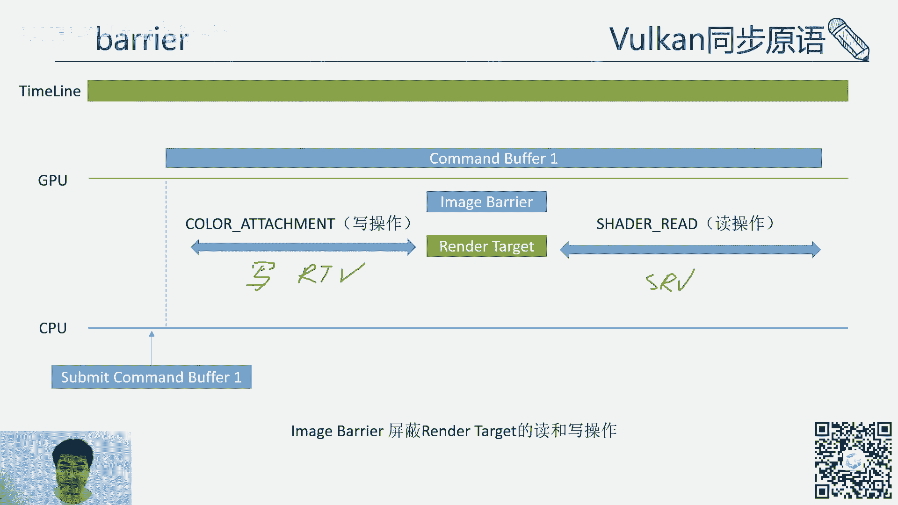

ok然后呢我们继续来看一个实际例子，实际例子大家可以把我们的作业框架里面，最外面的那个sim卡，把这个一个example的原来是这样的，把它注回来，然后重新运行一下这个c mac脚本。

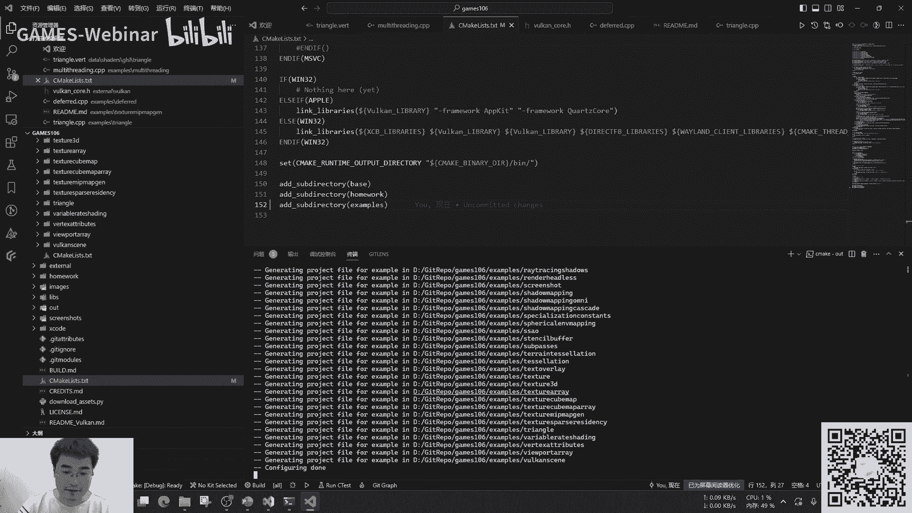

然后呢，就能够看到所有的我们的一个，example的这个例子，因为作为作业的话，一开始是把他们给隐藏掉了，觉得嗯不是特别好，ok然后我们运行一下这个例子，他这个例子呢是用了很多个线程去跑这些ufo。

每一个ufo其实是一个线程组成的，一个对接的commander buffer，然后他们其实然后通过这样的方式去绘制的，然后它有一个ui层，有一个背景层，背景ui也是一点还有可能的办法。

然后我们可以看到这边，我有个16个线程在跑这个。

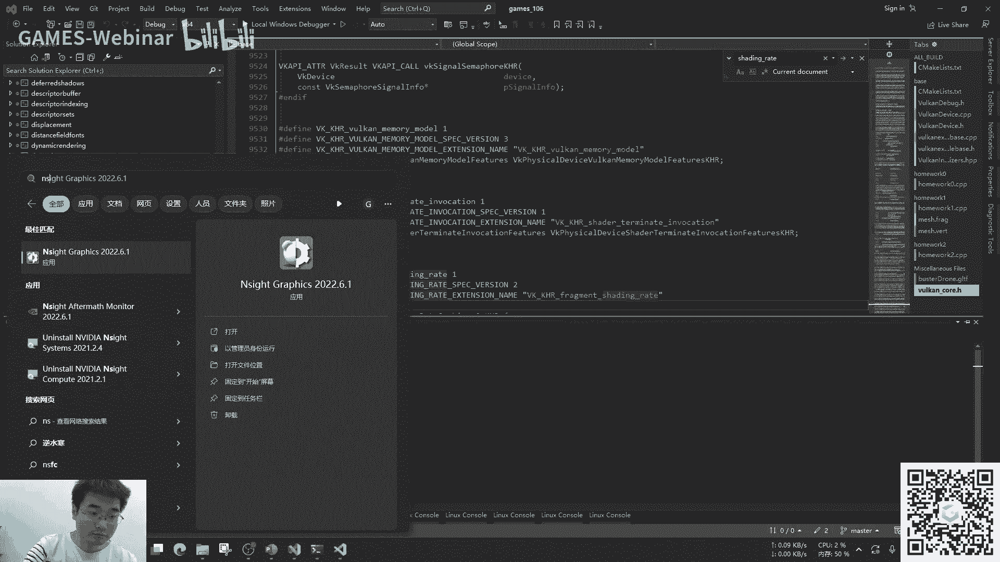

然后我们拿5n si，我们拿这个截图工具跑一下。

我来抓针扎个针看看。

它具体是怎么实现的。

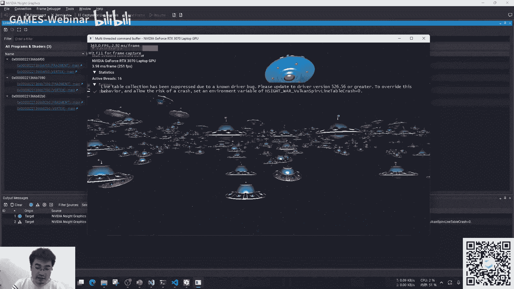

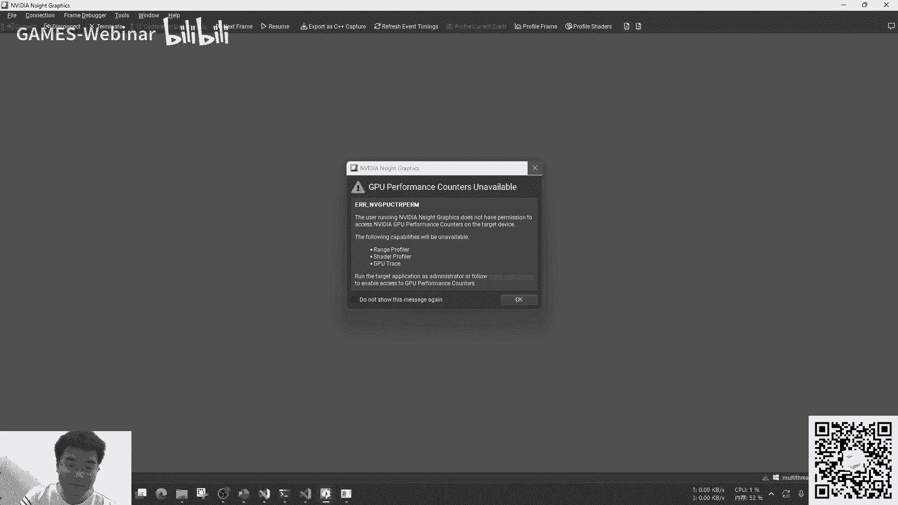

ok我们这里可以看到这里每一个点，其实就是我们这里的呃，可能不太清楚啊，我放大一点，这里会有非常多的卡麦的buffer，这里看到有一条线，花花绿绿的，这条线其实就是我们所有ufo去通过并行生成的。

那个command buffer的一条数量，每一条每一个就是一条commander buffer，我把它放大，这个线拉大，可以看到每次教练都是一个可能的buffer，然后我说为什么我说那个事件。

他们我们的工具会帮我们做掉呢，其实一般来说我们把这个所有的都打开，我们可以看到，其实它会我们的，其实我刚刚讲到的那个事件，在通过那个层的话，它也会我们的调试工具，会帮你去做这样的一个事件的的分析。

我们可以通过这个事件的执行，然后来判断我们的优化，然后判断一下gpu去执行完这个东西会需要多少，cpu端的时间和性能，对这里我们看到这边的卡罗拉非常多，我也没有仔细数过有多少个吧，嗯反正很多就是了。

然后对你的周炮也会300k336 个，高考我们这里有看到有336个的交考，就是这边有300多个，这边是有300多个那个ufo，300多个ufo在我们的这个绘制的场景中，然后我们的帧数。

当然我这也是跑bug，这个帧数可能没有太大意义啊，而且我的性能可能也比较电脑展示，电脑性能也会比较好，所以说这个意义可能不是特别大，然后我们再回过来看一下这个地方，就是一个简单的一个多线程的一个同步。

但是呢我们这个demo呢没有这个sample，没有任何的资源的同步的操作，也就是说它没有用到，我们刚才说到的一些同步原语，那个信号量事件，他并没有涉及到这方面的一些一些实践。

然后呢他这边每一个command buffer呢就绘制一个ufo，然后在这些command buffer呢，都是在同一个轮到pass中绘制的，我们在这边也可以看到。

这边的framebuffer都是始终在一个人的buffer中。

我们通过抓帧工具也是能够看得到，在同一个人的buff中。

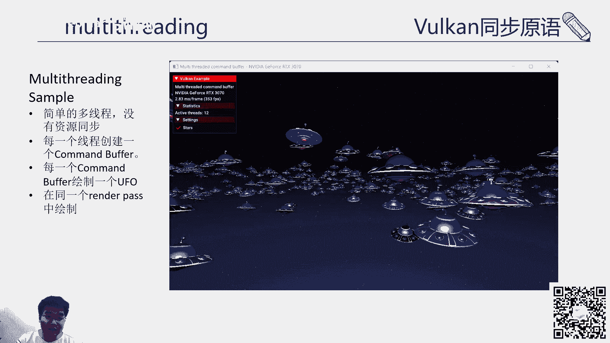

诶这个是n set的一个抓帧的情况，大家在写word的时候呢，我如果对于初学者的话，还是非常建议大家使用类似于n set这种，对于可视化也好，或者说性能飞机也好，相对来说非常友好的工具。

ok性能想要性能分析的话，我不知道上次都我也忘了，有没有给大家演示一下它的嗯性能分析的情况。

我趁这次我就给大家演也演示一下吧。

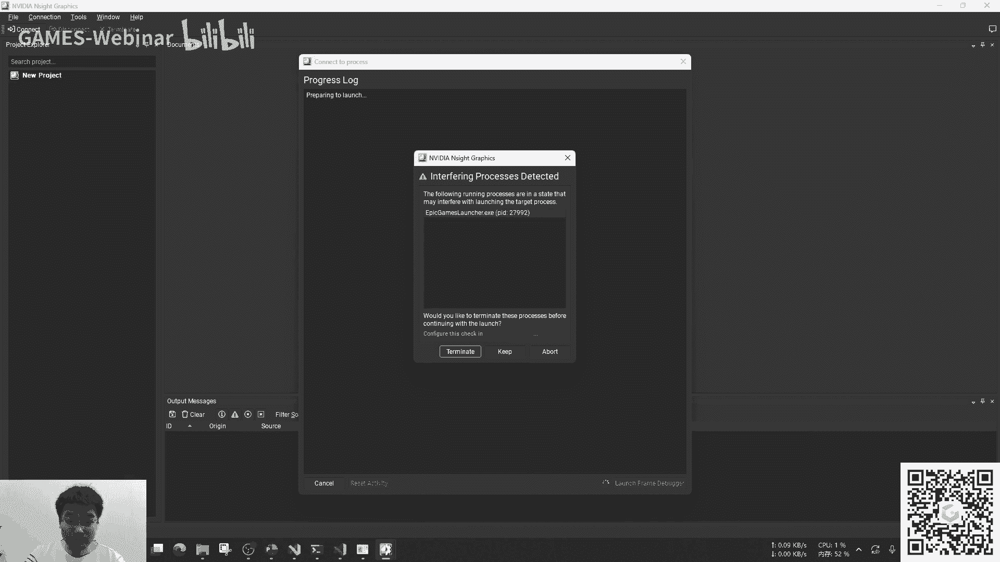

就是如何做那个gpu存在这个性能性能分析呃，当然我这个例子可能也不是特别好，因为这个太简单了，这个场景可能没有什么，没有什么太多的瓶颈。

嗯我们分析一下这个事件。

ok我哦，我记得我上次课应该跟大家有，简单的看过这个事件，这个性能分析大概会是怎么样，大家可以看到这个所有的资源的调度，然后我们用了多少寄存器，我们用了多少的内存，然后他的l2 l一开始。

然后有一个简单的体系，这个硬件的一个体系，我们可以通过这些方式，然后去判断我们的新的，或者我们的work程序里面有哪些问题，包括我们也可以去profile我们的shader。

我们可以看到我们的vent shader里面它的使用量，然后每条命令的使用量，然后三破的情况，然后我们针对性的通过这种方式来做，我们的优化。

ok，然后这个就是我们的一个那个，刚才的一个可视化的情况，这边我们这边会有一个密码叫primary的，command buffer，还有一个叫做secondary的command buffer。

这个我们在创建commander buffer的时候会有表现，我给大家看一下具体的代码吧，就是这个我们要定义它的command buffer的等级，到primary的。

还是the second read，如果是primeter read，它可以就是通过cpu端直接去执行，我们这套卡门buffer，如果不是盘面的话。

他的这个执行是需要command buffer去执行的，那其实换句话说是command buffer是可以执行，command buffer。

它这个函数就是vk c of the cute commander buffer，我们在我们的这个主要的函数循环里面，我们可以我给大家简单的解释一下，它怎么运行的啊，先是第一个render pass。

我们的组组组的command buffer里面会设置好，毕竟render pass告诉我们要画到什么地方去，然后我们再更新一个century camera buffer，这个是画ui跟那个背景的。

我们把ui和背景的camera buffer，生成个ui跟背景的command buffer，然后把ui跟背景的command buffer在去去去执行，更新好它呃。

然后我们把然后接着我们起了一个线程池，线程池呢去创建那个渲染每个ufo的一个线程，在每个ufo里面的一条camel buff，这里我们这里每个卡门二都非常简单，只要设置他们的一些状态。

然后可能是begin的状态，然后我们把我们的传给的uniform，通过push constant呃，constant的方式去传给用的shader，就是他们新的ufo的位置，包括它的颜色动画。

什么那什么对的这种这种东西，然后传过去，然后我们再去做jokk，然后最后是end，那么这条command buffer呢，就是我们现成的每个ufo相关的一个，现成的command的办法。

然后我们这边做个线程，等待所有的多线程执行完所有的卡门buff都ok了，然后再把这些command buffer都扔到一起，扔到那个common的一个commana的数组中。

最后再去primary去去调用那个command buffer。

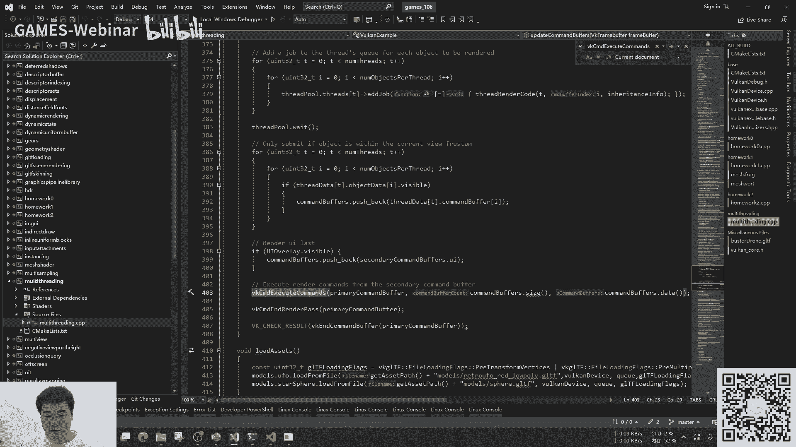

去调用command buffer，ok这有点绕，但就是command buffer可以调用command buffer的，这么一个逻辑，就像现在我图里演示一样的情况，这个就是一种的多线程的情况。

但是呢这种多线程呢，我们这个sample并没有说到，如何处理这个资源竞争，这是第一个，第二个问题是他我们呢也没有说到，我们呢也没有说到这个嗯资源啊，教主比如说我们并没有这些所有的方法，都没有任何的锁。

没有任何的头部在这边，但是只是告诉你们我们冬天人该怎么做，然后这里需要提到一点的是，我们的破，在我们做多线程的时候呢。

我们会注意到每个线程的这个command buffer，它都会有一个command buffer po，为什么会有这个破呢，是因为我们的command buffer。

是要从command的破去申请出来的，那么当我的commander pro是一个的时候，那我每个线程去申请command buffer的时候，不就要加锁。

因为这个commander pro去申请这个command ber的时候，是线程不同步的，那么所以一般的推荐方式就是我们的canva pro，每个线程一个只是推荐方式，并不是说一定要要求这么写。

并不是限制，只是推荐你这么做，同样的commander buffer一样，也是我一个线程，最好是一个command buffer，大家可以注意一下这个数据结构。

我们一个command buffer跟一个线程，或者就一个线程有一条或若干条craft线程之间，不要去共享凯文的buff，因为当你共享凯文buffer之后，你用凯文的buffer去筛数据。

这个事情是需要加锁的，也就避免cpu端，线程跟线程之间的那个所的资源竞争。

ok然后这个地方刚刚说了如何处理资源竞争呢。

然后这个地方我们就提到了一个技术，叫做frame graph。

然后大家可以去，去看一下那个frame graph的gdc，17年的这个frame graph，在这个ppt这个我这边只是简单的介绍一下，大家如果想要更更详细的知道的话。

可以我等下把这个链接挂到p p t上，大家可以去通过这个这个fragrf的那个，他们真正的说明，然后去了解一下我们为什么要做这个事。

它的具体的实现是什么样子的，然后我来讲讲他为什么要做这个事情吧，我们现在就讲一个非常简单的一个fing graph，这个grass非常简单，我们它是一个看上去就是一个pc的一个frah，为什么呢。

是因为它有个它是一个differ的，一个differ的lighting的一个pine，然后有一个projets的一个操作，然后有一个raw ao，然后通过一个通过深度去生成一个ao，然后ao再去链路。

其实在这里大致是有两条链路的，一条是这个链，一条是这条链，然后最后再出这条线，ok这个就是我们这个fragr，一个非常简单普通graph的，带个一条拍拍line。

然后这个地方呢我这里提一下一些优化的知识，比如说我为什么要做predepts，就是我为什么要在这个地方去先做深度的写入，就是这个pass只做写深入，我们可以想象一下，我们在画场景的时候呢。

就跟画家画法一样，从后划到前前面的会把后面挡住，那么我们通过深度检测呢，只是保证了前面的一定会把后面挡住，但是我们的性能是否是最优的呢，按照我们桌面端的驱动的实现，它一次交考会保证。

你这一次交号全部完成了之后，然后再给下一次交call去使用，然后所以说在我们现在的驱动的时候呢，最最性能最高的方式就是我是从前往后画，那么所有往后画的东西都可以通过深度检测，提前剔除掉。

就避免了overjoy，就是同一个像素没有用的那个gpu绘制，但是呢假如说我是从后往前画，假如我运气非常不好，没有做对应的排序，他这个顺序刚好是从后往前画的时候呢，就会发生一个问题。

就是有个overjob，我在屏幕后面已经被前面挡住的时候，但我在画后面的时候的物体，我并不知道会被前面挡住，那么它gpu依然会把你给绘制出来，这个所以说这个为了解决避免这种问题。

那么我可以先做一个pass，把所有的深度我先写上去，那么我在做真正绘制的时候，我已经根据这个深度可以去做剔除，哪怕是我后面的物体，我也知道前面的深度，因为我已经把深度给写进去了，那么通过这种方式的话。

就可以避免一个overdraw的一个问题，那当然我在写深度的时候，一样的，也最好是从前往后画，但是你从后往前画的问题也不是特别大，因为这个相对来说这个pass不重，非常简单，只是写深度。

那如果这个overjob是一个非常复杂的，要画颜色，要制造光照，那么这个对性能影响就非常大了，然后我们可以看到这个地方我们的蓝色是pass，资源的话是橙色，资源是橙色，然后橙色就是我们的资源。

我们会有一些竞争的一些资源，然后蓝色的就是呃各个阶段的渲染了一个pass，然后经过这个post就一个后处理，这个后处理，我这边就没有详细写。

一般来说就是嗯可能是color grading或者是l u t，或者做个滤镜或者什么之类的一个东西，然后最后说chain画大道，然后再做planet画到屏幕上去，ok这是一个非常简单的一个寡妇。

我们就以这个为例子，在我们的主渲染流程，我们先画了一个深度，然后深度做完再做s s a o，然后做完c c o之后，然后再做协定shadow map，绘制shadow map，然后再做lighting。

就是那个灯光的绘制，这个地方的话指的是这条电路，我怎么把它擦掉呀，这里指的是这条链路，指的是这条链路，我们在这这条链路的时候呢，我们可以看到我们有三个资源是需要读写的，第一个是深度pass。

它需要写到那个深度的buffer，然后第二个是s s a o，我们需要输入深度的buffer，然后输出一张road ao buffer，road ao buffer一般来说会有噪点。

所以说我们会需要第三个pass aco filter，把我们的噪点给去掉，然后生成一个fter的ao buffer，然后最后在等待那个shadomap的的pass，结束之后呢。

我们就要去等待那个lighting雷霆，会需要一个深度buff去做光照计算，然后也需要一个ao的buff去做光照计算，会需要把环境光给给盖住，可这个就是我们的一个有ao相关的一个。

简单的一个pass的资源的访问，那么这个时候呢我们就可以想一下我们异步，我们想要做异步的话，那么哪些东西我们可以一步拿出来呢，我们的ao pass是一个可以单独拿出来，做一个异步的渲染流程。

去另外起一个线程，嗯去另外几个线程，然后我们在a o pass，我们可以另外几个线程去绘制，然后另外一个线程呢在做主渲染的流程，那么这个时候呢我们就会加入一个同步点，需要同步这两个事情没有事情。

那么我们在这个地方，我们很关键的一个事情是，我们这个同步点为什么是设置在这个地方，我们可以想一下这个是是是为什么，是因为我们的lighting是依赖于ao的输入，我们在我们再回过头来看一下我们的。

我们的这个简单的frame graph，每一个pass其实是有一个它依赖的一个，前前置的一个效果，那么我它所以它会有一个，其实是个拓扑排序的一个结果，他会需要依赖于全面，然后比如说我们这边我们要做调试。

我们要做调试，我们想把这个比如说我们不走这条电路，我们只是不想把这个基八分一，ok这样子过来做一个swap chain画的所有线上，然后拍出去，那这样子也可以，因为我们只想看一下我们的法线，对不对。

比如说那么这种情况下，我们的这些框架就可以把它给优化掉，坏掉，然后呢这是它的福利graf一部分的优势，第二部的优势是我们刚才已经提到，我们的主要的问题在于我们的资源的使用上面，它的资源占用上面的问题。

所以我我们通过flag，我们能够知道目前我通过这条链路，它会用到了绘制哪些pass，然后每个pass之间又有哪些依赖前置项，然后哪个依赖前置项呢又需要哪些资源，换句话说，我们可以通过fragrf。

解决资源依赖的一个问题，我觉得我能够通过福利古拉索，知道我需要哪些资源，然后我需要对这些助学员做读操作，我需要对，那么哪些pass对同样的资源做写操作，我们通过刚才fpp，就能得到一个这样的一个结果。

然后这个结果我通过这个结果就可以做，working的那个资源的信号同步，然后来做这样的事情，所以说我们如果抛开fen graph的话，我们很难去真正的去实现一条非常好的一个，资源同步的一个case。

然后我在我们的那个example里面，我也去找了找，我没有找到非常好的例子，可以嗯给大家非常简单的看一下这个资源同步，可能大家如果真的要去仔细研究一下的话。

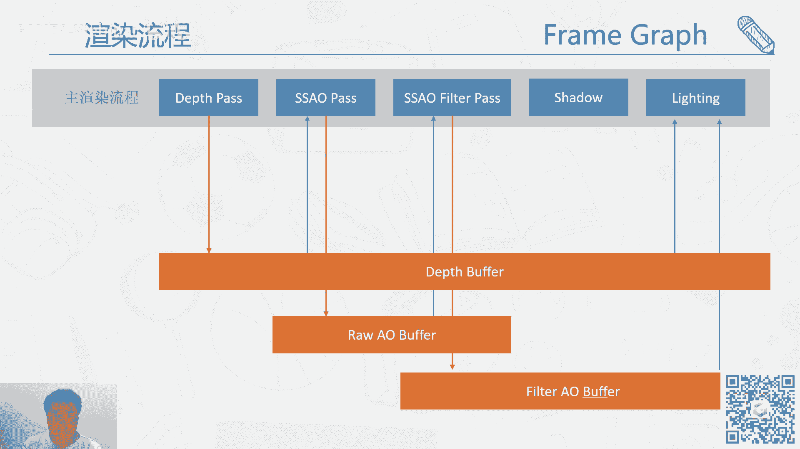

我推荐可以去filament嗯，那个谷歌的。

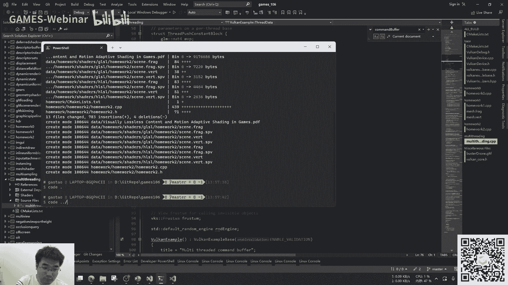

我推荐大家可以去看一下谷歌filament的一个，去看一下他关于那个free gr是怎么操作的，这个词是谷歌的flement的一个，fraglove的一份实现，他目前还我我我我看下来。

他目前是属于实现的比较，我觉得是作为学习的对象还是不错的，而且性能也它实现的性能也还是不错的，无论作为学习也好，性真正的工程使用也好，都是一个不错的一个尝试。

对他这边的a pass就是增加一个我们刚才提到的，这边的一个蓝色的pass。

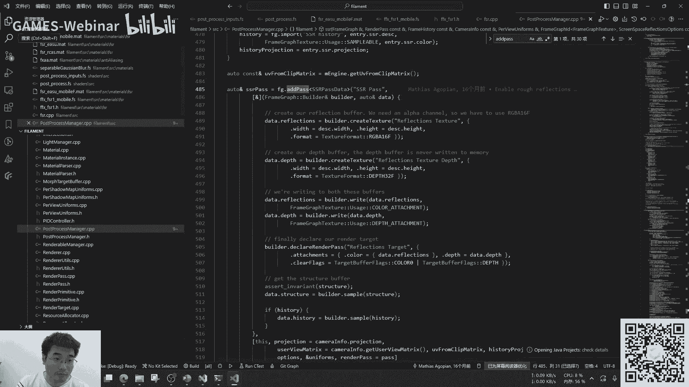

我找一下他们的c c o pass，ok然后在这边的c c o pass，他就会知道我需要输入一个上一阶段的深度图，做一个它的一个输入，然后他这个是他的输出。

我需要有个s s o的buffer作为我的输出，然后我在这边这个rua pass里面去做绑定，ok然后这样通过这个接口上去，等于说去实现了我们的frame graph。

中的一个资源的依赖关系去计算出来了，然后再去通过真正的执行，通过这个计算出来依赖关系之后去执行，真正的执行这个东西，然后就实现了我的一个非常高效的worker，的一份实现。

然后这个就是它的film的一个接口原型，at pass名字，然后set up去实现它的那个依赖关系，ecute去真正执行的open g，比如g就是那个执行那个gpu的那个调用。

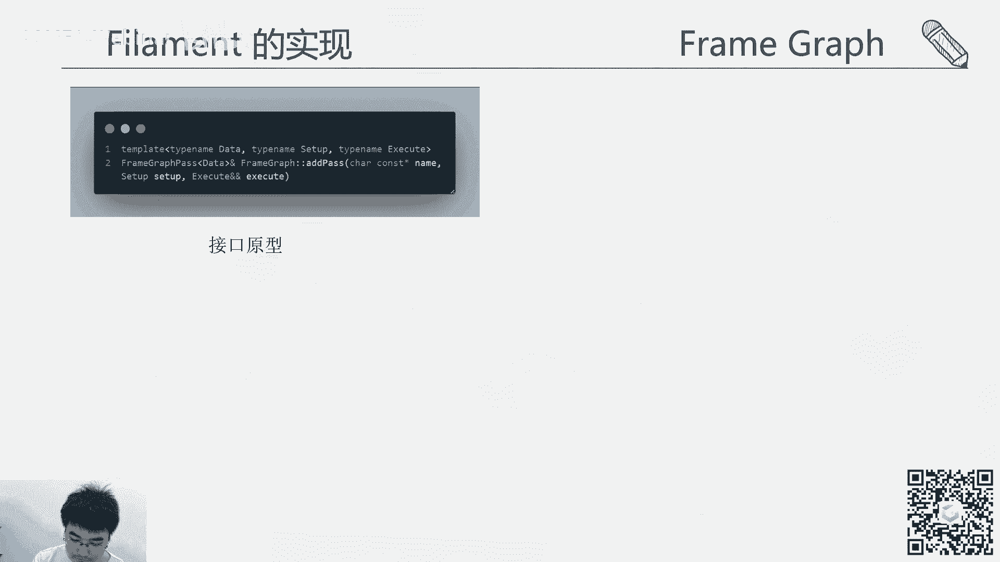

下面的两个代码图我已经有些部分比较删掉了，大家有兴趣的话。

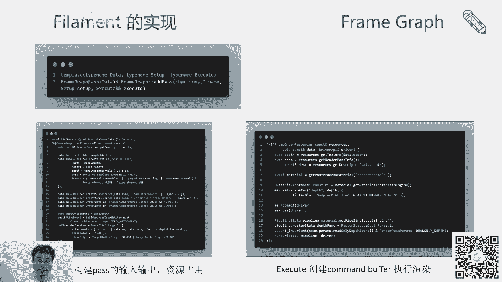

可以自己去看一下这个filment具体的实现，ok然后第三个部分我们讲到的是walking的优化，然后我肯优化这部分的，主要是我经验是移动端的，然后移动端的话，跟我们pc会有比较大的偏差差异。

然后呃大家在做作业的时候呢，应该会主要还是会用一些嗯，pc电脑在运行我们的作业，当然我们作业在手机上也是能跑的，只要是手机支持这个sample的特性，比如说我我在群里看到。

有已经有同学在手机上跑了那个homework，一。

然后移动端的优化呢，然后我们一般来说，我们常见的优化主要是守则呢，主要是依赖于嗯，主要还是比较依赖于。

比较依赖于那个他们的官方的提供的。

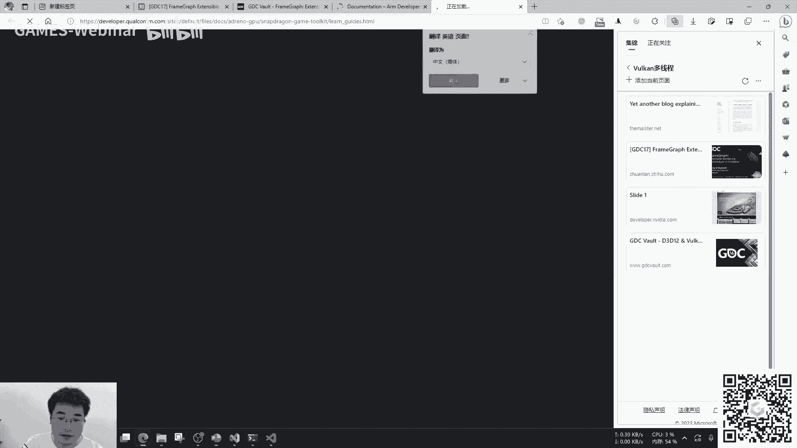

比较依赖于官方提供的那个最佳实践。

比如说目前两个提供，我觉得还是不错的，一个是arm的，一个是高通的，高通的会告诉你哪些是可以做的，这里有最佳时间会告诉你哪些是可以做的，哪些是最好不要做的，然后哪些是你应该做的。

哪些是避免他去做的。

我这个是那个arm的最佳时间。

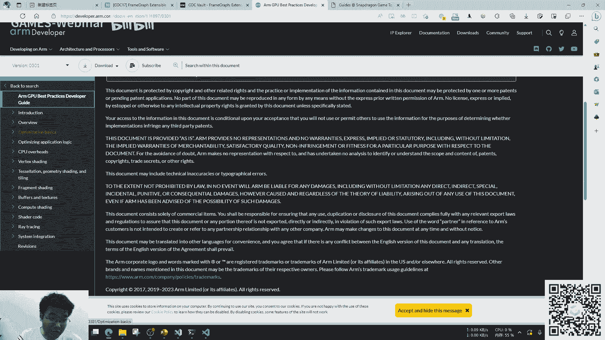

arm的最佳时间呢，他们会把欧文九可能会open 9，跟我可能会混合了起来写。

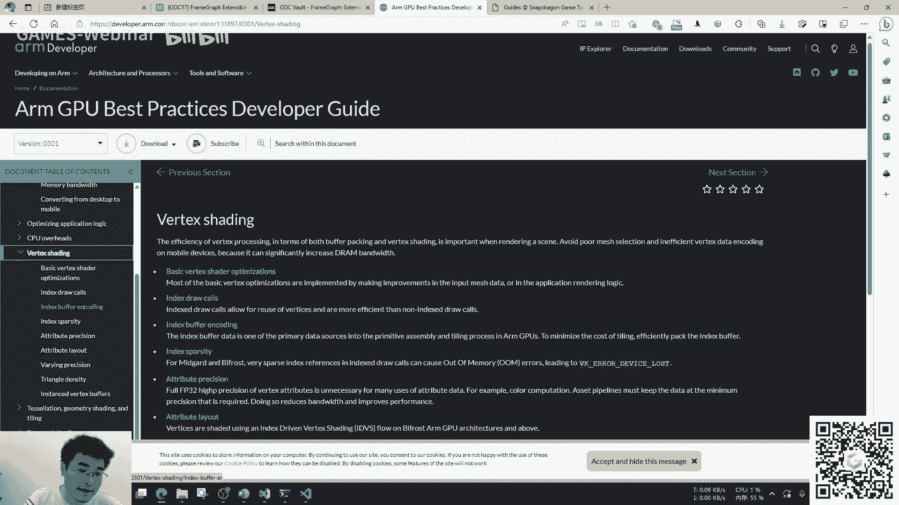

他会告诉你，比如说在这个地方，他会告诉你index交考，你最好用index交考，哪怕你的那个vs buffer跟white buffer并没有复用，你最好也是用index call。

对于它的驱动实现来说，intex交call会更优更有效，哪怕你们这些小号就非常简单，012345678 90，他也推荐你使用的，虽然有些事情是比较反直觉的，比如说ink交互吧，我觉得嗯在我一般看来。

可能说你那个交互增加了一次内存访问对吧，理论上感觉可能你最后增加了一些字典，那我肯定有一次寻址操作，那么我应该会更慢才对，但是嗯他们的最佳时间告诉你。

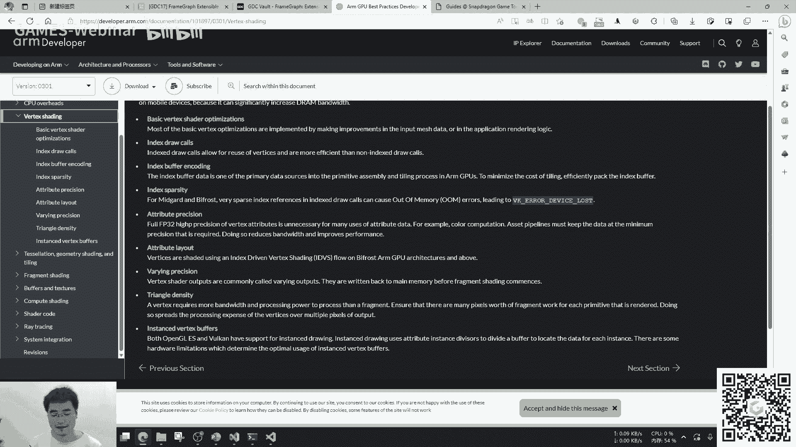

并不是这样子的，他你最好是使用index窗口。

使用index buffer来画这个在画这个几何的信息，所以说这个是移动端上，可能会有些事情会比较嗯，嗯我觉得是可能跟它的价格，就跟因为它的实现架构有关系。

跟我们真正想的可能会不一样，ok然后这边比较一个常用的，比如说不要使用32位index buffer，这也合理，因为移动端的来说，它的，对于移动端来说，它的那个带宽非常的珍贵，它的计算性能在很久以前。

大家都说他都已经说自己跟xbox比较接近了，它的计算性能非常厉害，但是他带宽始终是个问题，所以我们基本上的移动端的优化，都是考虑从带宽上面去做的，比如说在新的中比较尽量使用半精度浮点数。

那么什么时候不能用半精度浮点数，只能用全精度的呢，这个就是我们在计算位置的时候，ok我们在计算pation的时候，如果你用半精度浮点数一定是精度不够的，那么除此之外，其实基本上都是可以用半精度浮点数。

去做所有计算的，然后第二个不要做predepth，什么叫predepth，我们刚刚在刚才的p p t里面，就看到这个debuffer就是predepth，这个就是prede。

那么为什么移动端上就不要做呢，是因为第一个你perfect是增加了交号，第二个是移动端的那个体系架构，tell base rendering，他这个体系架构它就可以保证了。

我们之前说的从后往前画跟从前往后画，在它的实现中其实是结果是一样的，然后后面就是避免使用阿尔法，bland discard这种会破坏early z的渲染方式，然后什么叫early z。

就是我们在做深度检测，假如深度检测的时候呢，是会在fragment之前去做深度检测，如果我深度检测说我这个像素一定会被遮挡住，那么我的fragment shader就不会去执行了。

这个是a z的一个场景优化，默认这个都是会开着的，那么什么时候我的a z会被关掉关掉呢，就是说硬件没有办法去判断，你的这个像素会不会被剔除，一个是discard，我在shader中我告诉我gpu。

我这个像素我不要了，第二个是alpha blend，我要跟我的背景做混合，那么这个时候他的驱动一定会觉得，你这东西一定是想画的，至于你这东西会不会被挡住，那这个驱动就没有办法说了嗯。

然后第三个是repass中的attachment，尽量使用clear跟东的car，其实就是把它内存给清掉，嗯除非你有足够的理由说我想要那个，那它可以增原有的那个值，不然最好是用clear跟dcare。

然后不要使用uber shader，什么叫uber shader呢，就是通过uniform来控制分支，是通过uniform来控制分支，也就是说你的代码中。

可能通过非常多的uniform来控制一些分支条件，分支它这个功能开或不开，关或者不关的一种方式，这个我有经过测试，假如说大概会相差个20%到，30左右的性能吧，假如我在我的shader在运行之前。

我就知道他那些代码一定不会执行的，我通过红的方式去把它给把这个代码给关掉，把这功能关掉，跟通过uniform方式的去做，大概会差20%到30的性能，然后第三个是下一个是减少一次交换的代码量。

这块是jp的代码来，这个很容易理解，就是尽量我们来修的pass代码不要太多，太多的话，它会执行执行不动，ok然后刚才我们看到的就是，怎么避免阿尔法bland discard，这是一个常见优化。

比如说左边我们有这样的一张图片，一个箭头图片白色是透明部分，橙色是实体部分，那么我们可能会很想当然的说，那么ok我们画这张图片怎么画呢，就是通过alpha bl画一个方块作为阿法ban的过去。

把它贴到那个屏幕上去，然后我们的最佳实践告诉我们，尽量不要用阿尔法本来的，那我们可以怎么优化呢，我们沿着那个实体的部分的边缘，去抠出这么个轮廓，用几何信息去抠出来，用几何信息把它抠出来。

那么我画的就是一个实体的集合了，并不是一个开发ban的一个革命片了，那么通过这种方式的话，对于系统来说会就推于移用端来说，是一个会更好，这个场景优化，在我们在uni体引擎上是一个很常见的。

只要你觉得ut作为2d游戏，我发现一定有人会会遇到过这样的事情，因为其他把你的那个东西，会扣一个这样的东西出来，ok他们说关于有有同学问，关于周后再买量拆成两个，这个后面我来解释一下。

我举了个具体的例子，后面我会来解释的，然后最后一个减少通用寄存器的使用，这个通用寄存器使用呢，比如说我现在返回有两个vector 2，那么你尽量就不要用两个变量去存储，两个vex 2。

而是要把它in扣到一个vex 4里面去，a4 前两个是一个vex 2，后两个是另外两个vector 2，然后还有一些比较短的循环代码要拆开来写。

比如下面这种一个for循环，我写了四个函数，然后呢，最好是将下面的这个代码片段，写成展开的方式去写这个代码，除非你的这个是这个uniform，那么对他来说，可能如果是beautiful。

那我没有任何办法，我无法展开，那么只能写循环，那么当你可以展开的时候，尽量通过展开的方式来写，对刚才有同学说那个两个折扣会性能更好。

这个我们就来看一下，这个就是我们优化的一个常见也不常见吧，我们优化一个老大难的问题，灯光渲染，离子灯光渲染，我们一般来说就会有两种渲染方式，一个differ来，一个叫ford it。

然后differ lighting那个固定differ lighting，一般流程是我们会在分多个pass，第一个pass我们会一个g buffer的pass，会把所有的mesh画到屏幕上去。

把他们属性给提取出来，他们normal formula都提出来，然后后面有多若干个灯光的pass，有一个灯光我会就会有一个灯光的地方的灯光，pass两个灯光，我会两个灯光pass。

然后在light light pass的那个shadow中呢，会计算每一个灯光的shadow，如果他有shadow的话，会计算每个灯光shadow，然后再会计算每一个灯光的那个那个属性，这个地方会有个。

但是它有好处，就一个是每个pass都非常清亮，然后而且对灯光数量没有太大限制，因为灯光越多，你只要后面的pass越多，你往后面加对吧，他总能够跑完的，而且这个技能代价也是可预估的。

就是说跟你的那个灯光的数量成正比，成一个线性关系，然后这边会有个问题是working so pass，可以解决我们的一个带宽的问题，是因为在移动端的tale base surrendering，呃。

这里我不详细展展开了，我只能说我们的我的伪代码是这么写的，但是你真正在working上实现的时候，要用三pass去实现，我们的这个g buffer的那个deflight的方式。

它可以一部分情况下可以解决带宽的问题，但是实际的实现告诉我们，其实这个效果并不好，就是说这个优化会有一定程度的优化，但优化程度并不高，然后目前常见的两个游戏引擎，像虚幻unity，他们使用的都是这个。

可他们实现的都是这种defaulting，然后后面我们再看这个优势，也非常非常那个明显，因为他当你想要做的场景非常复杂，那么就是需要这样的一个方法，而且几乎对每个灯光都没有限制，只要你的性能够。

手机性能够强大，他总是能够满足你的需求的，这就是defaulting的好处，然后下面是for the ting for的话，比较常见的像filment，就是针对手机端做一些那些优化。

然后做一些可适配的优化的时候，像就是它的场景一般不复杂的时候，我们会优先选用forword，lighting forward来听它的流程是这样子的，我们每一个mesh，一个mesh，一个pass。

一个mesh，一个pass，在一个pass中，我们把所有的灯光计算都计算好，每个灯光都会计算它的阴影，每个灯光都会计算它的协定，所有灯光都会计算好，然后这个优势就是更适配移动端的。

televise rendering，对tabienergy是适配的非常好，但是呢它的缺点也非常明显，pass代码量会很多，然后呢它会有灯光的数量限制，假如我的灯光数量有16个或者20多个灯光。

我的场景下其实就不适合了，是因为我们的一个forward lighting pass，里面的那个代码量就会非常的重，这个问题就回答了，刚才那个有弹幕，有个同学问，就是交换代码量拆成两个会不会更好，呃。

当你的就是我们可以在这个case里面看到，我们的forword lighting的代码量，有时候当你太重的时候，确实是需要做一个呃这样的事情，当然我们最最终我们想要的事情是，最好不要去做。

你在你设计在系统的时候，就应该限制它的一个情况，然后我们再来看一下我们具体去怎么想办法，去怎么优化的事情，因为这两个很难抉择嘛，我们总是有各种限制，就是当我的场景就是说我是个大场景，游戏场景。

或者一个很复杂场景的灯光，就是有十几个，那么我该怎么办呢。

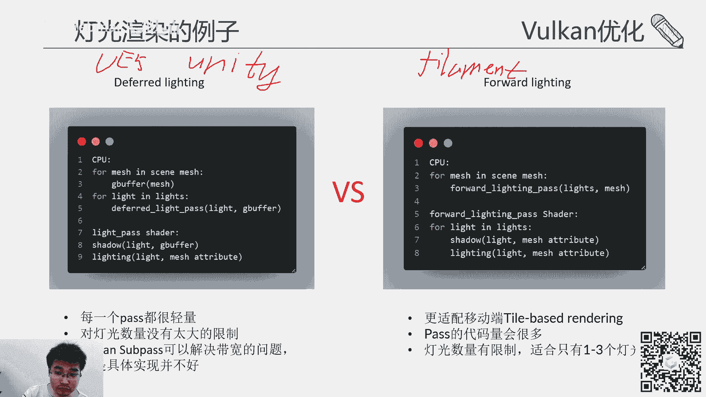

ok然后呢，这个就是我们可以想到的一种优化方式，这个就是回答刚才那个同学说猜pass会不会更好，呃，我们的我这边的实践经验是通过这种拆分方式，性能会提升100%，不是50或者是100%。

也就是增速可能百分之百可能有点过了，60%到70 70，60%到70的性能提升是可以达到的，当然我这边的说的是，我们灯光数量还是相对来说比较多的一个情况，第一个是这个时间方式的。

第一个我们还是要限制灯光的数量，比如说方向光，因为方向光的计算是每一个他都会去算，因为方向光是一个你没有办法解的一个问题，因为每个方向光它总是会去，每个物体都会被发现光照射到。

所以他这个计算量就摆在那里，所以说我们一般来说会在移动端，尽量减少控制方向，光的数量，一般控制到三个左右，你再多可能性能就比较差了，你无论怎么实现性能都好不到哪去，第二个是阴影的数量。

我们知道我们计算shadomap，这也是一个很依赖于以手机带宽的一个信息，是因为你要计算一张shadow map的这么一个纹理，它也是一个依赖带宽的一个事情，所以说我们要控制这两个东西。

这两个东西在我们移动端上是优化的，一个非常的平静，没有办法任何办法去解，然后我们这个地方依然是使用forword lighting，我为什么要用forword lighting呢。

是因为我们的场景differ带宽，没有任何解决办法呃，游戏引擎，可以说我做的引擎非常高级，你可以用你比较好的手机跑，你跑不了，那我也可以理解，比如你玩原神，ok我的高通六系原神可能跑起来就卡卡的。

我必须拿一个我们最新款的什么小米13ultra，什么的，我才能够流畅运行对吧，你连这个连usa都不能运行，你怎么能有愉快的玩米哈游呢对吧，这个这个也是一个游戏的开发的一个思路。

他们可以接受这样的一个现实，它并不要求所有手机都能够去运行，然后但是我们的应用场景呢，是尽量要兼顾到很多低端手机，因为我们并不是游戏，然后我们的开发的产品呢，会确实有很多低端用户。

低端手机或者不能说低端吧，反正性能比较差的手机会去运行，所以我们要兼顾到他们，我们不能用用differ，所以我们还用forword，然后我们最后实现的具体实现了，就说我们每个带阴影的灯光。

我们要单独一个pass，就这个地方我们对于每一个灯光的计算，我们会有一个单独的pass去计算在阴影的灯光，因为阴影灯光会有阴影计算，然后第二个是我们不带阴影的灯光pass，不带阴影的灯光pass。

我们会有一个专门的不带阴影的灯光的pass，这里所有类型的灯光我们都能在我们这里计算，因为一旦当你没有了阴影之后，你会发现它的lighting计算的代价其实是不大的，我为什么要区分这两个呢。

是因为如果你们在写到一个新的时候，它就变成了这边不推荐的，uber写的就类似于这个uber写的，我们要通过一个uniform，去判断这个灯光有没有阴影。

这种方式就是他不推荐的，所以我们就会优化说，我们会把它拆成不同的pass去做，然后假如我在场景就是很多个灯光，有60多个灯光，然后60个点光源，60多个方向光，但是局部比较好。

这个时候我们就用cast lighting，然后经过我们这样的实践。

可以比这里的forword来听，会多提升60%左右的性能。

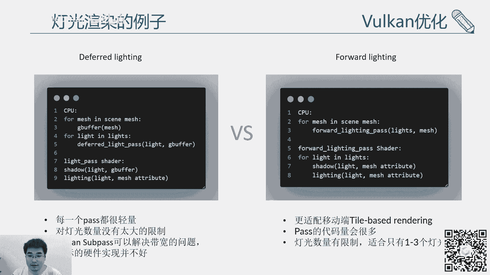

这样子，我一下可能会有60%左右的性能提升，当然这个性能提升也是有很大的限制，在那边并不是说所有场景我都有这么大提升，它只是从一定程度上放宽了灯光的限制，之前封过的我只能有三个方向光或三种灯光。

那么我现在我可以数量可以提高上去，我点光源或者比较小的the sport的灯光，我可以有几十个也能跑，跑的起来了，然后呢，我们对于带宽的要求也没有default lit那么大。

因为different lighting，我们回到观看different lighting这个东西。

它始终在移动端上，带宽始终是一个老大难的问题，你没有任何解决方案，对对他来说，而且一旦你的带宽使用多了，你的手机续航也会下降，你又一跑起来，你的程序就会发热。

然后它的缺点也非常明，显，是因为我们原来一个模型跑一次小跑，那么我们现在的层数就变成了match数量，原来的数量是n，就是现在呢被乘上个m嗯，就是mesh乘上个灯光的数量，这个是它的不足之处。

就会把那个交号变多，那么这个也就回答了，刚才那个同学的那个问题了，两个拆分交call是否是性能会更好呢，我可以回答，你有时候会比如说我们在这个情况下，它就是会的，然后他也有个不好的缺点，就是透明物体。

其实它的结果计算是不正确的，我们呃经过实践，其实没有办法，真正的把透明物体的结果混的特别好，然后嗯但是可以让它看上去还可以，这个又回到图形学的一句话，当一个东西看上去它是对的，那么它就是对的。

ok然后这个就是我们关于一个working的优化，我也简单的提一下在移动端的一个优化，然后并以一个灯光粒子告诉我们，怎么样去看待那个厂商的那个最佳实践，那么最终我们在开发的时候的守则，尽量按照那个厂商。

就是你的驱动厂商给的最佳时间，我们来开发，然后不要想当然的觉得，好像我在电脑上这样跑是有效果的，我们在手机上跑效果是不是这样子呢，得打工跑或者手机上跑，这样子是ok的，我们在我们的电脑上跑。

这样的效果是不是一样的。

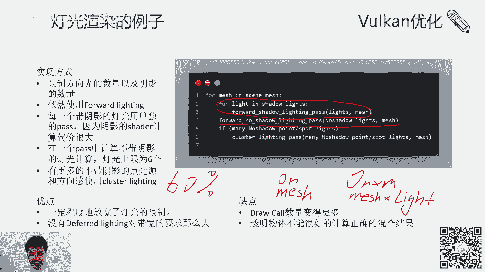

也得打个问号，是因为这两个的体系架构其实是完全不一样的，ok最后那个课程也可，那么最后就就谢谢大家来，欢迎看看我们的课程，然后最后弹幕呃，有没有什么疑问想要我回答一下吧，嗯做一可以延长一点时间吗。

这个可能嗯，当然我这个作业可能布置的也不太好啊，有同学问作业一可以延长一点时间吗，作为一定的时间是一个月，而且中间因为五一跟我生病还延了两周，可能嗯并不能满足，你，应该不能再赢了，而且作业量我觉得。

应该不是特别大，虽然说也不少啊，也不少，作业量应该也不是特别大，老师怎么看沃克的未来，嗯我对于沃克的未来是有点悲观的，是因为我觉得他太难写了，没有另外两个dx 12跟苹果的mental好用。

假如说我有的选的话，我大概率不会选，我肯我会选择d32 或者meal，而且在很多时候我可以open jo，就是我一定要用working的场景下，很多时候我用open 9也能解决，沃肯对于open启用。

其实它最大的优势是可以减少你的cpu的占用，所以我对我可能会来嗯，跟open集合的未来还是一样，我觉得他们嗯厂家提供了一套标准，但是具体实现又看驱动并没有，那就是高分局，大家被大家很多人诟病。

就是有这个原因，徐总说你有厂商也说你有，但是你真正一跑发现并没有这个功能，我可能其实也会有这样的问题的，就是太依赖于驱动厂家自己来做的东西，就没有办法了。

嗯f g的虚拟资金源是怎么回收的，ok这个我回过来讲一下啊。

有同学问fg的虚拟资源怎么回收的，这里我们可以看到，当然我这个例子可能不是特别的好，因为我这个例，我这简单的福音，布拉夫是没有办法给大家看到资源的那个复用，他有一弗林格拉夫，他有两个重要的事情。

一个是复用，一个是那资源管理费用，就是说当我一张一张图，我在这个pass之后就再也不会被使用了，也就是说，那么我在后面就可以作为另外一个pass的输出，去被使用，然后我们在接口的时候。

在set up的fragrf的这个set up的阶段，就可以知道哪些资源能够被复用，哪些资源不能够被复用，然后fengrave他会有个compilla的，一个就是编译的一个阶段，我们在编译的阶段的时候。

它就会自己去通过拓扑关系去计算他的资源，他的性资源嗯，他会有个性资源的词，然后再去做，呃有同学问doma rendering性能如何，这个我不太清楚，因为这个我没有。

我没有真的去运行过doma rendering，这我这我不是很清楚，我没有实际的去去很好的去研究过这个问题，ok那大家没有问题的话，那我们课程就到此结束了，然后下节课由袁娅正博士，给大家上那个新的内容。

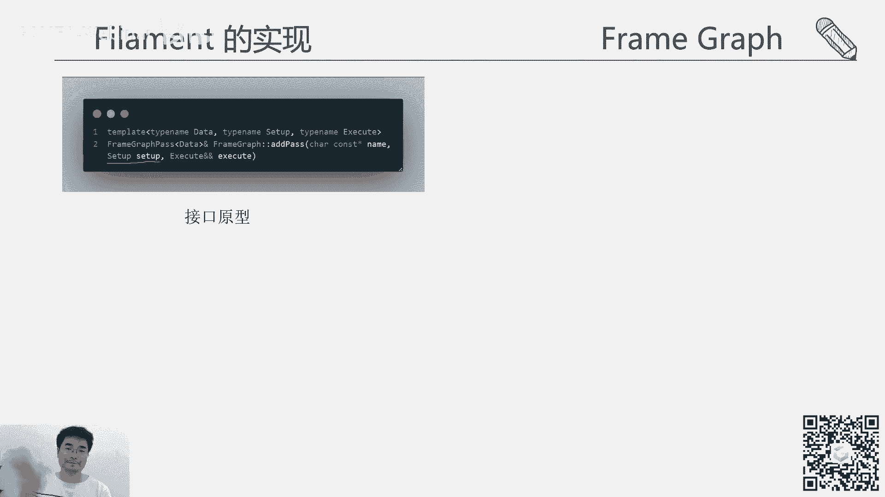