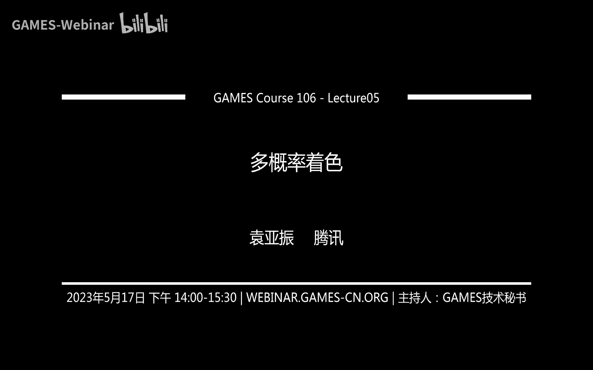
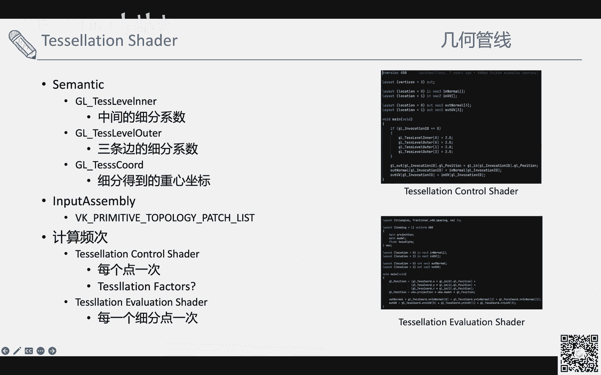
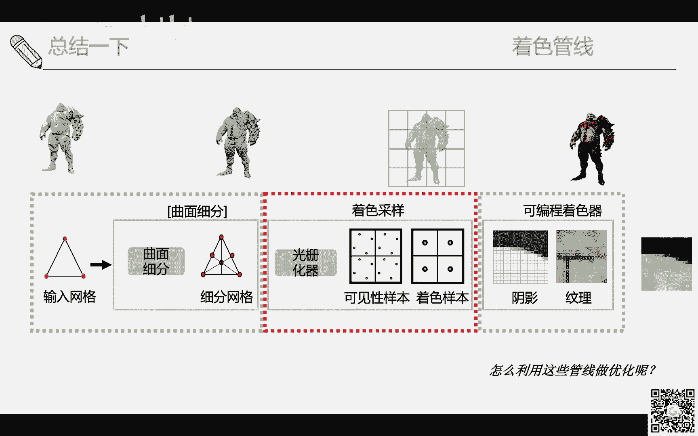

# GAMES106-现代图形绘制流水线原理与实践 - P5：5. 多频率着色 🎨

在本节课中，我们将要学习现代图形绘制管线中的多频率着色概念。我们将从绘制管线的基本计算频率开始，逐步介绍几何管线和着色管线中的不同着色阶段，并探讨如何利用多频率着色的思想进行性能优化，在保证画面质量的同时提升渲染效率。

## 绘制管线中的计算频率 📊

上一节我们介绍了课程概述，本节中我们来看看绘制管线中计算频率的基本概念。

最简单的计算频率理解是：顶点着色器（Vertex Shader）每个顶点执行一次，片元着色器（Fragment/Pixel Shader）每个像素执行一次。在定义管线时，先对每个顶点执行一遍顶点着色器，然后进入光栅化阶段。

然而，真实的绘制管线远比这个复杂。从输入网格开始，管线经历了曲面细分、几何着色等阶段。在DirectX 9之后，管线变得越来越复杂，引入了可见性样本、着色样本等概念。可编程着色器内部的计算频率和缓存频率也各不相同。本节课的目标就是梳理这些概念，并探讨如何优化。

## 几何管线 🔷

在介绍现代绘制管线之前，我们先了解一下早期影视制作中使用的管线。

早期（约1987年）的管线被称为“REYES”（Render Everything You Ever See）。为了在大荧幕上获得连续平滑的曲面（而非三角形构成的棱角），它使用了参数曲面，并通过细分算法（如Catmull-Clark细分）生成更平滑的几何体。

其核心架构是“Split and Dice”：
*   **Split阶段**：将输入的参数图元分割成更小的图元（Primitive）。
*   **Dice阶段**：将参数曲面细分成更小的多边形（如微多边形），每个多边形大约一个像素大小。
*   细分后，可以在顶点上进行着色计算（包括求交和光照），最后通过像素点在各顶点间的插值得到最终颜色。

现代实时绘制管线的许多概念都由此演化而来，因为我们的目标始终是尽可能地逼近影视级的渲染质量。

### 顶点着色器（Vertex Shader）

现代管线始于顶点着色器。在此阶段，我们需要定义输入装配（Input Assembly）和顶点输入数据。

以下是定义输入的基本步骤：
1.  定义图元拓扑（Primitive Topology），最常用的是三角形列表（Triangle List）。
2.  提供顶点输入数据（Vertex Input Data），通常包括顶点缓冲区（Vertex Buffer），并常配合索引缓冲区（Index Buffer）进行索引。
3.  如果使用实例化（Instancing），还需要实例缓冲区（Instance Buffer）。

GPU执行时，会根据顺序为每个顶点执行一次顶点着色器，并将结果写入。GPU会缓存已执行过的顶点结果，避免对共享顶点重复计算。

### 几何着色器（Geometry Shader）

顶点着色器的一个主要限制是，其输出的几何体必须在CPU端预先设定。为了提供更灵活的几何修改能力，DirectX 10时代引入了几何着色器。

几何着色器的好处在于可以自由地修改几何。例如，一个三角形输入，可以输出其法线进行可视化，或者输出多个三角形，甚至改变拓扑结构。

然而，由于其过于自由，GPU难以进行有效的任务调度和性能优化，因此几何着色器在实践中被认为不太成功，使用相对较少。

### 曲面细分着色器（Tessellation Shader）

为了解决几何着色器的性能问题，并提供可控的细分，DirectX 11引入了曲面细分着色器。

其工作流程如下：
1.  **曲面细分控制着色器（Tessellation Control Shader / Hull Shader）**：设置细分参数。对于三角形，包括三条边的细分因子（Tessellation Factor）和内部的细分因子。
2.  **固定功能曲面细分器（Fixed-Function Tessellator）**：根据细分参数生成更多的顶点。
3.  **曲面细分求值着色器（Tessellation Evaluation Shader / Domain Shader）**：计算新顶点的属性（如位置），通常利用原始三角形的重心坐标进行插值。

曲面细分可用于实现平滑几何（如PN三角形）或增加几何细节（如位移贴图）。在地形渲染中，它常用于实现细节层次（LOD）。

使用曲面细分时需注意两个问题：
1.  **共享边的细分因子匹配**：相邻三角形的共享边必须使用相同的细分因子，否则会产生T型连接（T-junction）和裂缝。
2.  **顶点数据一致性**：进行位移映射时，共享顶点应使用相同的法线和UV等属性数据，否则也会产生裂缝。这通常通过计算平滑顶点法线（Smooth Vertex Normal）或强制生成相同的顶点数据（Duplicate Vertex）来解决。

### 网格着色器（Mesh Shader）

随着计算着色器（Compute Shader）的引入，程序员获得了更大的自由度。DirectX 12 Ultimate进一步引入了网格着色器（Mesh Shader）架构。

网格着色器将几何管线的部分工作（如裁剪、LOD选择）转移到GPU上，以任务（Task）和网格（Mesh）的形式进行更高效、更自由的并行处理。它提供了比曲面细分更灵活的计算粒度。

我们来总结一下几何管线中各阶段的特点：
*   **顶点着色器**：每个顶点执行一次，不知道图元拓扑。
*   **几何着色器**：知道输入图元拓扑，但输出可变，调度效率低。
*   **曲面细分着色器**：采用固定模式，速度较快，但灵活性受限。
*   **网格着色器**：沿袭计算着色器的自由度高，且带有几何感知，适合特定高效应用。

## 着色管线 🖌️

介绍完几何管线，我们转向管线的另一半——着色管线。本节我们重点关注像素级别的着色计算。

### 基础光栅化与片元着色器执行

在最简单的光栅化中，一个三角形覆盖的像素会执行片元着色器。但实际执行是以像素块（如2x2的像素Quad）为单位的。这是为了支持求导指令（如`ddx`, `ddy`），这些指令需要与相邻像素比较来计算梯度，常用于纹理Mipmap选择。

片元着色器在Quad上执行，但只有被覆盖（Coverage）的像素中心才会真正写入颜色和深度。

### 多重采样抗锯齿（MSAA）

基础光栅化会导致几何边缘出现锯齿。多重采样抗锯齿（MSAA）的核心思想是在比像素更小的尺度上进行可见性计算。

在MSAA中，每个像素包含多个采样点（如4x MSAA有4个采样点）。这些采样点用于深度/模板测试，以更精确地确定三角形覆盖像素的比例。

着色计算（片元着色器执行）通常仍在像素中心进行（每个像素一次）。然后，根据覆盖采样点的比例，将计算出的颜色混合后写入。

与无MSAA相比，MSAA的代价在于：
*   深度/模板测试的样本数量增加。
*   片元着色器的执行次数可能增加（因为部分覆盖的像素也需要执行）。
*   写入的颜色数量增加。

MSAA通过增加采样点来提升几何边缘的质量，同时相比于单纯提高分辨率，它减少了片元着色器的执行次数（每个像素通常仍只着色一次）。但如果有多个三角形部分覆盖同一像素，着色次数仍会增加。

现代API提供了对MSAA更细致的控制，例如逐采样着色（Per-Sample Shading），允许对每个采样点分别执行着色。

### 可变速率着色（VRS）

与MSAA在更小尺度着色相反，可变速率着色（VRS）允许在比像素更大的尺度上进行着色计算。

例如，可以设定2x2的像素块只执行一次着色计算，其余像素通过插值得到颜色。这可以显著减少着色计算量。

VRS可以通过多种方式控制：
*   **基于图元（Per-Primitive）**：为特定物体（如远景物体）设置较低的着色率。
*   **基于屏幕图像（Screen-Space Image）**：提供一张纹理来指定屏幕上不同区域应使用的着色率。这可以是静态的（如VR中中心区域用高着色率），也可以是自适应的（根据画面内容动态生成）。

VRS可以与MSAA结合使用，实现更灵活的着色质量与性能平衡。

总结一下，着色管线关注的是采样率和着色器执行。着色频率直接影响图像质量。多频率着色的核心就是在计算性能与图像质量之间寻找最佳平衡点。

## 多频率着色优化实践 ⚙️

了解了管线提供的各种计算频率后，本节我们来看看如何利用多频率着色的思想进行实际优化。

进行多频率着色优化的前提是正确识别信号的频率。

对于几何信号：
*   **高频区域**：法线变化剧烈、几何细节丰富的区域。
*   **低频区域**：平坦、光滑的区域。
优化思想包括：对高频区域保留更多几何细节（如更多三角形），对低频区域进行简化；或者将高频几何细节编码到法线贴图、位移贴图中，而基础网格保持低频。

对于着色信号（屏幕空间信号）：
*   **高频区域**：光照变化剧烈、纹理细节丰富、运动剧烈的区域。
*   **低频区域**：光照平缓、纹理一致、或距离很远的区域。

学术界和工业界有许多利用这种思想的工作：
1.  **基于内容的自适应着色**：通过分析屏幕像素间的梯度（变化），推导出全分辨率、半分辨率等着色结果之间的误差，从而动态决定每个区域使用何种着色率，以在视觉无损的前提下降低计算量。
    **公式示例**：`误差 ≈ K * (相邻像素差异)`
2.  **时域自适应**：不仅考虑单帧画面内容，还考虑帧与帧之间的运动（Motion Vector）和遮挡变化，在运动剧烈的区域采用更保守（或更激进）的着色率策略。
3.  **材质速率着色（Material Rate Shading）**：更进一步，在着色器内部对不同部分采用不同频率。例如，漫反射（Diffuse）可能是低频的，而高光（Specular）或阴影边缘可能是高频的。现代引擎中已有类似应用，如环境光遮蔽（AO）或全局光照（GI）常使用半分辨率计算再加模糊。

除了在像素着色器内部优化，还可以考虑将低频的着色计算（如某些光照）上移到顶点着色器或曲面细分阶段，通过插值来获得像素颜色，从而减少像素着色器的负担。

## 总结与作业 📚

本节课我们一起学习了现代图形绘制管线中的多频率着色。

首先，我们回顾了绘制管线中从几何到着色的各种计算频率，包括顶点着色器、几何着色器、曲面细分着色器、网格着色器、MSAA和VRS。理解这些频率是进行优化的基础。

其次，我们探讨了多频率着色优化的核心思想：识别几何和着色信号中的高频与低频区域，并利用管线提供的不同计算粒度，对低频区域采用代价更低的计算方式，在保证视觉质量的同时提升渲染性能。

**课后作业建议**：
请以“Visually Lossless Content and Motion Adaptive Shading in Games”等相关论文为基础，尝试实现或深入理解以下两点：
1.  **基于内容的自适应着色**：如何根据画面内容（如颜色、深度梯度）动态决定着色率。
2.  **时域自适应扩展**：在运动场景中，如何结合运动向量进一步优化着色率策略，以处理运动模糊和动态遮挡。

通过本课的学习，希望大家能够建立起利用多频率思想分析和优化渲染管线的能力。