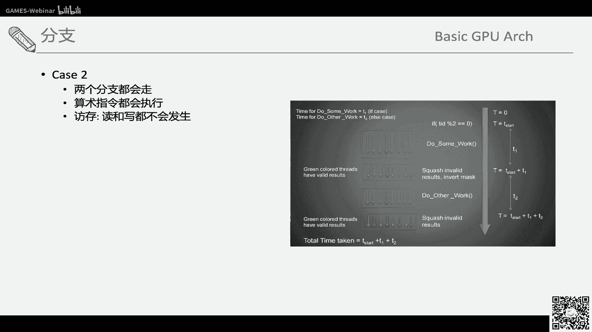
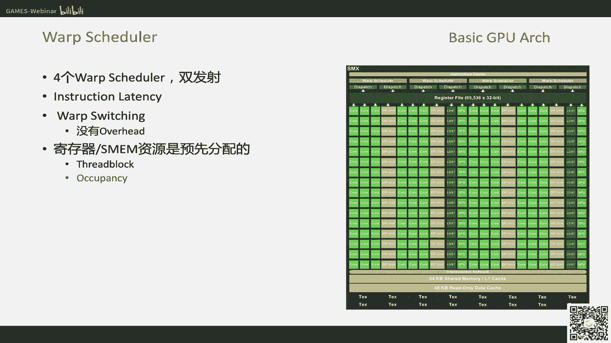
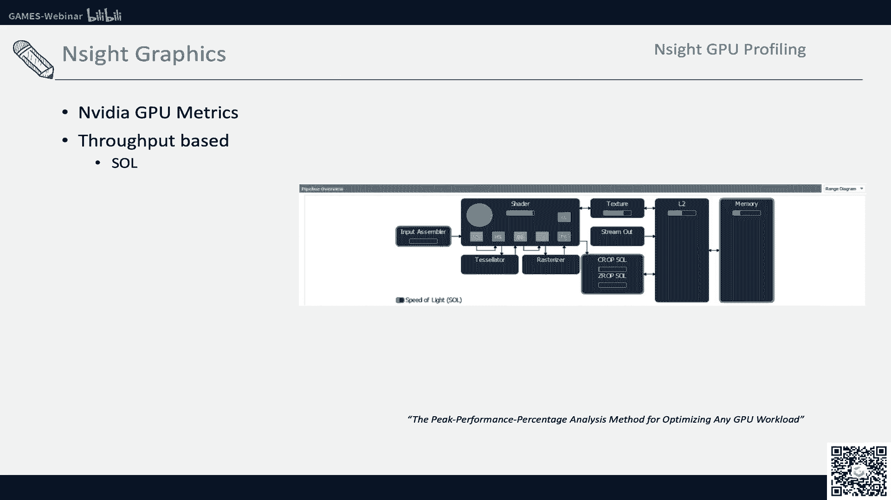
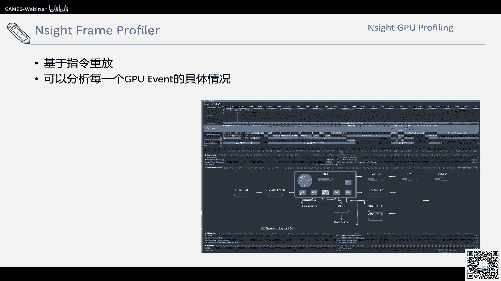

# GAMES106-现代图形绘制流水线原理与实践 - P6：6. 性能分析 - GAMES-Webinar - BV1Uo4y1J7ie

好嗯，两点半，然后我们现在开始，嗯那今天主要给大家讲一些，可能时间中常用的这个走性能，性能性能不要优化了，性能这个分析的这样的一个一个理念，然后，今天主要可能大概分三块来一想，第第一块是。

第一块可能介绍一些简介，第一块会是一些简介，介绍一些性能的相关的概念，第二第二块会介绍一些基础的这种gp架构，在什么样子，第三个可能介绍一些pc端常用的gpu proping，一些东西。

那一个最基本的概念，其实就是为什么要写出高性能的代码，那其实在在绘制里面，一个高性能的代码，其实最简单的描述其实是帧率，高帧率其实是代表了这个更流畅的画面，更低的延迟，比如说ip游戏的时候，你打枪比原。

就是你你的你的视角会比别人更流畅，然后你你的触发的更准确，针对要求呢其实不同的平台的话，或者游戏类型也不一样，主机比如说一般可能到60fs就就差不多，然后手机呢可能32s也能玩，vr的话。

因为它的延迟啊，他的这个延迟要求更高，那可能要90a b s，那除了这种这种之外呢，其实也会要求对，其实除了帧率本身的这个高之外，其实对帧率的这种平稳性也是有要求的，就是你你在不同的视角下。

你是针对需求稳定的大概率，而不能是一帧高一帧低这样一个，那如果你要写出这种所谓的高帧率，能跑出高帧率这样的程序呢，其实这里面其实会涉及到cpu和gpu百分，都会有涉及到，那cpu和本身。

cpu和gpu的本身的价格上其实就很很多不一样的，那从cpu来看呢，它其实就是cat大，然后有很多控制单元可以写出，很复杂的这种c加逻辑，要做这种控制单元多，而gpu呢其实本身就是为了吞吐量设计的。

就是高并发的一个东西，他其实很很多时候都是为了处理大量的这种，数据准备的，那这种这种这种本身这种他们的架构上的不同，也会导致了你在写程序的时候，需要同时兼顾两方面。

那cpu和gpu呢其实是需要很好的协作，才能写出这种比较高性能代码，因为现在的你首先第一个是cpu的话，其实你需要更好的将是将这个绘制数据，最好的就是按批量的去准备给gpu。

因为你gpu我一次可能就几千个任务的话，你一次只慢慢给慢慢给，其实这个任务其实会造成gpu等待，然后其实很出名，很早之前最早的时候其实就会特别强调cpu的，这本身的这种就是你要把任务带起来扔给gpu。

第二个点来说，其实cpu虽然没有gpu的那个呃，合数多或者多性更多，但其实cpu本身也是在不断的扩充自己，这种多任务的能力，cpu的核数也在涨，这种教不化并行化，其实在2015年或者14年。

这种时候也在讲这种并行的编程应该怎么做，其实你可以看到cp这种如果b形化编程的时候，这cpu的任务怎么做，b尤其是现代的word的api怎么做，并行的提交，就是各种各样的帮助他们list这些东西。

其实也是为就是在也就是在api层面，也为cpu的b cpu的多核化做准备，整个cpu和gpu其实是整个底下的架构，那如果从引擎层面来看，其实你完成一个绘制任务，其实需要很多很多东西，一个游戏逻辑来说。

你可能这个是一个unity的一个基本的这个game loop，大概是这个样子，一开始可能有不同的physics，就是说你有不同的物理引擎啊，或者一些东西，这些是l cpu计算的。

那你你会处理不同的树世界，然后你有本身你有很多脚本，你处理怪物呀，或者是攻击啊，或者各种各样的判定啊，这样的逻辑其实render也相对来说，反而是这个逻逻辑比较清晰的一点，相对gpay说呢。

其实它是会有做render，render之外呢，其实还有各种各样的认定，gimo的认证啊，g i认证啊这些东西，那这个loop里面其实就可以看到，它的任务是有明显的分阶段，分不同的类型的。

然后有为了应对这种东西呢，其实现在的一般的引擎其实会做两种，就是你会把把线程做拆分，你会有game thread，会有render thread，就game game thread可能就是会专门做。

比如说就刚才的一些物理呀，或者说是一些game player这些逻辑啊，但这个game thread更多是说一个主的这个逻辑，你本身其实因为你cpu很多很多河嘛，那你其实这个game当中。

比如说我有很多适合并发的任务，或适合异步的任务，也会扔给的任务线程去做，然后这些东西，这些就是说如果比如说有很多物体的，比如说物理判定或者很多物体的game play date的执行。

也可以通过不同的任务显示去做，然后除了game set之外呢，在做好这些game的逻辑之外的rent之外，更多的体育是，比如说是控制这个绘制的逻辑应该怎么做。

我game把把所有的物体或者物理这些都决定好了，我的动画都播放到这个位置，我已经定好了，那rent read，把那些所有的这场景中都要绘制的物体，比如说你要做剔除，把绘制物体数据准备好，准备好之后。

材质包括材质，包括pad准备好提交给我，那除了这种rs帅之外呢，其实有可能还会有，比如说ue可能还会提供一个h i h i s read，他是专门做这种working指令的这个提交的。

但是这里面我们可能就在一起，我们统称这把render read，就是rent read，更多管绘制的东西，它从gather把把game已经弄好的数据提交给render thread。

提交给wan指令都叫都叫做render thread提交，我把比如说我现在写了一个wen指令，比如welcome set draw index，那其实这个时候呢它本身其实并没有驱动。

还没到还没到gpu上去，针对执行这个指令提交给gpu之后，gpu也会把这些指令放到一个队列里面，其实我们在welcome的时候，你也可以看到他一个q这种还没类似这种东西，放到队列里面之后。

gpu根据自己的调度，会把你的这个东西就真的放在gpu上去执行，那这个时候你可以看到就是说game thread，一个有一个比如说做n真的时候，我game redna tik完。

我交给render spread去gather我这个dn真的，所以要会煮的东西提交，我的天真的这种这个汇率指令，可能然后提交给walking指，提交了working指令之后呢。

驱动本身可能就会把这个working指令，翻译成对应的这种，就是你直walking之类把你对应的gpu指令，然后这个时候他其实也是在排队队列当中，gpu自己的调度去会去掉。

我这时候开始ok等到等到这个指令该执行，有空闲的时候，我开始执行你这个你这次提交的部分指令，那你这些我只能提交之后呢，你其实我们会有，就因为我们之前会有400 800这种东西嘛，那其实你会交给一个。

交给一个就是离线的这种就是fan buffer，然后你画上去，因为这个时候呢其实等到你画完之后呢，如果vc信号来了之后呢，你就做一个交换链，display的时候，就会把你这个点真刷到屏幕上。

其实整个新引擎也是一个，相当于流水线一样的形式，才在做这样的事情，那如果因为我们现在是一个按流水线的方式，来进行这样的事情，那其实那其实现在就是如果我们测帧率的时候，其实是最慢的一环，决定了最终的ip。

也就是说你这个流水线如果正常变形器，你其中最慢的一会儿，会拖累整个最终的表现的表现，我们可以看到，比如说ui里面你用就是按键，就是用set这个指令，其实可以看到它不同的呃，不同的线程。

这种这种里面的这个执行时间，可以看到看到有game game，就是我们只能说game thread，render thread，可能更多的是说这个就是通通常意义的就draw。

就是render read h i h i t，可能是就是说这种专门的做working令提交或，dex提交这种填充的之类的，然后真正的gu执行呢，其实是呃会在那个就是真正的gpu执行的是。

比如在这里面看的是9。1ms，那其实整个帧率其实就是被这个gpu执行的，是卡特列，就是我们常说的gpu爆的，然后其实你就从这一点来看，其实就会找出你如果比如说我现在性能，我认为它应该达到160。

比如说六六十帧，现在只跑30帧，那其实你首先可能要定位到的是，说我到底哪出问题了，这几个线程这样异步提交，这个管线里面哪出问题了，其实你需要测量，这里面每一每个环节大概需要多少，一般来说呢。

display其实是不太会需要你那个，因为display的话高刷新屏它一般是固定的，虽然说我们可能有那个vcg cfc这些东西，但基本上我们一般认为它就是微信，比如说如果你开了个微信的话，那就60帧。

但你也可以把微信给关掉再去测，微信关掉之后，他就是整个的指令就不会等这个微信信号，那我如果把把display这个东西去掉之后呢，我们要测，其实就是要测不同的这种县城里面一针，比如说时间。

它它的瓶颈在什么地方，其实在game，我们刚才说的game game，sweet respt其实都跑在cpu上面，那它的性能测试就相对比较简单，比如说你就拿你在每帧之前。

还有每帧之后你用这种呃cc加提供的，比如说类似于一种daddy clock，你可以看到这种两两帧的时间戳，那有了这两线戳之后，你得到时间的结果，其实这里面就遇到一个问题。

是说你你在你在你现在在gpu上的时间，你怎么测的，那一些一些常见的误解，是说我在比如说提交，以常见的误解是把working指令的提交时间点，当做gpu执行的时间点，其实这里面就是一个误解。

因为work on指令时间点只是你提交指令的时间，并不能代表你真的执行完，就是说这个这个指令单机票真的执行完，当然你可以用比如说类似于flash这种指令，强制让他刷新。

但这种其实会非常严重的影响真实的性能，所以其实gpu其实为了真正的去知道gpu上面，它的执行时间大概是什么样子的，其实我们一般会提，其实会真的会使用的，其实是gpu的事件处，也就是walking。

会提供自己的这种那个时间戳函数，就是你比如说你在t0 的时刻，你你set一个worker command，writer time time time，也就是说gpu上的时间戳，你提议的时候就是你在提交。

比如说你在提交第一个这一帧，提交第一个wwen指针之前，你先设一个时间戳，写一个时间戳，然后在你交完最后一个指令之前，先给我讲讲，写指令之后再写第二个时间戳，那这样的话他在gpu在执行的时候。

也会也会分别在之前桌上记录下，我真的gpu上执行的时候，这个时间戳到底是几号，那这里面比如说我现在写的t0 和t1 ，然后我通过get query这个东西，等到几年之后再把这个时间轴快了出来。

才能知道真正在gp执行的多少时间，这里面其实有一个点，其实就是因为我们刚才说到，就是就是你真正的wan指令提交和gpu执行，其实是有个延迟的，一般都是要延后几帧，比如说真的能t1 ，比如说延后两帧。

或者是这样的，真的两针或者三针，根据你的double打包或者五的，你去等个几帧，而且你query的时候，要确保这个东西真的已经执行完了才可以说，ok我把这个东西拿出来，不不阻塞式的拿出来就不用等了。

不用等cp完成，然后拿出来之后我去打，拿到这个时间去解，才能知道真正的这一帧在gpu上执行了多长时间，这种其实一般才能测的比较准，有了这样一个，比如说你在game thread一帧。

短时间有了random read就行了，短时间有了一个gpu，很大时间，你大致就能知道你这一帧是被哪个管线拖累了，也就是说你需要解决的瓶颈，在哪些地方去去优化，针对性的优化，那你其实可以看到。

我们常见的其实一般来说是这样的，比如game你可能就会去看脚本啊，物理啊，网络啊这些东西，render thread，那可能是不是动态物理过多，或者说你灯的数量过多或者折扣数量过多。

都是这是常见的一些问题，那cg pu的话，可能就会涉及到各种各样的地图资源，进三角形数量，贴图数量，分辨率啊，retring，如果写returing是不会复杂，显存这些东西都会很多。

那其实针对这些问题呢，其实会有各种各样的这种方案，那其实cpu端其实相对来说比较简单一点，你比如说你最最简单的，如果你是用vs开发，你可能比如real studio profile。

你可以给出每一个那个函数啊，或者说指令开它cpu端大概耗耗费了多少时间，你可以也可以，比如说你如果英特尔的这个这个这个cpu，你可以英特尔微痛去profile去做更细致的这种分析，不光是本函数。

你可能看到和啊或者这些东西，而且你比如说啊ue啊，或unity也都会提供这种自己的内部的这种propeller，去方便你了解引擎内部各个阶段，他可能他更多是各个阶段在干嘛，他哪些阶段耗时了多少。

比如类似于活跃国家的东西，让你真实的定位到这个问题，你的问题瓶颈出现在哪个地方，诶同样的对于gpu呢，其实我们也需要一些额外的工具来做，一般来说你可以用，有些是做性能分析的，有些是做第八个的。

但其实第八个也能帮助你，因为他可能展示整个g p u，这个中控是什么样子，每个中控台做的也可以帮助你的人性呢，比如说randog n ipx，这些可能都是比较常见的pc的一些使用。

那其实mobile其实不管是骁龙还是什么也会，或者说是，但是苹果都会提供对应的这种类似的分析，让你分析这个性能是什么样子，不过相对来说他会玩看度或者方便的，可能就没有n i的这么方便了。

那其实我们今天可能会重点会讲，去讲一下insight大概是怎么样的，因为gpu的概念大致也不能说完全，英文大致是类似的，就是这种管线，但是类似的，然后那在下介绍这种，尤其是介绍cpu这种性能分析之前呢。

其实这里面其实会需要强行减掉一下基础的，这个gpu的架构是什么样子的，那左边你可以看到是一个开普勒架构的这种的，gpu上面的一个fm，就是只要流处理器大，大概的这种核心的这个大的架构单元。

其实你可以看到，其实这里面有密密麻麻的和它，其实这里面的核其实对应的其实也不能叫核了，其实就是一个一个flow 32的处理单元，就处理处理land他就是要和这种的，然后你可以看到，比如说右图的这种。

其实一个cpu和gpu上面的这种指令形式的不同，其实cpu上面我们也会有这种回的并行指令嗯，你cpu上比如说有的时候你可能第一种，比如说你你去cpu优化这种并行的方式的时候，你可能类似于open mp。

它也能进行一些for或者说paralt for这种东西，那还有一些cpu提供的特殊指令叫s m d，有single instruction，multi data，也就是说发射一条指令。

可以多个这个发射一个指令，可以同时处理多个这个呃数据，其实这里面一般向量加向量单元，比如ava avx或者你有这些向量单元这种，或者甚至有时候av x v22 这种东西，就是非常处理。

处理非常多的这种数据的这种东西，但是它的问题就在于它的编程模型需要你，你作为编程者来说去解决这种向量化，就是你的手动的，你得人肉的知道我这个东西哦，数据应该是这样pk的，应该是这样这样搞的这种问题。

所以其实在一些计算c，如果在cpu上的计算机就行，你可以使用这种向量化来做一些加速，这个本身也没有问题，但写着呢路飞相对还是相对比较复杂，就比较麻烦吧，也不能说复杂。

那gpu呢它其实因为我们之前说常说的是gpu，它也是多，怎么说呢，就是并行处理数据，我也是能大批量的呃，嗯就是大吞吐量的，就必须处理很多数据，但是它的编程模型其实更偏向于single。

就si mt就是single instruction mulus medical thread，他这个所以这里面其实一个点就是一个是data，一个是一个read线程。

data本身也就是说我只有数据数据的描述，而线程本身呢是一个完整的逻辑单元，就是这个线程里面，就是你可以简单说他的至少在在编程端表现的，其实就是一个函数，你只有你的你编程者的薪资负载。

其实就是一个thread go，那整个调度整个数据怎么x，或者说整个这个这个变形度，或者说这个并行怎么执行，其实都是由gpu本身的。

比如说这个instruction decode和web schedule，来完成这种每一步并行怎么运行的，所以这里面是一个比较不同的，这种就编程模型上面的不同，而且另外来说gpu的并行单元。

其实比cpu上的变形单元，这种只是指令这种单元它会多很多，那这里面有个概念，其实就是说wp或者说war front，那wap可能就是可能我们常用的这种扩大里面，可能常用的会比较多，叫wap。

那那个md可能叫web front，其实就是什么呢，因为刚才说的，我们说那个cpu c s m d也就是single is fashion，一个指令，多个数据执行，那其实在在gpu里面它是现成本的。

就是一个指令发射多个线程，一次性也就多个线程都可以同时执行，这一条指令，那一般wap呢可能在，因为电压里面就是32线程，amd呢可能是a front 64线程，那可能也会有不同的。

比如说手机上可能会有不同的，比如六线程啊或者怎么样的，这些都是概念上的不同，但是你说大家知道就是以这样的单位，比如32个线程为单位，这三个这32个线程执行的指令是一样的。

而且是在同一时刻就一次就执行32个指令，所以这三个线程都是同样的车型的，叫lock step执行，那刚才说了嘛，f m t之形式机修的一个特点，其实就是也就是说编程者在写的时候，你大概率上只用管理器。

这个线程大概是怎么样子，你知道当然可能有些保存呀或者什么这种的，你可能关心的，但是大大部分时候你不用处理这个这个数据的，怎么存放这种的，那个是由gpu自己来管理这些寄存器啊，或者说这些东西怎么管的。

心智负担也会减少很多，那其实一个最明显的一个映射，就是就是说那个wap和这个wb和sm这种的映射，其实你可以看到是computer shader mugen里面。

其实就是你可以看到一个spread block里面，其实是说或者虽然group吧，就是说里面是有很多很多个线程的，这个线程就是你在你在写的时候，你觉得它好，那我这就是一个变形单元，你大致这样觉得没错。

但真的gpu在调度的时候呢，还是按照wap这个数量去去执行的，就是说你哪怕比如说我可能有240个县城，但其实也是每30个县城，没有32线程去执行，那这里面其实按按照wap出来去调度的。

因为它是比如说每一次执行，那我一定要执行32，这一次32个执行一起执行的，那这里面就是比如说我们算，就是说比如说我这里面lazy thread block是18 三，就是240个。

那这里面其实按照wb数量呢，其实会是八个wa，按照这个单位去算，然后这里面呢就会遇到什么问题呢，就是相对来说你三三十二个wap，32wp 8 wp的话，里面其实有外部六个线程。

那这里面其实就会有16个线程是inactive，也就是说我虽然掉了这个掉了，最后比如说到最后一个wap的时候，我可能只有一半的线程是真正活跃的，那后面现在就是等于说是不回的形成。

但是它还是按着这样并行速度去调，保证我最大的并发度，这个是computer shader，因为computer shader是等于说dx 11推出来的，这种的直接对gp qq这种的。

就给graphics提供的这种gp 7 q的这种能力，但其实对应的我因为在很早的时候，其实water shader和shader，其实就已经，在这种通用的这种流水线上去执行了，那他也其实也是并行执行的。

以voice shade来讲呢，相对比较简单，那就是那比如说我我这次做了很多个顶点，做了很多的顶点之后，其实上上一节课也讲到了之后，我其实是并行执行的，那我其实也是个bt管。

32个顶点或者六四点价格不同，也是要一起执行这个boss shader的，那这个时候呢其实我是从这里面，其实会是在执行过靴子之后呢，它其实执行完这water的数据呢。

其实会放到一个poster transform waters catch里面，然后你比如按bt去走，或者有重复的这种的，就会就剃掉这种东西，然后这样的在这个water set执行完之后呢。

就会流水线会走到下一个，比如说peek去从这个post transform，water catch里面去拿东西，然后这个是vc的相对表现的，那pc圈的呢它其实会有一点不同。

因为pc的我们已经上上节课已经讲了讲了，其实就是它是以扩的为单位，那它在执行的时候呢，它其实会有你，你通过一些资料可以看到，它其实会把屏幕分成，比如说嗯，128或者128的大的太阳。

然后gpu里面会有对应的这种tag单元，去走这个这个屏幕，就这个r t空间吗，或者说这个对也要叫屏幕空间也行，就屏幕空间去扫这个这个tag，然后这个里面去找到这个活跃的cod，然后这样的活跃扩了之后呢。

比如说我这个一个扩的四个线，就是我就会被四个线程，那四个线程我就pc我有很多很多扩的之后呢，我会把它拍成对应的，比如说我这次就是比，也是按照32个线程为wap去去执行，那我一个32。

如果一个wap 32的就可以等于执行八个word啊，八个cod，也就是三个线程，八个cod去执行，这里面其实你可以看到，因为刚才我们的computation里面，你可以看到它比如说有多的状况。

就可能inf t我说叫inactive thread和hyland，那其实对应的这种peace其实也对应的这种东西，就是说cod里面执行有哪些是我没覆盖到的，其实它就是thread或者ap land。

那这些东西呢是帮助你做呃，怎么说呢，其实因为你计算梯度需要嘛，但是本身gpu也是能够让你知道，我这个东西是个hen land，其实你通过一些最新的hf l这种指令里面。

其实是能达到一些intrinsic这种东西，告诉你这个land他还是干嘛用的，是不是hle line这些东西，那这个里面其实就是piece shader的这个调度单位，就是虽然他没有这种所谓的tmc的。

这种的这种显示的这种并行映射，但其实本身它其实也是有word中单位去执行的，那这里面其实有一个其实大家正常关心的，psp里面的性能问题就是分支，那其实分支的话其实就是说。

那以wap单位这个分支分支指令的执行呢，其实也是以wb单位执行的指令指令执行，那case它其实有两种case，那kc一就是wap内走的是不同分支，kc 2 wap内走的是一样的分支。

我们从下面这个代码示意图，你可以看到，就是说如果你的比如说是0号thread，走的是something，然后做的是work 1，那2号偶奇数的，偶数的是走私走work一那个奇数的走播客二。

那其实也就是说在一个wap里面，比如说012的话，那其实他们走的会是不同的不同的任务，还有一种是什么呢，因为我不装，因为我们的执行可能不只是wap啊，因为还有更大的尺度上面。

比如说我可能一次就执行1000多个线程或，怎么样子，那可能我是比如说这里面是六四，那就是对应的是m d的这种就是我对应的是说，如果我是比如说前64个县城，我做的是一件事情，后六四个做的是另一件事情。

那这里面其实是完全不一样的，这个是这个任务执行的，啊这里面可能标的也标错了，应该是这是这是k42 的情况，就是k2 的情况是什么呢，就是说这时候呃，就是一个第一个wb和第二步走的，是完全不一样的分支。

那其实对这个里面来说，它是完全没有形成负担的，因为他们就是完全这个wap走的是指令是一样的，那我就是单独走了这个指令没问题，那这里面其实你可以看到，如果比如pc的里面可能看到是uniform。

然后比如这种东西呢，就是说我如果是uniform是这样的，那其实指令上面的性能负担，其实就是你拿uniform to catch本身，真正的比如说你左右这种就是if health这种的，其实不会。

其实它的指令也不会执行了，那kc的情况也就是两条指令都会走的情况，那其实这里面就是说，其实它本身的是整个参数指令，它其实都会都会执行，就是do something work。

就work一和do other work都会执行，只是说你gpu的时候，你因为你会有判断吗，那判断的时候gpu会知道这个指令，这个predicate这个指令知道哪些thread是有用的，哪些是没用的。

那它在有用和没用的之间会做，知道这个这个地方这个这条thread是呃，是不是active，然后呢这个时候为了保证安全的，其实就是inactive里面的算术指令，就是比如说你这里面work里面。

其实虽然虽然那个指令都在算术指令都会执行，但是一些读写通过mask也会max掉，就是这个读写其实都不会发生疾病，会保证这个安全性，但是你整个的时间上面，其实你还是付出这个代价，那这刚才说的是分支。

那其实你整个如果我们说的是一个wap内的。

那现在说的是wap web更大尺度上，因为你可能一次要一个是屏幕有很多很多像素，或者说你特别fade也会掉很多很多的thread，那这里面其实就会是什么呢，就是涉及到这个thread调度的问题。

那其实你这里面其实还是以cp，加个位置为例子吧，它其实这里面就是一个一个流处理器，就会有四个就wschedule，然后双发射，就是也就是说我一次可以发射两条指令，这个双发射可能更多的还是说。

如果在指令有变形度的时候可以做的更好，也就是说我如果理论上来说，是可以同时八执行八个word指令，那这里面其实同时八个会指令的问题，问题就是说如果我有保存，也就是说我保存的时候。

不管是catch miss还是怎么样子，那其实我就会要等很多cycles等很多cycon，那你这个指令就是说我这里面比如下一条指令，我需要读texture，那我texture又没回来呢。

其实你正常来执行的时候，其实这个这个东西这个induction就会latency，那我就要等，比如说等十个或20个clock，那这个时候gpu会尽量的是说把等就speech switch理。

那你那我这个wap就等好了，那这个过后等的话，那我就会掉其他的bu，那正常来说，一般cpu上面我们说这种切换，和尚的切换是有负就是有负担的，但其实因为那个gpu上面的一些寄存器。

或者说这些shader memory都是预先分配好的，也就是说比如说我这个这么大的lspread，spread group来，比如1024个spread过来，我是优先分好。

你这个thread是这个整个read group，是能够在我这个流处理器上面就分好了，就是大家各自分好，虽然我没有执行力，我现在一次只能执行四个wap，但其他的wap的那些资源我都给你分配好了。

所以这时候他切换本身其实是没有overhead的，也就是说我你这个wap如果在等，我马上就可以刷到下一个wb，下一个可能ok的，wp里面去去做其他的执行他的指令里面，那这样的话其实就是说你最好的。

其实就是说你往这个就是lam spread的时候，你的整个大的这个指令不要太少，就是你你你整个的那个就是要保证这个流处理，下面有足够的wap可以供你调用，那这里面其实有个很很大的概念。

就是oc q pc，就是你到底把这个流程器的性能，是不是占据的足够满足够好了，这个可能后面会讲一些，然后其实这个cpu除了这种执行之外，其实一个很重要的事实是说那个呃保存。

那保存其实你之前可能也会大客户介绍过，就是gpu也是各种各样的这种级别的方程，比如d ram，那可能是个双发双路的，这个就是仿，其实在gpu dpm，其实就是对于就是显存的这种访问，那他也会有l2 。

有l1 ，或者说这种就多级别的缓存，那但是gpu里面有一个不一样的时候，因为我gpu是同graphics这个开发i发展起来的，那其实里面除了l e之外，还有一个专门的red only。

其实coda的话可能叫rei，那对应的其实graphics来说，它其实大部分就是catch开启本身，那还会有cost，可能更多的还是比unit form这种东西。

然后也会有对应的这种shared memory，也是在这个就是这个流程器上，本身会就会有这个东西，那其实存来说一般是这样的，就是你因为我们刚才说嘛，你整个的那个那个保存本身。

其实是以wap为我们的执行指令，是以wap单位为执行的，那其实保存本身也会wap这个单位去做这个事情，那那gpu的这种的，比如说l e的这种的，也会有各种各样的catch，catch line。

可能就跟其实cpu上也会有类似的，catch line的这种概念，gpu呢也会有hk line，就128bit gpu的存，可能单位可能是sara byte，就一个segment，那他可能提供。

比如说一个segment和两个segment，和四个segment的同时，这种请求就是说这个请求的，就是等于说请求的一次请求的量有多大，可以你可以请求一的，也可以请求一个三二bt。

也可以请求两个三二bt，也可以请求四个散热bat这种的请求，但是数据量是不一样的，然后你在wap执行的时候，比如举个例子说，比如说这个wap或者说pc的执行的时候，那可能就是说我去访存存。

比如说是rw 8块吧，假如说那这个时候我我每一个每个up，因为我知道并行执行每个up只会提供一个地址，ok我如果我提供了一个，提供了一个，比如说就那我总共的32个wap的话，那我提供会提供32个地址。

那这32个地址呢硬件会整合成请求，如果比如说我这时候读的是，假如说我是呃读的是可只读的部分的话，那这时候我就会先到l e里面去，开chline里面去找我还有没有东西，对不对，就是这个32个地址。

我会把它整合成这个地址，比如说这32地址是不是能整合成一个，说一个这个对齐的这种100 128个techline，我去直接就那就变成一个，如果是非对齐的k128 个，那可能就变成两个这种请求。

那这里面如果请求不到，然后ok k chine miss了，然后可能再去把它把这这段ccine，或者说这个k chine的请求，变成一个对内存的需求，比如这个短l2 了，比如说我就是分成四个四个。

或者说一个四分段，就是你120，就是就是等于说4x32嘛，一个请求，如果你是非对齐的呢，那我可能变成两个，就两个二分段或怎么样子按照这种请求去搞，那这里面其实会有一点不一样的地方。

其实就是相对于说这种可读之外，那个graphics里面常用的这种的texture，其实是他不是按照，就是刚才我们说的是32个wp，提供32个地址，三硬件会把32个地址整合成。

比如说一个开chline或者多个segment的请求，但是对于catch来说，我没有找到理由的原因，但是可能他是按照他的介绍，是按照四个四个thread，就是我32个那个那个thread的话。

那是ewb的话，我是每四个thread作为一个，就作为一个请求query的单位了，我是四个生成一个query，四个生成query，那这时候硬件也会把这四个比如合并成几个。

几个对几个内存地址的请求这种东西这样的嗯，可能我我怀疑这四个可能更多的还是考虑，比如说扩的或者这种东西，但是这个就不确定，我也没找到具体的这种的那个给对方，然后你从这里面可以看出呢。

就是说基本上你握不一个wp内，你请求的地址越line或者越集中，其实对保存整个的这个保存的代价其实会越小，那除了这种大的，比如说调度执行之外，其实graf岗管线里面还有很多。

还会用很多很多这个gpu本身的这种，你本身的这种特别的那种硬件和调度单位，其实你从input sembly就开始有，比如说你就要有专门处理这种的input，就是primitive和vertex这种的。

那你要出门处理对，voice shader里面要用这种顶点顶点的处理啊，这种东西，其实就是说，除了刚才说的那种通用的流处理器之外，那种可能他和它更多的是执行，第二是调度嗯。

而且它和g p g p u或者computer的，或者说扩大这种硬核更准，graphics，管线里面其实还是会有一些特别的东西的，然后比如p d a v v f这种，专门对这vtec的准备准备的原因。

这个这个单元，那这里面其实更通用的情况是，在s m c的pipeline和内存，这方面是大家都比较通用的，比如说你你处理这种的，你flow 30的运算，lu的运算都是一样的，就是基本上大家一样的。

然后你关注管线里面会不会有专门的这种的，v p c就是处理primitive的颗粒啊，或者一些东西的那关化器，也是grass本身就有的，然后包括做做friend buffer的一些操作。

都是butt本身专门的语言件嗯，更shell的部分其实更多的还是是调度计算以及memory，可能跟跟跟类似，那有了这些东西这个架构之外呢，其实我们看一下n tcpu profunn。

那inside呢其实是只是说它的工具比较好，或者以这个做例来，可能跟大家手上更方便，那其实就是说你gp本身，我要执行gpu本身里面的，各种各样的这个管线的时候，我得把它拍出来。

这种一般只有驱动厂商才有那么多的呃，呃等于说那么多细节的东西吧，就是你尤其是cpu内部运行状态，所以因为dr里面其实就会有cos s k，会有各种各样的这种的gpu的运行状态啊。

或者这些东西其实gpu里面运转态最大的一个点，因为我们刚才说的gpu是一个高度并行化的系统，它其实这里面最大的一个点就是sl pop，就是吞吐量，那可能之前以前会叫叫speed of light。

就是你你跑了这个就这个这个元器件，或者说这个这个单元，你是不是把它跑满了，是不是跑到百分之百了，那如果跑到百分之百的，也就是这个元件成为瓶颈，那我们在这个用文菜的propag，你其实可以看到各个圆形。

比如说他这里有个简单的流水线的这种，这个大致的展示，你可以看出各个元器件大概用了多少，比如绿色的裙子，是不是他有个一个八，那个绿色的霸表示我占了你多少百分比啊。

其实整个的这个profine其实是基于这样的，对我当前的任务，对gpu这样的各个元件的占用来做做性能分析，再说一下那个就是n site frame profile。

你用的时候可能会用，这是它其本质上是与指令重放他和人的dog呀，或者说这种一般抓帧工具其实逻辑是类似的，就是说我我我我去hook住你的dl，对这支v k指令啊，或者说对x指令的这种调用。

我就知道你大概每次执行了什么，调用了什么，那我下次来的时候，我就可以重放出来，然后你就可以看到每一个事件是怎么样子的呢，因为比如说doc你就能看到，比如说我这里mesh什么样的几何是什么样子的。

黑的是什么样子，输出的贴图是什么样子的，因为每个指令都知道，每个指令我重新算一遍，把里面所有的输出输入都都缓存下来，都可以展示给你看，那n side profession呢可能就是说他也是这么做的。

但是他做的更细，就是说我这指令之后，我还能对应的主题，这条指令在gpu里面执行的那些各种各样的counter，就是sample，是就是我我会把你的东西比如放放一遍，或者多放几遍，我记下来。

你这个里面大概平均每每每跑一次的时候，你们的counter是什么样子的，就是把这些数据全新数据都告诉你，那这样的话，其实就可以分析每一个gpu用的具体情况，那这里面其实也会带来一个问题。

就是说他因为我是重放你的指令吗，我重放的时候可能跟你真实执行的时候，这种gpu的活跃度啊，或者gpu的负载是不一样的，所以这里面会给会给你一个正确的，就说我你你各个单元用了多少。

但是有时候他的是因为我加了很多很多这样的，就是等于说我要统计很多信息，你这thread是不是在执行，你这个thread是不是活跃保存怎么样对吧，这些执行其实这些统计本身也是欧派的。

所以它的时间是等于说绝对值不准，但是相对值都是准的，就是说你可以觉得比如这个东西跑6ms，你未必是你真实的，比如说是你那个，就是你真的在gpu上跑的是6ms，但是你这次跑6号吗，你下次重新优化之后。

你这次跑了5。5ms，可能能够确认是我优化了这个比例，这个比例是ok的，那有了这样的东西呢，其实这时候可以做什么呢，非常细致的，比如说每一个问我这次做画了这个，比如说是一个方法或怎么样子。

那这个中某一个特别三角形或某一个特别的周，扣，它里面它的代价是什么样子的，就能比较清楚的知道这是比较细腻，非常多非常细致的分析，那还有一种是对n g i n i g u trace。

那其实它就是相对来说它更轻量级，就是我立马就能知道我的那个呃，呃等于说是说我当前就正在跑的，我可以接很多很多针，当天跑的，这时候真的在基本上执行的时间是怎么样的，我的比例是怎么样，但是没那么细。

那可能只有大大的概念上面会有这些东西，这个是比如说这是我实际上抓到一个例子，就是说做那个做怎么说做那个match rate，就是vs的这种举例子，可以看到这种它的各个分布是什么样子。

然后你比如说把vs打开之后或者关闭之后，看到性能也能分析有没有变化，因为你可以当前就可以知道每个pass，它执行的是不是有变化，你的优化什么变化，你的优化会对哪些单元会起作用。

比如说而且他给你的是说在任何时刻，这个gpu上面的这种各种单单元的吞吐量是什么，比如说你可以一路滑下去，右边会告诉你这个吞吐量是用的是什么，比如说你这个里面vram或者显显卡。

这个这个这个传输是不是已经用了吧，就这个bus，比如说正常我应该传输十gb的，我现在可能只用了，比如说60gb或者六gb或者怎么样，是不是没用版，或者我这个sm本来应该执行十个wap的。

那我现在可能因为一些原因只执行了五个wap，那这些就是告诉你哪些地方去，去等于说去优化吧，然后那你其实你从这里面可以看到的是什么呢，就是就这张图你其实可以看到是什么呢，就是你的fold apec。

就是你画这个东西的时候，其实这里面其实本身它已经是sm，就是说我的吞吐量已经成为限制了，也就是说你这个sm吞吐量是，现在是你应该优化的大头，你应该按照这个东西来做，去找这个东西。

然后第二个是你可以看到是什么呢，比如说你可以看到这个gpu真正执行，开始执行的时候呢，其实那个就是他不带，不是一帧开始的时间，它前面有段空闲，也就是说其实在这这一段，在这段时间的时候。

gpu其实都没有任务，那这个其实就是只能是说我们cpu其实提交给这，也就是我们gpu跑太快，我们都在等级cpu给我们提供数据的，那这时候你的瓶颈可能就是在ok，那cpu应该怎么样去。

把这个g p u更好的利用起来，其实这些都是你可能要一个足够值得的，去看它的具体的东西，然后啊看一下这个具体的这种，这里面原件有哪些。

你从从从从上往下看，其实或者说从这个管线开始，vf其实就是管理wawtf tribute，teach fetch，也就是说我在water shader，在fm执行的时候，我的顶点数据，我顶点的。

或者说跟你说顶点的attribute数据fetch，他都用了多少个，就是我因为我比如说你你的factor input，你写了position，normal tx cod，或者说是什么弹性的。

你可以一直往里堆，那这个里面单元它用了多少，那如果你这里面如果你写得太多对吧，你你你你一个顶点，你写了十个或者说20个这种属性的类，那个数的话，其实这里面它就会产生很大的瓶颈。

那pd primitive dispute，也就是说这时候其实更多的是index buffer，就是print这种东西的成为那个瓶颈的话，那可能是不是考虑当然v f也可呃。

就是说你的是不是index buffer，是不是他会说你的buffer是不是等于说保存，或者说是你拉的格式就是float，不应该用那个int 32，int 16是不是会更好。

那这些p s或者a p p c呢，就是管这种呃你点点处理的综合颗粒的种数据，那这些呢其实都会和这种集群对各有关系，那russia那就不用讲了嘛，那就是说我三角形光栅化这个代价是多少，sm刚才也讲了。

就是我这个真正的计算执行的时候，调度的时候，我这个这段shader或者说这段shader在执行的时候，我的问题是在出在内，就是怎么样的，那l1 l2 vram，其实都是整个在gpu的缓存里面的东西。

那they rob和color rob，color r lpg都是说你到rt和rt这个层面的时候，你要管哪些，那这里面其实会比较长的，其实一个问题会是说就是okfancy之前也说过，ipc。

也就是说你这个流处理器上面到底能跑多少wap，那这个这个东西的话，其实就是说你如果你的gpu不能并行的执行，或者说你的openthon不高，就是你本来就没多少web在上面，在上面的话。

那其实你整个的并行度也高不起来，你你离谱存你需要卡住，你以纺存卡住了之后呢，这个整个的灰度，其实或者说这个active的灰度也不高，这里面其实会有一个点是说呃你的你写的shader。

你shader本身的话，你的使用的计算器的数量，因为你个sm里面一个常见的一个问题，就是说你我的计算器fi，我的一个一个fm上计算器就那么多，你每一个thread可能都，比如说我一共1万个。

每个thread 100个的话，我最多其实就能因为我之前有提过，就是我的那个threat的东西是预先分配好，优先分配好的话，那就是说我我我我是我有1万个，本来一个sm上面有1万个计算器。

你每一个是100个，我最多就跑100个，如果你每个1000个，我最多就跑十个，那其实就是这个就是很大的限制度，那这里面其实可以通过这种profile里面看到那个呃，每个驱动器它的数量倒是怎么样子。

那这种就看看你c的怎么优化了，这种不漂亮，其实最常见的，其实你还是得具体问题具体分析，那其实也后面reference会里面会有一些这种课。

但其实它核心的就是pk performance percentage，也就是找到你现在为止性能最大的问题，也就是说我们先按瓶颈去找，刚才我们说嘛，就是说你在大的层面到底是game thread。

render thread还是gpu，gpu层面里面，到底就是找某某一个pass耗时最久，每个某个pass hoc 9之后呢，就知道这个pass house 9到底是因为什么，那如果是因为gpu不活跃。

那你就就是比如说刚才这样的，那你就你就看可为什么他没有提高足够的指令，如果gpu已经活，已经比较活跃了，那你就看最多的最多吞吐量是什么，如果整个吞吐量比如说吞吐量就60%。

比如说比如说这里面是说小于60%，那整个吞吐量不高，那你就要找为什么吞不了吞吐根本不是高，要不就是说基本上就在打，就是说你你你就是我没有足够的资源，你到底是为什么不等，就是到底是ta太多。

唯一就是我仿存太密集了，所以我我这个跟不过来，那我要减缓存，还是说是因为我写的c的分量，导致我这个呃没有足够之间的调度，就是我我本来写的就不好，导致我没有地方做调度，调度不过来的话。

那是不是我的这个ak就这里面一个很大的，就是ocupancy，是不是ok的，而且如果我调不过来的话，那我是不是能够用，比如说think这种东西来来，就是说我这个调不来，我多多用把其他任务把它填满也可以。

就是其实这里面就是你说实话就是具体问题，具体分析了，后面的一些附属文档里面会讲一些很多，他们amada会给很多具体的例子，但是其实真实做下来的，就是不同平台瓶颈不一样，你在这里面优化好了。

那其他平台马上也完全不是瓶颈，还是得实测，并没被基准，那这里面其实也讲的，就是说你到底你是以那个就consol，可能就容易一点吧，因为你consol就我就照着这个优化就好了，能做的很极致。

那你如果做pc或者说你类似于手机优化的，那大家都很碎片化，你你你你在这里面做了优化，你可能在其他的平台是负优化，这里面其实就很要很careful，第二个是说你还是得了解大，或者说大致了解每一个pass。

它大概的就是等于说他是怎么做的，它的算法大概是怎么样，大概如果是保存，那到底哪几个保存，那保存到底是密集还是不密集，还是非常稀疏，可能这里面有个大概的概念是，就是要的这个什么东西。

你才能做好比较针对性的这种绝优化，那其实讲这个今天讲这个课呢，其实也被后续课程做准备的，就是说你后面我们后面可能会要做很多，比如geometry that或者shader或者teach东西。

那其实他们本身其实都会是，对gpu的这个不同的地管线有impact就是有影响，那比如说我做gtd，那我我的我的那个这个模型数量减少了，那我其实对应的vf我顶点数是少了，我顶点的属性batch肯定会变少。

那我的顶点数变少了，我的面变数变少了，我的这个裁剪工程化其实代价都会变小，那mark recheating呢就是说比如说vs来说的话，那我如果是我的谁的执行数量变少，车的执行是不是数量变少了。

其实我的fm执行的压力可能就变小了，我的对应的这种方存的压力也会变小，其实几个，然后呢shade l d呢，比如说那就更针针对，就是说我的就是流处理器的执行，那我是不是删掉一次贴图，贴图缓存。

我的快速速度会变快，我的那个我删掉，比如说某一个for执行的，是不是我的整个指令数变少，那test l d呢主要还是针对放出，那这些其实就是说这堂课，其实就是有了这样的proping工具之后，你做后面。

比如说我生成了简简化的，那我放到gpu上面，ok那我就能看到我这个东西，首先统计上面我应篇数少了，第二个是说我看一下，我这个优化对整个这个管线里面，这个部分造成了什么样的影响，其实你都能看得到了。

而不仅仅只看一个帧率，你可以看到更细节的东西对，那希望就是其实就是后面在后续课的时候，你做完作业之后呢，能用这样的工具去看一下，gq大概是怎么样子的，你你的变化是不是符合你的预期，但是这里面其实有个点。

就是说需要注意的是什么呢，这个东西还是刚才说的跟gpu平台，如果你的gpu特别特别好啊对吧，你你把1万的面片的那个东西优化成1000片片，可能具体来说没感知，反正我就是跑不满对吧。

就是这东西就是还是要具体问题，还是刚那句话，具体问题还要具体分析，而且一定要在瓶颈端去做这样的心态表有收益，然后因为这个东西里面很多，所以这里面其实给了一些reference。

大家可以看一下那个不同的reference呢，比如说这个第一个呢，可能就是说那具体的这种各种case，下面怎么样去看那个那个你各种学下怎么优化，比获得别人的优化实力，那第二个呢很多他可能讲的是gp架构。

那他讲的其实很多的时候是是酷的，就跟科大相关，但其实我那个很多时候这个这些东西呢，因为我们那不管是graphics还是还是扩大，其实都会和因为都是动物同样的主流日期的嘛。

所以很多时候还是意义上很多相近的啊，第三个呢其实就是你还是要看文档，包括文档里面会有更详细的介绍，里面就是那个模型怎么用，或者各种各样的k怎么样复杂，然后那今天的课基本上就这样。

