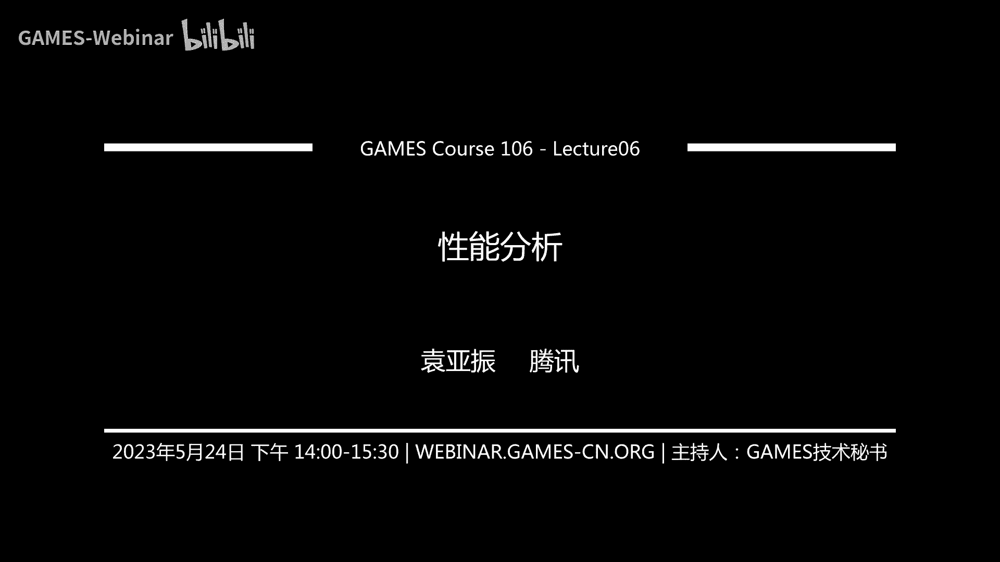
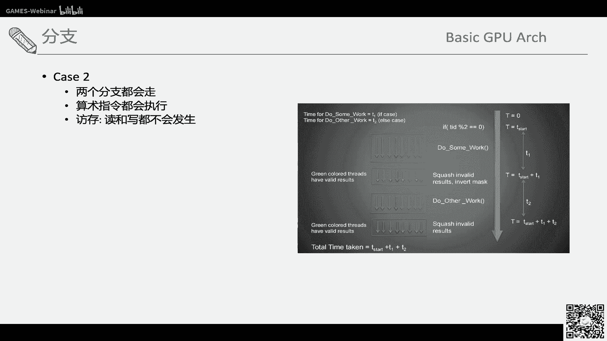
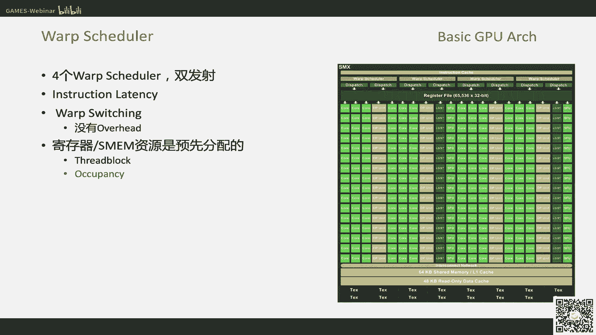
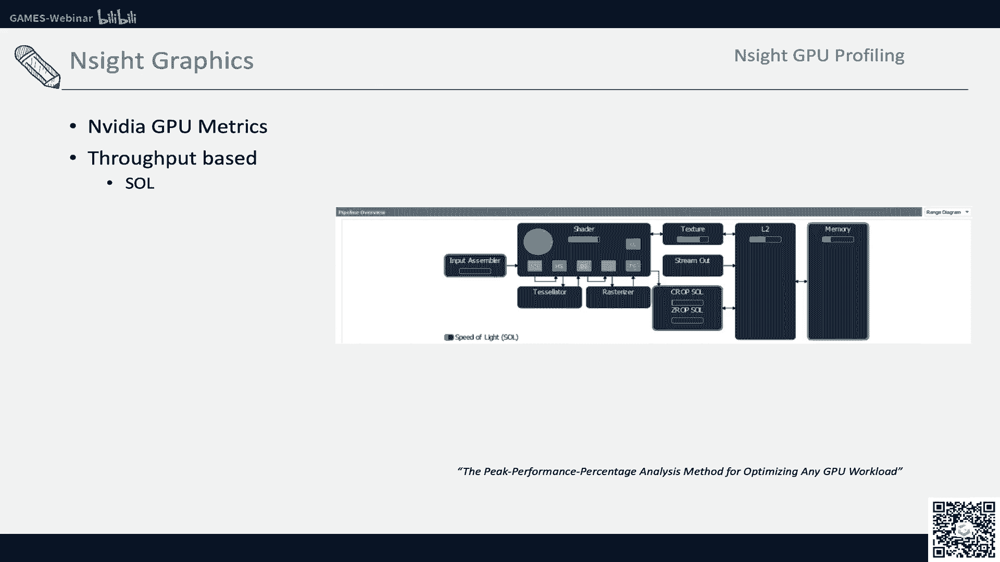
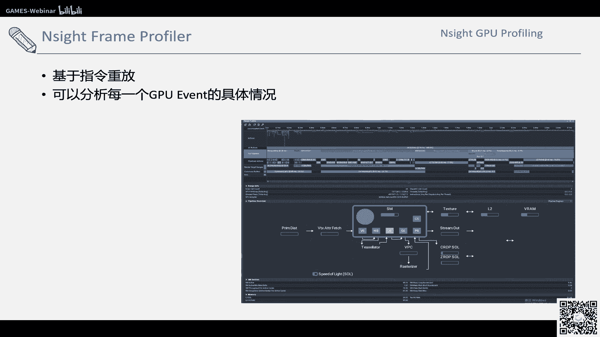
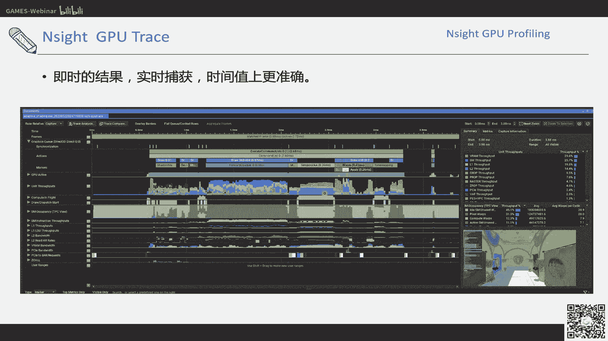
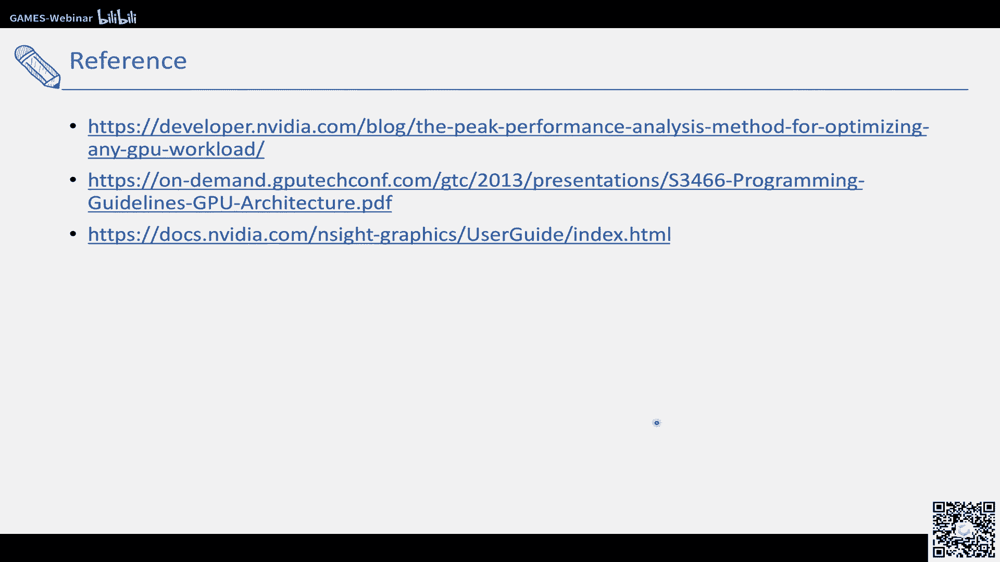

# GAMES106-现代图形绘制流水线原理与实践 - P6：性能分析 🚀

在本节课中，我们将学习图形程序性能分析的核心概念、工具与方法。理解性能瓶颈是优化的第一步，我们将从CPU与GPU的协作、GPU架构基础，到具体的性能分析工具使用，系统地介绍如何定位和诊断性能问题。

## 概述 📋

高性能的图形代码意味着更高的帧率、更流畅的画面和更低的延迟。实现这一目标需要CPU与GPU的高效协作。性能分析旨在定位整个绘制流水线中的瓶颈环节，无论是CPU端的逻辑处理、渲染线程准备，还是GPU端的着色器执行与内存访问。

上一节我们介绍了现代图形API的绘制流程，本节中我们来看看如何分析这个流程中各个环节的性能表现。

## 性能分析基础概念 ⚙️

一个最基本的性能指标是帧率。高帧率代表更流畅的体验。不同平台或应用对帧率的要求不同，例如主机游戏通常为60 FPS，VR应用则可能需要90 FPS。除了平均帧率，帧率的平稳性同样重要，应避免帧时间大幅波动。

写出高性能程序需要同时考虑CPU和GPU。CPU擅长复杂的控制逻辑，而GPU专为高吞吐量的并行计算设计。两者需要良好协作：CPU需要高效地批量准备并提交绘制数据给GPU，以避免GPU空闲等待。同时，CPU自身也在通过多核与并行编程技术提升处理能力。

从引擎层面看，完成一帧绘制是一个流水线过程。以Unity为例，一帧可能包含物理计算、游戏逻辑脚本、渲染准备等多个阶段。现代引擎通常将任务拆分到不同线程，例如：
*   **Game Thread**：处理物理、游戏逻辑等。
*   **Render Thread**：负责场景剔除、绘制命令准备与提交。

GPU驱动将提交的绘制命令放入队列，由GPU硬件调度执行。最终结果被写入帧缓冲区，在垂直同步信号到来时交换到屏幕显示。

由于这是一个流水线，最慢的一环决定了整体的帧率。因此，性能分析的关键是测量流水线中每个环节的耗时。

以下是测量各环节时间的基本方法：
*   **CPU端时间**：可以使用高精度计时器（如 `std::chrono`）在任务前后打点计算。
*   **GPU端时间**：一个常见误解是将提交绘制命令的时间当作GPU执行时间。正确的方法是使用GPU时间戳查询。在命令列表开始和结束处插入时间戳命令，并在数帧后异步查询结果，以获得真实的GPU执行耗时。

通过对比Game Thread、Render Thread和GPU的执行时间，可以定位瓶颈所在。

针对不同瓶颈，优化方向也不同：
*   **CPU (Game Thread)**：优化脚本逻辑、物理计算、网络同步等。
*   **CPU (Render Thread)**：优化动态批处理、灯光数量、遮挡剔除等。
*   **GPU**：优化三角形数量、纹理分辨率、着色器复杂度、显存使用等。

为了进行深入分析，我们需要借助专门的性能分析工具。

## GPU架构简述 🏗️

在深入GPU性能分析工具之前，有必要简要了解GPU的基础架构，这有助于理解性能指标的含义。

GPU的核心是大量并行的小型处理单元（流处理器）。其编程模型与CPU的SIMD（单指令多数据）不同，属于SIMT（单指令多线程）。在SIMT模型中，开发者编写的是单个线程的行为，而硬件以线程束（Warp/Wavefront）为单位进行调度和执行。例如，NVIDIA GPU的Warp通常包含32个线程，这些线程以锁步（Lock-step）方式执行相同的指令。

以下是GPU执行的关键概念：
*   **线程束（Warp/Wavefront）**：GPU调度和执行的基本单位。一个线程块（Thread Block）会被划分为多个线程束来执行。
*   **分支（Branching）**：在SIMT模型中，分支对性能的影响取决于线程束内线程的分支路径是否一致。如果线程束内所有线程走相同分支，没有额外开销。如果线程束内线程走不同分支（分支发散），则所有分支路径的指令都可能被执行，通过掩码（Mask）控制哪些线程的结果有效，这会带来性能损失。
*   **占用率（Occupancy）**：衡量GPU流处理器上活跃线程束数量的指标。高的占用率有助于隐藏内存访问延迟。当某个线程束因等待内存数据而停顿时，调度器可以迅速切换到其他就绪的线程束继续执行，从而保持硬件忙碌。
*   **内存层次结构**：GPU拥有复杂的多级内存体系，包括全局内存（显存）、L2/L1缓存、以及每个流处理器独有的共享内存（Shared Memory）和常量缓存/纹理缓存等。访问不同层级的内存，延迟和带宽差异巨大。

图形管线中还包含一些固定功能单元，如顶点获取（Vertex Fetch）、图元装配（Primitive Assembly）、光栅化（Rasterization）和输出合并（Output Merger）等。

理解这些架构特点，是解读GPU性能分析报告的基础。

## PC端常用GPU性能分析工具 🔧

上一节我们介绍了GPU架构的基本概念，本节中我们来看看如何使用工具对GPU进行性能分析。NVIDIA的Nsight系列工具功能强大，常作为分析范例。

Nsight工具的核心原理是**指令重放**。它捕获应用程序发出的图形API调用序列，然后离线或在线重新执行这些命令，并在此过程中收集GPU内部各种硬件计数器（Counter）的数据。

主要有两种分析模式：
1.  **Nsight Frame Profiling**：进行深入的单帧分析。它可以展示每个绘制调用（Draw Call）的详细耗时，以及消耗了哪些GPU硬件单元（如SM、内存带宽、光栅化器等）的资源。其提供的绝对时间可能因 profiling 开销而不完全准确，但用于对比优化前后的相对性能变化非常可靠。
2.  **Nsight GPU Trace**：进行实时、轻量级的性能概览。它可以连续捕获多帧，展示GPU利用率的时序图，快速定位是CPU提交命令慢导致GPU空闲，还是GPU自身执行成为瓶颈。它能给出SM占用率、显存带宽使用率等宏观指标。

在分析报告中，你会看到一系列硬件单元的性能百分比，例如：
*   **VF**：顶点获取单元利用率。
*   **SM**：流处理器利用率，是衡量计算瓶颈的关键。
*   **L1/TEX**：一级/纹理缓存利用率。
*   **DRAM**：显存带宽利用率。
*   **ROP**：渲染输出单元利用率。

通过观察哪个单元的利用率接近100%（成为瓶颈），就可以确定大致的优化方向。例如，如果SM利用率很低，但GPU仍有大量空闲时间，可能是CPU提交命令不够快；如果SM利用率已接近饱和，则需要优化着色器代码或减少计算负载。

## 性能分析与优化策略 🎯

掌握了工具的使用后，性能分析的核心策略是**定位瓶颈**。首先确定是CPU瓶颈还是GPU瓶颈。如果是GPU瓶颈，则进一步利用工具定位是哪个具体的硬件单元（如SM、内存带宽、纹理单元）利用率最高。

优化是一个迭代和验证的过程：
1.  **测量**：使用工具获取性能基线数据。
2.  **假设**：根据数据和代码逻辑，提出性能瓶颈的假设。
3.  **优化**：实施针对性的优化（如简化着色器、减少纹理采样、合并绘制调用）。
4.  **验证**：再次测量，确认优化是否有效，并观察是否引入了新的瓶颈。

需要特别注意的是，优化往往是**平台相关**的。在一款GPU上的优化可能在另一款GPU上收效甚微甚至成为负优化。因此，必须在目标硬件上进行测试和验证。

本课程后续关于几何简化（Geometry LOD）、着色器简化（Shader LOD）和纹理流送（Texture Streaming）等内容，都是具体的GPU优化技术。学习本课的性能分析方法后，你将能够在实现这些技术时，不仅观察帧率变化，更能深入理解它们具体缓解了GPU哪个环节的压力（如减少了顶点处理负载、降低了纹理带宽占用等），从而更科学地评估优化效果。

## 总结 📝

本节课我们一起学习了图形程序性能分析的全流程。我们从高性能代码的目标出发，理解了CPU与GPU协作的流水线模型，以及定位瓶颈的基本方法。接着，我们概述了GPU的SIMT架构、线程束、占用率等关键概念，这是理解GPU性能指标的基础。然后，我们介绍了Nsight等性能分析工具的原理和使用方法，学会如何解读硬件单元利用率报告。最后，我们明确了性能优化“定位瓶颈-针对性优化-验证结果”的核心策略，并强调了平台相关性的重要。

通过本课的学习，希望你能够建立起系统的性能分析思维，并运用工具为后续课程中的具体优化实践提供有力的评估手段。

---
**参考资源**:
1.  NVIDIA Nsight Graphics 官方文档。
2.  《GPU性能分析与优化》相关教程与案例分析。
3.  NVIDIA/AMD GPU 架构白皮书。