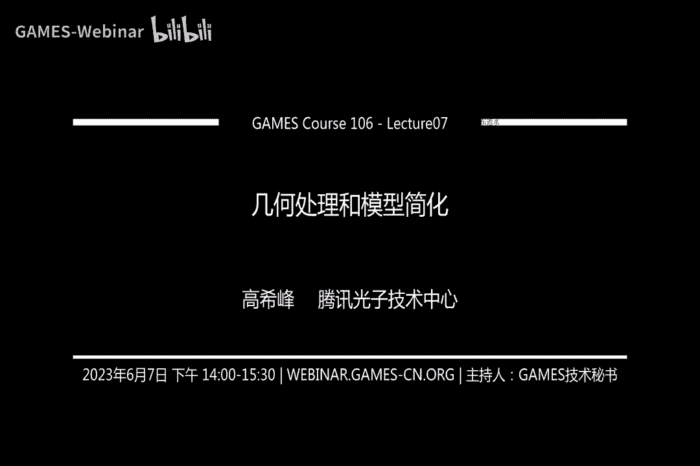
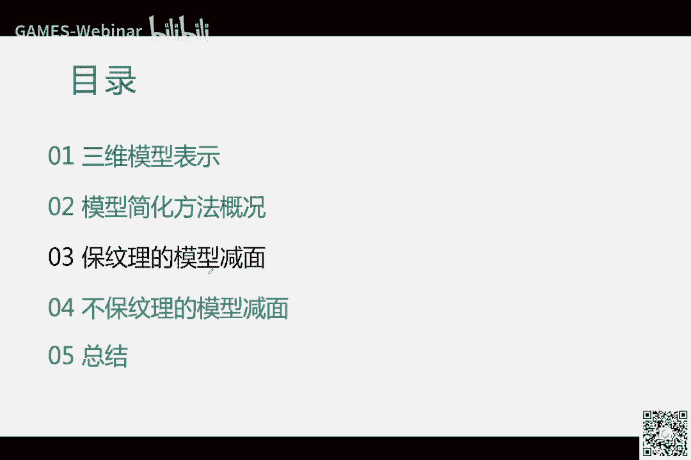

# GAMES106-现代图形绘制流水线原理与实践 - P7：7. 几何处理与模型减面引言 - GAMES-Webinar - BV1Uo4y1J7ie

啊终于又回来了，啊嗯。

ok啊刚才讲完了那个课程的作业哈，讲到这里了，那么接下来呢就是这是呃，我们接下来三节课的一个目录，前面的我会就今天呢我会先讲嗯，我先把那个对，今天我会先讲前面两两部分，一个是先介绍一下啊。

跟这个三维模型，这个模型的这个如何表示的呃，它的几种方法，然后呢我们会大概介绍一下这个啊，如何进行模型的检验，它都有哪些这个思路啊，那第二节课呢我们会讲重点介绍啊，这个在保纹理的前提下啊。

如何进行减免，那最后呢呃第三节课我们会介绍啊，就是各种不保纹理的啊，这个模型减面啊，啊还有就是大家如果有什么问题的话，那就啊及时评论，这样的话我呃如果看到的话，我会在这里做出回答。

ok关于模型的这个表示，ok对于三维模型呢，那其实大家想象一下哈，我们一方面要把这个呃这个模型的啊，把他的这个啊这个形状呀啊就是表示出来对吧，在在计算机里面啊，有女妖数字，那其中一种非常常见。

也是很早就是我们同学诞生以来吧，就很早就有的一种表示方式啊，现在也比较常见，就是这个参数参数化的曲线，曲面当然也有体啊啊来表达这个物体，一般是这样子的，比如说对于一条曲线的话，其实啊它的x这条曲线。

两维空间中x啊这个一条曲线的话，它的x和y啊这两个坐标呀，其实可以写成用一用一个参数来控制啊，t用来控制它的形状，那对于一个三维的surface，就是嵌入在三维空间中的一个表面的话。

其实它可以用两个参数，一个是呃，比如说一个呃一个u方向，u方向上的这个参数，和一个v方向的一个参数来控制啊，比如说我们同学里面学到的啊被子，而曲线曲面啊，啊没有声音吗，好问题我看一下哈，不对吧。

应该是有声音的，确实是声音没有变化，阿two pk，为什么没有声音呢，现在应该可以听到声音吧，现在应该可以听到声音吧，啊我我我假设大家应该可以听到哈，嗯如果如果还有问题的话，就在留言里面去啊。

指出来哈对然后左边呢这是给出了一个曲线，曲线表示的三维模型的样子啊，大家可以看到就是这，当然这是从一个onship网站上去啊，截下来的图就是它是一片一片的，那这种表示方式呢呃在呃对于c a d。

啊这种表示方式对于cd呃，这个呃计算机辅助设计这一块啊，啊这个它是呃呃工业化的，这个呃这个制造啊等等是非常啊常见的，非常流行的，大家一般都是这样啊，用用这种方式来去呃，那就表示三维模型来来去建模。

那另外一种呢就是这个用啊，网格来表示三维模型啊，那左边呢是呃大家可以看到哈，这个三模型想象一下它的形状其实可以啊，就是用那种啊离散化的这种种哦概念来去解释，也就是呃它一个连续的一个表面的话。

其实可以用啊，用这个啊，比如说多多边形对吧，很多多边形给拼接起来嗯，啊它可以逼近啊，这种多边形的离散化方式呢，它可以逼近任何复杂的啊这个表面对吧，那这里的网格呢它其实这个多边形啊。

它可以是大家最常见的就是三角形，也可以是四边形啊，五边无边形啊等等，但最终渲染的时候，其实还是要把它给转换成三角形来去表示ok啊，那右边这个图呢，那实际上是呃对呃，这个网格表面呢我们其实给他啊贴上了啊。

这个贴图也好，或者是呃赋赋予了这个一些材质啊，比如颜色啊等等，便于进行渲染，啊再有一种表示方式就是啊点云了啊，啊，其实如果只是呃，想大概看到他的这个模型的样子的话，那其实点云可能也是呃呃也是可以的啊。

那一般嗯比如说跟呃三维扫描仪对吧，扫描出来的数据啊，激光扫描仪啊，那出来的可能就是点云对吧，那跟原音这种表达方式息息相关的，那就是另外一种就是演示距离场啊，什么意思呢，就是因为如果只是点云的话。

它只是离散的在表模型表面上踩了一些点嘛，那我们呃，有的时候希望呀啊，就是表达出这个连续的这个表面嗯，那其实有种一种方式就是啊我们，呃就是可以用那种啊，一种距离场的形式来比来去呃，先通过狙击场对吧。

构建一个基，在整个空间中，对任意一点你你计算你知道他的啊，对真正的表面的距离，比如说右突啊，他这里显示的样子啊，这是真正的模型的表面，那空间中如果一点对这个模型的距离啊啊越近，那它的这个颜色也越浅对吧。

呃由由近及远的这样的颜色的这个一个变化啊，那这种用这种方式来表达这个模型呢，那当然它，当然这种表达方式，其实他没有没有这个模型的表面的这个啊，这个表面的这个样子啊，在这里就没有他的真实的。

没有他的这个网格的这个数据，这里是呃一种啊用这个把这个这个模型，这个这个龙啊，它是这里是用一个mesh啊把它给画出来了，但实际上这个也是距离上的这种表达方式，它是呃没有，就是啊很难画出这个啊。

这个surface的使们需要用技术把它给转化出来，把它给提取出来，但这种这种表达方式它的优点就在于呃，我们对它的啊啊计计算做一些呃，比如说距离的一些呃一些查询呀等等，会很方便，哦哦我看到一个评论哈。

自研游戏引擎属不属于游戏开发呀，啊这个那当然也算了，那肯定算呀，那游戏开发嘛，那他对吧，什么是开发游戏啊，那就是跟游戏相关的一些技术对吧，去，去研发那游戏引擎，那当然也是里面集成了各种各样的技术。

那再一种表达方式呢，那就是啊最近比较非常流行的啊，用new net啊来去表达这个啊，这个来钱来来来表达模型的一些啊数据啊，什么意思呢，那比如说呃啊比如说df对吧啊，nerf呢。

那它实际上是呃他呃用一个unit来，比如说输入是啊，他想我们想知道一个啊点啊，x y z表示这个三维空间中的一个点，就是sa和这个fan，是表示这个是你观察到这个方向啊，一个比如说一条视线啊。

那输入这个呢，那我们其实就可以获得，通过经过这个neural net之后呢，我们可以获得这个点的rgb啊，rgb就是rgb的颜色对吧，以及这个呃theta就是以及这个嗯啊delta啊，sorry。

sorry，sigma啊，他的一个dcity嗯，一个密度信息，那这是它是要结合着啊，啊体渲染的一种方式来，去把这个模型可视化出来对吧，那之前呢比如说点云啊，或者是啊这种影视剧这场啊，或者是这个网格呀。

以及啊这个参数化的这个曲线曲面呀，他们是要结合着啊我们啊之前几次课介绍的啊，比如说嗯ross roa那个光栅化的方式，或者是光线追踪啊等等，那这个呢那它更多的是与体渲染方式来去结合，就是啊。

啊这那这个nf呢，那这种最近它是比较流行的，主要是他的啊，他恢复出来这个模型啊，因为比较非常小，比较少量的数据啊，又是这种new net方式来，能获得一个非常逼真的效果啊，对于输入的。

比如输入是一些照片对吧，那他可以通过训练这个neural net啊，来获得啊一个更多视角的啊一个模型的表达啊，当然这是呃用一个啊试图示啊来啊，可视化是啊，他这种表达方式是怎么回事啊，也就是对吧。

他输入是一个5d5 d信息啊，三三个啊，three d的这个position啊，加上two d的这个direction啊，然后呢输出呢就是一个rgb，一个一个sigma，然后呢啊真正用体渲染的方式。

可以把它给啊给渲染出来啊，那当然关其实啊关于模型的表示啊，有还有非常多种，比如说有neo的sdf呀啊等等啊，那我们在这里就不介绍过多了哈，呃因为我们更多的是关注这个啊这个渲染嘛。

那其实啊它主要是所以我们会集中讲述啊，网格模型这种表示方式，ok啊，还有一位同学问道，国内有没有教做啊引擎的大学呀，呵呵这个，我没听说啊，那其实可以有啊，我觉得应该应该有啊，但是我没有我没有。

我不清楚啊，不清楚哪里讲这个啊，这里面涉及到这个知识点啊，还是很多的，ok那这个模型网格模型的它这个表示方式呀，那我们进一步说一下哈，那左边呢，比如说呃我们呃从网下了一个三维模型对吧，switch发布。

那它渲染出来，比如说是这样子，那要表达这个这个样子啊，那么一我们需要有一个啊这个网格啊，也就是这个啊，比如点线面啊，啊他们的组合来表达出这个模型的形状对吧，形状这个你看他的yes是这样子的对吧。

原型是这样的，这个slotte对吧，轮廓等等嗯，这个曲面的起伏啊，那是这是用网格数据点线面来表表达出来，那另一方面这个模型还有颜色对吧，那这个颜色那我们是怎么来表达出来的，那我们会右边可以看到啊。

这里有一张啊一张图片对吧，我们叫一般叫它这个贴图啊，那我们需要把这个图片啊啊，有这个贴图贴到这个模这个mesh的表面上去啊，那我们怎么着把它给贴上去呢，啊在这里呢我们需要建立一个，一个uv的展开啊。

什么意思，就是对于这个大家可以看到啊，这个这个模型这个网格模型啊，它是一个三维的，它是在一个它是一个三维的表面对吧，那这个图片呢这里的图片它是一个二维的对吧，它是在平面上的。

你把三维的一个呃一个东西把它给映射吧，那么建立一个两维的这个映射呀，那我们需要一般啊，需要对它啊做一个展开对吧，我们希望建立就是三维表面上任意一点，它到二维平面上它都有一个对应关系，那这个对应关系呢。

我们还希望最好是这种一一对应的一个关系，这样子的话，你这个图片上的这是两位空间中，这个图片上的这个任意一点的这个颜色呀，或者是这个呃三维空间中，这个啊，这个任意点它都能在两位两位平面上找到。

找到一点的这个找到它的对应的颜色对吧，对应的这个啊这个pixel，那一般现实现实使用的过程中呢，那一般我们也希望这个这个二维平面上的，任意一个点的这个p p y，它在三维空间中也有啊一个对应关系啊。

在这里为了简化哦，为了减呃，让大家更容易理解，我们就先说让他们进行一个一一映射的关系，就一一对应任意点和任意三维空间，这一点和任意平面，任意这个图片图片里的一个一个点，他们都有一个一一的对应关系啊。

那其实际上在实际应用中，那其实可以啊，这个图片里面的一个点，它可以映射到三维表面上的不同的点啊，来更好的压缩信息，ok那如何把这个三这个比复杂的三维的表面，把它给斩到这个啊这个平面上去啊。

而且还能使得它能一一映射呢啊，能有一个一一的对应关系呢，啊那一般往往需要对他对这种模型进行cut，就是说把它给切割啊，切割成一片一片的，就像右图这样子对吧啊，比如说这里是对应哪里啊。

这里是对应大概是啊脸部对吧啊，啊比如说这里是叶片对吧，呃还有这里也是啊叶片，大家应该能看到我的这个光标对吧啊，ok ok啊，比如说这里是叶片对吧，那所以呢我们把这个过程叫做什么，叫做啊uv的展开。

那为什么叫uv呢，因为它它这个2v他一个是两两个维度嘛，啊u啊坐标，然后v坐标啊叫uv的展开啊，这三个模型进行，啊所以这样子的话，我们建立了三维表面与二维的这个纹理，的一个对应关系。

那其实我们在渲染的时候对吧，啊我们先每个三角形的时候，那我们就能向里面每个点的演示的时候，我们就能从这里进行查询获取对吧，也就能把这个模型的样子啊可以画出来，呃那我们这里要说一下关于网格模型。

它的几个基本的概念啊，啊这就是大家如果觉得我解释不清楚了，你就直接发评论，那我看到了之后呢，我会在这里及时的进行解释，啊那几个基本观点，那我们呃有呃讲几个方面，比如说它的连接关系是怎么样子啊。

他的这个一个模型的拓扑呀啊是怎么回事，它的一些几何的几何的量，那都有哪些比较相关的啊，这又是我们这个如何啊存储，或者是在嗯在我们写代码的时候，如何去表达这个啊三个模型啊，怎么组织他的一些数据啊。

那这里我只讲比较跟我们呃这个实际应用，比较相关的一些基本概念，或者说我们后面课程要就是在讲解这个，简便方法的时候会用到的一些呃一些概念啊，因为如果详细展开的话，这个确实会需要花好几节课程啊。

我们这里进行一些压缩哈，那比如说连接关系啊，比如说这里是一个网格的话，他有点对吧，线还有面啊，这个网格的话，那什么是连接关系呢，那就是大家嗯可以形成一种graph啊。

又是我们之前本科比如说学的一些图对吧，那图呢除了这个点和线之外，边缘之外，还有呢那我们这里还再加上了这个面对吧，呃一个我们这里是考虑到三角形网格哈，那再重复一遍，这个网格模型呢其实可以有啊。

不一定只是三角形网格，可以是四边形网格，五边形等等，那一个三角形这里对点线面组成的这个三角形，ok连接关系呢，一般我们是讲比如说一个点的度数是多少啊，什么是度数呢，那就是啊一个点它相邻多少条哦，边对吧。

当然也有的，有人会以一个点它相邻多少个三角形啊，来表示它的度数，所以有的时候啊大家理解的时候，还需要根据这个具体文献的这个上下文，它是怎么讲的啊，因为这个点它相邻的边啊，如果是这个点他是在内部。

也就是它不是在这个边界上啊，我们讲边界的时候，这一条边呢比如说它只相邻一个三角形，那这种边呢一般就是边界，那如果一照边它相邻啊，这个两个三角形的话，那它是一般是在内部啊，当然这就是对于呃后面啊。

如果是这个啊这个模型啊，它是一个流行的模型啊，就是这涉及到拓扑信息概念了哈，流行的模型，那我们是这样来去划分这个边界和呃，和内部的啊，嗯ok嗯对对于这个边界上的这个点呢，那它相邻的这个边啊，它是呃。

和相邻的三角形的面数的，这个数目是不一样的啊，所以我们讲一个点的这个度数或是relax的话，有时候需要做一点啊，啊这个嗯根据上下文来去辨别它是怎么回事，那另外再有时呢一个比较重要的概念。

就是呃一个点的这个领域啊，比如说一个单元的领域，比如说一个点的领域啊，一阶领域，那就是啊跟他的跟到这个点，它嗯这个直接有一条边，通过一两遍就能就能到达这个点的时候啊，比如他的一阶领域的所有的点啊。

那就是这这一圈的这一环对吧啊，那这一届联域内那个所有的边啊，他有的时候是指这种啊这种连接边，有的时候也是在这个环上的边啊，然后还有包括这里面的三角形等等，比如说二阶领域，那可能那你需要到达这个点的啊。

如果是有两步对吧啊，一条边两条边啊，有任务两步啊，你这样构建出来的这个呃整个的一个局部的，局部的网格里面包含的信息等等啊，这是啊当然跟年龄关系还有呃就会还还有很多，还有一些其他的一些呃嗯一些概念了哈。

那但我们在这里就简化一下哈，这是几个比较常用的啊，这就是拓扑啊，这里我就呃就是说明一下这个前面讲到过的，好好看看大家讨论还蛮好的哈，两点呈现三线成面，一边面模型要四边面或者三面面啊，对啊是的嗯。

当然也有也有五边面啊，或者是六便面嗯，在建筑里面可能六面面也比较常用嗯，对拓扑的话，那我们这里讲这个流行的这个概念，那流行，比如说呃我们讲这个，我们一我们现在讲的一般都是网格，就是表面的网格模型。

什么意思呢，就是呃一般是二流行，就是这个这个三维模型的表面上任意点啊，啊它的局部啊，他的包括他的局部的这个一个非常local的一个，一个neighborhood对吧，但它的连接这一块区域啊。

它如果可以啊，这个通配这个就可以呃，有建立跟土地的就两维的这么一个一映射关系，它可以映射到这个圆盘上的话，如果任意一点这个表面上任意点，他都能能做到这一点的话，那我们说这个模型它是流行的对吧。

那先发的一个例子呢，那这个模型它如果是非流行的话啊，比如说其中某一个点啊，你看比如说这个点对吧，他无法映射到它的它和以及它的临近区域啊，它无法映射到这个啊一个二维平面的一个圆盘，那那它就是这个。

我们就说这个模型它就是非流行好，这里是一个连续的概念，那我们下面说一下它的这个离散上，就是啊如果在这个网格模型，它具体你怎么判断一个啊，他这个网格它是流行的还是非流行的，对吧啊，这其实挺简单，怎么说呢。

呃我们看一看啊，比如说点啊，点的非流行啊，点的非流形是怎么说呢，那一个点以及它相邻的这个所有的啊，这个三角形啊，啊它相连的一键领域的所有的三角形，它如果能，你他如果能有一个环啊，就是能能能能通。

就是根据前面的那个连续的概念对吧，他如果能映射到一个圆盘上啊，也就是它的边界是一个环，而不是像现在这样有两个环啊，那就啊两个边界，那就呃不是就是非流行了对吧，还有还有还有非物理性边的情况，就是这条边啊。

如果它相邻的不仅仅是两条边，它可能是三条边啊，嗯就是或者说四条边，五条边等等，那这样也是非流行啊，还有另外一种情况，这个比如说这种点啊，他的领域他也不是同胚于一个圆盘对吧，他这里实际上是就翻开了对吧。

这个边界，它他这个这个边界，它并不是一个简单的，一个一个一个简单环了对吧，它里面还有一个，这里还有个麻花式的样子，这种也不是啊，也不是流行的啊，所以我们讲拓扑的话，呃，这个非流行一般是点点的非流行嗯。

边的非流行啊，那对于这个表面网格是这样子的，ok那我们接下来再介绍另外一个，个人认为就是非常重要的啊，一个公式，那就是欧拉庞克莱公式，那这个公式是讲什么呢，啊，它是构建了啊。

点线面以及这个其他拓扑信息的一个啊，一个恒等式，那比如说v这里是表示顶点的这个网格里面，顶点的数目，那个e呢表示边的数目啊，f呢表示嗯面的数，那这个面呢可以是三角面，就是牛头。

就是general的这种多边多边形的面数啊，主要就是啊总而言之就是比如说这个模型里面，它有好的这个三角形和四边形，如果有的话，四五边形等等啊，这种面数啊，它是general的面。

然后等于呢他们就是v减一加f等于什么，等于两倍的，就是二乘以s，这个s是指连通数啊，什么意思，我我不知道我这个翻译的对不对哈，那英文呢一般都是number of components啊。

就是比如说这是我的这个三维模型，那这里呢我们可以看到它是有两个两个联通的，啊，联通的表面对吧啊，就是啊这个三角形啊，它们之间可以通过嗯嗯编连来连，就是呃就是呃连连接起来啊，那外面这个环它是到达里面去的。

它它中间没有没有没有这个连接信息，对吧啊，所以这里呢这个模型，它的联合数就是就是二对吧，那比如说一个一个一个球的话，一个球面的话，那它的连连通数就是一啊，ok那我看同这个群里有有有同学讲这个。

这里讲的同学是建模呀，还是还是图形学呀，那其实图灵学院，那我们对吧，你是做渲染呃，或者是做动画，那这个模拟，那他们他们需要这就是建模这一块呃，这个模型的这个model以及啊以及优化处理。

这实际上都是属于这个图形学的，里面涵盖的知识，呃这个模型的这个呃一些属性啊，以及概念呀，以及这个压缩呀，或者是一些优化呀，处理它与这个啊后面我们关心的一些渲染啊，以及呃动画等等。

他们的表现是非常息息相关的啊，ok那这里需要减去两倍的这个规格啊，亏格什么意思啊，嗯通俗的来讲就是啊对于一个呃一个模型，我，我最少的那个切就是比如说把它给切开，如果能把这个模型把它给分切开的。

就不把它切开的这个啊，这个切的这个cut的数目是多少，就比如说这个球面的话，那就是零对吧，因为你再cut一刀，他就能把它给切切给整个翻开了，那比如说对于这个这环的话，它的规格那就是一比如你切一刀的话。

他啊他还是能他还是连在一起的啊，这是个比较通俗的概念哈啊这就是动数，这个hr表示动数呃，什么意思，就是啊，比如说左边呢这种sphere它是没有没有动对吧，它是零呃，那右边呢我这里啊就抠了两个洞嗯。

这这样的话这个呃这个他就带了边界啊，这里有两个环啊，那就是两个动作就是二啊，基本上就是这么一个公式啊，还有的时候还挺重要的，图形学几知几何分析啊，还没到那种层次啊，我们这里讲的非常通俗的一些。

我把它给通俗化了哈，有的如果有的可能不是很严格，那如果大家觉得有什么问题啊，那可以取出来哈啊，那这里是讲一些几何的几何的量，那这些几何量呢是我个人觉得就是非常重要，也很也很常见的呃一些概念啊。

大家有必要理解，这样的话才能就相对更好一点的去了解，后面我在介绍具体算法的时候，就是用到一些专专有名词，比如说边长，什么是边长的那对吧，2。1线，那它们的长度就是l two的nb啊，这就是啊面积啊。

这里面积呢可能这个概这个概念也很重要，非常虽然很简单啊，但是它特别常用啊，以至于啊我觉得有必要提一下，就是三角形的面积啊，比如说四边形的面积，但是在算四边形面积的时候，其实就有点呃，呃有点困惑了。

为什么呢，因为四边形啊，它在三维空间中，他经常啊它不是一个平面啊，它是一个曲面，那你再算这个这个曲面，这个曲面表达的这个这个四边形的话，有的时候它是有一定的恶意性的啊。

大家一般会把它给分成两个三角形来算啊，也可以分成多个三角形来算啊，取决于你是怎么做的啊，啊学习具体的应用，这就是二面角，二面角呢就是呃一个一个边，它相邻两个三角形对吧。

这两个三角形之间的一个这两个平面的夹角啊，就是一个二面角啊，这个呢也非常常用啊，这就是法相，法相就是三维表面中表面上对吧，任意一点，他的切平面垂直于切平面的那个方向啊。

就是这个点的这个反向的朝向那方向呢，那还需要它的啊，他的norm啊，它的它是一个单位长度对吧，这是法向，这就是一个相交这个概念，那什么是相交呢，就是比如说这是一个三维模型。

你看啊他自己就是交叉起来了对吧，他他就说他自己从嗯，就是这个模型的这个面面片它就插起来了对吧，那右边这个图呢也是展示另外一种一种相交，就是啊比如说一个一个一个human，它的三维模型跟一个box对吧。

他们也差起来了，就是这个交叉起来了对吧，一个模型深入到另外一个角相交交叉嗯，对法院就是法线，对对很对，退化单元，什么是退化单元，就是说啊我们单元对吧，有点线面啊啊等等，这种这种叫做单元啊，退化单元。

比如说一个三角形啊，大家常理认为啊三角形，那它应该是面积一般是不为零对吧，但其实呢呃那我们如果从几何角度来看的话，它那从拓扑来说，它只要三个点，三条线段，那就只能表达出一个三角形来对吧，但几何上的话。

我们可能说啊一个三角形它是退化的，比如说它的面积为零的时候，那它就是这个退化的一个呃啊，一个三角形面积为零，它可以是形成一条直线，也可以形甚至形成一个点对吧，那退换的边呢，那就是啊，嗯一般来说。

我们希望它的边边长是是要大于零的对吧，那如果是退换的边的话，那它的边上就是等于零对吧，就这种啊就这种概念虽然就是呃虽然比较简单，但是有的时候大家就是澄清一下，有利于嗯。

就是嗯就是大家保持这个对于概念上的，这个一致的这个理解吧，啊还有一个就是包围盒，那包盒呢那同学那个课程里面肯定也讲过啊，什么意思呢，当然包围和它的计算方式有很多种啊。

那我们这里就说一个最常见的一种就是包围盒，就是对一个三维模型，它就是能把它给框起来的啊，一个啊一个盒子啊，那就是比如说这个汽车对吧，作为一个汽车的三维模型，那我们计算了它的啊一个包围盒。

比如说啊主要是跟这个呃，这包括与被包围的这个物体啊，就三个模型的这个紧致的程度啊有关系啊，有axis alan的，还有那种呃非axis alan，就是啊这种博弈和啊就是一个长方长方体，你可以认为是。

ok你那为啥提到这个包装盒呢，很多时候我们在呃呃，尤其在进行几何处理的时候，我们经常会用到这个概念，一些参数的设置，比如说我们希望这个呃算法啊，比如说我们对这个模型啊进行处理，进行处理的时候。

比如说啊这个算法里面涉及到这个模型的边长，或者是模型的大小，那我们这是模型的这个数据就三维数据，它的这个它的模型大小，它可以就差别非常大对吧，它的面积可以是接近于零，也可以接近于无穷大啊。

你如果把它放缩的非常大的话，那我们又希望我们的算法呀，他啊对各种各样的这个模型的尺度啊，都能处理，那一般都会把它给，比如说统一到或把我们设置的参数呀，会啊跟这个包围他的包围盒的目标。

比如说啊这个长对角线的长度等等啊，做一个啊作为国外脸，这样的话会使得这个算法，它更多的是跟模型的尺度啊啊不相关啊，有力提升算法的鲁棒性啊，另外一个概念呢就是曲率啊，这个曲率呢一般就是啊。

可以描述这个模型表面的一些完全的程度对吧，呃那对于曲线上的任意一点，它的区域那可能就只有一个曲率了哈，那对于三维模型的话，那任意一点呢，那其实可能有无数个曲率，什么意思呢，因为嗯通过一点呢。

它其实有很多人有无数条曲线嘛对吧，那这个图这个示意图啊，啊就是就画画了个什么什么东西呢，比如这对于这个点来说啊，我们先画一下它的tan这个切平面，那关于这个切屏面上的那，我们就呃可以也也可以画出来两个。

这个principal可谓是就是呃主的主曲率，大家去详细的概念呢可以参考这个，下面列出这个这个文章哈，呃他是他对于一个点它有无限个曲率，那我们可以可以这个辨别出这个啊，主曲率两两个啊，一个是最小的曲率。

这个是最大的曲率啊，我们把它们称作主曲率啊，他们它的计算当然也跟这个法向这个定义啊，也非常相关啊，那这个右边这个模型呢，那展示了这个任意点的这个最小曲率啊，以及这个点的最大曲率。

他们的啊一个示意图吧啊这个曲率的概念，那另外一个概念就是特征，当然什么是特征呢，这个因不同的应用而不一样啊，有的人说，而且有的人说这个比如说就是这个特征啊，就是他你对他的理解，需要真的结合这个上下文啊。

比如我这里举个例子哈啊，这是我之前一个一个文章，我们说啊特征保持的一个六面体网格化，那什么意思呢，那在这里具体是指比如输入的这个三维模型呢，那我需要保持它的什么特征呢，那我把哇这个模型的表面啊。

给他做了一个划分啊，就是先提取出一些这种corner，或者是这种比较尖锐的边对吧，这种尖锐边是怎么提取出来，就是根据前面的二面角啊，他如果二面角，它因为它离这个180度比较远的话，那比如说120度呀。

100 150度呀，或者是90度啊，60度等等，那我认为它比较尖锐啊，其实说这些这些边它会形成一个graph啊，那这个边与边之间，这种curve之间它们会形成一些corner，比如说呃有有啊。

这一个corner相连的多个这种shop边对吧，那这些扣这些graph呢，它有可能把这个表面划分成这个不同的区域，这种不同的颜色，比如这是黄色对吧，这一块区域还有这里另外一个粉红色对吧。

那这里呢我把这这样的信息啊，作为一个叫做特征对吧，然后我我在这个做啊网格处理的时候，我说我想保持这个特征，使得他们有个性的关系等等，啊对游戏引擎有了解吗，呃有一点大家了解的不多啊，你可以问一下啊。

我我我可以尽可能的去求回答，ok还有一个概念呢就是霍斯托夫距离，那其实距离呢有呃有不同的定义，那这里讲一个host off，距离呢那也是比较常见的一个啊一个度量啊，尤其是我们在衡量这个几何处理的呃。

一些算法的这个效果的时候，那什么时候stop距离呢，就是对于两个形状，比如说蓝色的和绿色的对吧，我希望知道啊，从蓝色到绿色或是从绿色到蓝色呃，任意一点嗯，另一个点对嗯，他们这个比如说从蓝色到绿色这边。

所有的点到这个绿色的这个距离的啊，那个最近距离的那个点的这里面啊，这个距离的一个最大值对吧，区别的最大值啊，这实际上就是呃呃host store距离，游戏引擎一般会有物理引擎啊，这个物理啊。

然后呢你可以继续问啊，下一个概念呢就是呃面的翻转啊，什么意思呢，那我们谈到翻转，那那那一般会对它进行一个方向的定义，嗯比如说这个所有的三碗面，它都是啊都同一个朝向对吧啊，你对这个嗯三角面。

你根据这个你对这个点啊啊你做一个排序，比如顺时针或者逆时针啊，大家都是同一个方向，那根据这个同一个方向，你算这个平面的法向的时候，然后你他们都会同一个朝向啊，朝向，那如果有的面的这个法朝向。

它跟周围的都不一样了，那我们说某个面它翻转了，是不是只涉及了光学，声学力学，就为了这个呃呃呃呃对，其实其实其其实整个呃我的理解哈，这个这个物理引擎呢，它那它那你要看他要服务的对象对吧。

我们服务的目的是什么，物理引擎这块目的就是更好的来模拟，模拟这个世界对吧，你对对你的你的三个物体也好，或是呃用你的这个数据来去更好的模拟，这个现实世界中的发生的一些现象，嗯那所以他对啊。

它不仅只涉及到光学呀，声学啊，什么啊，力学啊等等，可能还有一些其他的跟物理相关的，一些什么热血等等对吧，嗯其实整个计算机科学这门学科，它它涉及的知识点可以是可以说是包罗万象，ok那我继续回到这个课程哈。

这个面翻转呢它其实还是蛮重要的啊，为什么呢，因为啊比如说我们前面介绍对吧，uv啊我我我我狂翻回去哈，那如果如果uv这里面这个这个uv的这个mesh呀，这个网格呀，他也是个网格对吧，有个三维网格。

你看有个土地的一个网格，但因为网格里面他如果发生了翻转，发生翻转是什么意思啊，就是同一块的翻转的那个区域啊，它实际上它实际上就是有，如果如果是发生反转，我我画一下哈，比如说这里这里发生了翻转啊，对啊。

这里这里另外另外一个三角形就要覆盖它了，发射反转，那这里实际上是一个图像的点啊，它就映射到什么了，两个两个三角形上，两个三角形呢就这就这两个点上，因为这个这个这里面的三角形。

跟表面上它其实有个对应关系对吧，比如映射到这里了啊，又引申到这里了，那你这一个color，就就被分配到两个不同的地方去啊，本来比如说你的初衷并不是这样子，但因为翻转它错误的发生了这种情况。

那这样的话渲染出来的时候，他的这里的颜色，比如说这一块，它可能莫名其妙的就跑这里来了对吧，那就不对了啊，所以它这个这个这个明显翻转，这个这个概念还是蛮重要的啊，另外一个概念呢就是呃凸包啊。

那我们讲嗯图包呢一般就实际上就跟突集合呀，啊实际上就是突集合呃这个相关的定义呃，就是比如说啊我们这里有一有一对点对吧，那他图包呢，那就是我们把这对点能包括起来的啊，一个最简单的一个啊。

一个这里是两维的哈，那就是一个polygon，那这个polyon呢一个凸的凸的polyg，那什么是凸的polygon，就是它里面的内角呀，每个内角它都是要小于180度啊，这是一个凸的多边形。

那在这个图的多边形内部呢，那你愿意任意两点它的一个呃一个线性差值，它都是在这个这个突破内部的啊，那这里这个呃外面这个示意图啊，什么意思啊，就是你可以想象成我我用一个一个橡皮筋，从一个很大的区域啊来去呃。

收缩啊，只要不能直到不能收缩的时候啊，这个由外面有最边界的一些点来勾勒出来的，这个轮廓啊，那实际上就是这个集合的突破，那对于三维的啊，mesh啊，就是网格呀，他也是有这种图包的概念，ok好。

那我们下面就进行到什么了啊，数据结构吧，就是我们有了，就是我们这个网格它的信息是怎么存储的，那实际上这一个三模型它它都有哪什么信息，点线面对吧，以及uv和纹理，那我们在这里先不谈uv和纹理。

那如果先谈这个网格的话，那实际上它你只要知道这个点有点定义了，这个三维坐标，也就是这个模型的轮廓形状对吧，但这又是那个三角形三角形，这就定义了这个mesh的这个连接关系。

你只要知道这两个其实就能恢复出啊，嗯恢复出完整的信息，但是呢我们呃这个数据结构设计的，那那肯定是呃一个是它的简洁性，这个是一个呃效率的一个平衡，我们总是对吧，我们整个图形学其实就是就是这两个这样事情。

就是呃一个是我们要表达这个啊，这个逼真的这种效果，另外一个是我希望用尽快的人一个速度对吧，它的一这这几种因素的平衡吧，嗯嗯那这个数据结构呢，基本上就是复杂性与效率的一个平衡啊，那我们需要可以存储的信息。

比如说几何的顶点位置呀，那当然除了定点位之外，还有比如每到每个，在每个顶点上存储的一些其他的信息，比如颜色呀，这个uv啊啊，或者甚至是动画模型里面的那个啊，蒙皮权重啊等等。

那就是基本界面单元单元可有边面，就是它们的连接关系，我们其实也可以存储，如果小的话对吧，比如说点的连接边是多少，是什么啊，点的连接连接面是有哪些点的，连接点是有哪些边的，连接面是哪些啊。

别有哪些哪哪几个点组成的等等，这些联系关系，在我们在程序实现的时候其实也对呃，呃其实也对，那个，呃这个这个这个啊数据的有呃，这个这个这个算法的这个设计有非常大的影响，那我们考虑他们的平衡呢。

那主要是有什么有存储空间上的啊，这个考虑，这就是我们如何能快速的获取数据，这方面要考虑，这就是我们对数据的更新啊，啊怎么能比如说我们对这个数据发生了更改，对吧，如何能快速的更改这个数据。

也并保持这个数据的一致性啊，全局的一致性，局部的一致性等等，也有一些这方面的平衡，所以一直对图形api与图形学的关系有模糊，那推荐推荐api就是首先推进学，那它是一个学科。

或者是一个呃一个呃一个方向对吧，那api呢那更多的是你去怎么去实现，比如说对于你的图形api的，可能就是硬件的这个比如说open gl啊，什么working这种东西对吧，那就是怎么去啊。

他们那些更多的是涉及到渲染，如何能跟硬件打交道对吧，应api是接连接啊，软件和硬件就是我们计算机的这个啊，这个这个电脑的硬件，它们之间的，一个更多的是就是实现层面上的一个概念。

ok那当然数据结构呢其实有很多嗯，那我们这里介绍一个比较值得说到的，他的就是他的构思很巧妙的啊，当然也有一点复杂性的一个结构叫半边结构，那这个半边结构什么意思呢。

啊那是呃能否理解为我我将图形学提出的概念，用图形图形api来去实现，不是的，这我觉得图形api实现的那他其实比较狭隘，他是比较狭隘，可能更多的是针对于这个渲染呃，呃某一部分的渲染来去做的啊。

就是图形api的实现，那图形学呢那整个它其实很怪，就是之前我们讲到对吧，他有这个建模，然后你这个数据的这个这个模型的这个表达，模型的这个处理啊，比如说压缩呀，或者是细化呀，或者是啊这个光滑呀等等啊。

再就是呃渲染对吧，还有就是动画啊，模拟啊等等啊，ok这个半边结构是什么意思呢，它是把一条边啊，把它分成两个半边来表示，这两个半边它有相对的方向，那一般是存储什么信息呢，比如说我们会存储这个顶点。

对每一个顶点我们都会存储它的位置，再就是对连接半边的一个索引，就是这一个顶点，比如说一个顶点，它我们存一个半边的啊，哪个半边对吧，传一个半边的这个这个id，那对于对于每条边呢。

我们可以会存这个它的起始点的一个索引，就是这一一这边一般是由两个点组成的对吧，那我会想，那我是由因为我这里是半边对吧，那我这个半边它是有方向的，那我的起始点是哪个点对吧，我从这个起始点这个i d。

那我们再传这个左边的这个连接面的这个索引，就是比如说这半边他的左边就是啊，你根据这个方向对吧，它的方向，然后你你就是方向的左边对吧，呃这个左边呢它的它是连接的是哪个三角形，它的id是什么。

ok然后我们还要存一个什么，同一个面内上一个和下一个半边的索引，比如说呃这个这个三角三角面，比如说这对于这个三角面来说，这个索引它的上一个上一个半边，上一个半边是什么，是这个对吧，是这个半边。

然后下一个半边是这个半边，对存在两个索引，这两个边的i d，这就是那对对面来说呢，我们存一个包含一条它包含的半边的索引，就是对一个面来说，我只需要存一个啊，这个面里面一个半边的这个id就行了。

ok这就是半边结构，一般就是存储这几个信息，通过存储这几个id的信息啊，那我们可以非常快速的来啊，来进行一些比如数据的啊，数据的索引，比如说我想啊我们在这里举个例子哈，我想遍历一个顶点的一环领域。

那边怎么变成一换一个顶点，一换连用的，比如说从一个顶点出发对吧，我们先从一个顶点出发，那我们找到这个顶点，它所引的一个半边，ok然后我们找到这个半边的对边对吧，我们这个这个对边是呃是存储的哈。

然后呢然后我们该对边所有的下一个半边，因为在这个面里面嘛，那下一个半边是哪个，这边就找到了，ok所以你这样就已经就已经找到了什么，这个这个顶点的异化领域嘛，那这边首先这个面对吧啊然后下一个对吧。

当前半边的这个对边，然后下一个再到下一个半边对吧，对比啊对，只要往依次往复的话，那所有的面都会都会被提取出来，都会被得到，ok这是这个半边数据结构，那么前面嗯介绍了那个关于网格模型的，它的表示呀。

还有它的一些基本的啊拓扑啊，几何啊等等的一些基本的概念，那么接下来呢我们就会呃说一下哈，这我们针对这个模型进行进行压缩，或者进行简化，它都有哪些方法，它的目前的概况是什么样子。

那我们这节课呢就会先介绍这个大体的样子啊，那后接下来呢我们会具体介绍，他们这个算法是怎么回事，那这里啊但是一个非常非常短的一个视频，就说这游戏这些游戏的啊截屏啊，那我再稍微播放一下这游戏的截屏。

这里面就是有很多，比如说建筑呀这些啊，什么飘飘在空中的这些气球啊，这些花啊什么东西的，它全都是一些呃三维模型数据啊，那这个数据呢它数量越大，当然你呈现的效果也就越逼真对吧，但另一方面。

那如果他数据量大的话，那就会对我们的硬件以及计算呀，造成一些计算的负担，比如说我们手机游戏的话，那手机的硬件的这个存储呀，它还有计算能力，它是非常非常有限的对吧，那如果我们这里面的这种模型，它的数据。

已经呃很大了，甚至大于你的这个内存的话，那你肯定就就不可能，不可能有这个任何游戏的体验了对吧，那我们希望尽可能的去压缩这个数据的大小，然后同时呢尽可能的保证他们有一定的啊，这个渲染的效果啊。

那其实通常常用的一个方式啊，那就是叫l o d渲染，也就是从此就是层次细节的这个渲染，比如说我这个原来的，就是我们最原始的那个模型的，它的大小是比如包含有5000多个面对吧，我这里是一个白膜呀。

这个白膜是指就是没有带任何材质的一个mesh，那对于这个面试呢，如果我在近处看的时候，那我需要用这么高高逼真的一个模型来做渲染，但是当我这个视角拉得很远的时候，或者是越来越远的时候。

其实我可以用少量数据，比如说1000多个面，300多个面，80多个面，甚至20多个面，就是越来离我越来越远的时候，我可以用更少的面数来去表达这个模型，同时呢它渲染出来他就效果也还可以，也向着一个也像他。

比如说这个哦模型的样子就是球对吧，这实际上就是l o d渲染的一个核心的思想，就是离视角越近的时候，我就用用更多的数据，离视角越远的时候，我就用更小的数据，那同时我这些啊数据啊。

我需要一般都是嗯进行提前计算哈，一般是提前计算，那我但是他们是怎么计算的呢对吧，这就非常有讲究了，这也是我们现在正在讲的啊，接下来要讲我们怎么能获得这样的啊，层次细节的这种王哥表达对吧，我们再看一下哈。

这个模型再看一下这个网格模型对吧，这个网格模型我们需要一有这个mesh mesh，点线面对吧，一般来说这个面数面的数目，它影响你的渲染的效率非常大啊，那这个模式呢它还有对应的一个二维的mesh。

也就是uv uv mesh，这是这是mesh对吧，但是它的面数，它的面是一一对应的，只是那个顶点的位置是不一样的，ok那我们模型的简化方法呢，呃在实际应用中，一般我把它分为两类啊。

一类是保纹理的简便方法，另一类是不保纹理的简便方法，那什么意思呢，什么叫保纹理的简便方法，我这里举个例子哈，比如说这是原来的模型诶，大家应该能看到我的这个这个这个鼠标，这个这个画笔对吧。

哦我我用这个这个laser吧，这个可能更清楚，就是这是原来的模型，这个原来模型它有纹理，一张图片对吧，还有这个uv的这个mesh对吧，这个纹理通过uv mesh来映射到三维表面上来，去画出这个三维模型。

这是原来的mesh，那我希望对它进行简化，就减少它的面数，那我保温你的意思是我简化了的这个mesh，我只是剪他的网格和uv，但我不会重新，不会不会对它的这个纹理做任何操作。

就是我简化了的这个这个mesh啊，我在渲染的时候，我依然调用原来的这个纹理，那这就叫保纹理的方法，对你那个方法如果做了简便之后，如果能使得你简化出来的这个模型，他在渲染的时候照样用最初始的这个纹理啊。

这就叫某纹理的这种简便方法啊，那这种方法它的好处是什么呢，它的优点是我省数据，因为一张贴图啊它也很大呀对吧，我们希望尽可能去省数据嘛，那它也很大，我需要去呃，如果我能能用重用原来的这个的话，那我就不学。

我就会省掉这一块的这个图片的大小，ok那所以我在这个这种简便方法，我需要注意什么呢，我需要注意啊，我在减uv这个这个uv的这个时候啊，你看uv的这个这个排布呀，他其实尽可能的跟原来的这个uv的这个排位。

是一致的对吧，因为你要保持你你从uv去获取这个texture的时候，到三维表面的时候，它是要一致的对吧，那画出来你原来是这个这个一个，比如说一个盘滚一个企鹅对吧，他他站在什么花坛里面，那你简化完了之后。

他也要有这样一个外表啊，对不对啊，这种简便方法，那，这是有有有我，我这里给大家展示了一系列的这个，简化的结果哈，比如说这里从18000多个面，简化到这个9000多个面，然后再就是到啊。

比如说简化了1000多个面啊，再就是900多个面等等，那数据量越小，那你看啊它的是有失真的对吧，你这个模型你不要跟这个模型，它就有所区别对吧，比如说这里花这里他这里路空了哈。

但这里它实际上是连在一起的等等，你要仔细观察的细节的话，它其实也是有变化，那跟这个模型呢，那嗯相比，那可能变化更加明显啊，当然我们在我们在简便的时候，我们实际上是尽可能的去保持，让它们的外观一致。

但是啊虽然你数据量的减少，那不可避免的它会带来损失对吧，我们只是希望把损失降到最小，那这一类的方法呢其实有非常非常之多，非常之多，那嗯比如说呃这这一类方法，我们这也是啊这一类还有这类呃。

这也是我一般就叫跟q em相关的，基于q em这种metric的这种简化方法，呃，这一类的方法呢，其实就啊基本上就是可以说是保温，你简便方法的核心吧，或者是它的一个主流吧，没有没有几百篇也得有。

也得也得有几十篇了，肯定是啊，几篇几十篇，这样的这样的文章或者这样的思路啊，嗯这也是我们嗯在是作业的时候，我们那个作业的主题，就是实现这个这个这个方法，ok，那那他这个方法呢一般是通过呃来呃。

一就是逐条边去去对每条边进行啊，因为坍缩来去达到逐步的去剪边，来去达到简便的这个这个效果，ok那那这个方法呢，那它实际上ok我打到下一页哈，这个我也列出了这个每个方法，它具体的那个论文的那个啊。

那个名字大家可以去读详细的信息，嗯那这个呢那它是利用另外一种思路，他是对输入的模型啊，他会先把根据一些衡量指标吧，把那个三角面啊做一个聚类，聚完了之后呢，那其实每一类的啊，这些三角面的。

那其实可以用用一个多边形来把它给表示出来，对吧，那你对这个多边形进行三角形缓慢的话，那它的面数也就减少了对吧，这是一类简便的啊思路嗯，还有一点，那接下来这一类的这个是什么。

这个是呃它是对呃四边形网格的一个简化，人与你看这个模型，它到网格不再是三角形了对吧，他每个都是一个四边形啊，但是四边形它不一定非得是正四边形啊，它可以是啊，就是通用的啊，这个四边形，嗯然后这个工作呢。

那接下来这两个工作，那更多的就我更多的是在这里给大家呃，呃提一下啊，他们应该是并不是很实用啊，如果是对于我们啊以渲染为目标的，这种保纹理的简便算法啊，这个啊来看的话，但是我觉得他有必要提一下啊。

因为还是能给大家提供一些新思路吧，这个呢是用机器学习的方法来去啊，对啊模型啊进行啊减少它的面数，那同时又又能尽可能地保持原来的啊，这个模型上的顶点的啊，某些顶点的位置呀啊等等。

但是它是实际上可以看成是一种重新网格化的，方式了哈，他应该是不会保持这个uv的啊，至少我，我我不太容易想象到他如何去做修做方法，对做修改或者是稍微改进，怎么去保持uv哈，那这个工作呢。

那他是今年的一个srah的一个工作，那主要是做了一个什么减免呢，它也是做一个简便的方法，但是它剪的更多的是那种叫它叫intrinsic，就是命运的三角形表达，他这种内卷三角形表达。

跟我们啊前面这几个工作里面提到的，这个三角形是不一样的概念啊，我们前面提到三角形，那它它是分类为外边三角形，也就是每个三角形它的边它有三个点对吧，三条边来定义这个这个边呢它都是直线。

就是欧式空间中的直线，那它这里面的内边，三角形的工作是他一他一个三角形的边，它可以是在欧式空间中，可以是呃一个一个折线啊，一堆折线来表达的呃，呃一条边，ok那这里我觉得有必要跟大家提一下。

是说啊这样更大能拓宽一些思维吧啊，它的应用呢也不及呃不呃，就是不是不在于做渲染了，更多的做一些，比如说在三维模型表面上做一些呃也几何计算，比如说那个三维模型表面上的点的那个，只要desk距离啊。

或者是对他做啊，对这个mesh做一做那个呃有限元的一些计算啊，解一些啊，嗯pm方方程等等，ok然后另一类方法，哦ok另一类方法就是不保纹理的简便方法，那什么是不保纹理的简便方法呢，那在这里呢。

嗯比如说还是前面的那个原始模型对吧啊，它有纹理，有uv啊，就展示出来的模型样子，那部纹理是指我们不保持，我们在剪完了这个面的时候，我们不用原来的这个纹理了啊，因为为什么我们对这个模型啊。

就完全它的连接啊，连接关系等等已经完全打乱了，我们重新组织了一个新的网格啊，他的联系关系，然后也就是说它的uv啊，它的uv的这个网格啊，已经跟前面的这个这个uv的网格。

它的它的pattern它就已经完全变化了，你完全变化了之后，我们就需要再生成一个新的贴图，而是对应于我们现在的这个网格，ok，那大家可以看到对吧，这个这里的这里的uv它是非常不一样对吧。

你看这里这里的这个这个圆盘，这个底座他已经他已经甚至都看不出来了，这个是不是底座，ok那我们呃这里也是展示了啊，两个呃呃额外的两个，这个不光为了简便方法的那个效果啊。

这是我用某一类啊这种简便方法来生成的结果，就随它这种方法呢，它的优点就在于它可能可以尽可能的啊，就是能获得更加简单的一些简化效果啊，同时跟原来的模型也鉴定相似，你看这个面数可以减到更少。

比如说这边290多个对吧，那前面的下面这900多个，ok这里列举了呃，这个不管纹理的这个简便方法呢，它的它需要它是比较非常复杂的，它包含几个大的步骤，比如说第一大步骤，我需要先对这个呃模型的这个网格呀。

做一个重新的网格化啊，只是关注于它的网格啊，这个网格完了之后呢，我会再去对这个网格展uv，展完uv之后，我再对这个啊再重新生成它的贴图啊，实际上是分为这三步，这三步呢啊，比如说创新文化这一波呢。

他就有各种不同的方法，他的方法可以说是五花八门嗯，比如说这个方法它是用啊一些啊一些面片，一大的平板啊，比如说四边形板子来取，把交叉出来，把这个模型给勾勒出来，那每个板子它会在可以看到。

每个板子它对应着一个一个一个大的贴图啊，这里把它给啊给排布起来啊，这是这一类方法，一般可以用来去对，比如说植被一类的建筑模型啊，进行呃进行监视，那另外一类这个对吧，他更多关注于如果输入的模型。

它的连接关系啊，它的连接出来的这个mesh的质量就是呃，就是不是很好，那我对它进行重新的网格，化石的它更加规律啊等等，那还有一类啊，比如说这一类方法，他啊他是用一种啊，比如说根据输入模型啊。

他会先去啊拟合出一些一组平面来，然后根据这个平面的交叉集合呀等等，他会从里面选择一些呃子平面啊，根据从运运用某种优化方法，来提取出那个字平面的集合，来给我表达出一个非常简单的，原来的模型的样子。

ok那这两这两个方法呢，那实际上呃是嗯呃比如这个这个工作啊，是什么呢，是呃通过啊啊v字号的方法，就是通过这种啊我观察过某个视角，我观察出来我他是这样子啊，我勾勒出来一个一个题。

然后呢我在别的别的视角我再勾勒出来，然后我通过这个不同视角的一个，交叉出来的一个形状啊，还有这个方法呢，那是对呃，解决前面这个方法的一个啊一个局限性啊，前面这方法它更多的是处理。

用于处理建筑或者比较规则的一些形状啊，那这两个工作呢我们后面会呃第三节课的时候，我们会更详细的进行阐述啊，重点介绍啊，这是分别分别在去年和今年这个西瓜分，我们有呃啊，这我和我的学生以及同同时我们一起啊。

嗯做出来的方法，ok，这这里我也把那个呃每个方法它相关的那个啊，具体的论文啊，就是在这里啊给大家贴一下，那相关感兴趣的，你说想了解具体是怎么做的，那可以去看，ok那我们前面如果得到了一个网格。

三维网格之后呢，那么需要对它进行展uv，就把它给摊到这两位这个平面上去，那具体展uv的方法又有很多啊，非常多有很多，那我们就简易安之啊，我们可以有一个公开库哈，比如说叫accentless。

大家可以用这个这个工具啊啊来去对它展uv，那基本上主要有三大步，骤，一呢先对这个模型进行cut，就是cut成一块一块的啊，cut出这个边界，cut完了之后，对每一块我们把它给转到这个平面上去啊。

展完平面上去之后呢，我们再把它给组合起来，什么叫组合起来是就这意思对吧，你一块一块的之后，我需要把它给拼接的紧凑一点，这样的话我的纹理纹理空间它会更加的省空间，因为我们这这一切的一切的目的就是为了什么。

就是为了压缩数据嘛，压缩补多余的数据，对吧，这这下面我只是列了几个，几个文献，那其实跟展uv相关的也有非常多，欢迎大家讨论哈，如果有对这方面比较相关的哈，嗯比较相关的问题的话，ok那前面展完uv之后。

那我们需要把那个纹理啊，这个给生成出来，那生成纹理的这个过程啊，我们叫它叫纹理烘焙啊，烘焙的方法呢其实呃这个这个倒是不多了，呃一般主要有两大思路啊，而且另外一种最传统的就是recasting。

就是发射射线的方式，另外一种呢就是也是比较新颖的一点的，就是通过可谓渲染的方式啊，折线上方式啊，那recording方法是什么意思呢，我们这这图片也是啊，我从这个网上截下来的哈。

比如说这个这这这这种这种黄色黄色的线，他就是那个高模，也就是最原始的模型，比如说这个黑色的这个曲线对吧，这个折线它就是我们简化了的这个mesh，这是一个一个一个一个一维的。

一个一个两维的一个一个简单的示意图哈，那我们想把我们这个文艺烘焙的目的，就是把这个高模上的纹理信息，把它给传递到对吧，传递到或者是我们讲烘焙的话，我们对吧，把这个蛋糕放在微波炉里或者是烤箱里对吧。

把那个考考上去，ok我们先把高模上的这个呃颜色信息也好，或者管理信息也好，给传递到地板上去，那怎么做呢，我们一般是呃，可以把这个低模样可以稍微放大一下，稍微放大一下之后，那因为这个低模你放大了之后。

它这个点和点它是有一对应关系的嘛对吧，那你如果从他放大这个往往地板上，它原来的这个地方，你去啊投射线的话，投射线它是可以跟那个高模发生交点的对吧，焦点比如这个视线跟这个高模交到这里了。

ok那我就把这个高模上的这个点的颜色值，把它给赋予到这个demm这个点，对应到那个他的uv上的那个点的，那个像素的颜色指上去对吧，ok原理就是这么个原理，ok它非常简单，所以叫recasting。

它就是投射线，通过投射线来去计算一个低模和高模的之间，一个对应关系，嗯但是啊这种方法它有个缺点，就是，它它不是一一对应嘛对吧，他没法做到一一对应，因为你跟我玩地方差距太大了啊，不能么做到一对应。

所以你这种同时点它往往会会投错，那图错，那后面的那就另外一类方法，就是differentiable render啊，就是可谓渲染对吧，因为现在其实也比较也比较火热的一个，相对来说哈。

在同学里面或者在渲染里面，相对来说比较火热的一个一个一个课题，那其实他更多的不是渲染了，更多的是defer windows，它实际上把整个渲染过程啊，把它变得可微了，变得可微了之后。

用来优化一些用来渲染的一些量，比如说三维模型啊，那个光照啊，那个呃呃比如说camera呀等等这些啊，这种啊用来渲染的这种些量，ok他恰巧呀这个东西啊，它可以用来来去做这个纹理烘焙的这个事情啊。

啊这里展示了一个图，比如说给你这个mesh对吧，一个高模，一个demm嗯，他可以把那个diffuse map也就是rgb啊，什么那个那个map给呃播放呃，给给specular map，no mom。

shady，no no shader，对对对呃，sorry呃就是把它给背出来，这就是渲染出来的这个样子对吧，ok啊这基本上就介绍完了，我们这个大概的两个两类这个简化方法的套路，那么接下来下一节课呢。

下一节课我们会重点介绍保文里的模型，简便算法，它具体是怎么工作的，那这节课就到就到这里了啊。