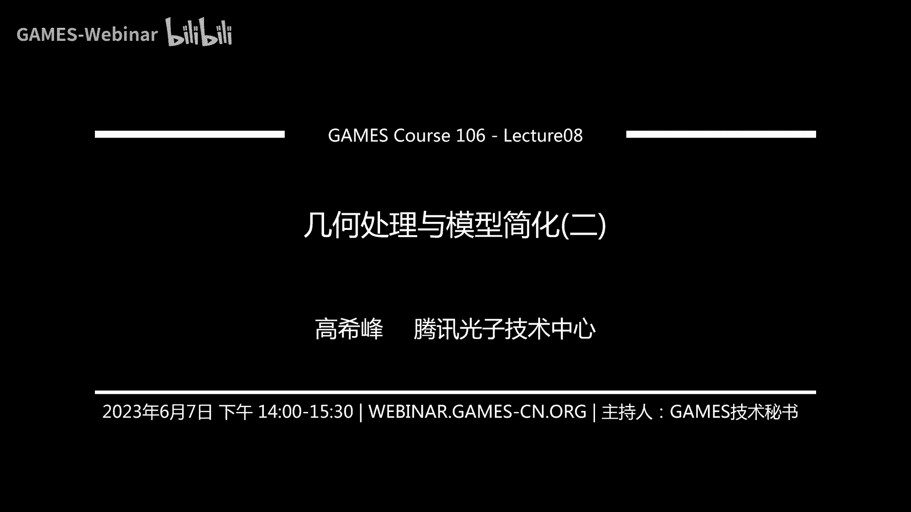
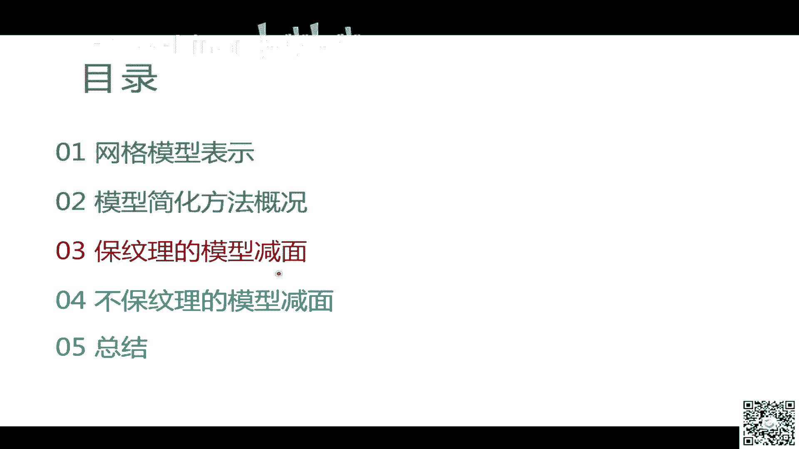
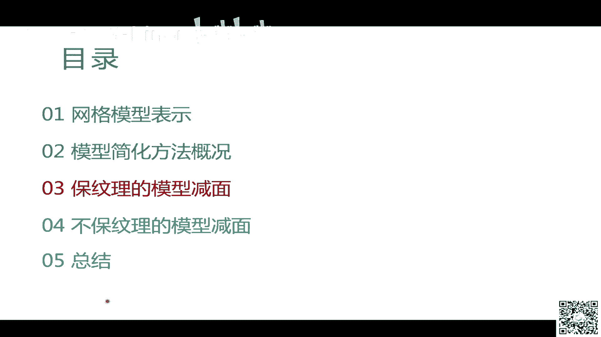

# GAMES106-现代图形绘制流水线原理与实践 - P8：8. 几何处理与模型减面之保纹理的模型减面 📐➡️📏

在本节课中，我们将要学习一种在三维模型简化中非常经典且实用的方法——保纹理的模型减面。我们将深入探讨其核心算法框架、误差度量方式以及实现中的关键细节，目标是让初学者能够理解如何在不生成新纹理贴图的前提下，有效减少模型的面数。

---

上一节课我们介绍了三维模型的不同表达方式，并重点讲解了网格表示及其拓扑与几何属性。我们还概述了模型简化的几种不同方式及其优缺点。本节中，我们将聚焦于其中一种方法：保纹理的模型减面。

保纹理减面方法的核心优势在于，简化后的模型可以复用原始模型的纹理贴图，从而节省存储空间和带宽，这在游戏等对数据量敏感的应用中尤为重要。

以下是该简化算法的通用框架步骤：

1.  **定义并提取简化操作单元**：首先，需要确定对模型进行简化的基本操作，例如边折叠。
2.  **计算操作误差**：为每个简化操作单元计算其执行后对模型造成的“误差”。
3.  **构建优先队列**：根据计算出的误差，将所有操作单元排序，放入一个优先队列中。
4.  **迭代简化**：进入循环，只要队列不为空且未达到停止条件（如目标面数），就执行以下操作：
    *   从队列中取出误差最小的操作单元。
    *   检查该操作是否有效（例如，是否会导致模型自相交或严重变形）。
    *   如果有效，则执行该简化操作。
    *   更新受此操作影响的相邻操作单元的误差，并将其重新加入优先队列。

这个框架是绝大部分保纹理简化方法的基础。

---

上一节我们介绍了简化算法的整体框架，本节中我们来看看框架中的核心组件之一：简化操作单元。常见的简化操作有以下几种：

*   **顶点移除**：删除一个顶点及其相连的所有三角形，然后在形成的多边形空洞上进行重新三角化，从而减少面数。
*   **边折叠**：这是最常用的一种操作。将一条边的两个顶点合并为一个新的顶点，从而移除这条边以及与其相邻的两个（或多个）三角形。
*   **顶点对合并**：将两个位置非常接近的顶点合并为一个，这个操作本身不减少面数，但可以为后续的边折叠等操作创造条件。

在这些操作中，**边折叠**因其高效和通用性而被广泛采用。算法的核心挑战在于两点：**如何对边折叠操作进行排序（即计算误差）**，以及**如何确定边折叠后新顶点的位置**。这两点都紧密关联于误差的计算。

---

理解了操作单元后，接下来我们探讨如何衡量一次简化操作带来的“误差”。误差的定义方式多种多样，例如基于几何距离的豪斯多夫距离，或基于视觉感知的误差。本节课重点介绍其中最经典、最实用的方法：**二次误差度量**。

**二次误差度量** 的核心思想是：衡量新顶点到其关联的原始三角形所在平面的距离平方和。对于一个顶点 **v** 和一组平面（每个平面对应一个原始三角形），其误差 **Δ(v)** 定义为：

**Δ(v) = Σ (distance(v, plane_i))²**

其中，`distance(v, plane_i)` 是顶点 **v** 到第 `i` 个平面的距离。对于一个由系数 `[a, b, c, d]` 定义的平面（满足 a² + b² + c² = 1），点到平面的距离为 `a*x + b*y + c*z + d`。因此，误差可以展开并重写为矩阵形式：

**Δ(v) = vᵀ Q v**

这里，**v** 是顶点的齐次坐标 `[x, y, z, 1]ᵀ`，**Q** 是一个 4x4 的对称矩阵，由该顶点关联的所有平面的系数矩阵 `K_p`（`K_p = p pᵀ`，其中 `p = [a, b, c, d]ᵀ`）累加而成：

**Q = Σ K_p**

当我们对一条边进行折叠时，这条边两个端点 `v1` 和 `v2` 的 **Q** 矩阵分别为 `Q1` 和 `Q2`。折叠后新顶点 `v’` 的 **Q** 矩阵可以近似为两者的和：`Q’ = Q1 + Q2`。新顶点的误差则为 **Δ(v’) = v’ᵀ Q’ v’**。

为了得到最优的新顶点位置，我们需要最小化这个二次误差 **Δ(v’)**。这可以通过对 **Δ(v’)** 求关于 `x, y, z` 的偏导数并令其为零来实现，从而得到一个线性方程组：

**∇Δ(v’) = 0**

求解这个方程组，即可得到使误差最小的新顶点坐标 `v’`。将 `v’` 代入误差公式，就能得到这次边折叠操作的误差值，用于在优先队列中排序。

---

在算法的迭代过程中，每次从队列中取出一个边折叠操作时，并非直接执行，而是需要先进行有效性检查，以确保简化后的模型质量。以下是几种常见的检查策略：

*   **几何距离约束**：防止折叠操作导致局部表面形变过大。一种高效的方法是使用层次化的空间细分结构来近似约束顶点移动的范围。
*   **拓扑一致性检查**：确保简化操作不改变模型的拓扑性质（如亏格、连通分量数）。可以通过检查 **Link Condition** 来快速判断。
*   **面片翻转检测**：防止操作导致三角形法向翻转，从而在渲染时产生瑕疵。通常通过比较新旧三角形法向的点积来判断。
*   **自相交检测**：避免简化后的模型表面出现自相交。这可以通过构建空间加速结构来高效检测三角形对之间的相交情况。
*   **数值鲁棒性处理**：由于浮点数精度问题，计算出的新顶点可能位置异常。可以预先定义模型的包围球，将新顶点位置限制在合理范围内。

如果操作通过了所有有效性检查，就可以安全地执行。执行后，需要更新受影响的相邻边的误差，并重新插入优先队列。

---

上述QM方法主要处理顶点的几何位置。但模型顶点通常还包含其他属性，如颜色、法线、纹理坐标等。保纹理减面需要将这些属性也纳入简化框架。

处理思路是将所有顶点属性视为一个高维向量。例如，一个包含位置`(x,y,z)`、颜色`(rgb)`和纹理坐标`(u,v)`的顶点，可以表示为 `[x, y, z, r, g, b, u, v, 1]`。同样，我们可以为每个关联的“平面”（现在是在高维属性空间中定义）构造系数矩阵，并累加得到高维的 **Q** 矩阵。优化过程在形式上完全不变。

但需要注意属性值的有效范围：
*   **颜色**：计算出的颜色值可能超出 `[0,1]` 范围，需要进行截断或缩放。
*   **法线**：计算出的法线向量需要重新归一化。
*   **纹理坐标**：可能需要回绕或钳制到纹理空间的有效范围内。

通过这种方式，QM框架可以优雅地扩展到处理带有多重属性的模型，实现保纹理、保颜色等多种属性的简化。

---

此外，QM框架不仅限于三角形网格，经过适当调整，也可应用于四边形网格、体网格等。其核心思想——通过最小化到一组“约束”（平面或超平面）的二次距离来进行简化——具有相当的通用性。

对于四边形网格，可以提取一组平行的边构成“条带”，然后同时对条带中的多条边进行折叠操作。对于体网格，原理类似，但“平面”变为三维空间中的超平面。这展示了QM方法强大的扩展性。

---

本节课中我们一起学习了保纹理模型减面的核心算法——基于二次误差度量（QM）的边折叠简化法。我们详细剖析了其算法框架、误差度量的数学原理、新顶点位置的优化求解、操作有效性的多种检查方法，以及如何处理顶点附加属性。该方法因其高效、实用且易于扩展，成为工业界长达二十余年的经典选择。

下节课，我们将探讨另一大类模型简化方法：不保纹理的模型减面。那些方法通常更为灵活，但也会引入新的挑战。