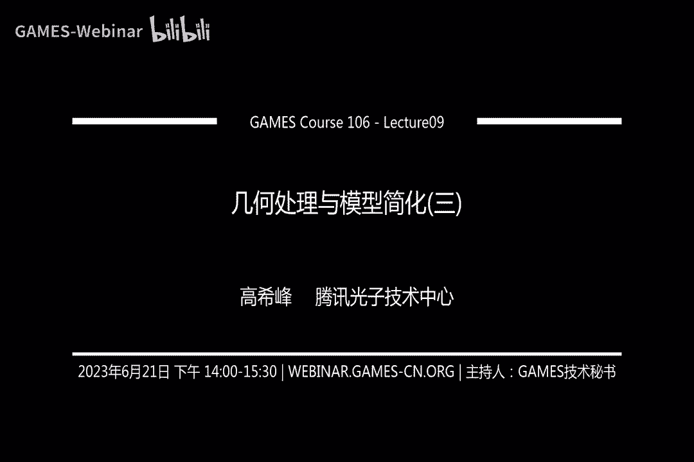
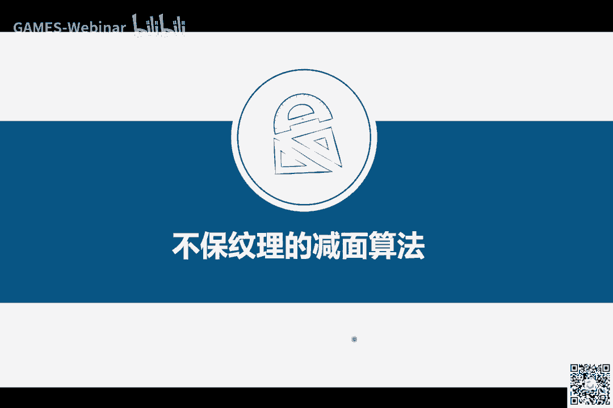
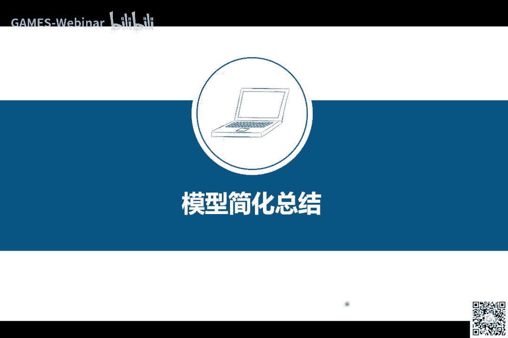
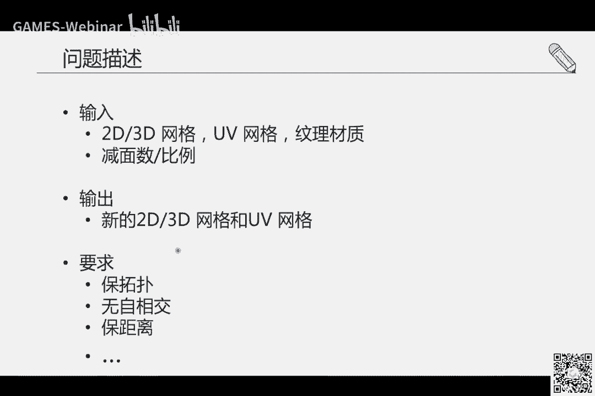

# GAMES106-现代图形绘制流水线原理与实践 - P9：9. 几何处理与模型减面之不保纹理的减面算法 - GAMES-Webinar - BV1Uo4y1J7ie

ok大家好啊，时间到了呃，我们开始上课哈。

呃首先大家可以听到我的声音对吗，啊我假设大家应该是可以听到的哈，就是这今天呢是我们的几何处理与模型，减面这个呃模块的那个第三节课啊，上节课呢我们讲到了，讲了一个关于啊宝文理的一个简便算法。

也就是经典的q1 m这种算法，然后讲了各方各面对吧，关于它的细节呀等等，那我们今天呢会呃呃讨论一下，另外一种也是非常重要的一类算法。

就是它是不保纹理，然后我们简单回顾一下，这个什么叫不保纹理的简便算法对吧，首先简便算法我们知道了对吧，已经很清楚了，就是把呃三角形的，把网格的那个面数降下来，那布满纹理呢是什么意思。

ok比如说这个嘴左边这三幅图呀对吧，这就是我们输入的那个模型的样子，那啊这个模型呢就是它可视化出来的样子，然后这是它的uv，这是它的纹理对吧，这个很清楚了，那部门也在甲面上是什么意思呢。

就是比如说右边的这个模型，以及包括下面这两个模型，那都是呃我们这个布偶纹理的一个，简便算法的结果，嗯那怎么叫不保纹理呢，就是说我们在生成的这个新的，减少了面的这个结果的时候呀。

我们并呃我们在应用它的时候啊，我们呃就是附着在这个生成的模型的上面的，这个贴图呀，呃它并不是原来的这个贴图，就是输入模型的贴图，而是我们需要新生成啊，针对这个输出的结果，新生成一个它的对应的贴图啊。

这叫不保原来输入模型的纹理啊，这就叫不报纹理的简便算法，这个其实啊对吧，概念上其实挺挺容易啊理解，但实际去做的时候啊，我们怎么来实现啊，就是咱们来去呃把这个算法设计出来等等啊，是有很多的啊。

因素也要考虑那一方面呢，嗯不保不保持原来的模型的纹理呢，嗯那这给我们这个算法的设计，增加了很大的自由度对吧，因为我们不需要去保持原来模型的这个uv，但另一方面呢，正因为它给了我们极大的自由发挥空间啊。

然后另一方面呢我们就会需要呃做很多的处理，比如说要重新生成它的uv，重新展uv，然后重新生成它的贴图等等，这个那再稍微说一下这个布偶纹理，这个简便算法呢，它呃它的好处呢相对于那种保纹理的啊。

我们知道它缺点了，缺点就是它会生成额外的数据量对吧，这其实对我们呃这个我们的这个算法的应用啊，并不是一个好事情，因为我们应用主要是减少数据量对吧，我们还反而增加了一个一块管理的数据呃。

那它带来的好处是什么呢，我们为什么为什么有这样一类的算法存在对吧，呃主要是它可以极大地减少这个模型的呃，面数对吧，就面面面片的数量能极大减少，从这个像比如说原魔这18000多个，就减少到200多个。

这有1%啊，将近也有1。5%，1%对吧，1。5%的样子就非常少了啊o好，那我们说一下哈，我们这布偶纹理的简便算法，它大概是什么样子的啊，总的来说啊，首先具体的算法的细节或是呃算法的步骤，它啊非常多啊。

非常啊就是非常复杂，但总的我可以呃，我认为哈，比较经典的一个pine或者一个流程管线，它是这样子的呃，主要分为三步骤对吧，就输入模型，对应输出结果怎么得到呢，需要经过三个步骤，第一步骤先对数这个模型啊。

做一个重新的网格化，这重新的网格化是什么意思，就是把它的呃我们只关心在这一步，只关心它的啊网格模型啊，就是只有点线面啊，这个网格对吧，生成了新的网格之后，我们第二步就对这个输入的网格，对它计算它的uv。

展开它的uv，这是第二大谱，第三大步就是有了这个网格，有了这个uv，那好，我们根据原模和我们第一第二步生成的结果，我们声称对应的纹理啊，我们把这个过程就叫烘焙，为啥叫烘焙呢对吧。

你把一个高模的信息把它给transfer对吧，就转移通过某种方式啊转移给这个地膜上，把这个纹理转移过去啊，这叫烘焙上去啊，我这三大步骤，每一步呢它其实就对应着呃很多不同的算法，尤其是第一大步和第二大步。

那算法真的是太多了太多太多了啊，那我在这节课呢，嗯我们呃不会像上一节课一样，就是聚焦于某个算法的细节啊，而是啊我们会呃，我会希望从这个更高层次的这个，hello的这种角度啊来去啊，阐述几个经典的方法。

然后呢给大家一个呃呃一个印象，或者是一个呃这种波纹理这种简便算法，这个流程的这个至少理解这个流程是怎么回事，他为什么会有这种流程对吧，然后以及每个步骤它嗯我们可以应用，如果我们自己去实现的话。

去探索这方面的一些啊啊一些细节的时候，我们会知道从哪里着手啊，这是指这节课只要从我个人来看，希望能达到的啊这个目的啊，当然如果讲的过程中啊，同学中有什么嗯呃不清楚的，或者是我讲的不是很明白的哈。

大家就是还是像之前一样啊，就把问题打在公屏上对吧，ok我们就先从第一步开始，第一步就是重新网格化，如何进行这一步啊，这一步也是最复杂的啊，也是啊他嗯就是也是最难的一步啊，就是一在三维的啊。

在我们这graphics里面，或者是在这个几何处理这一块啊，就是内容的生成啊，基本上就是内容生成是总是最难的啊，那我们现在是呃这个重新文化呢，它这是相当于你已经有了一个内容对吧，已经输入了一个高模了。

但是呃我们想对它进行呃，因为我们这个重建文化的目的是什么，就是希望能把它面数给降下来，同时呢还要跟原魔线上相似，这就实际上就类似于就是生成另外一个，呃这个三维模型了对吧，只是那个面试还要要求他。

我们的要求还挺多啊，面数要少啊等等啊，那后面我们继续详细解释呃，这里只是列了几个啊，非常有限的几个啊，代表例子，但其实这一类方法有很多啊，有很多啊，那我们这节课呢我们也会啊，只是呃集中介绍嗯。

我之前这个去年我们一个西瓜方面的一个工作，那嗯因为实验原因呢，本来我想着把今年的那个啊工作一块介绍一下，那我觉得呃这个时间原因我们只介绍啊，啊去年那个工作呃，因为我感觉哈从想法上来说还是比较啊。

比较现一点，所以大家啊就希望介绍给大家啊，啊当然前面的有有有不少工作，他们的思路也非常好，比如说这个这个男老师，他们之前发的一个工作对吧，当然当然比如说这个啊啊叫polly fat啊。

他这工作也启发了很多这个follow up，ok行那我们开始吧啊啊然后哦sorry啊，那个第二步呢就是展uv这块对吧，展uv这块呢，那我们重点会介绍什么会介绍啊，就我当然这块也有不少工作啊。

呃呃而且展uv它其实也是一个呃，他其实本身自己就可以算作一个呃一个啊，就是形成一个管线，一个pan的这么一个东西，一个模块，这个模块里面呢呃也分几个步骤啊，也分几个步骤，比如说去呃对模型进行切割。

切割完了之后呢，还要对那个呃切割成的面，那个patch呢做参数化，就是到td的展开，展开完了之后还要对它进行封装呃，这个装配等等，那这个留这这些管线里面呢，呃我自己就选了，以我的经验哈，我选了一个啊。

我觉得还可以，大家理解起来还相对不是那么费劲的一个啊，工作啊，叫tears啊，就基本上这么一个流程，那后面呢我会稍微展开说一下啊，这是展uv这一块工作啊，这就是这个呃第三大步骤呢就是纹理烘焙。

那纹理烘焙呢它的工作量就是那个方法上，其实相对啊种类相对少一些啊，那主要有两大类，一类是基于这个recasting，就是投射线的这种方式，那算法细节呢我也放在下面哈。

然后另外一类呢就是基于可谓渲染的方式，可谓渲染也是最近几年刚啊就刚开始呃，流行起来的啊，一种一种方法论吧，嗯嗯后面我们会呃稍微说一下啊，怎么通过这两种方式来去做到这个迁移纹理。

或者说这个模型的appearance的这么一种效果嗯，啊然后我们先从第一大步骤开始出现网络啊，我们先说一下哈，什么叫重现网格化对吧，呃比如说输入我们是一个原模对吧，这个原模我们现在在这一步中。

我们不关心它的uv，也不关心他的问题，我们只关心这个mesh呃，比如说左边这是输入啊，它有5000多个三角形啊，那右边呢是我们想要的输出结果啊，我们希望让他的这个mesh呀越简单越好，因为我们对吧。

别忘了我们的主要目标是什么，我们需要呃来压缩数据对吧，那数据为了提高我们渲染的效率啊，是不是嗯，那我们压缩，你当然这个右边这个模型，它数据量对面数倒是少了对吧，那还那我们还有一些其他要求呢对吧。

你不能只是面数少了，我们还希望他的看出来对吧，你渲染出来的时候，他的样子啊跟原模是间量相似的，所以叫preserve这个visual appearance，视觉上。

它们的appearance渲染出来的图片是精量相似，但另外一个呢就是电量少的三角形数目，这当然这是我们的主要目的啊，但另外还有一个要求啊，这个要求呢，就是说我们希望我们输出的这个网格模型啊。

它的拓扑结构和几何呀啊特征就是尽量的干净，或者是尽量的简洁简单，那为什么呢，为什么，因为我们前面讲到对吧，它我们这整个啊不保纹理的啊，简便算法呀，它是一个管线，我们这只是第一大步，后面我们还要展uv。

还要做管理烘焙等等，如果有如果这个前面我们重新文化这个结果呀，它的拓扑和几何呃一些属性吧比较好的性质，那非常有利于我们后面算法的这个展开对吧，因为很多后面的算法呀，他有些有些依赖。

有的时候啊啊大家我指的那些比如说展uv这块，展uv这块可能后面就有这个几十种算法对吧，几十种甚至上百种算法都非常多啊，但它不能算法，当然他有的呃这个特性啊，优点啊，缺点不一样，但总的来说对吧。

这个我们给他的卖水那个质量越好，或者拓扑越干净，它展uv展出来的时候，你在实际应用中它是会越鲁棒，效果一般也会好一点，ok这是我们呈现文化这一步的要求对吧，这一步还是很清楚了哈。

但是我们先我们知道要求了，我们也知道输出了，输入了也知道我们输出是什么啊，那我们说这个这部它有什么挑战嗯，乱挑战呃，呃怎么说呢，尤其就说在游戏里面吧，我们在这里拿这个建筑的模型啊，做举例子哈。

在实际应用中啊，这种光膜的它的啊还是很复杂的，虽然它往往是这样子，你看上去这个模型非常简单对吧，就简简单单的就是这个外轮廓等等，就是感觉不是那么的复杂的这么一个三维模型。

但其实呃但但外面看上去还很很好嗯，呃非常simple，非常nice，但实际上它的拓扑以及几何是非常复杂的，就拿这个模型来举例，这个模型它有将近6000个三角形，对不对。

其实六弦三角形其实是很少的一个面数了，当然了，我们为了我们这个游戏玩家的这个呃这个量，更好的体验，我们希望能把它面水降到更低，这样的话我们对吧，其渲染的时候就更加的啊速度更加快，更加流畅。

能及能为其他的一些计算节省啊，呃能分配到更多的计算资源，ok对热模型流线个三角形面片啊，仅仅6000右前左右的这个三角形数目呀，它就包含有151个components，前面我们提到哈component。

什么叫components，就是啊呃互相分离的，不连接的一些呃连接体对吧，这么简单，一个模型就100多个，然后这些三角形啊非常多的，就是有5000多对的，就是互相交叉在一起的三角形，对对吧。

这些这其实就已经就是呃，就一般认为这种模型都比较dirty的，还有他也不是not manifold，就是我们在嗯在实际中嗯，就是或者说我们呃你看发表一些论文里面，提到一些技术呀等等，很多很多他都会呃。

尤其是嗯十几年前几十年前的那种算法，基本上会对这个啊模型做有些有很多这种假设，假设它是二流行啊，呃什么没有自相交啊，什么有有有有有封闭啊等等啊，有有有非常多的美好的假设。

但实在实应用中它不完全不是这样子的啊，美术在制作这种三维模型的时候，他说干不care啊，他甚至他们根本不不去关心这个拓扑，或者或者说他们的最重要的关心，就是他看上去是不是好看。

看上去是不是满足这个这个他们的制作标准的，这个要求，就是总而言之就是呃建模者就是建模，创建这个三高模的人啊，或者就是我们的美术技术，美术他们的呃目标，或是他们的标准跟我们这种自动化的算法。

因为我们现在是设计一套自动化的算法对吧，这种自动化的算法的要求呃，和目标是很不匹配的，正因为这种不匹配造成了一些挑战对吧，当然还有比如说这个模型看上去是这样啊，呃就是一个完整的建筑。

但实际上它里面有大大小小的洞缝隙等等，都会对这个自动化的算法呀，带来非常多的挑战啊，这里呢就是给大家再多看一下，就是啊其他的一些嗯干建筑相关的例子啊，各式各样的建筑啊，而且他们还有的建筑有不仅是外层。

还有多层啊，上下结构呀，还有多孔啊等等，就是啊还有间这种间隙结构呀，嗯非常复杂对吧，日式的中式的对吧，呃这个罗马的这个呃，那个中世纪的现代式建筑等等，他们每种类型的建筑，它们都有各自的啊复杂度啊。

对在实际应用中啊，这甚至现在也是这样子，就美术啊，游戏游戏中啊，游戏开发的时候，那个美术他们是他们在呃，创建这些美术资产的时候，我们统称为这个3d啊，two d啊，就是在游戏里面就是啊呃那种数据吧。

就他们叫美术资产对吧，美术美术创造的啊，他们经常要花很多的时间，不仅仅是生成原模，他们还要花很多时间来去生成这种低模网格，叫low poly model啊，demo。

也就是我们从新文化这这这一步骤的主要目标，我们想要生成这种地貌网格，那他们为什么花上几周的时间，啊有同学问，请问有录播吗，有的有录播，就是我们直播完了之后，这个视频会上传到啊。

我们的games这个课程网站上去，对就美术计划会花很多很多时间，实际上在整个游戏开发中，这个对3d资产的这个处理啊，呃是占非常大的比，虽然我没有具体的数字哈，但非常巨大的人力。

还有那个啊这个物理时间这个成本啊，成本非常高，非常之高，这也是对我这种自动化的这种算法呀，啊有很强烈的现实意义的一些需求，嗯那我们先看一下哈，现在都有什么样子的呃，解决方案对吧，比如说工业界的解决方案。

我们说啊blender啊是吧，免费的license大家可以啊，可以使用啊，个人尤其对于个人开发者还是on real engine five对吧，最新的这个ue呃，还有simply gun啊。

就是blender ue啊，他们更多的是一个一个平台一个对啊，它里面集成会各种各样的插件也好，或者是他们自己开发的等等啊，但你像simply guy和instagrad这种，属于更加呃专业的呢。

就是嗯simple应该是现在他之前是我忘了哪个，应该是在瑞瑞士吧，还是瑞典啊，我有点忘记了一个创业公司06年开始的，那后来一一几年的时候，一九还是17年被微软收购了，他们现在是微软的一个子公司啊。

然后这个instago d呢是德国的一家创业公司啊，这两个都是专门来处理美术资产的，就是3d资产，专门来对3d资产进行各种处理，比如说前面讲到的保温底的检验，还有我们先天讲的播报完题的截面。

重新文化等等，他们就是专门的做这事情的，还有除了这个这个业界工业界的解决方案对吧，我们学术界也有一堆的论文啊，非常多，比如说呃这这这这很多了啊，我在这里不不一列举了啊，当然有的想法也很不错啊。

也有一些开源的软件，比如说mesh lab，对不对，里面也有也有假面对吧，当然也有也有啊，其他的算法，比如其他的那个库，比如说呃cg a l对吧，呃几何处理计算，几何处理库等等啊。

他们都有一些相关的重建文化的方法，嗯研究很多啊，为什么，因为确实一个很难的问题，但问题但是怎么样的哈，我们确实啊就是做过测试，比如说这是输入模型对吧，这里这里这个井号t啊，就表示三角形的面片数目啊。

这将近这两个都是将近1万左右的对吧，这输入模型，那输出模型啊，那这ksr呀，polyfit，blender呀，spread，这些都是不同算法的那个代称了啊，这是他们简化出来的效果。

对吧大家可以看看这些这些结果哈，比如说这个它的面数根本没降下来啊，它面数没降下来，还把模型破坏的乱七八糟，对不对，这就完全跟我们想要的结果，就就相当于没法用嘛，啊。

因为在游戏中其实对结果的要求还是很高的啊，所以现在基本上直到现在，大部分的还是通过手工或者是交互的方式，来去来去做啊，还有比如说这种这类方法倒是非常简单了，但是呢它跟原版差距还挺大的对吧嗯。

这差距还挺大呃，还有这种啊这种就完全不可用了啊，啊还有有的也有鲁棒性的问题，比如说还crush，我们讲鲁棒是指什么意思啊，就是你的程序运行中，这不不崩溃，这就是这就算好的，这就叫鲁邦，ok这几个方法。

那我们之前提就是呃跟同事啊一起去训练，我们的一个方法呢啊就就可以达到这种效果，就输入模型是这样子的，那我们输出的它非常简单，而且呢外观看上去啊，因为这种这种超建模呀，我们叫超超建模。

它是啊主要是呃我们呃在渲染的时候，视角很远的时候就是相机啊比较远，所以这种这种超简的其实看出来啊，看起来跟那个高模是非常相似的，嗯提出了这么一个方法，我今天就简单介绍一下这个方法的思路啊。

细节呢可以看这个啊论文，论文的细节啊，大家可以通过搜索可以查查看到它的细节，其实我们也公开了一个可执行的可执行的程序，大家也可以适用，ok我先说一下他的这个方法，就是啊这个设计原则对吧。

我们设计一个求学方法，是我们需要考虑到我们为什么要设计它，就我们希望用它来解决什么样的问题对吧，我的呃就是设计这个方法，就是根据我们实际上是从这个呃，对这个问题的根本的要求啊，这一点啊来去啊。

设计我们的方法的，比如说我们希望我们的结果能跟输入的模型，视觉上减少相似，那好那我们设计这个方法的时候，我们就重点考虑这一点，还有另外一个呢呃我们实际上是通过呃，因为考虑到前面对吧。

介绍了很多这种输入模型的这种各种挑战对吧，他挑战拓扑复杂几何，有的是各种我其实前面没有细细，没有说的很细哈，比如说有的输入的虽然是一个三角形的样子，三角形的拓扑，但是呢它的它的这个几何。

它就是完全面积为零对吧，边长为零等等，就是这种啊，还有有的输入的模型，它很多重复的点啊啊面啊等等，这些就是嗯你能想象到嗯在现实生活中啊，就是啊他是各种各种奇葩的这种啊，这种复杂性都有啊。

所以呢以我们就想啊，嗯与其直接对那个复杂的模型进行操作，一些简便的操作对吧，比如说我们上节课讲到的啊，编织叠这种简便操作，我们我们先我们想到的是，我们先对这个输入模型，我们计算一个他的代理网格。

就代理模型叫proxy mesh，那我们这个process mesh是呃，它需要满足什么性质的哈，一我希望这个proximmesh，它在视觉上跟原文相似，视觉上视觉上相似对吧，从这个视角看。

从那个视角看嗯，对跟原版很相似，另一点我们希望这个proximmesh它是clean的，什么叫clean，就是它的拓扑比较干净啊，q标键量少一点啊，最好是水md就what what tight对吧。

这不是他的那个呃，也最好是流行的啊，然后呢几何上呢它没有那么多啊，复杂的啊，这种啊什么自橡胶啊，对吧啊，这种情况，啊我们先生成这个代理网格，然后呢，我们再通过上节课我们提到的q e m，简便的方法。

来顺序的，把那个通过编折叠来得到一个地貌网格啊，这就是我们的方法的设计原则，好那我们说一下哈，这输入这papi是这样子的，输入模型是啊这个高模，然后呢我们先第一步先得到一个叫visual mesh哈。

这个visual mesh就是啊，我们后面很快就会看到，我们为什么叫做visual mesh啊，它实际上是通过伪造号的这种方式来啊，对输入模型进行啊，啊就是啊可以说是cut出来的这么一个模型吧。

啊但是这个windomesh呢它有些它呃，它实际上它是根据试点就是观察的时候啊，把这个模型观察出来的嘛，但但是它有的地方因为我们视角看的时候，我们一是渲染看的时候，他实际上是跟随这个直线原则嘛。

所以这种凹的地方呀它就捕捉不到对吧，捕捉不到捕捉不到，我们就通有第二步，就是先把这种凹陷的地方通过，也是这种布尔运算的方式啊，把它给就就雕刻出来，就cover出来。

所以我们叫它cover mesh生成对吧，这第二大步骤就是生成一个cp mesh啊，直到直到这里啊，其实这个原魔的样子就已经出来了，原本的样子出来了，但是呢它的拓扑和几何，它拓扑是干净的。

但几何呢还不行，它几何就是面粉还挺多，感觉还有很多重复的对吧，还有很多可以剪掉的，那我们就再通过一个啊，上节课提到的q e m的简便方法呀，对它进行简化，直到达到一个用户想要的地貌网格。

就是我们算法的整个papi，那细节呢是这样子啊，对于输入的模型，我们先计算它的一个叫包围盒对吧，从这个包围盒开始，我们，针对原膜呀，从周围对吧，360度来去，就是对他进行做什么做投影，投影到平面上对吧。

有很多这种平面啊，当然我们平面计算你可以有一定的技巧对吧，比如说根据呃对原模啊，进行一些呃面片的这种这种，平面片的这种呃聚类啊，然后可以聚得很多的这种呃面片方向，但实际上我们就选出一组啊这种面片方向。

这种观察方向对吧，选出来之后，我们从这里面对这个三维模型进行投影，然后选择一个他，投影出来就是我们通用了一个平面的啊，一个样子嘛，然后我们会沿着一个会对它进行，做一个sweeping。

就是拉把那个平面平面的样子把它给拉起来好，或者从下面往上拉都一样啊，拉起来之后它会就是一个体对吧，这个体呢它是封闭的，它是流行的，它是不会有自相交的，而且它是简单的啊，好我们选定了一个试点。

就是每个试点，它实际上就对应着这么一个体对吧，这个体它有什么特点呢，就是从某个视角看，它跟原模的样子是一模一样，至少外轮廓是是这样子的，外轮廓啊，就是叫啊叫c罗对吧。

然后我们这实际上是用这个这个sweeping volume，来去切割的什么来去切割的啊，来去跟这个输入的包包围盒，做的一个布尔交运算对吧，然后我们再再对再对什么，再对这个再以他为开始。

然后再从前面这这些试点里面去对这个mesh，就对那个mesh做啊，就是做投影，然后再跟他做切割啊，比如我们选定了这个视角对吧，上一个是选定了从上往下看的这么一个视角，现在就选了这么一个视角，咦又把。

又把这个呃mesh呀给精细化了，这么迭代几次，你就选定这么几个视角之后啊，我们生成的这个模型啊，它就他就跟那个高模就啊，从至少这几个视角来看，它就是它的轮廓是一模一样的啊。

所以这基本上就是vismash的这个生成，这里面涉及的操作呀，其实呃有几个叫啊，有几个布尔操作，一个是二维的操作，就是要把三维模型投影到平面上，我们要投影出它的一个轮廓来。

这个计算呢它实际上是一个矢量计算，我们这个论文里面有提到哈，用用有一个还我觉得用起来还不错的一个库啊，就是两位的这么啊这个几何体的这种啊，好波尔院算库嗯，然后还涉及到三维的啊这种啊volume的啊。

布尔交运算啊对吧，因为我们要不断的对，把这几个sleeping volume把它给求教求教，得到一个越来越精细化的啊，叫visual mesh，不是应运算三维的，那我们是呃也也是用的已有的啊算法嗯。

已有的工具啊，这个具体细节在我们论文里面都有提到啊，所以对这个方法感兴趣的同学可以啊，呃看我们相关的论文啊，啊这是又是另外一个视角对吧，就慢慢的他就会把它切出来，但是啊他这个他这个放这一步的。

他的问题就在于，如果原魔里面它有一种凹陷的地方，你不管从哪个视角来看，它动它都把都不会把它不知道，比如说这种凹槽的地方，你从什么地方看，他都会嗯，这他都看不到这种凹的地方啊，那我们怎么办呢。

啊我们就有第二步，第二步也是挺有意思的一部呃，什么意思呢，唉我们也是从原模里面就是啊就选出一些平面，选出一些一些平面啊，这些平面怎么做呢，呃假设假设哈我们我们知道原版是什么样子啊。

这这里有一个一个大的大的平面，我们选出来这一个一个一个平面，ok那么对这个平面，我们把这个原模样沿着这个平面的，这个就是反向的啊，负方向把它给往这个平面做投影对吧，所以通用完了之后。

他也会有一个sweeping volume，然后我们再把前面的visual mesh，减去那个sweeping volume，它就会把这块给剪出来，这是什么布尔交运算，对吧，所以。

这个大家可以看到前面那个伪造mesh的生成，和这个卡夫的mesh生成这两部啊，其实呃它基本上都涉及到这个对2d的，对三模型，到二维平面上的投影，这是一部计算呃，还有那个三维体的啊，求交运算。

这是两部计算，这种都是布尔运算，然后我们不断的去增加啊，有更多的平面那种啊，sweep网里来去进行com进行雕琢，这样的话它的细节就会慢慢的把呃给雕琢出来，ok啊但是我们最终还是想要那个地膜网格对吧。

呃那我们第三步，实际上d模它是怎么做的呢，那就是运用上节课我们提到的，传统的qe m的方法来对它进行编折叠，就是通过不断的选择啊，这个合适的边来去生成这种简化的模型，但是有一点啊。

呃这一点其实是假面算法的一个通用的问题，通病就是你怎么选参数，就是你像你希望生成的最终的呃，简便的结果的那个面数是多少，这个其实啊自动的算法是非常难去啊，非常难去这个设计的啊，之前方法大家都是好呃。

这个用户可以指定一个最终假面的数据啊，然后我们来生成那种符合面数的啊，demo网格，但这种它的啊它的缺点就是，首先用户使用这个算法的这个用户呀，他可能并不清楚它能简化到什么程度。

或者说它简化到什么程度就会比较好，比如说他有可能简化了啊，300个面嗯，效果还不错，但但这个算法可能会可以减到200，50个面的时候，它效果也很好对吧，这这种就需要来回的去调试。

就叫parameter tuning，这实际上在实际使用中的时候对啊，用户也是啊，一般都是呃美术嘛啊，他们在用这种方法的时候，就会感到比较费费劲儿，尤其是有的算法，你算一次调一次参数还要计算好久。

这样就很不很不人性化啊，所以我们嗯其实提出了一个很简单的思路，怎么去解决，这样他呢就是呃先根据啊，我们先讲到底把这个模型直接完全哦，哦这里我其实没展示那个哈，其实完全斩到底减到底之后。

我们就会从呃就会有我们会画一个一个曲线图，根据齐全图就是各种面数的这种结果我们都有，然后呢根据它对应的那个模型的质量，我们需要一个模型质量的一个评估方法，这个metric我们就可以呃。

算一个叫parrot front嗯，算一个最佳点，然后让用户来去从这结果里面选一个记细节，大家可以看论文嗯，这是针对前面呃给大家看到的那组数据啊，啊生成的结果大家可以看哈，每个模型。

其实比如说这个这个实际上是一个非常复杂的，啊，一个建筑模型哈，中式还是日式啊，有古代建筑的模型啊，那这是我们右右边生成的，它的建模，当然各种风格的，比如说还有还有这种这种模型。

这也是这是一个茅草屋中世纪的啊，应该是呃啊维京时代的啊，sorry维京时代的那种建筑风格啊，都用用木头和这个茅草搭建搭建起来的模型，那我们可以把它简化成这样子，它的外观跟原膜啊就是很像。

但是它又非常的简单，嗯这是呃几个衡量指标，一个是这个面数对吧，另外一个呢是叫啊light field distance，那其实它实际上就相当于呃，来衡量你最终输出的这个结果呀。

呃它在渲染的时候跟原模在同一视角渲染下来，它们的差别，这数据越小呢，它的质量是越好的，所以从这里来看，从这两个数据量来看呀，啊我们放法实际上是最好的一个，综合来看应该是一个最好的效果，这里是跟其他嗯。

不管是商业的算法还是学术界的算法呀，做了一个对比对吧，在整个数据集上啊，当横坐标横坐标这个是那个面数啊，sorry，这是那个呃light few distance的数据，对这这个这个坐标。

这是这是那个什么，它实际上是这个穿个number和这个laudistance，他们用共用同一个坐标啊，那个呃横坐标了哈，嗯因为他们都是数据啊，越小越好，ok这是我们第一步就是重新文化。

这一步简单介绍了这么一个呃，呃比较新的一个算法，其实它还有一些其他的，就是啊思路啊，比如说我们今年我们一又有一个啊，这个surah的工作啊，发表，那这个工作呢它不仅仅是针对建筑了哈，它其实更加通用。

也能生成非常好的效果，后面大家可以关注一下，其实啊然后第二步呢啊我们整个算法里面啊，第一第一大步重新文化生成这个低模网格啊，这是完成了最重要的最难的一步，那第二步是做什么，是做展uv，对啊。

前面我们只是生成了那个网格模型，但是我们要把这个纹理信息呃，附着到三维模型表面上去，我们需要先对三维模型进行一个展开的操作，平面展开操作，比如说这是一个三维模型，这三个模型我们希望把它给摊到平面上去。

使得他们有一个映射关系，这样子的话我们后面那个贴图啊，就是会，我或者说我们可以把这个区域叫做贴图空间，把贴图放在这的时候，它可以通过这个uv的mesh和三维mesh的这个，对应关系来映射到三维表面上去。

这样我们渲染的时候才能看到啊，带了材质贴图的这么一个渲染效果对吧，才有真实感啊，那对于这个嗯窄uv这一步骤啊，那它的输入是什么，那基本上就是网格模型了，就to do three d对吧。

网格也可能有to do，那输出是什么呢，输出就是uv网格，我们就是计算这个uv网格，就是计算实际上就是计算它们之间有映射，但是你有了这个uv网格之后，你就自然而然的有了这个映射。

因为这个td的uv网格和3d的网格模型，它们的三角形的数目是一一对应的，他们是一样的，然后啊只是顶点的index可能有所不同啊，因为它里面经常会涉及到切割的问题嗯，会把一条边切成两条边这样子。

那我们当然也是对他有要求的，比如说首先前面他们也介绍了，我们不能有反转，就翻转什么意思啊，就是对吧，三角形它翻了，翻了之后就会呃就多少，三角形它可能总而言之就是多个呃，一个模型表面。

多个区域可能对应到呃一个呃一块啊颜色区域，那就是造成一些不必要的artifacts，ok另外一块就是五字相交啊，我们也不希望有啊，sl是啊，我们在前面两个更多的是一些硬约数，下面的更多的是软约束了。

我们希望这个切割呀尽量的短，就什么叫切割呢，就是一个呃通常来说一个三维模型啊，它是嵌入在三维空间中的对吧，他的空格可能往往会很高，甚至是它是封闭的，它只要是一个封闭的模型，我们都是需要对它进行切割。

切割了之后才能把它给摊到平面上去，但是切割切割的话，比如说这些呃呃从这个例子里面看啊，这个不同颜色块它们之间的这个边界啊，实际上就是边界的长度对吧，我们希望边界长度越短越好，为什么。

因为它有了这些边界的时候，它对对应的什么对应到这个uv的空间这一块，他啊三维模型呢一块编辑，一个编辑就蹲着啊，这两位mesh的两条边对吧，两条扁，啊这样的话在那个渲染的时候。

比如说对他进往往往是那个纹理图，它是像素的嘛啊所以它是一个离散化的东西，呃那要把它给渲染到这个三维表面上的时候，我往往需要对它进行做一些呃差值啊，跟邻居的啊，像素啊等等进行，或者叫叫纹理素进行差值。

差值的话，这切割数目很多呃，它往往会造成不连续的情况，比如这里的纹理纹理颜色，比如说这这条edge它跟i don't know，我不知道他是在哪里，就是啊相连哈，比如说跟这条边吧。

他们在三维空间是相连的，那呃我这里差就出来了，跟这里差距就出来了，往往是不一样的，所以在这种cut的地方，我们叫做缝对吧，呃它在渲染的时候会经常出现一些啊，大家不想要的效果啊，再一个就是扭曲角。

扭曲角什么意思呢，就是呃我这三维跟二维的啊，他这个有一个映射关系对吧，他这个映射关系呢，我们其实可以衡量这个映射关系的，一个质量的好坏，也就是说它的扭曲啊，它扭矩越小，那我们在两维空间中。

它的图片或者图的图像，或者是管理上那个那个信息啊，它是什么样子，那映射到三维表面上的时候，它就能他那个样子啊，他保持的会越好对吧，它扭曲越大，对这里一个正三角形映射的就是三角。

表面上是一个这种非常长的三狭长的三角形，那本来你这个呃纹理图上的那个正三角形内部，它是一个标比较合理的一个啊一个样式，那到了三维空间中，它又被拉扯的非常非常不是你想要的对吧，我希望它的扭曲尽量小。

这样我们在呃，就是制作贴图的时候就会更轻松一些，还有一个就是装箱的面积小，什么叫装箱呢啊装箱就是呃呃挺简单啊，就是我们前面会把这个mesh cut开cut，可看成一块一块的这一块一块的。

你往往你是不知道他在这个纹理空间中，它应该是放在什么位置，所以所以装箱的意思就是，我们希望把这些一块一块的这个啊，uv mesh patch呀，把他们放在一起唉，但是呢我们又不希望让他们就是互相重叠。

就是就类似于这样就把它给pk起来，让他们越紧致越好，因为越紧致的话，你的纹理图啊它就会越少的空间浪费，比如说这里面的这些白色区域啊，基本都是浪费的，浪费了一些数据量对吧。

因为我们文理纹理图都是这种长方形的样子嘛，对吧，所以这种这种这种空间都是浪费的，因为它没有任何信息量，所以我们把这个步骤啊叫做装箱，就是针对这个展uv这个这个问题啊，其实有非常多的算法，有非常多的算法。

他呃但是呢我们在这里就只介绍一个，我我觉得相对来说比较容易理解的一个呃，一个方法啊，怎么说呢，就是他其实也有几几个步骤啊，我们先说第一个就是对这个模型啊进行切割，对切割的话。

我们可以就基于叫嗯loyd的这个呃算法，就是它其实就是在这里有所阐述，variational ship and approximation，就v i c a这个方法就是从它的过程啊，是这样子。

我们对输入模型啊，我们选择一个，我们需要把它给切割到多少个patch，每个patch就是这个联动的区域嘛，想切割成多少块，那我们一块呢，我希望先选这个，我不知道他具体该在哪里切割对吧。

因为我一开始不知道的，我一开始我先随机选几个三角形做一些种子点，如果我想把它切成三块，那我就选三个三角形作为一种特点，然后我基于贪心的贪婪的方式，从每个种子点开始往外注意往外扩张。

当然这个也是一个就是啊对吧，从比如说从这个三角形吧，它它相邻的几个三角形对吧，你会算啊，把相邻两个三角形跟它合并在一起，它的一个误差是多少，然后这些都放在一个一个队列里面，然后做一个排序啊。

然后一个一个的去添加，去不断的扩张，这呃所有的这些区域，直到啊模型里面的啊，已经所有的三角形都已经被访问完毕，这样缝完毕之后，你这个模型已经完成了一个区域划分，但这样的话你再对每个区域再算一个算一个啊。

误差算误差，比如说我算一个它的法向，以及嗯就算一个区域的平均法向，以及这个反向跟所有这个区域里面，每个三角形的一个啊一个区别啊，根据这个这个区别信息呢，你再去更新更新，找到一个新的三角形种子点。

然后再重复上面的步骤，直到啊直到所谓的收敛啊，这里收敛呢也比较模糊，什么叫收敛呢，你可以指定啊我迭代多少次，或者说你可以指定它的error，误差降低到什么程度等等，就达到一个比较好的一个分割分割效果。

就分割好了之后呢，嗯那其实可以做后面的事情啊，那我们说一下这个他这个算法呢，其实我们这里不讲它的细节哈，因为细节展示的话就太多了，主要就是第一步对输入的，比如说这个模型是一个呃一个牛对吧。

第一步呢我们根据前面的一个迭代策略，来把它进行切割切割开，因为因为他的这个算法呢，他是要指定切割的区域个数的，这就v就v c这个方法啊，就lol的这个方法啊，但是但是哈他这个切割的数目啊。

它往往跟这个模型这个复杂程度，还有uv的这个前面讲的对吧，我们这里有有有好几个要求的，比如说这个电量短呀，扭曲小呀，有什么它往往是互不沟通的，就是他没有打通这个。

没有把整个过程作为一个全局优化的一个过程，这也是非常难的，因为这里面涉及到拓扑啊啊连续的优化呀等等，就是有很多的这个变量，它现在没有这么一种方法来做到这一点，所以大家往往就是把这个问题啊拆分开来啊。

啊每一步解决一个小问题，ok所以呢呃他这里设计了一个哎，我在切割切割出来的每个区域呢，我希望它的误差呀，它的uv映射的一个误差，它是能帮的bd就是能被约束，能能在一个范围之内。

那这样的话就会造成啊这个输入的模型，它就会有些区域它们并没有被归类，因为它无法被归类，而无法被归类到任何一个区域，因为只要一被归类进去，它的误差就会很大，所以就会剩下这些黑色的地方。

黑的地方呢他们叫做who feeling，就是在要么把他们单独整成一些区域对吧，单独整一些区域之后，再跟周围的区域进行合并，进行合并，ok合并完了之后，那实际上直到从一开始就直到这里。

这是完成了一个网格模型切割的一个过程，大家别忘了哈，这个整个uv展开啊，它实际上展uv它实际上嗯这个切割模型，这只是第一步，切割完了之后，我们还要把每个patch把它给斩到两维平面上去。

把它给应摊到阳痿平面上去，怎么贪也非常讲究啊，关于怎么贪这个网格啊，就至少有几十几十个工作，几十个不同的算法了，嗯然后看完了之后呢，然后还要再对他们做一个装箱，对吧啊，这就完成了最终的一个结果啊。

然后我们说一下怎么怎么，你已经确定了一个patch之后，怎么对它进行展开，把它怎么插到平面上去，嗯大家一般用什么，要基于一个理论叫啊tt embedding，tmbedding是什么意思呢。

就是呃如果一个一个patch呀，或者是一个graph 1 sl形patch，它的边界啊，我们可以如果它的边界可以被嗯，如果我们的被映射的那个抖面，它是一个凸的凸的边界，那通过tmi这个算法。

它又能保证嗯计算出来的内部，它计算出来内部的点的位置，它又能保证这个啊计算出来的这个这个网格呀，它是没有翻转的啊，没有自相交的这么一个啊啊，这么一个一个理论啊，这也是非常重要的，也是奠定了很多的啊。

uv或者绝大多数的uv展uv的，这么呃uv参数化的啊，算法的一个基础啊，嗯比如说嗯这是一个哈就这啊也不是很近了，那几年前的一个工作啊，我觉得还是不错的啊，他是做一个什么事情呢。

呃就是从一个嗯从一个patch开始，我们现在对他做一个tt tt embedding对吧，把它映射到土地上，但是计算出来tmbedding这个展了uv的参数后，它的不是有误差吗，它误差往往是很大的。

它往是往往是很大啊，所以我们可以运用一些连续优化的算法呀，呃来减少这个误差，但减少这个误差的时候，它的边界就会就会变形，就会来回的啊，呃赚也好，或是呃这自由扩张，自由扩张的话。

呃当然这里是一个示意图了啊，在在实际中啊，啊这个patch它可能会就是呃形状非常的多样，那这个就是它就会造成自相交的这么一个事情，那自相招，那对于这个纹理映射这个事情，这个渲染来说是不是我们想要的。

所以我们希望它能是一个叫bijective映射，这个uv啊跟su模型啊，它是一个一一映射，那做那一点呢，我们呃他这个方法就说哎我可以加一些三角形，叫scaffold，叫cage。

或者是呃呃呃通过保证每个三角形它不翻转，那就会使得里面的这个它永远不会有自相交的，一个啊一个结果啊，这就是这个方法啊，它的一个核心思路啊，细节呢啊反正也有公开代码是写，感兴趣的同学也可以看原文。

再一个第三步骤呢就是装箱了啊，这个步骤呢啊其实呃也有非常多的算法呃，更多研究的是呃这种叫啊，叫不叫叫什么叫叫bean packing，ban packing，就是把每一个patch呀作为一个bean。

作为一个长方形啊来去pk，那这个方法它是呃说啊我可以啊，把每一个这种不规则的这种patch，看成是一个就拼俄罗斯方块的那种那种算法，哎，用那种那种思想啊，来去设计了一个啊效果还可以的一个算法啊。

这细节呢我就不展开了啊，大家可以去看这个原文来了解它的细节，他们也有这个公开的代码，所以啊大家想尝试还是比较容易的啊，啊这是几个给大家看了几个占优的效果啊，这是啊这是一种方法啊，这是另外一种方法。

还有这是d chart的这个结果，好在这里，我也不是说这个叉子它效果是最好的哈，但是因为因为这里我只只是我是用的，他们啊当时的论文发表里面的结果目前是，但目前来说他还是比较相对来说啊。

嗯算是呃接近实用的一个一个一个管线啊，那比较实用的是，我们前面不是讲到有个extas的一个库吗，大家可以直接调用里面的那个啊那个方法，ok然后第三部呢，第三部啊有了前面的网格，然后也有了它的uv。

那我们需要对它进行纹理烘焙，那纹理烘焙呢我们主要讲两个方法的思路，核心思路，ok这里一个示意图啊，比如说这个这个叫黄色吧啊这某种黄色的，这么它叫就是原模了对吧，这是原模就比较复杂。

然后这个黑线呢黑黑的折线叫低模对吧，它非常简单，数据量小对吧，这就是我们前面有的呃它的核心这个算法，这个方法的核心思路是什么呢，你这个原模上的这些属性啊，比如说每个顶点的颜色呀，或者法相啊。

或者是嗯其他的呃一些呃信息啊啊对吧，在做线上的时候，他们有那种蒙皮权重啊等等这些，我怎么把它给传递到这个地貌网络上去呢对吧，我怎么把它传递上去，这思路啊，就是可以把这个低模网格。

就是沿着某个方向往外拉一下，拉成拉出来一个mesh，它们是一一对应的啊，你看这一对应的啊，这个蓝色的这个线，这是低保网格拉出来的，我们叫做cage，这个k值它可以把这个。

呃这个reference mesh把它给框住框住，然后呢，我们通过从这个kh方向，往这个原来地模网格方面去投射线，投射线这个射线它会跟这个reference mesh有交点，他叫到哪里。

就把那个点的属性赋值到这上面去，这上面他跟这里是一对应的，所以实际上就是把这里的高模上的，对应点的属性，它实际上就是他这个方法，实际上就是找对应点啊，实际上就是找一个对应点，找到对应点。

你就可以把那个原魔的啊，表面上的属性给迁移到地板上去了，对吧啊，首先去找对应点，当然你说找对应点，是不是还有其他算法呢，有的呃，但为什么这个方法是比较流行的对吧，只经过时它是经过了时间的检验。

还有这个实际应用中，大家都用，基本上都用这个啊，为什么都用这个呢，因为啊这个低模和高模呀，他们的几何拓扑往往是非常不一样的，差别非常大一些呃，发表论文里面的那种计算对应点啊，什么两呃。

两个surface这个这个respondence呀，这种计算啊方法他们有很多各种各样的假设，往往对这种这种现实应用中的情况不是很实用，所以这个方法还是非常的鲁棒，他不管怎么着，他不会rush它。

它会总是能找到一个对应的结果，而且可以非常容易gpu化，全都是在gp上实现啊，速度非常快，秒速出，还有另外一个思路呢，就可谓渲染了啊，这个思路呢还是非常有意思的哈，它可以也可以用来来去做管理烘焙啊。

那当然没有，但可以渲染，他有有有有有很也有一系列的工作啊，我们这里就只提我，我自己稍微略微熟悉一点一个工作哈，那什么叫可谓渲染，可谓渲染呢，实际上，比如说我们就是把这个渲染的这个过程啊。

把它做成一个连续的可导的一个过程，为什么要做成这样子，因为啊啊我们很多的优化问题啊，你如果是一个连续的优化，就是你要说你要是一个连续优化的话，他就是要求这个你的目标函数等等，它是要可导你才能做连续化。

连续化它就会给你一个下降的方向对吧，你这个呃你这没有函数，它的能量，它的值啊，下降方向，这样的话非常有利于，就是对优化来说是比较容易的，比较容易找到一个比较好的解啊，这就是为什么啊，只要在我看来哈。

这个呃可谓渲染它是一个啊，大家为什么要做可谓渲染对吧，要把它可微化啊，然后可为了之后啊，比如说我们用来做渲染的一些场景或者参数，比如说这个三维模型的形状呀，呃他的啊这个material就是材质。

还有包括灯源呃，这个商机的这个位置等等，都可以被优化对吧，都可以被优化，直到只要你能啊formulate一个优化问题，ok好，那这里也是我是我是啊，从那个呃我们做渲染的同学可能比较了解哈。

就是呃一个呃做渲染的这个网站上来去呃，叫米苏吧哈啊来直接copy过来的这个这个示意图，我觉得这个示意图还是蛮清楚的啊，比较适合来呃，呃给大家讲解什么是可微渲染，这个基本的概念哈。

对就x就表示我们渲染的一些参数数据对吧，然后呢f x就f这个函数啊，就表示你是用的什么样的渲染方式，你的渲染函数对吧，然后y呢那就是一个结果了，需要的output就是你输出的这个图片对吧。

这学校出来的图片f k是restaurse，可以是retracing啊对吧，还是这个呃什么volume render啊等等啊，呃那你这这个渲染这个过程啊，他如果是可导了之后啊，我们其实可以做一个什么啊。

做一个根据它利用它来来构建我们的一个啊，目标函数，比如说g y这个g呢是一个目标函数啊，我的目标函数开始什么，我希望我渲染的这个呃图片啊，从这个场景，比如我们就拿我们的这个文宏斌来说。

我这个高模我渲染出了这个图片，但我低模渲染出的图片，我希望他俩尽量相似对吧，这样一样，那我的g就是这个y减去y一撇啊对吧，他们的一个norm是whatever一种formulation啊。

只要它是一个可悲的，那我就可以用它来去啊，如果这这个这个渲染过程它可导了之后啊，我就可以用对对这个目标函数的这个啊，可微性啊，我就可以来去优化我这个地貌，某个上我的一个变量，我的什么变量。

比如说我已经知道它的mesh，我已经知道它的uv，我只想优化它的贴图，我还想把那个贴图给给优化出来啊。

那我就可以做到这一点，ok这是呃，这是一个呃这个论文里面展示的结果哈，比如说上面我不知道上面是不是高，感觉好像这两个是一样的，比如说这里面其中有一个是高模一个低模吧，高模一个低模。

那我我可以把那个diffuse map，还有那个spectrum map，norma等等都把它给bk出来，都是优化出来，因为有cutting也是可以计算出来，然后用可以渲染方式也可以优化出来。

因为它是连续优化的方法嘛，所以在有些情况下，它的效果比recosting方法要好很多啊，我们我们验证过。

ok到这里为止呢，我们嗯不保纹理的模型，简便方法呢我们就介绍完了啊，那么接下来呢我们做一个简单的总结，就是啊对我们之前呃两节课，包括这节课东西啊。

做一个大概的再一个回顾回呃，那个回顾对吧，我们主要的内容呢我们讲过，这个我们主要是讲这个三维模型，它的这个不同的表示方式，以及他这个mesh mesh这种表达方式的啊，与其相关的一些基本性质。

或或者是嗯呃他是怎么表示的啊，然后他我们再去运用，去处理这样的表示方式的时候，我们需要来啊做什么样的啊，数据表示对吧啊，拓扑啊，几何上哪些需要注意的嗯，然后我们重点介绍了。

怎么对这些模这样mesh表达的模型进行简化，进行数据的压缩啊，这那实际上我们就重点就详细展开了啊，这个简化的方法啊，或者简化的套路有哪几种啊，其实有很多种啊，有很多种那种啊，但我的目标呢。

我我只是希望大家能知道这一跟这个呃，呃碱面这一块儿呃，它的两个主要的流程，主要的算法流程，一个是保温底的，一个是不保温底的啊，只要能掌握这个经典的那种简便算法的，那个核心思想，比如说那个q e m啊。

啊对，这前面就是又给大家回顾一下那个slides啊，这网格模型的表示对吧，mesh uv贴图，然后它有一些相关的基本概念连接关系啊，拓扑什么样子呀，它的几何怎么样呀，我们怎么去来构建它的数据结构。

来去帮呃帮助我们做一些相应的计算呀，等等呃，然后再就是嗯就开始讲啊，我们宝文理的前面算法有哪些呀，当然远远不止这里列的这几个啊，有很多啊，但经过时间检验呃，最近在起这个啊西这个实际应用的考验呢。

还是这个q m一类的算法啊，管线啊，我是说针对保温里的这个思路来说啊，它的输输入呢那就是模型网格纹理uv对吧，还有输出，我们希望一个简历面试的。

当然也有一系列的要求啊，我们这里不再说了哈，他的简化框架非常简单，一句他太简单了，所以他特别经典啊，非常非常鲁棒，不太容易出bug，然后布网文里的这种简便方法，这一套呢哈它其实非常复杂，所以往往非常难。

其实具体去啊去把它给实现出来，甚至是呃就构思他的这个就没，因为他每一步骤都都啊都其实都都蛮难的啊，就为了hop当然还算相对简单一些，recosting啊，这以但啊，anyway。

这个呃它的效果呢也往往非常取决于这个重新，最关键的就是重新文化这一步啊，非常取决于你这个呃创建文化之后，他的那个网格的一些性质质量啊，这里呢呃哦我们讲了重点说了一下，这个工作。

就是我之前一个楼盘里max生成的这么一个工作，那今年呢我们其实又有一个新的工作，那后面我们也会把那个论文啊，可执行文件，可执行程序啊就公开给大家，然后可以呃可以去嗯，感兴趣的可以去看啊。

那第二大步骤就是展uv，展uv这块呢其实也是啊，我们虽然这里讲只是非常非常粗略的讲了，这个啊算法的流程哈，但其实他还是呃有一些呃，有些工作有很多有很多其他工作，但相对来说展uv这块是已经有一些啊。

已经有实用的工具和算法，它并不在我看来，它并不是一个，至少不是一个特别大的难点，就有有现成的工作可以去解决这个问题啊，啊再就是这个文理分配了，也是的啊，也是有现成的工作去解决啊，啊我们是前面说了对吧。

两个两个思路啊，这两个思路都有各有优缺点啊，然后最后呢我们这基本上就介绍完了，我们这个课程了啊，就跟几何处理和那个模型检验这一块，相关的这三个课，那嗯接下来呢我会说一下哈，我因为我现在在腾讯嘛啊。

我们这边是做与之同学相关的啊，一些算法的设计和研发，我们是在那个光子游戏工作室的一个技术中心，呃，呃我们呢现在有一些跟啊啊这种几何处理啊，或者可以渲染啊，就是牛肉。

牛肉炖啊等等相关领域的一些呃一个问题啊，我们需要去解决啊，所以呢我们呃也在招实习生啊，如果大家有感兴趣的哈，可以去尝试呃，比如说呃去联系我哈，诶我的那个呃联系方，那个个人主页也在那个呃ppt啊。

在第一节课的ppt给大家呃分享了哈，上面有我的网啊，那个邮邮箱啊，呃我们学生的那个地点没有什么明确的要求啊，只只关键是取决于这个学生他所在的地理位置，那基本上呢主要是做一些嗯。

这个算法的这个设计和呃研发的工作啊，所以我们一般需要这个在读的博士啊，或者有一定的这种啊专业背景的，比如说要熟悉计算机同学呀，这个处理相关的一些基础知识，还有能能能能编程啊等等啊，行啊。

基本上就介绍到这里吧，大家还有什么问题没有，如果没有问题的话，我觉得时间也差不多了啊，我们就今天就到这里啊，呃后面有有同学呃，对相关的啊课题啊啊或者是实习啊，有感兴趣的哈。

