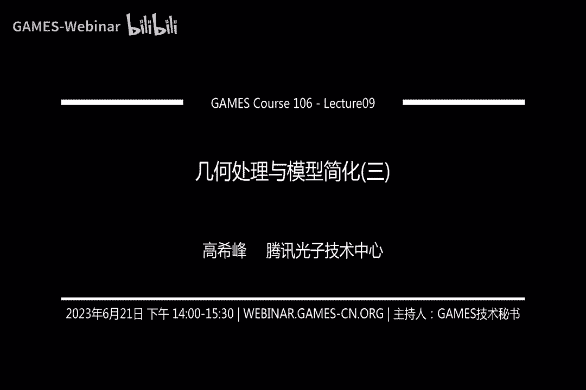
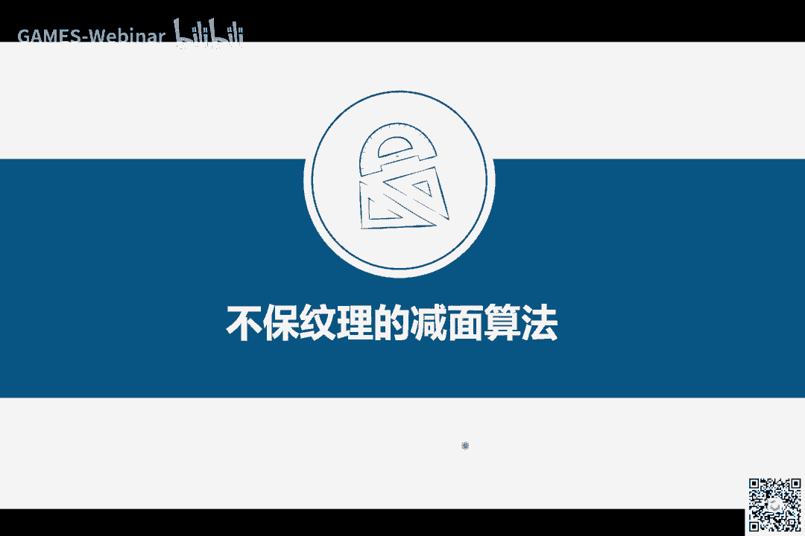
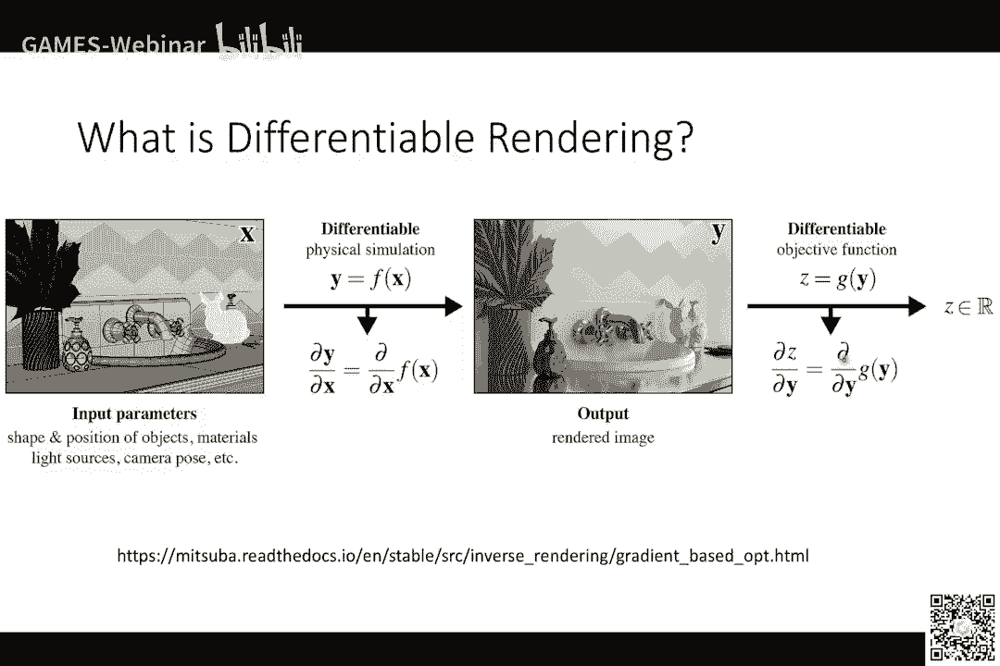
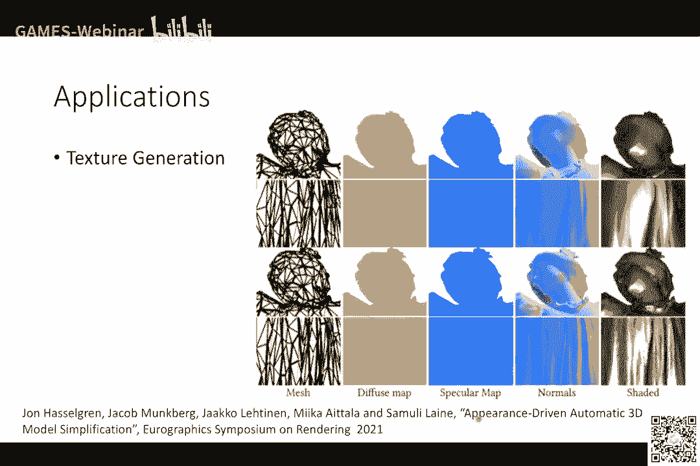
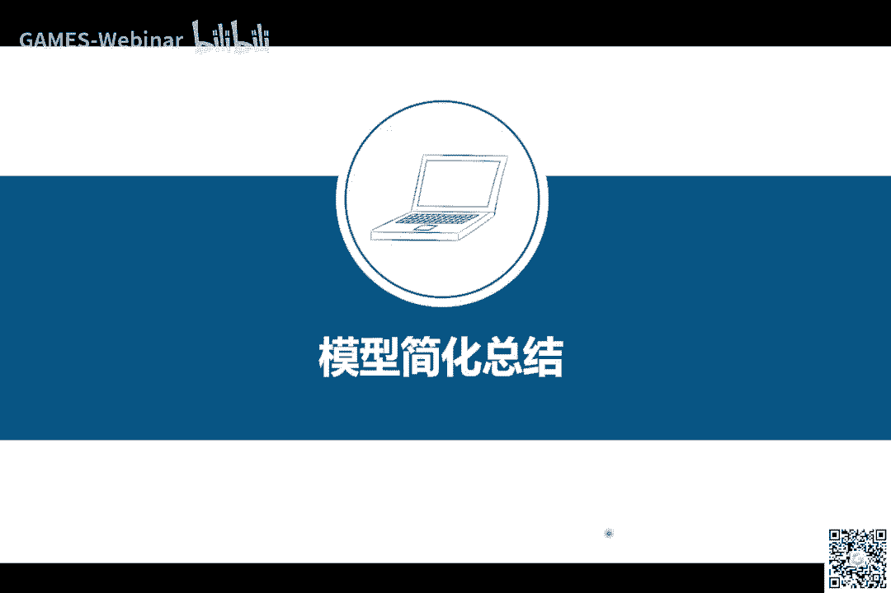
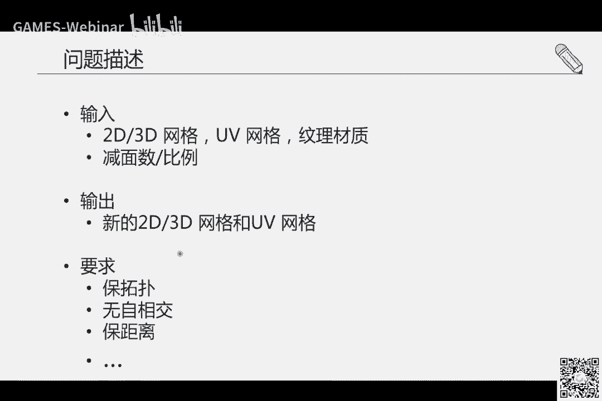

# GAMES106-现代图形绘制流水线原理与实践 - P9：几何处理与模型减面之不保纹理的减面算法 📐

在本节课中，我们将要学习不保纹理的模型减面算法。与上节课介绍的保纹理算法不同，这类算法在简化模型时，不保留原始模型的纹理贴图，而是为简化后的新模型重新生成纹理。这带来了更大的简化自由度，但也引入了新的处理步骤。

## 概述

不保纹理的减面算法旨在将高面数模型简化为低面数模型，同时不保留原始模型的纹理和UV映射。这意味着我们需要为简化后的模型重新计算UV并烘焙新的纹理。这类算法通常能实现更大幅度的面数削减。

## 不保纹理减面算法的概念

首先，我们简单回顾一下什么叫不保纹理的减面算法。减面算法的目标是将网格模型的面数降低。不保纹理的意思是，在生成新的简化模型时，附着在其上的贴图并非原始模型的贴图，而是需要针对输出结果新生成的贴图。

例如，左边三幅图是输入模型及其UV和纹理。右边及下方的模型是不保纹理减面算法的结果。这些结果模型使用的贴图是重新生成的。

不保持原始纹理为算法设计增加了自由度，因为我们无需保持原始UV。但另一方面，这也意味着我们需要处理重新展UV和生成贴图等步骤。

不保纹理算法的缺点在于会生成额外的数据（新纹理），这与减面以压缩数据量的初衷相悖。但其好处是可以极大地减少模型面数，例如从18000多个面减少到200多个面，降幅可达约1.5%。

## 算法核心流程管线

总的来说，不保纹理的减面算法经典流程管线主要分为三个步骤：
1.  **重新网格化**：对输入模型生成一个新的、简化的网格。
2.  **展UV**：为简化后的网格计算并展开UV。
3.  **纹理烘焙**：将高模的信息（如颜色、法线）转移到低模上，生成新的纹理贴图。

每一步都对应着许多不同的算法。本节课将从高层次阐述经典方法，帮助大家理解流程和原理。

## 第一步：重新网格化

重新网格化是整个流程中最复杂、最具挑战性的一步。其目标是生成一个面数少、视觉上与原始模型相似，同时拓扑和几何结构干净简洁的低模网格。干净的拓扑有利于后续的展UV等步骤。

### 面临的挑战

在实际应用中，尤其是游戏中的建筑模型，高模的拓扑和几何可能非常复杂。例如，一个仅6000个三角形的模型可能包含151个互不连接的组件，以及大量自相交的三角形对。这些“脏”数据（非流形、自相交等）对自动化算法构成了巨大挑战。

美术人员在创建模型时，首要关注视觉外观，而非拓扑整洁度，这与自动化算法的要求不匹配。因此，手工或交互式创建低模至今仍耗费大量人力成本。

### 现有解决方案与我们的方法

现有解决方案包括工业界软件（如Blender、Simplygon）和学术界算法，但它们在处理复杂模型时，可能在简化程度、视觉保真度或鲁棒性上存在不足。

我们设计方法的出发点是根本需求：**视觉保真**和**处理复杂输入**。核心思路是：与其直接操作复杂模型，不如先为其计算一个视觉相似且干净的“代理网格”，再对此代理网格进行简化。

我们的方法管线如下：
1.  **生成视觉网格**：通过从多个视角对模型进行投影和体布尔运算，生成一个从这些视角看外轮廓与高模一致的封闭网格。
    *   公式示例（概念性）：`VisualMesh = ∩(SweepVolume(view_i) ∩ BoundingBox)`
2.  **生成覆盖网格**：针对视觉网格无法捕捉的凹陷区域，通过额外的投影和布尔差运算进行“雕刻”。
    *   公式示例（概念性）：`CoverMesh = VisualMesh - ∪(SweepVolume(cut_plane_j))`
3.  **简化网格**：对得到的干净网格应用上节课介绍的QEM边折叠算法进行简化。
    *   我们改进了参数选择过程，通过计算帕累托前沿，让用户从一系列不同面数的优质结果中选择，避免了繁琐的参数调试。

该方法能对各种复杂建筑模型生成外观相似、面数极低的干净网格，在面数和视觉误差指标上均表现良好。

## 第二步：展UV

在得到低模网格后，我们需要将其表面展开到二维平面，建立UV映射，以便后续贴上纹理。

### 展UV的要求

展UV步骤有以下要求：
*   **硬约束**：避免三角形翻转和UV自相交。
*   **软约束**：切割线尽量短、映射扭曲尽量小、UV块排布（装箱）尽量紧凑以减少纹理空间浪费。

### 经典流程方法：Teaser

我们介绍一个相对易理解的管线方法，它包含几个步骤：
1.  **模型切割**：将输入网格分割成多个面片（Patch）。例如，可使用基于Lloyd算法的变分形状近似方法进行迭代分割。
2.  **面片参数化**：将每个面片展开到二维平面。常用Tutte嵌入算法保证在凸边界条件下内部无翻转。之后可通过连续优化减少扭曲，并用“脚手架”三角形防止自相交。
    *   代码概念：`UV_coords = TutteEmbedding(3D_patch, convex_boundary)`
3.  **UV装箱**：将展开后的各个UV面片像拼图一样紧密排列在纹理坐标空间内，形成最终的UV图。

这是一个模块化的流程，已有MeshLab等工具集成相关算法，相对实用。

## 第三步：纹理烘焙

拥有低模和其UV后，最后一步是将高模的视觉属性（如颜色、法线）烘焙到低模的纹理上。

### 方法一：基于光线投射（Raycasting）

这是经典且鲁棒的方法。核心思路是为低模创建一个外扩的“笼子”（Cage），然后从笼子顶点向低模表面发射射线，与高模求交。将交点处高模的属性，赋值给对应的低模顶点（或通过插值生成纹理像素）。
*   **优点**：非常鲁棒，易于GPU并行化，速度快。
*   **伪代码描述**：
    ```python
    for each texel in low-poly texture:
        world_pos = map_uv_to_world_via_cage(texel.uv)
        hit_info = raycast(world_pos, direction, high-poly_mesh)
        texel.color = hit_info.color
    ```

### 方法二：基于可微渲染（Differentiable Rendering）



这是较新的思路。它将渲染过程变为可微分的，从而可以构建优化问题。例如，目标是让低模渲染出的图像与高模渲染出的图像尽可能相似。通过可微渲染计算梯度，可以反向优化低模的纹理贴图（甚至几何）。
*   **优点**：作为连续优化方法，在某些情况下能得到比光线投射更优的效果。
*   **公式描述**：`min_θ L = || Render(high_poly) - Render(low_poly(θ)) ||`， 其中θ为需要优化的纹理参数。





## 总结



本节课我们一起学习了不保纹理的模型减面算法。我们首先了解了其核心概念与流程管线，它主要分为重新网格化、展UV和纹理烘焙三大步骤。

随后，我们深入探讨了**重新网格化**的挑战与一种解决方案，即通过多视角体布尔运算生成视觉代理网格再进行简化。接着，我们概述了**展UV**的经典流程，包括切割、参数化和装箱。最后，我们介绍了两种**纹理烘焙**的核心思路：基于光线投射的经典方法和基于可微渲染的优化方法。

不保纹理的算法流程复杂，但能实现极高的简化率，是游戏等应用中压缩三维资产数据量的重要手段。掌握其核心步骤与思想，有助于我们理解现代几何处理流水线的构成。