# GAMES201：高级物理引擎实战指南2020 - P1：Lecture 1 课程介绍 🚀

在本节课中，我们将学习高级物理引擎实战课程的整体介绍，包括课程目标、物理引擎的定义与应用、讲师个人经历分享，以及本课程将使用的核心编程工具——太极语言的入门知识。

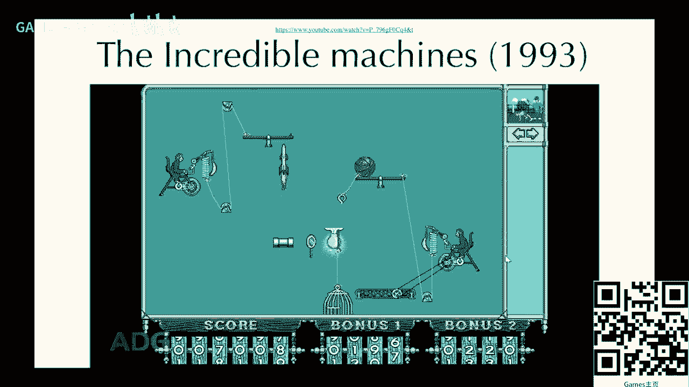

大家好，我是胡渊明，我在MIT读书。非常高兴有这么多同学一起来看我们的高级物理引擎实战2020课程。整个课程是基于太极编程语言的。内容是关于怎么写一个物理引擎。我们非常注重物理引擎的实战。

每位同学，我们希望都能在这个课上写一点自己的代码。因为你写的代码和听我讲数学公式，你的感觉是不一样的。你会很有成就感。这个课的目标就是自己动手打造一个影视级的物理引擎。适合人群是0~99岁的计算机图形学爱好者。如果大家有一点高等数学，或者Python，或者任何一门编程语言的预备知识的话，那就最好不过了。

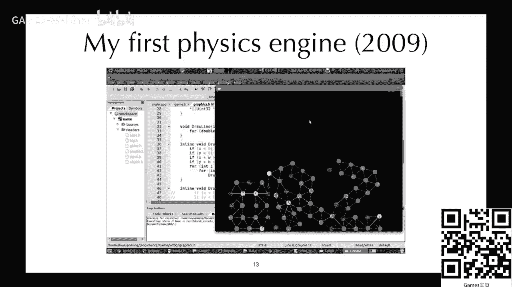

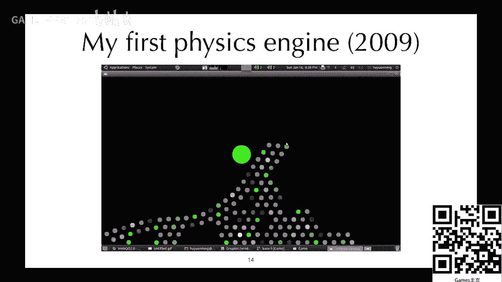

我们课程安排是每周一，北京时间晚上八点半到九点半，一共十节课。一个小时的课程有可能我们会往后延长，比如八点半到十点。这个根据大家的反馈。我这边是早上八点半到九点半，我们正好是12个小时时差。所以一般都是把am换成pm，或者pm换成am就可以算波士顿和北京的时间。

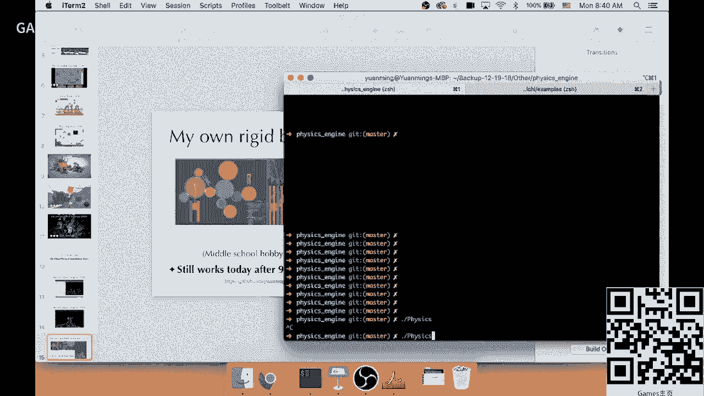

课程内容后面我们会具体再讲。我们先开门见山定义一下什么叫物理引擎。在维基百科上可以看到这个定义：物理引擎是一个计算机软件，它提供对于一个物理系统的近似的模拟，比如说刚体物理的动力学、软体动力学以及流体动力学。主要的应用是在计算机图形学里面，比如游戏和电影。其实一句话说，就是在你的电脑里面模拟这个世界。我想这大家应该有很多同学想过做这个事情，我觉得还是一个很有意思的事情。我小时候就很想怎么在电脑里面模拟一个世界出来。

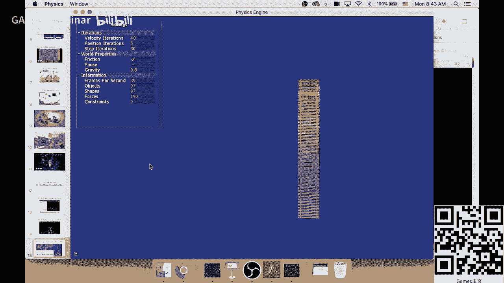

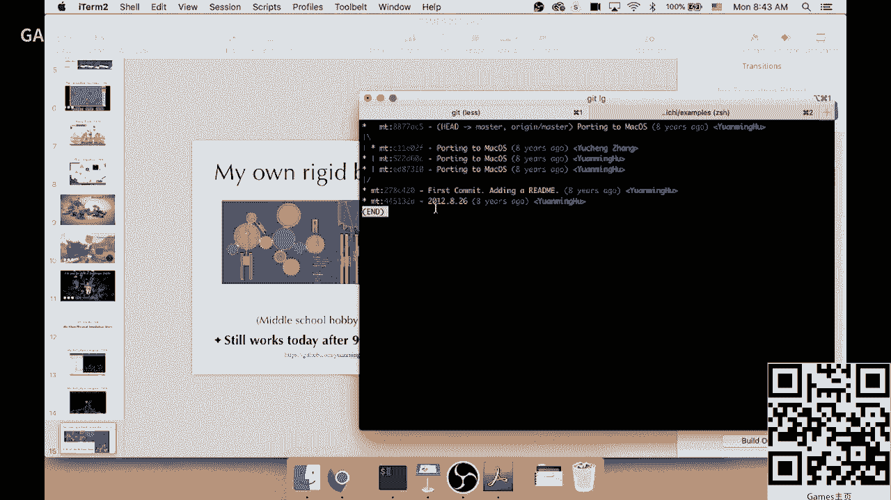

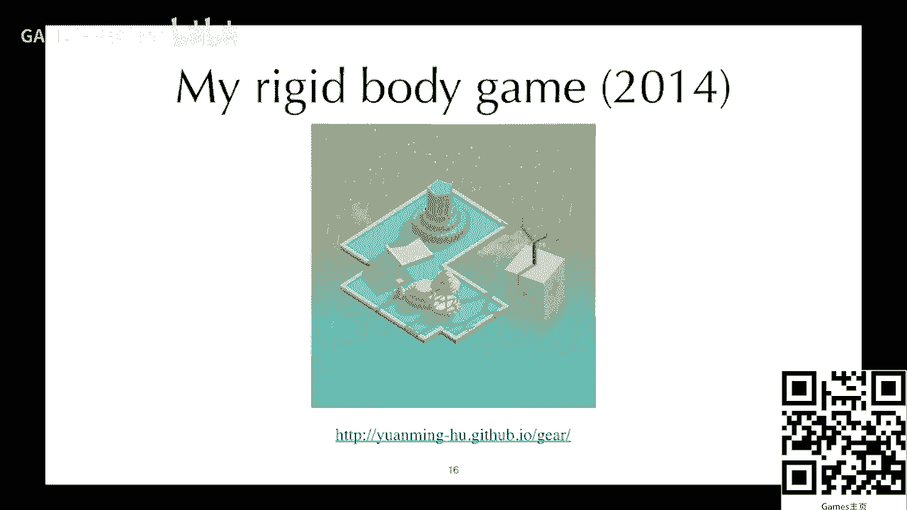

除了刚才说到这些应用，它还可以在工业软件里面有很多应用。现在你去做一个模型，你要做它的应力分析，你可能先在电脑里面算一算，看看它做出来以后应力分析可能会是什么样。这样你就不用真的把它做出来，然后试一试发现不行再重做。这种迭代过程可以完全在计算机里面进行。

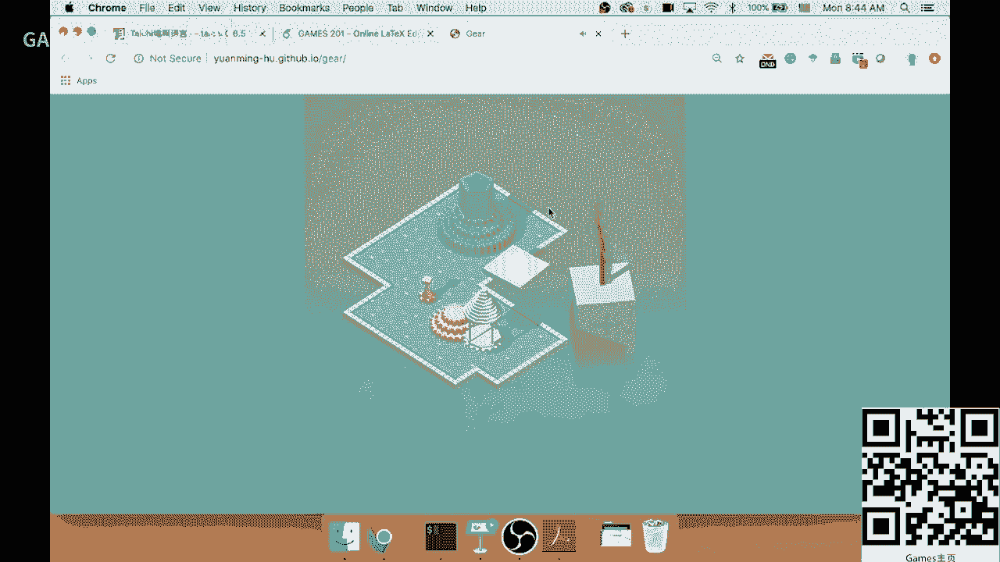

还有一个很重要的应用就是电影里面的视觉特效。现在电影里面，特别是动画电影，基本上每个电影里面可能有非常非常多的镜头都是用物理效果模拟出来的。

第三个应用就是虚拟现实、增强现实。如果你在VR里面有一个基于物理世界的话，那你的沉浸感会增强很多。因为你可以和这个世界交互了。并且这个虚拟世界里面的物理规律和现实世界里的物理规律是一致的，所以你就可以有更好的VR体验。

当然现在很多人用物理引擎来训练机器人，比如说无人驾驶。搞一个街道的物理引擎，这样车就可以在虚拟世界里面开，不用到真实世界里面冒着产生交通事故的危险。

大家可能最关心的物理引擎的用处还是在游戏里面。我今天就仔细讲一讲游戏。

我很小的时候就玩过很多物理的游戏，基本上它们构成了我童年的很大一部分。有一个我印象非常深刻的叫做《不可思议的机器》。这个游戏是这样的：你可以在游戏里面摆入各种各样神奇的道具，比如说一个球、火箭、杠杆，然后这些都会根据物理规律来运动。那个时候其实这个游戏里面有一个问题，就是它这个球是不会转动的，它这个球只会以各种形式平移。当然我是20年以后重新到网上找它视频出来的时候，我才发现原来居然有这个问题。我之前小时候玩的时候完全没有意识到有这个问题。可以看到大家对随着时间推移，对物理效果的追求真的是水涨船高。小时候玩一个这个我觉得已经很厉害了，然后后面有更厉害的。

大概可能很多同学都玩过《愤怒的小鸟》。我记得那个时候，我可能上初中的时候，那个时候非常流行iPad，就是最早的第一代iPad。iPad上面它提供了一个触摸屏，这个触摸屏它可以多点触控。一个很经典的游戏就是这个《愤怒的小鸟》。你可以通过拖拽这个弹弓，然后弹弓打出去，小鸟就撞到游戏里面的各种障碍物。障碍物有的时候会碰撞。这个截图应该很多同学都玩过。我觉得还是很有意思的，我花了很多时间玩这个。

另外一个稍微更加可定制一点的物理引擎是《Phun》。这是一个纯的物理引擎，它不是一个游戏。你可以自己在里面放各种东西，放点什么齿轮、水、滑轮、棱镜什么的。你就可以在这个软件里创建一个物理世界，然后去看它怎么模拟。我小时候经常玩这个东西。感觉有一段时间好像小学或者初中吧，那个时候特别喜欢玩这个，大概每天一放学就玩这个东西。

15年的时候又有一个很有意思的游戏，这个叫《Besiege》。这个游戏的特点是你可以自己把各种各样的模块组装成一个你的攻城武器。你带着这个攻城武器，你就可以去攻打各种各样的城池什么的。这个我自己没玩，这个是我本科的时候看我室友他玩的。感觉非常有意思，可以造各种飞艇或者攻城车什么的。我觉得还挺有意思的。

我最近大概是去年暑假，我玩了一下《塞尔达传说》。这游戏里面有很多物理效果，有很多谜题你需要用物理引擎去解决。这个是这个物理引擎的一个bug：你如果把三个箱子堆在一起，你就可以通过拉最后一个箱子的方式让自己朝前移动。但这不是很物理。

最近应该说我3月份的时候玩了一下《Ori》今年最新的这个。我觉得还是非常不错。这个游戏里面几乎所有的东西都是可以动的。你踩到地上地会往下陷，然后你可以和游戏里面各种各样的东西去交互。我3月份玩的时候因为我是比较早期的玩家，然后有各种bug。我觉得这个效果还是非常好的。

刚才讲了一下过去二三十年整个物理引擎技术里面，我自己玩过的一些游戏。下面我来讲讲我自己的物理引擎的故事。这个从大概初二开始，到现在居然11、2年过去了，我还在做和小时候喜欢做的是一样的东西。很有意思。

这个是我09年的时候写的第一个物理引擎。这个其实非常简单，就是一个弹簧质点系统。那个时候我对09年我应该是初中。你可以看到当时这个可能用一台不太好的笔记本，分辨率实在是非常低。所以你可以看到这个还是一个双核的笔记本。它是一个你可以创建很多这个弹簧质点系统。视频我没有留了，我只有一些截图，这个代码我也找不到了。

后面有一些有视频的。这个是11年的时候，那个时候我应该上高中了。那个时候学了一年刚体动力学，然后写了一个刚体的物理引擎。应该也是受到愤怒小鸟的影响，因为当时玩这个游戏就想这游戏里面这个物理效果是怎么实现，然后我就自己写了一个。那这个代码链接上面是有的。不过我觉得一个有意思的就是这个代码到现在还能跑。我可以跑一跑。

我来跑一跑这个物理引擎。这个最早我是在Windows上面写的，那个时候没有买这个MacBook Pro。后来我把它移植到Mac上面。还是挺有意思的，可以加各种各样的几何体。这个有一些参数可以调。调了以后，比如说我现在可以把摩擦关掉，大家可以看一看效果是什么样的，就滑滑走了。然后我再把它拆下来。我还可以把重力调成负的。你可以创建各种几何体。我记得还有个功能可以画任意几何体。对，他会做一个三角形的剖分，然后把它用三角形表示出来。再看看能不能画一个齿轮。我记得有一个功能可以画齿轮。哇，这个快捷键我十几年过去我居然还记得，真有意思。我们把它...这个理论上这个齿轮是可以驱动的，但是我已经忘了怎么去拖它。可以拖可以拖。我再看看我自己有一些其他的场景。这个是一个叫做牛顿摆。这个我记得当时物理老师经常喜欢用这个东西来做一个演示。我可以尝试一下。你如果放一个，你看到这边弹起来是六个的，右边一定会弹起来六个，左边一定弹起来六个。这个我记得当时上物理课的时候，盯着东西看了好久。下面是个多米诺骨牌。还有一些别的demo啊，这个是一坨弹簧。你可以看，我可以拉近一点。就我小时候玩过一个玩具，好像叫做什么机灵鬼，就是一坨一些弹簧，你可以两个手，他可以从左手跑到右手，右手跑到左手。应该就这些demo。所以这个代码已经年久失修了。你可以看看最后一次什么时候改的。他最后一次是8年前，8年前我把它扩展到Mac OS X上面。还有这个2012年8月26号，时光飞逝。

OK然后下一个。这个是我14年，我应该是大二的时候写的一个基于物理引擎的游戏。这个还是能跑，我看看跑一跑看看。OK，这个是这个物理引擎，不是我自己写的，这个是用的Box2D。当时我记得很喜欢玩一个游戏，叫做《纪念碑谷》，然后这个画风就抄了纪念碑谷。这个你是你可以通过W、S、A、D去控制这个能转的这个小人。然后你可以让他去驱动这个齿轮什么的。哎呦这靠的太近了，有的时候会和齿轮卡住。转这个齿轮的时候，这个右边这个树会长出来。上面这个齿轮好像是控制光影。我一开始想做一个完整的游戏，后来因为没时间做了一半就放弃，做了一个最小化的demo。这个大家可以自己去这个网址去玩一玩，还是挺有意思的。这个看起来是三维，但它其实是很多分层的二维物理。你看到这个这个块，它虽然浮在天上，但它其实还是一层一层之间是有碰撞，但层与层之间是没有的。OK赶紧把它关了，这个很耗GPU啊。

这个是我大概16年的时候写了另外一个流体的模拟。这个也在网页上可以放。大家我结束以后会把链接分享在网上，大家可以直接点进去玩一玩。你可以调各种solver参数。你可有的时候solver参数不对，他就不work。你看这个Jacobi iteration，如果不进行，他就肯定不行。然后这个FLIP的话，你可以在里面选择。那这些复杂概念我们后面都会介绍，所以大家暂时听不明白的话呢，不用担心。你可以调分辨率。我记得我当时好像你现在随便找一个好一点的GPU，跑512x512实时是没有问题，但我这个笔记本实在太烂了。没有办法。你可能有同学说这个风扇转起来可能非常吵，我就先把它关了。

所以这个是16年的时候。这个是一个17年的时候写的一个烟的模拟。哎呦怎么这么卡，哈哈不好意思，这个笔记本实在是不太行。这可能放的不是很流畅，我试试再放一遍行不行。啊看来这个笔记本已经放弃了。Anyway，这个当然，这个我后来跟做烟雾模拟的张星星前辈请教了一下，然后他说这个太黏了，效果不是很好啊，我就不过多展示了。

这个是我的第一篇SIGGRAPH paper。我们是用MPM做了各种切割的模拟。它实现了固体和液体的显示的耦合。然后切割是这个耦合的一个副作用。我们可以切各种切香蕉，切这个兔子，这个叫奶酪。你可以切沙子或者叫搅拌沙子。那这个算这个文章里面呢，我还提出了一种基于移动最小二乘的新的物质点法，它会比之前CCD的物质点法要快两倍。还是基于2016年的蒋老师的一篇叫Implicit Particle-in-Cell paper去进行的一个算法上的精简。这样使得它计算的时候工作量会小一半。

有同学问这个渲染时间和粒子的数目，这个我可以说一说。基本上这边所有的都不是实时的。这个paper里面基本上没有实时的demo。然后切你像这个切兔子或者切奶酪，这个基本上都是100万个到300万~400万个粒子。而这个右下角这个搅沙子，这个大概有我记得有三百五十万个粒子。我们当时模拟它可能得等上一天，还是挺费时间的。但是现在MPM这个算法就是它的性能逐渐的也在提升，所以逐渐的很多实时的应用应该也会出现。

这个是一个更大规模的例子。这个是西瓜分形，2018年我们做了一个，在一台机器上面减10亿个voxel的FEM。然后用FEM做完FEM以后，我们有sensitivity analysis，然后可以做topology optimization。这些概念我后面都会提到。这边大家只要记住这个voxel数目非常多就行了。代码网上也有，然后大家可以自己下来跑一跑。这个跑的时间就非常长了。这个我记得这个demo可能跑了得有一个星期。我记得中间还挂了一次，我还重启了。我对这个事情印象特别深刻。所以性能是非常重要的，在物理模拟里面。

然后最近一个东西我最近开始搞的是可微模拟。那这个东西其实很早以前也有，只不过我们最近把它流程搞简化了一遍。什么叫可微模拟呢？可微模拟就是说这个视频可能不是很流畅，我尽量让它放的流畅一点。笔记本已经弃掉了，现在已经非常卡了，可能是因为刚才跑的那个GPU的程序。可微模拟就是说，我们正常的模拟就是给你一个初始的状况，然后让你预测比如说十秒钟以后这个系统是什么样的。然后呢可微模拟是反过来就说，我希望去求出初始状况的一个扰动对于结果影响是什么样的。然后这个其实就是要求一个梯度对吧。当你有梯度的时候，你就可以对初始状况进行各种各样的优化。比如说这个地方，我们就在求一个初始的水面的高度上，使得经过512个time step以后，可以得到一个太极的pattern。可能现在解释有点抽象，我们后面会继续讲。

就到了今年了。刚才讲了过去10年的故事。那现在我在MIT读博士，现在第3年了。我还是在做物理引擎，但是我花很多时间去写编译器。为什么呢？因为我发现如果你没有一个好的编程语言，没有一个好的编译器，你要写高性能simulation是非常非常难的，就是非常非常费时间。所以我就重造了一个编程语言，这样大家就可以更容易地写自己的simulator。那么现在基本上可以说有一半的时间都在做这个太极编程语言。当然这个里面有非常非常多的贡献是太极社区的同学们一起帮忙做的。真的大家非常不容易。我觉得每天早上一起来就能看到GitHub上面好多的issue，每天跟大家一起来嘛，就跟开网游下副本一样，就解决一个个很难修的bug，进行各种各样的设计决策，真的非常有意思。当然我最近也开了这么个课，然后主要是想跟大家分享一下，怎么样去写物理引擎比较有意思。当然也做做这个直播，带货带一带这个太极编程语言，希望大家都能尝试一下这个新东西。

那么我们接下来讲一讲这门课。我们会注意力集中在哪些关键词上面。我们会简单讲讲各种各样的离散化。那这部分数学比较involved，所以可能也不会讲的特别深。更多的呢因为我自己主要是做计算机方面的，所以我会更多讲一讲，你从一个程序员的角度，怎么去直观地理解各种各样的离散化。

我们会讲怎么样写有效率的求解器。比如说现在你要写一个求解器，很长的时间很可能就是花在这个linear systems solver上面。不同的linear systems solver它的性能有天壤之别。后面我们会继续详细介绍这些preconditioner。

我们会讲讲怎么样去提高生产力，怎么样用比较短的代码实现一个高效的物理引擎。你别看这个短代码啊，听起来好像是一个非常糟糕的metric，好像这个代码行数是measure一个软件是非常糟糕的一个metric。但是你仔细想想，有别的更好的metric吗？其实你很难想到比这个代码行数更好的metric。这也是为什么我喜欢用这种metric来证明一个代码可以用很少代码能写出来。

当然我们也很在意性能。刚才提到很多模拟的我们都要等上一天的时间。然后迭代的话呢，其实你如果要再去做迭代的话，那就非常非常费时间了。

我们也会简单介绍一下硬件的体系结构。因为你如果要写高性能solver的话，你得去了解一下你的硬件是什么样的。如果你不了解硬件呢，那你就很难把它全部利用起来。

我们也会讲讲各种各样的复杂的数据结构。但是太极让这个数据结构的使用变得更加的简单了。这个后面我们会详细介绍。

我们也会讲讲怎么样去做复杂的并行。因为现在并行硬件大行其道。CPU和GPU如果算它吞吐量的话，那真的是天壤之别，一般能差上一个数量级。这边展示的是SIGGRAPH 2020年的一篇比较新的SIGGRAPH paper。这个paper的结果非常非常impressive。他们可以用四个GPU，然后模拟应该是1亿个particle。这个在之前是前所未有的。大家有兴趣的同学可以去读一读这个paper。

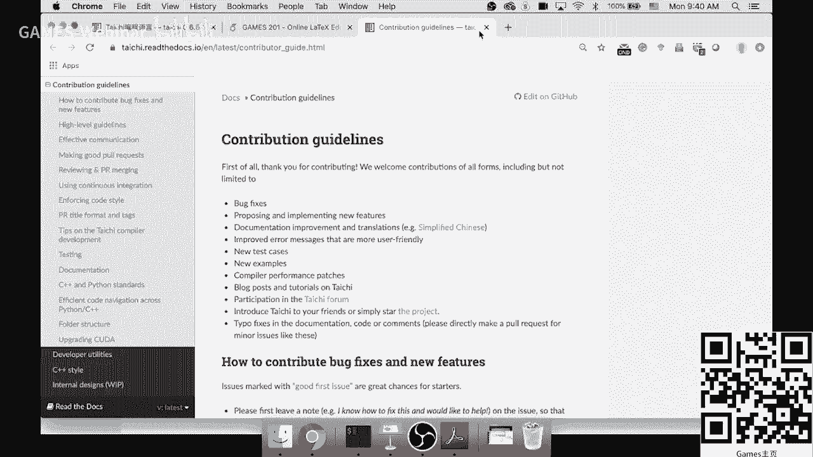

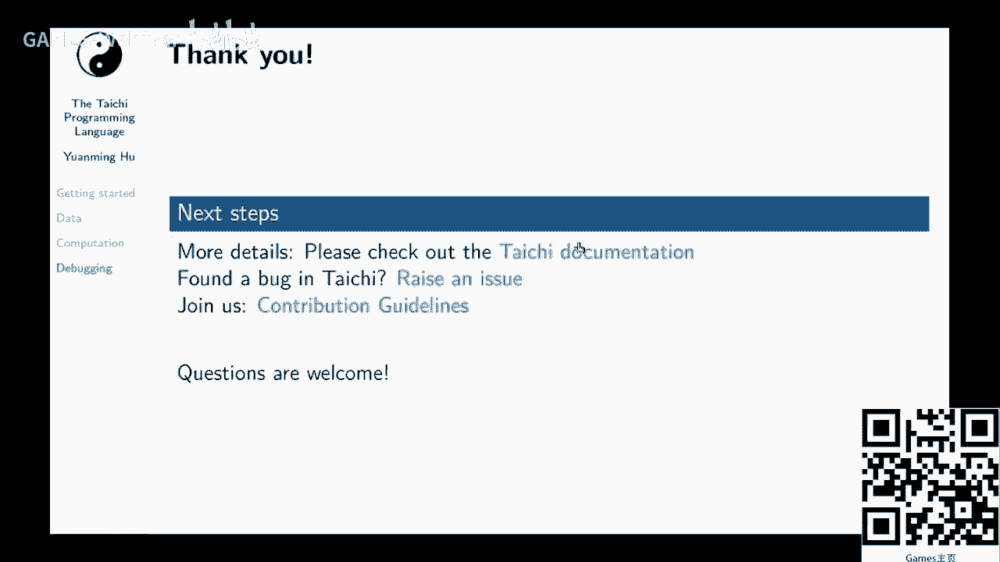

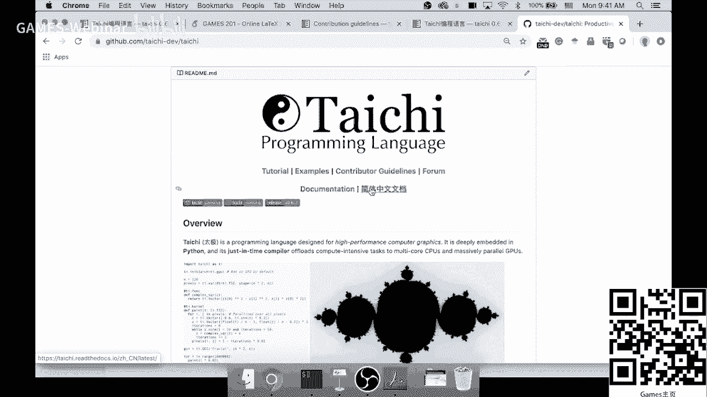

最后我们会讲讲怎么去求simulator的导数。导数求出来呢，你就可以做很多有意思的事情。比如说我们这边还有两个机器人，都是软体机器人。上面的是一个，上面机器人他有四块肌肉，就是他有两条腿，每条腿有两半，然后左边一半，右边一半，每一半可以伸缩，或者可以叫变长或者变短，就相当于你的肌肉嘛，你可以肌肉可以收缩或者舒张。那下面一个呢是一个弹簧质点的机器人。上面这个是一个MPM机器人。

好那么我们这个第一讲的上半部分就结束了。我们来下面呢我们介绍一下太极编程语言，因为这个是一个大家都要用上的工具。好，那么现在这个slides我在整个课程期间会不断的更新。因为我们今天只能讲一讲最简单最简单的内容。然后后面我们会逐渐的加入太极里面的一些比较复杂的feature。这些slides呢都会课程结束以后都会在网上有的。所以大家不用担心。如果说有任何slides里面没有介绍的东西了，大家可以去看太极的文档。现在太极的文档在大家努力下，英文文档和中文文档应该都是比较可读的。特别是中文文档真的非常不容易。基本上就以大家以迅雷不及掩耳盗铃儿响叮当仁不让之势，就把这个中文文档给他全部翻译好了。真的太不容易了。当然很多feature我今天讲到的，并不是我自己一个人写的。很多feature是我们社区一起写的。然后我当然也不是唯一的developer。

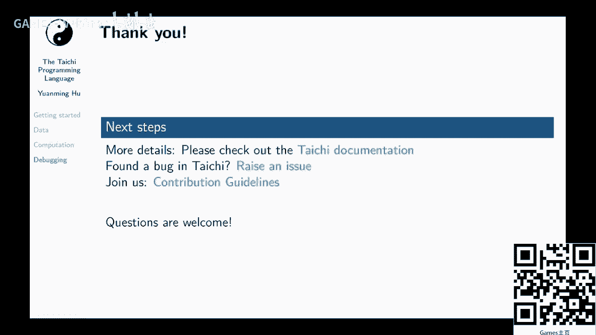

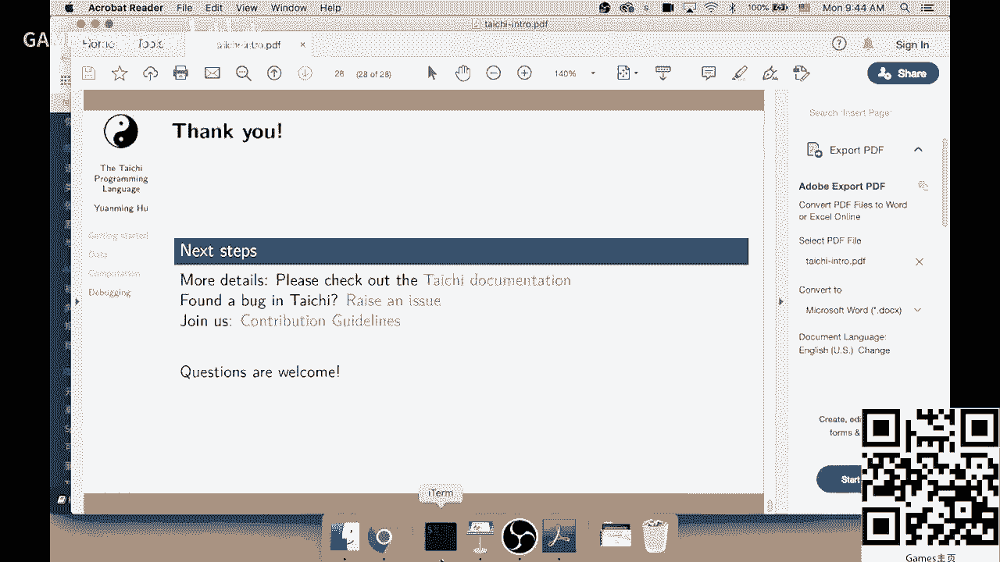

那么什么是太极呢？太极是一个高性能的领域特定语言。它嵌入在Python里面。所以它的语法和Python非常非常的像。然后你如果会Python，那你基本上很快你就可以学习太极语言怎么用。他这个语言专门是为了计算机图形学的应用来设计的。我们在设计的时候，非常非常注重生产力和可移植性这两个东西。以前在计算机图形学里面是非常难以做到的。我说的这个生产力，不是说你用游戏引擎做游戏的这个生产力，我说的是对于一个想研究图形学算法的人，去写一个图形学算法的生产力。我们也很注重可移植性。

这门课呢，我们建议大家都使用太极编程语言。因为太极程序有什么好处？你在一台机器上写的太极程序，复制粘贴一下到另外一台机器，只要一台机器装了太极，基本上都是能跑的。这个就和你用OpenGL，和你用其他的像CUDA写的程序就完全不一样。因为你很容易，如果你不用太极，你会各种各样的依赖，你就为了让一个画一个三角形，你可能要装三四个包，就非常非常麻烦。

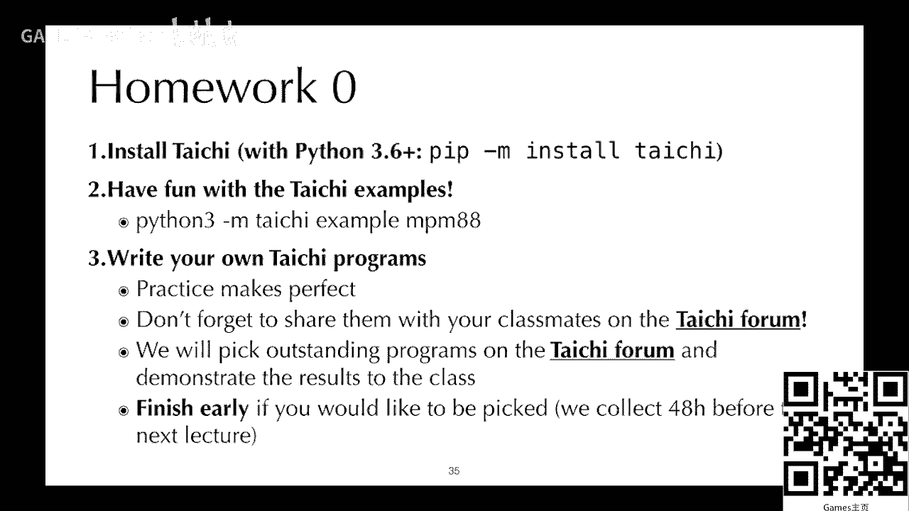

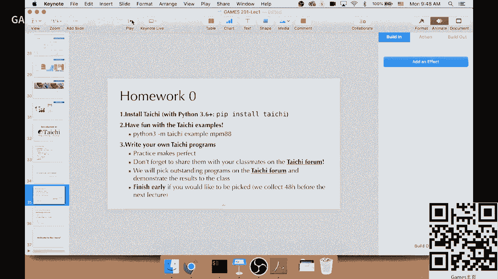

太极呢是面向对象的，然后它是自动并行，并且kernel是mega kernel。这个和深度学习里面的那种coalescability比较弱的kernel是不一样的。我们还有一些比较好的稀疏数据结构以及可微编程的支持。这个我们就后面再介绍了。

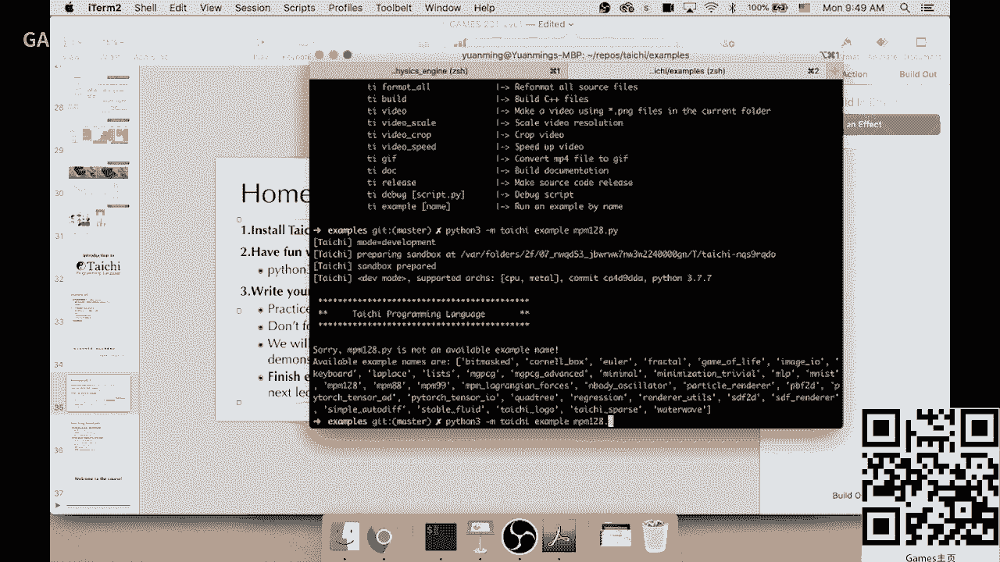

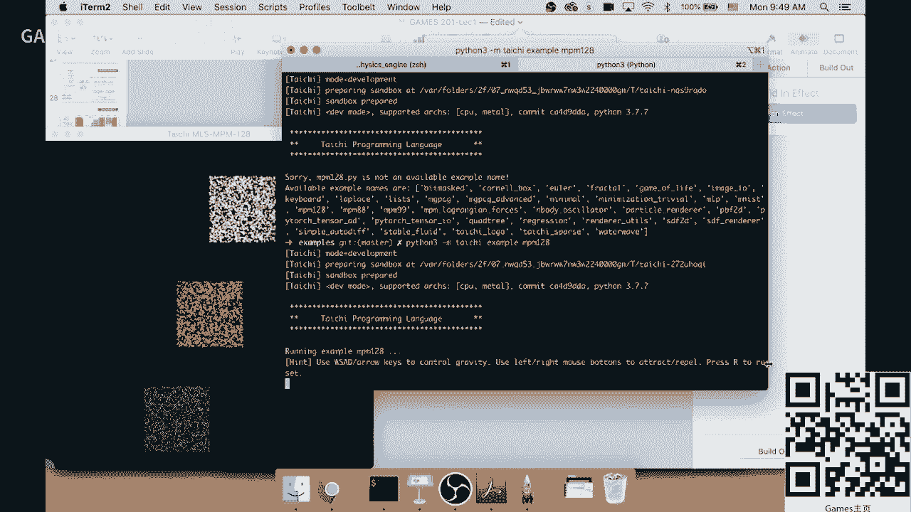

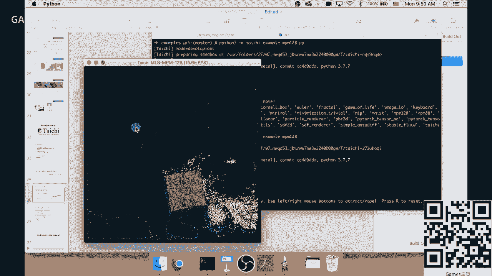

OK那今天其实就讲几个非常简单的内容：怎么安装，怎么定义数据，怎么做计算，然后怎么进行调试。我们先看看怎么安装。

那么如果你用Python 3.6，3.7或者3.8，你就可以直接用pip去装一下太极。大家要注意一下，我之前闲聊的时候也说过，就是说国内镜像有的时候它有一点延迟。所以有的时候，比如说官方镜像已经0.6.7了，然后国内镜像可能还是0.6，然后就会有一点延迟。然后就会导致因为太极可能不是最新的版本。这个我自己没有去实践过，但是之前知乎上面有很多人跟我说这个事情。就是说大家装的时候要确认一下版本。

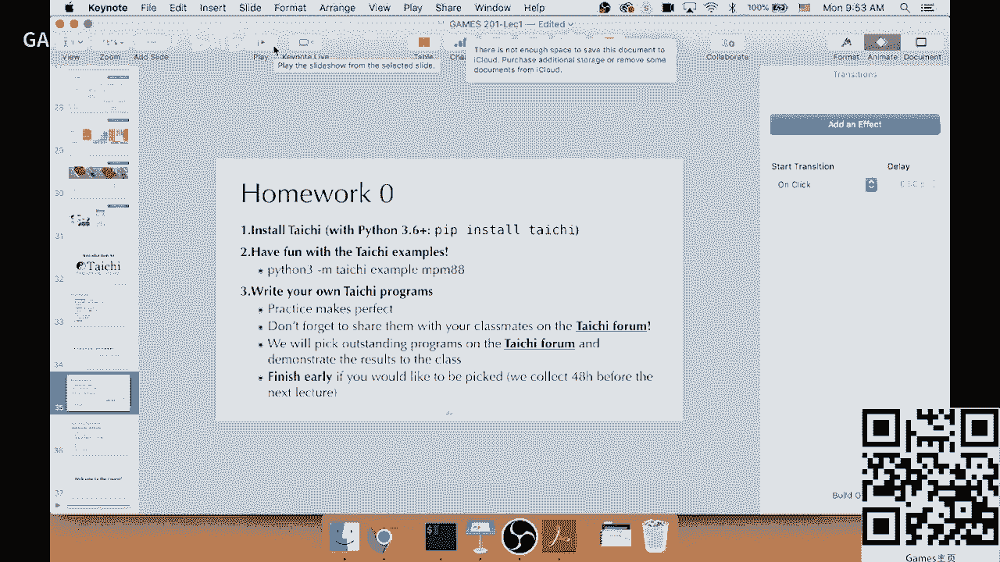

然后三个主流的操作系统我们都是支持的。太极程序呢也可以既在CPU上面运行，也可以在GPU上面运行。GPU我们支持CUDA，然后OpenGL和Apple Metal。

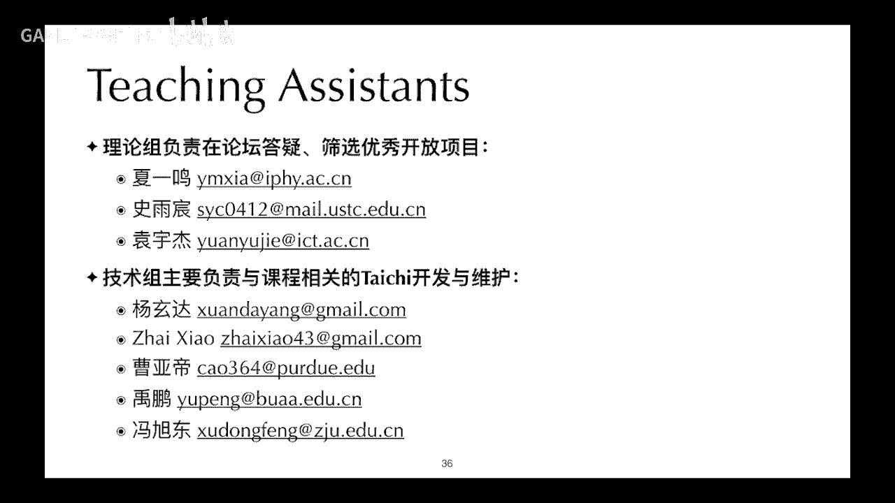

如果你有一些神奇的配置，比如说你的CPU是ARM，或者你非要用Python 3.9以上，那也没办法，那你就得build from scratch，把太极的源代码下来装吧。但如果我相信用Python 3.9的同学是比较少的。最新的Python已经3.10了，我记得5月25日的时候好像3.10已经出现了。但是大部分同学应该都是3.6或者3.7，3.8可能都是相对