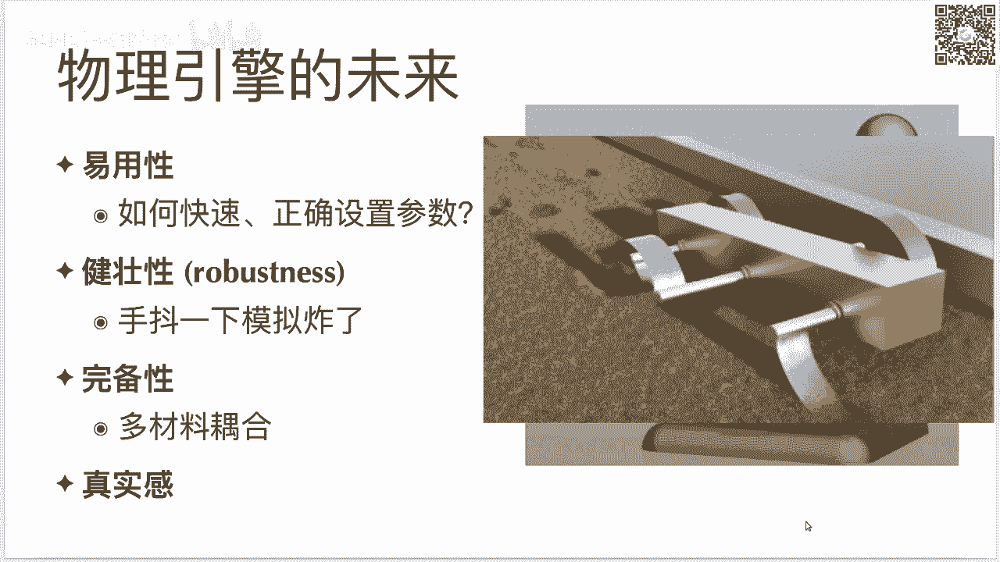

# GAMES201：高级物理引擎实战指南2020 - P10：Lecture 10 总结 🎓

在本节课中，我们将回顾整个课程的核心内容，探讨“简单性”在科研与工程中的重要性，并展望物理引擎的未来发展。最后，我们将总结课程收获并表达感谢。

---

欢迎大家来到我们课程的最后一讲。从第一讲到今天，过去了大约三个月的时间。大家相当于用一个暑假的时间，基本学完了这门课程。

在正式讲解之前，我们首先展示作业二的各种获奖作品。虽然这次作业二时间非常紧，并且有很多同学反映正好遇上期末考试或工作繁忙，但仍有12位同学提交了作品。我们会给这12位同学都寄一份精美的纪念品。后续会找时间撰写文章，让课程以外的同学也能了解到大家在这门课上做出的精彩程序。课程结束后欢迎大家继续提交，但后续提交可能需要等待较久才能收到纪念品，因为课程结束后的组织会更加松散。

我们还要介绍一下ChinaVR上的太极竞赛。之前有很多同学反映报名表太长，成为了报名的阻力，所以我们后来做了一个一分钟完成报名的报名表。这个报名表非常简单，只有四个问题，其中三个是必填的。希望大家都能尝试报名一下。奖项设置非常丰厚，有特等奖一个、一等奖三个、二等奖六个，以及三等奖和优秀奖若干。基本上只要完成一个合格的提交，都会拿到某种奖项。竞赛的网站也放在这里，请感兴趣的同学多多参加。

在正式开始讲今天的内容之前，首先要恭喜各位。因为大家掌握了各种各样的新技能。这些技能包括一门新的编程语言、基于物理的模拟的各种算法、各种数值线性代数的方法，以及现代计算机的处理器微架构、并行编程、GPU编程等各种高性能计算的入门知识，还有稀疏数据结构和可微编程这两个太极的独特功能。能把这些知识都掌握甚至入门，需要花不少精力。这门课难度不小，能坚持到最后的都是勇者。大家应该给自己鼓个掌。

那么我们今天讲什么呢？今天主要是我的一些个人体会。我在构建物理引擎和太极这个项目时所学到的知识。如果让我必须只能用一个词来概括我这10年来从这些事情里面学到的东西，这个词就是 **simplicity**（简单性）。我后面会论述为什么简单是好的。讲完这个以后，我会讲讲物理引擎的未来，简单讲讲我自己在课程中的收获，最后感谢各方面为这门课程提供支持的老师和同学。

刚才提到，如果只让我用一个词概括我在物理引擎和太极这个项目里学到的东西，这个词一定是 **simplicity**（简单性）。说到这个简单性，很多同学可能还在学校里面读本科。在基础教育或本科阶段，学生最重要的一个事情是把考试考过。考试时要做的事情是证明自己会某种方法。但是当你本科毕业以后去工作、读PhD做研究或做一个工程时，最重要的能力是证明自己能找到好的方法。当你离开学校以后，有很多情况会改变。第一个改变是你有自己选择方法的权利。第二个很重要的改变因素是你需要与他人合作。这两个因素使得找到一个好方法非常重要。往往在你脱离了学校环境以后，用哪种方法并不重要，重要的是系统性地解决问题。解决问题是最重要的，方法不重要。一天只有24个小时。聪明的人都是一样聪明的。在时间和脑力都非常有限的情况下，我们必须采取的一个措施是：用简单可行的方法去解决大部分简单的问题。因为世界上有很多难题是真的非常复杂的。你必须用简单的方法、用最少的时间把简单的问题解决了，才会有时间去解决真正复杂的问题。别把时间都浪费在解决简单的问题上面，那你就没有时间去解决真正复杂的问题了。

有影响力的创新往往会伴随着复杂性的减少。很多同学觉得新的东西一定会更加复杂，但往往并不是这样。发明它的人往往已经对它进行了最大程度的简化。这有点像日本文化里的一个宗旨：不要给他人带来麻烦。你要发明一个新的东西，必须让你的用户能够轻易地使用它。你造出来的东西必须是简单的，必须不能给他人带来麻烦。如果你写了一份代码非常难以使用、难以读懂，那么在和他人合作时，这份代码可能根本就不会出现在最后的代码库里。因为审阅者会删掉你的代码，因为他不懂你到底在干什么。即使你的代码有幸进入最终代码库，它的维护、测试和正确性都非常难以保证。

刚才说到简单性是好的，反过来说就是复杂性是坏的。为什么复杂性很坏呢？首先，如果你有一个非常复杂的东西，那么其他人不能理解你在做什么。其他人不见得和你有一样的背景知识。如果你刚提出来一个非常复杂的东西，没有人能懂你做的东西，它产生的影响力就非常小。其次，一个复杂的东西要实现它非常缓慢，并且往往难以快速失败。为什么要快速失败呢？因为如果你做科研，你就会知道99%的想法都是不工作的。剩下的1%里面，可能有90%是被前人尝试过的。你只有可能剩下的1‰的想法是能工作的。你必须在精力有限、并且大家都一样聪明的情况下，还想做出有意义的工作。一个非常重要的事情就是能快速地知道这个方法是否有效。你必须能够快速失败。如果你有一个非常复杂的想法，它实现起来非常费时间，你很难快速失败。因为你不知道到底是自己实现错了，还是这个方法本身不行。你很难区分到底是方法复杂，还是自己没有实现好。这其实是复杂方法的原罪。这就引出了第三点：复杂的方法更容易出错，而且出了错以后很难去分析它。因为它其中的成分太多了，你不知道到底是哪一部分搞错了。很多复杂的模拟算法，虽然最后能发表在顶级会议上，但是随着时间推移，很快大家就忘了这个算法，因为它太复杂，没有人能够正确实现。看着一篇论文实现这个算法其实是非常难的。如果你实现了半天发现它不工作，那到底是论文有问题，还是实现得不对，还是自己对论文的理解有问题？你很难知道到底是什么原因。你甚至可以说这是不科学的，因为你不能证伪它。

复杂性还有一个很坏的事情：你有一个很复杂的算法，不管是你手写也好，还是编译器帮你编译也好，它都非常难以高性能地实现。大家可能会觉得复杂的算法往往跑得更快，但是实际情况下并不是这样。复杂的算法首先你得实现正确。假设你能把它实现正确，还记得上一讲吗？上一讲我们提到，对一个算法，如果考虑上计算机体系结构、考虑上各种高性能计算的技巧，你是能够把它提高十倍乃至二十倍的速度。但前提条件是这个算法足够简单。如果说你给我一段普通的随手写的程序，我可以花一些时间重写一遍，可能能快个十倍、二十倍。这些一般都是可行的。但是如果说你给我一个非常复杂的程序，我即使知道我花很多时间能让他快十倍二十倍，我可能都没有动力去做这个事情。因为太复杂、太烦了，大家懒得帮你去做性能优化。所以你要实现一个高级的算法，它首先得是简单的，不能太复杂。复杂了以后没有人能知道怎么去把它高性能化。因为高性能本身就是一个复杂性。人能处理的复杂性是有限的。如果你这个算法本身非常复杂，那剩下来的能够接受的复杂性就非常小。那么代价就是你在剩下来的脑力里面，能够用在优化它的部分是非常少的。所以最后导致的结果就是：复杂的数据结构、自适应数据结构、复杂的网格、复杂的数值格式，最后都会败在暴力解法之下。什么是暴力解法？就是稠密数据结构、一阶精度的有限元或MPM。当然这不绝对，有限元大家有的时候还是会用很高阶精度的。但另外一种方法就是用一阶精度的元素，把分辨率提得很高很高。虽然在严谨意义上这可能不太行，但实际情况下往往就不错了。特别是在你写物理引擎的时候，如果你把你的求解器搞得非常复杂，那编译器也会很难优化你的代码。编译器会遵循一些规则去分析你的程序。如果你的程序非常复杂、难以分析，那编译器也会很困惑，不知道你的代码在干什么，生成的代码质量也会受影响。

既然复杂性这么坏，为什么大家还会把东西搞得非常复杂呢？大家可以想一下这个问题。答案或许出乎我们的意料。答案是什么呢？**Because it's way easier to be complicated than to be simple.**（搞出复杂的方法比搞出简单的方法简单多了。）听起来可能有一点矛盾。总体的意思是：对于大部分人来说，如果你精力有限、经验有限、各种资源都有限，你搞出来的方法往往是比较复杂的，而不是简单的方法。

我们来看几个具体例子，为什么有很多情况下大家会喜欢把东西搞得非常复杂。

以下是大家可能把事情搞复杂的几个动机：

1.  **证明自己很聪明**。这是我们的教育里面存在的一个很有意思的现象：我需要通过一些复杂的方法来证明自己和其他人不一样，证明自己很聪明。因为大家的直觉是：你懂这么难的东西，你一定很聪明吧。在学校里面或许这是一个好主意。你可能通过做一些难题，或者通过做一些大家都不懂的方法，显得自己独一无二、鹤立鸡群。但是实际上当你需要去和其他人交互的时候，这几乎永远不是一个好主意。因为如果你去看一看你做的项目的更大图景，其中的关键因素就是你能不能和其他人有效沟通。你的想法能不能从你的脑子里面精确传输到另外一个人的脑子里面。如果是一个简单的方法，沟通已经很困难了。沟通是最难的事情，沟通比写代码难多了。简单方法的沟通已经很难了，更何况一个很复杂的方法。所以一旦你要和他人沟通的时候，把事情搞复杂绝对不是一个好主意。一定要把事情简化简化再简化。这就是为什么简单精炼的一些方法能够流传得很广。

2.  **展示工作量**。证明自己做了很多东西。有一些课程项目会要求你写一个五页或十页的报告。结果你搞了一个方法，发现报告好像只能写一页。你是不是可以把方法搞复杂一点，这样就能凑到五页或十页了？学校里的学生往往会有这样的思维：老师要求的方法必须要有复杂性。实际情况下，学校里面大家可能更加过程主义，看你解决问题的过程，因为目的是让你学会解决问题的方法，而不是让你把问题解决。但是当你脱离了老师、脱离了学校环境、脱离考试设定以后，去真正解决实际问题的时候，谁在乎你用什么方法去解决问题呢？你只要把问题解决好了就行了。所以大部分专家并不需要去展示你做了多少工作。

3.  **隐藏错误**。这个或许也有点反直觉，但这个逻辑其实也很容易理解。有些人觉得我做的这个工作里面可能有错误，那怎么办呢？我把它搞得非常复杂，这样就没有人证明我是错的。因为没有人理解我这个东西到底在干什么，所以我就是对的。这个逻辑说起来很讽刺，但有些时候势必会有人这么做。当你这么想的时候，其实已经开始违背科学的精神了。卡尔·波普尔对于科学的定义在于：科学必须满足一个特性，就是它是可证伪的。如果你在科学的体系里去论证一个东西，你怎么说明它是科学的？就是说如果我这个论断是错的，你是可以去证明它是错的。如果你把一个东西搞得非常复杂，它既不能被证真，也不能被证伪，那这个东西它就“not even wrong”（连错了都不是），它不属于科学讨论的范畴。

4.  **希望和先前工作区分开来**。这样你的论文就可以被接收。你写了一篇论文，方法非常简单，之前可能已经有人做过了。审稿人就会说你的方法和之前某某某论文做的一样，我要拒稿。所以有些做研究的同学可能会把方法搞得非常复杂，这边打个补丁，那边打个补丁，使得它看起来和之前的方法不一样。审稿人在考察这个方法到底之前有没有做过的时候，看这个方法好像非常复杂，那可能之前确实没有人做过吧，至少在创新性上面就不会再来质疑你了。这么做可不可以呢？如果你的目的就是让你的论文被接收，这么做是完全可以的。如果你的目的是尽快毕业、发表足够数量论文，这么做是完全可以的，也有很多人确实就是这么做的。但是如果你真的希望你的文章有很大的影响力，那最好还是别这么做。因为这些文章做出来，说白了就叫做增量性工作。如果你把这个推到极致，大家就叫它“灌水”。就是说我把一个方法这边修修改一下，里面修改一下，把它搞得非常复杂，本身原来想法的精简性就没了，搞出来一个非常复杂的算法。这种论文投了也能中，但是一般来说很难产生很大的影响力。

5.  **懒得去简化它**。一个想法诞生的过程，往往可能是20%的时间是在想这个东西，然后后面80%的时间是在去简化你这个东西。你可能20%时间做个雏形，写上一坨乱七八糟的代码，然后花80%的时间去简化它，使得得到一个最小份的、还能工作的代码。如果你只花前面20%时间，你就只用了别人1/5的时间，你也能得到一个非常复杂的算法。这种情况下，如果把后面80%忽略掉，那就相当于懒得去优化。这样其实也是可以的。但是你如果希望别人能够理解、希望你这个工作从长远角度来看很有影响力，那最好还是花一点时间去简化你的想法。

6.  **受众过于宽容**。这是一个很有意思的例子。我记得当时我在姚班上一门课，老师说如果你的方法非常复杂，我们看了半天也不知道它是对的还是错的，我们会当做错了来处理。在大部分情况下，甚至有些人在考试的时候会故意写出来一坨显得自己好像懂得很多。阅卷老师可能会觉得这个同学写了这么多，我虽然不知道他是对的还是错的，好歹给他个辛苦分吧，给他个两三分。这样其实就是纵容了这种把事情搞得非常复杂的想法。但是这种事情只会在学校里面出现。在实际的过程中，没有人会欣赏你这种做了很多工作、最后没有人能够理解的事情。我记得当时那个老师就是说，如果你不会，那你就写你不会，我会给你三分。但是你不要说你不会，你写上一大坨，这样我作为阅卷人浪费很多时间，你也浪费了很多时间。

所以你看其实大家有各种各样的动机，会去把事情搞得复杂。还有一个有意思的事情是：大家会觉得用简单方法的人很傻。是这样吗？其实并不是，绝对不是这样。实际上世界上最聪明的人都知道把事情搞简单的重要性。

我们来看看：

*   爱因斯坦说：**任何事情都应该被搞得尽可能的简单，但不要过于简单。**
*   C++之父Bjarne Stroustrup在CppCon会议上给过很多关于简单性的演讲。C++现在已经变成了一个非常复杂的语言。他的演讲中有一个叫做“Make Simple Tasks Simple”（用简单的方法解决简单的任务）。**Being too clever is not clever.**（表现得太聪明并不是聪明人的做法。）他举了一个很有意思的例子：调试一个程序比写程序还要难两倍。因为大家写程序的时候，大部分时间并不是在敲键盘上面，大部分时间是在调各种bug上面。如果说你在写你的程序的时候，已经把你的全部脑力都用上了，那你调试的时候就没法调试了。因为你竭尽全力才把代码写出来，调试又比写代码要难，那你就没有能力去调试它了。这其实是一个很精辟的话。每当我看到各种太极社区里的PR搞得非常复杂，或者看到合作者写非常复杂代码的时候，我就会援引这些例子。首先，调试比写代码难。如果你写代码的时候已经搞得很难，那你怎么调试？第二，别人来接替你的工作，比你自己在你的代码上工作难。如果你自己写代码的时候就把代码搞得非常复杂，那你找谁来接替？你只能找一个比自己更聪明的人来接替。但是问题又来了，在MIT或者在姚班这样的地方，大家都一样聪明，那你上哪儿去找这样的人？很难找到这样的人的。那么最后结果就是你的项目就自己死了。
*   图灵奖得主Tony Hoare（他发明了快速排序）说：**有两种软件设计的方法。第一种是使得软件足够简单，以至于显然没有错误。第二种是使得软件足够复杂，以至于没有显然的错误。第一种方法难得多。** 他的第二种方法其实就是我们之前提到的，把一个事情搞得非常复杂，这样就没有人能指出他其中到底哪里错了。一个常见的做法是你发明了一个算法，你发现这个算法在这种情况下会错，我给他打个补丁去特殊判断一下；在那种情况下好像也会错，我给他打个补丁特殊判断一下。最后你得到了一件满是补丁的衣服。现在我问你这个衣服它有没有洞？你很难说，因为补丁太多了。我不知道它到底有没有洞，或者说我很难指出它哪里有洞。能证明它没有洞吗？并不能。
*   2017年的图灵奖得主David Patterson在Google给过一个演讲，叫做“How to Have a Bad Career”（如何毁掉你的职业生涯）。他列出了十个毁掉自己职业生涯的做法（他在说反话）。他的第二点是：**Let complexity be your guide**（让复杂性指导你）。他其中说到两点其实我们之前也提到：**It's easier to be complicated**（把事情搞复杂是很简单的）。这个其实很多人意识不到这一点。他会觉得复杂的东西就是复杂，简单的东西就是简单。其实你在真正做研究也好、做工程也好，打补丁把事情搞复杂永远是简单的方法，而提出简单的想法能解决问题，这个往往是最难的。他也提到，如果说我的方法很简单，那我怎么能显示出我和我的同事们的优越性呢？我怎么能显示出我比我的同事们更聪明呢？如果我的方法很简单的话。这其实是一个讽刺的反话。其实并不是这样，往往最伟大的想法都是很简单的。

好像说了这么多，其实都是一些抽象例子。我们来看一看我自己的体会。

*   我以前做过一篇论文叫做“ChainQueen”，发表在SIGGRAPH 2019上。这个论文一开始的目的就是要去做一个可微分的MPM求解器。但是在做这个项目的时候，我们还没有一个自动微分系统，我们必须手动的去求它的导数。我当时求这个导数求的真的非常痛苦。由于求导数你要用很多链式法则，所以我就把这个“chain”这个词塞到了项目的名字里面。但是当时有一个非常好的事情：当时我们已经有“Moving Least Squares MPM”（MLS-MPM），这是一个比传统的APIC MPM要简单很多的算法。正是因为MLS-MPM非常非常简单，我们才能够在25天之内做出一个SIGGRAPH论文，并且能正确地把它的导数推出来。如果你给我一个非常复杂的MPM算法，我根本就不会去推它的导数，因为太难了，推不对。人的脑力是有限的。如果搞得非常复杂，没有人能正确求出它的导数。所以说如果没有这个简化版的MPM，后面我们有很多工作都是做不了的。后面大家会知道我们有自动微分系统，我们有一个叫做“DiffTaichi”的项目，它的目的其实就是进一步简化可微编程的过程，再也不需要去手动求导数了。当时我推这个导数是非常痛苦的，其实就是这么一坨公式，你要把它们推对还是要花点精力的。
*   另外一个例子：太极它之所以存在，它存在的目的就是把一切东西都能够简化。有一个算法叫做“Multigrid Preconditioned Conjugate Gradient”（MG-PCG，多重网格预条件共轭梯度算法），用来解线性系统（比如泊松方程）。这个算法的流程其实还是挺复杂的，一般大家都不愿意去实现，因为太难了。但是在有了太极以后，我可以只用80分钟、用300行代码把这个算法实现。这个80分钟是我从我的git log里面去看，两个commit的实现前和实现后，差了80分钟。这是因为太极这个编程语言非常非常容易，我才能做到这一点。如果你给我一个非常难用的工具，你给我个C++或者CUDA，那我绝对不可能在80分钟之内写一个GPU的MG-PCG出来。GAMES201做了什么呢？GAMES201把太极的这个想法继续推了一步。现在所有的人都知道怎么去写一个多重网格求解器。我看大家交的作业里面很多都是用上了多重网格。可以说现在MG-PCG这个算法在中国的物理模拟的圈子里面，这个代码可能已经人手一份了，大家都会写这个算法。所以你可以看到，从这个很少有人能正确实现，到我自己能轻易正确实现，到大家都能轻易正确实现，这个其实是有一个过程的。大家是付出了很多很多