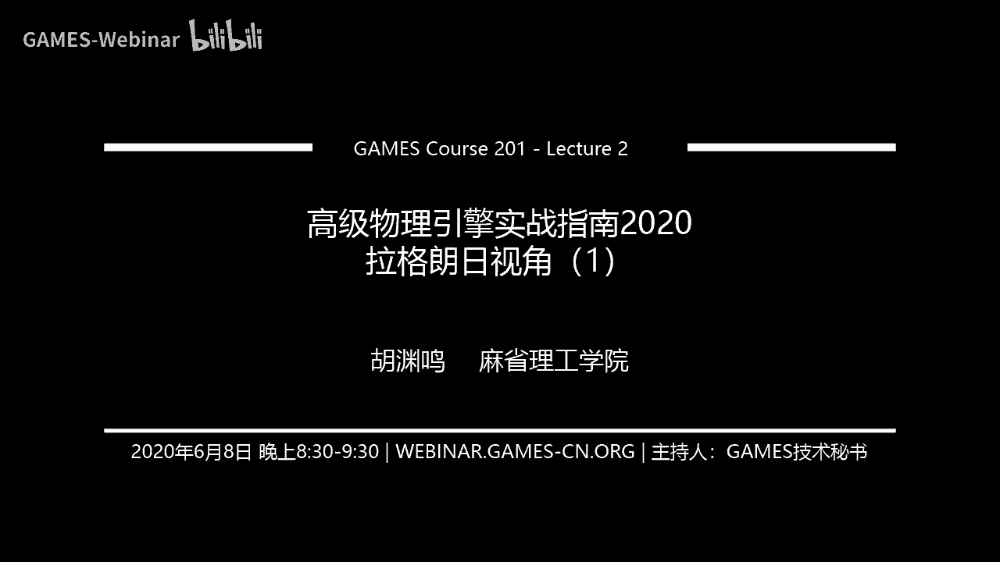

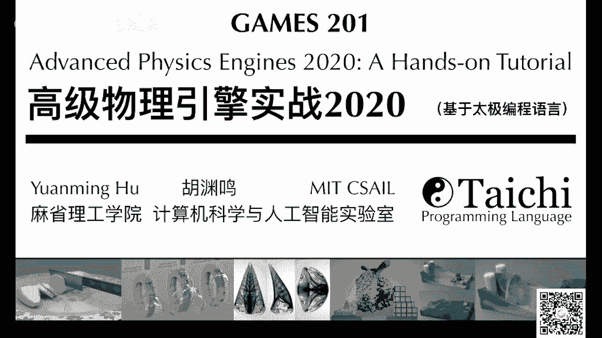

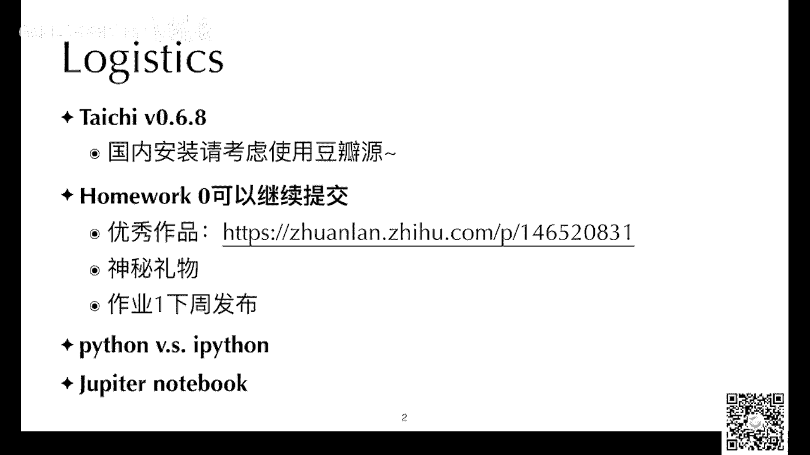

# GAMES201：高级物理引擎实战指南2020 - P2：Lecture 2 拉格朗日视角（1）🚀

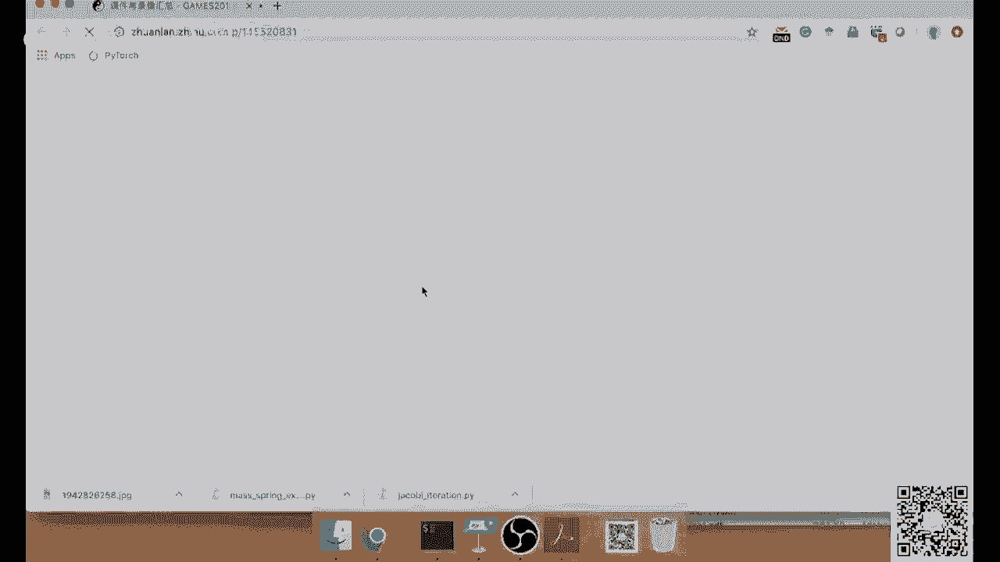


在本节课中，我们将要学习基于物理的动画模拟中的两个基础概念：弹簧质点系统和光滑粒子流体动力学。课程将从拉格朗日视角出发，介绍这些模型的基本原理、数学公式和实现方法，并穿插讲解一些实用的编程技巧。

## 课程公告与作业展示 📢

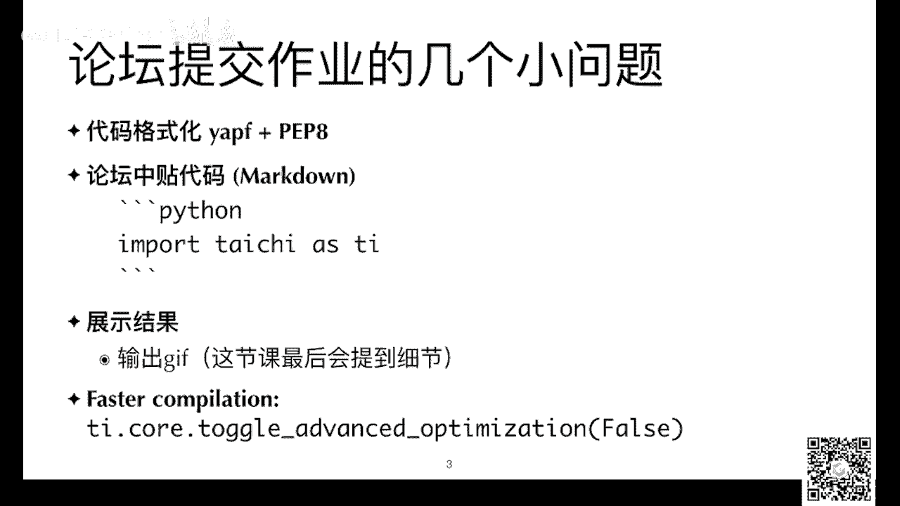

我是胡元明，一名研究基于物理动画的博士生。在开始正式内容前，我们先同步一些课程相关的信息。


太极框架已更新至 v0.6.8。有同学反馈新版本在编译时可能因语法检查更严格而出现问题。如果遇到编译错误，可以暂时退回使用 v0.6.7。核心开发者正在努力修复，并计划尽快发布 v0.6.9。

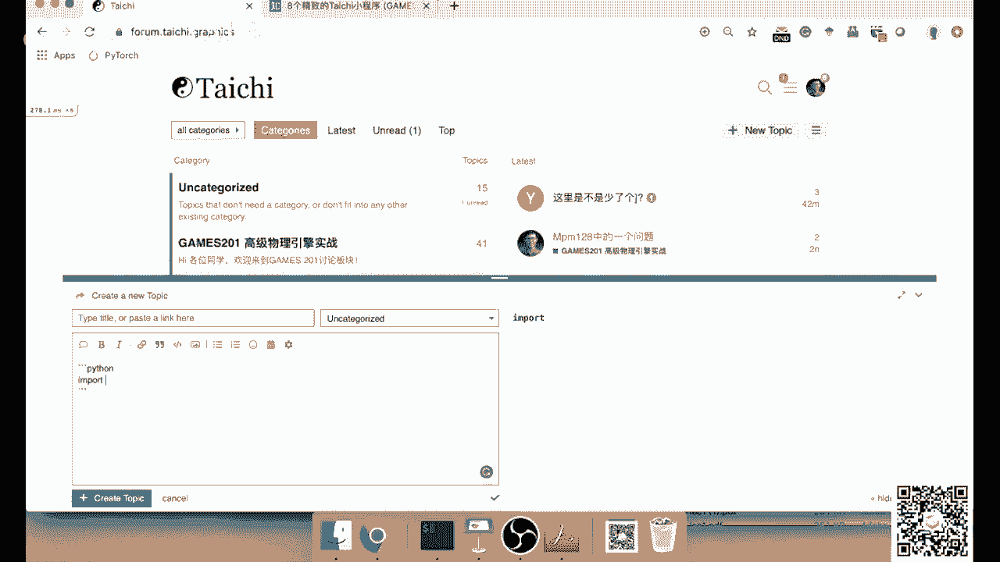

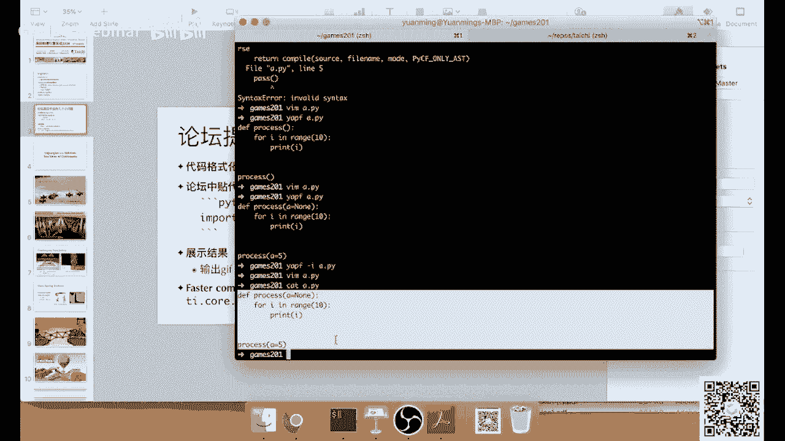

作业零的评选已经结束。我们从众多优秀作品中选出了八个，并在知乎上进行了展示。这些作品涵盖了从离散傅里叶变换到流体模拟卡门涡街等多种算法，代码通常只有百行左右，易于学习和运行。获奖同学将获得神秘课程纪念品。

下周将发布作业一。与作业零的自由创作不同，作业一会增加一些限制，例如必须实现物理引擎相关功能，但整体上仍鼓励自由发挥。

以下是关于编程环境的一些常见问题与建议：
*   在 Python IDLE 中运行太极可能有问题，建议尝试使用 IPython 或 Jupyter Notebook。请注意，在 Jupyter 中，太极内核的 `print` 输出会显示在启动服务器的终端上。
*   代码格式：建议使用 `yapf` 工具自动格式化 Python 代码，以统一风格，无需纠结空格等细节。命令示例：`yapf -i your_file.py`。
*   在课程论坛中贴代码时，请使用 Markdown 的代码块语法（三个反引号 ``` 后注明语言，如 `python`），以便获得语法高亮，提升可读性。
*   编译优化：如果编译速度较慢，可以尝试关闭高级优化选项：`ti.core.set_gdb_advanced_optimization(False)`。
*   输出动画：新版本太极提供了将模拟结果导出为 MP4 视频或 GIF 动图的功能，方便在论坛上分享炫酷的效果。

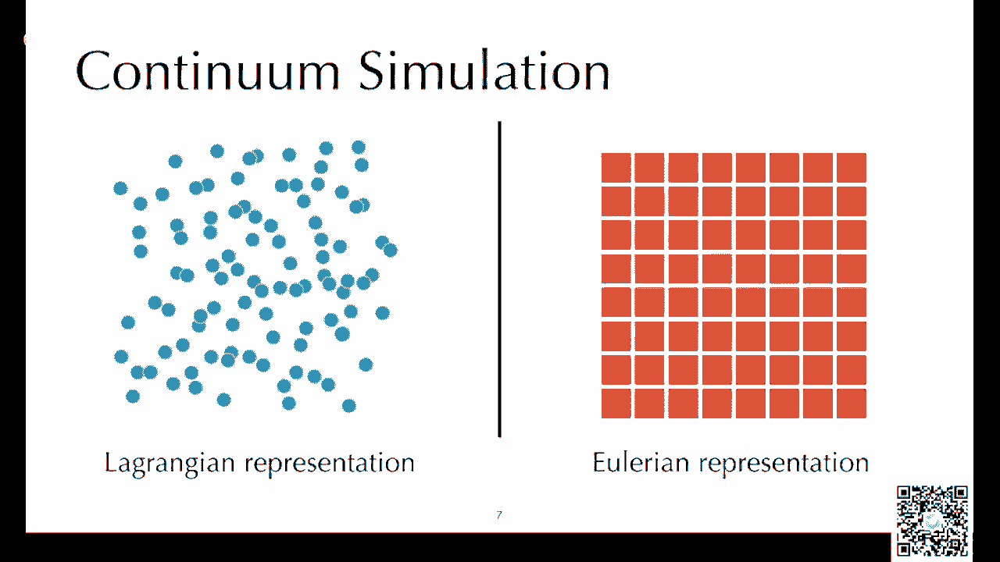

## 物理模拟的两种视角：拉格朗日 vs. 欧拉 🔄

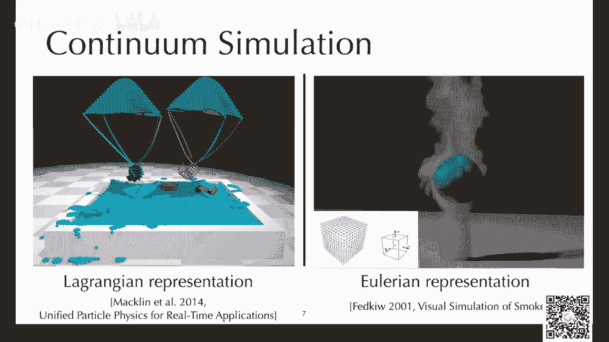

在基于物理的动画中，模拟各种介质（如固体、流体）时，存在两种基本视角：拉格朗日视角和欧拉视角。

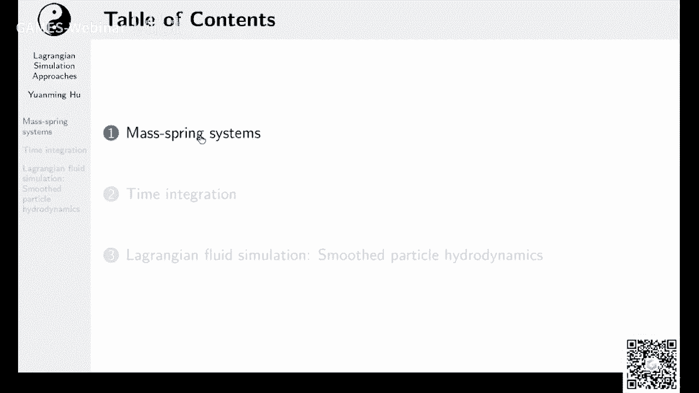

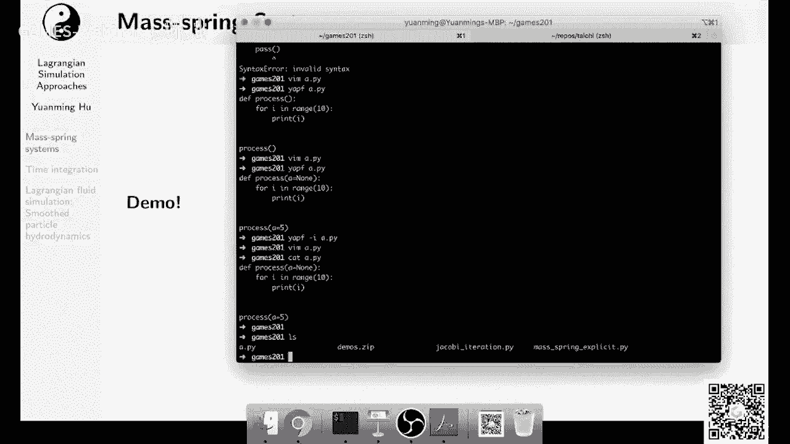

**拉格朗日视角** 如同在介质中放置许多随波逐流的小纸船（传感器），这些节点会随着材料一起运动。每个节点携带并追踪自身的物理量（如位置、速度）。常见的拉格朗日表示方法包括粒子、三角形网格等。


**欧拉视角** 则如同在空间中固定一些木桩（传感器）。这些节点本身不移动，而是测量“流过”该固定点的介质的物理量（如速度）。欧拉视角通常使用背景网格来表示场。

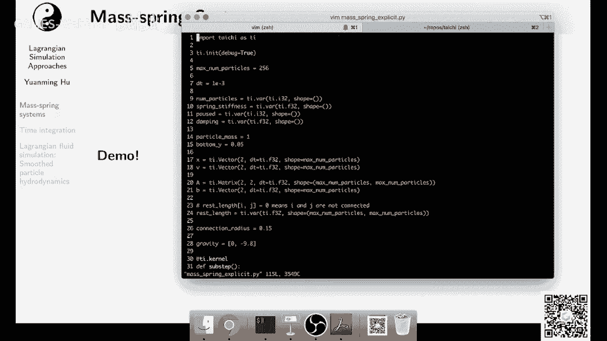

一个简单的记忆口诀是：**拉格朗日方法，质点随波逐流**。最常见的组合是：拉格朗日视角使用粒子，欧拉视角使用网格，但这并非绝对。

上一节我们介绍了两种基本的模拟视角，本节中我们来看看拉格朗日视角下两个最经典和实用的模型。

## 弹簧质点系统 🧵

弹簧质点系统模型虽然简单，但极其有用，可用于模拟布料、头发、弹性体等多种材料。其核心思想是用质点和连接它们的弹簧来离散化表示一个物体。

### 数学原理与公式

该系统基于两个基本物理定律：胡克定律和牛顿第二定律。

1.  **胡克定律 (弹簧力)**：连接质点 `i` 和 `j` 的弹簧所产生的力为：
    `F_{i->j} = -k * (|x_i - x_j| - r) * ((x_i - x_j) / |x_i - x_j|)`
    其中：
    *   `k` 是弹簧的刚度。
    *   `x_i`, `x_j` 是质点的位置。
    *   `r` 是弹簧的静止长度。
    *   `((x_i - x_j) / |x_i - x_j|)` 是从 `j` 指向 `i` 的单位方向向量。

2.  **牛顿第二定律 (运动方程)**：对于质点 `i`，其受到的总力是所有相连弹簧的力与外力（如重力）的矢量和。然后：
    `a_i = F_{total, i} / m_i`
    `v_i = dx_i / dt`
    其中 `m_i` 是质点的质量。在模拟中，通常预计算质量的倒数 `1/m_i`，用乘法代替除法以提高效率。


### 时间积分方法


计算机模拟需要在离散的时间步 `Δt` 上推进系统状态。我们介绍了两种显式积分器：

1.  **前向欧拉法**：
    `v_{t+1} = v_t + Δt * a_t`
    `x_{t+1} = x_t + Δt * v_t`

2.  **半隐式欧拉法 (Symplectic Euler)**：
    `v_{t+1} = v_t + Δt * a_t`
    `x_{t+1} = x_t + Δt * v_{t+1}`

半隐式欧拉法更常用，因为它具有更好的能量守恒性质。一个模拟步（Substep）的核心代码通常遵循以下三步：
1.  计算所有质点受到的合外力，并更新速度 (`v_{t+1} = v_t + Δt * F/m`)。
2.  处理碰撞（例如，与地面碰撞，将穿入地下的质点的垂直速度分量设为零）。
3.  用新速度更新位置 (`x_{t+1} = x_t + Δt * v_{t+1}`)。

### 显式积分的稳定性问题

显式积分器有一个主要缺点：容易数值爆炸。对于弹簧系统，存在一个稳定性条件：
`Δt <= sqrt(m / k)`
这意味着当弹簧刚度 `k` 很大或质点质量 `m` 很小时，允许的最大时间步长 `Δt` 会非常小，否则模拟会失稳。这限制了显式方法对“硬”材料的模拟效率。

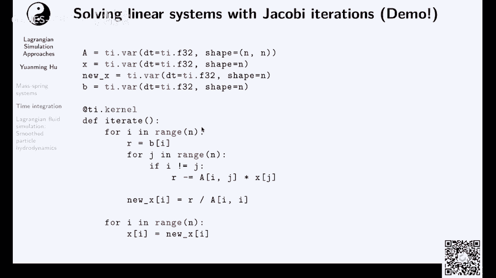

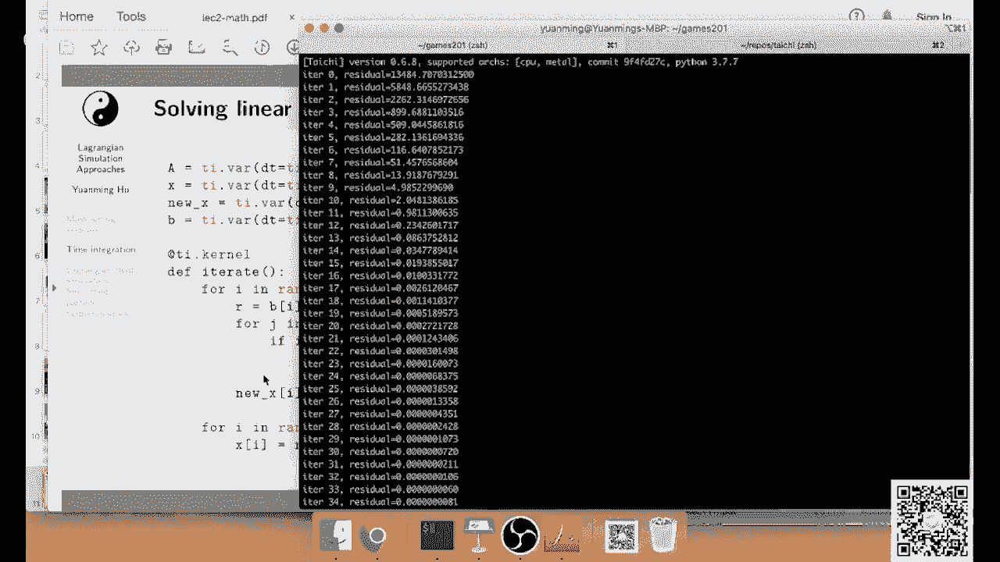

### 隐式积分简介

为了允许更大的时间步长，可以使用隐式积分器，如后向欧拉法。其公式为：
`v_{t+1} = v_t + Δt * a_{t+1}`
`x_{t+1} = x_t + Δt * v_{t+1}`
注意，加速度 `a_{t+1}` 依赖于未来时刻 `t+1` 的状态，这就形成了一个需要联立求解的方程系统。

通过将力函数 `F(x_{t+1})` 在 `x_t` 处进行一阶泰勒展开（线性化），可以将问题转化为求解一个形如 `A * v_{t+1} = b` 的线性系统。其中矩阵 `A` 通常是大规模稀疏矩阵。

求解此类线性系统是物理模拟的核心问题之一。最简单的方法是雅可比迭代法，其核心思想是逐行更新解向量，使其满足当前行的方程。以下是雅可比迭代的简化示意代码：
```python
# 假设 A, b 已知，x 初始为0或猜测值
for iter in range(num_iterations):
    x_new = ti.Vector([0.0]) # 初始化新解
    for i in range(n):
        sigma = 0.0
        for j in range(n):
            if j != i:
                sigma += A[i, j] * x[j]
        x_new[i] = (b[i] - sigma) / A[i, i] # 更新第 i 个分量
    x = x_new # 更新解
```
在实际应用中，对于大规模系统，会使用更高效的方法如共轭梯度法及其变种。

隐式积分虽然稳定，允许大步长，但每个时间步的计算成本更高，实现更复杂，且可能引入过度的数值阻尼，使物体看起来“僵硬”。

## 光滑粒子流体动力学 (SPH) 💧

SPH 是一种经典的拉格朗日流体模拟方法，它用携带物理量的粒子来离散流体，并通过核函数对周围粒子进行加权平均来估算连续场。

### 核心思想与公式

SPH 的核心是场近似公式。在位置 `x` 处的某个物理量 `A`（如密度、压强）的近似值为：
`A(x) ≈ Σ_j m_j * (A_j / ρ_j) * W(|x - x_j|, h)`
其中：
*   求和遍历所有粒子 `j`。
*   `m_j`, `ρ_j`, `A_j` 是粒子 `j` 的质量、密度和携带的物理量。
*   `W` 是核函数，具有紧支性（在距离 `h` 外为零），起到平滑和加权的作用。
*   `h` 是核函数的支持半径。

SPH 非常适合模拟具有自由表面（如水流）的流体，因为它天然地描述了介质分布，无需背景网格。

### WCSPH：弱可压缩SPH


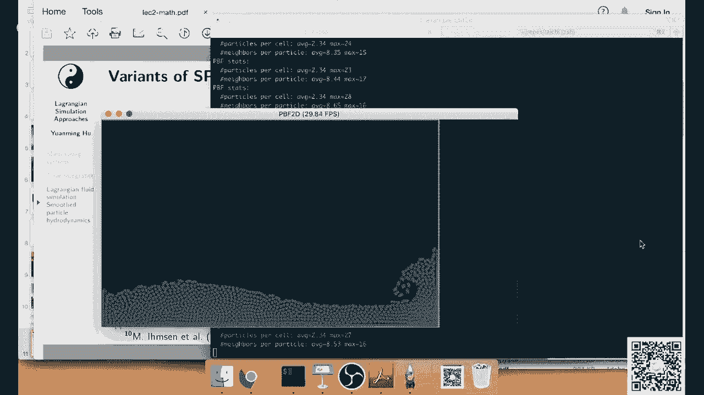

最简单的 SPH 流体模型之一是弱可压缩 SPH。它求解以下运动方程（忽略粘性）：
`Dv / Dt = - (∇p / ρ) + g`
其中：
*   `Dv / Dt` 是物质导数（跟随粒子运动的导数）。
*   `p` 是压强。
*   `g` 是外力（如重力）。

压强通过状态方程与密度关联：
`p = B * ((ρ / ρ_0)^γ - 1)`
其中 `B` 是体积模量，`ρ_0` 是静止密度，`γ` 是常数（通常取7）。当局部密度 `ρ` 高于静止密度时，压强增大，产生排斥力以维持体积。

密度 `ρ_i` 本身也通过 SPH 公式从周围粒子的质量估算得到。

梯度的计算（如 `∇p`）在 SPH 中有专门的对称化公式以保证动量守恒。拉普拉斯算子（用于粘性项）也有对应的离散形式。

一个基础的 WCSPH 模拟循环如下：
1.  对于每个粒子 `i`，根据周围粒子估算其密度 `ρ_i`。
2.  根据状态方程由密度计算压强 `p_i`。
3.  使用 SPH 梯度公式计算压强梯度 `∇p_i`。
4.  计算加速度 `a_i = -∇p_i / ρ_i + g`。
5.  使用显式时间积分器（如半隐式欧拉）更新粒子的速度和位置。

### 变种与加速

*   **PCISPH**：预测-校正格式，能更好地保持不可压缩性。
*   **PBF**：基于位置的流体，将位置约束与 SPH 结合，在实时应用中很流行。
*   **DFSPH**：散度自由的 SPH，直接强制速度场无散。

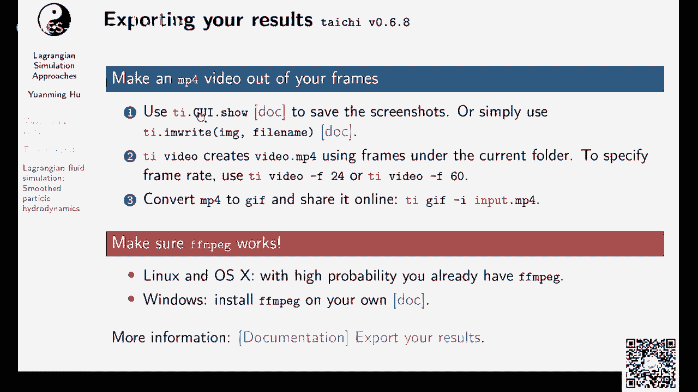

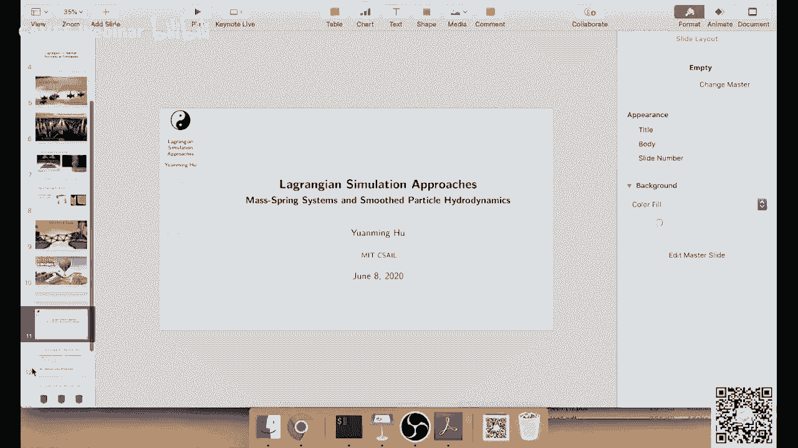

**CFL条件**：在显式积分中，除了材料刚度限制，还需考虑粒子运动引起的稳定性限制。柯朗数定义为：
`C = u_max * Δt / Δx`
其中 `u_max` 是粒子最大速度，`Δx` 约等于粒子间距（或 `h`）。模拟中需保持 `C` 小于一个阈值（如0.1~1），否则可能失稳。这意味着如果粒子运动过快，必须减小时间步长 `Δt`。


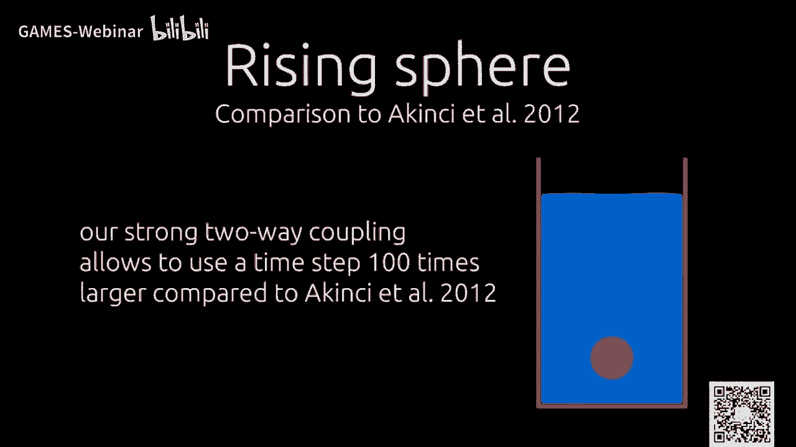


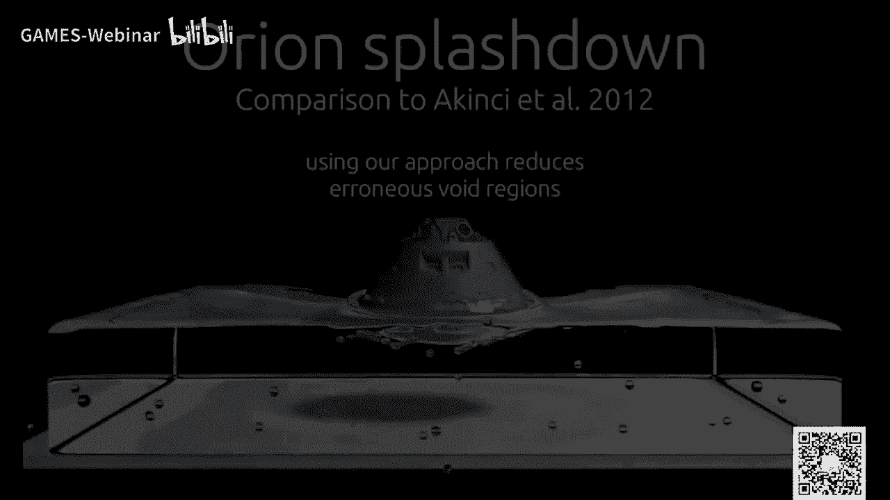


**邻域搜索加速**：朴素 SPH 的时间复杂度是 `O(N^2)`。实际中通过空间数据结构（如均匀网格哈希）加速邻域搜索，将复杂度降至近似 `O(N)`。基本思路是将空间划分为体素，每个粒子根据位置存入对应体素。搜索某个粒子的邻居时，只需查找其所在体素及相邻体素内的粒子即可。


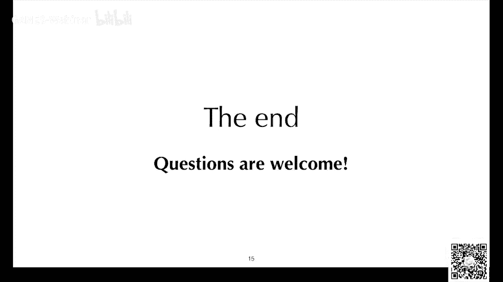


### 表面重建与渲染

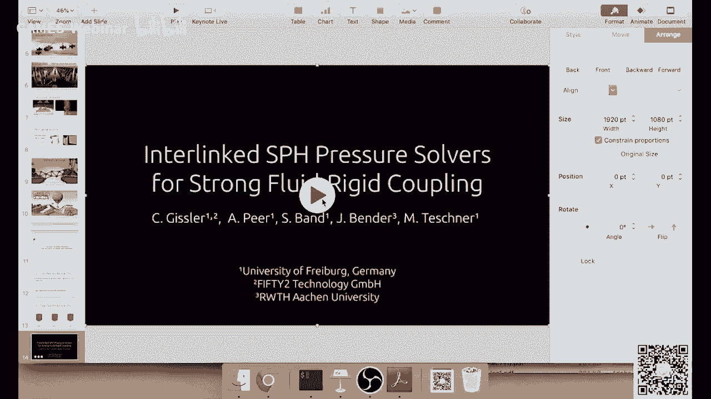

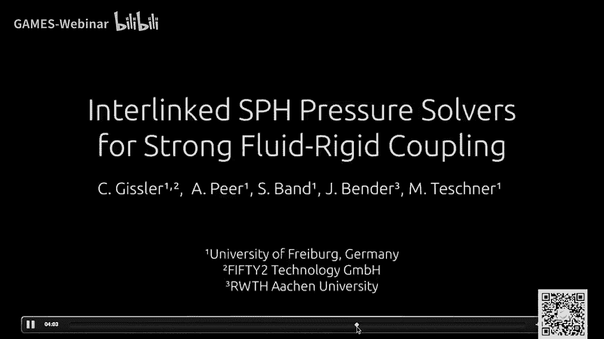

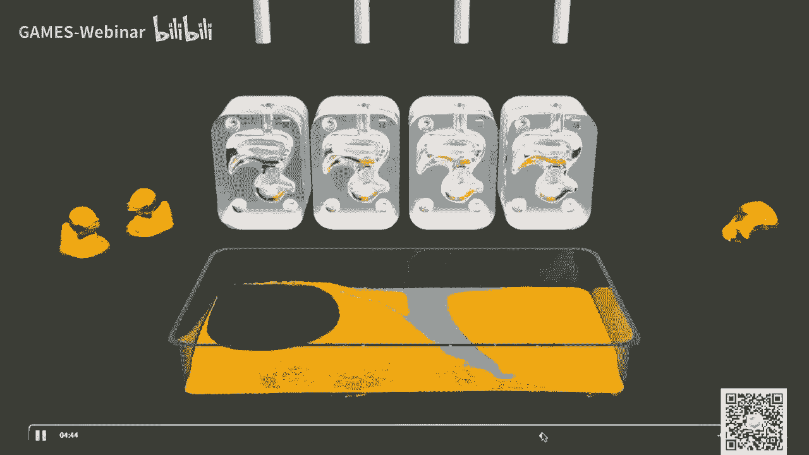

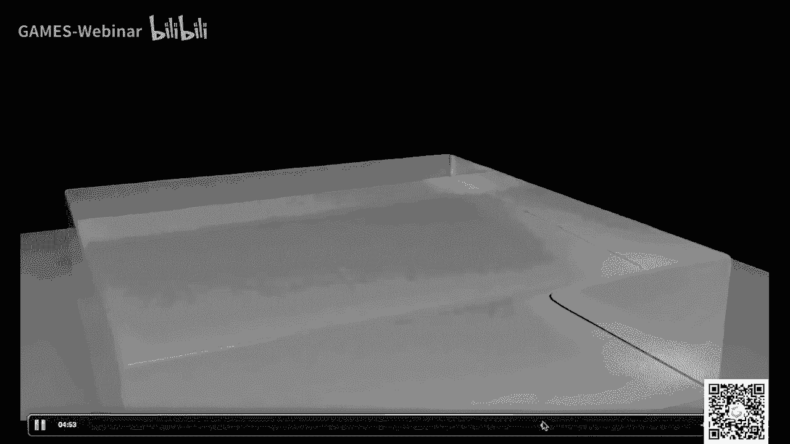

从 SPH 粒子生成用于渲染的流体表面网格是一个独立课题。常用方法是：
1.  将粒子光栅化到一个背景网格上，生成一个密度场或符号距离场。
2.  使用像 `OpenVDB` 这样的库对场进行平滑等操作。
3.  使用移动立方体等值面提取算法从处理后的场中生成三角形网格。
在实时应用中，也常采用屏幕空间渲染技术，直接将粒子渲染到帧缓冲区，并模拟流体的折射、反射等光学效果。


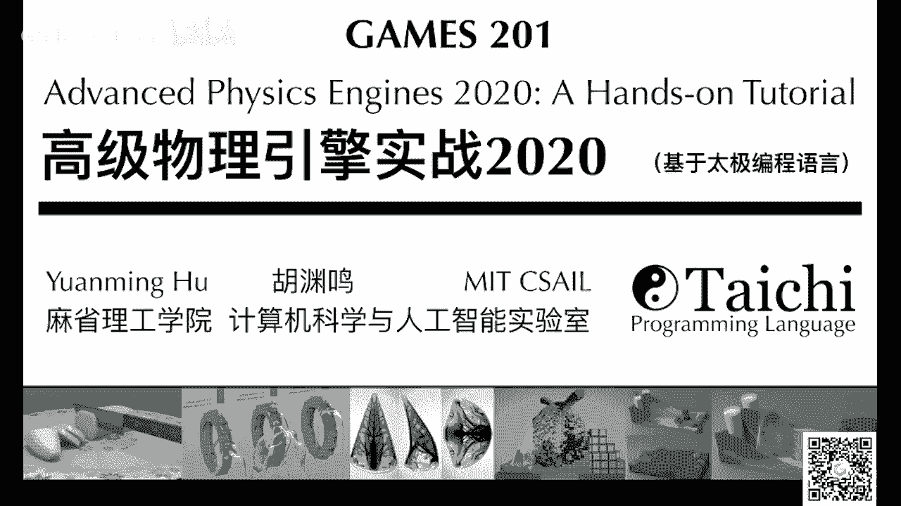

## 总结与展望 🎯

本节课我们一起学习了拉格朗日视角下的两个基础物理模拟模型：
1.  **弹簧质点系统**：理解了其基于胡克定律和牛顿定律的数学模型，掌握了显式（前向/半隐式欧拉）和隐式（后向欧拉）时间积分方法，并认识了显式方法的稳定性限制。
2.  **光滑粒子流体动力学**：了解了 SPH 用粒子离散流体、通过核函数近似场量的核心思想，学习了 WCSPH 的基本流程和关键公式，并接触了其变种与加速方法。


我们还穿插介绍了实用的编程技巧，如代码格式化、论坛贴代码、动画输出等。这些模型是构建更复杂物理引擎的基石。下节课我们将深入欧拉视角，探索基于网格的流体模拟方法。


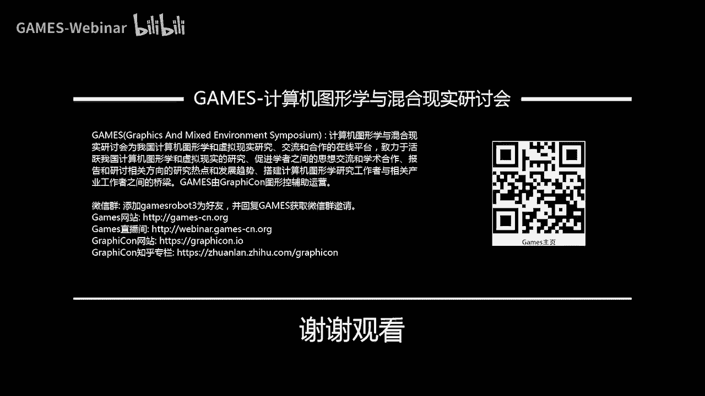

演示中弹簧质点系统和雅可比迭代求解器的代码已发布在课程论坛，欢迎大家尝试、修改和整合。期待大家在作业一中创造出更精彩的作品！