# GAMES201：高级物理引擎实战指南2020 - P3：Lecture 3 拉格朗日视角（2） 🧮

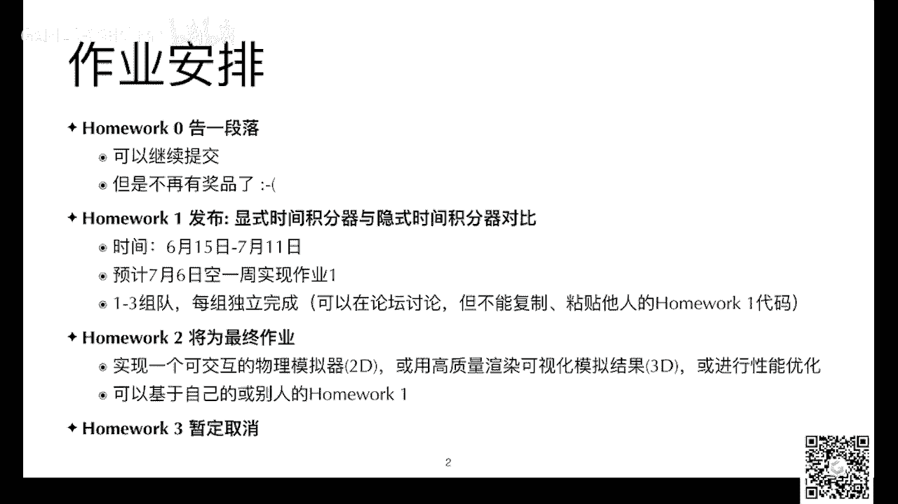

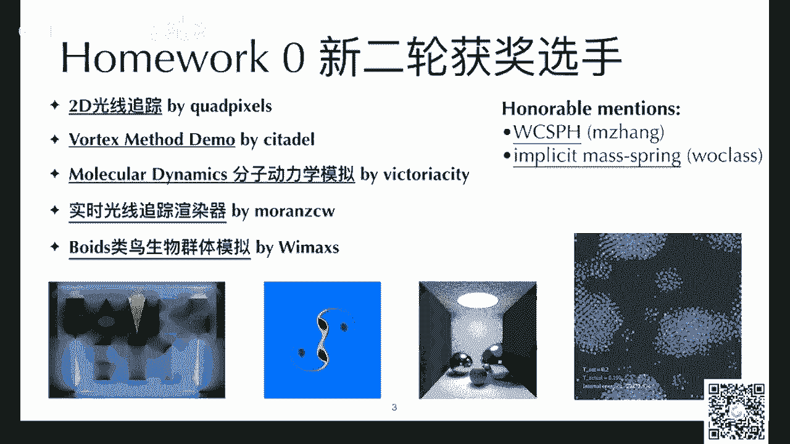

在本节课中，我们将学习弹性体的模拟基础，包括形变、应力应变、超弹性材料模型以及线性有限元方法。同时，我们也将探索太极编程语言的一些高级特性，以帮助我们更高效地编写物理模拟程序。

---


## 课程安排与作业 📋


上一讲我们介绍了拉格朗日视角下的物理模拟基础。本节中，我们来看看本课程的作业安排和一些后续工作。

作业零已经告一段落。今天我们会继续评出几个优秀作品。


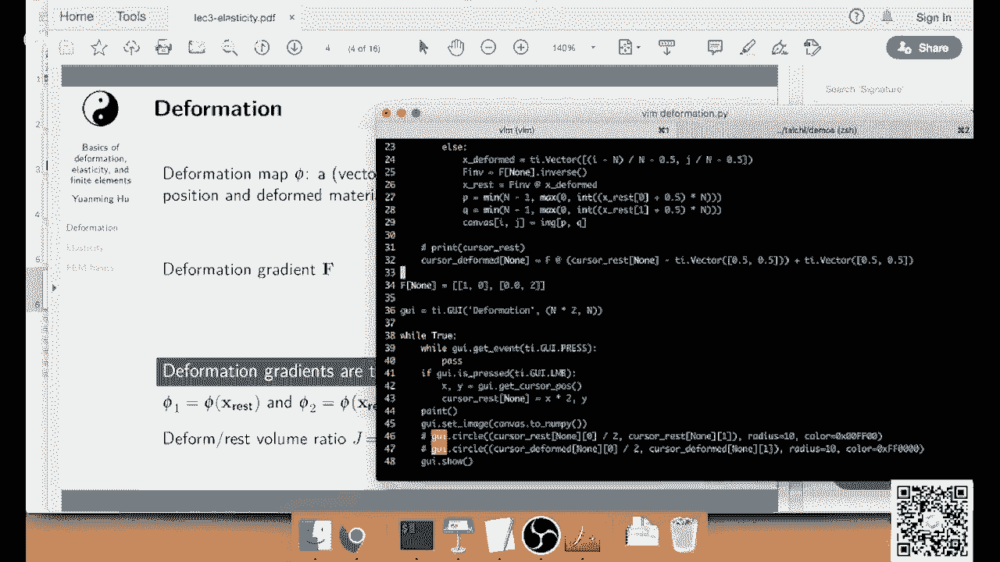

作业一今天发布，时间从6月15日到7月11日。这是一个跨度较长的区间，中间预计会空出一周，以便大家实现作业并消化课程内容。


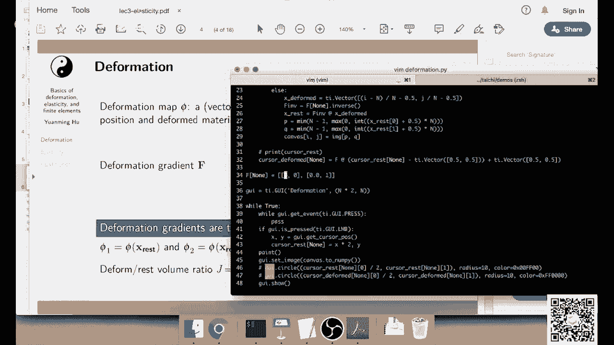


以下是作业一的具体要求：
*   **题目**：显式时间积分器与隐式时间积分器的对比。
*   **内容**：选择喜欢的模拟器，同时实现显式和隐式时间积分，并从性能、准确度、数值稳定性等角度进行对比。
*   **可选模拟器**：隐式弹簧质点系统、隐式FEM、PCI-SPH、完全隐式的DFSPH或MPS。
*   **建议**：组队分工合作，但个人完成也可以。
*   **提交格式**：建议在Github上托管代码，在论坛发布链接并附上关键图表和分析。


作业二将作为最终作业，目标是实现一个可交互的物理模拟器，可以进行高质量的渲染和可视化。

作业三暂定取消。

---

## 弹性模拟基础 🧱

接下来，我们进入本节课的核心内容：弹性体的模拟。弹性模拟能带来不错的视觉效果，也是其他复杂材料（如弹粘性、弹塑性）的基础。

### 形变与形变梯度

形变描述了一个材料当前形状与其静止状态之间的差异。

**形变映射**（Deformation Map）是一个函数 **φ**，它将材料的静止位置 **X** 映射到形变后的位置 **x**。
```
x = φ(X)
```

**形变梯度**（Deformation Gradient）**F** 是形变映射关于静止位置的导数。
```
F = ∂φ/∂X
```
形变梯度 **F** 描述了材料局部的拉伸、压缩和旋转。其行列式 **J = det(F)** 表示体积变化率（形变后体积/静止体积）。

### 应力、应变与超弹性材料

**弹性**是指材料在形变后具有恢复其原始形状的趋势。

**超弹性模型**（Hyperelasticity）通过一个**应变能密度函数** **Ψ** 来定义材料的应力-应变关系。该函数是形变梯度 **F** 的函数，用于惩罚形变。
```
Ψ = Ψ(F)
```

**应力**（Stress）是材料内部单位面积上的内力，用于抵抗形变。**应变**（Strain）是形变程度的度量。在本课程中，我们可以简单地将应变视为形变梯度 **F**。

以下是几种常用的应力张量：
*   **第一皮奥拉-基尔霍夫应力**（PK1 Stress）**P**：定义为应变能密度关于形变梯度的导数，`P = ∂Ψ/∂F`。它在静止空间中进行计算。
*   **柯西应力**（Cauchy Stress）**σ**：也称为真实应力（True Stress），在形变后的空间中进行计算，并且是对称张量。


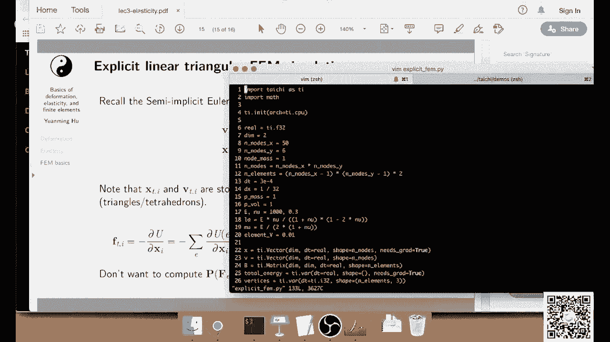

这些应力张量之间可以相互转换，例如：
```
P = J σ F^{-T}
τ = J σ
```
其中 **τ** 是基尔霍夫应力（Kirchhoff Stress）。

### 材料参数

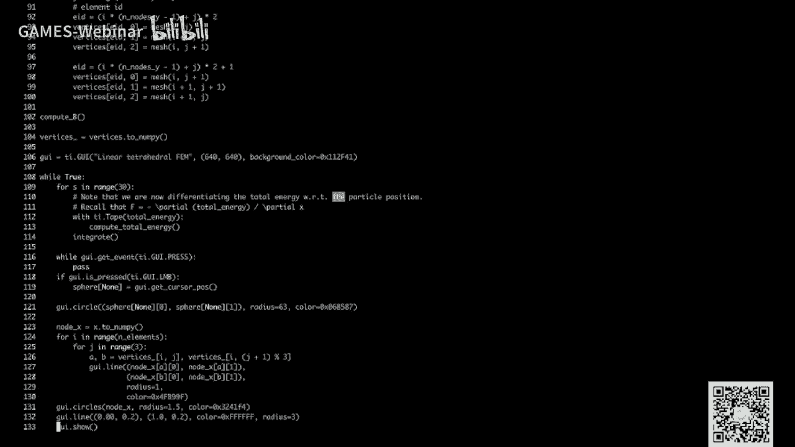

描述材料弹性通常使用以下参数：
*   **杨氏模量**（Young‘s Modulus）**E**：表征材料抵抗拉伸或压缩变形的能力，类似于弹簧的劲度系数 **k**。
*   **泊松比**（Poisson‘s Ratio）**ν**：描述材料横向变形与纵向变形之比。对于常见材料，0 < ν < 0.5。ν=0.5 表示材料不可压缩。
*   **拉梅参数**（Lamé Parameters）**λ** 和 **μ**：另一种常用的材料参数组，可以通过 **E** 和 **ν** 计算得出。

### 常见的超弹性模型

在图形学中，常用的超弹性模型有：
*   **Neo-Hookean**：各项同性材料中最常用的模型，适用于大形变。
*   （Fixed）**Corotated**：在线性弹性的基础上进行了修正，解决了材料旋转后体积无惩罚增大的问题，适用于中等形变。

线性弹性模型（Linear Elasticity）计算简单，但仅适用于小形变分析。

---

## 线性有限元方法简介 🔺

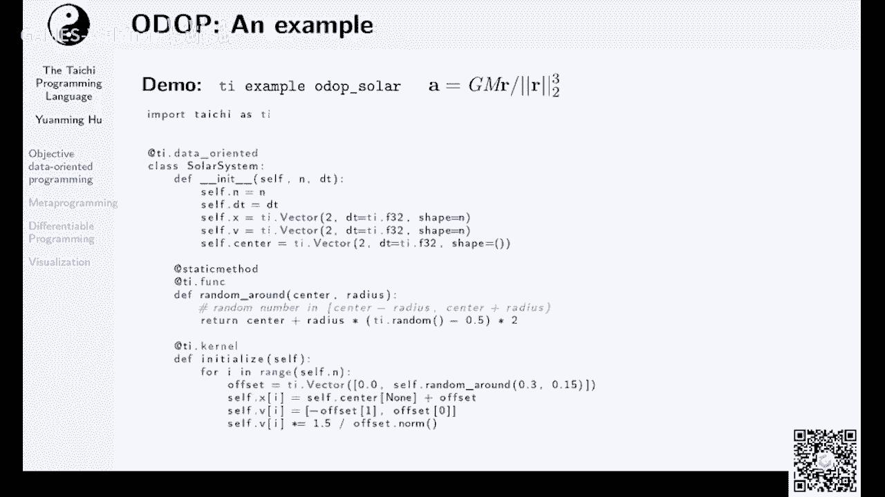


有限元方法（FEM）是一种将连续偏微分方程离散化求解的通用方法。其核心思想是将求解域离散为许多小单元（如三角形、四面体），并在单元顶点上存储未知量。

本节我们介绍最简单的**线性三角形/四面体有限元**。它假设在每个单元内，形变映射 **φ** 是一个仿射变换，即形变梯度 **F** 在单元内为常数。
```
x = F X + b
```
对于三角形单元，我们可以利用其三个顶点的静止位置和形变后位置，直接计算出该单元的形变梯度 **F**。

单元的弹性势能 **Uₑ** 可以通过对应变能密度在单元体积上积分得到。由于 **F** 为常数，积分简化为：
```
Uₑ = Vₑ * Ψ(F)
```
其中 **Vₑ** 是单元在静止状态下的体积（或面积）。

整个物体的总弹性势能是所有单元势能之和。顶点上的受力 **f** 是总势能关于顶点位置 **x** 的负梯度：
```
f = -∂U/∂x
```

在显式时间积分中（如半隐式欧拉法），我们可以利用上述公式计算受力，进而更新顶点的速度和位置。利用太极的自动微分功能，我们可以避免手动推导复杂的受力公式，极大地简化了实现。

对于隐式时间积分，则需要求解线性系统，涉及计算力的微分（即刚度矩阵），这需要求应变能密度函数 **Ψ** 关于 **F** 的二阶导数，实现更为复杂。

---

## 太极编程语言高级特性 🐉

在实现了基础的物理模拟后，让我们看看如何用太极的高级特性来优化和扩展我们的代码。

### 面向对象编程

太极支持面向数据编程（DOP）与面向对象编程（OOP）的混合范式（ODOP）。通过装饰器，可以创建可复用的太极类。

以下是三个关键装饰器：
*   `@ti.data_oriented`：修饰一个太极类。
*   `@ti.kernel`：修饰类中的核函数。
*   `@ti.func`：修饰类中的设备函数。

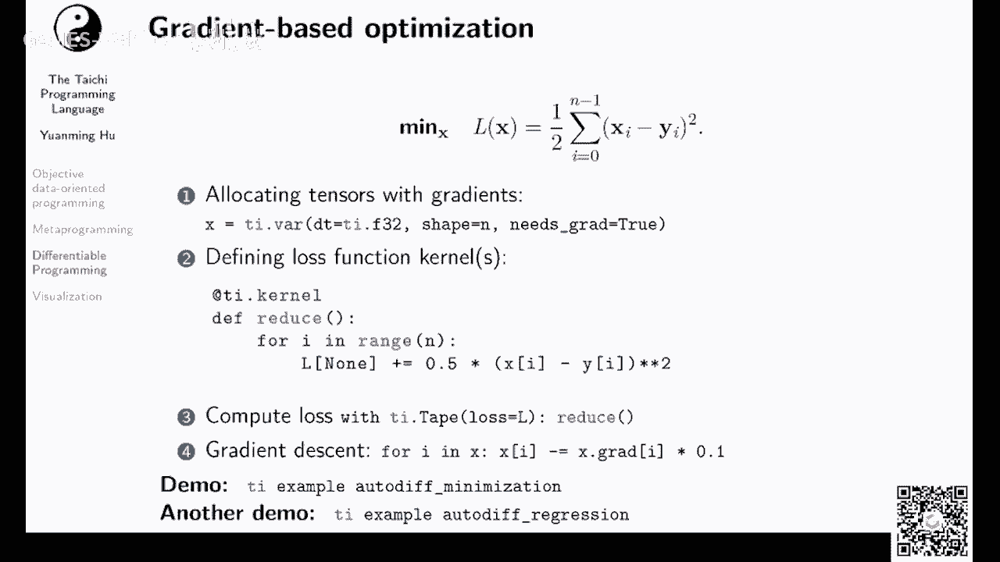

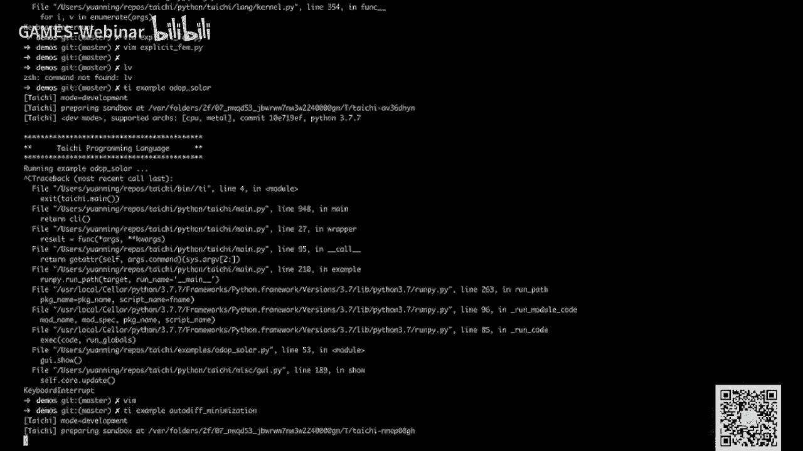

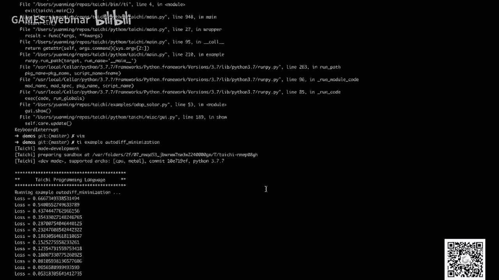

使用类可以将相关的张量和函数封装在一起，提高代码的模块化和可复用性。


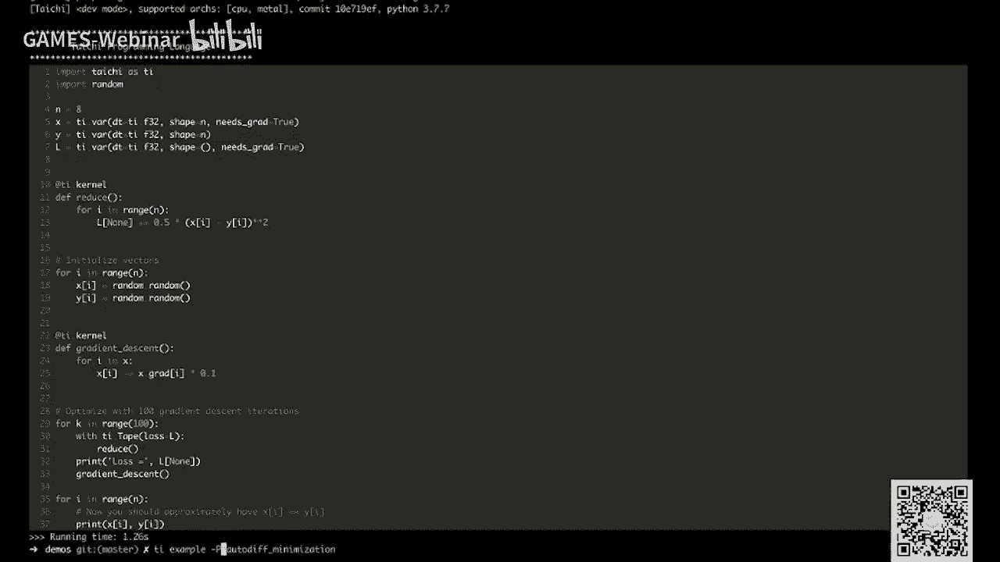


### 元编程

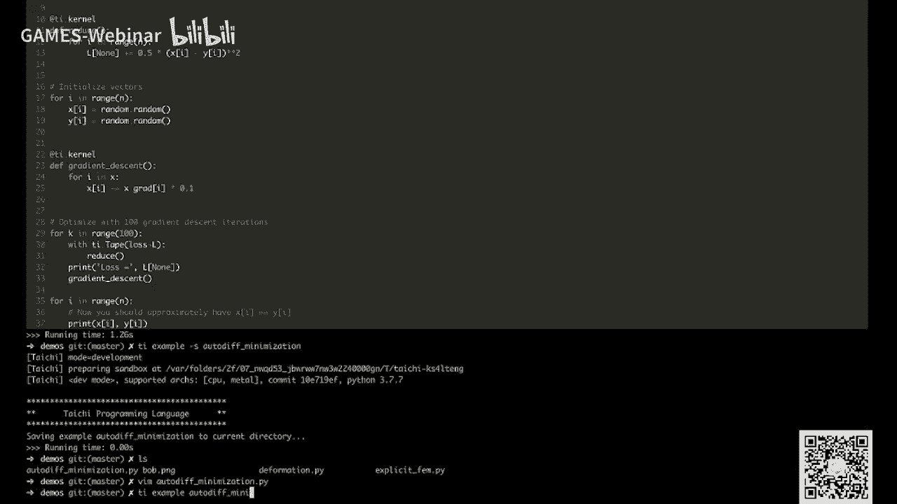


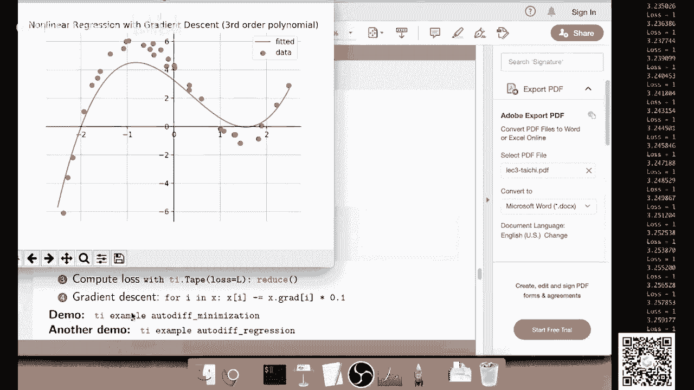


元编程允许将各种参数（如张量、类、函数、数值）传递给太极核函数，实现编译期计算和维度无关编程。

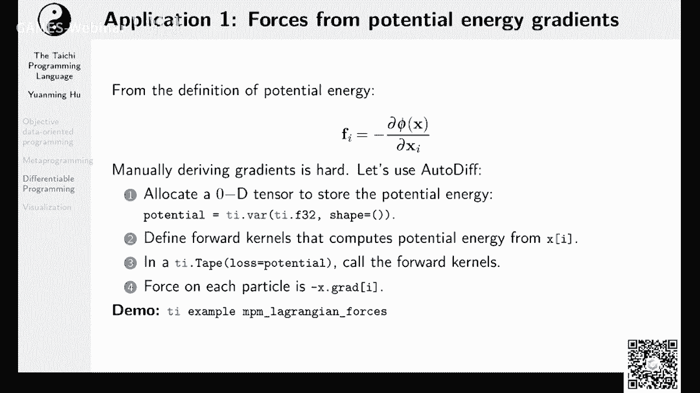


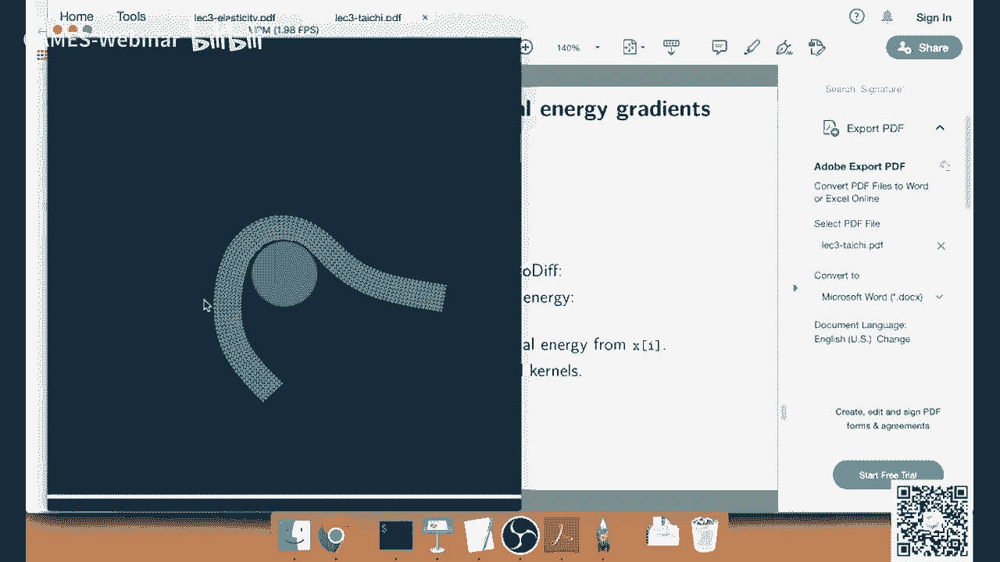

*   **模板核函数**：使用 `ti.template()` 类型提示来定义可以接受多种类型参数的核函数。
*   **维度无关编程**：使用 `ti.grouped()` 循环，可以编写适用于任意维度张量的通用核函数。
*   **编译期分支与循环展开**：使用 `ti.static()` 进行编译期条件判断和循环展开，可以消除运行时开销，并处理太极中要求矩阵/向量下标必须是编译期常数的限制。

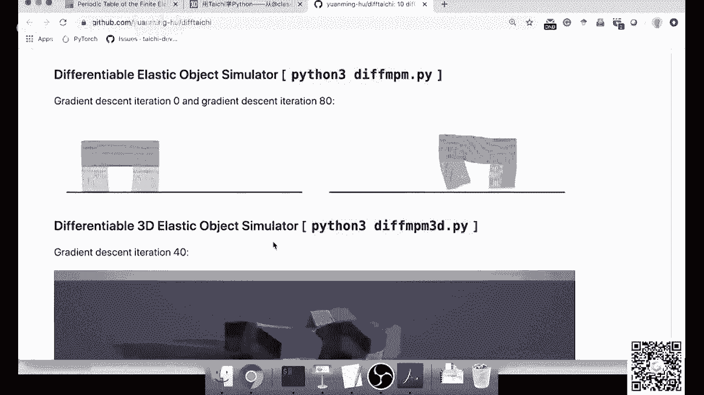

### 可微编程


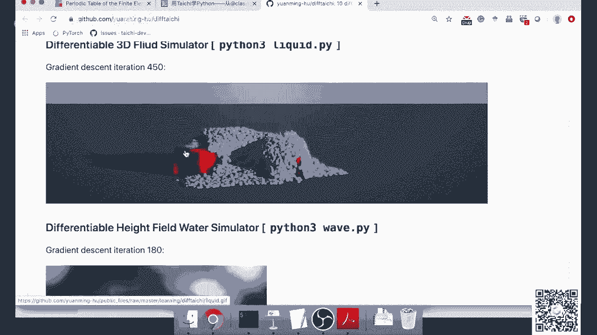

太极支持反向模式自动微分（Reverse-Mode AutoDiff），可以自动计算标量函数关于其输入的梯度。


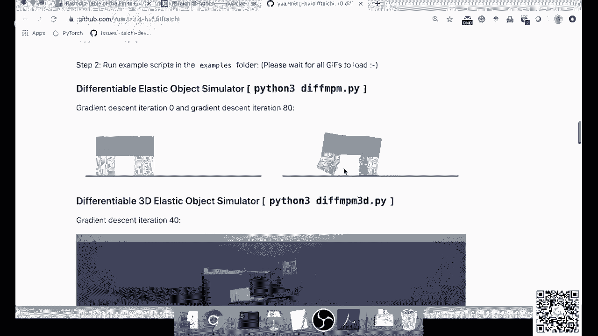

主要应用有两种方式：
1.  **简化受力计算**：将弹性势能定义为标量函数，利用自动微分直接求出势能关于顶点位置的负梯度（即受力），无需手动推导。
2.  **可微模拟器**：对整个物理模拟过程进行微分，可用于优化初始状态、控制器参数或进行对抗样本生成等任务。需要注意的是，这需要存储整个时间步的历史状态，内存消耗较大。

使用 `ti.ad.Tape()` 可以自动记录前向计算并执行反向传播。

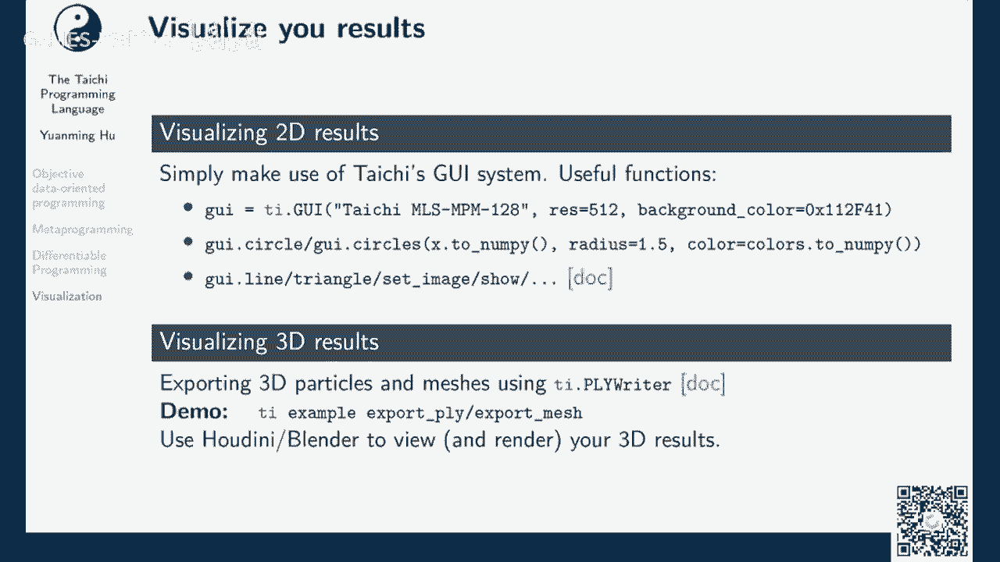

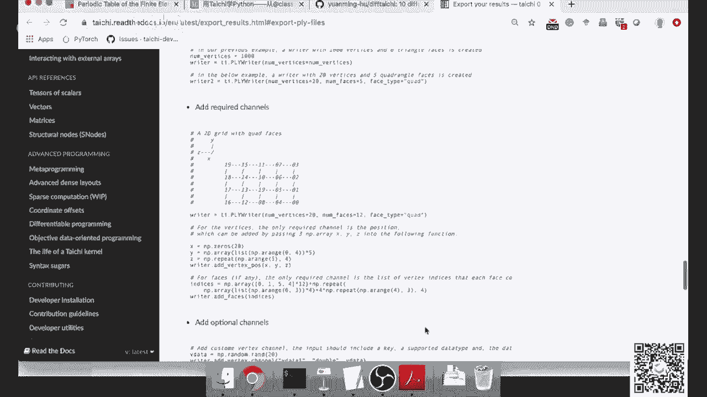

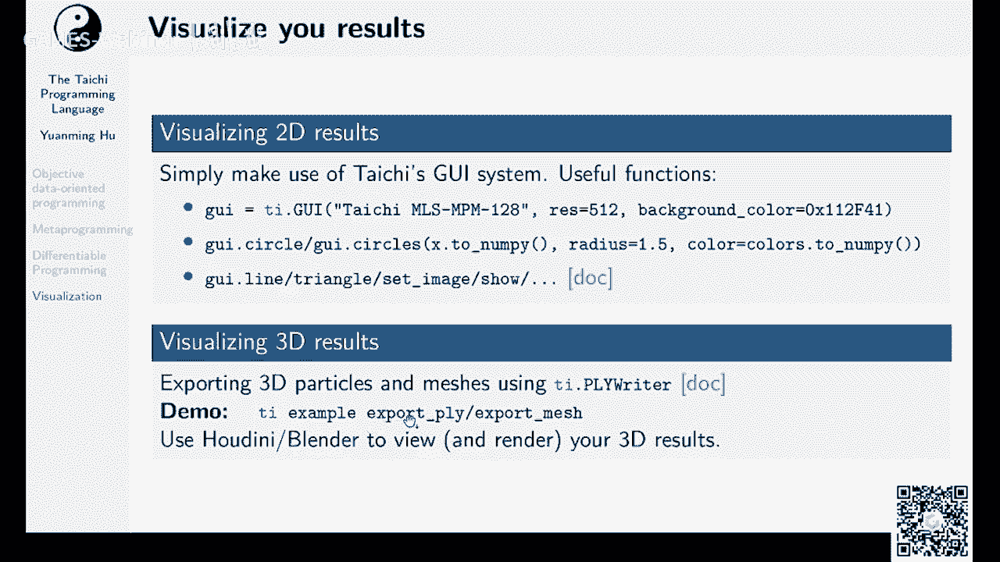


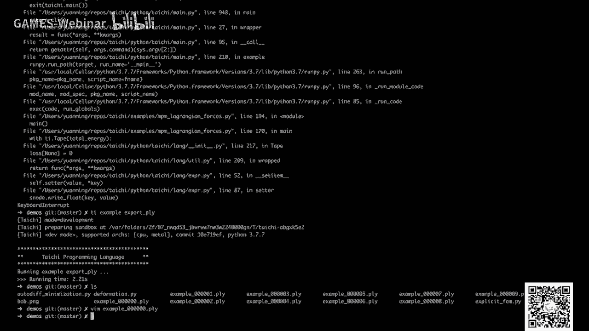

### 三维可视化


太极内置了 `ti.GUI` 用于二维可视化。对于三维结果，助教团队开发了 `ti.export_poly()` 功能，可以将粒子或网格数据导出为 `.poly` 格式文件。该文件可以被 Houdini 等专业三维软件导入和渲染，方便大家查看三维模拟结果。

---

## 总结 🎯


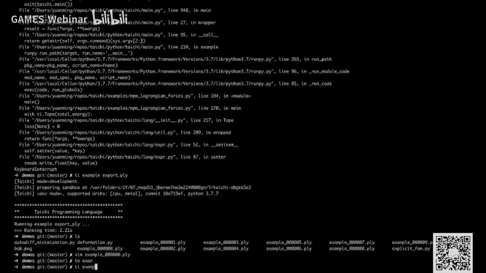


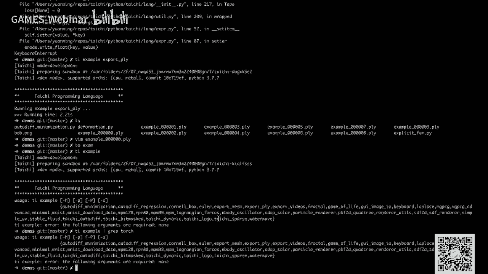

本节课我们一起学习了弹性体模拟的核心概念。我们从形变梯度和应力应变出发，介绍了超弹性材料模型。然后，我们探讨了线性有限元方法的基本原理，以及如何利用它和显式积分器实现一个简单的弹性模拟器。最后，我们了解了太极编程语言在面向对象、元编程、可微编程和三维可视化方面的高级特性，这些工具将帮助我们更高效、更灵活地构建复杂的物理模拟程序。


希望大家通过动手实践作业，巩固对这些知识的理解。我们下节课将进入流体模拟的主题。