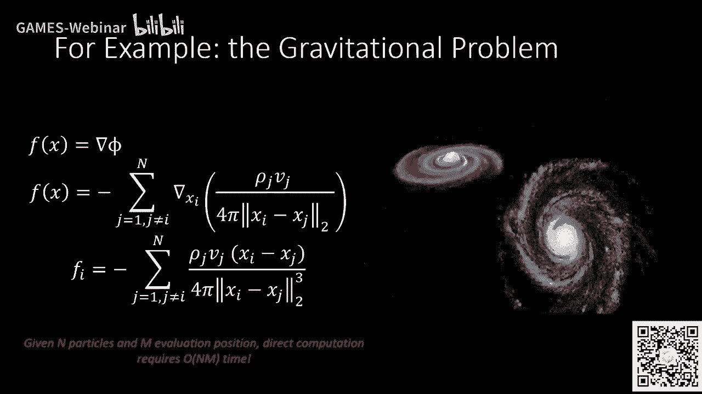
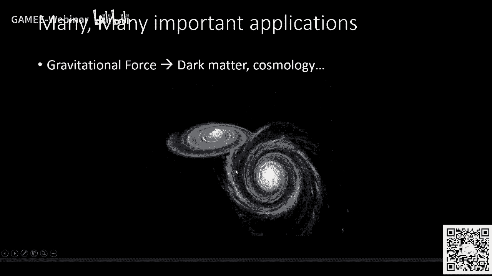
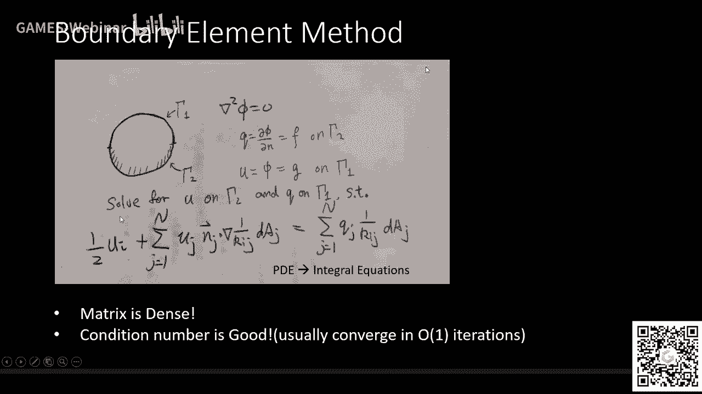
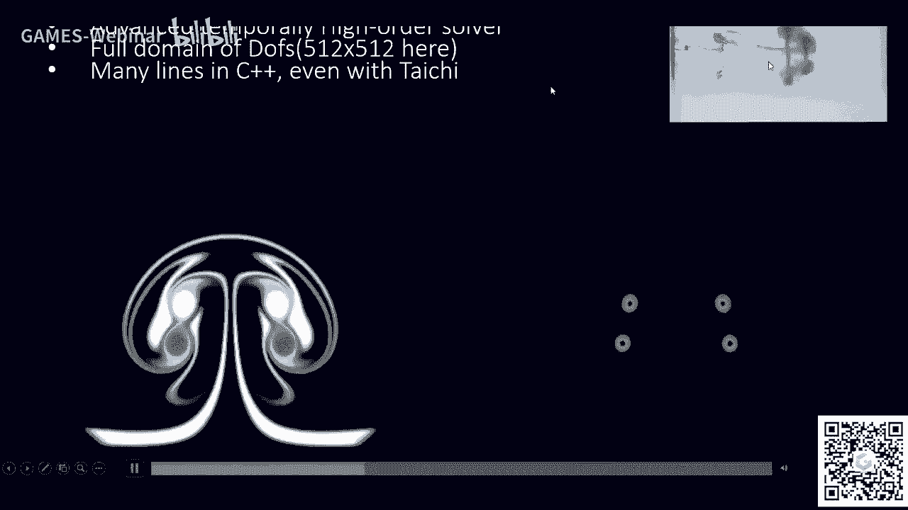

# GAMES201：高级物理引擎实战指南2020 - P5：Lecture 5 多体问题与涡方法 🌀

在本节课中，我们将要学习如何高效求解多体问题，特别是泊松方程及其快速解法。我们将从基础的直接求和问题出发，逐步深入到被誉为20世纪十大重要算法之一的快速多极展开方法，并探讨其在图形学、天体物理、分子动力学等领域的广泛应用。





---


## 课程介绍与背景


欢迎各位同学。今天我们请来了重量级嘉宾张欣欣师兄。张毅师兄是UBC的计算机图形学博士，他热爱物理、计算与数学，致力于解决其中有挑战性的问题，目标是在计算机上再现大自然的美。这也是我们开设这门课程的初衷。


关于课程难度，曾有疑问是否会让同学觉得拔苗助长。但兴趣是最好的老师，在兴趣驱使下，挑战并非问题。我们会尽力以通俗易懂的方式讲解。同时，希望大家能多参与直播，以便及时互动和反馈。

接下来，我们把时间交给星星师兄，他将为我们讲解泊松方程与其快速解法。

好的，谢谢胡世纪的介绍。我希望今天的课尽量做到通俗易懂。能够留存到今天的同学应该都很不容易。我们现在就开始吧。今天我会讲有关泊松方程和快速解法的一些内容。

---

## 从多体问题到泊松方程

我们从快速方法的角度来看泊松方程。之前我们讨论的解法是基于偏微分方程的角度。今天，我们考虑一个开空间的泊松问题，并通过积分形式的基础解来看待它。

许多同学在高中时就接触过这类问题，例如万有引力。万有引力场满足一个关于密度的泊松方程。

**公式：** `∇²φ = ρ`


任意两点之间的受力就是势场的梯度。如果我们把这个梯度运算代入到基础解的求和系统中，就会得到熟悉的万有引力公式：力与距离的平方成反比。

**公式：** `F = G * (m1 * m2) / r²`

当我们看到这个求和表达式时，会注意到：如果一个万有引力系统中有 `n` 个粒子，需要对 `m` 个点求力，那么直接求和的方法需要 `O(n*m)` 的时间复杂度，其计算量很大。因此，我们需要快速方法来降低其计算复杂度。

---

## 快速多极展开的核心思想

这类方法被称为快速多极展开，它被誉为20世纪十大重要算法之一。快速多极展开究竟利用了怎样的思想，使得人们能够在线性时间内计算这个 `O(n²)` 的求和问题？我们现在就来一步步分解。

首先，我们考虑一个二维泊松方程及其基础解。为了方便，我们采用复数来表达坐标。我们知道，求和表达式的实部就是我们要求的泊松方程的解。`log(距离)` 就是二维情况下的格林函数。

此时，我们考虑一个圆以及它在远处 `z` 点引发的势能。如果我们在 `qi` 点处做一个泰勒展开，就会发现 `z` 点的势能可以看作是在零点处所有电荷的势能之和加上高阶项。

**核心思想：** 如果我们在靠近零点的地方有很多电荷，它们对远处 `z` 点的作用可以通过在零点做泰勒展开来近似。这可以拆分为两部分：
1.  一个位于零点的、带有总电荷的“大电荷”对 `z` 点的作用。
2.  一个高阶项，代表了电荷分布形状的影响。


我们将公式抽象后，会得到一个总电荷 `Q`（零点附近所有电荷的总和）和一系列高阶项 `q_k`。远处 `z` 点的势能可以写成 `Q` 乘以格林函数，再加上这些高阶项的累加。后面的高阶项是几何收敛的。


基于这个思想，我们已经可以得到一个 `O(n log n)` 的算法，这被称为 **树码算法**。其实现方式是：将空间中的粒子进行网格划分，在每个格子的中心点计算近似的 `Q` 和 `q_k`，使得远处格子的势场可以被这个中心点的展开式近似。然后，我们不断向上层网格聚合这些信息，最终得到一个粗糙的网格，其中存储的 `Q` 和 `q_k` 代表了其下所有粒子的信息。


当我们需要计算空间中任意一点的势场时：
1.  对于近处的粒子，使用直接求和公式。
2.  对于远处的粒子，使用存储在对应粗网格中心点的泰勒展开式来近似计算。


这个过程需要对每个格子进行计算，因此总计算量是 `O(n log n)`。





---


## 从 O(n log n) 到 O(n)：M2M 变换


在了解了 `O(n log n)` 的树码算法后，我们如何得到线性时间 `O(n)` 的算法呢？关键在于 **M2M（多极子到多极子）变换**。


假设我们已经在一个中心 `z1` 处统计出了电荷云的 `Q` 和 `q_k`，它可以精确估计远处 `z` 点的势能。现在的问题是：如何通过 `z1` 处的 `Q` 和 `q_k`，直接估计出另一个中心 `z2` 处的 `Q'` 和 `q'_k`，使得在同一个远处 `z` 点的势能可以被 `z2` 处的展开式精确表达？

方法很简单：既然我们有了以 `z1` 为中心的势能计算公式，我们只需对它重新在 `z2` 处进行泰勒展开并重写公式，就能得到新的展开形式。新的系数 `b_k` 是原来系数 `q_k` 的泛化。


**形象理解：** 我们可以把每个小的电荷云看作一个特殊的“多极子”。M2M变换相当于把多个小多极子的信息，合并、平移到其上一层的一个大多极子身上。




我们可以用代码来定义这个过程：
```python
class Multipole:
    def __init__(self, center, q_list): # q_list 是各阶系数
        self.center = center
        self.coeffs = q_list # 例如 [Q, q1, q2, ...]


def M2M_transform(source_multipoles):
    """ 将多个源多极子合并为一个新的多极子 """
    new_center = compute_weighted_center(source_multipoles)
    new_Q = sum(mp.coeffs[0] for mp in source_multipoles) # 合并总电荷
    new_higher_terms = compute_bk(source_multipoles, new_center) # 计算高阶项
    return Multipole(new_center, [new_Q] + new_higher_terms)
```


---


## L2L 变换与完整的 FMM 流程





当我们知道了如何将多极子变换到另一个多极子（M2M）后，另一个问题变得有趣：如果我们在一个中心 `c` 处知道了它的多极子展开（可以告诉我们远处任意点 `z` 的势能），如何将其转换成一个离 `z` 点很近的另一个点 `z1` 处的 **局部展开**？


这不是 M2M 变换，而是 **M2L（多极子到局部展开）变换**。局部展开就像一个插值函数，它使得在 `z1` 点附近区域内的势场函数，能够被一个以 `z1` 为中心的多项式准确地表达出来。


完成数学推导后，我们得到了相应的公式。`z1` 处的势能值是其局部展开的常数项，而 `z` 点的势能则是 `z1` 点的势能加上一个由高阶项描述的小扰动。由于 `z` 离 `z1` 很近，这个级数也是几何收敛的。


进一步，如果我们已经有了一个以 `c1` 为中心的局部展开，想将其转换到另一个以 `c2` 为中心的局部展开，这涉及的就是 **L2L（局部展开到局部展开）变换**。这本质上是一个坐标变换，可以通过类似霍纳法则的方法高效计算。


**完整的快速多极展开流程：**
1.  **P2M（粒子到多极子）**：将源粒子的信息转换为最底层网格的多极子。
2.  **M2M（多极子到多极子）**：自底向上，将小网格的多极子合并为大网格的多极子。
3.  **M2L（多极子到局部展开）**：对于每个目标网格，将足够远的源网格的多极子贡献，转换为该目标网格中心的局部展开。
4.  **L2L（局部展开到局部展开）**：自顶向下，将父网格的局部展开贡献传递并细化到子网格。
5.  **L2P（局部展开到粒子）**：从目标粒子所在网格的局部展开中，计算出该粒子所受的势场或力。
6.  **近场直接求和**：对于距离很近的粒子对，仍然使用直接求和公式计算。


这个过程先自底向上聚合（M2M），再自顶向下分发（L2L），最终使得每个粒子在计算总受力时，只需要处理常数数量的近场直接求和和几次局部展开求值，从而实现了 `O(n)` 的线性时间复杂度。


---


## 其他快速求和方法：P³M 与 Kernel Independent FMM


除了 FMM，还有其他快速求和方法。


**P³M（粒子-粒子/粒子-网格）方法** 混合了偏微分方程视角和求和视角。其核心思想是：
1.  **长程力**：通过将粒子密度分配到网格上，在网格上求解泊松方程得到一个平滑的势场，再通过插值得到粒子所受的长程力。这部分计算是线性的（如使用多重网格法求解）。
2.  **短程力**：从粒子受到的总力中，减去由网格插值得到的长程力部分，剩下的就是短程力。短程力只存在于邻近粒子之间，可以通过直接求和计算，由于邻居数量有限，计算量也是线性的。

P³M 方法实现起来比 FMM 相对简单，且也能达到线性时间复杂度。


**核无关的快速多极方法** 则采用另一种视角：对于一个源电荷，构造两个包围它的球面（内圈和外圈）。通过求解一个线性系统，确定在内圈上放置一组“等效电荷”，使得这组等效电荷在外圈上产生的势场与原电荷产生的势场完全一致。这样，远处的计算就可以用这组数量少得多的等效电荷来代替原来的电荷云。只要内圈和外圈的形状固定，中间的转换矩阵就可以预先计算并求逆。

---

## 应用领域

快速求和方法的应用极其广泛：
*   **天体物理**：计算万有引力，用于模拟星体运动、搜寻暗物质。
*   **分子动力学**：计算静电场力，用于研究蛋白质折叠、药物设计（如新冠疫苗的受体结合分析）。
*   **电磁学**：计算电磁场，用于飞行器隐身外形设计。
*   **声学**：求解亥姆霍兹方程，用于计算噪声传播、剧院声场设计、城市高架桥隔音方案优化。
*   **流体力学**：
    *   **势流理论**：用于模拟波浪、飞机机翼设计。
    *   **涡方法**：一种基于拉格朗日视角的流体模拟方法，通过求解矢量泊松方程得到速度场。它特别适合模拟涡旋主导的流动（如涡环交互），能用很少的自由度（涡粒子）和简单的代码捕捉复杂现象。
*   **边界元方法**：将偏微分方程转化为边界上的积分方程进行求解。其矩阵是稠密的，但条件数通常很好。结合 FMM 加速矩阵向量乘后，在求解某些问题时比传统的域离散方法（如有限元、有限差分）更具优势，尤其是对于无限域或半无限域问题。


---

## 涡方法中的边界处理

有同学问涡方法如何处理固体边界。这里简要说明：
*   **无粘流（势流）**：主要目标是保证流体不穿透固体边界。这可以通过在固体边界上分布“偶极子”来引入一个势流场，以抵消边界法向的穿透速度。
*   **粘性流**：除了法向无穿透，还需满足切向无滑移条件。这可以通过在固体边界上分布“涡层”来引入一个速度场，以抵消边界切向的滑移速度。求出的这个涡层强度，再通过某种扩散机制（如随机行走或保持环量守恒的扩散方式）将其“发射”到周围的流体中，成为新的涡粒子。这样就能模拟出如卡门涡街等粘性效应。

---


## 总结


本节课中，我们一起学习了：
1.  **多体问题的挑战**：直接求和的 `O(n²)` 复杂度。
2.  **快速多极展开**：通过多极子展开、M2M、M2L、L2L 等一系列变换，将远场作用高效聚合和分发，实现 `O(n)` 线性复杂度的核心算法。
3.  **其他快速方法**：P³M 方法通过长短程力分离实现线性复杂度；核无关 FMM 通过构造等效电荷实现加速。
4.  **广泛应用**：从万有引力、静电学、电磁学到声学、势流、涡方法及边界元法，快速求和方法是连接物理模型与高效计算的桥梁。


快速求和的核心理念是利用场在远处的平滑性，用紧凑的信息近似大量粒子的集体效应，从而避免两两计算。虽然 FMM 的实现细节较为复杂，但其思想深刻而优美，是计算物理和图形学中不可或缺的工具。