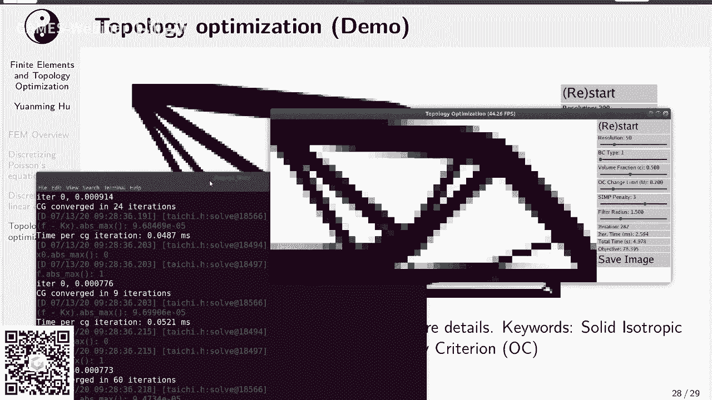
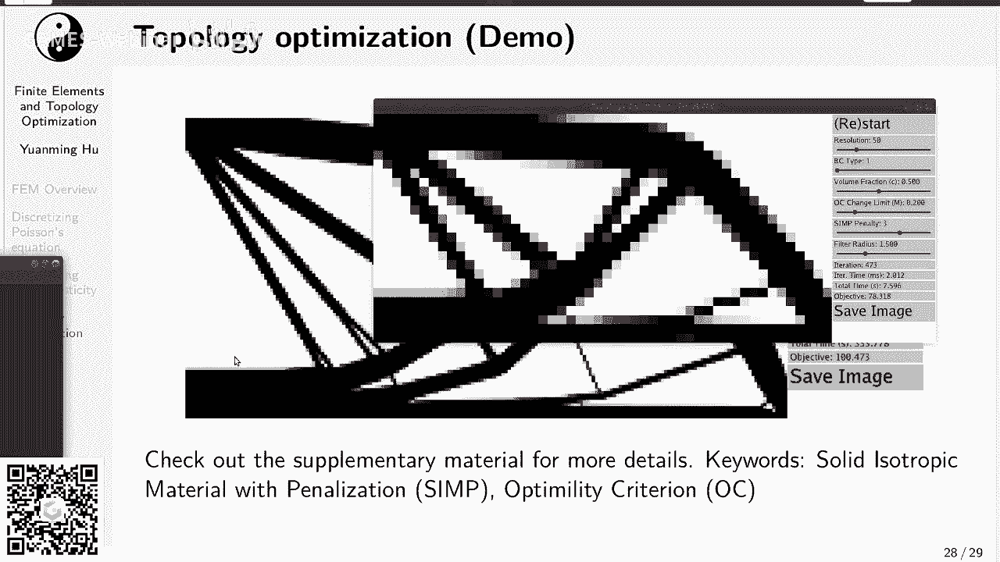
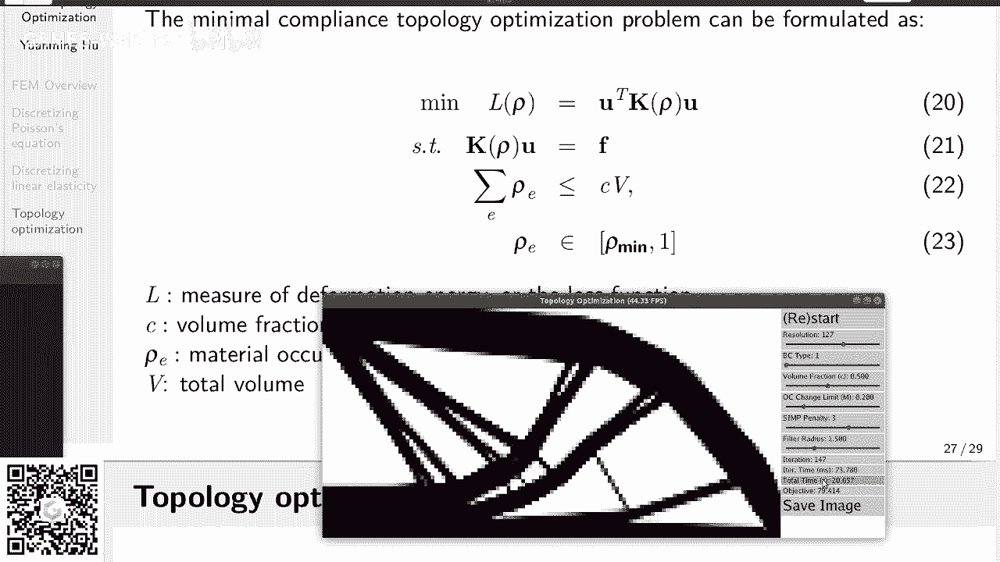
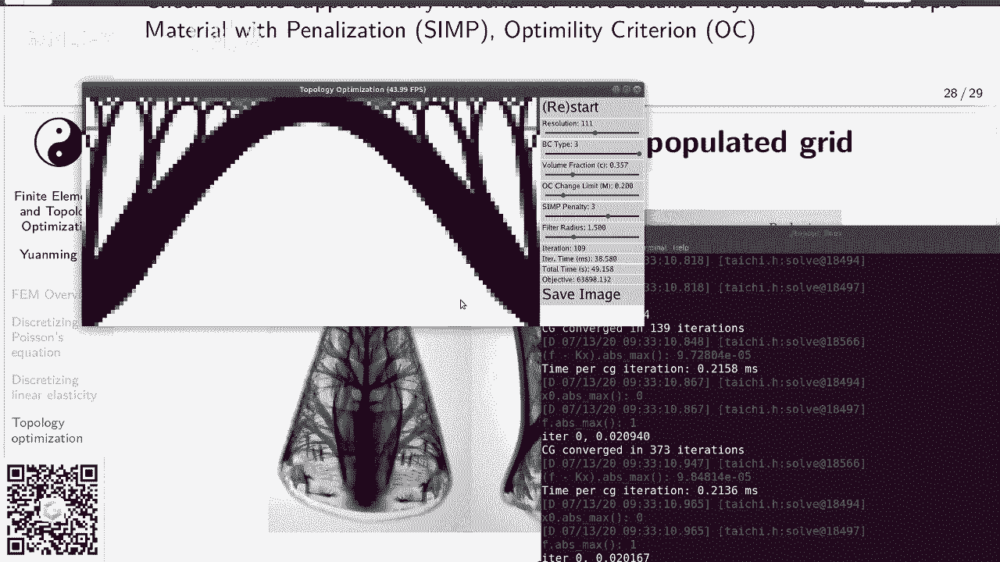
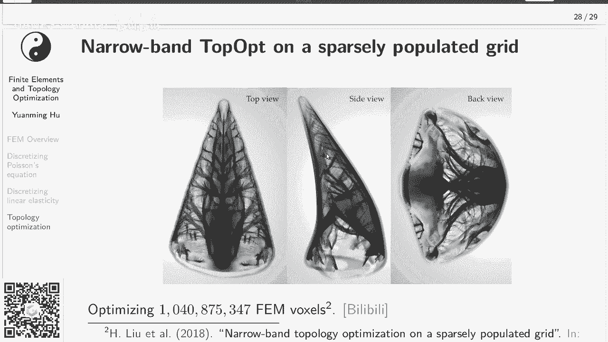
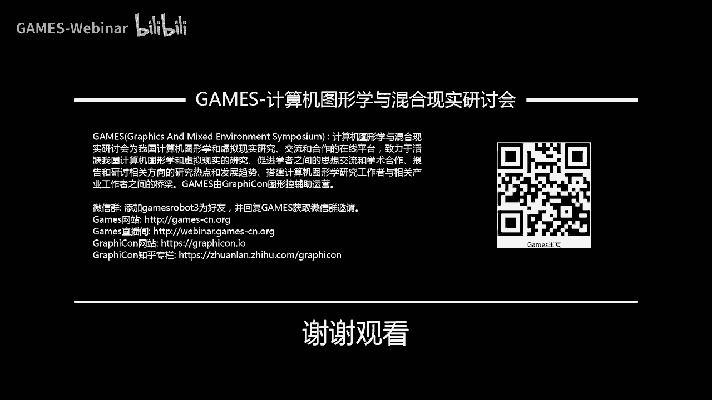

# GAMES201：高级物理引擎实战指南2020 - P6：Lecture 6 线性弹性有限元与拓扑优化 - GAMES-Webinar - BV1ZK411H7Hc

ok那么我们就开始好，还是欢迎大家回到我们的课程，我们把电脑升级了一下，应该不会再有卡顿的问题了，然后还是希望大家多来听听直播，因为及时提出问题嘛，然后我们收到反馈，这个我收到反馈以后也会调整难度。

这样大家讲的讲的大家也容易理解一些，那么今天我们来讲一讲，这个线性有限元和拓扑优化，其实主要是讲线性有限元，拓扑优化呢只是顺带提一下，然后课程的附件里面有一个代码包，代码包里面呢它有这个嗯。

线性有限元的呃，这个top优化的一个代码示例，然后大家可以跑一跑，还有一个手把手教你做特殊优化的一个pdf，那个是mit的一个计算机图形学的一个作业，然后当时我帮他们写的这个代码，然后借这次就搬过来了。

给大家可以手把手的去做一做，当然这些作业我们也不批改批改，大家都不用提交，可以只是你有时间的话，你可以做一做。

没有时间的话，你可以看一看嗯，意思一下就可以，ok那么作为一的获奖选手呢，我们已经在植物上面公布了，大家可以去看一看优秀呃，作品的优秀同学的这个作业，然后和以前一样，代码都是直接。

一般get close一下就可以装菜就可以运行的，所以大家可以看一看，跑一跑呃，看看别人的作业是优秀的同学是怎么做的，然后这样自己也可以学习学习，那么当然了，肯定有很多同学说这个时间太紧了。

我没有赶上deadline，或者最近有事没时间做，这个完全不用担心哦，因为我们呃你加把劲，一个月以后就可以把它作为作业二来提交，作业，二呢又回到这个开放作业的模式，和作业领差不多呃。

只要是一个物理模拟器就可以，只要我们没有标准标准，就是你自己满意就可以，然后有很多很多个选项，你可以实现一个可交互的2d的物理模拟游戏，你你也可以去专门优化性能呃，你可以提高粒子数啊，或者提高网格精度。

因为高性能的物理模拟器，当你粒子数多了以后，网格比较细的以后是很多时候呃，很多是很多低性能的物理模拟器的东西，就不能再用了，高性能物理模拟器啊，里面有很多东西呃，并不能把地形的照搬。

比如说你本来是用稠密数组存在你的线性系统，但是你网格多了以后，你就可能重名速度变得非常大，内存存不下了对吧，可能啊你就希望用一个稀疏数组，这个时候呢就会意识到，你要做一个高精度的物理模拟，你要做挑战。

你要面临的挑战其实是非常非常多的，除了性能，你也可以去实现一些高精度的格式，比如说你以前是用的sama rg，你现在可以把它换成比如说bf c c，或者买comic这个高精度的格式。

或者你也可以用一些election，reflection scheme之类的去降低数值点性，使得你的烟雾模拟看起来更加的呃怎么说呃，充满活力一些就叫energetic，这个这个让我想起来一个笑话。

因为呃很多时候计算机图形学里面，大家有的时候你做这个sober，你的目的是去迎合你的导演的需求嘛，所以呃我想起来就是kaths是他是dream，以前在dream works后来到了维塔。

然后他们是负责vfx，他在那边就他有一次给大家介绍它的数据结构，叫vd b，然后他就讲到一个笑话说呃在统计学里面，这个很多时候大家希望艺术家可控性就是呃，instead of。

你去实现一个特别高精度的火焰，有的时候导演会让你实现什么，导演会让你实现一个生气的火焰好，这个时候你就要想想呃，怎么样去提高你的这个呃simulator，怎么样艺术家去控制你simulator。

因为simulator的它的背景，它的底层是partial differential equations，实是这些偏微方程组对吧，但是有的时候艺术家并不会直接去操纵偏微方。

他可能会想用一些其他的办法去操纵这个火焰，所以这个艺术可控性，还是一个很重要的一个事情，但是这个也可以作为选项四，然后选项五呢你可以自己想想，有什么别的有意思的方向，可以自己去研究研究。

或者找一篇比较好的syrah的模拟方面论文，然后自己去实现一下也可以，当然你可以基于自己的或者别人的作业一，然后呢，我们的评分标准呢是以新增的这个原创部分，然后还是建议大家组队，因为组队的话呢。

首先你如果组队的话，你如果拿了奖，那我们会你队里面有多少人，我就会给你寄多少个杯子，所以呃记多少个课程纪念品，所以这个组队的话，从得到纪念品的效率来说是比较高的，但是这个是一个呃不是最主要的。

最主要的是你组队了以后，你会在做这个写代码的过程中啊，你会呃提高和别人合作这个能力，这个还是挺重要的，然后这个截止日期呢是北京时间8月15日，23：59，也就是说接近一个月以后，那么接下来呢。

我们基本上就进入了课程的后半部分，前半部分呢大家嗯应该来说还是有一些难度的，很多同学反映，特别是推这个影视时间积分器的时候，这个头都秃了，难度还是挺大的，这个其实非常正常，大家不要受这个打击。

我一开始推一个时间分期的时候，我一我一开始推，我记得是大三的时候，我去实现，大二的时候去实现一个m p m的影视，实现积分器，那个真的推的我是头秃，但他经常是什么呃，四阶张量之之类的。

推起来特别容易推错，然后推了好久才把他搞对，然后弹簧质点其实也挺复杂的，和m比起来他更不规则，它会有一些对于什么，比如说呃x取了normalization以后的向量，关于x求导之类的这些项目。

这些项一不小心就会推错，然后这就是为什么之前也推荐大家组队，因为组队的时候，这个公式大家可以互相检查对吧，这样实际上两个人都退缩的概率，就会比一个人退缩概率要低很多，那么接下来今天我们讲有田园。

然后接下来两讲呢，我们会讲混合欧拉拉格朗日视角，这个其实包括一些常见的方法，比如说particle excel或者flip或者iphone，particle insl，然后也会讲到物质点法。

物质点法应该是这两讲里面的重头戏，到了第九讲，我们会讲一讲高新计算与物领情，其实就是一些常见的优化物理引擎性能的技巧，那么8月10号呢我们还是像之前一样，我们空一次，大家留一点时间。

可以消化一下之前讲课的内容，也给大家留一些时间完善自己的物理引擎，最后一讲呢我们进行总结，可能会点评一下优秀作业，可能会回顾一下整个课程内容，最后可能会讨论一下呃，物理物理里面一些还没有解决的问题。

ok那么这个是课程安排部分，接下来呢我们就到了今天的重头戏啊，有些部分我还是把这个图标拖到左下角，这样不会挡住，好开奖之前先喝口水，这个后面肯定会讲的口干舌燥，因为今天其实公式稍微有点多。

那么这部分呢我们分为四个内容，首先我们大概看一看有限元是干啥的，然后后面第二第三部分呢，我们举两个简单的用有限元来离散化的例子呃，首先我们从大家最熟悉的泊松方程，标量泊松方程来开始讲，然后呢。

我们再介绍一个柯西动量方程的优先原理散化，当然我们呃讲的是最简单的，就是说呃基本上只有一项的这种动量方程，没有为没有外力，没有这个呃质量的flash就是没有这个密度的变化，所以其实只有一个t。

然后最后呢我们大概介绍一下拓扑优化，那么有限元方法，它其实是加六经方法里面的一种，然后什么是加六经方法呢，加六经方法就是一种呃，把强行的pd转化为弱性的一种方法，嗯这个后面什么是强行，什么是弱性。

我们会再细讲，在有些园里面的，连续的p d e会一步一步经过变换，变为一套离散的线性系统，然后大家呃就可以用最喜欢的线性系统修剪器，像比如说工作梯度呀，mtv的呀，去sop这个有限元的系统。

那么经过计算机图形学里面的简化，一般这个有限元他还是就这么几个套路，可以看到这边有1~5步对吧，首先我们把强行的pd转化为弱转化为弱性，用一个test function w。

后面我们会提到什么是强行的pd呢，强行的pd就是每一点都成立的pd，它是一个连续的形式，它在空间里面连续的每一个点都成立，那么这个大家可以感觉到他肯定是呃，不太在计算机里面是不太容易实现的对吧。

因为你计算机里面只有有限的呃，存储和有限的计算，所以你是没有办法去做这么个连续的表示，呃然后刚才说的第一步，然后呃哦对我还没说什么是弱形若行，就是说我们把这个强行pd它的残差项。

用一个test function加权，然后积分这个后面我们会提到，那么第二步呢我们做这个分部积分，分部积分以后，我们可以做一些实际上把系统进行一些简化，我们一般可以把呃get it的去去到里面。

pd里面的二阶导数项，然后第三步我们用一个散度定理，然后再进一步简化纤维方程，同时呢在这一步里面，我们可以去得到第二类边界条件，就是诺伊曼边界条件的一个显示的形式，然后呢我们在做离散化，离子化。

也就是说我们把这个空间里面连续的场，用一系列离散的点来表示，那么大家应该已经很熟悉了，线性差值对吧，双线性插值，三性差值，其实这些都是非常常见的呃，用离散的量表示连续量的方法。

有些园里面有很多很多种插值的方法，但有些园里面一般叫basic function，它有很多种basic function可以选择在这边这一讲里面，我们其实只考虑tt这个线性的basis方式。

后面会有一些图，大家可以有一些直观的理解，那么你把这个连续的常用这些呃，离散的basis function的加权组合来表示，以后你就得到一个离散的系统，那你最后可以得到一个大家一般会常常见的。

叫做stephens matrix，但是他这个不一定是stephens，在很多时候它可能是一些其他的呃，物理意义，并不是总是说是一个刚性这么一个东西。

然后除了这个matrix才会得到一个right hand side，就是这个load bor，最后一步我们求解信息系统dj f m非常重要，因为很多其他离散化方法，像有这个叫物质点法呀。

他其实也是一种加勒定方法，他的思想和m和fm其实非常非常像，只不过在npm里面呢，它没有显示的元素，它是一种叫element free grian，它是叫呃无元素加到金发，ok。

那么我们还是从大家最熟悉的二维泊松方程，来看解，那么普通方程是啥，大家应该还记得吧，就是呃我把这个我有一个标量场，这个u我给他求一次梯度，再求一次散步，然后等于零在整个空间里面。

那么这条空间呢它其实还有四条边对吧，那他在这个问题里面，我们假设前它的这个三条边，它是狄利克雷边界，什么是狄利克雷边界呢，底力科技可类边界，就是说我直接指定这个u在这边界上，这一点的值。

我用一个fx去表示它的边界上的值，那么下面一条边呢，它是一个诺伊曼边界条件，也就是说呃我们不直接指定ux值，而是我们指定ux它的导数的值，当然我这边得和边界上的法向量做一次点。

成了我们gx表示它的洛伊曼边界条件的值，一般大家也会把德雷克雷边界条件，叫做第一类边界条件，然后诺伊曼边界条件呢叫做第二类边界条件，然后我们这还是一个连续的问题，左边这个是连续的问题啊。

然后我们一般来说呢，在统计学里面，很有可能会用一些网格去把它分成很多，很多个这个小的部分，然后同学里面大家比较喜欢用regular的，这个叫规则的四面体四边形网格，四边形网格，然后很多同学会问。

如果说我把这个100和u11 连一条边，那我会得到两个三角形，就得到一个三角形网格，那这个可不可以呢，这个也完全可以，实际上很多时候大家会更喜欢用三角形网格，三角形网格有很多的优势，比如说它可以呃。

你可以很容易地做网格的密度的渐变对吧，就adaptivity，然后三角形网格也可以，这边我其实展示的是一个方形的边界，如果边界是一个圆形或者是一个其他形状的话，你可能会更想用三角形网格。

因为三角形网格能够更好的贴合你的边界，当然我们今天这一讲，我们所有的数涉及到数字的部分，我们都是用正方形的元素来表示的，ok那你可以看到我这边其实分了多少个元素，分了3x3=9元素对吧。

那多少个自由度呢，其实我们的自由度是存在，每一个元素的四个顶点上，那我们其实有4x4=16个自由度，也就是说16个浮点数来表示这个呃，这个场具体怎么表示，我们后面会提到这有啥用，这其实有很多用。

光是一个标量的泊松方程，你就你就可以用来解流体模拟里面的压力投影，对吧，这是一个最常见的用处，当然一般大家在流体模里面用fm用的比较少，一般用图形学里面常用的是final difference。

是有限差分和final morning是这个有限体积，好刚才我们介绍这个问题，那么接下来我们来看看到底怎么离散化它，首先我们得把这个强形式给它，转换成一个弱形式，怎么个转换法呢，我们想象呃。

我们有一个任意的二维标量函数叫w x，这个w x呃，我们把它和之前的强形式去乘起来，然后做一个积分，然后在我们的整个东北ea上面做一个积分，那么我们有这么个关系式，这个关系式就是说。

如果说我们这个pd在每一点都成立，当且仅当对于任意的test function w，它这个积分都等于零，那么我们来直观上理解一下，如果我们要从左边推到右边，其实很好理解对吧。

嗯这个如果说左边这个项永远都是零，那你这边是w不管这个w不管是什么，你乘上一个零都是零，然后你再和da去再积分得到还是零，所以从左到右是非常tribute的，但是从右到左的，那么这个就需要一些想象力了。

如果我们存在一个点，它的呃强行是这个三，他这个plan operator不是零，那么怎么办，我们可以总是可以，想方设法构造出来一个test function w，使得右边的这个不等于零对吧。

然后我们这个叫做利弗利，把它换一换，就可以从右边推到左边，当然这个构造这个只是一个直观上的构造，你真的要去从数学分析上去证明，它还是要下一番功夫的，ok那么我们接下来要做一个什么事情。

我们接下来希望把这个强行式里面的呃，二阶导数给它去掉，用我们的这个test function咋去呢，我们来看一看呃，首先我们要用一个技巧叫做分部积分，这个大家应该都非常熟悉了。

其实或者你不调到分部积分也可以，你可以叫他乘积的导数对吧，你看这个右边它就是w乘上grab u，你要算它的散度，那你这边呃求导数的话，其实就是两个term对吧，你先给w求导数，然后再点乘上u的导数。

或者呢w乘上这个这个u的这个二阶导数，或者说他的npsl trader，那么你看我们做了这个变换以后有什么好处，我们得到了一个这一项，这一项，他你看上面这个方程这一项它其实是零啊，那你就可以做一步简化。

你把这一项给他踢了，那你就得到这么个整式，那么你会发现吗，上面这个公式等于零，当且仅当这个公式二是成立的，那么接下来我们把test function，我们不apply在原来的这个上面，这个公式上面。

我们把它apply在公式二上面，就可以得到公式三对吧，公式三你可以看到呃，uda plant的一零，当且仅当呢，对于任意的w我们有这么个公式成立，有人会问你这不还是有二阶导数吗。

你这个地方不还是有一个二阶导数，后面我们会讲这个地方可以怎么把它去掉，ok那么公式三到这边来变成公式四，我们怎么把右边的这个二级老师给他去了呢，其实也很简单对吧，你看到它其实是一个散步的形式。

那么一个体积里面散度的机会等于什么，等于它边界上的啊，这个向量函数在呃和法向量点乘，绕这个边积分一圈对吧，这边其实用了一个散度定理，那冥龙彩龙定理以后呢，你会发现我如果在二维里面。

那么我左边的其实就是一个呃面积分，右边其实就是一个沿着它的边界，一个线积分好，那么我们所有刚才讨论的，全部都是局限在一个呃连续的空间里面，接下来呢我们要做一个事情，就是说我们用一系列的离散的函数。

去表示这个连续的函数，那么这些离散函数呃，我们怎么来用一些离散的basis方，也就是说这个基函数来表示一个离散的呃，来表示一个这个原来这个u呢其实也非常容易。

那么首先我们有一系列的呃base function，假设我们其实是有四个道，假设我们是five 0123，那么假设我们的定义域啊，就是从这个原点到这一点，那你其实可以看到我们的f0 和f3 。

它是只有右半部分或者左半部分，那个fi一和i2 ，它是有两边都有，它，这个我们这边用的是一个，最最最简单的线性的计函数，你可以看到公式六，其实直观上的理解也很容易了。

但其实就是把我们的这些奇函数根据优先加权，或者说scale一下，然后我们再求个和，那求个和以后，你会发现我们其实就得到了一个呃连续的呃，也不叫连续的，这个叫peace by senior。

是分段线性的这么一个u的函数，它其实在很多时候能够做的挺好的，挺好的，近似的，那么在这门课里面，我们专注在这个线性的计算中，上面，有同学说我这边能不能用一些更加fancy的一些，我不我不喜欢直线。

我把它换成曲线也行不行，然后完全可以，那么那种情况下呢，那你其实就整个系统就会变得更加复杂一些，那有些同学会问了，那你说这么复杂，这东西不就是线性差值吗，对他确实就是线性差值。

你如果嗯认为这个幽灵是就是零点的这个值，因为就是一这一点的值，那它之间的值啊，确实就是现性差值出来的，那一维里面是线性差值，大家可以推导出来，二维里面是什么，就是双线性插值，三维里面就是三线性插值。

在统计学里面，大家其实一般情况下呃linear或者by linear，trilinear，差值一般就够了，那么有的时候会有些呃文章里面会用高阶的，那也可以，但是相对来说比较少，那刚才看的是一维的情况。

到了二维情况会怎么办呢，注意这个是一个二维的图啊，差不是三维的，我这边啊这个图里面是用高度来表示函数的值，但是这个图是偷的，这个图是从cal的网站上面找过来的图，我实在是没有精力去画这个图。

这个画图实在太费时间了，大家可以呃，如果这门课结束以后，大家可以去看一看council的这篇介绍fm的文章，他这个其实还是写的非常好的，当然人家是商业fm软件，他写这个文章一方面是介绍f1 m。

一般一方面是也是宣传自己的软件呃，大家可以看看他这个里面图都非常精美，ok那么二维的basic function长啥样，如果你是三角形网格的话，那你basic function大概就是长这样。

它其实是一个大家一般叫它一个帐篷函数，但非常像一个帐篷，它每一面都是三角形对吧，然后它在中间高，然后相邻的道上面，相邻的这个顶点上面全部都是零，那么呃你会发现啊，他其实这个杯子方式。

他其实大部分basic function是不相交的，刚才我们看的这个例子，它是相交的，把他这个大i m fig它是呃有一分是重合的，但是大部分情况下但是不重合，这个有什么意义。

这个后面你就会发现它不重合的话，就对应的一个是你的线线性系统里面，这一个啊零这么一个值，那么他如果说重合的话就是非零，那么既然大部分basis function它是不重合的。

那它说明这个线性系统里面基本上大部分都是，所以说你得到了建议系统啊，它其实是一个稀疏的线性系统，ok，那么我们还是回到我们最喜欢的这个，四边形的元素，这边我们其实用的是工工整整的。

方方正正的这个长方体的元素，这边就要用一下你的想象来去visualize这个basic function，这边其实在二维里面，它其实就是一个双线性插值的base function。

或者说它就是一个呃一个曲面版的tt function，tfunction，它是一个帐篷，但是它的它会有四个面，对它的每一个面是一个曲面，为什么是曲面，而不是而不是平面吗，刚才我们看的这个三角形元素。

它不是平面吗，ok那么，这个其实是涉及到blinear或者trainer，interprelation里面有一点让人迷惑的一点，就是blinear interpolation，虽然说它叫blinear。

但是它是关于x是0。2，关于我是零零，但是它关于x y它就是二次函数，所以你得到的并不是一个完全0。2的对吧，它其实是因为它是把x方向的这个linear，和y方向的linear给它乘起来。

所以得到了本质上还是一个二次函数，然后总体来说啊，那一般你肯定是呃，比如说u11 这一点，它的形函数，那它肯定是和刚才一样，它在周围的这八个点上面都是零，中间一个点是一。

啊对我刚才可能用了一下这个新函数，这个菜其实就是或者或者叫基函数，我一般可能比较喜欢用g函数，因为basis function它一到中文应该叫基函数，它其实呃但是有些地方它会有混用不同的称。

有些园里面它这个地方啊，有些地方它的这个术语它不是很规范，有些人会有一些强迫症，他必须这个地方用shift方式，那个地方用business function啊，但是我们就不去做明显的区分。

ok那么接下来我们刚才说了这个ux啊，我们其实可以把它表示成若干个，basic方面或者基函数的加权求和对吧，那么我们再回忆一下，我们之前想soft这个方程四，其实到这边变成方程八了。

那么其实我们想求解一个u使得什么呢，使得我们这个方式能够满足对吧，右边怎么来的，还记得吗，右边是散入定理搞来的，左边是怎么来，左边是分部积分来的，ok那么我们简单的substitution。

我们简单的把这个ux带到，把这个离散码ux替换到呃方程八里面去，就是说把七塞到八里面就会得到一个九对吧，这个九你会发现它其实就是说呃，当然我们只换左半边，右半边，这个因为我们是不换的。

因为右半边我们后面有别的处理方法，ok那么，这个里面其实还有一个w，我们一般来说w你也可以用这个base function来表示，但是还记得吗，我们这个w是任意的w，然后我们这边只考虑它的离散的情况。

就是说这个w也是由basic方式来表示的，那么你这边如果要取任意aw，其实啊这边相当于说你只要取任意的basic function，作为w就可以了。

这边其实说呃因为w本身也是basic function，给它线性组合出来的嘛，所以我们只要取它的g就可以了，ok呃这个地方可能得稍微想一下，但是呃我们可以非常安全的，把任意w换成任意i呃。

人鱼发来这个地方得想一下，但是还是比较容易想通的，因为你如果不取极限g函数的话，反正它也是线性相关的，你只要取线一向线性这个无关组就可以了，那么我们把w换成fire了以后，我们就可以得到这个公式十。

好公式十到这儿变成了公式11，那么我们把呃接下来做一部非常有意思的事情，我们需要把这个ug啊给它，从积分里面给它提取出来，提出来以后，这其实就是一个比较脆弱的交换顺序对吧，那么我们得到的公式12。

我们只换左边这部分，右边我们还是保持它原样，那么你会看到公式12，变成一个我们非常熟悉的形式，这边未知数其实是u g，就是呃这一点你要求的压强的值，或者一些什么其他东西的值，然后。

呃你看ug左边这么一整坨这么一个括号，它其实啊和尤其是没有关系的，他其实就是一个如果知道的话，知道了，这其实就是一个常数项对吧，那么右边呢右边这个我们会后面我们会讲，它其实是一个啊。

可以用诺伊曼边界条件给他推出来，ok你如果把它写成矩阵形式，你就会变成这个ku等于f，那ku a等于f是其实就是ax等于b，在有限元里面的一个大家喜欢用了一个别名，它其实就是ax比它就是一个线性系统。

那么在k有限园里面，这个ku f都有自己的名字，k一般大家叫做这个stiffness matrix，或者叫刚度矩阵，然后u呢u一般大家叫做嗯自由度，或者叫做解向量，f呢叫做load bor。

就是说嗯这个其实更像是在固体，在解这个固体小形变里面会用到的这些术语，但是这边我们呃大家习惯了，所以我们就照用，还记住这几个名字，ku f，那么还记得我们刚才前一张size里面有这个。

有这么括号里面这么一坨，那么我们它其实就是下面这个矩阵形式的，k i j对吧，那么k i j它是啥呢，它是呃在整个冬梅里面积分，他这个fi和fg他们的梯度点乘的积分。

由于我们这边用一个简单的base function，所以其实他这个积分不难计算，那么在一些更难的basic function里面，大家会用高in queror，但是这边我们简化以后。

我们其实手动积分一下也没完全没有关系，那么假设我们中间这一点是i，那么fi其实是什么，大家可以想象一下是一个帐篷函数，对吧，那么他的这个帐篷函数啊，如果说我的j和i是一样的话。

那其实就是两个相同的账目函数，在这里面算这个fia呃和fj，然后算他们的梯度，然后变成然后积分对吧，那其实由于我们的basic function它的支撑是有限的，它只是只在一个很小的范围里面，有。

他这个base function只在周围四格里面是非零的，在更远的地方全部都是零，所以我们其实只要考虑什么，只要考虑他周围的四个元素的面积，里面的积分就完全ok了，ok然后如果是i等于j。

你会得到一个这个是8/3，那你如果j在这边还在这的话，你会算出来的是负呃，1/3对吧，然后周围全算出来全部都是-1/3，当然这里面还有一个一些像比如说dx啊，这边我们就忽略掉了。

你如果说把它再scale一下，就可以得到一个九点的，拉普拉斯的aplan operator的一个dl，中间是八，周围全是-1，那么还记得我们之前曾经用有限积分，这个有限差分。

final difference来呃，推出过一个五点的拉普拉斯stl吗，就是-4，然后四个角是一对吧，这是呃这可能有正负号的一些问题，然后但是大家一般也不care。

然后你会发现它其实同一个operator，你用不同的方式可以算化的，可能得到不同的cs，当然其实大家呃在我之前提到图形学里面，一般大家做这个流体，还是更多时候是用有限差分或者有线体。

所以用这个stl用的多一些，前面这个中间是八，周围是一的那个三层，反而用的比较少，但是呃播送方程作为推有限元的例子，还是非常非常好，因为它真的是最简单的，不能再简单了，还记得我们之前一直有一个。

像我们一直没有去讨论的，就是这个方程的右转向额，我们用散步令，你把这个散步的积分换成了边界上的，这个应该叫做啊，我忘了这个叫什么名字，反正是边界上的这么一个梯度的积分对吧。

还记得我们这个呃u的梯度点乘上normal，这个是一个什么项，这其实就是我们之前提到的这个，诺伊曼边界条件对吧，所以我们其实在这边，在这个地方我们就解决一下边界条件的问题。

首先我们考虑一下这个dva类边界条件，也就是说叫第一类边界条件，那么呃其实非常容易，这个其实enforce第一类边界条件非常容易对吧，我们只要把相关的ui，也就是说在边界上的那些自由度，它的值设置成嗯。

这个第一类边界条件给定了，f在xi xi就是ui那个点的坐标，我们直接设置，为什么呢，因为你如果是，你如果用线性插值的方式来理解的话，那其实确实那一点上的值就应该是f的值。

那么诺伊曼边界条件稍微稍微复杂一些，你会看到我们之前是用gx来给定的呃，user梯度点乘上normal对吧，那么你会发现这边其实这个项目，你也可以直接塞进去，那你把这个g塞到这个14的右端项。

你可以得到一个呃，最后你会得到一个呢，你low vor里面就会有一个非零的一个entry，所以其实你会发现，其实诺伊曼边界可能会导致你丢单项，有这个非零，在于有些有些园里面，大家会在这个。

固体里面大家又来向一般会叫做这个traction，好像应该叫做牵引力，就是说实际上就是你这个塞给他们力，所以有的时候大家会说，我推一个弹性的一个材料，我其实给他apply了一个诺伊曼别的条件。

这可能会有人让让人摸不到头脑，他明明就是一个呃推力，怎么就变成了诺伊曼边界条件呢，啊他其实从这个地方就可以看出来，好那么接下来我们进入第三部分，刚才我们讲的这个是一个泊松的方程。

我看一看有没有图像有问题，啊对，刚才说这个traction有有同学说叫做逆变焦，或者或者叫做面离啊，这个嗯还是非常好，这个有准确的术语嗯，lovector对。

lovector中文好像叫荷载荷荷荷载荷荷载啊，两个都是多音字，我就乱读了，应该叫荷载啊，反正呃就这样了，嗯哦对再合啊，anyway，有能不能把这个拼音的声调也帮我打打出来，这两个字都是多音字。

ok嗯对，有同学说在算力的时候，在力学里面第一类边界条件是什么呢，第一类边界条件就是这个点的位移，如果说你会经常说我这个固体这个地方，我去定了个钉子，把它嗯固定在了平面上，这就是第一类平台的点。

然后我如果呃给加一个弹簧在那去拖拖沓的，这个就是第二类边界条件，对这个我们后面其实会提到，好，那么我们接下来讲一个稍微稍微复杂一点的，有限元离散发，这个就是呃线性弹性的这个有限元。

这个其实呃是从什么推出来的呢，是从这个柯西动量方程推出来的，那么当然上面这个方程稍微有点复杂，你可以看到其实有一个它也很容易理解的，还是左边的是一个v的拉格朗的导数对吧，就是说你的加速度等于什么呢。

其实就是f等于ma对吧，呃或者或者说这个其实是呃a等于f除以m，那么右边像是什么，右边是嗯就一个16/6分之一，其实就是f等于ma里面这个mg一项，然后这个地方有一个稍微有点难理解的。

就是说我这边要算呃柯西stress tensor的散度，这个可以sensor，它是一个3x3的一个张量，或者说叫或者是矩阵了，然后它是对称的，在三维里面就是3x3，二维里面就是2x2。

然后算tsa的二阶tensor的这个散度，后面我们会提到有没有什么容易理解的方法，然后再加上一个g g是什么，g就是体积力或者说重力加速度，ok那么我们先把他大刀阔斧的简化一把。

首先我们考虑的是这个准静态的过程，就是说它的速度它是零对吧，然后或者说就是一个微小形变，就是根本就没有和移动，它只有一个微小的形变，所以他v 10，说到这个准镜台，我想起来一个笑话。

我有一次我本科的时候学计算机，然后呃我当时在摇班，然后我隔壁的同学，因为姚班有学计算机或者学数学，或者学物理的同学，有一次我起床，可能是前一天写代码写的时间太长了，然后起床就落枕，脖子很疼。

然后呃我就跟我室友提到这个事情，我室友他是学物理的，然后他就然后我跟他说，我这个脖子啊，它这个疼痛感是随着我脖子转动的速度成正比，然后他上来就来了一句，那你以后可以准静态转动脖子，这个什么叫准静态。

就是说你虽然在转，但是你每时每刻速度，就是你就是说你很很慢的转你的脖子，ok啊这个就是一个关于cos static的一个笑话，我每次看到cos static，我都会想到本科时候这个这个经历。

然后呢刚才讲到速度是零对吧，然后我们的density我们认为它是不变的，那么我们可以把这1/6这个term给他去了，然后也没有gravity，也没有体积力，ok那么我们把这些全部去了以后。

就得到一个呃最简单的形式，就是说呃克星stress tensor的散度等于零，那么我们这边的自由度是什么呢，我们还是用u表示自由度，这边的自由度是这个displacement。

什么叫displacement，就是说我的呃这一个点在施加了外力的情况下，他得有一个形变对吧，它形变了以后，这个点它的形变的位置，和原来的位置就会有一个位移，这个位移就是displacement。

注意啊，之前我们讲嗯，之前我们讲这个最简单的三角形f e m时候，那个其实是一个比较山寨的f m嘛，然后他根本就不是用呃，我们那讲讲的时候，根本就没有提到他是怎么推出来的对吧。

呃那个时候我们是用了一个fifunction对吧，然后by方式呢它其实呃我们当时那个fifunction，它其实就是呃新的位置，关于旧的位置，关于material space的位置的一个映射。

但这边我们不用那个范了，我们这边是用的是新的位置减去旧的位置，得到了这么一个displacement，这边要注意一下，和之前用的不是一个东西，那么其实这边你会发现，这个方程里面好像没有出现。

我们的degree of freedom对吧，没有出现有，那么是为什么呢，因为这个sigma它其实是u的一个线性函数，那这个中间有一套非常复杂的映射，那么当然是一个线性映射，后面我们会提到有同学会问。

这个东西到底是一个login还是alin的，但其实他这个是一个呃infantasia的，infinitesimal的一个declaration，它是一个呃微小微小的形变，所以你他根本就没有移动。

所以你这边说他是loona或者lin的，这个其实没有太大太多意义，呃我这边还是提到这一点，因是因为很多搞graphic同学会觉得我用了网格，我就是欧拉的方法，但其实并不一定啊。

他这个其实并不是根据你用网格，还是用例子来区分它到底是leona还是order，ok那么刚才我们提到这个coaches，stress tensor divergence，这个其实可能不是很容易理解啊。

我们这边引入一套新的符号系统，叫做index notation，这个系统还是非常有用的，后面我们推pm的时候也会用到这套系统，那么什么是index htation呢，就是说我们用alpha beta。

gamma这一坨希腊字母来表示它的index，那这样做了以后，我们就可以统一的呃，把x y z3 个轴或者w有四个轴的，我们一般就考虑三维问题，所以其实这就只有呃x y z了。

那么我们就直接用x阿尔法来表示，这个阿尔法可以是零的时候呢，第零个轴其实就是x，如果二分等于一得到的就是y就是第一个轴，然后背上如果是二分等于二的，知道就是z我这边其实不应该吧。

呃x不应该用x贝塔x伽马，我这边应该是用x0 ，x1 x2 或者x1 x2 x3 ，取决于你是从零开始输出还是从一开始输出，呃，总之呢我们是用这个下标，统一的下标来表示空间的轴。

然后呢用一个逗号来表示口径导数，比如说啊刚才我们的这个coach stress stress test，如果说我们是他是呃，阿尔法贝塔这么一个component，关于gma这个轴求导的话。

我们就用这个sigma下标是阿尔法贝塔，然后逗号伽马，ok记得逗号后面的这个伽马表示求导，然后这么做了以后呢，我们就可以得到一个，把原来它是一个vectannotation。

我们可以把它变成一个index notation，这样看起来就比较清楚，因为说实话这个33tensor散度，一开始他是什么意思，其实你还是要想一下的，但是用index station它就很容易表示出来。

ok那么其实你可以看到，我们如果考虑左边，他这个这个向量方程的alpha component的话，你可以看到，那其实有几项我们可以明显的很容易就换，比如说这个v可以换成v2 阿尔法对吧。

这个g体积的这个body force，我们可以换成g阿尔法，然后他的内力，它的这个内部的力呢，这这一特就是呃koshi stress tensor，散步除以除以o，然后他其实你可以把它换成对于贝塔求和。

然后实际上是stress tensor，他的阿尔法贝塔component，component，关于贝塔求和呃，关于贝塔求导以后再求和，ok，这么一个东西，他就说如果你一个下标出现两次。

那就会有一个隐藏的求和好，但这边我们就不用呃隐藏求和，我们就直接把所有球和全部都用西格玛写出来，这样就更加清楚一些，因为出现了两次，这个不是很容易定义，比如说你这边阿尔法这边有两个阿尔法，有两个贝塔。

到底是两个头球和呢，还是只对其中一个求和对吧，这个就呃对于初学者来说不是很友好，我们这边就假设，我们把所有的这个求和全部写了出来，好那么接下来呢我们用有限元去比赛划一把，注意啊。

这个和刚才的泊松方式比起来，稍微稍微复杂一点点，为什么它复杂呢，因为刚才柏松他是他是一个标量的一个pd对吧，这边我们是一个十张的pd，而且呢刚才的柏松，我们这个u是直接出现在房车里面的。

但是在这个有限元里面的啊，在这个呃柯西动量方程里面，我们还有一个mapping，这个main是把你的u map到sigma对吧，然后接下来我们推导了现在sigma上面做。

然后后面我们再讲怎么把u给替换上去，all right，那么首先我们和刚才一样的套路，还记得第一步是什么吗，有些人他是加料金法对吧，首先我们给他上一个test function，给它沉下来呃。

当然这个test function要注意一下，它是一个标呃，这个矢量test function，它是从这个二维平面到一个二维向量，那么我们得去把它关于贝塔求和对吧，那么其实就得到一个这样一个方程。

那么为什么要上test function呢，上test function以后我们就有两个像，有两个像以后我们就可以分部积分了，或者用这个导数的乘法公式呃，这个乘法的导数公式对吧。

ok那么我们来看一看我们刚才得到的这一项，这一项呢它分到左边就是两项对吧，注意这边我们把它括起来，整个对贝塔对于x贝塔求的一次导出，那么求导数其实用index station看起来就更加清晰了。

你看我要不是给把这个贝塔塞给左边，要么给他塞给右边对吧，那么我们其实其实还是一个叫什么，这个口诀叫做d u b u d v加v d u对吧，我记得当时微积分的时候学过这个口诀，然后ok做了分部积分。

还是和刚才一样的套路对吧，这边这一项我们知道它是等于零了，所以我们可以把这个term给他删了，删了以后呢，就只有右边的这两个项目，那就得到这个这么个方程，什么方程，那么大家应该可以反映出来。

这个地方我们接下来要做什么，接下来就是给他做积分，做积分以后，这边可以用散落定理，散度定理以后，就彻底的把它换成了一个面上积分，或者线上积分，左边呢就是一个面上积分或者体上的积分，ok。

那么接下来我们还是做一样的事情，有了公式15，到这儿变成公式16，然后呃公式17是和刚才一样的套路对吧，一模一样，就是说我们把连续的方程，连续的这个u这个函数把它替换成离散的。

用basic function给它支撑起来的这么个函数，ok然后呢呃到了18里面，我们就还是和刚才一样的套路，我们可以把这个w什么test function，给它换成basis function对吧。

我们不需要去测所有的w，我们只要测比较有代表性的那么几个w也行，有代表性的w是啥呢，就是base function，然后u呢还是把它塞进来，塞进来的时候注意我们只换左半部分，不画右半部分。

右半部分这个地方它是刚才提到的，只是一个面临，ok那么其实左边呢我们其实呃你会发现左边，由于啊我们这个左边是一个关于sigma函数，它并不是一个关于sigma的方程，并不是一个关于u的方程对吧。

所以我们其实还不太好直接把它放进来，那么接下来我们要做一个事情，就是把这个sigma和u的关系给它确定下来，这样呢我们就可以把左边彻底的给他，换成一个关于u的方式，就可以把这个sigma给他删了。

那么如果把sigma去了以后，那么其实左边很容易又可以变成ko的vf对吧，刚才我们讲到，其实我们需要把这个sigma和u给他联系起来，对吧，这个u怎么一步步到这个sigma，那这边有一个string。

有一个从啊u到string tensor的过程，string tensor是什么，我们之前提到这个这门课里面，所有的string都可以把它换成deformation，它其实就是一个。

但是局部形变这么一个东西，当然displacement和呃这个这个，displacement也是measure形变的一个东西，在这边我们其实要给他再求一次导数，才能得到局部的这个形变率，获得这么个东西。

然后这个string tensor这边我们其实就呃很容易的，我们可以做一个定义，它其实就是呃u的梯度，注意这边又有这个向量矩阵的问题了，他这个是虽然是一个呃三维的向量，但是你求的梯度里。

它就变成一个变成一个什么，变成一个二维的，就变成一个33的矩阵或者一个二阶tensor，那么就得到一个这个就得到一个这个string test，那么string cher呢。

我们可以把它变成再经过一些变换，注意这个lambda和mu是什么，lambda和muse，是我们之前提到叫lame parameter对吧，然后呃在统计学里面还是非常非常常见的。

特别是你在呃模拟弹性的物体的时候，ok那你得到这个呃，这个是一个柯西的这个stress tensor，它等于什么，它等于lambda乘上sin test的trace乘上i。

然后再加上两倍的mu乘上这个呃street cancer，当然这个可能看起来非常的confusing了，我们可以用index dotation来进一步简化一下。

那其实就得到这个e的阿法贝塔component，等于什么，等于12/2分之一个u的alpha component，对贝塔求导，加上u的贝塔对阿尔法求导对吧，然后呃，后面我们也可以用类似的方法去表示一下。

然后这边我们有一个这个dota方式，这个调查方式其实就是阿法和贝塔相等的时候，等于一，不相等的时候等于零，然后呃用这个调查方式呢，其实对应的就是identity matrix，说了这么多啊。

其实这些这些都不重要，重要的是什么，重要的是这个sigma是ud linear function，那说了这么多啊，终于我们得去build这个linear system的举证了，刚才说到呀。

这个西格玛是u的linear function，然后我们又有公式19，ok，那么我们这个地方其实还是可以推出一个k u，等于f了，但是这个地方要稍微注意一点，这个我们公式的这个左边算k这个term。

你这个u要提出来要下一番功夫了，他不是说直接可以提出来，他中间还要经过stress string matrix和string displacement matrix，后面我们会提到这两步处理。

才能得到这个真正的k，所以真正的这个fm它的呃弹性fm里面，他的这个k啊，他这个矩阵是要把它组装起来，还是不是特别容易的，你要去考虑他这个senal size，就是说如果说我们没有边界条件的话，呃。

对于每一个u，它会和多少个其他的e u的component的接触呢，也就是说你这个k里面那一行，有多少个非零项呢，其实非常非常多的，就是因为中间这个部分它的嗯变换，它是不是特对对应关系还是有点复杂。

如果说呃你在二维的时候，首先你这个u它对和周围的，它其实是和周围的三乘三个呃，节点是有关系对吧，你这个u中间这个和周围的3x3，然后呢，周围33里面每一个节点都有两个component。

所以你这个二维里面就有18个entry，三维里面就更复杂了，虽然三维里面，你这个就是每一个相当于每一个boxo，他会和周围的八个包呃，就就每一个顶点它会和周围的八个box有关系，八个boxo是什么。

八个voxo就有3x3乘三二十七个顶点，你再乘上一个三对吧，因为你每一个顶点上面有三个很ent，所以就81个81个能no zerries啊，你要把这个81个项目都写出来，还是不容易的一个事情。

这k到底长啥样的啊，我们接下来就揭开它的神秘面纱，你会看到他呃，这个k我刚才说它还是非常复杂的，我们就看一个大家一般会讨论的是什么，会讨论一个element，它的这个k e matrix。

ok那么这一个问他这个k matrix，哈哈看起来不是特别好，他首先你得去呃，它有八个不同的项，然后这个八个不同项，关于这个呃排列组合得到以后，得到一个8x8的这么一个矩阵，这个大家一般都是打表的。

我是很久以前手动推过，这个88矩阵里面的一两项已经推了，我嗯挺挺累的，然后一般大家都是呃你抄我，我抄你就把这个88的矩阵啊烂熟于心，也不是烂烂熟于心嘛，就是塞在你的代码里面。

然后呃随时在硬盘里面某个角落能把它找出来，这个地方其实要讲起来就非常非常的复杂了，我这边就不细讲了，但是大家要记得你从u到西格玛中间，这个非常long trivial的这么一个线性变换。

导致了这个8x8的，对于每一个元素的刚性矩阵，有的每个元素钢琴矩阵，然后我们就可以组装出来一个真正的大的，这个k矩阵呃，这个组装过程呢大家可以去，如果你会matlab的话，你可以看看有一个99行呃。

拓扑优化实现用matlab写这么一个文章，然后它是一个非常非常容易上手的一个文章，当然他也会介绍徒步优化，那么既然都讲到拓扑优化，我们接下来就简单介绍一下，拓扑优化是啥，那么我们这边介绍一个。

最最最简单的拓扑优化问题，叫做minimal compliance，比如说呃我们想最小化什么的，最小化它的compliance它的定义是什么，定义是什么，什么叫compliance。

compliance就是呃u transpose乘上k再乘上u，其实就是说某一种形变的能量，或者说这个loss function在如果做gpin的话，你可能更喜欢lost方式。

这个这个称呼他就是mesh呃，你这个物体的形变大小，然后呢我们当然还要满足q等于f对吧，你的这个dispacement得和你的load bor得是对应的，然后你还只有有限的材料。

也就是说你这个空间里面有很多小格子，然后这个小格子里面每一个格子可以是zero，也可以是one，就是可以是空的，也可以是填充的，然后，你就用这个0~1之间连续的数目，来表示这个格到底是有材料还是没材料。

然后大家再用一些trick，让这个值要么是接近零，要么是接近一，把它推到两级上面，这样你就可以把一个离散的优化问题，把它表示成连续的优化问题，当你有个体积限制，你不是说整个空间都得填满。

如果说你要最最小化上面这个东西，不给你几个限制的话，最简单方式是什么，最难就是你把整个空间全部填满，但是你在有体积限制的情况下，你就得想想办法，ok那么我们说了这么多啊。

我们还是看一个demo吧，这个刚才这个例子不是很直观啊。

刚才列了一坨公式，可能大家非常confused，我们来看几个。

看一个拓扑优化的一个演示，找一个白一点的背景。

这，嗯看起来更对，ok好，那么top优化在同一学院里面还是挺常用的，为什么呢，就是因为它好看，倒不是说他做出来的东西呃，当然在工程里面，大家可能更喜欢top优化做出来的呃，这个结构它会省材料的。

在图形学里面很多时候大家就是图它一个好看，但是很多时候由于这个拓扑优化，现在有3d打印的技术，是有3d打印以后，这个突破优化一下子就变得非常的popular，因为这些他优化出来。

材料往往会非常非常的复杂，那么你在以前你用以前的这种增材制造的方式，你往往造不出来，但是你用3d打印以后，这个就非常容易，你直接呃任何材料都可以打印吧对吧，ok那么这个里面我们在干啥呢。

我们这个里面其实是在做一个优化，我们把它的右下角给它固定住，注意右下角固定住，然后呢左下角我们给它呃，或者大家可以脑补一下，这个其实是我用了一个对称的技巧，他这个其实只是结构的右半部分。

因为左半部分和它完全对称了，我们其实就是假设这边有一个点，这边这个点和这个点都是固定的，然后中间给它加一个向下的力，然后然后我就问你，如果就给你这么多材料，你不能把这个空间全部填满。

你只能有空间的50%的volume是呃，可以放材料的，你怎么样去设计你的这个结构，使得它的这个complex，其实也就是说这个函数的值可能尽可能小k，那么呃，祝大家应该也可以在网上下载到这个程序。

你看到这个这个程序是一个交互的程序，你可以调它的分辨率，如果你分辨率高了以后，你近段时间也就会相应的变长，但是你得到的结果也会更好一些，我说的更好，也只是说它看起来更复杂，看起来看起来更好啊。

一般来说有的时候大家会用这个objective，来去作为结果好坏的一个mesure objective，其实就是对应上面的这个lp的这个l ro。

ok那么限于时间关系啊，这个拓扑优化我就不继续讲太多了，大家可以去玩一玩这个demo，这个demo里面有好几种边界条件，刚才我讲讲的是一个比较简单的把脚上固定，这边我们是把呃左上角和左上角和左下角固定。

然后给这边加一个力，这个这个例子好像叫做n b b，并还是叫m m b b，我不太记得了，好像叫m b b b，然后它就是相当于你固定左边两边，然后给你可以想象，如果是左边是一面墙。

然后你要呃优化一个生出来的结构，使得这个伸出来的结构呢啊，最右边这可以挂一个衣服什么的啊，其实还是比较比较直观的，你可以看到它基本上优化出来，这么个像钳子一样的结构，还有这个边界条件三。

边界条件三是一个桥梁结构，这可能分辨率有点高，一下子算不出来，ok这个是干啥的，这个是把左右左下角，右下角给它固定住，然后给上面每一个点都施加一个向下的力，实际上就是一个桥梁的一个设计的一个东西。

但是我不知道现实中有没有人真的这么设计，桥梁，可能会有有些建筑师他会喜欢用徒步优化呃，来设计这些建筑，其实有真的，有些建筑是头部优化设计出来，大家不要觉得这个头部优化是一个，理论上的东西，很多。

由于它设计出来这个结构往往非常具有美感呃，很有这种叫做生物质感，所以很多设计师最近也比较，最近不是很流行这个环保仿生这些设计，所以很多设计师啊，他会用徒步优化来去设计这个建筑，这个城市有的时候啊。

sob有限元还是要费一些功夫的，你可以看到他这边在非常卖力的去迭代，看到他这个由于我们用的是ctrl redis，没有加预条件，所以你可以看到它收敛速度并不是很快，特别是当你的这个结构不是很清晰的时候。

大家如果要看这个minimum compliance，拓扑优化其实只有两个关键词，一个叫做sip呃，一个叫做oc，你只要记住这两个关键词，然后到那个文档里面去找，这simple和oc是啥就可以了。

这个其实算法和之前推的有限元的比起来呃，就和非常容易理解了。

它没有那么多非常复杂的东西，它其实就是一个很简单的一个优化问题，ok那么说到这个头部优化，也不得不提，我们之前做过一个非常有意思的工作，就是说呃，如果说我们呃把这个图优化的分辨率，推到非常高会怎么样。

我们刚才演示的top优化，它分辨率其实非常低的，他只有大概100x200，这个分辨率图形学里面大家很少用这么高，这么这么低的分辨率，大家一般都喜欢，至少是几百乘几百啊，至少是大几百。

或者是这个几千是几千人这么个分辨率对吧，那么特殊优化，由于它是要算一个f e m，所以它的分辨率之前一直都很难做的很高，因为你要solve fm还是挺费时间的，你会看到之前，首先他这个stl非常大对吧。

和普通比起来，然后非常复杂，然后，呃他还你要给他设计一个presugitioner，还不是特别容易呃，ok然后所以说我们就做了这么个工作，这个工作其实它其实目的非常简单。

就是说如果说我把这个分辨率调到非常高，然后只给你一台电脑，只给一台电脑，我们去做这个拓扑优化啊，解fm，然后我们能得达到一个什么样的效果，这个视频我传到哔哩哔哩上面，大家可以去看一看。

应该是刚审核通过的，昨天晚上传的，它其实里面核心部分就是一个高性能的f m server，然后当时我们找了一台机器，找了一台有512g内存的机器，这样我们可以在一台机器上面，就用cpu去做有限元求解。

然后推到一个很高的分辨率，这个其实有应该是有超过10亿个，是不是11，这个是呃，对应该是10亿对10亿个呃，超过11个这个boxes，然后你会可以想象这个里面。

你如果用光把这个k matrix给他存下来，就不够存，那怎么办，你得做matrix，也就是说高精度的情况下，大家往往会考虑matrix的搞法，因为你没法把这个矩阵存下来。

你还得设计一个很好的precondition的，要不然你这个收敛其实就收敛不了，然后呃，你或者你要很多很多次cg iteration才能收敛，就效率非常低，呃，这个其实根本质上就是一篇高性能计算的文章。

有我看到有同学呃说到这一点，他其实呃和graphics相比，和传统的graphics simulation比起来，它更像是simulation里面加高性能计算，ok这个是上面显示的。

这是一个鸟嘴结构的拓扑优化，这个是鸟嘴结构是干啥呢，就是说我如果把这个面固定，然后我给他这个鸟嘴的某些部分家里，因为你这个鸟嘴得是一个有用嘛，你鸟嘴得够硬才能去吃一些果子呀，什么啊。

鸟一般是吃什么坚果对吧，鸟嘴里够硬才能咬得动这个啊，花生啊什么东西的，所以这个设计上面，你是要设计一些有一个条件的，ok你就可以看到它这个其实得到一个仿生设计，其实你可以去看一看呃，有些鸟它的化石。

它其实内部结构可能和这个还是有点像。

不能不能说完全像，毕竟这个是在计算机里面进化出来，它不是在自然条件底下进啊，进化出来的呃，ok那么其实今天我们就讲的内容就差不多了，我来看一看有些问题哦，有同学说拓扑优化的那两个关键字对。

其实这个拓扑优化它其实关键字就是就是这样，你只要在这个文我的作业包里面有一个pdf，但这个作业大家只是有空的话就可以做一做，没空的话就不用做，那个代码是c加加写的。

因为这个是早期的时候太极还是一个c加加库，然后我后来实在没有找到时间，去用新版的python的太极重写了，下次一定这次真的是没有时间了，然后他是一个c加加的作业，然后我们在m i t交通信学的时候。

也会用到那个作品，当时是你会看到它里面有一个2万行的图文件，然后有一个200行的拓扑优化的一个程序，那个代码可以在各种平台上，不用装虚拟机就可以运行，然后那个文档里面那个包里面有个pdf。

那个pdf里面会介绍sip o c，然后还有手把手的教你，怎么把这个代码从一个不word的这个程序，把它呃，优化到一个逐渐实现到一个能word的头部优化，最后你能看到就是我刚才展示的这个。

这个程序的效果，有同学说f m能不能结合multigrade，对你如果要看fm加mt grade，那你一定要看一下这篇这篇文章，这篇文章是fm加mtv的一个，我觉得还是不错的一个文章。

当然这个mt贵不是像普通的mtv那么容易啊，这个mt贵的还是非常头疼的，要把它写对真的很不容易，你可以看这个代码其实是开源的，但是一个c加加的一个代码呃，为什么不用gpu，因为gpu没有这么多的内存。

gpu它的memory可能只有现在可能只有22g，24g，但是我们整个系这个这个信号跑起来，大概要用到300多g，或者将近将近400g的内存，但你不要觉得300多g400 g好像很多。

其实之前有一篇nature paper，也是做这个高精度的table depremization，然后他用了我记得用了500台电脑，还有什么8000个cpu core才把它算出来，我们只用了一台电脑。

50个cpu块就把它算出来了，分辨率和它也差不多啊。

