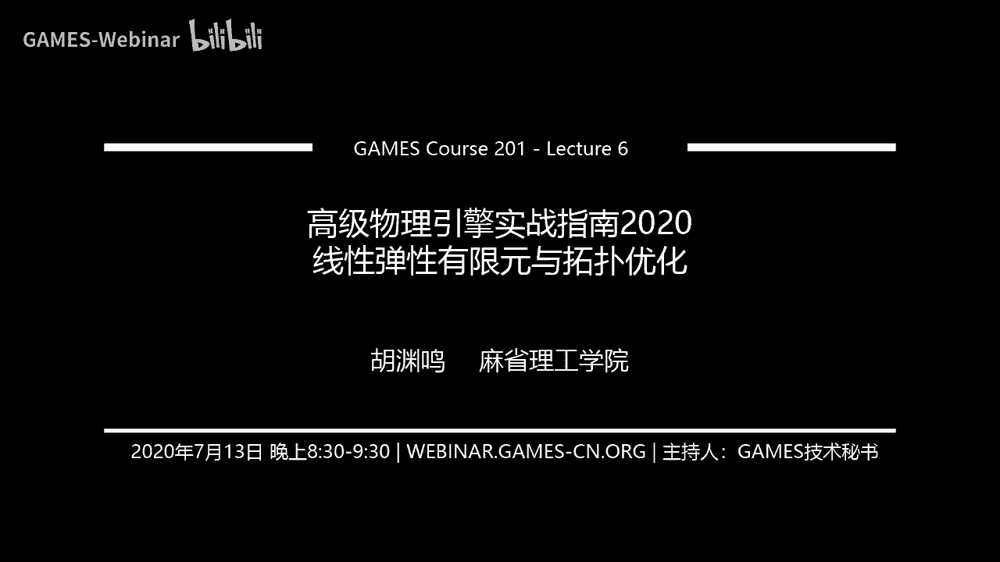

# GAMES201：高级物理引擎实战指南2020 - P6：Lecture 6 线性弹性有限元与拓扑优化 🧮

在本节课中，我们将学习线性弹性有限元方法的基本原理与实现步骤，并简要了解拓扑优化的概念与应用。有限元方法是求解偏微分方程的有力工具，在物理模拟和工程设计中应用广泛。

---

## 课程安排与作业说明 📅

上一节我们介绍了隐式时间积分器，本节中我们来看看有限元方法。课程已进入后半部分，后续将讲解混合欧拉-拉格朗日视角（如FLIP、MPM）和高性能计算等内容。

关于作业，请注意以下事项：

以下是作业提交相关信息：
*   作业一优秀作品已公布，代码可直接获取运行以供参考。
*   作业二为开放式物理模拟器项目，截止日期为北京时间8月15日23:59。
*   作业二可选方向包括：实现可交互的2D物理模拟游戏、优化性能、实现高精度格式、提升艺术可控性或自选研究方向。
*   建议组队完成，评分以新增原创部分为准。

---

## 有限元方法概述 🔍

有限元方法是加权残值法的一种，核心思想是将连续的偏微分方程（强形式）转化为离散的线性系统（弱形式）进行求解。

以下是有限元方法求解的标准步骤：
1.  **强形式转弱形式**：用测试函数 \( w \) 乘以方程残差并积分，将每点成立的方程转化为积分形式。
2.  **分部积分**：降低方程中导数的阶数，简化计算。
3.  **应用散度定理**：进一步简化方程，并自然引入诺伊曼（第二类）边界条件。
4.  **离散化**：将连续的场 \( u \) 用一组基函数（形函数）的线性组合来表示，即 \( u = \sum_j u_j \phi_j \)。
5.  **组装与求解**：得到离散系统 \( Ku = f \)，其中 \( K \) 为刚度矩阵，\( f \) 为载荷向量，最后求解该线性系统。

---

## 实例一：二维泊松方程 📐

泊松方程 \( \nabla^2 u = 0 \) 是学习有限元离散化的经典范例。我们考虑一个矩形域，其三边为狄利克雷边界（固定 \( u \) 值），一边为诺伊曼边界（固定 \( u \) 的法向导数值）。

### 从强形式到弱形式

首先，我们将强形式乘以任意测试函数 \( w \)，并在域 \( \Omega \) 上积分：
\[
\int_{\Omega} w \nabla^2 u \, dA = 0
\]
利用分部积分公式：
\[
\int_{\Omega} \nabla w \cdot \nabla u \, dA - \int_{\partial \Omega} w (\nabla u \cdot \mathbf{n}) \, ds = 0
\]
上式即为泊松方程的弱形式。

### 离散化与基函数

我们将求解域离散为网格（如四边形网格），场 \( u \) 由定义在节点上的值通过基函数插值得到。对于四边形单元，常用的基函数是双线性形函数。

将 \( u = \sum_j u_j \phi_j \) 和 \( w = \phi_i \) 代入弱形式，可得到线性系统：
\[
\sum_j \left( \int_{\Omega} \nabla \phi_i \cdot \nabla \phi_j \, dA \right) u_j = \int_{\partial \Omega} \phi_i (\nabla u \cdot \mathbf{n}) \, ds
\]
即：
\[
Ku = f
\]
其中，\( K_{ij} = \int_{\Omega} \nabla \phi_i \cdot \nabla \phi_j \, dA \)，\( f_i = \int_{\partial \Omega} \phi_i g \, ds \)（\( g \) 为诺伊曼边界条件值）。

### 边界条件处理

*   **狄利克雷边界条件**：直接固定对应自由度 \( u_i \) 的值。
*   **诺伊曼边界条件**：其贡献直接体现在载荷向量 \( f \) 的相应项中。

---

## 实例二：线性弹性方程 🏗️

上一节我们以标量泊松方程为例，本节中我们来看看更复杂的向量方程——线性弹性方程。它源于柯西动量方程，在准静态、无体积力、密度恒定的假设下，简化为：
\[
\nabla \cdot \sigma = 0
\]
其中，\( \sigma \) 为柯西应力张量，自由度 \( u \) 是位移场。

### 应力与应变关系

应力 \( \sigma \) 通过应变 \( \epsilon \) 与位移 \( u \) 相联系。对于线弹性材料，本构关系为：
\[
\sigma = \lambda \, \text{tr}(\epsilon) I + 2\mu \epsilon
\]
其中，\( \lambda \) 和 \( \mu \) 是拉梅参数，应变张量 \( \epsilon \) 定义为：
\[
\epsilon = \frac{1}{2} (\nabla u + \nabla u^T)
\]
可见，应力 \( \sigma \) 是位移 \( u \) 的线性函数。

### 有限元离散化

推导过程与泊松方程类似，但更为复杂。最终同样得到 \( Ku = f \) 形式的系统。刚度矩阵 \( K \) 的组装需要经过“应变-位移”矩阵和“应力-应变”矩阵的转换。对于二维四边形单元，其单元刚度矩阵是一个8x8的矩阵（每个节点有x、y两个位移自由度）。

---

## 拓扑优化简介 🎨

拓扑优化是指在给定设计空间、载荷和约束条件下，寻找材料最优分布以最大化或最小化某种性能（如刚度）的方法。

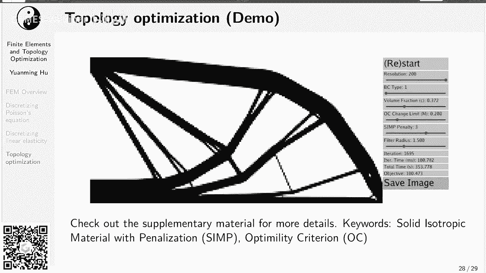

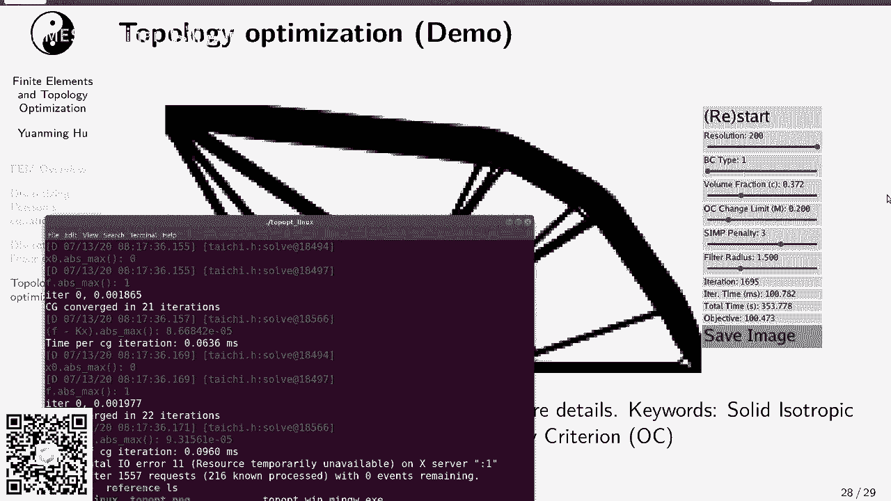

### 最小柔度问题

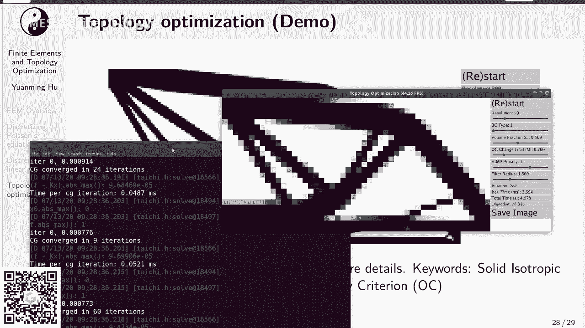

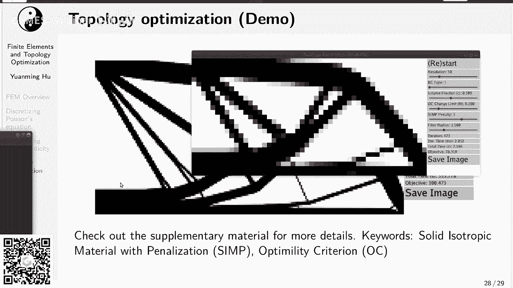

一个经典的拓扑优化问题是**最小柔度**（Minimum Compliance）设计。目标是最小化结构在载荷下的变形能，同时满足材料用量约束。
\[
\begin{aligned}
& \min_{u, \rho} \quad u^T K(\rho) u \\
& \text{s.t.} \quad K(\rho) u = f \\
& \qquad \frac{1}{|\Omega|} \int_{\Omega} \rho \, d\Omega \leq V_0 \\
& \qquad 0 < \rho_{\min} \leq \rho \leq 1
\end{aligned}
\]
其中，\( \rho \) 是每个单元的相对密度（设计变量），\( K(\rho) \) 与密度相关的刚度矩阵，\( V_0 \) 是允许的材料体积分数。

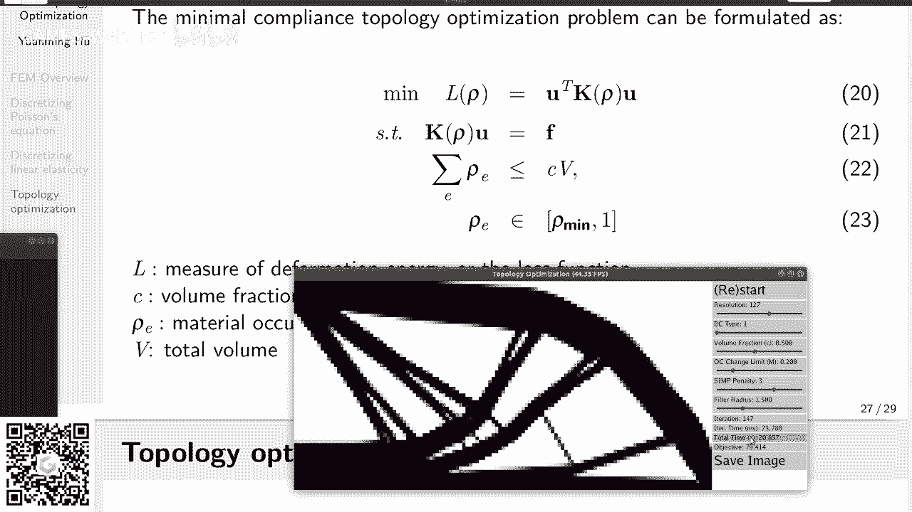

### 方法与演示

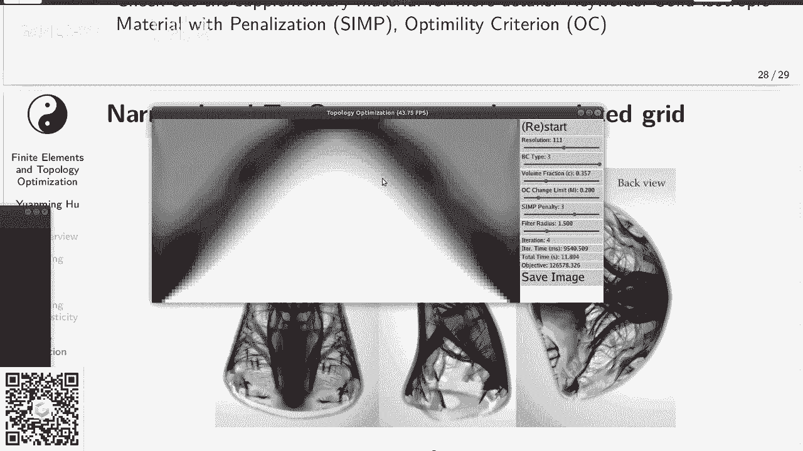

常用算法包括SIMP（固体各向同性材料惩罚法）和OC（优化准则法）。通过迭代更新设计变量 \( \rho \)，最终得到清晰的0-1分布，即材料的有无，形成最优拓扑结构。

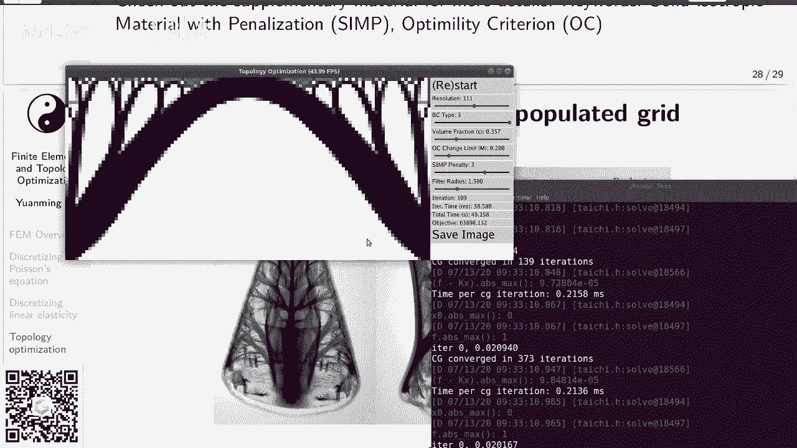

---

## 总结 📝

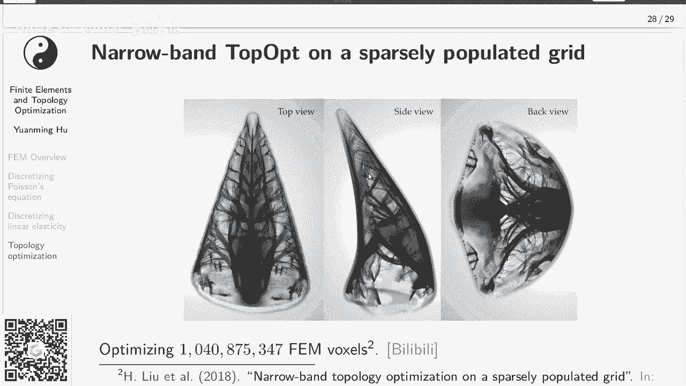

本节课我们一起学习了线性弹性有限元方法的核心流程与两个实例。我们从强形式出发，通过引入测试函数、分部积分得到弱形式，再经离散化最终建立离散线性系统 \( Ku = f \)。此外，我们还简要了解了拓扑优化的基本概念，它是在有限元分析基础上进行结构优化设计的强大工具。

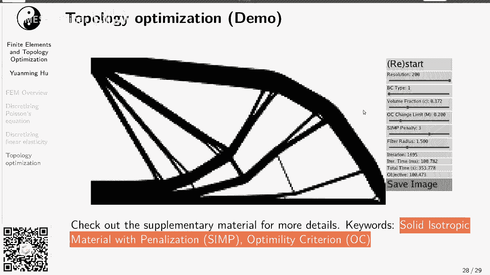

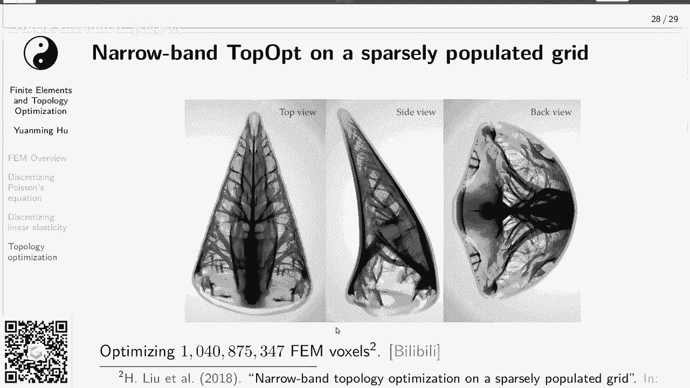

理解有限元方法为后续学习更复杂的物理模拟技术（如物质点法）奠定了重要基础。