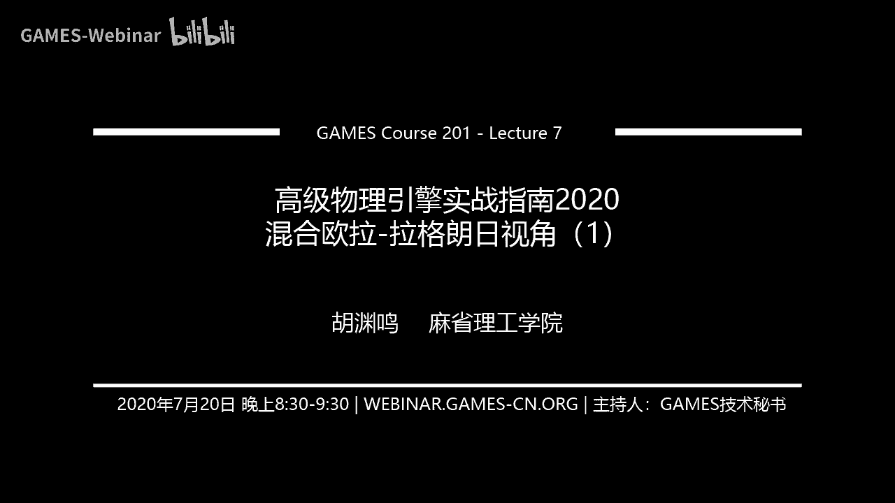

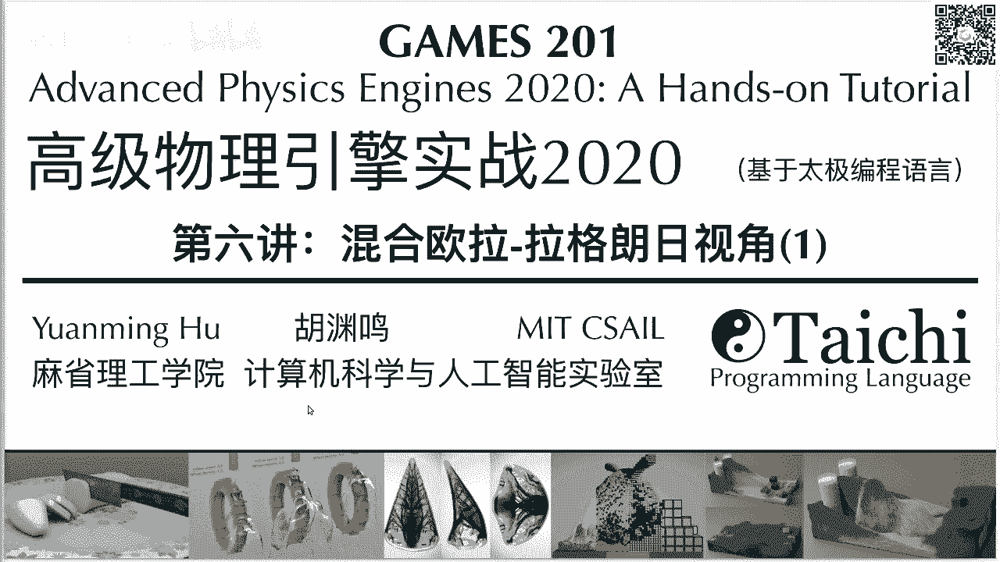

# GAMES201：高级物理引擎实战指南2020 - P7：Lecture 7 混合欧拉-拉格朗日视角（1）🧪

在本节课中，我们将要学习混合欧拉-拉格朗日视角的基本概念。这是一种结合了两种视角优势的模拟方法，广泛应用于流体和固体模拟中。我们将从回顾两种基本视角开始，逐步介绍几种核心的混合方法，并最终了解现代物理引擎中常用的物质点法。

## 视角回顾：欧拉与拉格朗日 🔍

上一节我们介绍了连续介质模拟的两种基本视角。本节中，我们来看看它们的具体定义和特点。

在拉格朗日视角中，观察者随着模拟的材料一起移动。每时每刻，观察者关注的是自身的位置和速度。这就像随波逐流的小船。在计算机模拟中，拉格朗日视角通常用粒子来表示，但也可以使用网格。

在欧拉视角中，观察者的位置是固定不动的。每时每刻，观察者关注的是经过自身位置的材料的速度。这就像插在水中的桩子。欧拉视角通常使用背景网格来表示各种物理场。

以下是两种视角的典型应用方法：
*   **纯拉格朗日方法**：例如基于粒子的方法（SPH）、位置动力学（PBD）。
*   **纯欧拉方法**：例如基于网格的烟雾、流体模拟。

## 为何需要混合视角？🤔

上一节我们介绍了两种视角的差异，本节中我们来看看为何要将它们结合。

要判断一个算法是否“更好”，我们需要从多个层面进行考量。没有任何一个算法在所有层面都完美，因此需要根据具体需求进行选择。

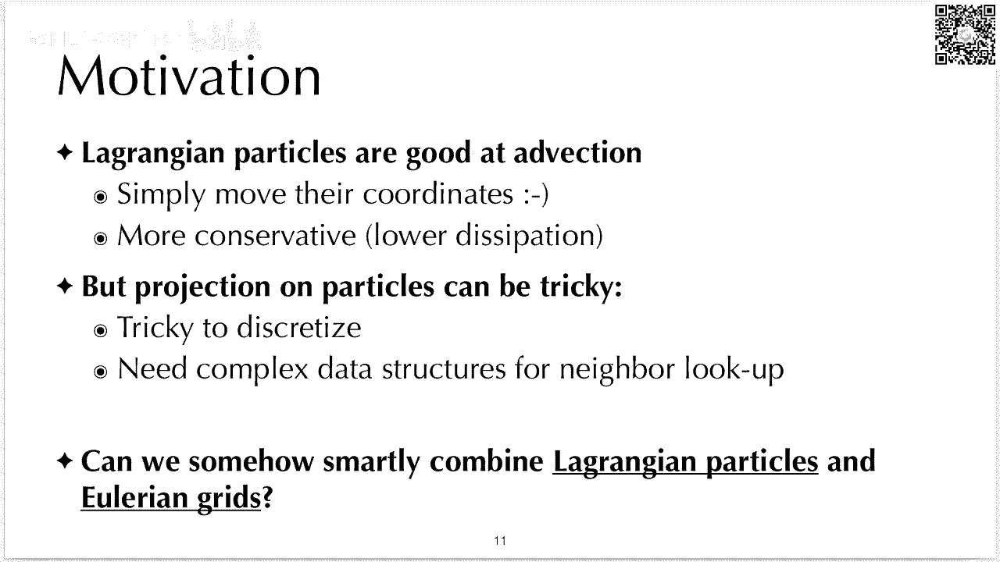

以下是评估模拟算法时需要考虑的关键因素：
*   **物理量的守恒性**：包括动量守恒、角动量守恒、体积守恒（对于不可压缩流体）和能量守恒。
*   **性能**：包括并行化难易度，以及内存访问的时空局部性。
*   **实现复杂性**：过于复杂的算法可能难以正确实现和优化。

欧拉网格和拉格朗日粒子各有擅长和不擅长的任务。我们的目标是将两者智能地结合起来，取长补短。

欧拉网格特别擅长**投影**步骤，例如求解泊松方程来实施不可压缩性。这是因为在均匀网格上离散拉普拉斯算子、查找邻居和实现预条件子都非常容易。

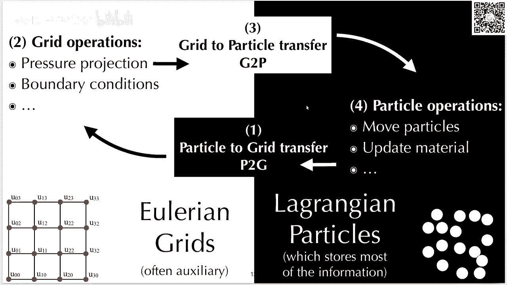

然而，欧拉网格在**平流**步骤中容易出现问题，例如数值耗散会导致细节模糊、能量丢失，使得模拟看起来过于粘稠。

拉格朗日粒子则非常擅长**平流**。移动粒子来传输物理量简单且自然，也容易实现质量和动量守恒。

但是，在粒子上进行**投影**操作非常困难。因为粒子分布不规则，离散化算子、查找邻居都变得复杂且计算量大。

## 混合方法的基本框架 🏗️

既然明确了各自的优缺点，我们就可以设计混合方法了。在混合欧拉-拉格朗日方法中，拉格朗日粒子通常作为“一等公民”，存储大部分状态信息；欧拉网格则作为“二等公民”，用于计算中间结果。

整个算法的通用套路如下：
1.  **粒子到网格传输**：将粒子上的信息（如速度）传输到其周围的网格节点上。
2.  **网格操作**：在网格上进行关键计算，如压力投影、施加边界条件等。
3.  **网格到粒子传输**：将网格上更新后的信息收集回粒子。
4.  **粒子更新**：更新粒子的位置、速度或其他材料属性。

这个在两种表示之间来回传输信息的过程，是混合方法的核心，但也会引入信息损失和计算开销等问题。

## 基础混合方法：Particle-in-Cell (PIC) 📦

上一节我们介绍了混合方法的通用框架，本节中我们来看看一个最基础的实现：Particle-in-Cell。

PIC是一个非常古老的混合方法。它的传输过程非常直观：每个粒子将其物理信息（如速度）传输到周围多个网格节点；反过来，每个粒子从周围网格节点收集信息。

在传输时，距离粒子更近的网格节点会被赋予更高的权重。这个权重通过**核函数**来计算。通常使用B样条核函数，并在x和y方向分别计算后相乘。

以下是三种常见的B样条核函数：
*   **线性核**：计算简单，但不够平滑，可能导致模拟不稳定。
*   **二次核**：最常用，在平滑性和计算量之间取得了良好平衡。
*   **三次核**：更平滑，但计算量更大，使用相对较少。

以下是PIC方法中粒子到网格传输的核心代码逻辑（以二次核、格点位于单元中心的网格为例）：

```python
# 假设 particle_pos 是粒子位置，particle_v 是粒子速度
# dx 是网格间距，grid_v 和 grid_m 是网格上的速度和权重累加器
base = (particle_pos / dx - 0.5).cast(int) # 计算左下角节点索引
fx = (particle_pos / dx - 0.5) - base.cast(float) # 计算相对位置
# 计算二次B样条权重
w = [0.5 * (1.5 - fx)**2, 0.75 - (fx - 1.0)**2, 0.5 * (fx - 0.5)**2]
# 遍历3x3的邻居节点
for i in range(3):
    for j in range(3):
        weight = w[i].x * w[j].y # 组合权重
        node_idx = base + vec(i, j)
        grid_v[node_idx] += weight * particle_v # 累加加权速度
        grid_m[node_idx] += weight # 累加权重
```

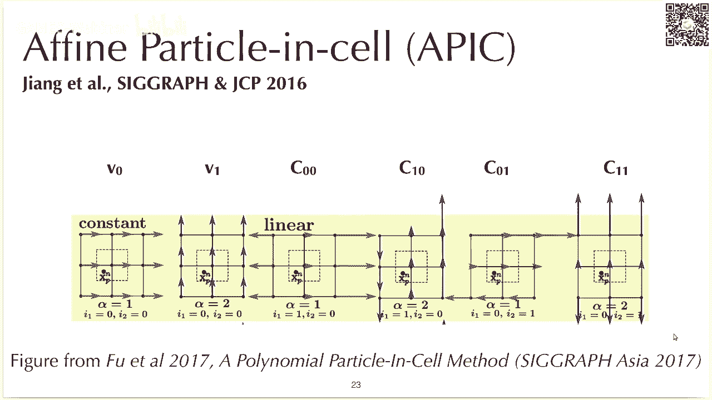

传输完成后，需要对网格上的物理量进行归一化：

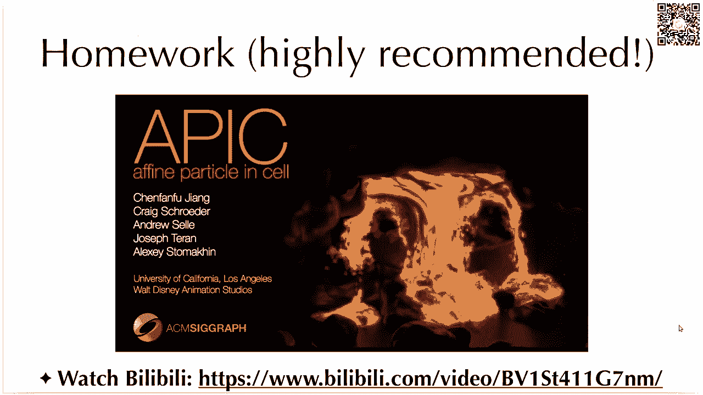

```python
for each grid node:
    if grid_m[node] > 0:
        grid_v[node] /= grid_m[node] # 速度除以权重和，得到加权平均
```

网格到粒子的传输是类似的反向过程。然而，纯PIC方法能量耗散严重，在模拟旋转、剪切等变形时效果不佳。这是因为在传输过程中，网格上的多个自由度信息被压缩到粒子的少数自由度上，导致信息丢失。

## 改进的混合方法：APIC 与 PolyPIC 🚀

为了解决PIC的信息丢失问题，主要有两套思路。本节我们介绍第一套：在粒子上存储和传输更多信息。

APIC方法在粒子上不仅存储平移速度，还存储一个局部的仿射速度场。这个仿射速度场可以描述旋转、剪切、拉伸等变形模式。

从高层思想看，APIC的传输过程与PIC相似，但传输的量包含了额外的仿射分量。令人惊讶的是，实现APIC所需的代码改动非常小。

以下是APIC方法中粒子到网格传输的核心增量代码：

```python
# particle_C 存储粒子的仿射速度场矩阵
# dp = node_pos - particle_pos
affine_v = particle_C @ dp # 矩阵乘法，计算仿射部分的速度贡献
grid_v[node_idx] += weight * (particle_v + affine_v) # 累加平移和仿射速度
```

网格到粒子传输时，也需要重建这个仿射矩阵`C`：

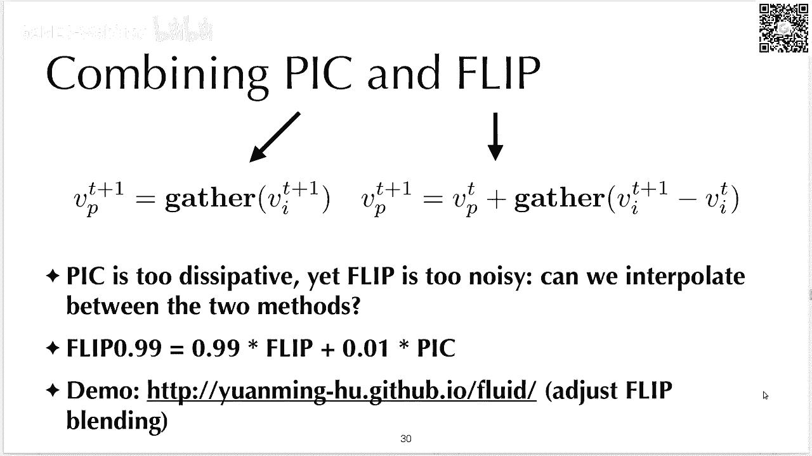

```python
# 计算粒子新速度的仿射部分
for i in range(3):
    for j in range(3):
        weight = w[i].x * w[j].y
        node_idx = base + vec(i, j)
        dp = node_pos - particle_pos
        particle_C += weight * (grid_v_new[node_idx] - particle_v_old).outer_product(dp) * (4 / dx**2)
```

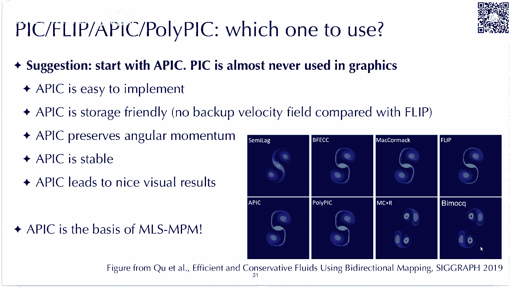

APIC能很好地保持角动量，模拟旋转等运动时能量耗散大大减少。PolyPIC则更进一步，在粒子上使用更高阶的多项式速度场（如双线性、二次），以保留更多模式信息，实现更无损的传输。

## 另一种思路：FLIP 方法 💧

上一节我们介绍了通过增加信息来改进PIC的方法，本节中我们来看看另一种不同的思路：FLIP。

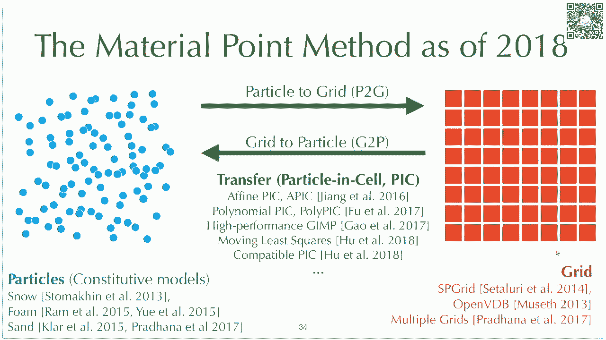

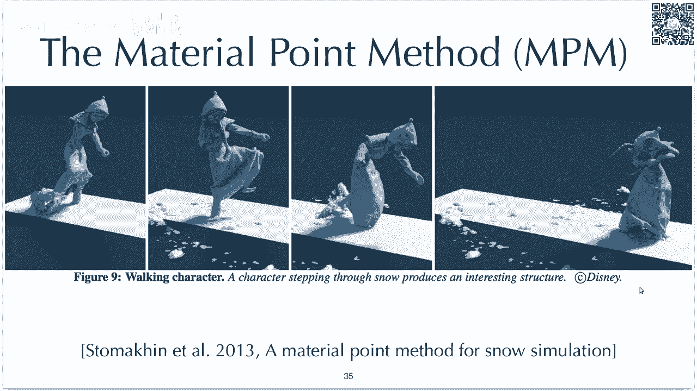

FLIP方法不直接传输物理量本身，而是传输物理量的**增量**。例如，在不可压缩流体模拟中，它传输的是压力投影和边界条件所带来的速度变化量。

FLIP的核心思想是：粒子速度 = 旧粒子速度 + 从网格收集到的速度增量。这相当于在信息传输路径中，保留了一条“粒子到粒子”的直连通道，避免了所有信息都经过网格带来的平滑与损耗。

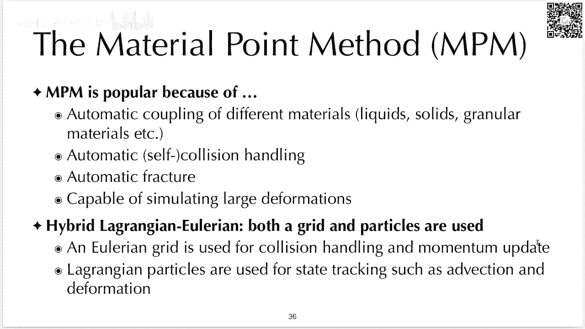

FLIP的实现与PIC只有微小差别：

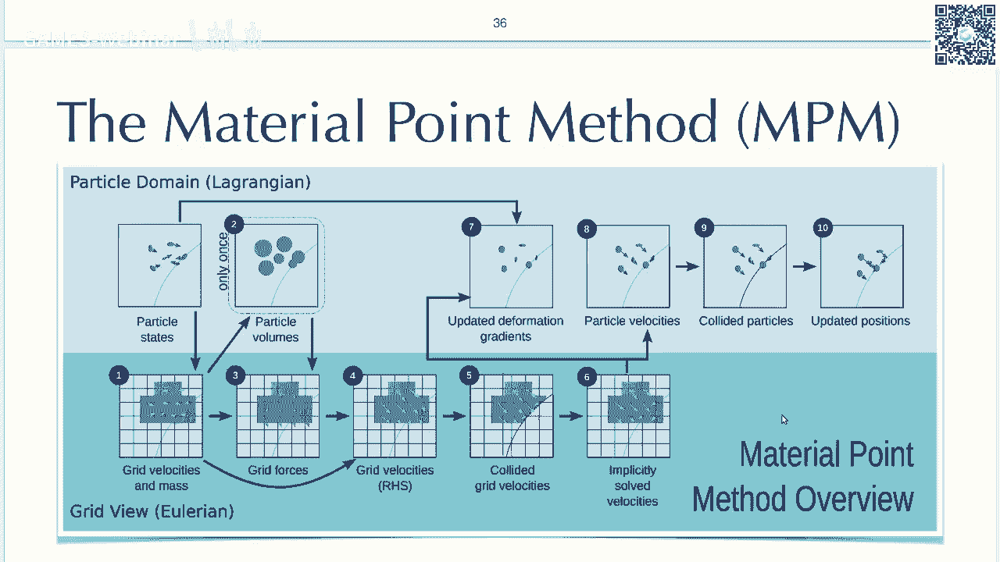

```python
# PIC 方式：
particle_v_new = gather_weighted(grid_v_new)
# FLIP 方式：
particle_v_new = particle_v_old + gather_weighted(grid_v_new - grid_v_old)
```


FLIP的优点是能保持更多细节，能量耗散少。但缺点是容易产生数值噪声，模拟结果可能看起来比较“嘈杂”。一个常见的技巧是将FLIP与少量PIC混合，例如使用0.99倍的FLIP增量加上0.01倍的PIC速度，在保持细节的同时抑制噪声。

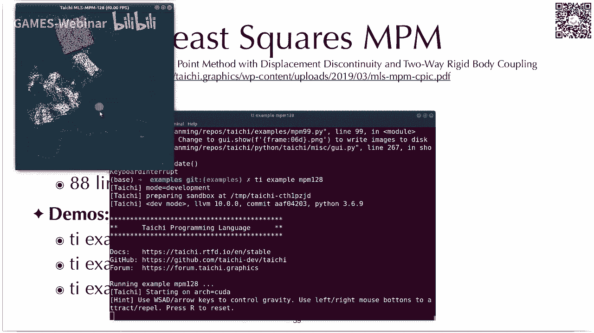

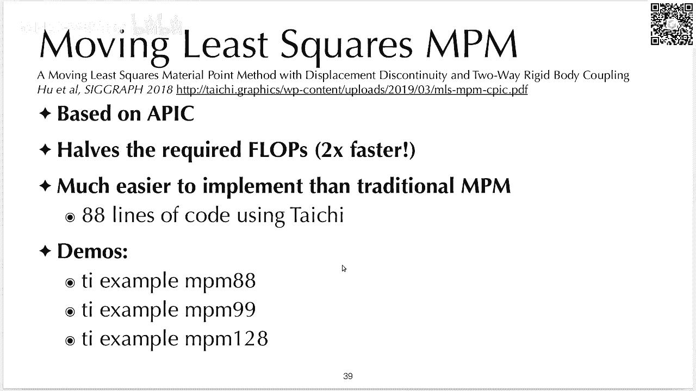

## 迈向现代：物质点法 (MPM) 简介 🧱

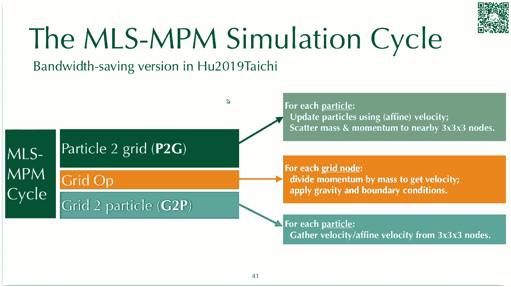

前面介绍的混合方法主要侧重于平流步骤。本节中我们来看一个完整的、独立的模拟方案：物质点法。

MPM是一种混合欧拉-拉格朗日模拟框架，它使用拉格朗日粒子存储材料状态（如位置、速度、变形梯度、体积），使用欧拉网格来计算和施加内力（如应力）、处理碰撞。

MPM的模拟循环与之前介绍的混合方法框架一致，但粒子存储的信息更多，网格上的操作也包含了基于材料本构模型的内力计算。早期的MPM实现步骤较多，较为复杂。

近年来，出现了更高效的MPM变种，如**移动最小二乘MPM**。它与APIC高度相似，只是在粒子到网格传输时，额外增加了基于粒子应力的力贡献。这使得实现一个基础的MPM求解器变得异常简洁。

以下是一个简易MPM流体求解器（基于MSMPM）的核心步骤概述：
1.  **粒子到网格传输**：类似APIC，传输粒子的动量（质量*速度）和仿射动量，同时根据体积变化计算并传输应力贡献。
2.  **网格归一化与边界条件**：计算网格节点速度，施加边界条件。
3.  **网格到粒子传输**：类似APIC，更新粒子的速度和仿射矩阵`C`，并根据`C`的迹更新粒子的体积`J`。

通过这种设计，一个基础的MPM求解器可以用不到100行代码实现，同时能模拟流体、弹性体、雪等多种材料。

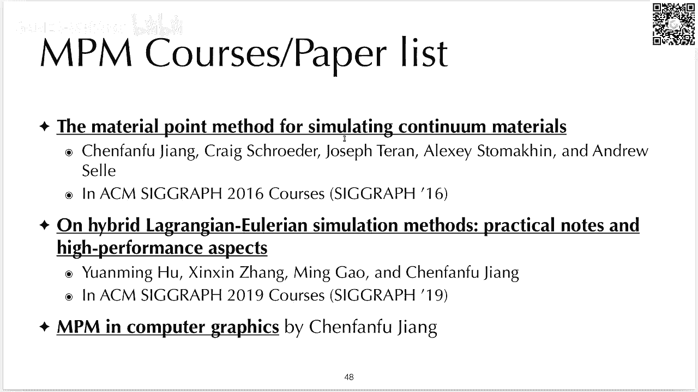

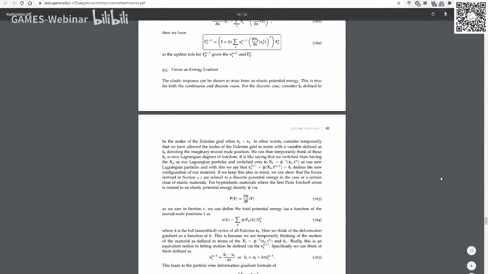

## 总结 📝

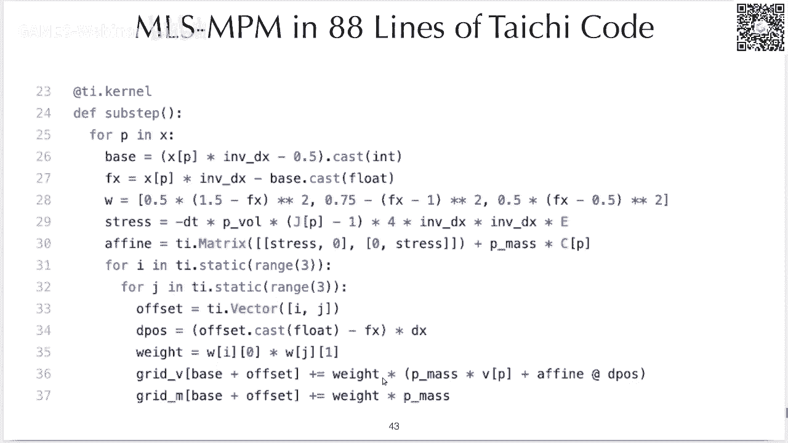

本节课中我们一起学习了混合欧拉-拉格朗日视角。
*   我们首先回顾了欧拉视角和拉格朗日视角的各自特点与优劣。
*   我们了解到，混合方法的核心思想是**用粒子追踪物质，用网格解析场和力**，从而结合两者优势。
*   我们学习了基础的PIC方法，并认识了其能量耗散严重的问题。
*   我们探讨了两种改进思路：一是传输更多信息（如APIC、PolyPIC），二是传输增量信息（如FLIP）。其中APIC因其实现简单、效果良好而被推荐为入门选择。
*   最后，我们介绍了物质点法作为混合方法的一个强大而现代的应用实例，它通过扩展粒子存储的信息，能够统一模拟多种连续介质材料。

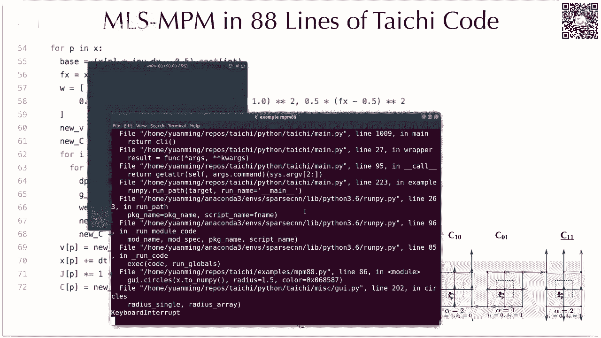

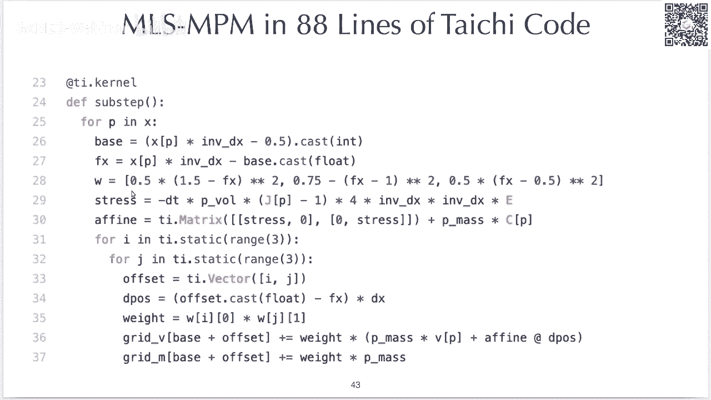

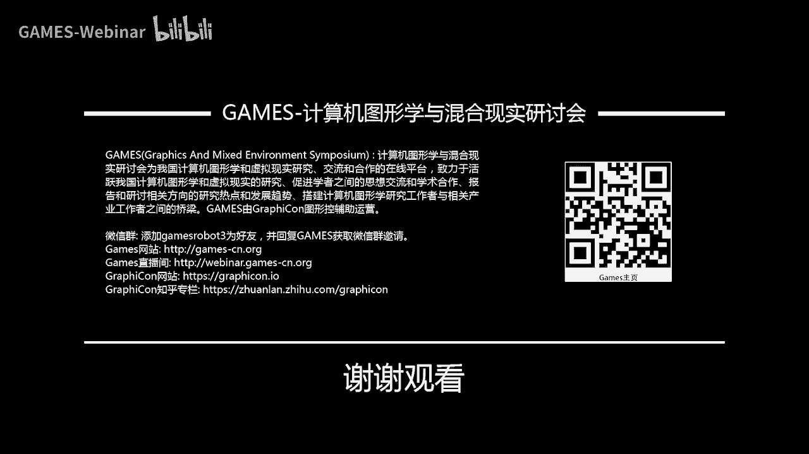

下一讲，我们将深入MPM背后的理论，学习本构模型、隐式积分等高级话题。