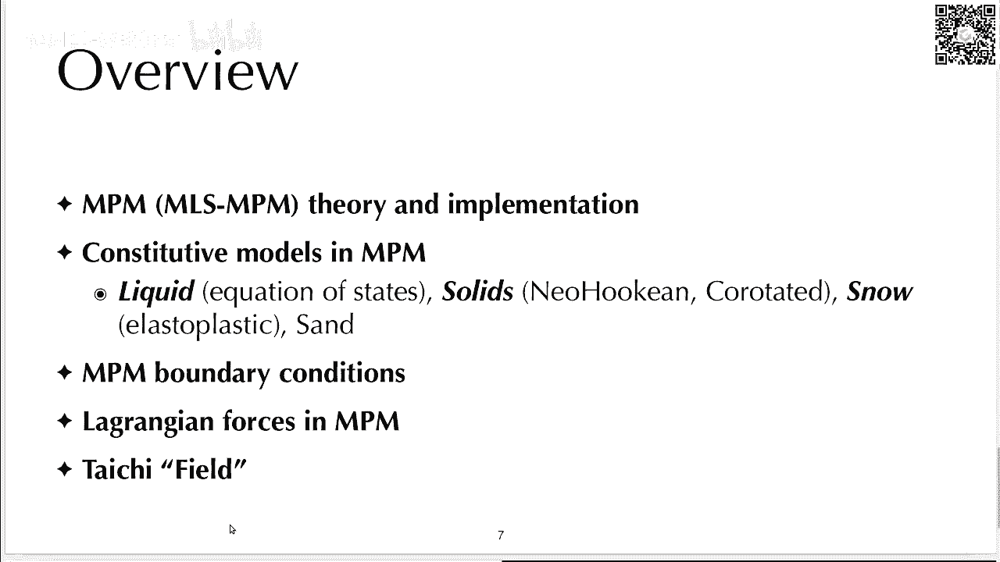
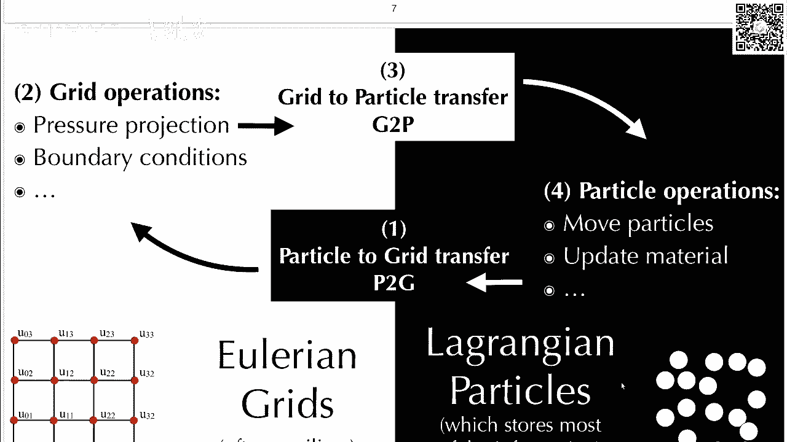
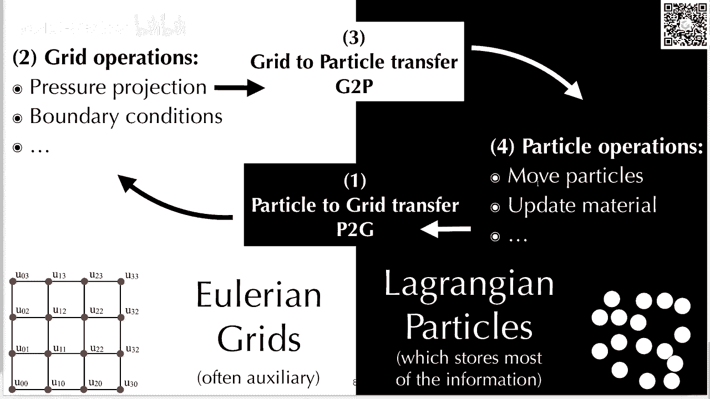
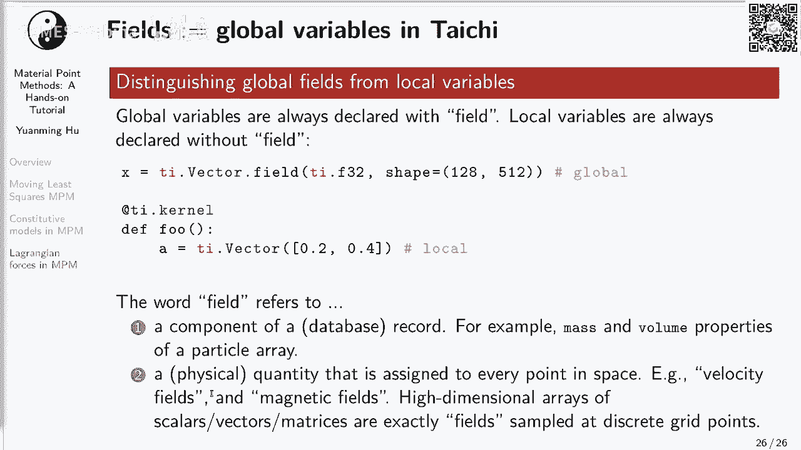
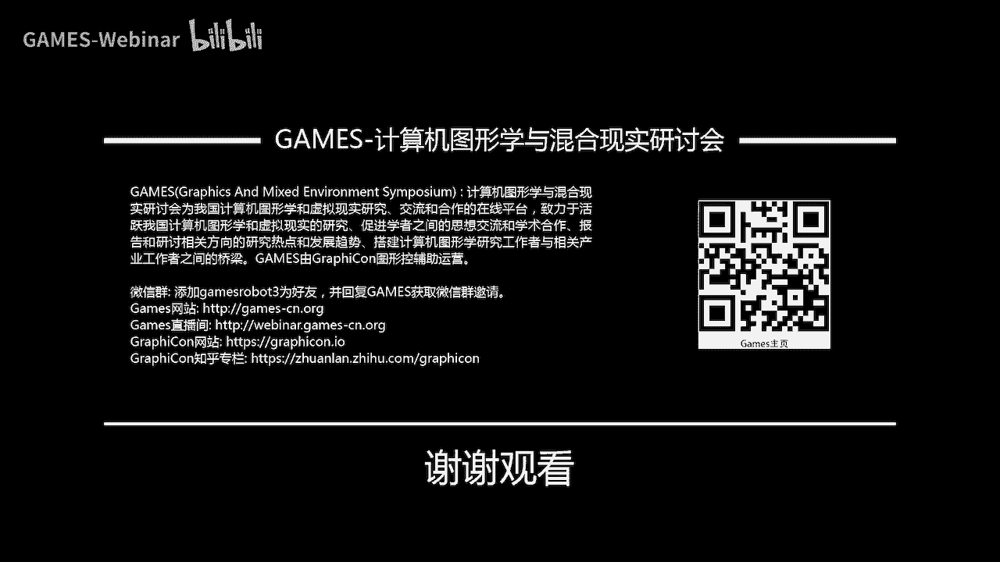

# GAMES201：高级物理引擎实战指南2020 - P8：Lecture 8 混合欧拉-拉格朗日视角（2） - GAMES-Webinar - BV1ZK411H7Hc

大家好呀，欢迎来到我们的第八讲，这个主见我们课程也接地尾声啊，那第八讲内容呢是混合欧拉拉格尔视角的，第二部分，上一讲我们简单讲一下混合欧拉拉工人视角，那这一讲呢我们再稍微深入一点。

然后呃稍微细一点讲m p m里面的各种东西，开始之前啊。

我们还是呃讲一些课程安排方面的事情，首先课程纪念品啊，作业一的奖品呢我们已经全部邮寄了，获奖的同学请注意查收，然后收到了以后，记者在群里面晒个图，这样也是对我们负责邮寄的同学的一些，相当于是一种认可吧。

然后有同学呃，晒的图里面居然还有另外一个黑白相间的呃，标志哈，居然还有一个腾讯的企鹅，非常有意思，发现这个太极图标和腾讯企鹅摆在一起，还挺和谐的，然后在很多同学晒照片的同时，我们也发现有同学晒出了一个。

和我们一开始设计的杯子，长得稍微有点不太像的一个杯子，一开始我们还觉得这么小众的东西，居然也有人山寨，后来我们发现啊，原来这位同学呃没有拿到课程奖品，所以就在blender里面自己做了一个台阶的杯子。

假装自己也拿到了奖品啊，当然这个呃，呃我们也非常能够理解这样的呃心情，这位同学作业二请加油完成，因为我们基本上呃，作业的获奖率还是非常非常高的，基本上每次都是和超过一半同学都能获奖。

所以基本上只要好好做，基本上都是有奖品的，然后顺便提醒一下，作业二的deadline是北京时间8月15日，然后大家记得赶上这个时间，这样也不用在blender里面自己画一个杯子了。

这样我们会给你寄一个实体的杯子，呃当然你如果不满足于拿一个课程，纪念品的话呀，那也可以考虑参加一下，china via 2020的这个竞赛，这个china via 2020极冻杯中国虚拟现实大赛。

上面有一个命题竞赛，那么它的题目叫就叫做太极物理琴建模创意，大家可以点上面的这个网址去看一看，具体的各种要求，然后要求呢是在校生，或者毕业不超超过5年的同学都可以组队参加，然后2~6人一队。

然后每一队要有一个高效的指导教师，我问了一下组委会能不能以作业二为基础，然后提交到china v2 竞赛，他们表示完全可以的啊，当然注意这个竞赛虽然叫china vr，但是他的提交作品既可以是沉浸式的。

也可以是非沉浸式的，你可以把太极整合到unity或者unreal里面，然后在呃，unity或者unreal的虚拟现实的环境底下，去开发一个屋顶擎也完全可以呢，就做一个普通的2d的或者3d的。

非沉浸式的物理琴，这样都是可以接受的，然后非常欢迎大家两边都提交，然后呃一个更好的解决方案，可能是先以作业二先提交我们作业二，然后以作业二为基础，再花一些时间去把它修饰一下，投到china vr。

然后这个比赛的奖品应该还是挺丰富的啊，我看他有好多好多奖项设置，然后这个奖项就比我们的呃，太极茶杯要高级多了啊，所以大家如果不满足太极茶杯的话呢，也可以好好考虑一下，然后今天呢我们主要讲一讲。

物质点法的理论与实现，然后讲完这个算法本身，我们会讲讲这个算法它能支持的各种材料，怎么去实现它的conceduty model，包括液体呃，固体，还有弹塑性体，包括血或者沙子，沙子可能今天没时间讲。

我们会讲讲血，然后在pm里面还有这个boundary condition，和拉格朗日立这两个很有意思的东西，其中拉格朗日历啊，可以允许你在m p m里面，用fm的方法去计算能量。

然后这样你可以在m p m里面也模拟这种，基于网格的模拟，它也会有这样的模拟呢会有一些额外的好处，最后我们讲讲最新的太极里面一个概念叫做field，field，其实就是tensor。

但是我们决定不用tensor这个名字，而用field这个名字，这样大家用起来奇异会小一些，因为很多同学觉得，vector或者matrix也可以算作tensor。

好那么我们先简单复习一下。

为什么我们要用混合欧拉拉杆式方法呢，这是因为欧拉网格和拉格尔的例子，他们各有长处对吧，所以我们希望把他们的优势结合起来，那么为了结合他们两个表示的长处，我们就必须把数据在两个表示之间相互转转换，对吧。

那这样就会我需要我们去做particle，particle，degrade和规律particle这两个操作，然后我们一般来说在混合欧拉公式方法里面，粒子是信息的主体，它存储主要的物理信息。

欧拉网格呢通常是一个附属的信息，比如说你只是在上面做算一下临时的动量，或者其他的一些物理量，然后在网格上面我们会做一些像压力投影啊，编辑条件啊之类的操作，然后真正的像移动粒子更新材料。

这些全部都是在例子上面做的好，那么接下来呢我们就具体讲一讲今天的内容，在正式开始前，我们稍微讲一点点m p m的相关理论，m p m和fm一样，它都属于加罗金方法，但是需要注意的是呢。

在m p里面没有element，没有这个元素的概念，所以m p m一般大家把它归类为element，free gue，f g没有元素的加调音方法啊，这个名字真的非常直白了，然后m p m它的例子呢。

其实对应的是f1 m里面的quattral point，高斯积分点啊，而不是f e m里面的元素，ok你如果还记得fm的话，你会发现你应该记得f一里面，它的元素其实就是它的mesh里面的。

所有的二维里面就是面，三维里面就是体对吧，那其实m p m里面没有这样的mesh，然后他也没有元素，它的particle，完全对应的就是fm元素里面的积分点，随着你的这个模拟这个例子可以到处跑。

所以它就可以模拟一些大型变啊之类的，非常奇异的现象，那和fm一样，m p m的方程也是通过week formulation，也就是呃加六金的这些这套理论，给他推导出来的。

所以他其实也是呃we form consistent，一一套第三话的方法，当然要注意的一个事情是嗯，npm和fm比起来，npm非常非常年轻，npm可能也就20多年的历史，fm它的年代就更久远一些。

所以fm有各种各样的高阶格式，mp m呢就相对来说比较少见一些，这些高阶格式，之前上一讲其实提到在图形学里面，2013年提出了一个m p m的算法，是相对来说比较复杂的，这个也完全能够理解。

因为你一开始在提出一个算法的时候，往往就会因为各种地方啊设计，很难一步到位对吧，所以你会引入一些各种各样的补丁，然后让这个算法能work，但是这个算法在逐渐迈入实用阶段以后，大家就会想办法。

想各种各样的办法去简化它对吧，因为你最终你算法总是要被人实现，越简单越好，那么这样我们在2018年的时候，就提出来一种非常非常简单，易于实现并且高效的m p m格式，叫做移动最小二乘m p m。

我们一般叫做m s m p m，然后这整个论文他都可以用一句话来表示，就是呃在m s m p m里面，你是用m shape function在pm里面作为呃它的basis function。

这个m i s m p m，他一开始是在sf 2018年的时候被提出来的，然后呃其实也就是我和蒋老师啊，然后还有团队里面很多其他成员，在大概是17年暑假，在宾夕法尼亚大学做了这么一个工作。

还是挺有意思的，后来我在sk off asia，2019年的这个太极的论文里面，又进一步把它提高了一下，为什么要提高了，因为当时要做一个benchmark，所以呃我们希望这个算法更越简单越好。

并且做了这么提高以后，我们还可以节约memory banquet，就是说你在做mp m的时候，你会希望尽量少的和你的main memory进行通信，也就是说你的希望尽可能少的fetch。

may i bite to your registers，你希望你的cpu尽可能多做计算，而少做通信对吧，因为通信非常昂贵呃，经过这么一系列的优简化和优化以后，这个m s m p m。

它就比2013年的classical b spm，p m要容易实现很多很多，并且能快一些，可能快两倍以上，那为什么它简单并且高性能呢，这是因为在graphics里面。

当然这么做以后理论上不一定是对的对吧，那这个就是呃我们在论文里面，通过各种各样的推导来证明，这样做也是对的，那在讲各种公式之前，我们先统一一下各种符号的定义，那在这一讲里面呢，所有的scale。

所有的这个标量它都是非加粗的字体，比如说mi表示呃第i个great node的质量，然后v p0 表示第peg particle，在时间零的体积啊，这个下标上标我们后面会说，然后呃项链和矩阵都是加粗的。

小写或者大写字母，比如说呃加粗的vp它就是一个向量，然后c p呢它就是一个矩阵，那都关于这个下标呢，我们用subscript i表示节点还记得吗，npm里面既有particle，you agreed。

那么我们用i来指代所有的grade node，我们用p来表示particle，比如说vi和vp，vi是什么，vi是节点i上面的速度，vp呢是粒子p的速度。

那么superscript它这个上标上标我们来表示时间，不比如说x3 by super n就是节点i的位置，在呃n时刻呃，节点i在n时刻的位置，当然这个地方大家要注意一下，一般来说在欧拉网格里面。

这个节点我们是从来不移动它的位置，所以这个上面上标一个n，其实也没有什么太大意义，这边可能有x p n可能会更有意义一些，不过这边只是演示这个商标的作用了，ok那么在讲m s m p m之前，apex。

它的全称叫做fine particle excel，它是一个particle excel的一个变种对吧，那还记得它和传统的最经典的particle excel，有什么区别吗。

它的区别就是它会额外的维护一个变量，叫做c，这个c是每一个party上面都有的，一个2x2或者3x3的矩阵，取决于你到底是在做二维的模拟，还是三维的模拟，然后这个c呢，他其实记录了这个particle。

周围的就是这个i fi的速度场，然后所以这个fine就是ax加b对吧，然后这个其实它有一个关于x变化的量，这个变化的量就是记在c里面，然后不变量就是这个呃b那一项，其实就是v对吧。

然后其实你你看我们这个particle to grade，这个地方，那它其实是呃mv是啊，i n加一，我们这边只看他的这个fm party啊，这个contribution应该是什么，应该是嗯mp cp。

然后乘上这个权重，也就是说当你的对每一个particle，它对周围的所有的i它都会有一个变化的，一个呃速度的momentum的贡献啊，但这边还有一项还有一项是mp乘上v p，这个我上完课以后我去补一下。

这边大家记得还有一项呃，当然那一项其实在apex里面，那一项其实是pc的那一项对吧，但是在fm pincel里面，其实比较重要的是前面这一项，那么epic它其实是一个典型的party excel的格式。

它需要做三步过程，第一步叫做particle to grade，我们把数据从粒子转移到网格上，你会发现在particle to grade，我们求了两个东西对吧。

两个东西一个是grade上面的momentum mv sbi，然后还有一个是msi，就是呃节点上面的质量和动量，那么质量这个公式非常直观易懂，就是你你把particle的质量给它。

按加权scatter到节点上面，那么动量，这个其实也就是把party上面动量加权scatter，到节点上面，但是呃还是注意一下，这边我漏打了一下，这个我后面会补上，然后在规则上面呢，我们要先做一个事情。

就是说我们把规则上面的动量除掉，grade的质量，动量除以质量等于什么，等于速度对吧，那我们这样可以求到，那么我们这样可以求到规则上面的速度，然后呃求完这个速度以后，我们在规则上面。

为什么把东西转移到规律上面呢，因为规则上面做一些操作很容易对吧，然后呃在硅上面最容易做的一个操作是什么，是pressure projection，去做这个压力投影。

一般来说大家会在这边去solve一个psg，equation，我看有同学问scatter是什么意思，scatter就是说，每个party把自己的贡献分配给周围的3x3的windows。

然后另外一个叫gather，gather就是收集重新收收集回来，那么我们在gdp里面可以看到这边就gather对吧，我们对于每一个particle，我们看一看它周围的三乘三个great node。

按照这个quegic be splin，去从green dows上面加权收集回你的新的速度，这样就得到了particle上面的速度，同时呢我们还要gather另外一个信息。

这个是particle上面的这个c，这个信息，一般我们认为这个c就是一个速度的梯度，速度梯度，然后这个c这个信息，他收集回来的这个公式稍微有一点奇怪啊，这个地方假设我们是用的是quadratic。

bespin的话，那它其实有一个很神奇的系数在前面，然后呢，我们还要把它grab上面和你的呃，grader的位置减去particle位置，做一个外籍，注意这个地方是一个outer product。

是一个列向量乘上一个行向量，得到的是一个3x3的矩阵或者2x2的矩阵，取决于你是在做2d还是3d，然后算完这个v和c以后，我们可以更新particle的位置对吧，那就是xp等于xp加上da t乘上bp。

这边其实是一个sympathy oiler，如果要实现apex，其实也就呃二三十号代码，可以参考一下上一讲，呃其实花了比较多的时间，我们就可以得到一个m p m的方方法，你可以看到这个是epic。

这个是npm，我们再看一下epic npm，只有做了非常非常小的改进，那么具体改了哪儿呢，首先在m p m里面你总得做一个deformation update对吧。

你得去根据局部的速度梯度去更新你的形变，更新particle上面的deformation gradient，这个f是deformation gradient，然后呢。

我们呃在grade上面momentum多出来了额外的一项，这一项是什么啊，这个还不能选定这一项，就是particle的它的弹力，它有你会发现除了这个m p cp以外，它还有一个弹力项。

这个弹力向我们后面会解释，那么我们现在这边的npm是用来解呃弹性物体，所以我们就没有incompressibility的这个projection的操作，但是我们有一个规则上面的边界条件的操作。

ok然后这9p呢基本上就是一模一样的啊，没有任何改动，这个要注意一下，你如果看的是2013年的m p n paper，你会发现他的deformation update就是这一部啊。

他是在g two b之后来做的，那么我们在m2 sm里面，我们把这个deformation update这一步移到了p9 g里面，为什么这么移呢，你这么移了以后。

你就可以节约memory bandwiz，因为你如果移到这边来以后，那你g9 p就不需要去读f这个array了，相当于你可以节省一些内存的带宽，而且为什么我们能这么移，能这么疑。

是因为我们更新f只需要用到c，然后c是存在party上面，并且g two p会算这个c，ok所以他其实能节省节省一些带宽，而且他各种这个整个算法也是非常非常简单的。

正是因为我们做了这么多的呃简化和优化处理，我们才会有88和99行和各种npm版本，用太极实现，好，那么刚才讲了一下deformation update和节点上面的弹力，这两个大家可能不是特别容易理解。

那么我们这边就稍微详细的讲一下，首先啊，为什么t为什么粒子上面的这个形变梯度，f会变化呢，前面就是f之所以会变化，是因为你的材料从欧拉视角上来看，速度场的梯度，它局部速度场的梯度并不是零。

因为你想如果局部速度场的梯度是零，那说明什么，说明你这个局部速度场它是恒定的，那恒定的一个运动，它会对你的形变记录有影响吗，不会有影响对吧，它只会对你的形变有型，但对你的形变梯度是不会有任何影响。

你如果从弹性的角度来说，如果你有一个弹球，然后你去把它上面的每一个部分，按照一个恒定的速度场去移动，那这个球不会发生任何形变对吧，它只是在空间中移动而已。

所以啊为什么deformation gradient会变化呢，这是因为它的v的gradient grade v会呃不是零，由于它grav不是零，所以它的f会变化，那么我们把它离散化一下。

就会得到一个这样的公式，注意啊，这个公式它是呃i加上雕刻t乘上grad v，然后整个算出来是这么个矩阵，注意这个grav它是v对于x求导，它是一个三三维向量，对三维向量求导得出来的矩阵。

是一个呃3x3的矩阵对吧，而不是一个向量或者其他的东西，它是一个呃从数学上来说，它就是一个呃33的矩阵，当然这个有的地方grad v会写转置，会多写一个转置，但这个是符号属于符号不统一。

在我们这边grab是统一不写转置的，看这个地方也到底有没有转制，其实并没有达成共识，一般来说呃有些人说要转职，有些人说不要转，但是你在npm里的，在graphics里面，npm的文章来看。

它一般是不写转置的，就是这个gradually是不用写transpose，ok然后再m s m p m里面啊，gravv我们怎么来算呢，它里面的这个c，其实就可以作为grad v的一个近似啊。

其实就可以作为gravv的一个景色，那么在m s m p里面我们有这么个公式，那么我们直接可以把c去替换进，公式一里面的gradb就得到，这么就得到这么一个公式，那你就要去相当于去要要去用你的呃。

差值函数的导数去求gravb量，计算量就会稍微来说相对大一些呃，都是用了c，但是在m m m p m之前呢，大家有的时候会用差值函数的导数，去求这个brad v量，计算量就会大一些，好那我们刚才说到呀。

还有另外一项这个项呢是材料的内部弹力对吧，那这个像是呃怎么来的呢，我们接下来就讲一讲，首先啊这个项里面有一个dott对吧，那是因为我们这个deltt是什么意思，是我们得把节点上面的力乘上时间不长。

得到的是节点上所受的冲量对吧，因为我们算，因为我们要算的是节点上的动量，所以我们给他叠加上去的必须是一个重量，这样你至少量钢，你别搞错对吧，你要沉掉他t亮钢才对，然后呢嗯我们接下来就算一算这个。

节点上面的f r这个particle p对于节点上面呃，节点i的力的贡献，那么这边又用到一个很经典的公式了，假设我们是在用超弹性的材料模型，那么求解节点上i节点i上的受力，其实就可以把你的总体的势能。

弹性势能关于节点i的位置去求一个导数对吧，好，但是这边有一个啊有一点绕的地方，那就是在pm里面，它的grade我们是从来不去deformed它的，它的这个grade永远是在空间中静止的一个点。

那你这个你怎么在这种情况下，你怎么对，把这个potential energy对节点的位置求导数对吧，你节点位置从来不变好，那我们接下来就演示一下这一步怎么来做，注意啊。

我们这边又呃用到了一些之前课程里面，定义到的符号，比如说这个cp它其实是什么，是弹particle p的弹性势能，density，它是一个dancing，所以你要去乘上它的体积。

得到才是particle p的弹性势能，然后u呢是总体的弹性势能，然后v呢是particle初始的体积啊，注意这边是初始的体积，因为你的pc是定义在呃，你的没有default那个坐标系下的。

好那么接下来我们就一步一步看一看，那么刚才那一坨公式是怎么出来的，ok，那么假设呢，我们沿着时间朝前前移动一个微小的时间套，那么这个套是趋近于零的，好我们现在计算一下呃。

我们假设green note在deform，那么我们是不是就会有啊，green note在过了时间套以后的位置，等于呃，他现在的位置加上套乘上green note的速度对吧，我们做一个前向欧拉的积分。

然后呢，呃我们用m s m p m里面这个c的计算方法，得到一个particle，上面的c应该是这么一个数值对吧，我们其实呃这个cp的计算方法，完全就是从epic里面抄过来的，然后我们还可以得到一个c。

算出来以后，我们就可以得到一个更新过的particle，上面的defamation gradient对吧，更新过的defamation gradient，它是一加上套乘上cp。

注意这个cp其实就是grav对吧，那我们用i乘上掉到t乘和grad v，然后得到一个新的更新矩阵，把这个更新矩阵做成嗯，把这个更新矩阵作为左乘因子。

去乘上你原来的particle上面defamation gradient，就得到一个更新过的particle上面，defamation gradient，ok那么还记得我们刚才那个公式吗。

呃受力等于负的总的势能对于位置的求导，ok那么我们先把这个u给它替换成particle，上面的每个particle它的势能的求和，那么我们得到一个sigma p，那么我们来看一看我们现在想做的一个事情。

因为我们从来实际上从来不去deform，我们的background grade，ok那么怎么把它消了呢，那注意这边有一个公式，这个是xi heat等于什么，那么我们就要除以一个套对吧，除以一个套。

ok那到了这一步以后啊，我们接下来要做的一个是什么事情，我们接下来用链式法则把这个呃cp关于vi求导，把它拆成三项，哪三项呢，首先我们把这个pcp关于更新过的fp求导。

然后在链式法则再乘上更新过的f p，关于cp求导，然后再用链式法则乘上这个cp关于vi求导对吧，那么这三项我分别用红色，蓝色和绿色标记了出来，那么这三项呢分别都可以化简，然后也不叫化解了。

他就是定义或者这么说吧，那你可以发现红色这一部分呢，就是pcp关于f求导得到的是什么，得到的是pk one stress对吧，是叫呃第一parala kirk off stress。

然后第二项呢这个蓝色这一项你可以看到嗯，蓝色这一项我上面也用公式写出来了，这个f p更新以后呢，它等于一加上套乘上cp，然后再乘上f p，那么这个地方啊，这个求导和这个注意，这个这边必须要有一个转置啊。

这个不是定义的问题，它就是矩阵左乘的导数必须是要有转置的，然后右边这一项了，右边这一项是根据这个公式来求出来的对吧，然后呃这个大家可以去推一推，这边有没有转职，这边应该是没有转职的。

那你推出来以后得到一个四倍的呃，这个差值函数，然后除以除掉deltx平方，那很多同学问m s m p m88 行代码里面，这个调查x平方是怎么来的，然后这个四是怎么来的，是从这儿来的。

ok那么做完这么一坨以后，我们把这个套给他消了，然后在进行化简，化简以后就得到了公式九，那么这个公式九啊，你和前面去对比一下，其实就是前面这个公式对吧，呃，接下来呢我们来看一看编辑条件是怎么处理的。

注意啊，npm它作为一个加六经方法，它的边界条件交易它的这个边界条件，你如果从微form推推导的话，那它必须是在规则上面来推导的啊，它必须是在网格上面去呃，去加入的。

要不然你的weak form还记得吗，我们之前讲fm里面的wk form，它的边界条件是，其实是通过分部积分和散度定理，然后去得到了对吧，那你在做分部积分和散路定理的时候，那你必然是在网格上面去做的。

然后你自由度也存在网格上面，所以你编辑条件呢，也必须是在网格上面去enforced，ok那么怎么去施加这个边界条件呢，对于所有的在边界内部，也就是说在你的碰撞物体，在你的这个墙内部的节点。

我们都需要去做这些操作，这个具体取决于你的边界条件是哪一种，边界条件呢，在m p m里面一般来说有三种，这三种分别是sticky slip和separate，然后呢这个sticky是最简单的pk条件。

什么叫sticky，sticky就是粒子到那儿就粘住了，粘住了怎么办，我们把它速度直接设成零啊，这个非常容易，你直接sticky是最简单的标准条件，然后呢第二种边界条件叫做叫做这个sleep啊。

注意它不是第二类边界条件啊，它是第二种边界条件，它叫做sleep，sleep是什么意思，是sleep是指你的粒子在边界上面，在法向上面不能有速度，但是你在切下上面可以有各种各样的速度。

也就是说你的例子虽然不能穿墙，但是呃你的例子呃可以沿着这个墙光滑的摩擦，你可以呃比较光滑的摩擦了啊，应该就叫摩擦是吧，好被按在你的例子，可以在被按在墙上面随便的平移，但是你能不能移动离开墙呢。

那这个其实呃离离开墙也是有一个阻力的，因为你可以看到这个n呢，其实就是强的surface normal对吧，我们把n和你的呃v做一个点乘，就取出你的，速度关于墙的法方法向上面那个分量。

然后再乘上法相就得到速度呃，这个右边这整个一个求知求道，是你的速度关于法向的分量，然后你再把速度减去你速度关于法线的分量，你知道什么，你剩下来只剩一个千项的分量，也就是说呢。

对于这个华谊边界小学这个step帮助的话，你的你唯一要做的事情，就是把速度法向分量给它投影掉，那么有的时候大家会觉得，这个华裔编程有一个不好的地方，什么不好呢，就是你的例子，一旦遇到这个怀疑边界条件。

他虽然在法庭上可以正常移动，但是你弟则想要离开这个边界，他会有一定程度的阻力，为什么会有一定程度的阻力呢，啊那就是因为你的滑移边界条件，它会把法向上全部统一掉，那如果我们不全部统一掉。

我们希望做一个什么事情呢，首先我们当然不需要粒子穿墙对吧，但是粒子如果要离开墙，我们希望他呃沿着法方向它能够正常运行，那么怎么做，我们就得到第三种边界条件，这个一般大家叫做叫做separate。

会有分离边界条件啊，但是这个实际上有点high了，我不知道，在正统的基本上物理里面用不用这个边界条件，这个graphics里面经常用这样的边界条件，就是说你这个例子让它看它的速度分量，看它是不是呃。

脱离他，如果是在脱离这个surface的话，那你这个地方就要去呃，不去做任何操作，它会和领取一个minimum，如果他是在靠近surface的话，就要去做一个操作。

把他的靠近surface分量给它头拧掉啊，这个稍微有点绕，大家可以在图上面画一画，总体来说呢，在npm里面其实就是这三种边界条件，那边条件里面，但有的时候还会做一些额外的东西，比如说施加一个外力。

比如说重力，那么重力其实非常非常容易的一行代码，你给vi就是这个节点上的速度，给它加一加一个，调查t乘上g对吧，那这当然这个你得在做边界条件之前做了，要不然你的材料就会可能会因为重力，缓慢的滑向墙里面。

注意这部分必须在边界条件之前，然后呢，有的时候你的边界条件自己还会移动对吧，比如说你有个球在一坨水里面，你这个球自己在移动，那这个时候呢你就要把这个vi啊，得减去这个球子移动位置。

获取great node，相对于你的球未动呃，相对于你的球移动的速度，ok，那么得把这个得是在做相对速度上面，做边界条件，然后你做完边界条件再把它加上去啊，这个就实际上做了一个坐标系的变换。

然后最后一个扩展是，有的时候边界条件里面还会有摩擦，摩擦就相对来说稍微稍微复杂一些，嗯其实一般大家就用库伦模型就可以了，然后这个摩擦呢大家可以去看m太极里面，m p m的代码，一般来说呃摩擦相对来说。

其实用一行代码也是可以实现，但是相对来说比这个公式12稍微再复杂一些，好，那么我们来总结一下，为什么m s m p m2018 年的这个版本呢，比2013年呢要容易实现，并且速度更快呢。

grad v的deformation gradient，呃，作为我们直接用reduce这个app里面，c作为defamation gradient的一个近似对吧，这样我们就不需要去求差值函数的梯度。

这样我们算呃，grab的时候就少很多很多的flops，然后flop就是浮点数操作的m p m里面，particle degrade合规律，particle你如果写的好的话呀。

它是一个被浮点数操作限制住的一个运算，所以你会希望在内部尽可能的减少浮点数操作，然后你用了2019年sophia的一个优化以后，你可以把呃deformation gradient update。

从g9 p一到p9 g，这样你只需要去呃用cp来更新deformation gra点，这样你就在g t p这个操作里面，就完全不需要去触碰f这么一个呃举证，所以你可以节省一些memory bandwi。

然后在p图机里面呢，它的动量的贡献可以被fs起来，fs起来就是说实际上是一个乘法分配率了，然后这样由于他们都是m l s，你就可以把它们塞在一起，这样你就可以又可以节省一些浮点数运算，那么说了这么多呀。

有些同学会问你这个m s m p m这么简单，它到底对不对呢，那么你这个数值算法你对不对，你只能说它和weak form它是不是consistent，它是不是呃有一阶近似或者二阶近似对吧。

这个你可以看m s m p m里面的他的paper，它其实是应该是一个一阶近似的一个格式，关于空间，但这个paper里面的正确性证明啊，就稍微有一点难的，还是挺复杂的啊，我记得当时是蒋老师推出来。

然后我自己学蒋老师推导，我可能看了学了两整天，我也才学会还是有点复杂，愿意可能同学可以啃一啃，如果说觉得太复杂，不想学那里，了解到今天这节课讲的内容就完全足够了，但是你如果只是要实现m s m p m。

你去看一看太极的88行或者99行，实现就完全足够，你连后我今天讲的这些内容都不需要懂，但是我觉得大家既然来上这个课吗，还是稍微懂一些数学上推导比较好一些，这样的理解也能更加深入一些。

至少关于里面的那些四倍的呃，至少你能理解里面那些太极代码里面的四除以，调查x平方，这个是怎么来的对吧，那个是从apex里面来的，有很多同学问，那么我们今天就讲一讲。

ok那么以上呢就是关于m s m p m的内容，下面我讲的呢其实并不局限于m l s m p m，当然现在大家出于简单性和性能考虑，大部分情况下都会考虑采用m s m p。

接下来讲的这些在传统m p m也可以用，好那么我们先讲一讲材料的这个constitute models，好像中文叫本构啊，我也不知道为什么呃，是这么一个名字。

那么我就叫他constitute model，那么一般来说在m p m里面，它的这个模型有材料模型有好多好多种对吧，然后对于弹性物体的，大家一般会用作呃，会用这个neo hooking。

或者用corrotated，corrotated可能是同一学里面一个特色，neo hooking，这个其实呃在呃正经的材料科学里面，大家经常用啊，然后在流体里面，然后一般来说m p m里面大家不做。

不incompressible流体，如果你硬要做不可压缩流体也没有关系，那你可以在m p m里面也做一下projection这个操作，ok然后不但是出于简单性啊，我们就讲一讲最简单的某人呃。

最简单的流体模型叫做equation of states，状态方程，状态方程呢其实就是把流体的被压缩的情况，和它压强结合起来，然后你用压强了。

就可以在呃算出他在npm里面相应的pk wall stress，第三类材料了，除了弹性物体和流体以外，大家还经常用m p m去做呃，弹塑性物体，包括血呀，沙子呀之类的各种材料，这个还是非常有意思的呃。

一般来说弹塑性物体可能是npm的一个特色，然后弹塑性物体里面你要去模拟塑形，它就有一个屈服准则，yd criteria，然后你可以最简单的屈服的，这个公式是2013年的最早的m p m。

这个是模拟雪的paper，它是一个非常ad hoc的一个去clamp的，single value的一个方法，这个我们后面会提到，然后后面还有一些更复杂的，比如说cam play druker。

trigger啊之类的，今天由于时间关系呢，我们就不继续，就不具体介绍，我们就讲一下最简单也是最ad hoc，最不物理的这么一个呃搞法，那么你要在mt里面实现一个呃consocity model。

主要是有两个成分，那么第一个成分呢，就这你去怎么去更新材料的deformation对吧，一般来说，那你就是把deformation gradient，按照我们的公式去更新一下，但是有的时候得注意一下。

它可能会有一些塑性形变，那么这种情况我们就要特殊处理一下，那么第二步呢我们得算stress对吧，你得算出来stress，你才知道这个材料这个particle。

它对于周围的green node是怎么去施加力，有了这个stress以后，相当于材料才会和particle，相，当于你的particle，才会和green note进行一些正确的物理上面的作用。

有同学问这个ad hook是什么意思，at hook，其实就是一般就是就是一个临时的解决方案，或者就是说不那么系统，但是在实际情况中，他可能没有太多理论，可能没有太多的，没有太多的这个证明。

但是它使用情况下一般work还不错太多，所以大家就叫做at ho好，那么我们来复习一下，其实之前我们已经讲过，neo cooking和quota的这两个材料模型嘛对吧，但其实在f1 m里面的一讲。

可能是第四讲，我们很早就讲过了，那么弹弹性物体，它的deformation update是非常非常容易的，你只要呃像我们之前说的那样呢，把他这个f p左乘上一个i加上，掉到t乘上c p。

这个是m s m p m的，这个呃deformation的更新了就可以，这个其实非常非常简单，其实就是一个局称乘法，那么怎么算stress呢，还记得吗。

我们刚才npm里面particle to grade里面需要用到，需要用到这个pk one stress对吧，pk one stress是怎么定义的。

pk one stress就是你的c这个energy density function，关于f它求一个导数，然后这个pcf它在new hook里面，他就是这么样一个定义，还记得这个mu和lambda吗。

这个mu和lambda叫做lame parameter对吧，他其实有两个navi parameter，然后pf在new hook里面其实也非常容易了，他其实就是没有乘上f乘上这么一套公式，我就不读了。

读起来还是挺绕口的，呃cott其实也非常相近，呃其实呃neo hook有一个好处，它的好处就是说你不需要去算这个呃，f的decomposition，你如果在做用cott的话。

你需要去把f和svd svd以后呢，你就可以算出来这个r，然后这个r其实就是f的旋转分量，它除了r还有一个s就是f等于rs，这是一个分量，然后new game不需要做s b d，所以这是它的一个好处。

但是实际情况中大家用cotc可能更多一些，呃这个其实我也不知道为什么，可能因为一开始m p m paper用的是corrotated，所以大家就延续这个传统去做这个corrotated，呃。

但是你有hook，经过我的试验啊，也是完全可以的，很多同学觉得neo hooking里面，在m p m里面也会有一个问题，就是说这边有个log j，这个log j会被爆炸的，会不会爆炸啊。

其实一般来说也不会爆炸，因为你这个j更新j的方式，你是以乘法的方式去更新j的，你只要不打它，不把它乘上一个负数，所以就不会出现log一个负数的情况啊，所以这个其实实际情况中是可以放心使用的，我自己用过。

但是我不知道为什么，很多人不喜欢用这个neo king啊，这个是一个很有意思的事情，可能大家有各种各样使用习惯吧，但是你如果希望看更多细节呢，你可以看啊，sora 2016上面的这个m p m课程。

这个写的还是非常好的，我已经安利过很多次了，这边再安利一次，我们用pk wall stress，完全就是因为前面的这些公式里面嗯，这个地方用的是pk one stress啊，其实你可以看到。

他这边是要右乘上面一个f transports，右乘一个f transport，它基本上也就是cocs只差了一个，它和coach space只差一个j分之一这么一个项对吧，呃但是你要算呃p的话。

就相对来说比较容易一些，那你其实只要求导数就可以了，ok刚才讲的弹性弹性物体，这个其实刚才弹性物体的公式呃，这个代码其实大家就看m p m99 里面，其实里面已经写的很清楚了，那么m p m99 。

这个代码里面还有一个流体模拟对吧，那个流体，它其实我们也是用一个非常非常简单的，流体模拟的方法，然后呢，我们先讲一讲一个比较正统的流体模拟的方法，我们再讲一讲一个非常偷懒的方法，我们先讲这个正常的方法。

正常的方法你要模拟一个流体的话，那你其实最关键的一个东西是它的volume ratio，就是这个particle，它现在的体积除以一开始的体积，为什么要算这个volume ratio呢。

因为你如果是一个弱可压缩的流体的话，它的体积比，直接决定了他这个粒子当前的压强对吧，你如果说这个当前体积小于一开始体积，也就是说你这个j如果它是小于一的话，那你其实就这个流体被压缩了，被压缩了。

他会干啥，他会想办法推开自己周围的粒子或者great sales，这样他就可以恢复自己的体积对吧，所以他这个压强啊，这边有用一个非常非常hay的方法，就是pet于k乘上一减j啊，这个其实从物理上面说。

你可能不对啊，这个当然你这个是roc压缩流体，你怎么定义它都可以，这个本身就是一个呃weekly compressible fluids，其实在computer graphics里面本身就是一个呃。

你可以认为它是一个hack的一个解决方案，或者一个ad hoc的解决方案，但是实际上work也不错啊，并且很容易实现，所以还是挺受大家青睐的，然后你算他的stress。

他的stress其实就是负的p乘上啊，单位矩阵，然后k呢这边其实是bug modulus，然后这个k它的bug modulus，往往大家用的时候，会假设他忽略了一些各种各样的系数啊。

这这个大家如果看各种graphic里面文献的时候，大家要记住这个bk ball js不叫bk ball，而是一个插了很各样系数的box modules，但是大家一直让其实际情况中。

调单数的时候也不是很care，所以呃很多时候大家会忽略这个系数，ok那么怎么去计算这个jp呢，啊，这个gp它其实就是f p在时间不n，它的行列式对吧，大家记得这个矩阵的行列式。

其实就是他映射的体积变化比，ok，那么假设我们要算的是一个2x2，矩阵的行列式，你会发现这个矩阵行列式它是f00 乘f1 ，减去f01 乘f10 对吧，那你注意这边有一个减号，这个减号非常非常的坏。

为什么非常坏呢，因为很多时候你这个f它的零零和一，10110这四个term，它的值可能会非常非常大，然后这个值非常非常大，比如说你算出来可能前面减号，前面这一项是10000减号，后面这一项是10001。

然后你算一减，你减到了出来出来一个-1对吧，这个就在这个在数值计算里面叫做灾难性消除，catastrophic cancellation，这个就是说你的浮点，你把两个巨大的浮点数相减。

那你得到浮点数这个精度是非常非常着急的，那很可能这就是没法用的，那么对于3x3这个就更糟糕了，你这3x3，那其实你这个行列式有好多好多项对吧，他各种加加减减，那你得到的结果最后数值上偏移会非常非常大。

几乎是不不能用了，那么对于new hooking或者qualitative的材料了，那其实他就不会有这个问题，为什么不会有这个问题，因为你的new hooking和quo tata quitt ly。

它的这个f00 ，它的f里面的像不会特别大，因为你材料它形变，你是整个形变都会被你的能量函数去乘法的，它不会让你的f变得特别大的，想变大也没有用，你的能量函数在照着你不会变特别大，但是你如果在流体里面。

你的能量函数呢，能量函数只会惩罚你的行列式变大，变小的一部分对吧，它你的能量函数纯粹是基于这个行列式的，那这个就有问题了，你可能行列式非常小，但是你的这个矩阵里面的数目变得非常大，那你这个时间模拟长了。

但它就爆炸了，那最简单的方法，你可以用double precision，你可以用64位浮点数来做这个存储，f里面值，但这样也不是系统解决方案，而且呃。

double precision它会占用更多的flops和更多的memory with，所以并不是一个好的解法，那其实有个很简单很简单的方法，怎么去避免这个数值不稳定性呢，这个技巧啊。

你你可以看这个srah文章，他他的这个技巧很有意思，就是说我们不去，我们干脆不去记f p了，我们直接在每个party上面记一下jp，记一下这个例子的j，那注意这个j呢它等于什么，他这个j啊。

它等于f的行列式对吧，那么我们这个j在deformation update里面怎么去做呢，好我们来看一看，我们有这样一个公式，f p等于啊这么一坨我就不读了，那么我们把它两边统一取行列式啊。

我们把两边统一取行列式就得到了呃，左边的行列式等右边的行列式，然后矩阵相乘的行列式等于什么，等于两个矩阵行列式相乘对吧，所以我们可以把它分别取行列式，然后左边除了行列式就得到了j。

然后右边呢这边得到了上一个实验部的j，然后呃由于deltt非常非常的小，那左边这个矩阵的行列式啊，它其实就是一加上dtt乘上c的，它的trace啊，这个大家可以去呃推一推。

就是c里面只有trace是对它的体积有贡献的，然后其他的像就是对角线上的相对体有贡献，其他项目呢都是sharing的component，所以对体积没有贡献，当你的调查器非常小的时候，所以啊。

这对于我们就解决了这个数值不稳定的问题，我们直接维护了一个j，而不维护f在模拟流体的时候，当然了，刚才这个方法还是呃挺麻烦的，说实话还是呃你要实现额外的一套材料模型，那么如果说你懒癌发作了。

但这个是懒癌发作，或者你想写一套代码非常短的solver的时候，你怎么办，你有一套非常非常简单的方案，这个方案呢就是说我们假设流体是呃弹性物体，但是我们把lame parameter里面的那个mu。

给它设成零，我们只有lambda，那么呃我们回顾一下刚才的这个弹性物体的，这个corrotate的材料模型啊，它的能量函数是什么，能量函数是没有乘上defenation规电它的single value。

它这么一坨乘上一个mu，然后1/2 lambda乘上j减一的平方对吧，那么如果说我们把这个mu设成零，lambda设置成非零，我们是不是就没有前面这个项啊，就没有这个前面这一项。

那么我们只剩下后面这一项哈，只剩下后面这一项呢，它其实只是在惩罚体积啊，那你也可以用这种这种方式去模拟流体，mp m88 还是99行，npm 99行代码里面，其实就是用这种hack的方法来模拟流体。

这样你就不用额外实现一个流体了，当然你要注意一个什么问题，你要注意一个事情是呃，你这样做的话，你的f由于你要求f的j了，你这个f还是会有数值不稳定的问题，那怎么办，你把f设置成一个单位阵。

然后只把它对角线上的第一个元素设置成j，你每次如果是流体的话，你每次f更新以后，都把它重新设置成单位单位阵，然后对角线上的第一个，也就是说第一行，第一列的元素设置成原来的f的j。

这样你的f就不会爆炸了啊，这是另外一个一个常用的trick，那么我们接下来就要涉及到mp里面，怎么去做塑性，弹塑性物体的模拟，那其实弹塑性物体里面最关键的就是，你得去做塑性对吧，讲这个塑性之前啊。

我们先来回顾一下奇异值分解，single value composition，那么有一个定理，这个定义是说奇异值分解永远是存在的，对于任意一个实矩阵，当然复数矩阵也是可以的。

辅助矩阵就稍微呃稍微稍微复杂一点，这边我们就把我们的讨论只局限在实数矩阵里，面，对任意一个实数矩阵，它是一个n乘m的矩阵，它都可以被分解成三个部分，三个部分是什么呢，首先有u是一个n乘n的矩阵。

然后一个sigma这个是呃n乘m的矩阵，还有一个v v的转置m乘m的矩阵，然后呢它有什么条件呢，我们一定能做到这样一个分解，这个分解里面u和v都是正交阵。

然后sigma它是一个对角矩阵dieconomination，当然你这个如果是非方阵的话，它其实就是对角线上面，行行号和列号相等的一些元素，它是呃非零，其他都是零，但是这对角矩阵也不一定就是方阵啊。

它只是非方阵，也可以是对角矩阵，那它的stabba里面的对角线上面的值呢，就我们就叫它起义值，起义值呃，今天我们只讲最最最最最基本的部分，如果大家对线性代数非常感兴趣。

强烈推荐学一学这个java strong的这个呃，mit的公开课，这公开课讲的非常好，人家是讲线性代数，讲了几十年的这个导师，他讲的非常非常的好，我啊比我讲的好多了，人家是专业讲这个的。

然后我记得我我高三的时候保送了，然后没事干，我就看他这个公开课上学的，还是学到了很多很多东西的啊，说实话，其实比我本科的时候学到的线性代数，要直观很多很多，国内线性代数会一上来先给你讲行列式。

然后给你讲怎么算行列式，这样会让人讲的一图可以给人讲的一坨雾水，然后但是人家讲的时候，他会给你讲各种各样的物理意义，然后各种东西都能给你画图画出来，我觉得真的非常容易理解。

大家一定要去有兴趣的话去看一看，我记得网易好像是，网易上面好像是有带中文字幕的版本，大家可以去看一看啊，网易上面的这些视频我觉得非常有帮助，ok，那么今天呢我们就只学到这个，s b d这部分就可以了。

我们后面不会涉及到更多的复杂，一些线性代数的内容，ok那么svd它的直观上面怎么样来理解呢，那么在二维里面，我们可以直接把这个s b d的过程画出来，那么对于这个矩阵m啊，我们永远都可以去做。

把它拆分成好几项对吧，我们先去做一个正交，正正交正是干啥，正交正是做旋转或者reflection，就是呃旋转，我们先假设它只是旋转吧，那正交阵就是，我们先把这个原来这个这个一个东西啊。

我们要过m这个变化，我们把它分拆分成三步，我们先去做一次旋转，先过这个v的星或者叫v的转置对吧，过一次旋转，但这边写新是因为你的m可能是一个负数，那你这个地方就一是实际上是它的共轭矩阵，而不是转置矩阵。

但是我们这边考的是实数矩阵，那个v星和v t是一样的，做了旋转以后呀，我们去做一个scaling，这个scaling是一定是沿着你坐标轴去scale的，因为你的sigma它是一个对角阵对吧。

你做一个skilling，做完了这个skilling以后呢，再去做一次旋转，然后也就是说你把这一个m的这个过程，拆成了三步，两步是旋转，中间是一个scale，ok那么为什么要这么拆分呢。

这个跟我们的模拟有什么关系呢，啊这个关系可大了，为什么呢，因为你如果去做塑性的时候，你这个塑性形变啊，里面你是不希望去考虑加旋转的部分，因为你你把一个东西，你有个球，你去转一转，它它会发生形变吗。

它不会发生形变对吧，所以你希望把它的做一个分解，把它的旋转部分给它完全剔除掉，只剩下中间那些可能会发生形变的部分对吧，ok那么这个是一个非常直观的理解，但是在太极里面啊，啊我们的s b d非常容易使用。

就用t i d s b d，然后他会给你返回三个矩阵呃，一个u一个sigma，一个v，然后注意太极里面s p d用的是ftc fus写的，这个3x3的s b d，性能非常非常高。

在simon里面大家非常常用的一个sb，他这个实现真的是可能说是质量非常高了，然后我把它翻译到了菜鸡，这样我们既可以在cpu上面用，又可以在gpu上面用，菜机既可以生成cpu，可以生成gpu和代码对吧。

然后大家可以去看一看呃，这个文章还是有点复杂，我其实不推荐大家看，大家只要用就行了，如果大家对高性能实现s v d有兴趣的话，可以去看一看，但是这个只是小指的s v d了。

然后我们额外的注意这个sp它不是独一无二的，我们额外的约定一下，我们约定这个u和v的行列式是一啊，有同学会问，你都是正交正的行列式还能不是一吗，那当然可以不是一，那正交正除了旋转。

还可以是reflection，还可以是反射对吧，你可以行列式是-1，那么我们这边就规定它必须是rotation，然后呃不能是reflection，所以它行列式是一，然后呢。

然后我们假设你的奇异值是被排序的，它的奇异值的绝对值，必须是一个下降序的一个排序，然后如果说你奇异值里面要有负数的话，必须是最小的那一个奇异值，它可以是负的啊，当然你做这些约定以后，他还不一定是唯一的。

它还不一定为一的，那那那我们就做这么个约定，然后太极里面s b d也一定会给你返回出来，这样的结果呃，模拟血的时候，你们这个elastal plastic这个固体的时候，我们其实还是给超弹性模型做了。

一点一点的变化，怎么变呢，我们把粒子上面的形变梯度把它拆成两部分，一部分是弹性形变，一部分是塑性形变，ok那直观上面来说，就是说弹性形变是比较小的一部分，塑形形变是比较大的一部分。

然后一个例子为什么会发生塑性形变，是因为他把自己的塑性形变梯度给忘了，他忘了自己原来长什么样了，他就不会尝试回复原来的样子了，由于他把自己塑形面给忘了，它的能量函数只会被定义在你的弹性形变上面。

也就是说你塑形变不被惩罚了，你只有弹性形变会惩罚它，只会能量函数呢只会把材料推向，把弹性形变推向呃，单位矩阵也好，各种弹性能量函数为零的矩阵也好，他只会做这么这么一个呃乘法。

ok然后我们去怎么样去做这个分解，刚才提到了，做了这个分解以后，比较大的形变都是在塑形里面，比较小的形变都是在弹性里面，那么首先我们如果是用的2013年，这个血的paper里面的啊，这个方盒屈服准则。

year criteria，这个是呃，我一开始也不知道这个year的具体是指什么，后来我发现他中文叫做屈服，那真的是非常生动传神了，就是说你这个材料形变太大了，那他干脆就弃疗了。

他就不恢复原来自己的形状，他这个屈服了，那这个year还是比较容易理解，它就是发生了塑性形变对吧，屈服了，那么deformation update里面，我们直接把他的呃弹性形变啊。

我们去先按照我们原来f的更新的公式去更新，更新完了以后，我们去给他做s v d，做s p d好，那这个做完s b d以后，我们还记得s b d是干什么，s b d把更新的这个形变梯度分成了三部分。

u v是旋转中间的呃，sigma sigma是呃，你的实际上就是真正的发生了拉伸的部分，然后注意啊，我们这个塑性体，它的拉伸是不允许被拉的太大了，它是一个塑形东西啊，你拉太大了。

他就不能回复到原样了对吧，那么我们要对它的中间的拉升了一部分，去做clamping，做这个camping，ok那么怎么做camp呢，我们把它这个呃，刚才算出来这个临时的这个sigma hat。

他的这些成分，我们和一加上非常s，这个theta s是拉伸的这个stretching的上限，我们把它和一加上c大s取最小值，然后呢还有一个compressed上限叫做c a c。

然后就是说你如果压缩超过c的c，就不回复了啊，他就屈服了，那么我们在和一减去c的c去取一个最大值，也就是说呢我们会把比较大的defamation给他，忘了不回复了啊，此间乐不思蜀，我们再也不去呃。

回复原来的状态了，那么做完这个操作以后呀，我们再去reconstruct一下新的弹性形变梯度，我们用u神上sigma，再乘上b的转置，那把它恢复过来，那么这边有一些camp的分量，它这个呃。

比如说你这个值超过了这两个界限以后，超过这两个界限呢，我们就把超过界限的部分给他，想方设法的给它移到塑性形变梯度里面去，ok那么这个塑性形变梯度有什么用呢，在模拟血的时候，一个塑性形变梯度有一个东西嗯。

叫做hardly，比如说你的这个材料它会这个血，大家都玩过雪吧，那就是你把一个雪团成一团的时候，它的硬度就会上升啊，它的硬度就会上升，你如果把它学把它拉开来呢，它的这个硬度就会下降。

这个叫做material的这个hardly，当然这个材料模型是有一点点问题的，后面呃在npm graphic里面，npm社区大家又搞了这个camcg，更正统的这个模型，这个box的这个模型。

完全就是一个暴力的一个hack，但是他work还不错啊，所以它是一个ad hoc的一个方法呃，ok有同学问什么叫climbing，climbing就是先取最大值，再取最小值。

就是说把它把一个值和上界和下界呃，这个是这个比较的一个过程，或者说你把一个值给它加到了一个区间里面，这个叫clamp，clamp应该是中文，应该是叫夹吧，应该是夹子去夹一个东西。

就是左右两边上界下界都给它规定好，如果你超出上界，把它写到上界，如果你是超出了下界，那你就把它写成下界，相当于把它移到你的边界中间好，那么讲完了这个非常hack的模型以后呃，大家一般大家就能完全看懂。

m p m99 的代码了啊，这个里面呃，基本上血的模型就是靠这个box的这个屈服准则，ok那么最后啊，我们再讲一讲mp里面的拉格朗日立，这个拉格朗日立啊其实也非常非常简单了。

那他其实就是用mtm particle表示f e m的顶点，那你做了这个表示以后，你的m p particle上面就不需要再去记，deformation规定。

也就是它已经不是严格的m p m particle了，然后呢我们用f一的参数energy的模型去模拟fm，那么你如果要做拉格力的话，like running forces。

那你需要一个triangular mesh，这说这么多，不如跑一个例子，我来跑一个例子，这样大家容易理解一些啊，这个就是一个mtm里面的，拉格朗日力的一个例子，你可以看到这个它还是能够比较好地处理。

自碰撞的，f e m它就没有办法比较难处理，自己和自己碰撞，自碰撞是m p m的一个很大的一个优势啊，当然你会发现它呃，自己和自己之间好像还有一个gap，这是因为分辨率比较低，分辨率低了以后呢。

m p m他自己呃粒子之间就会有一个gap，那么你如果是要去实现它也非常容易，你可以用太极的auto death呃，因为还是和之前一样，你的例子上面受力是等于势能函数，对于位置的导数对吧。

然后你要去玩这个函数，玩这个程序呢，你可以t i x sample呃，lagrange forces，这样你可以去跑，他代码也非常短，那他和fm比起来，刚才讲到好处是能出一次碰撞，和m p m比起来。

好处是什么呢，m p m它有一个问题，就是说你如果两个例子，如果粒子采样密度不够高，然后离粒子又离得太远，它就会发生一个叫数值断裂的一个现象，numerical fracture，这个就不是特别好啊。

他有的时候你希望nero fracture，比如说你模拟血的时候，你如果一切都是hack，那你继续用这个hack the miracle facture，是没有问题的，但是你如果说模拟一些模拟一块布。

那你这个布拉的太长，或者一个弹橡皮筋拉太长了，它就断了，那就其实不是特别好对吧，你如果有一个match的话，那你particle就不会因为离得太远而发生断裂，因为particle之间要相互作用。

还是通过grade嘛，那你每个particle只能接触周围3x3的grade，当两个particle，它的3x3 grade完全不重合的时候，他们就不能相互作用，它就断裂了，没有相关了，对吧呃。

所以你用一个mesh的话，就可以避免这种数值上的断裂，当然m p m里面也可以用连续伤害模型，cdm去做数，做这个断裂的模拟，这个大家可以去看呃，2019年的一个npm的paper叫做cd m p m。

它其实是更加系统的，解决了m p m的断裂的问题，ok那么刚才讲mp m呀，那么接下来我们讲一讲，太极里面的一个非常重要的更新啊，首先我看到有些同学还在用太极，0。6。7。

那个就那个是呃刚开始讲课的时候的版本了，可能有些同学在装了以后，一直没有一直在用最老的版本，那么现在我们已经更新呃15个版本，整个课进行来，我们一周更新两次，其实呃比太极的版本更新数目，比课的讲课程。

课的讲课数目还要多，因为大家不停在用吗，用了就会发现各种问题，然后我们呃助教团队和科研开发者，还是非常非常努力的，就不停的去修复各种问题，那么现在太极已经更新到0。6。22了，不是0。6。7了。

那你如果要更新的话呢，你用pip install upgrade，太极等于0。6。21键就可以去更新了，那基本上来说，基本上目前所有的更新全部都是向前兼容的，一般来说你代码呃。

一般来说不会出现更新以后跑不了的情况，除非新版本里面有一些小问题之类的，那么在新版本的太极里面呃，我们完全弃用了tensor这个概念，还记得我们第一讲的时候讲到有test这个概念吗。

这个呃全局变量叫做tensor，但我们现在完全不用tensor这个概念，为什么，因为有些同学认为啊，vector或者matrix也可以算tensor，这个也也是对的。

但是呃如果说你要区分他们两个概念的话，我觉得既然大家觉得vector mrc都是tensor，那我们就干脆不用tensor了，我们用换一个词叫做field啊，以后我们就不提tensor这个词啊。

这句话是我最后一次tt tensor，后面我们全部换成field，ok那么从现在开始我就用field这个词呃，那么接下来呢你如果要分配一个全局变量，你要去定义一个全局变量，那你就要用ti。vector。

field呃，然后再加上一个shape就可以定一个全局变量，然后嗯这个particle x，其实你可以认为它就是一个vector field对吧，vector field，或者你可以定一个ti。

beatrix stfield，你就allocate的一个一个field，然后他的每一个entry是一个matrix，然后你如果是一个标量怎么办呢，你标量以前是用ta。vr对吧，提点war我们也弃用了。

统一换成t i。field，那你定义一个呃标量场的话，那就是t i difield，然后t i d f32 22，然后带上一个shift，如果是一个呃只有一个元素的一个field怎么办呢。

那你把shape设成一个空，那你就得到一个只有一个元素的一个全局变量，然后这个时候呢你要访问它，就得记得一定要带上下标，括号里面是一个nn对吧，这是一个trick field。

在太极里面他的角色就是全局变量，然后引入了这个field以后，区分全局变量和局部变量就非常非常容易了，只要带field就是全局变量，不带field就是局部变量，ok那么。

可以看到比如说这边有一个x它是一个vector field，那它就是一个全局变量，你在所有的课程里面都可以访问这个x，如果说你的局部定义一个t i。vector，它就a它就是一个局部变量。

它这个不带feel就是局部变量，那么你区分全局变量和局部变量，就非常非常容易了，为什么用field这个词呢，啊，因为fd这个词在英语里面一语双关非常妙呀，啊你如果是在数据库里面考虑这个field。

你这个呃数据库里面，一般大家是以record为单位对吧，一个record可以有各种各样的field，那么假设我们比如说我们用这个数，一个数据库来存particle。

那一个particle就是一个record，然后一个particular record里面可能有什么，可能有max volume，可能有velocity，可能有position这些属性。

那它其实就是这个particle这个record的各种field啊，这个field可能这个这种意义上的field，翻译成中文可能叫做玉，然后呃这个是各种一维的数组。

你可以都可以认为它的field是这么样的一个field，是这个寓意义上的field，那么你如果是高位数组呢，那其实它就对应物理上面的field，就实际上叫做场这个field。

它在它其实英文是非常的含糊的，中文就非常清晰，有两种翻译，一种叫做玉，一种叫做长玉，就是数据库里面的这个东西，厂呢其实就是物理意义上的，每一个点都有一个物理量对吧，比如说速度长呃，这个磁场。

然后各种各样的长，然后高维数组呢高维的scale，比如说密度长vector，比如说这个速度长matrix，比如说你的这个coci stress的场，那他exactly就是你的field在离散的节点上面。

格点上面的取得值，所以呢这个field不管你是一维数组还是高位数字。

都是能说的通的好。

