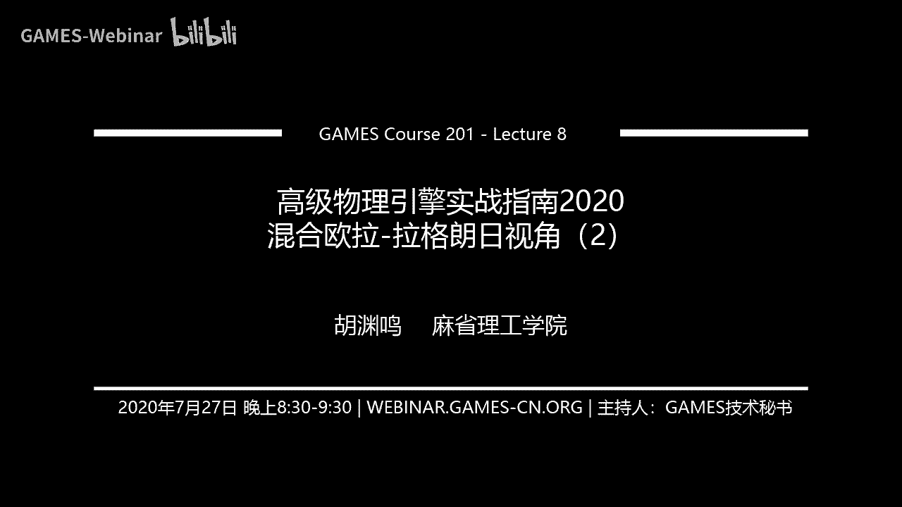
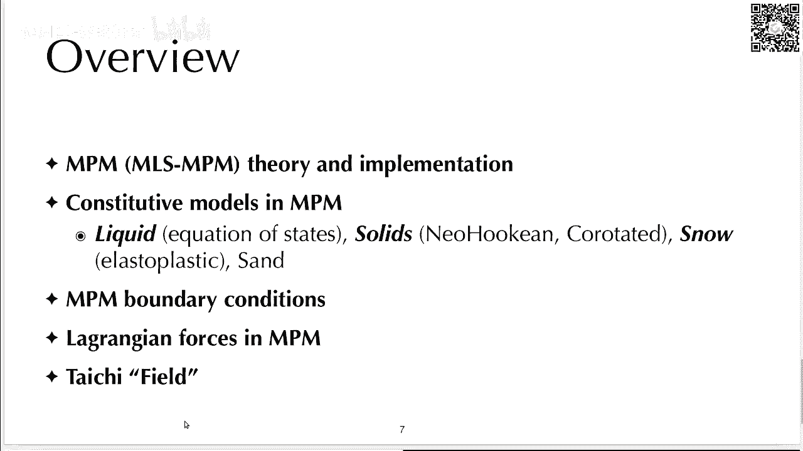
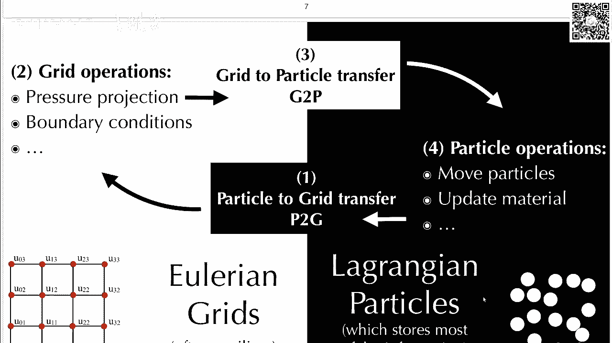
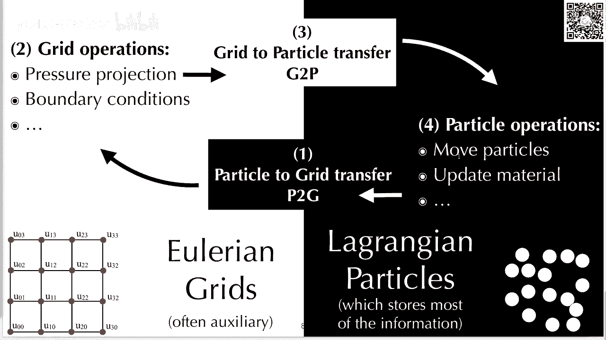
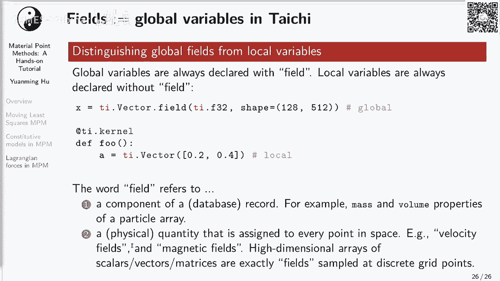

# GAMES201：高级物理引擎实战指南2020 - P8：Lecture 8 混合欧拉-拉格朗日视角（2） 🧪

在本节课中，我们将深入学习混合欧拉-拉格朗日视角的第二部分，重点探讨物质点法的核心理论、实现细节及其支持的各种材料模型。我们将从算法基础开始，逐步讲解变形更新、边界条件处理、本构模型，并介绍太极框架中的重要更新。

## 概述 📋

上一讲我们介绍了混合欧拉-拉格朗日视角的基本概念。本节中，我们将更深入地探讨物质点法，包括其理论推导、简化高效的实现版本（MLS-MPM），以及如何用它模拟弹性体、流体和弹塑性体等多种材料。

## 1. 为什么使用混合视角？ 🔄

欧拉网格和拉格朗日粒子各有优势。为了结合两者的长处，我们需要在两种表示之间转换数据，这涉及到粒子到网格和网格到粒子的操作。在混合方法中，粒子是信息的主体，存储主要的物理信息；欧拉网格则作为辅助，用于计算临时动量或处理压力投影等操作。

## 2. MPM 相关理论 🧮

MPM 和 FEM 一样，都属于伽辽金方法。但 MPM 没有“元素”的概念，因此被归类为无网格伽辽金方法。MPM 中的粒子实际上对应着 FEM 中的高斯积分点。

MPM 的方程也是通过弱形式推导而来。与历史更悠久的 FEM 相比，MPM 较为年轻，高阶格式较少。2013年提出的图形学 MPM 算法相对复杂，而2018年提出的移动最小二乘 MPM 则是一种更简单、高效的格式。

### 2.1 符号定义

为了清晰起见，我们统一符号定义：
*   标量使用非加粗字体，例如 `mi` 表示节点 i 的质量，`vp0` 表示粒子 p 在时间 0 的体积。
*   向量和矩阵使用加粗字体，例如 **vp** 是向量，**Cp** 是矩阵。
*   下标 `i` 表示网格节点，下标 `p` 表示粒子。
*   上标 `n` 表示时间步，例如 **xi^n** 表示节点 i 在 n 时刻的位置。

### 2.2 从 PIC/FLIP 到 MPM

FLIP 是粒子胞元法的一个变种，它额外维护一个矩阵 **C**，记录了粒子周围速度场的变化。其核心步骤包括：
1.  **粒子到网格**：将粒子的质量和动量散射到网格节点。
2.  **网格操作**：在网格上计算速度（动量/质量）并进行压力投影等操作。
3.  **网格到粒子**：从网格节点收集更新后的速度和 **C** 矩阵信息，并更新粒子位置。

MPM 在 FLIP 的基础上做了关键改进：
*   **变形更新**：增加了根据局部速度梯度更新粒子形变梯度 **F** 的步骤。
*   **节点弹力**：在粒子到网格的动量转移中，增加了来自材料内部弹力的贡献项。

在 MLS-MPM 中，我们将变形更新步骤移到了网格到粒子操作之后，这样可以节省内存带宽，因为更新 **F** 只需要用到 **C** 矩阵，而 **C** 正是在这一步计算出来的。

## 3. 关键公式推导 📐

### 3.1 变形梯度更新

粒子的形变梯度 **F** 之所以会变化，是因为局部速度场的梯度 **∇v** 不为零。其更新公式的离散形式为：

**F_p^{n+1} = (I + Δt ∇v) F_p^n**

在 MLS-MPM 中，我们用粒子上的 **C** 矩阵来近似 **∇v**，因此更新公式简化为：

**F_p^{n+1} = (I + Δt C_p) F_p^n**

### 3.2 节点受力计算

节点 i 上来自粒子 p 的力贡献 **f_i**，可以通过将系统的总弹性势能对节点位置求导得到。通过一系列推导（涉及链式法则和微小时间扰动），最终得到公式：

**f_i = -4 V_p^0 P( F_p ) ( F_p )^T ∇w_{ip} / (Δx)^2**

其中，**P(F)** 是第一皮奥拉-基尔霍夫应力，**∇w_{ip}** 是插值函数的梯度。这就是代码中 `4 / (dx*dx)` 系数的来源。

## 4. 边界条件处理 🧱

作为伽辽金方法，MPM 的边界条件必须在网格节点上施加。主要有三种类型：
1.  **粘性边界**：节点速度直接设为零。
2.  **滑移边界**：消除节点速度在边界法向的分量，保留切向分量。
3.  **分离边界**：仅当节点速度朝向边界时，才消除其法向分量；若速度离开边界，则不做处理。

施加重力等外力应在边界条件处理之前进行。对于移动的边界，需要先计算节点相对于边界的速度，施加条件后再转换回来。

## 5. 材料本构模型 🧱

在 MPM 中实现一种材料模型，主要需要两部分：
1.  如何更新材料的变形（形变梯度 **F** 或其相关量）。
2.  如何计算应力 **P**。

### 5.1 弹性体

对于弹性体，如 Neo-Hookean 或 Co-rotated 模型：
*   **变形更新**：直接使用公式 **F_p^{n+1} = (I + Δt C_p) F_p^n**。
*   **应力计算**：根据超弹性模型，应力 **P** 是应变能密度函数 ψ 对 **F** 的导数。例如，Neo-Hookean 模型的应力公式为：

**P(F) = μ (F - F^{-T}) + λ (J - 1) J F^{-T}**

其中 `J = det(F)`，`μ` 和 `λ` 是拉梅参数。

### 5.2 流体

对于弱可压缩流体，常用状态方程关联压强 `p` 和体积比 `J`：
`p = k (1 - J)`
其中 `k` 是体积模量。应力为 **P = -p I**。

直接更新 **F** 并计算其行列式 `J` 可能存在数值不稳定问题。一个技巧是直接追踪和更新 `J` 本身，其更新公式为：
`J^{n+1} = J^n (1 + Δt tr(C_p))`

更简单的方法是使用弹性模型，但将剪切模量 `μ` 设为零，只保留体积模量 `λ`，这样能量函数就只惩罚体积变化。

### 5.3 弹塑性体（如雪）

模拟弹塑性体的关键在于处理塑性变形。我们将形变梯度分解为弹性部分 **F^E** 和塑性部分 **F^P**：**F = F^E F^P**。能量函数只定义在弹性部分上。

一个常用的（特别在图形学中）方法是采用方盒屈服准则：
1.  先像弹性体一样更新 **F**。
2.  对更新后的 **F** 进行奇异值分解：**F = U Σ V^T**。
3.  对奇异值矩阵 **Σ** 进行夹紧操作，将其对角线元素限制在区间 `[1-θ_c, 1+θ_s]` 内，得到 **Σ̂**。其中 `θ_c` 和 `θ_s` 是压缩和拉伸的屈服阈值。
4.  用夹紧后的奇异值重构弹性形变梯度：**F^E = U Σ̂ V^T**。
5.  被“夹掉”的变形部分则被归入塑性变形。

## 6. MPM 中的拉格朗日力 🕸️

拉格朗日力方法使用 MPM 粒子来表示 FEM 网格的顶点。这样，粒子就不再需要存储形变梯度 **F**，而是使用 FEM 的势能模型来计算力。这种方法结合了 MPM 处理自碰撞的优势和 FEM 避免数值断裂（粒子因距离过远而失去相互作用）的优点。

## 7. 太极框架重要更新 🚀

太极框架已更新至新版本，一个重要变化是弃用了 `tensor` 概念，改用 `field`。
*   `field` 代表全局变量，可以是标量、向量或矩阵场。
*   局部变量则使用 `ti.var`, `ti.Vector`, `ti.Matrix` 等定义。
*   这使全局变量和局部变量的区分更加清晰。

例如，定义一个向量场：`particle_x = ti.Vector.field(3, ti.f32, shape=n_particles)`
定义一个标量场：`particle_m = ti.field(ti.f32, shape=n_particles)`

## 总结 🎯

本节课我们一起深入学习了物质点法。我们从其理论基础和简化高效的 MLS-MPM 实现讲起，详细推导了变形更新和节点受力的关键公式。接着，探讨了三种边界条件的处理方法，并介绍了如何使用 MPM 模拟弹性体、流体和弹塑性体等多种材料模型。最后，我们了解了 MPM 中拉格朗日力的应用以及太极框架向 `field` 概念的重要更新。掌握这些内容，将帮助你更深入地理解并实现现代物理引擎中的高级模拟技术。