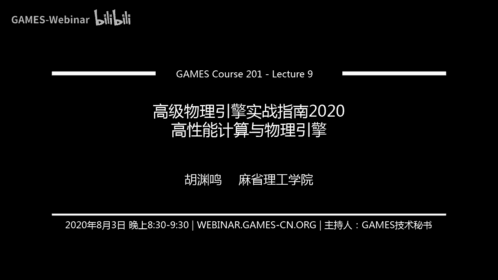
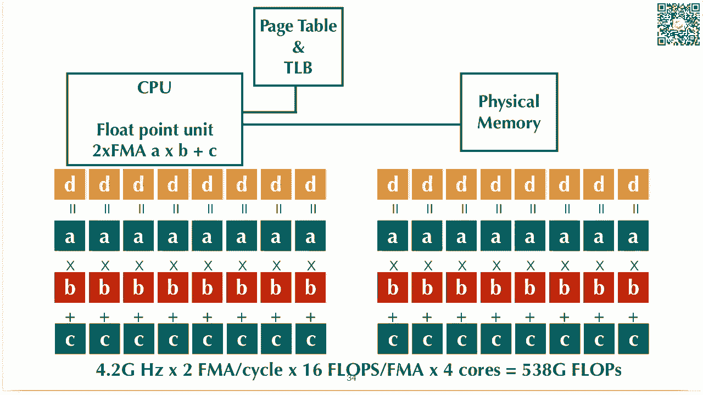
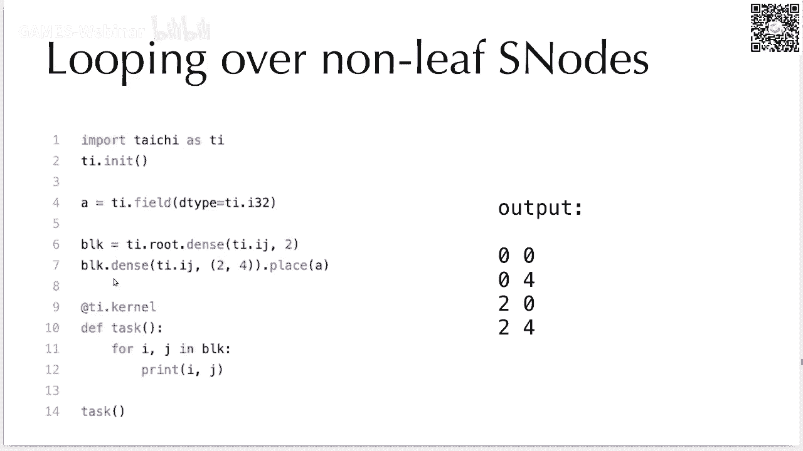
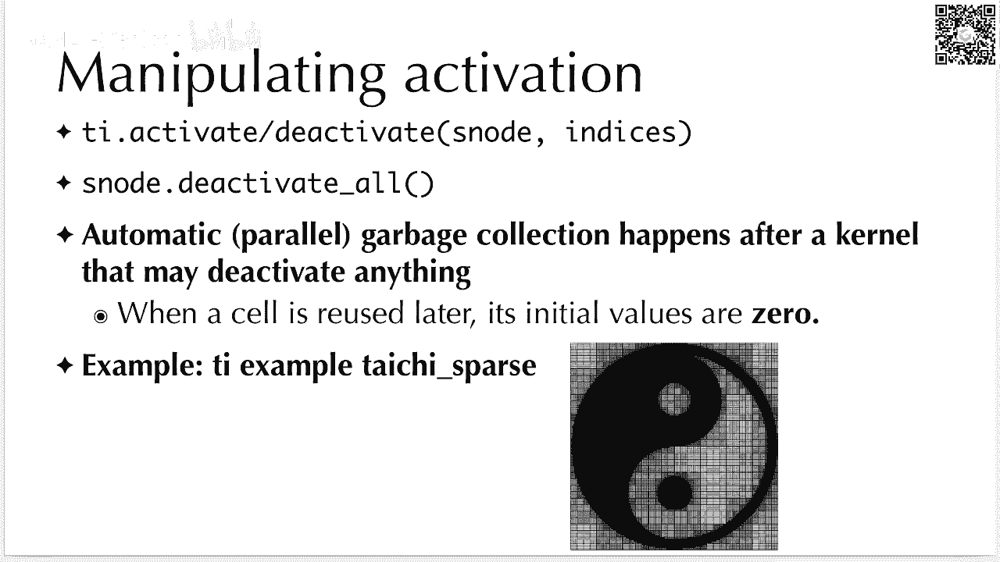

# GAMES201：高级物理引擎实战指南2020 - P9：Lecture 9 高性能计算与物理引擎 🚀

在本节课中，我们将要学习高性能物理模拟的核心概念与技巧。我们将探讨现代计算机体系结构如何影响程序性能，并学习如何利用太极（Taichi）编程语言的高级特性来优化物理引擎，使其运行速度提升数倍甚至数十倍。

---

## 概述：性能优化的重要性

在计算机图形学中，我们追求物理效果的真实性，有时会牺牲速度。例如，一个模拟可能需要从实时变为离线渲染，每帧耗时数秒甚至数分钟。然而，即使每帧耗时十秒，这也是经过大量优化后的结果。高性能计算技巧对于实现这样的性能至关重要。

上一节我们介绍了物理模拟的基本概念，本节中我们来看看如何通过底层优化来大幅提升性能。

---

## 第一部分：现代计算机体系结构

要编写高性能程序，首先需要理解程序运行的硬件环境。现代计算机的体系结构与经典的冯·诺依曼架构已有很大不同。

### 内存层次结构与缓存

现代CPU计算速度很快，但内存的带宽和延迟往往跟不上。为了解决这个问题，硬件引入了多级缓存。

以下是内存层次结构的关键组成部分：
*   **寄存器**：速度最快，容量最小，位于CPU核心内。
*   **L1缓存**：速度很快，容量较小（例如32KB），每个CPU核心独享。
*   **L2缓存**：速度较快，容量较大（例如256KB），每个CPU核心独享。
*   **L3缓存**：速度一般，容量大（例如每核心1.5-2MB），所有CPU核心共享。
*   **主内存**：速度慢，容量大（例如32GB），延迟可达数百个时钟周期。

**公式**：`CPU时钟周期数 ≈ 计算时间 + 内存访问时间`。在现代程序中，内存访问时间往往是主要瓶颈。

### 局部性原理

提高性能的关键在于提高数据的局部性，减少对慢速主内存的访问。

局部性分为两种：
1.  **空间局部性**：程序倾向于访问相邻的内存地址。例如，顺序访问数组元素。CPU的硬件预取器会检测这种模式并提前加载数据。
2.  **时间局部性**：程序倾向于重复访问相同的内存地址。例如，在循环中反复使用同一个变量。尽可能将数据保留在高速缓存或寄存器中。

**核心概念**：`Working Set（工作集）`。指一个计算内核频繁访问的数据集大小。如果工作集能完全放入L1缓存，性能将极大提升。

### 案例分析：缓存行与访问模式

程序性能并非只与指令数量相关，更与内存访问模式密切相关。内存访问以`缓存行`（通常为64字节）为单位。

考虑以下访问数组的代码：
```c
for (int i = 0; i < N; i += stride) {
    sum += a[i];
}
```
当`stride`为1、2、4、8时，尽管循环次数减少，但运行时间几乎不变。因为每次访问都会加载整个64字节的缓存行。只有当`stride`大到可以跳过整个缓存行（例如16个int，即stride=16）时，需要传输的数据量才会减少，性能才会提升。

这个例子表明，对于`内存带宽受限型`程序，其运行时间主要由需要从主内存传输的数据量决定，与计算量关系不大。

### CPU计算能力

现代CPU通过多种技术提升计算吞吐量：
*   **超标量**：每个时钟周期可以发射多条指令。
*   **乱序执行**：动态调整指令顺序以隐藏延迟。
*   **向量化**：使用SIMD指令（如AVX2）一条指令处理多个数据。

**公式**：`理论峰值FLOPS = CPU频率 × 每周期发射的FMA指令数 × 每个FMA的向量宽度 × 核心数`。
例如，一个4.2GHz、4核的CPU，每周期发射2条AVX2 FMA指令（每个处理8个单精度浮点数），其理论峰值约为 `4.2G × 2 × 8 × 2 × 4 = 538 GFLOPS`。



然而，由于内存带宽限制，实际程序中很难达到理论峰值。一个高度优化的稠密矩阵乘法可能达到较高百分比，但大多数程序能达到10%-20%的峰值性能就已非常出色。

### 性能瓶颈分析

一个关键数据揭示了瓶颈所在：现代CPU每个核心每秒钟需要的理论数据带宽（基于其计算能力）可能是内存系统能提供的实际带宽的**100倍**。这巨大的差距必须由缓存系统来弥补。因此，优化内存访问模式、提高缓存命中率是性能优化的重中之重。

**总结**：理解内存层次结构、局部性原理和CPU微架构是编写高性能代码的基础。计算远比数据通信“便宜”，优化内存访问是提升性能的关键。

---

## 第二部分：太极高级编程技巧

掌握了硬件知识后，我们来看看如何在太极中应用这些知识来优化物理模拟程序。

### 结构化节点：灵活控制内存布局

太极通过`结构化节点`来定义数据的内存布局。这允许我们在不修改计算内核代码的情况下，尝试不同的数据排布方式，以找到最适合当前访问模式的布局。

最基础的SNode是`dense`。它定义了一个稠密的多维数组。
```python
# 定义一个4x8的稠密标量场
root = ti.root
dense = root.dense(ti.ij, (4, 8))
field_a = dense.place(ti.field(ti.f32))
# 访问方式：field_a[i, j]
```
其内存布局是行优先的。

我们可以嵌套SNode来实现分块布局，这有时能更好地利用缓存。
```python
# 定义一个2x2分块，每个块内是2x2的布局
root = ti.root
block = root.dense(ti.ij, (2, 2)) # 外层2x2分块
pixel = block.dense(ti.ij, (2, 2)) # 内层每个块2x2
field_b = pixel.place(ti.field(ti.f32))
```
此时，`field_b`在内存中是按块连续存储的。

### 数组结构体与结构体数组


这是两种常见的数据组织方式，对性能有显著影响：
*   **数组结构体**：`Array of Structures`。例如，一个粒子数组，每个元素是包含位置、速度的结构体。**优点**：随机访问友好，数据封装性好。**缺点**：顺序访问时，如果只用到部分字段，缓存利用率可能不高。
*   **结构体数组**：`Structure of Arrays`。例如，将所有粒子的x坐标放在一个数组，y坐标放在另一个数组。**优点**：顺序访问时缓存利用率高，易于向量化。**缺点**：随机访问时，如果字段多，缓存行利用率可能极低。


在太极中，可以轻松定义这两种布局：
```python
# AoS 布局
particle = ti.root.dense(ti.i, N)
pos = particle.place(ti.Vector([ti.f32] * 3)) # 一个节点放置向量
# 内存: x0,y0,z0, x1,y1,z1, ...

# SoA 布局
root = ti.root
pos_x = root.dense(ti.i, N).place(ti.field(ti.f32))
pos_y = root.dense(ti.i, N).place(ti.field(ti.f32))
pos_z = root.dense(ti.i, N).place(ti.field(ti.f32))
# 内存: x0,x1,x2,... y0,y1,y2,... z0,z1,z2,...
```
选择哪种布局取决于具体的访问模式。

### 稀疏数据结构

许多物理模拟（如烟雾、沙子）只在空间的一小部分区域活跃。为整个空间分配稠密网格会浪费大量内存和计算。太极提供了`pointer` SNode来构建稀疏数据结构。

`pointer` SNode的每个单元是一个指针，可以指向一个子数据结构，也可以为空。这允许我们按需分配内存。
```python
# 定义一个两层稀疏网格
root = ti.root
block = root.pointer(ti.ijk, (16, 16, 16)) # 顶层16x16x16指针块
cell = block.dense(ti.ijk, (8, 8, 8)) # 每个指针指向一个8x8x8的稠密块
field = cell.place(ti.field(ti.f32))
```
在这个结构中，只有被激活的`block`才会分配其下层的`dense`块内存。




**核心操作**：
*   **激活**：对某个索引进行写操作，或调用`ti.activate()`，太极会自动分配所需内存。
*   **反激活**：调用`ti.deactivate()`，太极会释放内存。
*   **稀疏迭代**：`for i, j, k in field:` 只会遍历已激活的单元。
*   **清空**：`field.deactivate_all()` 反激活所有单元。

使用稀疏数据结构可以极大节省内存和计算量，特别适用于3D大场景模拟。太极自动处理了稀疏结构的内存管理和垃圾回收，使得编写稀疏模拟程序与编写稠密程序几乎一样简单。

### 使用偏移量

太极支持为`place`节点设置偏移量，从而实现负下标访问，便于实现无边界或中心在原点的模拟网格。
```python
root = ti.root
dense = root.dense(ti.ij, (1024, 1024))
# 设置偏移，使得索引范围变为 i: [-512, 511], j: [-256, 767]
field = dense.place(ti.field(ti.f32), offset=(-512, -256))
```

---




## 总结


本节课中我们一起学习了高性能物理模拟的两大支柱：硬件体系结构知识和高级编程优化技巧。

首先，我们深入了解了现代CPU和内存系统的特点，认识到内存访问是主要的性能瓶颈。通过理解缓存、局部性原理和缓存行，我们知道了如何通过优化数据布局和访问模式来提升性能。

其次，我们学习了太极语言提供的高级特性来实践这些优化：
1.  利用**结构化节点**灵活定义内存布局，在不改动计算逻辑的情况下探索最优数据排布。
2.  理解**AoS与SoA**的优劣，并根据实际访问模式进行选择。
3.  使用**稀疏数据结构**来大幅减少对非活跃区域的内存和计算消耗，这对于大规模3D模拟至关重要。
4.  利用**偏移量**方便地处理网格边界。


将这些技巧应用于物理引擎开发中，可以轻松实现数倍至数十倍的性能提升，使得在单台机器上处理十亿级元素的模拟成为可能。在接下来的作业中，请尝试运用这些知识来优化你的程序。