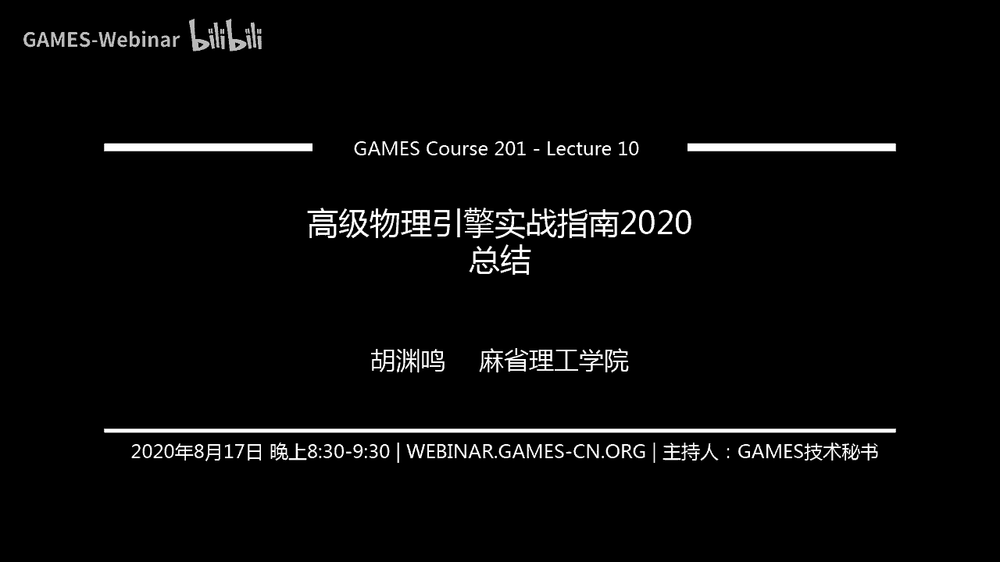
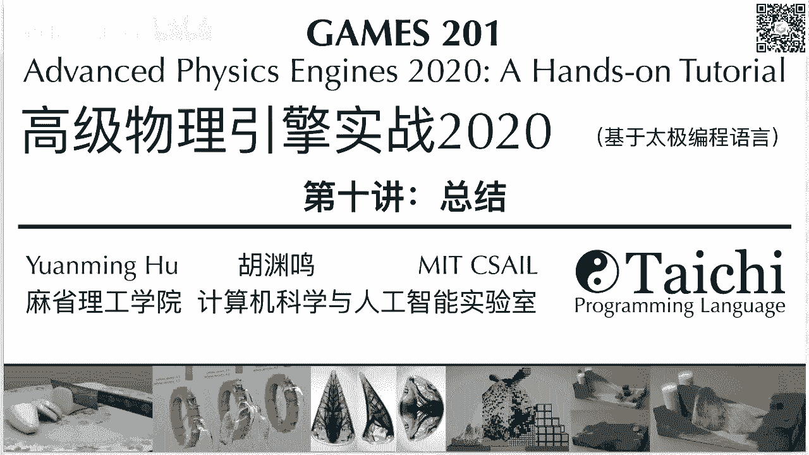
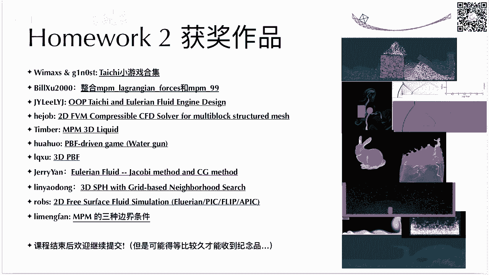
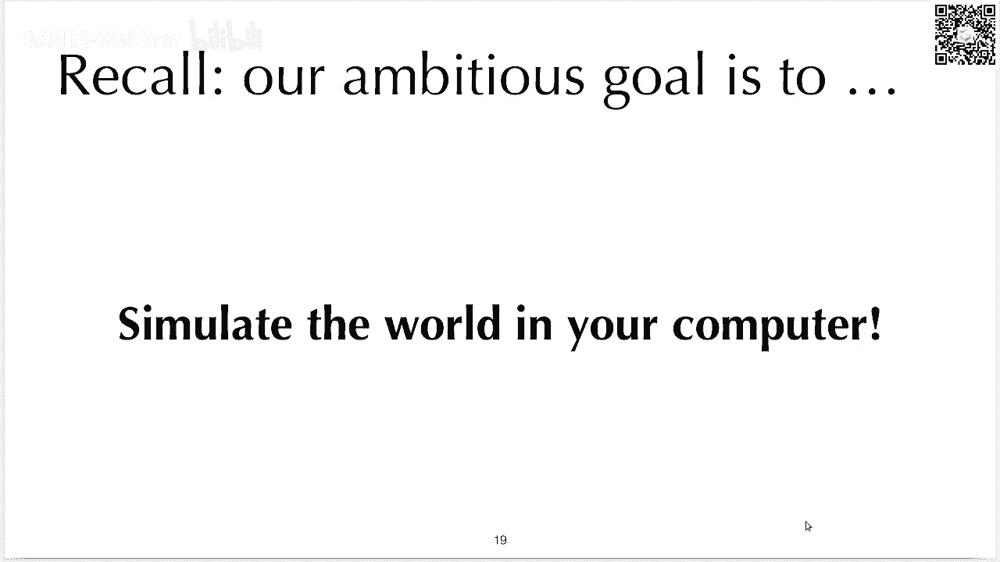
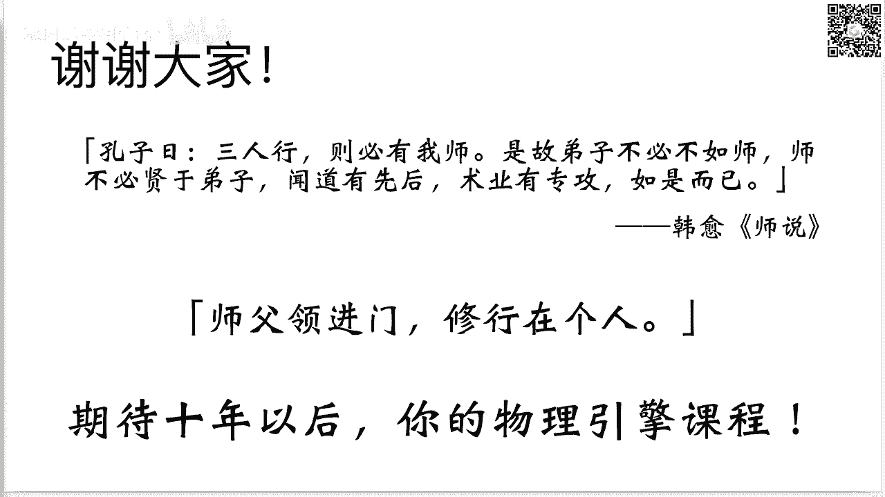
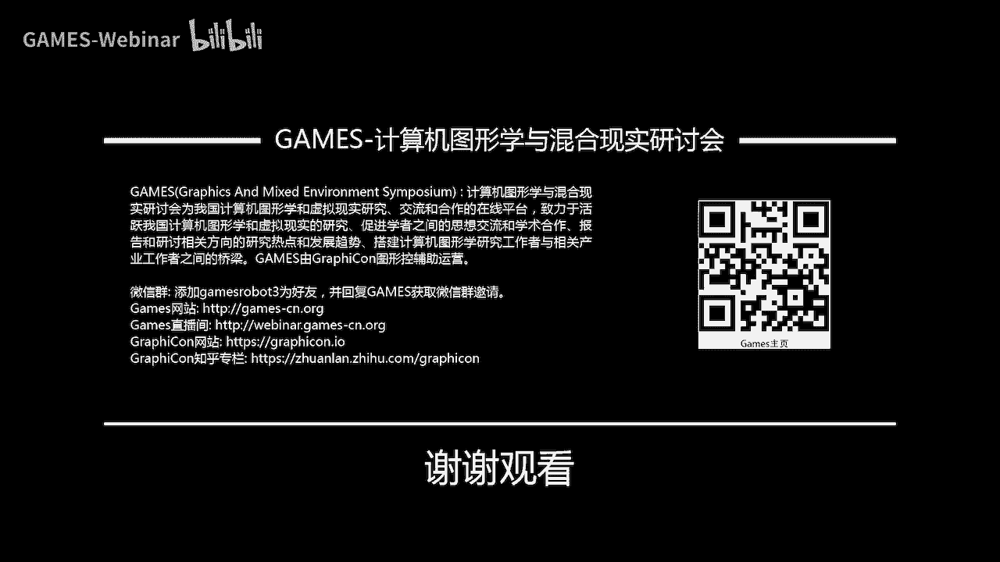

# GAMES201：高级物理引擎实战指南2020 - P10：Lecture 10 总结 - GAMES-Webinar - BV1ZK411H7Hc

欢迎大家来到我们课程的最后一讲，不知不觉啊，感觉时间过得真的是非常快的，从我们第一讲到今天，其实才过去了两个多月，应该差不多三个月，基本上在北美这边三个月，时间差大概就是一个暑假。

所以大家相当于用一个暑假的时间，基本上学完了这门课程，真的还是非常不容易的。

ok所以在讲之前，我们首先还是要炫耀一下，这个作业二的各种获奖作品，然后虽然这次作业二真的时间非常紧，然后有很多同学反映正好遇上期末考试，有很多同学反映正好工作上事情很多。

但是还是有12位同学提交的作品，然后当然我们会给这12位同学，都寄一份精美的纪念品啊，就是所谓的太极茶杯呃，这次时间比较紧，还没有来得及去写一个知乎的知乎的文章，不过后面会找到时间的话，我会去写一写。

让更多的同学，特别是课程以外的同学，能够了解到大家在这门课上做出来的，这些精彩的程序啊，欢迎大家课程结束以后继续提交，但是如果你后面提交的话，那可能就得等比较久才能收到截屏，因为我们课程结束以后。

课程的整个组织其实会更加的松散一些。

我们还是要安利一下这个china vr，上面的太极竞赛啊，然后之前有很多同学反映报名表太长了，然后报名表成为了一个报名了很大的阻力，所以我们后来又做了一个，一分钟完成报名的报名表。

这个报名表就非常简单了，如果大家可以呃点开这个链接，或者去打开二维二维码，其实只有四个问题，其中只有三个问题是必填的，希望大家都能去呃尝试报名一下，然后我们奖项设置还是非常的丰厚的，有特等奖一个。

一等奖三个，二等奖六个，然后三等奖和优秀奖若干，基本上你只要完成一个合格的提交，都会拿到某种奖项，如果你做的非常好的话呢，当然还能拿到特等奖或者一等奖，这样的很不错的奖项，竞赛的网站我也放在这了呃。

还是请感兴趣的同学能够多多参加好，那在正式开始讲今天的内容之前，首先要恭喜一下各位，因为大家掌握了各种各样的新技能，这些技能包括一门新的编程语言，基于物理的模拟的各种呃各种算法，然后各种数值线性代数数。

各种数值线性代数的方法，然后还有一些像现代计算机的处理器微架构啊，类型层级啊，并行编程，g pu编程，各种高性能计算，一些入门的知识，还有吸收入结构和口味编程，这两个太极的独特的功能。

那么我觉得能把这些知识都掌握，甚至都入个门，其实还是要花不少精力的，然后这门课难度真的是不小的，能坚持到最后的都是勇者，大家应该给自己鼓个掌，然后我也给大家送上一个太极人专用点赞来啊，感谢一下大家。

也恭喜一下，大家好，那么我们今天讲什么呢，今天主要是我的一些私货了，就是说我在建设，我在呃构建屋顶擎和太极这个项目的时候，所学到的知识，如果说让我必须只能用一个词来概括。

我这10年来从这个事情里面学到的事情的话，这一个词就是simplicity，简单简单很好，然后我后面会呃来论述为什么简单是好的，然后讲完这个以后，我会讲讲物理琴，简单讲讲物理引擎的未来。

然后简单讲讲自己我自己在课程中的收获，然后最后感谢一下呃，各方面为这门课程提供支持的老师和同学，刚才提到，如果说只让我用一个词概括，我在物理琴和太极这个项目里面，各种各样的项目里面学到的东西的话。

这个词一定是simplicity，就是简单性，那么说到这个simplicity，很多同学可能还在学校里面读本科，或者在我不知道有没有在读中学的同学，我猜大部分同学应该是在读本科。

但是如果有读还在读中学的同学，可以在呃公屏上面打一个一，证明一下自己的存在，ok，当然你如果在基础教育或者在本科阶段的教育，说白了学生最重要的一个事情是，你你得把考试考过对吧，然后考试的时候。

你要去做的事情是证明自己会某种方法，你需要证明自己会，但是呢当你去本科毕业以后，你去工作，或者你去读ph d所研究或者做一个工程的时候，这个时候你往往需要的最重要的能力，是证明自己能找到好的方法。

当你离开学校以后，当你离开考试的环境以后，有很多的情况会改变，第一个事情会改变的事情，就是说你有自己选择方法的权利，第二个很重要的改变因素是你需要与他人合作，然后这两个因素使得找到一个好方法。

非常的重要，往往在你脱离了学校，学校这个环境以后，一个很重要的事情是用哪种方法并不重要，重要的是系统性的解决问题，解决问题是最重要的，方法不重要，一天只有24个小时，这个看起来三岁小孩都懂。

但是其实你要意识到自己时间是有限的，这个其实并没有那么容易，然后聪明的人都是一样聪明的，这句话不是我说这句话，是有一次我和杨奇志老先生吃饭的时候，然后他给呃一班的同学说的，就是说呃聪明的同学都是一样的。

聪明的，你不可能指望说有一个其他的人比你聪明十倍，它不可能长十个脑子对吧，你这个大脑毕竟还是一个生物的构造，它不像这个微电子里面的这个摩尔定律一样，它可以18个月transisters翻一倍。

它不会怎么增长的，你这个大脑容量就是有限的，在时间和脑力都非常有限的情况下，我们必须采取的一个措施是，用简单可行的方法去解决大部分简单的问题，因为世界上有很多难题是真的非常复杂的，你必须用简单的方法。

用最少的时间把简单的问题解决了，才会有时间去解决真正复杂的问题，别把时间都浪费在解决简单的问题上面，那你就没有时间去解决真正复杂的问题了，有影响力的创新往往会伴随着复杂性的减少，这个其实也很有意思。

很多同学觉得新的东西一定会更加的复杂，但往往并不是这样，那他你会觉得它更加复杂，但是你在接触到他之前，发明他的人，往往已经对他进行了最大程度的简化，这个其实呃有点像日本文化里面的，一个是一个宗旨。

就是说不要给他人带来麻烦，我在日本待过小半年，然后我在那边，这个他们的文化里面有一个非常有意思事情，就是千万不要给他人带来麻烦，但是这个不给他人带来麻烦，有很多极端的做法，这边只是呃overall。

大家体会一下，就是说你要发明一个新的东西，必须要让你的用户能够轻易地使用它，你造出来的东西必须能够啊，必须是简单的，必须不能给他人带来麻烦，如果说你写了一个paper，你发明了一个新的算法。

没有人能够正确使用它，太难以使用，那么就那你这个paper指它的呃，能产生impact是非常非常有限的，如果你说你写了一份代码，非常难以使用，非常难以读懂，那么如果你在和他人合作的时候。

你这份代码可能根本就不会出现在，最后的代码库里面，因为reviewer会把你代码cu掉，因为他不懂你这个到底在干啥，即使你有幸的这份代码能够进入，进入到最终代码库，最后它的维护测试。

包括它的正确性都非常非常难以保证，ok那么刚才说到简单性是好的，反过来说就是复杂性是坏的，那为什么复杂性很坏呢，因为首先像我刚才说的那样啊，如果你有一个非常复杂的东西，那么其他人不能理解你在做什么。

你要知道其他人不见得和你有一样的背景知识，哪种东西其他人不一定懂，所以说你如果刚提出来一个非常复杂的东西，那没有人能懂这个做的东西，它的产生影响力就非常非常的小，然后啊一个复杂的东西你要把它int起来。

你要实现它非常的缓慢，然后往往你非常难以feel quickly是什么，叫feel quickly，就是快速失败，为什么要快速失败呢，因为你如果做科研的话，你就会知道99%的i d。

99%的想法都是不work的，那剩下的1%里面，可能有90%是被前人尝试过的，你只有可能剩下的只有1‰的，这些想法是能work，那你必须要去在你精力是有限的情况下，并且大家都一样聪明的情况下。

你如果还想能做出有意义的工作的话，一个非常重要的事情，就是能快速的知道这个方法，workb，你必须要能够fail quickly，如果你有一个非常复杂的想法，它实现起来非常费时间。

你很难非要quickly，因为你不知道到底是自己实现对，实现错了还是这个方法本身，不过你很难区分到底是方法复杂，还是自己没有实现好，这个其实是复杂方法的原罪，这个就引出了第三点，复杂的方法更容易出错。

而且出了错以后，你很难去分析它，因为它其中的成分太多了，你不知道到底是哪一部分搞错了，很多复杂的simulation的算法，你可以去看看很多复杂的非常非常复杂，simulation算法。

它这些论文虽然最后能发表在secret上面，但是随着时间推移，很快大家就忘了这个算法，因为太复杂，没有人能够正确实现的，就算你是你，就算你实现代码能力足够强，你要知道。

看着一个paper实现这个算法其实是非常难的，如果你不给代码的话，因为你如果实现了半天，发现他不会，那到底是这个paper有问题，还是说实现的不对，还是说自己对paper的理解有问题。

还是说各种各样其他的原因，你很难知道到底是什么原因，导致这个东西不那么啊，后面我们会提到这个，其实你甚至可以说这个是不科学的，因为你不能证伪它好，然后复杂性还有一个很坏的事情。

就是说你有一个很复杂的算法，不管是你手写也好，不管是编译器帮你编译也好，它都非常难以高性能的实现，这个就其实很有意思，大家会觉得复杂的算法往跑的更快对吧，但是其实实际情况下并不是这样的。

因为你复杂的算法首先你得实现，对对吧，你假设你能把它实现对，还记得上一讲吗，上一讲我们提到对一个算法，你如果考虑上计算机体系结构，考虑上各种高性能计算的各种技巧，你是能够把它提高十倍乃至20倍的速度。

但前提条件是什么，前提条件是这个算法足够简单，如果说你给我一个一段普通的你随手写的程序，我可以花一些时间，我重写一遍，可能能快个十倍，20倍，这些一般都是可行的，但是如果说你给我一个非常复杂的程序。

我即使知道我花很多时间，我能让他快十倍20倍，我可能都没有动力去做这个事情，为什么，因为太复杂了，太烦了哈，大家懒得帮你去做性能优化，所以啊你要实现一个高级的算法，它首先得是简单的，它不能太复杂。

复杂了以后没有人能知道怎么去把他高兴的话，因为高性能本身就是一个复杂性，然后人能handle的复杂性是有限的，如果你这个算法本身非常复杂，那剩下来的能够接受的复杂性就非常小。

那么代价就是你在剩下来的这个你的脑力里面，你其实能够用在优化它的，这个部分是非常非常少，所以最后导致结果就是复杂的系数，数据结构也好，自适应数据结构也好，复杂的网格也好，然后复杂的数值格式也好。

最后都会败在暴力解法之下，什么是暴力解法，就是稠密数据结构啊，一阶精度的这个有限元或者呃npm，然后呃当然这不绝对了，有限元大家还是有的时候会用很高阶精读的，然后但是另外一种方法就是离。

就用一阶精度的元素，你把它分辨率吹得很高很高很高，虽然在鉴定意义上这个可能不太行，但实际情况下往往就不错了，你特别是在你写physical ver的时候，你如果把你sover搞得非常复杂。

那编译器也会很难优化你的代码，你要知道编译器，它也是会遵循一些规则去分析你的程序的，如果你程序非常复杂，非常难以去分析的话，那编译器也会很confuse，他不知道你这个代码在干啥。

然后生成的代码质量也会受影响，ok那么既然复杂性这么坏，为什么大家还会把东西搞得非常复杂呢，大家可以想一下这个问题，答案或许出乎我们的意料，答案是什么呢，because it's way。

easier to be complicated than to be simple，搞出复杂的方法比搞出简单的方法简单多了，听起来可能有一点矛盾啊，就是复杂的方法比简单的方法容易搞出来。

这个可能在英文语境底下更容易说，在中文里面反而听起来有一点有一点令人迷惑，但是总体的意思就是说，对于大部分人来说呃，如果你家精力有限，然后经验有限，各种情况，各种资源都有限的情况下。

你搞出来的方法往往是比较复杂的，而不是简单的方法，ok我们来看一看，我们来看几个具体例子，为什么有很多情况下，大家会喜欢把东西搞得非常复杂，那么第一个动机就是说证明自己很聪明，这个其实是我们的教育里面。

它存在的一个很有意思的现象，就是说我需要通过一些呃复杂的方法，来证明自己和其他人不一样，证明自己嗯很聪明，因为大家的直觉就是说哇你懂这么难的东西，你一定很聪明吧对吧，这个在学校里面或许是一个好的注意。

你可能通过做一些难题，或者通过做一些大家都不懂方法，显得自己独一无二，鹤立鸡群，然后嗯很聪明，你在学校里面或许这是一个好主意，但是实际上当你需要去和其他人交互的时候，这个几乎永远不是一个好主意。

为什么呢，因为你如果去看一看，你做的项目的比这个更大的图景，你从更大图景上面来看，你的这个项目或多或少的他的其中的关键因素，就是你能不能和其他人有效的沟通，你的想法能不能从你的脑子里面。

精确传输到另外一个人的脑子里面，如果是一个简单的方法，这个这么简单方法的沟通已经很challenging了，已经很难了，沟通是最难的事情，沟通比写代码难多了，然后简单方法的沟通已经很难了。

更何况一个很复杂的方法，所以一旦你要和他人沟通的时候，going complicated绝对不是一个好的主意，一定要把事情简化简化简化再简化，我记得有一个研究说，人的语速一秒钟只能传大概十个bt。

也不知道十个bit，反正这个速传输速率是非常非常低的啊，所以呃这就是为什么简单精炼的一些方法，能够流传得很广，ok那第二个重击呢就是show off the amount of work。

证明自己做了很多东西，我记得这个很有意思，就是说有一些课程项目他会期末考试要求你，比如说写一个五页的报告，或者写个十页的报告，结果你搞了一个方法，你发现诶这个报告好像只能写一页，那怎么办呢。

我是不是可以把我的方法搞复杂一点，这样我就能凑到五页或者十页了，你看这个学校里的学生往往会有这样的思维，就说我老师要求的这个必须得写实验，这个方法必须要有复杂性，呵呵实际情况下呢。

你从学校里面大家可能更加的过程主义，大家看你这个解决问题的过程，因为它的目的是让你学会解决问题的方法，而不是让你把问题解决，但是当你脱离了老师，脱离了学校里面的环境，脱离了这个考试的设定以后。

你去真正解决实际问题的时候，who cares，谁在乎你用什么方法去解决问题呢，你只要把问题解决好了就行了，你只要把在合乎合乎道德，合乎逻辑的情况下把问题解决好了就行了。

所以大部分专家并不需要去show off，你的amount of work，并不需要去展示你做的你都做了什么，o那么第三个把事情搞得非常复杂的动机，就是隐藏隐藏错误，然后这个或许也有点反直觉。

但这个逻辑其实也很容易理解，因为有些人会这么想，有些人觉得呃我做的这个工作里面可能有错误，那怎么办呢，我把它搞得非常复杂，这样就没有人证明我是错的，因为没有人知道，没有人理解我这个东西到底在干啥。

所以我就是对的哈，这个逻辑大家能理解吗，这个其实也是一个很很有意思的一个逻辑，说起来很讽刺，但是有些时候势必会有人这么做的，这个其实当你这么想的时候，那你其实已经开始违背科学的精神了。

因为有一个表述就是，卡尔波普尔对于科学的定义在于，就是科学和其他的，应该怎么说科学的独一无二之处，或者说科学必须满足一个特性，就是它是可证伪的科学，你如果在科学的体系里面去论证一个东西。

那你怎么说明它是科学的，就是说如果我这个argument，我这个论断是错的，你是可以去证明他的，你是可以去证明他是错的，如果说你把一个会搞得非常复杂，它既不能被证真，也不能被证伪。

那这个东西它就是not even wrong，连错了都不是，它不属于科学讨论的范畴对吧，ok那么第四个把东西搞得非常复杂的，原因是希望和prior work区分开来。

然后呃这样你的paper就可以被接收，要不然reviewer你写了一篇paper，然后方法非常简单，之前可能已经有人做过了，然后呃你的reviewer就会说啊，你这个方法和之前某某某paper做的一样。

你这个paper我要去了，所以呢这种情况下，有些同学啊，特别是一些呃做研究的同学，他可能会把方法搞得非常复杂，比如说这边打个补丁，那边打个补丁，使得它看起来和之前的方法不一样。

然后review在考察这个方法，到底之前有没有做过的时候，就看诶这个方法好像非常复杂，那可能之前确实没有人做过吧，那么至少在创新，创新性上面就不会再来质疑你了，那这么做可不可以呢，这么做当然是可以。

如果你的目的就是让你的论文被接收的话，这么做是完全可以的，那如果说你的目的就是我读一个ph，我的目的就是尽快的毕业，然后呃我要发表足够数量论文，这么做是完全可以的，也有很多人确实就是这么做的。

但是如果说你真的希望，你的文章有很大的影响力，那最好还是别这么做，因为这些东这些文章做出来，说白了大家就叫做incremental work，资金量性的工作，或者更难听一点的说法。

就是如果你把这个推到极致的话，那大家就叫他灌水了，就是说呃我把一个方法这边修修改一下，里面修改一下，把它搞得非常复杂，本身的这个原来想法的这个精简性就没了，然后就搞出来一个非常复杂的算法。

这种paper投了也能中，但是呃一般来说很难产生很大的影响力，那么第五个motivation，为什么大家会是把这个想法搞得非常复杂的，就是懒得去简化它啊，懒得去简化它，这个其实是很有意思的一个事情，呃。

因为一个想法诞生的过程，往往可能是20%的时间是在想这个东西，然后后面80%时间是在去简化，你这个东西，你可能20%时间做个雏形，我就做一个写上一坨乱七八糟的代码，然后花80%的时间去简化它。

使得得到一个最小份的代码，它还能够工作对吧，那如果你只花钱买20%时间，你就只用了别人1/5的时间啊，你也能得到一个非常复杂的算法，ok然后这种情况下，如果把百分之后面80%忽略掉的话。

那就相当于懒得去优化，那这样其实也是可以的，但是你如果希望别人能够理解，希望你这个呃从长远角度来看，你这个工作很有影响力，那最好还是花一点时间去简化你的想法，然后最后一个很有意思的事情是就是呃。

之所以很多人会把事情搞得非常复杂，是因为audience being too nice to tolerate，这就是一个很有意思的例子，就是我记得当时我在姚班上一门课，我记不得是什么课。

但是这个课的老师就是说，如果你的方法非常复杂，我们看了半天也不知道它是对的还是错的，我们会当做错了来处理，这个，其实在大部分情况下呃，甚至有些人在考试的时候会故意写出来，写出来一坨显得自己好像懂得很多。

然后呃阅卷老师可能会觉得诶，这个同学写了这么多，我我虽然不知道他是对的还是错的，好歹给他个辛苦分吧，给他个比如说十分，给他个两三分，这样其实就是其实纵容了这种，把事情搞得非常复杂的这些想法。

但是这个这种事情只会在学校里面出现，在实际的过程中，没有人会appreciate你这种做了很多工作，最后没有人能够理解的这种事情啊，对我记得当时那个老师就是说，如果说你不会，那你就写你不会。

我会给你三分，但是你不要说你不会，你写上一大坨，这样我作为阅卷人，我也浪费很多时间，你也浪费了很多时间，ok对，所以你看其实大家有各种各样的动机，会去把事情搞得复杂，然后呀还有一个有意思的事情是。

大家会觉得用简单方法的人很傻，是这样吗，其实并不是，绝对不是这样，实际上世界上最聪明的人都知道，把事情搞简单的重要性，我们来看看，爱因斯坦说任何事情都应该被搞得呃，as simple。

as possible，but not simpler，就是说，我应该把我们应该把任何事情都搞得，尽可能的简单，这其实是物理学里面的一个原则，就是说你得相信，这个世界被一些简单的定义来描述。

要不然你都很难去研究这个世界，这个是c加加之父，他在cpp com，cpp com是一个c加加会议，他在这个会议上面给过很多的talk，很多都是关于简单性，因为c加加，现在已经变成了一个非常复杂的语言。

然后他现在呃，当然可能很早，大家就意识到这个语言变得太复杂了，然后我们应该把它变得简单一点，然后再加下支付物流，发过很多这样的演讲，这个是他的演讲中的一个叫做make simple task。

simple，把简单这个怎么说，用简单的方法解决简单的tasks，用简单的方法解决简单的任务，being too clever is not clever，表现的太聪明，并不是聪明人的做法，为什么呢。

他举了一个很有意思的例子，我今我很喜欢这个例子，他就说调试一个程序比写程序还要难两倍，因为大家写程序的时候，大部分时间并不是在敲键盘上面，大部分时间是在调各种bug上面，在第八个程序对吧。

那如果说你在写你的程序的时候，已经把你的全部脑力都用上了，那你调试的时候就没法调试了，为什么，因为你竭尽全力才把代码写出来，那挑事又比写代码要难，那你就没有能力去调试它了，大家能理解其中的逻辑吧。

这其实是一个很精辟的话，就说每当我看到呃，各种太极社区里面的pr搞得非常复杂也好，或者说呃我和我的学术上面collv的，我看到他写非常复杂代码的时候，我就会呃援引这些例子，首先调试比写代码难。

如果你写代码的时候已经搞得很难，那你怎么调试的，第二别人来接替你的，别人来在你的代码上继续工作，比你自己在你自己的代码上工作呢，如果你自己就把写代码的时候，就把代码搞得非常复杂，那你找谁来解体。

你只能找一个比自己更聪明的人来解体，但是问题又来了，在m i t或者在姚班这样的地方，大家都一样聪明，那你上哪儿去找这样的人，很难找到这样的人的，那么最后结果就是你的项目就自己死了，ok。

我们来看看这位图灵奖得主他的说法，这个这位图灵奖得主，他是霍尔，他是80年的，从你讲得主，然后他发明了一个算法叫做快速排序，然后呃他来他怎么说呢，呃他说有两种软件设计的方法，第一种是使得软件足够简单。

以至于显然没有错误，第二种呢是使得软件足够复杂，以至于没有显然的错误，第一种方法难得多，你可以看到它的第二种方法其实是他所谓的，第二种方法，就是说就是我们之前提到的，把一个事情搞得非常复杂。

这样就没有人能指出他其中到底哪里错了，一个常见的做法是你发明了一个算法，你发现诶这个算法在这种情况下会错，我给他打个补丁去特殊判断一下，在那种情况下好像也会错，我给他打个补丁，特殊判断一下。

最后你得到了一件满是补丁的衣服，那现在我问你这个衣服它有没有动，你很难说对吧，因为补丁太多了，他我怎么知道他到底有没有动，那我不知道他有没有动，或者说我很难指出他哪里有动，能证明它没有动吗，并不能对吧。

然后这个是17年的图灵奖得主，他给在google给我一个talk，然后他应该在很多地方都给过这个talk，叫做how to have a bad career，如何毁掉你的职业生涯。

这边他列出了十个毁掉自己职业生涯的十个tips，十个做法，但这他在说反话了，这个他的第二点是，let complexity in your guide，让复杂性指指导你，他其中说到两点。

其实我们之前也提到，it's easier to be complicated，把事情搞复杂是很简单的，这个其实很多人意识不到这一点，他会觉得复杂的东西就是复杂，简单的东西就是简单。

然后其实你在真正你做research也好，做engineering也好，打补丁把事情搞复杂永远是简单的方法，而提出简单的想法能解决问题，这个往往是最难的，然后他也提到，如果说呃我的这个方法很简单。

那我怎么能显示出我和我的同同事们的，优越性呢，啊我怎么能显示出我比我的同事们更聪明呢，如果我的方法很简单的话啊，这其实是一个讽刺的反话了，其实并不是这样，往往说一个呃最伟大的想法都是很简单的。

好像说了这么多，其实都是一些抽象例子，我们来看一看我自己的体会，比如说我以前做过一个paper，它叫做chin queen，然后这个paper发在eca 2019上面，然后这个paper一开始的目的。

就是要去做一个可微分的npm sober，但是呢在做这个项目的时候，我们还没有一个争论性的auto jeff系统，我们必须手动的去求它导数，我当时求这个导数求的真的非常痛苦。

然后由于求导数你要用很多chain room嘛，所以我就把这个chain这个词，塞到了项目的名字里面，然后这个项目就勤快，但是当时有一个非常好的事情，当时我们已经有m m p m。

这个是一个比traditional mp m，比传统的b spm p m要简单很多的算法，正是因为m sm片非常非常简单，我们才能够在25天之内做出一个ecrapaper。

然后并且能正确的把它这个导数推出来，如果你给我一个非常复杂的m p m算法，我根本就不会去推拿导数，因为太难了，推不对，这个人的这个脑力是有限的，如果搞搞得非常复杂的，没有人能正确求出发的导数。

ok所以说如果说没有这个简化版的mp，后面我们有很多工作都是做不了的，那么后面呢大家会知道我们有自动微分系统，我们有一个叫做def type的这么一个项目，它的目的其实就是进一步简化这个呃。

可微编程的过程，再也不需要去手动求导数了，再也不需要求生动求导数了，那当时我推这个导数是非常痛苦的，这边呃其实就是这么一坨公社啊，反正你要把他们推队还是要花点精力了，然后啊一言难尽，一言难尽。

另外一个例子，那么太极它其实它的之所以存在，它存在的目的就是把一切东西都能够简化，一些东西做了简化，那么有一个算法叫做multigrade，pc g m g p c g这个多重网格预条件。

共轭梯度算法用来解linear system，大家还记得吗，解了一个personance equation，这个算法，它的流程其实还是挺复杂的，然后一般大家都不愿意去实现的，因为太难了。

但是呢在有个太记以后，我可以只用80分钟，用300行代码把这个算法给他实现，这个80分钟是我从我的git log里面去，我看两个commit的实现前和实现后，差了是80分钟，然后啊。

这是因为太极这个编程语言非常非常容易，我才能做到这一点，如果你给我一个非常难用的工具，你给我个c加加或者给我扣的，那我绝对不可能在80分钟之内，写一个gpu的mgp cg出来。

game 201做了什么呢，game 201把太极的这个idea继续推了一步，现在所有的人都知道怎么去写一个multique server，我看大家交的作业里面很多都是用上了multique。

可以说现在multi的这个mg p c，这这这个算法在中国的物理模拟的圈子里面，这个代码可能已经人手一份了对吧，大家都会写这个算法，所以你可以你会你可以看到呃，从这个很少有人能正确实现。

到我自己能轻易正确实现，到大家都能轻易正确实现，这个其实是有一个过程的，这个其实大家是付出了很多很多努力，当然大家好才是真的好，我们最后一个算法它的最终归宿，好的归宿就是被大家都能掌握。

坏的归宿就是被大家都淡忘，当然呃mg p cg本身不算是一个非常简单的算法，但是呢嗯不过我们现在有台词了，你可以用很简单的方法把它实现，好那么说了这么多呀，其实就是如果让我用一个词概括。

我从写物理引擎和build，太极这个项目里面学到东西，那这个词interesting licity，ok简单性，简单性是非常好的好，那么我们下面来讨论第二个话题，第二个话题是物理琴以后会长什么样。

或者说现在物理琴还有什么能够提高的地方，那么我们回顾一下，一开始我们的很有雄性的目标是什么，是在计算机里面模拟the world，模拟这个世界，那我们做到了吗。

你可以看到呀，即使是现在最好的物理引擎，即使是各种游戏物理引擎也好，然后面向v f x这种，说什么离线的物理引擎也好，他其实并没有实现这一点，为什么呢，有好多地方其实都做的很很不好的，比如说易用性。

你怎么快速正确设置参数啊，你这个狐狸狸里面这么多拉杆，这么多参数要设置啊，你把一个艺术家让他来操作这个东西，对他说就跟开飞机一样，它会是一点啊，一脸蒙圈呢，他不知道这个东西到底各个参数怎么设置。

然后呢这个就是牵扯到下一个问题，健壮性啊，你可能手稍微抖一下，你这个simulator就炸了，比如说呃数值不稳定啊，cfl condition被违反了呀，或者各种各样的这个矩阵本来是对称正定的。

现在变成对称不镇定了，各种各样的问题就会出现，所以怎么写一个健壮的physical simulator，其实也并没有被很好的解决，所以你看到这个，当你去了解了物理性以后。

你会发现它其中能做的事情还是非常非常多的，完备性，多种材料耦合，现在我们真的做到，任意的多种材料能够耦合了吗，其实并没有对吧，m p m里面勉强能够做到各种地方，这个solid那个耦合怎么和钢铁耦合。

怎么和烟雾耦合，怎么和这个呃各种各样其他东西耦合，其实现在大家也没有很好的解决方案，特别是当你一定要做到完备性的时候，你往往会牺牲许多其他的性质，比如说易用性，健壮性或者真实感。

现代物理已经足够真实了吗，或许吧嗯这个是一个，这个是今年蒋老师的一个m p m paper，这个是模拟一块东坡肉，然后这篇paper呢其实是在呃这个真实感上面，又往前推了一步。

就说以前npm他的fracture，它的这个破碎是iso tropic，然后是这个各项同性，但是东皇这个东坡肉大家都知道了，这个肥肉它上面有一层这个皮肤，这个皮肤它是一个你把它剥离开来。

它是我不知道怎么描述，因为毕竟我好像也很久没有吃过这个东坡肉了，这个人不在国内，还是对故乡的很多美食有很多怀念，看我我组织一下语言，其实就是说你这个东坡肉那上面这层皮，你如果撕开它的时候。

这层皮它内部它是非常连接好，就是它它并不是一个iso topic的运动，它并不是各项同性，你如果撕开它的时候，它会整层皮一起掉下来对吧，那以我们现在的做法，就是说对于各种影响真实感的一些因素。

我们去不断的去给他，不断的去研究到底怎么样把它做得更真实，到底怎么样把它去做更真实，但是呢有没有一个很好的方法，能够一劳永逸的把真实感的题解决掉呢，那只能说现在好像好像还没有啊，好像还没有。

大家只能是对于不同的方法，用不同的simulator来得到不同的真实感，不同的完备性，并没有一个universal的一个很高很高性能，并且而且能够呃能够模拟各种材料，并且又都很真实。

这样的simulator其实是没有的，不存在这样的simulator，然后就是性能和生产力，高性能还是非常非常重要的，现在很多simulator跑一下，可能real time就别说了。

别说real time，你可能60frames per second做不到，可能60second per frame一帧60秒，有的时候都不一定能做得到啊，这个还是一个很horrible的事情。

很很糟糕的事情，也就是说你要等你的结果跑出来，你可能要等很长很长的时间，所以啊高性能计算和领域，特定编程语言和编译器其实是必不可少，是必须要做的一个事情，其他的呢包括自动的，怎么去自动的实现自适应网格。

自动的能做到多gpu多节点的simulation，分布式全自动，这个其实也很难做，我想过一段时间，这个问题其实到现在也没有一个嗯很清晰的id，怎么去做这个事情，特别是你要把它和编程语言。

和你的编译器能够结合起来，使得程序对于程序员来说，他在写一个单gpu或者单机的程序啊，这个其实还是挺难的，在这里面呢还是简单性简单性简单性，最重要重要的事情说三遍，你必须把一个东西搞得非常简单。

你才有可能去提高它的性能，如果移动已经很复杂了，你怎么去优化它呢，很难的，然后最近有两个有一些很火的研究方向，比如说learning for simulation。

就是说我搞一个神经网络去近似物理模拟器，然后下次我再搞物理模拟的时候，我就不用simulator去做了，我用这个神经网络的去evaluate。

然后另外一个叫simulation for learning，我用一个simulation去搞一个虚拟的环境，然后这个虚拟环境里面呢，大家可以去训练一些像机器人啊，各种各样的无人驾驶呀这样的啊。

任务其实就是降低实验成本，那么learning for simulation，我觉得还有一段时间的发展，你现在看这些做出来的learning for simulation，这些论文。

它其实效果说实话和真正的物理模拟器，它既不快，效果又不好呃，因为毕竟这个simulation是大家研究了偏微分方程，研究了数学各代的这个数值计算专家，然后还有，但是早期的时候。

还有提出了一些p d e的物理学家，然后研究力学的各位同仁研究了，可以说超过100年才得到了我们现在这些呃，很简单易用，并且很高性能的server，你如果真的要用一个神经网络去。

觉得可以一劳永逸的去替代它，其实还是有点难的，我觉得还是有难度的，最终能做成什么样，我也不确定，其实你可以想一想，你在比如说你就说一个m p m的一个例子，一个例子它占的空间可能是。

比如说24个byte，24个byte，然后他一个time step用的flops可能也就几百个，几百或者几千个fps，那你如果是从高性能计算角度来说，你的神经网络能用24个bt，和几百几千个flops。

能不能用这些有限的计算资源去精确的，还得很精确的，去approximate的这个物理模拟的过程，这个听起来还是挺难的，我我觉得我从一个这个，高性计算的这个角度来去说，这个其实不是那么容易实现啊。

当然这个可能有有一些呃研究这个的人，可能有一些其他的想法，这我就不是很清楚了，然后simulation for learning，我觉得这个是非常reasonable。

就是说你用一个模拟器去创造一个模拟的环境，然后让人工智能，人工智能各种a技能在里面学习，包括可微物理模呃，可微模拟环境啊，包括自动驾驶啊，各种各样的task，这个我觉得是比较靠谱的。

因为我觉得你得把simulation作为信息来源，你不能把神经网络作为信息来源对吧，这个所以我觉得simulation learning我其实个人一家之言。

我觉得simulation for learning比learning for simulation更有意思一些，ok那么接下来我自己讲一讲，我在这门课里面的收获，首先呢我最大的收获就是大家交了作业。

因为每天醒来第一件事情就是去看一看论坛，看看今天有没有同学提交新的作品，这个真的是我每天起来最开心的一件事情，因为毕竟当你去发明一个编程语言的时候，你还是希望能有人用，因为你如果像我之前说的一样。

你把编程语言搞得非常复杂，没有人能用，或许能够证明你自己很smart，但是这也只是一个呃很局限性的smart，一个真正的有智慧的人，应该做的事情是发明一个工具，使得自己的智慧能够延伸到其他人的大脑里面。

对吧，所以我每天早上看到大家写的作业，我都会非常非常的开心，也真的非常感谢能花时间去写作业的同学们，然后呢这门课啊其实我可以吹个牛，我可以说它是世界上第一次用中文开设的，物理引擎课。

这个在我觉得你可以说在人类历史上，或者在整个宇宙的历史上都是不存在的，之前都是不存在的啊，那这个你可以这个理由你可以随便出来，你可以说宇宙大爆炸以来都没有人做过这个事。

因为你很难说有另外一个种族还讲中文对吧，然后你也很难说有另外一个种族，他在他也有计算机这样的东西，也会做物理引擎，当然这个这个牛吹吹牛没意思，然后呃有超过其实有超过1000名同学参加。

这取决于你怎么定义参加了，我是把加入我们课程微信群的同学算作参加，但是你其实看这个课的播放量，到现在为止已经有3万多了，那其实如果有实讲的话，那每一讲平均下来也有将近3000次，3000人次播放对吧。

所以这个参与的人数规模上我觉得还是不错的，然后有接近50份引擎项目的提交，注意对我们的引擎项目并不是虽然交作业，但它并不是一个呃简单的小说，并不是那种填代码，写三行代码就可以提交的作业。

我们的项目是完全开放的一个项目，这也就意味着这个项目的耗时是非常长的，即使在这样的情况下，还能有50份独立完成的作业，我觉得是非常不容易的，真的非常感谢大家，那么太极在这个课程里面的贡献是什么呢。

太极的贡献主要就是我们第一次做到了计算机，统计学里面也能够复制粘贴运行，一键三连你，你你可能会觉得这个事情很难做到吗，还真的挺难做到的，为什么呢，因为以前在计算机图形学里面。

一个程序它都有很多很多的依赖，他可能依赖于open gl，可能依赖于g l e w g o f w，依赖于哥的，依赖于啊某些特别的硬件依赖于gpu对吧，你可能根本做不到这一点，那可能我写了一份程序。

我要到另外一台机器上运行，别人就会问你到底是呃你的gcc什么版本，你有什么版本的m s p c，你的gpu是什么，然后恨不得就把你的电脑复制一份过来，我才能运行对吧，那么太极做到了一个事情。

就是说一个同学写的代码，另外一个同学很容易的，就能在自己的电脑上运行，这个我觉得还是一个很有意义的事情，因为它其实加速了知识的传播，他加速了知识传播，因为一个同学写了，对于写代码的同学来说。

如果他写的代码只能自己机器上运行，别人别人别的同学跑不了他的代码，他写代码的motivation，他的动机会降低很多，如果说你写代码的时候，就知道我这个代码写出来以后，别人都能运行。

那你就有更多动力去写代码，那么对于别的同学来说，如果他知道，如果他觉得你这个战吗，复制粘贴下来以后，要配环境，配三天才能运行，那他可能就不不干这个事情了，我以前浪费过很多时间在配环境上面啊。

当然有了太极以后，至少我不说他的完全解决了这个问题，我只能说它基本上解决了这个配环境的问题，大家通过这门课lime 3201和太极，快速掌握了曾经的我折腾了好久才弄懂的知识。

我觉得这个也是一个很有意义的事情，因为呃我当时去学这些东西的时候，也没有人教我，然后也没有这些各种各样的知识，也没有太极，那我都是手写c加加，然后花了好多时间去折腾，然后很多时间调试，有很多坑。

我都是自己亲自踩了一遍哦，其实说说实话还是浪费了很多时间，但是这个还是有意义的，因为掌握这种自学能力还是非常必要的，因为毕竟这些知识这样的知识，你可能在世界上掌握，掌握到那种能教的程度的人。

可能你整个世界你找不到超过50个人，你很难找到这样的人的，而且你要找到一个能讲还能写代码，还能这个陪同学们说学逗唱的人，我觉得哈还是不容易的，然后我们也在课程里面。

第一次普及了这个m g p c t r和，m s m p m和apex相关的使用算法，这个其实呃这些名词啊，其实在国内，我觉得在我们中国的计算机科学社区里面，还是相对来说呃不是那么常见的。

大家虽然这些算法都其实非常简单有效，但是大家往往就是因为知识传播上面的原因，并没有能够很好地学习他们，ok然后另外一个感悟就是，讲课真的还是挺不容易的，因为我发现任何事情你去做它的时候。

都会比你讲的是呃设想的要好难难不少，然后因为我周一到周五还有别的事情，所以我只能周末备考，周末，每个周末都末像打仗一样，我体会出来的道理就是，原来一周只工作五天是有道理的啊，多么痛的领悟。

发了一个暑假才明白这么简单的道理，但这个也其实让我了解到了自己，工作强度的极限，所以对我来说也是一个非常有意义的事情，然后呢就是自己懂了，不见得能流利的讲出来，因为你自己搞懂了一个事情啊。

你要讲给别人听，那你需要确保别人和你有一样的背景知识，你得确保别人和你有呃一样的这个思维方式，对吧，所以其实很多时候我在讲这个课的时候，我自己也学到很多东西，因为有很多有很多东西我默认它就是对的。

很多东西我就默认他就是应该是这样，但是我要把它解释清楚，为什么这个东西是这样，然后给大家讲清楚他这个背后的逻辑是什么啊，还是挺有挑战的，就是很多东西我会发现我自己其实并没有懂啊，老实说就是说讲一门课。

我才知道自己在这方面有多无知，还是还是深有体会的，最后呢就是ltc真难用啊，这个但是呃架不住它的排版公式，排版效果还是好，然后，怎么说呢，那最后我们end up with一个混合方法。

就是讲公式的时候用雷tag，然后其他的东西就用keynote啊，这个这个也是也相当于一种探索吧，最后一个让我们哭笑不得的事情就是说呃，我并不是一个专业的搞直播人。

毕竟我大部分时间还是坐在电脑前面写代码啊，经历过这么一个课程，我的直播技术也升级了，然后学会了正确使用麦克风，有同学说诶你这个麦克风怎么用，你还不懂吗啊，其实还真不见得啊，首先你得买一个靠谱的麦克风。

我之前是用的自己笔记本的这个麦克风，然后另一个麦克风就各种噪声，然后笔记本风扇想起来的时候也会有各种noise，然后大家也会呃比较讨厌，后来我去安m总自己买了一个麦克风，我现在就用的这个麦克风。

然后呢我讲到这个课一共十讲，我讲到第八讲的时候才意识到，原来我使用的姿势是不对的，我一直在用麦克风的这个，180度的这个这个方位，然后我就想诶这个麦克风花了我四五十刀。

怎么最后这个效果跟地摊上买的五块钱的耳，机的录音效果差不多了，最后才发现原来是自己使用姿势不对，这个麦克风他是啊前后的响应是不一样的，他你得对着他的正面说，我一直都朝着他的背面说，然后背面它其实是呃。

一个其实是一个降噪的一个部分，它其实是你可以认为它0度，这个部分是对着你的，然后180度就对着观众，你他其实是目的，是为了把观众的这个噪音给它过滤掉，呃这个就是我学到了一点知识吧。

我觉得这个麦克风他设计的也有也有问题，它给人一种前后对称的暗示啊，然后使得我把这个正反面搞反了，当然归根结底还是我自己没有看文档，这怪不了人家，那么最后呀，还是要感谢一下games社区的教授和同学们。

特别是呃琉璃刚教授能把整个社区带起来，我觉得真的非常不容不容易，中国计算机统计学的社区必须要有一个社区，没有这个社区，大家就没有交流的平台，大家都自己在闭门造车，这个其实是非常浪费精力的。

然后还有闫令琪师兄，其实没有他的games 101，打下这个收视收视率的基础，我觉得可能也不会有特别的同学，特别多的同学来看我们的这个games 201，当然希望这个games 201的难度没有吓退。

各位同学呃，说实话，毕竟我也是第一次讲，然后很多地方一票心就讲的不成体系了，或者讲的太难了，这个其实第一次讲了也难以避免，还希望大家能够多多通融，然后还有周晓辉老师在浙大，其实也帮帮帮帮我们做了很多。

帮了很多忙，然后特别是几位同学，陈林浩呀，张远清呃，吴敬亭同学，然后特别是陈林浩同学，每次直播之前都给我呃发每次这个推歌的地址，然后直播完了以后会把视频上传到哔哩哔哩，包括做各种各样的后处理。

真的还是非常费时间的，然后非常感谢这边的老师和同学们，然后就是呃直接或者间接的教了我，很多在物理模拟方面的教授，然后包括讲师班，副教授，包括主播教授，然后包括呃wisconsin medicine。

就是wiscons大学百里逊分校的ftc斯帕克斯，然后ftius这个名字非常难读，然后有的时候大家会叫他f t s，但是我们还是熟了以后还是会叫他etiquetc，他给我印象最深的一点就是说嗯。

我当时申请pc的时候，我去我拿到了ef tickets offer，然后我就过去访问他，然后他居然带我去，就我和她她居然带我去吃了一顿早饭，然后吃早饭的时候，我们就坐在我还记得是一个阳光明媚的早晨。

他就开始给我讲这个呃l one cash的bandwidth，the main min bandwid要大十几倍，我当时一下子就觉得打开了新世界的大门，后来他又给我讲了一个东西。

就是说你如果没有data reuse，那你需要的memory bandwidth，比你实际有的memory bandwidth要大一百倍，后来呢我就把这个知识偷过来，然后在这边给大家讲了。

但是其实很多关于高性能计算的知识，都是ftk教给我的，然后还有就是joe terrain和run ptical rom是祖师爷了，然后joe其实是呃蒋老师的导师。

然后虽然我和他们没有太多直接的overlap，但是他们还是通过论文啊，通过各种各样的言传身教啊，使得呃相当于间接的教了我很多东西，这里我还是要感谢两位大佬的。

那最后呢就是我的博士导师shadow和beflow和bell，对我做的事情一直非常支持，基本上是在博士期间，给了我最大的做自己喜欢做的研究的自由，这个其实对一个ph d student来说。

是非常奢侈的一件事情，并不是所有的情况都是这样，有的时候你呃会因为方力的限制啊，得必须去做一些项目，然后fredo和bill一直很支持我做自己的事情，这个我觉得其实还是非常感谢的。

其实我觉得没有他们的支持，我的ph d会比现在痛苦很多，那么当然我也要感谢每一位来上课的同学，特别是交了作业的同学，基本上你如果交一份作业，那我每天早上醒来看到你的作业，我都会为了这个事情开心一整天。

太极的核心开发组artivate，然后啊旷野师兄，然后徐明宽同学，然后冯旭东呃，于鹏师兄，翟潇师兄，然后宣达呃，他们中间其实有很多是助教，然后不知道课程结束以后，有没有兴趣直接加入我们的太极开发组。

然后还有王成神的同学，然后还有kiki是一个搞cfd的一个engineer，然后还有这个塔拉利同学，中文社区，大家能看到中文文档都得益于这些同学的努力，包括方舟同学，然后同一斌同学。

然后完全就是同学李大利同学，然后王珊珊同学廖培元，然后还有罗志亚，然后这些同学的努力，使得我们才会有一个呃完善的中文文档，大家学习起来的负担才会更轻一些，还有我们后勤部的周一男同学，然后大家的杯子啊。

然后包括游记啊，都是周同学来负责的，当然最重要的还是要感谢一下，助教同学们的鼎力相助，大家能用上p l y dumper，能把太极里面的数据dump of blender和古dd里面。

包括修了很多compiler bug，然后包括实现了ti。field，然后包括能大家能够输出视频，输出gif图片到论坛上面，其实都是助教同学们花了很大精力才实现的，然后最后一点啊。

我们太极从一开始讲课的时候是版本，0。6。7，现在已经是0。6。27了，中间经过了20多个版本，然后这方面呃一定要感谢一下宇鹏师兄，每周三周六都定时的呃，为我们不厌其烦的发布新版本。

然后这才使得我们的版本能够稳定的发布，大家对版本发布有一个稳定的预期，才使得整个软件的开发能够顺利地进行下去，最后是广告时间啊，呃我这个做广告就不像其他up主一样，是需要恰饭了，我我不是需要恰饭。

我这边做广告是真的和这些教授合作过，然后呃他们真的是非常对学，非常考虑学生，学术水平有非常高的教授，然后中国教授在达特茅斯，主要是做基于物理模拟，然后计算流体力学。

然后包括一些机器学习和物理模拟的结合好，大家可以在他的主页上呢，看到他最近的研究材料，如果说大家想去做p h d读一个master，或者说呢做一个短期的intern或者visitor，都可以啊。

给朱教授直接发邮件啊，我和朱教授的overlap是他在mit做postdoc，这段时间，然后我和他其实一起做了好几个项目，他欣赏不欣赏我，我不知道，但是我我从他的身上真的学到了很多很多东西。

然后他也是一个非常考虑学生，对学生非常关心的一个教授，我觉得这个在呃学术圈，在北美的学术圈，能够像他这样这么关心学生的教授，其实是比较少的，然后啊就是我们提到很多很多次的讲师班，胡教授，然后蒋老师呃。

不但组里面再用太极来写simulation，他连自己zoom，线上开会的背景都换了一个太极图表，还可以看一看呃，当然这一页slides里面最让我吃惊的是，原来蒋老师手写写字也写的这么好。

我一直以为呃蒋老师的专长是用雷tag推公式，就发现原来这个自己，原来我的这个写字水平都比不过强老师，真的是自愧不如啊，自愧不如，然后蒋老师其实也是在做这个各种呃，emoptimization。

高性能计算啊，然后科学计算，machine learning物理模拟，然后特别是m p m相关的内容，当然最近张老师也在f e m上面有很多的进展，今年cbs有一篇学士名臣师兄啊。

他在西瓜也发了一篇非常非常有影响力的呃，f m方面的文章，蒋老师的组做的还是非常内容非常广泛，然后蒋老师也希望大家能够加入他的组，一起来开拓物理模拟的未来，有很多同学会问自己到底要不要读ph d呢。

那么这个其实也是我当时非常纠结的一个问题，这边如果要谈讨谈论这个话题，那我就又要讲上一两个小时了，毕竟这个是对于很多人来说，要不要读ph d是一个影响终身的一个决定。

那么我这边只能推荐一些资料给大家看一看，比如说偷袭hita的这个graduate study，survival guide，如何在graduate study里面幸存，那你读ph。

那你这个生活就是生存模式了，我自己读了ph以后，我就非常喜欢扫地，为什么喜欢扫地呢，因为扫地可能是我生活中唯一一个，只要去做了就能成功的事情，我可能enjoy这种只要去做了就能成功的感觉啊。

因为生活中大部分事情都是你做了，是就很小概率能成功，就是说呃有一句话叫做叫做这个怎么说，努力不一定能成功，不努力一定很轻松啊，这个是一个消极的消极的看法啊，但我我的说法就是努力不一定成功。

但是不努力一定不能成功啊，只有努力了才有概率能成功对吧，这个是一个积极的看法啊，anyway，我觉得大家还是要如果要决定读ph的话，一定要好好想一想自己是不是真的enjoy做research。

然后也可以看一看这些导师，导师们给呃大家留下来的一些宝贵的资源，好，那最后一个广告就是刘利刚，老师会在10月份到12月期间，给大家带来一份精彩的几何建模与处理的课程。

我一直对这个话题我自己也是非常感兴趣的，我觉得我到时候自己也应该去花点时间，学习一下，因为毕竟虽然我搞stimulation，但是很多时候主要用的是structured grid，就是这个方格。

然后各种geomy方面我其实是完全不懂，我相信也有很多同学会非常期待啊，这个课程这个课程定位啊，内容概要啊，前期课程啊，大家可以就看一看一看这些slides，我就不去读了。

但是我相信刘老师一定会给大家带来一门，非常非常非常非常精彩的课程，我自己也会花时间去向刘老师，学习这方面的知识，然后希望大家能够多多关注好，那么这是我们这门课的最后一张slide了。

那么首先要感谢大家坚持到这么长时间，然后呃我还是有几句最后三句话吧，第一句啊是韩愈的师说，里面说康子曰，三人行必有我师，是故，弟子不必不如师，师，不必贤于弟子，闻道有先后，术业有专攻，如是而已。

怎么说呢，我之所以能够讲这门课，并不是因为我和其他人有什么呃，本质上的不同的系统，我相信大家其实都是差不多的，我能讲这门课，只是因为我在10年前，恰好对这个话题产生了兴趣，然后花了难以想象的时间。

浪费在这个有意思的topic上面，然后我相信如果大家也像我一样，花很多时间在这个top上面，大家也可以开自己的这门课，然后我也相信三人行必有我师，我在讲课的过程，一方面大家向我学习。

我也从大家的反馈也学习到了很多东西，所以非常感谢大家呃，不管是打出来一个弹幕，不管是在论坛里面发出发一个帖子，说自己又写了什么样什么样的程序，还是在微信群里面提出问题，或者是像其他同学推荐这门课。

我觉得啊对我来说都是一个很好的反馈，我从其中真的学到了很多很多，然后闻到有先后，术业有专攻，如是而已，嗯我相信啊，每个人身上都有我们值得去学习的事情，然后我身上可能值得比较值得学习的。

是这个各种物理引擎方面的知识，但是在和大家interact的过程中，特别是很多有力学背景的同学，其实我从他们身上也学到了很多，更加专业的计算计算流体力学，固体力学方面的知识。

我觉得这方面我其实也说过很多，然后就是师傅领进门修行在个人啊，首先我不敢claim自己是大家的师傅，第二这句话听起来有点像啊，师傅在推卸责任，但是后半句话还是对的，修行在个人。

因为当你学到的知识越来越难以后，世界上能教你的人，你能找到资料是非常非常有限的，那真的就是靠你自己去钻研了，这个自学能力还是非常重要的，特别是你如果要读博士的话，呃这个自我修行，自己学习还是非常重要的。

最后呀呃我刚才提到，10年之前我写出来自己的第一个弹簧质点系统，然后其实还是很有意思的，很有意思的事情是，我在10年之后还是喜欢同样的东西，我还是在做一样的事情，所以啊我觉得是不是也有理由期待一下。

十点以后，你也可以推出一个自己的物理引擎课程呢，是不是也可以把我们的这个屋顶情的这个知识，再重复更多的人呢，那么期待10年以后你自己的无领型课程，那么我们这门课就到这里了，再次感谢大家。

