# GAMES201：高级物理引擎实战指南2020 - P1：Lecture 1 课程介绍 - GAMES-Webinar - BV1ZK411H7Hc

大家好，我是胡渊明，然后我在mit读书，非常高兴有这么多同学，一起来看我们的这个高级物理引擎实战，2020这个课呢整个是基于太极编程语言的，呃内容呢就是关于怎么写一物定情，我们非常注重这个物理型的实战。

所以呃每位同学呢，我们希望每位同学都能在这个课上，写一点自己的代码，因为你写的代码和听我讲数学公式。

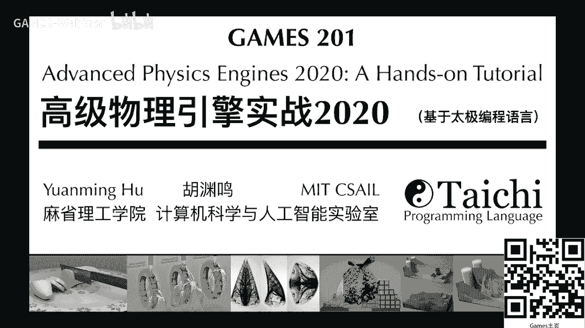

你的感觉是不一样，你会很有成就感，这个课呢，当然我说的目标就是自己动手打造一个呃，影视级的物理引擎，适合人群0~99岁的计算机图形学爱好者，如果大家有一点高等数学啊。

或者python或者任何一门编程语言的预备知识的话，嗯那就最好不过了，我们课程安排是每周一，北京时间晚上八点半到九点半，然后一共十节课，这个一个小时的课程有可能我们会往后延长。

有可能是比如说八点半到十点，这个根据大家的反馈，然后我这边是早上八点半到九点半，这个时候我们正好是12个小时时差，所以一般都是把am换成pm，pm或者m就可以算波士顿和美国和北京的时间。

课程内容我就不多说了，后面我们会具体再讲一讲，好那么我们先开门见山定义一下什么叫物理琴，我们在wikp件上可以看到这个定义，屋顶擎是一个计算机软件，它提供对于一个物理系统的近似的模拟。

比如说钢铁缸体物理的动力动力学啊，和这个软体动力学啊，以及流体动力学嗯，主要的application呢是在computer graphics里面，然后游戏啊和电影，那么这可能非常长的，其实一句话说的。

就是在你的电脑里面模拟这个世界，这个是呃，我想这大家应该有很多同学想想过做这个事情，我觉得还是一个很有意思的事情，我小时候就很想，怎么在电脑里面模拟一个世界出来，然后，这个除了，刚才说到这些应用。

它还可以在呃工业软件里面有很多应用对吧，你现在你去做一个模模型，你要做他的这个应力分析，你可能先在电脑里面算一算，看看它呃，做出来以后应力分析可能会是什么样，然后这样你就不用真的把它做出来，然后试一试。

发现诶这个不行，重做一个，这个就这种迭代过程，可以完全用在计算机里面进行，然后还有一个很很重要的应用呢，就是电影里面的视觉特效，这个是嗯现在电影里面特别是动画电影。

基本上每个电影里面可能有非常非常多的镜头，都是用物理效果给它模拟出来的，第三个能应用的就是这个虚拟现实，增强现实，这个应该不用多说，如果你在vr里面有一个基于物质世界的话，那你的，沉浸感会增强很多。

因为你可以和这个世界交互了吗，并且这个世界，这个虚拟世界里面的物理规律，和现实世界里的物理规律它是一致的，所以你就可以有更好的vr体验，当然现在很多人用物理琴来训练机器人，比如说无人驾驶。

我搞一个街道的物理引擎，这样车就可以在虚拟世界里面开，不用到真实世界里面冒着一些呃交通事，产生交通事故的危险，当然了，这个大家可能最关心的物理引擎的用处，还是在游戏里面，那么我今天就仔细想一下。

讲一讲游戏。

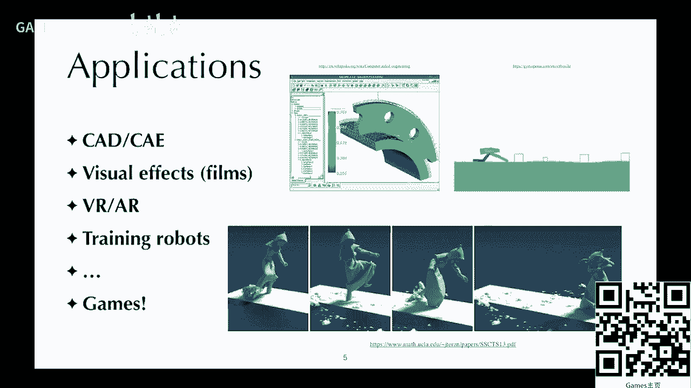

那我很小的时候就玩过很多义务的游戏啊，基本上他们构成了我童年的很大的一部分，就有一个我印象非常深刻的叫做incredible machine，这个时候叫中文叫做不可思议的机器啊。

这是一个问他这个游戏是这样的，你可以，在游戏里面摆入各种各样神奇的道具，比如说这个你可以有一个球，然后你可以有火箭，有杠杆，然后这些都会根据物理规律来运动，那个时候呃，其实这个游戏里面有一个问题。

就是他这个球它是不会转动，它这个球只会以各种形式平移，当然我是20年以后重新到网上找他，视频出来的时候，我才发现原来居然有这个问题，我之前小时候玩的时候，完全没有意识到有这个问题。

可以看到大家对随着时间推移，对物理项目的追求真的是水涨船高，小时候玩一个这个我觉得已经很厉害了，然后后面有更厉害的。

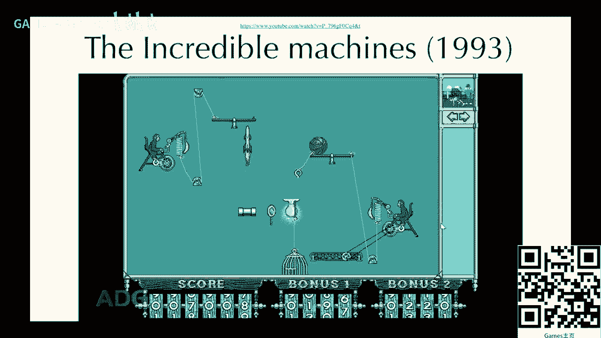

大概可能这个大学很多同学都玩过，我记得我那个时候是那个时候，我可能上初中或者可能初中的时候，那个时候非常流行，ipad，就是最早的第一代的ipad，ipad上面它提供了一个触摸屏。

这个触摸屏它可以多点触控，然后嗯一个很经典的游戏啊，就是这个愤怒的小鸟对吧，这个愤怒小鸟，你可以通过拖拽这个你有多趣的弹弓，然后这个弹弓打出去呢，这个小鸟就撞到游戏里面的各种障碍物，障碍物。

有的时候碰到遇到碰撞，这边我就没有找到一个视频，但是这个截图应该我相信很多同学都玩过这个，我觉得还是很有意思的小说，我花了很多时间玩这个啊，另外一个稍微更加呃可定制一点的是一，这个是一个纯的物理引擎。

它不是一个游戏，它就可以你自己在里面放各种东西，放点什么齿轮啊，放点什么水啊，然后滑轮啊，包括棱镜啊什么的，你就可以这个软件叫放，你可以在里面嗯创建一个物理世界，然后去看他怎么模拟。

我小时候经常玩这个东西，这个感觉有一段时间好像小上小学，那个时候可能上上小学09年的时候嗯，可能是小学或者初中吧，然后那个时候特别喜欢玩这个，大概每天一放学就玩这个东西，15年的时候呢。

又有一个很有意思的游戏，这个叫besiege，这个游戏有什么特点呢，就是说你可以自己把各种各样的模块，把它组装成一个你的工程武器，你带着这个工程武器，你就可以去去攻打各种各样的城池什么的。

这个我自己没玩，这个是我本科的时候看我呃，我室友他玩的，然后感觉非常有意思，就可以，我看他造的各种什么飞艇啊，或者什么呃工程车啊什么的，我觉得还挺有意思的，不知道我一个同学现在有没有在看这个视频。

这个我觉得很有意思，我小时候就很想造一个这样的游戏，但是后来毕竟没有机会去造，我觉得这个造出来还是很有意思啊，我最近大概是去年暑假，我玩了一下这个塞尔达传说，这游戏里面有很多物理效果，有很多谜题。

你需要用物理型去啊去去解决，这个是这个物理型的一个bug，你如果把三个箱子堆在一起，你就可以通过拉最后一个箱子的方式，让自己朝前移动，唉但这个不是很物理啊，嗯最近应该说我3月份的时候玩了一下这个。

ori今年最新的这个ai，然后我觉得还是非常不错，这个游戏里面几乎所有的东西都是可以动的，你踩到地上地会往下陷，然后啊你和可以和这个游戏里面，各种各样的东西去交互，然后我3月份玩的时候。

因为我是比较早期的玩家，然后有各种bug，我觉得这个效果还是非常好的，然后他不能再放这个水，再放摄影，大家都要去玩游戏，也不来上课，刚才讲了一下这个各种嗯，可以说是过去二三十年整个物理型技术里面。

我自己玩过的一些游戏吧，那么下面我来讲我讲讲自己的物理引擎的故事，这个从大概初二开始到不是3年级，这个居然11 2年过去了，我还在做，和小时候喜欢做的是一样的东西。

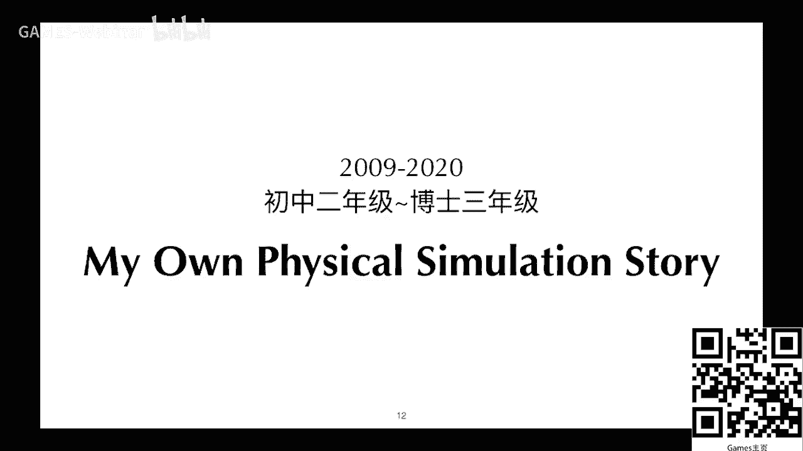

很有意思，来看一下，这个是我09年的时候写的第一个物理引擎，这个其实非常简单，就是一个弹簧质点系统，那个时候那个时候我对09年我我应该是初中，我现在想起来了，因为这个这个我确定是初中的时候写的。

你可以看到当时这个可能用一台不太好的笔记，本，分辨率实在是非常低。

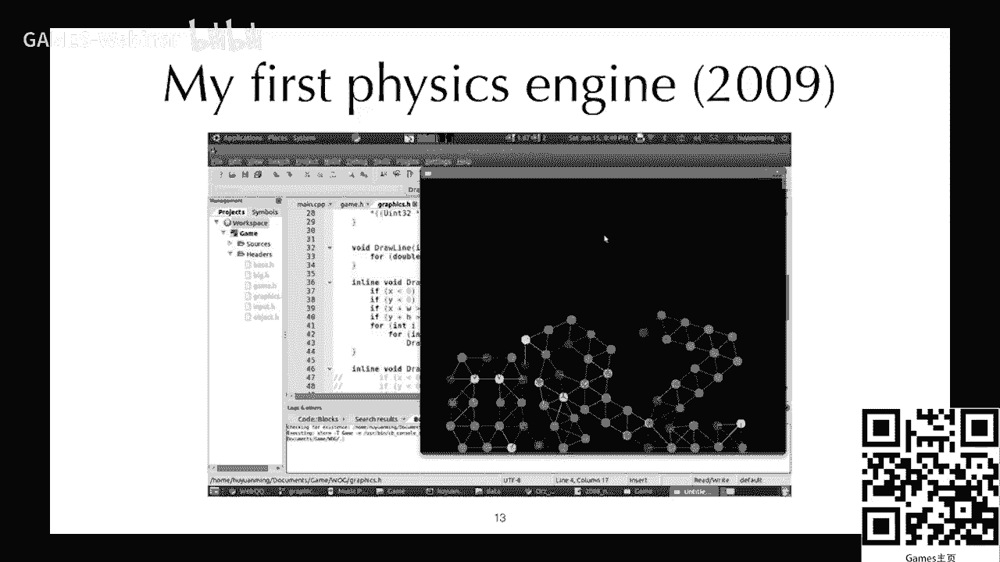

所以你可以看到这个还是一个双核的笔记本，它这个是一个，你可以创建很多这个弹簧质点系统，然后呃视频我没有留了，我只有一些截图，这个代码我也找不到了。

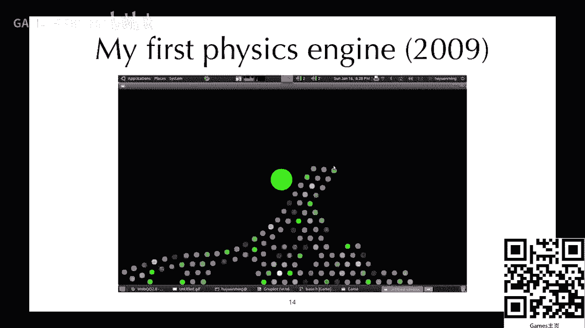

后面有一些有视频的啊，这个是11年的时候，那个时候我应该上高中了，那个时候学了1年刚提动力学，然后写了一个钢铁的物理性，应该也是受到愤怒小鸟的影响，因为当时玩这个游戏。

就想这游戏里面这个物理效果是怎么实现，然后我就自己写了一个那这个代码代码呃，链接上面是有的，不过我觉得一个有意思的就是。

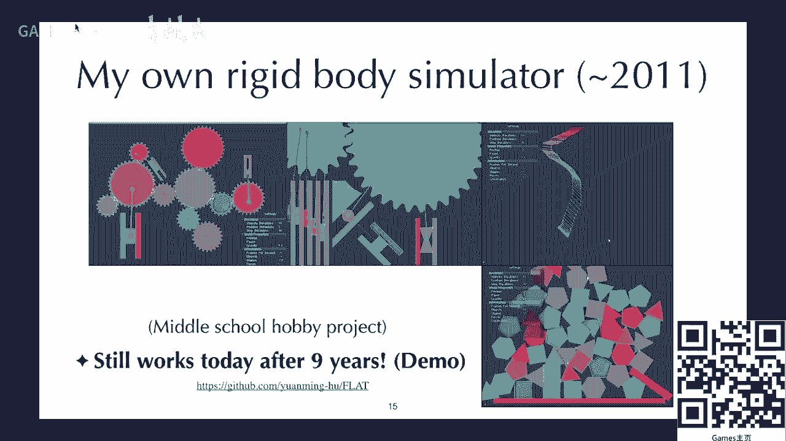

这个代码到现在还能跑，我可以跑一跑。

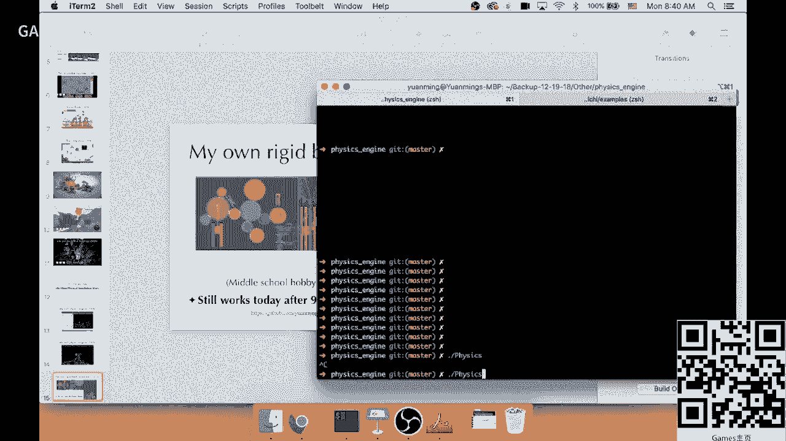

啊，我来跑一跑这个物理引擎，这个最早我是在windows上面写的，那个时候没有买这个macbook pro，然后后来我把它push到mac上面，还是挺有意思的，可以加各种各样的几何体。

这个有一些参数可以调，然后调了以后，比如说我现在可以把摩擦关掉，大家可以看一看效果是什么样的，就滑滑走了，然后我再把它拆下来，我还可以把重力调成负的是吧，我看看啊，可以，嗯你可以创建各种几何体。

我记得还有个功能可以画任意集合体啊，对，他会做一个三角形的translation，然后把它用三角形表示出来，再看看，嗯能不能画一个齿轮，我记得有一个功能可以画齿轮才好，哇，这个快捷键我十几年过去。

我居然还记得，真有意思，我们把它，嗯这个理论上这个齿轮是可以驱动的，但是我已经忘了怎么去拖它啊，可以拖可以拖，对我再看看我自己有一些其他的场景，这个是一个康美，这部分叫做牛顿摆，这个我记得当时。

物理老师经常喜欢用这个东西来做一个演示，我我可以尝试一下，你如果放一个，你看到这边弹起来是六个的，左右边一定会弹起来，六个左边一定弹起来六个，这个我记得当时上物理课的时候，盯着东西看了好久。

下面是个多米诺骨牌，来哎哟，这，还有一些别的电报啊，这个是一坨弹簧，你可以看，我可以拉近一点，就我小时候玩过一个玩具，叫做好像叫做什么机灵鬼啊，就是一坨一些弹簧，你可以两个手，他可以从左手跑到右手。

右手跑到左手，嗯应该就这些demo，所以这个代码已经年久失修了。

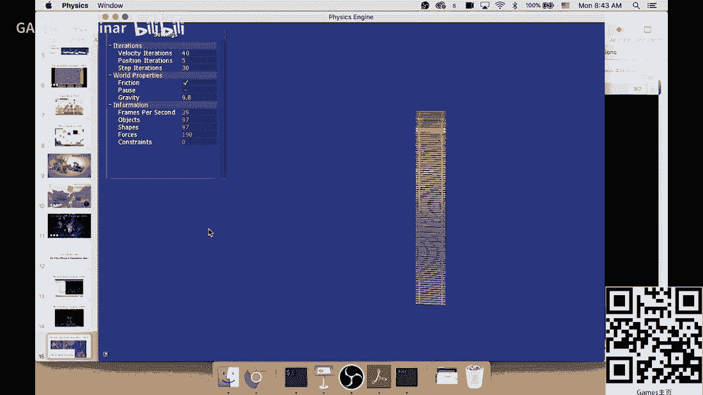

你可以看看最后一次什么时候改的，他最后一次是8年前，8年前我把它扩展到mac os x上面是吧。

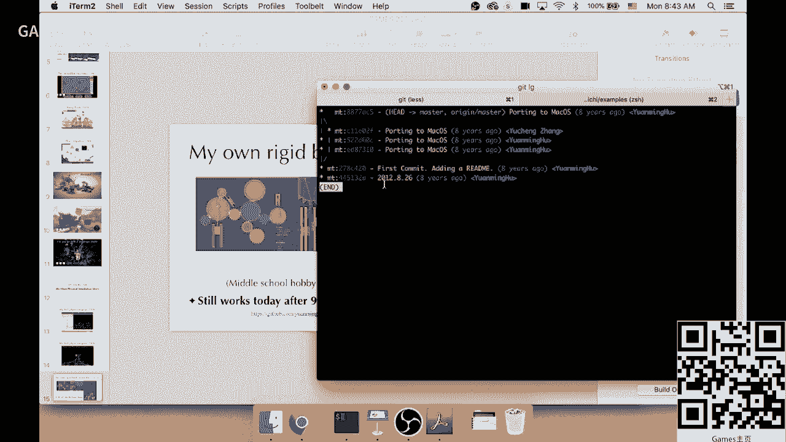

还有这个2012年8月26号，时光飞逝。

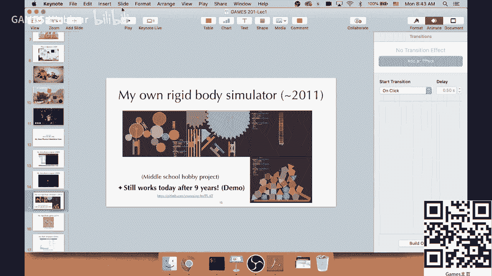

ok然后下一位啊，这个是我14年，我应该是大二，大二的时候写的一个基于物理引擎的游戏。

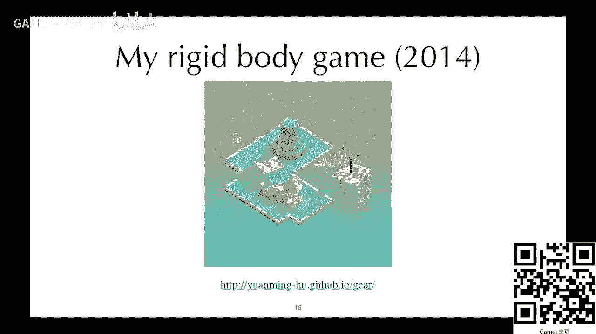

这个还是能跑，我看看跑一跑看看。

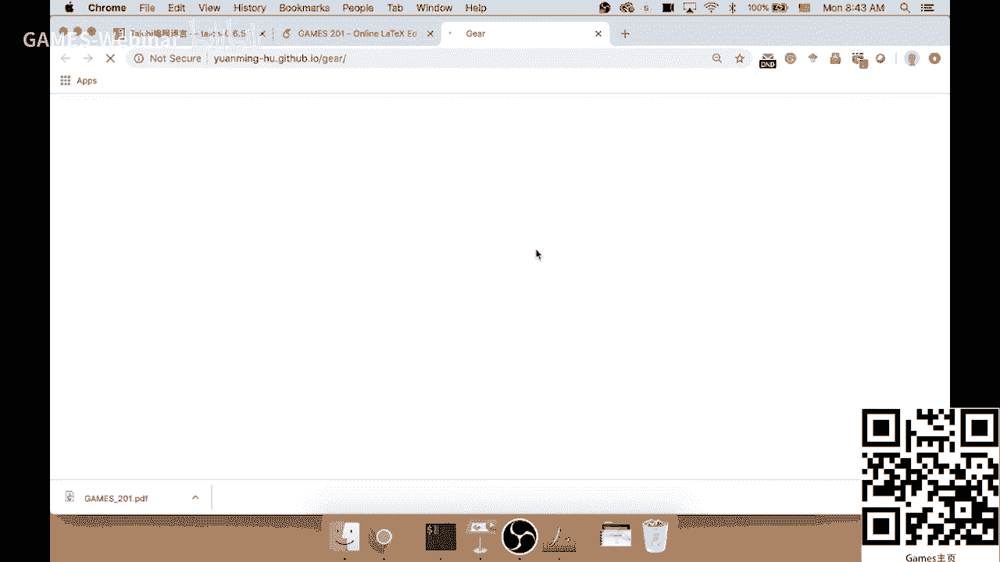

ok嗯这个是这个物理性，不是我自己写的，这个是用的box stud，当时我记得很喜欢玩一个游戏，叫做纪念碑谷，然后这个画风就抄了纪念碑谷啊，这个你是你可以通过w s a d去控制，这个能转的这个小人。

然后你可以让他去驱动这个齿轮什么的，哎呦这靠的太近了，有的时候会和齿轮卡住嗯，转这个齿轮的时候，这个右边这个树会长出来，上面这个齿轮好像是控制光影，看看，嗯我一开始想做一个完整的游戏。

后来因为没时间做了一半就放弃，做了一个最小化的demo，这个大家可以自己去这个网址去玩一玩，还是挺有意思的，这个看起来是三维，但它其实是很多分层的二维物理，你看到这个这个块，它虽然浮在天上。

但它其实是会还是一层一层之间是有碰到颜色，但层一层之间是没有的。

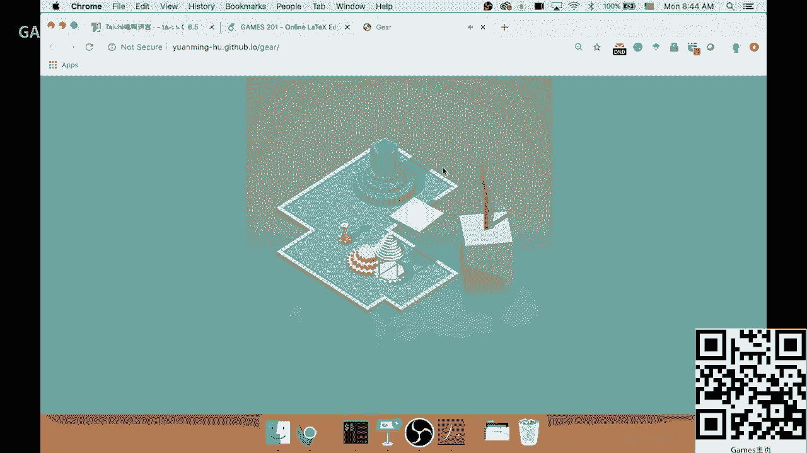

ok赶紧把它关了，这个很好gpu啊。

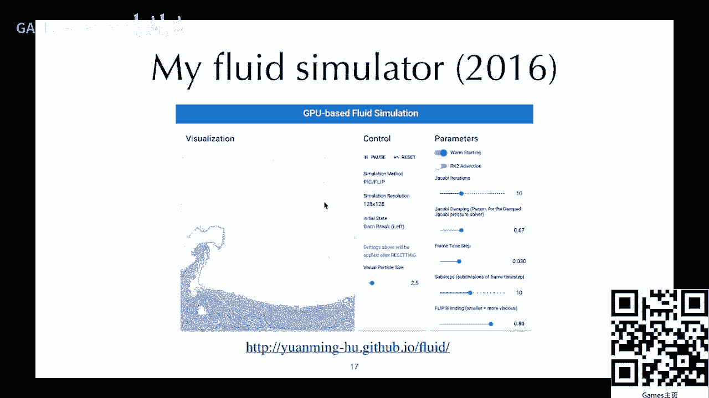

这个是我大概16年的时候。

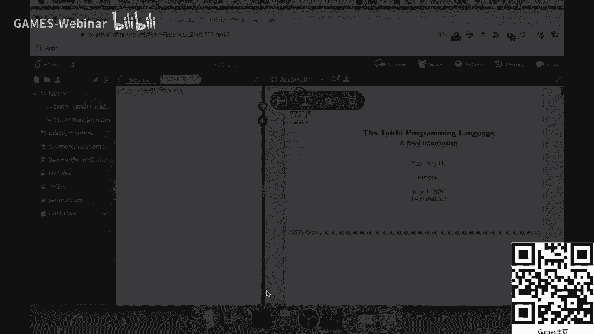

写了另外一个游戏的模拟，这个也在网页上可以放这，大家呃可以我结束以后会把size share在网上，大家可以直接点进去玩一玩，你可以调各种server参数，你可有的时候so参数不对，他就不work。

你看这个jiobe iteration，如果不进行，他就肯定不行，然后这个flip的话，你可以在里面选择，那这些复杂概念我们后面都会介绍，所以大家暂时但是听不明白的话呢，不用担心，你可以调分辨率。

我记得我当时好像你现在随便找一个ava的，少好一点，gpu跑512x512，实时是没有问题，但我这个笔记本实在太烂了。

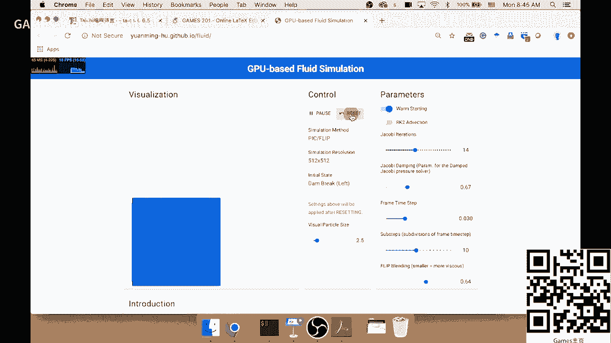

没有办法，你可能有同学说这个风扇转起来可能非常吵，我就先把它关了。

所以这个是16年的时候啊，这个是一个17年的时候写的一个烟的模拟，哎呦怎么这么卡，哈哈不好意思，这个笔记本实在是不太行，啊这可能放的不是很流畅，我试试再放一遍行不行，啊看来这个笔记本已经放弃了。

anyway啊，这个当然，这个我后来跟做烟雾模拟的这个张星星前辈。

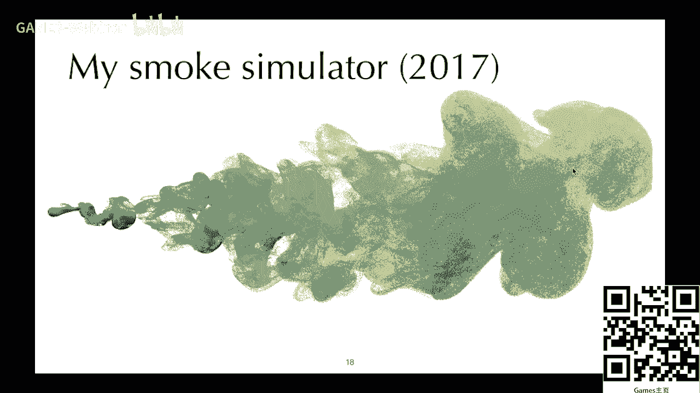

请教了一下，然后他说这个太黏了，效果不是很好啊，我就不过多展示了啊，这个是我呃，这个是我的第一篇cup paper，然后我们是用m p m做了各种切割的模拟，然后它实现了固液。

这个固体和液体的显示的耦合，然后切割是这个耦合的一个副作用，我们可以切各种切香蕉，切这个兔子，这个叫奶酪嗯，你可以切沙子或者叫搅拌沙子，那这个算这个文章里面呢，我还提出了一种基于移动最小二乘。

kl的一个新的物质点法，它会比之前c杠c2 的物质点法要快两倍，还是基于2016年的蒋老师的一篇，叫iphone particle excel paper去进行的一个算法上的精简。

这样使得它计算的时候工作量会小一半，有同学问这个渲染时间和粒子的数目，这个我可以说一说，基本上这边所有的都不是实不是实时的，这个paper里面基本上没有实施的联盟，然后切你像这个切兔子或者切奶酪。

这个基本上都是100万个到，300万~400万个例子，而这个右下角这个角沙子，这个大概有我记得有三三百50万个例子，我们当时模拟它可能得等等，上一天还是挺费时间的，但是现在呃。

pm这个算法就是它的性能逐渐的也在提升，所以逐渐的很多实时的应用名额应该也会出现，这个是一个更大规模的例子，这个是西瓜fisher，2018年，我们做了一个，在一台机器上面减10亿个voxo的fm。

然后用fm做完fm以后，我们有sensitive sensitivity analice，然后可以做top your puzation，这些概念我后面都会提到这边嗯。

大家只要记住这个boxer数目非常多就行了，干嘛网上也有，然后大家可以自己下来下下来跑一跑，这个跑的时间就非常长了，这个我记得这个demo，可能跑了得有一个星期，我记得嗯中间还挂了一次，我还重启了。

我对这个事情印象特别深刻，所以性能是非常重要的，在物理模拟里面，然后最近一个东西我最近开始搞的是可威模拟，那这个东西其实很早以前也有，只不过我们最近把它流程搞简化了一遍，什么叫可微模拟呢，呃可以模拟。

就是说这个视频可能不是很流畅。

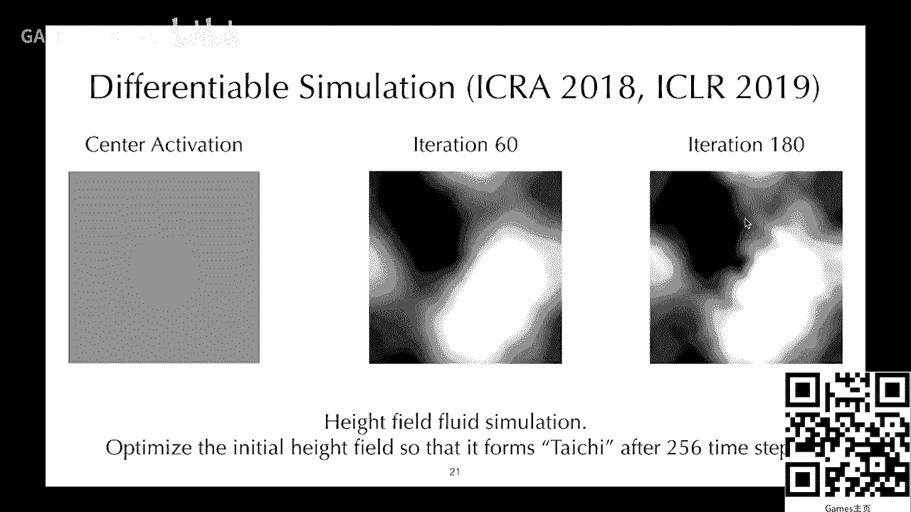

我尽量让它放的流畅一点啊，你问这笔记本已经弃掉了，现在已经非常卡了，可能是因为刚才跑的那个gpu的程序嗯，回模拟，就是说嗯，我们正常的模拟就是给你一个初始的状况，然后让你预测。

比如说十秒钟以后这个系统是什么样的，然后呢可微博你是反过来就说嗯，我希望去求出初始状况的一个扰动，对于结果影响是什么样的，然后这个其实就是要求一个梯度对吧，当你有梯度的时候。

你就可以对初始状况进行各种各样的优化，比如说这个地方，我们就在求一个初始的水面的高度上，使得经过512格time step以后，可以得到一个太极的pattern，就可能现在解释有点抽象。

我们后面会继续讲，那我得看一下这个到底是怎么回事，为什么这么卡，嗯看起来是直播软件卡，那我就没办法了，如果别的卡，我还能关了，直播软件关了，我就不用直播了，那我们只能忍一忍。

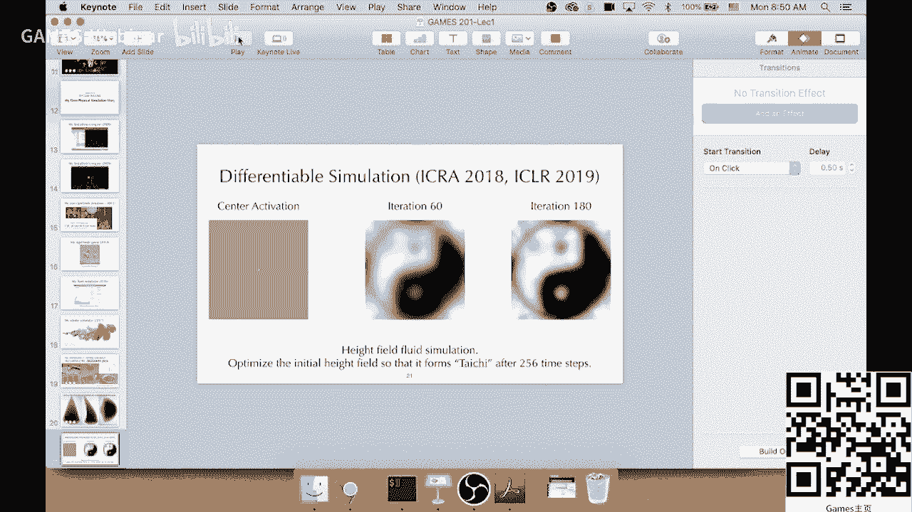

就到了今年了，刚才讲了过去10年的故事，那现在我在mit读博士，现在第3年了，然后我还是在做数据类型，但是我花很多时间去写编译器，为什么呢，因为我发现如果你没有一个好的编程语言，没有一个好的编译器的。

你要写高性能simulation是非常非常难的，就是非常非常费时间，所以我就重造了一个编程语言，这样大家就可以更容易地写自己的simulator，那么现在基本上可以说有一半的时间。

都在做这个太极编程语言，当然这个里面有非常非常多的贡献，是太极社区的同学们一起帮忙做的，真的大家非常不容易，我觉得每天早上一起来就能看到github上，github上面好多的衣服，每天跟大家一起来嘛。

就跟开网打网游下副本一样，就解决一个个很难修的bug，进行各种各样的设计决策，真的非常有意思，呃当然我最近也开了这么个课，然后主要是想跟大家分享一下，怎么样去写屋顶晴比较嗯比较有意思。

当然也做做这个直播，带货带一带这个太极编程语言，希望大家都能尝试一下这个新东西，那么我们接下来讲一讲这门课，我们会注意我们会注意力集中在什么，哪些关键词上面，我们会简单讲讲各种各样的离散化。

那这部分数学比较involved，所以呃可能也不会讲的特别深，更多的呢因为我自己主要是做计算机方面的，所以我会更多讲一讲，你从一个程序员的角度，怎么去直观地理解各种各样的离散化。

我们会讲怎么样写有效率的求解器，比如说嗯现在你要写一个free sober，很很长的时间，很可能就是花在这个linear systems of上面。

不同的linear systems over它的性能有天壤之别，后面我们会继续呃，详细介绍这些pregnitioner，我们会讲讲怎么样去提高呃生产力，怎么样用比较短的代码实现一个高效的物理题。

你别看这个短代码啊，听起来好像是一个非常糟糕的metric，好像这个代码行数用代码行数是measure，一个软件呃，是非常糟糕的一个metric，但是你仔细想想，有别的更好的metric吗。

其实你很难想到比这个代码行数更好的metric，这也是为什么我喜欢用这种metric来证明呃，一个代码可以用很少代码能写出来，当然我们也很在意性能，刚才提到很多模拟的我们都要等上一天的时间。

然后量的话呢，其实你如果要再去做迭代的话，那就非常非常费时间了，我们也会简单介绍一下硬件的题结构，因为你如果要写高性能sover的话，你得去了解一下你的硬件是什么样的，如果你不了解硬件呢。

那你就很难把它全部利用起来，我们也会讲讲各种各样的复杂的数据结构，然后但是太极让这个数据结构的使用，变得更加的简单了，这个后面我们会详细介绍，我们也会讲讲怎么样去做复杂的并行，因为现在并行硬件大行其道。

cpu和gpu如果算它吞吐量的话，那真的是天壤之别，一般能插上一个数量级，然后这边展示的是saber 2000呃，2020年的一篇比较新的saber paper。

这个paper的结果非常非常impressive，他们可以用四个gpu，然后模拟呃，应该是1亿个particle，这个在之前是前所未有的，大家可以呃，有兴趣的同学可以去读一读这个paper。

然后我们会最后我们会讲讲，怎么去simulator的导数，导数求出来呢，你就可以做很多有意思的事情，比如说我们这边还有两个机器人，都是软体机器人，上面的是一个嗯，上面机器人他有四块肌肉，就是他有两条腿。

每每条腿有两两半，然后左边一半，右边一半，每一半可以伸缩，或者可以叫叫叫什么，可以啊，变长或者变短，就是相相当于你的肌肉嘛，你可以肌肉可以收缩或者舒张，那下面一个呢是一个弹簧质点的机器人。

上面这个是一个m p m机器人，好那么我们这个第一讲的上半部分就结束了，我们来下面呢我们介绍一下太极编程语言，因为这个是一个大家都要用上的工具，嗯好，那么现在啊这个slides。

我在整个课程期间会不断的更新，因为我们今天只能讲一讲最简单最简单的内容，然后后面我们会逐渐的加入，太极里面的一些比较复杂的feature，这些slides呢都会，课程结束以后都会在网上有的。

所以大家不用担心，如果说有任何size里面没有介绍的东西了，大家可以去看泰迪的文档，现在泰迪的文档在大家努力下呃，英文文档和中文档应该都是比较可读的，特别是中文档真的非常不容易。

就是呃基本上就以大家以迅雷不及，掩耳盗铃儿响，叮当仁不让之势，就把这个中文中文档给他全部翻译好了，真的太不容易了，呃当然很多feature我今天讲到的，并不是我自己一个人写的。

很多feature是我们社区一起写的，然后我当然也不是唯一的developer，那么什么是太极呢，太极是一个高性能的这个领域特定语言，它在呃嵌入在python里面。

然后所以它的语法和python非常非常的像，然后你如果会python，那你基本上很快你就可以嗯，你就可以怎么说呢，学习拍这个太极语言怎么用，他这个语言专门是为了计算机图形学的应用，来设计的。

我们在设计的时候，非常非常注重生产力和可疑之心，这两个东西，以前在计算机图形学里面是呃非常难以做到的，我说的这个生产力，不是说你用游戏引擎做游戏的这个生产力，我说的是对于一个想研究图形学算法的人。

去写一个图形学算法的生产力，我们也很注重possibility这门课呢，我们建议大家都使用太极编程语言，因为太极程序有什么好处，你在一台机器上写的太极程序，复制粘贴一下到另外一台机器。

只要一台机器装了台机，基本上都是能跑的，这个就和你和open gl呃，和你用其他的像ka写的程序就完全不一样，因为你很容易，如果你不用太紧，你会各种各样的依赖，你就为了让一个画一个三角形。

你可能要装三四个包，就非常非常麻烦，泰迪呢是面向对象的，然后它是自自动并行，并且kero是mega kernel，这个和深度学习里面的那种呃，cosmeability比较弱的kernel是不一样的。

我们还有一些比较好的系数系数，数据结构以及可谓编程的知识，这个我们就后面再介绍了，ok那今天其实就讲几个非常简单的内容，怎么安装，怎么定义数据，怎么做计算，然后怎么进行调试，我们先看看怎么安装。

那么如果你用python 3。6，3。7或者3。8，你就可以直接用pip去装一下太极，大家要注意一下呃，我之前闲聊的时候也说过，就是说国内语言有的时候它有一点延迟，所以有的时候，比如说官方语言已经0。

6。7了，然后管理员可能还是0。6，然后就会有一点延迟，然后呃就会导致因为太极可能不是最新的版本，这个我自己没有去实践过，但是之前知乎上面有很多人跟我说这个事情，就是说大家装个手要确认一下版本嗯。

然后三个主流的操作系统我们都是支持的，太极程序呢也可以记在cpu上面装，也可以先记在cpu上面运，行，在gpu上面运行gpu我们支持q a，然后open gl和apple metal。

如果你有一些神奇的配置，比如说你的cpu是arm，或者你非要用python 3。9以上，那也没办法，那你就得build from scratch，你底下太极的源代码下来装吧。

但如果我相信用python 3。9的同学是比较少的，最最新的pyth好了，已经30了，我记得5月25日的时候呃，好像3。10已经出现了，但是大部分同学应该都是3。6或者3。7，3。8可能都是相对少数。

但是我们也是支持3。8的，那么初始化太极这个非常重要啊，每当你在运行一个太极程序的时候，总是呃请总是调用一下t i n it就是initialize。

before you do any touch operations for example u ti。n点，你可以在这个里面specify这个指定你的后端，比如说我们这边用的是tr减q的呃。

这个是arc，这个是一个最最最常用的参数，因为呃指定了这个2k以后呢，你就可以去呃选择到底在什么硬件上面跑，可以是x a x a，可以是x six four，可以是arm，可以是kda。

可以是open gl，可以是metal，你可以随意选择一个掰开，当然你系统得支持了，你如果系统不支持，那我们也没有办法，建议大家使用ti。cpu或者ti。gpu，为什么呢，因为呃你如果呃用这个tr。

x sixty four，那他可能你如果在arm上面就跑不了了，你用cpu它就会自动检测你cpu是什么样子的，如果gpu呢，它会自动检测你的gpu，它会逐渐的先去try coda。

然后try metal，然后try open gl，if nothing啊，如果没有任何事被检测到呢，太极就会返回到cpu上面去运行，当然这个ti点因为它有各种各样别的呃参数，这个我们后面会介绍。

那么下面我们来介绍一个太极里面，最最最基本的概念叫做tensor，就是说呃sorry啊，就是data data，就是说呃你运行一个程序，你总得有一点有一些数组啊之类的东西，来存这个程序的状态对吧。

那么太极里面支持的数据类型，其实呃和c非常像，他有这个八位的，16位，32位，64位的整形，然后里面呃，整形里面又分为带符号的和不带符号的，然后还有，浮点数类型有32位和64位，浮点数类型。

一般来说我们自己一般来说，我非常喜欢用32位的类型，带符号的整形和30位浮点数类型呃，现在我们还暂时不支持不练类型，我们不支持to false这种类型，所以我们的所有的比较返回值。

都是在要用ink thirty to，用这个整形来存储的，当然这个并不是所有的后端，都支持所有的数据类型，因为毕竟比如说啊open gl里面，他可能不支持64位的浮点数。

有些你可能需要一些excel才能用呃，或者不支持64位整形，然后呃所以这个我们文档里面有一个表，就详细写了，每一个后端支持什么样的数据类型，大家可以看一看文档，那接下来我们介绍啊。

数据里面的最重要的一个概念叫做tensor，我同学的bat是什么意思，bcat就是，怎么解释呢，就是用来执行你的程序的硬件，就是说嗯你可以在程序，可以在cpu上面运行的时候。

cpu就是你的bad end，如果你在gpu上面运行了，那么gpu就是你的backend，但有同学说对这个是一个编译器里的概念，所以可能我刚才讲的不是特别清楚，就是我sim的bat是什么，大家都知道。

但是呃其实它意义不是特别明确，这个是一个非常经常被abused被滥用的一个词，还有很多很多的意思，这里呢就表示执行计算硬件，ok那么下面我们来讲讲这个tensor，tensor就是张亮。

张亮其实是一个fancy的名字，一般来说呃，你可以就可以认为张亮是高维数组对吧，但是它在物理里面有一些什么协变张量，为立立立变张量啊，这些它是有别的物理，但是在太极里面他的张量没有物理。

它就是一个高危数组，它的这个数组的维度可以是零维，可以是一维，可以是二维，可以是三维，你也可以认为零维的张量呢就是一个标量，一维的张量呢是一个向量，然后三位的张二维的张量是一个矩阵啊。

但是这边就有一个地方可能比较computing了，因为你的张量里面的每一个元素，它又可以是一个标量呃，向量或者矩阵，所以我们从来不说，我们在太极里面嗯，会把张量和矩阵给他严格的区分开来。

然后虽然在数学上面呢，你的举证有的时候会被认为是，比如说tod tensor，但是在太极里面，tensor和matrix是两个完全不一样的概念，这个大家一定要注意区分，因为如果不注意区分了。

后面会可能会非常confused，然后你的tensor element可以是scale factor或者matrix，那么你要去访问这个tensor admin的时候呢。

就永远用这种ai j k的语法来去访问它，太极里面不支持pointer，pointer，有的时候是万恶之源，因为你用了pointer呃，编译器就很难优化你的程序。

以及你会容易trigger一些undefined，behavior，这个你程序就为了以莫名其妙的原因挂掉对吧，然后a i j k呢可能会给你返回一个scaler。

也可能会返回一个vector或者一个matrix，然后你可能还需要再用呃pq来去访问，返回的matrix里面的真正的一个数啊，就是这个有一些confusing，后面我们会给一个例子来介绍一下啊。

这边就是一个例子，然后我们在这个例子里面呢，我们定义了几个四个tensor，分别是a b c和loss，然后a呢是一个标量张量啊，这个听起来可能有点confusing，就是说啊它是一个张量。

然后这个张量呢有42x63个元素，每一个元素是一个标量，那b呢是一个向量的张量，这个像这个，b这个里面它是一个你可以看到它是ti bor，然后第一个是个三三，这个是你这个向量有多少个元素向量。

这个里面这个其实是一个3d的tensor，所以3d的vector，所以我放了三这边，然后后面又有一个shape，这个shape是这个tensor shape，所以你可以看到啊，b这个东西。

它是一个四个3d vector组成的一个张量，ok这个有点confusing，所以我得花多一点时间在这，然后你可以我们再看c c里面呢，你看它是ti。matrix 22对吧，那它是一个2x2的。

它的这个张量的元素是一个2x2的矩阵，后面又有一个shape，这个shape是tensor的sha，那这个地方其实就是一个3x5的tensor，这个tensor 3乘五的tensor里面。

每一个element是一个22的矩阵，这边应该是现在大家应该清楚了，然后这个loss我们来看一下，这个loss是一个比较神奇的东西，你看它的shape是空对吧，它是一个shift里面的东西是张量的维度。

那么shift是空的，说明他是一个0d的张量，0b的张量是个什么概念，0d的张量就是只有一个元素的张量，这个元素是什么呢，这个用的是加点y对吧，说明它是一个呃标量，ok那么我们下面呢就可以在太极里面。

我们可以去，给这个张量里的元素赋值，比如说我们可以让a的第三行，第四个元素给它设置成一，然后我们可以把它print出来，然后呢我们也可以给一个向量一次，给它赋一个list，这样可以把它这个向量里面的值。

设置成这个list里面的值，这边要注意一下嗯，大家可能会想直接print b的第零个元素，第零个元素是什么，是一个向量对吧，呃你可以可能会想print b0 ，但这个我们暂时还不支持。

后面我们很快就会支持这个社区的同学，正在非常辛苦的在work on这个东西，然后最后一个loss，这个地方一定要注意loss，因为它是一个林地的张量，所以你访问他的时候，我们必须要用下标，那怎么办呢。

我们会给它一个下标，叫做n，那样的话就是说他没有下标，那他就是呃领地的张量，这边为什么不能写loss等于三，loss等于三，你就真的把loss的值设成三了啊，那你这个loss以后就是三。

它就不再是一个张量，这个是python语法的限制，好后面大家程序写多了，就会就会知道，这个地方其实设计还是不是很容易的，但是我们已经尽我们最大努力了，那我们来看一看计算。

计算里面最重要的概念就叫做kernel，然后kero有非常非常多的意思嗯，操作系统有可能浏览器，有可能各种各样的东西都有可能，太极里面的kernel是什么呢。

太极里面的kernel就是呃用来计算的那个函数，大家可以记住这个解释，就是太极里面kero就是用来计算的函数，然后呢太极刚才我讲的其实全部都是python的语法，下面我们来讲一讲这个太极的语法。

泰迪kero里面自己有一个语言，这个语言非常和python非常非常像，唯一的区别是什么呢，唯一系列是这个语言是会被justin time，就这个即时编译的，然后太极自带一个编译器。

把呃kernel里面语言编译成高性能的kero，然后这样就能摆脱python这个run，运行很慢的这个问题，它是静态类型的，然后呃lexically scoped就是说它不像python那样。

你在他python的scope是以function为单位对吧，但是太极的课程里面，scope更紧一点，它是以block为单位，然后这个kernel会被自动的并行，并且在某些情况下是可微分的。

kernel必须被太极的克隆，你如果要让他知道泰迪知道这个是kero，你必须给这个函数前面加一个decorator，就是ti。kernel，那有了这个decorator以后呢。

太极的编译器就会把这个函数的巴黎拿到，然后进行编译，编译以后呢，把这个跑的很慢的函数，替换成一个跑的很快的并行，cpu或者gpu上的一个高性能的函数，如果你想给kernel传一些参数的话。

那请一定记得给他呃，加加上这个参数类型，因为毕竟太极是一个强类型的东西，然后，我们这边有两个例子，第一个例子是hello world，那其实你可以看到它和python其实非常非常想。

然后但是为了让他和python非常非常像，我们花了很多精力去让他和python非常非常像，因为要不然大家学起来这个负担就比较高了，对吧，你重新学习一门新的编程语言，跟这个拍照要花很多时间。

但现在基本上你会排成，那你上来就可以写太记，这个我觉得是一个非常好的设计取舍，如果你要让kero有返回值呢，那请一定要记得给它的返回值，也加上一个数据类型的一个hint。

那么比如说这个calculate这个函数，它返回的是一个三刷微整形对吧，那你要记得给你define calculate的时候，要给它有一个返回值的类型，那函数刚才讲了，kero其实是函数。

那函数的方式也是函数，它们有什么区别呢，呃其实区别非常简单，就是说嗯function可以被太极的function，可以被太极克中调用，但是太极的function不能够被python调用。

这个后面我会讲到scope的区别，但是呃这边简单的一点概念，就是说你可以直接调用太极的kernel，你在python里面可以直接调用太极kernel，但是呢呃在python里面不能直接调用太极的方式。

但是kl里面可以调用function，function里面也可以调用其他的方式啊，这个大家可以通过写代码去仔细体会，它到底是个什么行为，当然这边也需要一个decorator去指定嗯。

他的呃具体的函数的类型，当然有同学说写过kila，同学可能会一下子就反应过来，function其实是device function对吧，然后colonel呢这边其实就是coda里面的global方式。

他们其实是有一个对应，但是呃这么说基本上是对的，但是有的时候一个ti。ko，他会被拆分成好几个扩大的一个global kero呃，那么我们中间还是有一些抽象的，但是你如果用呃，你如果学过枯燥的话。

那基本上确实可以认为一个是device，一个是呃global，那么太极的方式呢，它是不会被强行in in line，现在我们这个实现的稍微有点挫，强行in line，但是大部分情况下绝对是够用的。

那暂时我们因为是强行in line的这个function call，所以我们暂时还不支持递归，然后一个太极的方式呢，最多只能有一个return statement，这个大家可以仔细看文档。

看看文档里面会解释为什么会这样，大家做同学的这个程序里面，经常会用到一些常用的数学函数对吧，比如说sign cosn啊，这个ark sarcosin或者artgto，这个里面我就列出了一些常用数学函数。

这个update to是不是应该是y在前面x后面，我这边可能有个type，我讲完以后我去确认一下这个，大家不要被我感知出来三子给误导了，嗯然后像flora cell啊，然后这些都是支持的，有一些函数呢。

比如说有些特殊的，比如说t i d random，这个random是干什么呢，如果说呃你的data type是一个int的话，它会给你返回，比如说你intech to。

那它就会给你返回0~2147483647，中间的一个随机的数对吧，如果你是data type，是int 16的话，他会给你返回啊，我刚才说的应该是online，如果是online 16的话。

他会给你返回一个0~65535之间的数，如果你是flow point的话，他会给你返回一个0~1之间的浮点数，然后有一些python自带的函数，比如说，abs呃，int float啊，abs是求绝对值。

这个是python的关键字，所以就不是ti。abs，而是直接使用abs就可以，这样比较方便，符合和python尽量接近的这个原则嗯，int和float，就是说把你的这个x把这个输入给他。

convert成整数或者浮点类型，还有max或者min，max和min呢都可以像python一样支持超过两个参数，你可以x y z aw，你随便想怎么弄都可以，当然还有这个x星星y x星星管是什么。

x星y是x的y次方，这个其实也是和python保持一致，最后得到的这么个设计啊，这边还有一个要提到的是这个python里面它的除法，这个地方要注意一下，因为python 3以后把它的除法的含义给改了呃。

一般来说你这个如果你以前写c加加，或者写别的语言，a除以b，它的结果是取决于a是a和b是整形还是变形，对吧，如果你比如说a是五，b是二，然后你给他一个a一个除号b他会告诉你什么，他会告诉你二对吧。

如果你给他，如果你a是五点，b是二点，就是它如果它们都是浮点数的话，那你的这个除它会给你返回2。5，这个是这个是c里面的行为，在python里面a除以b永远会给你返回浮点数，在python里面。

如果想二怎么办呢，你有两个数，两个数法表示整数除法，你可以a啊，除以除以b，他就是自己新python 3新创建了这么个符号，我觉得还挺有意思的，所以泰迪为了保持和python的统一性。

我们也全部沿用他的行为，这样你只要会python就可以写太极，然后python还有一些其他的有意思东西，它支持这个链式，comparison这边给了一个非常极端的例子，a小于b小于等于c不等于d。

这个还是挺乱的，一般一般我们只写是a小于b啊，最多情况下我们写个a小于b小于c就到头了，但是你如果真的要写这种很复杂的training，comparisons，太极也是支持的，那么说到物理魔力。

就不得不很多时候得用上线性代数对吧，ti。matrix是呃，用来做小矩阵容，我刚才讲到tensor和mix，tensor是表示很大的高维数组，但是matrix是啊，你如果要用数组理解它。

但它只能是一个非常非常小的小数组，然后，小数组的什么概念，3x34x4，1x3，3x1，这种是属于小数的，你如果有什么10x10，那你就可以考虑一下要不要用cancer来表示的，而不是用数组表示的。

因为太极里面有些机制，你如果用一个很大的数组，它的啊太极会非常慢，但是小数组太极会非常非常快，然后呢vector它和数组本质上是一样的，唯一的区别是vector只有一列对吧。

因为vector一般会被认为叫做这个列向量嘛，它就是只有一列的一个数组啊，一个只有一列的呃，矩阵这边有一个要非常非常注意的地方，是大家要一定要小心，element wise的乘积和matrix成绩。

什么概念，就是matrix乘积呢是额数学上面的两个矩阵，a乘b它是矩阵乘法，但是element wise乘积你如果写a乘b的话，它是什么行为呢，它会把a和b对应位置的元素取出来，相乘给你一个新的矩阵。

这个大家可能得试一试，我在这说可能有点干枯无力，但是这个如果不注意的话，很容易写出bug，然后有一些常用的矩阵运算，比如说transpose inverse，transpose是求它的转置。

inverse就是求矩阵的力，但是这些所有的运算全部都不是in place，不是说a。transpose会把a本身给transpose，而是说返回给用户一个被转制过的a，然后a。

inverse就是求它的力，trace呢就是求它的trace，应该是对角线的，和中文好像是叫叫做叫做记对吧，是痕迹的g然后determinal是求它的行列式，这个行列式你可以有各种各样的数据类型。

可以是你type里面可能得费得进一个浮点数，然后normalize，normalize是求这个呃，当然这个只列向量有用啊，他是把这个向量给它呃，除以它的模长，然后再返回这边，我还漏了一个a。norm。

这个a。norm对于向量来说，会返回这个向量的呃，too lm也就是它的长度，你如果想把矩阵里面所有元素都去cast一下，你可以用a。cast，把它转化成另外一个数据类型。

我们也支持一些简单的小矩阵的呃，常规性内容操作，比如说polarity composition，然后包括s b d这些我们也是支持的，如果说你想给a里面的每一个元素都取sign，得到一个新的矩阵呢。

你可以直接把ti。sign apply到这个a上面，这个是一个ment twice这个的操作，所以所有的标量或者呃所有的标量运算符，都可以直接在矩阵上面运算，然后这个就比较方便。

那么我们接下来要讲一讲非常重要的一个东西，叫做并行for循环，太极里面呢有两种for循环，一种叫做range for loop，那么range for lop其实和python的for loop。

基本上行为没有任何区别，他就是for i in range，然后一个n之类的，这个我后面会给一个具体的例子，但是一定要非常注意的一个事情，是太极里面最外层的range for loop。

最外层的for loop会被自动运行，然后ready follow可以可以嵌套，这个后面会详细解释，然后第二种for循环叫做struck for loop，这个东西呃非常非常勇。

特别是你要做任何系数计算的时候，基本上全部都是靠这个struct flow，那它是干啥呢，它是会嗯便利稀疏张亮里面的所有的元素，刚才我讲的所有的例子全部都是稠密张亮对吧。

但是太极里面有一个非常特色的功能，叫做稀疏张量，这个后面这一讲不会提到基础上，因为它是呃挺复杂的，后面不会提到，我们看几个例子，那么第一个例子是这个feel呃，它是一个kernel对吧。

kernel是再回想一下kernel是python可以调用的，function是python不能调用的，function可以被knel调用，ok呃这个例子可能这个方式。

ko一开始可能有点computer，但是我相信大家很快就能搞清楚嗯，然后我们来看一看他这个kdle，面对外部有一个i的这个for循环对吧。

这个是一个range for for i in range 10，那它就会嗯呃并行的对0~9，注意这个十是不包含它是0~9，0123456789的所有元素，进行这个操作，它是操作会干啥呢，给它加上i。

然后呢你会看到后面有个s s，我们这边算一个0~4所有数的和，这个由于它是第二层for循环，所以它不会被自动并行，它是在每一个第一层破循环的线程里面是呃，zero执行这个串行执行的啊。

这个地方就是说只有最外层的会被并自动运行，那么我们再看看第二个这个feel three d，这个这个例子，这边有一个t i。n d range，这是一个很有意思的函数。

它是four i j k in这东西，这个还是一个range for loop对吧，但是它的这个range非常的呃特殊，它特殊在哪呢，它不是只有一个下标，它有三个下标，它是什么意思呢。

从3~8还剩3~8，j是从1~6，k是从0~9啊，当然869这个末端点都是不包含的，然后我们i j k for呃，它应这个三维的这个range，这个也是自动运行，然后它可以做一些这样的操作。

比如说x i j k等于i j i j j k，那么要注意的事情呢是呃，我们只会自动定型最外层的，最外面那个scope for循环，比如说上面这个例子four呃，这个foo这个函数它就会被自动变形。

但是你如果这个给for外面嵌套一个if，那他就不会被自动变形了，他就会被认为是一个serial的嗯，这个做过并行编程的同学应该很能理解，很容易理解为什么会这样设计。

ok我们来看一下struck for loop，那么什么是struck for loop，我们来看这么个例子，这个例子是啊，其实是这个程序是可以跑，大家可以自己去跑一跑，玩一玩哦，顺便说一下。

我不我这个size是pdf格式的，然后这个有一个问题，就是说你如果直接复制粘贴的代码，他格式上会是有点问题，他会不能正常运行，但是我会在上课以后，我会课程结束以后。

会给出里面所有能跑的例子的python的源文件，这样大家跑起来就方便一点，我们来看一看这个程序干啥呢，他先初始化对吧，大家做任何太极操作之前，记得一定要初始化，然后然后我们定义了一个tensor。

这个tensor叫pixels，这个test里面每一个element是一个32位浮点数，f32 ，32位浮点数，然后它有这个ship ship，它这个是多少呢，是640x320是吧。

n乘2n那么一个kernel ernel叫paint，这个kd里面你会发现他做了一个操作，叫做呃for i j in pixels，这是什么意思，pixel是一个tensor。

那tensor它是不是有下标啊对吧，这个tensor下标是什么，是从什么到什么呢，你看到下面我列出来是从0001020，319找101112，最后呢到300啊，639，319，就是说ig会并行的。

look over所有的下标，所有的这个tensor里面的下标，但这个是一个dance tension，那它所有的下标都是active，如果说你是sparse tensor的话。

那这个struck for loop只会loop over嗯，只会loop over，这个里面active的部分，这个后面我们会详细介绍，我看好像同学有一些问题，我看看有没有什么。

我现在可以就可以解答的，免得后面越来越confusing哦，ok我先回答几个问题，有同学问kernel可以调用kero吗，这是个很好的问题啊，kero不能调kernel嗯。

但是function可以调function，然后为什么说kernel多数情况都是串行，其实克隆大部分情况我们希望它是并行的，但是有的时候有的东西没法并行，所以它就有串行，你会开多大的，不开图这么大。

让我屏蔽一些线程，有些问题我也没有很很理解，对有同学问串行和并行是什么意思，有同学说这个串行是一个人搬完100块砖，并行是100个人搬完100块砖，这差不多吧，反正就是并行。

就是有很多个很多个worker，就很多个工作者一起同时做一个呃，高度重复性的工作，这就是为什么gpu非常适合做笔记，因为gpu的threat数目非常的多，for里面有前后依赖怎么办，这个很好。

这个是一个很有意思的问题，这个说多了都是泪，我们有一些，比如说我们看一看这个函数，如果说呃你把这个外面这个for去掉的，它这个s等于零for呃，这等于j in range five。

然后s加等于j这个东西呢它就是并行对吧，这个里面就有一个循环体，对外面的这个s的依赖，这个我们编辑器里面做了一些非常繁琐的变换，使得你感觉不到这个是一个问题，就是说大家不用担心这个问题。

但是编译器里面做了一些很头疼的事情，然后使得它可以自动处理，所以大家不用担心，ok那么接下来我们讲一讲原子操作，由于刚才说到太极里面，很多的操作都是并行的对吧，那么我们很多时候需要做原子操作。

那么在太极里面呢，这种augmented assignments，它就是自动式原子操作，然后这这边有个例子，就是说你如果要去修改并行的修改全局变量，那么就是得确认一下，你得用好原子操作。

比如说这边是一个例子，如果我们想嗯把x里面有个所有的元素求和对，那么这边有三种approach，我们看approach one是可以的，我们可以用total none，为什么用total none。

而不是用total呢，因为total是一个0d的tensor，在太极里面access tensor永远都要用括号，这个大家得呃记住，这不是一个最不是一个最理想的设计，但是是呃没有办法的办法，为什么呢。

因为你这个加等于在太极里面是原子的，加等于我们再看approach to也是ok的，pro也是好的，那这也是一个原子操作，那这个第二第二种和利润有什么区别呢，第二种这个atomic at它会返回一个值。

这个值是total none，在进行atomic at之前的值，相当于是一个呃read modify write这么一个操作，那第二种呢提供了更多的可控制性，但是没有第一种简洁。

那我们看这个approach 3，这个第三种，这个第三种就不太对了啊，第三种是呃，由于你没有用augmented assignment，你就得先把这个数读进来，然后再加的写回去，这有什么问题。

这个问题就在于你把这个数读进来，在写回去的过程中啊，别的thread可能已经也给你进行了这个途径来加，写回去的操作，你最后结果就不对了，这个是因为它不是原子操作，就会有这个data race。

data race就会有问题，这个月这个操作它就不是呃原子的，它的结果也会不对，ok那么我们接下来讲一个叫呃，太极scope和python scope的这个区别，这个是一个非常重要的概念。

就是说刚才我提到很多太极的operation，既可以在ti。ctrl t i点方式里面进行，又可以在普通的python里面进行对吧，那么这边我们就得介绍两个很是冗杂的术语，大家可能比较讨厌术语。

但是呃有这个术语以后，我们就定下来，他就指这个意思，太极scope是指什么呢，任何被ti。kernel以及ti。function修饰的函数的，函数体就叫做太极scope。

python scope是什么呢，任何呃不在太极scope里面的代码，比如说一份一份python代码，要么是太极scope，要么是python scope，ok那么有什么区别，第一点。

太极scope里面的代码会被太极的compiler编译，并且在并行设备上运行，第二点，python scope里面的代码就是普通的python代码，并且会被python interpreter去执行。

所以你可以在python scope里面do whatever，you want，你可以去，比如说你可以import pytorch，然后你在里面做一些pytorch操作。

然后把pytorch的结果把它喂给太极，然后再到太极scope里面去做太极的操作，我们可以在这个是一个在太极scope里面呃，去玩这个tensor的例子，刚才我们讲的是。

其实是在python scope里面去玩这个test，但是但是更多的时候呢，你的tensor操作得是在ko里面进行对吧，你得在变形设备上面去跑，要不然就会跑的非常慢，大家可以看一看这个例子，其实和。

其实和python ope里面操作非常非常像，但是太极scope里面知识更好一点，更好在哪呢，你如果去在太极scope里面print一个vector，或者print一个matrix的时候。

他就会直接把这个vector或者matrix给他呃，给他复印的出来，这一点是彭于冰小朋友很给力的帮忙实现，这个功能非常非常重要，以前没有这个print，整个vector或者整个matrix功能的时候。

大家都要手动的去把vector和matrix的每个item，打出来，那就非常麻烦，那现在比较方便，整个太极这个框架都会让大家努力下，变得越来越易用，在太极太极scope里面，就在太极客创里面，你是可以。

呃可以这个用print的，但是要注意一个什么事情，因为你是在并行设备上print，那你的print不一定会呃，follow在它的代码里面的顺序，这个很容易理解对吧。

你如果有20台打印机一起在往外打印东西，那谁先打印出来的东西，那你就很难说了，他们是并行的，这个顺序是没有保障的，但如果你是thread的，内部顺序是保证thread之间顺序是没有保证。

大家记得这个就可以，那么最后基本上最后了，这个太极程序有好几个face，第一个face叫做initialization，就是初始化，第二个face呢叫做啊tensor allocation。

你在这个face里面你可以去呃，所谓face就是可以认为是阶段吧，就是你可以认为有不同的阶段，首先要初始化第二个tensor allocation。

然后tensor allocation里面你可以去定义t i t vr，就是定义一个标量，tensor，tian vector，定义一个矢量和这个向量的tensor，tian matrix。

定义一个矩阵的tensor，你只能在tensor allocation，这个face里面去进行tesl的定义，一旦进入competition face以后，就不能再定定义新的tensor。

这个是一个有点局限性的地方，后面我们会考虑怎么把这个局限移除了，但大家现在还是要记住，就是这个tensor allocation和computation，中间是有一个明确的分隔的。

什么时候你就进入competition face呢，你第一次launch一个kernel，或者你在python scope里面访问一个tensor的时候。

你这你的太极就从tensor allocation face，进入了computation p，那么一旦进入computation face以后，就不能再allocate新的tensor。

当然你如果觉得呃需要砍掉重来的话，你可以点用这个t i。reset，它就会把整个东西全部砍掉，重来你就可以重新t i。in it，然后呃重新执行一个新的开机程序，当然这个一般情况下就可以。

一般情况下大家是不需要用到t i0 i，因为你程序结束的时候，你自动就重来了，那么ok讲了这么多，我们终于可以看一个端到端的程序了，这个是一个计算分型的程序，可以说是非常简单了，大概只有30行代码。

我们来看一看嗯，首先第一个每一个太极拳，就第一行都应该是什么，都应该是import touch s t i对吧，然后我们后面接下来要做的事情呢，是初始化太极。

然后我们进入了tensor allocation，我们定义一个探索，要做pixel，这个pixel呢有640x320个element，每一个element是一个float thirty。

two是一个32位浮点数类型，然后底下我们有一个function，一个kerne，这个kernel是什么呢，我们先看这个kernel，因为kernel会调用这个方式。

kneel它是叫paint kernel，painkernel传了一个时间t，时间t它是一个32位浮点数，pk里面呢我们有个并行的这个follow。

这个follow不会look over所有的pixels呃，并行的像你因为pixel之间是独立的嘛，你可以并行的渲染，每个pixel是pixel在干pixel，每个pixel干啥呢，我们去做一个迭代。

这个迭代其实就是呃在算这个julia set这个公式，你可以看到这个里面我去掉了一个函数，这个function tei。funk叫complex square，这个complex square干啥。

算了一个负数的square，这边我去abuti an vector还表示一个负数，然后大家也可以看到在太极scope里面，怎么去初始化一个vector，你可以用ta vector，然后带一个方括号。

把这个vector里面所有的元素都做成一个list，给它传进去，ok那么迭代以后我们就知道这个julia set里面呃，它的颜色是什么样，我们把它用呃写到这个pixel里面去。

那么这个kernel和方式我们就定义完了，接下来呢我们，可以比如说他已经自带一个工艺系统，这个非常有用，就是说虽然不同平台有不同的不同的工艺系统，但是为了可以置信的考虑啊。

我们自己造一个极小化的会议系统，这样大家一个人写代码，另外一个人复制粘贴就可以运行，这就非常方便了，呃这个接下来就是主循环，主循环里面去干啥呢，先调一下这个paint，调完paint以后。

我们去把配置出来，结果给它显示到故意上面，然后我们去故意点show，就是把这个故意的内容给它显示在屏幕上，这应该非常容易理解吧，我可以我应该跑一跑，好这个是我们来跑一跑，我的这个屁股。

我不要用p python 3，我的因为我经常用python 3，所以我就把它缩写作为一个字母p，所以嗯但是我怕大家computer，所以我就把全部python 3都打出来了，你可以看到呃。

这个就是frontal的这个程序，他现在正在justin time编译，因为我正在直播，所以他就可能毕业时间久一点，哇，这么卡嗯好的，我这个果然不能一边开着直播软件，一边跑程序。

但是anyway大家应该都知，如果你在正常的电脑上不开直播的话，一般是60fps的，这个大家可以课后自己去淘一淘，ok那么最后我们讲一讲一个非常重要的技能，就是怎么调试一个台阶程序。

首先你调试你可以用呃，你可以用print去调试对吧，你也可以把结果写到太极tensor里面，然后在python里面去print出来，这些都可以，但我今天讲一个呃自动的一个调试模式。

这个叫debug equals to，就是你在初始化太极的时候呢，你如果把debug设成q，他就会做一些额外的检查，比如说这点我可以呃，有一个叫shift的kernel，这个kernel干啥呢。

是knel把bi加一拷贝到ai，ok，那么呃这个其实就你看起来好像没有什么问题，但是你仔细想想，你会发现当i等于九的时候，那i加一就是十，那你就会访问b 10。

但是b这个tensor它的范围只有0~9对吧，所以说这个时候，这个其实就是数组访问越界了，那么太极在非debug mode的时候，为了性能的原则，性能的原因，你不可能每个test axis。

你都去检查一下它有没有越界，那你的程序扮成狗了对吧，所以我们只有在debug mode的情况下，才会去检查数字有没有越减，debug mode，反正你在debug，所以慢一点也没有关系，所以嗯。

你如果在debubrun这个程序，就很容易发现你程序里面有这个问题，ok这个就是数组越界检查了一个很快速的方法，那么这一部分呢我们就暂时结束了，那么接下来如果大家要学习更多的dt。

我可以去看太极的文档呃，当然以后我们每一节课都会有一些时间来介绍，这节课需要用到的泰迪的心理需求，因为嗯我觉得最好的方式呢，就是我讲一些simulation，讲一些太极，这样大家两方面都能学到。

如果我一开始花三节课讲太极，不讲simulation，那可能大家觉得学了没有用，如果光讲simulation，不讲太极了，可能讲了也没法实现出来，所以我们就，每一节课讲一点，每一节课讲一点。

如果你发现太极的bug了，你可以raise an issue，呃，如果你想加入我们一起开发太极，我们有这个贡献者指南，这些链接，这个pdf是带链接的，我可以点一个试试，应该是可以点的哇。

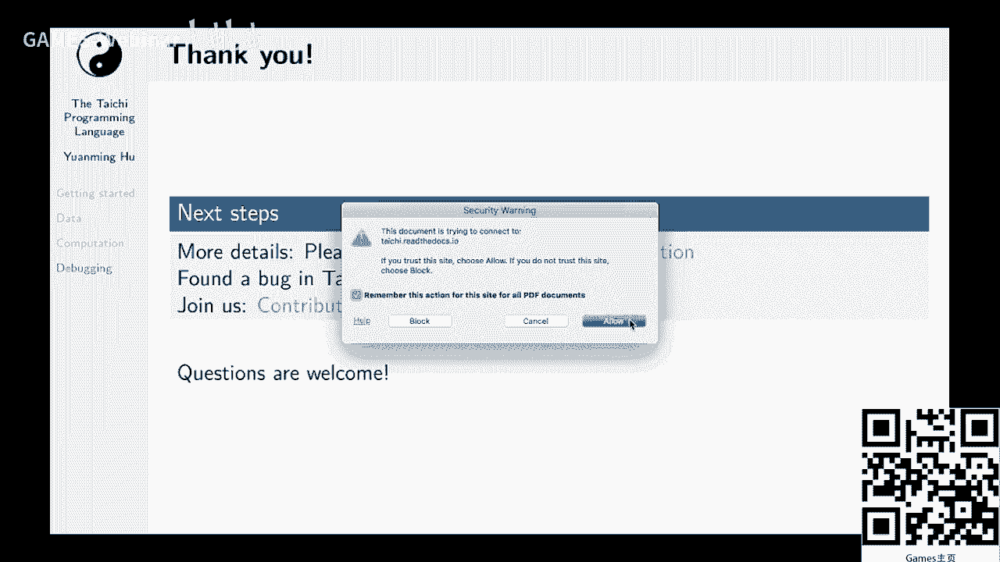

我一直开着这个，怪不得这么卡，好吧，我刚才不是关了吗。

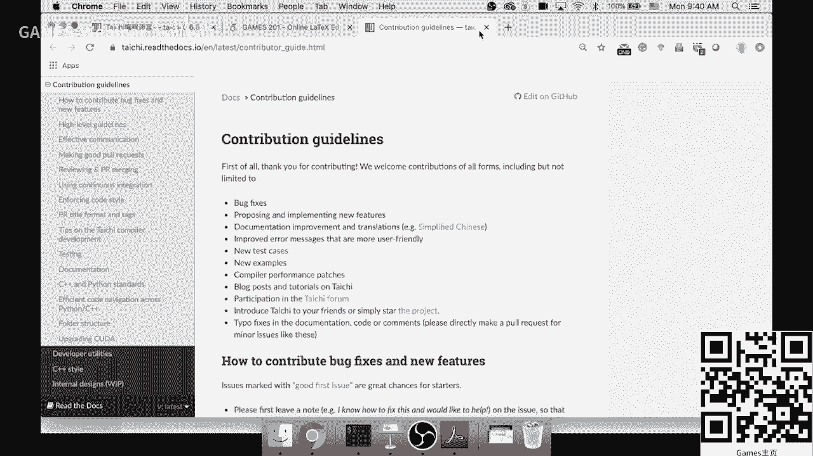

嗯这是贡献者指南，然后刚才有同学问怎么看中文文档。

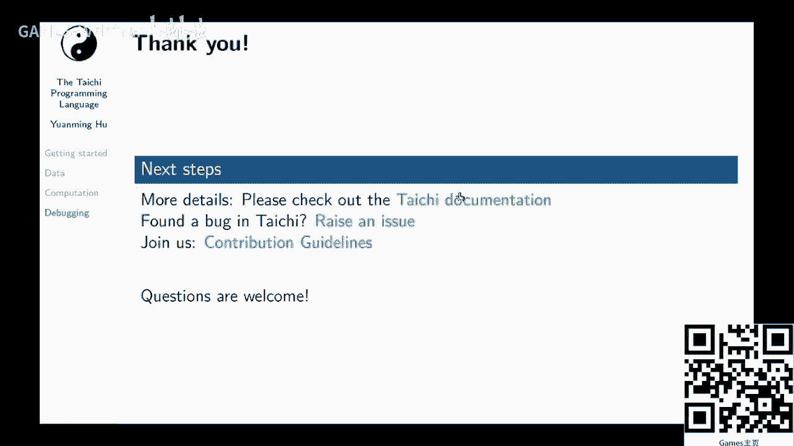

这边我应该讲一讲，因为中文档的同学真的翻译的非常辛苦，我觉得呃大家一定要去看一看中文文档，这个怎么看呢，就是，我看一下，其实哦你如果去太极的呃，官方仓库里面，你可以看到。

它其实是有一个简体中文文档的链接的。

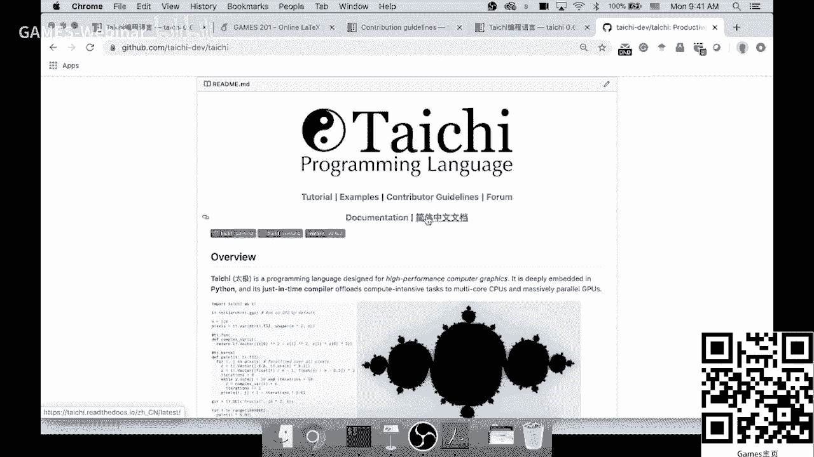

你如果点进去就可以看到简体中文档，基本上是我觉得真的翻译得非常的好，然后嗯我们经常更新，然后有的时候因为英文文档更新了以后，中文档才可以更新，所以有的时候中文章有一点点delay，对像这些我讲到的这些。

包括一些呃常用的故障排除问题啊，大家都呃以很和善的方式给他写的出来啊，对中文呢还是非常友好的，真的这边要再感谢一下自我中文档的同学，真的非常不容易。

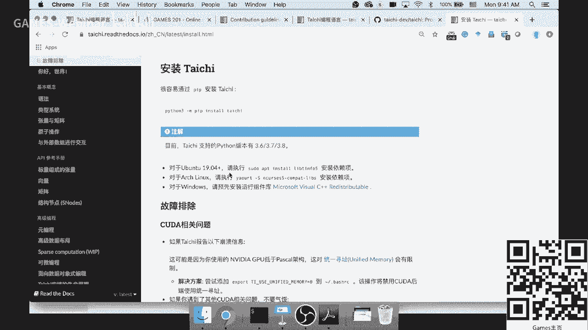

然后我回答一波问题吧，看看，我看看有没有，tensor可以套tensor吗，哦这个暂时不行，这个但是呢有的时候嗯，我想想哦，你如果是比如说一个wandy tensor，要套一个td tenor。

那你为什么不直接allocate three d tensor呢，对吧，为什么有必要用tensor套tensor，这个是一个奇怪的需求，但是这个问题非常好，泰迪有aibm的特性，这个正在开发。

还没有没有搞，没有完全搞定，然后pdf在是在哪儿下载，这样我讲完以后，我再呃课程主页和论坛上面去更新一下，这一讲的slice，作业如何提交啊，这个后面我会讲，大家先不要走，今天大家先别走。

今天讲的稍微有点超时，但是以后我们可能都会讲一个半小时的样子，因为我现在发现可能讲一个小时，确实时间有点紧，ok这个这个问题真的很多，呃mickle什么意思，mackl就说kerne里面你可以。

随便定义各种各样的操作，这个就和，比如说如果你用tensorflow或者ptch的话，那一个看重能做什么，你可以把两个tensor加起来，把两个tensor给它乘起来对吧。

那么这个kernel就不是一个mako，因为你这个mac kero，一个kerne里面这些内容非常简单，这个有会有一个什么问题，你的计算非常容易，但是你的保存非常多，那你的程序完全就是在被保存。

立block数太极，用mega girl的话，他的这个计算就会很多，仿真比较少，他就提高了这个计算vocality，让他arimatic intensity变得更高一点，然后我看一下。

太极和python直接框架可以结合吗，可以可以，我们有拍拖时的接口，除了github，github上那几个demo，还有别的demo吗，其实是有的，后面我会讲，然后多gpu我们现在暂时还不持有。

同学问太极有没有多gpu，但是现在我们还不认识，但是之前提到的那个c bb，2020年的多gpu m p m p m paper是支持多gpu，大家可以去看那个paper。

但是怎么自动的用一个编译器搞多gpu，这个还没有，我还没有想好怎么去实现，这是一个很好的研究的问题，菜鸡加速比较快的应用有哪些，光线追踪渲染可否。

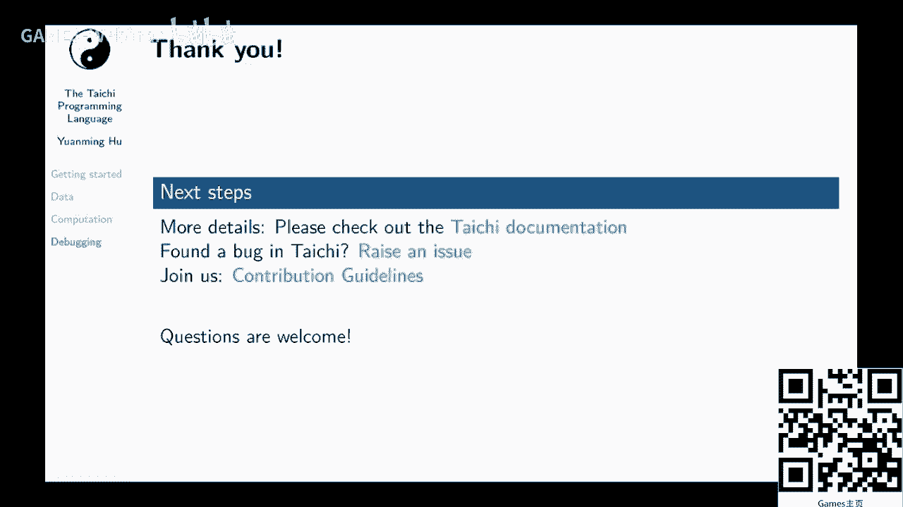

虽然有同学这么对光线追踪感兴趣，我就跑一个光线追踪看一下吧，但是这个问题是跑了以后我可能直播就掉线了。

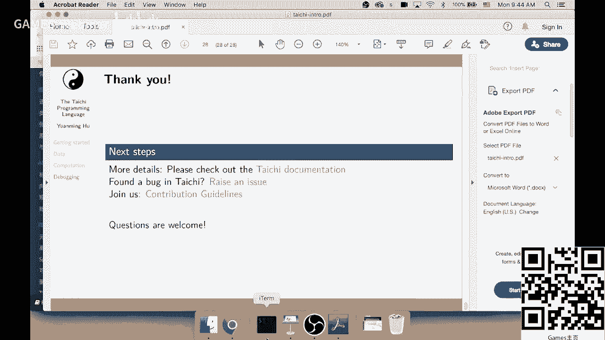

我试一下吧，叫sdf render，因为他这个非常的费资源，我就有点怕电脑非常卡，因为这个电脑非常非常老，那编译的时候我再看一看别的，问题有个同学说要送我电脑的，这就不必了，我我这个电脑用的挺好的。

这还能不能跑出来，这个实在太卡了，现在它既可以用来做布料仿真吗，呃可以可以，你可以写一个简单的布料仿真，但是真的布料仿真的话，那他很多地方其实最头疼的事情，是布料的自香蕉嘛，不相布料自相交。

现在时髦的搞法是用rtx什么retracing hardware，去做这些东西，我布料我其实不是专家，所以我只是说能写一个比较挫的哦，诶居然能跑，可以啊，这是这个一个简单的光线追踪render。

我来把它取关了啊，这个代码非常短，这个代码只有100多行，大家可以去看看，那这个材料就非常的简单啊，然后这个geometry是用s d f去绘制的，然后大家如果真的要学rendering。

那肯定要去看杨老师的课，我不是rendering方面的专家，但是我是我知道一些，怎么把代码写的比较短的trick，然后这个是一个我不能再让他跑再跑，这个风扇要起来，大家都嫌吵，赶紧把它掐了。

ok那我们看一下这个代码其实非常短，就100多行，大家有兴趣的话可以去看一看对好。

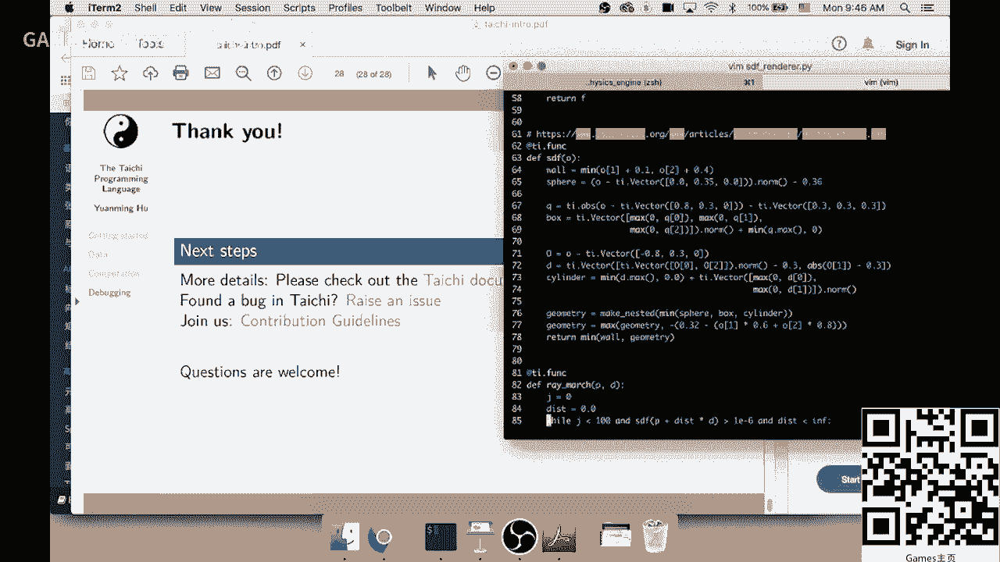

那么最后一部分应该还有几分钟，我们讲讲作业。

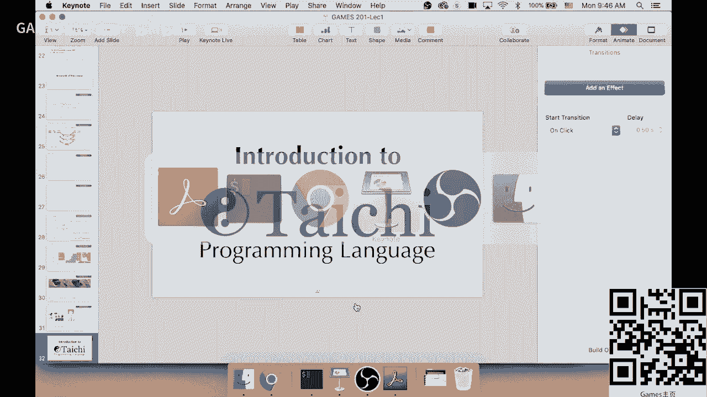

这个课的作业啊，其实工作量可大可小，因为毕竟有同学反映这个，有同学反映这个呃可能特别复杂的作业，可能会做不动，然后也有，当然也有同学非常积极，肯定觉得很想就上个这个课，然后自己写一个物理题出来。

这个肯定也是可以的，所以我们就作业就分成了两部分，五次简单的编码练习，coding exercise就非常简单，然后没有我们会提供标准答案，但是建议大家看答案之前自己先尝试尝试，这个我们不改。

大家也不用提交，大家就呃自己尝试尝试，然后第一次呃课，我大概可能明天后天，我release一个一些简单的编码练习吧，然后大家在这期间可以跑一跑太极的各种excel，然后看一看已有的太极代码长什么样。

然后我们有三个开放项目，开放项目可以呃1~3个人组队，希望大家都能玩得开心，然后嗯开发项目呢我们会有评奖，然后，获奖作品会在课上点评，然后呃获奖同学呢会收到我们的一个神秘礼物，这个礼物具体是什么。

大家到时候就知道了，那这些作业都是自愿完成的，这个我们没有任何强制的，大家可以根据自己的口味适当添加，嗯说的好像跟方便面里面的这个调味料一样，但是大家我们这个课会照顾到各种水平的同学。

然后但是我还是要强调一点，就是说呃纸上得来终觉浅，觉知此事要工行啊，这个实践真的非常重要，我觉得我从我的计算机统计学，基本上就是靠自己去实现各种各样的代码，学习了你在看懂文。

写代码的过程中就能学到很多东西，不一定要一个老师去指导，你就自己看这些东西，对自学能力有很大的提高，然后对代码能力有很大的提高，你如果要做计算机图形学的研究或者工程的话，代码问题非常非常重要。

所以虽然作业不是强制，但是我觉得想呃有收获的同学，最好还是积极参与一下这个作业的这个项目，那么第零个作业，第零个作业，这个不算在三个开放作业之中，这是一个非常轻量级的作业，然后这个作业是什么呢。

首先你装好太极对吧，如果你是python 3。6加的话，你可以直接嗯tap install太极，然后嗯这个好像写错了。

是不应该p更有意思，不好意思。

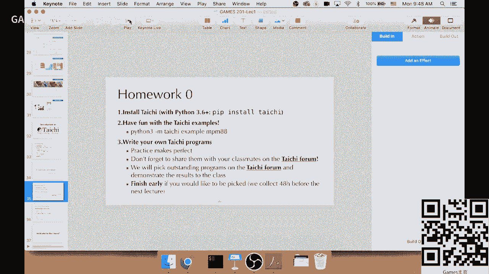

如果你转好太极以后，你可以尝试运行一些呃太极的example，你可以呃python 3杠m太极example。

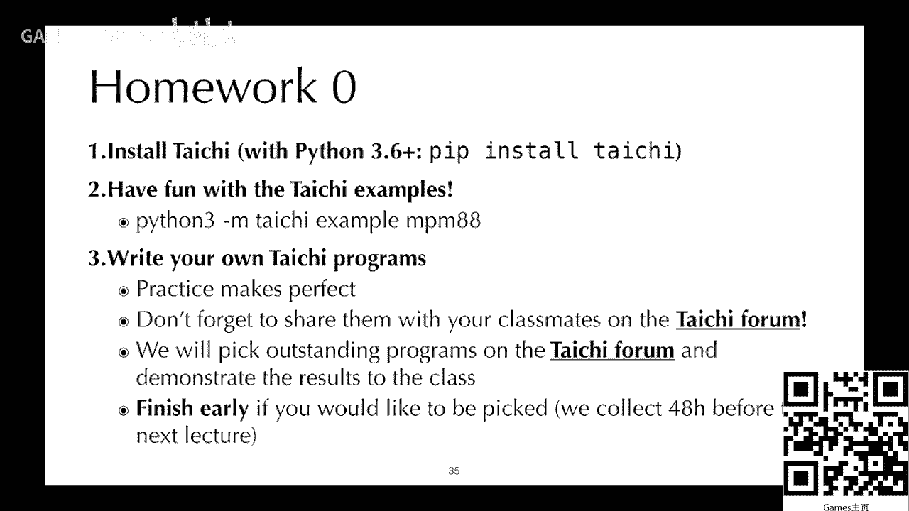

比如说m88 ，我可以run一些现场run一些，呃就是说run太极的excel有两种方法，如果你是装的太极的呢，你可以打ti呃，example，他会告诉你有哪些可以运行的example。

比如说他会告诉你啊，这些这个是网友贡献的学者，真的非常非常有用，如果说你没有提这个指令，有些有些同学可能反映装了太极以后，没有提这个指令，你怎么办呢，用python 3杠m太极，这个和ti是一样的。

你可以判三杠零太极，然后sample我们来跑一个，比如说m p m128 ，这个这个128好诶啊，不能加点开。

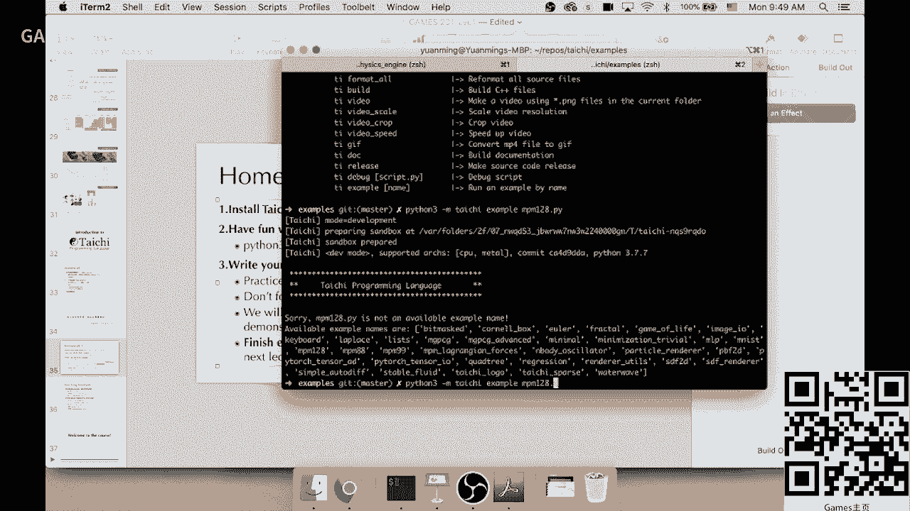

这个是个128行的npm代码。

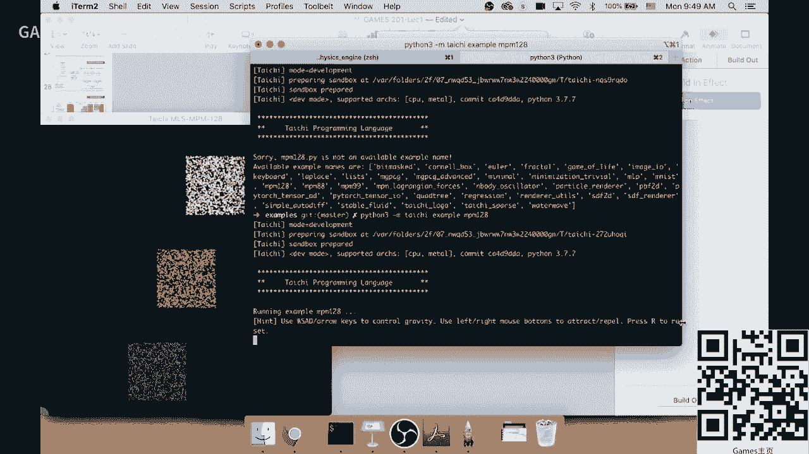

它是一个可交互的，我不知道这个这种情况还能不能跑，还能跑，你可以用鼠标去拖一拖，给他增加一些引力啊什么的，但是这个电脑实在太卡了，所以跑到60f p s这个也没办法，我还开着直播嗯。

这是一个比较呃交互的代码。

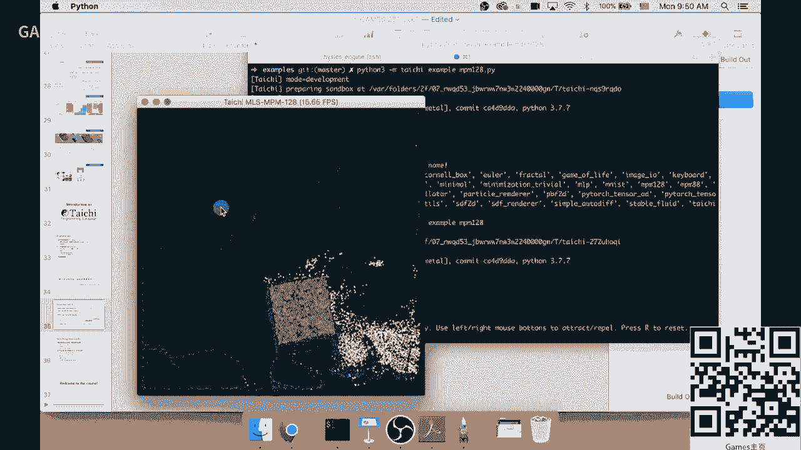

然后我们再跑一个别的跑一个，比如说跑一个sql fli，诶，好就不要加点拍了，如果是t2。3步就不要点开了，那这个是也是一个交互的例子，我们可以在里面画一画，画一画水波，但这个可能比较廉。

这个我们后面会讲到高级输送格式的时候，这个我们就我们就会提到，怎么样把数值连性降低。

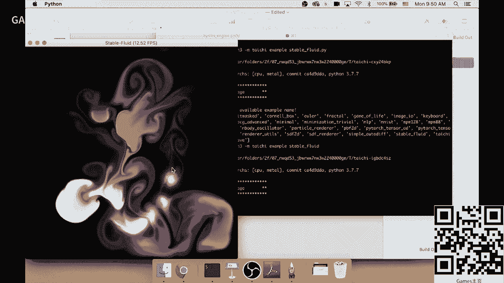

现在这个数据点有点高，我们可以再跑一个别的，刚才sdrender跑过来跑一个，换一个水波吧，我只会要不老是把胎带上，这个是彭于冰小朋友写的，很有意思，你就呃化学水平它会产生折射这个代码。

这些代码都非常简单，大家可以去看一看，非常适合入门，比如说我我可以给大家看一下，比如说npm 1888，这代码非常短，就真的只有128哈，我不是说什么，通过各种压缩把它当128行，那就真的只有这么长。

然后还带一个gui，就是interactive，这个在没有太极的时候，你要写这么个程序，你可能这些以前很难吧，我觉得而且换一台电脑还跑不了，我们再看一下water wave，这个也很短，就100行。

它其实就是一个应该叫final difference，time to make一个sober，我们再跑一个别的，有没有什么别的能跑的，比如说跑一个这个可能要box，我不敢跑，可能要box跑了。

我这个可能电脑就挂了，你套一个game of life，这个是一个比较简单的生命游戏的这个demo，神秘游戏的这个提出者。

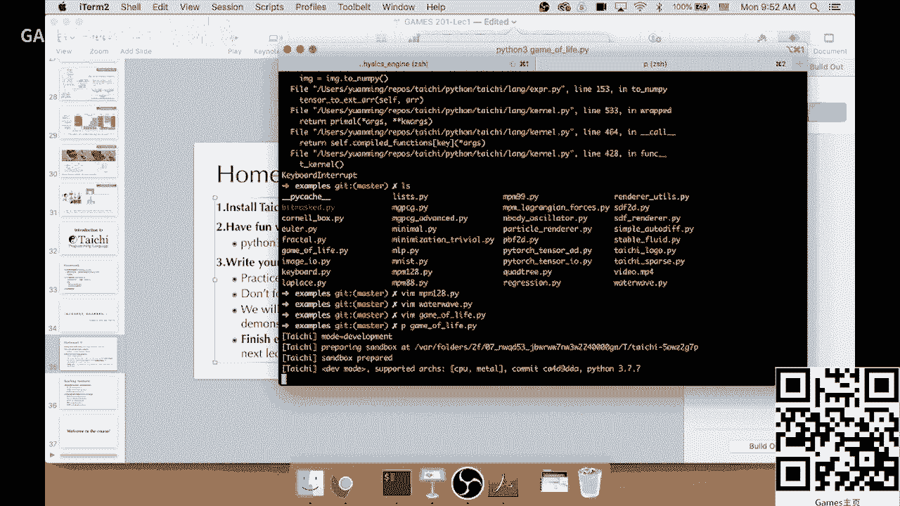

前一段时间因为新冠肺炎去世了，真的很可惜，这边我们就呃跑一下它的得意作品。

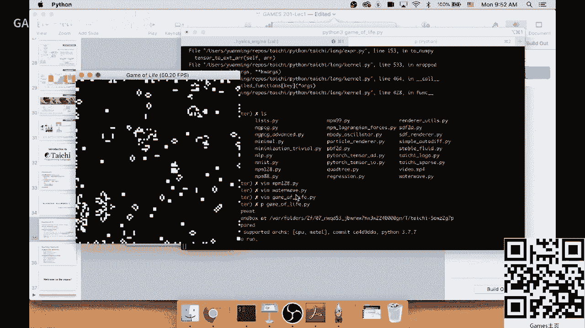

行我们我们我们刚才展示几个example，然后当然这个作业最重要的一部分了，就是大家动手写一写自己的采集程序，嗯我一直相信啊，这个熟能生巧，然后很多事情倒并不是说像媒体吹的那样，什么呃。

一个人呃天生智力有多高，或者什么不费吹灰之力就做到什么，但你会发现大部分人其实我我不认识这样的人，我认识的人都是好好努力，然后好好练习，然后最后才达到一个比较熟练的程度。

然后最后当然会呃媒体会各种造神啊什么的，但是你仔细去看他们，他们其实都非常努力，然后我觉得大家如果要想掌握这个编程语言，要练习要多练练习还是非常必要的，那么当然啊，如果你写了程序呢。

请一定要把它和你的同学们share在这个太极的呃，论坛上面，这样你太极非常portable嘛，你这个你自己写的程序，别人很容易运行啊，这边有几个问题，我得课后再来回复了，但你可以写一个帖子。

说我自己写又写了一个什么程序，我给大家分享一下，大家呃看一看指出一些什么问题，然后自己跑，然后别人跑一跑也很开心嘛，这个别人给你提供点反馈，也能学到很多东西，然后因为毕竟这个课上的人很多很多。

我们呃我还以及我们的助教团队，真的经历非常有限，因为太极本身还有很多。

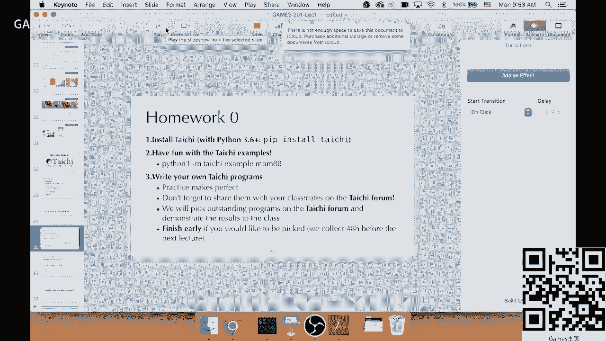

随着课程的进展，我们太极本身还有很多feature需要去开发，所以我们压力真的非常大，所以大家相互学习，这样我们这边就省事一点，我们就能更专注的把这个课搞好，那么如果说你想让你的程序被我们选中。

在课上展示的，那请早点把它结束，因为我们会在课程开始之前，二四十八个小时去选比较好的作品啊，因为我们需要时间去做决定，我们不可能说五分钟选一些中期出来对吧，嗯在follow里面。

大家最好能提供一个截图以及提供源代码，你可以在github上面他一个repository，然后去存你代码，你可以在论坛上面放一个链接啊，这这次是有奖品啊，如果大家被以后也是都有奖品。

如果以后大家呃程序被选中，被我们点评的话，都是有奖品的，那么最后我们介绍一下助教团队，然后我们助教嗯，有主要团队呢有分理论组和技术组，理论组同学主要负责在论坛答疑，然后筛选一些优秀的项目。

然后技术组主要负责与客人相关的，太极的各种开发与维护，因为毕竟太极现在是嗯还是处于一个比较早期，现在可能是全世界，也就嗯稳定的用户可能就30个吧，然后可能也就几百个人用过。

然后这次大家一下子来都变成稳定用户了，那肯定会发现各种各样的问题，当然我们之前已经竭尽全力修了很多的问题了，现在呃应该说不会有特别明显的问题，至少cpu by cat上面是兼容性是非常好的，呃这边对。

然后我们呃真的非常感谢，我，非常感谢八位主教，能够愿意帮忙，去参与到这个非常有意义的项目中来，因为呃我觉得我小时候就没有这样的课程，我都得自己去看各种英文的slide，那个时候看的非常费劲。

然后现在10年过去了，我希望我们这个课如果说能够启发一些同学，然后10年以后这位同学也能像我一样去呃，给大家开一个课，然后讲讲更高级的东西，那我觉得这个是对社会。

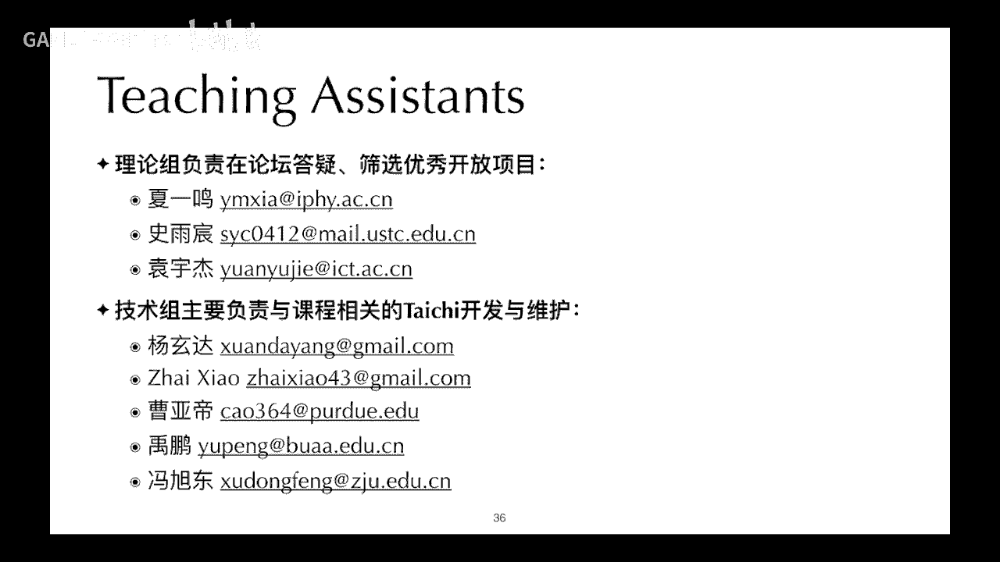