# GAMES201：高级物理引擎实战指南2020 - P2：Lecture 2 拉格朗日视角（1） - GAMES-Webinar - BV1ZK411H7Hc

嗯大家好，我是胡元明，还是这个熟悉的声音，然后我是mt的3年级博士生，我在研究这个基于物理的。

基于物理的动画，然后今天呢我们讲讲一些简单的弹簧，质点系统和一些简单的流体，我们开始之前，我们先讲一讲这个课程里面一些logistic的东西，然后首先太极，昨天我们已经更新到了v0。6。8。

然后呃有同学反应，0。6。8呢跑一些程序的时候，由于他这个语法检查什么可能变得更严格了，然后会导致一些编译上的问题，所以如果说大家遇到一些神奇的问题的话，可以试一下，可以重新继续使用0。6。7。

两个版本差异其实不是特别大，然后同时呢我们核心开发者们也在尝试，尽快的出一个0。6。9，这样可以把0。6。8的，这个有的地方会提示编译错误的问题给他修了，然后呃作业零。

我们在波士顿时间这周六晚上十点钟的时候，我们助教开了个会，然后我们选出了一些。

选出八个非常优秀的作品，然后这些作品呢我也写了一个知乎的post呃。

八个精致的太极小程序，大家可以去看一看，我觉得真的大家都写的非常给力，有的同学几个小时，那就把作业交上来，就感觉给人的感觉就是像座椅布置，就提交上来了，然后呢，有同学把自己领域的算法用太极实现了出来。

和我们大家一起交流，觉得这个你看看这个带绿的圆球，蓬松的网格，看起来还是非常的舒适的。

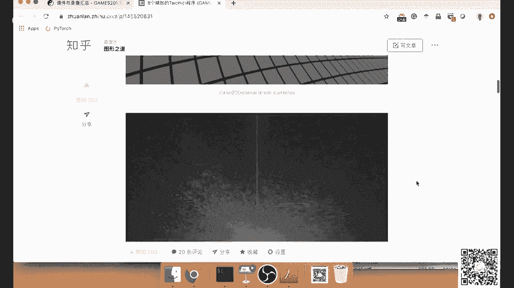

有同学用太极实现了一个离散蝴蝶变换，有同学用太极实现了一个tod holy ser，但这个后面我们会讲，大家不要看到有些很神的同学，一开始就呃无师自通，自己把这些东西全部写出来了，觉得非常紧张。

但是我们后面都会讲这些细节，所以呃这边只是展示一下大家写的程序。

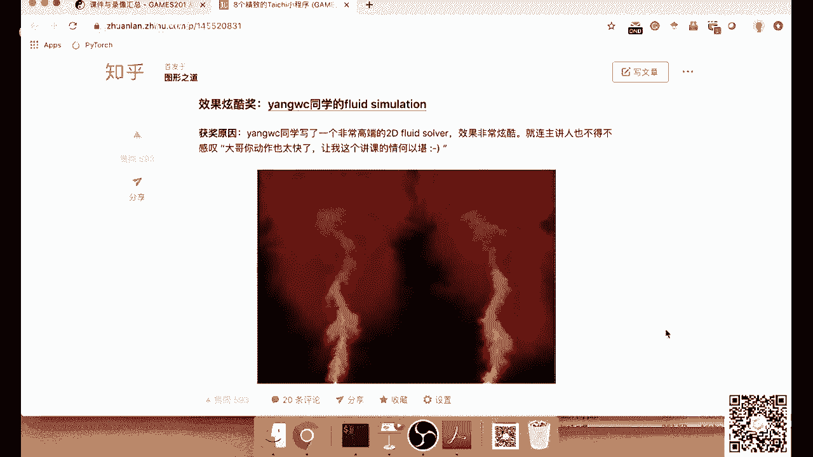

所以后面我们会讲，大家不用特别担心自己会跟不上，然后有同学用太极写了retro，这些程序呢大家都可以下载下来跑，一般也就100行代码，非常容易运行，然后也非常容易去学习里面到底是干什么。

然后有同学写了很多shader toy，这个是一个一个同学写的海面的一个shader，看起来真的波光粼粼，感觉真实感非常强，然后确实shader toy这些计算的拍摄，非常适合用太极去实践。

因为它基本上都是一个呃，按照per pixel的去做的这种这种操作，也有同学呢不但实现了shake toy，还对泰迪编系内部的工作原理，进行了刨根问底的研究啊，我们专门给他设立了一个刨根问底讲。

因为他发现一个问题，就是说太极的程序，有的时候编译起来会稍微有点慢，所以他就做了一个研究，是这个太极的编译时间，关于它程序的复杂程度到底是个什么关系，但我们也收到了这个反馈。

我们会继续去优化太极的编译器，当然啊最让人吃惊的还是这个，我们专门设计了一个叫写的好讲，因为我们发现任何词语已经难以形容，我们看到这份作业的时候的呃思想感情了，因为他真的感觉就是像课程还没讲。

然后就已经把整个课程的东西都实现出来了，当然这位同学是专业的cfd，从从业者人家是专业的嗯，之前模拟了一个叫卡门涡街的现象，就是说当你这个流体流过一个圆柱的时候，它后面会形成这些不断的在摆动了。

这些呃这些vertex或者说这些窝，然后这个很有意思，大家也可以把这个代码拿出来跑一跑，那么获奖同学呢会得到神秘课程纪念品，一个具体的我们后面会公布的是什么神秘作品，然后呃后面我们会有同学专门安排邮寄。

如果大家还想继续提交作业一样，作为零的话，我们还可以继续提交，然后我们会继续选出来一些比较好的作品，我送出礼物，那么下周呢我们会发布一个作业一，然后作业一的话呢就会和呃，它会加一些额外的限制。

因为作业零是大家自由随便写，但是作业一呢有可能会嗯会加一些，比如说必须写物理引擎啊之类的，这样的一些嗯这样的限制，但是这样的限制加了以后呢还是非常自由的，我比较喜欢自由的作业，我以前自己上学的时候。

我就不喜欢老师给我规定的各种条框框，最好就是你告诉我一个什么，然后不规定任何细节，我自己去按我自己的想法把它实现出来，然后有同学说，在python里面，就是这个python的i d l e里面。

运行太极会出现一些问题，确实是这样的，如果你用python运行会有问题，那你可以试一试用ipython，然后也可以用jupiter notebook，那jupiter notebook有一个问题在于。

你在jupiter notebook里面，print的时候会出现一个问题，你这个print，它不会帮你把太极克隆里面的print，打到你的p9 pter notebook上。

而是而是会打到你开jupyter notebook，server的一个终端，所以这个地方用起来就不是很方便，我们呃太极社区啊，都在一直非常努力的去不断的改进，当然毕竟这个课才开了呃。

目前为止才开了一奖对吧，有很多我们说非常非常多有意义的反馈，ok然后这次大家可能一共提交了几十个作业，咱们台上面，然后其实有一些很小，有几个很小很小的问题，大家只要稍微注意一下，就能比较容易的解决。

首先一个就是说代码格式的问题，这个python一般写的话，一般会我们一般会用自动格式化，然后规定一个代码格式的标准，这样的话呢大家代码格式就比较统一，然后你自己由于有自动格式化，你自己也不用去管啊。

比如说等于号左右两边有没有空格，这种头疼的事情，就可以交给自动投自动格式化去管，然后我们一般来说我们会建议用这个y a p。

y a p f，比如说我可以随便写一个程序，呃我这边比如说写一个缩进，是两个空格的程序对吧，然后，这边我又换成了六个空格，我故意的，然后我们来把它，如果说我们用都用y a p p呢。

我们可以直接用y a p p，然后杠i，然后再加上刚才那个a点派对吧，然后，怎么回事，可以先把这个去了再说，这个是空格不符合标准吗，还是，哦不能这个地方傻了，不能用pass，pass是关键字。

我们换成一个别的，换成一个叫process，你这如果，还是跑了这个，这个python就是有的时候有点奇怪，ok如果你把这个程序喂给你的y a p f，它会自动的给你进行格式化，你看我如果输入的这个程序。

它是缩进是非常不规则的，但是如果我一旦，比如说我这边还可以再稍微复杂一点，比如说我可以加一个a等于n，然后我pass这边我可以a比如说我加两个空格，然后加四个空格等于五，如果偶尔玩pf以后。

它会自动的根据呃p1 p8 ，把我的代码进行格式化，这样大家有一个统一标准以后，读起来就会代码就会读起来非常舒服，然后交流起来也很容易，如果你希望y p f直接去modify。

你的文件就得y p f杠i，然后再加上这个a点拍，这样你再打开你的a点拍的时候，它就自动格式化好了，所以很多同学会纠结，到底是两个空格还是四个空格，然后呃要不要这个等于号左右两边有没有空格，这种好。

很头疼的问题，这些其实都不用担心，我从来不担心这些问题，这些问题都是交给y p f去处理的。

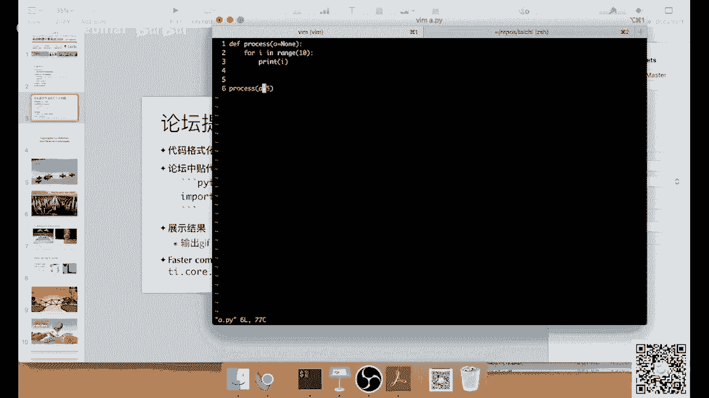

ok然后在论坛中贴代码，这是一个比较常见常见的一个问题，就是说这个论坛它其实是一个markdown的格式啊，一般来说我们是这样贴的，就是我们先打三个呃，这个叫backcourt。

这个这个符号在你的键盘的tab上面，e s下面，然后我们要打一个python，然后我们可以在这里面敲代码，这样的代码就会被自动的高亮，这样就非常方便，看起来也很舒服。

比如说我们还是用刚才这个代码。

你看到它如果你加了这个很简单的三个backward，再加一个呃python，然后他就会给你自动显示成python的语法，高亮就非常的看起来非常的容易阅读，也可以，应该也可以用c加之类的啊，不行哎呦喂。

但是呢呃如果说你不加这个，那你代码就会非常打印出来，贴在论坛上了，看起来就会比较杂乱，特别是这个缩进啊，这边好像就没有了，所以大家要记得加上这个三个符号，在开始和结尾的时候加了这三个符号呢。

那你基本上你的代码的格式就会被保存了，哦对刚才说的这个好，可以换成这个cpp对，那如果是cpp的话，你可以啊打写一些c加加代码，然后他会按这个搞的，但是pon的话就一般来说大家都用python嘛。

所以就直接python就可以了，ok哦然后还有同学一个另外一个常见的问题是，大家想输出一个动画，然后发到论坛上就会非常的炫酷，这个后面这节课，后面我们会提到一些新版本的太极。

如何导出一个gift的文件上传到论坛上面，然后有些同学说呃，编译的时候，编译的时候有的时候会编译速度比较慢，那这个指的情况呢，我们有一个一个有一个option，你可以调这个ti。core。

然后点togo advice optimization，可以把这些高级的优化，它是较高级的优化，其实也是比较耗时的优化，把它关了，这样你程序编译起来相对来说就会快一点，那么今天呢我们就初步的讲一讲。

基于物质动画里面的一些基本的概念，然后说到模拟这个，基于物理动画里面的各种介质，我们就不得不谈到两个视角，一个是拉格朗日视角，一个是欧拉的视角，这个看起来啊这两个词听起来好像非常的艰深。

但是其实它非常容易理解，所谓的拉格朗日视角的，就说我们去模拟这个戒指的时候，我们想想像我们自己在这个戒指里面塞了很多，很多个随波逐流的小纸船，然后这个随波逐流脚趾船呢，它会跟着你的戒指一起移动。

由于这个小纸船往往跟着戒指一起移动，通常的你如果用拉格朗日视角去模拟这个戒，各种戒指的话，你可能会采用呃拉格朗的例子，然后或者说三角网格或者甚至用green也是可以的，只要你的。

只要你的这个节点是随着你的材料一起动的话，那你这个就是一个拉杆儿视角，那么对于拉格朗的视角里面的节点，你可以认为每一个节点，就是一个很小的一个sensor。

这个sensor去不断地检测它自己的位置和速度，欧拉视角就不一样了，欧拉视角里面放的这些sensor，它是永远都不移动的，然后你可以认为它就是一些打在水里面的木桩，然后这些桩子放在这儿。

那这些sensor他不断在检测一个什么信息呢，它检测的是如果我站在这不动的话，那么穿过我的材料，它的速度是多少，那么其实有个口诀叫做拉格朗日方法，还是随波逐流，其实你只要记住这个区别就可以了啊。

有什么sensor其实就是传感器，就是说呃你可以假设，比如说温度计就可以认为是一个sensor对吧，如果你的这个温度计，是随着你的水一起移动的话，那么呃你这个就是一个拉格朗日式的温度计。

如果你这个温度计是插在水里面，一点也不动的话，那你可以认为它是一个欧拉视角的一个温度计，这两个概念，这个概念其实拉格朗日和欧拉的视角，这个我们后面还会再提，这里呢，我们只做一个最初始的一个介绍。

那么通常来说你如果用拉格朗视角的话，你很可能就是在用这些例子，然后你用欧拉视角的话，你很可能是在用网格，但是这个是不绝对的，有有些情况下，你可能会用这个拉格朗日的三角形网格，或者拉格朗日的呃。

这个hack网格，这这这种方形的网格，这些规则网格都是有可能的。

当然最最常见的情况，当大家使用拉格朗日表示的时候，大家使用各种各样的例子，然后左边呢我们展示的是一个呃，基于position based dynamics，这个叫基于位置的动力学的模拟。

你看它这个是一个各种各样的例子，通过各种方式给它连接起来对吧，然后呃他这个例子可以表示降落伞的绳子，可以表示降落伞上面的，这个降落伞上面其实拴的是一个兔子啊，大家可以看到呃，图形学里面。

大家很喜欢用斯坦福三维扫描出来的这个兔子，来作为各种各样的例子，这边可能看的不太清楚，然后你可以用来用这个粒子来模拟水，这个可以它可以用来模拟各种各样的东西，然后右边呢是一个典型的欧拉表示的烟雾模拟。

然后这个里面呢，其实就是一般是用一个背景的网格，然后网格上的每一个点，表示的是穿过这个点的流体的速度，那左边的这个左边的这个基于粒子的模拟呢，它的每一个例子表示的是这个例子，它会呃这个例子会携带什么的。

会携带它自己的速度和位置，所以呃一个常见的问题就是，欧拉的网格里面的每个点我们是不记他的位置，因为它位置很容易算出来对吧，因为你可以根据它的i j k下标，然后乘上一个调查x。

你就知道这个网格的格点的位置是在什么地方，但是拉格朗日的例子里面的，我们会在例子上面额外的记一个位置，因为这个例子会随着你的被模拟的戒指，去不断地移动。

那今天我们主要讲两个东西，一个叫做max ring system，就是这个弹簧质点系统，另外一个是s p h，后面我们会提到，那么这个弹簧质点系统呢，是一个非常非常简单的模型，但是它非常非常的有用。

它可以模拟很多很多有意思的东西，你可以用它来模拟布料，可以用它来模拟头发，可以用它来模拟这个弹性的呃，各种弹性的材料，比如说这边是一个可以看到有一只小狗，它被非常残忍的用弹簧质点模型表示出来。

然后被定在了呃，有有几个点把它固定在了空间中，然后呢，如果你用弹簧质点模型来模拟布料的话，那你就是相当于用很多很多的弹簧，把一些点给它连起来，然后你怎么连接这个弹簧，其实就决定了你的布料的性质啊。

这个地方，这个右边这张图展示的是一个比较基础的，这个弹簧质点模型来表示不了，然后这个里面的每一个红点就是一个支点，每一个呃每一条白色的这个线呢就是一根弹簧，然后这个其实非常不理解。

我觉得大家小时候应该都玩过弹簧对吧，后面我们会给出更数学一些的表述，这个弹簧质点模型啊，在游戏里面非常有用，我小时候就玩过一个游戏，叫做战争世界，然后这个游戏呢是让你用弹簧质点模型呃。

通过不断给它把它们连接起来，然后来呃搭起一个桥之类的，好像我记得当时是要达到一个目的地，还是越搭越高越，它有一个模式是让你达到一个目的，有一个模式是让你越打越高啊，但是呃你搭的高了以后呢。

由于你这个呃它下面的这个弹簧，它受的力就会越来越大，所以一定要保持那么理性啊，并不容易，还是一个挺有意思的游戏，最近又有一个游戏呃，我自己其实没玩过了，他就是其实你看也可以认为。

它是一个比较简单的弹簧质点模型，然后它的里面的物理呢是这样，就是说你嗯有一些不锈钢的这个材料，然后你把它不断连起来，然后使得你的车呢能够从左边，顺利的开到右边去，这游戏我看网上很多视频好像还挺有意思。

但是一直没有找到时间去玩一下，但是我小时候好像玩过很多类似这样的游戏，ok那么刚才我们简单的介绍了一下，弹簧质点模型，下面呢我们来讲一讲它内部的一些数学的原理。

哦对我应该先展示一下我昨天临时写的这个demo。

啊这个就是一个简单的弹簧质点模型，然后这个代码呢已经发在论坛上了，大家如果迫不及待的想跑他的话，也可以去下载下来跑一跑，这个demo里面有几个按键，比如说你可以按住空格把它暂停。

对这个demo可能需要0。6。8，大家可能得更新一下，然后你如果再按一下空格，它就会恢复运行，这个里面有两有两个参数非常重要，一个是弹簧的stiffness，就是它的这个硬度。

你可以把它stevens调大以后，你整个材料就会变得这个坚如磐石，非常的坚硬，我们这边来随便画一个网格什么的，然后我们可以把step调小，这个stiffness，其实就是你可以认为是呃。

类似young modulus的一个杨氏模量，然后它决定了你这个弹簧有多硬。

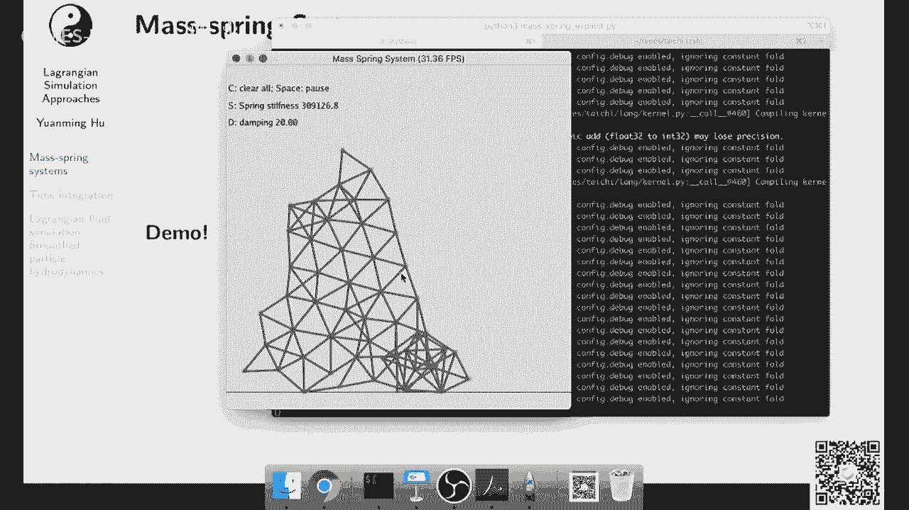

然后我们可以把这个steps给他，哎呦啊，刚才我成功的展示了一下，显示时间积分怎么怎么爆炸，我过会儿后面会讲到这个，为什么刚才会出现那种爆炸的现象，那这边呢我们把它我我应该是把它调软一下。

嗯我发现这个mac os x上面好像shift不work，anyway，如果大家是在用windows或者在用linux的话，你如果按shift加s的话，你可以把这个系统调的更软一点。

这个程序是我在linux上面写的，所以我之前没有发现这个问题，anyway，然后还有一个可以调参数是dumping，现在这个单品是比较小的，我可以把这个单位调大一点电，并调大了以后。

你会发现一切好像变得非常灵，然后这边我加的是一个非常简单粗暴的，直接给速度上面加了一个指数衰减，然后如果把电力调小了以后，嗯你的东西，你的这个物体它就会运行的更加灵活，如果dp大了，它就会显得非常廉滞。

很多游戏里面其实喜欢把产品搞得比较大，因为他不希望这个东西一直在不停的摆动，我其实可以演示一下，如果说嗯如果说我把这个dp调小一点，嗯我可能得现场改一下代码吧，不好意思，比如说我把这个用e。

用e来表示弹簧变得更更加柔软，你看我如果按了e的话，我会把它我的steps除以1。1，然后d呢呃d默认是应该提高单品对吧，然后，我们再加一个按键，比如说这个w我让w去减少点平。

ok ok现在应该welcome啊，我刚才一直想演示一下这个弹簧质点系统，如果stents比较小是个什么样的体验，我们现在来展示一下现在的这个step，你可以看到的是1万对吧，我可以把它调小一点。

不断再调小一点，它就会啊整个就蔫了，就不能支持重力，我可以把它再可以再把它调大，又不是，嗯我看一下刚才是应该是s监视o有点点。

现在我把它调的比较比较硬，然后w是调的比较软，ok嗯这个是一个挺挺好的，能够展示stephens的作用的一个结构，这个弹簧质点系统啊，你如果有的时候你把它先调得非常软，然后你再把它调的非常硬。

它不见得能恢复原来的形状，它有的时候就会形状就会卡在一起，我们也可以把这个单p调的非常小，现在单p是20，我把它调到一个很小的很小的值，单品小了以后啊，你这个整个系统就会像一个果冻一样。

它会不停的不停的晃动，但是你如果单p调非常大，那你这个damping就得想想办法，让它不要让一些平移的运动也受到单品啊，我这个单品加的比较弱智，它就是一个基于速度的嗯，指数衰减的单品。

很多时候大家单品是加在弹簧上面，给弹簧加单品，今天由于这个程序为了大家学起来方便，所以我们用了一个非常简单的点评modek，那么刚才演示了弹簧质检模型，运行起来是个什么效果。

那这边呢我们就给出一些数学公式，其实它还是非常简单的，大家不要被这个公式下到它，其实就是说白了就两个东西，胡克定律和牛顿第二定律对吧，我们先看一下胡克定律，胡克定律它这边是在做什么呢。

你可以看到它是呃i到j的这个受力，它是什么，它是k这边是呃弹簧的stiffness，然后你要乘上现在两个质点的两个质点，它们的距离减去弹簧的静止距离的，做一个差。

然后呢你这个你前面算出来这个是个标量对吧，那你得再乘上一个单位的向量，这个单位向量应该是什么呢，两个点之间的力应该是从x，是从这个i指向j的，然后我们把它乘起来，就得到了两个质点之间的手笔。

然后对于其中的一个支点，我们得算他所有的相邻的例子对吧，我们把它这个力再求和，就得到了质点i受到了所有的外力，当然这边还有一个重力呃，知重力我这边没有写出来，那么有了力，我们就可以根据牛顿第二定律对吧。

f等于a那么a等于f除以m，所以我们就得到速度导数呢是力除以它的质量，或者大家有的时候会在simulation里面，会经常写质量的质量的倒数承受力，因为在simulator里面。

在这个计算里面乘法比除法要更加的廉价一点，所以大家一般会把质量先提前取一个倒数，然后需要用的时候再把它们乘起来，然后接下来最后一行，那就更简单了，那其实就是这个位置的导数等于速度对吧，这个其实非常简单。

那么讲了这么多以后啊，其实我们下面我们来看一看，这个时间积分是怎么做的，我们刚才讲到我们刚才的这个例子，它是一个呃我们写出来的方程全部都是连续的，相相当于是一坨这个常规的方程对吧。

那么我们如果要在计算机中表示，就遇到一个问题，要有什么问题，计算机里面的时间全部都是离散的，计算机有用的计算资源也全是离散的，你不可能说呃，我取一个无穷小的一个时间为单位，来记录了系统。

那大家一般这个时候会怎么办呢，大家会取一个delta t这个调查器，一般来说呀呃比如说你可以是一个比较小的值，什么十的-3次方啊，十的-4次方，这个一般会根据你的嗯，物理系统的各种参数来取一个。

一般来说大家会喜欢选一个比较大的例题对吧，如果你dott比较大，那就是说你模拟同样长时间的物理过程，你跑得就比较快，所以调查进了一般认为是会越大会越好，当然这个调查题大了以后。

又会有很多的不稳定性的问题，这个我们后面会提到，那么有了这个，那么我们做了这个离散化以后，我们的v就不再是连续的连续的b了，这个b我们就给它加一个下标，这个下标是什么意思呢，这个vt就表示t时刻的v。

然后v t加一呢就是下一个时间不等v，那做了这么个操作以后，你其实就很容易知道呃，如果我们用这个比较简单的前向欧拉法啊，所谓前向欧拉法，就是我们根据现有的状态来推测，直接推测以后的状态。

那么你可以得到这么个简单的公式，那就是说你的下一步的v等于什么，等于这一步的v加上呃，deltt乘上你这一步的exciation对吧，这个应该很容易理解，然后呢对于x我们用同样的方法来处理。

是x一加一等于x t加上，掉下t乘上v时刻的速度，因为他们呃v是x的导数，所以我们其实向前累进了一步，那么这个forward oiler大家用的其实比较少了，大家一般用的比较多的是这个sei。

implicit oiler，或者有的时候叫大家叫做它叫做simplily oiler，然后他也是另外一个呃，根据现有状态就可以推出，推测出未来的一种时间计算方式，你可以你可以看到一和二。

这个forward oor和semtorder有什么区别呢，唯一的一个区别就在于这个公式，它的右下角这边呃，for oiler用的是t时间的速度，但是seven trc它用的是t加一时间的速度啊。

这个看起来是个非常非常小的差别，但是其实很多时候嗯他是一个呃，它会有一个本质的准确性上面提升，然后他之所以有的时候叫做simactive order，是因为它有一些守恒的性质，然后他向他呃。

它是在一个寒冰偷练系统里面，来做了这么一个理论分析，那么更高级一点呢，有的时候大家会用backward oiler，然后通常backer会和流动的，然后把结合在一起啊。

这样它就变成了一个implicit，一个系系统，这个后面我们会继续讨论，在此这边呢大家只要记得这个sein，sein place in order就行了，就是这么第二个这两个公式其实非常简单。

就是你假设调查t之类，这个v和x都是常数对吧，那你朝前呃，匀速直线运动嘛，这个应该还是比较容易理解的，那么呃用这个synthetic oiler来实现max min system嘛，其实非常容易呃。

其实就这么三步，你首先得计算一下你的新的速度对吧，然后计算新的速度以后，你和地面做一次碰撞，然后呃你用新的速度来计算一下新的位置，如果你去看他代码呀，其实就这么可能，20行代码。

这个是一个subs step，这个ero这个kneel表示，把你的simulation朝前推进一步，那么大，为什么这个地方叫subs step呢，因为一般来说你呃做simulation的时候。

你的time step size，不会和你实际上展示出来time step是一样的，因为你如果玩游戏的话，你的帧率是多少，是一般是呃60f p s对吧，如果做电影的话呢，一般是24fps。

那么你在游戏和电影里面，那帧与帧之间的间隔，或者说这个step size一般就是1÷60，或者1÷24，那么但是在模拟里面，很多时候你的time step取不到这么大的数值。

你可能只能取一个非常非常小的数值，那怎么办呢，我们把这么一针分成若干个substep，然后在每个sub step里面再用sim lc oiler来做，ok那么我们可以看这个是这个subsekernel。

其实非常非常简单，他做什么事呢，啊，我们它对于，首先它有一个n平方的一个破循环对吧，他先把呃所有的i枚举一遍，先做一下dping，然后我们计算呃总的受力，总的受力呢首先我们要算一下呃。

他的g等于mg对吧，这个是重力乘上particle的质量，然后我们再去枚举一下，其余的所有的呃，所有的例子，看他们之间是不是有联系，这边我用residence，如果是residents是零的话。

就表示这两个之间没有弹簧，如果residents不为零的话，表示他们之间有一个弹簧，然后呢，我们按照胡克定律的公式来算一下，这个例子的受力，然后我把力算出来了，算完了以后，我们用力来更新速度。

这个其实就是simply simplex oiler的第一步，然后接下来呢我们和地面做一次碰撞，为什么在中间和地面做一次碰撞呢，这个其实也是有学问的，如果说你在呃计算速度以后再和地面做碰撞。

有可能你这计算速度的时候，你的速度的有啊，你速度的，比如说你和速度的y component可能还是负的，那你的这个例子就会陷到地底下去啊，那这个看起来就不是很自然了。

所以我们呃一般来说会是在对于弹簧质点系统，我们会是在计算完力和速度以后，立刻和地面做一次碰撞，因为这个时候如果你发现它一旦有线到地底，地底下的趋向，你就可以立刻把它的速度的y component设成零。

那么接下来呢我们就很容易，我们直接把速度累加到他的位置上面去，就可以计算这个新的位置，那么刚才提到呃，cpc oa是一个显示的时间计分器，那还有很多影视的时间计分器，它们有什么区别呢。

我这边就简单的介绍一下它们的区别，后面在这门课里面，我们会讲到很多很多这样的计分析，然后呃会有很多很多的低调，但是如果一次讲的话，那大家肯定会听的比较无聊，所以我们今天就讲一些比较初步的东西。

那首先什么叫显示计分器，显示计分器啊，它的一大特点就是未来的状态嗯，只依赖于过去的状态对吧，那它就非常非常容易实现，因为你整个就是一整个程序，就是一个递推对吧，你从后面时间呃。

以前的时间直接推推到未来的时间嗯，显示计分器有很多种，然后有这个follow ur和和symatic oria，我们之前讲过，然后还有一些更高阶的显示向前的计算器。

比如说像2k2 k22 k32 k4 ，然后他们的数值精度就会更高一些，前置事件进风器有一个特点啊，这个不是一个特别好的特点，就是它非常容易爆炸，那什么叫爆炸呢，我刚才其实已经演示过了，这边有个公式啊。

就是说你的交叉t必须小于等于根号下，m除以k这个这个公式你看可以看出来，当一个粒子的质量变得越来越大的时候，它能够允许的调查t就会变大，但如果粒子质量变得非常小的时候呢，它的调查t就会限制就会更近。

也就是说允许调查t就会变小，呃相反了，如果这个例子，如果这个弹簧，它的k这个这个进度越来越大的时候，那你调大器允许的越大，气也会越来越小，所以说它对于特别硬的材料，其实并不是特别适合。

这边我可以演示一下，记住这个公式啊，这个是dott小于等于根号下m除以k，那在我们刚才那个例子里面，m是一，然后第2t是十的-3次方，那么你可以推断出来这个我们允许的这个k啊，大概就是十的六次方。

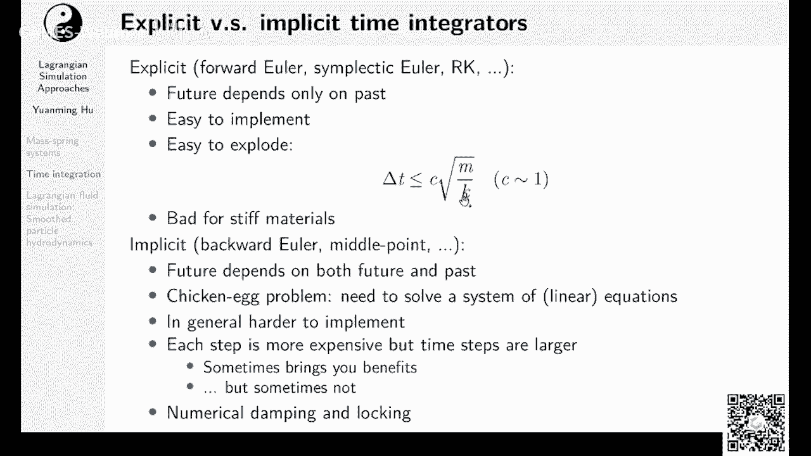

那么我们接下来演示一下这个爆炸是个怎么，是个什么状况，我们先随便画一个几何体，那么你可以看到呃，我们现在这个stevens是这个十是1万对吧，我们刚才推算出来十的六次方。

也就是说在你的stens在接近100万的时候，他就会这有一个爆炸的倾向，那我们来把它调得更硬一些，可以看到这个系统，现在已经弹簧已经变得越来越硬了，好注意，现在我们已经有50万了。

那么接下来我每按一下我键盘上这个s键，就是让它弹簧变得更硬的键，它都有可能会爆炸，我猜可能未来啊哈哈这个果不浅啊，不幸严重，你只要呃我估计这个是这个值，大概就是一个临界点，你接近这个值呃。

其实我们刚才预测出来的是100万对吧，现在60万其实也差不多，这个前面有一个常数，你可以看到他这个，他现在是在一个勉强稳定的这么个状态，可能有些时候还能勉强保持稳定，你如果一不小心它就挂了。

但是呢你如果呃把它再稍微减小一点。

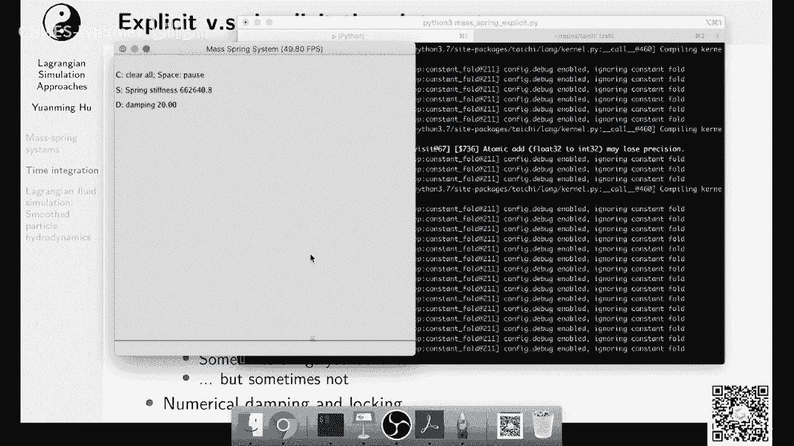

比如说减到捡到一个临界值以下呢，它基本上就不会发生爆炸的事情，啊也会涨啊，反正这个临界值有的时候它不一定是，一个非黑即白的，有的时候啊你靠近了以后，他只会会在一些特定的配置底下会出现问题。

因为我们刚才说的，这个k和m其实都是一些近似的，取得一些有代表性的值，那么这个公式，其实刚才有同学说这个公式怎么推出来的，其实你可以算一算呃，他这个振动周期，因为弹簧的这个omega是等于什么。

等于根号下m除以k对吧，然后啊k除以根号下k除以m，然后所以你这个地方基本上这个直觉就是说，如果说你在一个time step里面，你的这个系统本来应该震荡呃一个周期。

但是你现在没有完全的captured，你可能比如说这个震荡了两个周期，但是你只有一个time step，这种情况下，那往往就会出现问题，这个是一个比较直观的理解，当然也有严格的推理的方法。

就是这个follow er和synthetic oiler，你是可以啊，用一些，矩阵密的方法来分析它的数值稳定性了，然后这个就大家可以去看各种文献，然后这个在数值分析里面，很容易找到这样的内容。

那么刚才讲了显示时间计算器，很多时候大家会用影视时间计算器，比如说后向无拉或者终点法，这个终点法我们后面会讲到，那么后这个为什么叫它影视时间计分器呢，因为它有一个特点，就是说你的未来不止依赖于你的过去。

还依赖于你的未来啊，这个就有的时候像一个这个相机生蛋，蛋生鸡的问题，那你为了解决这个问题，你就得去解一个线性系统对吧，因为你的未知数会依赖于你的未知数，所以它就是一个非常复杂的一个信息系统。

那通常情况下来说，implicit这个sober它是更难以去实现的，那么在一个implicit over的一个time step里面，它的每一个step会更加的昂贵，但是它有什么好处。

他的step能够容忍的time sap就会变大，嗯有的时候这个会给你一些好处，有的时候他不见得给你带来很多好处，有很多同学觉得in place is over是不是一定就好，那倒也不一定对吧。

他嗯首先它有一个很大的缺点，就是难以实现，然后难以实现的话，那就说明它难以优化，难以优化，那你就做不了各种很复杂的底，在计算机底层的这些优化，比如说你想想做向量化呀。

想做在gpu上面用各种呃学的marry啊，各种各样的优化，那你如果写程序非常复杂的话，就很难去优化它，所以复杂其实是in place is over，的一个很大的一个问题，那么另外一个问题呢。

就是说由于他的每一个time step变得更expensive呃，有的时候你得去衡量它，这个呃到底是他的time sap变得更大了，给你带来加速更多，还是每一个time变得更加昂贵了，天天来的加速啊。

给你给你这个加速的反作用来的更多，这个他们两个就会fight against each other，会互相的打架，那你得去看一下到底哪一个方面更胜出，然后这样这样就决定了。

他这个server是到底是从变成licon，到底是变快还是变慢了，然后他还有一个问题呢，ap server有的时候会给你带来额外的neral damping，甚至会出现一些locking的问题。

这个所谓locking locking呢，就是说呃比如说你用有限元去模拟一个衣服，你会发现当你的衣服非常safe的时候，他有的时候啊，这个衣服他就会你如果用in place is over。

他再加上各种dumping的这个问题，那他这个衣服就会变得像一块石头一样，那没有人想去穿一个非常坚硬的衣服，对吧啊，所以rsa在很多时候呃有它的好处，但是也有它的joy，也有它的坏处。

那么我们现在来讲一讲弹簧质点系统，它的implicit time integration应该是什么样子，那么这个这个应该是一个bl oor的描述啊，首先我们来看我们这边有公式一和公式二，公式一是什么呢。

我们假设还是和之前一样，我们假设这个时间段内，它的速度是一个恒定的对吧，那你可以看到公式一里面嗯，它它它的xt加一依赖于v t加一公式二，公式二说什么公式二就是说我这一个时间段的。

我下一个时间段的速度等于什么，等于上一个时间段的上一个时间点的速度，加上delta t乘上这个时间段内的加速度，但你看这个加速度它用的是xt加一时候的force，也就是说啊一依赖于二，二又依赖于一。

那怎么办，我们可以解一下这个先做一步化简，把他们把这个一带入到二里面对吧，那你就可以看到得到了这么个公式三，公式三是什么呢，呃vt加一等于v t加上dt乘上m的逆啊，这个m的m矩阵是什么。

m矩阵是质量矩阵对吧，其实这边就是f等于a那么a等于什么，a等于m的逆乘上f，这边我们其实把所有的呃粒子的x都拍平了，变成了一个单独的向量，比如说如果我们有n个例子，那么x其实是一个3n维度的向量。

为什么呢，因为它每个粒子有x y z对吧，我们是假设在三维里面xyz，然后我们把它拍平了，这样就得到一个3n为多差，但如果你是二维的话，那你的这个x就是2n长度就是2n，那你的v长度也是2n。

那么从三到这一步，你会发现它是一个非线性的方程，为什么是非线性的，因为呃，你现在很显然你的未知数是vt加一对吧，因为你的vt和xt都是知道的，那这个非线性来自哪的，来自于这个f。

因为你的f它是一个往往是一个非线性的函数，那么怎么办呢，呃这个后面一般来说大家会采用的，下一步的搞法，就是说我们搞一波流论，我们把这个f在xt点处泰勒展开一次，泰勒展开一阶。

那么我们就可以把这个f xt加上dt的t，b t加一，给它展开是什么，给它展开成f x t加上f对于t的它的这勾边，然后在xt处的求职，然后呃乘上掉下t再乘上bt加一。

那么这个其实就是一个一阶泰勒展开对吧，那么公式四就是一个展开以后的公式，或者说我们叫这一步叫线性化，因为你做了这个操作以后，你整个系统就变成线性了，因为你这个地方啊，这个偏f偏x是一个线性系统。

是一个勾变对吧，ok那么我们把四搬过来到这边变成五了，那么我们做一下整理，稍微整理一下，其实就是做一下移项了，那么你就可以得到啊，它是一个这么个公式，就是说i减去掉到d平方乘上m的力，再乘上结构变呃。

这个整个是一个线性系统，然后这个系统呢扯上bt呃，加上bt加一等于bt，加上掉到t乘上n e f x t，这是一个非常非常nice的线性系统，然后那么我们怎么来解它呢，这个解线性系统啊。

在物理里面是一个呃，在物理模拟里面是一个非常非常重要的问题，有各种各样的方式来解线性系统，今天呢我们就由于时间关系，我们就介绍一个最简单的方式，就是夹克比迭代，那么除了价格比迭代呢，还有高材料迭代。

然后还有共轭梯度，共轭梯度里面花样就多了，你可以加各种各样的嗯，加各种各样的这个preconditioner，你可以跟我梯度本身还有各种变种，比如说如果你的系统是对称正定的，你就可以直接用共轭梯度。

但是如果有的系统它不对称，那它真有的系统呢它对称不正定，那就有各种共轭梯度的变种，这些server一般统称quite of subspace server，后面我们会专门有一讲。

介绍怎么用quite of subspace server来解线性系统，ok那么我们再整理一步呃，我们再把它写清楚一点，其实就得到了这么个东西嗯，a等于a减去这么一坨。

然后b等于a v t加上后面就是它的加速度，乘上掉它t对吧，那么你可以看到我们现在经过这样的一些整理，我们其实已经得到一个很经典的一个表述的，就是ax等于b，那这个这个是a b t加一等于b。

我们要解的是bt加一，怎么解这样的一个信息系统，调解这个线性系统啊，其实也非常容易啊，这边是一个太极的demo，这个是一个夹克比迭代法，所以这个夹克比迭代法在干啥呢，它的作用就是说我们每一次迭代。

我们啊都把未知数的一项换成一个值，这个值啊能够使得你如果只看他这一一行的话，它的右端项能够被满足啊，这个说起来有点绕，但是其实你如果看代码的话，其实非常容易，那这是单独的一部夹克比迭代代码其实非常短。

只有十几行对吧，如果说呃大家有兴趣的话，可以跑一跑诶，对我其实我就可以跑一跑。

呃这个biteration你可以看到我这边创建了一个，20x20的矩阵a然后有个位数x，然后有一个6x，然后有一个b b就是我们的右转向，然后每次迭代呢就是这么一个kernel，这个叫iterate。

然后除了迭代，我们有的时候还需要算一下residual对吧，你得算一下它的嗯，ax是b减去a x叫做residual，然后算了个recedure l too long，这边是，然后我们初始化矩阵。

然后我们就可以算了，这个程序大家可以跑一跑，你可以看到呀，我们一开始的时候residual非常大，经过若干次迭代呢，这个residual迅速的就变得非常小，但是这个收敛速度还算比较慢的。

如果你用共轭梯度的话，用根本用不了这么多这么多次迭代啊，这边只是为了图简单，搞了一个比较简单的夹克比迭代。

那么这个算法他的直觉是什么呢，他的直觉就是说我每次都更新一下我的x，使得这个x能够把我这个矩阵的这么一行，或者其中的一个线性方程组可满足，但是你每次做这种更新，也不见得他就每个都满足对吧。

因为你每个更新都是局部的，而且呃你改了这个x以后，你可能修了这一行，下一行挂了，然后修了第二行，第三行又挂了，所以这个要迭代很多很多次，然后不断的才会收敛到一个值，他也不是总是收敛的。

他只会对一些呃性质比较好的矩阵那个收敛，也就是说他的谱半径得有一些要求，然后今天我们就不讲，今天我们就讲一个呃，怎么去实现，他用太极实现它这么一个非常简单的一个概念，后面我们会讲更多关于线性系统。

怎么去sop的方法，那么刚才看了这么一个复杂的公式，其实你会发现，如果说我们给这个公式里面加入一个数，叫做贝塔，那么我们其实就可以嗯，把forward和backward oiler给它整合到一起。

不好意思，这个三这个地方应该是贝塔等于一，这边有一个type，然后如果说我们贝塔等于零，那我们得到的是一个什么样的系统，如果贝塔等于零的话，那么左边v左边这个一整项它其实，就是单位矩阵对吧。

因为你这个是零，那其实就是一个单位矩阵，那你就可以直接把它消了，那你就得到v t加一对，v t加上这样的一个呃公式，那么相当于他就是一个一个显示的，选项的积分器，如果你贝塔等于1/2呢。

那你能够得到一个终点法，重点法它可能比ba在数字经路上，有些情况下会好一点，如果你贝塔等于一呢，贝塔等于一的话，让大家脑补一下，这个地方是一啊，那其实就是刚才那个公式，哦这边有同学问为什么不直接求逆啊。

这是一个很好的问题嗯，解矩阵的时候，很多时候会呃直接去求举个例，然后把这个因为我们这边看到这边是呃，a b t加一等于b对吧，那你其实有个公式，就是bt加一等于a的逆乘上b。

那么求取能力啊是一个非常昂贵的操作，在矩阵比较小的时候，你求你还还可以求求这个就比较省事啊，如果说矩阵非常大的话，你求这个力矩阵很多时候矩阵都存不下，为什么呢，因为你这个a啊往往是一个稀疏矩阵。

这个我们后面会提到，但它的力呢就不一定是个稀疏矩阵，它这个a它的力可能变成一个重密矩阵，那你的内存就存不下，那么呃还有一些别的方法，比如说去呃，不求你，我们去直接用一些呃直接解法。

比如说pardl这个direct solver，也可以去求这样的系数，线性系统，其实在如果你有party sol的话，用partial解这个系统的话还是挺省事的，那么这边我们就不多讲了。

后面我们会提到各种解线性系统的方法，这边迭代法因为比较容易在太极里面实现，所以我这边就讲了一下迭代法，啊刚才就有同学问，其实就是在解，我们其实已经提前讲过这一页的这个东西，如果说我们有成千上万个弹簧。

成千上万个支点，那怎么办，这个时候我们就得使用呃，重使用这个稀疏矩阵，然后可能得使用一下共轭梯度，还得做各种各样的预条件preconditioning，然后还得做一些呃物理模型上面的。

在精度和速度上的取舍，比如说你可以用基于位置的物理对吧，这个p p t，然后呢也有一些完全不同的，解决这个发动我这个弹簧支点问题的方法，比如说呃有一篇很有名的paper。

叫做fast simulation of mass brain system，这个是一个非常好的paper，然后它里面其实就用了一个不同的formulation，让这个问题solve的更快了。

大家有兴趣的话可以作为扩展阅读去看一看，ok那么我们刚才讲了弹簧质点模型，这边呢，呃接下来我们讲一讲smooth particle haynamics，就是这个呃拉格朗日法的这个呃。

解流体力学的一个一个方法，这个smooth party还是dx，一般大家叫s p h，这个s p h呢它的高层的idea是什么呢，就是我们用一坨粒子，然后每个例子呢上面携带一些物理量。

然后再用一个核函数去呃近似一个连续的长，然后这边这个公式啊其实它也非常直观对吧，那就是说在x这一点，它的这个物理这个场的值等于什么呢，我去给周围求个和，然后求和的时候。

用这个核函数去加权平均我周围的例子，然后呃这个其实严格来说不是，并不是一个加权平均啊，这边只是直观来说，它其实就是做了一个类似于smoothing的，把它周围的例子给它光滑了一下，怎么个操作。

然后这个核函数呢它是中间大两边小，所以它可以让接近这一个点的例子贡献更多，然后远离这个点的粒子空间更小，当你的粒子特别远超过一定的范围，比如说超过h h就是和这个核函数的这个啊support。

或者叫做它的半径，超过它的半径以后呢，贡献就是零了，那么这个地方a可以是呃，几乎任何随着空间变化的物理物理量，比如说可以是你的速度，可以是你的density对吧，可以是treasure。

当然你如果要求导数的时候，那这个就完全是一个不同的故事，后面我们会提到，那么这个s b a这个方法，一开始的时候是用来求天理物理，然后他有什么好处呢，它有一个最大好处就是它不需要mesh。

它非常非常适合用来模拟啊，自由表面流体，什么叫自由表面流体呢，就是说呃比如说你有一盆水，然后这个水有一个水和空气的界面对吧，那这种它有个自由自由表面，我们就叫它自由表面的流体。

那什么样不是自由表面流体呢，比如说你做一个烟雾模拟，那它就不是地表面雾模拟对吧，因为你的这个呃不管你有没有烟，你都是有空气对吧，所以啊它整个空间都是被填满的，所以烟雾玻璃就不算作自由表面玻璃。

所以很少比较少有人用s p h来做烟雾模拟的，因为你用sp制作烟雾模拟，你得把整个空间全部粒子填满，那这个有的时候嗯就比较coser，那么相比于其他的把空间填满的模型，比如说grade。

那这个particle overhead还是比great的要高一些，所以大家一般情况下如果要做烟的话呢，一般就是用一个background grade来去表示背景的速度，长呃。

我觉得s p h还有一个很大的好处，就是它直观上面非常非常容易理解，你就可以理解成每一个例子是一个呃一小包水，那当然是严格来讲它并不是这个case，但是你这么一开始这么理解，其实也没有什么问题。

那么用s p h言来模拟流体，其实最简单最简单的方法呃，叫做wc s p h，weekly compressed by s p h，它不是大家都知道水它其实是不可压缩的对吧，但是呃你要实现不可压缩的。

其实是要下一番功夫的，所以一般情况下大家会做一些呃，如果说入门的时候会做一个可压缩的流体模拟，那么关于这个流体模呃，这个weekly compressor s p h，它最关键的其实就这么一个公式。

就是v对t的导数啊，这个d是材料导数，你就可以认为是粒子呃，某某一个s ph的例子，关于时间的导数，这个为什么用这个d大地，而不是用小弟或者用或者partial，这个我们后面会下一讲。

我们会提到他这个叫做材料导数，这个材料导入非常confusing，他有好多好多的名字，它可以叫material divity，derivative，可以叫lagroni divity。

可以叫这个convective derivative，然后或者叫vection dury，有好多好多名字啊，大家只要记得这个大地是表示跟着粒子动的，这么一个导数就可以了，嗯然后它的速度的导数是什么呢。

那么首先你液体里面都有个压强对吧，那你的压强的梯度，就会影响这个流体的这个粒子的速度，但你当然你得把它除掉呃，压强梯度得出一个密度对吧，才得到它的加速度，那么左边呢是流体的内力，那么加号右边就是重力。

就是流体受到的外力，但这个记忆一般来说，有的时候大家会用它的指重力，有的时候大家就图省事，各种各样的外力都把它算成g，那么压强是什么呢，刚才我们提到ph，可以用来近似表示流体在某一点的密度对吧。

那么一般来说呢，这边压强如果在wc s ph里面，就用用一个叫做呃equation of states，的方法来表示压强，那这个压强还有这么个公式，就是压强等于b这个b是box modules b。

然后再乘上roll除以rolling，rolling是一个理想的一个密度，那么roll除以roll 0的ga次方减掉一，那么呃你可以看到直观上来说，如果说肉非常大，那你这个p就会非常高。

那你就会压强很高，压强很高呢，它就会推着周围粒子离开自己，相当于他在尝试保持自己的体积，呃然后呃wb c s p h还是用这种经典的ax，是用这些东西来近似的，然后roi呢是这么个表示方式。

基本上所有的s p h里面的ro呃，每一个例子上面的肉，都是通过它的周围粒子的质量来加权得到的，当然你如果去仔细读w c e s p h这篇paper的话，它里面还讲到各种各样的扩展。

比如说怎么去加表面张力，怎么样去给它加联系，然后一个非常非常好的tutorial s ph tutorph，tutorial是这个uh s ph technics for呃，g物理动画。

在呃流体和固体里面，这个大家可以去打开来看一下，它是一个网站，然后上面是现在最懂s p h的一帮人，在图形学里面最懂p h的一帮人做了一个教程，非常非常的好。

然后大家如果去看这个w cs ph paper里面，你会发现它的导数用的是小d，那么用小d在这种情况下就有一点呃起义，一般来说我们会用大地啊，小弟，它这个导数就给人感觉是一个全微分的感觉。

这个感觉就呃非常的confusing，一般来说在particle里面，我们会用大理表示它的物质导数，就大家不要被这个文章里面的，有一个符号给误导，刚才提到了，我们可以用这个ax m公式来去。

在每一个粒子处，计算出这个粒子所在的这个位置，它的物理量的值是多少对吧，那很多时候我们需要算它的梯度，算梯度怎么办呢，比如说我们刚才就有一个呃这个压强企图，这个grad p那么算梯度啊。

我s p h里面有一套理论，然后呃他算梯度有一个特别的算符，这个算符长的是这样，看起来看起来好像很奇怪，然后你仔细去推呢，你会发现，他其实并不能按照从上面这个推出来，然后它的值这个下面这个梯度的值。

然后也不是特别准确，但是他有这个下面梯度，为什么还大家还用这个梯度公式，是因为它至少在s p h里面，它是对称对称了，就能保证成保证它是动量守恒的啊，然后有了这个公式，大家就可以计算这个gradp。

那么如果你不用这个公式去算这个gradp啊，那你这个系统就会出现各种各样的不稳定性，当然如果说你要算高阶的梯度，比如说lapsing paradi，如果你要算联系的话，那就得算这个拉普拉斯对吧。

那你又有又又有ph，里面又有一套额外的公式来算拉普拉斯，所以这个地方可能是ph里面，不特别优雅的一个地方，那么刚才讲了这么多，其实你要写一个s ph也非常容易对吧，那其实呃刚才讲到上面的这两个公式。

第一个实际是一个应该是欧拉方程，它就是实际上不考虑联性的lai stokes equation，然后呃右边是一个压强，这个是equation of states对吧，它的u s就是说压强关于密度的关系。

那么这个sp啊，这个weekly compressed by sp是它的c是什么样呢，首先第一步注意每个例子，我们去算一下它的它局部的density对吧，注意啊。

这个例子他自己不carry density，这个例子啊，他carry的是它的质量，然后他的dcd是通过质量去估计出来的，然后呢有了这个每个例子上面的desty estimation。

我们可以啊对于每个例子，我们用刚才我们讲的梯度的公式来算一算，这个例子这个地方的压强的梯度，那么有了压强梯度以后，其实就非常好算对吧，因为呃你可以看到这个v对t的导数嗯，我们直接把它带入进来。

你可以得到直接我们后面用一个simply order，就可以和刚才的弹簧质点模型几乎一模一样，几乎一模一样，你可以看到这个s p h和弹簧质点模型呃，其实有很多层面上是非常像的。

你甚至可以认为s p h里面，它其实弹簧是长什么样的，它就是一个粒子和周围的以h为半径的粒子，中间有这么个弹簧，但是这个弹簧它符遵循的不是胡克定律，而是而是s p h推出来的这么一些呃，物理关系。

那么sp是有很多很多的变种，那么这里讲几个我还算有一点了解的，首先呃一个变种是叫做p c r s ph，我们刚才讲的weekly compressed by ph。

它其实是你可以认为它是一个呃显示的格式，那p c r s p h是什么呢，它有点像是一个implicit的一个s p h，它是一个影视的时间积分，但是呢他又为了性能，又他又做了一些取舍。

它不完全是影视的，那他就是呃用的是一个叫预测校正的一个格式，它每次先预测一下粒子的位置或者速度，然后再根据这个预测做出一些校正，然后不断这样校正，不断这样校正，这样就得到一个比较好的一个速度。

这个速度场有什么特点，它的散度比较小，速度场五散，就意味着你这个流体更加接近不可压缩，那么另外一个呃变种最近非常流行，这个几年前提出来的是这个position based dynamics。

这个在实时的情况里面非常频繁的被使用，叫做pdf呃，p bf其实就是pp d position with dynamics，和s p h结合起来以后，得到了一个模拟流体的一个方法。

太极里面其实是有这个例子，这个是荒野大神给我们无私贡献的，我我看一下现在还能不能用，发布了一个新版本。

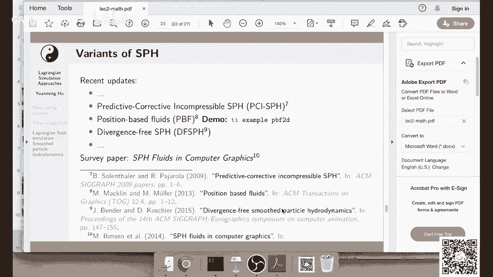

有的时候我都不确定应该是没有什么问题的。

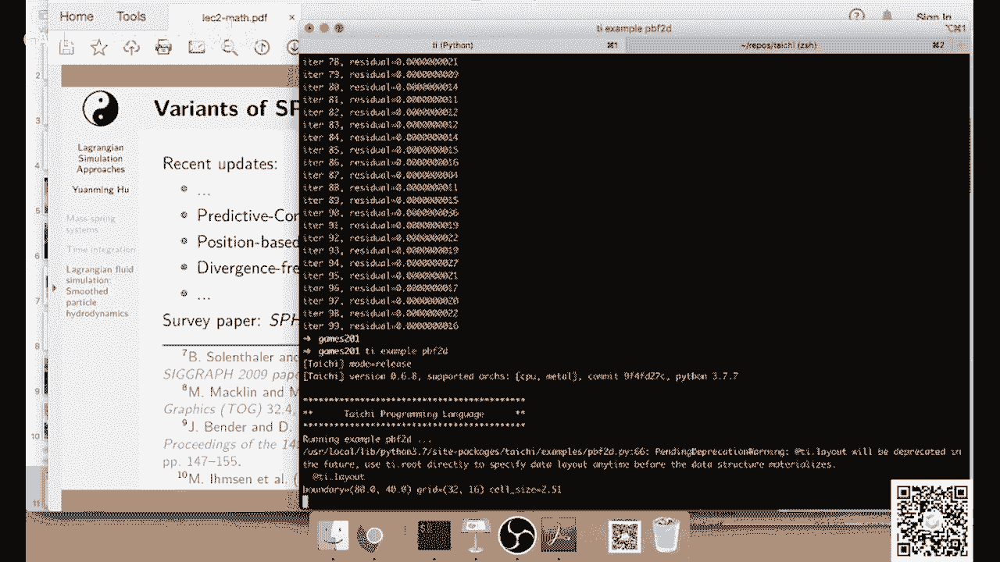

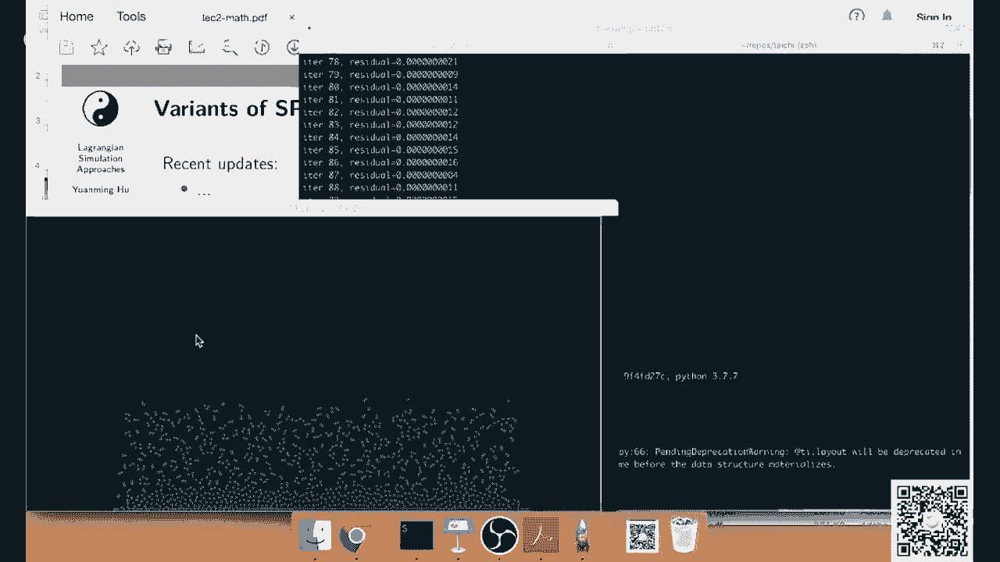

诶看起来没有什么问题，这个就是一个position based fluid的这个demo，大家可以有兴趣的话，可以自己去跑一跑，我觉得还是挺有意思的。

然后最近还有一个呃叫divergence fs bh的，然后类似的也是一个呃，强行去enforce这个incompressibility一个方法，这个divergence free说的是什么。

divergence free呢，是说的就是他的速度上是divisions frame，如果大家想学更多，有一个three paper呃，这个是比较早的时候。

这个s p h in computer graphics，这个是2014年的时候，我记得我上大二还是大三的时候，我当时就看了这个paper入门，但是最近有一些更新的材料。

大家可以去看我之前提到的这个tutorial，应该是这个六，这个tutorial是一个非常好的ta，它里面有各种各样的demo，如果大家想学的s p a的话，可以去看这个tutorial。

那么说到显示时间积分或者s p h，其实有一个东西啊非常重要，就是说叫做cfl condition，然后一般来说刚才之前我们提到显示时间积分，有一个公式，就是说就是你的呃调查x要小于等于c乘上。

根号下m除以k对吧，那当你的呃系统比较step的时候，你的地铁就不能太大，要不然你的系统就会爆炸，那么这个是从材料的刚度，材料的硬度的角度来考虑的，时间不长的限制，一般来说另外大家还会有另外一个限制。

就是说从粒子运动的速度来考虑，时间不长的限制，那么呃这个叫定义叫cory number，cury number是什么呢，c等于你的粒子运动的最大速度，u乘上da t除以调查x deltx是什么。

deltx在s ph里面，一般就是呃你可以认为它是一个h，顶多差一个常数，就是说一般可以你可以认为是粒子的半径，然后u乘以交叉t是什么意思呢，就是说在一个时间步之内，粒子移动的最大距离。

那么这个数啊你得这个cury number，你在模拟的时候，你得让它小于等于一个c max，这个c max一般来说大家会取几个接近一的值，呃，这个可能是0。1到十之间。

都有可能取决于不同的simulator的数值稳定性，他的这个脾气有脾气好的呃，你可以做到十脾气差了，你可能0。10。1以上就炸了，那么这个c一般大概叫做cfl number。

或者叫quin number，一般或者大家审视的就叫它cl，因为这个corn这个词不是很容易读，嗯然后这个公式有什么用呢，这公式用处大了啊，如果你做任何的影视呃，这个显示时间积分。

你可能都得考虑这么一个公式呃，你考虑要不然你的这个simulation特别容易炸，比如说s p h里面，你这个cfl一般来说，大家就取一个接近0。4的值，如果说你的粒子运动的太快了，那怎么办。

这个时候你就得考虑一下，把调查t是不是该减少一点啊，要不然你的这个呃系统就会非常不稳定，在npm里面呢，大家一般取0。3~1m p m就是material method。

然后flip flip就是fluid，fluid，tracy，particle是一系列方法，如果用flip做smoke的话，一般可以用一个比较大的值，可能是一五甚至12 十都有可能。

当然npm和flip我们后面会详细介绍，如果你要加速s p h啊，那这个里面学问可大了呃，目前为止我们看到这个s p h，它的每一个时间步的时间复杂度是多少，是o n平方对吧，n是粒子数目，为什么呢。

因为你对于每个例子，你都得都得去枚举其他所有的例子，然后去estimate这个例子，局部的呃density也好，压强也好，但是呢在实际情况中，你这个欧文平方这是一个非常非常大的数字。

一般情况下你如果n可能是100万啊，甚至十甚至这个1000万，那n平方那肯定就不能接受了，那实际情况下大家会采用一些空间数据结构，来加速neighborhood search，然后这个就可以呃。

把你的时间复杂度从o n平方到降到o n，所谓这个ighborhood search啊，就是说我对于每一个例子，如果说我能够精确的找到，和它距离不超过h的所有例子。

那么我们是不是就不需要去loop over，其他所有的例子，而只需要去loop over，和我比较近的这些例子就可以了对吧，那么怎么样对于一个例子去找他周围接近，比较和它比较近的例子呢。

啊其实也非常简单，我们可以直接搞一个data structure，然后这个data structure里面就是一个boxl revocal grade，里面每一个boxo去维护一个list。

在这个boxo里面的所有的例子，然后呢，对于呃，我们对于每一个需要去查找它的邻居的例子，我们先locate这个boxo对吧，找到这个boxo以后，我们去看这个voxo周围的boxo。

把这些周围的voxel都枚举一遍，然后对于每个voxo，我们去枚举它包含着这些所有的例子，那么由于每一个boxo里面包含的粒子数目，一般来说是一个常数对吧，有的时候你这个常数一般来说可能是。

比如说几十这么一个，或者几到几十这么一个数量级，所以你每一个例子一般只需要找可能呃几十个，甚至顶多顶多一两百个周围的例子，然后检查一下就可以了。

这个ighborhood search一般来说就是s p h的瓶颈，然后所以大家想了各种各样的fancy的方法，来去加速这个ighborhood search，比如说各种用未压缩呀。

然后用这个morton coding啊，来提高仿存的locality啊，各种各样的单词的方法，大家可以去看看呃，最近的一些paper，比如说competition是一个比较新的s ph的方法。

然后最近同一组的人，他们又在好像是呃eurographic，才是老师发了一个更新的各种build，这个ighborhood list的方法啊，这个里面加速的学问可大了，这边我就不继续说了。

我看看有同学们有没有什么问题，有同学问vocal数目也很大，对数目确实很大，但是呃对于每一个particle，我们不需要去loop over所有的box，我们只需要loop over它周围的3x3。

这个是二维，如果是三，我就3x3x3，就是9~27个boxo对吧，那么9~27个boxo，相比于你可能有总体有100万个box来比，这还是一个很小很小的自己，ok然后刚才讲了s p h。

其实基于粒子模拟方法还有很多很多啊，比如说这个呃叫dm，这个叫离散元素模拟方法，这个在graphics里面也很常用，就是所谓dm就是相当于你考虑每一个例子，就是一个钢铁小球，然后有一些复杂的物理。

你可以用它来模拟沙子啊，模拟一些其他的其他的这个物质，另外呢还有mp moving particle，siming place it，它其实是一个和ph有点相近的方法。

但是它会在局部建一个personequation，我去把这个呃presuequation can solve一遍，这样使得你的流体不可压缩性更好，还有power particles。

这个是相当于用power diagram和一些particle来做的，这个incompressible fluis sober，然后这个是一个所谓power diagram。

其实就是一个呃v diagram，不是lai diagram的一个呃generalization，然后他们用这个build这个particle，周围的veronic diagram，能它主要的一个好处。

视觉上主要一个好处，就是particle之间的间距会非常非常的均匀，另外呢还有paradiamics，这个如果大家感兴趣，他在图形学里面应用的话，你可以看一看下面的这篇文章，还是挺有意思的。

ok啊我们讲完了ph，那么我们接下来讲一讲一个实用技巧，就是说怎么把你的结果给它输出成一个mp 4，然后怎么把mp 4转化成呃gift，这样然后你就可以在论坛上面share一个gift。

那这样就比你share一个静态的图炫酷多了对吧，那么呃其实主要还是大家可以看文档，这边只是大概介绍一下，如果说你要呃从你的这些真里面做一个mp 4 video，你首先得把这些真写到磁盘上面。

那么有两种方法，你如果用ti点故意的话，你可以用ti点勾一点show，就可以把这些再带一个文件名，就可以把这些呃真全部存到你的磁盘上，或者呢如果你是一个现成的一张图，如果是一个image。

是一个npo ri，你可以直接用image im right给他写到磁盘上，那么当你的磁盘上面有了这些针以后，你可以用呃一个命令叫ti video，然后他就可以把你的所有的帧变成一个，v6 点mp 4。

这个时候呢你还可以去指定一下你的帧率，可以是24帧啊，或者60帧啊都可以，然后呢你可以把它convert成一个呃，你有了npc以后，你可以把它converter成gift，这个论坛上面我看到有同学呃。

也有同学提供了怎么用f f m g的方法，但是那个方法，可能学起来有点难，但是可定制性更强一点啊，太极提供的这些简单的这些函数，其实就是基于f f m pad给呃简单封装的，然后它的功能比较比较比较少。

但是大部分情况下也够用，那么你如果要进行这个操作，ti video ti gift的话，得确定你有f f m act，那如果你是用linux或者mac的话，基本上很大概率你的机器自己就带有这个软件。

你如果用windows的话呢，就得手动装一下，那这个大家可以看一下文档，ok那么这一部分我们就讲到这。

如果大家对sp感兴趣，可以去check一下，我们有一个助教同学写了一个c加加的，基于c加加和kda的一个s p h的sa，我本来想写一个太极，基于太极的，但是后来一直没有时间，所以但是还没有写后面。

不过我相信论坛上面肯定会有同学，很快就写出来一个，然后大家可以看一看它的实现就可以，当然实现一个s h呃，最基本基础的版本也不会特别难，这个c加个扩大版本在giharmony上面有代码。

上面实现了wc s p h，然后p p f还有刚才提到的df s p h，这边展示几个demo。

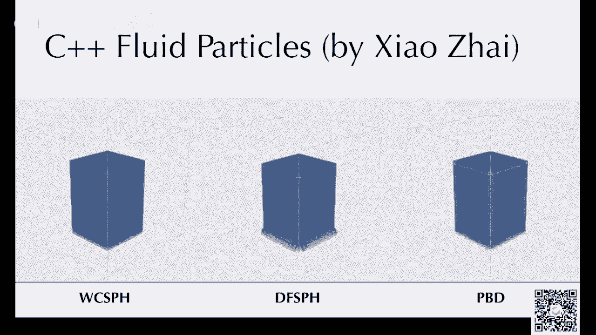

那么接下来我们一起看一下最近的一篇。

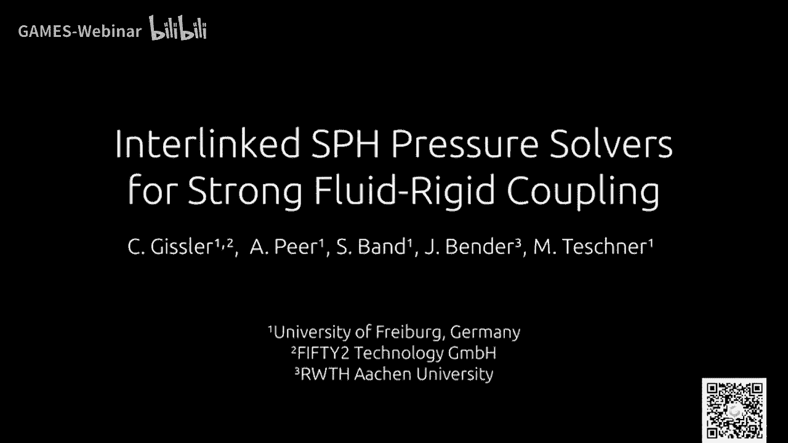

s p h的一篇很好的paper的一个video，这篇paper啊是是一个top还是swap paper，然后它是用来做s p h和单体的耦合的。

所谓耦合就是说呃，你的钢铁和你的s ph模拟的流体能够双向交互，他这个所谓的这个啊，但是这个耦合有单向耦合和双向耦合。

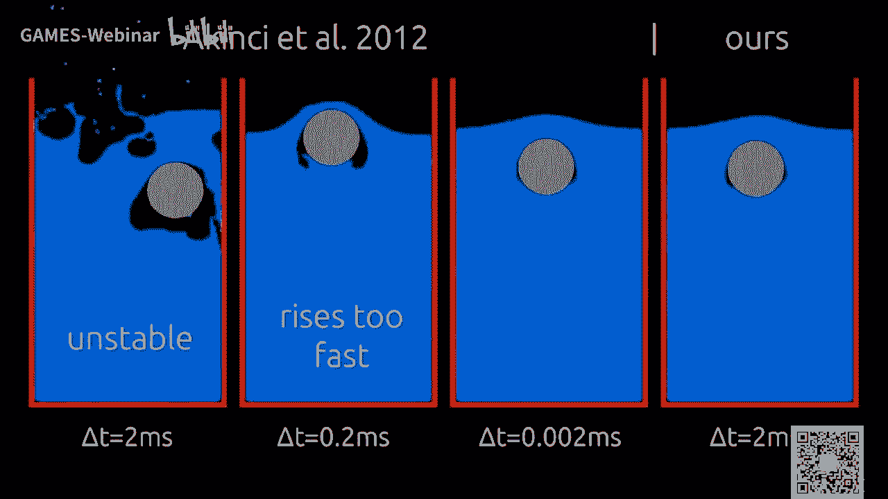

我刚才说的是，如果双向交互的话，那这个是一个双向的耦合。

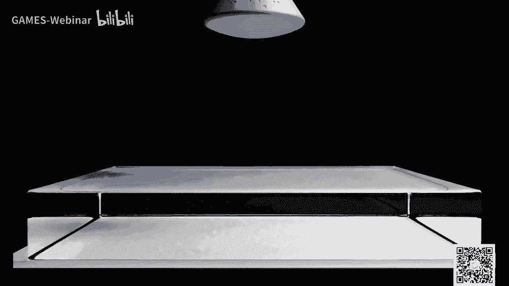

这篇文章做的叫做所谓的强耦合，强耦合呢一般来说就是指呃，我在解线解这个线性系统的时候，或者我在迭代的时候，把两个系统同时进行联立的求解。

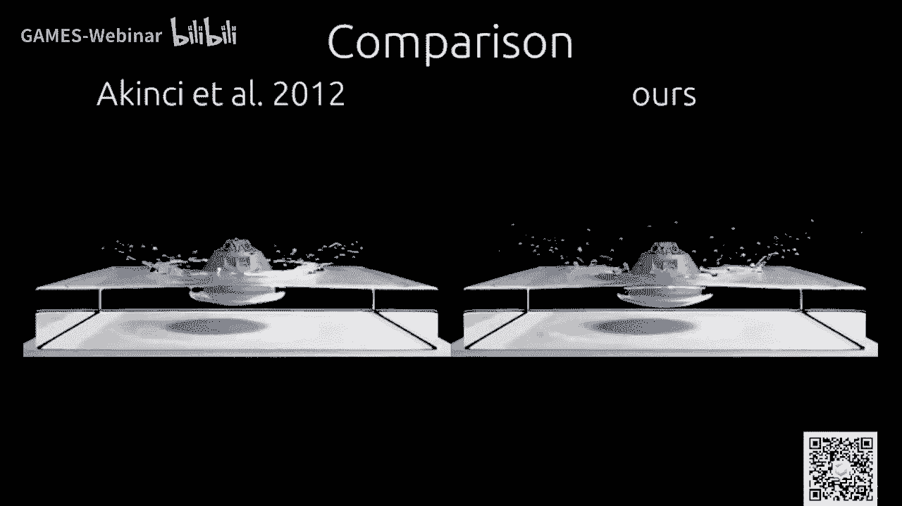

如果是弱耦，可能弱耦合就更简单一点，弱耦合可能就是呃我先解流体，然后把流体作为刚体的边界条件，解刚体，然后再把解出来的钢铁作为边界条件去解，流体量的话，这个耦合就会相对来说更弱一些。

这篇paper提出来是一个强吻的方法，嗯我这个视频好像又不太放不了了。

ok，那我就放几个例子吧，后面我会呃真的作者同意，然后把这个视频看看能不能传到b站，这样大家看起来就方便一些，好像确实一放这个视频就有点卡。

这边主要呃我其实最喜欢的demo是这个，我觉得无论如何就算卡了也要放一下，这个还是一个挺有意思的一个demo，还有是不是在不全屏播放。

会不会好一点。

哎呀不全屏播放就没有进度条。

你可以看到他其实s p h啊，现在已经早就不是只做流体了，现在s ph也可以做各种各样的东西，今年s8 还有一篇sp h模拟雪的方法，然后这个其实它是用sp是在模拟很多钢铁。

s p g和m p i非常像呃，它有一个很大的好处，就是说它可以比较好的。

比较容易的模拟各种介质的耦合，比如说流体啊。

然后弹性物体啊，然后钢铁啊都可以，嗯算了，我就不手动播放啊，现在好像好一点，当然这些每一帧都是要算很长时间，它不是远远没有达到实时的标准，这个地方sp它有的时候它的视觉上面看起来。

它会给人看起来非常splash，他会你会觉得他的例子好像在空中，像有点爆炸的那种感觉，我个人不是很喜欢，当然有一些场景你可能会确实需要这样的效果，这个special的这个问题，你可以看到它这边的例子。

它会生成很多很多的splash，然后这个splash中间往往是空的，看起来有的时候就不会特别好，当然你如果加了表面张力，这个问题可能会减轻一点，ok那么我们今天就先讲到这儿。

然后我来回答一些问题了，我看看模拟输出个例子以后，怎么生成真实的水面啊，这是一个很好的问题，surface reconstruction，也就是说这个表面重建，从粒子生成表面的mesh呃。

这个是一个很大的话题，一般来说这个有很多很多很多很多搞法，最典型的最基本的一个方法叫做marching cubes，marching cube，就是说呃我把整个空间用很多网格，把它打一个背景的网格。

然后我可以搜一个图，反正，然后我们用一些三角形去填充这个网格，你可以看到他他其实做了什么事呢，所谓这个martian cubes，就是说我对于这个格子上面的每一个点，我去算一下粒子的密度。

然后我尝试去画出它的iso counter，就是说只等于零的等式面，一个等势面，然后这个等式面呢，其实就是用各种三角网格去近似的，这个market cube是一个非常非常经典的方法。

它实现起来会稍微有点麻烦，因为他情况非常多，你可能比如说这个看这有14种情况，实践起来就非常的麻烦，我相信你如果把呃，很多不同的复杂的情况考虑上去，远远不止14种，实现起来还是挺挺烦的。

但是他毕竟还是一个，可能你不管怎么弄，最后都得上marching cubes，然后你在做market之前，还有各种各样的预处理，smoothing啊之类的操作，这个你可以去看b d b。

bgp里面有各种各样的呃operator，可以看看能不能搜一搜，看看能不能找到，对现在呃工业界里面一般来说比较常用的搞法，就是就是用b db，先把particle给它光栅画到一个背景网格上面。

然后在背景网格上面做一些适当的嗯level set，所以level set就是你particle会嗯光栅化的粒子网格，光光栅画楼背景网格上面你会有一个呃距离场，然后在这个距离场上面可以做各种各样的操作。

比如说你可以让他呃变得更圆滑，或者让它变得更加的尖锐，这些都可以，然后你在做完v db的各种操作以后，你就得到一个density field，就是dd field，然后你就可以上门tgps。

嗯这个大家可以去看一看v d b，反正v db还是一个非常成功的一个系统，很多电影都有，然后v d b是拿了奥斯卡奖的，那个作者是当时拿了一个camera，拿了一个，因为bdb拿了一个奥斯卡学院奖。

好像呃对还是很厉害的。

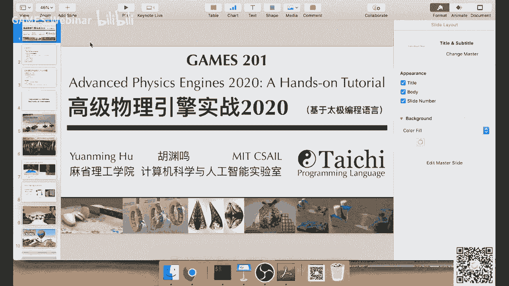

然后我再看一看别的问题，屏幕空间方法效果和v m c d b打印哦，对这是一个好东西，我刚才忘了，其实有很多时候大家会渲染的时候，会直接往free buff上面去渲染流体。

这种方法在实时应用里面其实还是挺常见的，但是在电影里面就很少用，因为电影里面你的camera会不断的移动对吧，那样的话很少用，但是我觉得他还是有很大优势，因为他手速度很快嘛，所谓屏幕空间方法。

也就是说我直接把这个例子打到投影到屏幕上，然后在屏幕上面去做一些像光线的折射啊，反射啊之类的操作，那么这个其实就是实时渲染的一套理论了，实时渲染里面有各种各样的近似，使得它能够在有限的计算资源里面。

能够达到一个大家可以接受的帧率，呃有同学说预习材料其实大纲在对，就是课程大纲其实是在知乎上面啊，包括课程论坛上面或者github上面都是有的，但是我感觉以后可能会对内容做一些删减。

因为确实我发现嗯每周一个小时的话，或者一个半小时能讲的东西其实挺有限的，像今天我们就只讲弹簧质点系统和s p h，我觉得能把这两个基本的东西把它讲好，其实已经啊大家能够掌握好，其实也已经挺不容易了。

所以后面很多东西我可能会删掉一些，大家可以挑，如果想预习的话，可以挑后面的一些比较简单的内容去提前看，ok那么要不我们今天就到这边吧，如果大家还有别的问题呢，可以直接在论坛上面打印出来。

好那么今天就这样，如果大家想继续写homework里的话呢，还可以继续写，然后我们还会继续挑出一些比较好的作品，然后呃刚才我演示的两个demo，一个是vespring system。

一个是jope inter，这两个demo的代码都上传到论坛上面了，然后大家可以尝试一下，把这个两个demo整合起来，去写一个呃in格式的best princess，这个还是挺有意思。

当然要把它写对很不容易，特别是你要求各种各样的导数啊，那个求导数还是一个挺头疼的事情呃，ok那么我们就先这样，那么我们下次再见。

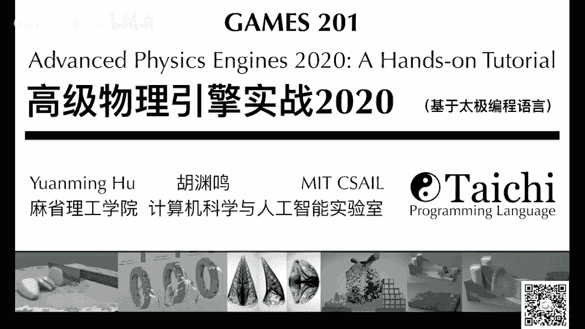

下周再见，下周我们会出一个新的作业，然后呃会进入新的一轮的评比，然后希望大家能够做出更多更惊艳的作品，ok好。

