# GAMES201：高级物理引擎实战指南2020 - P3：Lecture 3 拉格朗日视角（2） - GAMES-Webinar - BV1ZK411H7Hc

OK那欢迎大家再次回到我们的课程。

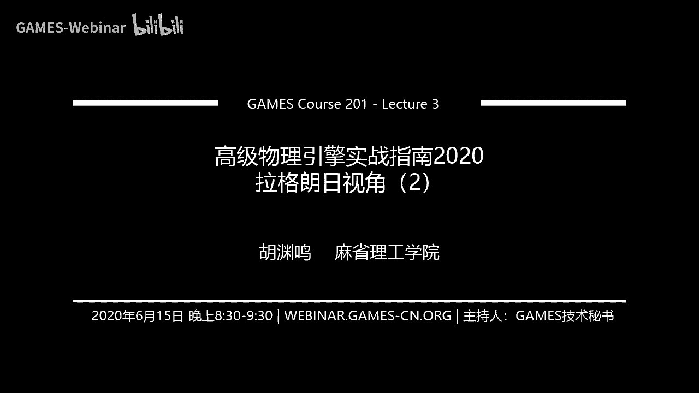

现在我们已经进入到第三讲了，这一讲呢我们主要讲讲弹性，讲讲有限源的基础，然后讲一讲一些高级的太极特性。

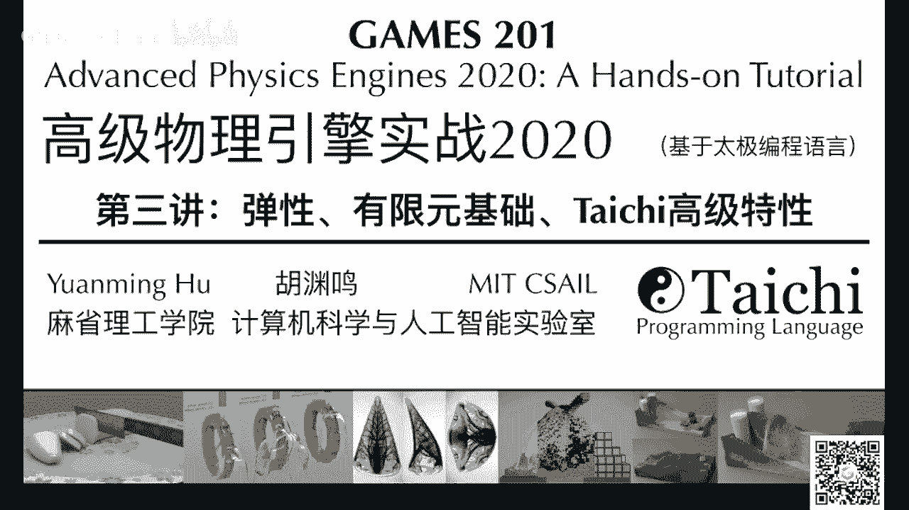

首先还是一些课程的一些后停工作，这个作业安排，作业零呢我们已经告一段落了，大家如果想提交的话呢还可以继续提交，但是不会再有奖品了，今天呢我们还会再继续评出几个比较好的作品，关于作业零。

作业一今天发布过会我们会提到，时间呢大概是6月15日到7月11日，其实是一个跨度非常长的一个区间，然后我们预计中间可能会空一周，这样留一点时间给大家去实现自己的作业。

然后也留点时间呢给大家去消化我们讲的东西，因为大家普遍反映我们讲的东西呢，可能其实信息量还是比较大的，然后我们一到三日组队，每一组可以独立完成，尽量独立完成，然后可以在论坛讨论。

但是大家最好不要复制粘贴别人的代码，这个就不是特别好，然后作业二呢就作为我们最终作业，大家可以实现一个可以交互的物理模拟器，QD的也可以实现一个高质量的渲染出来的，可视化的物理结果，可以是3D的。

你可以用第三方渲染器，也可以自己写一些渲染器，用太极写，然后呢也可以进行一些代码优化，你可以基于自己或者别人的homework1来做homework2。

那么其实就是说homework内部大家是不要复制粘贴，但是homework2可以复制粘贴别人的homework1，这样呢这样就促进大家代码交流，然后也保持一定的独立开发。

homework3呢我们暂定就取消了，因为现在的情况看来有的homework012其实工作量已经很大了，OK那么这就是作业的情况。

第二轮作业获奖选手我们又评出了五个奖品，分别是2D光线追踪，by这个quadpixels，然后呢还有一个vertex method，fluid simulation，以及分子物理学模拟。

实时光线追踪渲染器，还有一个类鸟生物群体模拟，我这个南方人鼻音边音不太分得清楚，说到这个类鸟生物群体模拟应该读对了，这是五个获奖选手，然后还有两个honorable mentions。

分别是wcsph和implicit mass spring，那么之所以这两个选手其实做的也非常好，但是为什么放到honorable mentions呢，主要是因为他们已经提前做了作业1的内容。

并且workclass同学已经是获奖选手了，所以我们就不再额外的颁一个奖了，那么这两位同学可以把自己的作业再完善完善，直接进入作业1，OK那么作业1是个什么状况呢。

作业1我们的题目叫做，显示时间积分器与影视时间积分器的对比，那么大家知道在物理模拟中，可能如果有同学尝试实现显示和影视时间积分器，就会发现显示时间积分器非常容易实现，但是它数值上比较容易不稳定。

对于时间不长的这个DT大小非常敏感，如果你DT稍微大一点呢，可能你的性能就炸了对吧，但是影视时间积分器呢，它稳定一些但是它较难实现，比如说你要去求先行系统，你可能要多次迭代，你可能得求各种各样的导数。

那这个求导数是一个非常头疼的事情，那么可能大家如果去写过implicit solver的话，那很可能就知道这个其中的头疼之处，在DT作业中啊，大家可以选择自己喜欢的模拟器。

同时实现显示时间积分与影视时间积分，然后呢从性能准确度数值稳定性，各种角度进行对比，可选的模拟器呢有影视的弹簧试点系统，你可以实现这个影视的FBM，然后一些不完全影视的一些。

介于影视和显示之间的一些格式，比如说PCI-SPH，然后比如说这个完全影视的DFSPH，或者NPS这个Moving Particle Simulation，那么建议大家分工合作，所以建议组队。

你如果愿意一个人做呢也完全没有关系，但组队了以后有什么好处呢，组队以后呢大家就可以互相，一眼算影视时间积分器的公式，因为大家可能推过公式就会知道，一个人把这个公式推对还是有点难度的，提交格式呢。

建议大家在Github上面拖款自己的代码，然后在论坛上面放一个Github的链接，因为这个代码量可能稍微有点大了，如果你在论坛上面贴出来，你可能就有个两三百行代码，别人看起来也不是很方便。

所以Github上面呢，其实分享你代码就比较容易一些，然后论坛上面可以放出一些关键图表就行，比如说你可以放个两三个图，可以是数值准确度关于dt的关系，可以是数值准确度关于你的材料硬度的关系。

加入一些比较简单的分析，促进大家分享就可以了，其实大家不用写特别多的文字，这个实验呢主要是放一些图表，放一些可视化结果就其实很不错了，不用花特别多的时间去写很多实验setup，这些很细节的东西。

我个人是比较不喜欢写这些东西的，如果大家不愿意写的可以不用写，如果愿意写的也可以写多一点，那其实没有关系，那么和作业零一样，我们还是会评出一些优秀的作品，但是这个作业时间可能会花的时间比较长一些。

所以我们可能过两个星期以后，我们再进行评奖工作，OK。

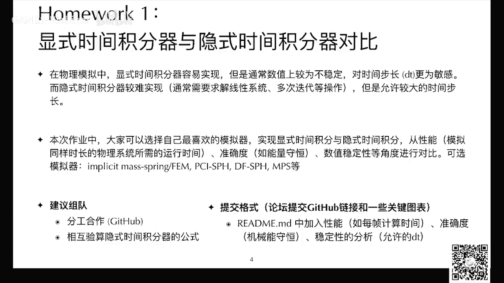

那么由于有一些同学表示第二奖稍微有点难，然后我们驻家团队就进行了一个难度的问卷调查，其实问卷调查出来，我们发现其实41%同学认为我们难度是适中的，41%同学认为比较难，然后12%同学认为太难。

也有3%4%同学认为比较简单，那么我们因为这个课本来就是一个体育课程，所以我们其实我一直是觉得你人活着，总是要做一些自己没有做过的事情，对吧，你得做一些有难度的事情。

如果一直每天做自己觉得很简单的事情的话，那其实就生活也很无聊，对吧，所以我们还是觉得我们觉得这个难度的分布其实还可以，那么就41%较难，41%适中，我觉得其实属于一个合理的难度范围。

因为我们这个课本来就提高课程，所以后续我们就会保持这个难度。

那么今天我们就讲一讲弹性，弹性里面主要有几个话题，形变与形变梯路，deformation and deformation gradients，然后strain and stress，硬力和硬变。

然后hyperelastic material，这个是超弹性模型，这些都是图形学里面常用的一些术语，大家现在完全听不明白没有关系，我们后面会详细讲，我们还会讲一讲最最最基本的线性有限元。

然后它是在线性的tetrahedral，或者triangular meshes上面，然后我们还会讲讲一些比较高级的态极的feature，因为毕竟大家后面都要写一些复杂的态极程序了。

有些态极的feature可以让你提高代码的可重用性，OK那么我们话不多说就直接开始吧，OK还是一部分用keynote做一部分用latex做，这样比较打工时就稍微审视一下。

OK那么第一部分我们来讲一些比较基础的形变弹性和有限元，这部分其实是一个非常有意思的内容，因为模拟弹性物体其实是一个非常有趣的事情，因为首先它会带来不错的视觉效果。

你可以看到这个东西很Q弹就觉得很有意思，那么它也不会特别难以实现，你如果用态极的话可能100多号代码，就可以实现一个简单的一个2D的FEM的弹性simulator，然后弹性也是其他的材料的基础。

比如说弹粘性弹束性，包括各种各样其他的更fancy的材料，其实它都是基于弹性的材料进行一些比较细微的修改，你就可以进行这些更复杂材料的模拟，那么今天我们讲的内容其实是比较基础的内容。

如果大家课后还有兴趣的话，可以看一看这两个教程都是图形学的领域里面，大家比较喜欢的关于弹性关于有限元的一些教程，这两个教程其实都是属于写得非常通俗易懂，OK，那首先我们讲一讲形变，什么是形变呢。

形变其实如果你要描述它，那其实就是说一个材料，如果它的现在的材料的位置和它静止状态的位置，发生了变化，那么我们就可以认为它发生了形变，那么我们怎么来描述这个形变呢。

一般来说最常用的这个描述叫做deformation map，也就是说这是一个函数，它能够把我的静止位置映射到我的形变位置，OK，那么这是一个其实如果你在三维里面的话。

这个函数就是一个从三维下量到三维下量的一个下量函数，那么你如果把deformation map去对于你的静止位置，去求一个导数的话，你就可以得到deformation gradient。

也就是说你的形变的梯度，如果你观察这个deformation map，它这样一个性质，你可以发现如果说我有两个deformation map，分别是phi1和phi2。

如果phi1和phi2只是在于最终位置差了一个常数的话，那么它其实它的形变梯度其实是一样的对吧，因为你这个c求到以后，它就其实消失了对吧在导数里面，然后另外一个很常用的一个符号叫做j。

这个j是你的形变以后的体积，除以你静止状态的体积，那它其实就是你f的行列式，或者它这个叫做，其实叫做Jacobian determinant，你的形变位置对于静止位置的Jacobian。

其实就是f它的行列式，就是它的这个体积的变化。

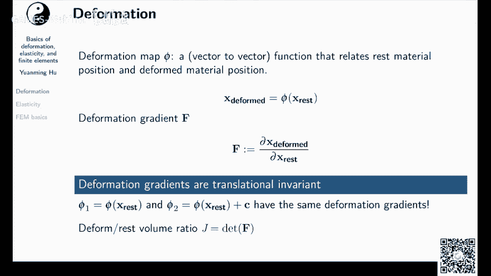

这边我可以做一个简单的demo，我们来找一个容易形变的物体，比如说这个海绵宝宝，你可以看到我这边给它做了一个切向的形变，然后左边是它的静止的位置，右边是形变以后的位置，然后你可以看到。

其实这是一个非常清晰的映射对吧，如果这个是静止位置，比如说我考虑这个海绵宝宝的头上的右上角，这一个点就是xrest它的静止位置，那么对应的它的形变位置是哪呢，就是这个地方对吧。

如果说比如说是左上角这个点，对应的就是左上角的形变以后的这个点，两个靴子它其实也是一一对应的。

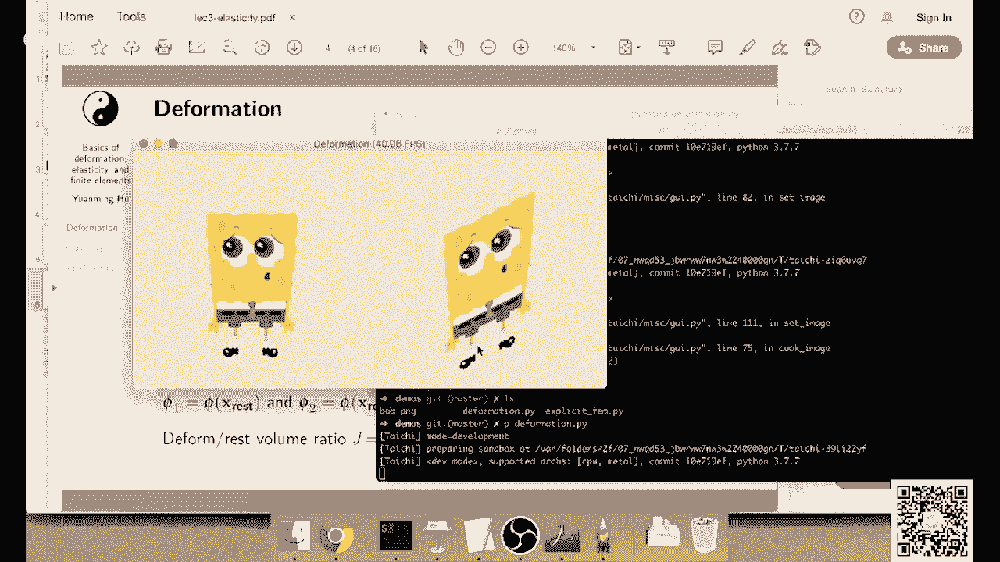

你可以看到这个地方它的deformation gradient，这个程序里面，我课后会share这个程序，我还一直没来得及上传我的这个程序，你可以看到它是一个，它决定长什么样，它是10 0。51。

它其实是一个，一个这样一个sharing的一个矩阵，我可以其实把它改一下，我把它改成1002。

那么其实这个deformation是什么样的，这个deformation会在纵向去拉伸这个海绵宝宝。

对吧，我可以再把它改一改，我把它改成，如果是20 0。1。

那么我就横向拉伸了这个海绵宝宝，OK那其实这个是一个，形变梯度的这么个概念，就是说如果形变梯度呢，它你把第一行全部乘上，你如果把这个形变梯度第一行全部乘上一个场数。

那它这个你的海绵宝宝就会在横向去做一个拉伸，按照这个场数拉伸，类似的你可以去操作它的第二行，好那么我们继续。

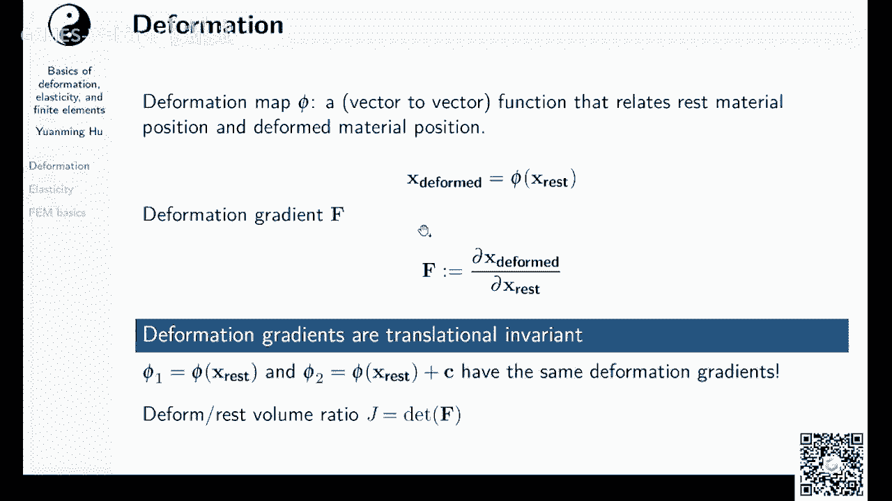

哦对我一直忘了demo，我其实还有一个demo，我刚才提到用太极实现这个弹性模拟，其实非常容易，这里是另外一个demo，这个是一个弹性长条，它是用有限元来实现，比较简单的有限元，后面这节课后半部分。

我会讲到这个demo，这个应该是一个Neo Hooking的材料模型，这个是一个显示的时间机，你可以看到它不是特别稳定，如果我现在移动这个球，这个球是一个creation object。

我移动的时候非常小心的，因为这个边界条件没有，为了代码简单没有把它做得非常的细致，如果说我大力移动它，这个就会出现一些问题，我其实可以演示一下，我大力推一下它，它就会变得非常的不稳定，如果我说我把它。

我让它这样滑下来，你可以看到它就会，这个有限元里面，处理自己和自己碰撞，是一个非常头疼的问题，它就会自己和自己去overlap，在这个二维的空间里面，其实不是特别的物理真实，这个有限元里面。

自碰撞也只是一个比较头疼的事情，尤其是有它有这个问题，很多人还是很喜欢用有限元，因为它还是有很多自己的优点，后面我们会提到。

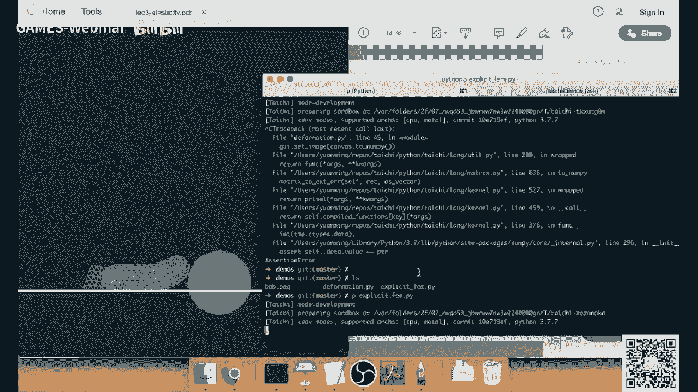

这个代码其实非常短，其实可能也就133号，你看它其实没几个kernel。

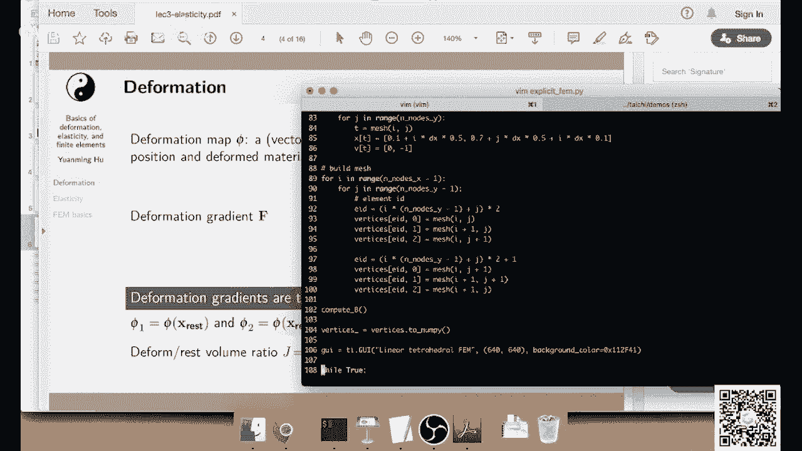

可能就两三个kernel，这个代码我后面会share给大家，对我其实说一句，如果大家喜欢写python的话，一定要用vim，我用vim是因为我开ide的话就太卡了，这个电脑实在是有点吃不消。

所以我一般平时写代码虽然我用ide，但是我在上课的时候我用vim，这个原因就是vim占用资源小一点，那么下面我们来讲讲弹性，什么是弹性呢，弹性其实就是有一些，你有个橡皮筋你去拉一拉它，它会回到静止状态。

你去松开它会回到静止状态，那么弹性其实就是一个材料，它有回复自己静止状态的一个性质，那么这讲我们就讲一个比较简单的弹性模型，叫做超弹性模型，hyperelasticity，那么超弹性的材料它有一个性质。

它的stress-strain relationship，是被一个strain energy density function来定义的，这里面有很多很多术语，但是我后面会一一解释。

那么intuitive的理解，就是说我的这个psi它是一个potential energy，那它这个potential energy会惩罚你的形变，对吧，它会惩罚你的形变。

那这个potential energy在hyperelasticity的材料里面，它就是实际上是一个f的函数，注意它这个是一个密度，它不是一个总的能量，它是单位体积的势能的密度，那么什么是stress。

什么是strain呢，stress就是中文好像叫应力，因为我是我本科没有专业学过这些东西，所以我其实我在学它的时候，我已经在一个英文的环境里面，所以我其实有的中文，不是特别清楚它的对应关系。

我只能尽量的去说如果说错了，请大家原谅，这个stress应该是叫中文叫应力，就是说材料内部的这个，它有一个内部的弹性力，这个stress在hyperelasticity里面，其实它就是用来恢复这个材料。

用来恢复自己原来体积形状这么一个内力，那么strain就是，strain就是说这个叫中文好像叫应变，就是说它这个你的材料的形变的一个measure，stress和strain都有很多很多种表述。

然后stress有各种各样的stress tensor，然后strain也有各种各样的表述，那么我们这个课里面，大家其实看到strain。

其实把它用deformation gradient f去替换掉就可以了，你可以认为strain它就是deformation gradient，当然还有各种什么green strain。

乱七八糟的很多很多的术语，我这边就不细一细讲了，因为我怕说反而会影响这个教学制度，因为这个概念太多了，那么这边要注意一下，我们有两个非常相近的符号，一个叫psi一个叫phi对吧。

然后psi我们是用来表示strain energy density function，然后phi我们用来表示deformation map，它们长得很像，但是它们其实完全不相关了其实。

什么是stress tensor，我刚才讲到stress是，你如果考虑一个材料的微元，那么这个stress其实你大概直观上理解，就是这个材料微元它会和其他的材料微元。

进行一些相互的推拉之类的相互作用对吧，那么stress tensor其实就是一个33的矩阵，或者说你可以认为它是一个二阶张量，它有什么作用呢，它可以你如果给它一个很小很小的一个小的截面。

然后你把它这个反向量乘上stress tensor，你就可以得到这个材料，它向周围的neighborhood去施加的力，那么这个可能比较抽象，我们具体的讲几个三种常用的stress tensor。

在图一元里面如果根据大家不同的需要，我们可能经常会用不同各种各样的这个stress tensor，比如说比较常用的一个stress tensor叫做。

D-Parallel Kirchhoff Stress，这个一般或者大家简称叫做PK1 Stress，那么PK1有什么好处呢，它有一个很好的好处就是。

P就是PK1 Stress如果在F点的求值等于什么呢，等于你的Pcf关于F的求值，也就是说你的String Energy Density Function。

关于deformation gradient求的导数就是你的PK1 Stress，OK，这个其实，其实你是在这个rest space里面去进行的这样一个计算，这个非常非常容易计算，但是它有一个问题。

就是说它是在rest space里面的一个tensor，你如果实际上要来算材料的受力的话，你得在它的形变以后的这个空间里面去计算，那么我们就得做一些变化了，那么常用的在形变的空间里面。

大家一般会常用Kirchhoff Stress或者Cauchy Stress，其实更常用的是这个Cauchy Stress，它是Cauchy Stress是一般也叫做True Stress。

它是一个真正的在形变空间以后，里面的硬力的一个张量，然后这个tensor有一个性质，它是对称的，因为角度量守恒对吧，你这个有一个推导过程，这边我就由于时间关系，我就不过于详细地讲了。

那么它们这三个tensor之间是可以转换的，比如说你的这个tau等于j乘上sigma，或者等于你的p乘上f的转质，然后p呢等于jsigma f负转质，这个所谓负转质就是先取转质再取力。

或者先取力再取转质，这两个是一样的，那么这个traction，traction就是我刚才提到的，如果说你把你的stress tensor乘上你的在材料内部的一个小的截面的发酵量。

这边你其实就可以得到材料内部的一个截面的这个traction对吧，它就是这个中文叫什么我也不太清楚，我课后我去查一查，然后再补充给大家，或者大家自己去百度上面或者google上面查一查，那么。

这个p和sigma之间这个关系其实看起来有点复杂，因为p等于jsigma f负t对吧，那么这个地方其实它是有一个intuition，为什么是f负t呢，这个就很奇怪对吧，为什么不是f的力或者一个f转质。

因为我们这边要变换的是normal，是你的这个材料，是你考虑这个材料的截面的发酵量，这个发酵量它其实转质的公式其实是f负t，这个其实就大家可以下课以后去推一推。

然后几个常用的描述elasticity的描述材料的弹性的属性，首先阳术波量对吧，阳术波量这个大家应该都比较熟悉，大学物理里面都会讲到，或者可能高中物理里面也会提到。

其实它最简单的理解就是你可以认为你有一个弹簧，其实就是弹簧里面的一个k，对于三维材料是稍微稍微复杂一些，因为你去拉这个材料的时候，比如说你有个橡皮筋，你过去拉它的话，你拉这个橡皮筋的时候。

你会发现它中间的那一部分其实是会变窄的，因为你这个橡皮筋它有一个正的possense ratio，它的这个波松比是正的，然后这边就提到波松比是什么呢，波松比其实就是定性的来说，这个波松比如果是0的话。

你去拉这个材料，假设你手里面现在放了一根橡皮筋，如果这个橡皮筋它的波松比是0的话，你拉它的时候，它中间的这个截面面积是不会缩小的，也就是说你拉它的时候，它体积就很大程度上你拉多长，它体积就变大了多少。

然后如果说你的波松比比较大，那它其实更接近于不可压缩，也就是说它尽可能的接近保持自己的体积，那什么意思，你如果把这个橡皮筋你左手右手一拉，它其实变长了对吧，那它要保持自己的体积，那它会怎么办。

它会把中间其实就变细了一些，这个其实更符合大家的直觉，因为你橡皮筋拉了以后，它肯定中间是越来越细的，它到了一定程度以后，这个橡皮筋就怎么它就断了对吧，那么有没有材料的波松比是负的呢。

也有这个材料一般叫做Oxidix，它可以有一个负的波松比，什么样的材料会这么奇葩呢，因为我以前搞过一段时间3D打印，这个3D打印里面你可以打印出来一些，有负的波松比的这些材料，负的波松比什么概念。

你如果去这个橡皮筋你拉它以后，它中间反而会变粗，这个听起来就非常的神奇对吧，那么介绍这个波松比这个概念以后，其实大家就会想到，既然这个材料你如果去拉它以后，它的体积会发生变化。

那么如果说我要考虑它的压强，关于它的体积的这个体积变化的，这么一个modulus，这个一般是在液体里面可能用的比较多，这个Bulk Modules可压缩液体里面。

那么大家就会用到这个Bulk Modules，OK，然后还有Lame's Parameters，一般大家会用这个λ和μ，λ有的时候也叫做Shared Modules，一般有的时候也会写成G。

但是图形学里面一般会就写成λ和μ，这些材料参数其实都可以相互转换，它们都是正比于Young's Modules E，所以一般指定了Young's Modules和波松比以后，其他的全部都是可以算出来。

大家一般也就只指定Young's Modules和波松比，然后如果在固体里面，一般大家就用λ和μ，然后但是λ和μ不是很直观，对吧，因为大家刻画材料一般习惯于用Young's Modules和波松比。

所以大家一般会指定λ和μ，然后去，Sorry，大家一般会指定E和ν，然后通过E和ν来算出λ和μ，然后K一般是在模拟可压缩液体的时候会用，这个其实用的不是特别多，常见的超弹性模型有哪些，在图形学里面。

大家常用的是Neo-Hooking和Curl Rotated，Neo-Hooking其实是更为，可能在力学社区里面也更加常用，基本上在图形学里面Neo-Hooking基本上所有的弹性介质。

如果是isotropic的话，就是你如果是各项同性的话，很多时候大家默认就采用Neo-Hooking，除非你的形变非常小，你如果形变很小的话，你可能会用线性弹性Linear Elasticity。

Linear Elasticity有什么问题，如果Linear Elasticity的材料，它有一个问题就是说，你如果去旋转了它以后，它并没有保持自己，怎么说呢。

你旋转Linear Elasticity的材料以后，它可能体积就会无条件的变大，然后不受到任何的惩罚，这个就非常奇怪，你如果有一个材料你去转一转它，它还是能保持自己的势能为0，但是它体积会变大。

这个不是特别物理，那为什么Linear Elasticity还是很有用呢，如果说你是做一个小形变的分析的话，你就不会有红关上的deformation，然后你也不会去旋转它。

所以这个时候Linear Elasticity就非常有用，而且它导出的方程一般是一个线性方程组，就非常容易去解它，为了fix这个Linear Elasticity旋转以后，体积无条件变大的问题。

大家就提出了quotation，quotation一开始提出的版本稍微有一点小问题，所以大家后来又搞出来这个叫fixed quotations。

现在如果说quotation一般就是指fixed quotations，然后你可以看到它的perceive是一个关于f的函数，然后这边我就直接给出公式了，它中间其实有一些推导过程。

比如说你可能会要去求f的一个thinker value，就是它的特征值，f的特征值一般是什么含义呢，就是说你这个f有旋转的部分，你把旋转的部分给它t了，t了以后就只剩下拉伸的部分。

一般这个sigma你可以认为是它的，这个sigma不是stress，这个sigma就是singular values，然后这个perceive关于f的公式给出来以后，你就可以求出它的pk1。

它的pk1一般就是，它的定义就是perceive关于f的导数，这个求导这个过程还是挺有意思的，大家可以去自己推一推，或者看一看教程，看看教程里面是怎么去推的导数，这个导数还是一开始的话。

说实话不是特别容易把它搞对，不过这个还是一阶导数，这个perceive关于f求出来是一个2x2的，一个张量或者是一个2x2的矩阵，如果说你要求它的二阶导数的话。

你如果写implicit solver的话，你得求二阶导数，二阶导数这个就算爽了，这个算出来就是一个，三维里面就是一个3x3x3x3，这么一个应该是81个元素的一个四阶张量，那样就体验不是特别好。

推导过程体验不是特别好，所以我自己其实也不是很喜欢implicit solver，因为太复杂了，OK那么讲了弹性以后，接下来我们简单介绍一下有限元，那么有限元它其实是一套非常博大精深的例子。

它是一个generating方法，那其实它做什么事情呢，它就说你的PDE不是连续的吗，但我在计算机里面只能表示离散的，我只能有离散格值，那怎么办，我得做一个离散化的工作对吧。

那么我怎么把这个连续的PDE给它换成一个，离散的方程组呢，那么我们肯定不能用PDE那种主点方程的方式，或者说它的强行是strong form来描述我的物理系统，那怎么办。

我去搞一些小的test function，它其实去把这个强行是在局部做一个积分，然后我现在不要求它的主点这个方程满足，而是这个方程的residual关于你的test function，积分以后得到满足。

而这个后面细节我们会在课程的后面我们提到，这边呢大家只要知道，FEM其实最基本的概念，其实就是说我们把这个空间，二维空间也好，三维空间也好，把它分成很小很小的element，这个element是什么。

可以是二维里面的可以是这个三角形，可以是正方形，或者叫这个四边形，三维里面的可能是四面体或者六面体，然后还有很多很多更加fancy的element，网上有一个叫有限元素周期表，我其实可以打开看一下。

这个还是挺有意思的，叫FEM table，这个其实有点丧心病狂，我到现在也没有完全搞懂这个东西，但是大家如果有兴趣的话可以去看一看，这个是用这个叫有限FEEC有限元素外微分。

其实是用离散微分几何的方式来去讲，就各种有限元素，那我们一般用的，最常见的其实就是最简单的这些，比如说图形学里面这个可能就用这个三角形元素，然后四边形元素，然后你的未知数存在哪，存在这个元素的顶点上面。

这个大家可以暂时这么信，那你可以其实看到更加复杂的元素，它并不一定是，它的degrees of freedom，它自由度不见得就是存在它顶点上，可能存在边上，可能存在它这个体里面。

这个网站上有一个简单的background介绍，但是说实话可夺性不是很强，这个大家如果不想自虐的话，你可以暂时不去看这个东西，但是还是有这么个东西还是挺有意思的，对吧，有限元素周期表。

和化学里面的一个元素周期表，有一举同工之妙，OK我就不继续扯淡了，就是说最基本的概念就是说在FEM里面，大家只要记住它是一个Gallery方法，然后它用Weak Formulation。

这些概念我们后面会在深入讲FEM的时候，我们会继续介绍，然后这边大家只要知道，我们把空间分成了很多很多个三角元素，我们今天就讲三角元素，当然刚才大家也看到有很多很多其他的元素，对吧。

那么FEM里面我们今天讲一个最最最基本的，叫做Linear Tetrahedral Triangular FEM，什么意思呢，它是我们如果解这个弹性问题的时候，大家经常会用到这个线性的三角网格。

或者四面体网格，它做一个最最最简单的assumption，是什么呢，就是说你的deformation map，你的这个File，它在每一个元素里面是一个FM变换。

或者说它的deformation gradient，在这个里面是一个constant，什么是FM变换呢，AX加B就是FM变换对吧，那么我们其实有这么个公式，在一个元素里面，注意这个只是一个元素。

这不是说你的整个simulation domain，如果你整个simulation domain都是这么个变换的话，那你这个F就是整个domain都share一个F，但是那样的话。

你基本上就不是在模拟弹性物体对吧，你这个物体的这个限制就太大了，一般弹性物体就是每一个元素可以自由的变换，可以自由的发生形变，那么在一个元素之内呢，我们有这么个关系，它的形变以后的位置。

等于静止的位置乘上F再加上一个B，B是一个offset对吧，那么我刚才提到，这个B其实是不会被你的势能去平等化，因为你如果平移一个有限元的话，你平移一个物体，它并不会受到，它并不会产生形变对吧。

它会产生形变，但这个形变并不会被你的，并不会产生弹性势能，那么对于三角形线性的这个element，这个是在图形学里面非常非常常用的一个格式，对于每一个元素，我们可以计算它的弹性势能对吧。

这个弹性势能是什么呢，这个是注意我这边少写了一个DX，其实就是说它的string energy density function，它是一个这样能量密度函数，关于体积的积分积出来就是你的弹性势能。

那么我们刚才有这个assumption，就是这个F在这个element上面是一个常数，那么我们就可以把这个积分直接换成一个，density乘上体积对吧，因为你的这个psi也是一个常数了。

psi是F的函数，F是常数，那么psi就是一个横常量在这个元素里面，那么我们可以直接用ve就是这个元素的体积，二维里面就是面积了，乘上density function，ok这就能计算这个元素的弹性势能。

这个弹性势能算出来，那就很多事情就很好解决了，对吧，为什么呢，因为你的力这个力其实就是势能关于位置求导数以后，再取一个负对吧，就是势能的定义，那么怎么去compute。

我们怎么去计算这个元素它的deformation gradient呢，其实对于三角元素的话，这个也非常非常容易计算，那么我们来这边就现场推导一下，那么我们要记住deform的位置呢。

等于f乘上静止位置加上一个b，对于三角元素我们假设，我们就在二维情况来思考这个问题吧，就是二维里面三角形其实是什么，是有三个零点对吧，ABC，那二维里面三角形推广到三维以后呢，就是实际上是四面体。

它就四个零点，ABCD，但我们这边出于简单性，我们就考虑二维情况，ABC它的静止位置，它形变以后位置呢，是A deform B deform C deform，它有三个形变的位置，OK。

然后呢在一个线性的三角元素里面，f是一个它的deformation gradient，是一个常数对吧，那么我们有A deform它等于什么，等于f乘上A rest加b，那么类似的我们对于b和c。

也有这样一个性质，注意我这个右端向的这个b和b deform，和b rest不是一个b，这边我其实写的不是很清楚，我后面我讲的时候才发现，我们后面应该，后面的课件我会把它稍微更新一下。

那我们要首先做一个事情是什么呢，因为我们并不关心这个offset对吧，我们并不关心这个constant offset，我们先把这个b给它消了，怎么消呢，很简单对吧，我们把1减去3，就得到方程4。

当然还有做一下稍微做一下移项，那我们可以得到A deform减去C deform，等于什么f乘上A rest减去C rest，类似的我们把2减掉3，可以得到方程5，对吧，这是个很简单的一个关系。

我们把4和5搬过来，这边变成6和7，那么我们现在得到这两个方程组，注意它每个都是一个向量方程，每一个它其实就是左边是一个二维向量，右边是一个二维向量对吧，那么你加起来一共就有四个线性的约数。

linear constraints，或者叫四个线性的方程，OK那么我们其实就可以把f里面的所有的项，全部都给它求出来了，对吧我们可以把f里面所有项全部都求出来，怎么求法，首先我们构造一个矩阵叫做B。

对吧这个B它其实有两列，第一列是A rest减去C rest，第二列是B rest减去C rest，那么这就得到一个二乘二的矩阵，我们把它取一个逆，然后我们还有构造一个矩阵D。

这个D是A deform减C deform，然后再加上第二列是B deform减C deform，那么我们就其实可以看到这个f其实有这么关系，f等于什么，f等于D乘上B，它是这个矩阵乘法。

这边还有一个性质，就是说你的这个B它是一个，在整个物理过程中它是一个常数，为什么呢，因为它只和你静止状态中三角形的，三角形元素的三个顶点的位置有关系对吧，所以呢我们会把它提前算好。

提前矩阵求力给它求好然后存着，你可以看到这个矩阵求力还是一个比较，比较costly的操作，至少你得算一次出法对吧，你得算determinant它的倒数，得算一次出法，这个还是比较costly。

所以大家一般会提前把它算好，然后存在内存里面，要用的时候再把它取出来，OK那么我们现在有了刚才这个关系，其实我们就知道怎么算一个element，它的deformation gradient。

那我们现在可以很容易地写出来一个，显示时间格式的，这么一个时间积分对吧，那么我们一般情况下，大家是不用forward Euler，大家一般是用semi-inclusive Euler。

或者这个又叫做Sympathetic Euler，注意它虽然叫做semi-implicit，它是一个显示格式，这个semi-implicit是一个被abuse的一个词。

有各种各样的东西都可以叫做semi-implicit，然后你先更新V对吧，然后你再更新X，那么现在的问题是，你看看这个方程式里面，其实唯一的一个未知数是什么，这个里面不知道的是这个FTI。

FTI怎么求它呢，这个求起来其实非常容易的对吧，我们有这么个关系，就是说顶点的位置是势能，顶点的上的受力是势能，关于顶点上的顶点的位置的导数，再取一个负对吧，这个是一个很常用的一个关系式。

那么我们刚才已经讲了，对于三角形的元素，它的线性元素，它的Ue我们是知道怎么算的对吧，然后我们把每一个元素的Ue加起来，就得到了整个弹性物体的U，OK就是说，总的弹性势能等于每一个元素弹性势能之和。

那么我们再把这个符号移到这边来，然后我们再把这个展开一下，那怎么展开呢，我们把这个Ue，Ue其实等于什么，我们刚才回顾一下这个公式，Ue等于Ve乘上Psi Fe，OK，然后这边替换以后再用劣势法则。

OK，然后这边就多出来一个元素的静止状态下的体积，注意这个是静止状态下的体积，这不是形变以后的体积，所以这个其实也是一个常数，然后求了以后你发现这个是一个什么，这个是Pk1 stress对吧。

这个Psi对于F的导数是Pk1 stress，然后还有一个F它的形变剂度，关于X导数，这个有一个求导的过程，大家可以去手动推一推，那如果你不想去计算这个Psi F，你不想计算F对于X导数怎么办呢。

你可以用太极的自动微分系统，如果你用太极自动微分，那你后面就不需要理解了，你只需要知道，只需要懂到前两个等号就可以了，后面就不用管了，那么这一讲后面我们会讲一讲自动微分，但是我这边可以先给大家看一看。

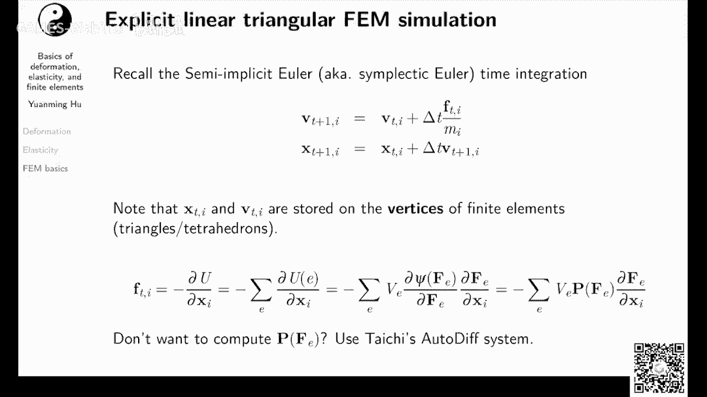

怎么来实现这个，在太极里面怎么实现这个显示的Fem。

你可以看到我这边其实，我并没有一个计算受力的一个函数，我只有一个计算总的弹性能量的一个函数，我这边用的其实是一个什么，是一个neo hooking，用了一个neo hooking的材料。

这边注意一下我把J和0。2取了一个max，这样就防止你的J变成一个接近0的数，这个neo hooking有一个什么很明显的问题，它这边有一个log J对吧，log J的话你这个J如果是负数的话。

你这个整个simulation就会挂了，就会出现各种infinity啊not a number啊，之类的数，那这个就整个就非常不稳定，所以这边我就为了让它稍微稳定一点，我把它和0。2取了一个最大值。

不让它变成接近0，OK，那么我们把总能量计算出来以后，你可以看到我在哪儿调用了这个compute total energy呢，我这边用了一个ti。tape，ti。

tape其实就是太极里面的这个自动微分的，你可以认为是它的磁带，在tape里面这些东西我们会把它记录下来，在执行这些函数执行完以后，我们会进行backpropagation，也就是说求导数。

求出来导数以后，那么导数在哪儿被用上呢，导数其实是在应该是在这个地方被用上，我们在做semi-implicit order的时候，我们把x的负导数，这个其实是总能量关于x导数的负值。

我们把它除上你的质量就得到它的加速度，我们在进行这样一个积分，其实就是在太极里面非常容易实现，因为有这个自动微分的其实，其实整个程序有100多行。

其实mass spring system可不可以用自动微分呢，完全也可以，只要你是你能定义出来一个势能，你就可以进行自动微分，其实我这边还，你可以看到我这边还有一个重力的这么一个项。

这个是一个负g乘上dt的积分对吧，我其实完全可以把我的重力，重力是也给它加到总的能量里面，然后整个全部交给太极自动微分，这样你就不用手动的去求这些乱七八糟的东西了，这个求导这个过程是非常非常头疼的过程。

我以前花过很多时间浪费在求导数，以及检查我推出来导数到底哪错了，这么个问题上面，现在有自动微分以后，这个求导大家就不用去头疼了，OK，大家可以我这次实在有点出忙。

最近事情实在有点多比较忙，所以暂时还没有来得及把这个科建这些代码上传到网站上，但是上结束以后我就会上传这些东西，OK，那么刚才讲了显示时间积分，那么我们看一看影视的时间积分，那么大家可以回顾一下。

之前我们讲过一个看起来稍微有点复杂的公式，就是这个backward Euler的这个影视时间积分，然后其实我们得solve一个linear system，如果我们用一次Newton Rapsom。

我们其实在局部做一个一阶段的展开来建立这个方程，就可以得到什么，得到一个我们这个公式11，那你看到这个公式11里面就头疼了，你就有了一个偏f偏x这么一个项，f是什么，刚才我们推出来这个f大概是一个。

Psi关于你的x的导数，那你这边又把它对x求一次导数，那你就要求二阶导数了，对吧，注意我这边好像是不是有一个tackle，这边应该是偏x平方，这边显示偏f平方，然后求这个二阶导数。

这个叫做force differential，这个就求起来就非常头疼了，我刚才提到如果说你在三维里面的话，你往往是要求一个你中间过程中，可能会用到这个Psi关于f的二阶导数。

这个是一个三维里面其实就是一个81个元素的四阶张量，这个算起来就不是很友好，那很遗憾的现在太极自动微分还不能求二阶导数，所以大家还是要这边还是要手动推一下，如果不想手动推可以去看我提到的两个教程。

它里面有各种各样材料的这个二阶导数，其实两个教程写得非常清楚，你可以照着它写，当然你照着它写你会发现就算公司告诉你，你自己去写还是挺麻烦的，这个我得坦白说我自己也写过，不是特别容易写很容易写错。

这就是为什么我建议大家组队，因为你组队以后你就可以相互检查，这些代码其实很多时候你可能10%的时间在写代码，90%的时间在debug你的代码，如果你一个人写另外一个人看着。

或者一个人写另外一个人review一下，你就可以发现很多别人的错误，那你可能一眼就看出来了，因为其他人看你自己做的事情，你可能当局者迷旁观者清，你可能别人一眼就看出来你到底哪写错了。

所以这个合作其实能很大程度上提高你的生产力，那么剩下来最后一个问题怎么去求M，这个M上次有同学问这个M是什么，这个M其实就是一个质量的矩阵，它是一个对角矩阵。

然后它的每对角线上每一个元素就是这个load的质量，那在FVM里面其实这个M它就，M矩阵还有点复杂，它需要用一个叫做mass lumping的技术，把这个F给它简化。

那么在graphics里面大家一般不care，你这个M你可以用任何你觉得方便的approximation，你甚至就可以把它设成元素的质量，你可以把它设成元素质量，然后当然你也可以设成这个顶点的质量。

是周围元素质量的一个加权以后得到的东西，那你也可以这样设定，你可以用任何你觉得方便的近似，OK，那么这就是我们今天的第一部分，好像一不小心准备的科技有点多，我们可能第二部分稍微加速一下。

那么我们有什么问题吗，可能这部分稍微有点难，但是大家不要担心，因为就算你不懂，你看代码你也会知道这个东西应该怎么写，像各种stress tensor，其实虽然我讲到了它们的定义。

但是我们其实用到了PK1 stress，刚才有同学提到这个PK1 stress，它不是对称的，这个其实很容易理解，因为你可以从这个关系来看到，因为你的true stress tensor。

因为角度量守恒它是对称的，这个sigma是对称的，那你把它乘上一个f的负转制，那f本身又不是一个对称的东西，那它这个乘上这个矩阵当然就不是对称，那么对称的版本是好像有一个叫PK2 stress。

好像是对称的，但是这个PK2用了就更少了，OK，tau是对称的，tau是这个j乘上sigma，j是一个常数，常数乘上一个scalar，scalar乘上一个matrix，乘上一个对称矩阵。

得到的还是一个对称矩阵，那么大家有什么问题吗，我们可以现在回答一下，我看看现在有没有什么问题，可能大家会觉得这部分涉及的连续介质力学有点多，但是这其实都是比较简单的连续介质力学。

真的连续介质力学会比这个难很多，然后我这边其实如果一开始有点搞不清楚，其实完全没有关系，因为我一开始我是学计算机的，我一开始也不太搞得清楚这些东西，然后后来我是通过写代码来学习这些东西的。

所以大家不用特别看到这些不用特别紧张，这个搞不清楚顶多是多调试一会儿，行那么我好像也没有看到特别多的问题，OK， Autodef怎么用我后面会讲。

然后有同学问要不要组装这个Stiffness Matrix，这个其实Stiffness Matrix主要是在Inclusive FEM里面，才需要去组装它，这个后面我们会讲到。

这一讲因为内容已经非常多了，我不能再讲太多，再讲太多估计大家都退学了，都不来上课，我知道有些同学可能是专业的力学专业的，所以听的反而还会可能觉得还比较简单，但是毕竟这个课是一个全连领的课程。

所以我们不能讲一些过于粗暴的概念，OK， 我们照顾照顾到所有的同学，如果大家觉得吃力了可以课后，再花点时间去看一下我提供的两个教程，两个教程其实都是从计算机的角度，从图形学的角度来考虑这些东西的。

所以还是比较容易理解的，那么我们其实今天好像时间有点多了，时间有点长了，所以我们第二部分我们就稍微讲快一点，OK， 那么第二部分我们讲一讲，太极编程语言的一些高级的feature。

这部分其实就比较简单一点，这个部分可能更照顾学计专业的同学，刚才那部分可能照顾一下学力学的同学，当然我可能讲的不是很严谨，如果学力学同学有专业的背景，看出一些问题的话，也可以在论坛指出一下。

这样大家能学得更好一点，我自己也是一个学习的过程，我在做slides的过程中，我自己也把这些，我其实发现自己很多知识的盲点，我也把它再补充了一下，我这个讲课其实也是一个很好的学习的过程，OK。

 那么我们讲一讲高级的太极feature，我们今天讲讲几个简单的概念，在这个太极里面其实可以做面向对象的编程，其实大家教的作业里面，其实有很多已经用上了class对吧，然后我们还会讲一讲原编程。

就是template， 母版，然后一些重用代码的各种各样的技巧，我们还会讲可谓编程，刚才已经提到了一些可谓编程，可谓编程其实就是可以，比如说你可以求导数，求导数可以用来算什么呢。

可以算你的势能关于位置的导数，可以算出来是什么，其实就是你的受力的负值对吧，我们最后会讲讲三维格式化，在过去一周我们助教团队做了一个非常厉害的事情，就是说让太极可以输出POY格式。

POY是可以包含三维的粒子，三维的网格，然后有了这个POY格式，大家可以在太极里面做三维的模拟，然后输出成POY格式，然后在三维软件里面把它打开，然后进行各种各样的查看渲染之类的操作。

太极本身提供的图形系统主要是为2D而设计的，OK我们先讲讲面向对象的编程，太极是一个面向数据的编程语言，但是这个DOP虽然在很多时候它的性能会很高，但是你要模块化它就比较难了。

那么为了提高这个代码的reusability，太极就从OOP里面面向对象的编程里面介入一些概念，这样我们达到一个混合的scheme，我们叫这个scheme叫做ODOP。

Objective Data Oriented Programming，然后有三个非常重要的decorator大家可以使用，如果你的class是一个面向数据的class。

而不是一个普通的python class，就是说你要用ti。dataoriented去修饰你的太极class，对于普通python class你就不用修饰它，你只要用一个太极的class就这样去修饰。

不好意思我好像总是喝水，感觉好像讲了口干舌燥，讲了来劲了就口干舌燥了，然后我们可以用ti。kernel，如果你这个class member它是一个太极kernel的话，你就可以用ti。

kernel去修饰它，如果你的class member function它是一个太极的function，你可以用ti。function去修饰它，那么以前我们是没有这么方便的，我们有ti。

classkernel和ti。classfunction，现在我们已经不用了，如果大家看到以前代码里面有这样的东西，其实可以自动忽略它，这样我们已经不用了一些了。

这个背后有一个很长很长的development story，这个是匡冶大神写的一个太极机器开发的故事，还是很有意思的，这个其实你可以看到，为了我们大家能用上ti。kernel，而不是ti。

classkernel，背后的工作量有多大，真的开发一个编程语还是一个工作量非常大的，一个很辛苦的工作，不过我认为是非常有意义的，大家如果有兴趣或者对python想了解更多的话。

可以去看一看匡冶大神的这个post，那么接下来我们讲一个最简单最简单的例子，这是一个行星绕日系统的这么个例子。

我其实可以跑一下，这个叫做什么来着，odop solar，对了太极已经升级到0。6。10了，大家可以去更新一下自己的太极。

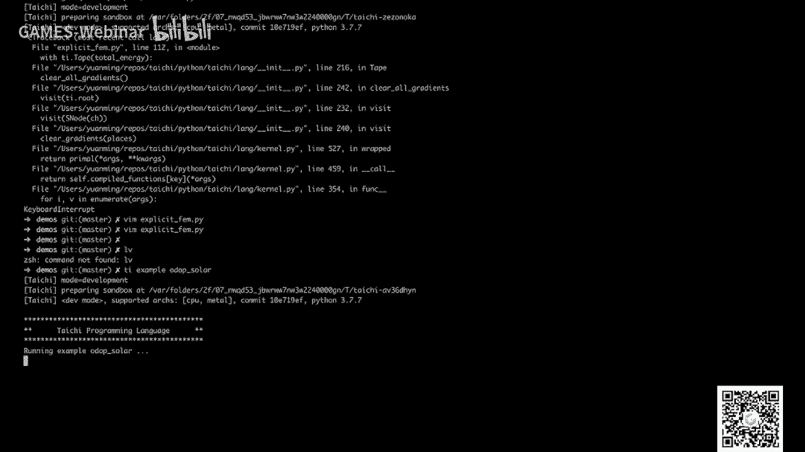

因为这个例子是0。6。10才有的，跑上在另外一个屏幕跑没看到，它其实就是一个很简单的一个例子系统，对吧中间有个太阳。

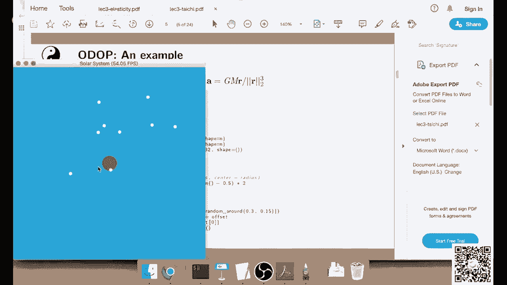

然后有几个行星绕着这个太阳转，其实是一个很简单的一个东西。

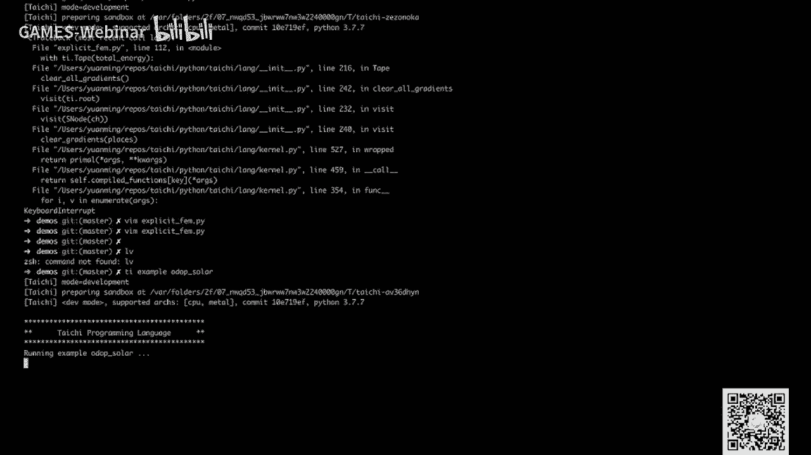

你如果看到代码呢，就在这看吧，你会看到代码你会发现我写了一个class，这个class叫做solar system，然后我用一个tie。dataoriented，to decorate it。

我用这个东西去修饰它对吧，然后你可以看到这个class里面有很多个tensor，这个tensor我们就把它作为成员tensor来处理，其实和你在外面写没有任何区别了。

唯一的区别就是多了各种各样的self对吧，但是你一旦写成class以后，你的这个代码的可复用性就变高了，你下次在用的时候，你只要定义一个solar system，这样一个instance就可以了。

我们可以看到呀，你的这个class的function，tie。function可以被一个额外的static method去修饰，就是静态函数，这个其实这个python里面的static method。

是含义是一模一样的，这边呢我定义了一个static method，这边是其实就生成一个范围内的随机数，然后呢class里面kernel，其实也和外面的kernel一模一样。

唯一的区别就是它带一个self，这个其实就和python里面的class的函数，和外面普通的函数的区别一样，ok，那么我这边还是在这个class里面，我又定义了一个function。

这个function不是一个static function，所以我直接用tie。function去修饰它就可以了，我还有一个integrate kernel。

这个其实就是一个simplectic Euler，我去积分它，怎么用这个class呢，也很简单，跟用python class一模一样，我们只要定义这个solar system，然后这个9。

9应该是你看到这个class，它的constructor take两个参数，一个是n，n是行星的数量，然后dt是time step size，ok，然后我们还可以直接指定class里面tensor的值。

这边我把它中心设成0。5，可以调class的kernel，就和调class function，和调普通pythonclass的function一模一样，那么这个还是一个比较简单的程序。

大家可以自己跑一跑，自己写一写太极的class，当然之前交出来的很多作业上面，大家已经自觉地使用class了，用class以后你代码就可以重用了，你甚至可以在一个文件里面实现这个class。

然后在另外一个文件里面去调你的class，这样你可以至少多文件了，对吧，你如果用kernel和function的话，多文件就是比较麻烦的一个事情，多文件的话你每个文件就会小一点。

这样你维护起来成本就比较低，刚才有同学问keyeditindit能不能变成kernel，这个地方暂时应该还是不行的，我其实从来没试过，你可以试一下，但是我从来没搞过这种用法，我猜应该是不行的。

但是一般keyeditindit里面不是去初始化你的tensor，而是去定义各种各样的tensor，它定义了各种memory field和kernel，然后这边真正的初始化是initialize。

它会初始化你的所有的tensor，OK，接下来我们讲讲原编程这部分，我可能得快速地过一遍，然后后面我们再细讲，因为现在已经一个小时了，太极提供很丰富的原编程工具。

原编程工具可以让用户pass几乎所有的东西给太极的kernel，然后它还可以提高太极kernel运行时性的，因为做了原编程以后，你很多时候一些量在编译期是知道的。

所以你就可以把你的运行时间的开销移到编译时间，原编程还可以让你实现维度无关编程，这个听起来非常疯狂，就是说你可以把二维和三维的模拟代码写在一起，二维和三维的模拟代码写在一起。

你可以如果想一想我们其实FEM里面，二维三维其实非常像对吧，那其实只有唯一的区别就是，二维相量三维相量三角形四面体这么个区别，二乘二矩阵三乘三矩阵这么个区别，其实可以用原编程的话。

你很容易实现维度无关编程，这有什么好处，这个好处在于你调试的时间就缩短了，因为你只有一份代码，很多时候你把二维的搞对了，然后三维的自动的也就对了，这个大家以前在写C++的时候。

一般会用模板原编程来实现二维和三维写在一起，这个其实就C++里面也可以做到，但是比较费事，太近就非常方便，这个我们后面会讲具体怎么来做维度无关的处理，然后原编程还可以提高简化太极的标准库的实现。

其实太极的标准库，比如说什么tunampi这些，其实很多都是用原编程来写的，太极的kernel其实它是懒惰初始化的，那么懒惰初始化有什么好处，就是说你如果定一个kernel你不去用它，它就不会被编译。

然后刚才不应用初始化应该叫实例化，instantiation，很多计算其实可以在编译时间完成，你在编译时间把计算完成了，那你在运行的时候你就可以少花点时间，大家一般还是更在乎运行时间而不是编译时间。

当然现在太极可能有些极端情况编译有点慢，所以大家可能更在乎编译时间，但一般情况下编译时间都是很快的，那么其实你在写kernel的时候，每一个kernel在太极里面都是一个template kernel。

它唯一的区别只是它有多少个template argument，大家现在在用的太极kernel它也是template kernel，它也是template kernel。

但是它有零个template argument，OK，这个我们后面会仔细讲，我们看看这个kernel，这个kernel叫什么，这个kernel叫copy，这个kernel做啥呢。

你可以pass给它两个tensor，那么注意我们这边用的type hint叫做ti。template，这个地方一定要把两个括号加上，你括号不加它可能会有编译错误，这个c是一个ti。f32。

然后我们做什么事情呢，我们把yi设置成xi加上c，那你会发现这个kernel你去调查的时候，你就可以pass两个eway的tensor进去，当然它们大小最好得一样，然后再加上一个offset值。

那么你如果说不用template的话，你就很难把tensor当成argument pass给这个kernel，OK，这个还是比较容易理解的，大家可能在写simulator的时候，可能已经有这样的需求了。

那么知道这个template怎么用，就会少写很多代码，那么除了tensor你还可以把class，以及class instance，或者你的function，或者各种numerical method。

numerical value pass给你的ti。template，但是这个要注意一个问题，就是说它的template kernel instantiation，是overhead比较大的一个操作。

比如说我这有两个函数，一个叫hello一个叫world，对于hello的kernel，它的i是一个ti。template，也就是说它可以take任何东西，并且你传给它不同值的时候。

它会被instantiate，OK，那么我如果说for i in range 100，然后我调hello i的时候，它这边其实就会创建100个不同的。

hello这个kernel的instantiation，那么我如果下面再来一趟，for i in range 100，然后hello i，我如果把这个部分重再重复一遍，它就会reuse第一次创建出来的。

这些100个不同的kernel，对吧，这个就是template kernel的行为，那么如果说你这个不是template argument，你这是一个普通的ti。i3。

就这么一个简单的整形边档的argument，那么这个kernel它就不会被instantiate很多很多遍，因为你这个i32它是一个数值值，而不是一个模板值，OK，所以它只会被创建一个instance。

在这个use case底下，大家其实world这个函数比hello更好一点，对吧，因为你毕竟hello生成了100个不同的kernel，但这个函数是很简单的函数，你真的运行这个程序你会发现性能差不多。

但如果你这个hello是一个非常非常复杂的函数，那你可能性能上就会有差异，因为它得编译100遍，很多时候编译100遍时间还是挺长的，那么另外一个很有用的feature，是叫做这个维度无关编程。

什么叫维度无关编程呢，刚才我们展示了一个copy这个kernel，刚才我们的copy kernel只是对eway的tensor有用，那如果我希望做这么个操作，我把y的所有的值复值给对应的x的上面的值。

但是我这个xy可以是1d tensor，2d tensor，甚至是0d tensor，它是一个0维的tensor都可以，那么怎么办，我们有这么个语法，就是for这个大写的i，这个大写小语无所谓。

我这只是convention我用一个大写，重要的地方是什么呢，重要的是ti。grouped，我这边其实把y的index全部拿出来，进行了一个打包操作，打包操作，那这个i其实就是一个n维下量。

如果你的y是一个nd tensor的话，那这个i就是一个n维下量，这个tensor index你就可以直接把整数型向量传给它的，所以你就可以写这个xi等于yI，这有什么好处。

这个kernel对于不同维度的tensor，维度不同大小的tensor都可以work，你就少写代码，那么还可以做一些更fancy的操作，比如说我们可以写这样的一个kernel。

注意这个i实际上就是一个普通的vector，你可以把i的第0个值或者第1个值给它拿出来，然后做一个复制，那么这个i0其实就相当于i，i1相当于j，如果你的x tensor是一个二维tensor的话。

我们在运行时，我们在编译期还可以进行tensor size的reflection，我们可以在编译期获得tensor的大小的这么一个，怎么说这个叫tensor大小的反射，我就用reflection吧。

这个翻译成中文实在太奇怪了，一般很少听人说反射，反射是什么呢，反射就是你在程序检查自己的自身的一些行为，也叫inspection，叫自省，可能自省好一点，就是你在编译这个kernel的时候。

你可以去查询这个tensor到底是几维的，然后这个tensor的shape是什么样，大家可以运行一下这个程序，这个可以打出来一个x tensor的shape，OK我们还可以做编译期的branching。

编译期的分支，这个compile time evaluation，这个地方其实允许我们在做一个没有运行时overhead的branching。

比如说你可能你的程序里面有一个enable projection，你可能projection可能是比如说碰撞处理，你可以让它这个projection变成处理碰撞，也可以变成不处理碰撞，那怎么办。

你可以用一个ti。static，修饰这个enable projection，在你这个if branching的condition里面，这样它和if enable projection的区别就是。

if它的static enable projection，它的这个branching是在编译期进行的，如果你用C+17的话，你就相当于在用if constexpert，对吧，它是没有overhead。

那么这个ti。static用处非常多，我们还可以用它来强行unroll你的for loop，就循环展开，你可以在编译期循环展开，那么这边是一个例子，这个例子其实就是说，我去fail这个tensor。

这个tensor是一个向量的tensor，向量的tensor它是一个三，它的每个emma是一个三个向量，那么我这边可以做一个什么操作呢，我对这个tensor里面每一个元素，每个向量我把它复制成012。

那么我就可以写这么个static for loop，它是一个强行展开的一个for loop，强行展开呢其实有很多的用处，对吧，你循环展开以后，你可能首先你可能会希望它性能更高。

因为你loop unrolling以后，你就可以减少loop本身的overhead，对吧，你可以希望得到更高性能，这个时候你会希望用到循环展开，你还可能会希望去loop over的东西。

不是tensor的indexes，而是还是你的tensor里面element的indexes，也就是说你的向量或者矩阵的下标，注意太极有一个限制，也就是说太极里面的向量和矩阵的下标，必须是编译期的常数。

这个可能有一点难以理解，就是说你每次访问一个scaler的时候，你得先做什么操作，你得先去从tensor里面拿出tensor里面，这个element是一个向量或者矩阵，对吧。

然后你再来一次indexing，这个indexing是取出向量或者矩阵里面的，那个scaler元素，那么第二步它的下标就必须是一个编译期的常数，这个我们在太极一开始设计的时候就做了这样的设计。

然后这个是一个limitation，但是大部分时候影响不大，如果你真的要去访问它的matrix或者vector元素的话，就得用一个编译器的常量去访问它，但是如果说你这个是个循环变量怎么办。

你就得unroll这个循环，这样你的unroll出来的结果以后，你的循环变量就变成一个变异常数，这可能稍微有点绕，但大家可以看程序以及通过编译错误，自己很快就能体会到为什么要这么搞。

OK我们还可以做一些variable aliasing，为什么做variable aliasing呢，其实就是说有的时候你的一个变量的名特别特别长，你希望在局部给它做一个reference。

你给它做一个短的版本，比如说我们有这个kernel，它是一个比较简单的kernel，它做什么事呢，它是把这个tensor A里面每一个下标取出来。

然后把tensor B的对应下标设成一个function，在apply在tensor A的对应元素上面，你可以看到它是非常长的，我们可以做一个variable aliasing。

做了这个aliasing以后，就可以变成A B function等于tiding static，然后我们相当于在tensor A tensor B和some function。

给它create了一个aliasing，然后这样我们就可以在用它的时候，就可以用它的alias用它的重名，叫别名，用它的别名就会方便一些，这个地方这个例子其实不是特别好，因为A和B这边只用了一次。

很多时候比如说你要写一个stencil，那你这个A可能比如说是一个5 point stencil，5点的stencil，你就可以A在这个kernel里面出现了5次，那你不能每次都写个tensor A。

那就非常的长，你可以就把tensor A先缩短到A，然后你下次就用A就可以了，这样就比较方便，注意这边一定要用tiding static，你不能直接写A的tensor A，那就会出现一些问题，预防错误。

这个还是tiding static已经被用了在很多很多地方，OK那接下来我们讲一讲可谓编程，什么是可谓编程呢，我们之前讲的程序，大家一般意义上的程序，它都是在evaluate一个给定输入。

给你一个输出对吧，算f其实是算这个f of x，给定的x算f of x，然后可谓编程求什么呢，可谓编程它，你可以认为它求的是fx，关于x的偏导数，或者叫jacobian。

太极支持reverse mode autodiff，这个叫反向模式自动wav，可能名字有点长，但是大家如果觉得confuse，其实没有任何关系，因为这个不是特别重要的概念，如果你作为用户的话。

你只要知道怎么用就可以了，它可以做啥呢，它可以反向传播，它可以把你的loss function，就是这个fx，它是一个scalar function，它的导数，关于每一个元素的导数，给它计算出来。

ok这个非常有用对吧，我们刚才已经展示过，如果说我们在求力的时候，我们就可以用自动微分来求出力，而不是用手动的求导求出力，那么有两种方式可以去求导数，第一种方式用太极的tape，你就用一个with。

tied up tape，然后loss equals something，这样你就可以去记录你的forward kernel，然后它会自动的，它会自动的求这个backward kernel。

这个是全自动的，但是有的时候你可能希望有一些控制，更多的控制，那你可以用gradient kernel，这个后面我们会讲，今天时间关系，我们就不继续讲了，这边有一个非常非常trivial的例子。

这个例子干啥呢，我们定义一个loss function，这个叫l(x)，x是一个向量，这个loss function算啥呢，算x和y的差的平方的和，再乘0。5，ok那么这个其实你可以算出导数。

这个导数就很trivial了，这个导数其实就是，就是x对吧，你l(x)对x导数其实就是x，那么我们怎么用可为编程来做优化呢，这个其实很简单，我们首先allocate这个tensor。

在allocate tensor的时候，你要记得加上一个needs gradient equals true，这样它才会求出l关于x的gradient，这个一定要注意。

如果你没有needs gradient等于true的话，它就不求gradient了，因为很多时候你并不需要求gradient对吧，那么我们定义这个loss function。

我们这边只要定义forward就行了，这个loss function基本上是一一对应对吧，很容易，我们reduce这个signal其实就是算l(x)，然后它其实就是把这个差的平方乘0。5。

然后全部accumulate到l上面，这边要注意太极里面的加等于号，这个是一个原子的加等于对吧，ok那么接下来呢，我们就在这个tape的这个作用域里面，我们在python里面用with tie。

tape loss equals l，then we do reduce，然后我们调了这个reduce其实是forward对吧，那么在tape生命周期结束的时候，它会自动做backward。

backward是什么，backward就是给你求出x。grad，这个地方我们做一下gradient descent，做了这个gradient descent以后呢。

你可以把x更新到一个更加接近于真实值的x，记住下降对吧，做optimization的一个比较简单的搞法，这个我应该可以demonstrate一下。

这个叫做autodiff minimization，看还能不能跑。

好可以跑，你可以看到这个demo比较无聊。

它就是是一个trivial的demo，它就是你看这个loss function在不断的下降对吧，l2 loss加上定长度的gradient descent，它是一个指数下降的一个过程。

所以它收敛的非常快，对其实还有一个feature叫做example-p，这是彭于冰小朋友贡献的这个feature，这个feature非常有意思，你可以example-p就可以把这个，把你的这个函数。

把你这个example给它打印出来，还有一个大p，大p是干啥呢，大p是会把它以一个语法高亮的形式打印出来，这边大家要装一个叫做rich的包，这边我应该没有装，所以它现在应该还不work。

但是我可以装一下，rich实际上是一个语法高亮的包，这是一个很有用的一个功能，ok应该现在能work了。

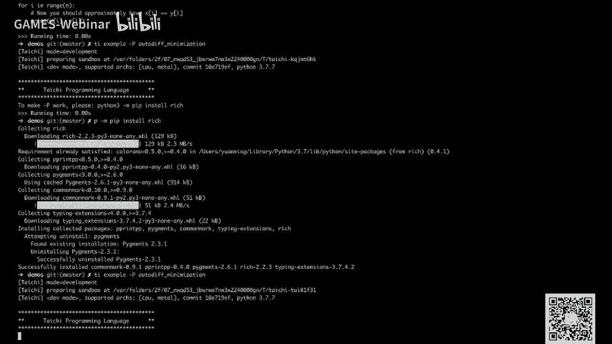

对这个是应该是sublim text的语法高亮了，这个打印出来就非常漂亮，大家可以用用这个-p和-s。

-s就可以把你的demo存在你当前的目录底下，所以还是很有意思的，就很实用的功能。

ok这是一个比较简单的demo。

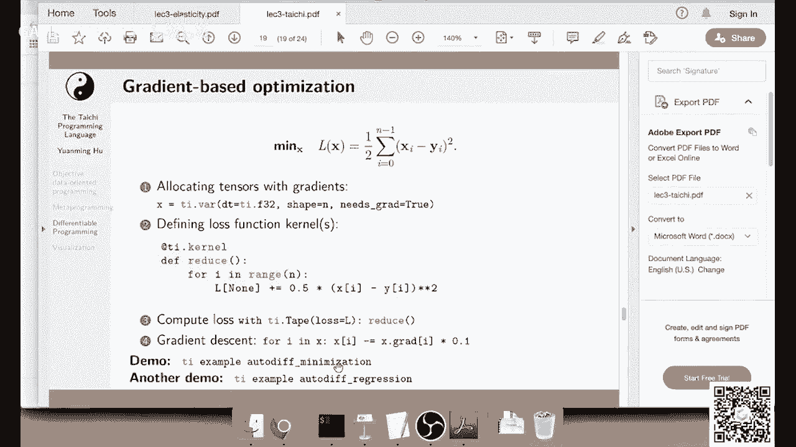

大家可以看一下这个函数，其实这个程序其实非常简单，对吧，你就是唯一一个需要学习的地方，其实就是这个tie。tape，对吧，你可以创建一个磁带，这个磁带记录你的curl launch。

然后launch完了以后，以颠倒的顺序去调这个curl的gradient，所以你就可以做这样的一个求导数的操作，这个非常简单。

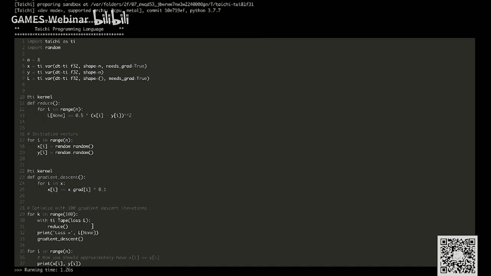

还有一个example叫做，autodiffminimization。

叫做regression吧，我记得它是一个，应该是一个三次函数回归。

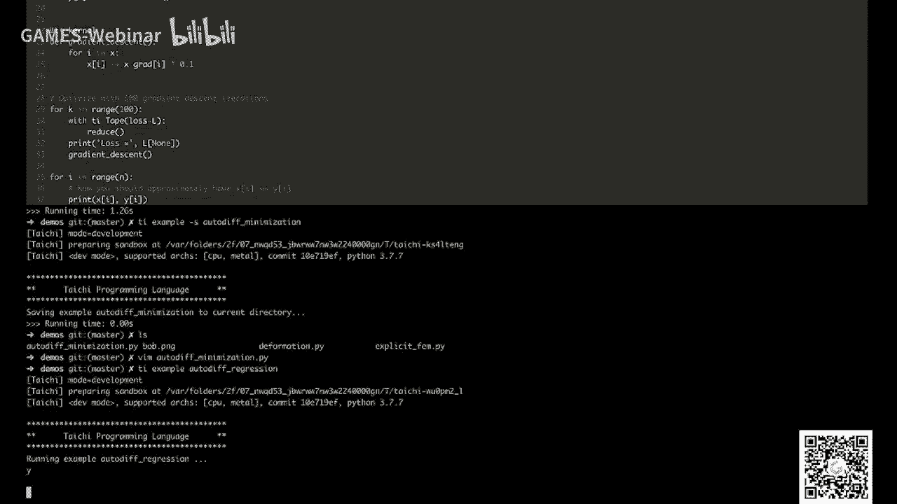

然后也是用一个非线性的三次函数回归，然后我们用三阶动向式来fit这些数据点，然后也是用这个，t路下降来求出来的，ok这个其实也比较容易。

我也可以再演示一下这个杠皮。

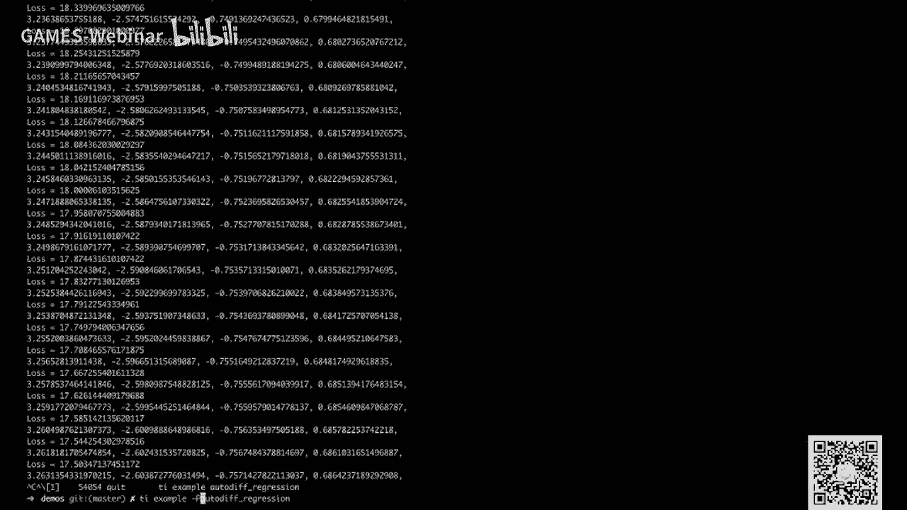

这个color scheme还是很有意思，你可以看到也就八十几行代码，所以如果大家想fit曲线的话，也可以用太极的autodiff的feature，定义一个能量函数，然后用t路下降。

也可以做到这个不错的效果。

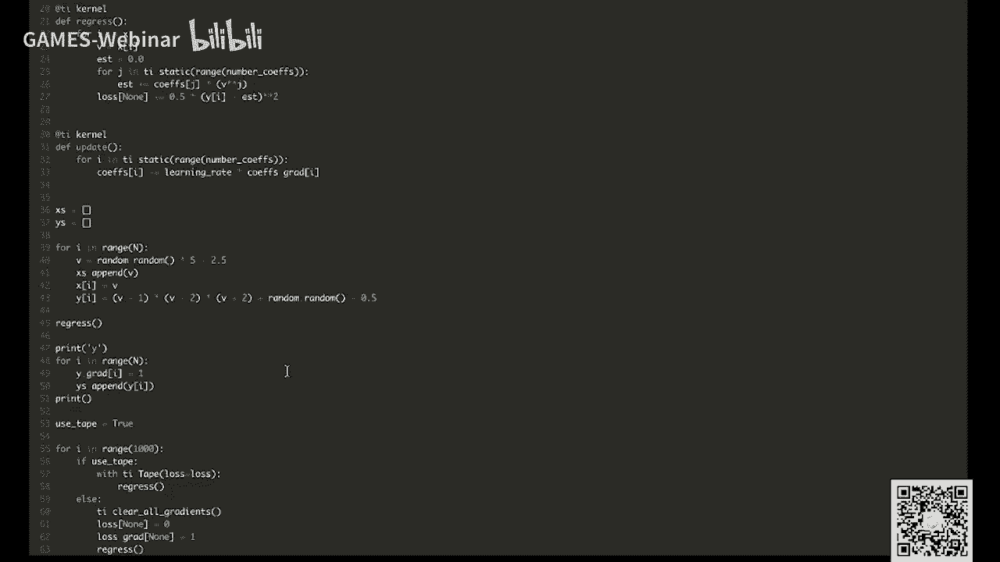

ok我们继续，那么刚才讲到了这个可为编程有两个application，先讲第一个很简单，之前我们已经提到了，我们可以用可为编程求出potential energy，关于位置的导数。

这样我们就知道顶点的受力对吧，其实这个地方用了可为编程，主要是简化我们的数学上面推导，我们就不用去推这些导数了，其实还有刚才我主要演示的是一个fem的example。

其实还有一个npm的example，我们可以run一run，这个是一个npm里面的叫laglang-relead的一个模型。

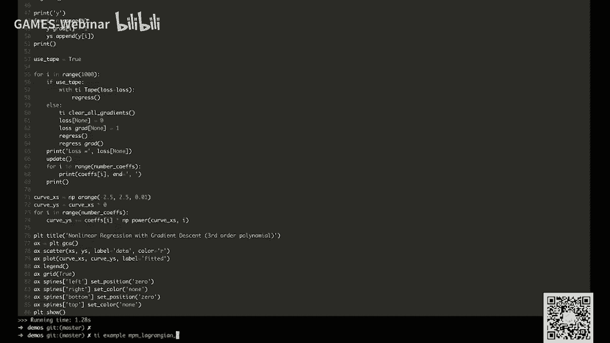

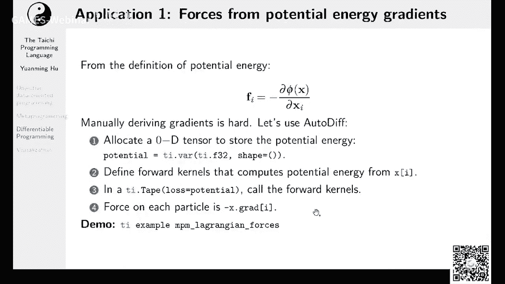

它其实和fem非常非常像，为什么这么卡，这个程序可能主要是可是化非常卡，一直也没搞清楚为什么，但是其实算的还是很快的，主要是画出来非常卡，这个其实和刚才fem非常像，但是npm由于有一个背景网格。

所以它能够额外的在做一些背景网格上面的碰撞处理，刚才我们看到fem其实很容易有自相交，这个自相交非常非常头疼，这个处理起来非常讨厌，但是npm里面它自己和自己相交的话。

它会在背景网格上面进行一些自动的碰撞处理，这样你就不用去显示的去处理它的碰撞，那么这个是npm的一个lagrangian forces的一个model，这个后面我们会细节我们会在npm的部分继续讲到。

大家可以自己去跑一下。

这个其实计算应该是60fps，但是不知道为什么可是化比较慢，可能跟我开始直播也有关系，那么第二个application，你可以如果你手动的把你的收力球出来，你的每一步里面没有用到auto diff的话。

你就可以把这个auto diff省下来，来求整个物理过程的导数，那求出整个物理过程导数有什么用呢，你可以去做很多的物理系统初始状态的优化，或者说你可以做一个物理系统里面控制器的优化。

controller的优化，这个很有很有意思，我们可以看一看这个diff-touch这个项目，这个是我之前做了一个研究项目，但是现在基本上这个已经非常成熟，这个每个人都可以两三个小时，如果你熟练的话。

两三个小时就可以写出来一个可谓的物理模拟器，这个其实就是说你看这是个机器人，然后他有两条腿，每条腿上面有两块肌肉，你可以通过他这个肌肉的收缩和拉伸，他就可以把这个腿就把它相当于迈开腿。

迈开腿以后就可以往右边动，这个控制是用神经网络来控制的，这个神经网络如果在没有diff-touch的时候，你得用这个reinforcement learning，这个增源学习去学习这个神经网络的权重。

那这个效率就非常低，你有了diff-touch以后，你可以用t2下降来优化，刚才我们说了t2下降，由于导数导向性非常非常强，你一般来说这个一二十个iteration以后，你就基本上能动了。

我们看一看好几个demo，这个是一个2D的demo，用npm加上diff-touch。

differentiate整个npm的过程，然后就可以让这个机器人朝前走。

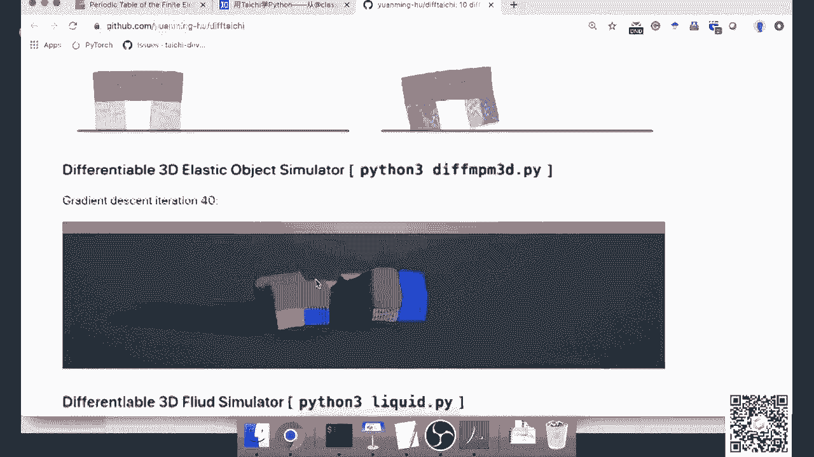

这个是一个三维的版本，npm可以自动的处理水和elastic object的这个偶合，所以你就可以给他加上一些水，这样他移动就慢一点，但他还是在朝前移动，还可以做什么呢。

我们还可以求一个，这个应该是一个height field，一个water simulation，然后白色表示他这个水面更高，黑色表示水面更低，你可以认为它是一个水波大量的模拟。

那么我们可以求一个初始的水波，使得经过一些time steps以后，它可以形成一个态极的pattern，相当于我们在求一个反向的一个模拟，我们去求出一个初始条件，使得这个初始条件经过模拟以后。

能得到一个态极的pattern，那么我们还可以把它和，我们可以之前一段时间有一个非常流行的，一个东西叫做神经网络的对抗样本，我们可以求一个初始的水面height field。

然后我们用DeepTouch做了可微的水面模拟器，再加上一个可微的水面渲染器，再加上一个可微的神经网络，这么一个三阶段的可微程序，我们可以求出来一个什么，我们可以求出来一个水波，使得这个水波的折射。

加在这个松鼠的图片上以后，VGG就是一个图片识别网络，VGG认为这个松鼠图片是一个鲸鱼，而且它的信心相当高，它说这个松鼠经过我的这个水波以后，99。91%是个鲸鱼，这是一个对抗样本。

就是说神经网络它有的时候，它的鲁邦性不是特别好，如果你知道它的导出的话，你可以做一些攻击，这个是可微的钢体物理模拟器，你可以看到这个是个机器人，然后它也是各种弹簧，然后这个弹簧去拉动它就会朝前走。

这个是个弹簧指点系统，这个是一个比较简单的弹簧，这个其实收敛非常快，一般一二十个就收敛，大家可以下载下来跑一跑。

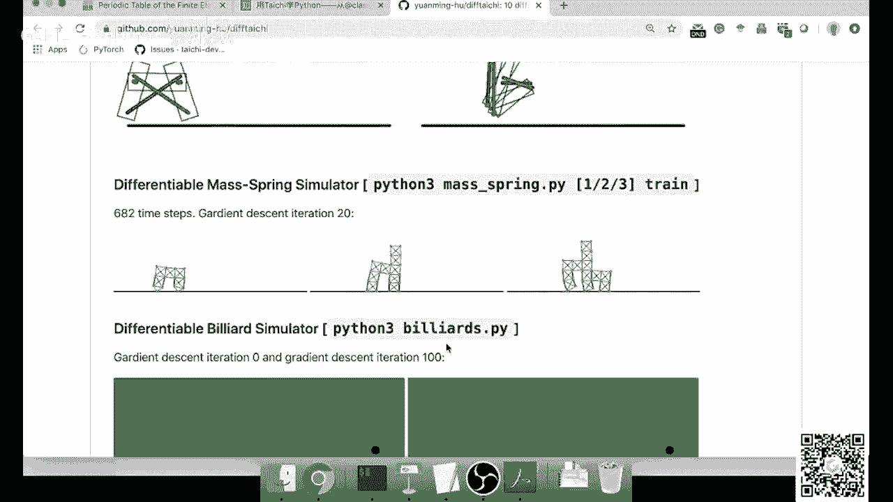

这个是机器学习打台球，我们优化白色球的初始位置和速度，这个蓝色球最后能到达这个黑色点，OK，这个就是我们之前写了10个。

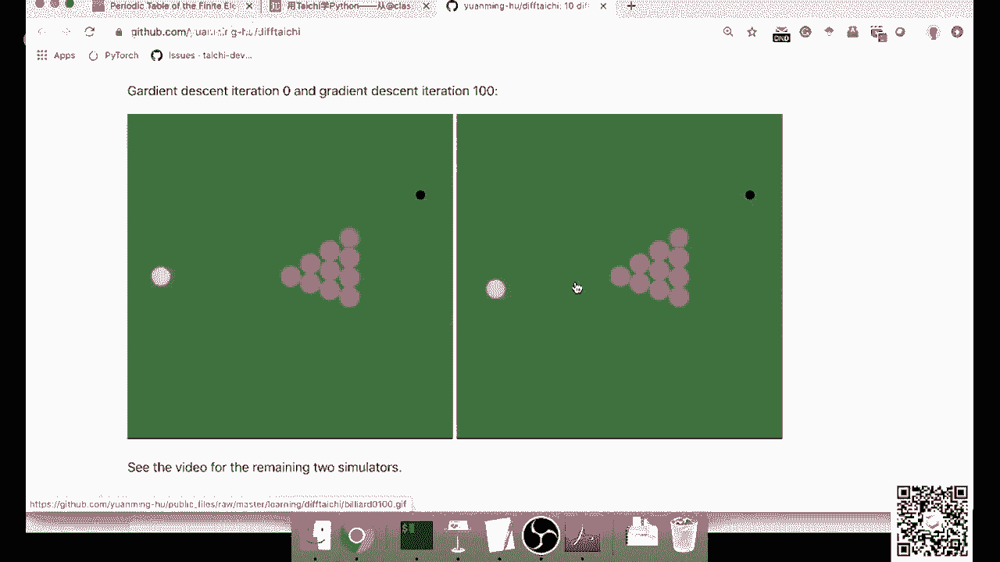

Differentiable Simulator，证明这个Diff-tie其实是一个可用的东西，对，然后这个注意，如果你写可微编程程序的话，你就得去分配每一个time step，你都把它记下来。

你不能只开一个time step的这个tensor，来记最新的time step，你得把整个time step，整个模拟的过程全部都记下来，所以说这个内存占用一般是比较高的，比如说你本来是。

你如果有n个particle，那你开一个e位的tensor就可以了，你把每个tensor的位置开一个e位的tensor，每个particle的位置开一个e位的tensor，但是你如果用可微编程的话。

你就得开一个二位tensor，这个tensor它的第一个dimension，是你有多少个时间步，然后第二个dimension才是你的有多少个particle，就开一个二位tensor。

如果说你觉得这个空间占用过大了，你可以用checkpointing，这个是一个autodiff里面一个常用的技术，checkpointing可以把在你的计算，你本来计算是on空间是on嘛。

你用checkpointing你可以把它降到，比如说空间是o1，然后计算是o√n或者o3次的√n，那集装情况下你可以把空间缩到olog，然后计算缩到这个nlog，我刚才说错了。

刚才说你可以把空间降到o√n，然后时间降到o，或者你空间可以降到o，三次的√n时间降到o，就是说你空间本来是o，所以你空间是可以降低的，集装情况下你可以把它空间降到olog，然后时间变成应该是nlog。

对吧，你可以用空间换时间，最后我们讲讲太极的visualization，那么之前大家很多时候，我发现有些东西上交上来的作业，它上面2D的result是用opencv，或者用一些别的库来渲染。

那样的话也不是不行，但是太极就内部提供了一些非常方便的，可视化的一些功能，叫做ti。gui，然后你可以创建一个分辨率是512的窗口，然后title叫做太极MLSMPM128，然后你可以指定一个背景颜色。

你可以在这个gui上面画圆圈，也可以画线画三角形，然后也可以指定一个image为它的tensor，然后呢，你也可以把这个gui展示到屏幕上，这部分呢我就不多说了。

大家可以去看各种各样的sample code，以及看看文档，那么值得多说一些的是，怎么可视化你的三维结果，这个很多同学已经迫不及待地想从二维一到三维了，所以助教团队上周进行了非常非常辛苦。

非常给力的开发，开发了一个叫py。pywriter。

大家可以去看文档，这个文档里面呢，他会讲到怎么去输出py格式，py格式是一个可以二进制，可以人类可读的一个三维数据格式，然后开py以后，你就可以用Houdini把它打开，我们这边演示一下。

我们跑一个exportpy吧。

你可以看到它在当前目录底下。

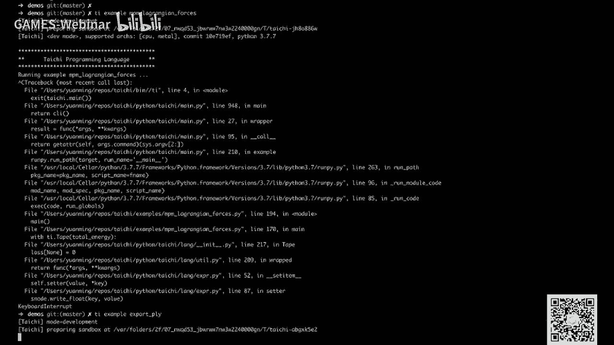

就出现了这个example。py好多个对吧，那么我们怎么来看它呢，首先你可以看example。py，它里面的内容，它有一个header，过了这个header以后它就是二进制的。

所以这个存储效率是比较高的，当然你也可以可选性的输出这个ASCII格式，就是人类可读格式。

我们用一般来说我们搞simulation的话，是用Houdini来打开这些东西，大家可以去装一个Houdini，Houdini的这个学徒版是免费的，还是非常好用的，Houdini呢可以在官网上下载到。

然后各个平台都是支持的，顺便说一句Houdini是现在在电影工作室里面，非常非常常用的一个特效制作软件，它本身就可以做各种各样的模拟，OK，你看这是一个比较重量级的软件，电脑已经连接到了。

我们怎么来引入刚才的这个PY文件呢，点一下这个file，点一下import，然后点一下geometry，OK那么我们到刚才这个文件夹，应该是demos，你可以看到这边它就自动识别了这个examples。

它是一个序列，我们把它打开，这个怎么就无限菊花了，这个要等好久，大家正常电脑上是不会等这么长时间的，我这个电脑因为时间负载比较重，我们刚才看到这个应该是多少帧，这个是9帧10帧，所以我们底下这个时间轴。

我们可以把它改成0。9，这个可能得在这改一下，OK，然后你去拖动这个进入条，你就可以看到这个粒子是在动，我这个电脑可能不太正常，正常情况下你去拖它，这个动画是非常非常smooth的。

然后你点一下这边的播放按钮，它就可以播放这个粒子运动，这其实是一系列动画了，但是由于我这个太卡了，我就不演示了，大家可以自己装一个狐狸，你自己点一下这个播放，OK，我赶紧把它关了。

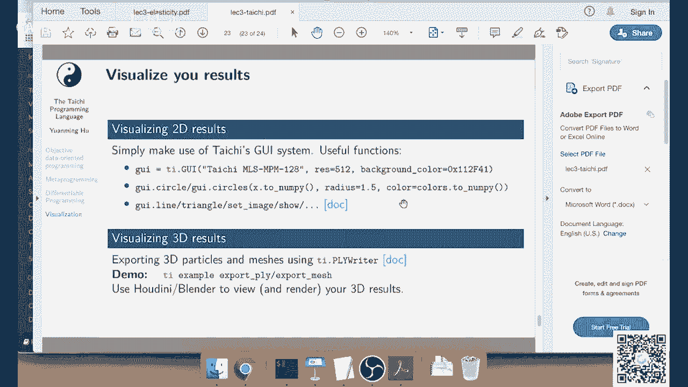

好那么现在如果大家要，刚才演示的是三维的粒子，如果是三维的网格呢，那么大家也可以看一看这个export mesh，这么一个example，好然后今天这两部分就讲完了，我感觉说应该还是比较顺利的。

没有出现像上次那样，在线演示翻车的情况，上一次讲的时候比较疲劳，因为上上周实在是事情太多，讲的时候已经非常疲劳，这周讲的时候精神状态好一点，希望以后精神状态也能像今天这么好，那么接下来如果大家还想学呢。

可以看documentation和之前一样，如果发现bug呢，欢迎给我们提一出，然后也欢迎大家加入我们的开发者团队，我看看有没有什么问题，有同学问了，刚才我们之前提到有一个例子是，a=ti。

static a，我看一下应该是aliasing，在哪儿，对这个地方，这个地方能不能去掉呢，答案是不行的，因为你去掉以后，其实反正就是不符合太极语法。

太极语法要求你必须加一个tidying static，这个大家还是遵守一下，如果你把它去掉以后，它就会编译错误，因为语意就不明确了，物理基础方面有什么推荐的教学，这个其实，暂时来说大家可以看。

课程的推荐阅读材料里面，其实第一部分里面就提到了两个非常好的材料，一个是FDQS写的有限源，然后还有一个是蒋老师写的MPM的理论，蒋老师他们在UCLA的一些，领先的MPM研究者一起写的一个MPM教程。

这个教程写得非常好，大家可以去看，OK，然后，英语不好有点跟不上，这个我得道歉，因为我自己平时说话就这个习惯，我尽量的把我能切换成中文的，我都用中文说了，然后这个slides我觉得。

如果有同学觉得slides上面英文有点多，那我可能也没有什么办法，我只能就这样，因为就这样share了，因为很多词我真的，我自己也不知道它中文是什么，这个可能大家觉得有点奇怪。

但是就是我自己的习惯就是这样的，那么就希望大家能理解一下，这个我自己真的语言水平就是这样，没有办法同时掌握两门语言很熟练，OK，然后，我看看homework1可不可以用SPH制作，当然可以。

SPH的话你可以写一个显示的，Wikicompressible SPH，然后再写一个影视的像DFSPH，或者PCI SPH或者ISPH各种各样的话，大家都可以，都是有很多很多种影视的格式。

大家可以尝试尝试，我觉得还是很有意思的，TI。tip本质上是backpropagation，对exactly就是backpropagation，其实就是你如果做deep learning的话。

其实就是backward path，我说回这个英文的问题，其实主要是还是有很多好的材料是英文的，如果大家掌握这些英文名词以后，可以去看很多英文的材料，这样就相当于学习的是一手资料，如果中文的话。

当然也会有很多人会把英文材料翻译成中文，但是你如果再去看这个中文，就是这个是二手资料，这个中间翻译的时候总会有一些信息损失的，对，如果后面有机会的话，我觉得我应该还是会尽量的写一些中文的教程。

包括如果我真的有时间的话，我可能会尽量的把这个science都翻译成中文，但那个工作量真的很大，我不知道什么时候会真的有机会来做这个事情，暂时我们就先英文，因为毕竟这个课工作量已经非常非常大，OK。

我看看，对，刚才讲到这个variable aliasing的问题，有一个同学问了一个很好的问题，我们做了这个aliasing以后，对新变量的改动会不会影响到旧变量，答案是会的。

你可以认为这个是一个by reference的一个aliasing，我们并不是按value不是按值去拷贝，我们是按reference去拷贝，就像C++里面的这个，那个and符号一样。

那个你加了一个and以后，它就是一个by reference，这个按reference去拷贝，对吧，或者按引用去拷贝，太极法相传播，可不可以直接嵌入PyTorch里面，可以的，这个你可以看。

应该是有一个example。

你打ti。example。

它就会把所有的example全列出来，应该是有，有没有。

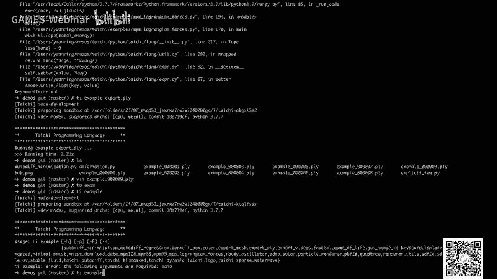

这里面，这里面好像还没有，OK，这里面好像还没有，这个和grep好像还不是很work，但是你如果看，例子里面。

它是有例子的，我看一下，interacting with external arrays，这个地方你是可以和，这没有PyTorch的例子，我暂时想不起来在哪。

但是你可以用什么tutorch和这个frontorch，然后定一个PyTorch operator，你就可以和PyTorch进行交互，OK，然后，边界条件，边界条件就是非常nasty的一个。

这个叫非常淘气的一个，不是很好处理的一个问题了，然后边界条件我们后面会讲，目前我们写的这个simulation里面，暂时我们的demo里面，暂时还是没有边界条件的，我们只有一些碰撞是这个边界条件，OK。

好，那么我们就这一讲就到这了，然后感谢大家来捧场，下面一讲我们会讲一讲流体，然后大家记得要做作业啊，这个如果只听我讲，不去写代码的话，很容易眼睛看了，眼睛会了手没会，对吧，就像看美食作家王刚做菜一样。

我每次看完他的视频，我都觉得我也能做出来，结果一做往往就做出来，效果就很一般，对吧，所以大家还是要多多实践，多多实践了以后，你很多的掌握就会更加牢固一些，OK，那么今天就到这了，谢谢大家。

大家记得做作业一，然后作业一我们留比较长的时间。

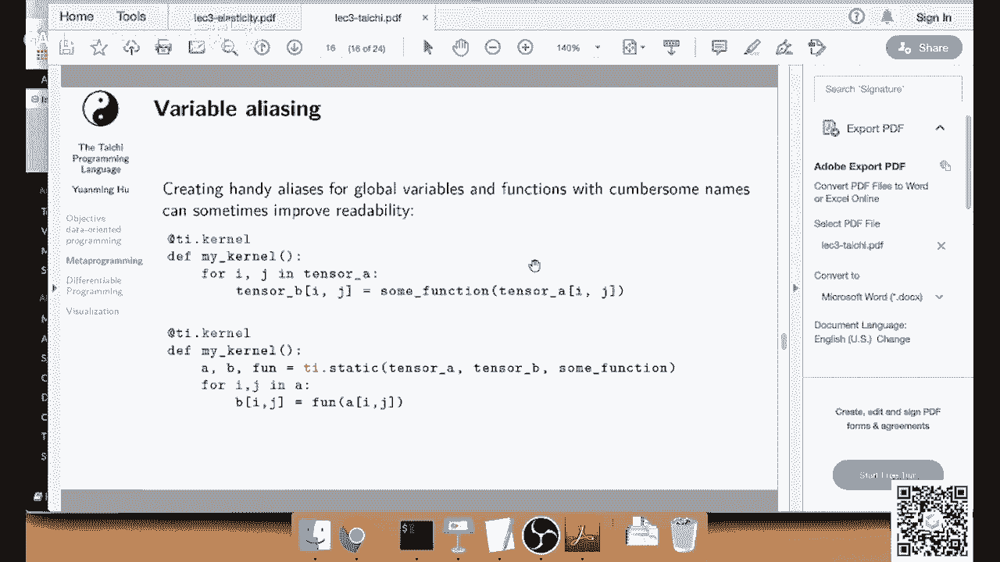

大家会应该时间比较充裕的，OK，好，那么各位再见，我们下周再见，拜拜，拜拜，拜拜。

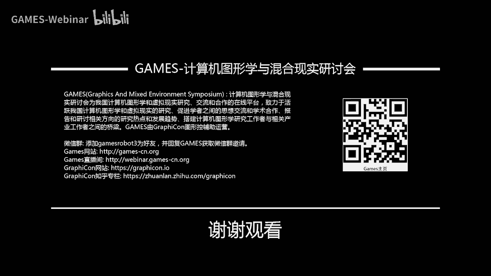

我还以为你会说这些话呢，灭灭火。