# GAMES201：高级物理引擎实战指南2020 - P4：Lecture 4 欧拉视角 - GAMES-Webinar - BV1ZK411H7Hc

那么欢迎大家再次回到我们的高级物理引擎，实战课程，我们已经到第四讲了，不知不觉这个课程已经过去差不多一半了，那么今天呢我们讲一讲欧拉视角下的流体模拟。

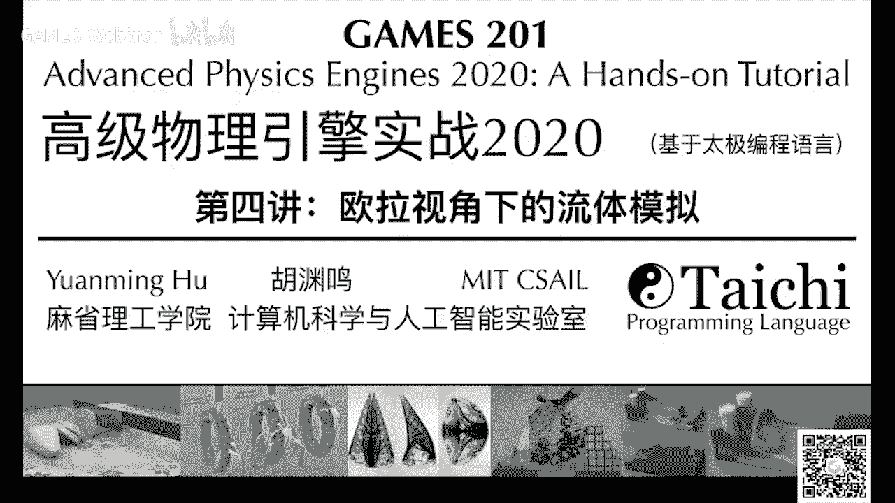

ok那么在开始讲之前，还是忍不住分享一下论坛上面的一些，大家提交的新的作业，感觉还是很有意思啊，有同学写了这个三维的fm，用上了新的viewer啊，有同学写了这个分型嗯。

有同学呢写了这个vertex ring lip morgan，应该还是一个非常有技术含量的作业，ok那么对这些就是homework林的一些新的作品，我觉得大家可以去论坛上面把代码下下来，自己跑一跑。

然后学习学习呃，这些东西是怎么写的，觉得还是很有意思的，看看别人代码的时候能理解很多新的东西。

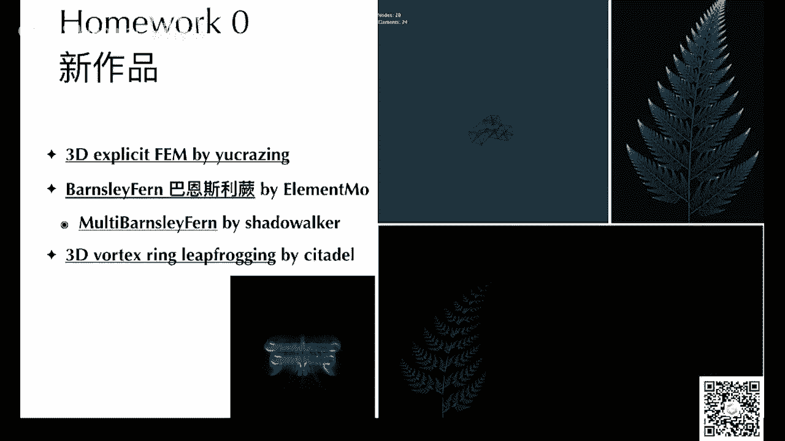

好然后homework肯定呢我们当时发了一个写的好讲，然后最近中科院物理所还写了一篇科普文章，大概是讲卡门涡街的这个标题叫做醉酒的蝴蝶，飞不出花花世界的原因，找到了，我也不太知道是什么意思。

但是反正是个讲流体的文章，然后里面用到的demo，其实就是我们和默克林有一个同学的作业，大家可以去看看，这个文章写得还是挺有意思的，主要是讲各种雷洛树下的这个残留啊，卡门涡街还有残留的行为。

非常通俗易懂，然后有很多同学问我啊，homework一之前要求是实现影视，实现这个时间计分器和显示时间积分器的对比，但是有些sober没法实现显示时间的计算器，咋办呢，啊这个其实不用担心。

你可以只只实现影视时间计算器，然后在影视时间计分器内部进行对比，比如说你可以实现不同的影视时间，积分器的格式，比如说jacob啊，你可以或者写这个country gradients啊。

或者mt grade都可以，这些新的格式呢我们今天会介绍到，ok然后论坛呢我们最近来了一次功能，升级到太极，升级到了v零点06：12，然后论坛有了一次很大的更新，可以呃支持贴公式，我试了一下。

还是非常非常实用的功能，然后也可以贴一些呃，贴些图，然后效果还是非常好的，非常感谢，work class，同学帮我们进行了这个非常辛苦的升级工作，现在论坛应该可用性啊比之前要好了很多，然后我们第五讲。

我们呃专门讲多体问题与我方法，我们请了著名的张星星师兄来给我们讲这方面，因为他是这方面的专家，那一讲呢我们会提到多体问题，和他们与柏松问题的联系呃，然后还会张欣怡同学还会给大家分享，分享我方法的乐趣。

然后从直观的角度，引导同学们认识几种不同的快速求和方法呃。

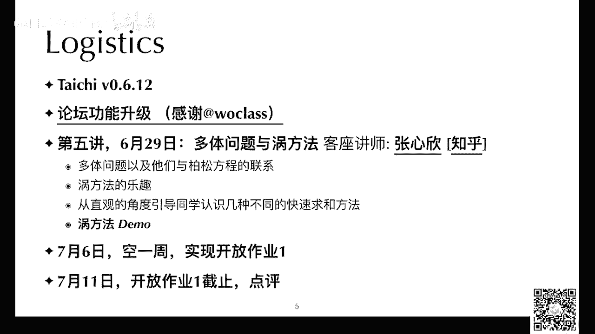

为了欢迎我们的张鑫鑫师兄。

我还特地自己也写了一个窝方法的sober，但是基于他的之前的一个c加加程序写的，我这边可以给大家演示一下，是一个vertex ring lip morgan的程序，ok，还是很有意思。

这个代码只有几十行，大家可以哦，对这个这个代码我还没分享到论坛上，大家可以下载下来看一下，当然也是基本上可以实时的跑的。

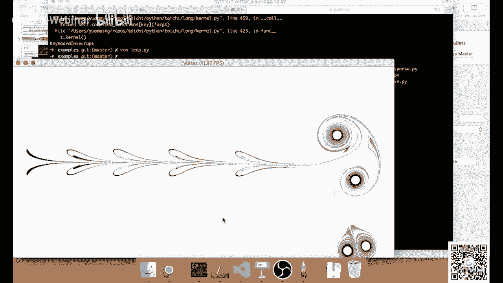

ok看这个代码还是，就90行捕捞的代码，然后非常容易理解，下一讲啊，就专门请了我们的客座讲师张艺兴师兄，给我们讲一讲呃窝方法。

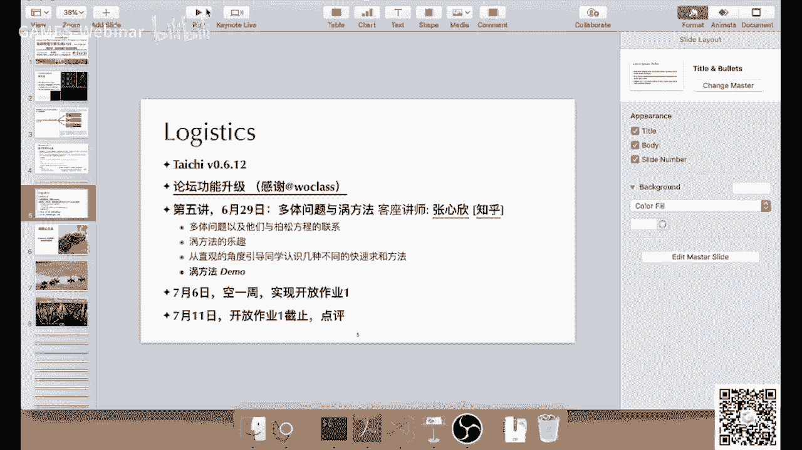

然后呢7月6号我们打算空一周，这样给大家多留一些时间去实现一下，开放作业一呃，7月11号呢我们开放作业一评选截止，然后我们会做一些点评，然后发出一些嗯选出一些很好的作品，然后也会发出一些奖品啊。

这个有同学反应好像比较卡，那么呃没事，这个课程这一讲结束以后，我会把程序上传到论坛上面，大家可以自己在自己的机器上面跑，那肯定就会肯定就不卡了，那么课程纪念品呢，我们homework 0的获奖同学。

我们已经全部都寄到了，然后呃当然请大家查收，因为有可能有些地方会比较慢一些，有些地方比较快一些，有些地方可能还没有击倒，然后大家请留意自己的呃短信啊，邮箱啊，然后尽可能的呃确保不要被。

不要被别人拿走了之类的，这个非常这边非常感谢负责后勤的东西，帮我们定制了这么多呃杯子，然后负责邮寄工作，这个真的是一个非常辛苦的工作，对这个有同学问这是不是杯子，它当然是一个杯子呃。

不是后面的这个纪念品，不是后面的这个电源充电器啊，是这个杯子，还有杯盖，这个应该比较容易看出来呃，ok今天内容还是内容还是挺多的，我就不多说废话了，之前我们主要讲的是拉格朗日视角。

那么记得拉格朗日视角是什么，拉格朗日视角这些例子是随波逐流的，他们会随这里的材料在游戏里面移动，那么拉格朗日视角的例子，往往会用来记录一下，到底自己的位置和自己的速度在哪，或者会记录一些温度啊。

或者其他的属性对吧，那么它的关键就是我们的sensor，或者这个传感器呃，你可以想象成这个小的流体的粒子，它是随着你的流体或者固体在空间中移动的，今天呢我们讲一讲这个欧拉视角。

那么欧拉视角呢大家记住它的特点是什么，它的特点是你的这个采样的点，在空间中是完全不动的，ok有同学说我这个非常卡，我是不是应该把我这边的对我，因为我开了一个直播的同时，我嗯我在网上又开了一个网页。

开了一个虎牙的网页来看我自己的直播，可能这样会导致比较卡，我现在把我自己的那个网页关了，但这样的问题就是说我可能会看不到呃，弹幕或者提问，那么如果有问题的话，大家可以在课程群里面发发一微信群。

这样我不知道这样会不会不卡一些，试一试，今天嗯回到这个欧拉视角，欧拉视角它的特点是，它的采样点是永远不不会移动的，然后它的采样点回答什么问题，回答问题是在我这个点这边。

我的呃材料它以什么样的速度在穿过我自己，ok那么这个是欧拉视角的一个直观的理解，你可以认为就是很多在你在水里面插了很多桩，这些桩永远不动，但是这个妆每一个妆啊，都是知道自己周围的水流流速的好。

那么这个是图片部分了，我们下面进入稍微复杂一些的公式部分，呃今天呢我们会稍微讲一点点数学，但是不会讲特别多，然后这门课呢主要还是侧重于直观上的推导，呃我们偶尔会提到一些有限体积，有限微分啊。

有限语言之类的基础知识，但是我们只会提到非常最为直观的一部分，我们不会讲特别深的这些lumerical scheme的理论，如果大家想深入学习欧拉流体模拟啊，可以看一看这本书，这本书写的非常好。

我自己也是看这本书入门的，叫做free simulation for computer graphics，它的作者是robert bryson，这个是一个大佬级的人物了。

在流体计算机通信学里面的流体模拟里面呃，基本上是无人不知无人不晓的一个人物，但是顺便说一句，张星星师兄就是这位大佬的学生，名师出高徒呀，然后呃今天这讲呢，其实我们只是快速的过一下这个。

欧拉法流体模拟的一些内容，ok那么我们先overview一下，看一看这个欧拉法流体模拟到底是在干啥，首先我们要介绍一个概念，这个概念叫做material relatives，或者叫做材料导数。

中文的材料导数这个翻译应该没有什么问题，嗯他其实呢联系了欧拉视角和拉格尔视角，这个台词老师是什么意思呢，它的符号一般是用大d大写的d，然后而不是我们的偏微分符号或者小写的d。

然后呃材料导数它其实有两个部分，当你去求一个物理量的大d by d t的时候，他其实呃它有两个成分，第一个成分是这个物理量关于时间的导数，就partial by partial t对吧。

第二个成分呢是呃，材料在这点速度点乘上一个grad，然后直观上的什么，这个人是什么意思呢，直观上来就说你这个物理量，由于呃你是呃这个是material问题，那也就是说这个采样点。

是随着你的材料一起在移动的，那你这个彩随着材料一起移动，采样点，它的物理上的变化有两个成分对吧，第一个成分呢是你假设你即使不动，那你的这个物理量也会改变。

那你其实就有一个呃partial by party partial t，那这个其实是一个可以说它是它的这个material，derivative的一个欧拉的分量，就是空间中不动，然后随着时间改变而改变。

第二个分量呢是呃，由于你的材料移动了，所以你这个地方你的变化率是什么，变化率是你的u乘上呃，你的这个scale field在空间中，本来关于空间的变化率就是它的gradient对吧。

u点乘上gradient又得到物理量，关于材料呃，由于材料移动所导致的变化，这个material rita有很多名字，然后有的同学喜欢叫他，advertive或者lagrandia或者particle。

他有很多很多的名字，然后我们一般呢这边这个课里面，我们就叫它material，我们不要引入特别多的名字，要不然他会比较confusing，那么常见的例子呢，就比如说温度的变化，温度变化有两种成分呃。

如果是你是把温度计在粒子上面，那你这边啊温度变化，首先它你这个例子不动，它也会变对吧，第一个分量就是怕手t pasht，怕是大t怕是小t，就是他对呃t大t是temperature，小t是时间。

第二个分量呢是以粒子移动导致的变化，那么就是u点乘上gravity对吧，有的时候呢这个material drs也会对速度本身去求，那么如果说你是对速度的x分量需求，那其实你直接套用公式就可以了。

只不过可能有点绕，因为你是呃速度的变化，它本身是老速度的影响，ok刚才讲了这个material derivative，那么我们下面就讲一讲，这个不可压缩的n s方程，这个a商城有很多变种。

这边我们介绍一个比较简单的版本，看起来好像很复杂，但是其实大家不用担心这个方程是什么呢，我们直接看这个公式三，它是什么意思呢，就是说你的流体里面的一个小的粒子，或者一个小一小包材料。

它的速度关于时间的导数有三个成分，第一个成分是由于压强的梯度导致的，这么一个贡献对吧，你如果想如果说你的这个呃一小包材料，它的压强在空间中的变化，那它就会受到压强的这个力，对它的加速导致的影响。

第二个成分是什么，第二个成分它的粘性，这个联系下我们一般在图形学里面是忽略它，因为我们一般希望流体这个效果越不练越好，然后因为越不连以后你就更更为突出各种窝呀，各种看起来非常炫酷的效果。

所以我们一般会把这个联系项给丢了，所以这一项大家其实不用考虑，然后还有一个g g是什么呢，g就是重力加速度，对吧嗯我们再看一下这个方程五，由于我们这个是一个不可压缩的流体，那么不可压缩是什么意思。

不可压缩，就是说你的速度场不能有散度对吧，如果你速度场有散度的话，那你局部就会由于材料的过度流入或者流出，导致这部分的流体被压缩或者延伸，被压缩或者延伸有什么后果，就是它的密度会变化。

但是我们这边又是一个不可压缩的流体，所以它的速度的反应应该是零，那么实际情况下我们怎么来求解，这么呃一个不可压缩n s方程吗，看起来好像很复杂，但是我们一旦把它分开来，分成好几份，它就不再复杂了。

首先我们会做一个叫operator speaking的操作，这个名字又是听起来很复杂，但是大家可以去看一下这个more details，它面会介绍这个operator spleeding是什么意思啊。

它的严格的定义，但是我们这大家只要知道operator stating呢，就是把一个呃，把一个关于时间的pd给它拆成若干个部分，使得每一个部分都非常的简单，这就是它直观的含义。

ok那么我们怎么来split呢，首先我们去把它这个其中的advection这一部分，给它提取出来，也就是说我们把原来这个方程，我把右边右端项给忽略掉，我们认为右转项是零，就得到公式六对吧。

然后我们再把这个g的这一部分给他考，考虑进去，就得到了公示期，然后呢，最后我们再把关于压强的贡献，这一部分给它考虑进去，然后我们还要把呃速度场散度为零，这么个条件也考虑进去，就得到了我们的公式吧。

ok那么我们接下来会分别讲公式六和公式八，公示期非常非常简单，公示期其实往往就是给你的速度上，直接加速一个呃，直接提添加一个重力加速度，然后ok我看到有很多同学说非常非常卡，我想想我有没有什么办法。

我这好像也没有什么办法，我看看我能不能呃，是不是我的wifi的问题呢，应该应该还好，ok我们就继续讲吧，我觉得好像如果卡的同学能不能试一试，换换线路，然后我这就有的同学说正常，有的同学说卡。

那我猜应该我这应该还好，然后ok我应该暂时没有什么能做的，所以就不好意思了，我们就先继续，好，那么我们刚才讲了operator beating，我们刚才讲公式678对吧，我们把原来一个很复杂的一个pd。

给它拆成了好几个部分，那现在呢我们得到了这么1233个部分，外力和projection，那么我们可以再对它进行时间的离散化，那我们就得到了对于每一个time step，我们有三步，第一步呢。

所谓的advection听起来是个很高大上的词，其实含义非常简单，它就是移动我们的流体的长这么呃，或者说呢我们通过当前的速度场求解出来，下一个时间步的速度场的一个初始版本。

但这个初始版本是没有考虑到外力，没有考虑到压强的，我们只考虑速度场的移动，所以这一步叫做action o，那么第二步呢，第二步是在我们刚才求出来的速度上，的基础之上，我们再去加上外力。

那就得到了一个u star star，是两个star，那么第三步我们这个u star star由于经过了，即使他即使u本身是没有散度的，由于经过了the vaction和外力的修改。

他自己可能会产生一些散度对吧，那么我们怎么办呢，我们再进行一步projection，给它加上一个压强的一个作用，这个压强的作用呃，是这个压强当然不是随便抽出来，这个压强得是满足，加上这个压强以后。

你的新的速度场的散度是零，ok那么我们来呃，有了这三步以后，我们得考虑一下，到底怎么样来表示我们的速度场，这边就牵扯到呃我们的一个数据结构，这个叫做实际上非常简单的，就是一个均匀网格。

当然你如果是oa farm模拟流体的话，不一定要网格，你可以用三角网格啊，你可以用这个呃，三维里面你可以用四面体网格，然后你也可以用各种其他的像呃，你也可以用，你如果真的愿意的话，你也可以用例子。

就是例子永远不动，然后你可以用它来build一个欧拉法的方程，那也是可以，但是这些方法都比较复杂，我们今天呢就讲一个非常简单的，这个叫regular gra，均匀网格。

均匀网格呢一般在二维里面就是正方形，三维里面就是六面体，那么如果说我们把空间分成很多个均匀的，正方形的cell，就是cell就是细胞了，我们这边其实是3x3=9个sl对吧，那么这个问题是在于。

我们对于每个cell它自己还是有一个面积的，它里面任意选一点，我们都可以用来存速度的横向分量，纵向分量以及压强，那我们存在哪儿呢，这边就有选择了，最简单的乘法就是全部存在cell的中心。

也就是说偏离横向偏移零点呃，和cl的corner偏离0。5个cel，然后纵向呢也和cell的这个左下角，偏移0。5个cl，那么你把所有东西全部存在中心，如果这样的话呢。

那你去分配这个速度场和压强场的时候，你就可以直接呃在太极里面，其实你直接开这个呃uv p它就是其实ti divr，然后t i。f32 对吧，然后它的shape，其实就和你的cell的大小是一模一样的。

因为你有一个cell，你就有一个压强或者速度的采样，ok然后，稍微更复杂一些的方法呢是用stagger grade，所谓staggrade，就是说我们可以把速度的横向分量，速度的纵向分量以及压强。

存在这个cell的不同的地方，然后这边呢我们红色的存的是速度的横向分量，绿色的点呢存的是速度的纵向分量，蓝色的点存的是压强了，注意这边是写错了，这边不应该是orange，这边应该是blue。

然后如果说你要这么去分配你的速度，场的grade的话，那么你一定要稍微注意一下，因为呃如果说你的网格是3x3，那么你的横向的速度长，它其实是一个4x3的速度，看你的纵向速度长了。

它其实是一个3x4的数组，你看看，因为呃虽然你有三个三个grade，三个每个方向，这里有三个grade，但是你其实如果说存在边上的话，那你其实有四条边对吧，这个我记得小学的时候。

学过一个叫做什么植树问题，还专门研究这种这种这个加1-1的事情，这个可能是童年回忆了，那么压强就不用担心压强还是存在他的cell center的，所以不用担心，那么staggree有什么好处呢。

staggree后面我们算到各种有限差分的时候，它就会有很多的好处，特别是它能够避免一个叫做checkerboard，pattern的这个一个很坏的事情。

如果关于这个checkerboard pattern，大家有兴趣的话，可以去看之前提到的一本书，ok那么我们刚才呃，虽然在每一个cell里面都加了一个采样点，使得我们能知道那一点的速度，那么还有很多。

但毕竟这个excel里面除了一些点以外，还有几乎所有的地方它都是没有数值的，那么怎么办呢，我们怎么样在这个cell里面，所有的地方都把我们，比如说速度横向分量，或者速度纵向分量来产生定义呢。

这个地方就需要用到一个插值技术呃，常见的情况，常见的插值方法是这个双线性插值，by linear interpolation，有的时候有些书上也会讲。

流体里面可能会用by cubic interpolation，但是最近好像不是特别流行，最近好像流行的搞，他就是直接搞一个白linear interpolation。

by linear interpolation，非常容易实现，然后呃在大部分情况下work也挺好的，所以大家一般就用白零点了，什么是blinear interpolation呢。

假设我们在这个一个cel的四个顶点上面，呃，如果我们知道一个一个这个正方形，它四个顶点上的值，比如说呃这个地方还有黄色，绿色，粉红色和蓝色对吧，那么我们如果说需要用这四个顶点上的值。

我们只知道这四个顶点上的值，怎么去重建出这个正方形里面任意一点的值呢，这个其实嗯还是比较直观的，我们其实只需要呃，首先我们只需要把这个点关于嗯，每一个顶点的距离给他算出来对吧。

这个距离是我们是用了一个什么metric，这个距离我们用的metric其实是呃，它关于对角线这个点形成的面积，这个可能稍微有点绕，但是大家可以看底下的这个直观的解释。

我们这个黑点它的数值是怎么加权计算到的呢，它是黄色的点的数值乘上黄色矩形的面积，加上蓝色的点的数值，乘上蓝色矩形的面积，加上绿色点的数字，加上乘上绿色矩形的面积啊，但是这个就是一个简单的加权平均。

其实还是很容易理解，那么做了这一步以后，虽然我们只是在空间里面的很少个离散的点，上面有数值采样，但是我们可以通过双这个双线性插值，得到空间里面几乎所有点的呃，一个数值的近似。

假设我们的物理的这个这个feel，它是一个几乎是连续的，没有这个跳变的话，那这个binary interpolation，还是能够做非常好的工作的，ok那么接下来呢我们就讲一讲advection。

所谓的action啊，就是移动流体的材料，说到reaction呢，这个有非常非常多不同的schemes，然后不同的scheme呢，它其实是在数值粘性，稳定性，性能和复杂程度之间在做不同的取舍。

当然这里面最简单的就是，我们后面第一个讲的叫做similar roger fection，它非常的稳定，但它的数值连性也比较高，什么数值联系呢，我们后面会演示，那是一个稍微复杂一点的方法呢。

叫做micromic或者b f e c c，它是啊3米2个中心的一个升级版本，然后呢最近还有一些新的skin，比如说呃，我们曲子怡同学和张艺兴师兄，提出的这个by mark square。

那也是一个很有意思的陪伴，大家可以去看一看，最近stay up应该是2019的一篇很好的paper，然后还有particle action，就是说我们虽然我们是用欧拉网格，表示背景的速度场。

但是我们可以把很多物理量给它记在例子上面，呃，这个我们在后面讲到，混合欧拉拉格尔说话的时候，我们会提到这个particle action的方法，它其实也有很多很多的变种。

那么今天呢我们就讲一讲最简单的similar，grand vaction和bf c c或者microy，my comic和bf e c c本质上是非常类似的，基本上只有一些系统上的差别。

所以呃大家一般也不做严格的区分，ok那么什么是三bilibrarian roger advx呢，假设呀我们要求下一个时间步x点的速度，那么我们如果知道这个时间不它的呃，上一个时间步的速度场。

我们怎么来求这个下一个时间不x点的速度呢，假设我们的速度场在空间中每一点都是恒定的，并且它从来不变，那么怎么办呢，其实非常非常简单，我们只需要把x点的位置沿着时间，沿着当前的速度上去嗯。

向后推移一个吊塔t，向后推一个吊塔t，这样我们就得到了x这一个点，在上一个时间步的位置对吧，那么由于x啊，它是你可以认为它是一个拉格朗日的一个例子，那么由于我知道他上一个时间步在这个地方。

下一个时间步跑到了这个地方，那现在问题来了，这一个时间不x的速度是多少呢，这个其实非常简单，其实你只要在上一个时间不嗯，在x这一点做一次双线性插值，你就知道了，这个例子在上一个时间步的位置啊。

在上一个时间步的速度对吧，由于它这个粒子的速度，你假设它是不变的，所以在下一个时间步的速度呢，就等于呃这个例子在上一个时间步的位置，在速度原来速度场里面的采样，ok那这个是要实现起来。

其实非常非常的容易，我们对于，如果说我们要对x这个物理量去求similar，graction，把结果存在lex里面，那么怎么办，我们就去loop over x里面所有的下标，然后把new x。

他这个下标的值设成blinear interpolation啊，我设成x值就是x是旧的物理量的值，在这边，在它的历史上的位置去做一个双线性插值，这边呢我们要做一个back trace函数。

back trace函数是什么意思，就是说我们把时间倒着播放，倒着播放，我们就能回到历史，就可以求出x这一个点在上一个实验部的位置，然后我们在上一个实验部去求x的值，就可以得到呃，这个时间播的物理量。

ok可能有点绕，但是呃应该直观，应该直观上还是比较容易理解的，但是呃这个就会导致很多问题对吧，我们由于我们的速度场它并不是一个恒定的值，它会经常变，那你实际上x它在速度场里面的，这个x这个支点。

还有速度场里面移动，并不一定是沿着一条直线，它可能是沿着一条曲线，那么实际上你的这个material parcel，它的移动路径可能非常非常的复杂，你可能会得到一个偏离后的偏离后的结果。

比如说呃你如果这次这个支点x是在这，那么你会计算你获取会计算出它上一个时间步，它的位置是在红色的点，这但是呢实际上他可能是在绿色点缀，那你这个就设置好礼仪，没有1000里了，那么怎么办呢。

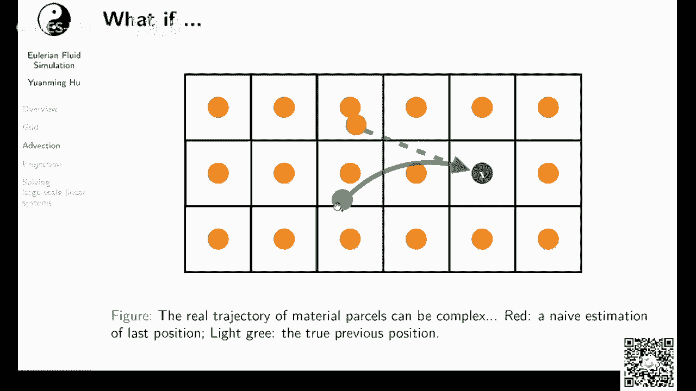

队友在讲这个之前，我们先来演示一下。

这个这个误差会产生一个什么样的效果哦，对其实代码现在已经在github上面已经有了，应该是在这，大家可以去论坛里面去点击这个链接，或者你直接到games 201的这个release里面。

可以下载到我刚才演示的这几个几个代码。

ok那么我们来演示一下，你如果看到我的vx里面其实有一些选项，我先把这边来稍微调一下一。

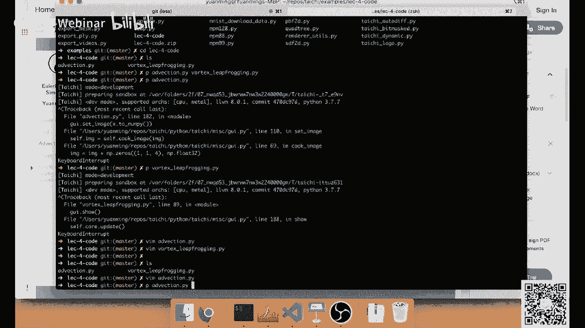

ok那么我们一开始有一个太极的图标，然后我们加一个旋转的速度，成如果说啊我们用一个比较简单的sevlog，range and action的话，如果说我们只用一个非常简单的trace back。

的一个scheme，那就会导致这个素质场，他的你看他这个太极图标就越来越小，越来越小了，这个就是我们的误差导致的。

由于说呃你每次trace spect的时候，你的这个路径都不准确，你其实会得到一个更远一点的值，导致你的这个每次做完一留以后，做完advaction以后，你的图标就越来越小，当然还有一个问题是什么。

它这个图标会越来越模糊对吧，这个越来越模糊的问题，我们后面再解决，我们先来解决一下，这个图标变得越来越小的问题，如果说你呃如果说你有一坨流体，它就是这么顺时针的旋转的话，那么你如果说我们这个太极图标呢。

就是表示一个速度场，白色表示高温度呃，黑色表示低的温度，我们假设速度场不会defuse，那么我们呃呃我刚才说错了，应该是温度场，白色是高温度，然后黑色是低温度，我们假设这个温度场是不会defuse的话。

呃，那么我们当然不希望这个温度场，随着你流体的旋转变得越来越小，这个就会就实际上是数值误差对吧，那怎么办呢，我们其实有更好的backtrace的方法。

这个其实就变成一个initial value problem，它是一个数值o d e，学过数值分析的同学，应该都知道这个该怎么处理，我们刚才啊其实演示的时候，我得先把这个背景的程序给关了，要不然太卡了。

ok我们刚才演示的时候呢，其实用的是forward order，然后它其实很简单，我们要求这个p在上一个时间步的位置，怎么办呢，我们把p减掉，p在当前时间步的位置乘上dt对吧，那么我们其实就回到过去了。

那么这个叫做fooiler，他其实呃注意这边，其实这个负号是因为我们在往后面往历史去推，而不是往未来推，如果是往未来推的话，这个应该是一个，正好这边里面所有的符号都是，由于我们在going back。

我们在重新播放，我们的返回播放我们的物理模拟导致的，那么怎么得得到一个更精确的一个estimation呢，其实直观上也非常容易，我们可以用ark to game或者叫显示终点法，显示充电法干啥呢。

我们先把这个p呃往回回播放，0。5个dt，我们就得到一个两帧之间的中间点，然后呢，我们在这个中间点这个地方采样一个速度，然后用这个速度去play back啊，t的位置，ok那么其实你可以想象。

如果用了终点法的话，我们的对于速度的第二次，对于速度的estimation就会更准确一点，因为呃你如果一个区间你要近似它，你怎么近似，可以用开头的，可以用结尾，但是最好的还是用中间的。

如果你这个区间跟上面的数值，是一个线性函数的话对吧。

那么我们先把它换成我们试一试，大家可以改一改这个scheme呃，我刚才rk是一，我们现在把它换成啊换成二，这个注释应该在这换成二呢，我们机器实在用ark to cheme。

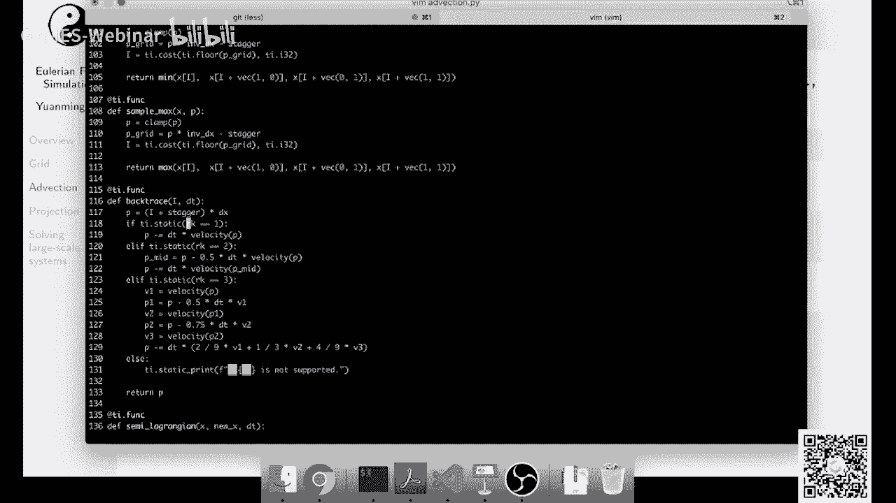

你可以看到我这边有个叫backtrace的函数，然后它里面有一坨ta。static对吧，然后ti。sestatic，其实就是在编译期做一些判断，那么如果当rp是q的话。

我们就是在用中点法进行呃向后的追踪，向历史的追踪。

我看看重点法效果怎么样，ok你可以看到用户终解法以后，我们基本上没有了，刚才那种越转越小的问题对吧，虽然它还是越来越糊，但是越来越糊，这个是另外一个问题，我们先把这个越转越小的问题解决。

这是2k two，一般来说2k two呢有的时候已经够了。

我们也可以试试2k three。

这是2k three，基本上和2k two没有什么区别。

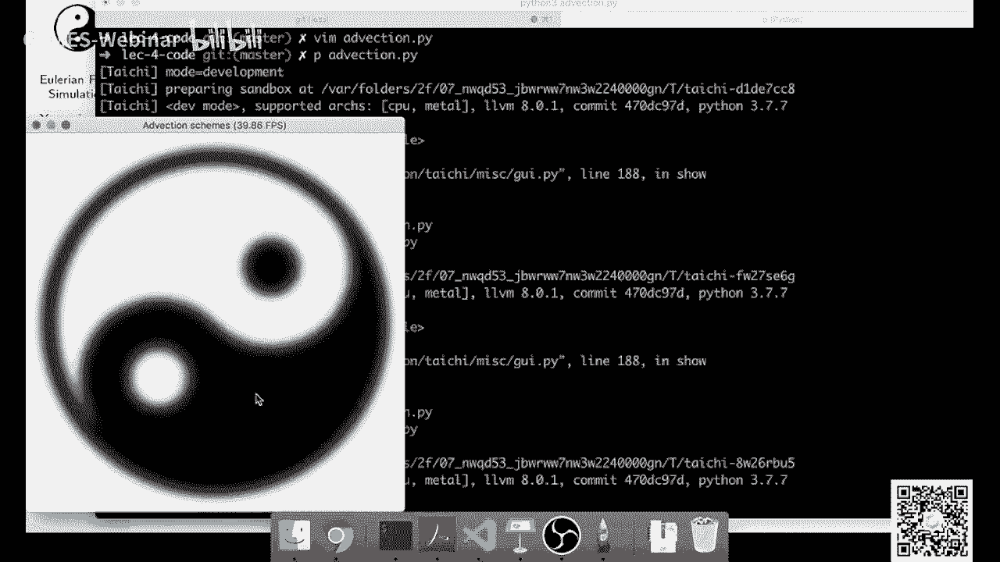

ok然后，2k three是干啥的，2k4 其实就是一个升级版的2k two，它更复杂一点，它首先呢呃往回走0。5dt得到一个p1 ，然后再p处呢这边再sample一次，然后得到一个呃，得到一个v2 。

然后用这个v2 呢再去play back一次，得到一个p2 ，然后再再三步一次得到一个v3 ，然后你最后真实的速度的estimation，其实就是啊，把之前你得到这些速度进行一个加权平均。

然后这个全职是不是随便写的，这个全职是有技巧的呃，它有一个推导的方法，这个大家可以自己去研究，但实际情况中一般2k q呃，一般就差不多了，有的时候用2k4 台，很少情况下必须要用2k4 。

但是随着你的这个格式越来越复杂，你的计算量也会变得越来越大，对吧呃这边就也是有一个取舍了，然后我们刚才讲到啊，如果用sama rgx，它会越来越糊，为什么会越来越糊呢。

还记得我们之前讲过blinder interpolation吗，由于我们在做interpolation的时候，我们会做甲醛平均，那平均了以后，其实本来你如果有一个很sharp的一个变化，你做了平均以后。

它就变糊了对吧，你本来如果这个端点左边是零，右边是一，你取在中间取一个，你就得到0。5，那你这个速度场就会很自然的变糊，那么怎么样解决这个变糊的问题呢，这边就要用到一个稍微高级一点的呃格式。

这个叫做bf c c或者叫做micromic，然后他们两个刚才说的其实非常的像，然后大家很很多文献里面其实会混淆使用，他们俩呃，这边我们就讲的其实是底下代码其实是microy，然后啊。

他你可认为他的hilid其实就是b f c c，什么是b f e c c呢，b b c它的全名叫做back and forth arrow，compensation and correction。

什么意思呢，其实想法非常简单，你可以看到它其实调用了这个sl是三倍，lol running action，其实x新就是我们刚才的sema grand，ok，那么我们用x星啊，先回到过去求到一个呃。

把x做一次of action得到是得到一个呃x x，然后呢我们再反过来做一次，我们再把x音做一次ction，当然这边我传给他的是负的dt，就得到一个x星，x星星对吧，那么理论上来说。

如果说我们这个semi oraction，它是没有任何误差的话，那么我们把这个速度长先往呃往前推一个dt，再往后推一个dt，我们是不是应该得到x星和x星，星和x它应该是一样的对吧。

因为呃如果说你的action是完美的话，那你其实往前推dt，再往后推推dt，你应该是能保持原样的，但是实际上它不一样，那不一样以后呢，为什么会不一样呢，是因为advection error。

那么我们把它俩做差，然后再取个1/2，就可以得到我们对advection error一个估计，ok我们我们得到这个reaction error估计以后呢，得到一个x final x final。

其实就是我们的最后的速度长，ok但这边你要小心一点，就是说如果说呃你这个correction本身啊，可能会导致你的the vaction scheme产生overshooting。

这个会产生一些artifacts，然后我们现在来看一看bf e c c的效果。

我们大家如果下载了下载了这个代码，可以进行一下修改，比如说我们可以把这个u s m c换成q对吧。

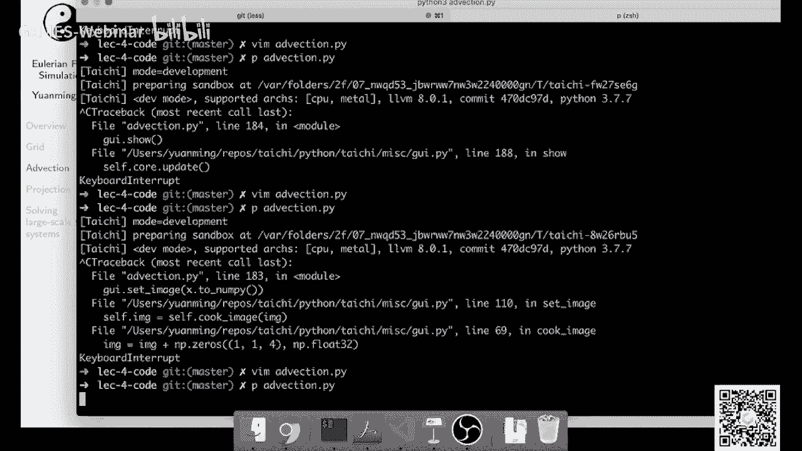

mc就是micromic，然后可以看到我们一旦用了micromascheme以后呀，这个基本上就没有这种变糊的问题了，基本上没有变糊的问题，你可以看到我，我现在按一下空格可以暂停，你可以看到呢。

它这个圆这边部分这个部分基本上没有变弧，它运动的部分还是稍微有点变化，但这个和三倍lab软件比起来已经好了很多很多。

我们来试一试，再看一看3米的高中卷，可以做一下对比。

我刚才把uc mc设成了false，然后现在是在用sam两个range，你可以看到，特别是这个圆的这个边界啊。

它已经变得非常的糊了。

在上转一会儿，他直接就，你让他转一会儿，这个地方其实已经不太看得清了，这个不太看得清以后会有什么后果呢，一旦不但看呃，这个是一个其实是一个颜色，一个黑白的一个颜色场。

如果说大家是在速度场上面做这个操作的话，它一旦变模糊，就说明你产生了数值的联系对吧，数值的联系就是速度场呃，速度场在模拟的过程中，它会产生一些nero的一些diffusion的这个问题。

它有产生这个这个diffusion以后，它就会导致能量的衰减，量衰减以后，这个流体啊就没有之前看起来那么energetic，所以就会有问题，就会导致你的流体看起来非常黏，你看转一会以后。

他这个就基本上不太看得清。

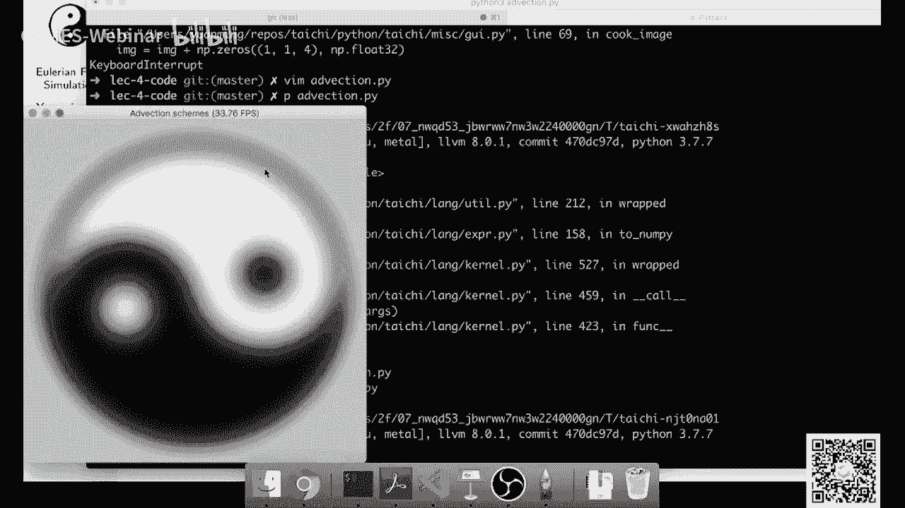

刚才讲到accomic里面有一个overshooting的问题。

我们来看一看，我们还是现在有my home，这个要有一个clipping，keeping是干啥呢，keeping是我们做完这个呃micro mac以后，我们需要去防止它产生一些非常大的值。

为什么会产生非常大的值呢，因为它这个地方它会根据你的呃这个reaction error，让你在边界上产生一些呃，像吉布斯现象那样的问题，然后如果你不去做这个一个呃guarding的话。

它就会导致产生一些artifact，我们来看一看吧，如果说我们把这个clipping给他去了，你可以看到呢，它产生了一些很看起来不是令人满意的，这个波纹状的这些artifact啊。

所以大家记得如果写macrome的话，要记得去做一下clipping。

但这个代码都在ction点拍里面有，大家可以下载下来，自己玩一玩，ok那么刚才就是direction，那么接下来呢我们讲一讲projection，projection啊，其实它非常简单。

projection是主要要做什么事呢，你得去求出一个合适的标量场p，使得这个标量场p的梯度呃，施加在这个u上面以后，你的u变成了一个没有散度的一个速度，成什么意思呢。

我们用有限差分在空间上面展开一下啊，我们假设投影后的这个速度场，project以后的速度场叫做u star，那么u star减去u这边应该是除以个delta t，等于什么，等于负的肉分之一啊。

gravt对吧，我把这个交叉t呢从u2 减去u下面，移到了这边来，呃当然我们要满足usr的导数啊，usd这个散注是零对吧，那么我们可以做一做一项得到了公式十，然后我们在对公式时的左半部分。

这一部分两边同时求散度，为什么两边同时求散度呢，因为求了散度以后，我们左边就得到了一个这个呃u s2 的散度，u s散度是零对吧，我们希望把这个usr给他消了，同时写了散了以后，我们知道左边变成零。

右边呢呃散出operator是一个linuerdo，可以把它塞进去，得到了一个u的散度，减去掉他t除以肉，然后然后有一个这么一个算符，这个是一个laplacial period，后面我们会提到它。

其实就是说对于p的gradient求一个散度，ok那我们再做一个最后的一项，得到了公式13，公式13呢其实就是呃，p的梯度的散度等于肉除以调tt，然后再乘上u的散度，那么我们需要求出一个p。

它满足公式13，这个公式公式13啊，到这变成公式14，然后公式14，它其实呃是一个非常非常常见的一个形式，它叫做pssecreation，它呃你如果把右端项做成f的话。

那你经常可以把它写成这个delta p等于f，但是这个da大家注意，这个delta dela p和delta t dotx不一样，它不是说p的差值，它是个da，它是laptoperator。

然后他有的时候呢会写作lab平方，有的时候会把它写成这个呃，中间一个点乘的一个形式，两个倒三角，这门课里啊，由于我们用deltt deltx来表示呃，差值表示这个difference。

所以我们就不用这个调查符号来表示laptoperator，这样避免一些歧义，如果说呃f等于零呢，这个方程又被称为拉普拉斯方程，但是我们这个课里面f一般是不是零分，因为我们一般是用这个泊松方程。

是用来求解速入场的压强来投影这个速度场，所以我们的一般这个f啊它是有良好的，f其实就是公式14的右半部分，ok那么我们下面下面要做一个事情，还记得我们的物理量，都是存在一个背景的网格上面的吗。

那么我们要建立一个离散的方程，来去近似这么个离呃连续的方程，ok那么我们要建立一个线性方程组，这个线性方程组呢，它满足a乘上p等于b的形式，那么a和b分别是怎么定义的呢，ok那既然我们的方程式公式16。

那么我们看一看，我们首先我们看一看怎么来近似这个p的拉plus，operator呃，这个拉普拉斯p在ig点的求职，这个我们后面后面一个slides会讲到，为什么会是这么一坨复杂的公式。

大家这边只要记住它是用p周围的四个点的值，包括他自己就是一共是五个点，来求出p在这一点的拉普拉斯freer的一个近似，这个叫做five points dl，号为的five points dl。

然后还有一个要求的是什么呢，还有一个要求的是u的散度对吧，u的散度怎么求呢，u的散度其实也可以用啊，u周围的四个采样点的值来算出来，这个我们下一页slides会介绍，为什么是这么个公式。

大家看这个信息系统啊，这个线性度还是挺大的对吧，如果说你的呃网格是n乘以m的话，那你这个线性系统，由于你的p p它是有n乘m个采样点，你的b也有n乘m采样点，那你的a呢其实就是n乘m再乘上n乘m。

如果你是三维的话呢，你的a这个矩阵就是n乘m乘k，再乘上n乘m乘k这么个元素，它其实就是一个非常非常大的矩阵，好在它是稀疏的，我们后面会讲到怎么样去呃，求这个矩阵a，ok那么我们先来看一看。

为什么u的散度会这么被近似呢，哦注意这边少了一个e除以dtx，这个u的散度是什么意思呢，直观上理解就是说这个cell里面呃，速度的散度意味着什么，意味着你这个流入或者流出的流体的量对吧。

如果你是流出的话，那你的这个散度为正，如果你是流入的话，你散度为负，ok那么我们怎么样来求出呃这一个点，它流出流体的速率呢，还记得我们之前讲了staggrid吗，如果说我们用了staggrid。

那么我们的速度的横向的分量，是记在这个cell的两条竖边上面，速度的纵向分量呢，是记在这个cell的两条横边上面，ok那么如果说我们知道这个这一条边上，它的速度是呃是uxi加1j的。

这个它的流体是以这个速度往外面流，那么它这个cell它这个这条边对于整个cell里面，流体流入或者流出的贡献，其实就是吊塔x乘上ux a加e j，那么我们还得把它减去它左边的这个部分对吧。

你左边是流进来的，这边是流出去的，流进来的得减掉，流出去的得加上，那么纵向的两条边啊，这个横向两条边其实也是一样，它的纵方向的流体对于流体速度，对于这个cell的它的嗯密度的贡献。

他其实是首先你得加上他这个流出去的对吧，然后你再把它减掉，它流进来的，其实这么1+1减，不好意思你你就得到了他的呃，速度场的散度，那么压强大plus of operator是怎么算的呢，其实也非常类似。

如果说我们要求在style中间，这一个点的压强的lapoperator，那么用类似的推导方法，我们也可以先把这一个cell，它的四条边上面压强的梯度给他算出来对吧，这一个点它的压强梯度是什么呢。

应该是上面这个点减去下面这个点，除上吊塔x就得到这个点的梯度呃，这条边上面的梯度类似呢，你四条边的梯度都可以算出来，然后你要求它散路对吧，你要求拉散路怎么办呢，就和上面一张size一模一样。

那么你做了这个操作，再进行一点点化简，你就可以得到这个嗯p的laptoperator，然后-4 p i g，然后加上它周围的这些cell的值，那么现在问题来了。

如果说我们这个流体假设它右边这三个cell是啊，是一面是一个固体，假设我们的流体就左边两列，第三列呢是一个固体，那么这边我们就得对它进行修改，这个叫做呃这个就是它的边界条件的问题。

如果说他右边这三个cell呢是空气的话，我们就叫做它是一个开放边界条件，开放边界条件其实非常容易，我们就可以把p认为在这些cl里面是零，那么在下面这个方程里面，我们只要把t的对应的值换成零就可以了。

那么如果是它是一个固体固体的话，也就是说固体什么意思呢，也就是说你这一面它的压强差或者这一面呢，它的速度一定是零对吧，那他的速度永远是零了，那你的这个压强差呃，就其实压强的梯度应该也是永远失灵。

那么如果说他有一面，你会发现它呃，如果你发现它有一面和一个固体相邻，那你其实首先你得把这一面的这个，p i g的贡献给去了，那除了去了他呢，你还得把这个四给它减掉，一变成三对吧。

因为你中间的这个它的贡献，也因为你的右边这条边是一个固体，而去掉这个推导，大家可以去看之前提到的一本书，那本书里面robert ron，那本书里面讲的其实非常的细，这边由于时间关系，我就不继续深入了。

ok刚才讲了怎么去建立一个方程，a乘上p等于b对吧，那么这个方程我刚才提到，他是非常非常large scale的一个线性方程组，那么我们这怎么去检查呢，首先啊，我们来看一看这个20世纪最重要的十个算法。

但这个是仁者见仁，智者见智，这个只是呃有一个期刊评，评选出来这么十个算法，十个算法我觉得还是比较有意思的，你可以看到呀，我这边加粗了其中的四个算法，这四个算法有什么特点呢，他们都可以用来解线性方程组呃。

我们今天要讲这个quite of subspace，iteration method，然后它其实是历史非常非常悠久的一个算法了，然后呢除了用iteration method解linear system。

你还可以去做matrix decomposition对吧，你可以去prefect orize你的你的矩阵，然后呢你还可以用，你如果是要解泊松方程了，其实你还可以用快速布列变换f t。

然后呢你还可以用fast multiple去做preconditioner，所以其实你看这些算法里面，其实很多都是和线性方程组有关的，就是ax等于b这么个线性方程组，它背后有这么多的学问，嗯顺便说一句。

这个simplex methods for india programing，其实也可以用来解rage body simulation，然后my chocolate originary。

mtchery m c m c其实也可以用来做衰做渲染，其实图形学里面用到这些算法还是很多的，另外一方面也确实说明，这个算法确实在各个领域都有很好的应用，ok嗯对，其实由于我自己把虎牙的直播给关了。

所以我现在其实看不到大家弹幕里面的问题，如果大家有问题呢，请在课程的微信群里面提出，这样我就可以或者在games的群里面提出，这样我就可以看到了，我不知道大家现在暂时有没有什么问题，因为我把网页关了。

我自己也看不到，所以大家可以发到微信群里面，这样我就知道了，ok那么回到我们解信息系统，很多物理引擎啊，最后到最后都都转化为一个解，一个很大信息系统的问题，ax等于b然后怎么去检查呢，有很多种解法。

如果你线性系统不是特别大，你可以用partil这个direct solver呃，其中呢最有名的就是partil，然后大家也非常喜欢用它，毕竟你只要把这个信息系统给他的，把这个矩阵的气候形式给他构造出来。

然后喂给parties，把这就给你很稳定的给它解出来，然后所以大家很多时候会很偏爱，这么这么个方法，因为它省事，而且性能也不低，其实在系统比较小的时候，不是特别大的时候还是很管用。

除了direct server呢，还有一种一类server叫做iterative ser，direct ver呢会一下子给你把解算出来，iterative solver呢它会呃得到一个解。

然后在这个解上面，然后呢这iteriterative ser有好几种呃，很多种变种，比如说你可以有gala，还有jacob，然后这两个是非常常用的，除了他们还有什么s o r i。

s o r之类的各种呃，其他的itering server，其中呢damage隔壁我们之前已经讲过了，今天呢我们主要讲的是这个precondition country。

country regredients，然后它是快乐subspace over其中的一种，这边要提到呀，一个好的emicrosover，通常呢是有很多不同的solver给组合成的。

比如说图形学里面要求这个泊松方程，一般会怎么做呢，大家外面会用conjugate gradients，然后用multies or preconditioner。

让multigrade的每一层呢用djacoby domoving，然后呢在multivate最下面一层，用partial这个direct sober去进行direct off。

这个基本上已经是图形学里面，求泊松方程的标配了，呃这个里面有很多名词，我后面会提到，这边大家只要记住它是呃，solver之间可以进行组合，那么现在问题来了，我们怎么去表示这个a呢，刚才我提到呀。

如果在三维free simulation里面，这个a可能会非常非常大对吧，因为你每一个vocal都得在a里面占一行，那么但是a有一个通常来说，如果你运气好的话，它有一些好的性质。

比如说呢它通常是sparse，如果运气好呢，它还是对称的，并且是镇定，叫做对称正定或者叫s p d，那么你怎么去存a呢，a说白了其实就是个二维数组对吧，你最简单的方式你就把它存成一个稠密的矩阵。

一个dance matrix，这个通常在a比较小的时候是work的，但是它不是特别scalable，比如说你如果这边是1024，是1024，你还可以存，如果说你有一兆个呃voxel。

一兆或者一兆个pixel，那你就存不下了，你都没有空间存它，这个时候呢往往就要用到一个sparse，matrix的一个表示，用sparse matrix来存的a，为什么呢，因为虽然你a的每一行。

可能比如说你有一兆个元素，但其中呢很可能只有十个元素是非零的，其他全部都是零对吧，你如果你全部都是零，那你就不用存它了，然后sparse matrix有很多很多种存档格式啊，什么csr啊，coo啊。

然后这边就不具体展开了，然后在图形学里面一般的常见的搞法呢，我们是不存这个a很不存这个a什么意思，这个我们后面会提到这个叫做一个matrix，three的搞法，通常呢这个是最高效的方法，对于存储来说。

由于不需要存a的entry了，所以它能省很多内存，对于计算来说，大家不要觉得计算是加减乘除公式计算，你从memory fetch data这个也是计算一部分，而且在现代计算机体系结构里面啊。

memory bandwidth和flops比起来是非常昂贵的，一个一个这个操作，而是非常昂贵昂贵的资源，因为你内存很慢，cpu很快，这个我们后面第九讲会提到高性能物理模拟。

这个时候你就要考虑到我到底是在线的，把这个值算出来，还是说嗯我去把这个值预先算好，放在内存里面，然后每次去取这两个，是这两个设计在不同的情况下会各有优劣，但是对于呃流体模拟里面的泊松方程。

一般来说大家都是不存的，直接用magic three的方法去表示这个a，ok那么具体matrix free是什么意思呢，我们后面会提到，这边我们讲一讲clot subsidivers。

然后quite a subsisubsive solvers，基本上是最有效的linear systems office之一了，然后它其中又有很多很多个变形。

那最知名的变形叫做conjugate gradient，共轭梯度法，或者一般会被缩写缩写成cg跟computer graphics，其实呃那个cg不是一个cg，然后在graphics里面呢。

除了cg以外，大家还会用，有的时候会用cr，还会有这个gm s，然后可能很少很少情况会用搬到bcd step，大家这边呢一开始的话只要掌握cg就可以，因为cg确实在很多情况下已经足够了。

如果大家想学更多的关于quite of super，super space over的话，有一个书呢叫做introduction to conjugate。

gredimethod with all day啊，就这个不过梯度无痛教程，这个还是一个写的非常好的书，这个书已经出来呃，几十年了，然后呃这个应该是免费，这个应该是一个免费的书。

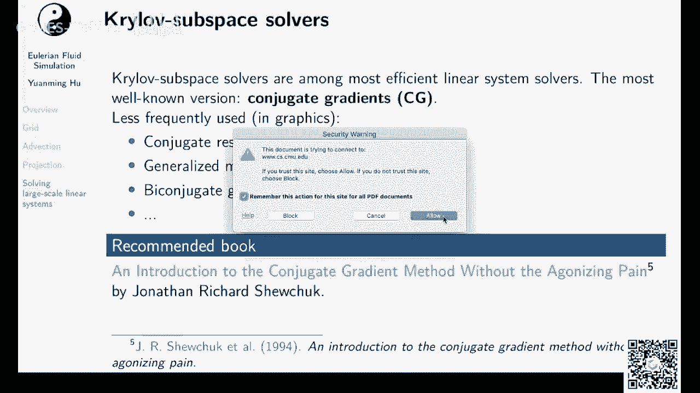

因为他直接挂在自己的主页上了，大家可以下载下来看一看啊。

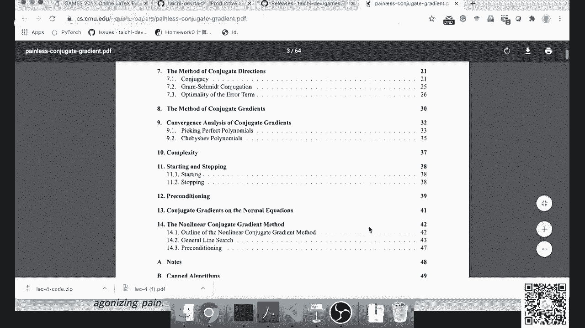

虽然他自己声称是一个无痛教程，你如果真的要把它啃下来，还是要费点时间，我自己之前看的时候，说实话也费了一些时间，并不并不像他说的那样完全是无痛，但是他标题也没有标题党，他说这个是没有剧透的学习。

你这个只是呃学习嘛，总是要有一点痛苦的，他只是把你痛苦减轻一点，这是一个非常写的非常好的书，大家可以去看一看，关于什么是快乐subspace，我这边就不继续去深入了。

然后对于conjugate gradients呢，其实它实现起来非常的容易，其实也就这么个十几行代码，ok然后如果说你一开始没有办法理解，conjugate gradients在做什么，完全没有关系。

你把这个十几行代码啊记好或者给他抄好，那你基本上你soba就是work，然后呢你当你得到结果以后，你再去慢慢研究它，为什么是这么个结果就可以了啊，这个确实一开始要掌握的话，还是需要一些理解的。

ok那么这边大家可以看到呃，他我大概讲一讲这个算法在干啥吧，它其实就是一开始先算一个residual，然后这个p呢这个p和刚才压强不一样，这个p呃是我们的沿着这个解的这个search的方向。

然后x呢是我们对当前的解的一个estimation，然后我们每次呢这个有一个循环对吧，我们每一次在这个循环里面，我们去estimate一下x应该加上多少分的p，使得x能够更接近我们的解。

然后呃我们更新了x以后，这个r也得更新对吧，你看这个r的定义r等于b减去a x，所以更新了x呢，我们r也得更新，而更新了以后呢，如果r已经足够小了，我们就中断。

然后呢我们在estimate一个叫做beta，然后用这个贝塔p和和r去更新新的p，得到下一步的这个p的这个search direction，然后到下一个循环里面，你看我们用这个p来更新x了。

所以这个是一个不断的迭代的一个过程，当然中间这些为什么阿尔法这么取，为什么贝塔这么取，这个就需要一些比较深入的理解，直观上来讲，他就是在做一个能量最小化。

然后他还是选择一个在一个快乐suspace里面去做，能量最小化，还是一个很有意思的一个过程，大家可以去看那本书，那本书里面讲的非常的清楚，但是那本书作者自己也很坦然，他说他写了本书的动机。

就是他自己一开始看了很多共轭梯度教程，一个都不懂，然后他最后最后就自己写出了一个教程啊，所以这跟我记录大家一开始不能理解，我不用担心，大家都是都是不能理解的。

这个本身就是一个很computing的一个过程，o，说到迭代法求解线性方程组，iterative method，他的convergence rate和一个指标非常联系密切，这个指标是什么呢。

是condition number，什么是condition number呢，这个就涉及到矩阵的ion system，我们来回顾一下什么是特征值与特征向量呀，如果说我们有这么个非零向量x。

使得ax等于lambda x，也就是说呢a作用在这个x上面，会把这个x方向不改变，而长度缩呃，缩放拉姆达倍，那么lambda就是a的一个特征值，x就是a的一个特征向量，一个矩阵啊。

可能有很多很多个特征值对吧，然后呢呃condition number是什么意思呢，condition number就是这个矩阵的最大的特征值，除掉最小特征值，这个直观上的理解。

就是说这个矩阵如果作用到一个向量上面，它如果有一些方向把这个向量拉的非常长，有一些方向把又把这个向量缩的非常短，你就会觉得这个矩阵看起来非常的厉害，他的condition number就会非常大。

当然这个是直观的理解，然后要注意的是，condition number有很多很多种定义，我们这边是采取了，通常对s p d矩阵的一个定义，你可能在其他地方呢会看到其他的定义。

但总体来说呢肯定是number越小，它收敛得越快，另外一个呃，能够提高你的这个刚才我们讲的肯定是number，越小才说的越快，那么另外一个能够提高italy solver的一个。

收敛速度的一个trick叫做什么，叫做one starting，那这个是什么概念呢，如果说解这个literally dissolver的时候，你的initial gas已经和你真正的解，非常接近的话。

这个叫做warm starting，在流体模拟里面的warm starting是什么呃，大概是怎么做呢，就是说你这个linear system，解的是每一步的压强场对吧，那么我们有一个sumption。

就是说你上一部的压强场，很可能和这一步的压箱厂差别不是特别大，那咋办，我们把上一步的压箱厂拿过来，当做这一步的压箱厂的初始初始的猜测，然后进行迭代，这样能够显著的在某些情况下能够显著的减少。

你需要迭代收敛的时候需要的迭代次数，当然实际上情况我自己的测试发现，这个trick对于jacob啊，搞赛道啊，或者country gradle是work work，非常非常好的。

但是对于multigrade就word不是特别好，具体的我没有研究过，我觉得直观上的理解可能是multigrade，他的preconditioner distort，你的你的这个空间。

这边我们来演示一下，这边是一个free sober对吧，这是我很早之前写的，你可以看到这边有一个argument叫做warm starting，如果说我们把warm starting给它去了。

你就会看到我这边当然没有迭代到熟练了，我这边是呃，你看我这个有jcopy iteration，我只是用了固定次数的joperation，如果说我把它调到34，你可以看到它的体积会不断的缩小。

为什么体积会缩小，体积会缩小，就是因为你的压强场没有球好，如果你的压强场求好的话，那你经过压强这个投影以后，你的速度场是五散的，速度场无散以后，你的体积就不会放大或者缩小对吧。

但如果你压向上球的不好的话，那你的速度上就会放大或者缩小，那么如果说我把warm starting开下来，我就需要很少的迭代次数啊，我就可以把压箱乘求了呃，迭代到一个非常准确的一个解。

这样的话呢嗯我的这个素质场就会更加的不散，效果就会更好，那么刚才讲到preconditioning啊，刚才讲到这个condition number有没有什么办法呢。

我们可以让a的condition number小一点，其实你让a的肯定是number变小了，那可能是没有办法，因为你不能变a，我是不是又把这个为什么这个风扇这么长，ok，不好意思。

我这个电脑它一跑gpu的程序，它就会风扇就会转起来，大家可能会听到一些噪声，但是我声音大一点吧，刚才讲到呃，a的condition number越大，就会导致迭代法需要更长的时间，或者更多的迭代次数。

有没有什么办法，我们能让a的肯定是那么变小一点的，这个叫做这个技巧，叫做preconditionally，注意啊，我们呃去solve ax等于b的时候对，如果说m是一个可逆矩阵。

那么solve ax等于b，其实等价于我们sob一个m-1，就是m的力乘上a，再乘上x等于m的逆乘上b对吧，我把ax等于b左右各乘上m的力，这个为什么会有帮助呢，这个因为有的时候md乘上a。

会有一个更小的这个condition number呃，和a api，它的可能性当中可能更小，它收敛就更快，或者说呢嗯他的icon value classroom比a自己更更好。

这个icon value classroom，这个是一个country regredient soga，里面决定它收敛迭代次数的一个metric，这个大家可以去看之前的那本cg的书，可这边有个问题了。

有同学会问，为什么我们不直接让m等于a呢，啊这个其实就是呃很有意思的一个问题，就因为你如果那就是m等于a的话，那你其实你这个方程其实就变成了，x等于md乘上b对吧，那其实就不用解了。

但为什么我们不能让m等于a，还是因为一旦em等，如果你都有m等于a了，那你就能invert这个a了，那你就不需要这个preconditioner对吧，这个就是呃就是因为我们没有办法算出m的。

我们就是因为我们没有办法算出a的逆，所以我们才需要做preconditioning，如果我们能让m等于a，那我们就能算出m d m d m等于a，那么m就是a的，你就是因为md算不出来。

就是因为a的d算不出来，我们才需要precondition 0，所以啊一般来说m是取一个近似的，和a近似的一个矩阵，而且他很容易求利o，那么刚才提到m一般是取一个和a比较接近，又比较容易求逆的矩阵。

哪些矩阵比较容易求力呢，对角阵很容易求力对吧，对角阵你直接把他对角线给他求个力，就得到了这个取证里，所以呢这个就引入了这个就造成了一个pregnition，它叫做jacob pregnition。

或者有的地方叫做diagonal preconditioner，还有的地方会用incompleto ley，然后呃这也是一个常见的一个precondition。

这个大家可以去看robert bryson的一本流体的书，里面会讲到sap，cg就是用incomplete lesky来做padditioning，今天我们主要讲一讲这个multique。

因为multique现在基本上已经成为同心学里面，求压力投影的这个标配了，大家还是要能够实现mt龟，猫龟还是很容易实现，而且效果非常非常的好，然后大家不要觉得preconditioner。

一定得能写成一个矩阵的形式，你如果有一个fast multiple，你也可以把它用作pregnitier，他只要是一个general linear preter就可以了，那么我们来讲一讲mi rs。

刚才讲到了mti que，它是一个收敛非常快的一个preconditioner，他其实近似的去invert了a，为什么他能够近似invert a，而且又算得非常快呢。

因为大家想如果说你去解建你建立的这个方程，如果说呃你你只在原来的网格上建立这个方程，那你的这个还记得我们对于laplus，operator的这个discretization嘛。

我们是关于一个cel和它周围的四个cl呃，做的这么一个dispensation，那么他这个每一次做一次这个零点operator，他能看到的cell是非常小，只有五个cell对吧。

但是很多时候你会发现我们的这个呃，速度的散度，它可能是一个非常large scale，非常low frequency的一个速度散步，这个low frequency的这个速度散度。

就没有办法被这个一个senso给它capture了，那么怎么办，我们可以搞一个multi resolution的一个方法，我们把这个recedure这个这个这个余量给它。

不断的做着做一次restriction操作，什么意思呢，我们把四个格子给它合并成一个格子，合并成一个格子呢，然后我们在这个格子上面再做gsmoothing。

然后呢我们做在computers residual，然后再respect，然后最后我们建立了一系列的网格，从最细的网格到最初的网格，到了最初的网格呢以后呢，我们就可以这个一般信息系统就非常小了。

小的信息图怎么算比较快，之前我们还提到对吧，一般就是用direct solver或者用或者用potil，然后当然如果你懒的话，你直接在小的信息系统上面，直接用jcb叠加个240，那也没有问题。

那么这个最对highliywood idea，其实就是说我们把这个residual grade，给他做一次motor solution的处理，然后使得我们可以在多个尺度上面去啊。

消灭我们的residual，这个multi grade它有很多很多的设计空间，它呃刚才看到了一张图，大家也会觉得非常复杂对吧，你这个有有restriction，有prolongation。

有这个v cycle w cf，cyle有好多种不同的递归的方式，这个大家可以呃，我后面会推荐一本书，大家可以去看一看，然后smoother呢刚才我提到好的linear system solver。

他很多时候是由比较简单的linear system server，给它compose起来的，那你smooth里面可以用gf，可用jacoby，可以用dap，jacob和s都可以。

可以是各种各样的各种各样的smoother，然后呢，还有你可能会有很多个很多不同的层对吧，你的层你这个到底选多少层比较好呢，如果你层数太少，那你这个对cos这个level，他的vox数目会非常非常多。

那解解会很慢，如果你存太多了以后，他做了cos以后，那它就会逐渐的失去了原来几个星期的把握，所以层太多了也不好，这个就有一个trade off了，一般来说大家的搞法就是说不断做cosine。

直到你的最cos的一层the box数目，能够被direct solver高效的soft的时候，你就不再继续做cos 0，然后最底层的solver用什么，可以用bf force riobe。

我刚才说的偷懒的方法，或者使用disober，然后呢刚才讲到这个smoothing iteration，到底每一层啊拍了多少个，这又是一个需要设计的地方。

然后呢还有cos和boundary condition，怎么去handle guerin cos啊，sei break mtv的呀，这个后面的话题就很多很多很多了，我们就不展开了，当然说这么多。

其实你要实现起来并不并不难啊，我们有一个参考的实现，一般来说呢我刚才提到，如果你要解personequation，如果你是在regular grade上面来做，那基本上motique是少不了了。

现在你要发一个c graph，你如果要接persn equation，你不用multi gram的，别人都会质疑你这个性能是不是有问题，呃这边呢推荐两个材料。

一个一个就是multique tutorial，这个是非常好的一个教程，然后呢另外一个是graphics里面啊，这个应该不是最早的multigrade paper，但是它非常容易understand。

它就是一个，其实太极里面也是有multi grade的例子的，我们来看一看这个呃，mtv很少单独用来做sober，一般大家都是用来把它用来做cg的preconditioner。

所以最后就会得到一个东西叫做multi grade。

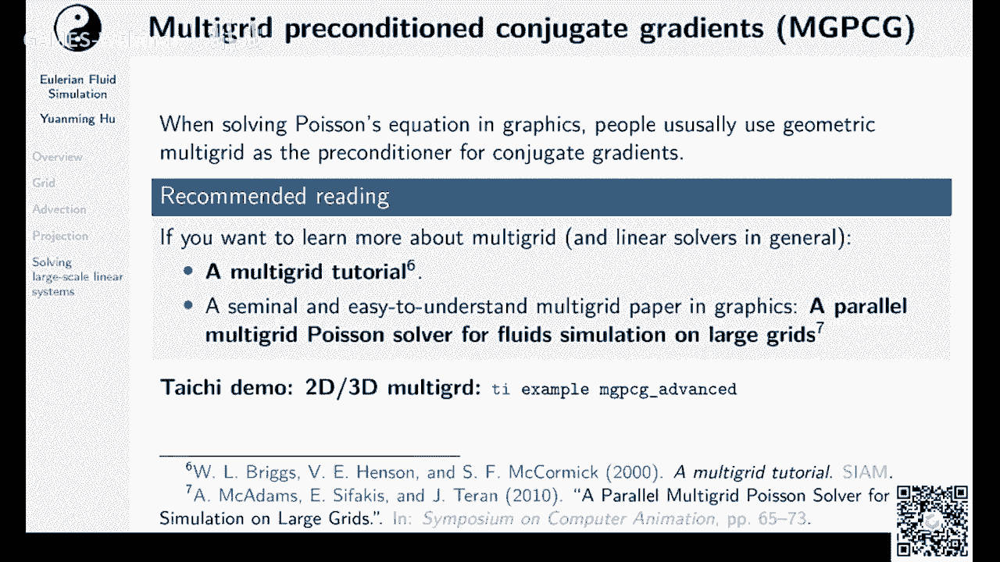

precondition and company regredients mg pcg，我们来跑一跑这个m tp c接，诶advance，这个声音应该是一个三维的播送方程，server。

这个每个iteration啊，就是一个共轭梯度的iteration，你看到这mtv的产生了很多的kernel嗯，我们来看看他刚才的输出啊，在这儿还不太会找到，如果用了mg pcg。

我们只需要六个iteration，就可以把residual从这么大一个数，缩到这么小的一个数，当然m g p cg，你用m g p c g以后，你的每个intuition也会变得很贵很多。

但是总体来说呃，减少的itation的数量还是能够抵消到，你每个h是变贵的成本，所以大家基本上解psy equation都是用mg p c g，呃，我其实可以modify一下mg pcg。

我看看能不能用，啊这个例子里面好像，啊有一个use multigrade，我可以把它怎么给它换一换，我可以不用毛利柜的，给大家演示一下这个是怎么个传进去的啊。

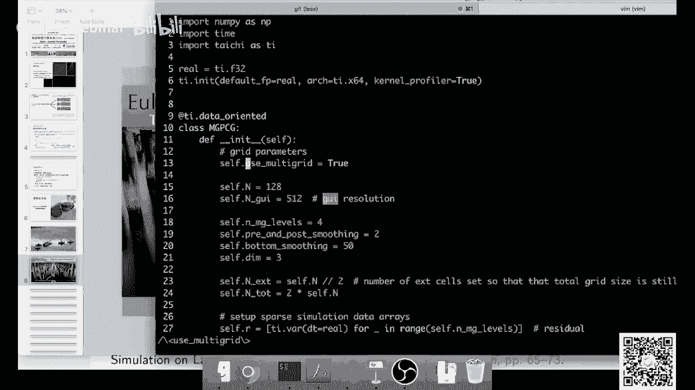

我把它改成false，我现在把mtv关了，我们来跑一跑，解同样的一个system，我这次不用毛利贵的，我这次只用裸的cg，你可以看到呀，他这个residual掉落速度明显就变慢了。

这已经20个a同学生了，还没解完，multique它有一个性质，就是你multiple写的好的话，那你基本上你的residual是迭代一次，少一个数量级，迭代一次少一个数量级。

所以multigrade它的是这个不管你的这个system有多大，它的迭代次数通常来说是肯定的，比如说呃迭代十次呃，cg 10次，mt grade，那基本上就能够收敛，但是裸的cg啊。

它迭代次数会随着你的，一般来说你可以认为它随着你的信息系统，它的边长是线性的增长，所以cg它的特别是你性能越大，你用毛利贵就收益就越好，你到现在还没有熟练，我就不让他跑，可能跑到下课也不能收敛。

ok大家可以去看一看这个，这个example其实很简单，这个呃这个example呢用了维度无关编程，大家可以把里面dimension改成two呢，就是一个二维的mt柜，改成三就是三维的mt柜。

当然我刚才提到mtv，它设计非常非常复杂的，这个mtv是一个高度简化版的mt贵，他用的所有地方都是最简单的，方便大家去理解它在干啥，ok那么我们总结一下刚才讲了，刚才讲了这么多呀。

其实都在讲这个欧拉的流体模拟，在通信学中，对于每一个time step呢，其实就两个关键操作对吧，advection和projection，the action呢其实就是移动的流体field的。

说白了就是嗯这边唯一一个关键的事情，就是说你要用一个好的advection scheme，使得它的numerical biscoti或者numerical diffusion，要尽量的小对吧。

如果说你的emo with scody很高的话，你这个流体本身不粘，它变得很黏，那你看起来就啊没有那些很刺激的效果，大家在突击圈里面，还是喜欢看雷诺数比较大的流体的模拟，ok然后呢。

如果说你要找一个数值，点型比较小的一个scheme，你可以采用micromi，或者你可以用b f c c，或者你用particle action，后面我们会讲到particle action，第二步呢。

第二关键的东西是projection，projection，就是说你得去保证你的速度场是diversions trade，它得五散，什么是为什么要无伞呢，因为你的素质上五散了以后。

你的流体的体积才得以保持，像我还记得我刚才那个加工吗，如果说我的pressure这个扫不好，如果我只迭代十个一堆人就把他掐了，那我得到的解就不得到，这个压力的解就不是很准确，就会导致速度长是有散步的。

有散度呢，它的这个就不能保持自己的体积，看起来就会呃这个流体会看起来很奇怪，当然了，你要把它迭代到速度上五散，那这个是需要一个很好的零点solver，那通常大家会用mg p c g。

啊对其实我我应该提一下，有一个太极里面有一个sam叫stable fluid。

这个是荒野大神写了一个流体模拟的一个demo。

这个其实是一个交互的demo，大家可以去玩一玩。

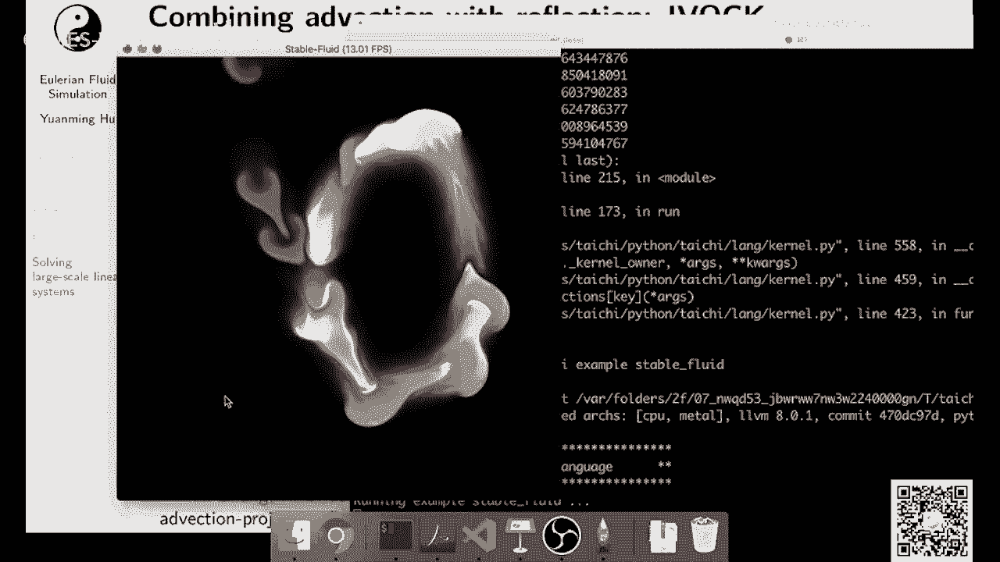

这个我没记错的话，应该是用了3d lebron jaction，加上jacob projection，大家如果有兴趣的话呢，可以把它改一改，把它改成microme，然后再改成嗯。

用至少得用contringredient to solve这个pressure吧，当然你如果用stable free和这个呃jacob tation，还有好处，那就是它比较容易实现对吧。

大家可以看到这个还是有一点点黏的，看起来有点黏，然后它的压强也不是完全无损，你如果很猛的去拖一拖，你会看到它这个体积有被压缩或者膨胀的，这个现象，可刚才提到了，其实，欧拉法解这个流体其实就两个东西对吧。

the election和呃和这个projection，然后啊这个vision projection它内部虽然你要做好，但他们怎么组合，这个也很有讲究，这边呢呃介绍一个问题，也就是说你如果原始的速度场。

你做了一次的vision以后，然后你会得到还是这个黑线，你会得到这么个速度长对吧，你得到速度场里面呢，就会有一个有散度的分量和一个无散的分量，这个地方你可以轮子做一个后后侧分解。

然后你这个地方再去做一个projection以后，你就会发现你把有散度的那个速度上，分量给它投影掉了以后，它的动能就会得到损失，它动能得到损失以后呢，那你这个速度长，它就会呃这个地方就会引入一个呃。

numerical viscosity，或者呢你会导致他的vertiity，它的这个涡量它就会给被丢了，被丢了以后，那你就得想个办法把它恢复出来，那这个地方大家可以看张星星师兄的这个文章。

叫做a b u c k是一个挺有意思的文章，他呃通过去重建丢掉了涡量的速度场，给他提高这个流体的这个降低这个流体的数值，连性，另外一个很有意思的paper叫做vtureflection，sober。

他的idea是什么呢，如果说还是刚才那样，我们做一个advection以后再做projection，那么我们就会丢掉这一部分能量，那reflection干啥呢，我去我不去把它嗯。

我不去把它一次把它project掉，我去做一个在advance中间做一次projection，这个projection是能量对于能量没有损失的，我就把这个点给它移到了这儿。

然后后面我们再做一半election，然后最后的这个projection，它能量损失就会小了很多啊，这个这个paper大家可以去尝试实现一下，这个paper非常容易实现，可能五行代码就能实现。

你如果有一个microsoft，再加上一个好的pressure的一个projection，solver的话，可能稍微改改代码，改五行代码就能实现它，而且效果非常非常的惊人啊。

这个是sopa 2018的一个，我觉得非常好的一个paper，既容易实现，而且效果又非常好，大家作业一样，如果有兴趣的话，可以实现一下，这个我觉得呃收获会很多。

而且可以看看他paper里面的推导还是很有意思，ok那么我们基本上就讲的差不多了，呃如果说大家还想继续深入学习呢，毕竟我觉得这节课其实内容也很多了，这个大家肯定要一段时间消化。

嗯如果说大家觉得有一点有一定难度呢，那其实也没有关系，我在课件里面写了好几本书，然后大家可以看看这些书，然后如果呃觉得大家听了这一讲觉得不懂，也不用特别觉得frustrated或者什么的。

不用特别灰心丧气啊，呃一开始总是会有一点难度的，我一开始学的时候和大家其实也一样，但是我只是呃我在这一讲里面，其实更多的是一个导游的作用，更多是一个导游作用，给大家推荐几本书吧。

我觉得你真的要一个小时把欧拉法呃，欧拉视角下的这个流体模拟全部讲清楚，还是非常非常有难度的，我真的已经竭尽全力了，呃大家可以去看看那些书，我觉得还是写的很好了，如果大家还想还想继续提高。

然后首先可以去考虑考虑3d的怎么模拟，然后呢怎么把boundary condition给他做的更好一点，我刚才提到这个boundary condition啊。

只是以voxo为精度的bury condition，很多时候大家会，如果说你的这个边界，正好在你的这个boxo内部划了一刀咋办，这个牛也要做去去做这个cos之类的操作。

那么大家可以去看这个chris bi的这个paper，这个是一个很好的paper，然后流体怎么和固体couple怎么去耦合，也是一个很好的话题。

怎么去做这个two face for resimulation，two face free simulation啊，其实最简单的例子就是说呃你如果有一瓶水，然后假设你有一瓶矿泉水对吧，你把它瓶盖打开。

你把它倒着往下，让这个水往下倒，那你这个水往下流出的过程中啊，你还有空气进去，那你如果说要做一个one face fluid simulation的话，那你这个水就会直接的往下流出来，而没有空气进去。

就会非常非常不自然，如果你做two face呢，你就会有空气进去的，这个效果就会非常的非常有趣，大家可以去看reference，11，是一个很很好的一个用stream function。

来去做two face fluciation，那么刚才我讲的其实全部都是，应该是说是可以认为是气体的模拟气体，它有一个特点，大家一般也叫它烟雾模拟，然后如果要模拟水的话，你就得有一个水和气体的界面对吧。

这个界面它是压强的边界条件，压强的利克雷边界条件压强为零，怎么去handle流体界面，怎么去capture，流体界面的变化就要用到level set，level set。

这个最权威的书就是这个level set methods，and dynamic implicit surfaces，作者是senior shell和rog physical，然后大家可以去呃。

这个这个书其实是一个不是特别友好的一本，对于graphic来说不是特别友好，大家可以去看run他早期rptical，他早期有很多用level set的paper发在sram上面。

那些paper是把这个level set的理论在，在重新学里面的一些比较简化版的应用，然后还有vertex method，vertex method也很有意思啊，那就是说我们之前讲的。

全部都是以速度为基础的n s方程，那么以速度为基础，你很容易做到这个动量守恒对吧，你可能会拖到质量守恒，但是很多时候你很难做到涡量守恒，如果你用一个以涡量为基础的这个server的话。

你就比较容易做到模式量守恒，涡量是什么呢，微量就是流体里面打圈的一部分，如果你做了这个微量守恒的话，你就能保持流体和流血打圈的部分，那你就流体效果就会更好一些，这个我们留给下一讲呃。

新兴师兄来给我们做一个呃，专题专题的这个课程，ok如果大家对实现epied oilers free sober有兴趣的，也可以把它来作为homework，he像我之前讲的呃。

这些应这个oiler resolver通常很难呃，比一般来说你如果叫做要做incompressible的话，那一般来说是没有显示格式，因为显示没法做了，incompressible啊。

除非你用vertistic作为你用涡量的方法，但是我们都是用速度来做，那么你如果想用erance loser来作为homework一呢，那就可以进行implies sover内部的比较。

比如说dj kobe versus，这个country regredients或者multique versus，普通的country degredients对吧，ok那么这一讲就到这里。

我来看看大家有没有什么问题，对我应该终于可以开一下我的虎牙的这个窗口，看看弹幕里面有没有什么问题，我之前不敢开，我怕怕他卡，我看看，哦我现在登录上去，看不到之前的弹幕了，哎呀好吧。

那大家还是把问题发到qq群里面吧，发到微信群里面吧，不知道之前有没有问题，之前之前大家应该弹幕里面发了很多问题，但是因为我没有开播放的原因，我没有看到弹幕，所以不好意思，如果大家想有问题的话。

可以在论坛上面或者在微信群里面发出来，ok或者要不我们今天就先到这儿，然后大家有问题呢，可以在课程微信群或者在论坛里面提出，毕竟其实这节课啊确实容量还是挺大的，我们本来是准备讲两讲。

好多人fluid simulation，但是我们这次压缩成一讲，所以给大家吃了个压缩饼干，可能需要消化一段时间嗯，我一开始学的时候也消化，课要也消化了很长时间，所以我也能理解，这个学起来确实没有不能呃。

一下子掌握，我觉得很正常很正常，这个大家可以看一看样例代码，自己去写一写，有的时候你即使你不理解其中数学，你把这个代码拿下来自己改一改，改着改着，你可能也就理解他这个额数学是什么样的。

它背后数学什么样的对吧，你可以跑跑别人的代码，然后看一看，ok那么我们今天就到这儿，然后感谢大家来我们的课程，希望大家呃做出更加惊艳的作业，我觉得这个alern foresignation。

能做出很多很棒的效果啊，特别是烟雾啊，流体啊，烟雾啊，液体啊，还是很容易做出很炫酷的效果，ok那么就到这了，拜拜我们下周再见啊。

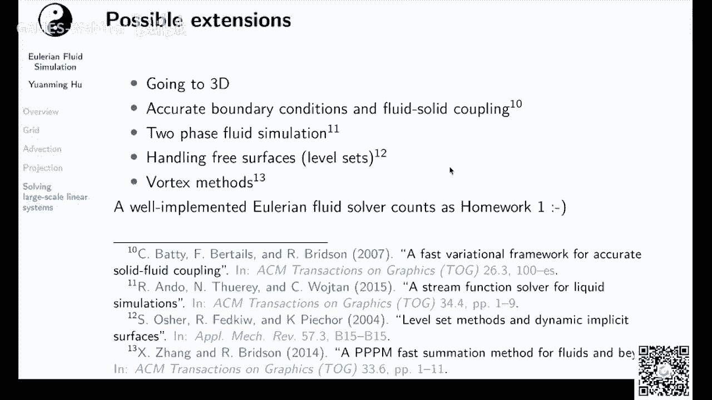

