# GAMES201：高级物理引擎实战指南2020 - P5：Lecture 5 多体问题与涡方法 - GAMES-Webinar - BV1ZK411H7Hc

那么欢迎各位同学啊，我们今天请来了一位重量级嘉宾，就是我们的张欣欣师兄，然后张毅师兄是呃u b c的计算机图形学博士，然后他给自己的描述是热爱物理与计算，数学，解决其中有挑战性的问题。

致力于在计算机上再现大自然的美，真的是这个，我觉得在座的各位应该有很多同学都很喜欢，希望在计算机上再去模拟一些，大自然里面的自然现象，我觉得呃在计算机上再现大自然的美。

应该还是一个非常非常非常有趣的事情，这也是为什么我们要开这门课的，初中说到这个在线呃普及物理型的各种工程啊，这个其实我之前和呃星星师兄，有一次聊到这个事情，然后我当时有一个困惑。

我就觉得如果我们开了这么个课，会不会有同学觉得我们在拔苗助长，或者呃会会不会有同学觉得超纲了，然后进行实用，就反问我一句，你自己不就是这么拔苗助长长出来的吗，我想好像确实也对啊，只要大家有兴趣。

这个课程稍微难一点啊，或者呃遇到一些难度啊，其实在兴趣的驱使下，我觉得这些都不是问题，当然我们当然会尽我们最大的可能性，把这个课程以一个通俗易懂的方式给他讲出来，ok那么对另外一个事情就是说。

我们以后还是希望大家能多看看直播，因为我们确实有同学反映，我们之前直播有卡顿啊，或者呃背景有噪声的问题，但是我相信现在都已经解决了，因为我换了一台比较猛的g比较猛的电脑。

然后我还专门去amazon买了一个，应该还算比较靠谱的这个microphone，我希望希望以后就不会有这个卡顿，或者呃背景噪音的问题了，而且大家如果看直播的话，有很多问题就可以在线提出来。

然后我们收到这个反馈啊，其实也给我们讲课的过程，其实也是一个非常非常大的帮助，ok那么我们就把剩下内容交给星星师兄了，星星今天会给我们讲讲补充方程，与其快速解法，all right，so，那我们开始吧。

好的好，谢谢这个胡世纪的介绍哈，那个呵呵呵心流水，可见这么多天的授课，这个叫什么口才方面已经长进很多啊，那个对，我希望今天的课尽量能够做到通俗易懂，这四个字，这个但我也相信以我看了上一次的课件哈。

我觉得能够留存到今天的同学，应该应该挺不容易了，所以所以哈那我呵呵，我也不多说了哈，我们现在就开始吧，今天我会讲这个有关播送方程和快速解的，他的一个一个快速解的中呃一些一些事情。

那么这个我们从快速方法来看。

这个泊松方程的时候，我是基于这个泊松方程和它的基础解，这样一个角度来看的，也就是说我们现在讨论的是，把之前我们看到的解法，都是基于它是一个偏微分方程的角度去看的，那么今天呢我们考虑的是一个开空间的。

泊松问题，并且把它通过这样一种积分积分，这样一个基础解积分的形式，来看待这个活动问题，那么其实像这样的一个播送问题呢，很多同学他在你们应该在这个高中的时候，就已经接触过了。

比如说我们十分熟悉的这个万有引力，那么万有引力呢，我们通常就是说我们的市场满足一个，关于密度的泊松方程。

然后呢我们那不同的任意两点之间的受力呢，就是这个市场的梯度，那么在这样一个情况下呢，我们如果把这样一个梯度运算代入到，我们的这个基础解的这样一个求和系统中，我们就会把就会得到我们高中的时候。

很熟悉的那一个呃万有引力的公式，我们的利与距离的平方成反比。

当然这里因为这还有一个。

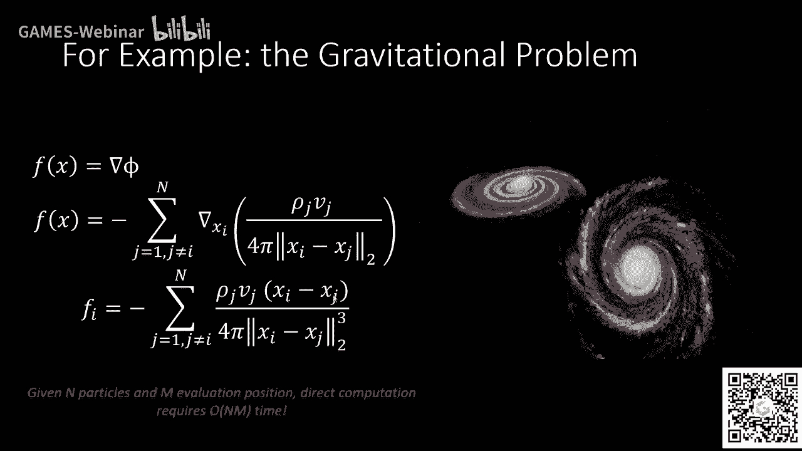

这个是这个距离的这个方向，所以他一除是一个距离的平方，我们力与距离的平方成反比方向，沿着这个粒子与粒子之间的，这样一个相互的方向，并且前面还乘一个系数对吧。

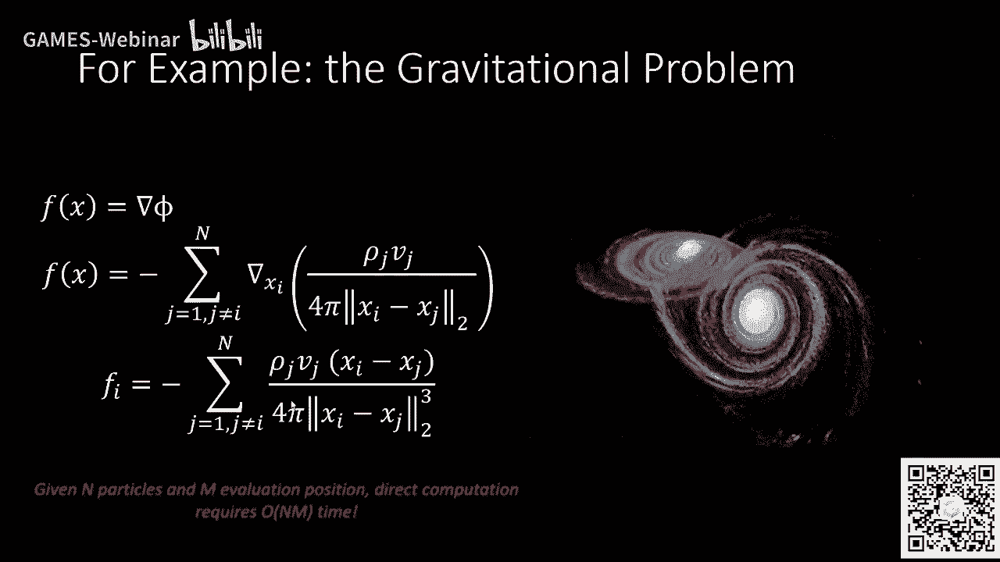

它与质量成正比，那那么这个呃。

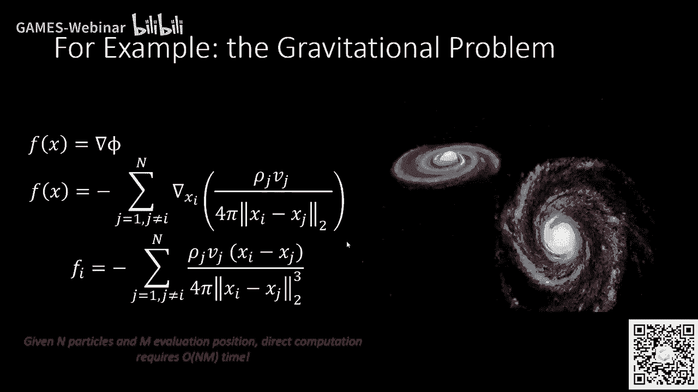

当我们看到这个呃求和表达式的时候，其实我们就能够注意到哈，如果我在一个万有引力系统中有n个例子。

以及我有我要去对m个点求这样一个力的话。

那么我的一个直接求和的办法呢，需要n平方的时间，或者说在这里是n乘以m的这样一个时间，那么这个时间呢它的这个skin是很差的，所以我们需要快速的方法，来降低它的这样一个skin。

那么呃这个时候呢，我们就可以看看一下这张大图，我之后会在之后的这个slides里进行一个详解，那这样一类的方法呢就叫做快速多机展开，这个呃胡适弟应该也在之前的这个呃斯莱呃，之前的课程中有讲。

这个是被誉为20世纪，21世纪十大重要的算法之一，的快速波及展开，那么快速突击展开，它究竟利用了怎样的一种思想，他究竟采用了怎样的一个分析的方法，使得最后人们能够在线性的时间里去计算。

这一个n平方的求和问题。

我们现在就来展开一步步分解看一下，首先我们考虑一个二维的，为了为了简化，因为我尽量希望使这个概念可以清晰的传达，而不是它呃其中具体的一些细节，那么我们现在先来看一个二维的播送方程，和他的一个呃。

这个和它的一个基础解，当然这里为了方便我采用负数来表达，我们的这个坐标，并且呢呃我们知道这样一个球和表达式，它的实部就是呃我们要求的这个呃波动方程，它的解，ok而这个log of距离呢就是二维情况下。

我们的格林函数，那么此时我们考虑一个考虑一个呃，考虑一个圆，以及它在远处这个z点处嗯，引发的这样一个一个一个势能，那么这个时候呢，如果我们在pc on的这个地方去做一个泰勒展开。

那么实际上我们就会发现其实在这一点，在这个z点，他的这个是其实是可以看，至于qi这个这个电子的带电量在零点，在这个零点处，在这个零点处对它的一个势能加上一个高阶项，加上一个高阶项。

这个是我们对于对于对于原来的这个函数，在零点做泰勒展开以后直接得到的这个关系，那么这个时候我们想象，如果我在靠近零点的地方，有很多很多的带电的电荷，它对于这一点的作用。

如果我们都去对零点做一个泰勒展开的话，那么我们实际上就会得到什么呢，我们的fez是等于所有这些东西的，它的这个电量的核对吧，它的视作用的一个和，那么我们在这里对零点做了泰勒展开呢。

我们就发现它其实可以拆成两个部分，第一个是它就好像是一个来自于零点的，一个带了更大电荷的电子，对于这一点的这样一个视作用，以及第二个我们的一些高阶项，我们的一个高阶项是来自于对它的这样一个形，状。

所以这个时候我们看一下，我们把这个公式抽象一下，我们就会发现我们会有一个大q，这个大q呢，它其实相当于是说在零点附近，所有的电子的电量的总和，以及我们的高阶项q k，他呢是在这个零点附近的。

做完泰勒展开了以后，我们得到的这样一些高阶局，像而我们关于这点的这个事，就所有的这些呃零点附近的电子，关于这一点是，它其实是可以写成q乘以我们的格林函数，以及加上这样一些高阶项。

除以z k的这样一个这样一个累加，那么这个后面的这个高阶项呢，我们会发现它是几何收敛的，那么实际上在这个时候呢，我们已经可以得到一个n乘以logn的算法了，这个算法呢又被称为这个吹口虚构的。

他通过这样来实现，首先我们假设自己有很多的电子，在一个空间里头，然后我们对它做一个网格划分，然后呢在每一个格子的中心点，在每一个格子的中心点，我们去近似的计算这个q和q k也不是近似。

就我们去计算q和q k使得什么呢，使得离这个格子远处的这样一个市场的，是可以被q和q k，近似的，那么这个时候你可以想象我们不断的往上，不断的逐层往上抽象，我们最后就得到了一个特别特别粗的一个网格。

它里面存着这些q和q k，其实是代表着所有属于这个格子的这样一个电，量，所所代表的这样一个泰勒展开的这样一个形式，对吧，那么这个时候就有意思了，如果我们想要求这个空间中。

任意一点的这样一个电场式或者重力势，那么实际上我们可以怎么来做呢，首先我们通过树状结构的便利，走到最后的这个叶节点，然后我我们可以，我们认为所有离这些叶节点最近的格子，我们通过直接求和的那个公式来计算。

然后当我们逐渐的这个距离变远的时候，因为原厂它基本上是比较平滑的，那么这个时候呢，我们就可以用那些记录在这个格子中心点处的，这些泰勒展开，去近似他的这样一个原厂式的影响，然后直到最后我们通过最粗的。

最粗糙的那一个解析度上的q和q倍，去近似他的这样一个原厂式的影响，这我们就得到了一个对于这个格子十分精准的，这样一个原厂式的计算，而这个过程呢，因为我们要对每一个格子都去做这样一个，落根的计算。

所以最后我们总的计算量是n乘一老根的，那么我们这边我觉得是有一个问题，就是说包括我也有这个问题啊，就是说这种类似于像八叉树的这种近似的方法，有的地方叫它吹code，有个地方叫它这个burnhot。

然后还有很多很多其他的名字，他们都是一个东西吗，是一个东西全都是一个东西，事实上这个缺口就是bernhart发明的，或者发现了，应该说是对对对，所以这些说这都是一个东西，对没有问错。

ok那么我们更进一步的，我们在知道了这个n log的缺口的了以后，我们怎么样去得到这样一个线性时间的算法呢，这个时候我们就再往前考虑一步，而这个问题就是我们能得到欧文时间，算法的一个关键。

此时我们假设我们已经在一个z1 ，这个中心处的电子云，我们已经统计了出它的这样一个q和q k对吧，它可以精确的估计，在原厂z处的这样一个电子式，那么这个时候我们要问一个问题。

我如何通过这个电子云的q和q k直接估计，估计出另外一个z2 处的q和q k，使得在这个z点处的，是可以被z2 处的这样一个展开，所精确的表达呢，这个时候我们其实涉及到的就是什么呢。

就是把一个multiple，把一个这个multiple呃，所以这个又叫做一个m2 m的变化，那这个时候其实方法也很简单，我们既然有了z一处的这样一个电子式的，这样一个计算公式。

我们对它重新在z2 处进行一个泰勒展开，并且重写这个公式，我们就得到了一个新的这样一个形态，你会发现，其实在这以z2 为中心的这样一个，这样一个电子云，它对最初的影响可以写成这样的一个公式。

就是q乘以log z减z2 ，加上一个suv加上后面的高阶项，我们这个时候recall一下，我们刚才得到的这个multiple展开的公式，我们发现其实他们俩是有一个类似的形式的，首先我们都有一个大的q。

代表的是所有电子电量的和对，然后呢我们都有一个q k，当然在这里它变成了一个pk对吧，代表的是一些高阶的余项，而他们的收敛性呢也是都是这样一个几何收敛，那么这个时候我们就说dk到底是什么。

其实bk呢我们发现它是对于q k的一个泛化，它是对q k的一个泛化，什么叫泛化呢，首先我们来看bk的第一项，它是大q乘以z一到z2 的k次方除以k，这个东西是什么呢，我们recall一下。

在之前这个我们在看算这个，我们recall一下，我们之前在算q k的时候，他的第一项是什么，他的第一项是关于这个qj的一个和，ok，那么在这里呢它就变成了这个他的第一项，也是关于qg的一个和对吧。

所以其实这两项是相等的，ok那么以及呢它还有自己的一个高阶项，这个高阶项是通过这里的展开了以后，直接这个推导计算出来的，ok，那么在这个时候我们发现它其实这个高阶项呢，是关于原来的那些qk的。

那些高阶turn的这样一个计算的表达式，那么它实际上形象的来看，这相当于是个什么呢，我们的这个我们的这个电子的电源，它其实就是一种十分特殊的model，他们带了电量，q which当它是一个电子的时候。

他就是他自己带的电量，他的所有的qk项都是零，而这个时候呢，我们直接套用bk的这个计算公式，我们其实是可以复现我们的这个multiple expansion，也就是说我们可以复现出从电子累加到这个呃。

累加到一个点的这样的一个multiple expansion，那当我们从n个或者当我们从呃不对，当我们从s个这样的已知的mmultiple，去构造一个新的multiple的时候。

其实每一个已知的multiple，它就又相当于是一个电子了，它就又相当于是一个电子了，然后这个时候呢我们就computer这个bk，通过使用什么呢，通过使用呃，呃加上这些这个rest of turns。

那这个时候我们的我们还是要注意，我们的bk的第一项的这个q，也就是这些小的电子云，他带的这样的一个总电量，所以这样一种操作，我们实际上是把multiple直接给translate。

到了一个新的multiple身上，那么可能刚才讲的有点迷糊，我在这里呢就用一种代码的形式，再把刚才的过程展开一下，首先我们可以定义一个multiple的结构，这个结构呢它包含了两个重要的信息。

第一第一个是它的终点坐标在哪，它的中心在哪，第二个呢是我们有一个，我们有一个qk这样一个turn，当然在这里我们讨论的范围内，它是一个负数对吧，它来表达他的所有的这些高阶项。

那么当我们从source charge来出发的时候呢，它其实是一个特殊的multiple，这个multiple呢它的center就是我们charge的这个坐标，以及呢它的这个q0 。

他的q0 就是他自己带的电量，它其他的这个q k的这些turn呢就是0k，这时候我们可以写出一个通用的multiple to multiple，的这样一个圈子transfer。

那么它呢take的这个参数是一个q list，是一个vector of multiple对吧，然后这个时候我们先去计算它新的终点坐标，比如说终点坐标。

我们可以通过对于这些q list的center的一个加权和，来得到，以及呢我们去计算出它的q0 t跟q0 turn呢，就是所有的q list，它的这个q0 t的和。

然后呢我们对于从一到p这几个高阶展开上，我们呢调用这个，我们调用computer bk的那个公式，去计算它的这个p turn的这样一个值，然后我们把这个result返回，这个时候。

我们就构造了一个从电子到multiple，以及从multiple，multiple的这样一个转变的这样的一个程序。

那当我们知道了如何从multiple，转变到另外一个multiple的时候，接下来就有一个问题变得十分有趣了，这个问题就是，如果我们在一个中中心为c的地方，知道了他的multiple展开。

也就是说这个multiple可以告诉我们，在一个任意一个z点处，它的这个它的这个准确的，这个电场市到底是多少，那么这个时候我们就想问了，我如何能够把它转转换成一个离z距离很小的。

另外一个z一处的这样的一个local口，我们注意这里不是multiple to multiple，transform，multiple to multiple，它的这个transform。

他要求的是我的multiple一和multiple 2，都是离我要求的这个z点是比较远的，这个时候我们是m two m transform，而回到现在的这个问题。

我们希望把一个离z比较远处的这样一个multip，转化到一个离z比较近的地方呢，这个z一为中心的一个local口，这个local local，大家又可以形象的想象它是一个什么呢，它就像是一个差值。

它就像是一个差值，它使得在这一点处的这样一个市市场函数，能够很准确的被这一处的这样一个，多项式给表达出来，所以它就像是一个差值，一个局部领域的差值函数，那么这个时候我们去看一下，当我们做完了。

我们该做的数学了以后，我们其实就得到了这样的一个公式，首先这个z一处的这个这个local它的第一项，它的第一项我们可以看到它是什么呢，它的q乘以log，z一减去c加上这样一个peter的这样一个求和。

它实际上是什么呢，它实际上是电场是在这一处的这么一个势能，这么一个potential值对吧，所以它实际上就是电场是在这一处的值，那ok再加上一个什么呢，我们要求z点数的这个电场式的话。

它实际上就是把电场是在z一处，再加上一个高阶的扰动，其中这个高阶扰动呢由这个式子给出，它是一个bl乘以z减z一的l次方，的这么一个形式，那么由于我们知道这个z减去z1 ，是一个很微小的量。

是小于半径的一个量，而bl呢它的它的半径是这个，它的半径是这个z一减去c的k次方，所以这个这个式子它又是几何收敛，那么这里我们就给出了bl的这么一个表达式，这里我们就给出了bl的一个表达式。

这呢我们就完成了一个，从multiple到loco的这样一个变化，而这个时候我们loco的这样一个结构，它大概是这样的，首先他知道他自己的中心在哪里，然后呢他有一个turn叫做bp。

就是还有这么pig这样的这样一个beer，它来计算，那它的b0 是谁呢，b0 就是它的终点处的电场式的值啊，这个时候我们就又来了一个新的问题，就是如果我们已经知道了，它能够表达所有在它这个半径范围内的。

这些点的这个事的做事的这个值，那么我们怎么给它转变为，一个以c2 为中心的loco，都可以被c2 的这样一个local ball准确的表达，那这个时候，其实我们涉及到的只是一个坐标的变换。

只是一个坐标的变换啊，那么比如说我们就把式子直接写出来，我们其实要求什么呢，是ak乘以z减去z0 的k次方，它可以变到一个bk乘以z的k次方，这样一个形式上，那么会这个可能学完初中的这个数学。

我们就能够做这件事了，那么实际上在这里呢，是有一个这个叫做honor scheme的方法，在计算上帮我们进行一个动态规划啊，动态规划的这样一种计算，可以加速这个turn的这样一个计算的过程。

诶到这我相信有的同学会有一个问题，就是说为什么multiple to multiple，看起来也是一个呃中心的转移，然后locple to local也是中心转移。

为什么local to local就比较简单，而multiple multiple的形式会稍微复杂一点的哦，其实也都差不多是吧，其实也差不多，其实都是我觉得他也没有简单多少，你看这里其实还是很复杂的。

我只是写的简单了，这个形式我觉得是挺复杂的，他的这个公式我觉得其实是挺挺挺烦的，所以我如果不躲都不建议做这个local to local的，我还是觉得用插值的办法会好，构造一个差值就行了啊。

好先这其实它只是形式看起来简单了，我这一个bk对吧，但其实这个bk呢，你会发现它代表的是这么一坨东西对吧，那么在三维的情况下，这个式子会更加的恶心，你看这里这是啥，这bono。

这是binomial coefficians对吧，对对对对，这很恶心的这坨东西，ok嗯那还有一个问题，就是说我们在这说的multiple，和在物理里面的电路机子，它们之间是有对应关系的吗。

是有对应关系的，是exactly的一个对应关系，而且那就是他的说b0 是电单极子，b一是电偶极子，是这个吗，对就是这个机子对，ok所以就是dn就是电二的n次方极子，对你都可以这样想象，其实是怎么样的。

其实在三维的情况下，我们那个我们那个方程是one of them are嘛对吧，是1÷2的那个r i j，然后那个时候我们如果在cartesian coordinates。

在这个笛卡尔坐标系下对他做泰勒展开，然后我们得到了一系列的这个相对吧，这个monopole什么quad pole，八八炮对吧，这些东西就分别对应的是物理上的那样，那样一个概念，ok alexcess嗯。

那么那么在这里其实我们我更喜欢哈，把刚才所讲的这一整个过程再做一个抽象，我们会发现其实multiple expansion，我们实际上在做一件什么事情呢，就是对原来的这个几何，对于这些电子啊。

我我看到我们也把它看作一个几何的话，他是在做一个cosy，他是对他在做一个粗化，然后我们的local expansion呢，它实际上是在做一件什么事情呢，他是在做一个差值。

所以这个时候我们看multiple transform的时候，我们一开始从一些电子开始，然后我们在格子的中心点，去计算出它的qq k和c对吧，然后我们再把格子上的qq k和c。

计算到上一个格子的q q k和c，这个时候呢我们总共的计算量，我们总共会便利过的格子的量，一加上在三维的情况下是1+1/8，加1/64加点点点，所以总共我们会遍历过的格子量是o n。

然后在每一个格子上呢，我们会从事的这样一个计算量，大概是c的p次方对吧，大概是c的t次方的这样一个计算量，所以在这个时候我们往上行的时候，我们的计算复杂度是线性的，那我们再来看下行，下行的时候呢。

我们会经历multiple to locle的transform，以及local to loco transform，那可以当我们在执行multiple to loco，transform的时候。

我们可以注意到，对于每一个格子，对于每一个格子，它所相对应的multiple的数量是有限的，他并不会去累加所有的multiple，他只需要去计算在自己这一层上，和自己相对来说是multiple的东西。

因为来自于原厂，也就是，比如说考虑这个黑色格子，和这些灰色和这些虚线格子，这些虚线格子是这个黑色格子的原厂，这些原厂对它的作用其实通过谁来完成呢，其实通过loco to loco的这样一个变换来完成。

也就是说，当我要计算这个黑色格子的原厂作用力的时候，我实际上是做了两件事，第一件事我从它的复节点，从它的这个复节点去继承loco，并且把附节点的loco给转变到自己的这个，格点中心上来。

然后呢我在我自己相应的这一层上去累加，对于我来说是multiple的这样一个贡献，那么这个时候呢，其实每一个格子它的计算量是常数时间的，而这个常数时间大约也是c的p次方，而这样的格子总共有多少个呢。

一样也是n加上八分之n，加上64分之n点点点，所以呢我们下行时间总共也是欧文的，那么我在这里我再对比一下，这个数代码和快速多极展开，他们两个之间的一个区别，我们可以看到，如果我想对x一和x2 这两个点。

去计算他们的市场值的时候，我们发现对于数代码我们总共要去对于x1 ，我们要累加123456，这些格子对我的一个作用对吧，以及于呢对于这个x2 ，我仍然要去累加123456对我的这样作用。

所以我当我有n个格子要计算我整个长，每个格子呢我实际上要去累加的量，大约是一个logn的计算量，所以它的计算复杂度是n log n的，而回过来我们看快速多极展开，当我要计算x一的所有的贡献量的时候。

其实它总共分两步，第一步是啥，第一步是红框，这个格子也就是它的复节点早已经累加好的，来自于123这三个格子的贡献对吧，这是复节点上就存着的，然后呢我们通过一个l to l的变换。

把副节点上的贡献直接先变换给我了，直接先拿过来了对吧，然后我再去累加来自于这个456，这三个节点的这样一个贡献，那么这个时候对于我来说，我每一次的计算时间，计算复杂度都是一个常数的，所以这也是，这。

也就是为什么fmm，它能成为一个线性时间复杂度算法的原因，那么实际上在我看来哈，前面的这个这些local people do to loco的，这个变化是十分复杂的，我们可以考虑一个更简单的情形。

如果我在附节点的时候，我不去计算local和我取而代之的是什么呢，我在复节点的这几个节点上，这几个box的这个节点上去，计算出来自于123这三个东西的一个贡献，然后我干嘛呢，我在计算x的时候。

我通过一个双线性插值，或者在三维的时候，一个三线性差值先去插值出这个贡献，我不就等于已经拿到了，来自于123的一个贡献吗，因为足够平滑，所以我认为差值也是可能的，ok我再说一遍。

我们在这个节点处去用multiple的方法，去计算1123处的这样一个贡献，然后在里面呢我先插值，插完值了以后，我再去计算456的贡献，并且我把这些东西都计算在哪呢，都放在我这个格子的格点上。

我认为这也是一种方法，这可以避免这个locpto local的这样一个，比较复杂的计算量，比较复杂的这样一种计算，其实我觉得那个代码写出来也很恶心，可能有很多bug都不好修，因为这个公式确实太恶心了。

可能换一个人都修不了，修不了bug，对啊，我昨天还打算自己看看，一天之内能不能实现一遍，然后写着写着发现了这些公式实在太多了，这个一天肯定写不出来，还是很复杂的，所以大家一定要知道，这是一个。

连胡渊明都不可能在一天内写完的东西，我以前玩的东西太多了。

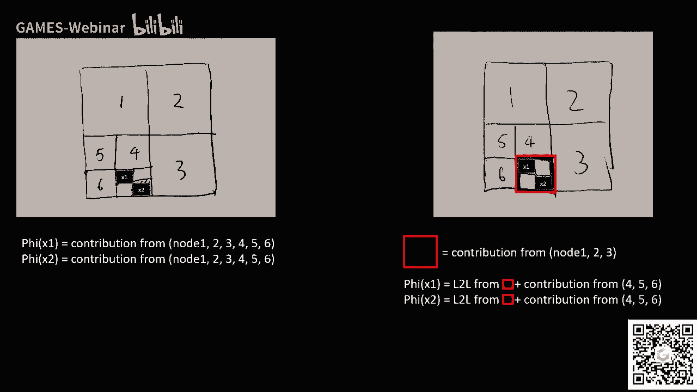

对哦好，所以我们再来回顾一下这张全图，这张全图其实给了我们一个很好的这样一个后，羿面前，他表述了说，首先我们从这个source party开始对吧，我们先做p two m变换。

然后呢我们再做m two m变换，然后我们再做m to l变化，然后我们再做l to l变换，最后我们做l two p变换，然后呢在particle周围呢，我们再去累加来自于其他粒子的这些贡献。

这就是整个这个fast multiple它的一个一个一个走法，先是top，先是button up，然后再top down，所以其实我们会发现这个东西的计算。

它似乎和multi grade method它也有异曲同工之妙，也存在这样一种空间的这样一种呃，button up和top down的这样一种结构，那么在三维的情况下，在这儿我要指出一下。

就是我们的泰勒展开可以以两种形式来完成，一种呢是在ktition space，在这个笛卡尔坐标系下进行展开，另外一种呢就是在这个球鞋坐标系下，进行这个展开，那么在球鞋坐标系下进行展开的时候呢。

我们就得到了原始的fast multiple method，那这个大家如果想看更多的这个细节呢，我推荐大家去看这个a short horse on，fast multiple methods。

因为他是这个green guard写的，green guard呢，他就是fmm这个算法的一个发现者，所以这个这个课程我认为是呃，这个cos我觉得是写的比较好。

有同学问，是不是任意的是函数都可以用多级展开。

这个就有意思了，这个有关于什么样的势函数。

就是说有关于什么样的和才能够被施展开，在这一在这个short course里面，它是有有讨论的，他有一个引理的证明，就首先你这个和是要满足一个条件，你才能进行市展开的。

那么这种核呢我们叫做degenerate kerne，嗯哼ok它要符合这样一个条件，那么通常的物理上的来来，源于物理应用的这些和，我们可以认为他都是可以被这个市展开的。

包括高斯和包括这个呃热热力学的这个和，包括我们的这个呃格林函数啊，这个万有引力的这个和它都是可以被展开的，那么至于任意的和能不能够被展开呢，大家就要去套那个引力验证一下啊，这个不是任意的，ok政治是。

看来这个课程这个show cos确实非常给力啊。

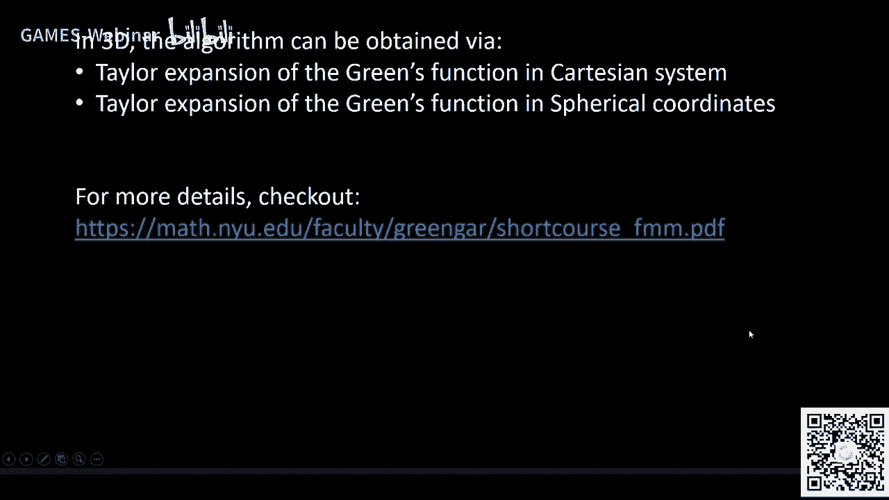

我也应该去学习一下。

那实际上这东西呢它这个fast multiple method，它是有很多这个呃有趣的应用的啊。

一个比较重要的应用，比如说我们可以计算gravitational force。

以及关于重力的场的一些信息的变化。

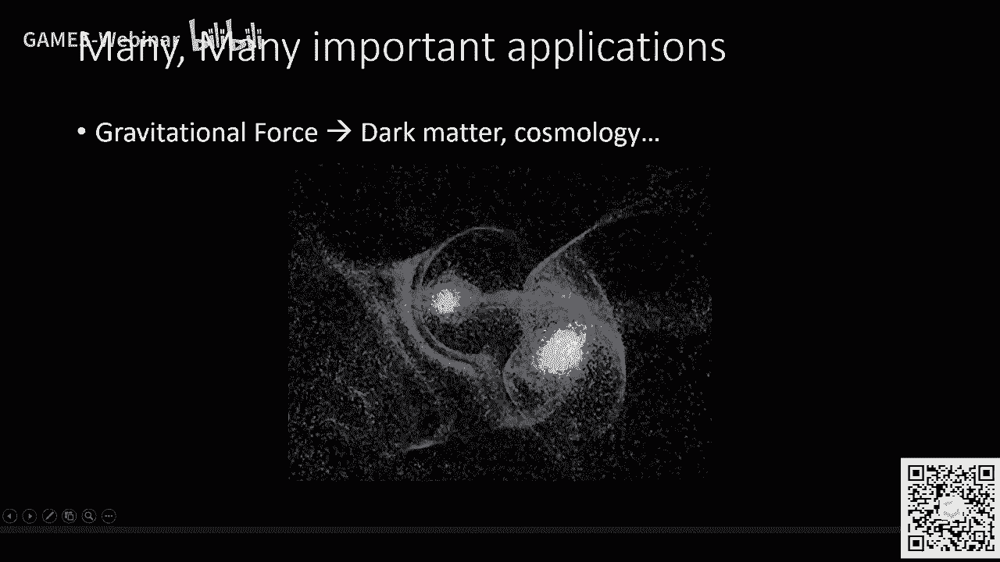

那个这个除了可以帮我们在cosmology这个方面，预测星体的运动以外呢。

我们还可以就还有人用它来搜寻这个dark matter。

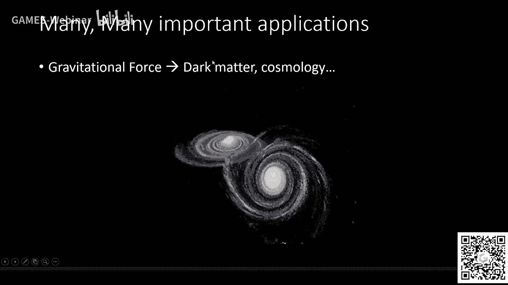

那事实上这dark matter这个名字很酷炫啊，暗物质或者暗能量啊。

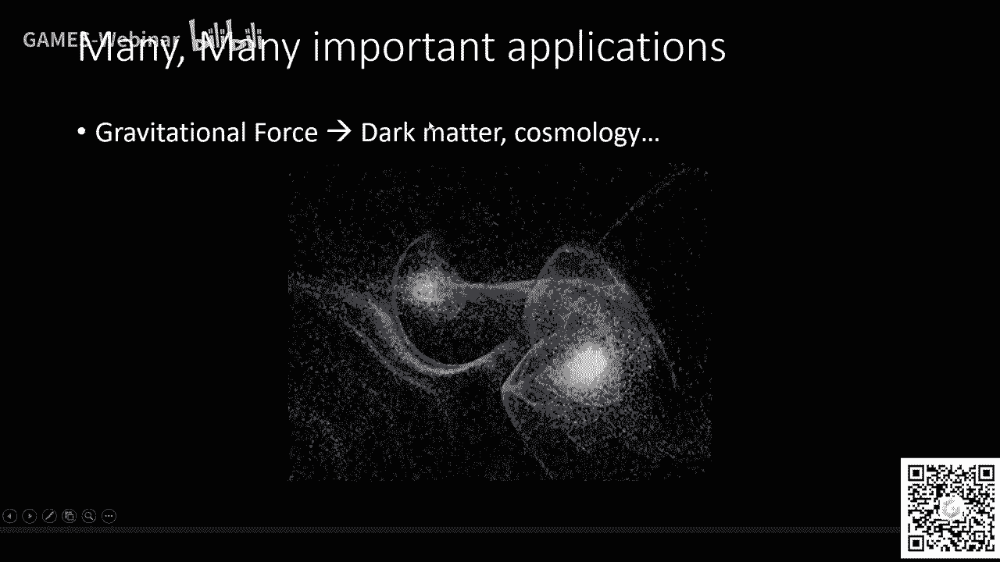

那么嗯如果我们搜这个fast multiple method的话。

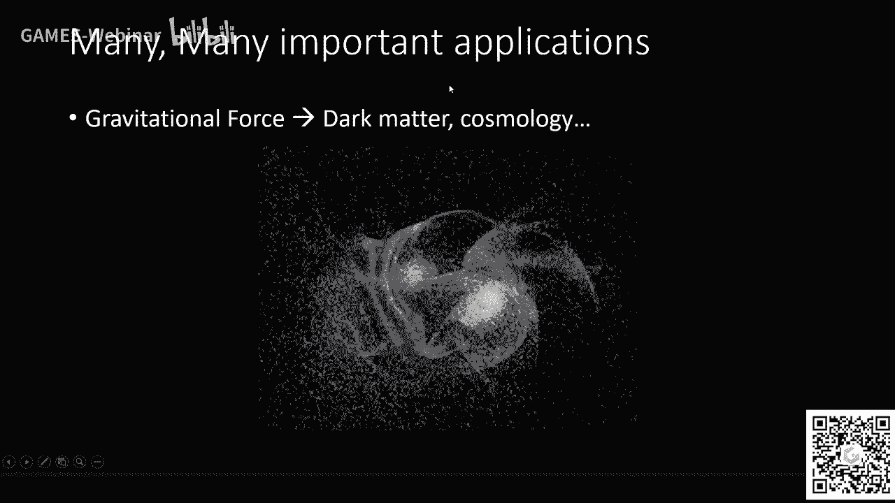

我们其实是会搜到有关于dark matter的，这样一些论文的。

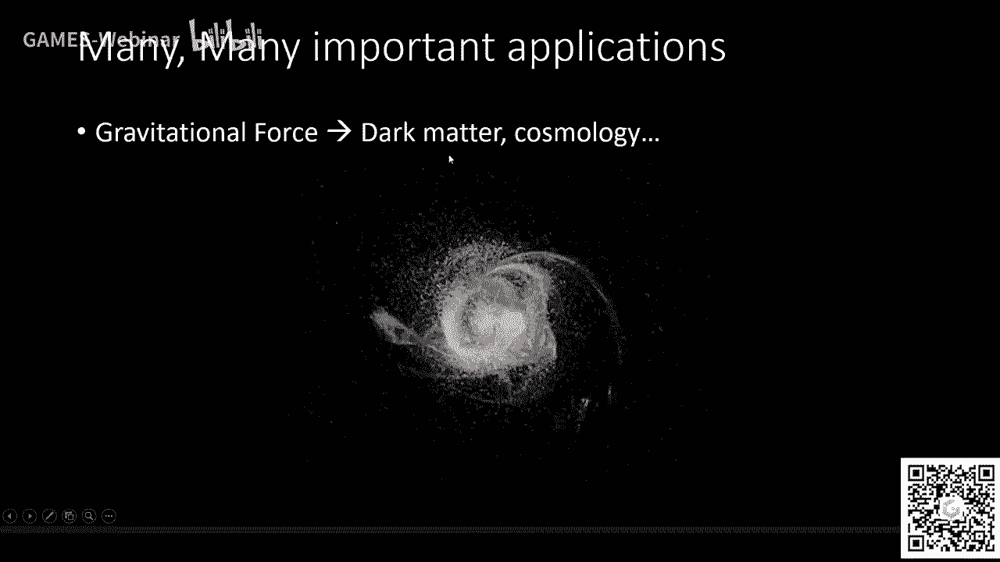

那么它实际上它是要解决一个什么问题呢，当我们观测到一些带有星体的质量。

或者我们对一块区域有这么一个质量的估计。

以及我们知道它在怎么运行的时候，这个时候我们就可以借助这样一种。

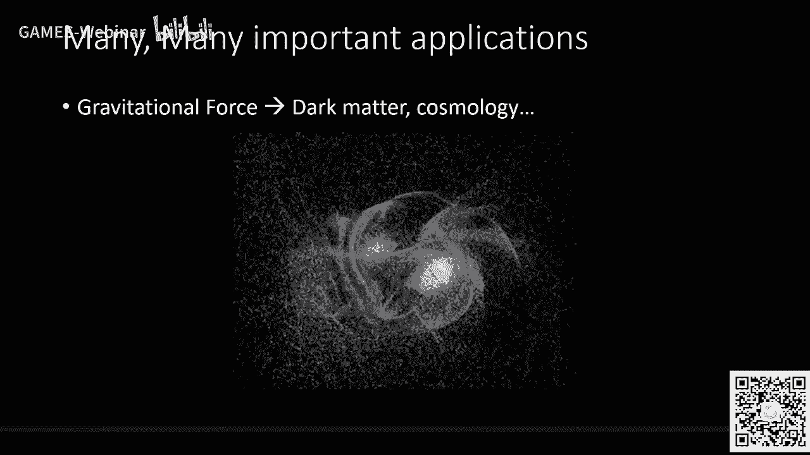

仿真分析的办法，去尝试去搜寻出我们计算出来的这个轨迹。

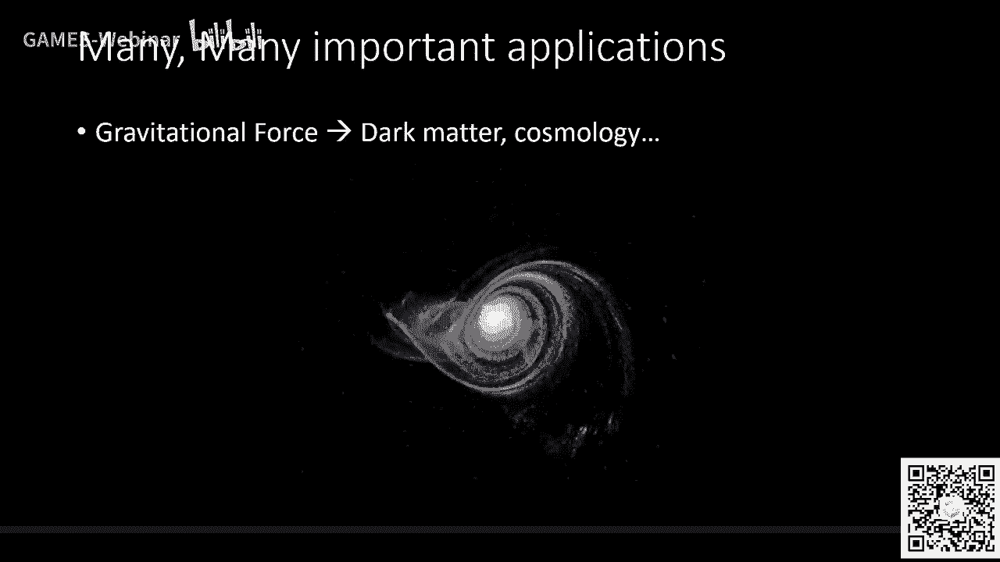

是否真的符合我们观察到的现象，如果这其中差异很大的话。

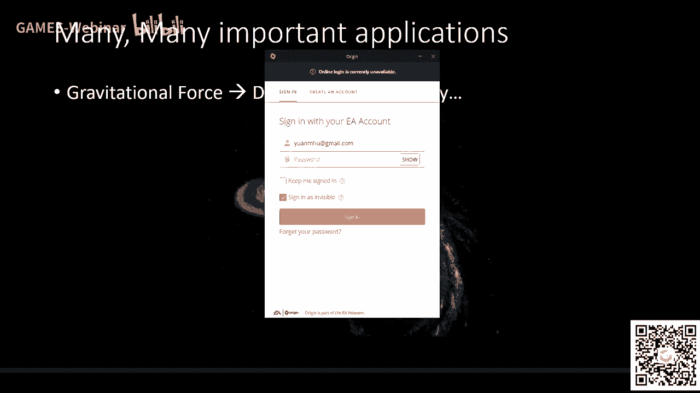

这说明什么，这说明就存在我们没有看到的质量。

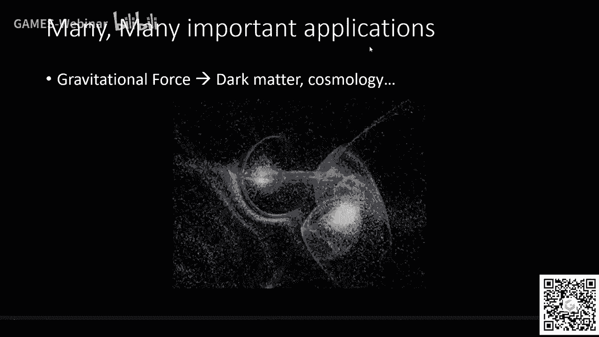

那这不就是所谓的暗物质吗，啊所以如果对这块有兴趣的同学。

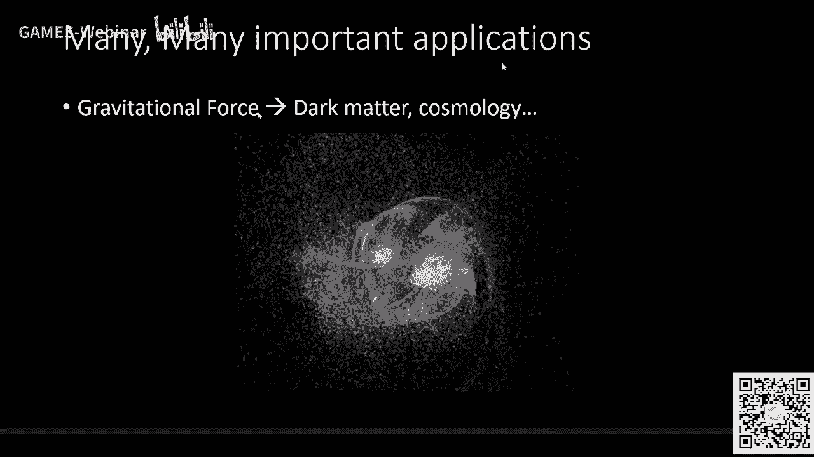

也可以去看一下有关于这方面的论文哈，那么另外一个它比较有巨大作用的领域，是什么呢，是静电场，electrical static，electrical static，它和我们的这个万有引力一样。

它具有完全一样的这样一个泊松方程，当然正负号不一样啊，这里我要强调一下，正负号不一样，但它的形式是完全一样的，这样一个泊松方程，它除了可以在这个静电物体，物体的表面就给定一个电子的分布。

去计算出静电场的这个静电场式的，这样一个方向以外呢，它还可以干什么呢，事实上在分子和分子之间，或者在分子尺度，静电作用力是它的主要的一个作用力，那么这个东西呢，就会被应用在分子动力学分析中。

那事实上在一个分子动力学软件中，每一个时间去计算这样一个分子静电场力，是呃十分核心的一个任务，而对于分子动力学的分析呢，可以有助于人们做这个肿瘤方面的研究，以及做这个靶向药的设计。

以及像现在呃像呃新冠疫苗的时候，人们就用这样的方法来分析这样一个新冠疫苗，它最好的这个a c r受体的结合点的位置啊，这其实可能很多呃，大家可能很多都不知道，原来这个之中还有这样一个泊松方程。

在再play一个important ro。

长见识了哈哈，那么以及以至于我们有这个hao方程，hamhz方程呢，它就通过我们对这个hamhz方程的，这样一个求解的，我们就可以去求解这个生产，比如说在这个声音领域。

当我们在某一个位置放了一个这个扬声器，我们想计算这一整个范围内的这个整个声音的，一些声压的分布等等等，这样一些情况呢，我们就可以通过求解harmless equation，来来解决这个问题。

那么以及于呢它可以在这个electro magnetic，就是电磁立场这样一个方向呢，呃产生一个应用，比如说当我们在设计某种健体的时候，那么我们就可以通过这个电磁力的这样一个分。

析去找出它可能被雷达探究的半径，可能被雷达探测到的半径，以及我们去反向优化它的这样一个形体设计，使得它尽可能的能够，呃这个达到一个更好的隐蔽性。

那么这个就是通过electro magnetic的计算得到的，而这两个东西它都来自于这样一个ham，ho或equation的这样一个求解。

那么以及以及呢，我们有一个十分重要的应用是什么呢，就是这个边界元方法，在边境源方法中我们求解一个什么，求解一个拉普拉斯方程，这个拉普拉斯方程呢，它其实是告诉我了我们这个整个流程，整个厂里头是什么。

是有事无缘的对吧，有事无缘，那么这个时候就有意思了，其实这样一个有事无缘的厂子，它的所有的属性就被边界出的值，所唯一的决定了啊，所唯一的决定了，比如说我们如果在边界边界处。

这个比如说在这里这个伽马一这条边界上，我们知道了他的def dn，以及在伽马二这条边界上，我们知道了他的b的这个值的话，那剩下的整个厂里的所有的数值，就都是确定的了，这个数值的确定呢。

可以通过一个解析的表达式来得到，这个表达式呢就是边界积分方程啊，我这里已经把它写成离散形式了，我这儿已经把它写成离散形式了，所以实际上我们是什么呢，我们把一个偏微分方程，带边界条件的偏微分方程啊。

转化成了一个积分方程，在这里我们把它转化成了一个积分方程，这就是边界元方法，那么这个积分方程它有一个特点，就是说它的矩阵是稠密的，因为每一个点它都来自于其他所有点的作用，所以它的这个方程是矩阵是稠密的。

但是usually它的肯定是number是很好的，比如说如果我们用一个co subspace的这样一个，迭代法去求解这样一个积分方程的时候，通常我们在常数迭代时间里就能够找到他的解。

所以他的肯定是number，通常是很好的，但他举证很稠密，所以这里我就列下对比，在二维的情况下，在二维的情况下，假如说我们fuldomain是n平方，负的domain是n平方，这个时候。

如果我们用multigree的方法来求解偏微分方程，由于multi的方法是在常数时间收敛的，那么我们得到的是一个，总共是大概一个n平方的一个计算量对吧，而如果我们用来if。

或者用strike forward，的一个边界元方法来计算的话，那么我们要知道边界圆在一个n平方的范围内，因为它只有边界嘛，所以大概有n个element对吧。

那比如说我们用by cg step这样一个方法来迭代，它可以在常数时间收敛，但是每一次迭代，那它要用n平方的时间来计算，这个稠密矩阵相乘的这个时间，所以他最后的总的计算量呢是和multi gi的差不多。

打平手的，就如果他买衣服的来实现的话，他是打平手的，那在三维的时候情况就糟糕了，比如说我们的fdm是n的三次方，那multique的方法呢。

我们知道它是o n3 的时间收敛，那么当边界元呢，这个时候他有n平方的elements了。

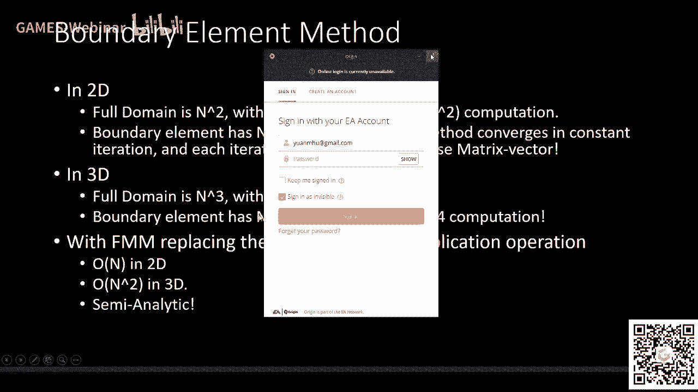

而计算这个从密矩阵的代价呢，就是n的四次方的computation了，所以即使它能在常数时间收敛，它总共是n的四次方的computation，它就和这个multigree的方法。

他就永远都无法战胜multipi的方法。

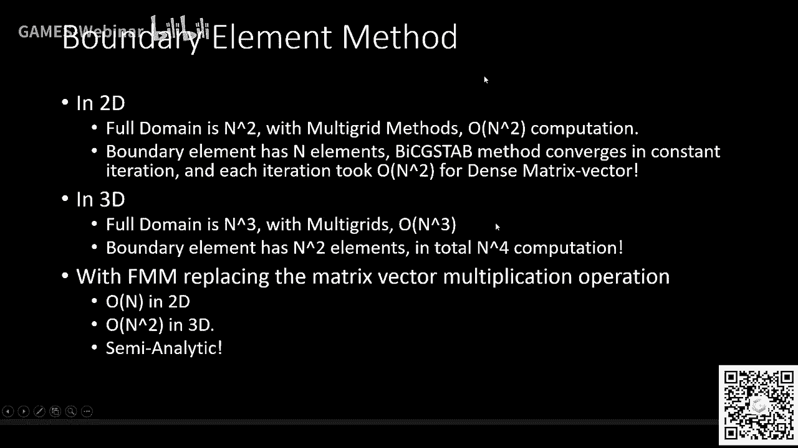

那么反过来，如果在计算这样一个积分求和的这样一个时候，ok计算这个积分求和的时候。

我们用之前所推导的快速多极展开的方法，用快速求和的方法来替换掉，这个矩阵向量相乘的过程，简单的说原来它是一个矩阵乘以向量，这个时候呢我们用matrix free，用matrix free的这样一种形式。

然后用fmm去计算它的这个结果的话，那么在2d我们就是o n的，我们打败了多重网格方，然后在3d的情况下呢，我们就是o n平方的o n o n平方的，我们也打败了这个多重网格法。

那么我们要知道它有一个好处，就是边界圆这个方法它是sumalthletic的。

它是一个半解析的这样一个方法，在我们对于圆的这个划分，精细到一定程度了以后，他给出的答案几乎就是解析解，所以这个是他十分有趣的一个性质哈，他给出的答案几乎就是解析解。

并且很呃不用很细致的一个这个边界源的划分，就已经可以得到很好的答案了。

所以这个是他很有趣的一个性质，它是3m ltc的。

那么比如说用这样的一些编辑的方法，我们可以来求解哪些问题呢，那ok比如说在这里我就展示了说，有关于波动的这样一个这样一个呃方程，那么这个是像像我现在所展示的这样一个，simulation domain。

如果我们用呃n s方程的方法来求解，我需要把整个抖妹抖体积化，这里面就需要很多很多的计算员，这里面就需要很多很多的计算员，而我如果用边界圆的方法在上面求这个呃，式方程，或者说叫做伯努力方程啊。

我可能得到的物理，没有n s方程所表达的那么复杂，但是要知道这个呃国动力方程，已经是对n s方程很好的一个近似了，因为他只是假设你的流畅无年而已，只是假设这个流畅无年。

而且流畅的这个速度是一个是一个市场，是一个市场，那么在这个情况下呢，我们是可以求解出复杂的这些波浪运动的，这样一个形态的，那么对于很多应用来讲，由于波浪的这样一个，特别是远处的波浪的这个这样一个形态。

已经是很核心的一个研究任务了，所以在这种情况下，使用边界元的方法求解，很显然是更明智的，那么以至于在这里所展示的这个案例给我们，我们可以去计算升压，通过求解之前所说的求解这个emo equation。

这样一个边界圆方法，我们就可以说，在我们已知一个物体的外形的时候，我们就可以在它周围，任意范围内去计算这样一个升压，那计算升压有什么好处呢，我们就可以知道它在飞行，在这样一个以一定速度飞行的过程中。

所产生的噪音，或者所产生的可被探测的这样一个声音，它的影响的范围是多少啊。

我们可以去进行这样一个升压的计算，那么以基于什么呢，在图形学或者在很多这个有关领域吧，我们还很关心的就是湍流，也就是涡流的这样一种计算，那么涡流实际上呢，我们来自于一个矢量的泊松方程。

我们首先通过求解一个矢量的泊松方程，来得到我们的一个呃string function流函数，然后我们再对这个流函数打这个客运算，来得到我们的速度差，那么它反过来呢，又能够写成这样一个求和的问题。

那么这个时候呢，我发这个fast summation，又可以用来求解这样一个涡流。

那么求解涡流这个问题。

他其实特别有意思啊，比如说我在这里展示的这个案例，我在这儿展示的这个案例。

所所展示的这个现象叫做vtex ring。

他是讲这个两个vtex ring，一旦产生运动了以后。

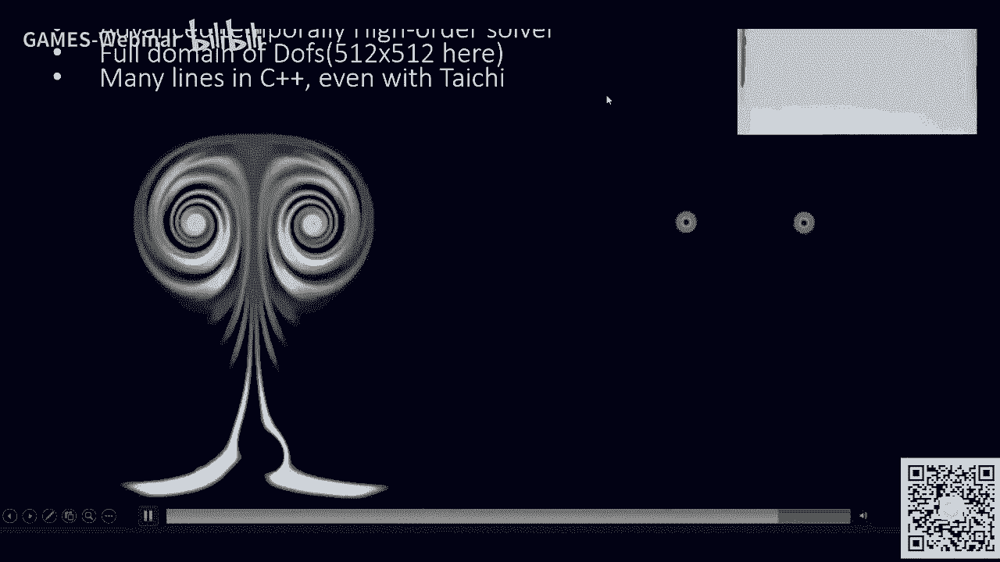

他会做这样一种你中有我，我中有你的这样一种交叠上升，ok那么这样一个这样一个现象。

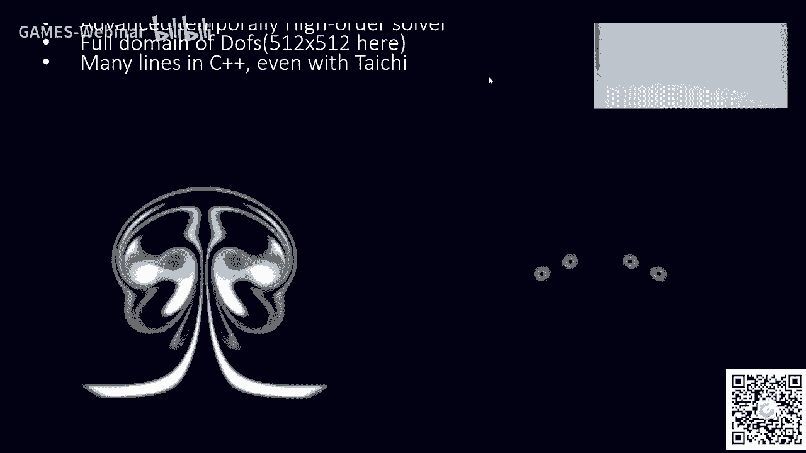

如果我们想通过n s方程去捕捉。

其实他是十分痛苦的，比如说我在这里需要用很多的这个自由度。

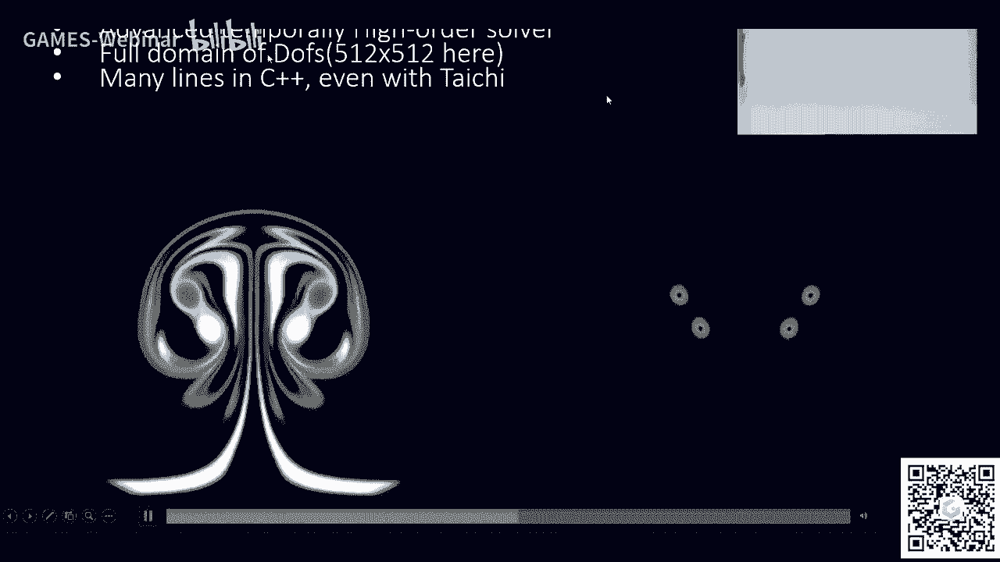

我用了一个512的平方的这样一个网格，然后呢我要用一个advanced呃。

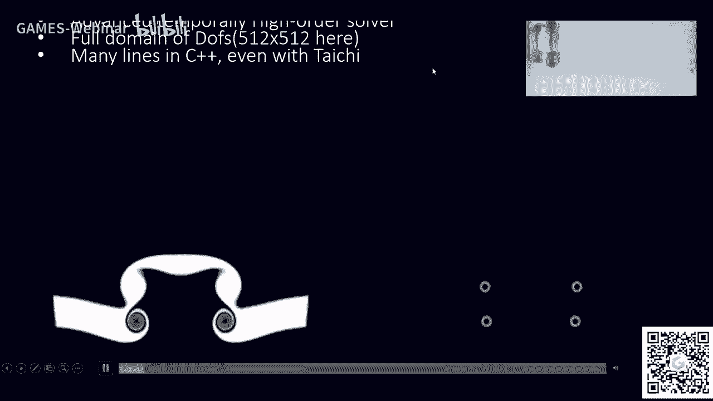

比较高级的这样一个时间积分的方案。

高阶的这样一个时间积分的方案，并且这个server呢，他可能要很多很多行的c加加代码。

即使用太极来写，它可能有很多行。

它才能差不多的模拟出这样一个leap。

而最后我们发现他的这个box还是，很快的就融合了。

很快的就融合了，那么现在我们看一下，如果直接用这个握方法来写的这样一个东西，我们我们就可以捕捉出这样一个leap，他呢我的时间积分方法，我可以as simple as s一个前向欧拉。

并且我在整个计算中只有四个自由度，就是四个我点那四个窝点，这四个自由度ok也不，当然也不止四个4x3，他们的坐标对吧，这样这么点自由度，反正然后呢我只要很少行，我记得应该是数应该是百来行的c加加代码。

那么在太极里头呢，它的代码的行数就更少了，它大概只需要几十行呃，多少行，七八十行嗯，居然也要七八十，你是算上visualization了是吧，嗯对，就是其实里面好像我记得，好像初始化这两个窝的位置啊。

还有什么的，就花了两个10号，哈哈行吧，就就刨掉这些以外，大概只需要40行左右的代码部分，大概40吧。

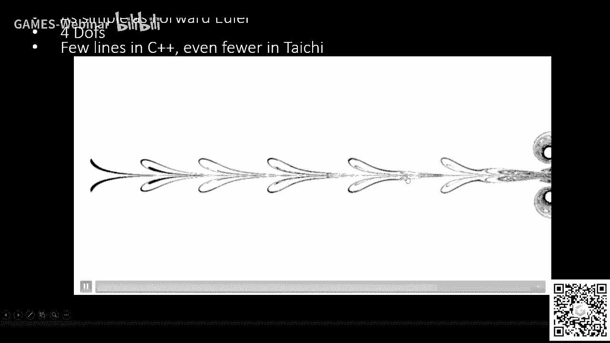

对，我们就能够捕捉出这样一个复杂的，这样一个运动现象，而这个要知道我们是通过n s方程的求解。

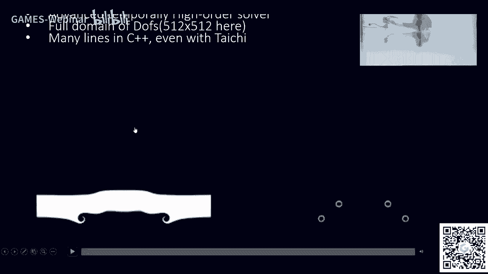

是要花很大的力气才能够做到的。

所以到现在我差不多总结一下，我们总共有这么几种submission是要求解的，比如说第一种关于电场力和万有引力，那么就是市场的梯度，市场在x点的梯度，那么它的求和是关于平方，关于半径的平方成反比。

质量成正比对吧，方向是沿着这个距离的方向啊，这里消掉一个消掉可以消掉一个r啊，那么以及在这个边界园中呢，我们要对一个不同一点的kernel做计算了，这个kernel是说我需要在每一个j。

每一个每一个便利的j的位置去点击，去拿我这个方向的这个梯度，去点击我当时的那个法线，点击j a这个地方的法线，那么这个会使得这个kernel变得很不一样啊，这会使这个ko变得很不一样。

所以呃我们要考虑一下这个东西，我们怎么来求对吧，以及呢我们有一个bo smart，bo smart，当然他很像我们的这个万有引力的，这样一个公式了，它只不过这里用的是一个叉乘的形式。

ok大概这三种submission。

那么这个时候我就有一个问题了，我就说如果我给大家一个routine，这个routine叫做computer graduate，如果我给定一些电子元或者重力源s。

这是n个particle with its mass，对吧，这是n个particle with its mass，然然后呢，我来computer grab fee，我就能够告诉你。

所有的这些po位置出的这个gravy，也就是他们的受力，这个f的话，我如果给了你这样一个routine，你把它当做一个black box。

我们怎么去求剩下的这两个，我们怎么去求剩下的这两个求和。

那么这里我展示一下，我们怎么求这个边界积分中的，这个nj的这样一个求和，其实我们可以把nj有关于nj的那个东西啊，我们把它拆成三个特啊。

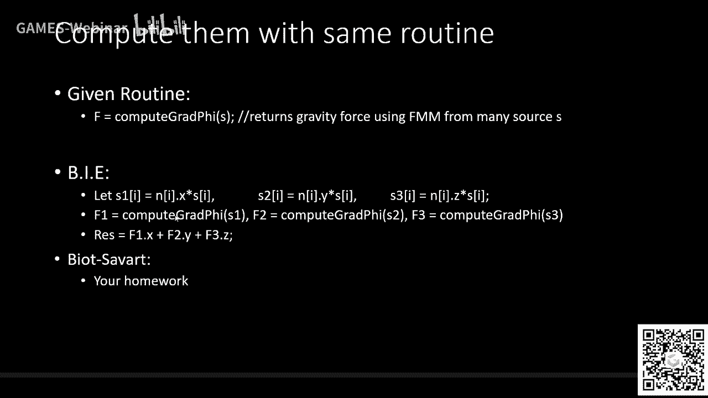

我们把它拆成三个ten，我们发现其实是ngx乘以d，这个one nor d x加上ng的y分量乘以d。

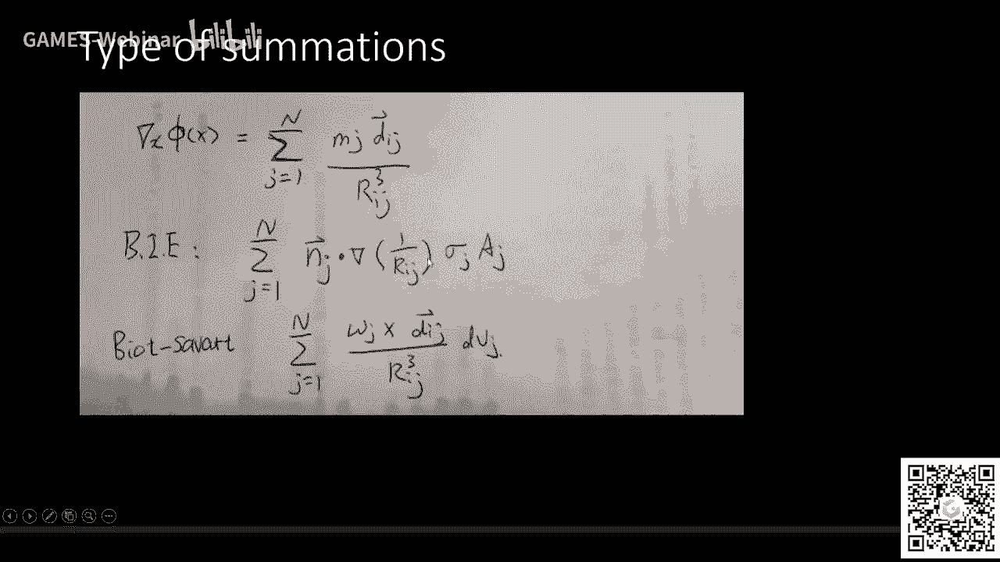

他d他的这个y分量，那么这个时候我们就我就发现这件事情，他就很有意思，他可以这样来做，如果从原来的这些s，从原来的这些s我们去构造出三个不同的s，构造出三个不同的这个圆，那么其中呢这些圆这样来构造。

我把每一个si自己的原有的这个带电量去乘以，他当时的当初的这一个法线的x分量，或者y i分量或者z分量，我去构造出三个新的s，并且呢，我对这三个不同的s都去做一个computer grade feed。

这样一个操作，ok然后我分别把这个f一的x分量，f2 的y分量以及f3 的z分量，我把这三个东西加起来。

实际上我就得到了，对于这个式子的一个求和的值。

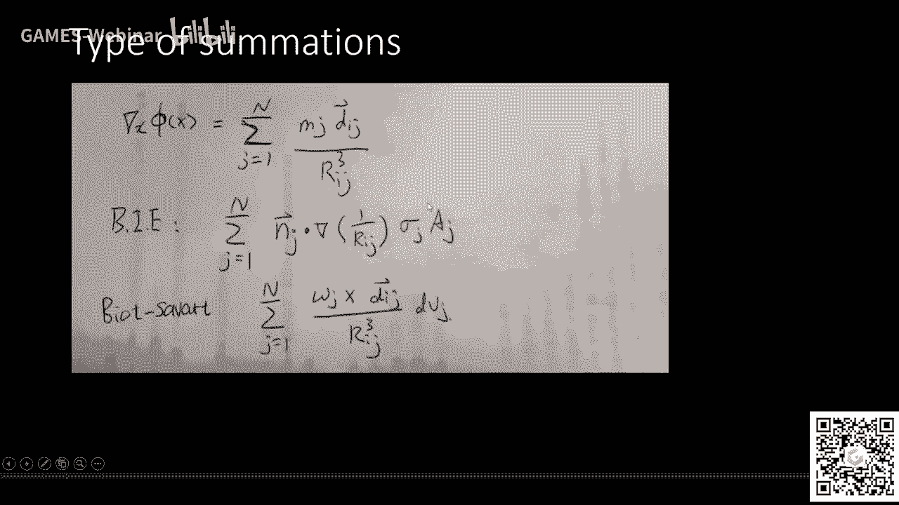

我就得到了对于这个式子的一个求和的值，那么中间具体的这个呃，中间具体的这个过程，我希望同学们可以自己拿个笔写一写啊，你就很容易能够想通这件事情，这是很显然的，那么至于bo smart怎么来做呢。

我就留给大家作为一个家庭作业了。

好吧，在给定grade feat，计算grad feat的这样一个基础上，怎么去计算这个bo smart啊，注意我们是对于j去便利的啊。

注意我们是对于j去便利的，对大家如果做了这个bo smart这个作业的话，也可以在论坛上面和其他同学分享分享，这应该是一个祭祀，主要是一个数学公式的推导对吧，对，主要是个转数学公式推导或者转化的过程。

实现起来还是很难的，我觉得实现起来是不用实现，就是推一下就行，拿支笔一写就行，那么剩下的我呢讲一下其他的两种，这个快速求和方法，一种呢就是p3 m。

一种呢就是这个呃和无关的kernel independent呃，快速求和，那么首先我先讲一下p3 m，其实pcm他的观点就比较的怎么说呢，比较的这个嗯比较的印q一体。

我们是通过这个去混合了偏微分方程的视角，和samson的这样一个视角，来得到p3 m这个方法的，那么我们注意到每一个这个submission，其实它都是对应着一个这个偏微分方程的，每一个扫描线。

它都都对应了一个偏微分方程。

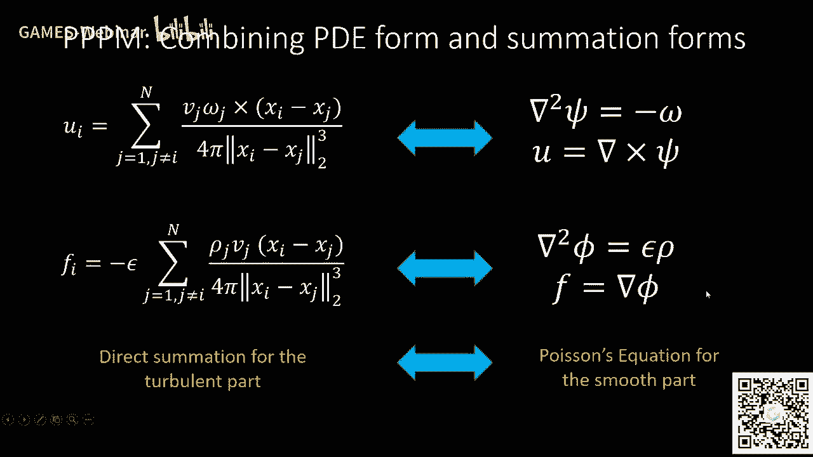

那么这个时候我们就可以，就可以先想这样一件事情，如果我有一些例子，我先把这些例子做一个p to g的操作对吧，我先把例子speed到这个网格上去，然后我在这个网格上呢去计算一个什么。

去计算一个泊松方程的解，去计算这个泊松方程的解。

得到我的流函数或者得到我的势函数对吧，得到流函数或者是函数，然后我对它施加这个梯度或者克，我实际上这个时候就得到了什么呢，我就得到了一个平滑的市场，我就得到了一个平滑的场对吧。

这个厂注意了是包含所有粒子的贡献了，这个要注意，是包含所有粒子贡献的一个平滑的这样一个厂，它包含了，但是呢这个场这个我们得到的场，他的进场的这个值它是没有细节的对吧，它是没有一个细节的。

所以接下来我们要考虑的是，如何把这些细节给加回来，那么加加回来细节的方法就很有意思了事，事实上我们可以先把这个平滑的场插值出来，然后呢再对于周围去累加一个呃，去累加它的一个高频。

高频的这样一个像所带来的影响。

我们就可以加回这个湍流场的这样一个细节，那么在我把这个算法给奥特曼之前呢，我先呃向大家展示一下，那这样一种做法，它首先它的计算时间它确实达到了线性，比如说在这里这条蓝线是o n哈。

然后这条绿线它是o n平方，所以计算时间呢我们确实达到了这样一个线性，那么我们的计算精度呢，我们也可以看见，随着我的correction range的这样一个增加，它能够到达这个小于1%的这么一个状况。

在这里我记得呃，我在这应该是小于0。01%了，所以是达到十的-3次方这样一个精度的。

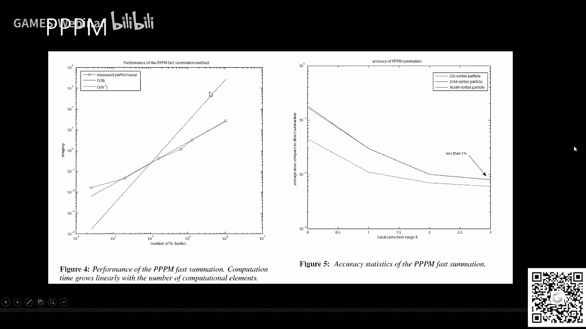

那么呃，那么我现在把这个p p3 m给奥特曼一下，它其实是这样，首先我们有一堆例子对吧，我们去做一个particle to bread的这样一个操作，然后此时我们得到的是一个平滑层，我们得到一个平滑层。

然后呢我们去计算它的高频场，计算高频场，我们把每个例子减掉，他从平滑城里差值出来的那个值，我们就得到了它的什么高频分量对吧，高频分量，这个时候呢我们拿我们的这个泊松方程。

我们拿我们的这个psp去求解这个平滑的场，并且得到我们的流函数或者我们的势函数，然后我们对流函数或者势函数求curl，求grading，我们就得到了我们的平滑的这样一个速度分量，速度分量。

那么这个时候我们最后在粒子上的这个，湍流的速度分量，它由两部分组成，首先我们去插值平滑的速度分量，然后呢我们再对它附近区域的这个高频分量，这个高频分量去做一个什么，做一个快速求和，也不是说快速求和。

是说叫做直接求和，那么我们就得到了这样一个湍流的，这样的一个速度差，ok所以那这样的一种计算呢，由于我们每次我们所有的计，在整个过程中的计算都是线性的，所以最后我们得到的是一个什么呢。

也是一个线性时间呢求科算法，并且它比这个快速多极展开要简单得多，同学们其实甚至用有用呃，课程至上一节为止，已经开发的这些呃工具和能力，应该就足以写出这样一个呃p3 m算法，这里面这个第三步是用mt贵的。

应该就可以吧，这就用猫体贵的，就用猫体贵，但是你边界条件是不是有一个。

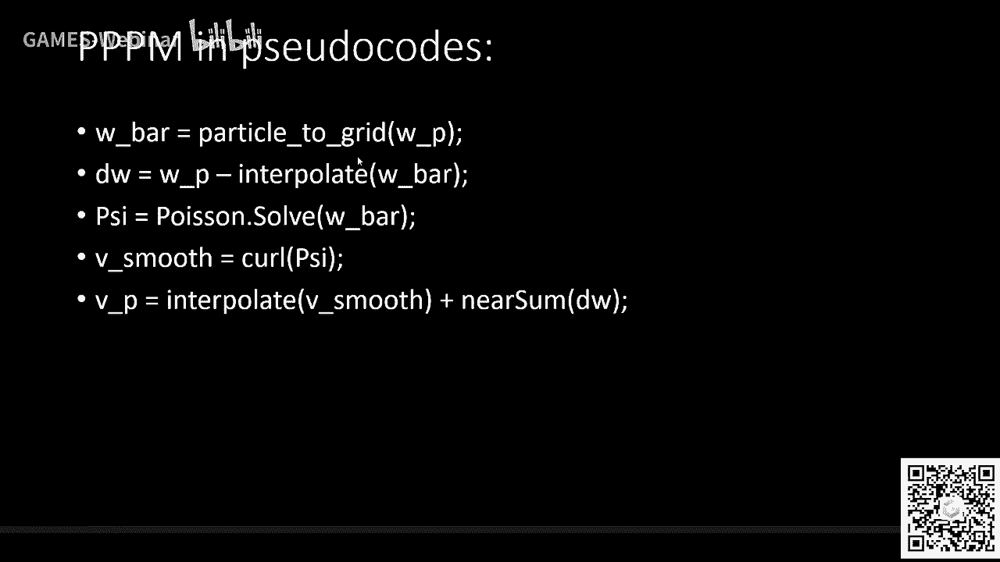

还有个8号出院那边诶，不用你看我这里p3 不用边界条。

就是说边界条件可以认为是零，你看我这个图我画的很清楚，所有的这些例子，它是split到很小的一个格子上去的，很小的一块区域上去的，我就边界足够远吗，然后这个边界我就是让他足够远，就是让他足够远。

因为什么这样可以呢，因为我最后有那个高频分量的一个直接累加，对吧，所以这样是不会损失进度的。

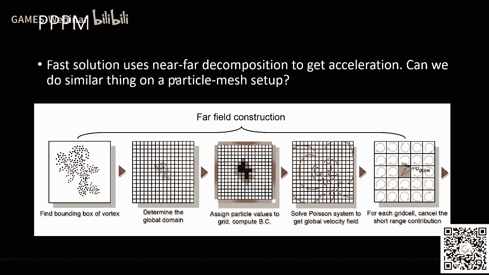

这样是不会损失进度的，对，那么还有一种呢，就是这个和无关的快速求和方法，那和无关的快速求和方法，实际上他的视角是这样的，当我有个这个电子的时候，我去构造两个圈，把它给包住，我去构造两个圈，把它包住。

这两个圈是这样的，首先我来自于呃，我我要在pj这些点上，也就是说在外圈上去求出来自于qi的，这样一个直接求和的贡献，这个是我已知的要达到的数值，与之要达到的数值，然后呢。

我假设这些数值是由来自于内圈上的，一些未知的电子的电量来给出的，这个时候我要求说什么呢，我内圈的电子的电量要是多少，我才能够在外圈上给出这样一个四分布，所以所以而这个k k j是已知的。

这个pj是已知的，然后我们要去求这个西格玛k，所以这个时候其实我们是一个什么，是一个矩阵求逆的过程，locally的一个矩阵求逆的过程，而一旦我们这个内圈和外圈这个形状是确定的，这样一个情况下。

我们的这个这个是这个kk j，就是一个已经确定的值了对吧，所以每个圈上有多少个多少个电荷，这个是随意，这个是多多益善的，就是这个电荷越多，对这个电荷越多，你可能越准确嘛，对吧对。

所以这中间差不多就是有几百个呃，有时候100个吧就够了，ok，啊所以这里我再做一下总结，今天呢我们讲了几种这个快速求和方法，有快速舵机展开和p3 m，然后我们呢我后来讲了这个。

所以能够被快速求和方法来求解的方程，它们包括了泊松方程，拉普拉斯方程，pho方程，还有边界元方法对吧，然后以至于呢这些快速求和方法，它可能产生的应用包括了在静电场方面，它有这个分子动力学。

它可以作用于肿瘤呃，药物设计等等，以及我们的electro magnetics，它可以有这个船舶的这样一个设计对吧，然后我们的这个声声学方面呢，我们可以做这个urban planning。

比如说你现在要建一个高架，这个高架呢会经过几个居民区，那么这个时候呢，实际上可以通过一个升压的分布，去在高架上面呃，适当的放一些隔离带，或者叫做隔离的那个隔离板，来起到一个最好的去弱化这样一个呃。

弱化这样一个噪音的这样一个方案，比如说我们有这个vehicle shape design，这个vehicle就包括了这个大道，飞机，小到一辆车，它的外形都可以被优化。

通过这样一个降低升压的这样一个方法来优化，来得到我们最好的这样一个降噪，还包括呢我们可以做影院的一个设计，在这个过程中呢，可以通过这样一个升压的分析和计算，去找出最好的。

在这个影院中构造这个声音的这样一个回响，这样一种方案，以至于我们可以做这个potential flow对吧，我们potential flow方面，我们就有有这个飞机的记忆的这样一个设计啊。

有我们的这个呃波浪的这样一个计算对吧，以及呢我们在湍流方面，我们有这个vertex method呃，那好吧，今天的这个分享就到这里了，哇真的非常棒，我觉得我今天听了一下。

我又对这个fm和p p m理解更深入了一些，之前看师兄好多西瓜和论文，感觉里面那些给每个每篇效果都非常的棒啊，包括其实从其实我记得你博士期间是三篇论文，其实都是哦。

有可能有两篇是vertex method对吧，我记得第一篇，第二篇，第三篇是一个呃是一个big flip的一个一个paper，对对对对对哇，我觉得还是每一篇效果都非常的惊艳。

我记得我第一次看到p p p m，大概是我大二还是大三的时候，那个时候感觉对各种东西也不太理解，然后这一转眼都可能有哇，这一拳也好多年了，好多年了，有同学问哦，窝方法如何处理固体边界哦。

五个方法处理固体边界的时候是这样的，求解边界积分方程，就是说我看我这儿找不找得到呃。

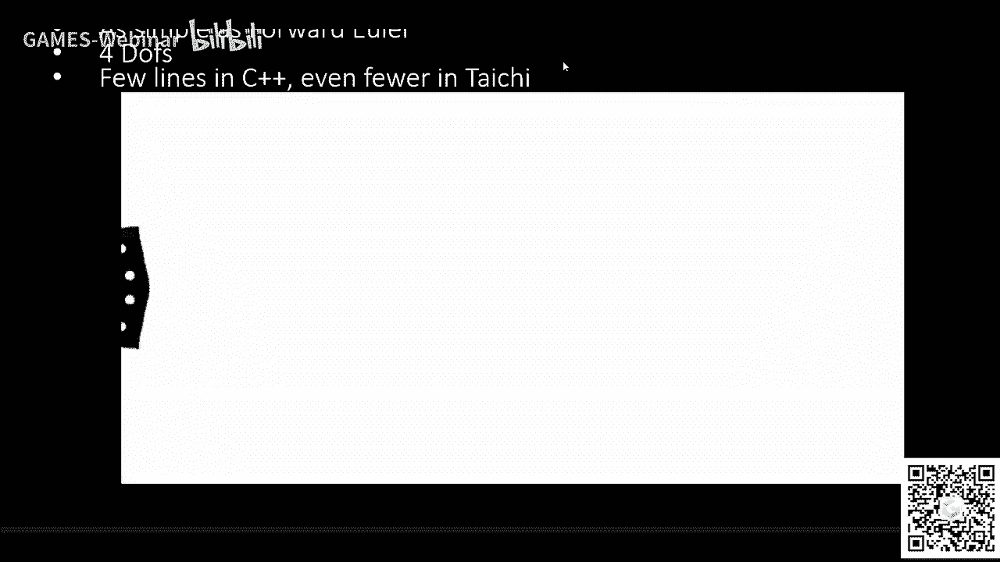

我这没有讲，但是我们回到这个边界园的那一个slides哈。

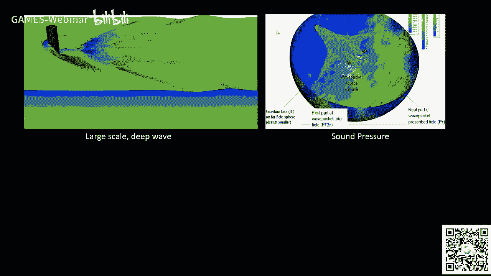

我回到边界源的这个slides，其实在窝方法处理边界的时候，我们是这样的，我们希望找到一个在这个边界上的，这样一个窝分布，或者这样一个电子分布，这个区别于这是一个势流，你是要做这个呃。

你需要做粘性流还是非粘性流，我先说这个无粘流，无粘流的话，其实我们只要保证法线方向是不穿透的，就可以了对吧，法线方向是不穿透的就行了，所以这个时候，其实我们需要找到一个什么条件呢。

我们是想在这里找出一个电子，你可以想象它就像在这里找出一个电子的分布，使得这些电子呢它可以introduce一个速度场，一个试流场，一个potential flow的这样一个厂。

这个potential flow的这个厂的刚好可以去干嘛，刚好可以去cancel掉，刚好可以去cancel掉，这个边界处的这些，本来会这个穿透的这些速度对吧，所以你立的方程呢。

就是这些东西产生了一个边界速流场，然后你让他去乘以这个法线方向ni对吧，它正好可以等于负的对吧，负的现在你已知的这个呃速度点乘n对吧，这个就是你要呃，你你对于这个无电流要解的一个方程，那对于粘性流呢。

你解一个额外的方程，就是说你希望在这里再找到一个这个沿着这条，沿着这个边界的butt sheet，沿着这个边界的一个vtec，使得它刚好可以in roduce一个速度场，能够去干嘛呢。

能够去cancel tangent方向上的分量，能够去cancel tangent的方向，那这个就是你找出来的这个这个边界，出的这个值了，那么这个边界处的值呢，接下来你再通过这个热扩散的那样一个方程。

或者说呃那个叫做什么，在这里，这因为在一个纯粒子的方法中，你是不太好不太好做热cosm，所以你可能要通过一些randow，或者通过一些呃这个能量总和不变的啊，这样一些扩散的方式。

把这个上面求出来的这个vertex系统，在这样一个强度，给emit到周围的这个涡流里面去，那这样的话呢你就能够形成卡门涡街了，对ok，所以相当于是你还是呃在你得在固体，比如说你说卡门国界的话。

你得在这个圆柱的内部去给他先求出一个呃，你就假设它没有固体，然后你求出一个就先假设没有布局什么分布，然后你就你这样吧，你就是这对我你你n时刻，假设你现在在n时刻，你所有的涡粒子已知对吧。

所有的速度已知对吧，这时候你先做什么呢，你先做对流对吧，你把握粒子走一下，然后你再去干嘛，你再去从涡粒子里面求出一个速度对吧，那这个速度呢，它在边界上不一定是严格满足的对吧。

或者说一定不是严格满足的对吧，那么它就有一个分量要被你cancel掉对吧，要看收掉多少呢，就是你去把它点成tangent或者点成法线对吧，嗯就是你要看售掉的量，那这个量由谁来cancel呢对吧。

由谁来cancel，那它就由谁，就由这个边界处的电子引发的一个视流场，或者说在边界上的这样一个vtex sheet，引发的这样一个速度差来cancel对吧，i c当你求出这两个东西了以后。

那个电子厂你不用管对吧，他就是个四流场，它无限的剩下的那个vertex 呢，你再通过一些热扩散的形式，把它上面的这些那个，把它上面的这些窝料给扩散到你的系统里去。

你就你就你你就已meet了新的涡粒子了吗，这边有一个边界条件，它是vertex的source，对对对，他就是一个探索，在他的边界上，对啊，就是一个butt s，假设这是一个无法移边界条件。

他会搓出这些word works，对对ok，有意思有意思，对这个这个我觉得可以这个写起来应该还好，如果其实就是一个找一个普通的vertex solver，然后在边界上不断去see的这个。

以某种方式去c的这个窝，这个窝的例子应该也可以搞出一个卡门，我姐在对，事实上对于二维的这个圆球不对，二维的spr和一个给定的那个速度啊，这个东西是有个解析的表达式的，你得找一下可以找到。

然后你就按照这个去去seed就行了，然后出来就是个卡门涡街，对哈哈，ok而且那个卡门过街特别的炫，就是各种湍流，各种turbent，特别的特别的是就对对对，是之前之前。

我们作业林里面有一个同学写了一个卡门，我借用lbm写的，然后还被中科院物理所啦去写了一篇科普文章，还是很有意思嗯，ok那么如果大家暂时还没有问题的话，大家可以在微信群里面和信息师傅保持联系啊。

我感觉这个sm还有这个pv p m啊。

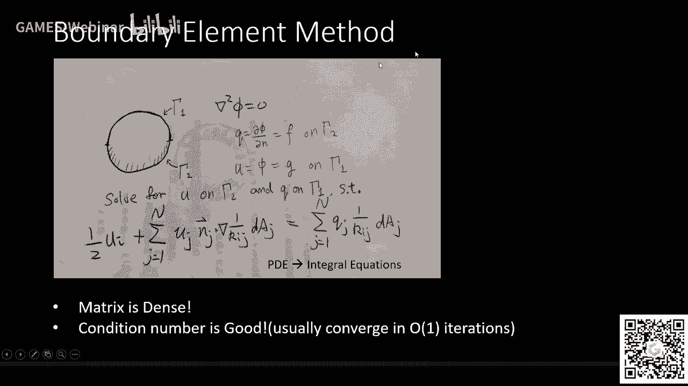

这些快速学习方法还是挺有难度的，我觉得他的idea应该还好。

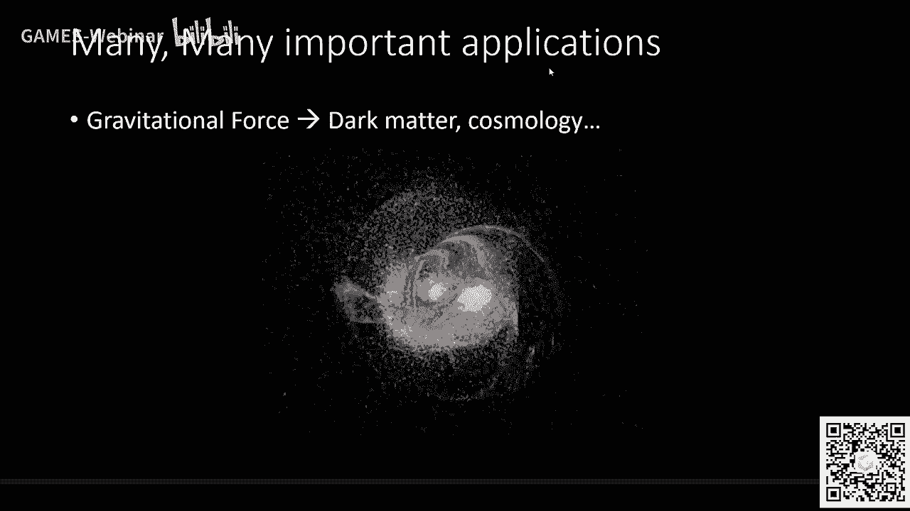

和mod其实差不多，但是你如果真的要实现它还是很难，理想情况下，我应该写一个这个，但是我看到他有什么m t m m t l l t l l t。

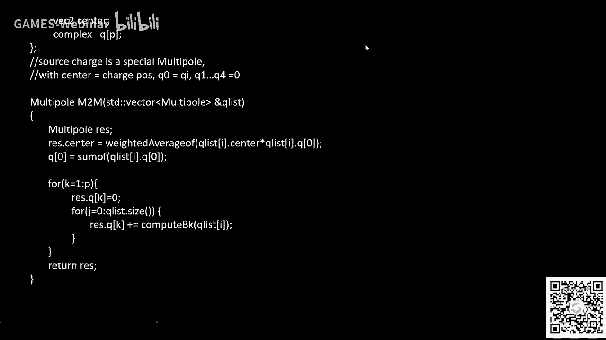

p p two p这些加起来实在是太麻烦了，而且很多各种常数啊，这些百米可以分享100，太会写，对三维的就更恶心，三维的你要去看一下那个公司都想上吊，那个那些在呃。

那spherical harmonic expansion去展开了，我靠那还要做rotation，就是三维在做l to l，还是做m two l那个transform的时候，为了加快它的一个计算量啊。

两个spherical harmonic expansion，先做一个对齐，先做一个那个旋转，使它对齐到半径方向，使它对齐到半径，然后再去做一个那个转换，就会那个系数就会更快，不然的话会慢一点。

就有很多像这样的那个很恶心，我觉得所以我说我是真的觉得差值应该是个好。

好，对对对，就是插值方法说不定会让他减少很多，但是m t m这些还是得做的呀。

因为很多是m two l就不做了，m two l不做了，只要做m two m就行，意思就是m t m还得做l dl不用做了，对对对对对。

ok那那我们就再次感谢一下星星师兄。

给我们分享的这个内容，我觉得真的非常的质量非常高。

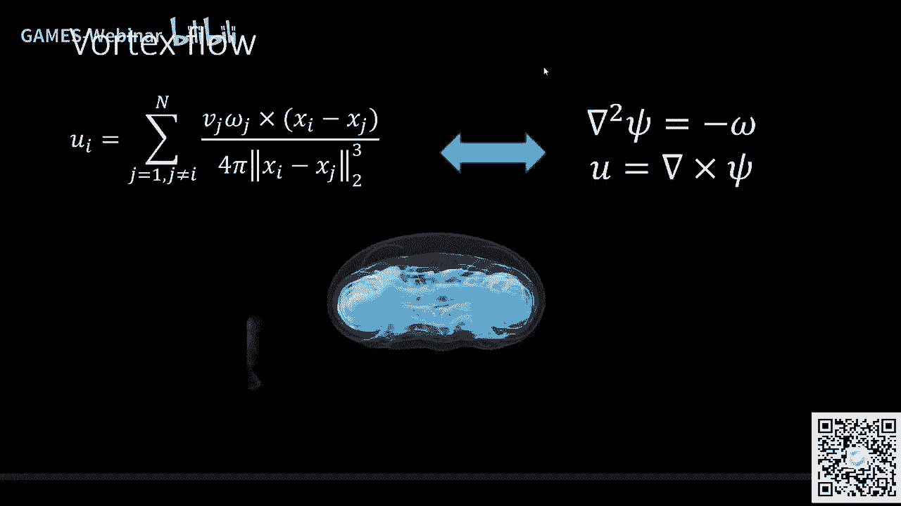

而且非常硬核，从这个手写的pp就可以看出来。

真的是在百忙之中给我们来抽空讲这么一讲，真的非常不容易。

再次感谢感谢，ok那么我们就能保持以后的沟通嗯。

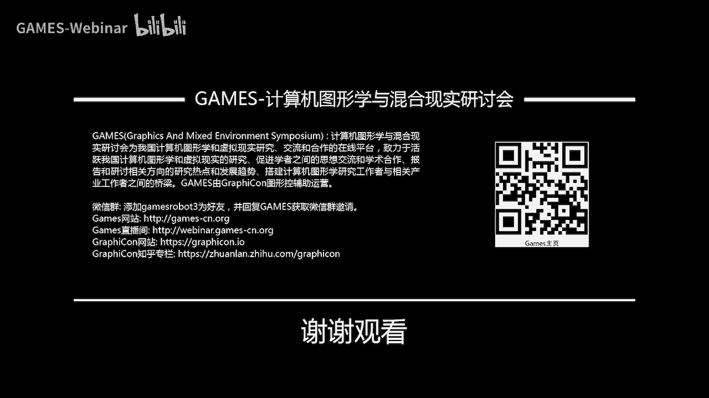