# GAMES201：高级物理引擎实战指南2020 - P7：Lecture 7 混合欧拉-拉格朗日视角（1） - GAMES-Webinar - BV1ZK411H7Hc

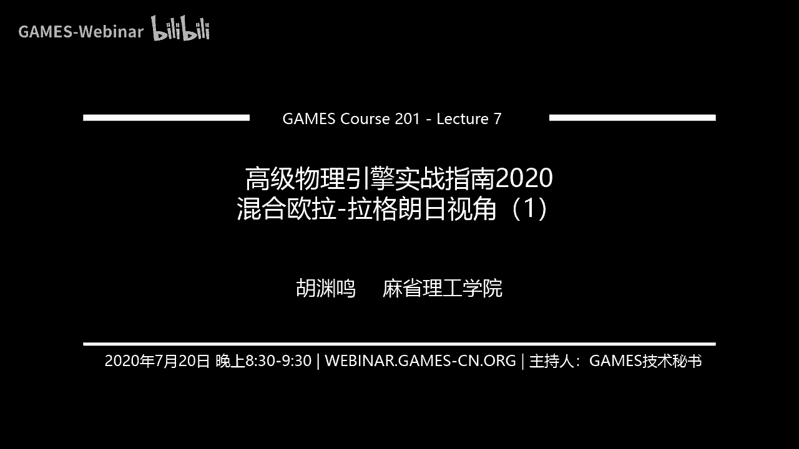

好那我们正式开始嗯，今天我们来讲一讲混合欧拉拉冈人的视角，而这个是一个听起来很复杂，其实非常非常简单的话题，我们这一讲啊，其实没有任何公式啊，这样非常好，所以我直接都用keynote做slides。

没有用雷tag呃，下一讲我们会讲一些讲一讲这个背后的理论，这一讲我们就专门讲他的呃高层的一些想法。

今天呢我们主要讲一讲，整个欧拉拉格人视角的一个overview，然后啊我们具体介绍一些例子，遗留格式，比如说particle excel，fm。

particle excel和polynomial particle excel，呃，他们分别简称pick a pic，polypc，这三个pig方法是中医学里面非常非常常用的，混合欧拉拉格尔方法。

然后还有一类方法呢叫做flip，flip，其实也非常非常常用，今天我们呃除了讲这几个呢，我们最后还会讲一讲m p m，然后下一讲呢我们来讲m p m的理论和实践。

以及m p m里面的这个constitute model，好像中文叫本构模型，然后我们会讲pm里面的拉格朗日历，以及影视，m p m时间积分和一些高级的采集feature，这是下一周的内容。

这周呢我们就讲一讲一些比较基本的内容，好我们先来回顾一下什么是拉克人视角，什么是欧拉视角，他们其实是连续介质的两种视角对吧，那在拉杆人视角里面呢，你想想呃，你可以把自己想象成一个随随波逐流的小船，对吧。

呃你每时每刻都在问自己，我的位置和速度是啥，你是随着你模拟的材料一起移动，这个就是拉格尔视角，一般来说在拉杆视角里面，大家喜欢用party，但并不是拉格尔视角里面就一定就是party go。

还记得我们之前的有很多有限元的模拟，它也是拉格尔视角对吧，但是它就是用的是一个flash，ok那么欧拉视角呢，他和拉格尔视角是不一样的，欧拉视角里面的这些所谓的传感器，或者你自己的观察的位置。

它是从来不移动的，然后你每时每刻都在问自己另外一个问题，这个问题是对于我自己这个位置经过的材料，它的速度是啥对吧，那这个就是拉格尔视角，其实还是非常容易理解的，你可以认为它就是一些插在水里面的桩子。

如果你在模拟这个水的话，这个桩子是从来不移动的，这个克拉管视角是形成了鲜明的对比，还记得那句话吗，呃拉港人视角是随波逐流，在统计学里面，大家两个都经常使用纯拉格朗视角。

和纯呃欧拉视角都是非常常用的模拟方法，在拉格朗的视角里面，大家一般来说会用particle，然后在欧拉视角里面，大家一般会用一个grade，或者用一个mesh，那拉冈伦视角里面也可以用mesh。

也可以用，但是相对来说比较少一些，拉格尔视角里面典型的一个呃，一系列方法是基于粒子的方法，比如说s p h啊，然后position based dynamics，里面很多东西都是用八个人视角来做的。

比如说你看左边这个是nvidia做了一个工作，他们所有东西全部都是用例子来表示的，你可以看到拉格伦视角它的很大的一个好处，就是它用粒子来表示以后，它可以表示出各种各样的呃形状。

然后各种各样的材料也可以用这个来表示，欧拉视角呢，这边右边是一个很经典的一篇烟雾模拟论文，也快有20年了，他是用一个背景网格来表示，这个厂里面的速度和density，这个烟的浓度之类的。

各种物理属性都是在纯grade上面去表示，没有粒子，那么很多同学自然要问，到底拉格朗视角和欧拉视角哪一个更好呢，那么一般说到这种问题啊，我们都得先定一个标准对吧。

嗯那有好几个key facturers是关键因素，我们得去考虑，那其实我们在这边就是在呃define，什么叫better，better有好多种层面对吧，如果一个人跟你说，这个算法每个层面都好。

那你可能得想一想他是不是在忽悠你，因为很少有这样的算法，一般算法也就是在几个层面比较好，你要根据具体的情况来选择使用算法，真正的在每一个层面都比较好的算法，是非常非常少见的。

ok那么我们这边要考虑哪一个更好的时候，要考虑哪些因素呢，首先我们要考虑的是物理量的守恒对吧，你这个模拟的方法你至少得实现动量守恒，然后在要求高一点，可能得角动量守恒对吧。

那你还可能得考虑你的体积是不是守恒，如果你在模拟的是incompressible的东西的话，比如说你在模拟嗯不可压缩的流体，那你希望它的体积能够守恒，然后你还希望它的能量能守恒。

比如说你这个机械能不守恒，然后你别看这几个守恒量看起来非常tribute，但其实你真正的要把它做到的话，还是非常不容易的，你很可能设计一个scheme，自己弄着弄着，你发现诶好像角动量不守恒了。

然后呃一般来说减重量不守恒，很少来比较少，是爆炸的情况，一般来说是慢慢慢慢就没了啊，这个其实和能量的耗散其实也非常相关，那接下来呢我们就要考虑它的性能性能，在现代计算机体系结构上面的性能。

基本上就是两个factor，一个是parallem，一个是quality，你这个方法容易不容易并行，然后这是计算上面呃，访存上面是你的这个算法，在访问内存的时候。

是不是有比较好的special和这个temporal locality，它的时间和空间的局部性是不是好，因为在当前的计算机体系结构上面，你的flop就是你的这个浮点数计算，是一个非常廉价的东西。

真正昂贵的，不管是从时钟周期还是从能量上来讲，都是你从主内存移动到寄存器，这个移动内存或者叫保存的过程，所以考虑paralysm和locality，你得嗯和当前计算机体系结构进行结合。

然后来考虑这样才能达到一个比较高的性能，最后呢你可能还得考虑考虑计算实现的复杂性，对吧，你这个算法有可能各方面都好，但是就是实现起来太复杂了，没人能正确实现出来，你别笑啊，其实有很多算法都是这样。

他好像呃看起来非常简单，你真正要实现起来还是非常非常难的，不是所有的算法都能被你，99行或者88行给实现是吧，当你这个复杂程度高了以后，很有可能复杂的程度高以后，他就不守恒了，或者性格就变低了。

为什么呢，为什么不守恒了，也没人能实现对，那当然就不守恒了，为什么性能变低了，因为你算法变复杂以后，你要去优化它就非常非常难啊，你随便你找一个简单的算法，你教给我，我给你重写一遍，快十倍。

一般都不成问题，但是你如果给我一个非常非常复杂的算法，那我就要考虑一下我要不要帮你做这个事情，因为这工作量可能成本太高了对吧，我就呃即使一个非常擅长优化的人，他可能也不愿意花这个时间去帮你优化。

因为太复杂了，ok那么讲完了这么多呀，我们定义好的一个标准，接下来我们来看一看，我们的混合欧拉拉格尔方法，为什么我们要用混合欧拉拉梗式方法呢，当然是因为我们会让他们希望，让它变得better对吧。

让它变得更好，那我们想想看，在一个fluid solver里面，通常我们有两个component，对大家还记得吗，如果是一个incompressible fluid solver的话，一般就两部对吧。

一个是the action，一个是projection，action，就是说你要去移动你的流体的这个场，projection是什么呢，projection是你的速度长，如果说有散度分量的话。

我希望把这个散度分量给他投影掉，也就是说我希望去enforce他的incompressibility，我希望去满足它的不可压缩性，大家在之前的实现中应该逐渐也发现呃。

action和projection系呃，喜欢的表示其实是不一样的，欧拉网格呢就特别擅长projection，为什么你在欧拉网格上面还记得吗，在欧拉网格上面，如果我们用一个均匀网格的话。

那很容易district，还记得我们的五点播送stl吗，对吧，就五点泊松的模板其实就是中间是二维，里面是中间是-4，上下左右各是一，或者你取一个负号，反过来也全部都没有关系。

均匀网格上面聊起离散拉普拉斯算子，是非常非常容易的，同时呢你如果对于一个网格上的节点，你要去查找他的邻居也非常容易对吧，那你这个在内存里面都是均匀排布好的，你只要呃比如说你如果是i g的话。

那你上面的就是i j减一下，面就是i j加一对吧，这个其实是非常容易实现，neighborhood，look up，非常容易实现，然后呢你如果要去做preconditioner。

由于你的结构是一个均匀的网格，这边你要做precondition也非常非常容易，很容易你就可以上一个geometric multic grade，这个几何多数网格法去做preconditioning。

这样你收敛也会非常快，所以你会看到欧拉网格它其实在做projection的时候，它有非常非常多的优势，但是它有一个很大的缺点是什么，他在做the advection的时候很容易出问题。

还记得我们之前呃讲了好几种vection的方法对吧，不管你是用sama runner也好，不管你是用呃micromic或者b p c c也好，呃你可能有一些方法比另外一些方法是好一点。

但是他总改变不了它的数值耗散的问题，可以看到我们右边这两个图，假设我们一开始的时候，这个太极图标是这样，当他转了几圈以后，自己往往就会变得非常的模糊，他会丢掉能量和几何上面的细节。

这个就在模拟的时候会非常的不尽人意对吧，因为你模拟的模拟人，你这个能量就跑了，跑没了，那这个就呃在流体魔力里面，往往这个导致的结果就是说你的呃，流体看起来非常非常的黏。

或者说一般大家叫做two biscu，它的联性太高了，然后同时呢你可能有一只，一开始是一个兔子形状，你这个模拟就模拟它就变得越来越糊，然后他就不知道变成一个什么形状，最后可能就变成一团球了。

那这个就呃看起来效果就不是很好，当然你如果说你要考虑准确性的话，那准确性也不好，ok那么刚才讲的是欧拉网格，接下来呢我们就讲一讲拉格朗的例子，那么粒子它非常非常擅长一流对吧，我要移动一个例子。

或者只要干啥，我只要把他的位置加上dt乘上速度，或者用一些更高级的格式，我就可以简简单单把这个物理量在空间中移动，同时呢他或许还会非常呃conservative，比如说你如果把质量track。

用例子去track你的质量，那你的例子由于你从从头到尾它都不生不灭，所以你的质量自动就是守恒的，动量呢你也很容易做到守恒对吧，那如果你用规的话，那你移动以后，你可能得做一些额外操作，才能保证动量守恒。

这个是它的好处，它非常非常擅长，但是你如果在例子上面做projection，那你这个就非常头疼了，为什么呢，因为你粒子在空间中的分布啊，你的呃它是不规则，他可能你中间有一个例子。

那你怎么定义他左边的例子呢，它左边可能有好几个例子，你很难定义清楚，他要离散化，它就非常的tricky，之前哦，我们很多同学实现s p h里面这个shape function啊。

这个叫kernel function，它结果好多好多种变种，为了在粒子上面能够实现离散化，这个实现起来还是有点头疼，同时呢你要去找你的邻居，你要去apply standal的话，你得找你的邻居对吧。

那你的查找邻居这个过程也非常非常的复杂呃，一般来说大家都要用一些比较复杂的数据结构，比如说一些hash reen，或者一些呃，各种各样更fancy的数据结构来实现邻居的查找。

一般在纯particle的方法里面，邻居的查找以及在邻居上的操作就是它的瓶颈，所以例子它并不是真正擅长，projection的一种表示方式，那么问题来了。

既然alerin green欧拉网格擅长projection，例子擅长the action，我们有没有一种方法能够把两个表示各取其长，然后又能避免其短，把他们smart combine。

就我们把他们聪明的结合在一起呢，答案是肯定的，这个就牵扯到我们今天的呃，混合欧拉拉格式方法，既然我们要做到科举学长，那我们得两个表示都得有对吧，那么一般来说呢，在混合欧拉拉格人方法里面。

他的欧拉grade和拉格朗日particle，他们并不是同等地位的，一般来说大家是呃，把拉格尔的例子作为一等公民，欧拉网格作为二等公民，为什么呢，因为你大部分信息啊，主要还是存在拉等人的例子上面。

the grid呢一般只是一个附属的，用来计算中间结果的东西，ok，那么明确了拉格的例子和欧拉网格的地位以后，我们呃就可以设计整个算法，首先呢我们有一些拉杆的例子对吧，它存所有的状态。

然后我们要一般来说在这一切方法里面，它的套路都是第一步，我们先做particle to retransfer，我把网呃例子上面的数据传输到网格上。

这一般大家叫做p t g particle to grid，简称p g，那么做完p to g以后啊，你的网格上面就有一些物理的信息对吧，那我们在网格上面就可以做一些grade的operation。

网格操作，这些great operation有一般有啥呢，一般有呃pressure projection，你希望去呃把你的呃，速度的散度分量给他投影掉，去enforce你的速度的无伞或者不可压缩性。

也有可能在grade上面去做一下boundary condition，但boundary condition也可以在party上面做啊。

我们这边只是说grade上面的boundary condition，边界条件，然后gre上面一坨操作给他做完了，然后我们就可以做great to particle transfer。

我们再把信息在gre上面走了一圈以后，我们再把它重新拿回来，然后这样我们就又把信息到了particle上面，最后呢我们在particle上面做一些更新，包括移动我们的particle。

然后或者呃更新材料的一些constitute model之类的，比如说更新deformation，gredient，更新它的形变梯度以及更新它的体积啊，一些各种其他的属性。

这个其实就是整个混合欧拉拉格尔方法的呃，这个套路其实还是比较清晰的，他就是有既有欧拉表示，有拉格朗表示，我们用transfer方法，把信息在两个表示之间来回倒，那么这个来回倒的过程。

它其实也会引入一系列的问题，包括你来回倒会导致信息的损失，来回倒会导致计算量变大之类的，各种各样的问题，我们在后面都会逐一解决。

那么我们现在就来考虑一个最最最简单的呃，混合欧拉公式方法叫做particle excel，一般大家简称pc或者读作pick，那然后这个party insult方法，其实就是一个非常非常古老的一个。

混合欧拉拉控制方法嗯，在pk里面，他的p图记的过程其实也非常非常直观，就是对于每一个particle呀，我把他的各种物理信息给他，传输到它相邻的若干个格点上面，这边我用一个二维的二维的例子。

然后他的呃传输范围是3x3的great node，然后传输的量是什么呢，一般来说最常见的就是速度，偶尔呢大家也会传输温度或者力，m p m里面就会传输力，然后这个是particle degrade。

然后你在gree上面做完一些操作，你得做great to particle对吧，那你其实每一个例子，从周围的3x3这么个网格上面去收集信息，然后收集的一般来说就是呃，速度或者温度之类的物理量。

那么在传输的时候啊，一般大家会遵循一个原则，就是说这个例子并不是均匀对待它的邻居的，或者说呃是不平等的对待他的邻居，当一个邻居节点对他更近的时候，他就会有更多的importance。

这个这个大家应该也能理解，就是说呃距离更近，它的重要性就越高，那么一般来说呢这个importance是怎么定义的呢，大家会用呃一些和函数，或者叫做你把它叫做差值函数，也可以这边叫差值函数。

可能有点奇怪啊，你可以叫它，这个就可以叫它是一个kernel function或者核函数，然后这个核函数呢一般来说大家的搞法是，我在x方向上有一个和函数，在y方向上有一个和函数。

然后这两个核函数呢把它乘积起来以后，就得到在呃每一个格点上它的权重对吧，和函数一般是怎么选择呢，呃和函数其实混合欧拉拉公式方法里面有很多，很多种选择的方式，然后我们今天介绍三种最最最简单的核函数啊。

这个叫b splenko，然后一般来说呢，大家呃最常见的俾斯麦kernel是什么呢，其实你如果做线性的这个差值，就或者这个帐篷函数，它其实就是一个最简单的linear belan。

然后呀你如果希望它长得更smooth一些，你可以用quadratic belin，quadratic belin就是下面这个图里面的红色的线，零点就是这个黄色的线，然后你可以用cube cubic。

它就是下面这个蓝色的线，你可以看到，当这个b splay它的变得复杂程度变高以后，它的计算量其实也稍微变得更高一些，如果你是零六的话，你就要取一个f a b s对吧，你就要取一个浮点数绝对值就可以了。

但quadratic呢你就得算平方操作，cubic就有三次方的操作，然后一般来说大家用linear和quadratic，用的比较多，cubic实际上用的相对来说比较少一些。

因为quetic一般已经足够smooth了，linear有什么问题，linear它不够smooth，然后有的时候会导致你的模拟系统，就不是特别稳定，所以project一般是大家用的最多的。

特别是在m p m里面，在flip里面大家在流体里面大家会用liner，然后后面我们会讲，ok那么我们来看一看particle excel，particle degrade怎么个写法啊。

其实也非常简单了，这边假设我们是用一个sales center grid，也就是说我们的呃，节点呢是放在每一个cell的中心，那这是什么意思，也就是说我的每一个cell，他的顶点的位置是dx的倍数对吧。

比如说这个点就是零零，然后这个点呢是dx 0，这个点呢就是2d x0 ，那么所有的呃，所有的这个node它的位置其实就是必须是多少，加上0。5的dx，比如说这一个note，它就是2。5d x0。

5dx横坐标2。5呃，纵坐标0。5，ok啊，然后如果说我们用这样一个规则规则的情况，我们对于每一个例子啊，对每一个particle in x，这个x就是所有的particle的位置。

那么我们得计算它能够它的3x3的范围里面，左下角的那么一个节点坐标是什么，对吧，那么怎么来算呢，首先我们把节点的位置，我们so sorry，我们把我们把粒子的位置乘上一个inverse dx。

也就是说我们把它除掉dx，那么我们其实就是把物理空间里面的连续的位，置，把它转化到了网格空间里面的呃，这呃这个离散的位置对吧，我们除掉dx粒子，除掉dx，然后减0。5，为什么减0。5呢。

注意我们这边格点的位置是和呃，它的位置一定是0。5，dx他一定一定有这个0。5dx分量在里面，所以我们把这边减到0。5，ok然后呢我们算这个quadratic display的这个权重。

然后这个权重算出来以后，注意我们这边其实是一个所有的这些操作啊，全部都是二维的向量的操作，所以我这边其实算了多少多少个值，我算了六个值对吧，三个值是x分量，三个值是y分量。

然后我们把这个权重x和y方向上的权重，分别算出来以后呀，我们每一举它的范围里面的3x3的node对吧，node就是格点了，然后我们对于每一个note。

每个note它有一个相对于左下角的node的offset对吧，这offset其实就是什么，其实就是ig对吧，我们i j是从0~3呃，呃i从0~3，这个从0~3权重是啥呢，然后i是x方向上的偏移对吧。

那么我们取权重的x分量，然后第一个vector，然后取权重的d y分量比这个vector，然后我们就把x分量上的权重，和y分项的权重给它乘起来，得到了它这个节点的权重，然后呢我们就得把信息。

把这个particle上面的信息给他写到节点上面，注意我们这边每一个节点它存了两种信息，第一种信息是你真的物理量，这个真的物理量就是你的权重乘上你的物理量，给它叠叠加上去，那另外一个信息。

另外一类信息非常非常重要，是什么，就是你的权重只有你的权重，为什么呢，因为你有些地方可能例子多，有的地方可能粒子少，所以呢你就希望去呃把我的权重也算一算，然后这样我们就可以去做。

用权重呢去做一下normalization，这样实现一个守恒啊，这边可能稍微有点需要理解一下，其实就是每一个从每一个节点的视角来看，它的物理量是什么，它的物理量就是周围的particle。

立particle的物理量的加权平均，那你加权平均，你加了权，那你总得把全的和算出来，然后把全除掉吧，总总有一个全的normalization的过程，所以呢他也需要去算一算权重的和，除了物理量的核以外。

ok那么刚才说了，我们这个有一个权重的和，那么其实就是gram这个物理量对吧，然后我们在做完particle degrade以后，我们得做一下great normalization，对吧对吧。

物理量硅上面物质要除以这个权重，首先呢我们得我们只需要处理，权重大于零的grade就可以了，如果说它的权重是零的，这个根本就不在particle能够触及的范围之内，我们也就不需要去处理它。

那么对于所有权大于零的例子呃，这个网格点呢我们就把它的速度除掉，它的权重对吧，这个速度其实是有加权平均，所以我们要除掉甲醛和这个非常容易理解，那么做完那往往你做完normalization以后。

你得去做各种像pressure projection啊，之类的各种操作对吧，那么我们这边就呃忽略掉pressure projection，或者忽略掉我们节点上面受力的计算了，我们直接考虑呃。

grade particle，我们直接考虑它的advation的部分，和刚才其实规律particle刚才其实一模一样对吧，我们还是要算一下它左下角节点的坐标，然后算它的权重，这个和刚才一模一样。

然后我们局部啊有一个叠加变量是这个v，就是accumulate呃，我们把所有的网格上面的v都加圈以后，叠加到局部的这个v的一个和对吧，其实非常容易，这个其实非常容易理解，其实就是每一个例子。

把周围的节点上面的速度给他收集一下，然后重新收集到这个例子上面，那么算出来这个新的v啊，我们就可以呃，我们可以把这个x用我们先移动这个例子，我们把x用上一步时间的v，然后乘上dt该累加上。

当然你这边也用新的v也是可以的，这边其实是一个呃显示欧拉法，那如果用新的v呢，然后我们用新的b去更新粒子的b，这应该还是总体来说是非常直观的，那么刚才我们讲的其实只是particle excel。

那么如果说这个纯particle excel其实没什么用对吧，因为你只是在移动例子，你没有做什么有意义的操作，那么particle excel呢，往往可以和基于网格的泊松求解器联合起来。

然后得到一个流体模拟器，ok那么它的这个simulation cycle是长啥样的，其实和刚才非常简单，我们在particle，particle，particle to grad，操作里面。

去把速度从particle transfer到grade上面，一般这个这一步大家会用scatter，然后great normalization，然后呢我们在规则规则上面去解它的pressure。

解完pressure以后呢，我们把这个呃pressure apply在你的速度场上面，apply到速度场以后，我们用g9 p的操作，从你的速度场去gather information。

然后从网格到粒子上面，那么然后接下来我们可以根据呃，这个无伞的速度场去移动一个例子，注意它这边已经变成了，由于我们有一个pressure projection的过程，这边新的速度上就是无伞的五散。

主要是为了什么，主要是保持体积对吧，你是incompressible fluid，这个时候你移动例子的时候，你可以用2k two three four，你都可以愿意用一个高阶格式的话，会更准确一些。

那么我其实有一个demo，这个是我老早写的，ok我们来看一看这个demo，可以稍微用命一下，啊这个是我老早写了本科手写了，换了1080ti的机器，现在我们可以随随便便就上最高分辨率了。

我们来稍微调一下这个体积，subs steps给它调大哦，我还不能缩小，这边还有个重要的参数，我得调整零，这个其实就是一个particle excel simulation。

注意你做particle excel的时候，你要记得把这个demo里面的flip blending，给它调成零，因为如果你的这个flip blending不是零的话，它会把一些flip的成分也包含进去。

这边我后面会解释什么是flip，ok你可以看到它体积不是很守恒，是因为我们的，这个sober他的迭代次数不够多，这个地方没有用，country ingredients。

这个地方由于为了gpu上面实现方便，我们是用的jo be对吧，大家可以在自己机器上玩一玩，你可以看到这是一个party excel simulation，它是流体的，它总体来说看起来不是特别好。

它看起来会稍微有一点点，如果你特别是比如说，我们把分辨率稍微调低一点，这样它可以，你可以看到它很多的这个涡量啊，它这个旋转这个旋涡转着转着模拟模拟就没了，特别是你分辨率越低的话，它这个数值耗散就会越大。

比如说这个128x128，它看起来非常灵，就像一团糖浆，或者说呃也不能说蜂蜜也分，当然没有蜂蜜这么甜，可能是蜂蜜和水的混合物那种感觉，一般来说大家看到这种情况就会说它过于一点，然后不太会使用。

所以这个party excel有一个什么问题，他这个能量耗散就比较严重，一般大家很少直接使用party incel，那么为什么会有能量耗散呢，我们来看一个最最最简单的。

particle incel的一个demo，这个大家代代码包里面其实是有的，叫pick versus a pig，我们可以来跑一跑，我把它启动一下。

ok这是一个最简单的party political excel的demo，然后我们现在是用的，你看底下有一个scheme，你可以用a来切换这个scheme，那个按a的话，我们还没有讲到apex。

所以我们现在就只考虑这个pk，如果说我们把这个速度场，初始成一个translational的速度，成比如说向右的速度上啊，你会看到它移动的是非常顺畅的，注意啊。

我为了防止它跑出我的simulation demin，我就再把它的速度在边界上面做了一下clamping，把他位置climb clip一下，防止它跑出去，你看到他的如果是平移的话，它是非常顺畅。

但是呢如果说我按一下r，把它的初始速度设置成一个rotation的话，你会你会发现它转着转着它就不转了，这个就非常头疼，因为你在模拟流体里面，你很多时候有这个窝对吧。

他war本质上就是流体在做主tation，那他不转了，你这个就很影响流体的效果，那类似的呢，我还可以把它按，我还可以按键盘上的d把它设置成dation，设置，带雷神以后，它就是一个拉长的效果。

你会发现啊，呃这个dation它也有问题，他这个拉着拉着它就自己就不移动，理想状况下呢，它应该是我可以看大家看一下，理想中的话，这个dation应该是不停的在拉伸自己。

ok那我再切换回我们的这个呃particle in ca skin，那么还有一个sharing这个运动，sharing就是这个剪切的运动，这个剪切的运动它其实也不能保持，他就模拟着模拟着能量就耗散掉了。

那么为什么会有这种现象呢，这个就是你得考虑它的，great to particle的这个传输的时候啊，它就会有这个信息的丢失，为什么呢，假设我们只有一个例子，kernel support是3x3的话。

那么我们有33x3=9个格点，每一个格点上假设我们传输了，我们只传输速度啊，那只传输速度的话，每一个格点上有x分量和y分量的速度对吧，那它其实有18个自由度在格点上面。

但是你的particle上面有几个自由度，你八六上面的速度，你只有x方向，x方向上速度和y方向上速度，你八六上面只有两个自由度，那你这个传输的时候，从18个自由度一下子变成只有两个自由度。

你是不是就得丢失信息对吧，那么怎么样来解决这个问题呢，有两套解决方案，第一套解决方案呢是，我们不要只在例子上面保留两个自由度，我们可以传输一些信息对吧，我们粒子上我们可以在网格上面看一看。

他是不是还有旋转的这个分量啊，它有个角速度，有没有一些sharon的分量，有没有dlational的这个分量，我们都把它记下来，两个方法，这两个都是比较接近的方法，比较呃最近提出来的方法。

epic是2016年seagraph，然后polypg是我没记错的话，2017年的c graph asia，在呃，都是在通信学里面提出来了两套模拟的方法，另外一个呢另外一套搞法呢。

就是说我不transfer更多的信息，但是呢我呃不把所有的信息都通过grade，来传传输，我只通过gree传输一个dota，传输一个dota，这样我们就能在party上面保持一些信息。

ok那么我后面会介绍flip这个方法，那么apex其实直观上来说是非常容易理解的啊，刚才我们看到如果我们只用pc的话，它只有这个constant，它只有这个常量速度场的两个分量对吧。

这是一个v0 和v1 ，我们这边用零表示x分量，一表示y分量，就是呃x轴和y轴，那么实际上我们刚才看到，我们刚才还有很多常见的速度的呃模式，比如说我们有这个c00 ，c0 是什么，是dation。

是x分向上的dational的这个分量，就说它沿着x它的速度不是一样的，你的x越大，它的速度越大，它其实就是在拉伸你的材料对吧，这个叫c00 ，还有c10 ，c10 呢是一个sharing的这个动运动。

它随着你的x的增加，你的y方向的速度会增加，它是一个sharing的一个mod，一般来说大家会叫这些速度场的这个pa叫做mod，然后pk的话其实只有两个mod，apex，它的mode就会更多一些。

ok那么然后还有什么，还有c01 ，c01 什么也是一个sharing，随着y变大，你x方向这个向右的速度也会变大，类似的还有c1 ，c一是y方向上y方向上的dation。

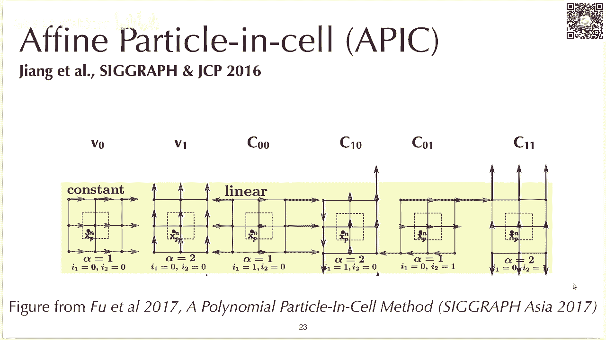

比较复杂，实现起来却异常简单的一个搞法啊，这个他的直观上理解也非常非常容易，我记得我是第一次看到这个apex的论文的时候，我觉得好像非常复杂，另一个时候我大概大三上学期的时候，我记得非常清楚。

因为算法的复杂，这个数学上的复杂程度和实现的复杂程度，反差过大，所以这个算法给我留下了很深刻的印象，呃，大家可以在哔哩哔哩上看一看这个epic的视频，这个强烈推荐这个整个视频啊。

包括这个论文写的都是极其的通俗易懂，而且呃写的可以说这个paper writing以及这个video，它的制作质量都非常非常的高，我强烈建议大家去看一看，你会觉得收获颇丰，即使你不能理解其中的数学。

你光从他的high level idea上面去理解一下也非常好。

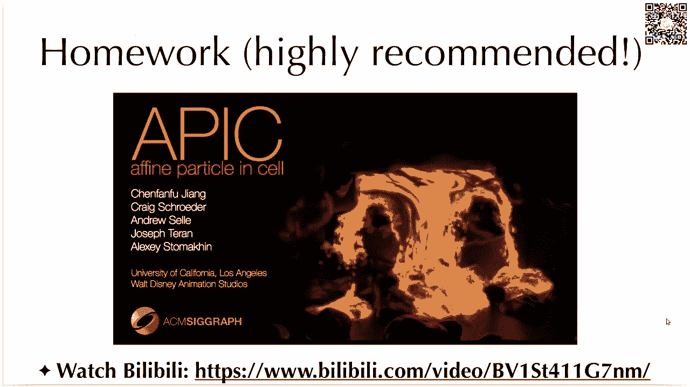

之前我们刚才看了这个旋转的这个mod，用pc的话，它就叫流量都没了对吧，但是apex它的particle，degrade和grade particle都是角动量守恒的，然后这个推导比较复杂。

大家可以去看两篇文章，一篇文章是发在西瓜上面，这个推导，大家有兴趣可以看看，没兴趣的话，你不看也没有关系，大家可能看到刚才很多，可能很多同学在这边会被刚才那个推倒吓到了，说这玩意儿实现起来效果这么好。

然后数学上公式有那么复杂的，实现起来是不是也很复杂，其实完全不是，它实现起来只要三行代码就可以了哈，这个呃可能都不是三行完整代码，就2。5行代码就非常容易呃，我们来看这个p two g和g9 p操作。

那p9 g操作呢，其实和刚才的pk几乎是一模一样对吧，那唯一的一个变化呢就是我这边有一个i fine，这个所谓fm particle excel吗，它有一个f一的速度场。

这个fm速度场我们再从particle，转移到规则的时候呃，除了我们去呃转移particle本身的速度，这个平移速度这个v我们还得转移呢，它的一个局部的这个fi速度，i fi速度场是什么呢。

呃fm入场就是你的这个c乘上d p o s，d p o s是这个节点的位置，减去particle粒子得到一个数值，然后这个是一个矩阵乘法，这个具体的数学上推导，我们会在下一讲里面更深入的讲解。

这一讲呢我们只讲具体实现，因为你如果能实现出来，那你就有更多的兴趣去研究它背后的数学公式，一开始就讲数学公式可能比较枯燥，对于我这种学计算机的人来说，当然你如果是数学公理非常好，你如果是学应用数学。

那你可能会先想想推公式，但我相信大部分同学还是比较喜欢，先把它实现出来，再去讲其中的道理，ok然后这个是p9 g g two p呢g6 p的时候，你得去算一算你的c对吧，那算这个c其实也非常容易。

就算c其实你只要去对于每个节点，你把它对c的贡献给它叠加起来就可以了，那这个地方就有一个一系列系数，然后一个有一个这个是output a，这个是两个向量的外籍，这个具体为什么是这样啊，我们先留一个悬念。

下下一讲再讲，这一讲大家就先接受它，就是这样，ok那么可以看到这个公式，可以这个实现可以说是非常非常简单了，那么我们来跑一跑，刚才我们跑的是pick，我们同样的程序，什么样的效果，还记得吗。

pick我不管给他什么样运用，除了translation pick是好了，这个是还是用pig translation pick是好的，我看看dation pick不行，然后sharing pk也不行。

rotation呢pk更不行了啊，rotation可以认为是dation和sharing，组合起来得到的东西，那么现在我按一下a，你可以看到我这边有一个scheme，你可以用a按a来切换scheme。

我们来按一下a，我们现在把它切换到了epic，那这个时候我们看看translation和pc一样，pick translation也没啥问题对吧，我们来看rotation。

你可以看到他这个rotate起来就非常的，相当的流畅，rotation不会出现pick刚才亮的呃，转着转着就能量耗散掉的情况，我们再看一下pick，我们按一下啊，sorry sorry，我们换一下a。

把它换成pick，你看他就不行了，那sharing呢，sharing也没有，完全没有任何问题，打雷神呢，打雷神也没有任何问题，呃呃我们和这个pick dation比较一下。

pk雷神和能量耗散非常非常之快对吧，因为pick它倾向于去smooth你的输入场，他会不断的把你的速度场去平均化，但是dation呢他们思路上每一点都是不一样的，那你在嗯做pig的时候。

你的速度上就会被逐渐的抹平，抹平了以后它就不动了，好可以看到这个epic是像可以说是效果惊人啊，很多时候大家还不满足，那这个时候就会有一个polypc，polpc是什么个搞法呢。

你可以看到刚才我们节点上其实有三乘，3x2呃，横向三个节点，纵向有三个节点，每个节点两个component是18个自由度，那么polypc，就说我例子上面能不能也用18个自由度。

我例子上面也用18个自由度，那么我从呃假设我只有一个例子，那我从great to的传到粒子上面，就是两个都是18个自由度，如果他们这18个自由度还都是线性相，线性无关的话。

那么我是不是就可以呃做到一个无损的传输，那无损的传输过来，它这个能量的宝石是不是就更好了对吧，这个就是polypc的核心想法，他其实在epic上面更上一层楼，我用更多的mod去呃。

做这个transfer，那这个polyfic，它其实你可以看到，它除了有我们刚才说的这个linear，这个constant和linear这些mod以外，它还有blinear和quatic。

这个实现起来就稍微更复杂一些了，但是它的效果其实也是不错的，这个是一个more more tex的一个模拟呃，你可以看到polypc，它其实就能保持更多的这个mortastic。

然后这边还有一个flip flip，我们会后面再讲，那么flip想法是什么呢，flip他的想法就是我不gather物理量，我们去gather物理量在规的操作上面的增量。

然后我把这个增量gather到particle上面，在gdp的时候，我们只去收集它增量，然后直接把这个增量呃，apply在例子上面，这个增量是啥呢，在你去不可压缩流体的时候。

你增量一般就是这个pressure projection和边界条件对吧，那你做固体模拟的时候，你的增量的就是它裁掉的内里，他的这个内力当然除了内力以外，还有这个边界条件对吧，然后有一些做vfx的同学。

可能会直接用flip来指代一整个solver，那就他可能会觉得flip是一个呃，使用了quin style pressure projection，加上flip。

the vection free ser呃，这个在业界有的时候也会这么说，但是flip它本身只是一个用来遗留的格式，它并不是一个整个的solar，但是有的时候大家会喜欢用flip来说，是整个sol。

这边可能有一点会让人摸不着头脑，所以我额外来讲一讲，这个flip其实也有些历史了，这个flip他是一开始是在jcp，1986年他就提出来了，然后第一次被引入到graphic里面，是2005年。

那么pick flip，他在实现的时候到底有啥区别呢，其实啊区别很小，很pick里其实就是直接从你的呃，下一个时间步的速度场上面gather回来，flip呢他不我刚才说了flip，他不gather呃。

速路上，注意我这边下标是i的话，就是grades，然后下标是p的话就是particle，我去gather什么，我去gather的是新的速度场和旧的速度场的差，我把它gather回来。

然后呢我把它叠加到例子上面，旧的纸上面，那么其实我信息就不完全是从particle degrade，然后归咎particle，对吧，我多了一条particle to。

particle的这个这么个信息路径，这个就能避免很多信息的丢失，如果你纯party to grade，然后graded particle，那你会丢掉很多信息，ok那么flip有什么问题。

flip它就是一般来说有的时候会非常noisy，然后他会看起来噪声非常大，那么pig又过于dissipative，那么有没有什么办法能够取长补短呢，当然有办法啊，这个时候大家就会搞一个叫做flip，0。

99的搞法，什么叫flip 0。99，flip，0。99，就是0。99乘上flip的这个这个操作，加上0。1乘上pc的操作，那你就可以呃，相对来说给flip也引入了一些pick的单品。

pick damping是非常非常大的，你就算只有0。10。01的pick，那你这个单品已经足够了，我们来看看demo，你可以看到，嗯这个ok这个地方有一个flip blending。

这个显示上稍微有点问题，我就如果说我把它调成一，就是纯flip的话，你可以看到它表面是非常noisy，它这个例子就是整个，你可以看到它表面非常的buy对吧，他这个效果不是很好。

这个flip他其实也有很多种实现的方法，很大的一个差别是你做完速度更新以后，你到底是用pick的速度场去移动你的速度，还是用flip的速度场去移动你的速度，这个实现呢是用flip速度上去移动你速度。

它实现出来就会非常非常的easy呃，如果你用pk速度上去移动，速度还会就会稍微好一点，但是这个里面就没有实现另外一种方法，那么我们怎么样让它变得不挪isy的一种搞法，就是你用pg对吧，我把它移动移到零。

你看我用纯pick，那它就完全不同a z，但它也非常的不energetic，他就没有能量，能量很快就耗散掉了，那么我就希望去把它中间来个差值，pick和flip的差值，你可以看到。

这样的话他就没有那么noisy，然后它的也能保持很多能量，这个就其实比较好，一般来说大家呃在用flip的时候，都会blend进去一点，pick这个demo大家可以去玩一玩。

ok那么讲了这么多格式啊，那到底用了用哪一个呢，那么我的建议呢就是如果你刚开始的话，建议你使用epic，为什么呢，因为pc基本上不用pick，它过于呃过于单品了，他就是单品过的。

他这个能量很多模式很快就没了，然后为什么不建议开始用popolypc，或者用flip呢，因为polypc商相对来说实现起来更复杂一些，那么如果要精益求精，你完全可以用polypick。

但是它实现起来稍微稍微复杂一些，然后flip flip的话就实现起来，然后它实现起来会比较noisy，它比较noisy，而且它的实现起来的时候。

你得多开一个grade来去存新的grade和旧的grade，这样你才能算出grade dela对吧，你就要多allocate一个great呃，这个各种feel，所以实现起来稍微复杂一些。

刚才演示的只要三行代码就可以实现了，对于存储非常友好，他不需要去备份你的速度上，同时呢它保持你的angular momentum，看你的角动量是恒的，而且非常stable，然后视觉效果也比较好。

相当于他在各种方法里面站在一个呃，甜点是swiss boss这么一个位置，后面我们会讲m m p m是在干啥哦，有同学有一个问题是particle特别多，内存还是比flip多，他我觉得他意思是。

当你粒子占的内存很多的时候，那网格上的内存是不是就可以忽略不计，那这个完全是讲呃，有的时候粒子上占的内存会很多呃，特别在m p m里面，你的例子会有很多，m p m也是一种混合方法，后面我们会听到。

然后你如果是在模拟流体的时候，你的每一个great cell里面，二维里面你往往会有至少四个例子，三维里面至少有八个例子，所以这样看起来的话，其实例子上用的占用的空间啊，是比规则上面占用空间要多很多的。

所以确实很多时候规则的空间。

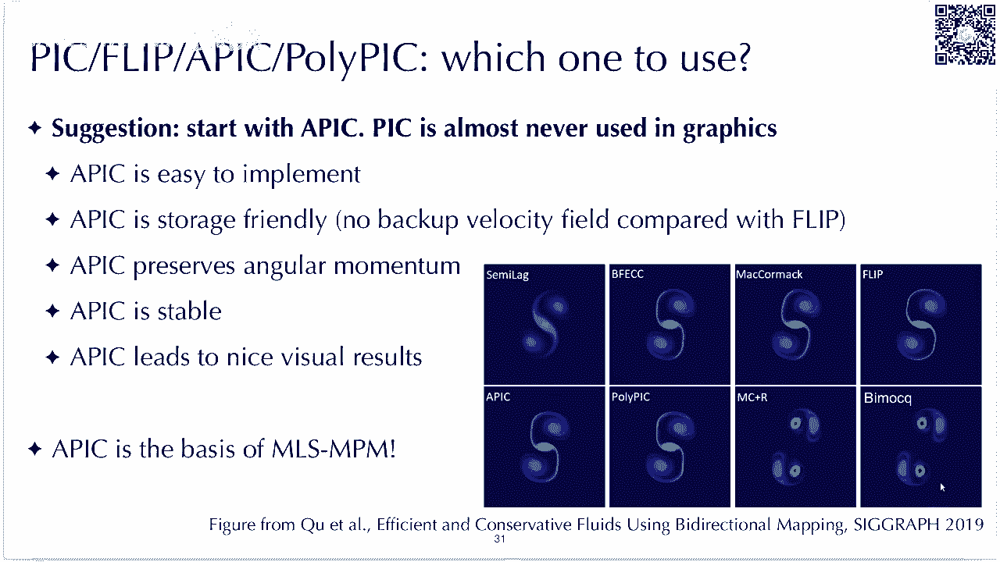

大家是忽略不计的，这个是个很好的问题，那么我们就讲到了npm，终于讲到了npm，这个课最终极的目标其实就是讲npm呃，m p m它是一个混合欧拉朗日模拟的scheme。

之前我们讲scheme嘛都是只有a vection对吧，我们呃你要做projection的，你得用一个别的multique server，或者m g p c g to solve，它的压强。

但是m p m它就是一个stand alone的一个schema，他，拉格尔例子和欧拉网格来完成整个模拟的过程，然后如果既然它是一个整个的simulation，scheme的话。

那你particle它存储的东西就不只是速度，它要存好多好多东西，比如说前面梯度，比如说你的现在的体积，比如说呃，你如果是要模拟一些各种别的材料的话，你可能还得存各种别的物理量。

npm在strap里面是非常呃热门的话题，最近几年是非常火，2020年可能就有至少五篇paper是桨叶片，然后最早的时候他是south ky他们去研究出来的，然后在1996年左右。

最早被大概这个时候被提出来，然后第一次引入到graphics里面，然后在graphic里面发扬光大的是，第一次引入的是2013年，然后最早的时候是用来模拟血，最近几年m p m是非常非常热门的话题。

有好多好多paper都是gb m p m，这个polo上面有很多可以研究的，比如说你polo上面各种材料模型，你可以去研究，可以研究血，然后泡沫，然后沙子啊。

各种各种各样grade上面呢你用规律用什么data structure，可以用space grade，可以用open bdp，你可以用multiple grid，多个grid。

然后你当然也可以用太极来表示它的grid，然后particle degree transfer，这中间transfer刚才也讲了很多，比如说pick a pic，然后polypc还有gmp对吧。

还有moving these quares，后面我们要讲m s m p m就是moving this quest，transfer，还有一个叫compatible fat的格式。

它是其实是用来模拟切割的，以及m p m和钢铁的耦合，这个课程里面我们就不讲cpu。

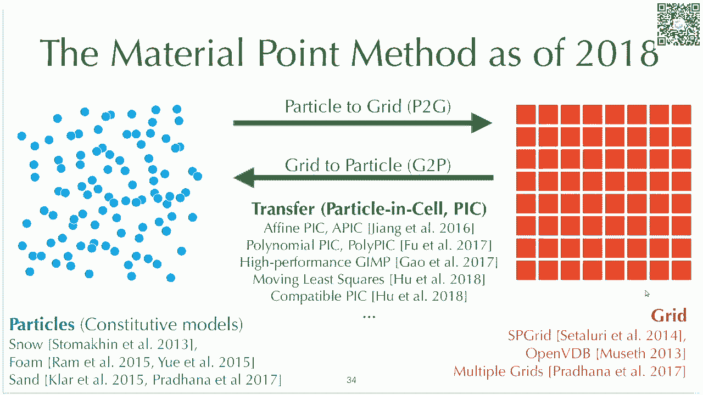

但是m s是一个非常有意思的东西，我们会讲到刚才说到呀，呃最早的时候m p m是按模拟学的，然后这个是迪士尼的这个电影叫冰雪奇缘，然后当时npm还是非常慢的，这个场景模拟了。

据说是模拟了一个星期才模拟出来，当然现在大家有gpu的大家，然后有m s这些各种技巧以后，m p m其实已经可以跑的非常快了，然后再加上太极这个编程语言的加成，所以现在大家可以基本上用88行代码。

写一个能在自己电脑上跑的npm，基本上没有任何难度呃，可以看到它这个整个算法的发展过程，它的复杂程度和性能都是在不停的在被优化的。

mm到底为什么poplar它有很多很多很好的性质，比如说它能自动的把不同的材料给它混合起来，你可以在m p m里面模拟这个立体模拟固体，然后关键的material这个叫颗粒状材料。

比如说沙子或者米饭什么的，都可以用来模拟，然后呢它还可以自动handle collation，自动的字体和字体的碰撞，然后别不同材料之间的碰撞都可以用，然后他的它会有自动的fraction啊。

你一个m p m，你把它拉伸拉的太长了以后，它自动会就会断裂，但是这个fracture并不是数值，并不是一个呃准确的反馈，但是很多时候这个fire也够用了，后面有时间的话，我们可能会提到他有m p m。

也可以和这个连续伤害模型cdm给它整合起来，然后有一套方法叫cd m p，是一个最近的一个比较好的saber paper，后面如果有时间我们也会提到m p m呢，还非常擅长模拟大型变。

这个大型变在graphics里面做，visual effects里面是非常受欢迎的，对吧，你这个一个角色，你总是希望他这个扭来扭去，或者耳朵拖得非常长，或者呃被某一个子弹打了以后发生很大的变形。

就很夸张嘛，大家很喜欢看这样的效果，在动画里面非常有用，然后他既用了呃格子应用的例子，它是一个hybrid欧拉拉格朗日方法，这个欧拉网格啊。

在这边除了其实这边就不是用来做pressure projection，但你也可以做pressure projection，但更多时候大家用欧拉网格是为了去resolve collection。

self collision，然后两个粒子碰撞与碰撞的过程。

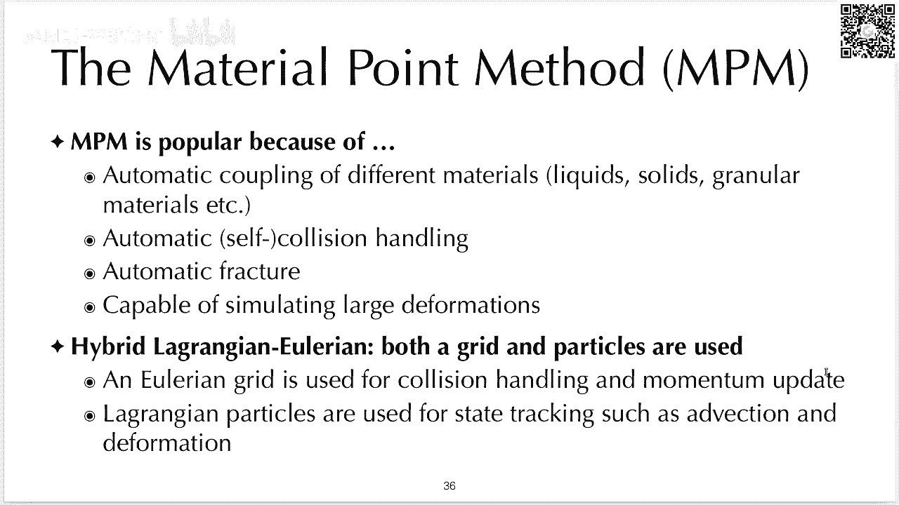

是通过欧拉网格来实现，但是大部分物理量还是存在粒子上面，ok那么我们来看一看最早的时候，npm他的这个simulation cycle是好有好多好多部，他有接近啊，不是接近他，就是有十部。

它是首先你有state，然后你做p图g到grade上面，然后grade上面呢你还得去呃asmate下particle volume，这一步我们现在已经不做了，然后你在龟上面还得算这个算它的受力。

然后各种更新，然后帮边界条件，有可能你还要做implies solver，你得做一个影视的时间积分，这个我们下一讲会讲，然后更新到例子上面，然后这样不断的一个流程，可以说还是比较复杂的，你要实现起来。

当时聊实现m p m还是相当复杂的，我记得我当时实现的时候，可能实现了有个有个一个月，那个时候我还是个本科生，然后什么都不懂这个当然。

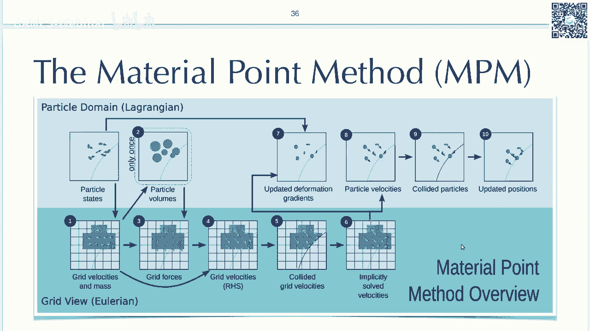

但是这个算法本身就比较复杂，然后这个是他的早期的时候的实现方法呃，这个大家可以去看一看，还是思路比较清晰的，但是步骤比较多，但是今天我们就不讲这个复杂的方法，我们直接讲简单的讲。

我们在2018年的时候提出来这个mm p movie girl，s p，所以呃他是一个其实是一个比较新的方法，因为它的前前置工作，而是在这个科技树的前一个节点，在16年才解锁。

然后我们在2018年是我本科的时候，在蒋老师实验室，可能是一个暑假做的一个一个项目，还是挺有意思的，然后他有什么好处，他需要用的flops就是浮点数操作，是比呃传统m p m要少了1/2。

相当于他快了两倍，因为mp m它是一个computer b操作，所以我们还是希望去降低它的负电数次数的，如果是mei bb，降低复联数也没有意义，没有意义，但它是个computer b。

然后它比传统mp m容易实现很多很多，非常非常容易实现，然后用太极的话，88行代码就可以实现，然后太极里面有好多demo，大家可以跑一跑，我可以给大家演示几个。

今天呢我们会后面会go through一下，这个m88 是怎么实现的，我这边就给大家呃跑一跑这个m p m88 ，m88 ，其实就是一个最简单的m p m fluid solver，对吧。

它是一个比较简单的，只有一个材料，再看一下它是其实效果还是不错的，你用了apex，就它能比较好的保持面的这些窝的这些效果，然后呢太机里面还有一些别的例子，比如说npm 99，那我就直接把这个拖到这了。

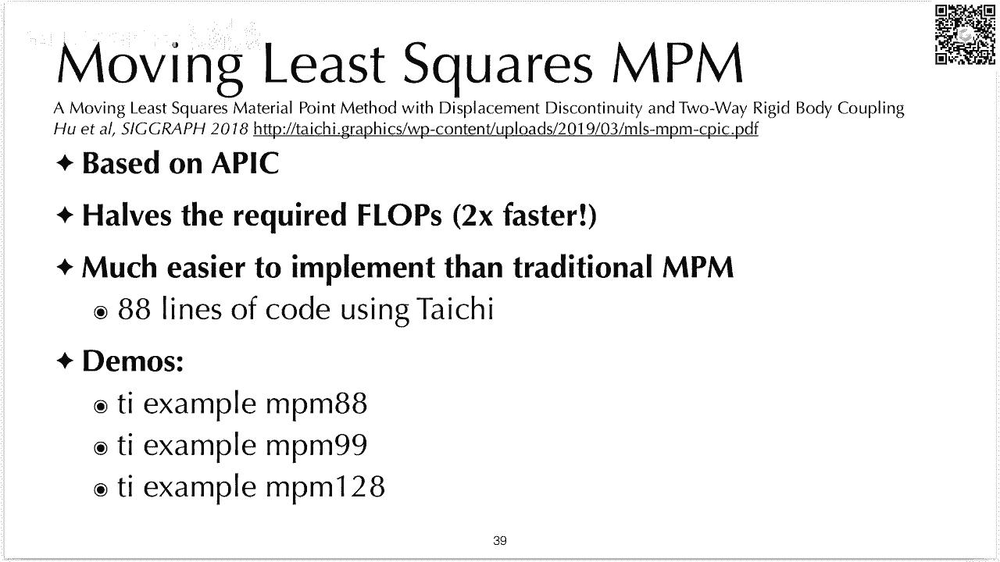

pm 99，99行代码呢，这个里面就有三种材料，有一个这个液体，然后有一个红色的，这个是呃果冻，你可以认为是弹性物体吧，各种都可以，然后嗯白色的是雪，白色的是血，但你如果觉得这个不可交互。

你可以跑m p m21 128，他其实每个代码都差不多，只是加了几条代码，就是更多的材料以及一些用户界面之类的，这个里面你可以用通过拖动鼠标啊，来去操作这些mp例子，这个好像按r k reset。

如果把它不小心全部搞坏了，你可以按一下r reset就可以了，这个是没有重力的，我可以按一下w s d给它加重力，啊反正就是一个几比几几比较好玩的一个demo。

大家可以去跑一跑。

那么接下来我们讲一讲，这个88和代码到底咋实现啊，其实npm啊，和之前讲的apex其实已经非常非常像，m s m p m基本上就是epic，再加上十几行代码去加入npm的一部分。

然后他和之前的party excel啊，这些hybrid alering，a ring的方法其实是非常接近的，你首先要做一个party degree，这个呃把粒子传输到格子上面对吧。

然后再做great operation，然后再做great to particle，其实和之前一模一样，唯一的区别呢就是说你在做p6 g的时候，你可能得算一算每个例子。

它的coaches stress以及它的coaches stress，对于每一个greek note上面的贡献好。

那么我们来看一看具体代码呃，首先我们看这个88行代码的前21行，那其实就是一个很典型的太极代码的前半部分，他前半部分一般是我们去定义一些常数对吧，我们有8192个例子好，当然最重要的请记得要初始化太极。

得指定gpu后端，然后他会在coda或者open gl啊，或者在metal上面运行，然后我们的grade呢，是128x128的，ok然后我们指定一个时间不长dt。

然后每个party呢有一个自己的boom和density，然后质量呢就是volume chandacity对吧，然后我们还有一个bug modules，这边e它就是它的sten，在液体里面就是bug。

modulus，体积模量，ok然后我们来看一看他的subs step kernel，substep knel里面第一部分就是p6 g对吧，你会发现它非常非常像，唯一一个区别就是我多了一个stress。

这个stress是什么呢，stress就是液体被压缩以后，它有一个抵抗压缩的过程，这个它就会在通过一个coaching stress来体现出来，它就会给每一个粒子都会去推开周围的例子。

当然它不能m p m的例子和例子，从来不直接用的，它是通过先推开周围的网格来实现这个操作，那对于这个stress呢，你看我这边除了呃我这边还有刚才还是一样。

epic就是我把每一个例子的transitional velocity，切给它，叠加到grade node上面，然后还有个i fine这这么一个成分，呃，fine里面刚才apex里面的fn就是c。

但是m s m p m里面的f又多，除了c以外还多了一个stress的分量啊，这也要稍微注意一下，它有一个stress分量，那么其实你可以看到m m s m t m是高度，做做最小化改动一个好处是什么。

第一它省计算，因为我可以我这边可以把stress和epic，他这个c给它叠加到一起，统一的用一个fm matrix来来存储，然后这样我在scatter的时候，我就不需要先scattered它的力。

再scatter它的呃，这样我的计算量就少了一倍，然后还更简单对吧，这个地方其实你去看传统m p m，这个地方实现起来还是不容易的，那么接下来啊，great normalization。

这个大家应该都很熟悉了，刚才讲到，我们只需要对质量大于零的地方去做，normalization，这个44行前面其实就是pc epic，polypc前面的normalization，45行以后是啥。

45行以后是边界条件对吧，如果说一个节点它靠近边界太近了，我就得去给把它的速度的某个分量给它设成零，这是最简单的边缘条件，大家可以去理解一下到底在干啥，这边由于时间关系，我就不细讲了。

最后一步是great parle，greg particle和epic其实也非常非常像吧，那其实这边基本上就是完全就是epic，68号之前都完全就是epic，唯一一个区别就是71行，71行。

我们这边更新了一下j j是什么，j是这个粒子的体积，我们怎么更新j呢，一加上dt乘上epic，它的这个c的trace，epic的c的trace是什么，我们来回忆一下a p h。

这个c矩阵到底是什么物理含义，你看到c矩阵还有四项，其中有两项，这个c00 和c11 c0 c一是dation，它的分量对吧，这个dation是c里面，唯一会影响体积变化的两个分量。

因为你如果去share你的材料的话，它体积是不会变化的，当然你只有用这个c00 ，它的你去在横向上去拉他或者c1 ，在纵向上去拉它，它的体积才会变化，然后cd加c一是什么，就是c的trace。

那么c的trace乘上dt，再加上一就是你的呃体积的变化率，那么我们把这个j去乘上这么个体积的变化，就可以得到下下一个实验部的j，那么这边是一个fluid的这个流体的模型。

流体模型里面的力完全就是由j来控制的，那么最后呢就变进到了我们主程序部分，我们得初始化这个例子对吧，然后我们创建一个窗口，在窗口里面不断的去调这个subset，注意你每次做m p m这个cycle之前。

你得去把你的grade上面的速度和质量，都给它设成零，所以啊这就是88行代码哈，其实只有87行代码，但是为了中国人喜欢八嘛，就是我们就叫它88行代码版本就ok了，这88行代码版本还是比较容易实现的。

这个大家每个人应该都可以去尝试实现一下，好那么我们来回顾一下，今天呢我们主要讲了，混合欧拉拉格朗日的这些scheme，那么他的核心思想呢，就是用particle来track你的material去追踪你。

material，你的可能是material上面可能会存位置，可能会存速度，如果你是在做npm的话，你听说上面还会存在formation，用rider呢来去更新你的力的场或者速度的场。

你可能在fluid里面，你会在规则上面做一下quin projection，在你的npm里面，你可以在规则上面去算一下koshi stress，在规则上面的导致了这个内力。

这样我们就有了一个pick这个方法，然后为了减轻pg dissipation，有两套模式对吧，第一种是我们传更多的，传更多的这个information，我们可以加入更多的mod，比如说epic。

epic加入了一个局部的iphine速路上，polypg呢，polpg加入更多的局部的polynomial速度上，另外一种方式呢是用flip flip，不去传输我们的这个所有的物理量。

我们去传输物理量调查对吧，这样就变成了flip这个方法，当然pick和flip可以blender在一起，最后呢我们简单讲了一下，它增加了代表量其实非常非常少。

你是相当于是用particle去存你的deformation information，然后再用epic去传输，你的例子上的各种受力也好，deformation green update也好。

这个理论我们下一讲会提到，大家只要记得m s m p m和epic，真的是非常非常相近了，如果大家想学习更多npm的内容呢，大家可以去看张老师和joe特曼，还有angel sally这些。

其实呃npm最早的五个researcher，他们在sf 2016年上做的这个课程，还是质量非常高的，他们有个cosnow是cosnow的。

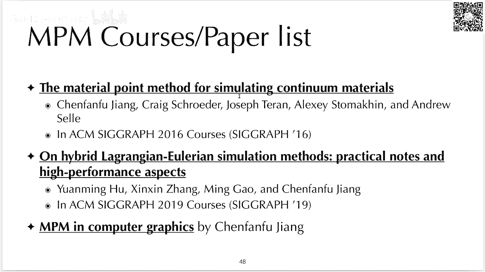

堪称呃最我看过的最well written the course note，它整个公式啊都非常的清晰，大家可以去看一看，其实里面也介绍了各种连续介质力学啊，可以说图文并茂。

学习起来的事还是非常非常不错了。

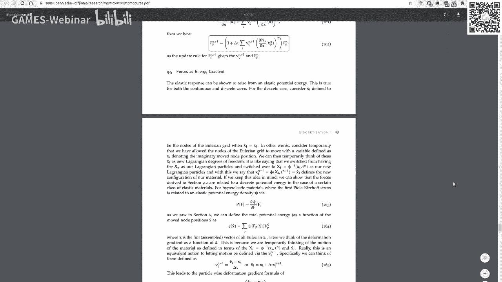

我们最近2019年，我们在surah上面还有一个呃，如果大家对高性能感兴趣，可以去看一看这个高性能的cosnote，然后如果说大家想学更多npm的paper的话，可以看蒋老师的paper list。

这个是一个npm最近的paper，所有的配合者集合在蒋老师的主页上，ok那么今天就到这了，我看看有没有什么问题需要解答的，还是有不少问题的，啊我有同学说p to g的一部分，这个加等于。

因为你不同的例子，可能会同时去accumulate到同一个good node对吧，这边就有个data race，那么这个加等于在太极里面是自动的，omic，这个我们之前其实也提到过呃。

有的版本里面可能会写tian atomic ad，把它显示的写成atomic，但我们这边是用的是自动atomic，在太极里面所有的加等于都是自动的tommy，如果你不要加，不用自动的tommy怎么办。

你就写成规的v，这个等于规律v加上它其实就你不用加，等于你用a等于a加b把它显示写出来，那就是butommy怎么做到不可压缩的啊。

这个是个好问题，这个例子真的不可压缩吗，这个m p m128 88，这个里面它其实是弱可压缩的一个weekly compressible，它不完全是不可压缩的，这边其实是用他的。

你可以看到我刚才提到bug mojs对吧，其实这个是一个可压缩流体啊，但是它看起来不太可压缩，就是这个其实它是可压缩的，那它怎么保持体积的呢。

是因为我们通过维持了维护了这个j，然后这个j你可以看到它，j这边会算出一个stress，他这个stress是jp减去一，然后乘上了一坨系数对吧，呃当你的j小于一的时候。

它就会有一个推开周围格点上速度的这个题，至大于一的时候，它就会有嗯拉近周围割裂上速度的这么一个力，所以它其实是通过j来保持自己的体积。

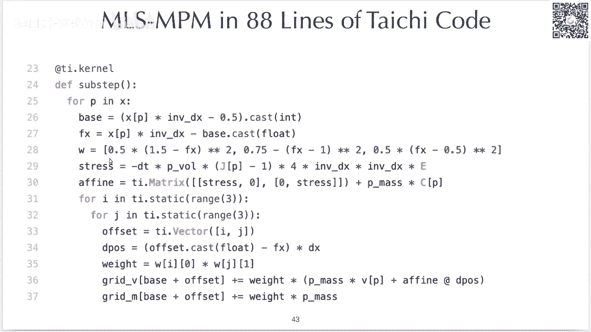

