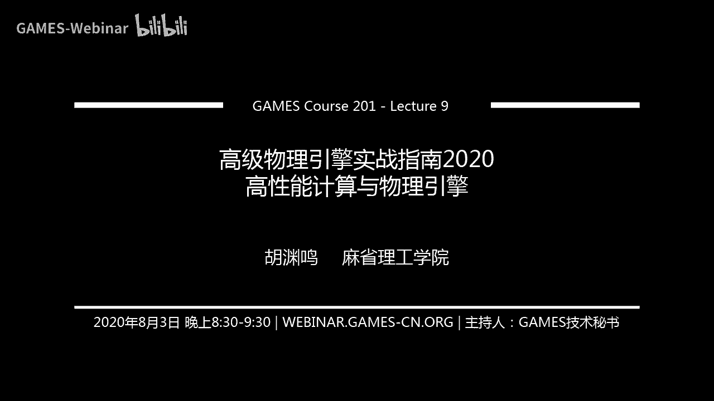
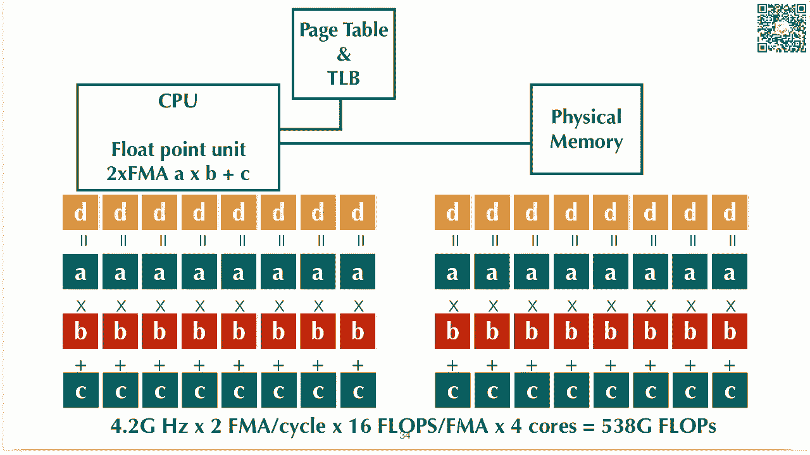
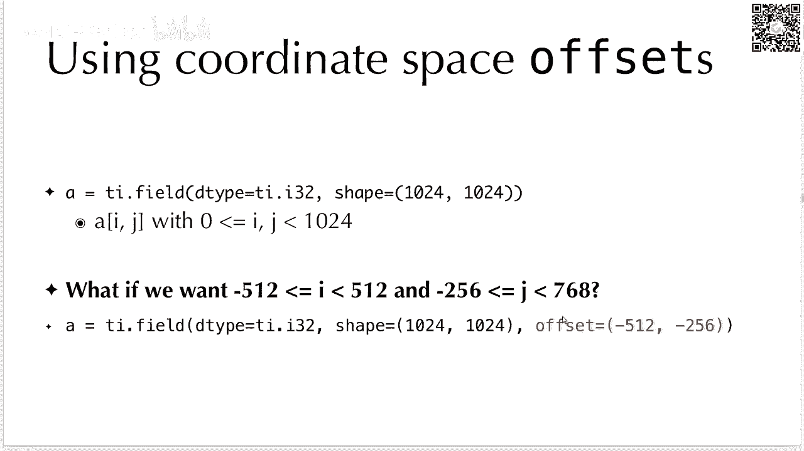
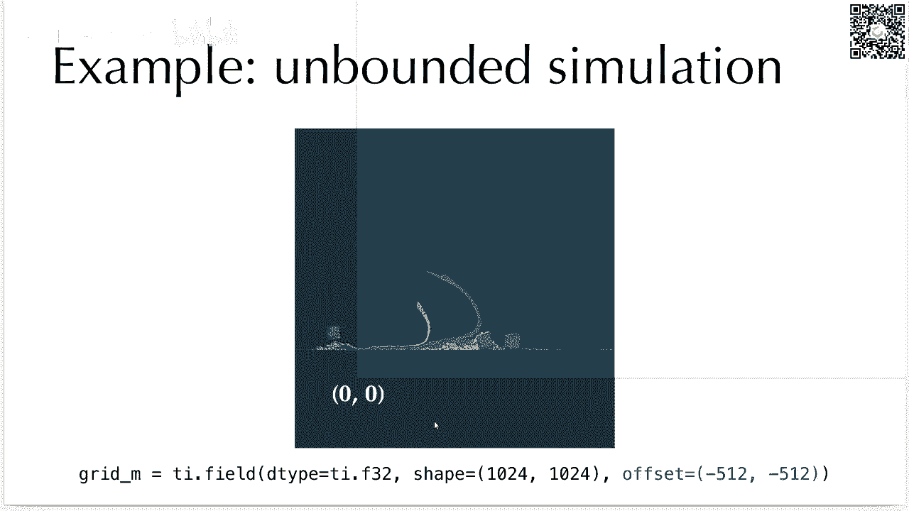
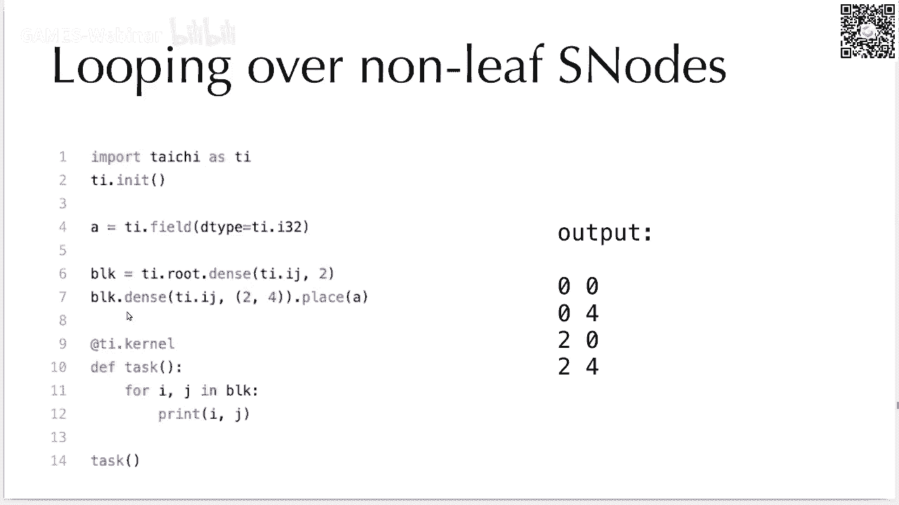
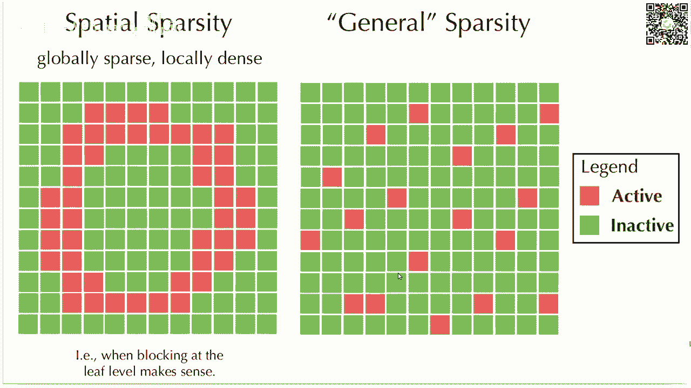
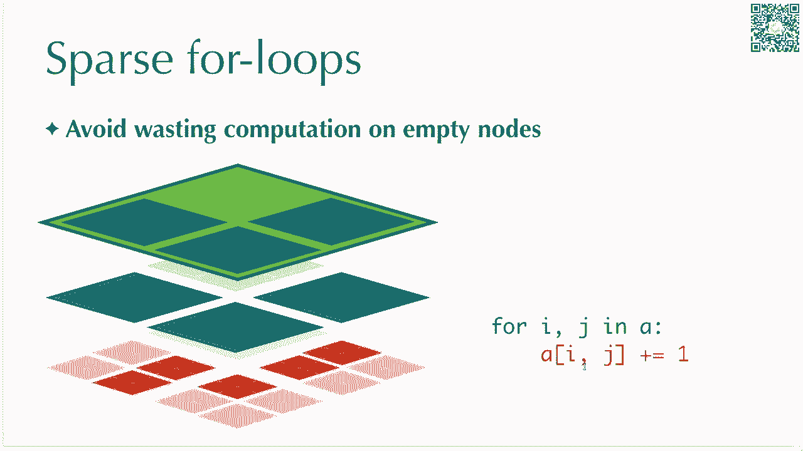
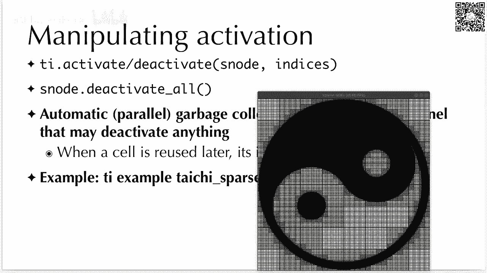
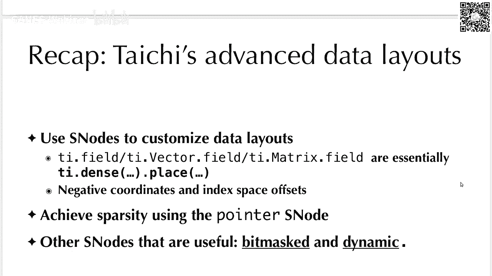
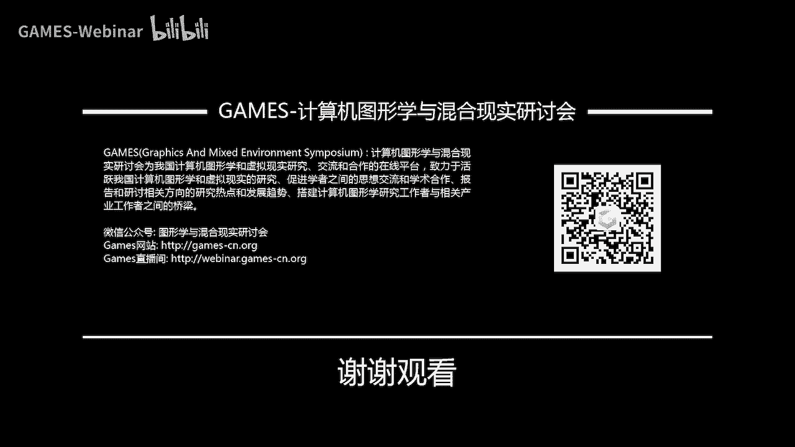

# GAMES201：高级物理引擎实战指南2020 - P9：Lecture 9 高性能计算与物理引擎 - GAMES-Webinar - BV1ZK411H7Hc

现在我们开始讲吧，今天我们主要讲一讲高性能物理模拟，嗯这个话题啊其实还是挺有意思的一个话题，为什么呢，因为虽然说这个在计算机图形学里面，大家希望说你这个物理效果要尽可能真实，会牺牲一些速度。

比如说你可能本来能做到实时，你现在想要把它做到呃offline，比如说十秒钟一帧，一分钟一帧，但是其实啊呃即使是十秒钟一帧，一分钟一帧，这也是优化过的结果，你还是必须要通过很多高性能的技巧。

才能让他做到十秒钟一帧，虽然说你做不到实时，但是嗯你要做到，比如说十秒钟一帧也是很，有的时候很有挑战，然后这个后面有很多，其实嗯写高性能物理模拟的一些技巧在后面。

ok那么话不多说，我们就开始讲吧，我们先看一个例子，这个例子是嗯我们应该是2018年的时候，我还有海翔，还有朱柏教授啊，实际上我是在mit刚去，然后做了一个项目，这个项目是很有意思。

他在一个非常大的网格上面去解一个final elements，然后剪完这个final elements，就可以用它解出来的有限元的解去做图片优化，然后这个网格你可以看到，它分辨率是非常非常高的。

它是一个1600x2000，400x3000的一个贝尼网格，这个背景网格呢，它有大概啊，这个数字应该是这个，这个k对应该是110和115亿个，background voxels。

就是它整个网格有这么多个vocs，但里面其中我们用了多少个，我们用了大概11个呃，是11个，这个实际上是有用到的，vocal是这么做，因为你毕竟这个优化的形状，在你整个空间里面只占它的一小部分对吧。

然后你可以看到我们把分辨率把它推上去以后，就可以得到一个效果，非常精细的优化出来的一个结果，这个结这样的结果在你啊分辨率非常低的时候，是非常非常难做到，你可以看到这里面呃，其实它是一个鸟嘴的结果。

之前上课你们其实提到过，这还是呃就是说你假设你把它想象成一个鸟嘴，你固定它的这边一端，然后，你要去做的是什么事情，只给你有限的材料，你怎么去填充这个鸟嘴，使得它能够抵抗外部的压力。

ok比如说这边我们给他的啊，我记得当时应该是给他整个这个面上面，整个它的表面都加上一个向内的压力，就是相当于一句要求你优化一个抗压能力，尽可能好的鸟嘴结构，然后这个是非常适合用侧扑优化来做。

其实这个也是非常成熟的技术了，只不过我们把它的分辨率一推到了，非常非常高而已，然后这个分辨率其实在计算机同学里面，之前没有人做到过，然后在应该是在拓扑优化的社区里面，有人做到过这个。

但是他们用超级计算机去做，他们大概用了我记得好像是500台机器，8000个cpu core，然后在一个caster，一个集群上面去做这样的一个，类似数量级的优化，但是我们用在这个工作里面。

我们用了很多啊，计算机通讯里面的加速技巧，其实说白了不是计算机通讯的加速技巧，是高性能计算或者高性能线性代数，数值线性代数里面加速技巧，然后我们可以在一台机器上面就做到呃，11个voxo的有限元求解。

当然你如果当然台机器也不错，那台机器有512g内存，然后有50几个cpu course，当然和一个计算机集群还是有很大差距，所以你可以看到，当我们去进行高性能物理模拟的时候。

我们把这些用到的技巧都考虑上，然后我们这样就可以很大很大的程度上面，提高我们呃这个server性能，然后也可以，相当于是把一台机器当成100台机器来用，一般来说这个优化的效果能达到呃一个数量级。

两个数量级，三个数，三个数量级都是非常正常的，刚才提到啊，即使是你去花了很多功夫，去做各种各样的优化啊，你的这个模拟可能还是会非常的耗时间，比如说你可能一个sp demo可能去可能会消耗你。

比如说好几天的时间去模拟对吧，那这个就不太好，为什么不太好呢，因为首先如果说你这个一个实验，要跑好几天的话，那你这个turn around time就非常非常长。

turn around time是什么意思，就是你把一个实验从setup到它运行结束，这个中间是有一个时间的，往往说你一个simulation，你不可能一次就跑成功的，你可能跑着跑着发现跑了70%。

这次跑了70%，然后auto memory了，然后第二次跑70%，发现里面有一个小地方没有写好，然后整个simulator炸了，你可能第三次跑了，跑完了，然后你就发现好像初始条件设的不太好。

你可能得调一调参数，然后可能最后又跑完了，你会发现可能材料的这个参数有设设的不太行，然后你最后一个simulation可能得跑个四五遍，五六遍，这都非常非常正常，这还算比较少的。

然后你如果去考虑真正的在studio studio里面，用你的simulator的这些artist，然后他们可能会根据导演的需求，来回的不停的去调整，simulation里面各种各样的呃物理参数也好呀。

然后呃初始条件也好呀，然后一些外部的历史的，它物理模拟更加的看起来呃，更加具有艺术性也好啊，各种各样的这些事情，他都会使得你和一个物理模拟呃，从头到尾跑个好几遍，这些都非常正常。

所以说你别看一个物理模拟好像一个simulation，跑了五天，好像也就一个星期吧，但你实际上可能得来来回回折腾就他一个月，这都非常非常正常啊，对当然这个还是人力上面也消耗了。

那更low level一些消耗，可能你还会有一些像呃机器的时间啊，power consumption啊，你这个机器开在那都是要耗电的呀对吧，这些其实都是呃都是消耗。

然后可能你维护这些机器的engineer，你可能也得复查前，那他这个呃大家的时间都是宝贵的，所以把一个simulation要跑的呃，尽可能减少它计算代价，使得它跑得更快还是挺重要的一个事情。

那这边就有一个取舍了嗯，你的simulation的这个performance和quality，就是一个取舍，因为你假设只给你固定的时间，就给你一天时间24个小时，那你的你当然希望他在24个小时之内。

你的粒子数越多越好，或者你的网格精度越多越好，但是这个问题就是说当你的网格精度高了以后，那你的这个性能就会往下掉对吧，你性能往下掉了以后，你的呃你就没有办法去跑那么多呃，你的需要模拟的时间就会变长。

也就是说你没有办法去在给定了一个性能强，你是没有办法去不断的提高你的，提高你的模拟的质量，当你需要提高模拟质量的时候，那你的性能就会下降，所以啊他们就变成一个取舍，就非常讨厌。

那我们今天呢主要考虑各种性能方面的事情，然后当然提高性能有两种方法，第一种方法呢就是说你去用更好的算法，那往往说呃你有更好的算法，是从鉴定意义上的提高性能。

比如说你用quick sword和insertion sort，快速排序和插入排序，然后那它当然会性能会差别很多，一个是n2 跟的，一个是o n平方的对吧，这两个算法它们性能会有本质上的区别。

但是呢呃一般来说当我们去考虑性能的时候，我们已经假设我们已经选择了鉴定意义上面，性能最高这个算法啊，当然我们是呃假设比如说你我们呃去优化之前，假设我们已经用multigrade。

已经用country gradient，已经用这些收敛性非常高的算法，那么在这些收敛性非常高的算法上面，我们还有没有办法去提高它的性能，完全可以，那么这个时候我们就可以用一些呃，更底层的编程技巧。

使得同样的工作，但是你能去执行它更快一些，我们来看一个例子啊，这个是m s m p m，这个应该是2018年的m m p m里面paper，这个paper里面我们有一个列表。

然后它里面有一些性能上面的讨论，这个实际上是比较基础的，m p m和m l m p m它的性能你可以看到啊，我们的based on implementation，是一个2017年的zero paper。

然后他们也做了非常非常顶多底层的优化，然后呢，我们为了证明m s m p m是比以前的classical b，spm p m要快的，我们需要做什么事情，首先我们把baseline reference。

这个参考实现给他拿过来对吧，然后在bench bar上面跑一把这个里面的网格，这个表格里面数字全部都是毫秒数了，和reference比起来呢，我们先重新实现了一遍对吧，这个重新实现了一遍。

发现和他实现的差不多，然后我们同样算法重新实现了一遍，和它差不多，那么我们同样的算法稍微做一下性能优化，我们比他快了七倍，然后啊这个就是你通过编程技巧，你能让它快的速度，但是七倍是算是比较少了。

因为他reference这个实现，它也做了很多性能优化，一般来说你随便找个程序，假设没有太多优化的，你给我过来帮你重写一遍，一般快个十倍，20倍一般是不成问题的，这边七倍是。

因为reference已经做了很heavy的优化了，然后我们还可以让他快七倍，所以你可以看到这个是不是任何算法上的优化，这个就是代码写得好和代码写的差，它的优化，而且啊还不是一个单线程和多线程比。

不是什么cpu和gpu比，就是同样的硬件，同样的多线程，然后去比一个cpu，它性能就可以提高这么多倍，然后我们再看呃，我们优化过的m m p m，在我们优化过的传统m p m基础上。

优化过的m l s m还能再快两倍，所以你可以看到呀，在这个整个优化过程中，我们最终啊快了大概14倍，但是你可以看到，其实嗯大部分时间，大部分的这个优化，其实并不是来自于算法上的提升。

大部分的优化是来自我们做的low level，performance engineering，这个性能工程做的这些底层的呃，性能上的优化，使得我们的算法14倍里面，有七倍是来自于这个啊。

当然如果说你要写paper的话，你不能写我们做底层性能工程师的这个算法，快乐起呗，我们只能在paper里面写呃，但是这个快乐七位，这个在paper里面只是很小很小一段。

因为呃reverse它不会不会这个珍惜这一部分，它不会cherish this part of contribution，他会觉得这部分是messi implementation details。

你要去发paper的话，你还是要流算法上面的，比如说你这部分我们就可以可以，可他用的flops，或者用了memory bandaries更少了一些，所以它快对吧。

这样你在算法上面就是相当于是呃有理可依的，所以你可以看到发paper和实际上写一个可用server，它是他是这个两条两个不同的metric，你这个一篇好的paper，它们不一定使用一个好的。

使用了server就不能发paper，所以这两个一个是工程上面的，一个是学术上面，他的呃贡献的metric是完全完全不一样的，ok所以我们今天讲什么呢，我们今天不讲算法。

我们今天就讲给你一个普通的code，你怎么去做呃，性能工程使得它能快5~20倍，ok那么今天呢我们讲两部分，第一部分是硬件的这个architecture，它的体系结构。

第二部分呢是高级的一些太极编程技巧好，那么开始讲体结构之前，我们先看一下大部分同学脑子里面，对于计算机的概念大概是什么样，这个是monoamarchitecture，是1945年冯诺依曼。

他呃可能是1945年那个时那个年代，大家对于计算机的体系结构的一个呃共识，大概就是这样，你有一个input device，你有一个output device，然后你中间有个cpu。

然后还有个memory，cpu里面有control unit和a lu对吧，然后你相当于cpu在不断的从meme里面fetch数据，然后进行计算，算完了以后呢，再塞回memory里面。

那么你如果再进一步简化，你可以得到这么一个图，那其实你就是相当于只有cpu和memory，那么今天呢我们也确实只考虑cpu和memory，然后外部的设备什么键盘鼠标打印机，我们就不考虑它了。

那你可以看到呀，呃我们把它横过来画，因为后面会比较复杂，当大家一开始是有只有cpu和memory这个发展的，到一定时间以后，大家发现cpu算的很快，但是memory他的ban位跟不上，那怎么办呢。

呃你可以用比较昂贵的设备，这个呃硬件去造一个东西，叫做cash，cash是什么，cash，其实就是快速的memory，它和physical memory比起来，cash大小是相对来说比较小的。

但是呢他访问速度很快，然后physical memory呢他虽然容量很大，但是他的访问速度是比较慢的，cash一般是可能一个cash的里面一个unit，它都是用呃。

大概可能要用六个transistor去build它，所以它其实是比较昂贵的，一个一个这样的一个设备，ok那么早期的开始它其实不是切呃，它在不是像现在的cash一样，现在的cash。

那大家可能从来没有见过cpu cash长什么样，那确实这也不怪大家，因为现在的cash全部塞在cpu里面了，后面我们会讲到，由于cpu上面的transistor，它多余的晶体管。

transistor晶体管了，他这个晶体管越来越多，越来越多，以后，大家发现这个晶体管造计算的uni好像不划算，大家就直接在cpu上面造开始，那么早期的时候你会发现你可以买到一个硬件，叫做开始。

它可以呃插在你的内存和cpu中间的一个地方，插在你主板上，它是一个独立的，这么一个东西啊，但这个是很早很早很早很早以前了，那个时候可能叫cash stick之类的东西，可能是叫缓存棒啊什么的。

呃呃那个上年代久远了，我估计我出生的时候，这个东西已经被淘汰了，ok那么cpu catch和physical memory，那么大家逐渐发现一层cash好像还不太够用，因为我们还是希望有一些数据。

它比较小的话，我们希望它能fit自带一个非常非常小，但是非常非常快的开始里面呃，所以大家又搞出来三层开始，然后呢cash里面又分成了l on cash，l two cash和l three cash。

那么你cpu要访问这些访问内存里的数据，那你的这个相当于你的信号会从cpu先去看一看，这个数据在不在l one开始里面啊，如果在lon cash里面，就直接从lon cash给你返回。

如果不在im cash里面怎么办，你去问l two cash，如果在lt开始里面呢，就从lt开始里面给你返回，那不在lt cash里面呢，去l3 cash，然后l或者l three cash。

如果l three开始也没有，那你就去没member里面去访问了，那么你可以看到它这个cash一层一层的比啊，这个lt cash比l on cash应该是容量更大，然后它的latency也更高。

latency就是说我啊我要访问lt cash的话，我的cpu得等多长时间，一般来说这个数据它大概是l one catch，大概是3~4个clock cycle。

alter cash呢一般就是大概可能是14个clock，cle，就是cpu上面了，然后l free cash，一般就比如说呃42个clock co啊，当然这个和你cpu主频也有关系。

然后到main mary呢，就几百个clock cycle了，所以你可以看到cpu上面呃，他去访问这个每一层的，开始了，他的这个latency还是挺大的。

因为cpu一个clock cycle能做好多好多事情，那如果你你时间全部花在访问内存上面，那这个就比较呃比较影响你的计算，那么除了开始呢，还有一个现在体结构里面。

一般都有hardware level的硬件成呃级别的，对于虚拟内存的virtual memory的support，什么叫对硬件级别，对virtual memory support。

就是说它有一个硬件的page table，然后他的page table也有一个开始，page table是什么呢，page table是把你的虚拟内存map到物理内存。

然后page table由于你所有的方存都需要先走，从虚拟内存到物理内存这个转换，所以说啊你全部都要给page table，page table这个本身可能也比较大。

那你访问page table也有latency，那如果说你每次访问你的cat之前，都去访问一次page table，那你page table啊这个latency就非常非常高了，所以大家怎么办呢。

首先两个事情，第一个给page table也做一个cash，这个叫做t l b全translation，looks like buffer，然后tlb其实也是cash啊，然后第二个优化呢是访问t lb。

和访问你的physical memory，它是其实可以是呃防ptable和访问physical memory，它其实是有一些并行的在里面，所以其实t lb这个东西一般并不会。

大多数情况下只要你没有tlb mess，你一般情况下它是你可以假设它是不存在，这physical memory呃，其实就是你的物理内存，比如说你的你的机器，可能有32gb的内存条呢。

它就是有32gb的物理内存，但是你实际上现在的现代操作系统都有，oversubscribing，它可以过度订阅你的内存，你可以呃，比如说你linux上面，你可以用imap m m a p这个指令去啊。

映射去开启虚拟内存，然后你在虚拟内存上面它是allocate on demand，每一个配以配置为单位，你每次摸一个page，他才会帮你allocate一下，这有什么好处。

这个好处在于你不同程序之间的地址空间，通过虚拟内存进行了分离啊，这个其实还是挺有好处的，我记得有个经典的笑话，就比如说以前早期的时候，各个地址空间上面是没有分离的，也就是说你写一个程序。

你如果说一个程序它有一不小心写了个数字，它就buffer overflow了，或者你的数字这个访问越界了，它会导致什么呢，它会写到另外一个程序啊，这个就有的时候有意思了，你写一个c加加程序。

他明明没有去，他只是做一些计算，一般用overflow了，你会发现运行这个程序的时候，你打印机开始work，那为什么呢，因为你的这个cd i程序它没有地质保护，那你写着写着。

你把它写到了打印机的打印的buffer里面，这个打印buffer，可能是另外一个进程里面的一个buffer，然后你写进去以后呢，啊你的打印机发现诶，好像我的buffer里面有些东西进来。

我得开始打印了啊，这就非常有意思，就是你没有内存保护的时候，你的程序之间就会互相干扰，还有一个更经典的例子，这个例子我自己也遇到过，以前gpu上面好像早期的gpu，我记得是可能10年前的gpu，它是呃。

应该不是10年前，可能5年前呃，67年前那个时候，那个时候gpu是没有内存保护的，这会导致什么，你如果写一个kda的程序，你表现类似访问越界了，你会发现你的数组会直接写到你的屏幕上。

然后他就跟着你的屏幕显示出来了啊，你会发现你的程序coda的程序写的不好，会把你屏幕显花屏，那为什么呢，因为你的程序他写着写着写着，你的写到你的free buffer里面的free buffer呢。

它逐渐呃后面显示器刷新的时候，就会跟着你显示器刷新到你的屏幕上面，ok所以啊嗯这个就是地址空间分离，如果部分你会带来一些问题，那他现在分离了以后，用virtual address系操作系统。

进行这个地址空间的这个保护以后，你其实很多事情安全性就更高了一些，ok啊那么当然这个东西也越来越复杂，就复杂了以后会有什么问题，复杂的任何东西搞复杂了以后都是不好的，但是大家又不得不把它搞得更复杂。

比如说你啊cpu现在这么复杂以后，你可能很多时候有有这个cp的存在，有这个t l b的存在，你可能会很容易去进行，对他进行一些特性的攻击，之前intel cpu有一个mtdown和spectrum。

这两个啊漏洞，其实也是一些东西被设计的更复杂的产物，ok所以你可以看到任何事情它进展的同时，它往往会变得更复杂，但是大家都会希望让它变得尽可能简单的，更复杂，希望复杂程度还是更低一些，ok。

ok那么刚才提到呀，这么现在cpu有这么多层的cash，然后这些cash早就不是cpu chip外面的部分，那现在cpu有很多的transistor对吧，他现在基本上摩尔定律还是勉强。

你如果看他的cpu上面喘息素的数目的话，他还是能够隔个23年没有18个月反应反应，你可能23年还是勉强的发言，最近有最近有放缓的趋势，但是cpu上面它其实现在这是一个cpu chip。

然后他的呃他的这个是应该叫呃，他的带的他的一个d i e，就是他这个我也不知道中文是什么，反正就是他带的这个一个照片了，你可以看到里面其实大部分都不是cpu core，是他现在我们把这个gpu给他踢了。

把这个cs m l o给他踢了，你会发现它这个蓝色部分是cpu core，然后它其其中l three cash这样的，你的这个check了很多很多的空间对吧，然后我们在zoom到一个cpu cor里面。

我们看一看这一个cpu cook，你看到这是一个cpu core，那么这这么一个cpu core里面嗯，你当你再仔细用命去看的时候，你会发现它里面即使一个cpu core里面，它很多空间很多。

transistor是用来做l one cash啊，这个是l one data cash和l望这个instruction cash，这个一般大家用一个dollar表示cash。

因为c a c h e和c a s h，他们的发音都是cash，所以大家就用这个cash来指代你的缓存了，你可以看到lone一开始l l one instruction，一般来说intel上面的cpu。

intel的x eight six的话，一般来说你l o t k32 k，ion instruction catch，32k l two catch是这个256k。

然后里面还有这个memory management，然后真正的execution unit其实只有其中一小部分，然后现在cpu有乱序执行，然后好多，好像oo这个这些单元也会占很多很多的空间。

然后还有这个instruction，decode on m s room之类的，刚才看了这个图，你如果把它稍微抽象一点，画出来，大概是这样的，这个每个cpu core里面它有自己的。

然后one和lt开始，这个一般来说现在各种cpu其实大概都是长这样，x a d six肯定就是这样，cpu每个core有单独的l one l two，然后所有的core共享一个l three。

一般来说每个core大概有1。5兆到两兆的l three，开始，ok，然后你可以看到他们cpu之间的这个整个组织，大概是这样，然后到了l three以后。

后面就是到了呃memory controller，然后到了这个你的main memory，你真的要main memory，可以到它的距离和你的cpu是非常非常远，那么所以也就是说它的延迟还是挺长的好。

那么我们今天主要传达一个什么信息呢，很多同学觉得计算呃，你写一个程序，那你主要时间是花在计算上面，但是其实这个可能实际情况并不是这样，你现在写的这个程序啊，你大部分时间是在保存上面。

为什么会有这么个现象出现呢，我们来看一看，如果你是在1980年的时候写一个程序，那可能真的大部分coco路段放在都花在计算上面，那个时候的cpu它没有这个super scale。

没有这个pipelining，可能比较可能也不是没有，可能是比较简单了，然后可能也那个时候cpu，你可能做一个加法都要四五个周期，三四个周期对吧，现在cpu一个周期可以做三四个加法，那他就完全反过来了。

呃，你可以看到这个cpu性能，它提升上面是非常非常非常非常快的，但是问题在于问题在于你的内存，它的随着时间，它的bandwi啊，latency啊，各方面指标它的更新并赶不上处理器的速度。

所以你会看到它这个gap是越来越大越来越大，你的cpu的处理能力和你内存，能够为给你数据的能力啊，他这个其实差别是很大很大很大的，那你到了今天这个gap就gap就更大了。

因为你的这个cpu它又有什么多线程啊，vectorization啊，然后呃还有这个超标量啊，各种各样的这个技术，塞进去以后的cpu其实已经非常快了啊，这边我来vigalize一下。

我们整个保存的这个过程，你看到我们现在这个cpu它在不停的做做计算，然后刚才大家应该看到l one和lj cash，他访问的速度是非常快的，但是l three cash呢就比较慢一些。

然后这个是你访问没memory的这个速度，我应该再放一下啊，因为这个你看现在我们l望，你看一下子就过来了，然后这个l two，到l three的时候呢，他latency已经挺高了，但是还是可以接受的。

然后你再去看make in memory，它其实就是非常非常慢，它不但所谓这个慢有两方面，第一方面是它的latency比较高对吧，你cpu request这么呃一个catch line。

然后他真正给你的时候，可能已经很多个coco过去了，第二个呢就是它的bwi小，你可以看到每一层他的band是逐渐的，它的带宽啊是逐渐的在减小了，当你的cpu没有数据呃。

被block在memory memory access上面，反正你访问在block在访存上面的时候，那你cpu能干什么，他没事没事无事可做，这可能停下来去等你的数据过来。

那你的cpu其实大部分时间其实都在做这个事情，主要这个这些数据其实呃不同的，它的处理器，它的这个数据是完全不一样的，当然你如果是一一代的，比如说这些都是skylic。

那它其实l one l two其实没有什么区别，l three其实一般来说普遍来说都是两招，可能顶1。5兆到两兆，那可能会稍微有一点点区别好，那么刚才提到，其实现在的程序很多时候都卡在保存上面。

那么我们怎么样去提高你的呃计算性能了，那如果你要提高计算性能，并且你卡在访谈上面的时候，你要做的事情是提高你保存局部性，什么叫局部性，局部性就是说你频繁的访问同样的数据，或者相邻的数据的程度。

ok那么局部性有两种，我刚才提到访问相邻的数据叫做空间局部性，那你就说你访问这次访问address 100，下次访问101，再下次访问102，再下次访问103，那这么做有其实有很多好处。

比如说你可以这么做，你可以提高你的cash on游戏，什么是cash down，我们后面会说，由于你是顺序房子，那你的cash或者tlb miss，也会相对来说少很多很多很多呃。

然后cpu上面呢他一旦发现你的顺序保存，它会做一个什么事情，他会帮你做profession，就是说你还没有访问到那个地方的时候，我先呃我镜子访问100，下次访问101，在下次访问102。

那访问到102的时候，cpu就发现ok啊，看起来这个程序啊他好像是在连续保存，那么作为cpu，我作为硬件，我就帮你把后面103，104，105，106，107。

也尽尽可能的帮你把它提前给你fetch过来，由于提前给你fetch过来以后，当你cpu下次要用到的时候，这个数据已经在catch里面啊，这个叫hardware prefetch。

ok hardware prefetching是一个cpu上面的一个东西，gpu上面没有这玩意儿啊，这个profession有的时候是好的，有的时候是坏的，比如说啊你不希望他prefer。

他也帮你profession，这个就会导致呃，不必要的东西被prefect过来以后，就会导致你的cash里面的一些cash，容量是有限的嘛对吧，那你呃盲目的prefer过来以后。

就会把一些有用的数据给你flash掉啊，这个就是所以有些有些人会写一些程序，故意打乱cp放松的节奏，使得他不要进行水下去，当然那个就比较比较硬核的，你要把它搞work开是非常非常难的。

刚才讲的special locality，那么还有一种locality呢叫做temporal locality，那就是说我们这次访问100，下次还返我100，再下载，还访问100。

就是reduce your data，as much as you can，尽可能的多的重用你的数据，这个是非常这个好处就非常显而易见的，因为你如果这次访问了100，那你下次访问100的时候。

假设你这个中间隔的时间不是特别长，那你这个100肯定是在你l one cat里面的，而不是说在memory里面，所以你访问100的时候呃，访问这个地址100。

你每次都要从ion cash里面去查找就可以了，但是最简单情况下，你可以直接把它塞在寄存器里面，那你就相当于完全没有保存计算器，它的这个delay大概只有一个coc。

或者说你可以认为它没有coc cycle的呃，delay，i want catch，还有四个coco的delay，如果你要提高这locality那一个非常重要的事情。

你得把你的working set把它搞小一点，什么叫working set，working set，就是说你这个kernel频繁访问数据的大小，如果说你的working set大小是小于32kb的话。

那很可能你这个working set是可以几乎完全fin的，i want cash，那你这个就非常爽了，你每次就算你是随机帮测，你每次只有四个周期的四个时钟周期的呃，延迟对吧。

然后如果说你seb one cash，你没关系，还有l two l two有256k，如果你l two也塞不进去，那你就只能指望l three了。

一般l three大概叫做lc last level cache，它的大小可能是1。5兆的，每块有1。5兆到两兆，当你块比较多，你比如说有四个块的时候，你可能有八兆的l two three cash。

那么尽量大家会希望你的data reside in lower level cash，那如果说你要忘塞不进去，那一般来说大家会说你data至少in cash，至少要在你的three cash里面。

如果你真的把它到了main mary里面，那这个就放问的benelatency都比较糟糕了，那么刚才提到有个概念叫cash line，cash是什么呢，cash line其实是呃。

你的cash里面的颗粒就是力度的大小，那么就这个说起来可能比较抽象吧，那么其实大家访问test访问你的memory的时候，并不是一个bt，一个bt去访问的，我们来看看这个程序吧，讲了这个程序。

大家应该就完全能理解了，那么我们来看一看，这个是一个比较简单程序，我们大概有256兆各元素，我们在cpu上面去做一个benchmark，那么这边用c加加写，因为这样看大家可能看起来比较清楚一点。

那么我们来考虑一个问题，当你的这个stride是124 86的时候，这个程序的运行速度，运行时间会有变化吗，大家可以想一想，啊如果你主观臆断的话，你会觉得当你thride变大了，那我当然会有变化对吧。

因为我呃stride是一的时候，我要做n个循环，大概就是256找个循环，如果我thread是二的时候，我只要做这个n除以二个循环，就是相当于是n除以二个iteration，那么就相当于128兆。

n除以四呢，呃sy等于四的时候呢，呃我需要做n除以四，大概就64兆个循环对吧，但是其实你如果去做benchmark的话，你就会发现啊，当然这个stride是124 86。

它其实性能完全没有时间是完全没有变化，即使你做了计算，即使你做的这个循环次数少了很多很多，但是你的运行时间是完全没有变化，但是当你的stride从16变成32的时候啊，你的这个速度才会变快一点。

到32变成64，又变快了一点，为什么会有这个问题呢，那首先大家要纠正一个概念，就是很多同学会觉得我的程序运行的时候，它的速度只和你的指令有关系，只和你执行的指令数目有关系。

比如说这个里面你可能哦stride变成二的时候，你指定数变成1/2了，所以它的速度就会变成原来的呃两倍，但其实完全不是这样，这个现在刚才提到在现在计算机上面，基本上你要考虑保存的因素对吧。

ok那么我们来看一看，为什么会有这个情况发生呢，我们来看一看呃，由于说你保存的时候，你所有的时候呃，你永远是以csi为单位去保存的，那么我们来看一看这个里面我们这个数组啊，是一个int的数组对吧。

int是多少，int是四个byt，然后cb上面一个cash line是64个白，也就是说我们一个开始line里面有64÷4，等于16个a数组的一个元素对吧，那我们就把它按开上岸的这个为单位，给他画出来。

那reen一的时候呢，我们去访问啊，我们隔每一个元素都理访问对吧，每个开始line里面我们都用上了16个元素，然后stride等于二呢，我们每个开始那里面，虽然只用了1/2的元素。

但是由于啊你去访问内存的时候，永远是以你的cash，永远是以cashine为单位去呃，和你的main memory去交流的，所以说由于你的main memory变的位置非常低。

那你实际上最后的性能瓶颈完全是在main memory b，但是my memory它永远是以开车为单位的，所以说即使你一个开始line里面只用了一半，你还是得把这个开chline。

从main memory给他fetch过来对吧，那么你看这边如果3=2的时候，你还是要去fetch 4个开始line，那么thread等于16呢，一样啊，你即使每个开车那里面只用到一个元素。

你还是得fish整个开始了，那么ok这就解释了，为什么当你的strike等于124 86的时候，它的运行时间是完全没有变化，即使你做的计算少了很多很多很多，ok我们来看一下stry等于32的时候。

那么有什么变化呢，straight等于32的时候，那么终于啊终于啊你这一个开始line里面呃，第一个开始呢你用了其中的一个元素，第二个开始按呢，你完全没有用对啊，完全没有用的。

你就可以完全不fetch这个开始了，你这个开始就不会站到你的呃，memory bandwiz，所以说你终于可以跳过一个开车来了啊，这个程序它是一个memory bd程序，memory bang程序。

它的特点是什么，它的运营是完全是由你的存决定，和你中间做了啥完没有关系，ok那么那当你的12=32的时候，你终于可以跳过，也开始了，所以这个时候你才运行速度会稍微有一点提升，微有一点提升。

ok那么我们再看另外一个例子，这个例子非常非常经典了，它是一个矩阵乘法的例子，大家可以看一下，想一想哪一个程序运行的更快，有同学问自己电脑的开上量大小怎么查，这个不用查。

这个cpu上面开始量大小几乎永远都是60 400，nvidia gpu是128bt，然后手机上面arm应该也差不多是64bt，如果我没记错的话，这个其实不用查，这个都是万年不变的一些参数。

可能十几20年没有变过了，ok那么这两个程序哪个更快呢，你会发现程序b比程序a快了将近有八倍多，快速将近八倍多啊，为什么会有这个问题，这个就是它的局部性不一样，你去看它的内存循环啊。

他loop over的是这个j对吧，然后他的这个ai k它有非常好的tempprovoicality，它对于这个内存循环ai k永远是访问a i k，因为ja变的时候，i和k是不变的。

所以这个地方其实没有bandards，bandards的这个consumption，但这个b这个地方你去看它，它有很好的tempo，它有很好的这个special cat，它的空间局部性非常好对吧。

你看到他访问的时候永远是这个b kj，然后他k是不变的，然后js加一他访问的是连续放存，所以b这个地方非常有优势，再来看看a呢，a里面它的k在不断的在变，那么k变的时候。

那你这个ai k它是这个地方是一个连续方式，那它可能比较好，然后b这个地方是bk j这个就比较讨厌了，为什么b kj很很讨厌的，因为你的k在增加一的时候啊，你的内存空间。

这个跳跃的这个步长是非常非常大的，这个special loki非常糟糕，那你的cash基本上在这种情况下是不work，所以这个时候b就能比a快了八倍多，来看一下这个例子。

这个例子里面呢我不去改i j k的顺序，我就保持原来这个很慢的i j k的顺序，但是我变什么呢，我变n我这个本来n是512，我现在把它变成513，那么b这个程序，实际上相当于做了更多的计算了。

那么现在问大家哪一个程序变得更快，跑得更快呢，当然这个我既然问了，那很多同学会反应过来啊，你既然问了，那肯定给我埋了坑，是埋了坑，那么我就不能按照常识来想，那么按照常识来讲的话。

应该是计算这个循环n越大越慢对吧，但是呃如果一定要反常识来讲，那就是说呃n越大反而会变慢变快了，那么我这边就不卖关子了，你如果去跑这个程序的话，你会发现真的好像这个b它比a快将近两倍。

而且虽然他做的工作更多，ok为什么会这样呢，大家可以去google一下这个catch size或者a cash set，或者这个catch tx，它其实是cash里面的机制啊，a里面它的这个cash。

上面的这个a ab型非常严重，然后他呃基本上cash也不太work，513度为strike啊，虽然仿佛不太好，但是你cash勉强来说，还是能一定程度上是能work啊，由于时间关系，我就不继续展开了。

但大家要呃，我觉得这个讲了这么多，大家只要有记住一个事情就可以了，也就是说，程序的执行时间和你的计算量关系有关系，但是很多时候关系不是那么大，更大的关系是在于你的程序的缓存到底好不好，对吧。

你程序房子结构好的话，你如果是memory on的程序，那你基本上呃那你肯定会变快的，当然这个矩阵乘法是没有优化过的，矩阵乘法，真正优化过的矩阵乘法一般会用blocking啊。

arrolling啊之类各种各样的技巧时的他跑的更快，但他举世针法是少见的，能够达到computer bd的程序啊，它所以computer b就是你忘了在cpu上面的，computer上面。

如果大家想了解更多的memoria，你可以去看这个cs app这本书，这本书还是写的非常的非常的不错的，然后呃它里面有个第五章chapter five。

上面会我觉得他的标题是optimizing program，performance，就是优化你的程序性能，你可以去看一看，那部分还是很有意思，他告诉你怎么样去通过engineering。

把一个简单的程序让它变快十倍，然后还有一篇稍微硬核一点的文章，叫做what every programer should know about memory，然后这篇文章呃大家可以去看一看。

这个是免费的一个文章，但这个文章相对来说连代久远一点，但是还是非常有用的，刚才讲的都是memoria，那我们接下来看一看cpu里面的情况，那么你看到cpu，它其实呃你如果看到trc的数目。

他勉强还能再苟活几年，勉强还能再增长，按照摩尔定律增长，那最近几年可能也不行了，这要到2015年的时候，可能大家还是比较乐观的，今年可能大家已经不会把这个线这么画了，可能就更平一些。

不光cpu gpu其实也是也是一样的，你不会像过去几年gpu还可以什么，每年性能翻一翻，每年性能翻一翻，最近几年其实都很难做到这点，他只能通过，比如说我今年claim。

我就做了一个什么16位的浮点数或者八位，八位的整数，然后甚至呃一味的整数的运算来提高它的，说出来这个数字，但其实你可以看到它每年增长速度已经放缓了，可能每年增长个百分之三十五十就非常不错了。

cpu那就更早了，cpu可能每年增长10%，20%就很不错了，ok那么你看到transition，它这个晶体管数目还是在不停的，但是你看到它单线程的性能，其实这个不涨反降，为什么呢，因为它和变多。

你看看他这个和的数目变得越来越多，当你和多了以后，它每一个性能，每一个core它上面就会有这个power w，不能说你和又很多，然后每个core它性能，他又保持一个很高的frequency。

那虽然说它的总体的flops，总体的这个能处理的这个浮点数是变多的，但是那个cork的性能是下降的呃，你可以再看他的这个主频啊，main frequency，我记得我20142014年的时候啊。

不是2004年的时候，那个时候你买一个高端的cpu，它可能主频是多少，是4g赫兹，2004年的时候就是4g赫兹了啊，今年你去看4g赫兹cpu多少很少，大部分cpu都是什么主频，3g赫兹。

然后他有个turbo boost，他这个boost能够boost到这个4g赫兹，但是他这个turbo boost还不能，四个括号都boost到44g赫兹，可能三个盒可能是一个核能boost到4g赫兹。

两个和boss的时候只能boss到3。8Hz，3。8g赫兹，然后四个合一起，boss可能只能boost到3。5，因为为什么，因为它那它这个散热不行了。

然后他的这个tower consumption也这个不行了啊，他这个不能接受，然后之前有个笑话是说，如果说我们的cpu主频，再按照这么这么个趋势增长下去的话，那么到2030年，我们cpu表面的温度。

就和太阳表面的温度一样的啊，那肯定是不行的，那呃这个其实大家很早就预言到cpu，它不可能按照以前这个趋势去呃，单核增长主品，所以大家现在都做这个mi threading，多线程呃，这个scale呃。

这个party去通过paralysm去提高你的呃性能，然后另外一种option就是你scale out泥巴呃，多台机器，每个机器可能有50个cpu，然后你可能有50台机器。

这样其实就变成了分布式计算了对吧，ok摩尔定律勉强还在继续，那么单核性能呢就不太不再增长了，那么我们一个核的这个性能不增长了以后，我们有很多很多更多的块儿，那这个就让我想到了以前我小时候的时候。

大家会觉得你写一个程序放哪儿，放那1年不管它，它过了，它自动的性能会变快两倍，为什么呢，因为你cpu变快了两倍，那今那到了2020年，你写个程序，你放那不管它不优化它，你过了2年他不会优化。

它不会变快两倍，可能还会变慢10%，因为你可能到了2022年，你的cpu core数变多，但是每个core性能反而下降一些，也完全有这种可能性，最终免费午餐已经没了，不可能说你用手机放，那不管它。

它自己变快了，那更多时候需要大家去自己去进行优化了，我们来看一看现在cpu大概长什么样，以前大家觉得cpu就是一个呃做加减乘，除了一个一个东西，但现在cpu已经非常非常复杂，这是一个skylic的。

它的架构图，你看到它前端大概是长这样，你他有instruction cash对吧，从你instruction trash里面去fashion的instruction。

然后呢他会做instruction这个decode，decode过完以后，它会把一个复杂指令转化成啊若干条moperation，那其实它前端是一个sisk，他这个当时cpu上面有一个sc和risk指针。

就是复杂指令集和简单指令集之争，真的真来争去，真到最后大家发现也别争了，我们intel也来用这个简单指令集，我们复杂指令集在前端，然后decode把它decode到中间，就变成了简单指令集啊。

所以其实你会发现任何的打架了，双方到最后都会达到一定程度的和解，然后任何事情到最后结果一定不是非黑即白的，它会是一个中间的灰色地带，他选择一个sweet pot。

那么前端大概就是做这个instruction，decoding这么一个工作，然后他有了这个简单的instructions啊，那他到后面就可以有一的简instruction。

到了后面就变成一些简单的加减乘除啊，这些操作他到了后端，那它其实变成了呃，其实就是他后面有个out of order的执行引擎，然后在执行引擎里面，你可以看到它有相当于有八个pk对吧。

0123456780234567哈，它具体有几个是八个坡，但他这个id好像非常乱，ok不知道为什么要这么这么画，他的每个por它其实也是有一定的并行性的，他过来这个new up。

new up就是复杂指令decode成的这个简单指令，简单指令他中间有一个通过这个寄存器重名啊，然后呃各种out of order的一些机制，它会呃每个po他会执行一些指令。

然后一般来说每一个clock cycle里面，一般好像可以发四五个new up，到后面的这个execution engine，它中间还有一部叫做micro fusion呃，呃micro fusion。

然后他可以把一些new up给他fi起来啊，那个就比较复杂，但是我们这边只要知道每一个clock cycle里面，然后你看到有些指令啊，比如说这个integer a l u就是做整数运算。

或者这个flop f ma这个浮点数的成家，累积这些unit，然后你可以看到它其实有两个pod可以做，这个也就是说一个clock cycle里面，你可以发两个flop fma。

那这个他这个每个flop fma还是一向量的，flow point fma，这个我们后面会提到，所以你可以看到一个clock single，它能做很多很多的事情呢，我们来看看浮点数单元吧。

大家做simulation，大部分情况都在用浮点数，那么一般来说，大家觉得浮点数的运算就是a加b a乘b，a减b，这些运算的a除以b都是非常复杂的运算，加减乘是比较快的啊，对这边值得提到一点。

就是说大家觉得cpu上面浮点数和整数，哪一个更快呢，啊其实你如果考虑延迟的话，整数会稍微快一些，但是你考虑现在cpu吞吐量来说，浮点数的吞吐量反而比c呃，呃这个整数的吞吐量还要大两倍。

也就是说其实大家觉得浮点数比整数要慢，其实不见得是这样，但是加法来说，整数可能他的latency这个instruction，latency会低一些，可能一个latency可以，并且一个周期可以发三个呃。

然后latency只有一个复联书，latency可能有三个十分周期，然后一个周期可以发两，稍微稍微慢一点，但是乘法来看的话，基本上整数乘法和复联数乘法，它的性能其实是差不多的，没有之前大家说的那么夸张。

比如说浮点数乘法，比如什么慢六倍啊之类的，没有这种事情了，以前可能是现在已经不是了，那其实呢，呃现在cpu里面基本上都是bacterization，然后你做bacterization以后。

比如说你有a v x two或者a b x five twelve，如果是你a vs two的话，你相当于是一个vector instruction，可以去并行的做八个浮点数的加。

然后一般来说有vectorization的一般还会带fma，fma什么的，few motiplying at，然后few motipi可以做什么，可以呃，可以做的一个事情是他以浮点数乘法相同的。

through put，也就是说一个就是coco可以发俩浮点数乘法，也可以发俩对吗，但它比浮点数乘法多一个latency，多一个施工周期latency，他以这个为多一个施工周期latency为代价。

他可以做一个feel smart by app，这个聚合成家的操作，他可以做a乘b加c的操作，那么你如果去做一做计算，你会发现它呃一个cpu它4。2g赫兹cpu，它每个clock cl可以发俩s ma。

每一个每一个fma呢，它可以啊做八个浮点数乘加，相当于16次浮点数运算，然后你有四个core，你把它乘起来，你会发现每一个cpu呃，他其实可以做500多个gia flops，每秒钟呃，当你是4。2g。

这个要记住的是4。2g的i7 的cpu，如果是四核的话，他每秒钟能够做的复原是操作不是4。2g个，而是538g格，中间差了100多倍，为什么能差100多倍，就是靠super scale。

他每每个coco发俩指令，然后f ma每个fma做一次乘，坐一次加又有两两倍对吧，还有这个呃cmd，如果你是a b啊，你如果你是a b x two的话，你就每个coco可能发八个元素过去对吧。

那相当于全程起来的话，其实还是很多的，那么当前的这个cpu它就非常非常复杂了，那他可能有piping，他可能一个指令，它会有十几20个coc cycle的latency，但这个latency还不是。

它是我说十几20个是从instruction fresh过来，instruction fish开始算的，你真正到真正到计算，可能一般就加减乘这些比较简单的操作，可能就一一个周期到567个周期的。

雷霆c一般差不多是这样，但是他其实之前还有这个fish啊，decode execute，还有这些各种操作，它的这个latency还是很高的，但是你做了papi以后，雷神会变高，虽然变高。

但当through put就怎么样，super界面也变高了，它能执行的吞吐量就变高了，但是你做pony你的硬件设计就更复杂，你得做brunch prediction对吧，你得去做预测啊。

这个具体的我们就不提了，cpu上面会有brown prediction啊，gpu上面gpu上面不做brunch prediction，然后gp上面也不做out of border。

然后cpu gpu稍微有点区别啊，gpu的逻辑不一样，gpu是通过更大规模的并行去隐藏你的latency，cpu上面的它是通过这个呃指令集的这个运行，通过piping。

通过super scale去隐藏你的这个方存的leency super scale，out of order呢，就是说你的指令，它的顺序其实是可以不断的去呃，如果不相关指令，它顺序可以调整的对吧。

你不相关指令，比如说这条指令卡在访存上面了，赶紧把它去把它挂起一下，然后指令执行下面的指令，先不管它，然后这个你的逻辑听起来就很复杂哈哈，如果大家对这个感兴趣，可以去看一看，cpu的一些资料。

比如说intel的这个architecture optimization reference的，怎么写一个高性能的intel cpu上面程序，这个reference可能有几百页，可能700多页。

我记得呃，如果你想看一看这个每个chip它的资料，你可以看看这个wiki chip，这个是很很有意思的东西，我可以打开看看，你可以看到他各种architecture啊，这些资料还是很全的。

你可以看到每一代整个每代cpu上面的各种数据，很有意思，你我以前有一段时间，每天吃晚饭的时候就发这个网站，还是能学到很多东西的，因为你要写高性能的物理模拟的话，你就必须考虑到这些事情。

当然也是迫不得已了，如果能随便写个程序一小时，这些都能跑完的话，那我也不会不至于这么做了，当然一切都是被逼的，如果不愿意等五天的话，还是去优化你的程序吧，那么刚才讲了cpu和内存，我们其实用了这些数据。

我们可以做一些定量分析了，然后，这个我们来算一算内存ban位子，我们刚才总总是提到没mary ban位，非常非常小对吧，主内存的带宽非常小，我们怎么来算主内存带宽呢，我们可以你如果在linux上面。

你可以用ios h w list your hardware，然后去看他list出来的这个内存信息，你可以看到他内容列出来的这个信息非常多，然后他这个地方，其实主要的信息也就那么那么几个对吧。

你可以看到它有，首先啊他有两个channel，我这个有两个千兆，然后他有呃他的这个内存的数据访问位置啊，是64个bit，也就是说八个bt，你可以把八个八个八的给他乘上，然后你再乘上它的2。4g赫兹。

你可以得到这么个数，大概是38。4g b每秒，然后你可以就可以得到你的内存访问，在理想情况下是多少带宽对吧，你可以算出来大概是一般来说cpu 2333 40，如果你是有四个全能的话，你可能能达到六七十。

就我这个电脑比较粗，我只有2000多，然后他就只有30多个gb per second cashine size，是不写在main memory上面的，因为呃只有你的k上面有k上面这个概念。

你的memory上面只有这个地方，其实是八个bt一个单位在存储，而不是64个bt，那么知道这些有啥用呢，其实你就可以对于很多memory bd的程序，你就可以去分析它的性能了，这个地方你可以看到。

比如说我这边有个a sum，这个操作就是求scale的，和你如果掉bless的话，调一个比较好的bless，你可以看到你基本上可以算出来的性能，如果说你这个输入是1000 024的三次方。

也就是说1g一个flow point element，那么你可以看到，那你相当于要fetch 4 g的数据对吧，4g的数据，那你的member bandwiz是30多g，那你其实大概能算出来你这种操作。

不管你怎么去优化它的计算，只要你保存是最优的，消耗的人永远大概是1。30。13秒左右，你看到我benchmark一下，果然就130ms，然后你可以算算一下，它实际上用了多少边的柜子呢，你把四gb除以0。

126，得到它是31。75gb每秒啊，那其实是用到了89%的memory band，一般来说对于这种简单操作，你还是可以用到比较高的meme bad gu，所以稍微复杂一点程序你可能只能用到什么。

比如说20%的百种规则，然后用到10%的pig flops，那就不得了了，那很不容易了，那memset其实也是一样，memset就是把它全部设为零，那它其实是和呃ssum它的保存是一样的。

只不过他这个是写s a sum是读，但是写和读对于my memory是没有区别的啊，对cash有很多区别，cash里面有非常复杂的catch coherency policy。

然后对于没memory是没有区别的，ok然后这个地方再看一个例子，这个叫s scale，s scale什么呢，对于每一个element yi，a是一个任意的浮点数，他其实每一个元素就需要用到bug。

bt对吧，他要读四个bt，我写四个b，那么他要用时是多少呢，你可以看到它是这明显也是meme b，也是memory b吧，那他用时就是s sum和mem set的两倍。

那么sexp呢sexp就是读八个beat，写四个bt，那它其实应该是一个三倍的consumption，你算一下，果然差不多就是这样，理论上应该是390ms，但是它具体实现可能有些差异。

ok那么对于memory bg的程序，你是可以直接通过memory bandards去算出来，它理论上面需要能达到的峰值性能的，对于computer bd呢也可以用类似的方法。

但是写的写出computer bd的程序非常非常难啊，ok比如说一般来说可以这么说吧，唯一一个常见的程序里面唯一一个能写出来，有意的找到computer bt，就是james就这个稠密矩阵乘矩阵。

并且是大矩阵乘大矩阵，其他程序你要写出computer，你要把它真正达到pig flops，非常非常非常非常难，能够达到10%到20%就不得了了啊，在cpu上面，gpu上面稍微容易一些。

但是也没有那么容易，刚才算了一下，我们一个i7 的cpu上面，你可以呃每秒钟能够做0。5tera flops对吧，那么要用到这么一个操作，要达到这么一个技能的话，那这个最简单的方法就是说。

你去aq一坨这个fma，并且是向量化的指令，那你就可以达到百分之百的pig flops，刚才提到你如果去写一个highly oppremise矩阵程，也可以达到peg flops。

如果说你要写一个唯一的程序，打包pk flos也没有那么容易，你得写汇编，为什么这写汇编呢，因为你无意的程序，你要去发fma的话，编译器很容易就识别出来，你这个fma指令啥也没干，他给你优化掉。

其实也没有打到pk flos啊，所以这个地方要写汇编，然后你写汇编呢，它其实你可以看到这个汇编代码里面，它其实是发了十条烟fm，为什么要发十条烟绯f ma，因为你的一个coco能发多少。

能发两个f ma对吧，能发两个f ma，然后呢一个f ma它的latency是多少，一个fma的latency是呃，是五个时钟周期，是五个时钟周期，那么所以说我得发5x2，发十条a fa。

然后才能把你的papon全部塞满啊，当然这个就只能写汇编来，就没有没有别的办法，你只能写汇编来的，因为你不写汇编的话，你编写很容易就给你把这事，要是你全部优化掉了，你会发现写了半天啥都没写。

那一般来说你如果写写一个普通程序的话，你一般能达到0。1%的pk flops，那你如果没有优化过的话，如果说你能达到20%，如果你能持续达到20%的pk pk flops，那已经非常非常厉害了啊。

我我之前优化过一个程序，又怕了大概一个月，然后达到20%，我觉得已经很不容易了，还是很难的，这个达到20%还是不太容易，但是不如如果你是写稠密矩阵，乘法到20%是比较容易的。

ok那么总结一下这个memory hierarchy，大概就是这样的，你有make in memory，然后l three l t l one cpu core。

cpu core里面有register file，reduce file，它其实比你的由于有寄存器重名这个技术，所以你虽然能够访问到的，比如说向量register，他可能有16~32个。

但是你其实有更多由于有寄存器重名，总体来说一个趋势就是它这个memory啊，它越靠近cpu，那它的这个梗capacity它的容量就比较小一些，但它liens也更低，它的benz也会更高，那么讲了这么多。

讲了一个多小时，其实最重要的一个观点就是说，你如果去算一算你的main memory，假设你四个括你memory 36 gb每秒对吧，那你每个框呢每秒钟只能访问九gb的memory。

然后你去看你的执行cpu上面的执行的那一部分，执行那一部分呢，每一个core密码中能做多少，能做呃，134g flops per second，如果说你去考虑每一个fps要需要八个bt的话。

你就你实际上是需要多少，你需要这么多个bad guys，那你有多少ban率有九gb，你要用到多少，用了800多gb，它其实中间差100倍，100倍，这个数据是非常有意思的一个数据。

就说如果你不去考虑你的locale，不去没有data reuse的话，那你的处理器需要的实际的bandards，是你能够提供的要100倍，所以你会发现cash还是一个好东西啊，没有cash认真的。

现在的很多程序就跑不了，好那么简单总结一下，首先啊这个要写高性能程序，大家刚才应该也看到了啊，你要理解这个计算机体系结构，那由于计算机体结构变得increasingly哈。

这个逐渐的越来越越在未来越来越重要，那这个为什么越来越重要，因为你的内存和cpu啊，它逐渐的停止变得越来越快了，所以你必须通过写这样的高薪的程序来达到，更高兴了，没有免费午餐了。

然后呢computation比communication要便宜很多对吧，因为你的计算非常便宜，你的每秒钟可以做好多好多好多flop，但是你的bt你从内存里面fish过来的bt啊，是非常非常昂贵的。

memory bandit是一个非常昂贵的资源，那么如果有同学问gpu是什么样，gpu其实也非常类似，gpu有一些和cpu的硬件设计上有一些差异，但是总体来说这些准则是呃是适用的，好。

那么接下来呢我们讲一讲，太极里面的一些高级编程技巧，有没有同学有问题，我可以看一看啊，向量化是什么，向量化其实就是bacterization，bacterizing，就是一条指令。

对于我其实刚才说到向量化，其实就是这个就是向量化啊，因为你本来呃本来一个家只能做c，等于a加b对吧，但是你现在可以做八个c对，八个a加八个b，其实就是相当于做一个向量加法，所以叫做向量化。

有朋友问catch on java或者python有效吗，当然有效，当然有效，但是这些语言它本身的性能相对来说，特别是python，python可能相对来说你是写python代码的时候。

就不用考虑开始老了，但是写python解释器的时候，你得考虑开始了，因为python代码它本身相对来说性能比较低，所以啊这个底层的这些东西，相当于呃不是特别关键，java还是有用的。

java还是性能没有那么低，他还是性能还可以好，那么接下来我们就讲一讲，太极的一些高级的一些特性好，那么我们来把刚才我们学到这些技技术啊，我们本来把它塞到太极里面，看。

看太极里面能针对这些这些硬件上的feature，能做些什么事情，首先我们来讲一个东西叫做structure notes，它可以用来让我们去你的kernel的这个data的。

要刚才讲到这个cashine还是一个挺重要的事情，然后各种loki也非常重要，我们还是希望我们去在内存上面合理的排布data，使得呃保存的这个局部性会好一些对吧，那么太极里面给你提供一个东西。

叫做structure notes或者note，这个是属于一个比较高级的feature了，然后他还是呃相对来说有点复杂了，我们今天就讲其中的几个比较简单的东西啊，那么在太极里面。

data layout是被一个树形的结构去定义的，然后structure notes呢是我们去描述这个数嗯，一个简单的语言，那么我们太极里面有好几种ethnote。

比如说有这个root这个根的s note，然后有dance pointer，beat mask，dynamic和place，今天呢我们就主要讲一讲这个death和pointer，那么要注意的一个事情是。

不管你去怎么用s node描述你的数据结构，你永远是用a i j k这样的syntax去访问它，所以说有一个事情你可以做的是什么，就是说你的kernel已经写完以后。

你可以去在不改你的ctrl代码的情况下，去通过structure node structure notes去调试你的数据结构对吧，你可以不断的试各种各样的数据结构，然后找出一个跑的比较快的。

所以你就可以通过s note去不断的试错，我们来看看一个最简单的s o叫做dance snl，这个root其实就是比较简单，root就是所有s6 的这个根节点。

这个的大家可以先忽略这个root这个结构啊，我们就看这个dance结构，但其实就非常简单了，我们假设定一个field，注意这个field我们用它的时候，这边我们不去指定它的shape，什么意思。

我们这边不指定，我们后面来指定他的shape，大家之前用fid的时候，全部都是用ti feel，后面指定一个shape等于多少多少多少对吧，但我们今天呢我们就稍微高级一些。

我们就不去在定义field的时候指定它的shape，而是在s6 的这个结构里面去定义它的shape，ok我们来看一看，假设我们有一个这个一个单独的scale field，我们希望它有四个元素。

那么怎么办，我们去用一个dance as node，去容纳这个呃x这么一个元素，ok那么大概这个可视化出来长什么样呢，我们t i。root，然后t i点，然后后面加一个dance death呢。

后面有个t i点，i t i。i i就表示横方向的这个下标，然后t i。j呢就是纵方向，这个下标z呢就是呃另外一个方向的下标，那么太极总共最多支持八个下标，那当然你如果要更多下标。

你可以自己build一个太极，比如说你可以build一个支持16个下标的太极，但是现在一般来说八个我是完全足够，我们还没有遇到过，必须要用八个以上的下标的情况，所以ta。

i j k l其实就是前四个假表，给大家提供一个比较简单的一个写法，ok那么t i。root。dance ti。i s什么意思，就是说我创造一个容器，这个容器沿着i方向有四个元素。

然后给这个容器里面呢给他place，给它放置一个x，那么就得到一个这样的东西，ok这个容器里面有四个元素，每个元素里面是一个x，当然如果说是一个2d的费用怎么办呢，你可以用ti。dance，然后ta。

i j i j呢，它其实就是横方向有四个正方向有俩对吧啊，它其实就是横向的一个下标是i纵向下标是j，然后四二就是i方向有4g方向有二，那你就得到一个22g的一个field。

ok那么这个其实和你写shift等于四，shift等于四二是完全一样的，那么我们来看一看，这个稍微复杂一点的情况是什么样的，假设我们现在有两个field，1x fid，一个y field，那么我们可以。

如果说我们希望去做到一个这个呃，structure of the race，什么叫structure of the race呢，就说我把我希望每个xl它内部都是连续的，我又可以这么放，我可以搞一个ti。

root点亮，然后place一个x就得到一个x的一个数组，然后可以用其他列入点，然后place一个y就得到y数字，它在内存里面排布啊，就是一个四个x跟着四个y，那么我们如果说我们现在不希望x靠在一起。

y靠在一起了，我们希望x和y靠在一起，x0 和y0 靠在一起，x和y一靠在一起，那怎么办，我们这个时候就可以把它定义一个real structures，我们用ti点入住点dance，然后place。

至于这边这边我去place一个x，然后还有一个y，也就是说呢，我这个dance这个每个它作为一个container，它里面的每一个cell，它里面既有一个x又有一个y。

那它的内存排布就变成x0 和y0 在一起，x一和y一在一起，那你可以看到他虽然来说对于你的用户啊，它是完全没有区别，那你访问x和y还是用xi j呃，然后y来访问它。

但是它的内存它的底层的内存排布就变了啊，所以你可以看到它的呃，不同的访问的pattern里面，它的内存性能会差别非常大，后面我们会举一个具体的例子啊。

这边我们就先讲一讲怎么去用s最简单的structure notes，去调试你的内存排布，当然这个地方你可以看到有一个place xy，这个pse节点呢，它place俩对吧。

那它其实相当于是做了两个place啊，它这个是一个简单的语叫语法糖吧，那你可以呢，你或者不用place xy，你就要用place一个，那怎么办呢，你可以先取了一个cell sl。

等于t i e root。dance，然后后面就靠这个sl。place x，然后再靠一个sl。place啊，y这个地方写错了，这个地方应该是y，然后他们俩其实如果说你要写到一起，就可以写成sl。

place x逗号y对吧，如果你再把它连在一起写，就得到了上面这个表达式，啊所以你可以看到其实它真的是一个树形结构，别呃刚才我们看到这个是一个画在一起了，可能不太像一个树，这边我们就呃避免大家误解。

我们就真的把它化成一个数，你看到ti。root，然后加点dance，然后place节点n plus里面有一个x就一个y对吧，它就是一个啊真正的一个树形结构，不管你这时长啥样，你访问xy的时候。

都是用xi yi这样的语法来访问它的，所以树树长啥样，跟你怎么去用它是完全没有关系的，中间我们就实现了一个结果，那么实现这个解耦以后，我们能做一个很有意思的事情，就是说我由于访问代码不用变。

我可以不断的去试不同的这个data layout，然后总能试出来一个呃闪电上万种，对他的要总有一款适合你对吧，总有一款适合你的问题，也适合你的机器，那即使你只有一个field的。

你也可以尝试不同的立场的样子，然后这边我们就展示一个呃单个的一个feel，假设我们只有a这么个fd，我们有好多种data layout，怎么个layout法呢，我们来看一看最简单的就是ti。death。

ti。i j，然后然后它是一个4x8的一个fid对吧，然后我pla相当于我定义的这个a，它大小是4x8，i方向是四个，这个方向是八个，ok那么相当于是32个元素，它在内存里面排布是什么样的呢。

它其实就是如果是ti点电加点i j，然后四八它其实就是follow c的这个format c，follow这个format是什么，是这个roll major对吧，他所谓low romajor。

就是说其实是你的column这边是连续的，它引证j是连续呃，你可以看到它，我这边把它每一个元素在内存里面的顺序，给你写出来了，那你看到这个实际上是a00 ，它的地址就是0a01 呢。

它地址就是一个a02 呢地址就是二，这个a10 的地址就是8a20 ，地址就是16对吧，还是比较容易理解的，那么上面这个表示呢，它等效于底下这个表示一下，这个表示t i。root。dance。

然后我先来个t i。i4 个，然后再来个t i。j呃八个，那你可以看到它每个t i。j，其实在这个里面对应的就是一条数列对吧，这个每一列，然后呢太极在排布你的数据的时候，会先会以你的呃。

最底层的这个s组的节点为顺序，会以为优先级先把它为连续来排布，这边有八个节点，所以我呃这个有八个place，所以我相当于是01234567，801234567对吧，那我如果想换一个排布方式怎么办呢。

我完全可以换一个排布方式啊，比如说我可以把它换成我可以这么写，我可以写t i。dance ti。i g24 ，也就是说我先create一个2x4的这么一个，high level的这个节点。

然后对于每一个这个节点里面每一个元素呢，我再给他塞一个2x2 t i n i g r2 ，然后我再place这个a，那么这个时候他的内存排布就完全变了，它就变成什么样。

他相当于做了一层blocking对吧，他做了一个2x2的blocking，那它变成012345678 90 11 十，20 30 45，但实际上每一个block内部是连续的。

在block之间它就没有保障了，ok那么太极里面有个语法糖，就是说如果说你ti。ig，它的后面的数是一样的话，如果tap里面这个数是两个二，你可以只写一个，你可以写t t i g2 。

那就是一个这么一个排布方式，如果你想横着牌怎么办，那你就先搞一个t r。r1 ，之所以我们这边呃要先写一个特点，一是因为我们希望确保i在访问的时候，还是你的第一个轴，但是ta。

i e相当于什么也没做对吧，那你告诉他i方向上有一个元素，那其实什么也没说，你不说他也有也高，也知道你呃有一个元素，然后呢我们把先写这个ti。j，然后八相当于有八个呃，想告诉你告诉太极。

他的纵向上面放了八个八层对吧，然后每一层呢是一个t i点，i横线上面每一个是四个元素，那就相当于01234567，相当于每一个，最后这个dance里面它其实是连续排布的。

这相当于你达到了一个conomior的一个效果，对吧，ok那么呃这个地方如果说我把这个j换成k呢，那其实也完全没有关系啊，反正那相当于是你访问的时候就变成有，还是有两个下标。

第一个下标是i d r下标是k，那这个轴也是变成k轴了啊，这个j其实是没有任何关系，你可以把它换成任何你想要的这个符号，那么我们再来看一下，我们可以next给它next个三层。

那这个三层的neon大概是长啥样，我可以看呃，t i g e r什么意思呢，呃就是说我这个dance，我这个最顶层啊，他其实在横向上面有一个，纵向上有两对吧，这边我可以画出来这个是4x4的。

这两个4x4就是4x8，然后呢，我在里面每一个四这个4x4里面我们再划分，再划分两份，那就得到这个蓝色的，这个蓝色的这个其实2x2，然后你看到每一个蓝色里面是啊0123。

然后45678 90 11 11 12，20 20 30 45，那么底下这个连续的，它这个每一层每一个block里面都是连续的，那这是一个比较fancy的memory order，有的时候可能会有用。

你如果要做呃，z index curve或者more than coding的时候，其实相当于就是在做这种各种各样的nasty，那么刚才讲的这个dance s node。

我们接下来介绍一个有意思的feature，叫做呃calling calling space offset，它可以给你的place node呢加上一个offset。

只要你访问他的时候就会自动的有一个偏移呃，举个例子吧，比如说我们有一个field还是ti。field ti啊，点三二，这个等下才它的大小呢是1024，乘以1024。

ok那么如果我们要访问a i g a i j的时候，我们的i和j，是不是一定要在0~1024之间对吧，要不然它就是defined behavior，如果在debug mod底下访问。

超过零或者超过1024的时候，他就会给你抛出一个runtime error，那么如果说我希望我的i不是0~1024，而是-512~512，然后j是负百56~768，这咋办呢啊我们希望有一个负的下标。

那这个时候呃负下标有什么用，负下标在很多simulation里面都很有用啊，你希望它的呃原点不止往左或者往上能够延伸，你希望它能往右或者往下也能延伸对吧，那这个时候就要用到一个负下标。

那其实也非常非常容易，我们只要指定一个offset等于-512，500 256，你就可以把整个field i这个轴偏移-82，-512，j这个轴偏移负五二百五十九，接下来你访问的时候。

你的a就可以在这个范围里面，这就变成这个范围里面，如果写一个strike for，比如说for i j in a，那你这个呃i和j的范围就完全是符合，-512~512，负八五十6~768度的顺序。

怎么个范围，ok那么副下标一个最大的用处，就是它很容易让你实现无边界的simulation，因为大家写simulation的时候，很多时候会遇到一个讨厌的事情，就是说你的原点零零。

然后原点只能往右或者往上去延伸对吧，那你可能你可以访问零，一，可以访问一零，但是你如果没有-1下标的时候，你就不能访问零-1或者-10了啊，所以有这个地址偏移的时候。

你就可以去做一个没有边界的similar，像这个地方我其实移除了他的左边界，左边界和下边界，当然我这边又加了一个边界条件，所以下边界看不出来，你可以认为它左边界可以无限延伸，但说是无限的。

它其实还是一个有限的，他最终只有-512~511对吧，它并不是呃那个无限延伸，后面配合上新入数据结构，你可以allocate一个非常非常大的grade，你可以allocate一个。

比如说呃-4096~4096的。

怎么个规则，那他其实对你来说相当于就是没有边界的，那么有同学会问，那刚才我们讲的field可以带一个shape，那么如果是一个vector field或者一个matrix field，它是长啥样的。

ok那么一个最常见的一个疑问就是说，我如果用matrix，然后再feel它到底是一个real structures还是structures of race，到底是是哪一种，我们来看一看，我们先定一个v。

然后v等于t2 点vector，然后带一个field呃，它是两个元素对吧，然后他的shift是128x52，那他这个其实等效于什么呢，等效于定义一个v，你这边不指定一个shape，不指定是什么意思。

我后面再指定对吧，我们后面再指定，然后t id呃，root。dance，天天aj 128八五百12，那么我接下来呢我就可以去呃place，一个v0 和v1 ，注意这边用的小号小括号意思是什么呢。

就是这个v它其实就是一个有两个元素的field，然后我们访问它其中第一个the field和d，第零个子field和第一个子field，我们把它塞给这个place写点。

那你可以发现它其实就是说它是一个real，structi对吧，他呃其实是一个这么个东西，如果说你希望用soa的field structures of raise。

这个field soa的fd有什么特点呢，把每一个components放在一起对吧，这边我们就可以，我们就得allocate两个dance节点啊，ti。root。dance，然后place一个b0 。

然后t i。root。dance place一个b1 ，相当于它是啊v0 里面的元素啊，放在一起，v里面的元素放在一起，然后这边呢上面这个呢是v0 里面的v0 ，和v一里面对应下标相同的元素。

在内存里面更加接近，那么如防止大家还不太清楚os和s a，我们这边给出一个更加更加清楚的例子，这个是一个c语言的一个例子，什么是area of structures，那我们这边看它是怎么得名的呢。

我们这边先定一个c加加的这个struct，particle对吧，它里面有float x y z表示它的位置，然后呢我们再去allocate一个particles，但是8192个这个struct。

由于它是一个array of structures，它是一个8192个呃，structure组成了一个ray对吧，所以它叫做aos，那另外一种搞法叫做soa，soa是什么呢。

我把party good x单独看成一个数组，不开成一个z开成一个数组，这个叫s a，那么ios和s v是大家常见的两种data的样子，一般来说在simulation里面啊，图省事的话，你会写a os。

因为容和面向对象的这个比较容易的，面向对象的编程比较接近，但s a呢相对于来说，你要做的工作就比较复杂一些，但是在太极里面连两个都可以轻易的做到，我们来看看为什么要去变ios和sol。

假设我们现在用的是ios啊，假设我们现在用a os对吧，那我们有一个linear memory，它是x1 y1 z1 x2 y2 z2 ，然后是x3 y3 z3 ，假设呢我们现在是顺序的访问这个数组。

我们假设我们另外我们假设我们的catch line，size是四个元素，但是这个真实情况下可能不止四个，但是我们现在为了简单，我们就这么说明，开出来再size是四个元素，我们先访问x1 。

然后这个时候你得去fish一个cash line对吧，从你的main memory那边fetch过来，然后y1 ，然后z1 x2 访问到y2 的时候，你会发现这个元素不在你的cash得你得去啊。

fish一条开始line过来，那就y r z r然后不断的往后面访问，那你这个开始line是可以百分之百，预利用上的对吧，那你这个开始line相当于利用率，可以说是非常高的，可能是完美的利用率。

如果你的随机访问呢，随机访问的情况是这样的，如果说你现在访问x1 y1 z一了，对吧啊，访问x1 y1 z一的时候，fetch一条开始line访问y一什么访问z1 ，注意啊，我们随机访问的时候。

你不知道下面是不是访问x2 ，你可能访问另外一个元素，可能访问这个元素，相当于你这个开ine里面的x2 ，这个元素你很可能在你下一次访问之前，这这开扇已经被踢出去了，所以你这个相当于x2 的开始。

line里面就被浪费掉了，我们先来看，如果这样的话，我们得访问呃，fish一条开始算过来，放完其中三个元素对吧，那么呃第一个开扇里面，你可以发现两个开扇里面，他最后一个元素都不太可能被后面又死了。

所以你开上一台z是大概75%，还可以啊，这个random access的时候75%还可以，它的好处就是每个party fields在内存里面是连续的，所以他对random x还是比较友好的。

我们来看structural race，我们这个里面假设我们有八个八个例子，然后我们把x和y x x x2 y1 y2 ，z1 z2 给他放一起，就得到这个三个array对吧。

它是一个structure，然后每个structure里面element它是一个array，所以叫structure of array或者s a看一下连续访问，连续访问也还不错。

我们访问x1 flash cash line，y1 fish cline z1 ，然后fetch要开始line，然后x2 呢，然后我们就可以reuse，是开chine里面这个元素对吧。

y2 z21 样的，所以这个开始呢utilization是100%，还不错，非常非常好的，可以说是只要你是顺序访问，sv是非常非常棒的，它的开场uzation就是百分之百，那如果我们看随机访问啊。

我看看随机访问是什么样的，我看这个x1 y1 z一对吧，三条开始line搞进来，假设我们开始只有三个，假设我们只能有三个开出来，那么我们如果访问这个，加上这个应该是呃x6 对吧，分为x6 。

他得把第一条开始line给他踢出去了，因为你只能放你开始里面只能放三张开始line，但是你又必须fetch一条新的开始line就踢出去了，那反问y6 又提出进去一个，我们这个z6 ut出是一个。

所以你看到一个开扇，他只用了25%啊，这个你的memory bandards它的利用率就非常非常低的，那么我们回顾一下之前我们的那个distride的，访存的那个程序啊，你如果开上用了25%。

反正你这个程序就得卖四倍对吧，那还是非常糟糕的，所以s o a啊，他在你随机访问的时候非常非常非常糟糕，他虽然这个顺序访问的时候非常好的，数据访问很差，我们来看一看，如果说你具体的例子里面。

你如果用aos或者s v来表示m p，particle的时候，你如果有sa，那它是在particle被锁的时候，它非常非常的快，并且在gpu上面，你如果是访问一条开始一整条开始line的话。

并且对齐的话，你可以有cos access，这个是gpu上面的一个存的机制，它能使得你的存ban位的利用率非常非常的高，然后呢如果说你的stream非常多的话。

你的cpu上面你的prefect它的数目是有限的，你不可能说有很多很多个不可能说呃，你有二三十条stream，他也能给你perfect，你在pm里面，你比如说你有f c f c4 个票的话。

他可能相当于有24个stream，那你这个prefect可能就不太work了，如果你是random x的话，s a就非常不易，fficient，如果你是a os就会好很多很多很多。

嗯ok那么在ios里面它的即使你不去排序，刚才我们看remix也还可以对吧，他他的这个remix比sv要好很多，但是大家总体来说访问内存的时候，尽可能还是要避免random x。

因为它会给你更多的cash或者tb mix，他的sequence x呢比这个os稍微差一些呃，因为你得去做这个vector lane shuffling。

然后在c gpu上面呢也没有这个coo city access，但是它的好处就是什么例子不用排序了，因为你不排序呃，random x a os也还可以，a os a呢你不排序的话，你性能就一塌糊涂了。

那刚才讲了这个a s s a啊，那么我们接下来再讲一个有意思的功能，如果说你做这个nesting的这个s note的话，你可以去instruct for。

不但可以去iterate over你的field，还可以iterate over你的中间的sm节点，比如说这个例子，我有一个field，它是a然后呢我们t id root。dance di j带一个二。

然后我们把这个结果，我们把得到这个s m叫做block block，里面再塞一个dance ti。a j24 k，那么再place一个a，那么我们可以做一个这样一个东西。

我可以写一个for i j in block，而不是for i j in a，如果for i j in a呢，大家应该知道是干什么的，那它的这个i就相当于从零变到四，j就是从零变到八对吧。

但是你如果for i j in log呢，那你i相当于就是在以二和四为单位，去做这个strike flop，那这个很有意思，你它的输出就是00004，然后2024啊很有意思。

它可以相当于是以在look over所有的这个呃dance节点。

ok，那么接下来我们讲一讲，太极里面的系数数据结构，那么为什么要用虚拟数据结构呢，我们来看一个模拟的例子啊，这个是一个沙子的模拟，它两坨沙子撞到一起，然后你会发现他每时每刻他在空间里面，栈道的这个体积。

它的这个region of interest，都是非常非常小的一块体积，没有必要去allocate的一个稠密的数据结构，把整个volume都allo开来对吧。

你如果之前用太极的这个dance field的话，就ti dian field，然后shape可能你直接塞塞个512乘，512x512，那这个memory consumption是非常高的。

他的这个bi volume只用了这么一小块，我们把这一部这个性质叫做special spy，也就是说我们感兴趣的部分，只占整个体积的一个很小的一个fraction，只占一个很小的一个fraction啊。

注意这个c叔这个special sparity和general sparity是不一样的，在special sparity里面，他虽然globally是sports，但他locally呢它其实是这样的。

它其实还是有很好的局部性啊，但是你如果看这个general sponse，它是一个在一个空间里面，随便给你找点几个pixel给他是几是活跃的，其他的都是不活跃的，所有活跃的呢就是我们的用上了不活跃的。

就是空间里面的空气啊，我们不管它，我们也不去给它分配内存，也不去在它上面身上浪费计算，ok这个special party它有一个特点，就是它局部还是dance，它虽然总体说是sparse。

你再看这个simulation里面，他虽然说呃这个空间里面我用到的是一小部分，但这一小部分呢是非常集中的一小部分。

呃那说到这个系数结构，有一个东西不得不提，那就是这个鼎鼎大名的open bdb b db，是一个获得了奥斯卡奖的数据结构，你可以去看这个奥斯卡奖给v db的颁奖视频，还是挺有意思的。

那么open v db呢，它其实power的好莱坞很多特效的一些制作，比如说这个是驯龙高手这个动画片里面的一个，这里面有一个有一个，这个应该是里面其中一个龙的一个体积。

表示你可以看到它也是一个非常有意思的事情，它整个空间里面，他这个龙啊只占了其中很小的一部分，那么我们就要用一个修数结构，把它没有用到的部分给它忽略掉对吧，所谓的这个稀疏和稠密比起来，就是说稠密用不用。

我们都得去allocate，稀疏呢就是我们用了才allocate，不用我们就不allocate，那一般来说这是稀疏据结构是有好多个层级的，你可以看到它最外面这一层，他这个block size是很大的。

它有它就有整个龙，可能也就几十个block size，但是你如果zom的话，你会发现它有很多的internal load notes，它是这个中间节点会比他小一点，然后它里面最小的一层它就是boxo了。

boxo这个级别它里面用到了，其实和我们稠密的snow的这个structure比较像的一个，其实也是一个树形结构，当然太极的整个数据结构设计，受到b db的很大很大程度上的启发。

你要在实际情况中遇上税收，数据结构是比较难的，因为有很多要考虑的事情，比如说你的边界条件得考虑你的toology，去考虑你的memory management去考虑对吧，怎么并行，怎么去做负载均衡。

怎么去消除数据结构的overhead，这些都很很讨厌，其中啊，特别是这个data structure overhead非常讨厌，因为你，实际上你去用数据结构的时，吸入数据结构的时候，你会希望什么呢。

你会希望90%时间是在做计算，10%的时间是在做数据结构的overhead对吧，它叫做overhead，就是说他这个可能不是最主要的材料，overhead，那要不然就叫做呃一个别的名字了。

但是啊对这个理想很丰满，现实很骨感哈，那你是经常，你是用90%时间在做数据结构访问，而10%的时间是在做essential competition，你的加减乘除可能在10%。

90%时间是在数据结构overhead上面，那有的时候更糟糕，可能就有1%的时间是在做计算，百分之九十九十九的时间都是在做数据结构的，overhead，那为什么会有百分之九十九十九的时间。

是在做数据结构的overhead，因为首先你数据结构里面有一些，非常昂贵的操作，比如说你可能最顶层的数据结构，你是一个hash table，然后你可能就会还是blucup一下，可能百分可能十几个周期。

几十个周期就没了，然后呢呃你这个数据结构里面啊，你保存的时候，你还会有各种catch miss啊，或者tlb miss，然后这个就会造成额外的overhead，然后所谓这个overhead。

就是你数据结构里面有一些呃，除了把data fish过来以外，它数据结构本身，你去操作这个数据结构本身就有一些开销，本身就有一些开销，这个开销可能会呃非常的非常高，然后有的时候你还要去修修饰。

如果你去写的时候，你还得去的节点对吧，去把这个节点给他激活，把他从不关心节点的状态转化是关键节点状态，这个时候就对各种枷锁啊，各种啊，各种他这个其实我wifi就非常非常非常高了啊，没有回应了。

ok那那废话不多说了，我们来讲讲这个系数数结构好，那么刚才讲到这个空间里面，大部分空间都是空气对吧，你在模拟的时候，那么其实呃，空间里面大部分地方都是空气的情况下，你就不希望去在那些空气上面去。

浪费你的内存和计算对吧，你希望把那些vocal或者那些element，在3d里面啊，直接给大家跳过，理想就是说我们能够去节约内存和计算，但现实还是非常的骨感对吧，我们要去uh。

it's really hard to achieve，desire，performance and productivity，你如果想要去呃，达到你的吸收书结构的性能和生产力，那是非常非常难。

你要写好不好的代码，然后才能达到理想的性能，那么太极就有一套这些解决方案了，呃我们今天会介绍介绍，首先我们刚才只讲了这个dance s note。

现在我们来讲一个更有意思的s note叫做pointer，s note，pointer s node是啥呢，他essentially就是一个dancer ray。

但是他的每一个element是一个pointer啊，每一个element是一个指针，然后呢它和death note主要的区别在于，pointer可以是空的啊，pointer可以是空的。

那pointer可以是空的，是什么，就是意味着你的空间里面，你的这个数就不一定像death一样，是一个满满的数了，你可以是有选择的去populate，他有选择的去给它长出一些节点出来对吧。

pointer这个sl是最常用的s o的，我们去用它来做这种space里的操作，看个例子，假设我们有一个t i。root啊，然后我们点pointer i j2 ，那什么意思呢。

我们有一个2x2的这个划分，然后啊，每个划分里面我有一个pointer，指向它的更下面一层，这pointer当然你可以是有只有值，也可以是没有值对吧，没有值，那相当于他就是一个呃空的一个元素。

它就不不active不active，然后呢呃在底下呢我们还可以再来一个pointer，pointer，也是一个2x2的一个划分，然后它里面最后呢我给大家来一个dance，dance，就是他稠密的。

它就不能再有一些元素，有些有的有的有的有有的没了啊，这个printer是可以有的，有有的没的，你可以看到它整个它数据结构是长这样的，所以啊你如果要去实现空间里面呃，你如果不想再空间里面。

像这些地方去浪费你的空间的话，那你就可以去用一个pointer，这个s note好，我们再看一个例子，这个例子是一个我们把2d的给它拍平了，画出来，这个注意这个结构和刚才那个结构不一样啊。

我们这边只是把它做一个简单的这个呃，illustration，这是一个简单的绘制，我们有一个root节点，只有一个对吧，然后我们这个pointer把它划分这个2x2，它相当于有四个cell。

然后每个cell里面有一个4x4，还有这个相当于一共有64个dance这个cell，所以这个这个我把它画满了，但实际上你可能以这个4x4为单位，你可能有一些这个绿色的blog。

它绿色的这个cl它有的是有的，有的是没有的，ok所以它其实可以根据你的需求按需分配，那么一开始的时候啊，你这个稀疏数结构它是完全是不active的，它就是完全就是空的。

如果说你的输出结构它是完全active的情况，那你访问他，那这个就非常顺理成章，你如果去读一active cal，那他去这应该就返回给你这个sl的value对吧，如果你写的话。

那你就直接写这个value，但是说如果说你的这个数据结构，一开始全部都是act的情况，或者说你去访问一个active sale的时候，那怎么那怎么办，如果你去读一个active cell。

那他其实是不会去把这个active sale，把这个inductive sale设成active，它会直接给你返回一个零啊，直接给你反馈了，这个要注意一下，如果当你写到一个index cl呢。

它这个地方太极会帮你做一个很聪明的时间，他会帮你把这个cell自动的给它设成active，并且写这个值对吧，你至少得active才能有值，你不active，你值只能是零对吧，你即使你写零。

他也会太极也会帮你把它这个sell写成active，ok我们来看这么个例子，这个例子其实非常简单，如果我想loop over啊，我们只loop over这些深红区域的boxels。

那我们就可以写一个sparks floop啊，这个其实还是一个struct for loop，但是呢菜鸡里面一个核心的抽象就是这个呃，当你的a是一个sparta的时候，他只会猜忌。

就会帮你loop over a里面的活跃的元素，a里面有意义的元素，这些空的呢泰迪会帮你直接跳过去，所以呢你如果想要把这个a里面火元素呢，给他加一，直接这么写就行了。

这个就非常简洁了，呃我们来看一个复杂点的例子啊，呃刚才我们讲可以通过给一个cell给他写元素，把它激活啊，这个地方我们再讲一个，如果我们不用写的方式，我们就想把一个小笔记我怎么办，你得用ti。

active或者ti。d activate，那相当于你可以去显示的呃，去把一个structure node给他的element给它激活，或者给他这个第activate就是kill掉。

不然把它这个呃去激活量，就反击火力，把它从活跃的变成不活跃的，我们来看一个例子啊，这个是一个挺有趣的例子，我来run一下，大家也可以run一下t i example，开启，sparse。

当然你如果把excel给他deactivate了以后呢。

太极会自动的帮你去做垃圾回收，这些你都不用管，这些太极都会自动帮你做，所以你用太极去写吸收入结构的这个程序的话，是非常容易的，那么你可以看到这边其实有好几层啊，但它最外面一层应该是一个8x8的。

然后每个8x8的里面又分成一个4x4，然后4x4米又分成4x4，然后4x4又分成4x4，他就有好几好多好多层，你可以去看一看啊，这个代码，然后里面这个太极图标呢，它其实就是啊。

我们只把黑色的地方设置成激活，白色的地方就是不激活，你可以看到它呃，在这个太极在转的时候，它会不断的去激活，以及呃，deactivate the active应该叫什么好去激活。

我一直没想到这个中文名叫什么，反正就先叫他去激活吧，就把他给反击火，可能反激活好一点，就把他反击火，他的这个每个cell的每个节点，都在不断的被激活和反激活，当这个采集图标在转的时候。

但这个太极图标并不是非常dance的啊，并不是非常sparse啊，我们这边只是举一个例子。

你如果ob了，你会发现它这个好几好多层对吧，它最底层的是1x1x1的宝可松，好那我们来看看另外一个例子，这个例子大家可以去呃，在大家的代码包里面，首先呢我们定义一个ti。root。pointer。

然后这个n是16，现在还是一个16x16，大家看到这边大概有16x16个呃，voxel对吧，然后epixel，然后我们给这个pointer给它塞进一个呃，x是一个ti点呃，s2 的这个一个field。

然后我们这边呢哦我们看主程序啊，主程序里面是我们先给他activate，我们来看一下这个activate干了啥，activate的干的事情是，把i和j我们去loop over一下，注意啊。

这边不能写for i j in a，我们得写for i j in t i n d range n不能，为什么不能写for for i j in x呢，因为一开始的时候呃，x是完全不激活的。

所以你这个循环就什么也没干对吧，所以你得去for i j in n n，然后如果i小于j呢，我们就把它设置成一，你看到在这个图里面啊，这应该是上半部分，上半部分我们把它设置成白色，就是这个上三角形。

然后呢我们额外的activate一个13，这个就这个地方对吧，是额外的activate，the activate呢，就是我们把这个50，这个地方给它设置成不激活的，然后你可以画出来就是这样。

另外一个例子稍微复杂一点，那这个大家可以课后自己去看了，怎么写一个sports quare，一个npm呢，这个代码在代码包里面也有，那其实要改的地方非常非常的少，唯一要改的地方就是我们把网格稍微改一下。

我们把网格本来是网格是怎么弄，本来网格大家是直接呃ti vector field，然后带一个shape对吧，或者ti feel带一个shape，但我们现在把它换成ti。root。pointer。

先定一层block，然后pointer里面再来一个dance，然后把dance里面给他place一个grab和gram，那么代码几乎不用变，完全不用变，几乎完全不用变。

唯一要变的地方就是你在做b u g grade和gdp，之前，你得把这个blog全部的deactivate对吧，这边用到一个东西叫做deactivate，all the active ball。

可以把这个pointer里面，所有的这个节点全部都设置成不激活啊，然后还把他zero fill也说，你下次用的时候它的值就是零了，ok那么我可以给大家看一看这个例子好。

你可以看到我们现在就运行了这个例子，这个例子里面，我有一个实际实际上就是m88 ，但他用的这个grade是一个spark grade，你可以看到只有有粒子的地方，我才去allocate这个grid。

我把它用白色的标出来了，然后灰色的地方呢就是不active的地方，但这个例子不是很好的，因为一般在2d里面，你这个用dance完全足够了，在3d里面用sparse可能更好一些。

这个地方只是给大家一个代码练习，给大家一个呃简单一点，因为3d的游商人相对来说更为复杂一些，大家可以自己跑一跑，啊然后我刚才提到3d的m p m，然后这个就是一个3d m p m的例子。

这个里面有100millie party，大概就是1亿个例子，在一个单个media gpu上面，这个其实这个整个1亿个例子模拟一下，大概要八个小时，每一帧呢大概都要13秒钟。

然后我们用的grade是一个sparse grade，然后这个柜子呢是有4096x4900省，4096个啊，space box，但是它实际上我们用不到那么多，我只是开着这么多而已。

这个代码大家可以去看这个代码，就是在这个tag elements这个库里面，大家可以去看一看呃，这个代码是公开的，大家可以去跑一跑，如果你要写一个高性能m p m sogn。

大概现在445 百行代码就可以了，ok用太极的话，然后而且还是sparts quare，而且是无边界的，ok接下来讲一讲，最后我们讲讲一些注意事项，首先就是要注意。

你去deactivate一个pointer的时候，你得注意，如果说这个pointer他自己有active children，你deactivate这个pointer。

你可能会导致memory leakage啊，这个也得稍微注意一下，因为呃deactivate一个pointer，并不会把他所有的children也自动deactivate。

但是你如果用deactive or，它是会自动帮你做这个事情，但deactivate ti点点，activate并不会帮你做处理他的children，然后呢在同一个kernel里面。

不要去activate和deactivate，同一个structure node，你如果呃一定要这么做的话，你就分两eral，一个kernel负责activate。

一个kernel负责点activate，要不然太急了，garbage collection那个地方会出一点问题呃，如果说你的leaf node，大家很少在最底层用一个pointer。

一般是pointer指向一个dance，为什么呢，因为每个pointer也是overhead，你是希望呃你用death去均摊这个pointer的overhead，比如说你是一个pointer。

指向一个4x4x4的一个dance啊，或者4x4x4的beat mask，beat max beat mask是另外一个常用的snode，后面我可以给大家一个链接，大家可以去自己看，通过例子来学习。

好那么总结一下我们太极的高级数据，layout的名字好像很高端，其实也没有那么难了，反正就是用s note去定义你的数据的layout，然后然后ti。futi vector，field t i。

microphd or essentially，ti的dance stochase对吧，它其实就是简写，然后你如果说你希望用负下标呢，你可以给他呃，在你的place node上面加一个负下标。

加一个offset对吧，你就可以去实现负的下标，当然这个注意的是呃，只有place节点支持不下标pointer啊，然后dance啊，这些节点是不支持这个index offset。

你可以用这个pointer s去achieve sparity，这个大家可以写着玩玩啊，我觉得还是一个很有意思的东西，另外还有两个比较useful snow的，一个叫beat mask啊。

这个我这边就偷了个懒，我就给大家看unit test了啊，其实就是各种啊各种样例啊，unit test大家可以去看一看，然后还有个dynamic，dynamic其实就有点像sd bor。

它其实s dynamic，其实就相当于一个动态长度的数组好了，那么我们今天就到这了，居然讲了两个小时啊，不过啊也合理，因为下一讲的是最后一讲，最后一讲我们内容就相对来说比较少一些，这讲其实内容也比较多。

呃主要是希望讲了以后呢，大家在作业二里面就可以用上这些技巧。

我觉得还是挺有用的，ok行那那就这样吧，我也得赶紧去工作了，我现在我现在已经到了正经工作时间了，哈哈哈好，那今天就到这。

