# GAMES202-高质量实时渲染 - P1：Lecture1 - GAMES-Webinar - BV1YK4y1T7yY

哈喽各位亲爱的同学们，大家好，我们又见面了，哈哈哈哈哈啊，欢迎来到games202，然后这也是我在games所讲授的第二门课啊，Real time high quality rendering。

叫做高质量实时渲染，那么今天我们给大家说我们的第一讲，第一讲大家都知道这是任何一个课程，第一讲基本上就是随便说一说对吧，咱们大家聊聊天啊，基本上就是这么个意思，然后简单跟大家说一说呃。

然后呢大家首先会关注到两个事情，第一大家会看到我不在静香的啊，比如说大家现在看到的这是我的右手啊，这回没问题了，对吧，我们的这个直播方式得到了巨大的升级啊，另外一点就是我们现在不需要在中间转一趟。

SKYPE的这种呃，就是这个中转过程了，然后咱们现在就直接可以播，非常好嗯，OK然后嗯另外一点呢，大家现在从这第一页就可以看出来了，咱们这课难度升级从哪地方看出来呢，只是配色方案就可以看出来了。

逐渐黑化对吗，然后之前大家可以看到是白底黑字的，现在是灰底白字的，然后当然了啊，我是怎么想的呢，是这个意思，就是作为咱们的基础课来说，肯定有很多同学啊会去呃利用它去去学习一下。

然后应付一下考试或者干什么，然后涉及到这个呢，作为我当年本科的时候也有这种习惯，就是把这些PPT啊什么东西打开打出来对吧，打出来的话呃这样的话看起来比较方便吧，但是对于这门课来说，不可能有人考你的啊。

这个意思，所以说我觉得就这么放了，然后正好还护眼，还没有打印的必要啊，咱们正好接受了一个新的配色方案啊，非常好，哈哈哈哈行，然后呢大家可以看到啊，我通常会把课程内容做成几个大的这个图。

放到咱们的PPT里面，然后这些都表示什么呢，我待会儿会挨个说，没问题，那咱们首先就正式开始咱们的games202。

首先欢迎所有的同学们，然后不管你之前是否支持过games101啊，然后只要你来听这门课啊，高质量实时渲染，我都非常非常的欢迎，然后呢大家看到这个logo啊哈哈，然后嗯做的非常好。

不过有没有同学吐槽这个logo让大家看了一眼，就觉得我们这课是不是被罗技鼠标赞助过，当然没有哈哈没有，但是可以有哈哈，我这么说一下啊，然后嗯这样啊，其实哎先跟大家说句抱歉哈。

之前咱们不是说北京时间上周六咱们就直播嘛，然后由于我这边工作原因啊，有点忙不过来，所以说咱们跳票唉，所以说从飘飘的角度上来考虑。

咱们这个welcome给大家改成这么一个画面，好了，不管怎么样啊，欢迎大家来学习games202啊，然后呢我会把我所知道的东西都告诉给大家。

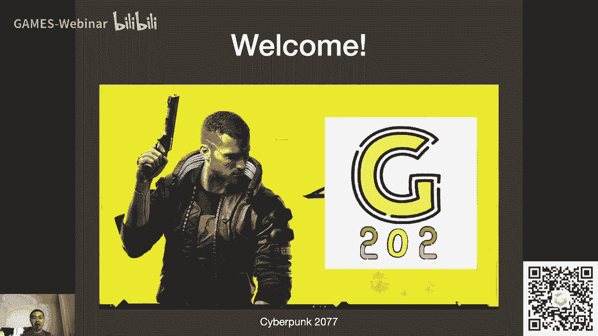

那么我是谁呢，呃我叫闫令琪，然后我是UCSB的啊，教授啊，然后这里大家可以看到我的呃学术主页，我的邮箱，欢迎大家联系我，然后我个人所做的科研大家可以看到正式渲染，然后不管是离线还是实时渲染。

然后渲染呢自然是属于计算机，图形学中间的一部分好的，然后呢啊呃我个人的一些爱好啊，大家会看到诶爱好第一条是科研啊，这呃是这么回事，就是说我是觉得啊就是作为能够找到一份工作。

这份工作呢和自己兴趣是完全能够吻合的，但我觉得是一个非常幸运的一件事情啊，不只是工作了，包括学习的时候，比如说我自己读博士的时候，我就很喜欢我做的这个方向叫真实感啊，图形学染啊。

然后呢我就觉得哎过得非常开心，然后包括现在来说，能够嗯把自己的这些呃，科研工作做出来了一些东西，然后展示给大家，然后呢这边再给大家带来一些这些呃课程，能够帮助到大家，那我就非常开心啊，没问题。

所以说作为呃一项爱好，这是科研啊，好的，然后呢，呃我个人是一个非常非常非常严重的网瘾诶，这不是少年了，网瘾大叔了哈，我是大叔啊，然后这这这这是我我这边打游戏，打的非常夸张的那些，之后会看到我的知识储备。

OK我估计比你打的多啊，如果没错的话，然后我个人弹一点钢琴呃，然后平常看NBA，平常呢呃有时候出去玩，如果不是因为疫情的话啊，唉想到想到疫情，我就想起了这个事情啊。

去年啊去年大家如果上过games101，就会知道说呢我给大家播games101，是所谓大家团结一致共抗疫情啊，结果现在大家这差不多在国内抗击疫情，已经取得了圆满的成功，结果我现在还在隔离。

我已经在家呆了一年了，我的天哎哈哈哈哈哎呀，好吧行啊，然后呃这差不多呢，这就是我的一些简单介绍，然后还是一样啊，这介绍一下我的成就，我们然后之前曾经2019年。

我拿过一个所谓呃西格raft的最佳博士论文奖，然后呃同样2019年，然后呃我做的那个不是我做的哈，就是我提出的模型被应用在一部电影里面，就是狮子王的HD啊，这之前咱们在呃games101里面。

已经自夸过了是吧，然后呢呃大家会发现没有什么变化对吗，如果奔嗯去年的games101相比，是不是还是这些是的，然后包括其实我要说的最后一条也是，然后包括我在吃鸡领域取得的成就。

在2020年也没有任何的突破啊，还是在2019年创下了记录，六杀哈，虽然伤害倒是提高了啊行吧，反正这是啊，我感觉2020年就好像是这，这这莫名其妙就没了，然后我在想2020年我干了什么呢，感觉挺忙的。

结果什么事也没干对吧，这么个意思哎行吧，没关系啊。

嗯那咱们现在继续，然后我来介绍一下啊，我们的课程呃，现在呃呃很荣幸能够找到以下的三位同学，当我们的助教万建周同学，周锦超同学和邓俊成同学，然后呢呃在这门课发布助教招募信息的时候啊，有很多朋友们啊。

以及包括已经工作了的啊，朋友们发来各种各样的邮件，然后大家都非常非常厉害，然后由于咱们这个games的这个非营利性啊，大家考虑到呃这一点，所以通常就会只会在当前的学生群体中来选择。

所以在这里呢先跟大家呃，如果说呃你之前提交了助教的申请，然后呃没有被选上，没有任何关系啊，然后向大家说一声抱歉啊，这个意思，然后呢在这门课的进展过程中，我们会根据需要还是一样，从现在的学生群体中看。

能不能在招募更多的助教，同学们好吧，那这就是咱们现在的呃，这个阵容相当于是啊，那在我来说这门课程之前，我先来听一下啊，我看大家弹幕里面会问到一些什么问题好吧，嗯嗯嗯嗯可以挺好的啊。

好像啊这些这些没有什么特别学术的问题啊，就先这样吧，嗯好的，那么我就先继续了好吧，OK那咱们这就开始关于这门课呢，那首先肯定要说咱们这门课是是是干什么的，对吧。

咱们这门课叫real time high quality rendering，那自然而然大家可以看到三个关键词，就分得非常清楚，real time对吧，实时high quality高质量。

然后rendering是渲染，那么这门课呢，首先就是有同学会会关心这么一个事情，他作为一二开头的课会不会非常难，我的理解是这门课不会非常难，为什么呢，他之所以被列为用二开头啊。

仅仅是因为它存在一个依赖关系，他需要games101的知识，但这并不代表这门课就非常难哈这个意思，所以我觉得呢他只是说把这个基础的知识啊，然后我们再想办法去取得一个好的，或者更实际的一种应用。

所以我管它叫进阶的啊，层级吧，就是不是特别的难啊，这个意思好啊啊，甚至真的我说句实话，很可能这这这门课的绝大多数内容不会比，pass racing on man啊，这是大家关心的一个问题。

那么咱们现在回到这门课的标题上来，Real time high quality rendering，咱们来分别解释一下好吗，首先real time，咱们来强调一下real time。

real time是什么意思呢，real time指的是一种速度，好吧，是一种速度，就是说你不是要做渲染吗，你要做到一个什么样的级别，我才能说它叫实时的呢，通常人们会认为做到30FPS。

这就叫real time，什么叫30FPS，是指每秒钟生成30幅图，所谓一个frame其实就是一张图啊，Frames per second，简称FPS，所以只要你能够达到或者超过30FPS。

我们就管这样的一种速度叫做实时，然后呢，呃实施呢当然在不同的领域有不同的定义，比如说像这个啊虚拟现实和增强现实这边的，他们会认为说呃可能对实时的要求会更高，比如说要达到90FPS。

然后我们就认为30FPS没有问题，好吧呃，呃另外呢在这里再跟大家说另外一个速度，就是说呃大家有时候说哎我打游戏，我觉得特别卡，就好像播幻灯片一样，哎那种感觉肯定是低于30FS，对不对。

而那种呢我们会把那样的一种速度，大概每秒钟生成个几帧，这种速度叫做interactive，也就是说，interactive是一个比real time要稍微慢那么一些的，但是呢他又不至于特别慢。

比如说你这边点了渲染之后，然后你这出去遛弯回来，他还在渲染，这是不可能的对吧，就像看幻灯片一样，但是基本上来说还是可以接受的，这种就叫做interact呃，呃interactive呃，FPS啊。

这么一个速度好，然后呢实时渲染讲究的是什么呢，讲究的是所谓啊这叫什么呢，叫互动性，就是这么个意思，就比如说大家在玩游戏的时候，大家按了一个键，立刻那边就可以得到反应对吧。

你在屏幕上看到说你的角色在发生移动啊，那这就是说real time做到的，那否则的话你要等他去渲染对吧，那这肯定要花很长的时间，所以说这就是首先我们要说的啊，real time的事情好。

然后呢下面我们来解释一下high quality，那这门课为什么一定要强调high quality呢对吧，首先我是在想啊，这门课我是可以说呃，可以管它叫什么现代实时渲染入门的啊对吧。

但是那样的话包含的信息其实不如这么多啊，呃所谓high quality指的是什么呢，指的是真实感，这是真实感，就是咱们之前在games101，如果你上过这门课的话。

你会知道说我们渲染的最终的目标是什么对吧，是以假乱真，但在这个呃以假乱真这么一个目标下，你要付出的代价是什么，那很可能就是高额的计算没问题吧，你要花大量的时间去计算。

然后去算出来最后的结果才能让他更加真实，但是我们所说的这门课，他所做的事情就是这样的，就是说为了保证实时渲染，然后通常大家都会去牺牲一些质量，大家是不是觉得这个是很熟悉的一个事情，没错吧。

我在games101经常说的trade off，就是这么一个意思对吧，然后但是实时渲染就体现了人类的另一个美德，那就是贪婪对吧，人类想说的事情就是我全都要，对不对，我又要高质量，我又要实时。

然后我怎么样诶把这个事情给做出来，那这就是实时渲染最大的一个挑战，然后咱们在之后的这些不同的不同的什么呢，不同的题目或者说呃任务中吧，咱们之后会体会的更清楚，好吧好。

然后呢呃high quality另一面当然是说，如果你为了让他要真实，那你肯定就要保证它在物理上是正确的，或者是近似正确的，而这一点之后还是一样，我们会着重的来体会这个事情，当然同时他也要求说。

你不能说跑坏掉了一些东西，比如说你的嗯每一帧吧，假设说你会随机坏掉一个像素，然后大家会发现那这个正确率基本上9%，19。9之类以上的对吧，但是当你把它作为一个动画给播出来的时候，每秒30帧。

那就非常非常难以让人忍受，所以说像这一系列的这些啊，所谓的artifact，咱们在M4101里面说过对吧，就是无法控制的一些失误出现错误，像这些东西通常在实时渲染中，它会有一个更高的要求，好吧。

就是说通常大家不愿意这些事情发生，好嘞，那这就是基本上来说，我们对于这两个事情的解读啊，real time和high quality，当然rendering啊，这个事情大家是非常熟悉了对吧。

大家已经知道rendering呢，他是在图形学下面的一个重要分支，它所做的事情是什么，他所做的事情是把一个3D的一个一个场景啊，然后我们把它给通过计算方式，然后呃通过这种计算方式去模拟光线。

是如何从呃光源中发出，并最后呃在在场景中弹射之后，进入人类眼睛的对吧，我们在试图模拟说虚拟的一个摄像机，如何看到一个虚拟的场景，那么这就是一个渲染的事情，大家看到这个例子，大家还是很熟悉的，对不对。

只不过我画了一幅图哈哈，大家可以看到右边，这个自然就是我们可以理解城市渲染的场景，虽然它是一幅照片啊，然后这是我这一年中为数不多的成就之一，我在家练了一下这个咖啡的拉花，然后虽然现在还不怎么对称啊。

但是好像还还可以对吧，多少有这形状，而且大家可以看到这是CIRA2014的杯子，这是我头一次啊，我人生中头一次，我博士的一年级去参加这个SIGGRAPH，然后当时买了这个杯子纪念品啊，一直用到现在。

哈哈哈哈哈哈好吧，然后啊，那这就是关于rendering啊。

那咱们这样就把这门课这几个三个关键词，解读清楚了，那么大家自然而然要问的事情，就是这门课到底我们会讲哪些话题呢对吧，那首先呢大家自自然从这封面图上就可以看到，我们会讲四个话题，哪四个话题呢，阴影对吧。

然后全局光照，然后呃然后其实这块儿对，差不多就是可以认为是认为是呃，呃真实真实的着色或者基于物理的着色，然后以及最后的一块啊，呃实时光线追踪啊，咱们大概分成这么四块来表示啊。

但是呢但是呢这门课跟之前的games，101的一个重大的一个区别吧，就是说它的知识点相比于games101，是非常分散的，就是说他的很可能就是基本上这两节唉，咱们讲这么一个题目。

然后下两节咱们讲另外一个题目，就变成了一个专题研讨会形式的一个课程，就是和之前所谓的这种一下读下来，这么前差不多十节课，然后咱们可以手写一个啊，最基础的一个软光山话，这叫什么来着，阮光山漆还是叫什么。

就soft呃，Where restaura，对吧好吧，没关系吧，就是反正呃这点呢是和之前的呃，电影Z11不同的地方，所以呢大家会在这门课上的过程中会体会到，这左右横跳是一个非常正常的一个事情。

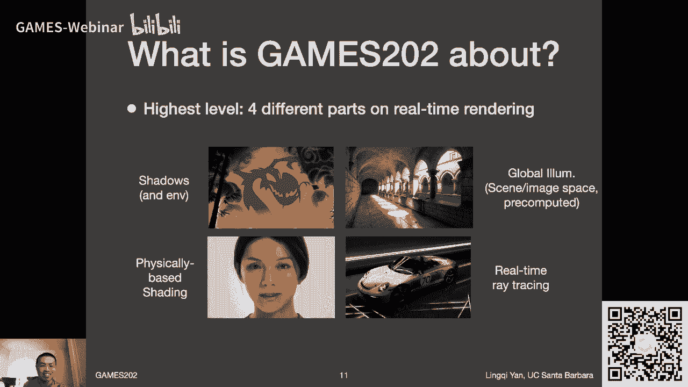

知识点非常的分散，好吧啊，OK那大概都包括哪些内容呢，简单给大家过一遍，那么哪些呢，呃首先关于阴影和呃，阴影和和环境光啊这块算是同一个话题吧，让大家可以看到一个跳舞的小机器人啊，非常有趣。

呃然后呢这个环境光之前我们说过对吗，这是可以描述来自环境的，从四面八方过来的光照，然后就非常复杂，可以投射出绝对不止一个阴影。

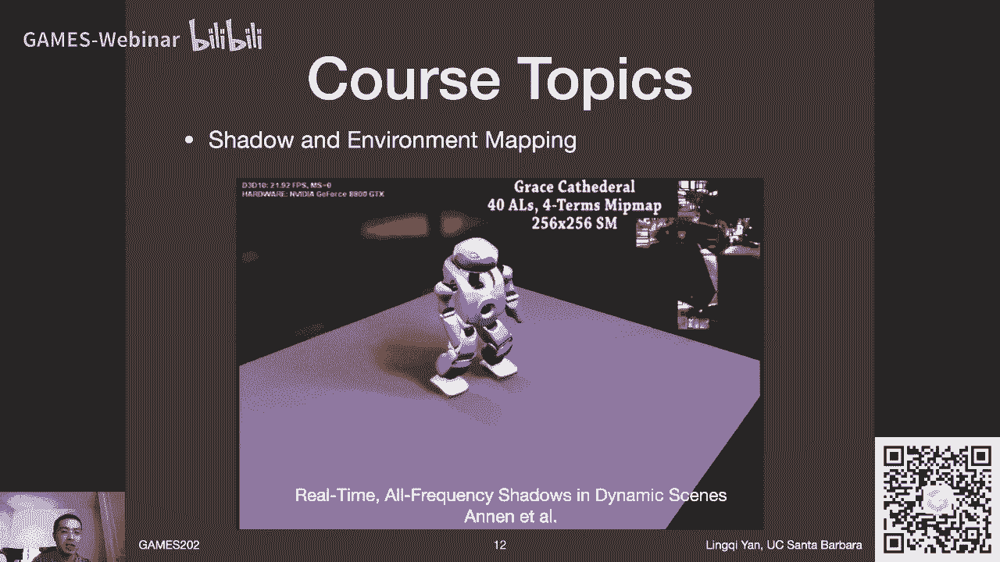

然后特别是在这种动态的物体下，你怎么样把它给做出来呢，对不对好，然后另外一个呢就是实时嗯。

呃确切说这里不是实时了。

这里大家可以看到用的词就是interactive啊，全局光照。

大家知道我们刚才才说对吗，interactive差不多每秒有个几帧对吧，差不多或者甚至每秒一帧，然后两秒一帧都没什么关系，这些我们就管它叫interactive，就不是特别慢，但是还不错啊。

然后呃这些呢实时渲染的一些技术。

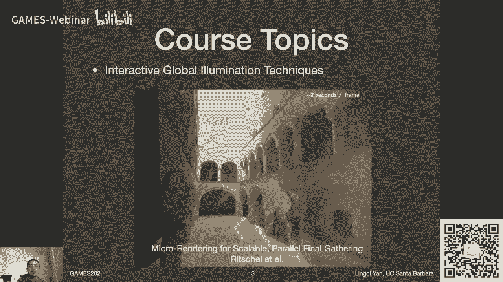

然后包括不需要预计算的，以及通过一些预计算做了一些所谓trade off的，我们在我们在这门课之后会说，就比如说大名鼎鼎的球面斜坡函数，然后在这些呃在这些预计算的这些过程中，起到的这种关键作用哈。

就是说我们如何通过呃去嗯，在渲染之前花费一些时间，并且花费大量的存储，使得我在渲染的时候能够达到一个，更好的实时渲染好吗啊。

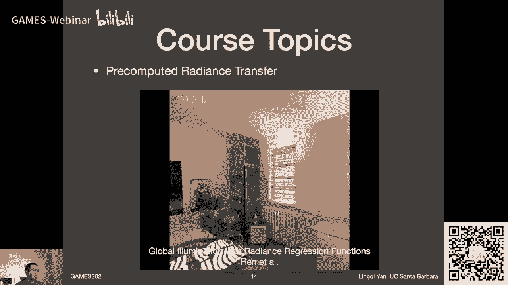

OK那没问题，那另外呢，当然我刚才提到说呃实时的光线追踪对吧。

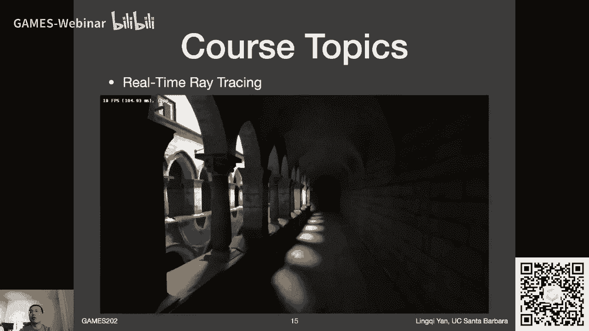

大家现在看到的这个例子，大家看到哎我们基本上可以达到10FPS啊，这个不算什么real time嘛，但是啊我跟大家说一说这个背景，这个呢是我若干年前我已经不记得了，这是我写的一个demo啊。

这是当时呢还没有光线追踪的硬件。

当时这个硬件是什么呢，我是在什么上面跑的呢。

应该是GTX780啊，大家可以想一想，基本上是上古时代的这些硬件了哈，然后做到这么一个速度，然后这也是当时算是嗯嗯可能是最早吧，然后证明了说实时光线追踪是非常可行的啊，然后咱们这门课里面呢。

会把这这系列研究的思路给说清楚，然后就是关于实时渲染，实时的光线追踪到底是怎么回事，它怎么发展的，然后现在大家的一个主流的做法是什么，那我们肯定会说好吗，然后呢关于一些啊。

嗯比如说我们刚才提到的一些真实感的材质，然后特别是包括一些散射介质，或者叫参与介质，Participating media，然后这些的这些渲染就比较难了，就是大家看到这一幅呃。

所谓single scattering什么意思呀，对吧，待会儿之后我们会给大家说，这是应该也是虚幻引擎里面能够做到的效果吧，然后还有一些杂项的一些内容，比如说在图像空间做的一些操作，比如说呃。

大家可以看到这个水面会反射出来这些呃，这些建筑物对吧，这些东西都是怎么做的呢对吧，这些是一些实现软件也在解决的一些经典问题，我们也会提，然后呢呃关于非真实感渲染，然后我们也会提一下。

大家可以看到非真实感渲染，咱们可以用一款国产游戏来代表它，那就是原神啊，然后咱们抛开它的盈利模式不谈，然后就单讲画面来说，我觉得这样说可圈可点啊，真的是不错，然后呃呃当然哈这个也没。

我也没有得到任何什么米哈游的赞助啊，这当然也可以有啊，嘿嘿嘿嘿嗯好的呃，这是这么说啊，然后呃这里大家会看到这些事啊，关于非真实感渲染的话，呃我个人不是特别愿意去多说啊，虽然他很重要，这个没问题啊。

为什么呢，是因为非真实感渲染嗯，它存在很多的这种非科学性啊，我是这么觉得，就是说你希望他做到一个什么样的效果更多啊，它是由最后你要的艺术效果来决定的，所以说呢更多情况下你是在写一些什么if else啊。

有很多这些这些类似的这些判断哦，说到这里我跟大家说一说，这是我的理解哈，就是说我最早在在接触这个呃非真实感渲染，或者说NTR的时候啊，然后我觉得诶这不就是不同的这些case。

然后我去写不同的这些if什么东西不就行了嘛，啊这是第一阶段，第二阶段是我学的比较深入了之后，我发现不是我发现很多东西啊，你这这块写了衣服之后，另外这边要怎么办对吧。

然后然后就有可能这属于属于说你写的SHADER，是拆东墙补西墙的一个情况，这是第二阶段，然后目前的我我又回到了第一阶段，或者说是我上当了，第三阶段，我觉得我觉得他还是一副else，所以到时候这样吧。

就不管怎么样哈，我把我的呃理解，到时候都告诉给大家好吗啊，OK那没问题，那这里呢呃原神，当然去年整个一年肯定有很多同学一样还在啊，记得被鲈鱼支配的恐惧对吧，如果你是动森玩家的话，呃这幅图来说。

应该是应该是非常非常非常熟悉了对吧嗯好的，然后呢，呃当然这肯定是大家从画面上来看，飞机的真实感，图形渲染嘛，对不对，但是也是这非常卡通的，非常好看，很有意思的对吧，然后呢呃那咱们还会说什么呢。

呃这门课上啊，还会说一些比较稍微现代化一点的话题，比如说在实时光线追踪的背后啊，它其实是一些跟这些所谓spatial temporal，也就是空间和时间空间呃的这么一些呃方法呃。

他们的发展啊特别有代表性的，就是现在的呃temporal antasy，也就是时间上的啊，抗锯齿技术，然后包括其他的一些抗锯齿技术，我们都会说一些啊，就是呃以及包括这之前。

咱们在101上已经跟大家说了的啊，就是super sampling嘛，就是比如说NVIDIA的DLSS呃技术，可能我们会说的稍微更详细一些，这个时候我们到时候再看时间吧，好吧啊，那为什么会这样。

就有一些我会多说，有些我会少说，我们待会儿再给大家解释好吗，呃然后呢关于这门课啊，特别是今天啊，今天没有什么特别重要的内容啊，我呢主要是愿意跟大家聊一聊，各种各样不同的现在的这些技术，比如说大家呃。

有很多同学肯定已经看了这个demo了对吗，这是虚幻引擎五的一个呃一个演示视频呃，非常夸张的这个技术啊，大家可以看到洞穴里面呃，这里面投影嗯，嗯就是说可以被照到的，这个区域只有这么一小块。

然后呢但整个洞穴都是亮的对吧，这肯定是嗯大家之前如果学过games，101都会很清楚对吧，就是说这是这是呃在实时渲染中非常困难，就是不好做的地方，就是global illumination。

也就是全局光照，然后以及包括当然了，在这个虚幻引擎五里面，一个着重展示的技术，是他如何可以啊，处理一个场景中上衣的三角形啊，确实应该不是上一个三角形，应该上10亿百亿个三角形。

它们如何在呃实际中去做出一些呃，动态的几何的取舍对吧，然后像这些啊，虽然跟渲染来说稍微离得远那么一点点哈，但是我还是愿意跟大家聊一聊，之后看咱们穿插的时间来了，嗯比如说啊这里我就可以先跟大家说一下。

就是说之前其实我我我在嗯在什么时候呢，在这个虚幻引擎五刚出这个demo的时候，有同学找到我说，想想让我说一下它背后的这个技术，它它是怎么实现的对吧，然后啊我的理解其实是这样的，就是说对于这些引擎来说。

我们待会儿也会说引擎来说更多更多的内容，它并不是说在学术上是非常难的一件事情，它难在哪儿呢，它难在它本身引擎是一个系统，它有大量的工程的东西在里面，比如说你问我，他是如何去做这个几何的，这种简化的。

包括这块呢这个制作者他们自己发的嗯，叫什么twitter啊，上面就已经讲的挺清楚啊，就是相当于是用啊，呃呃就是之前啊，大名鼎鼎的顾先锋老师的几何图像啊，几何图像之后我们会说这是一个经典技术啊，和什么呢。

和一个虚拟纹理的结合对吧，这我一想大概是这么做的，没问题，然后呢包括他的嗯这些实时实时的这些啊，全局光照是怎么做的呢，那像这些就是一些基于屏幕空间的一些方法，然后像这些方法呢，我们课程其实都要讲。

也就是说他在背后的科学并没有那么难，那真正难的东西是什么呢，是技术啊，这个我们在待会很快就要跟大家说，我认为我个人认为，科学和技术是两样截然不同的事情，以这个游戏引擎为例。

那么它背后所运用到的科学知识是非常简单的，或者说是经典的，是在大概10年前像这样的一些知识，但是他用的技术却是非常先进的，或者咱们反过来这样说，如果要让你来写这个可以。

你写的出来只是会比他慢个十倍100倍左右，是这么一个意思，明白了吗，所以游戏引擎的时候的的话啊，它背后其实并不是特别难的一个事情啊，他只是说本身在写的时候啊，这是哈哈哈哈，OK好吧，然后关于这个背后。

至于具体是怎么做的呢，咱们之后再看吧，因为我毕竟我也不知道对吧，只能从它的外表，这个是上面来考虑，来了来猜测一下啊，另外再跟大家说一下，我们的某一次作业，是要山寨一个这样的全局光照好吧。

然后我们先说清楚啊，质量呢可能是比不上他的，但是不管怎么样，在背后的科学，还是我刚才说的这个事情是对的好吗好嘞，那这就是啊，今天这是扯的一首啊哈哈，OK然后呢，我还愿意在这门课程跟大家探讨探讨游戏啊。

因为什么呢，因为实时渲染这嗯就这个领域吧是百分之，我就说90%以上都是由游戏的需求，来推动的，这个大家不反对吧，应该没问题对吧，然后我觉得这是嗯游戏的发展，基本上大家就可以从游戏的发展就可以看到。

说实时渲染的这么发展，我们马上待会儿也会看好吧，然后这里呢大家可以看到呃，这个呃最后生还者二啊，然后这这个名字其实有很多地方，值得吐槽的对吧，比如说哎大家可以看到哈哈哈哈。

也可以看到有很多很很多同学不喜欢这个哎，最后生还者二的剧情，然后管他叫高尔夫二啊，至于为什么这就不剧透了啊，然后这个翻译本身呢，也是非常恶意满满的一个翻译哈，它叫the last of us。

然后由于他的封面写的是全大写，所以翻译成中文的时候，有人把它按照了last u s来翻译，翻译成美国末日哈哈不过也挺贴切的哈，那个时那个时代确实是美国末日，呃挺有意思的，不管怎么样吧，这是一个啊。

咱们这样说，不管怎么样，现象级的游戏啊，就是画面是非常好的，然后呃剧情是饱受争议的，然后还是很多东西值得怎么说呢，探讨一下好吧，然后之后呢我我我说过嘛对吧，我自己作为一个。

这这这个打了很多很多年游戏的人，有很多东西是可以跟大家说的，以及呢，比如说哎咱们呃，最近最近肯定是很多同学跟我一样，是对这么一款游戏叫做呃怪物猎人崛起啊，是非常期待的对吧。

然后差不多十天之后也就要发售了啊，然后大家可以看到啊，这幅截图就是我现在打这款游戏的demo啊，第二阶段demo的真实写照啊，哈哈哈哈哈哎呀好吧，然后嗯对吧，同学们有有有有真的，这打过了怨虎龙的。

同学们肯定有对吧，唉呀唉我来看看啊，按说是有延迟的好吧，没有怨虎龙都没打过，你还来这听听什么网课，对不对啊，本末倒置对不对，哎哎得我就随便说一说，OKOKOK行吧，之后有空，咱们在课程中再给大家穿插。

关于游戏的一些讨论啊，这么着好的，那么这门课呃不讲什么啊，这也是大家觉得呃很关心的一个话题对吧，首先呢跟games1011样，咱们有两点不会讲，第一怎么样去去做这3D的建模啊，第二怎么使用游戏引擎啊。

这点我说清楚怎么使用游戏引擎，是绝对不会说的，比如说像像虚幻引擎，它有什么什么层啊，什么节点啊，这些是一概不会不会提这些东西，为什么啊，我来解释一下，就是我认为哈这些内容是属于说呃。

那是别人开发出来一套系统，你要学它是怎么用，所以说学长怎么用，你基本上只要看教程，或者说现在对吧，有很多已经有了的课程，然后各种各样的文档大家自己看，然后需要的是累积一些经验，把它给用熟。

就好像是用PHOTOSHOP一样，对不对，用PHOTOSHOP这个事情呢，是这个相对来说相对，你要理解说它背后的这个钢笔工具怎么用，那当然是一个相对简单的事情，所以我不提这个事情。

是因为呃有其他的课程和我们的这个课程是呃，呃交叉的啊，是这么个意思好吧，呃呃所以说这块呢我不再提，那么有同学就说，那这样的话啊，我们实时渲染这些作业中间我学到的这些东西，可以把它用在这虚幻引擎里面。

开发这些SHADER什么东西吗，可以没问题，你所缺的就是一些所谓工程上的一些知识，而这块呢也是自己之后是需要呃需要自己去呃，靠大量的经验积累，然后实战把它给做出来了，没问题吧，那我这样说。

那从一个更高一点的角角度上来说，我个人能力有限，但是我希望把我所知道的这些，跟实时渲染相关的背后的科学都教给大家，然后大家做完了之后，肯定会有比我更出色的工程师们，然后一起来把这个呃。

呃这这这比如说咱们国产的自研的引擎，能够给做的非常好，甚至可以超过现在的呃虚化对吧，这些是我的梦想啊，我希望这门课对大家的一个帮助啊，好嘞，那这基本上来说呃，就是我说为什么咱不讲这个啊。

同样什么东西不讲呢，呃不讲的是是离线渲染啊，离线渲染咱在咱们这门课中呃是不太会说的啊，比如说吧，大家看到一些比如说复杂的光线传播呃，想呃这些方法，这些方法我为什么提这个事情呢，是因为说我个人理想当中啊。

渲染应当是有三门课啊，作为图形学入门的games，101可以算是一模告诉大家这些基础，然后实时渲染和离线渲染，应当是作为两个分支来分别来说的好吧，然后离线渲染的话之后，我再考虑是不是要开课吧。

就是说离线渲染的话讲起来那可就真的难了哈，那就不像呃实时渲染这样这样一个难度了啊。

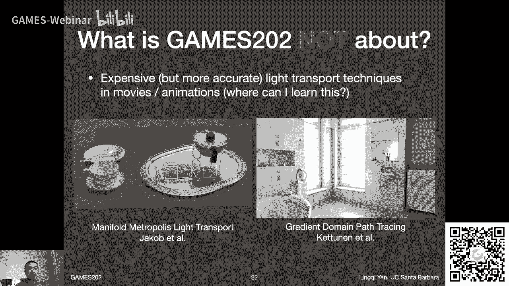

OK那咱们至少咱们这门课先不说，先放在这，另外呢我不说什么呢，还不会说呃，所谓这块我从来没中文翻译过，难道真的要翻译成神经渲染吗，叫neural rendering啊。

我平常就管它叫neural rendering啊，那就这么说，那么大家看到的这么一个例子，是目前来说，一个NEURRUNNY做的非常好的一个例子，然后叫做呃叫做NERF啊，大家应该听说过是非常不错的啊。

然后嗯嗯这门呃呃不是这门课啊，这这个作品的作者第一作者叫叫这个，但就是这个人，然后他是我的师弟，他在他在BERKELEY，他是我隔壁组的师弟，然后他跟的老板就是任NG，大家还记得这个人吗，对吧。

因为我们games101里面提过光场照相机，没错啊，然后这就是他们的工作，当然当然我的这以前的博士老板，他也参与进来啊，是这么个意思，就是非常优秀的一个工作。

我们不会特别提neural rendering，主要是因为现在绝大多数的neural rendering，做不到粮的事情，哪两个事情这大家自己可以回答的，第一real time，只要你用了神经网络。

什么东西很少能够有做到real time的，这是没问题的对吗，然后第2quality，因为很多神经网络出来的东西啊，如果你不去首条啊，另外跟大家说一个概念是首条什么意思，基本上来说你做出可能1万张结果。

然后可能有呃，比如说1000张是最好的，一把拿出来给大家看，这个做法叫做cherry picking啊，之前是不是跟大家说过呢，我要是没说过的话，我就现在说一下啊。

cherry picking的意思就是说，你看你比如说要去樱桃园里摘樱桃，你会剪什么样的樱桃摘呀，你肯定要剪最好的了对吧，然后待遇对于实时渲染来说，你不能做这个事情，为什么。

因为这些呃你要显示的什么东西啊，这些是由用户控制的，你是不可能说你把所有的情况都覆盖到，除非你的算法本身就能够把所有东西都覆盖到，而把所有东西都覆盖到，这是神经网络本身的劣势的地方。

就是说你的数据集越大，覆盖的东西越多，它就越可能不好训练，甚至可能会出错，对吧，所以说对于real time和high quality，这种neural rendering很可能都做不到。

所以说我不是特别愿意提，但是但是有很多成功的神经网络的应用，我会在这门课里面提示。

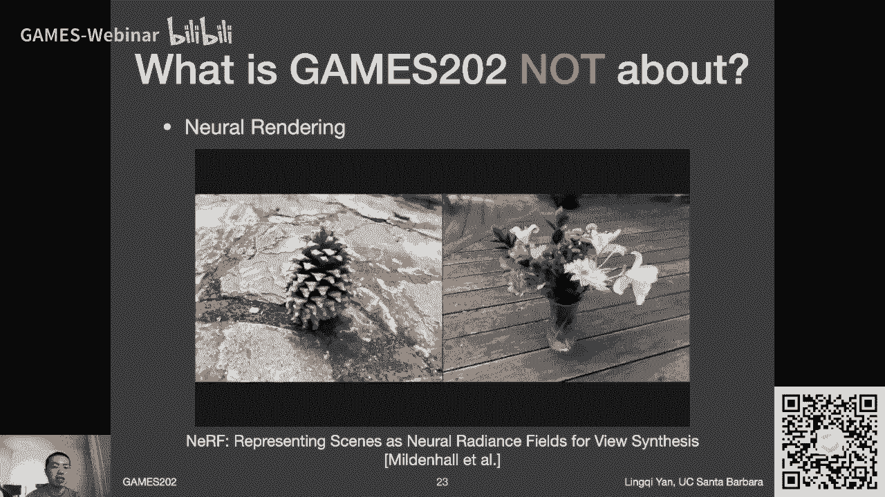

比如说用神经网络去做降噪好吗，然后这么个意思，那么还有一些不会说的是什么呢，还有一些不会说的，就是哎怎么用open gl，那我既然这么一说，大家就应该已经知道了对吧。

这门课我们会要求大家用open gl shader language去写呃，一些呃SHA的啊，这个之前我们在games101也提过对吗，我们需要用呃这种着色器语言，然后着色语言啊这个意思。

然后呃去去去描述说，让这些顶点和片段着色器应当怎么样去呃工作，对嘛，然后但是呢就是说呃写这些着色器呃，语言跟会用open gl什么东西，这其实我觉得两者应该分开来看啊。

open gl本身是一套非常不好用的C加加端的啊，不C风格的这种API啊，然后他能干什么呢，他能帮你，比如说我们在games101里面学的一些什么，那变换矩阵的对吧，比如说我们知道这个透视投影矩阵。

给定各种各样的参数对吧，同样把这些参数交给这个API，它自动就可以帮你得出这样一些一些结果，一些一些矩阵啊，以及包括场景的设置，或者别的一些什么东西，所以呢open gl不是一个什么重要的东西。

但是呃shader language，是的啊，这是两个不同的事，然后我们待会儿作业那部分还会再继续说啊，然后呢，呃呃我们这门课不会说的，是关于场景和所谓着色器的一些优化，就比如说你现在做了一个游戏。

然后他可以跑10FPS，那么怎么样通过各种各样不同的优化，把它给变成30FPS呢，当然这个这个事情是非常难做的哈，呃但是我们是不说的，为什么呢，道理还是一样，我们刚才已经说了，这是一项纯技术的事情啊。

因为因为背后你用的科学的这些这些知识，什么东西，这些都是完全一样的，然后作为一个啊优秀的工程师，然后这是你这是你什么呢，其实是应该做的啊，或者说是你主要的工作啊，这个意思，所以关于这块我就不再多说了。

另外一点呢，如果你想去这个逆向别人的SHADER，这是我一定不会说的啊，从道义上也不该这么说的啊，这个事情，然后呢关于这门课，如果你想在这门课里面学到一些高性能计算，这个也是我不太说的。

比如说你想通过这门课去了解，怎么样去写扩大程序，然后这样而且才能写的快啊，这块呢我也不会特别的呃说啊这个意思好嘞，然后呢哦我看嗯差不多这个时候算是可以，咱们简单停一下啊对吧，我来看大家有什么问题哈。

嗯有同学说为什么咱们不用direct x啊，道理很简单，因为他是这个啊不能跨平台吗，如果有同学是Mac或者是呃，open gl肯定就不行了对吧，然后有同学说HLSL啊，真的差不多。

HLSL和GLSL这些都是不同的，shader language的BALAN也可以吧，就是说我们待会作业很快就会说啊是啊，我这就告诉大家了，就是web gl的框架。

这样的话不涉及到任何平台的问题好吗好嘞，然后有同学说啊，这叫什么呢，后面会不会有录屏啊，啊有我现在不就在做吗，啊，OK有同学说期待离线渲染的课之后看吧，我只要不忙啊，早点，然后有哦，有好多同学跟我一样。

打这个这些怪物猎人类还可以，挺好的挺好的挺好的，OKOK来看看嗯，啊有同学说全局光照应当怎么样去入门啊，我觉得吧对于实时渲染中间的全局光照，那就就按这门课来了啊，我尽量把这事情说清楚好吗。

然后哦有同学反映说在这个虚幻引擎中，他用的技术并不是我所说的，没问题，这是我愿意跟大家探讨的事情嘛对吧，因为毕竟我也不知道嘛好嘞，然后有同学说SVGF会讲这个很具体啊。

SVGF是一个呃具体的去做实时光线追踪，降噪的一个方案，然后这个我们会提啊，会提呃，SVBRDF会讲吗，其实SVBRDF就是BRDF嘛，然后会讲一些啊，呃所谓PB2啊，大家在工业界中这么说的啊。

physical bas rendering或者叫physical base material啊，这块会说的没问题，大作业会做什么呢，是随便做的啊，到时候我也会说嗯好的嗯，有什么书的推荐。

马上就会说好的啊，有同学在说到底应该如果要学的话，是要学unity还是要学虚幻的，没关系吧，真的我说这两者都是嗯，嗯我觉得哈学完这门课之后应该怎么学，嗯这些都是可以的，虽然从我个人角度上来说啊。

我觉得啊REO这做的更酷炫一些，然后结果更好看一些啊，仅仅是这个意思啊，unity的话，以前对于对于科研人员他们的支持是非常好的，它有非常好的一套开发的系统，现在RMONG的话，嗯即便是400。

我是觉得因为我带学生们做过一些项目啊，就是说呃我已经觉得不是特别好上手啊，啊real engine呃，不太好上手，作为科研来说嗯，但是一旦上手，比如说你花了两个月去上手这些东西。

然后去学他的这些背后的机制，以及他的SHADER该怎么写，然后你会发现是一件非常值的事情啊，没问题，就是他学习曲线非常，这叫什么非常陡啊，这个意思好嘞，嗯那么哎呀好吧，这是什么问题啊。

有很多东西我不懂啊，有同学问什么叫超分呢，我不懂啊真的，然后呃工业界上实时和离线的要拿多一些啊，这个看情况啊，比如说像游戏肯定是实时，电影肯定是离线吧，这样好吧，那这样啊，我先放在这儿。

然后呢我们先继续后面的话题，因为这次东西比较多哦，啊在这之前先跟大家说一下这个事啊，由于在这之后就是我来控制这一门课呃，一节课要讲多长时间，所以不存在拖堂啊，等我讲完为止了哈。

要不我每一次我在km101，我回头听自己的课，我都在跟大家说，这一个小时又讲不完了，行吧哈哈，然后我觉得今天我们一个小时也讲不完啊，所以说我就把这个课程内容讲完就算呃，为什么呢啊是这样的。

就是作为这门课来说，我虽然在这边的学校教过，但是作业games202加了很多新内容啊，包括咱们第一节课也有很多新内容，所以说呃关于时间的把握上，我就不按那么严格来处理啊，就是把一个事情说清楚会算。

如果时间短了，那就短了，长了就长了对吧，没问题，好嘞好，那么既然这样说了，那咱们就现在呃呃安稳进行后面的内容对吧，我们说了what对吧，然后下面应该是啊哈哈哈Y，但是我们把这Y给嘿嘿嘿放在后面了。

我们先说怎么样自学games202吧好吧，然后关于学games202，我个人是这样理解的啊，这就是刚才我跟大家说的啊，我们学校202的过程中一定要记得这件事情，科学和技术是不等同的。

当然这件事情是我个人的理解，然后就是说所有的这些课程中间啊，肯定都是老师自己的理解，然后大家也欢迎大家有自己的理解，这么个意思，我认为科学和技术是严格意义上不等同的，两样事情，科学是什么呢。

科学代表着知识，你所理解的对于这个世界应当如何去运作，没问题啊，然后技术技术是什么呢，技术更多代表的是技巧，就是所谓的engineering，Skills，工程能力啊，这样说，然后技术是用来干什么呢。

是要把科学给转化为产品这么一个意思，而科学跟技术通常人们会简称科技，这是为什么呢，这是因为绝大多数人认为这两件事情，反正我都不懂，随时随是一回事对吧，但对于咱们来说。

区分一下science technology，这是两个不同的事情，一个最典型的例子就是车对吧，大家知道汽车这种东西，大家在多长多长时间之前对吧，就已经知道应该怎么样去运作了对吧，但是直到今天。

咱们国产的车子性能仍然不是特别那个对吧，所以说啊，就是说这就是所谓技术，在这个背后起到的一个关键作用，所以说科学跟技术不等同，但是我没有说哪一项更重要，技术和科学，我可以认为它们同等重要。

那对于real time rendering是什么呢，对于这门课来说，只要你能够记得这样一件事情，就是说啊real time rendering，他所它背后所应用的科学知识。

实则就是对离线渲染的一些科学知识的简化，然后能够让它变得更快的一些方法，这些东西我们会教没问题，然后呢，在这在这个背后还需要你去做系统的工程，就是这么个意思。

为了达到real time rendering，而这一点我们已经在助教同学的努力之下，给大家简化的非常厉害了，就是说大家在接接到作业框架的时候，很多情况下是直接可以上手到科学这一块。

而不是说要涉及到各种各样复杂的这些呃，这些真正的这些实现上就是我所说的嘛，如果让理解，比如说你不用跟阿real比，就跟我比，你可能就会慢那么多倍啊，这么个意思哈，这块呢大家在之后呃。

就是呃在之后的学习过程中吧，慢慢的积累，多写代码非常对的，不要管是什么样不同的语言做什么事情对吧，然后基本上来说，就是就是养成一个写代码的好习惯，把自己无论如何培养成一个好的工程师。

这是最重要的一件事情，然后然后就是说大家呃我刚才想说什么来着啊，对啊是这么个意思，就是说对于呃实时渲染来说啊，其实有这么一个嗯很奇怪的一个现象，但是呢又可以解释什么呢，就是实时渲染的技术来说。

我们大家注意我说的是技术啊，这一块儿在工业界它是远远领先于学术界的，就是通常在在学术界，就是说由博士生论写出来的这些代码，很可能是和工业界大家写出来了这么一些嗯，这些好的，这些代码是没有办法比的。

确实是这样的，这是实话，然后这是怎么回事呢，是因为工业界，比如说一些游戏公司，他们自己做游戏的过程中，最早就能够看到最新的问题，没错吧，而这些问题很可能学术界根本都不知道，可能会有这么一个问题。

他们根据自己的产品需求会发现这个问题，而发现这个问题，就是由由自己同时再来提出一个解决方案，所以大家可以看到，这是一个非常封闭的一个系统，对不对，在这个工业界里面嗯，然后另外有一点呢。

由于涉及到所谓这叫这叫什么呃，英文叫IP啊，叫intellectual property啊，这个东西的限制，或者咱们就理解成版权啊，就这种限制很可能呢工业界和工业界之间，他们就不太交流这件事情。

甚至到学术界就是我们有很可能哈就是NVD啊，我不知道攒了有多少神奇的什么技术，没告诉大家，他这是有可能的事情啊，所以是非常封闭的一个系统，呃没问题，那么呃共享的技术就非常有限，所以说同样的一个道理。

在学术界我能够接触到的技巧也非常的少，这是实话啊，这是实话，所以我就说我自己能力是非常有限的，我只能说在什么呢，在学术界这边，然后能够把我知道的这些事情告诉大家，然后我相信大家的啊。

比如说比如说都是计算机系的同学们，大家的培养体系是一定可以，把大家给变成一个合格的优秀的工程师的，好吧，是这么一个意思，那么咱们在学games202的过程中，专注背后的科学好吧，然后当然实现。

这就是你要做到的，把科学和技术融会贯通的时候好吗，差不多这么个意思，那同样这样就可以解释了对吗，有同学会说说，我会不会讲什么一些超级超级经典的技术，比如说deferred shading对吧。

大家如果说知道做过这些实时渲染，知道有一个重要的东西叫延迟渲染，然后这是很重要的一件事情，但是他是一个纯技术的事情，所以我在这门课最后啊可能花一点时间提一下，还有比如说什么cascaded的技术。

block的技术对吧，有很多各种各样这些啊我想说的是什么呢，就感觉跟大家这个修仙是一个道理的对吧，这招式不是最重要的对吧，然后最重要的是什么呢，应该是内功与这个这叫什么待遇阶品对吧。

炼气期是打不过元婴期的对吧，这么个意思诶，嘿嘿嘿行吧行吧行吧啊，那咱们继续啊，然后最后一点，那当然了，这就是说你这个呃呃，多练是对的，刚才已经跟大家说了，practice makes perfect啊。

没问题好嘞，OK那这样的话咱们就说清楚了对吧，关于这门课咱们怎么理解，怎么样学啊，这个意思好嘞，然后那如果说你是啊看的是直播啊，我会要求你多问问题，多问问题非常好，如果我没看到的话。

我中间我会想办法停下来，然后你再嗯到时候再说一遍啊，不好意思，这事我会尽量的多来关注我们的弹幕，这是一个啊，如果你看的是之后的嗯，呃这叫什么呢，在B站上传的视频呢，然后我会建议你做这么一件事情。

我会建议你用1。25倍速，到1。5倍速度来播放我们的视频，为什么呢，是因为我自己啊，我自己知道我自己说话很慢，但是呢我又不知道我说话如此的慢，我自己去看我在B站的视频，我的感觉是啊，如果我按照1。

25倍速来播放的话，我觉得那才是我的正常的说话速度啊，这么一个意思，OK啊行了，知道了哈，所以说这个啊道理就在这，然后如果你想稍微快一点，1。5倍可以两倍，可能对于新手来说太快了啊，这么个意思。

我自己觉得我非常愿意大家去去哈哈，去播放这个1。25到1。5倍啊，这么个意思呃，当然背后原因是什么呢，我也不知道是不是我说话真这么慢，还是说还是说比如说B站，他会有一个什么24fps到30。

FPS这种转换呢，但如果这样的话，时长怎么没加，没有加长啊，这样吧我就不再解释这个事了啊，就是我真的觉得啊1。25倍，大家就把它当成正常速度啊，如果想快一点，非常欢迎，没问题好嘞。

那么哎我们故意把这个问题放在最后对吗，Why study games，202对吗，通常这个和我和我后面说的，和我之前说的顺序是反的对吧，我会先说what，然后Y然后再how对吧。

然后这次说说这个Y呢是这么回事，就是说大家为什么要学习games202呢，那首先我要感谢大家去学习games101，因为有同学向我反映说啊，这个呃学了games101之后啊，嗯嗯找到了工作啊。

或者是说自己对图形学产生了非常好的兴趣，决定之后以后人生方向就是他了，唉我非常感动啊，非常非常感动，这是表示什么呢，表示说呃我这网课也算是帮到大家了，这是以后也会，我也会希望更多的课程能够帮到大家。

然后games202呢也会对吧，然后不管你是在学术界还是工业界以后，就不管怎么样能够有所帮助，那就非常好好嘞，然后呢呃如果你就是单纯的诶，我喜欢图形学，我单纯的就想多做一点，对吧啊哈哈。

然后这样就会就会会有帮助对吧，然后我觉得我觉得对的没问题，这就是说大家学games202的理由有很多对吧，但是哈我在这里啊哈哈哈哈，一个一个很经典的理由，如果你上过games101。

你应该是已经知道了的，对不对，哎好吧，然后请大声的喊出这个理由啊，当然不是异世相遇，尽享美味，哈哈OK好，computer graphics is awesome啊，咱们回到正经的话题上来了，OK行吧。

所以说就是说啊对于我来说，我认为我喜欢图形学，我觉得图形学看起来非常酷炫，做出来的东西非常好，然后我就是因为这个我就想想多学一点啊，没问题，哎呀呀嗯，所以说呢我也希望啊。

真正通过这节课让大家能够意识到对吧，图形学是一个非常有意思的一个嗯，计算机下面有个分支对吧好嘞，然后这就是这一块了啊，下面呢我们说一说关于这些课程的一些要求啊，不是说要求一些数学上啊，来吧。

那第一点呢那就是我要求什么呢，上这门课之前你要有的事情，那就是兴趣啊，就是说这是最重要的，就是你要是不喜欢rendering或者graphics，那上这门课你会觉得挺痛苦的对吧，那多没意思呀对吧。

然后呢呃基础基础是什么呢，games101就可以，但是呢不一定是games101，你之前上过任何的图形学课，是肯定是没有问题的好吗，因为任何的图形学课，一定都会告诉你，基础的渲染管线怎么样去运作啊。

这就够了，然后呢我们所需要的呃一点点呃微积分知识，我们会在下一节课给大家复习啊，就是基本只需要一些这些问题，我看有同学会问需要不需要什么呢，这什么数值分析啊，别的一些信号处理啊，在这门课里面。

其实用老师平常如果真的需要，我们就临时用，临时说好吗，这个意思，所以没有什么必要去再买什么别的书啊，或者去呃上一些其他的这些课，专门为了这门课去打基础，没必要啊，我觉得直接听肯定是可以的。

那么另外一个准备的事情就是我刚才所说的，就是我认为那你是有能力直接掌握，open gl本身怎么样去用，以及包括open gl shader language怎么样去写的，OK然后我也也说了。

咱们在这个呃就是助教的帮助下，我们只需要基本上来说，只需要你把作业零跑通，就是说下一节课的时候会放出作业，零，很可能会早一些，可能会晚一些的啊，这个意思啊，酷睿零呢不做要求，然后就是大家把它给环境配通。

然后嗯把他的代码跑通，你就知道该怎么做了，以后的作业基本就是在写SHADER，着色器，基本不会特别涉及到open gl，然后呢同时着色器语言你说也没有学过，其实你在games101里面。

我提过那么111两页的PPT对吧，说呃我们的下一节的，还有下节课也会呃稍微说一点，好吧啊，这么个事儿好嘞，嗯OK麦克能跑吗，有同学问这个事情能啊，能没任何问题，就是我们用WEBGL就是这么一个好处哈。

然后就是就是这是完全跨平台的，没有任何问题啊，好那么呃另外一个事情啊，当然我们大家又见到了熟悉的这样，而且又让大家失望了，这门课作为现代化的啊，实时渲染的课是是会覆盖不少内容。

但是哈哈它却不需要你用这么好的硬件哈，不需要，真的不需要你用你的笔记本上面的这个显卡，就已经足够了，所以说呢呃就是说你到时候感觉到啊，体现体验到的区别啊，仅仅是最后你写的代码，他的FPS的问题啊。

就是跑得快还是慢，就是肯定会受到影响，但是绝对不耽误呃，你去做作业，因为作业嘛我们用的这些这些级别的场景，这些应该都是非常非常非常简单的一些场景，然后就是主要是为了验证说你对呃。

这背后的知识是不是理解的对好吗，是这么个意思呃所以你不需要3080啊，或者更好的显卡，哈哈哈哈呃，OK好的，那么这是呃这块吧，然后由于仍然是新课啊，而且要比之前的games2015之前说了。

就是新的内容要更多，所以说呃可能还要改的东西会比较多，让大家随时关注什么呢，关注我们的课程网站，课程网站跟之前的呃1011样，但如果大家现在点进去呢，大家会发现一个问题，就是现在还是个占位符。

那是因为我现在挺忙，我现在没时间弄这个啊，我会尽快在这节课和下节课之间，把这个网站搭起来，然后我会把什么放上去呢，我会把我们的课程大纲，包括我们每一节课讲过了之后，他的呃呃PPT啊，用PDF形式发出去。

然后如果有一些需要读的东西啊，都在这，所以基本上来说啊课程网站上都有好吗，OK好嘞，嗯嗯如果你要买书的话啊，这是挺难为我的一件事情啊，因为因为我不知道这个问题怎么样去回答，因为咱们这门课来说。

就首先来说他是个进阶话题，而大家之前所见到的这一些这些这些啊，实时渲染的这些书，他要么就是非常非常进阶，就是假设到呃你你已经完全知道所有东西了，比如说像一些啊SIGGRAPH上每一次的课程。

包括这些游戏引擎的设计文档，这些也是我主要来参考的东西，然后之后要告诉大家啊，这么个意思，也是大家之后可能会涉及到的一些呃相关读物，我会给给大家放出来这么个意思啊，嗯如果大家一定要参考的话。

有同学会会想到这本书对吗，叫real time rendering这么这么一本书啊，这本书呢倒是没什么，没什么简称啊对吧，大家知道说101的时候，推荐大家去看一下虎书，但是这里我说清楚啊。

腐书对于101来说是嗯挺相关的，这样说，就是说基本上来说他还是以另外一些方式吧，算是涵盖了一些，就是嗯图形学入门的很多的内容，但是real time rendering这本书实在太入门了啊。

就是这本书来说，绝大多数内容，它是和我们我们这门课讲的不交叉的，好吧我我我这样说啊，就是就是这个意思，所以说这次我特别说一下这个事儿，就是大家真的没必要去有这本书，因为这本书来说它的相关程度啊。

比起虎叔对101来说，他对202的相关程度太低了，这么个意思，但是有的话没问题，而且正好可以练一练英文阅读嘛，对不对，挺好的，然后有同学说之后这本书要出中文版是吧，哦那太好了，没问题。

所以如果大家想要有这本书。

那当然是没问题的哈，嗯OK那么这次呢我们的答疑的平台，除了呃之前games101的论坛之外，还增加了一个QQ群，然后这个Q62群呢，呃呃呃为了容纳这些咱们的这些同学们，我还专门开通了会员。

其实现在来说应该可以容纳得了大家吧，我觉得没问题，大家欢迎踊跃参加啊，呃我是在群里面，不过平常可能看的没那么频繁，大家就先讨论着，如果有什么问题的话，诶我就是我闲下来或者怎么着，我会看一眼啊。

然后关于BBS也是，然后我们的助教同学和我都会去看一下好吗，嗯OK那么这样的话关于嗯答疑就说了。

那么下面就是作业作业怎么办呢，呃作业这次呢呃作业相对少一些啊，相比于嗯相比于咱们的入门课，有这次我们安排五次作业，除了作业零，作业零就不算了，这是呃因为不做邀请吧，除了作业零有五次作业。

然后差不多每一次作业呢，你有一个一个星期到一个半星期吧，去完成一个呃作业，然后按我刚才所说的嗯作业的的呃，完成的语言就主要就是呃SHADER，如果呢你要写一些多重pass的一些方法啊。

咱们知道实时渲染中间有各种各样就跑一遍，跑一遍嘛，这种就叫pass，然后不同pass的东西呢，你就会在外面的这个啊前端上面来开发，然后这个前端是什么写的，JAVASCRIPT写的。

所以大家会看到就是在web gl上面啊，Javascript web gl，然后你要写的东西就是GLSL，然后如果你平常要加一个pass或者干什么，就是JAVASCRIPT的一两句代码。

而且这些呢在作业描述中会给大家提供，所以大家平常不不至于说需要关注到，除了SHADER之外的一些特别多的一些东西啊，这么个意思好的啊，群号没关系啊，同学们这之后肯定会放出来了，而且games嘛。

games网站，大家这不是随便可以找的嘛，对不对，好的啊，好嗯嗯作业的提交啊，跟上一次不一样的地方是在于说，我们这次不再严格限制11。59，这这就是北京时间了哈，我们限制一个时间啊。

这这个时间正好给大家普及一下这个概念，AOE啊，大家知道AOE呢，大家在打游戏的时候，这个叫做area effect对吧，就是范围伤害的意思呃，或者范围效果啊，其实这个意思然后可以就是指一打一大片啊。

但是咱们在这个里面这个用词，这是AOE，是指anywhere on earth，意思就是什么呢，呃大家看这个时间，就是说只要现在在地球的任何一个位置上，还在deadline之前，你就能提交啊。

咱们这么说清楚啊，这这这这个意思啊，那这样的话呢大家就有更多时间来了，呃做一些作业，当然了，这也是其实没这么少啊，就等于是换了另外一个deadline而已好，然后通常来说。

助教同学们会在一个星期之内给大家回复啊，这样那么作业框架长什么样呢。

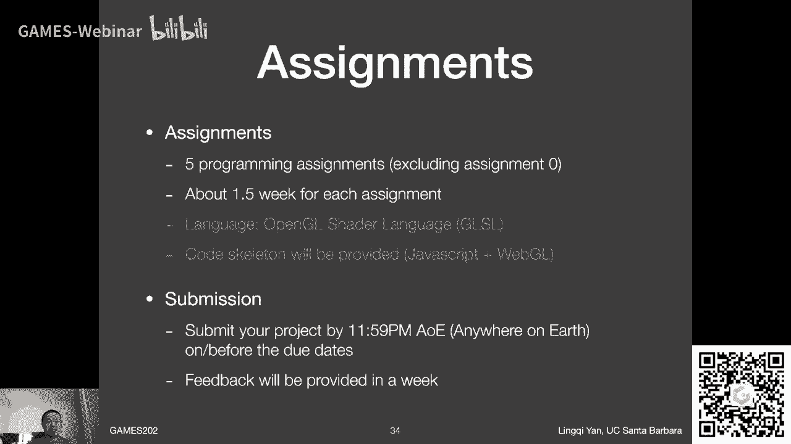

其实已经做出来了，大家可以看一眼，大家会不会发现特别中二对吧，二次元，然后大家会发现还有个很很用心的细节，就是202诶，怎么样，所以说嘛，我觉得这个我们的呃，助教同学们也是是非常非常优秀的同学们啊。

然后也非常上心啊，非常感谢，做的非常好，那么大家之后呢，就会在这套框架下继续再去完善大家的作业啊。

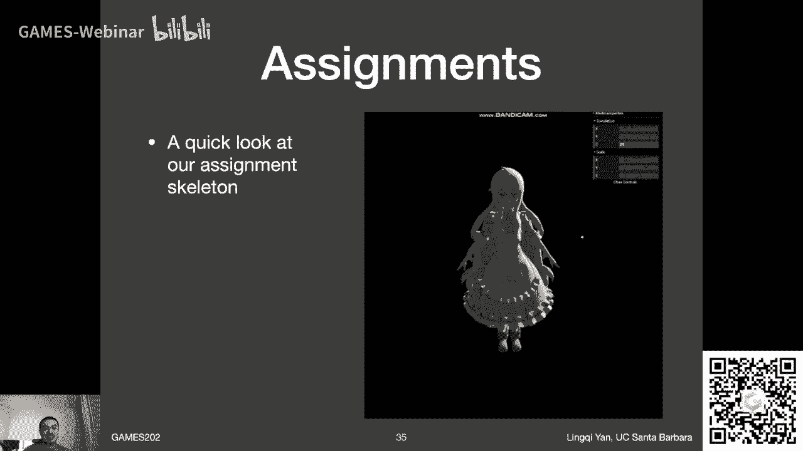

OK那咱们这就这样呃，关于作业的提交呢还是一样，我们用之前的所谓私彻呃系统啊，然后大家现在就已经可以注册啊，应该没问题，如果我没弄错的话，如果如果大家在注册的过程中遇到什么问题，及时告诉我。

但是有一点我先说啊，咱们之前的101的课程中呃，有同学反映这么一个事情，是说用QQ邮箱是不能注册的对吧，我不知道在后续201和102里面，是不是已经把它给改掉了，呃这个我不知道为什么。

这可能是这个系统本身它就是这么安排的啊，然后呃然后呢如果大家出现这种不能注册，再去换一个邮箱试试看好吗，呃我希望他已经修复了这个问题啊，那同样道理，咱们这这门课呢不会有考试啊。

基本上就是几次作业以及一次大作业，大作业同样道理，差不多中段的时候会放出来给大家一些选项，然后但是大家可以自由的去选择好吗，这是没问题，然后今年呢我们根据时间来看看。

有没有办法能够做一个所谓show off环节，给大家展示一下，做的好的呃，就是特别酷炫的呃，结果好吧，然后呢这次主要跟大家说的事情是呃，不是就是有一点和101不一样的地方，在于这里大家如果上过101。

应该记得我之前跟大家建议说啊，说我们要学习啊EK的genius部分，而不要学freak的部分对吗，没错，所以我建议大家去用一个用集成开发环境去做，我们的games101作业，但这里我怎么又说不需要了呢。

而这个事情啊不矛盾呃，首先IDE如果你不知道的话，集成开发环境类似于什么visual studio之类这些东西啊，就等于说你直接包括编译，包括debug，包括别的这个代码分析，所有东西都在一块了。

而他最重要的事情，我之所以games201会建议大家这么用啊，就是说呃因为你涉及到要开发一个工程，你需要知道这些整个的各种各样类之间的，不同的结构对吧，因为整个一个工程可能是几十上百个文件嘛，那么多。

然后如果有一个自动分析，自动补全的一个工具，它会非常好啊，是这么一个意思，我是出于这么一个考虑，那么对于这门课为什么我建议说没必要啊，我只是说没必要，我不是说不建议用IDE了哈，呃为什么没必要呢。

是因为你这次主要是在写SHADER啊，基本上来说就是单文件嗯，几个文件吧至多了，所以说呢如果是单文件的话，而且SHADER这个语言本身，我觉得大部分id分析的都不太好。

所以说嗯这次呢就没有什么必要去用IDE了，一些文本编辑器非常欢迎啊，如果大家用slime text的话，来了这些啊，然后这些都可以，当然大家还可以用回vs code啊，用用一些其他的这些东西啊。

绝对没有问题，有一些在线的一些编辑的软件应该也没有问题，所以这次呢是主要是，因为这次大家要集中在一两个文件上面来了，工作啊，这么一个意思啊，OK啊所以不矛盾之后呢，如果大家看情况啊。

在不同的课程中开发不同样呃不同的呃作业啊，工程呀，像这些呃根据需要来去选取这个事情好吗好嘞，那OK这样的话啊，这就是呃我要说的关于IDE的事情，那么既然是做作业吧对吧，做作业呢肯定要独立完成。

然后还是一样跟之前一样呃，尽量不要把代码框架拿到那拿拿到网络上面去，因为呃这门课呢，以后肯定还会有更多的同学要去要去学习嘛，嗯然后如果说到时候大家提前看到答案，那就不太好了，对吧啊，这是这是这个事情啊。

但是欢迎讨论说你要有任何的问题什么这解释，如果有同学有问题，你要回答他，那没有任何问题，好吧啊，OK这就是关于作业的事情啊，我再暂停一下，我来看一下同学们有什么其他的问题啊，OK嗯哎呀，OK好吧。

至少我现在所能看到的这些弹幕哈，如果没有，这边哦，有同学说能不能自己写框架，可以啊，欢迎欢迎自己写框架啊，没问题，参考答案的话，参考答案还是够呛的，这个事情，就是说我尽量不是。

不是特别希望能够把答案给公布出来，但是我们会给更多的参考图吧，这样就是说你希望比如说每一步的中间结果，你大概能够做到一个什么样，这就对了哈，这么个意思好吧，作业合格会有证书吗，有啊，当然有games的。

每一节课，每每一门课都会有啊对吧，卡通渲染啊，之前我说了，卡通渲染肯定是属于非真实感渲染的一部分，它主要是技术环节，我会提它的它的基本做法，但不会具体到呃什么什么效果，怎么实现实现这么一个事情。

好会有作业检查诶，什么意思呀，作业就是提交了，当然就有助教助教来批改呀，对不对，好啊哈哈，看起来对就是对的是吗，对于实时渲染来说，还真是这样啊，我这么理解啊，那行啊，那我就继续了。

那就是说这刚才讲的那基本上是这节呃，这呃咱们整个一门课，他的最最呃重要的一些内容吧，然后我现在开始来说，咱们这节课要跟大家说的东西呃会挺多的哈，那我就继续了，OK好，那么今天的这个课程内容哈。

课程内容要说的是什么呢，呃首先就是说我们要学呃，这门课到底是呃呃为什么要学实时渲染，实时渲染存在的意义是什么，然后就是说它的嗯他的一些发展史，基本上来说咱们就过一遍啊，这个意思这块会非常快啊，啊我我呃。

然后呢会给大家列出来一些，就是我会觉得嗯在呃实时渲染的发展过程中，呃一些重要的啊里程碑式的呃成就啊，这么个意思，那咱们就从第一点开始吧，就是说呃目前来说就是渲染来说，咱们大家都已经说了。

要做到什么效果呢，PHOTOREALISTIC对吧，就是照片及真实感，咱们之前提过，然后它里面就涉及到大量的一些呃计算要处理，比如说复杂的几何光照材质，然后你要做的阴影，对不对。

然后呢嗯在各种各样的领域，比如说电影，然后呃，呃这些里面都会用到一些所谓什么特效啊，这些什么东西对吧，这些都是非常非常呃跟图形学相关的东西，就是大家希望把这些东西做得非常真实。

然后大家能不能做到非常真实的能啊，就是就是说大家现在呃对吧，我之前给大家展示过这些这些图啊，都是假的，都是假的，都是图形学这么渲染出来的，3D建模出来，然后渲染出来大家可以看到非常厉害，对不对。

可以是可以，但是咱们今天的一个解释是可以，但是这些方法往往不能够兼顾质量与速度对吧，咱们之前说了，实时渲染就是考虑什么呢，就是要考虑a real time和这个high quality两个都想做到。

那所以说呢就是说呃这些就叫做offline rendering，对吧，然后就这些这个呃就是说这些比较慢的方法，但是能够算得准的方法，那我们都管它叫offline rendering。

然后之前的一个呃栗子对吧，大家见过，在utopia里面一帧渲染需要多长时间呢，我记得当时给大家的答案是1万个GPU hour啊，Gpu hour，GPU CPU hour啊，这样说不准确啊。

CPU CORE hour才是对的，就是一个和要跑上1万个小时，那当然这是一个非常烧钱的事情，对不对，那么对于实时渲染来说，就是要在一些合理的近思想，我们要找到最最最最接近的结果。

然后也就是说看起来OK的结果，刚才有位同学说的非常对啊，就是说我就是希望他看起来OK，那么大家可以看到实时啊，离线渲染左边这么一幅图啊，离线渲染的结果是不错的，那么在实时渲染中。

比如大家看到最终幻想15，刚开始老师给大家打过，就知道这个车子坏在路上，大家会看到这个车子做的非常的酷炫，当然这种截图截的不怎么好啊，看不出来这车有多么对，这个呃厉害啊。

但是这这块儿嗯就是我想说的是实实现实，现在来说做一些牺牲，但是也能够做到一些看起来不错的结果，但是这个事情说起来容易做起来难，就是说你可能做出来了很多假设之后，他看出来了，结果仍然不怎么好。

这么个意思就是你如何做出来了，假设越越又少得出来的结果呢，又跟真实的这些啊，我们认为啊离线渲染是真实的，就是跟真实的离线渲染又能够相比，那是最好的，对不对，这就是我们的根本出发点。

说呃实现实实时渲染到底是为什么要这么做，对吧好，那么呃实时渲染呢它是呃是有一个怎么说呢，非常丰富的历史吧，甚至来说他可能比离线渲染还要嗯长，我这么理解哈，最早呢大家可以看到这里。

就是就是说当时呃很早期的时候，大家就可以用这这些呃实时渲染生成一些什么，大家看起来就很古老的一些这么这么一些图哈，对吧呵呵然后呃这算是挺早的时候了，然后嗯在20年之前，然后实时渲染3D的实时渲染啊。

就是进入到了游戏的这个行业里面，呃一个典型的代表就是最终幻想七，最终幻想器当时是在那个呃索尼的PLAYSTATIONY啊，上面发布的时候，当时大家看这个画面，就觉得这个画面已经无敌了，对不对。

那咱现在再看这个画面，就会觉得这怎么那么多三角形是吗，哈哈哈哈啊对吧，然后呢同同时代的哈，同时代的有一款这个风靡全球的游戏啊，叫做反恐精英，然后呃然后大家可以看到，仍然是非常非常有限的三角形数。

然后当时大家会呃，就是说大家既然我认为如果大家学过games，101了，大家如果当时还打这个游戏还记得的话，他当时甚至连文理的什么啊，嗯就是三线性差值什么东西啊，它它都是一个算是开销很大的一个东西。

就是这么个意思，所以说大家可以想象啊，这个实时渲染啊，当时最早的时候啊，是不是非常非常嗯呃看起来不怎么样，但是自从有了那个开始之后，那之后的10年是一个飞速进展的10年，然后这10年呢。

就是为什么会得到这么一个飞速的进展，这块是非常重要的一个历史的知识点，那就是在这里由于可编程渲染管线嗯，被呃研究出来，或者说发布出来啊这么一个意思，也就是说人类可以自由的去控制。

说我这块渲染到底应该怎么样让它进行着色，那这就是呃，给编程人员提供了非常非常大的便利，那么这样的话就可以得到非常好的效果，也就是花了10年左右的时间，大家就可以看到刺客信条二里面。

大家就可以看到非常不错的结果了对吗，然后呢大家会看到同时代还会有一个游戏，生化危机五，然后大家会看到呃这两款游戏诶，即便今天看来，我觉得是不是还是不错的对吗，然后如果说同学们没上过games101。

会觉得说哎，那我觉得今天游戏可不也是这样吗，呃然而不是对吧，在games101，我之前提过一个怎么样判断，说实时渲染渲染的好还是不好的一个标准啊，还记得吗，就是看画面是否足够明亮对吧。

比如说左边这一幅呃，这个结果刺客信条它的最大的问题就是，这分明是一个白天晴朗的一天，但是为什么在阴影的地方里面这么暗对吧，这就是显然是实时光照做的，还是稍微差那么一些啊，这个意思，然后呢在最终幻想啊。

最终幻想这叫生化危机啊，生化危机五里面他的问题在哪里呢，这就是平常人们通常会说的另一个问题，这里再跟大家说一下，叫做油啊，然后什么叫油呢，大家可以看到这个这是第一关大boss啊，他的他的胳膊啊。

他的胳膊上面他的这块人家这个反射，这就不太真实，就感觉不像是衣服正常应该反射出来的，对不对，难受这么一个意思，然后就就会就会觉得看起来非常油，有很多这种这种效果的，大家会看到在嗯之前的10年的游戏里面。

这这样的效果会越来越少啊，这个意思也就是说画面是在不断进步的，只不过你会觉得说这个进度可能没有，不是30年到呃，不是20年到10年前这样的一个进步大啊，这么一个意思好吧，就看起来非常油啊，这么个意思啊。

一个是看起来暗，一个看起来油，这是当年的一些游戏的问题，那么到了今天，当然这已经不算是今天了啊，2018年大家可以看到诶虚假的战神这里啊，然后大家可以看到这些效果基本上就没了，对不对，画面非常的明亮。

然后大家可以看到这个奎爷他的这衣服上面，什么东西，它就没有那种非常非常不自然的高光了，对吧好啊，OK所以说呢呃现在大家追求的是什么呢，叫做stunning graphics，对不对。

就是说嗯嗯真正的这叫什么呢，就是stunning怎么翻译啊，啊唉就非常好吧啊，就是这样了，就是OK那就这咱们就先这样，就是说呃，现在啊大家需要追求的就是stunning graphics。

然后呢我还想提一下，就是real time rendering啊，他在现在来说应用的更加广泛了，这一点呢倒是说呃和我们之前所说的，整个游戏的这一脉是不太一样的，什么呢，就是现在的实时渲染嗯。

被广泛应用在虚拟现实和增强现实里面，呃比如说大家看到这款游戏对吧，这是虚拟现实的一个游戏，当然大家可以看到，受制于啊这些移动设备呢呃表现能力，然后他们会有有很大的画质上的牺牲。

当然这也就给了实时渲染的一些呃，更多的研究机会是非常不错的，然后呢一个更有意思的事情，甚至以后可能成为一个趋势哈，这里是什么呢，是已经有人开始用实时渲染的技术去制作，平常我们认为只有离线渲染技术。

可以做的电影了啊，或者说是连续剧啊，就是说所谓animation啊，就这些已经可以用啊，这些呃实时渲染的技术来做了，比如说大家刚才看到的虚幻引擎五对吧，虚幻引擎五大家看起来了诶。

他这个做的已经完全是电影级别的画面了嘛，对不对，这么好，就算他慢点没关系，那我用它来生成一个电影来说，我是不是就不需要一个所谓CPU farm，然后一堆CPU在一块烧钱呢，对不对。

我就可以用实时渲染的方式，然后我来生成整个一部电影，那就非常好，我觉得以后肯定会就是短期的几年内，就应该可以看到这个呃，更多呃用实时渲染的方式，然后制作的这些电影是什么东西的好吧。

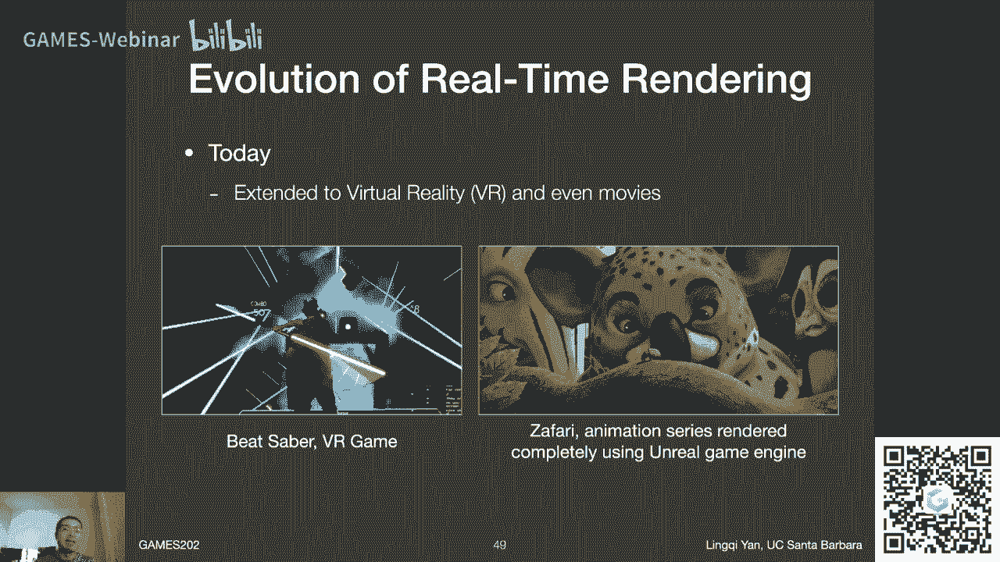

另外一点呢就是说呃在实时渲染上，大家可以看到，这是之前另外一个虚幻引擎的一个例子啊，就是虚幻引擎有很多炫技的一些一些例子，这个例子我非常喜欢，为什么呢，是因为他呃看起来非常有美感啊。

然后就是说整个这个场景又真实又又又有美感，当然大家已经从叶子的边缘，在所谓depth of field之外的区域，模糊的区域，看到叶子边缘已经不怎么特别真实了对吧，但是大家可以看到这草地这个啊树啊。

这算是蜗牛吗啊，其实我一直一直不知道那东西怎么念啊，就是纲手召唤出来的那个东西啊，然后大家可以看到这个苔藓对吧，嘿嘿嘿嘿，OK咱们就咱们就到这了啊，就是说这块嗯差不多就是说呃可以做的非常好。

然后大家可以看到这个例子，大家之前肯定已经见过了对吧。

实时渲染实时光线追踪的例子，那么这里呢有大量的这种很闪耀的一，些反射对吧，然后这就是这个例子做出来，就是说呃，那正是之前的这些所谓图像空间的一些方法，是做不到的，然后说我们都会说啊。

那咱们这就得这个也就看到这儿啊，那么未来呢未来是一个什么样的情况呢，没有人知道对吗，未来也许是会像黑俄帝国一样啊，我们之前在games101的最后给大家说过，这事儿对吗，就是说啊啊。

就是就是就是未来会不会是由所谓graphics people啊，然后做出来整个一个世界，然后可以统治所有人哈哈非常好的一个愿望哈。

然后包括大家也可以看到说这个之前ready player one，头号玩家对吧，这里面的整个这个世界吧，基本上来说就是由一个非常破败的现实世界，和一个非常非常嗯厉害的虚拟世界组成的。

然后他们这个设备叫ASIS对吧，而且不只是有这个观感。

还还有触感，这个是非常厉害，OK好吧，这个也就看一眼好了，然后呢呃这就是快到最后了哈，咱们这节课的最后嗯主要是说什么呢，这么长时间的发展，有哪些技术是非常非常重要的，那首先有一点肯定就是要说的是。

这个可编程的渲染管线，就是20年之前呃，vertex shader和fragment shader，这两个着色器，已经就是可以由呃编程人员自己来写了，那就非常好，就提供了非常厉害的一个呃可能性。

那么这里其实是一个例子啊，这就不给大家放了，这是嗯就是当时早期的，但是那个时代啊看起来了，简直了跨时代的东西，然后呢可编程渲染管线，咱们早就已经跟大家讲过了对吧，就是关于所谓的嗯。

就是vertex的processing阶段对吧，然后fragment processing阶段就是顶点和片段的着色，然后现在呢当然更多的部分都可以被呃，拿来编程，甚至还有一些通用的编程的着色器。

叫做叫做计算机端，我不知道是不是这么翻译，compute shader啊，然后就是说我们这门课来说，就是说涉及到呃图形学的相关科学的部分，我觉得是没有必要用到这么复杂的这些实现的。

我我我嗯大概我考虑了一下啊，关于我们的嗯，这些作业里面基本上还是只需要用到呃，顶点和片段啊，差不多这么两个事情，那咱们下一节课的复习，基本上也是主要是这个内容好吗。

嗯然后另外一个非常非常重要的东西是什么呢，就是呃预计算预计算的这样这样一套理论，就是我们刚才跟理论，跟大家已经提到这件事情了对吗，就是说我可以把很多复杂的一些啊要的效果啊，在渲染之前我就把它算好。

然后呢我利用一些存储上的代价，我让我在渲染的时候可以达到实施，也就是说我把他的计算机的这些复杂的地方，可以转移到渲染之前，那我在渲染的时候就可以变得非常快了，是不是这么个思路对吧，那所以说大家可以看到。

这是这是当时做出来了一些非常不错的效果，包括那个跳舞机器人啊。

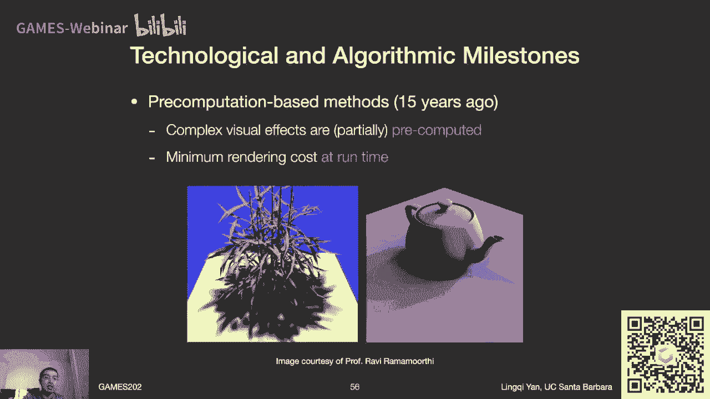

然后嗯就是以及包括大家看到这么一个例子啊，然后大家可以看到那个时代，就是应该是微软亚研院做的这个论文哈，非常厉害，然后这个这一个金属的龙还可以在上面画啊，是实时的在上面画，然后还可以在这个地板上画。

地板上还可以磨出来一些东西啊，可以看到非常非常高端的一个栗子，然后大家可以看到一个恐怖的东西是什么呢，是他的FPS，看左上角，这可是那个时代啊。

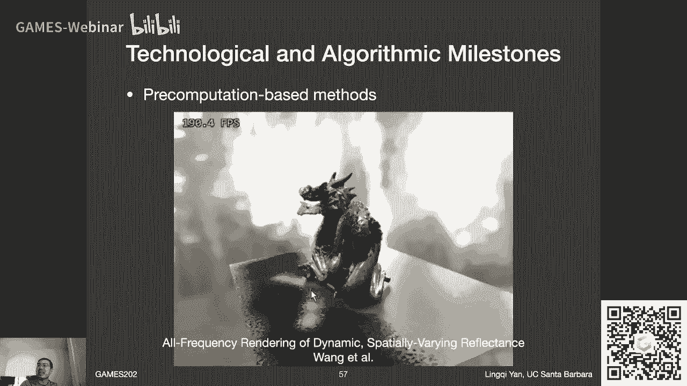

那个时代是二代FPS啊，想一想现在来了对吧，所以说预计算这个东西非常重要，而且预计算呢这块我说他还有一个，这个怎么说呢，我值得说的一件事情啊，就是说在预计预计算，就是当时是主要由所谓球面斜波函数。

这一系列的奇函数，然后他们的发展来推动的，而首次把球面斜坡函数引入到图形学中的，正是我博士的老板，然后RAVIRAMSAY教授啊，他是厉害的不行的一个人，相当于是引领了一个时代的人啊，OK啊好。

所以说这里说一下这个这个事情啊，就是说他可以做这种呃，这种各种各样不同的应用啊，这里当然是另外一种应用，我们之后再给大家说吧，今天时间还是稍微有限一点，那么另外一个事情呢。

呃嗯就是一个重要的里程碑式的东西，我的理解是什么呢，是interactive级别的光线追踪，就还不是现在的实时光线追踪，就是在八到10年前啊，就已经有人可以做呃这样一个事情吧，什么呢。

就是相当于我在GPU上，我用非常低的采样率，然后我去得到一个呃，呃某一个比较就造成很多的一个结果，然后但是我之后可以快速的做一遍降噪，然后在很多GPU的加持下，我就可以把它呃就就可以做得非常好。

就是实时的一个呃，将近实时吧，就是或者说interactive级别这种速度的渲染，然后甚至PIKA呢，当时很早的时候就拿这些东西拿过去，给艺术家们去帮助设计场景，因为这样的话。

他们可以更快的就可以看到这个场景之后的，结果是什么样的，如果真的好好渲染了之后，结果是什么样的，包括现在大家也还在这么用，那也就是说实时光线追踪，其实它的理论基础很早就已经有了，在八到10年前。

那么现在来说，实时光追踪在这种硬件的这种突破下对吧，增加了这个RTR的这么一些东西，能够更快地进行光线追踪，那么它背后的重大的挑战又是什么呢，那咱们之后会说好吧好嘞。

那这就是差不多我理解的就是之前的一些啊，一些所谓里程碑式的发展，当然我也没说real time retreating，现在不是啊，只不过我们想想说什么东西是里程碑，它得经得起时间考验。

现在来说可能还是早了一点，但我相信他是这个意思，那么到此为止大家有什么问题吗，我来看看啊，嗯有同学说我后期会不会讲spherical harmonic啊，这这这意思啊，球面斜坡函数。

Spherical harmonics，简称SH会讲啊，会讲computer shader不会提这个意思呃，硬件方面优化不会讲啊，然后啊OK啊，录播，录播之后会有的啊，我看一下哈。

啊有同学说会不会说粒子效果会啊，会提到一点点，作为可能最后一两节课说一下这些技术吧，啊然后像这些烘培效果这些不是叫效果了，就是方法什么的，也多少会提一些，这作为一个重要的，也算是预计算的一部分好吗。

然后我来看看啊，后面呃呃本课主要在写SHADER嘛，不太合适啊，但是你确实在做这件事情，主要在学学的背后的东西啊，这个意思嗯，工业界做研究，这个我不知道啊，工业界做研究有很多限制的。

这也是我为什么不去工业界的原因嘛，嗯OK嗯嗯后期处理会也会提到一点点啊，会提到一点点嗯，三维重建和实时渲染有关吗，没关啊，这是他们完全没有关系，但是啊我正好在为黄金星老师做一个广告。

后续的课程games啊，这干涉多少了，203了，我记得是他来说那个吧，来说呃呃三维的实时重建吧，应该是这一三维视觉对整个三维视觉啊，水体渲染能达到实时嘛，能嘛，我猜能，但是你得看做到什么样的效果对吧。

你之前打过刺客信条黑旗吗，不是做的挺好的吗，海战的那些海对吧，光照估计是什么呀，我都没听说过什么叫光照估计啊，VFX又是什么呀，这可能会这可能偏工业界偏的多了一些哈，然后我尽量我也多学习一下对吧。

向大家学习一下这些这些概念都是什么，也许是嗯我只是另外一种嗯，怎么说另外一个名字在在学同一个概念，KNP2学习资料没有，我还真不知道这块，但是问得好，但是问得好啊，就是我想想办法，我也找一找吧，好吧。

等到讲的时候，到时候我看能不能提供一下嗯，OK嗯还有一系列的新课吗，我是没了哈，如果我之后要再开离线渲染的课，肯定还是二开头，甚至我会我会拿他，如果有的话，会愿意拿三开头，因为它会难一些啊。

这个意思好吧好嘞，差不多吧啊，然后就是说我觉得今天呢就差不多都说到了哈，然后啊呃下一节课说什么呢，糙快猛复习哈哈这个一些重要概念嗯，比如说之前我们所提到的渲染管线，以及特别是这些着色语言。

我说的更详细一点，然后复习一下渲染方程和基本的微积分知识，那么差不多就这些好吗，那所以101202303404吗，同学你这反应也太快了，这是行行行啊，OK啊，那么今天就到这儿了哈，今天就到这儿了。

那咱们的呃政客就算是结束了，那另外有一点呢，就是由于我现在呃算是自己掌握这个直播课程，到时候呢呃我会啊，我会把我会把什么呢，我会把这边呃视频及时上传到B站上啊，所以呃OK那就先谢谢大家啊，今天到此结束。

Ok。

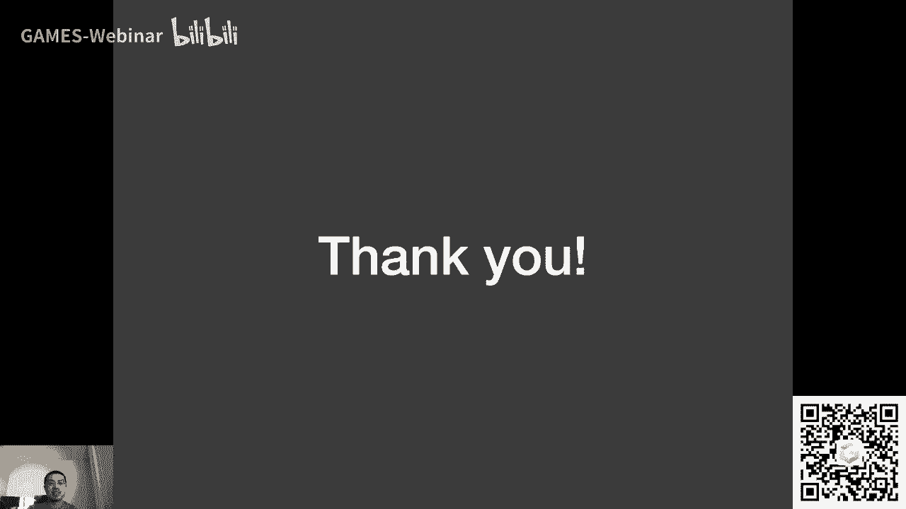

诶OK虽然我关了这个队，但是由于我现在自己在播，我好像，好没问题没问题，那这样哈，如果同学们还有些什么其他问题的话呢，呃那下一节课还是一样的，找个什么5分钟10分钟来啊，大家都欢迎问我好吗啊。

就这样啊嗯行，同学们再见，我下播了哈。