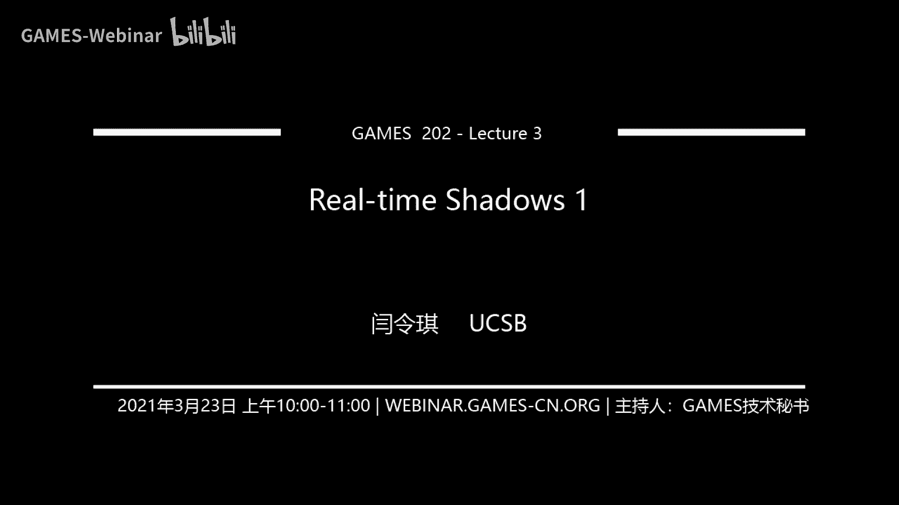
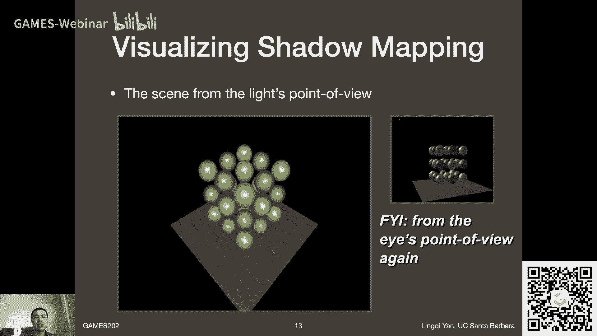
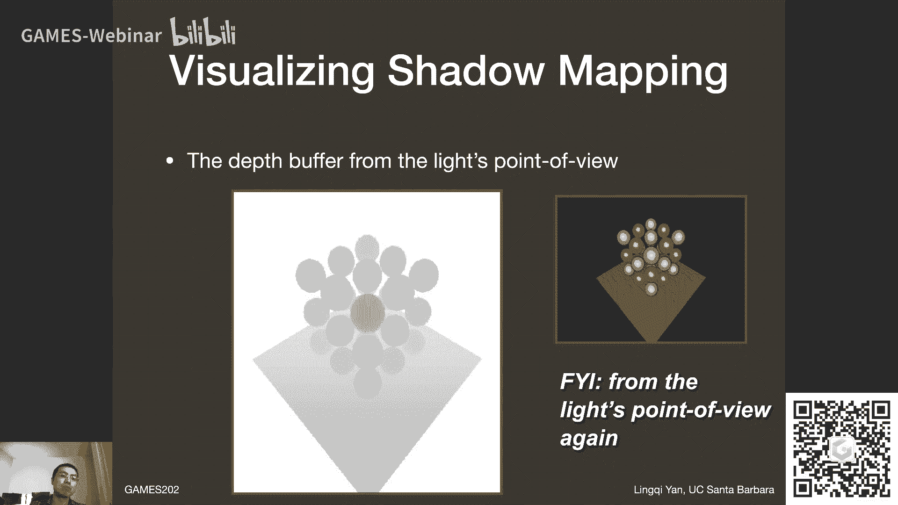
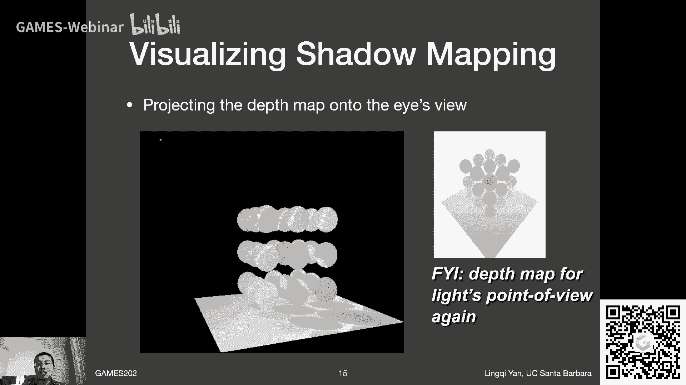
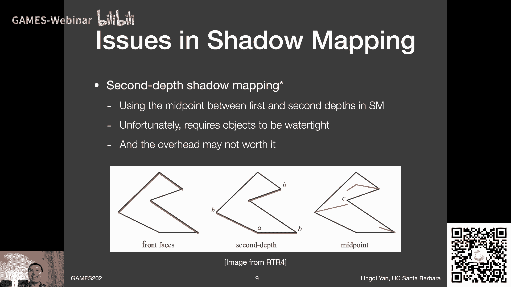
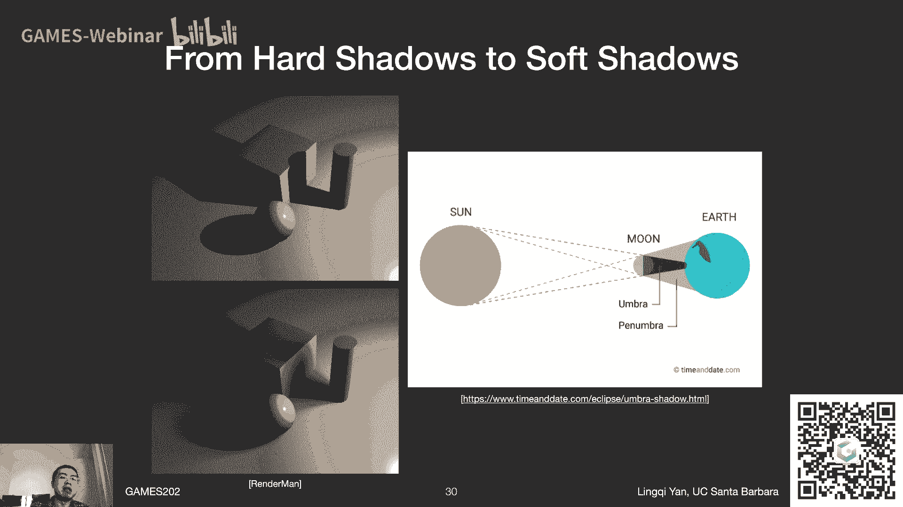

# GAMES202-高质量实时渲染 - P3：Lecture3 Real-time Shadows 1 - GAMES-Webinar - BV1YK4y1T7yY

Hello各位亲爱的同学们。

我们又见面了，今天我们来说Games202的第三讲，然后从今天开始，我们要开始讲一个话题，我们将用两节课的时间来说，实时阴影的渲染，OK那么今天是第一讲，在这之前有几个事情跟大家说一下，第一。

就是说我看有很多同学已经开始，在玩起了作业0，而且感觉要被玩坏了，这个行，大家喜欢，我自然会觉得非常好，这也就说明作业0帮助到了大家，大家可以用它来上手，挺好的，好吧，那么作业一，按照我之前的安排。

这周很可能是和咱们的下一节讲座，一起发布，好吧，然后咱们拭目以待，当然了，我们的助教同学们非常辛苦，这里还要向他们表示感谢，好的，作业一差不多这么安排，然后作业一的内容，自然就是和实时的软硬相关。

我是希望大家去实现一下，这节课要讲的PCSS，Percentage Closer Soft Shadows，至于怎么翻译之后，我们就算了，像这些术语就会越来越复杂，咱们就不翻译了，PCSS。

然后这节课讲PCSS，但是还不太够，可能还需要下一节课开始的知识，差不多咱们这么安排，然后我简单的调整了一点点课程的内容，然后这里从哪可以看，可以从我们的课程主页，这里会反映出最新的内容的改变。

虽然我就是这三讲，调了一下顺序而已，好吧，那么，比如说这节课，咱们原本安排是讲，Variance Shadow Mapping，对吧，然后我们现在要改成说，我们这节课来讲PCSS，因为我想了一下。

这毕竟还是一方面是基础，一方面是现在大家在用的东西，比较重要，咱们先说，好吧，然后关于这本书，这本书我要来澄清一个事情，就是说上一次我说，这本书咱们不作为要求去参考，可能有同学会觉得这本书。

当真是没什么意义，这是不对的，这本书是非常好的书，然后我们这节课，我们这某一课，确实有很多的主题，是从这本书里可以查得到的，特别是第4版，我之前我一直在看着第3版，我觉得它不够新，然后所以说。

如果现在让我重新推荐大家的话，我会欢迎大家用这本书的第4版，来当做一个参考，然后它的参考就好像什么，以我的感觉，就好像说，我们在上数学分析的课，然后你拿一本，高数的书，其实并非不合适，可以作为一个。

咱们要讲什么的一个目录，或者是一个大纲之类的事情，然后但是这本书，绝对不会讲得那么深入，然后我们这个课，可能讲的稍微难一点，会讲一些它背后的一些知识，好吧，这么个意思，好，那么，确实推荐用这本书。

咱们改一改说法，好嘞，还是一样，我们会多讲这些思路原理，而不是会针对说工业界是怎么做的，只讲方法这么一种方式，好吧，那么上一节课，我们已经提到了一些，关于计算机图形学的基础知识，对吧。

比如说我们之前说的硬件的渲染管线，然后OpenGL的基本理解方式，对吧，理解成画油画，然后我们说了怎么样去理解，然后上手去写，GLSL这种着色器的语言，然后我们就开始复习了一点，关于渲染方程的知识。

然后我说我们要，我说我们要复习一下，维基分，结果好像没时间了，没时间了是这么回事，我好好思考了一下，我们这门课要讲东西其实非常多，非常多，这怎么说，就是说，我是很想安排一整节课，来好好复习一下维基分的。

但是这里就算了吧，穿插到每一节课里面，如果我们要用，比如说咱们这节课很快就要用，用的时候，我来提一句，反正我觉得肯定不会缺失一些内容，这样的话，咱们也省一点时间，好吧，这样安排，咱们这节课的开始。

就不会从复习维基分开始了，好吧，那么咱们从什么开始，咱们要从，shadow mapping的基本知识上，来开始说，然后我们在Games 101里面，提到一些基本怎么样做，这么一个概念，对吧。

shadow mapping怎么做，然后我们会在这门课里面，在这节课，我们会多分析一些问题，然后以及它对应的一些解决方式，然后咱们把这一块，相当于是硬阴影的绘制，说清楚，然后我们开始回顾一下。

说我们shadow mapping，到底它背后有什么样的数学原理，为什么我们可以这么做，这块就是我所说的事情，也是我愿意说的事情，就是RTR这本书里面没有的，然后想跟大家探讨一下，对吧。

关于这些实时渲染和离线渲染，或者说基本的渲染知识之间的联系，所以我非常愿意说一些这些话题，然后我们就会说到这节课的重中之重，就是percentage closer soft shadows。

那么在说之前，我先说清楚，这percentage closer软阴影，它这个方法比较古老了，但是它却是现在的所谓state of the art，也就是说中间大家做了很多各种各样不同的探索。

但是最终大家还是选择了，用这么一种方法来实现软阴影，当然不一定，就是说我说的是多数，现在可能认为说，如果大家提到软阴影怎么做，那就用PCSS这么个意思，好吧，那行，咱们就先开始第一部分。

shadow mapping的一些简单回顾，不过在这之前我先看一下，有没有同学问什么问题呢，有同学说RTL4是有翻译的，是吧，那不是挺好吗，不过话说回来真的，就是这本书写得非常好。

英文就包括之前我们说虎书也是一样，这些英文写的都非常不错，然后大家就直接看，我觉得不会有什么问题，好吗，特别是大家不是从头开始看，对吧，比如说大家在学这门课的过程中，比如我们讲到哪。

比如现在在说shadow mapping，大家就可以对着shadow mapping的，那么一那么几张，来看一看，没什么问题，另外给大家展示一下，我是手头是有一本实体的书的，我为什么看不见呢。

那是因为有延迟，看一下，可以可以没问题，好，那么咱们回到shadow mapping这个话题上来，课上不只会讲点光源了，我们要讲软阴影，怎么会只是点光源呢，对不对，哈哈哈哈，好。

那么咱们当然要从点光源的shadow map开始，咱们先说清楚，要渲染一个点光源，在场景中投射出的阴影，我们要怎么做呢，我们要用shadow mapping的技术，这个技术要怎么做呢。

shadow mapping，我们在Games101里面简单提过，它是一个两趟的算法，什么两趟呢，也就是说我会渲染场景，渲染两遍，那么第一遍渲染场景的时候，我是认为我会从light所在的地方。

看向这个场景，然后并且渲染一遍场景的时候，输出一个，这个light所能看到的，最前的，或者最近的深度，这就是所谓的shadow map，那就是第一个path，那么有了这张shadow map之后。

咱们就可以之后的path都用它，对吧，咱们上节课已经说了，这是一个，每一个path它输出的texture，这文理可以拿到后面的path里面去用，那么后面的path是什么呢，那就是第二个path。

我真正的从我的相机的位置出发，我去渲染一遍整个场景，我用这样一种方式，渲染整个场景，我在这个过程中，再配合着，刚才light path，我得到的shadow map，然后我就可以去检测。

我现在的相机所看到的，任何一个点，是否在阴影里，或者是否能被light所看到，这么个意思，大家应该这些算法，基本算法还记得，对吧，然后确实回顾一下，咱们上节课为什么要说，opengl。

它的各个不同的path，一个场景，它为什么要渲染不止一遍呢，这就是一个非常生动的例子，对吧，我们要渲染两遍，第一遍是为了拿到shadow map，然后第二遍才是真正的渲染，对吧，然后也同样道理。

这里也反映了说，frame buffer，然后和texture，然后就是说，我如果从light去渲染，我要把它渲染到一个texture上面去，而这个texture，就是我要的shadow map，对吧。

大家对照着这么一个算法的思路，然后想一想，opengl，我应该怎么样去实现它，差不多这么一个思路，那么shadow mapping，是一个完全在图像空间中的算法，那么它的好处就是。

一旦shadow map已经生成了，那么就相当于shadow map，就已经可以作为，场景中的一个集合表示，可以这么理解，那么为了得到阴影，你只需要shadow map，你不需要实际的场景的集合。

这是一，当然既然是这么做了，那也有它的坏处，它的坏处是什么，我们要特意说两个事情，在咱们回顾完shadow mapping方法之后，说两个事情，第一，就是它的，所谓self occlusion。

这要怎么说，就是，自遮挡现象，会出现这么一种情况，然后另外一个，它会有走样的现象，也就是有锯齿发生，好，咱们待会再具体说，另外shadow mapping，它是一个非常家喻户晓的算法，可以这么说。

做实时渲染，肯定是要从这里开始了，对吧，那么shadow mapping，甚至在最早的情况下，在离线渲染中，也是一个非常有用的，生成阴影的方法，就是说最早的时候。

比如说像pixar的random map，对吧，他们做，这叫什么，toy story叫什么来着，玩具总动员的时候，那个时候还没有什么光线追踪的方法，来做，离线渲染，也就是说离线渲染，即使是光线追踪。

其实对于离线渲染，都已经开锹太大了，这么个意思，所以那个时候用的方法也都是，比如用shadow mapping，来生成这些阴影，这是基本的一些概况，那么它是怎么做的，两趟，对吧，第一趟从light出发。

看向这个场景，然后我要生成一幅图，什么生成一幅图，就相当于是对于每一个像素，对吧，我可以看到一个什么东西，我看到的，这个像素里面的东西，我就只记录它的最浅的深度，就是这么个意思，大家可以看到。

我有很多个不同的像素，它们各自看到的最浅的深度，或者最近的物体，它们的位置在哪，然后我把它存下来，这就是第一步，对吧，然后我就得到了一张texture，然后这一步完成，那么第二步我要干什么。

第二步我从眼睛出发，然后我要再渲染场景一遍，然后对于这次，我渲染的每一个像素，我都要来看，它是否能被light照到，如果能被light照到的话，它就不在阴影里，如果它不能被照到，那它自然就在，对吧。

大家可以看这么两个点，那么第一个点来说，大家可以看到，我在场景中看到这么一个点，如果我连向light的话，我会发现之前，我在light上面，记录了这么一个shadow map上，对应的位置。

它记录的最浅深度，就是这个深度，那也就是说，当前这点到light的距离，跟我之前记录的最小的，light，往这个方向能看到的距离，是一致的，它就可见，否则什么情况，咱们来看这样一个例子，否则的话。

大家可以看到，对于这个点来说，很明显，这个点它连向light的时候，你会发现，它离light这么远，但是如果light往这个方向看，它会看到一个比它更浅的物体，是上面绿色一个小圆的点，我把鼠标停留一下。

是这里对不对，之前shadow map记录的是在这里，也就是说shadow map上，记录的深度要更浅一些，这样的话，就是说明light是不可能看到这个点，也就是说这个点一定在阴影里，对吧。

还记得这么一个基本操作，那么shadow map的效果怎么样，大家可以看到，这是非常不错的，对于这么一个复杂场景，虽然来说有同学说，这场景怎么能算复杂，虽然这个场景的几何不算复杂，但是他们的遮挡关系。

算是挺复杂的了，对吧，这些球一个会叠另外一个，然后大家可以看到，这是一个场景，然后light在左上方，然后它会投射出来一个阴影，在这个平面上，效果非常不错。

对吧，然后如果我们要对比，说有阴影和没有阴影的区别，大家可以看到，有阴影的话，大家会明显的感觉到，多了一种未知感，大家就知道这些小球，他们都在哪，而不是让人感觉是一个非常，完全悬浮的。

和后面的背景没有任何关系的，就是贴上去的一个感觉，对吧，所以说有阴影是非常重要的。

那么在game 101里面，我们还做了这么一些探讨，对吧，如果说我要从light的方向，去渲染这么一个场景，这也正是我们的第一趟，对吧，生成shadow map，不过生成shadow map。

我们可不需要生成一个，shading的结果，像现在大家看到了，大家现在看到的，就是说，如果我真的在light上，那个位置上，放一个camera，然后他对着场景，看过去，会看到什么。

就是真正shading之后的结果，对吧，大家会看到这，但实际上我们更关心的是。

我只需要在light这边的，这个path，我去渲染出来一个深度的，一个buffer，也就是相当于对它的output，我只需要写入GLFragColor，里面只是它的对应的深度，就好了，对吧。

然后大家看到了，这幅左边这幅图，自然就是对应深度，大家还可以看到，对吧，比如说颜色深的，那是当然表示偏黑，偏黑是什么意思，值比较小，对吧，也就是说比较近，当然大家可以看到，这中间这个球。

离大家是最近的，这是非常对的，没错吧，好，那么大家在实际渲染的时候，在第二个path里面，对于任何一个像素，你也都可以计算，它到light的所谓深度，对吧，然后再和shadow map上。

记录的深度来比较，那就是这么一个思路，对吧，这里讲的稍微快了一点，这是因为咱们CMG101，之前都学过这些，所以大家是明白，就算是一个复习，好吧。

那么基本上来说，就是这么一个思路，然后它就可以得到一些，不错的结果，好了，那么这就是我们之前所说的，shadow mapping的技术，然后我这次说，特意说到这两个path，然后大家在OpenGL里面。

按说就可以，应该是可以，简单实现出来的，还真有同学问OpenGL里面怎么做，就是因为OpenGL里面，你的第一个path，你就真在那儿放一个相机，然后往某个方向去看。

定义它要写到某个frame buffer，然后写到某个texture，然后你在fragment shader里面，你要规定你写的是一个深度，而不是一个最后，所谓什么phone shading。

得出来的结果，对吧，咱们刚才说过，然后第二个path，就只要用这个texture就行了，好吧，咱们这里就不再多说，那么这里有一个小问题，有个小问题，就是说这里关于深度，如果大家之前学GAMES101。

应该还记得，我在某一节课之后，我问过这么一个问题，就是说我们在做透视投影的时候，我们说怎么理解透视投影，我们可以把它当成是两步，第一步先把透视投影给挤压成，平行投影，对不对，还是叫正交投影。

我已经不记得中文了，然后先把它挤压成一个长方体，然后再把它拍平，对吧，这么一思路，然后我做挤压的过程中，中间的那么些点，或者说三角形，或者顶点，他们应该是会向近平面移动，还是向远平面移动，对吧。

我问过这么一个问题，对吧，所以说不管答案是什么，然后如果我没记错的话，答案是所有的这些点，都要会被推向远平面，这么个意思，但是不管怎么样，大家可以看到这么一个事情，就是什么，就是说这些点。

他们在经过了透视投影之后，你所得到的z，它其实并不是它实际的，他们原来的这些几何上的点，到所谓light的距离，对吧，这是两个事情，因为它前后发生移动了，对吧，这样的话，大家在做深度测试的时候。

只需要做一个，不是深度测试，就是在做第二步，是真正生成阴影的时候，我要去比较两个所谓的depth，对吧，这时候只需要做到一致就行了，要么是说我light这边，我就都用z值，就是投影过之后。

mvp之后的z值，然后我来比较它的前后相互关系，这可以，要么我用它的所谓线性距离，就真的，我肯定知道某个fragment的位置，对吧，我知道它的位置，然后我又知道light的位置，light的位置。

因为它是个全球变量，我肯定也知道它，我知道这两点的位置，我得一向量，我肯定能算它的实际距离，对吧，所以说我就可以，也算出来一个实际的距离，这个实际的距离，你之前如果shadowmap上记录的。

也是一个实际的距离，那么你就都用实际的距离去比较，这样也可以，这咱们说清楚，这两样都是没问题的，好吧，就是用z值去比较，或者是用，就是实际的距离去比较，都是没问题的，但是要一致，这样就没问题了，好。

咱们现在回到shadowmapping上，这是之前所说过的内容，对吧，那么哪些是没说过的呢。

shadowmapping它是有些问题的，这一点是想跟大家探讨一下，之前我们是没有特别说，对吧，我们就说怎么样做，然后大家可以看到，这里有一个问题，这是什么情况，大家可以看到这张图。

首先是从RTR4这本书里面来的，然后另外多说一句，反正之后可能要说他的工作，这RTR4这本书，他用的这张图也不是RTR4，他们自己做的，他用的是一个人的图，这个人叫做Christoph Peters。

然后Christoph Peters是谁，他就是发明了，我们会说一点点的，moment shadowmap的人，可以说是相当于现在的，state of the art的保持者，这么个意思。

然后我认识Christoph Peters，我之前跟他在NVIDIA，在一块实习这个意思，然后他是标准的moment的大师，这是太厉害了，推了各种各样不同的公式，然后Christoph长什么样。

Christoph就是大家所想象的，一听到Christoph，然后能够立刻浮现出来那张脸，那就是Christoph，然后他有一小辫，德国人，然后挺有意思的一个人，然后平常我们还一直在聊。

然后之后也可能有一些合作，或者什么，这么个意思，挺有意思的人，然后他做了很多这些，shadowmap相关的工作，这就是他为了展示，传统shadowmap上，有一些什么问题，这里可以看得很明显。

我不知道这个角色，是不是真的是劳拉，还是一山寨的模型，咱们就假设他是劳拉，那么他是站在一个平面上，对吧，一个平面上，大家可以看到，他会投射出一个阴影，这些都没问题，那么问题在哪呢，很明显，对吧，很明显。

大家可以看到，在地板上有一些这些，一圈一圈的这些纹路，这都是什么，然后我看有同学说这是摩尔纹，这还真不是摩尔纹，这是它的产生，并不是由于采样造成的，好吧，它是由数值精度造成的，大家看到的，这是另外一个。

某一种纹路，这么个意思，那么它这是怎么回事，为什么shadowmap会造成，这么一个严重的情况，咱们来看一看，这是还是一样，我手绘的图，大家可以看到这么一个事情，首先我生成一个shadowmap。

我肯定shadowmap，它有个分辨率，对吧，它既然有一个分辨率，而且每一个像素，我是不是要记录一个深度，对吧，我一个像素，我要记录，它所能看到的最浅的深度，这是基本操作，对不对，那也就是说，换句话说。

在一个像素内部，它的深度是一个常数，可以这么理解，对吧，这说明了什么，说明如果我从light，看向一个场景，然后咱们就假设是场景，什么也没有，就是一个地板，好吧，然后我从light，看向这个场景的时候。

我比如说沿着某一个像素，往前看过去，我看到的那么一个位置，我就会认为，这是这个像素所代表的深度，也就是相当于，我认为这个场景说，在这个像素所覆盖的，这么一个区域内，都是一个常数的深度，也就是说。

在shadowmap看来，这场景是离散成了，这么一系列的，由红色的这些小片，形成的一个场景，它看到的并不是这么一个平面，没问题吧，咱们再说一遍，是因为在任何一个像素内，它都假设有一个常值的深度，没错吧。

它这个深度是，当然是从light出发，看向场景对应的深度，所以应该跟light看的方向垂直的，所以这么一个思路，对吗，出现这样一种思路的话，这种描述这场景，这就是shadowmap所描述的场景。

我们可以这么理解，那么它为什么就会造成有问题，那就是说，我在第二次渲染的时候，第二个pass的时候，我从camera出发，然后我会打到一个，某一个什么物体，对不对，假设我打到了这，打到这我怎么办。

常规操作，对不对，连向light，连向light之后，然后我会发现，这段虚线长度，对吧，这段虚线长度，就是它的深度，它的深度，但是我发现在shadowmap上，大家看这里，脚点这个位置。

这么一个橙色的点，这么一个位置，它才是在对应的shadowmap的，像素上记录的深度，大家会发现，他们俩差的不多，对吧，差一点点，但是在shadowmap上，记录的深度要更浅，那就发生了一个什么问题。

那就发生了一个，自遮挡的问题，就是说，理论上来说，怎么可能会出现这块的地板，会遮住另外它旁边的地板，但是它就是由于你的shadowmap，它记录的深度是不连续的，对不对，它记录的是每一个像素。

一个长值的深度，而造成的这么一种，对场景的曲解，对吧，是这么一个意思，好吧，那么这里，我会问几个问题，比如说第一，有没有一些情况下，不存在这个问题，对吧，大家可以看，比如说我立刻可以看到一点。

那就是当light，如果说我是从上往下照的时候，从上往下照的时候，这样的话，我记录的深度，虽然还都是长值，但都跟平面，它是保持一致的，对吧，跟平面没有一个夹角，这样的话就说明，在从上往下照的情况下。

这是问题最小的，那么同样道理，什么时候问题是最大的，对吧，咱们立刻就可以知道，当light，它变得非常偏的时候，它几乎可以认为是一个，如果大家还记得这个词的话，grazing angle，这么一个角度。

对吧，几乎平行的照相，这么一个地面，它会造成这么一个问题，对吧，这就是它最严重的时候，这么个意思，这个问题，其实就是所有的这些，使用shadow mapping的方法，都会有的一个问题。

甚至之前我自己亲测，我在塞尔达晃宇之息里面，我是见到过这么一个问题的，就是在夕阳西下的时候，就这种情况，要不是阴影拉的最长，对吧，也是light和平面最平行的时候，就那种时候，大家会看到。

即便是塞尔达这样的游戏，都是会有一些问题的，确实是这样，好吧，这就是这么一手，那么自然有了问题，咱们就要想办法去解决问题，对不对，怎么解决问题呢，这时候就是，人们聪明的地方，大家来看。

就是说出现这种情况，它不是自己挡自己吗，对吧，我们只要避免说这样一种，自己挡自己的情况就可以了，是吧，然后我们怎么办，大家可以看，还是这段手绘，就是说如果我认为，就是说，我要判断之前。

shadow map上，记录的深度，比我实际的深度小，还不够，我还要认为说，它得明显的，比我现在实际的深度要小，也就是说，如果说大家看，在这么一段范围内，中间有东西，我就不算了，我就说，如果我之前认为。

有这些障碍物什么的，它在这一点到light之间，我都算是这的，如果障碍物出现了，是黄色的，这么一小段里面，我就不算，不算，就是这么个意思，然后所以道理是非常简单的，对不对，而且这个地方，还有一些技巧。

可以讲究，什么，咱们刚才才说过，对吧，在光源和地板垂直的时候，是没这问题的，对吧，然后在光源和地板是斜着的时候，会有这个问题，那是不是说我可以在，这么一个所谓容忍的，这么一个小的区间，的长度上。

做一点文章，对吧，如果说我是垂直打的话，我就认为，小的区间可以非常小，也就是说，我可以让它更精确一些，然后如果说light和地板，它的夹角很大的情况下，如果出现这样一种情况，我就让所谓的。

这么一小段的长度更长一些，这是不是非常有道理的，对吧，那么怎么判断，还是之前，咱们GAMES101，已经用了很多次了，对吧，判断说两个方向的夹角，对吧，咱们用一个什么cosine，用什么都可以，没问题。

但是咱们可以调整，这就是我所说的这么一个事情，大家看标题，就是说我们可以加上一个所谓的，bias，就是这段的长度，那就是bias，对吧，然后去降低这么一种，自遮挡的情况，对吧。

那么这一个bias项是可以，不是一个常数的，它是可以变动的，并且可以根据角度来调整，没问题，但是话又说回来了，它引入了一个bias，它解决了这么一个情况，它会不会造成一些什么其他的问题，对吧，答案是会。

它确实，解决了这么一个自遮挡问题，但它引入了另外一个问题，大家来继续看，大家从这幅图上就可以看到，看到两个事情，对吧，第一，自遮挡问题没了，这个纹路没问题了，但是第二个问题就是这块不对，大家可以看到。

劳拉鞋子这边投影出来，按说这块阴影应该是连着的，怎么会断在这儿的，对吧，对了，那就是说，为什么会有这个问题，咱们还是看这段bias，咱们不是说吗，在这段bias之内，咱们都如果真的有一个什么物体。

出现在这儿，那么我不算它遮挡这个点，如果我bias调的过大了，会丢失一些，原本可能造成遮挡的一些物体，产生的阴影，对不对，这里就出现这么一个事情，然后这就是它造成的一个问题，那么这个问题怎么解决。

咱们马上再说，然后我看到有同学在，就是说我们是有工业界的朋友们，就是大家对工业界的这些黑话，是非常熟悉的，对吧，就是说关于刚才的所谓self occlusion，工业界是有一套自己的说法的。

然后关于这里，Detached shadow，工业界也有一个什么名字，叫什么彼得潘，各种各样的这些神奇的这些命名，工业界有很多这些，就是不怎么严谨，但是听起来很有趣的一些命名，但没关系。

咱们就反正把这个意思说到，对吧，我们就管它叫detached shadow，就是不接触的阴影，就是出问题，对吧，好，咱们现在回到这个问题上来，怎么样解决这个问题呢，首先我先说清楚。

工业界真正去解决这个问题的方法，是几乎没有的，好吧，咱们就说，没有人真正试图去完全百分之百的，去解决这么一个问题，而是说我要找一个比较合适的，这么一个bias，这么一个数，然后使得说。

我又不会有这些所谓的自遮挡，又不会出现detached shadow，会去找一些这些参数，为什么这么做，是因为这是最简单的一个方法，咱们先说清楚，工业界就这么解决了，好吧，但是学术界还是有一些。

提出的一些方法，虽然这也算是工业界的，但是没有太多人在工业界用，我们先说清楚，这里要告诉大家的一个方法，叫second depth shadow mapping，这是一个非常有趣的方法。

那么这是一个什么方法呢，他说的一个核心思想是这样的，咱们第一趟，不是说从light，我要看向场景，我要记录他所能看到的最小深度，对吧，他做了一个额外操作，我不仅存最小深度，每个像素不仅存最小深度。

我还要存第二小或者次小的深度，OK，咱们现在看下面这个例子，下面这个例子，假设这就是场景，然后灯是从上往下照过来的，所以说你的shadow map，一开始从上往下来生成的。

那么原本的shadow map，他肯定会给你生成一个，就是上面这么一个东西，然后第二个深度，或者说深度第二小的深度是什么，会看到这些东西，这条线，这条线，这么个意思，然后他们的，他的这个做法是什么。

他是用最小深度，和第二小的深度中间的深度，来做这些阴影后续的这种比较，那么大家可以看，如果有光线从上往下过来，也就是我从上往下看，我如果看的是这么一溜的话，他这是最小深度，这是次小深度。

那么他会用他们两个的中间深度，用这么一个深度，来做后续的阴影比较，但是咱们这说清楚，在这就不再用bias了，没有bias什么事，他就是说就用这个深度，和你实际在场景中看到的物体。

他对应的那一个点的深度来比较，然后这样比较就可以解决问题，那么这样解决，为什么能解决问题，大家可以想象成，比如说这上面这个面，就是刚才看到劳拉的鞋子的鞋面，好吧，然后这底下，这就算是劳拉的鞋子鞋底。

咱们这么理解，那么就算是你有一个平面，它就贴着这个鞋底，咱们假设说你是在这个位置，我的鼠标放的这个位置，那么它是和谁比较深度，它并不是和鞋底的这个位置比较深度，它是和鞋面和鞋底的，中间的这么一个位置。

它和它比较深度，它中间是有一个很明显的一个差别，它会被挡住，那么在这个地方，这是一个更极端的情况，对吧，咱们假设在这，好吧，在这的话大家可以看到，最浅深度是这里，次浅的深度是在这里。

那么它们平均的中间的深度是在这里，那么就算你底下是一个平面，紧贴着这么一个鞋底的位置，你都会发现，它这里会遮挡，没有问题，这是挺有意思的一个事情，好吧，那就是说这是一个不错的思路，那么咱们说清楚。

听起来非常美好，实际中没有人用，为什么呢，因为它首先它有若干问题，咱们挨个说，首先它有一个问题，就是要求所有的物体，都得是所谓watertight，什么叫watertight，就是说这个模型本身。

它不能是一张纸这种，就是它有正面，它就一定得有反面，就算你要描述一张纸，你也得把它做成一个很薄的一个盒子，这么一个概念，好吧，对吧，对地板也没有，就有同学意识到这么一个问题，地板就是这么一个问题。

就是它不是一个watertight的一个物体，那么这就是一个非常严重的问题了，对吧，那么另外还有一个什么问题呢，就是说，是这样的同学们，我地板的话，其实是有一个特殊的办法，你可以记录个次显的。

距离是无限大，其实就可以了，这里其实跟，比如说在地板和光源中间放张纸，这还不是一个概念，这么个意思，不是再说就多了，没问题，咱们就停在这，那么我这里就是说，还有另外一个问题，我们来说清楚是怎么回事。

比如说大家应该怎么样去实践，说我去保留，最小和次小的两个深度，咱们把这个问题给抽象一下，好不好，咱们不是每一个像素都要对任何一个，输入的fragment，我们要测试一下的深度，对吧，它是不是最小。

是不是次小，对吧，然后我现在就等于我有一个，这个算法，有一个算法，它的输入是一系列无序的数，对吧，无序的数，你并不知道这些fragment，到底哪一个是先给你，哪一个是后给你，对不对，然后它会按顺序。

输入到你的算法里面，你会接收到这些数，并且你要始终保持着最小和次小，大家想如果要保持最小，那是非常简单的，我只用每一次跟最小比较，是不是要更新就好了，我要保持最小跟次小的，我两个都要比。

还要涉及到swap，对不对，涉及到这么一个实现，但是不管怎么样都是on的，对吧，然后但是你肯定可以实现出来，但是这样一来，大家就可以发现，这个事情就稍微实现要麻烦那么一点，虽然来说，这么一个时间复杂度。

是没有变化的，所以这里其实是我想借这个机会，跟大家说一个事情，就是说这里的实现，就已经多了一些EF或者什么的，然后有同学会问，这个影响很大吗，答案是确实影响很大，然后这里给大家下一个结论。

什么，实时渲染，不相信复杂度，好吧，正如什么，正如电子竞技不相信眼泪，一个道理，实时渲染，不相信复杂度，他只相信绝对的速度，就是说，你要是为了做一个什么样的算法，比如说咱们说什么矩阵乘n的多少。

2点多少，对吧，人们在研究各种各样的方法，哈哈，然后这一点是怎么说，就是在实时渲染中，大家非常不关注的一件事情，哈哈，ok，有同学说没有听见，我说电子竞技不相信眼泪，不是，我说实时渲染，不相信复杂度。

这个意思，ok，然后就是说，这么个意思，ok，那怎么办，行吧，这块多跟大家说一下，好吧，就是说，就是你可能会设计了一个on的一个算法，但是你要把整个一个，比如说一个串，你得走个好多遍，像这种情况下。

像这种，real time rendering，像这些就会觉得，这已经挺慢的了，好像这么个意思，就是说它的级别是要求非常苛刻的，大家知道real time rendering。

它为了达到real time，每一帧只有非常少的时间，给大家去做一些各种各样的效果，反正我多扯一点，这样吧，是这样，我有一位师兄，师兄叫做王熙，他在网易应该是什么，奇马遇坎，不。

我去我这说起来有点像黑他，我去不好意思，战疫，战疫的制作，人，OK，是我们之前在清华实验室的，算是大师兄了，然后之前我还是本科生的时候，然后他当时就回去给实验室做了一个报告，然后他当时不是在做战疫。

他当时在做Xbox的荒野大镖客1，这么个意思，然后他，我想一想，他当时说了一个，让我非常震惊的一个速度要求，是这么个意思，比如说我在游戏中引入某一种，某一种什么，引入某一种新的效果，咱们说好吧。

做一个新的什么样的效果，然后我们加到游戏里面，咱们比如说镜头光，好吧，咱们就说这么一个简单的事情，那么给效果分配的时间是多少，大家可以猜一猜，就是说如果我要加这么一种效果，然后这个效果它实际跑起来。

我会给他多长的时间的分配，因为大家知道吗，每一帧对吧，咱们就说30帧每秒，那我是不是要，是不是应该把它给分配到，不同的这些关键的这些步骤里面，对吧，那么给一个某一种效果的时间，是多少，是一毫秒，一毫秒。

没那么夸张，0。1毫秒，没那么夸张，一毫秒，意思也就是说，如果超过了一毫秒，这种方法再好，我们不能用，没办法，因为它会拖慢，严重拖慢时间了，也就是相当于会降低它的帧率，是这么个意思，那就得忍痛割爱。

一点办法都没有，所以大家可以想象一下，这个实时渲染，它对各种各样，不同方面的这些要求，有多么苛刻，对吧，特别是时间，OK，行，那行吧，这块就给大家稍微多说一下这个话题，对吧，因为实时渲染。

确实它有一些很不可思议的一些要求，但是想想都很有道理，这个意思，咱们回到刚才的shadow mapping，这个事情上来，我们刚才说到什么了呢，对吧，我们刚才说到，就是它的一个问题，就是自遮挡，对吗。

shadow mapping还有另外一个问题，这个问题非常显而易见，大家从这幅图就可以看得出来，那么什么问题，就是走样问题，对吗，因为你的阴影图本身，就是shadow map本身，它有一定的分辨率。

它不可能无限大，对吧，它有一定的分辨率，也就是说你对场景，就相当于有了一个，有一定分辨率的一种表达方式，当然就是说，你要是在渲染的时候，如果分辨率不够大的话，你就有可能会看到一些，这种巨石状的东西。

因为刚才就说了，shadow map上每一个像素，它就可以理解成一个小片，对吗，constant depth的一个小片，那么它投影出来阴影，自然而然会是这样的，那就会有问题，对不对，怎么办呢。

这里就会有几种不同的思路，首先一个是咱们这课上，不会特别多说的，是cascaded的方法，然后这是一些工业界的一些做法，然后，他们可以就是说，给这个shadow map不同位置，不同的分辨率，这是一个。

另外一个各种各样不同的，其他的所谓动态分辨率的shadow map，这些都是比较高端的，所谓，这个叫什么，technique就是技术了，对吧，然后咱们在第一节课已经说了。

就是关于shadow map本身，它背后的科学，其实这就说到差不多了，然后剩下的就是各种各样技术，怎么样去解决这么些实际问题，好吧，ok，那么到此为止，算是咱们把这块复习，以及加上一些新内容。

给说清楚了，然后我来停一下，我来看看同学们，有没有什么其他的问题，ok，好，有同学说我今天有点卡，确实我自己开这边，就是直播间，我也可以看到，我确实画面上有点卡，我问一下同学们，我声音卡吗，真的，ok。

风扇在呼啸，这个暂时没什么办法，声音不卡那就好，另外一个事情是这样的，我也不知道，我这边是不是录播了的效果就会好，因为我这边是一边直播一边录，然后可能录下来的，或者之后上传到b站的，就不会卡了，好吗。

然后之后我再想办法，看我们家网络要怎么样解决，没办法，这边网络确实条件跟国内没法比，这是真的，有很多基础设施都没法比的，这是什么公路保险，然后像网络，这美国跟国内真的没办法比，这是实话，好吧。

然后我来看一下，有同学说，这么些问题，ok，csmpc，是这样的，软阴影，我刚才说了，就是说现在大家用的普遍多的就是pcss，我们待会区分一个概念，pcf和pcss两个不是一回事，ok，然后。

csm有同学问会不会说，就convolutional shadow mapping，如果有时间，我们在下一节课的最后，给大家提一句，只能这样玩。

因为convolutional shadow mapping的话，我的感觉是用的不如，甚至不如moment shadowmap用的多，然后如果说正常情况下，对速度要求非常高的话。

用vsm可能就variance shadow mapping，咱们下节课会主要说的一个内容，可能会更好一点，快一点，这意思，ok，就是csm有自己的一些问题，等一下。

大家说csm不是指convolutional shadow mapping，cascade是吗，是吗，反正在我这边，至少我一说，csm指的就是convolutional shadow mapping。

是我一个师兄做的东西，好吧，那行吧，工业上是cascade，好，我知道了，还是一样，像这些纯工业界的东西，我们就放在最后一节课说，好吧，这个意思，ok，有同学说反应说，如果都是on的算法。

有一个是两倍的n，那我就觉得不太能接受，是说的太对了，没错，两倍的n就比一倍的n要慢很多，所以我们很在乎常数的，好吧，不是说只在乎复杂度，ok，ok，行吧，关于再深入的cascade的这些问题。

我就真的不知道了，好吧，行吧，咱们就先继续，好吧，咱们还是有不少东西的，ok，那么这样看来的话，我们有希望可以讲完，我说按准点讲完，看吧，好吧，咱们现在要讲另外一个话题，这个话题在实时渲染中。

大家其实不怎么特别多提，但是我非常愿意提，为什么，这是说实时渲染背后到底是什么，它的背后一定还是这些理性渲染，或者说真正的这些渲染的这些基本知识，咱们看怎么样把shadow mapping。

和我们之前所学的一些渲染的，基本知识给结合在一块，好吧，这么个意思，那么咱们怎么理解，咱们首先要从微积分开始，大家还记得吗，我说我们不刻意复习微积分了，咱们穿插式进行，那么微积分里面，大家都上过微积分。

对吧，大家都知道，微积分里面有很多非常有用的，不等式，对吧，比如说大家看到的这么个截图，这是什么施瓦茨不等式，和什么明可夫斯基不等式，对吧，哈哈哈哈，大家虽然不记得了，但是肯定还记得自己之前曾经接触过。

对吧，证明过，对吧，然后这么个意思，然后它表示各种各样的不等的这些性质，然后大家看非常有意思，这两个式子尤其有意思，什么呢，因为它反映了一些，一些可能比较常用的一些操作。

比如说你要对两个函数的成绩进行积分，像施瓦茨不等式，对吧，然后它会有一个不等关系，就是对它们分别进行积分的一个关系，然后对于求和式或者说平方和，和的平方，这么一个式子在积分里面，你也可以把它给拿出来。

然后去做一个这么一个比较，对吧，然后如果大家维基分比较熟的话，大家还会记得，还有什么Jensen不等式，什么Holder不等式，特别多，哈哈哈哈，对吧，各种各样不同的不等式。

然后以及说我们下一节课会说的，切比雪夫不等式，然后这些都会说，ok，那么，这就是维基分，咱们学过很多各种各样理论的东西，然后这些东西，大家其实之前会一直说，咱们学这东西证明这东西干什么。

这回大家发现有用，怎么有用了，在实时渲染中有用了，但是有一个细微差别，细微差别什么，在实时渲染中，我们不太关心不等，好吧，我们不太关心不等，我们关心什么，我们关心近似相等，这么一个概念，换句话说。

就是说我们更希望说，把这些不等式，拿来当约等式使用，是不是一个非常大的假设，对吧，它原本是不等的，对吧，但是我会认为他们约等，特别是建立在一系列的条件下，那么同学们现在给大家介绍，在实时渲染中。

几乎是穿插着各种各样，不同的领域，子领域的一个重要的，近似的等式，什么，是这么一个等式，OK，这是什么等式，大家可以看，大家以前肯定是，见过，如果说接触过这些实时渲染的各种各样，不同的这些奇迹引巧。

对吧，肯定都见到过，这个不等式，不是不等式约等式，但是这次我们单独把它拎出来，单独好好去看一下，这说的是什么，这里说的是，如果你有两个函数的乘积，你又想把它给积分起来，你是可以想办法把它给拆出来。

什么拆出来，大家可以看，左边的两个函数乘积，然后积分，右边大家虽然看到有一个分数，对吧，咱们先不考虑分母，咱们考虑分数的分子，再看右边这一部分，那是不是就是两部分函数f，我把它给积分起来。

g我把它给积分起来，对不对，然后大家就可以看到，这个约等式，它做了件什么事，它又把两个乘积的积分，给拆成了积分的乘积，对吗，是这么个意思，那么大家在学微积分的时候，老师们就说，这是绝对不可能的，对不对。

这是因为这是错的，它肯定是不能这么做的，但是我们可以近似的认为，它可以这么做，那么就是说它有几个事情，我要说，对吧，一个是什么时候，我可以认为，这它算是基本上可以接受的，对吧，咱们简单做一个分析。

但是在这之前，我先给大家解释一下，为什么说这里会有一个分数，对吧，它有一个分母，这分母貌似在积一个完全空的东西，对不对，大家可以看到这个事情，那么这里简单解释一下，像这种所谓分母上的事情。

这些都是所谓皈依化的常数，意思就是，你把这些式子给拆出来了之后，然后它不希望说能量上，比如都成了个10，然后像这种情况，对吧，然后你不希望乘上那么一个常数，你希望它最后的能量还是一样的。

差不多是一个数量级，那么这里怎么理解，对于一系列的皈依化常数，如果你不好理解，很简单，你找一束试试，咱们就假设，fx它是一个常值函数，它的值一直是2，好吧，咱们这么说，它是常值函数fx一直等于2。

说清楚，然后积分线是什么，积分线咱们假设是一维的，假设是一维的，积分线是0~3，OK，也就是说，它会有一个积分的区间，长度是3，OK，这么个意思，那么我们想，左边的式子，左边式子fx，既然它是常数2。

那么2可以拿到左边去，对吧，也就是两倍的gx的积分，对吧，右边这个式子，那我看，如果我对fx在0~3这个区间去积分，那我上面积分出来是6，对吧，2乘3得6，然后下面空的积分，它会记出来结果是3。

所以6除以3正好得2，没问题，皈依化常数，这么个意思，行，那么在实际用的过程中，我们就看底下就是个常数，但不管怎么样，它是要算的，对吧，但是它的真正的最大的作用，就在于把fx和gx，这成积再积分。

给先拆开了，拆成了积分再成积，这是非常有用的事情，然后就有同学会问，这是一个最关键的一个问题，对吧，我也写在这里，就是说它什么时候是准确的，或者说什么时候这么做，是可以认为更准确一些，对吗。

什么时候准确，我给大家提供两个条件，第一，当g的support非常小的时候，这个事情support的话，怎么翻译，大家就可以理解成积分线，但其实并不是严格意义上这么回事，就是说大家可以想象。

Omega积分，它如果在一维的情况下，它是区间，对不对，二维情况下，也许是个整个球面，对不对，也许是整个球面，但是如果gx，它本身是长得像一个高斯一样的东西，它就在球面上的一个很小的位置上，这种情况下。

也就是说，当你的实际的积分的范围挺小的时候，那么这个积分这么一个近似是准确的，对，就是它的所谓，可以理解成积分域，实际的积分域小的时候，那么这是一，然后第二个事情，我先把结论说明白了。

第二个事情就是g这个函数，它是足够的光滑的情况下就可以了，就是说这个gx，就是说，它在它的积分域的范围内，它的变动不要太大，这两个条件满足其中一种，它就会比较的准确，大家之后自行可以用南派来验证。

对不对，ok，然后这么两个事情，那么我平常在学术界，大家就会说gx is smooth，smooth这里指的，并不是说什么，那种连续的那种smooth的概念，而是说，或者说就是说，gx在它的范围内。

min max差别不大，或者说它比较低频，这么个意思，这个意思，gx变化不大，这两种情况下是比较准的，那么这两种情况下，都可以在渲染中对号入座，咱们马上再说，好吧，那么咱们立刻就可以用。

刚才提供的这么一个，不等式，不是不等式，约等式，咱们来做一个简单操作，什么呢，咱们上节课刚刚复习，对吧，对于实时渲染来说，人们写rendering equation，就更愿意把 visibility项。

给单独的拆出来写，对吧，那我把它拆出来写，有什么好处呢，那就是这样，咱们立刻用刚才的公式，立刻就可以推导出，我可以把v，和其他的这些项，它们不是乘起来了，对吧，L和BRDF和什么其他东西，全乘起来了。

v是另外一边，那我把v拿出来，并且我做规划，那么我把v拿出来之后，然后我是不是就可以得到，下面这么一个式子，那么下面这个式子，反映了什么，这就是一个非常有趣的一个事情了，大家看右边是什么。

右边没有 visibility，因为没有 visibility，它是什么，它就是shading，对吧，咱们之前讲过shading，他不考虑visibility，他就是我直接做shading的结果。

那么左边是什么，大家可以看左边是什么，左边是visibility，也就是说，我把visibility，从最后的结果，拆出来了，拆成了shading部分，和visibility部分，并且两者可以相乘。

这不正是我们shadowmap的一个，最基本的思路吗，对不对，我们只需要做shading，然后我之后再把visibility，给乘上去这么一个事情，那么另外一个事情是这样的，咱们继续看，我们刚才问到说。

这么一个近似的等式，它什么时候是准的，咱们第一个条件就说了，当support或者积分线很小的时候，对吧，很小的时候，它是准的，那么我就问大家，什么时候积分的范围是最小的，它最小能小到什么程度。

咱们就想象说，在eway情况下，这个区间小小小小小到一定程度，那是不是就小成了一个delta了，对吧，也就是说，它变成了一个delta的时候，对，或者一个点，对吧，一回事，那就没有积分什么事了，对吧。

那也就是说，那右边也没有这么积分了，那就是大家做的shading，那么左边这个积分也没有积分了，它就是一个visibility，对吧，它一个visibility，什么时候积分范围是一个点的。

那也就是一个点光源，或者方向光源的时候，只有这一个方向上能够有一个，或者只有一个这个点上，它会有光照，对不对，这个时候就不需要积分，也就是说，对于点光源和方向光源来说，这么拆分准的没问题。

这就是shadow mapping，背后的基础，做硬阴影的理论基础，对吧，这还是挺有意思的，对不对，就是说平常来说，大家，就是说特别是实时现场，大家就会对背后的这些数学，什么东西，就是看的会比较少。

对吧，然后但是我们是可以这么解释的，非常有趣的一个事情，对吧，另外一个事情，我之前说，什么时候是准的，就是说，当另外半边的函数，大家还记得吗，就是留在积分里的函数，就是整个就是g，对吧，这个函数。

它是足够smooth的情况下就可以了，smooth就是变化不大，低频，那么大家看，这里的g项对应的是什么，这g项对应的是光照，光照，然后又有一个brdf，对吧，它这些是smooth的，对。

然后大家可以看到，什么时候我可以认为，这两项是smooth的，那也就是说，如果我的这些光照，它是uniform的，也就是l，它不变，l不变，这里对于渲染，它是有一个非常明显的一个例子。

就是对应一个面光源，好吧，咱们假设有个面光源，它的积分线，它自然就是在面光源所形成的立体角上，对吧，和shading point形成立体角上，然后面光源内部，它的radiance各处都不变。

这是我们之前可以假设的一个事情，对不对，那么这里它的l，我就认为它是完完全全是smooth的，那么如果对于这个物体，对于shading point来说，它的brdf什么时候，我认为它是smooth的呢。

那当然就是这个brdf是diffuse的时候，我认为它变化非常小，没问题，如果它是glossy，肯定有的地方接近零，有的地方值特别大，对吧，那就是这么回事，那也就是说，如果当光源是一个正常的面光源。

上面没有什么radiance的变化的话，然后shading point又是diffuse的话，这时候我也认为得到的结果是准确的，这里也没有问题，对吧，这里就是，大家会看到学术上的各种各样这些paper。

大家都会说，我的shadow mapping，它在什么情况下是不准的，什么时候不准，那就是说在brdf，它是对于面光源，或者说对于环境光照，这些都是环境光照，就算是超大的面光源，就是这个意思。

然后像这种情况下，然后如果又是glossy brdf，其实是不太适合用shadow mapping的，这里同样我们可以这么来解释，这就是因为brdf那一项变得不再smooth了，这么个意思，好吧。

然后两个条件有一个就可以，没什么问题，而且这本来就是近似，当真这两个条件都不怎么具备，你还可以强行的这么来用，大家会在哪见到，会在ambient occlusion，也就是环境光遮蔽这块。

待会之后跟大家说的一个话题，这里还会用到，但是这里如果有同学，早点愿意推的话，大家会发现有一个cos的问题，好像跟我写的不太一样，但没关系，到时候我们会发现，其实是完全一样的一个道理。

用的仍然还是这么一个，阅等式，也就是说，这个阅等式是非常有用的一个东西，好吧，那么这里我再停一下，这算是背后的数学基础，OK，好，那么，OK，A貌似，好像没什么特别多问题，还是说这块有点难，没关系了。

就是说真的，我觉得大家最喜欢的话，就是直接拿什么南派去自己做实验，对吧，你自己去积分一下，这fx gx成绩的积分，和积分的成绩，对吧，OK，离线渲染中有这种估计吗，离线渲染正常，我好像没怎么特别见到过。

这个意思，好，这种没有什么误差公式，而且大家之后可能会更习惯，就是在实时渲染中间，很少有人说会分析一下，他的理论上误差的上下界，像这些，我知道大家做这些什么机器学习理论，有很多老师同学们。

特别擅长推这些误差的界限，特别是什么o多少的，这没什么特别大的这些，必要，我就是说在real time rendering里面，毕竟它是一个非常偏硬的用的东西，之后把这个公式，大概在不同的情况下。

把它想明白就可以了，对吧，没问题，近似近似，好，目前拆出来这项是表示阴影，没错，然后但是我就是说，它是一个通用的一个做法，它还可以再拆出其他的一些什么东西，好吧，好的。

还有同学说small support，对两个同样要求，这么一说，它应该是只要求一个，具体我就不再继续往后面说得更详细了，因为咱们照这样说，好像又说不完了，行吧，拖沧，日常拖沧，那么下一个话题。

下一个话题，PCSS，这个意思，那么这块来说，就是今天的，看看主要内容，当然了，这是前面做的这些内容铺垫，都会用到这个里面来，大家会看到我这里说的，描述方法叫PCSS。

Percentage Closer Soft Shadows，所以说这种方法，才是产生软阴影的一个方法，好吧，那么首先还是一样，按照咱们之前的套路，说为什么会涉及到，我们要用这样一种方法来产生阴影。

咱们刚才说的shadow mapping，难道不能产生阴影吗，能对吧，shadow mapping可以给你所谓的硬阴影，这个意思，但是在实际的生活中，人们更加会喜欢，或者说更多遇到的，是这种软阴影。

大家看到左下角这幅，对吧，那么软阴影和硬阴影，得，这个说的绕的，硬阴影的区别是什么，那就是说大家会看到软阴影，它在阴影的边界上，或者说它干脆就没有一个明显的，从有阴影到没有阴影的中间的一个界限。

而它会有一个过渡，过渡这么一个意思，而这样的话，就让人看起来会很自然，是不是，而这是因为绝大多数光源，人们在日常生活中见到的都是些面光源，咱们这些在Games 101里面，又已经提到过了，对吧。

那咱们就不再多说了，特别的就是对于地球来说，有一个非常明显的面光源，就是太阳，太阳的话，它无论如何，它是具有一个非常大的大小的，对吧，然后像我们平常见到的这些，所谓日食或者什么现象。

都可以用这些所谓半影，这些理论来解释，好吧，那么软阴影实则是什么呢，就是说我从本影到没有阴影之间，它会有一个所谓半影的区域，这些半影的区域，光源，如果说在这些区域上看向光源，你会发现光源是部分被遮挡。

部分没被遮挡。

它就这样的话，就会有一个过渡这么个意思，这就是之前的这么一个解释，也是我们为什么要想办法，把这个软阴影的效果，在实时渲染中做出来的一个理由，对不对，好，那么，为了做软阴影的这么一个效果，在实时渲染中。

大家首先大家会用到一个工具，这个工具叫做percentage closer filtering，叫PCF，然后PCF咱们首先先说一句，它最早研发出来，并不是为了生成软阴影，就是PCF的基础。

它是用来干什么的，它是为了做抗锯齿，OK，或者说反走样，这么个意思，然后就是说，咱们把这个事情说起来，就是说，在学术上，我们稍微区别一下这两种方法。

percentage closer filtering，叫PCF，然后如果用它来做软阴影，叫PCSS，这两个上，PCF是用来做抗锯齿的，就刚才大家看到，那个忍者的阴影投影在墙上，对不对。

它有各种各样锯齿，它是为了把这个东西处理掉，对吧，然后后来人们发现，这PCF还能被用来生成软阴影，这么个意思，好了，然后它做的一件什么事，就是PCF做了什么事，它做的事情就是相当于是。

我要把所谓我做阴影的这些比较，对吧，我在任何一个点，然后我原本我连向light，我会看它是不是在阴影里面，是的话，我们就把它标注成0，然后如果不是的话，那我就能看到，我就把它标注成1。

就是对于这一系列的结果，它去做一个所谓的filtering，这就是它说的这个filter的意思，虽然来说，我个人不太赞成，什么都叫做filtering，它实际上就求了一个平均，就这么一个意思。

那么它是怎么样运作的，对吧，然后咱们马上就会说，然后在这里，我要先区分一下这么一个概念，第一，PCF它的这部分filtering，指的不是说我最后得到的那么张图，OK，指的不是说我最后得到那么一张图。

就是相当于刚才大家看到的，那么一个，那忍者的那么一个阴影，在那张图上做一个不是这么做，OK，它是在你做阴影判断的时候，然后做filtering，它并不是在最后的最后生成，这个阴影的结果，上面做，这是一。

而这点怎么理解，这跟我们之前所说的，怎么样去做反走样完全一样，对吧，我们不能说先得到一个走样的结果，再在最后的走样结果上面做一个模糊，不是这么做，这个意思，好。

然后它也不是再去filter这个shadowmap，你filter shadowmap什么意思，咱们之前说过，filter就是等于模糊，对吧，咱们在GAMES101里面提过，那么shadowmap原本。

大家还记得刚刚给大家展示过，对吧，从那light出发，我看到的那么一个带深度的一个东西，它有着明显锐利的边界，对于这些球什么的，对吧，那我如果把这张图给糊了的话，我就问，在在这个球的边界，这个这一圈。

它可不是被糊掉了吗，对那个地方它表示了什么，它深度竟然表示了一种平均，对吧，它肯定是背景和这个球的边界，这个位置上，它的中间的一些什么，平均的一些深度，这个东西毫无物理意义，对不对。

然后我得到了一个平均的深度，我再用这个深度去做，其他的深度测试，对吧，我在做第二个pass的时候，我有任何一个shading point，我和那么一种模糊了的深度，做一个深度测试，得到的结果。

还是非零集一的，对吧，所以说那是不是等于说，我什么都没做，对不对，所以说它也不是去filter shadowmap，这就是他所做的，这么两个事情，咱们先说清楚，filtering第一。

不是对最后已经有聚成阴影，进行filter，第二，它不是对shadowmap进行filter，这么个意思，那么他做了件什么事，我们就先从他的做法上，然后跟大家来说一说，他是怎么做的，它是这么一个意思。

就是说，我之前在做阴影，或者就是任何一个点，在不在阴影里，这么一个判断的时候，我怎么做的，把shading point，连向light，我来跟shadowmap上，对应的这点来做比较，深度进行比较。

对不对，我做几次比较，一次，是不是，这里面它做的一个区别是什么，就是说我对于shading point，我还是要看，它是不是落在了阴影里，但是我把它投影到light之后，我不是去找它对应的，那一个像素。

我去找shadowmap上，它对应的投影出来，找的方向对应的像素，也就是大家看这蓝点，这就是他原本该找的这么个像素，他不只找这个像素，他在shadowmap上，找他们周围一圈的像素，比如说找个7x7。

好吧，找个7x7，他把这7x7里面每一个像素，这不是shadowmap，每一个像素，是不是都有个深度，对不对，他把每一个深度，都跟我实际的这个点，shading point，它的深度，去做一个比较。

做完了比较之后，然后我在把这些做完的比较的值，都给平均起来，大家知道我每次做一个比较，我得到的结果，只是非零及一，对不对，就是这么个意思，那么大家可以看这样一个例子，这个例子是一个简化了的例子。

咱们假设这有一个point p，这个点p，然后我原本投影到light上面去，我知道shadowmap上，它对应这么一个点，但是我不只看这个点，我看周围一个3x3的一个区域，大家实际平常中不会用那么小。

就是说3x3是为了这里，给大家解释一下，比如说3x3这么一个区域，它有9个像素，对不对，9个像素，每一个像素都是shadowmap上的像素，所以都有深度，对吧，我跟shading point的深度。

我做一个比较，我肯定会得到要么1，要么0的值，对吧，要么能看见，就是挡得住，挡不住，对吧，要么是看不见，那也就是说，light看不到它，那意思就是挡住了，对吧，那要么1 0，就是1，像这得出来结果。

比如1 0 1 1 1 1 0，得到9个数，得到9个数之后怎么办，我取一个平均值，我取个平均值之后，我就知道这一点，它的一个，最后我得到了这么一个，所谓visibility，这么一个值。

它不再是一个非零集一的数了，它是一个介于0到1之间的一个数，好吧，有同学问是不是要加权，可以加权，没问题，可以加权，那么大家看到这里面做了一件什么事，这里咱们说清楚，它filter的是什么。

它过滤的是什么，或者它平均的是什么，它平均的是任意一个shading point，做的很多次不同的阴影的比较，的一个结果，对吗，是这么个意思，然后所以说，它既不是对最后有据耻的，那么样图做一个模糊。

最后现场出来的结果，也不是对shadow map做一个，模糊操作，shadow map还是这样的，大家看到没问题，它是对shadow map上面一个区域，那每一个点。

都和shading point比较了，是不是遮挡这么一个结果，做一个所谓的filter，很有意思的事情。

那么这里就是一个例子了，就是说如果你真的就对，所谓有据耻的阴影，这么一个结果上面做一个filter，是一点用也没有的，对吧，这跟咱们之前所说的抗据耻，一个道理，如果能这么做的话，咱们之前就不用讲那么多。

这就像腰上的氪了，对吧，这个意思，好。

这就是percentage closer，说起来，大家还没看到效果，对吧，大家可以看到这里，大家可以看到阴影，这里就不再有什么据耻，这说的对吧，当然这里的具体参数，我不太清楚，另外这个车是标准的。

NVIDIA他们早期很喜欢用的一个例子，就是这小车，因为它非常复杂，大家可以看到，各种各样的这些不同的结构，投影出来阴影都混在一块，然后这里大家会发现，如果你不做PCF，对吧。

不做percentage closer filtering，那你得到的结果，肯定是有据耻的，那特别是在什么地方，在比较远的地方，对不对，然后你会看到有据耻，但是这样一做，它就没有据耻了，没有据耻了。

至于它用了多少，7乘7，还是9乘9，还是多少，不知道，对吧，然后但是不管怎么样，它就是这么做的，然后大家可以看到，这个结果非常不错，对吧，不过话说回来，对，有同学已经问了，对吧，有同学已经问了。

这得多大开销，是不是，比如说我原本一个shading point，我只需要取shadowmap上的一个像素，也就是说，我要查一次texture，对不对，查一次shadowmap对应的texture。

这个位置上，然后现在我不要查一次了，我要查多少，我要查七七四十九次，对吗，或者九九八十一次，对吧，就像这种情况，这种情况，每一个shading point，我都要这么去计算，这还得了，对不对。

所以说它会非常慢的，对吧，但是没关系，然后具体怎么样继续解决，咱们会放在PCSS里面一块讲，就是这么个意思，但不管怎么样，首先大家咱们都可以接受，说这么做肯定是可以的，对吧，它会很慢，但是肯定是可以的。

对，那么没问题，咱们就开始下一步，下一步，就是有人在这个中间，就会看到一些事情，还是刚才那车子，刚才那车子的话，我如果用一个比较小的filter size，我要真的取一个，比如说，极端的情况下。

一乘一等于什么也没做，对吧，那就一点锯齿也没有，但是它看起来很锐利，对吧，然后不是一点锯齿也没有，一点抗锯齿都没做，这么个意思，如果我取一个非常大的，比如说九乘九或者更大，比如十七乘十七，像这种大小。

这种大小的情况下，我肯定最后阴影的锯齿都没了，但阴影也糊了，是不是这意思，对吧，所以说像这种情况下，我要怎么办，它不是一个，怎么说，就是取决于你filter多大，然后它会让阴影。

出现硬或者软的不同表现吗，是不是这个意思，也就相当于是，你的filter的区域的大小，它就决定了阴影，是不是硬还是软，这是非常有意思的一件事情，就是说，于是就有人想到说，那软阴影，我是不是可以理解成。

就是硬阴影，我做一个非常大的，一个这边filter，然后我是不是就可以得到软阴影了，答案是是的，就是这么回事，然后所以说人们，就是说我们在学，实时渲染的过程中，也要着重去体会这个事情，对吧。

人们是非常聪明的，人们看到PCF，它有这么一个问题，对吧，你本来是一个，我需要去调一个参数，使得它看起来比较好，但是偏偏就有人发现，这个参数，如果我取得很小，跟取得很大，特别是取得很大的时候。

我可以用它来去近似一些，类似软阴影的一个效果，那就非常好，对吧，然后所以说，沿着这么一个思路，咱们往后去思考，我先生成硬阴影，然后我在不同的位置上，我能不能给它一个，某一种filter。

把它给变成软阴影，对吧，我应该给它多大的filter，然后让它多软，是不是这意思，然后是不是各个不同的位置上，我都要给它一个相同大小的filter，或者说软阴影的程度，各处都是一样软的，那答案是不是。

人们发现了这么一个事情，特别是咱们看这幅图，这幅图，我非常喜欢的一个例子，大家可以看到这个钢笔，它在写字，然后它投射出来一个，非常明显的一个软阴影，大家可以看到，对吧，然后这里面，大家可以看到一个事情。

我问阴影在什么地方，它是硬的，什么时候它是软的，咱们在Games 101，其实已经提过了这么一件事情，对吧，大家可以看到在笔尖的地方，这里它非常锐利，它就很像是硬阴影了，已经，那么在远的地方。

它就会变得非常虚，对吧，这个意思，我们想一想，我们刚才说近和远，说谁，对吧，我们肯定是说，这个阴影它所在的位置，也就是纸上，对吧，阴影的接收物的某个位置，到阴影的投射物，也就是笔的某个位置，上面。

它的距离是近还是远，是不是，咱们这么想一想，是不是这么个道理，就比如说我那笔尖，为什么，因为它投射出笔尖那里的阴影的部分，就是笔尖的部分，那个笔尖离阴影它非常近，是不是，所以它就非常。

它就应该filter的，叫什么，它就非常硬，然后远处也是一样，那个阴影是由谁投出来的，是由笔杆投出来的，所以笔杆和你的，这叫什么，就是阴影的部分，这块距离它离得远，OK，所以有同学说。

是不是和公园距离有关，不是，是和遮挡物的距离有关，这么个意思，大家再仔细想想，是不是这么个意思，对吧，我们说远和近，咱们得讲个道理，到底是谁跟谁的距离远还是近，对吧，这么个意思，好勒。

那么这就是说大家的一个，非常有用的一个观察，那么这个观察就告诉了我们，好，那么如果我想做一个软阴影的效果，我应该给这个硬阴影的，各处不同的位置上，有一个不同大小的filter，对吧。

不同大小的filter size，就是这么个意思，那么我这个filter size，应该是和谁有关系，应该是所谓，咱们定义一个距离，叫blocker distance，所谓遮挡物和阴影的接收物。

这么一个距离，这个意思，好，那么一个更准确的说法叫什么，就是说，咱们说清楚，一个相对的，平均的，投射的，遮挡物的深度，这么个意思。

那怎么理解，咱们看这幅图，这是也是经典的PCSS的一个图，那么什么意思，大家可以看到这里，这里有一个light，对吧，大家看到在上面，右上方的一个，黄颜色的一个线段，然后这里就表示一个light。

然后中间假如说有一个叫做，blocker的一个东西，然后底下这是你的阴影的接收的平面，那么我们会看到说，一个light，然后和blocker的某一个位置，然后我如果连到接收物，大家会发现有一个很明显的。

一个相似三角形的一个关系，对不对，是吧，OK，然后大家就可以看到这么一个关系，什么，就是说我一个阴影，它是它的软的什么程度，是不是就是类似w这么一个范围，对吧，w这个范围，不就是所谓阴影。

到底软还是不软，比如说我们如果有一个点光源，大家可以看到这么一个相似三角形，我还是指出来，这里light也看到这里，然后假如说这个blocker是一个点在这里，然后它在这里面会有一个相似三角形过来。

它有一个这么大的一个宽度，这么个意思，然后如果说大家想，这light是一个点光源，那到这里也是个点，那任意一个，就是所有的这些阴影过来，它都不会有一个，某一个什么filter的一个大小。

如果light非常大，当然这里的大小对应的投影到平面上，这么一个大小也就会非常大，也就告诉你，这个阴影应该filter的更大一些，是不是这意思，然后同样道理，大家可以看，这样一个相似三角形。

也可以解释这么一个问题，如果说我把blocker，就所谓阴影遮挡物给拿的非常近，拿的更靠近接收物，就是平面了，那会发生什么，那会发生还是根据相似三角形，你会发现如果light的距离大小不变。

然后我的block的位置，它更接近接收的平面，我会发现它相似三角形对过来之后，这块的范围还是要更小，是不是这意思，没问题吧，所以说 blocker的距离，它会非常影响这么一个小的范围，这个小的范围。

我们就认为所谓半影范围，或者说我们要filter的范围，没问题，同样道理，如果你把blocker给拿高，blocker拿高的话，就和light非常近，和light非常近，和接收物非常远。

你会发现底下投射出来，对应的相似三角形，告诉你这段是不是非常大，对吧，告诉你非常大的情况下，你这时候就意味着，你这里要filter的更大，也就是阴影会更软，没有问题，和我们刚才的观察是完全一样的。

那么现在咱们就来看，对于刚才所说的这么一些分析来说，这相似三角形，能不能用数学的形式来描述，对，刚才有同学问，w越大越软，对，就是这么个意思，这个w一定程度上，就可以表示阴影的软的程度。

咱们刚才分析的就是这么个意思，对吧，那么它要怎么算呢，就比如说它肯定跟light的大小有关，咱们刚才说了，对吧，然后，它肯定又跟blocker的，和light或者说，和receiver的相对距离有关。

对吧，然后这么个意思，那么它们之间什么个关系，自然根据相似三角形，light的大小，比上你要filter的大小，这里大小，等于什么，就得等于是，等于什么，等于light到receiver的距离，减去。

blocker到receiver的距离，然后也就是相当于是这段距离，去比上底下这段距离，没错吧，就这段绿色的距离是谁，是dblocker，就是绿色这段，blocker的，到light的距离。

叫dblocker，这里它的这个式子写的很奇怪，它干嘛要跟light比垂直距离，但没关系，就这段绿线，比上蓝线减绿线，没错吧，咱们这样说，蓝线不是整个的长度吗，对吧，蓝线减绿线就是底下这个长度。

所以绿线比上底下这长度，那就是light比上well filter的大小，对吧，这就很明白了，ok，那么不管他最后用的这些距离，表示的到底是距离light的，还是距离receiver的。

只要这张图能够理解，之后计算箱三角形挺容易的事情。

好吧，这么个意思，好勒，这就是所谓，PCSS我们分析对吧，我们刚才说到哪了，我们要算的就是一个最重要的概念，就是该filter多大，那么该filter多大，就取决于light的size，对吧。

light本身的大小，假设咱们知道，那么也取决于所谓blocker的距离，那么blocker，他也许他不是像刚才就是那么个点，或者就那么一条线，他blocker可能中间是个球，或者一个什么东西，对吧。

他可能有很多不同的这些东西都有可能，比如说刚才的笔感也是，笔感它有一定深度区别的，对不对，然后他肯定会有一定的范围，所以说我们平常考虑的所谓blocker depth。

指的是所谓average blocker depth，意思就是什么，咱们翻译一下，就是说对于一个shading point来说，然后我要看在一定的范围内，有多少这些能够挡住他的。

在shadow map上记录的这些像素，这些像素记录的深度的平均值都是什么，对吧，是这么一个意思，所谓average blocker depth，好，那么这样一来。

人们就可以用percentage closer filtering，也就是PCF的思想，用在percentage closer shadow上面去，OK，那就是说把这个PCSS的算法，就可以做出来了。

那么核心咱们刚才说了，按照这个逻辑来，我得知道要各处filter要filter多大，为了知道各处filter多大，我得知道blocker到我这shading point的，距离大概是多少，对吧。

那么我肯定得这么做，我第一步我就在任何一个shading point，然后我还是一样，按刚才的shadow map的做法，我连向light的，这里中间我忽略了一个事情，就是这样，对于面光源来说。

你原本是不可能生成一个shadow map的，这个意思，然后正常情况下，人们所说，为了去模拟面光源的软阴影，它其实就相当于是，用一个点光源的方式，来生成一个shadow map，就意思就是说。

我可以认为说，我把camera放在light的中间，我看向一个场景，然后生成一张shadow map，就是这么个意思，那么咱们回到这一步来，PCSS第一步干什么，从shading point。

然后我连向点光源，然后我找到一个点，我取周围的某一个区域，我来判断，还是一样，像刚才判断，是不是在阴影里，如果说我判断说，它在阴影里，就意味着，那个像素，我找到的像素，它就一定是一个blocker。

我把它的记下来，然后我把所有的这些都走一遍，对吧，我把所有的blocker的深度，都给记下来，然后我取一个平均，如果说我取的那些，shadow map上的这些像素，它本身并不能遮挡住这个物体，那没关系。

咱们不考虑它，对吧，它不是blocker的深度了，我们要考虑的是，平均的blocker的深度，对不对，好，第一步就做这么一件事，第二步，第三步是没有任何这些特殊之处的，相比于PCS来说，它就完全一样了。

相当于是，为什么，因为第一步，你既然知道了，所谓blocker的距离，你就可以去计算，一个filter多大，这么一个范围，你既然知道各处filter多大，那不就跟之前的，PCF做的完全一样，是不是。

哈哈，这么个意思，对吧，好，所以说这就是PCSS的一个思想，就是人们在无意中，PCF的这么一个，一个问题中，发现了一个，还能解决另外一个问题的方法，非常不错的事情，那么这里面，大家肯定会注意到。

我这里面标注了一个事情，就是说所谓我在第一步，所谓做blocker search的时候，我应该在一个多大范围内，去做search，这不是一个机生蛋，诞生机的问题吗，大家听我说这么一个逻辑。

在shading point，我原本就是为了决定，我应该在一个shadow map，它周围的多少范围，不是7成机，还是9成机，有多大的一个范围内做PCF，对吧，我为了知道这个信息，我就首先得知道。

Average blocker depth是多少，我要知道Average blocker depth是多少，我也得先取一个区域，最起码，对吧，取一个某一个区域，我要找它的Average blocker。

再把它们depth平均起来，是这个意思，这一步我就已经是需要一个范围去找了，对吧，这个范围取多大，平常人们会认为两种方法都可以，第一我取一个，某一个，某一个什么，某一个固定大小的范围，比如说就5*5。

好吧，然后还有一个更好的方法，什么更好的方法。

那就是这里，大家看这幅图，大家会看到说，对于这幅图来说，你看到了一个shading point，可不是吗，你在这shading point里面，你想要去找shadow map上的某一个区域。

在第一步用来做，Occluder或者说，Blocker depth estimation，对吧，你要去估计这个范围内，也就是红色的这么个区域里面，所有的能挡住shading point的这些点。

它们对应的深度的平均是多少，对吧，你想做这么一个事情，那么现在问题就是红色的区域取多大，不过这里，这张图，它就给了你一个非常不错的，一个启发式的方法，什么方法，你就认为说，这个shadow map。

假如说我之前，我说我就把light当点光源，在light中心，然后看向这个场景，你肯定得设置一个所谓的，视坠对吗，凭接头体还记得吗，near plane，far plane，对吧，近平面远平面。

我就认为，这shadow map是放在某个位置的，假如就在近平面上，好吧，然后我现在在这一步里面，我要是我要想确定，我在一个多大的范围内里面，做所谓blocker search。

那我就在这个shading point，我连向light，我来看，它在shadow map上，覆盖了一个多大区域，这是非常有道理的一件事情，因为比如说light离你非常远，离你非常远的时候。

你本来你就一开始就可以，找这些所谓的，blocker，你肯定就是说会找，在你的shading point，和light形成的这么一个锥里面，对吧，这些地方你才要找，也就意味着。

如果light离你非常远的话，你其实在shadow map上，应该找一个比较小的范围，去找它的所谓blocker，然后如果说light离得比较近，那就说明你应该在一个，相对比较大的一个范围。

或者light比较大的情况下，对吧，你应该在一个更大一点的范围内，去找哪些是blocker，并且他们的这些平均的，这些大小都是多少，深度都是多少，这么个意思，好吧，这样的话，我们就相对圆满的解决了。

这么一个，这个机生弹诞生机的问题，对吧，咱们回顾一下，在任何一个shading point，我们通过这种方式，可以找到，我在shadow map上的，某一片区域里，我应该去找哪些像素，可能遮挡这个点。

对吧，哪些像素，可能遮挡这个点，并且这样的像素，就被制成所谓的blocker，然后我把他们的深度，全部都平均起来，如果说你遇到了像素，不能遮挡这个点，咱们不管它，因为他们并不是blocker。

然后我把所有的blocker的，平均的位置，或者深度都记录下来之后，我就可以用咱们前面的公式，去给我们一个，对于硬阴影，应该去filter多大，这么一个信息，那么既然知道这个信息之后。

问题完全转化成PCS问题，对吧，好嘞，那么这里大家会看到，什么问题，有同学正好说了，对吧，开销是非常恐怖的，这是真的，没问题，大家想一想，我在做blocker search的时候。

我是不是要对这个范围里面的，所有的text都要考虑一遍，对吧，我要有那么多访问，访问这个文理的次数，在这摆着，对吧，然后这步完成了之后，我在PCS里面还是一样的，我在PCS里面。

我算是得到了一个PCS对应的范围了，对应这个范围，我还得做PCS，对这个范围里面的这些，text，我又都得走一遍，是不是，所以说这是一个非常慢的一个过程，对吧，这要怎么办，所以说这里就是工业界。

提供了各种各样不同的方法，咱们留到下一节可能说，好吧，然后，但是基本上思路就是这样的，这是没有问题的，然后这就是percentage closer soft shadows，就是用PCF去做。

run in叫PCSS，行。

这样一来，我们就差不多就说完了，咱们今天的内容，最后给大家看一个例子，这是什么，这个场景是，dying light这个游戏里面的一个场景，然后完了，dying light的中文翻译叫什么来着。

真的就消失了光芒吗，我忘了，是这么回事，就是说我个人，平常个人喜好，我不太喜欢，不太喜欢第一人称加开放世界，我说清楚，不是不喜欢第一人称，也不是不喜欢开放世界，我自己不喜欢第一人称。

和开放世界结合在一块，结合在一块，也因此我错过了很多好游戏，我知道dying light是一个神作，非常好的游戏，然后我也知道，比如说像辐射，什么fire cry，什么上古卷轴这些，就是第一人称。

开放世界有很多好游戏，我就是打不下去，个人喜好，但是不耽误，不耽误什么，不耽误，咱们看它的效果，做得非常好的，没什么问题，大家可以看这里，这里大家可以看到这么些树，这些树很明显。

它是很符合咱们刚才所说的，这么一个阴影的性质的，对吧，在这个树根，它离地面比较近的情况下，它这里基本上就filter了少，然后在这些树叶，大家知道这些阴影，如果从树叶投射下来的话，对吧，这种情况下。

它的所谓blocker depth是有多大，对吧，这个算出来之后，就告诉大家，这块应该filter的非常大，所以说这就会造成说，树叶投影出来的这些阴影，就会非常软，这就非常好，对不对。

大家可以看一看这些，这个效果就非常不错，对吧，所以说，这也是为什么说，percentage closer soft shadows，它会广泛应用，在实时渲染里面，这么一个理由，当然了。

大家还是有这个疑问，对吧，它照刚才咱们说这个算法，这么慢，这么慢，怎么会，怎么会，还会被用到实时里面，那答案是，大家之后会有办法，能够让它变得快，咱们下节课开始说，这节课咱们就说到这，好吧，这是，行。

目前为止，这样我先停一下，我来看看有同学有什么问题吗，这样大家一边说着问题，一边我来，我要说一下，咱们下节课讲什么，咱们下节会会课，会给大家讲滤波的基本知识，那大家从这个上面来看，标题上面来看。

基本上就会明白了，对吧，大家会通过一些，减少采样的数字，并且增加，一个额外的一个滤波的一个方式，然后把这些，把速度提上去，并且让它没有什么这些，噪声，这么个意思，然后后面我们会给大家说一些。

其他的一些方法，特别是什么，特别是variance subshadow mapping，这一个新的产生软阴影的方法，然后又不用这么采样的，然后还有一个，就是。

之后的这些moment shadow mapping，咱们看时间，好吧，有同学问多光源怎么处理，问得非常好，咱们之前一直忽略这么一个问题，多光源只能，如果说你用shadow mapping的方法。

目前来说是只能一个一个处理的，也就是说，你如果有n个光源的话，它的速度就会降到n之一，这是真的，就你得要n个shadow map，并且你在每一个shading point，你要对每一个light。

做一个shading，但是这中间，它是有很多，文章可以做的，就比如说，咱们下节课，开头提到filtering，既然提到，那就肯定中间是要采样，既然提到采样，我相信同学，你已经可以想到一些什么方法，可以。

可以考虑，可以不去，把所有的这些light，都给处理一遍，对不对，哈哈哈哈，对吧，就是真的，多光源确实不好处理，就是说，这也是为什么，大家看到平常游戏里面，基本上来说，很少会用很多的光源，大家看到。

即便是大家用环境光照，去照亮一个整个场景，然后大家会看到，比如说主人公身上，还是只会有一个，非常主要的阴影出现，其他的阴影，咱们就忽略不计了，通常都会这么处理，ok，好，然后有同学问，我说的积分的近似。

有推荐阅读材料吗，没有，真的没有，这些都是算是学术界，大家在主要用的一些东西，我做一个总结，这个意思，ok，点光源和directional，怎么做pcs，这些同学前提不对，前提不对。

点光源和directional，本身，他们就应该产生硬阴影，他们干嘛要pcss，ss不是软阴影，对吧，运动物体没关系，就是说shadow mapping的一个好处，就是说你任何一帧，你知道那个物体在哪。

它反正阴影都是重新算的，对吧，shadow map也是重新算的，然后真正阴影也是重新算的，也就是说，跟运动的物体没有关系，好吧，ok，好吧，那会有走样，什么会有走样，没听明白，有同学问我。

4月初的出差能不能不录播，然后之后推迟，是吧，是这样，我先说一下，这怎么办，就是说我其实挺想录播的，为什么，是因为我，如果说真的往后拖一周的话，我们这课的截课时间，很可能会和siggraphasia的。

截稿时间冲突，到时候我怕我忙不过来，忙不过来的话，到时候还影响课程质量，对吧，我这么想的，就是说，这样再给我点时间，我想想，好吧，就是说，我觉得录播还好吧，行，之后要是还有什么问题的话。

我可以比如说再之后我回来，然后我再早一点来，早来个15分钟，20分钟这样，对吧，但有问题，我们都可以再讨论，对吧，好吧，ok，所以有同学说PCSS的核心，就是一个适应性的filter size，太对了。

说的非常对，很好，课后的大一，有同学问到说，我能不能有课后的大一，我得看时间，同学，我这确实是，最近超级忙，我也，我也不想，但是好像没什么特别多办法，大家尽量先在群里面，或者是BBS里面问。

我们的助教同学是非常厉害的，应该有绝大多数问题，都可以回答，如果回答不了的话，我也会让他们收集上来，然后我到时候会看，好吧，这么来安排，ok，所以这位同学说的，其实是我应该有一个office hour。

对吧，这个意思，我该有，确实该有，但是，真的同学们，忙的不可开交了，这件事情，哎，行吧，我是先这么着，咱们，这就差不多了，这节课，工业界的图形学技术，哪能学到工业界，真的，在学术界。

你是学不到工业界的东西的，大家不知道，我这边为了学这些工业界知识，和很多朋友，我们都也讨论过，就是这些东西，中间是挺割裂的，咱们头一节课说的，对吧，哈哈哈哈，行吧，同学们，这是今天算是跟大家。

说一些比较困难一点的东西，稍微困难一点，这是真的，花点时间好好看一看，下节课也得不那么容易，但是不管怎么样，这就算是平常，咱们说实时现场的一些难度了，好吧，其实还好，对吧，ok。

好嘞，咱们今天就讲到这儿，然后我就下播了，好吧，来看看，ok，行，我就这样了，谢谢各位同学大力支持，咱们今天到这儿，然后咱们大家周六见，拜拜，謝謝您的觀看。

