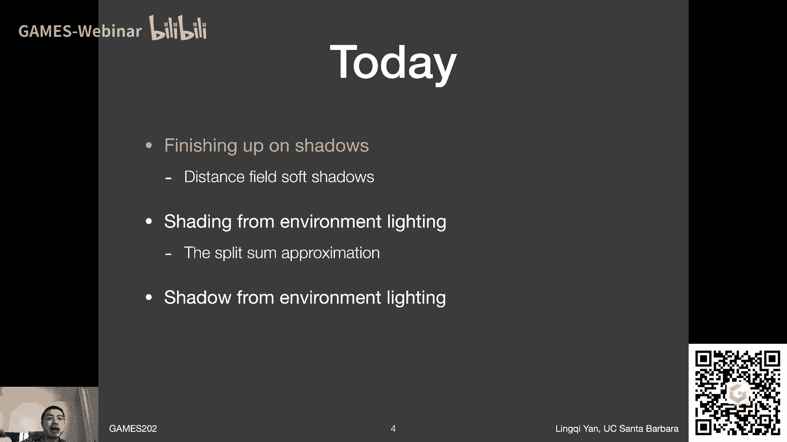
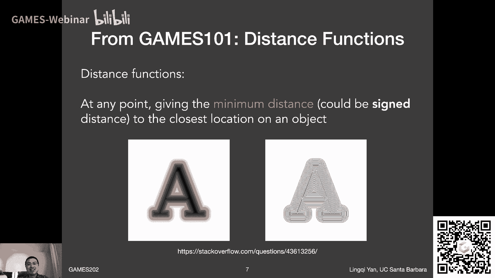
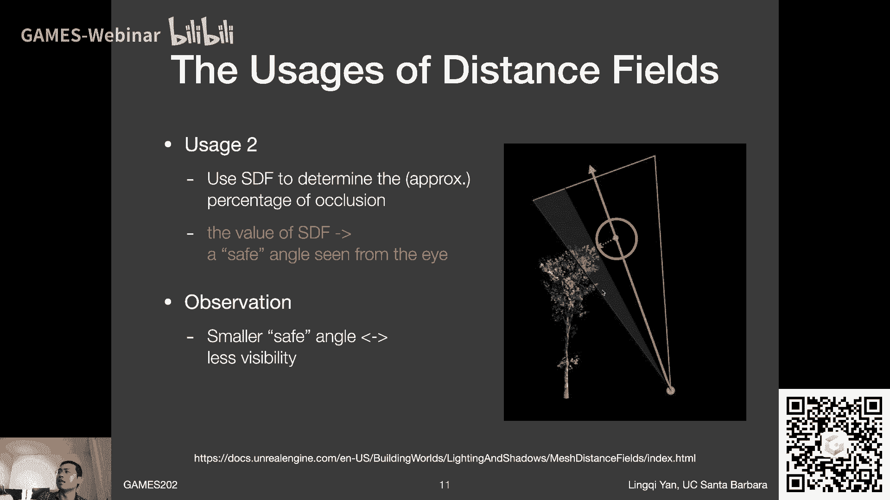
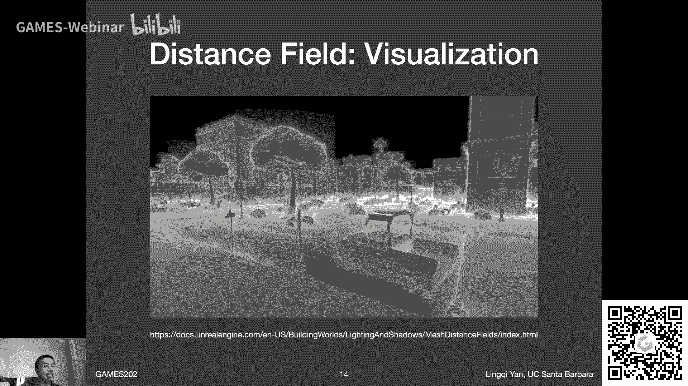
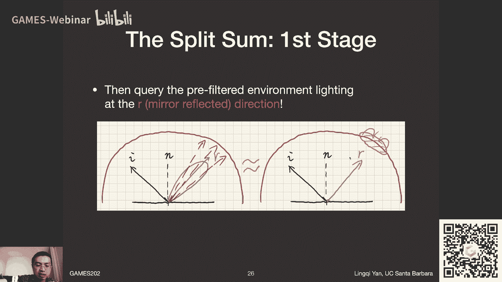
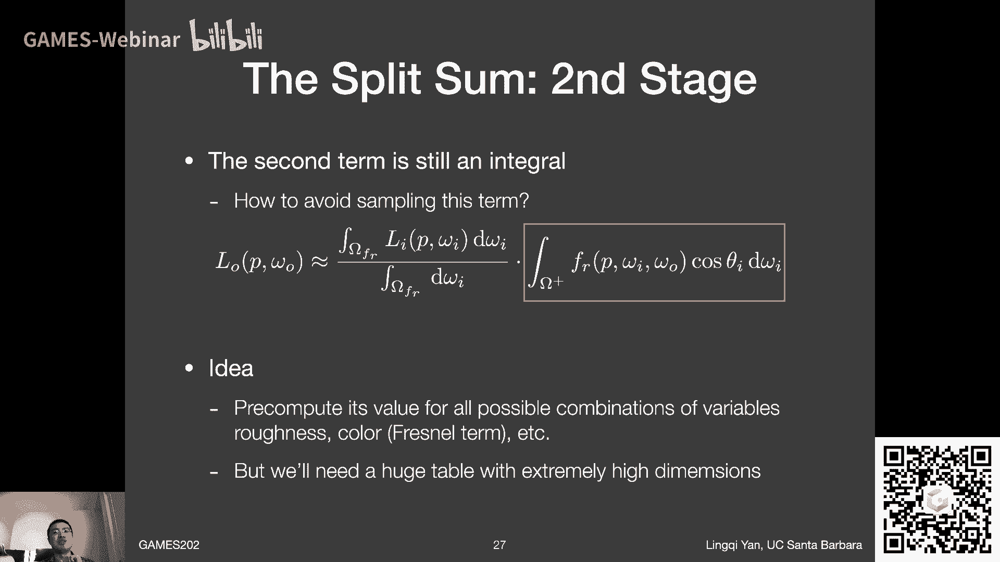
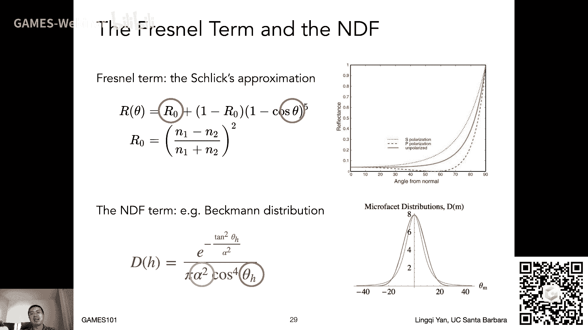

# GAMES202-高质量实时渲染 - P5：Lecture5 Real-time Environment Mapping - GAMES-Webinar - BV1YK4y1T7yY

哦亲爱的同学们大家好，欢迎来到我们的games 202的第五讲啊，今天我们会讲一个新话题啊，这个新话题是关于说实时的，这叫什么呢，环境光照应该怎么样去处理好吧，嗯然后呢在今天的课程之前。

咱们还是说几件事情，第一呢就是作业一啊，我我以为已经发布了哈，行就算是没发布，今天肯定会发布，然后呢差不多呃有一个半星期可以做呃，这个作业啊差不多呃十天吧，这样嗯然后这次作业呢就是关于pcs的。

然后大家要去实现一个正确的pcs s，在这之前还会先实现shadow mapping，这么个意思，就是差不多就是阴影的主流的思路，那么呃另外一件事情是这样的，就是我之前不是说关于4月1号的那个星期。

也就是下个星期了，下个星期呃我这课要怎么个安排法呢，我之前想的是说我先录播，然后录下来，然后播出呃，但是后来呢嗯一方面有同学反映说，希望还是能够直播，另外一方面是我自己发现。

我好像没什么时间在下周之前先把它给制作好，录好，所以呢那咱们就这么打算吧，那就是说呃嗯下周我们就不安排课程了，也就是说下周没有直播，也没有录播啊，下周我自己的这些呃出差的事情，等我回来回来之后。

也就在下下周呃，我们会继续呃恢复我们的直播好吧，这么安排，至于说这课会不会往后再拖一个星期，会影响到siggraph asia，我之后再安排吧好吧，因为我之前嗯认为说呃，五一的那一周我是不播的。

但是五一那一周我是可以录播下来对吧，嗯所以说这样的话感觉又可以省出来一个星期，所以好像还行啊，那暂时咱们就这么安排啊，下周没课，也就是说呃今天第五讲对吧，第六讲讲完，第七，第八讲将会在下下周来讲好吧。

ok那这是这事儿，然后呢关于之前同学们问的，关于gains 101作业重新提交呀，重新批改呀，最后重新发证书呀，啊这个事情也是一样，等我回来之后，我就会开始启动这么一个过程。

那就是呃games 101的grader，我需要去呃呃面向大家去征集一下，然后如果有同学是呃有意向来呃，就是帮后续的电上电子101的同学们，去批改作业的话啊，这块嘿嘿嘿呃呃尽早联系我吧。

虽然咱们现在还没有开始发布这个，正式的正式的消息哦，对不是联系我，应该是联系到技术秘书同学，这样吧，大家稍等啊，然后等我到时候发布这个正式的消息，然后嗯大家再踊跃报名好吧，那咱们这么安排ok啊。

至于什么要求什么东西，哎这之后再说吧好吧，咱们暂时现在先这么打算着好，那这就是呃课前咱们要说的事，那么上一节课咱们说了什么呢，咱们上一节课主要是说了一些关于呃。

嗯就是pcs s的一些更深层次的一些理解对吧，一个非常聪明的做法，就是vs s m啊，然后也有人说是vs m一回事啊，vance soft gentlemapping，然后他呢就是针对性的去解决。

pcs中第一步跟第三步，这两步呃的比较慢的这么一个问题，然后呢他非常聪明地使用了这种范围查询，然后呃就因此去避免了采样嘛，就是这么一个思路啊，然后我们又提到他的一个相当于延伸版本，对不对。

然后呃引入更多的呃，就是更高阶的所谓moments这么个意思，那这就是上节课所说的内容，基本上来说啊，咱们上节课做过这个总结对吧，就是说vs s m在最近特别是在这个temporal呃。

dnoisy这么一系列的方法提出之后，呃，可能用的渐渐的就没有pcs用的多，但是为什么咱们要学呢，就是说v s s m，是一个非常非常非常聪明的做法，咱们学的可以让我们更聪明，对不对。

体会一下为什么别人可以想到这么精妙的算法，这个非常有趣的一件事情，好吧嗯那差不多就是这么个事情，那么今天呢咱们会先想办法把shadow这块给说完，shadow这块呢我们还缺一块知识啊，这块儿什么呢。

就是说我们呃，我们的这个现在刚刚开始兴起的一种新的呃，呃生成软硬的方式叫做distance field shadow，soft，distance field south shadows啊。

这么一个方式呃，然后这块我们肯定是要说一下的，因为这是我觉得吧，就最近几年内应该会得到更加广泛的一个应用，特别是这个distance field最近研究的人是非常多的，而且是跨各种领域的什么几何呀。

呃渲染呀，都在研究这么一个东西啊，从不同的角度吧，什么个意思好吧，然后所以说咱们一定要说一下，非常有用的一个东西啊，那么另外一个呢就是说我们说完之后，我们就开始来讲另外一个所谓环境。

光照需要解决的一些问题，然后环境光照呢是一个挺困难的一场，然后咱们今天大家会发现，这课的难度好像已经降不下来了，这我在这嗯就准备这些课程内容中，也是发现了这么一个事情啊。

因为没办法像啊实时渲染这么复杂的一个话题，他就首先要求大家对这个渲染领域这就比较熟，然后才会有各种各样的操作，大家会看到这呃，今天要讲的所谓split sum这个方法，然后它是它是非常非常依赖于大家。

对以前知识的理解的好看，那之后我们再继续说，好吧嗯那行，然后呢最后最后最后如果我们有时间提，据说环境光照下的阴影怎么做，哎那咱们先看这个标题哈，这标题可不是打错了，这说的清楚。

就是说我们要解决的今天主要说的环境光照，要解决的是所谓shading问题，是忽略了他的shadow的时候要解决的shading，好吧，这么个意思，然后之前至于这俩什么区别，咱们之前老早就说过了。

赶紧g101 对吧，ok那咱们这就开始吧，在这之前我看哈，诶有同学说我今天会不会讲spherical harmonix呢，答案是不会哈，今天不会讲，很快就会讲到啊，这个意思哈哈哈哈哈哈嗯好吧嗯。

补充材料链接说得好说得好，而且我之前这几节课，是不是就应该把链接放出来了啊，有道理啊，啊这样哈，我记得这事儿，然后助教同学们之后在课后如果我忘了，记得提醒我一下，好吧，ok啊对啊，有同学说的对。

今天要讲的叫做i b l之后，咱们再看具体什么意思吧好吧。

那咱们先进入第一个话题，第一个话题要说什么呢，要说呃distance field of shadow，那么首先还是一样，咱们说一下为什么我们要讲distance field of shadow呢。

因为这个东西可太好了，ok啊，为什么呢，大家可以看到啊，s d f呃，他的呃推特啊，还有twitter，然后说s d f shadow呢，它有什么好处呢，哎说的非常清楚，非常快对吧。

比现在传统的shadow map要快，然后说说为什么堡垒之夜没有百分之百的用它，是因为它的存储是有个问题的对吧，诶那那大家就看到了一个好处又坏处了，已经对吧，首先呢它呃它很快。

然后另外一个它需要大量的存储啊，然后如果说要想结合现在的技术应该怎么用，咱们这个就不多说了，好吧嗯嗯然后后面他就是说吧，就是说这后面的啊，如果有一个非常复杂的这种几何。

然后我其实呢我用sdf shadow可以达到嗯，这是非常复杂的几何才能达到的效果，然后我得用三个shadow map才能做到的效果，哈哈哈说这事儿，所以呢不管怎么样啊，这是非常好的，然后后面总结说。

还不会有这些什么自遮挡问题啊，没有什么呃这些阴影的悬浮的这个问题啊，咱们之前都提过，对不对，ok那这就是为什么我们要说这distance field啊。

然后呃呃然后咱们先看一下效果吧对吧，先看一下distance field soft shadow，那他顾名思义了，他首先他要做的肯定是软硬硬的生成对吧，然后大家看左边这幅呢。

就是用所谓的distance fields来生成的啊，这么一个软阴影，然后大家看效果非常不错嘛对吧，然后比起这个所谓hot shadow效果要好很多，那么它到底是个什么意思对吧。

咱们之前在game 101简单提过呢。

那么distance field或者是distance function，这是一回事，然后他是干什么的呢，它定义了啊，在空间中的任何一个点，空间中的任何一个点，他去定义啊，他到某个物体的表面上呃。

最近的一个点的距离，或者说它到物体表面的最小距离啊，这是完全是一回事，对不对，然后呢这个距离长呃，signed distance function，它有可能把它给定义成一种呃带带正负号的。

带正负号是什么意思呢，就是在物体内部，比如说我规定呃它得是负号，然后在物体外部它得是正号，这样的话呢它不只定义了一个距离，还定义了一个所谓有向距离，所以说嗯通常我们说距离场。

然后我就直接把它给缩写成s d f，它不管它是不是有像哈，然后就是说呃我就这么说了，好吧，sdf我指的就是这么一个距离场，那咱们下面看到有两个这个例子哈，啊就是大家可以从这个图上推断。

就可以看得出这是什么对吧，这这就是字母a哈哈的这么一张图，他的呃距离场，那也就是说啊呃这张呃这a的字母啊，打到了一个图上，然后这个图上的任何一个点呢，我都可以计算这个点到呃，比如说字母a的轮廓上对吧。

在这二维的情况下，我们说物体表面那是什么，那就是物体轮廓对吧，到物体的轮廓上最近的一个距离是多少，那么呃这两种仅仅是不同的可视化方式，左边呢就是把它的值直接给打印出来，大家可以看到在这个a的内部的时候。

它就把它显示成黑的，然后在这个a的外部的情况下，也可以看到，那随着不同的点离这个a字母越来越远，它的值应该越来越小对吧，看起来就像是一个很模糊的一个东西，诶非常有意思的事。

然后呢啊啊右边是另外一种可视化方式，这种可视化方式被广泛应用在地图上啊，这前咱们games 101都说过对吧，这是类似等直线的一种方式，类比于地图的等高线嘛，就是同样的一个颜色表示的值是一样的。

大家可以看到，基本上就是这个呃轮廓往外扩了一圈儿，一圈儿嘛对吧，所以说啊distance function它就是这么定义的啊，这个意思ok嗯好我先看一下啊，嗯嗯有同学说这个符号距离函数嗯行挺好的吧。

我觉得翻译的不错，s d f t度哦，对之前上一次就是同学说了这事，后来想了一想，不讲了，不讲这节课东西有点多啊，sdf梯度不讲啊，说清楚。

ok那咱们啊这就开始吧，ok下一个话题就是什么呢，就是说我为什么要用这sdf呢，因为s d f是非常非常有用的一个东西，然后咱们之前在game 101里面，做过这么一个例子哈，做过什么一个例子。

之前我画的不怎么清楚，于是呢我重置了这么一个这样ppt啊，大家可以看一下我这个例子是想干什么呢，我这个例子是想去呃，所谓去blend一个运动的边界好吧，咱们可以认为这个a和b呢它就是两张图。

然后这张图呢，它左半边它有一个物体刚刚移进了这个图，并且这个物体呢它在从左往右再移动啊，这么个过程好吧，那么假设在这个a所代表这个时刻，而这个物体在这，大家大家可以看到这边界啊。

就是这个黑与白之间的这么一个分界线，这个边界在这，在大概在靠左的这1/3的部分吧，啊这里对吧，然后呢这个物体在另外一个时间诶，它移动到了某个位置在这，然后大家可以看到哦，它的边界呃，移动到了这里好。

那我们这两幅图都可以得到吧，我假设说可以拍这么两张图，对吧好，那我拍下了这两张图之后哦，那我如果可以把这两张图做一个线性的差值，什么线性差值啊，每一个像素咱们说清楚，每一个像素都取在对应的a的位置。

和对应的b的位置，然后它的值，然后中间做一个所谓线性的一个平均，咱们就认为50%，50%的平均好吧，那这样会造成一个什么结果，大家看就得到右边这张图了对吧，线性差值a和b，那这样的话。

大家看到左边这1/3为什么是黑的，因为这是任何一个点，在这a也是黑的，b也是黑的，没错吧，比如说咱们鼠标停的这个位置，这个位置在a之前是黑的，在b之前是黑的，那最右边也好理解，我鼠标停的这个位置呢。

它在呃a之前，他他在这个位置是白的，b这个位置也是白的，然后在这中间坏了，这就出事了对吧，什么时候呢，大家会发现哦，在这里之前在这a的位置上白的，在b的这个位置上黑的，然后他一平均好了，变灰了。

那就变成了这么一张图对吧，哎所以说我我简单地对它得到这么两张图啊，做一个平均，我并不能得到一个移动的呃，一个一个边界，对不对，哎，我得到的这个东西，就看起来就像是它形成了一个灰色的一个。

过渡带了一样对吧，这个意思，所以这自然不是我想要的咯，那我想要的是什么呢，或者说有什么办法可以让我还是做这种呃，线性差值，但是我却可以得到一个在中间的一个边界呢，对不对，那这个时候呢咱们看一下。

如果说我们可以把a给转变成一个呃，所谓它对应的s d f，咱们刚才说了s d f嘛，有有效的距离吗，那么我们定义在物体内部呢，也就是黑的部分，假如说他颜色它都是都是，这叫什么呢，都是是负值啊。

然后在右边都是正的值，然后随着它的值，随着它啊这点的不同位置啊，离边界的不同位置，然后我可以给它一个不同大小对吧，这是没问题的，那所以说a转换成对应的s d f它是长这样，那同样楼里b转换成sdf。

它长什么样的，长这样对吧，然后大家可以看到s d f什么时候是零呢，就在这边界上是零，然后在左边呢它就是负的，再右边就是正诶，那这个时候如果我把sdf啊，这俩s df给重新做一个线性差值，还是一样。

在任何一个点我都计算哦，它在a这个地方sdf的值，然后在b这个地方s d f的值，并且求于平均诶，那这样的话我得到一个什么呢，大家看这条线啊，这条线正好在中间诶，那我之前取呃，在a对应这个中间的位置。

它大于零的，假如说它的值是五，然后呢我去找这个b对应在在这中间这个位置，然后它就值多少，假如他是-5，唉然后我发现它正中间正好应该是零对吧，诶，那所以说我得到了这么一个差值，之后的这么一张图。

然后插值之后，这张图呢之后我再根据他sdf所表示的性质，对sdf什么时候表示的是物体的边界呢，在sdf等于零的时候是物体的边界，在这个时候我就会恢复出这么一幅图来，然后我发现哦，原来如此。

我还是线性去插值哎，对应的s d f，然后我再恢复出来一个结果，那这个时候就反映了阴影在移动啊，非常有意思的一个事情对吧，那也就是说啊它有一个非常不错的性质，它可以表示物体的边界啊。

虽然咱们这节课用不着啊这个意思，然后这就是说人们喜欢这个啊，distance function是因为什么呢。

因为它可以做任意不同形状的一种，一种所谓不ending，而呢你不需要去关注这个哎，你不需要去关注他们之间的所谓拓扑的关系，比如说大家可以看到诶，我有两个不同的s d f，然后大家可以看到很明显的一个球。

在像一个这这正方形去移动对吧，然后如果说我们把他们两个各自都转换成a，distance field，然后我再去blend诶，然后呢，我我就可以把他们最后最后给融合到一块，这是非常有趣的一件事情，对不对。

所以说他可以得到几何上的一个，非常好的一个过渡，那这也是为什么人们会喜欢这个sdf啊，这个意思啊，那么这个时候呢我多说一句吧，既然这是一个提高课，这个sdf呢，它的背后和一个理论是非常非常有关系的。

这个理论叫做optimal transport，叫最优传输这块儿呢，这个顾险峰老师研究得非常透彻了，这是呃应该是能够找到非常不错的一些资料，好吧，然后咱们就简单说一下。

就叫做optimal transport或者叫最优传输啊，这个理论嗯，就是说这块呢也是算是学术前沿，我个我个人来说也是哎非常呃，对这方面也有兴趣，不过呢我是希望把它给弄到。

这是在rendering的层面上能够有一些应用啊，当然也也也在研究中吧，可以这么说好吧，呃咱们回到distance field的这个呃事情上来，那么distance field有了对吧。

然后呢我们怎么用呢对吧，那那首先呢给大家提供一个呃，最简单的一个用法，也是他的第一种用法，第一种用法叫什么呢，大家耳熟能详的呃，ray marching。

ray marching是一个经典的去所谓呃去用光线追踪，然后一去追踪一个距离场，然后看我会打到哪个物体表面这么一个思路哈，然后呢啊这个之前呢咱们101里面并没有说，所以这里面简单提一下呃。

但是我知道201简单提了一下对吧，就是说因为它实在太简单了，这个即便不是running领域，我觉得这块也是非常非常好理解的哈，就假设说啊整个场景的sdf你已经得到了好吧，然后你有这个sdf之后呢。

你现在有一根光线，因为这根光线你试图去嗯做一个事情，就是这个光线和sdf所定义的隐含表面，去做一个求教，这怎么样怎么样去求教呢，那这个时候提供一个方法叫做sphere tracing。

这是一个最最简单的直接的一个方式，那么它的一个最最有意思的一个思想是什么呢，就是说他背后是是用了这么一个规律，什么规律呢，咱们比如说这个这个位置哈，你这个s d f它到底告诉你一个什么样的信息。

那s d f咱们刚才定义什么来着，就是说这点到呃，比如说这个场景中其他的这个物体，它的最小的距离，那那既然是最小距离，那说明什么呢，比如说在这一点，他告诉我哦，这是他到场景中其他物体的最小距离。

并且咱们知道在这儿对吧，但是呢它隐含着告诉我们这么一个事情，也就是说在这么一个最小距离之内，你不管这个这个点它往哪儿去，他无论如何不可能与任何物体相交，否则就意味着，一定有一个物体在这个范围里面了。

所以那这个s d f就就记录的纸质，不对的对吧，就是这个意思，也就是说啊，它任何一个点嗯，上它的sdf的值，就给你定义了一个任意的安全距离，不管你往哪个方向走，你只要走的距离不超过这个距离。

它一定不可能与任何物体发生碰撞，是不是一个非常这个聪明的一个一个想法对吧，哎那就可以利用这么一个思路啊，我们为了去做re s d f tracing对吧，是这么个意思，那我一开始有个光线。

它的起点在这儿，它往这个方向去，那我一开始就看他起点上告诉我s d f是多少，那df告诉我哦，大概是这么大，然后告诉我这么大的话，那我就可以放心的把这个呃，这个点给移到它对应的这个方向。

然后走那么长距离这么个地方，因为我知道这个时候它一定不可能发生任何的，相较对吧，然后在这一点呢，我又可以查到他一个s d f，我又知道他往前面走，那他的s d f的直邮告诉我。

我可以往前走多少的安全距离，是不是这个意思，所以说直到我一往往前走，走到什么时候停呢，那我就走到要么和这个物体足够接近了，也就是说它的sdf小到一定程度对吧，要么我光线已经往前去踹死了非常远的距离了。

我还什么都没踹死到呢，那我就不要了对吧，就扔了，差不多就是这么两种思路对吧，所以说这是非常聪明的一个做法对吧，然后咱们总结一下意思，就是说不管任何时候你在p点啊，假设任何时候你在p点。

然后这个p点你都可以从这个p点，往你给定的方向，还有去嗯，往前走呃，往前走，s d f of p那么个距离对吗，就是这个意思好，那这就是他的啊，就是使用方法一吧啊咱们来看看哈，有同学说什么啊。

哦有同学说算sdf是吗啊，ok那这块是我刚才没说了，就是说我这里是假设说sdf就已经有了吗，那sdf咱们我是想着，咱们在最后它的不足的地方，我们再说他这个事情哈，那现在提一下也可以吧，就是你这样想吧。

sdf它的本身的定义，是不是就定义在空间中任何一个点，然后他要定义到呃，你这比如说场景中任何物体表面的最小距离，对不对，那也就意味着sdf如果在一个三维场景中，sdf可是一个三维的一个值，对不对。

他任何一个点嘛，所以说嗯嗯你要是想表示所有的这些面啊，然后呃他其实是二维的嘛，咱们之前说过对不对，考虑一下texture mapping，那那么你要是sdf的话，那就是这个场景中任何一点。

你首先就得先把他s df给算出来，然后呢你要把它算出来之后，你还要涉及到存储，你要存储一个3d的一个呃巨大无比的格子，要覆盖整个场景，是不是非常大的一件事情对吧，当然这中间有优化了，但不管怎么样。

反正这个存储是非常高的，咱们在一开始这个推特就见到了，对不对，说它的存储是个问题啊，那咱们讲完这块之后，我简单跟大家聊一下，聊一下现在有什么有什么方法再做呃，sdf存储的压缩或者其他东西，好吧。

这个意思呃，运动的物体是实时计算s d f吗，这个问题是非常好的，那么哎也是一样，它其实是s d f的一个局限的东西，就是运动的物体是可以的，s d f是可以用的，没有问题呃，但是形变的物体是不行的。

形变的物体就是说你得保证啊，把这个物体的sdf就得重新算一遍呃，至于说他这重新算一遍呃，需要多大开销，有没有办法能根据它的形变，然后我只需要计算它改变了的部分，那这就是另外的事情了。

那就是几何这边在研究的事情了，好吧，那么刚才我我为什么说，运动的物体其实是可以的，如果是刚体运动的嗯，这这个事情呢其实是一个sdf的一个非常好，非常好的一个性质什么的，比如说你场景中有多个物体。

你每一个物体都单独算了一下他们的s d f，那你现在要做光线和整个场景的求教，你在任何一个点的位置上啊，你其实就只用去呃去取所有这些物体中，s d f最小的那个就可以了，为什么呢。

因为这个道理是显而易见的嘛，就是说嗯大家可以看到每一个物体都告诉你哦，我当前的这个位置，然后离这个物体最小的一个点，那么我如果取所有物体在当前这个点上，它的sdf的值的最小值。

那不就是等于是在这个场景中，我这个点呃离场景中的任何一个物体，它的最小的距离嘛，对不对，这个最小是非常好用的一件事情，所以说呢呃就是多个物体，只要取最小的sdf就好了没，但是话又说回来。

刚才我说的形变的物体确实不好做啊，这是这是这么一个意思吧，好吧啊那行，那咱们回到这个话题上面来，呃刚才提到说呃，它的最直接的应用就是所谓ray marching，那么咱们今天要介绍的就是它的第二个应用。

第二个应用是什么呢，用它来生成呃软阴影，那么用它来生成软阴影是什么意思呢，那咱们之前说最早最早说的时候，game z101 就提了，说软阴影怎么来的呀，是不是就是因为有一个面光源，然后他有很多东西啊。

它有一部分吧被挡住了对吗，然后它被挡住了多少，那自然就是最后的visibility的值是多少，诶我想想一减visibility值是多少对吧，就是这个意思，那么呃所以说呃在这里呢。

我们可以用s d f来近一似的，得到一个大概有多少范围会被挡住，这么一个信息，然后但是它是不准的，咱们先说清楚不准的，但是是挺挺，这个符合咱们的一个一个一个观察的好吧，那这是什么意思呢，这里再看。

这是呃最重要的一个理解是什么呢，就是说啊之前在第一步，他会给你个安全距离吗，这里就往后稍微推一步，这这个理解是这样的，他的sdf他告诉了你一个安全角，都什么安全角度，咱们大家看右边这幅图。

那右边这幅图说明了什么问题呢，诶我有一个假如说我有一个所谓shading point，然后我往往某一个方向去打了一根光线啊，我打了一根光线，然后这个时候沿着光线中间有一个点，大家看到了吗。

这个点上假如说呢他有一个呃s d f的值，它有s d f的值，告诉你哦，这个点周围大概多多远是没有障碍物的，是这意思吧，那么这个时候就可以告诉我们，如果你从这个所谓shading point网。

大概这么一个方向看啊，大家看shading point往这个方向看，那我其实可以稍微偏一点，我再再多偏一点，我一直偏到这个位置上对吧，偏到这个方向上，然后我觉得都不会看到障碍物，没问题。

这还是刚才的所谓安全距离的一个呃，简单的一个延伸，把它变成了一个所谓安全角度对吧，我往左边偏这么些都不会有什么物体挡住，那我再往左边偏一些，那就会呃被挡住了一些了，那就是这么个意思了。

那呃随着刚才这么一个理解呢，我们就可以得到一个非常非常有用的一个观察，什么呢，就是说如果你在呃某个shading point上，往一个方向上去，你得到的这个所谓safe angle。

就是就是这这个角度吧，这个角度越小，就意味着你呃能够看到的东西越少，就是这么意思，或者说你看到的这个阴影就越黑嘛，就是这个意思吧，这没问题对吧，所以说呃这里呢就是相当于是简单的把嗯。

s d f可以给你的一个所谓安全角度，把它给转换成了最后阴影的值啊，就这么一个简单思路哈对吧，咱们再再再回顾一下这个事情啊，如果说你在这一个点，然后它的安全距离告诉你它有很大的圆。

然后就意味着一个很大的安全角度，有很大的安全角度，说明你往这个方向去看过去啊，你看一个呃挺大的一个光源，你可能中间都没有任何遮挡对吗，那就意味着你最后可见性基本就接近一一对吗。

哎那如果说这个范围呢呃它非常小，就像这种情况下，你再往左偏那么一点，那那那就那就会出现一个遮挡的情况了，那就那就说你在这种情况下呃，就是说如果你再trace一个，比如说还是刚才一般大的一个光源吧。

那这里就意味着这个光源，有很多东西要被挡住了，那就意味着说你的vb会减小对吧。

那基本上来说就是这么个思路嘛，那也就是说我们其实要关心的，就是在这个remarching的过程中，然后我如何去得到这么一个所谓安全角度对吧，那这个安全角度大家看这幅图就可以看到了。

嗯就是假设说啊你是从呃这个o点出发，然后呢你每次往前走那么一点，还是刚才的retracing，你沿着某一个方向去这个方向呢，你就给大家可以理解成，好吧，然后往这个方向去看看，这种遮挡情况到底是什么样的。

那么我我往前走，大概走到了p一啊，p一告诉我应该走到p2 ，p2 告诉我应该走到p3 诶，那么在这个过程中诶，我在p一的这个位置上，我是不是可以得到一个圆，得到一个圆，这个是蓝色的对吧。

然后我从这个起点，我可以做一个蓝色的这个圆的切线，我就可以求出来这个蓝色的角度c大一，这就是它的呃这个点上的安全安全角度对吧，然后呢，我在这个p2 这块形成了一个偶红色的这个圆，在这个红色的圆呢。

我一样我可以从起点做一条切线过来，然后诶我是红色的圆呢，这么这这么一想切，我就得到了红色的这么一个角度，呃，这个这个角度哦，那我每一个点我是不是可以这么做，那我这些点都各自可以求出来一个，所谓安全距离。

那总共的安全距离啊，安全距离，安全角度，安全角度是多少呢，那自然就应该是最小的，这个角度才是安全的角度吧对吧，那呃现在就是这么个问题了，就是说我们现在知道哦，我在锤子的过程中。

每一步我都算一个呃它的安全角度，我到时候取最小，这个角度一定上，一定程度上就能给我一个所谓这个阴影，到底是偏黑还是偏白，这么一个估计好吧，那留下来一个问题，什么我们怎么算这个角度对吧。

那么大家从这个图上可以看到，这个角度是挺好算的，为什么呢，因为你就再算一个圆的切线嘛，在空间中就是一个球的切线嘛对吧，然后呃这个切线怎么算呢，大家知道这个s d f的距离，告诉你是这个直角边对吧。

然后这个斜边就是你走的距离，然后所以说你只需要算一个ark sign就可以了，对不对，哈哈哈哈呃然后呃自然是可以这么算，但是呢哎这个时候给大家精神污染一下，ok是这样哈，虽然可以这么算，但是呢。

通常人们在shader里面是很愿意去，避免一些非常复杂的运算，比如说这种反三角函数，它们的运算量就非常的大，大家就非常不喜欢这么一个呃啊这个东西啊，不喜欢这个，那么呵呵呃怎么办呢。

所以呃就呃人们很聪明的提出了这么一个呃，做法，什么做法，咱们先不要管这个minimum。零的问题，咱们就看这中间这块在干什么对吧，然后大家看啊，之前arc sin在干嘛，就刚才那个直角边。

就是s d f长度除以你的斜边长度，就走不多远嘛，t减o嘛，就是这个距离啊，唉等一下啊好吧，这里忘了加这个长度了哈，这不是向量哈，这个向量的长度哈啊距离啊，ok这里也一样，就是两个距离相比吧。

那么一定程度上人们就是这样说，这两个比值就已经可以说明，这个角度到底大还是小了对吧，我干嘛要算那么精确，我算这个2x3 a这个东西对吧，没必要对吧，所以说呢，我这里就是说我完全可以就用这个比值。

就是刚才那个s d f的值，就是安全距离除以我走过了的距离，这就算是一个对这个角度的一个近似，我在上面再乘上一个k就可以了，然后最后呢我为了把它给转换成一个visibility，它不应该能超过一对吧。

就是就是这个意思吧，啊好吧，所以说大家做了一个呃，这种就是说我上面随便乘上某一个k，然后我最后得到最后的值，我再跟一点去比较，取最小就好了，那么这个有什么好处呢，这里就是说大家可以看到。

就是这个k的作用到底是在干什么，这个k的作用是这样的，就是说我既然最后反正要把它砍到一点，如果说我的k的值原本诶他就是一的话，那就什么也不做嘛，那我最后就是用这么一个比值。

然后他大概在0~1这么一个范围，然后我会得到的最后的结果呃，它的阴影的值诶就是0~1这么一个范围，这是没有问题的，那么嗯如果我有一个比较大的k，比如说k我取五，那也就是说这个比值呢在0。2的时候。

其实我就认为它的值已经达到一了，再大它也它也还就是一了对吗，也就是说这个比值我就只看0~0点二之间，这么一比值，而这个比值会告诉我哦，呃它的阴影会从零变到一，那如果我k我取100。

那我基本上来说就是就这个这个比值，在0~0点一之间，然后我就我就认为说呃0~0点零一之间啊，我就认为哦这块就是它的所谓过渡带对吗，然后它它的阴影值会从0~1，那么大家就发现了一个问题。

就是这个k的作用是在干什么呢，k大的话很小的安全角度也会被你当成是一，那么零和一之间的过渡带自然而然就会少，那那也就是说在一个极端的情况下，k极大的情况下，你就可以认为哦。

这种情况下就是完全是硬阴影了吗，要么零要么一了嘛，它中间过渡非常非常的小嘛，那所以说这种情况下，k呢大家已经可以猜测出来是在干什么了，k就是在控制这个阴影的软硬程度，好吧，哎这是一个非常聪明的做法嘛。

就是说我要通过这个k去决定说到底有多大，一个角度内是这个软阴影的角度嘛，就是这个意思，什么时候是完全在阴影内，和完全不在阴影内的一个过渡，我就这么简单的用一个k来做了，那这是一个非常聪明的一个做法嘛。

然后呃如果是我来做的话啊，如果是我来做，我估计想不到这么一个做法，如果是我来做的话，我为了减少它中间这么一个0~1的，一个过渡带哈，我的想法应该是应用一个所谓，sigmoid一样的函数。

那这款机器人现在很火的对吧，所以sigmmoid我就再也不解释它是什么了，西格诺伊德的作用是什么，大家想象一下，如果我有一个线性的一个函数，我应用了一个sigmoid，我的值会不会被拉到两个极端对吧。

一个是偏零，一个是偏一，这不正是我想要的吗，不是正正是想把中间的这个过渡带，尽可能的把它给缩小嘛，只不过呢sigmoid的计算它是非常非常麻烦的，然后他肯定不如说你就乘上那么一个k。

然后取一个这个和一点取最小对吧，不管怎么样，这里哈大家知道这个k的作用就好了，这个k的作用就是为了减少这个扮演的一个呃，可可能产生外形的一个区域，那这个区域被减少的越厉害，那阴影就越硬嘛对吧。

那所以说咱们就是这么一个解释方法，那么现在我看又有同学啊，这样吧，这样吧，我先把这块说完好吧。

那么说这么半天的话，就是说呃这个distance field到底应该长什么样对吧，咱们可以看一下，对于这个场景来说，大家可以看到这个场景，每一个物体应该都是有一个distance field的。

然后这些distance field就可以合在一块儿，咱们刚才说的对吧，都取最小就可以形成整个一个场景的distance field，那么这distance field大概就是一个。

看起来像是物体描了边一样的对吧，呃咱们刚才说了，为什么对吧，它基本上就是沿着轮廓往外面长嘛，然后越来越小嘛，这个值呃，唉然后大家看到的就是这么一个东西啊。

ok啊那么这里基本上就是说呃关于这个distance，field shadow是什么意思哈，好，然后呢，有同学说，这里是不是应该应该有两个安全角度对吧，刚才咱们画了这半边，另外半边对吧。

所以说这是一个非常非常大胆的近似嘛，对吧哈哈哈哈，基本上来说，就是随着刚才那么一个观察来来说的，就是呃如果说你在某一边。

而i s d f本来就不能告诉你它方向在哪，咱们回回两页吧。

好吧嗯，假设是这样，那你在这里呃，sdf告诉你有个安全角度，你其实真的不知道说阴影会出现在这边，还是出现在右边对吧，那如果是一个3d的情况下，你根本不知道它会出现在哪一个圆环里面去，对吧。

是不是这个意思，它只你只能说呃，我大概知道这个遮挡物，大概是在呃这一圈之外对吧，然后应该是在这个圈上哼，然后你你是不知道他在哪了，你既然不知道的话，那基本上来说你你这张图，它自然你看到的是一边。

那其实你不知道的情况下，你就认为是整个一个情况了对吧，然后所以说这种情况下，不去考虑这个遮挡物的位置，其实是有道理的，没什么问题哈啊ok好，我有同学问，是不是每一个点都要保存一套距离上。

哎这里说的不对吧，每个点会保存一个值，那就是他s d f的值，它既然是一个厂对吧，它在三维空间中任何一个地方都有一个值哦，说起来距离场，距离场其实说的是场是不对的啊，就是说他其实按物理意义上来说。

它只有一个值，它并没有方向啊，它并不应该是一个什么场，诶还是说我理解错了，厂是分所谓什么向量场合和那个厂的标量场的，啊，对他是是他是个标量场啊，那所以说它还是长啊，那是我错了啊，ok也就是随口一说啊。

ok啊嗯为什么面光源一条线就可以算了，不是同学是这样的，就是说这里是假设是这么一个概念，它仅仅是为了告诉你说哦，这个距离场给你定义的安全角度，基本上来说能够告诉你说，如果这有个面光源，大概他是这么大。

然后它大概有百分之多少是挡住，其实我们最后需要的仅仅是说这个角度的大小，本身能决定阴影的软硬啊，这么一个思路就是他并不需要说，我一定得在这儿考虑一个呃，真正的这么大的一个光源。

然后它大概覆盖的角度是多少，然后我这边安全角度是多少，我算一个比值，然后我认为呃，一这些所谓遮挡物会均匀的分布在呃，比如说这左边一列和右边一溜，或者是不需要啊，这么理解一下就可以了。

就是说你的安全角度越大，嗯得到的这个结果就应该会越软嘛，呃就这样说，得到的结果就应该越接近，完全没有被遮挡啊，这个意思得到的结果就是更偏白，然后如果说你这个安全角度非常小的话。

你得到的结果就会越来越偏黑嘛，这样理解好吧行了，那咱们这边呃这个问题就说到这儿。

就大家可以看到，这又是一个非常非常大胆的近似嘛，然后大家更进一步理解到说哈哈哈，实时渲染中间到底有多少各种各样的介词，那咱们总结一下哈，距离场去做呃，软阴影的话，它有很多好处，第一非常快。

这个快呢相相对谁来说呢，相对于说我要直接去啊，怎么说呢，两点吧，第一是这样，如果我我去做remarching，我去求所谓光线和一个隐含的一个表面的焦点，嗯在这个基础上，我是可以自然而然的就引入嗯。

这么一个软阴影的对吧，然后我我同样我可以假设说我有一个所谓shadow ray，然后往光源的中心去打，然后通过这种方式，我可以快速的得到一个呃软阴影，那么这个软阴影呢和硬阴影它的这个复杂程度。

在ray marching的体系下是没有任何区别的，所以我们说它非常的快，这是没有问题的，那么另外一点是有人说啊，这里啊嗯他这个快其实它是不是一个公平比较，为什么呢，刚才我们看那个推特啊。

不是说呃它会比真正的shadow map要快嘛，但其实嗯其实在这里的比较是忽略了，说呃呃就是距离场的生成的时间的啊，然后你如果只去用它的话，那只需要做remarching，那是非常快的，没问题。

在shader里面就可以写remarching，但是呢shadow map通常大家跟shadow map比较的时候，我生成shadow map，这个时间才是大头对嘛，就是说我查询的map。

大家知道就是一次texture query嘛，非常快的嘛，啊如果说我要做软阴影的，就是若干次也不慢的对吧，然后但是呢大家想如果我要去做ram marching，也就是几次去查询sdf而已。

所以说sdf非常快，然后呢他如果呃跟这个呃嗯shadow map，在不考虑生成他们的情况下，那这是差不多快的，应该这么理解啊，但是shadow map主要花时间是花，花在生成学都买不上。

因为你要把整个场景在rua一遍吧，这么个意思好吧，那么这就是呃这个事儿，然后之前我说了，就是呃嗯叫什么呢，就是说他也有他的问题吧，就是嗯大家可以看一下sdf的话，如果我去生成阴影的话。

那首先就是咱们刚才说的，那它生成s d f，这本身是一个预计算的过程嘛，然后呢生成了之后，我又要把它给嗯给给存下来对吗，然后我把它存下来，对于静态的场景，静态的或者刚体这些都是可以的，没问题。

然后对于动态的物体还不行，我这计算还得所谓嗯，就是说如果有一些形变的话，就得重新算它的距离场，这是非常麻烦的一件事情对吧，然后呢我距离场的存储，不管是对于什么样的物体，我算出来之后，这可是三维的。

三维这个东西存储就非常的麻烦，对不对，那差不多就是呃这么个意思，然后呢实际上它还会有一些artifact，不过我这里就不再多说了，s d f有一些什么在接缝处，各种各样的artifact的情况。

嗯这里是工业界比较关心的一个事情，当然不影响说我s d f能够给我，一个非常不错的一个高质量的一个软硬啊，这么个意思好，然后这里这里这样吧，我再多说一句吧，好吧，那就是说呃我们之前就说这sdf呀。

它生成之后是一个三维的一个一个啊长，然后它在三维空间中，任何一个点都要记录一个值，然后这不是非常非常麻烦的吗，如果我要存的话，我把把整个场景，然后我给非常密集的踩很多的点对吧。

然后这些点上它的sdf的值到底应该是多少，然后我把它存下来，我要等于存一个三维纹理嘛，非常非常大的一个存储，那么人们自然不想通过这种方式来存储，那么现在的一些方法在研究吧，有一些是这样的，就是对于场景。

类似呃hierarchy的一个东西啊，之前咱们都说过，像什么kdj啊，像什么呃，嗯这些任何空间划分的八叉树呀，像什么别的一些什么书都可以嗯，不同树形结构，然后我在不断往下划分的过程中，有一些这些格子啊。

基本上来说离这场景中绝大多数物体都非常远，既然离得非常远，但我根本就没必要计算或者没必要存了对吧，它呃这个值就可以认为是非常大啊，就是就是这样的话，整个一个点啊，整个一个节点。

它表示一个范围内我都没必要算的非常准，那按照这种方式，我继续往下划分，直到划分到我在物体的边缘那些地方啊，就是说distance field，它的值可能在一个node里面，变化非常剧烈的情况下。

我就划分的非常厉害，那这样的话我就最后形成了也一棵树嘛对吧，然后我就只需要把这复杂的这些嗯，呃s d f的值存在这些说的叶子节点上，以及说我要认为说如果啊在一个非叶子节点上。

它是嗯一个常数的一个s d f，那也是可以的，没有问题，就是说我可以定义一种hierarchy，自然是这样的，办法吧，这个事情啊毫无意义啊，这个意思，这我相信没问题，但通过这种方式只会增加他的。

就是所谓解压缩的时候的负担，就是你到时候要查询sdf，而且是要频繁查询，而每一次查询需要过一遍神经网络的话，那这个方法就不会不可能再有人用了，这么个意思哈，嗯差不多。

这是我的一个理解啊啊ok然后我看看哈，有同学有什么问题啊，这，这这，我先把这最后一个有趣的一个东西告诉大家哈，我发现了一个github的一个项目，我不知道大家是不是这个项目已经非常有名了，还是怎么说。

诶，但是这个项目是说你可以去在啊，实时渲染中间去做一个啊，做什么呢，做一个完全没有锯齿的，或者说完全无限分辨率的字符，大家都知道，如果我要在嗯，比如说一个场景里面3d的场景里面。

我在墙上我要显示一个字符怎么办，我要贴图对吧，我要用texture，texture肯定是要有分辨率限制的嘛，那如果说我可以把之前的一些字母，什么都转换成sdf的话，s df我如果在嗯比较精细的层级。

我还可以用一些什么曲线，什么东西去拟合它，然后我就等于说，我可以得到一个非常非常不错的一个嗯，就是抗锯齿轮的啊，这种呃就是在实时渲染中间的字符吧，这么个意思啊，我刚才说的不对哈，不是拿什么曲线去拟合。

而是去插值，做一个类似于平滑的一种过渡，比如什么三线性差值之类的东西啊，这样的话就不管怎么样，任何的分辨率离得远，离得近哈，都可以看到非常清晰的字体边界，挺有意思的一个项目啊，简单的大家说一说。

那么ok这里我来回头看看，有同学们嗯问了什么问题吗，ok哦有同学说计算空间中某个点的距离，尝试要遍历所有物体吗，而不需要吧，对就是说嗯就完全可以每个物体单独算，然后最后按照任何一个点。

都是所有物体距离场的最小值嘛，咱们这么来算，然后我有同学说这几节课来下来感觉全是近似，没问题，同学这一直到这这门课的结束都全是近似，但是哈是这样，就是说近似的目的，那肯定就是为了让他快嘛。

但是近似首先不会牺牲特别大的质量，另外这些近似都非常的聪明，对不对，ok sdf到底好不好用，sdf在做阴影的时候非常好用啊，没问题啊，嗯至于在其他的方面上有没有什么问题。

就就是说sdf生成的这个物体表面，非常不好贴纹理啊，就是它的uv或者说它的参数化是不好得到的，这块来说，现在大家在积极的研究中啊，呃s d f其他的东西好吧，其他东西我就不再说了啊，咱们就简单说一下。

他对这块这块儿实时渲染中的，软阴影的一点帮助吧，这么个意思，因为因为sdf它是确实是一个跨领域的东西嘛，就是说呃单独讲，我我自己来说也不可能知道的这么多啊，我就简单说到这儿吧。

至于它的生成真的s d f的生成，s d f的其他应用，确实都是其他领域在研究的东西了，我们就假设说呃在running这边，我就认为他是直接可以拿到的一个信息，好吧好嘞嗯行吧，嗯那那就这样吧。

好吧嗯这块咱们就说到这儿，那因为后面还有一个非常重要的一块，诶刚才有同学说sdf得到是真的阴影吗，并不是吧，s df得到的阴影会更加的虚假的，哈哈这个意思吧，呃因为从刚才的近似上来看。

大家可以看到这个近似比之前的我们做了什么，tcs要更大胆多了吧，嗯ok嗯行，那咱们这里嗯就继续下一个话题了，那就是环境光照，那是这样哈，大家看到现在才开始进展这么一个话题有点晚，诶嗯这样吧。

很有可能我我讲这块就讲一半吧，因为后面来说，行那这块儿呃，大家从标题上可以看到我们来说什么呢，哎我们要说环境光照的下，我怎么样做任何一个点，它的shading，也就是说不考虑shadow的情况下。

假设这个点，它从四面八方都是可以接收到光照的好吗，嘿嘿嘿嘿，环境光照到底是干什么的呢，对吧，那么大家看到环境光照嗯，咱们之前在电子101提到过这个事情啊，它其实呢就是说我可以用一张图来记录，在场景中。

我往任何一个方向看，可以看到的光照对吧，这样就没问题了，那这个中间呢它就隐含着一个概念，认为这个光照都是无限远的，来自于无限远的好吧，然后就是说它并不能帮助大家定义一个，我放置两个不同的物体。

这俩物体放置的位置不一样，但是他们接收到的环境光照却是完全相同的，因为这个环境光照，我们认为它是从无穷远处来啊，这么个意思，这也就意味着如果你有一个环境嗯，这个所谓贴图吧，然后他中间有有一个桌子。

然后你是不可能把一个什么东西给放在，这桌子上的，你要因为他会认为这桌子离呃，这个物体不管你放在哪儿，它都是无限远的，所以看不管是任何的环境，光照去渲染任何的物体，你看看着总是一种漂浮的一种现象啊。

咱们之前说过，就是说所谓怎么理解这种distant lighting啊，这么个意思，假设无限远好，那么它的两种存储方式，主流的存储方式，一个叫做spherical map，一个叫cube map。

各自的优缺点咱们就不再多说了啊，因为咱们这个课上就认为说好我不同的方向上，我能得到不同的这些光照就好了行吗行，那这样一来呢，我们要研究的问题也就出来了，那给你一个环境光照呃。

我现在我要放一个物体在这个场景中间，那我不考虑遮挡的情况下，这些阴影的情况下，我如何去把它的shading给算出来呢，这种这种呃操作啊，在工业界被叫做i b l。

也就是image base lighting啊，不怎么证实这种说法，其实嗯略大了一点哈，我个人来说，并不是百分之百能够接受这种命名方式，但是这毕竟大家就这么用了哈。

i b l或者就是environment lighting的意思啊，那么呃就是说我们现在要解决的，自然就是我刚才问的这个问题吗，就是说给了你i b l了，或者环境光照了，然后你任何一个物体。

或者说吧任何物体上的任何一个shading point，你如何去把它的shading的值给拿到啊，这么个意思，那自然而然对吧，自然而然大家就知道我肯定是要解running equation。

running equation，咱们之前在忘了第三节课的第二节课，咱们提到过这事儿对吧，render equation在实时渲染中间，我们通常会愿意把这个visibility像拆出来，然后这样的话呢。

这个lighting就表示发光的这个lighting，而不是实际到达的lighting，那么这里我既然又不考虑visibility，那这里就等于是环境光照，它来自四面八方的光照li对吧，呃就是这一项。

然后呢呃他是任何一个方向都有可能有光照的，但是呢由于我们的这个呃，running in quin的定义对吧，任何一个shading point，我当时只是考虑它的来自它的正的半球，它的光照了对吧。

这就是之前咱们说过什么call 3项，前面要加一个max 0嘛对吧，大家还记得这事，或者说我定义它的积分域在上半球，这上半球不上半球，定义是由这个学龄point的法间定义的啊，就是合法线呃。

点乘是正的这个方向啊，那咱们把这个说清楚，那么这样一来的话，基本上来说就是我要解决，从所有的方向都有可能有光照对吧，这个这个光照是多少呢，i b l已经定义了，我要把这个式子解出来，就那么多少，对不对。

ok那这里呢就是就是我要解决的一个问题，那那么这问题怎么解对吧，这问题咱们之前在game 101就说过怎么解对吧，是一个通用的解法，那就是用蒙特卡洛积分的方式来做，蒙特卡罗怎么做，我这里不再赘述好吗。

就是说对于任何的一个积分，你都可以拿任何的满足任何分布的呃，任何pdf的呃一些样本，然后我来对它做一个数值上的一个一个呃近似，并且这个近似啊，我们之前没引入过这个概念对吧，叫做无偏的。

我们就说它是对的吧，好吧对的，那么呃蒙特卡罗方法大家之前做过101，就会知道它需要大量的样本，然后才能让这个结果，最后收敛到他的所谓期望的值对吗，呃就是接近它的，实际上接近他的期望的值。

那么这里自然就会引入说我如果真的这么去做，那大家想一想整个一个场景，那里面任何的物体或者说任何物体的顶点，或者说任何像素我都要做一遍这个解，这么一个来自四面八方的光照，这么一个渲染方程。

那是不是非常麻烦呀对吧，我任何一个shading point，或者说任何一个fragment我都要做一遍，蒙德卡罗，那还得了啊，那得有多少个sample对吗，那自然而然造成的结果就会非常的慢对吧。

那哈哈，所以说呢通常我们会认为只要是在shader里面，如果大家平常写这些shader的话，写的特别是fragment shader，这里面一旦出现了三link，那么这个方法就很可能会不能被。

用在实时渲染中，但是诶大家看到我这里又加了个新号，这就是为了跟大家说一下，因为最近几年内我之前说过，就是说关于这块嗯，整个temporal的这一系列东西的进展啊，就是嗯呃时间和空间的这些滤波的方式。

使得越来越多的这种基于sampling的方法，可以得到在实时渲染中的应用了，是这么个意思，所以说这里跟大家说清楚，这只是大家以前会这么认为，现在不一定啊，不过我们在这里呃肯定有一点是这么说的。

就是说那我能不采样，那当然那是最好对吧，那所以说呢咱们呃不管说现在呃，这三个是不是真的能做，那我们还是希望能够避免它，那这就是我们要问的一个核心问题好吧，在i b l的情况下。

任何一个点的shading，我能不能不通过采样来算啊，行那么这样一来呢，我们来说一下，就是说啊一个基本的思路是什么好吧，那这个基本思路从什么开始呢，是要从一个最最简单的一个观察上来看。

咱们刚才看什么来着，刚才那个公式啊，咱们再回到刚才那样的，刚才在这个rendering equation里面，我们看到在积分里面是不是有两项对吧，诶等一下不是这样哈，唉真糟糕出来了，好嘞哎。

ok大家看这个公式里面哈，嗯既然不考虑visibility，那么这里面它是不是两个函数相乘，这两个函数就框出来这两块对吧，一个是lighting，一个是b r d f项。

我们之前说过b r d f项有时候就连着cos，那咱们这里就连着cos啊，lighting和b2 d f，那么这两块相乘再积分啊，它是这么一个呃情况，那咱们刚才说这个观察是什么来着，这个观察是这样的。

就是说啊如果说诶我这个这个积分里面，我的b2 d f是一个比较glossy的b2 d f，然后我现在在渲染一幅图，相当于我固定了我看的这个视角相当于incident，这块呃就是确定了嘛。

哦另外一点是这样的，在实时渲染中啊，大家通常说这incident，incident的时候没有那么严格，大家不会认为说是一定得是这个光照的方向，才叫incident，如果说我去看一个什么东西的话。

那我这个目光这块也算是incident了，基本上来说这块用的比较混乱吧，这样说，但是咱们就这么说吧，就是至少咱们在不引起这些呃混淆的情况下，咱们就这么理解，没有问题啊，我们看的这个方向。

假如说这是incident啊，然后唉这种情况下，那b2 d f这个logo，如果他是gloy的b r d f，那大家看左边这幅示意图，那如果他是glc的情况下，就意味着说啊。

他其实覆盖了球面上的这个范围，覆盖挺小的吧对吧，然后呢嗯如果说这个b2 d f呢是diffuse，diffub 2 d f什么特性啊，如果你有入射光影，你看过来对吧，然后他们往四面八方反射，那也就是说。

它其实在球面上会覆盖整个半球的区域，那它覆盖的区域非常大，但是呢虽然它覆盖整个区域非常大，但是他却非常smooth，咱们之前说过了对吧，它非常smooth，就意味着它的值的变化不大。

而它的值的变化真的不大，因为它的它的值是常数对吗，就算是我们连上这个cos一项对吧，那也它也仅仅是一个cos，这样一个相对平滑的一种过渡，所以说哎我们看这两个情况，如果b2 d f是停gloy的情况。

那他support就行，如果b d f是diffuse，它就smooth诶，这个事情是不是大家听起来非常熟悉对吧。

哎，所以说这个时候呢，我们又要提之前提到的这么一个经典的一个，近似方案了，但是大家看这个呃公式咱们之前不是提到过嘛，对不对，然后这里注意一点哈，就是说咱们显示的把这个所谓的support给写出来了。

就是说我不是要把两个函数的乘积积分出来吗，我可以把其中一个拿到外面去，就是这里把f拿到外面去，那我把f拿到外面去呢，诶呃我这里就是说我要对f进行一个积分，并且除以说他的这个这个积分线的这个空积分。

之前咱们都解释过说为什么对吧，然后诶这里我把f拿出去之后，我这个积分线其实应该写作对这个这个g函数，它对应的这么一个support的范围啊，这么个意思就是说如果它范围很小的话，我不需要记整个这个范围。

我只需要记这个在这个g函数有值的地方，它的这个范围就好了，那这里算是一个一点点的不一样，那么为什么要提这个事情呢，是因为刚才问了大家这个问题对吧，刚才大家发现这b2 d f的这么两个性质，是不是非常像。

我们之前说这个公式什么时候会比较准确对吧，诶刚那之前说这个这个公式什么时候比较准呢，这个g s的support比较小的情况下，或者呢是在是在啊，这个g的值比较smooth的情况下，让我们发现这种情况下。

对于b2 d f来说，b2 d f非常满足这个性质，那也就是说我们是可以做一个拆分的，大家来看b r d f正是能满足这两个呃，这这两个函数的乘积，并且积分他们拆出来的一个条件对吧，然后呢唉这种情况下。

我就可以把除了b r d f以外的，另外一项给拿出来，还记得吧对吧，b r d f类比于这里的gx嘛，那拿出来的是fx嘛，那我对应的f是什么呢，那就是这里的光照咯，那这里的光照我就说我把光照拆出来。

是光照在b2 d f范围内的一个积分去除以呃，这个光照的一个在b呃，在这个b2 d f覆盖范围内的一个空的积分，去做这个所谓normalization对吧，所以说我们完全可以这么做呀。

我又把它给拆出来了，是，那么这里面呢跟大家区分一个概念吧，大家还记得之前咱们在解释这阴影的时候对吧，我们解释阴影的时候，我说这里拆出来的是什么东西啊，这里拆出来的是这visibility项哈。

我是把这个lighting和这个b d f都留留在里面，把这个当做记象，所以说啊这个公式是可以根据需要来选用的啊，这么个意思好吧，那这里的应用是不一样的啊，我们这里把light给拆出来。

那我把light拆出来，大家看这个黄色的这个框到底做了件什么事呢，对吧，这个框它貌似是这样的，他和这个b r d f一点关系也没有了，这是他拆出来的好处对吧，我们为什么要把它拆出来啊。

正是因为说他们在一块综合作用，这light的b2 d f综合作用挺难的，我考虑不了，那我现在把light单独拆出来，我发现就是在light所表示的整个一个球上。

哎b r d f这个logo所覆盖的某个区域，我把这个区域的light给积积分起来，并且我把他normalize，其实呢那所说的事情是什么呢，就是说我要把这个idl表示的这张图给模糊了，对不对。

什么叫模糊，任何一个点上，取它周围的一片范围，然后我把这片范围的这个平均值给写回这个点，对吧，咱们之前说过，那所以说呃之前把light拆出来，其实他就定义了一种操作叫做filtering。

我可以去所谓滤波我的环境光，而滤波的和取多大，那这个就是说我的b r d f应该占多大，是不是这意思，这是非常非常有道理的一件事情，而且大家看我这里的用词叫prefiltering。

那么prefiltering是什么意思呢，意思就是说哦我这张图我在渲染之前，我就老早之前我就可以把它给掀filter好，那大家可以看到，比如说我这里这同样的这么一个环境光。

那这个环境光我可以把它任何一个位置，我都取它周围的某一个大小，然后我把它filter，然后得到另外一张新的图，然后呢，我甚至还可以说我我用非常不同的大小的这些，这些呃，呃滤波的这些核。

大家可以看到我用不同的这些滤波的核，去近似它，或者说，也就是说我对这个函数滤波的这么一个区域啊，就是b r d f覆盖的区域啊，呃它越大，那我这个得到的这个filter最后的结果就越糊，但是不管怎么样。

这几张图我都是最早最早在running之前，我只要有了这个环境光之后，我就立刻可以先花点时间生成的对吧，所以说我在渲染的实际过程中，我是不用管它的，那这非常好啊，对不对，然后呢。

那有同学说如果我到时候想去查询，说哦我这样一个呃lighting函数，然后他用某一种这个滤波和，大概呃大概比如说半径是五，然后我应该在哪一张图上去查呢，哎这个时候大家就会发现。

这个概念和那之前我们说的mip map，是非常非常相似的，对不对，我可以先生成几张图，这些图呢他们各自这些呃，filter都各自filter多大呢，比如说filter 1，filter 2。

filter 4，然后filter 8，那我要fter 5的话，哎我就我就在filter 4和filter 8，中间再插插值一下就可以了对吧，非常像这个三线性插值，所以没问题，这也是工业界的常用套路哈。

如果说我需要嗯去这中间查询某一个什么东西，我就是用这种插值方式来做啊，没任何问题呃，那也就是说我的lighting，是可以先去做不同大小的filter，到时候我要用的时候，我到时候去查它就可以了。

而且我查的不只是离散的一些filter，kernel的一些预计算过了的值，我可以去呃，查他任意的一个大小的一个filter之后的值，非常不错啊，这个这么一个思路，所以啊我们刚才说做这个拆分能够干什么呢。

就是能够让你的lighting做一个所谓的prefiltering，那我做这个profiltering干什么。

对不对，诶这里就是哈哈哈哈，这里就是就是说我们为什么要用它了啊，这里就是建立在一个非常非常有意思的，一个观察上，什么观察大家看还是这么一个这手绘的图啊，大家看左边这幅，左边这幅是什么呢。

左边这幅是大家从某个方向看一个shading point，他的dr df呢应该是某种lob对吗，是是某一种logo，然后我们如果要真正精准的把它给算出来，怎么办，我去采样这个b2 d f的logo。

我我在这个b d f logo的周围这一点范围内，根据他的glassness嘛或者ravenous嘛，我在这个周围去分布一些这些呃，采样诶，我采样最后的值，我可以做一个加权的平均。

然后我是不是就可以得到我这个shading point，的值了，对不对，那这个操作是不是，就好像说我把这个嗯这个environlight，大家看右边这幅图，我先做好了一个filtering，是不是。

就好像说我把environment lighting先做好一个filtering，然后大家可以看任何一个点，都是它周围一系列点的加权平均对吧，然后我再直接就去查一次在哪，在哪个方向查呢。

在镜面反射的方向上去查，大家看这两个操作，是不是非常相似的一个操作了，对不对，大家可以看到，如果说我去呃呃看向某个shading point，我认为如果它是镜子，那它镜面反射方向是什么，诶。

我往这个镜面反射方向去，我反射方向去，那我查我只能查一个值，但没关系，我查的只是我之前老早就已经fter好了的值，就好像是我查了他周围的一片纸一样，是不是非常聪明的一个做法，对不对。

那也就是说啊我们呃这样的话，这个lighting这个前面这一部分啊，就是说咱们刚才不是把这个整个一个呃，函数给拆成了，这么这不是函数积分拆成俩积分嘛，那前面这一半咱们解决了前面这一段，对不对。

我我首先我可以我对他做pre filtering，然后这样的话我就理论上我可以查他呃，任何多大的一块区域内，filter出来的结果是多少的对吧，然后呢我在实际用它的时候，我要取它的原本的light上面。

它周围的某一片的值的时候，诶，我就直接可以取它的这个镜面反射方向，我就取一次值，非常好对吧，唉所以说这是这是挺好的一件事情啊，然后呢这里这样吧，我先停一下啊，我看有同学有没有问什么问题的啊。

ok嗯有同学问hdr imap是不是spherical map，是的啊，没问题，然后有同学问spherical map的话，它它每一个像素表示的立体角是不一样，所以你是不是不应该对吧。

不应该对这个图做一个所谓uniform的一个filter，对，没问题哈，我刚才所说的意思，你取多大的filter和这个这个大小多大，其实指的是不同的立体角哈，这么理解。

或者说在球面上的一个filter的某个范围，就是你最后要把它给转换到这个呃，每个像素上，它大概要filter什么样的形状，什么样的大小，那都是不一样的哈，但不管怎么样，这是预计算。

咱们说清楚是在在球面上做一个filter，那当然这个就和你实际上用那多大的图图，这个分辨率不同的位置描述它，那就是那这个就没关系了，好吧，就是说呃，只要保证这个filter是在球面上发生的就好了。

那么呃漫反射是不是全图的平均可以没问题，你也可以用normal方向上的平均呃，就是说是这个意思啊，就是漫反射它不是往各个方向都去嘛对吧，然后这样的话，你就可以认为他的这个中心的方向，或者说对于漫反射。

如果有个镜面反射方向啊，这话说的好矛盾的，没关系，就是说它的logo的中心方向不就是normal吗，你就沿着normal去查就好了，也没有什么问题啊，就是说嗯不管怎么样吧，呃在实时渲染中。

通常人们会认为漫反射，一个是一个挺特殊的一种一种情况啊，就是说呃肯定会有的同学问，那我这个glossy logo我要不断变rap，不断变rap的情况，他不就变成嗯嗯diffuse了吗。

那我其实不是还得沿着他的，然后呃就是就是镜面反射方向去查啊，这个没什么关系啊，通常人们会认为，把diffuse和glc这些东西给拆开了，这么理解好啊，呃程序化的h e r i纹理能不能这么做。

除非它本身支持一个嗯动态的一个范围查询啊，按说按说我之前有些工作可以用在这个上面，再说吧，再说吧啊这算是比较深的一个话题了，ok按照已知的b2 d f来做filter啊，我觉得同学们问得好没错。

这就是说你得按照一系列已知的形状的，b2 d f，但是呢正常b2 d f lob，或者说这种其实是一个反射出来的，这个logo都比较像一个什么高斯嘛，正常有一个近似，差不多了，就ok啊，ok啊。

ok那行吧，差不多呃，这就是同学们的问题哈，ok那咱们继续，哎呀，我想了想该怎么办呢，哎呀哎呀，这下面这一步其实还挺麻烦的，我啊快速的说完吧好吧。

这样嗯破罐破摔了，我来同学们，ok哎行吧，我们刚才做了什么呢，我们刚才把这个嗯呃积分嘛对吧，我们把这个积分拆成了两半诶，并且我们还能把前面一半给完美的解决了，刚才看到了吗，看前面一半已经没有采样了。

是不是前面一半没有采样了，可是这个问题没能完全解决呢，是不是哈哈哈哈，这个问题要想解决的话，我后面这一半的这个积分，是不是也得不采样采集，是不是，这是一个非常非常重大的一件事情。

就是我虽然现在把它拆出来了，但是我后面一半我还不知道要怎么做呢，那么后面一半该怎么做呢，后面一半，大家可以看起来这个事情非常的麻烦呀，这是要对整个一个b2 d f进行一个积分。

那么这块呢呃首先我先跟大家说一下，现在呢是有比这个更好的解决方案啊，比比现在这个呃，就是所谓这里跟大家说的这么一个方法，更好的解决方案，但是咱们现在就先说一下这个方法怎么做好，就是右边这个红框里面。

我怎么样才能把它给解出来，并且我还不能积分呢，诶那这个时候呢我们就说呃，我是可以做一个什么呢，可以做一个所谓，跟刚才的一个完全一样的思想和预计算的啊，这么个意思，就是说。

只不过这里的预计算呢可能就比较麻烦了，因为这里面大家看诶，我要想算这么一个积分，我势必要把这个所有的这些参数的可能性，都可以考虑进去对吧，它是一个通用的一个b2 d f，他b2 d f写进去。

那b2 d f的话，我也许说我可以做一些假设，我假设他是microphy b r d f，如果大家还记得的话，在game 101我提到对吧，嗯microphy b2 df的话。

他唉我就只需要定义基本上最重要的两件事情，第一for now还记得吗，一for now，for now是能够也就是叫什么菲涅尔项嘛，能够决定说他的这个基础反射率，以及在什么grading angle下。

或者换一句话说，它反射出来的这些颜色各不相同对吧，随着你不同的入射角度，这是for now，另外一个它的嗯所谓呃n d f对吧，也就是说他的那些微表面的法线分布，那微表面的法线分布。

它就是一个很简单的一个一维函数，他直接可以拿所谓roughness，就是说它的粗糙度来描述它，所以说如果我假设说嗯，它是一个呃microphy b2 d f，那它能不能让我的计算变得简单一些呢。

呃呃然后答案是还是挺麻烦的，如果我想把这么一个积分啊，在所有可能的参数的不同组合之下，我都要把它的值给算出来，这是一个非常浩大的工程，大家看这个事情啊，就是说咱们说the roughness。

roughness是一个数啊，算是一个一维的一个数，那么feral term这个很麻烦诶，for nim，它本身他得告诉你，你这个比如说基础的这个反射率，然后它本身就有一个某种曲线对吧。

它在不同的入射角度下，所以它还是入射角度的某一个某一个函数，所以这样一数的话，它就是至少是一个五维的，一个非常高的一个参数空间对吧，这样这样说就是参数有多少个对吧，那就表示这个参数空间有多大。

那对于每一组不同的参数的组合，我都要算出这么一个积分的一个值，这不就是我说的所谓暴力的一个预计，算的一个思路嘛，对不对，那诶这块是有点不好的对吧，那这太大了，我要打一个5v的表格还得了啊。

就是大家知道说我们三维的纹理，为什么用那么少，因为三维的纹理已经会产生一个呃，这个组合的爆炸的一个一个存储量呢，那四维五维更是如此了，对不对，那所以我肯定不能这么无脑的这么预计算嘛，对吧。

唉但是我这这就是人们聪明的地方，人们会想出来一些这些更好的方式，来做这个预计算，但在这之前呢，我先跟大家说一下，从这节课开始就有大量的预计算相关的内容了。

甚至是之后要跟大家说的所谓p r t precomputed，radiance transfer，这个预计算什么，辐射传输，可能这么翻译吧，然后就是说这整个预计算它是相当于有一个嗯。

相当于支撑了整个游戏界的发展啊，所以说预计算是一个非常正常的一个做法，只不过人们可能不能承受非常高维度，高这个参数的这个维度的一个呃预计算方式啊，咱们这么说明白，那这里就是它不能预计算对吧。

那不能预计算怎么办呢，我们想办法让它能预计算好吧。

这么一个思路，在这之前呢，先给大家看一下，咱们之前game 101里面的东西啊，gm 101咱们有过这么一样啊，说microfsb 2 d f是干什么的，如果他就忘了。

microfc b d f里面最重要就是这两项吧，就是一个fernal term，决定了说呢哎我这呃如果垂直看向物体表面，它有多多少能量被反射，当然这就决定了颜色对吧。

另外一块呢就是说我如果不垂直会怎么样，它嗯反射的量肯定会各不相同嘛，所以它直接会决定了颜色，这么个意思啊，final term挺复杂的一个函数，然后呢，另外一个重要的东西就是说它的微表面的分布。

微表面啊，微表面的法线分布，如果这个分布比较呃，就是比较开x面八方都有，那这个表面肯定就是diffuse了，那如果说这些法线它都集中在某个方向，那基本上这个就是比较接近镜面了，对不对。

那所以说他就是这么一个思路哈，那么中间shadowing main还是一样，咱们不提，那么为什么这里要说一下这个事，是因为我们之后在那里说所谓p b2 ，physically based on。

诶那叫你这个二是什么，还是rendering呢，但这里难道不应该叫材质吗，啊没关系吧，反正就是说之后再说到这个实时渲染，中间材质的时候，我们还会提，这里就简单回顾一下gg 11啊，这个意思。

那么我们关注的就主要就是ferne，想和这个呃n d f项，就是这个df和d啊，呃其他的我们都不考虑问题，问题不大啊，在这里那么好，那么这两项啊，如果大家还记得这些图的话啊，之前我们说过啊。

有一个能够近似的描述菲涅尔项的一个近似啊，这个近似叫做slex proximation，之前我们曾经在game 101说过这事啊，然后它近似成什么呢，他会发现这个fernal项目。

它在不同的入射角度的情况下，它其实它长得都比较像这么一个诶，往上涨的一个指数函数，所以它就把它给近似成了一个指数函数，定义了一个什么呢，定义了一个初始的反射率二零，然后又定义了一个他怎么往上涨。

就是那一减cos c它的五次方，大家看我故意圈出来这么两个哨哈，这这两个是什么东西，这两个其实就是对于slicks approximation，他认为啊不同的材质呃，它基本就会就就是说呃他的呃。

飞鸟像是这么两个东西的函数，一个是它的基础反射率二零对吧，然后它是一个颜色嘛对吧，另外一个呢就是它的入射角度就是这个thea，然后呢呃在这里再多跟大家说一下，在实时渲染中啊。

通常人们提到这几个角度都是可以互换的啊，非常非常近似什么角度，入射角也就是入射光与法线的夹角，还有出射角也是相当于是出射光和法线的夹角，还有这个半角。

所谓half angle就是入射光和出射光夹角的一半，然后或者说入射光以及出射光各自对，所谓half vector半程向量中间的夹角，这几个夹角大家都可以认为差不多啊。

然后所以说这里我就简单的用一个c塔，来描述了这么个意思好吗，那所以这是我描述不同的材质，不同的microsd的材质想定义它颜色就这两点，第一基础反射率基础颜色吧，可以这么理解r0 。

然后第二就是随着这个c塔这往上涨，你得你得知道他的这个入射角度，否则你得出来对吧，这两个变量，那么另外一点，如果我要在microfit model里面，我要想定义某一种法线分布诶。

那我要定义这种法线分布的话，呃，我就要把这些法线分布的这些什么角度啊，都给描述成为一个分布，那这个分布是一个非常简单的一维的一个分布，大家可以看到基本上就是右边，大家看到一个比较类似于高斯的一个分布。

就是基本上沿着他的这个宏观的法线呃，这个这个周围它分布的比较多，对不对，然后呢他这在其他地方啊，它分布比较少，差不多是这么个意思吧，然后还是一样，它公式挺复杂的，挺复杂的，但是呢大家可以看到。

就比如说对于这种所谓backman的一个分布啊，这有各种各样不同的分布的定义嘛，咱们就以它为例啊，他这里定义了什么呢，大家呃呃不是他这里有什么变量呢，大家可以看到第一有一个变量叫alpha。

可以可以定义所谓roughness，也就是这个分布啊，它的是胖还是瘦啊，就决定了说我这个材质呢它到底是diffuse呢，还是gloy对吧，这肯定要定义的，那么另外一个呢他还需要这个角度。

也就是这个角度呢，差不多就是他那个啊half vector和这个什么呢，和这个呃法线中间这些夹角啊这么个意思，然后这个角度呢大家也可以把它给呃，通过某些近似的什么方式。

把它给描述成跟入射角相关的一个角度，这个角度各自之间都比较好好呃，互换哈，都是这么个意思啊，那那么这里面我就把这些sea什么都给圈出来，当做同一个颜色来把它圈出来啊，这么个意思啊。

ok那这里我为什么圈出来这些颜色呢，大家可以看到哦，就所谓入射角度，我们我们可以认为这是一个变量，然后呢我基础反射率是一个变量呃，这个呃物体的粗糙程度是一个变量，那么这样一来，如果我想还是一样。

预计算刚才的那么一个积分啊，我对于所有可能的这么的参数，这么一个形成一个空间，我的每一个点我都计算出来一个，这个计算出来的值是不是这个意思，那也就是说现在变成了一个三维的一个，预计算了，是吧啊哈哈。

如果这个r我可以认为它是一个灰度的话，这样的话那大家看到不同的颜色，红色的，橙色的和蓝色的，这三个变量各自都可以变化的，然后每一种组合，我都可以计算出来一个预计算结果，那当然好了。

但是呢仍然唉三维的一个计算太麻烦了。

那这里呢就是说关于呃这个人们聪明的地方，人们发现这么一个事情，就是说人们还想更进一步的把这个预计算的，这些参数的维度啊给降了下去，就这么个思路啊，然后呃那这是什么意思呢，基本上来说大家可以看到哈。

就是说呃我的这个呃还用刚才这么一个思路，我现在在这么一个积分里面，这个积分里面有三个变量，我需要考虑，我能不能想办法，把其中一个变量再给拆到这个公式外面去哈，这里数学东西稍微多那么一点点啊。

但是思路是清楚的，没问题吧，如果我想预计算这么一个呃积分的值，它的参数空间非常的高维，我是不是要想办法降维，就是这个意思了，我希望说这个积分的值，它不太依赖于更多的参数，只希望它依赖于一个比较少的数嘛。

这个意思，那么这里呢就是人们聪明的地方，人们发现了这个呃，菲涅尔像这finale term，如果我把它写成用这个呃呃史莱克啊，这个这个这个近似啊，用他这种近似方式，我是可以写出一个诶哈哈哈，大家看哈。

我是可以把它把这个这个积分啊，这也是呃右半边那个积分啊，可以把这个积分给写成这个形式，这个形式大家看起来非常云，没问题没问题哈，但是我想说这个近似是非常简单的一个近似，他做了件什么事啊。

他在这个啊b r d f里面，它显示的把这个菲涅尔项给写出来了，大家看到b2 d f除以f，大家在右边啊，我把鼠标圈一下，大家看b r d f除以f再乘以f，是不是等于完全没变对吗，那么这个f呢。

菲涅尔像咱们刚才说了，又可以写成r0 ，加上什么一减cos i c到呃五次方，再乘以什么东西对吧，然后这样的话呢大家就会发现哦，我把这个f通过呃，fernal term通过呃，我可以把它拆出来啊。

这么写出来写出来这个值肯定是就是近似的嘛，但是差不多嘛对吧，然后呢呃这有什么好处呢，这一个好处，那就是说我可以把这个公式里面，我刚才拆出来之后，我可以把这个公式里面一切跟这些基础反射率。

r0 相关的项目都可以把它拆出来，因为r0 它算是一个常数，这么个意思啊，就是说我对于任何一种b2 d f，我给你了一个r0 ，这个r0 是一样的，所以说我我就直接把刚才的ferno的这个。

这个公式带到b r d f里面，我整理一下，我就可以把这个r0 给拆掉，积分到外面去啊，这么个意思，然后呢，那这样的话大家会看到诶，这个积分现在变成了俩积分对吧，是而零乘某个积分加上另外某个积分。

o是不是听起来变麻烦了呢，答案是并不是这样，反而让结果变简单了，为什么呢，因为他把这个原本的这个积分，对于基础反射率的依赖给消除了，他把这个基础反射率拆出来了，这之后剩下来里面就是两个变量，哪两个呢。

第一是roughness b r d f的roughness，第二就是它的入射角c塔i，或者说cos c塔i没关系，那我如果说我想对第一个拆出来的，这第一部分啊，呃积分呃做一个预计算。

那我只需要对呃两个呃参数形成的一个呃，形成了一个什么呢，形成一张表对吧，我可以写成一张表，rance它的取值12345678啊，这样啊大概是什么意思，然后比如说它的cos c塔i，它的取值00。10。

2，一直到多少，我打了那么一张表出来，这张表上的每一个值，就对应着我这个积分出来的一个值对吗，这不管什么积分再复杂出来，这是一个数啊对吧，还有一个值，那另外这边积分我是不是也能这么算，没问题吧。

哎那也就是说我这两个积分我都可以把它打成，一个二维的一个表格什么呢，大家可以看这里，就是说这两个积分中的任何一个，我都可以做一个roughness和cos theta。

这里大家看到theta v跟si一回事啊，在实时渲染中不怎么区分等这么一个表格哎，作为这么一个表格中任何一个点，它的值就是我算出来的积分的这么一个值，是不是也可以啊，没问题，那么算成积分这个值之后诶。

我有一个二维的一张表格，我是不是可以把它存成一个二维的数组呀，二维的数组，然后它的任何一个位置上都有一个值对吗，哎那反映在实时渲染里面，它不就是一张纹理吗，我把这张纹理就先给预计算出来。

到时候我把他送到shader里面，我该用它的时候，我只管去查，我就立刻可以得到这这个公式啊，和下面这么一个公式，它的值是多少，甚至每个基数还是一个数，我用一张纹理了，前两个通道，一个r通道，一个g通道。

他就可以表示他们了，是不是，然后这样一来的话呢，大家看如果我到时候给你一种b2 df，他的这个基础反射率知道拆出来了，然后我我只需要去查两次这张表，诶，我就立刻可以得到，刚才我们说拆出来的右边的积分了。

诶大家发现什么问题，是不是又没有采样了，对不对，所以说呢这里是这样哈，就是说如果有同学说这块呢呃会觉得有点麻烦，那是因为你对这个之前的这个microphy，可能是忘了，是这么回事啊，就是说呃基本上来说。

他的思路是非常非常清楚的，我就是想预计算这个积分成为一个表格，我又不希望计算出来，也一个就是非常高维的一张表格，然后中间某一个值是多少，然后我就是希望把这些呃变量之间的这些联系，都给拆开。

所以说人们就用了这么一个方式，至于说中间这个数学呢就挺神奇的，对不对，那这也是说这个方法为什么得到广泛应用，因为他确实是对于环境的这个光照来说，如果要算shading，它就再也不需要采样了。

是非常非常厉害的啊，这么个意思好，那么我们这个时候呢总结一下，那通过刚才咱们说的这两种不同的两个部分吧，分别不同的处理，然后我们就可以做到说哦，我我终于就不需要采样了。

我还可以在环境光下渲染这个不同的物体，大家可以看到哦，那他得到了一个非常非常好的一个呃，呃一个什么呢，一个结果对吧，大家看到这个方法，然后呢和所谓的reference reference呢。

咱们就理解成是pasting出来了吧好吧，然后和这个相比，那大家可以看到结果非常非常相似，不管是呃diffuse的情况，还是说呃glossy的一些情况对吧，那那那就说明它非常好了。

那么在最后呢这里呢跟大家说一下，说这个方法是有名字的什么呢，刚才咱们不是说那个积分是拆出来了，变成俩积分嘛，不过在工业界呢，通常人们很少就这么写这些积分什么的，在这个offline那个月。

大家写这些积分什么的，写的多哈，在这实时领域，大家平常就写成求和了，就是大家看这里面呢，这个求和其实就是和这个什么呢，积分呃描述的完全一样的事情啊，这个求和是，那么既然他做了两件事情。

第一他要把这个一个积分给拆拆开，或者说把一个求和式给拆开，然后呢他对两边呢又分别进行，之前咱们说要么filter，要么去查表对吧，然后分别进行求和，于是呢这种方法本身他就有了一个名字。

叫做split sum方式啊，它不叫split integral，也是这么个原因啊，然后split sum呢是大名鼎鼎的，这个按real引擎的这个呃，为什么他的所谓p b2 。

可以做到这么牛的一个基础吧，就是说他这边的这个环境光照，然后在这个split sum下，然后大家可以看到呃，做的是完完全全没有任何noise对吧，他没有采样嘛，当然没有noise。

然后它又可以得到跟这个真实的这个结果，非常非常相近的一个结果，所以非常的厉害o，那这里基本上咱们就把这个所谓split sum，方法就说完了好吧，那行呗，嗯基本上这块儿我来看看吧，有同学有什么问题吗。

好吧哎呀，我看问题挺少，说明什么，说明这块大家不好懂对吧哈哈ok没关系没关系，真的就是把这个呃所谓high level，这个想法可以想清楚就好了行吧，然后嗯然后有同学问菲涅尔像是要去预计算吗，不是同学。

菲涅尔像被我们拆开了呀，正是因为我们把它拆开了，所以说我们才会能够避免说这个啊，就是说它对不同的这些这些变量的这种依赖性，我们也可以把它拆开嘛，这么一个思路，有人说环境光本身怎么计算这块。

我没看没看懂哈，没看懂什么意思，怎么获得一门max吗，那是另外一回事了啊，ok然后啊ok哦我说呃，有同学问刚才讲的更好的方法是什么，我更好的方法其实是这个意思啊，就是它并不是严格意义上来说。

能够直接解决这个问题的哈，是是呃叫做linear cosine transform吗，它跟这个相关，跟这个相关之后，我们再讲的时候，我们再说吧，好吧啊，ltc啊，这块应该大家听过。

ok然后来看看哈啊这张预计算图是不是固定的，是的哎，这就是非常好的事情，它对于任何不同的b2 d f，只要是同一种种类的b2 d f吧对吧，然后这张预算出来的图是一个固定的。

所以说你只需要把这一张图传进去，你对于各种各样这个类型的，microphy的图都可以了对吧，l t c是是可以说的，没问题啊，o l t c不要把它想狭隘了，不是只能算面面光源哈，啊这个之后再说吧。

之后再说吧，好吧嗯ok啊，来看看哈，嗯对b d e f不同，你算出来这个图也不同，确实是这样的，然后microfit在gg x里面会多参数，不会啊，也是这么写参数啊，除了d l s s吧。

其他东西甚至连dnoising，现在大家用的都不太怎么多，目前来说并不怎么成功哈，这个之前我说过这个事情，这个事情是可理解的，实在太慢了，你跑一遍神经网络下来需要几毫秒，这不是已经死了吗。

那怎么怎么用嘛对吧，这就呃呃，特别是说，如果说你要是在比如说shading的层面上，每一个点都要跑一遍神经网络，那就完蛋了，根本不可能的嘛，对吧嗯当然这是我说的，现在不知道以后会不会怎么样哈。

ok其他b2 d f相关资料哎，跟这个暂时关系不大吧，咱们到pb 2的那块再说吧好吧，然后cos和b2 d f连在一起，为什么啊，这是因为咱们在这个课的开头讲过哈，大概不是第二节，第三节我忘了哈。

k i b l适用于什么场景啊，确实有同学已经回答了，适用于你想用的场景啊，没任何问题，任何场景啊，就是用的特别的多啊，i b l有问题，我之前说过，就是因为它会假设所有东西都是无限远的嘛。

对于一定和你的物体有一定的确定距离的，像这种光照，所以不能再这么用了哈，ok我刚才有同学问，求和是分母的p是什么意思啊，那个就是我们在蒙特卡洛积分中间的，pdf那块来说，你就只需要看game 101。

你就知道那是什么意思了，好吧嗯，大概是18讲左右吧，我忘了，ok i b要怎么处理遮挡，问得好，同学看这里哈哈哈，这里就是说关于环境光照，我们的遮挡怎么样去处理啊，这里怎么样去处理，我就不说了。

这节课已经时间挺多的，他然后咱们呃这下节课再给大家说，因为这块其实怎么说啊，直接一个总结，就是没什么好办法啊，ok嗯ok然后积分里分母的f怎么计算，哎同学是这个意思，积分里那个分母啊。

仅仅是为了把它写出来，大家想一想，那个分子上f乘以g乘以d，那再除以f不就消掉了嘛，就是没必要计算嘛，对不对，然后b2 d f本身f乘以g乘以d，你下面又除了个f不就直接消掉了f了吗，对吧。

ok那行diffuse和glossy项目还可以再拆分的，有很多这个后续的处理了，咱们就不再多说了好吧，ok那是这样哈，咱们说一下下节课的话，咱们就要开始说实时的全局光照了哈，关于全局光照。

这块儿是指非常非常复杂的一个话题，它会比阴影这块还要难啊，然后基本上来说我做了一个简单总结，差不多分为三类，一个是在3d的空间中，我怎么样用这些方法，然后一个是在图像空间中，怎么样去引入全局光照。

然后最后一个就是说关于预计预计预计算，然后我想着呢下节课如果没有意外的话，我们会先说这个三维的空间中间的一些方法，比如大家看到这些这些缩写都是什么鬼对吧。

l p v v x g i rtx gi这种东西，哈哈o嗯行吧，然后我就到时候这个嗯资料提前看，其实是好主意，我应该想一想，把资料给放出来，哎这样吧，这样吧，这个这个我看吧，如果我不不忘的话。

下节课我注意一下，我之前把这块需要的资料先给放出来好吧，那今天咱们就到这吧好吧，按说已经说了不少了，嗯ok这节课大家大家体会到了。

对不对，就是之后呃我觉得不会简单的，但是你要说之后会比这节课会难到哪去，应该不会吧，反正差不多就是这个难度了哈，基本上这个意思那行啊，最后呢还是一样，谢谢大家，然后呃记得哈，下周咱们没课啊。

但是这周周六还是有课的啊，就这么安排吧，行没问题啊，ok那就这样了。