# GAMES202-高质量实时渲染 - P7：Lecture7 Real-time GLobal Illumination (in 3D) - GAMES-Webinar - BV1YK4y1T7yY

那咱们还是准点开始啊，啊好的，亲爱的同学们，欢迎来到games 202的第七讲，然后今天呢我们给大家讲一个新话题，当然前提是咱们先把之前留下来的嗯，嗯呃预计算的部分给说完好吧，然后从标题上大家可以看到。

今天我们会说实时的全局光照和全局光照，这一部分呢，在实时渲染中是非常非常非常重要的对吧，我之前说嗯怎么样判断呃，实时渲染的质量好坏对吧，一个重要的标准就是看结果是不是按，那如果没有全局光照。

或者全局光照做的不好的话，那得到的结果自然就会比较暗，所以说呃其实全局光照就是扮演着一个，让整个一个图像能够变得比较明亮，并且看起来比较自然的一个重要角色，嗯好吧嗯那行，今天我们就来说这个话题。

那么在课程之前呢，先说呃一点事情，一个是games 101之前有同学问啊，哎我们说清楚啊，james 101的事情啊，之前有同学问去年在games 101开课期间对吧，然后如果嗯同学们没有赶上提交作业。

咱不是作业提交通道就已经截止了嘛对吧，然后呃那么今年我们会重新开放啊，什么时候重新开放呢，就在这个月的下旬，也就是很快了，差不多一两个星期之后吧，啊然后这么安排啊，重新开放了之后。

大家就自然可以去按照自己的节奏去提交作业，然后我在想是不是要给每个作业再安排一个，比如说一周放出一个作业，然后大家有个一周或者一周半的时间来做，呃，这样也行，或者呢一次性放出来所有的提交通道。

大家来提交也可以，那么具体的安排呃，这个交给我，我再思考思考好吧，呃然后同样啊我们我们说清楚，做games 101开放作业，提交通道，那如果说你错过了这个新闻，当你知道可以重新提交的时候。

又已经过了几周，怎么办呢，那games 101重新开放作业，提交也重，也会重新开放他的作业补提交，哈哈没问题啊，总之这是肯定是可以的，然后呢如果大家密切关注games的啊群的话啊。

大家会发现我现在积极的招募，这叫什么呢，grader啊，greater嗯，不知道中文怎么对应啊，就是说不承担什么助教的答疑任务，基本上来说就是就是去呃批改作业哈，我们需要征集同学们来批改作业。

具体的要求什么，这之前已经呃说清楚了好吧，然后在在咱们的广告里面，大家去自行呃查阅，然后如果有兴趣的话，欢迎抓紧报名啊，这个事情grade啊，帮大家批改作业的志愿者同学们啊。

ok那么呃另外一个事情呢是关于咱们这门课，咱们这门课呃，games 202的作业二很快也就要发布了，如果一切顺利的话，差不多是呃这周末来发布啊，然后这次的作业是呃和p r t相关的啊。

然后就是咱们刚刚说过的，和p t相关，然后是在一个场景上面做prt，然后支持旋转试点，当然这个是简单的，然后以及旋转光源啊，差不多是做这么个事情啊，这也就是呃课前要说的哦，对之前有同学提醒我说啊。

呃我们的games，202是不是也应该有作业补提交对吧，那我觉得是应该有，那大概在什么时候呢，应该跟正常的提交，咱们稍微错开点时间，所以咱们等到最二截止的时候，我们在考虑补题教怎么样。

这个应该是没问题的，甚至作业三发布或者中间的时候应该可以哈，然后总之就是说合着正常的提交时间，咱们错开一点，这样来安排啊，那行这就是呃我们课前要说的一点事情，嗯然后呢大家想一想，上一节课呢我们提到说啊。

最重要的概念基本上来说就是prt对，虽然来说我们开始说了这个环境光下的阴影，但是我们得出来的结果是，这种情况下阴影非常的难做，而为什么我们今天要重新提一句，这个事情是，因为大家今天还会发现。

这个事情在全局光照中仍然非常难做，全局光照中怎么算间接光照的阴影，哈哈这个事情啊，那么除此之外，那就是p r t的事情，p r t这边呢，然后我们提到了一些跟这频率相关的事情，以及呃二维的定义。

在球面上的一组呃非常常用的奇函数，叫做spherical harmonics，然后他们是怎么回事对吧，然后以及说用它怎么样去描述2d的函数，比如说环境光照对吧，比如说visibility啊。

或者来transport啊，各种各样的2d的函数都可以用它来描述，没问题啊，那么今天我们先想办法把这块给说完啊，说什么呢，一个是我们上节课提到了s h呃，怎么样去利用它。

然后对diffuse的场景进行预计算，以及在实际的计算中呃，怎么样利用它，能够达到一个非常快速的计算对吧，然后今天呢我们会说对于glossy的物体呃，怎么样来做，那么这有什么问题呢。

为什么要单独拎出来说呢对吧，这就是我们要关注的地方，另外呢给大家介绍一个呃，另外的g函数叫做wave，let叫做小波啊，中文叫做小波，然后这块还是呃就是用的比较多的一些呃好吧，然后这样的话。

我们就算是把这个p r t部分说完呃，然后我们就开始说呃实时的全局光照啊，然后我们今天要讲的主要是在三维空间中的，实时全局光照的一些方法，然后咱们的下一节课会讲，在图像空间上怎么样去做呃。

还是一样实时的全局光照好吧，差不多是这个意思，今天咱们大概能讲两个呃，reflective shadow map，叫rs m和另外一个叫light propagation。

volumes或者叫lpv这两种方法啊，嗯vs g i估计今天讲不了，咱们留到下节课开头再补上好吧，那么咱们先把p r t给完成，那么p r t如果同学们不记得的话，大家回忆一下嗯。

pre compute对吗，他precomputer什么呢，precomputer的两部分对吧，两部分一部分是lighting，然后一部分是所谓除了lighting以外的，其他的在积分中间的部分对吧。

我们管它叫light transport，然后lighting乘上来，transport积分起来，那在任何一个shading point上，那那我得到的结果就是这个shading point。

我能看到的最终的值了，对不对啊，好然后这里呢啊如果我上节课忘了说了的话，呃，我说shading point啊，其实指的就是这个几何形体的顶点，就是vertex啊这么个概念。

然后就是说你的呃like transport，可以每一个顶点计算一份呃，light transport的啊，这个vector向量，然后呢我在实际上运算的时候，我可以每个顶点先运算好。

得到shading result，然后我在在三角形内部差值啊，这个咱们之前说过对吧，这per vertex shading对吧，然后呢我们当然也可以用per嗯。

pixel或者叫profragment shading，我们可以先嗯在三角形内部差值好，它的lighting的向量和light transport对应的向量。

然后在中间的呃任何一个pixel上或者fragment上，我们来算它的一个结果对吧，这都是可以的，但是没关系啊，这就是提一下关于shading point这么一个事情，或者我中间再说说到vertex啊。

那其实都是一回事好吧，所以每一个vertex计算它的light transport，并且投影到s h，然后得到一个呃向量对吧，然后嗯然后lighting的话呢，如果你只用考虑一种lighting。

那就只用投影一次对吧，然后投影到每一个s h的奇函数，得到一个数，那当然最后投影出来就是一个向量，然后在实际运算的过程中，那就是一个向量的点乘，ok那这就是之前的p r t，那么我们还提到了。

说重要的概念就是spherical harmonics，它就是一系列的奇函数，那么这一系列的奇函数呢，呃它有一个不错的性质，咱们之前分析过对吧，它分为不同的阶，或者从这张图上来看呢，那就分成不同的层。

不同的行，对不对，每一行呢表示一个呃固定的频率，那当然随着这个行的数量增加，也就是l的增加，然后它能够表示的频率就越来越高，嗯然后呢每一种频率大概有多少种。

不同类型的spherical harmonix的奇函数啊，这个咱们之前有分析过对吧啊行嗯，然后呢，任何一个二维的函数，都可以投影到s h上面去对吧，然后我们可以用一系列的诶。

这个加权和来描述任何一个二维的函数，然后同样道理啊，这也正是我们如何去啊恢复一个一个函数，就是说如果给定一些s h的basis，比如说我就用前多少阶对吧。

然后前n阶那就总共n平方个呃basis function，然也对应了n平方个呃系数，然后我们就可以恢复出来一个原始的函数，当然这算是一个频率截断的恢复对吧，我们用的呃阶数越高，我越可以恢复出。

又或者说也可以表示出呃这个原始的函数，它的高频率的内容对吧好，那这就是之前的内容了，然后呢今天我们上来先从另外一个角度上啊，我们先重新看一下关于我们上一节课说的，对于呃light或者lighting啊。

和这个light transport，我们怎么样去算这个呃呃呃怎么样去做预计，算对吧，如果大家还记得的话，咱们上一节课的差不多，最后然后说我们从这个rendering question出发。

我们先把这个lighting，然后给写成呃一个呃计函数的描述方法，然后剩下的部分对吧，我们再怎么样去处理，然后剩下的部分看起来就好像是把like transport。

投影到basis function上，这是一种理解好吧，然后呢呃另外一种理解，那就是今天咱们看的思路，咱们现在呢就是不考虑一个先后顺序了，咱们就直接把两部分啊，大家看这个蓝色框。

这不是lighting嘛对吧，然后呃和这个橙色框，这两个分别就是lighting和light transport，那我就按照我之前说的最原始的一个方案啊，我把lighting这他不是二维的一个函数吗。

对吧，各各个不同方向的入射方向，我们要i的，我把它拆成一系列的啊，这种呃求和的形式，那自然就是对s h的前多少个啊，或者前多少阶呃，做个投影对吧，然后这是可以的。

然后呢light transport我当然也可以这么来描述，like transport本身呢，然后咱们之前说过，对于diffuse的b r d f来说。

这个diffuse的b r d f它其实就是一个啊常数，那不用管它，那么我们看就剩下visibility，它还是欧米伽i的一个二维的函数，那么呃这样的话呢。

我就可以把呃a lie transport部分，这这里咱们可以把它简写成t啊t啊，我把鼠标放一下啊，就是这样的啊，这个t指的就是整个橙色框啊，然后我把他也可以投影成呃这个basis function。

那么我两个分别做对吧，然后我不考虑一个先后顺序，那这样的话呢，我既然两部分都已经写成求和形式了，我是不是就可以把他们给在这个积分中展开，没错吧，就是说大家看蓝色的框就展展开成这球和。

橙色的框展开成这个求和，那这样一来的话呢，我就可以变成一个把这这么一个积分了呃，求和和积分交换一下顺序，然后会发现它会变成一个双重求和的一个问题，哎，对p求和，对q求和，这分别是他们的下标啊。

然后每一个球和里面涉及到要乘三样东西，成这什么呢，称这对应的系数以及一个积分的值，这个积分跟实际的场景没关系，大家可以看到是两个呃奇函数的product integral，对不对啊。

ok那我现在有一个问题要问同学们对吧，大家会发现这样推导，跟上一节课推导得出来的东西不太一样，嘿嘿嘿嘿，对不对，因为大家已经可以看到了一个很明显的事情吗。

我们之前说你你把light和light transport都写成呃，都投影到s h各自得到一个向量之后，得到一个结果，它不是一点乘吗，点乘的话，a向量的长度如果是n啊，啊咱们就是向量的长度是n啊。

这里n指的是或者说奇函数的个数，而不是阶数了啊，呃那行，那如果向量长度是n，那我做一个点乘，那不是o n的嘛，对不对，那怎么突然它就变成o n平方的了呢，这是一个非常严重的问题对吧，那为什么我问平方啊。

因为你两个求和嘛对吧，这个比如说嗯t等于一到n，q等于一到n，你这样的话，这不是n平方的一个算法吗，这这这为什么我们上节课推出来是n平方，怎么这里呃呃是o n的，就一点乘这里它不是个点乘呢对吧。

这里是一个呃呃我要问同学们的一个问题啊，嗯然后呢这里当然有一个提示哈，就是大家肯定会知道，这两种推广肯定得到的结果是一样的，对不对，那么呃为什么会出现这呃这个这个情况。

就是说实际上啊大家看这个结果像是n平方，实则其实也是o n的，为什么呢，因为s h它有一个非常好的性质，我们上节课说了对吧，哎这个性质是什么呢，我们来看这个积分是什么，大家就可以知道这个积分呢。

大家看呃这在做什么事情对吧，哎这是product integral对吗，一个呃奇函数和另一个奇函数，这两个奇函数呢呃它各自都有个下标对吧，这两个可能是不同的奇函数乘起来再积分。

product integral，这不就是什么呢，这不就是说我如何把一个呃任意一个函数，对任意一个函数投影到某个basis上面，我可以认为哦，这个bp它就是任意一个二维的函数，它要投影到b q上面。

然后投影出来的那个系数是多少对吧，然后上节课我们才提到spa harmonics呢，本身有正交性，那这个事情要类比如说在三维空间中对吧，我们之前说把x投影到y轴上，你得到的结果是多少零，对不对。

你只有把x轴投影到x轴，这得到结果才不是零，否则其他都是零，那也就是说只有当p和q是相同的情况下啊，也就是说bp和bq就是相同的奇函数的情况下，右边这积分结果才会是一，否则的话结果就是零。

那么大家可以想，你这个虽然看起来是一个2a的，一个一个求和对吧，p等于一到n，q也等于一到n，但只有p等于q的时候，它才有值，其他时候都不是职，所以说白了意思就是说啊，你有一个诶呃一个二维的一个矩阵嘛。

但只有矩阵的对角线上有值，那么你就把矩阵，对角线上的值都给算出来就好了，所以说这还是o n的哈，没有任何问题啊。

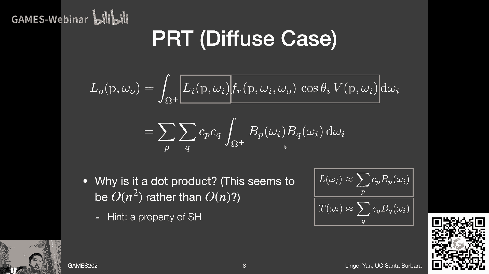

这就是回忆一下之前正交性好吗，然后这是我们上节课的一个呃，相当于重新理解嗯，然后我们回到这节课的内容上来，这节课呢我们要说呃diffuse的物体，那咱们之前之前已经处理了。

那么glossy的物体我们怎么处理呢，glossy的物体或者说它又有什么呃新的问题，它有什么和diffuse不一样的地方呢，啊然后咱们想一想diffuse和glossy，首先它们的区别在哪，对嘛。

它们区别就在b2 d f，那b2 d f呢，这diffuse呢它是一个常数对吧，没问题，然后对于glossy来说，它可就不是常数了对吧，他是告诉你从任何一个方向打进来对吧，打到某一个表面。

然后它往哪个方向去，那你换个方向打进来，它往其他的方向反射对吧，是这个意思啊，那所以说呃，这个b2 d f就是一个完整的，4d的b2 d f了，呃对吧，呃两维的呃是输入的方向，两位的输出的方向嘛对吧。

那所以说它是个四维的一个函数，那咱们如果按照之前的一个呃办法，还去做这么一个呃对light啊，做一个，做个什么呢，就是就是投影到s h啊，然后我们这边再把light transport。

投影到s h的时候，我们就会发现有一个问题了对吧，然后呃这个light transport投影到s h呃，为什么有问题呢，这个b2 d f它是个四维的函数，又是i的函数，又是o的函数。

那所以说我当然把整个light transport写出来，我是不是给一个o，我就可以得到一个不一样的哦，呃这个呃b2 df这个roi对吗，也就是说我只要给一个不同的o。

我得出来结果这个row io就不一样，那所以对于任意一个给定的这个o，或者说我观察的方向对吧，然后我的b r d f都不一样，所以给定任何一个观察方向o，然后呃这个b2 d f。

或者是呃不是这个light transport这一部分，然后我都会投影出来一组完全不同的vector对吧，这样想啊对不对，然后然后就是说这就是这就是一个呃，完全不一样的地方了。

就是因为light transport维度是很高的，是四维，它不只是i的函数，也是o的函数，所以对于任意一个o都会嗯，当你把这个呃light transport，投影到2d的一个basis呃。

是在i方向上的对吧，然后投影到basis之后都会得到一个向量，那所以不同的o给你不同的向量，这就麻烦了，所以说呢对于这个向量中间的任何一个元素，它都呃现在来说，它不是一个数，不是一个简单的数ti。

而是一个o的函数，这个没问题啊，这个意思嗯行，然后另外一个直观证理解怎么理解啊，因为glossy物体有一个非常非常重要的性质，那就是它是和试点有关的，对不对，然后我们之前说diffuse物体。

你不管视角如何去旋转，你看到的东西，你看同一个shading point，你肯定看到同一个东西，因为整个diffuse shading它和视角是无关的，对不对，然后对于glossy物体。

它和视角是有关的，也就是说你给一个不同的视角，他就应该得出一个不同的结果对吧，是这么一个意思，所以你你最后得出来的这么一个结果，左边这个lo，那肯定是跟o是你你有一个不同的观察方向。

它就有一个不同的l就是这么个意思，那所以说这样也就能解释了，为什么来transport，这里虽然已经把他投影到这个i上，这两位的呃，这个头已经做好了，然后但是这个ti仍然是o的一个函数啊。

这么个意思行吧，那这样说的话就会知道这个问题在哪，那么怎么处理对吧，然后这这这里就是人们聪明的地方，大家看这里，既然你已经把前面拉transport 4 d的，给投影到一个二维的东西上面去了对吧。

然后你剩下来得到的这个呃这个系数，这个ti它虽然是o的函数，但现在它只是o的函数了对吧，就是这个意思对吧，它它现在是一个二维的函数，那么它既然是二维的一个关于o的函数。

我能不能把它给投影到关于在o的方向上，我也把它投影到spherical harmonix，想进去，对不对，按照这种方式，我仍然可以把它给拆开啊，没问题啊，然后这样一来的话，那我们会得到一个什么呢。

我们我们就会得到哦，原来light transport，这里就不再可以认为是一个向量的，而是一个矩阵啊，这么个意思，那说白了就是说给你任何一个o，你得到的你会得到一串vector对吧。

那你把所有不同的o得到了，这串vector都给摆在一块，那可不就变成了一个矩阵了，这没问题哈，那这样的话大家看啊，这里是呃就是这个计算最后变成了什么呢，这里的计算就会变成说哦我最后计算的呃。

嗯就是说最后出现的这个呃radiance，它是往各个不同方向去，它是o的一个函数，那我一下就可以解除哦，我从不同的方向上面去看，会看到什么，这就是我最后看到的结果对吧，然后也就是他最后不再是一个数。

你给你任意给一个o他都可以去呃，告诉你啊，他往这个方向看的结果，那也就是说最后得到结果是个向量，在关于o的啊，然后呃lighting lighting的话，就是之前的关于i的这么一个呃一个向量。

它没有问题，他还是一直两回的对吧，那么呃大家想这一个向量对吧，你你乘以一个什么东西，才能够得到另外一个向量，所以说从这个角度上来也可以推出来，它必须得是一个矩阵的，没问题吧。

那也就是说呃这样一来呃大家就可以看到呃，说这里light transport这个matrix做了件什么事，他基本上就是告诉你说这个从ui方向到o方向，怎么样去transport的嘛，对吧行了。

那这样的话就是说关于呃glossy的情况下，那咱们就算是对之前的呃diffuse的一个延伸啊，这么个意思，然后在实际渲染的时候，大家会发现呃这里就有代价了是吗对吧，然后两个代价呢。

其实一个是呢任何一个顶点或者shading point，你都要存transport matrix，那原本说假如说你要用25个呃，spark harmonix或五阶对吧，五阶不是25个吗。

然后你现在要用的就是625个存储了，对不对，然后因为因为它是个矩阵呢，它是得变成25x25，那就非常多了对吧，一个是存储，那当然存储多了，那势必在运算的时候，你在实际上呃去render的时候。

那你得到的结果，那你肯定是对于呃glossy的情况下，你就得做一个向量和矩阵的乘，那这个操作肯定就会比呃向量和向量做点乘，那要复杂的很多对吧好啊，ok这就是关于glossy的情况。

像正常情况下人们会用多少个唉，这个spark harmonix的奇函数呢，人们通常会用三阶四阶五阶啊，就是非常低频的情况下呃，咱们上节课分析过对吧，呃三阶的话用来呃去照亮diffuse，物体已经足够了。

然后正常情况下对于glosses的话，可能你得需要更多一些高频的一些东西，因为大家想glossy lobe嘛，他的pet看起来就会比较高频嘛对吧，所以说用的比较多，大家用四阶五阶甚至更多。

然后在我们就是就是就是科研领域，差不多大家用了十阶还嫌不够呢，还有八阶十阶都都觉得仍然是非常低频的，哈哈这个事情，ok然后嗯如果说你选择了用16个g函数，那么你在呃diffuse的渲染的时候。

那计算量那就是16对吧，两个长度为16的向量做点乘，那么如果是glossy的情况下，那自然就16乘以一个16x16的矩阵，最后还得到一个16长度的将来啊。

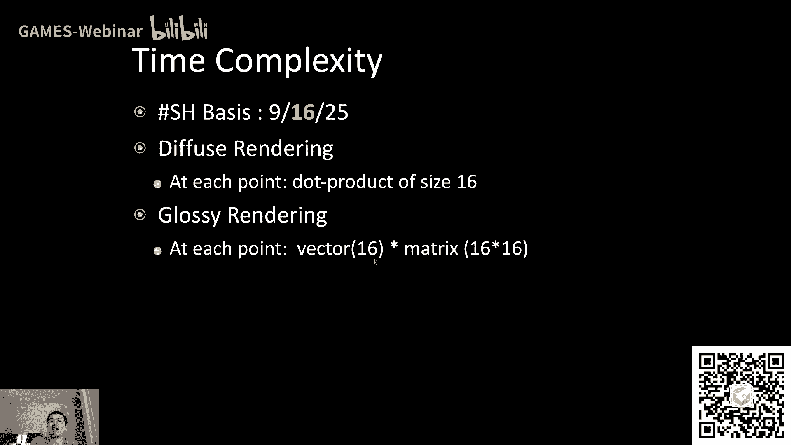

这么个意思，ok那么glossy的情况渲染效果如何呢，大家可以看到效果还是不错的对吧，这是当年的结果了，2003年吧，应该是呃或者更早，然后就是说大家可以看到呃，那个时候呃像这种在整个环境工程下。

然后我去渲染一个这么高质量的这种，glossy的物体，一个是看起来非常不错对吧，然后另外一个它的速度其实也非常不错，那个年代就是对于glossy啊，不过大家看到了一个数据对吧，3。

6fps很明显它要比那个diffuse要慢很多了，呃那自然就是因为它计算量非常大，不过呢那个年代嘛对吧，呃呃呃硬件什么东西，大家可以看到都是非常非常早期的硬件，现在就算你什么都不做啊。

正常情况下直接实现，比如说四阶的s h描述的glossy，然后你就真正算16去乘以一个，16x16的矩阵，我估计到100是没有任何问题的啊，这个意思好嗯，然后呢呃好正好有同学问这么个问题啊，有同学问说。

如果说呃这个glossness非常大意思，就非常高频对吧，这种怎么办对吧，像这种情况下就是p r t解决不掉的问题了，这是真的哈，就是说呃对于这种情况下，你嗯就是理论上当然能解决。

你可以用非常高阶的s h来描述它，但是s h呢它描述这种非常高频的东西，描述的效果并不好，然后所以那种情况下呢接近镜面反射的情况下，你就不能再去采用呃，呃spark harmonix来做于来作为基函数。

来作为奇函数，你是可以用一些别的东西来做奇函数的，不过好像有同学对有同学直接回答说，那个时候你直接采样就好了，因为如果物体本身它接近镜面反射的话，因为你你是直接知道他是如何去反射到，其他呃东西的。

然后你这种情况下只需要去做retracing就行了，对吧，连pass都不用做啊，这种倒是可以啊，嗯不同的解决思路吧好吧，然后咱们回到这个问题上来，大家同时可以看到另外一个事情就是什么呢。

就是说呃我考虑正确的visibility啊，左边是不考虑visibility，假如说visibility都是一，那当然得到结果不怎么真实呢，那任何一个顶点，咱们比如说吧这个呃这个佛像。

他的这个脚下这个地方，那很明显，你如果往这这些上面这些地方，他会被他身子挡住对吧，那你肯定什么也看不到，他接收不到来自上面的光照嘛对吧，然后所以这里不该那么亮，然而这里考虑的呃这个阴影之后。

效果还是不错的对吧，然后所以挺好，那如果说你在做light transport的时候，然后你把多次的呃反射，也就是说嗯比如说这个呃佛像，它自己的不同的不同的部位之间，而这里这里。

然后呢呃他们之间互相的反射，也把他们给做出来，就都给预计算成light transport的一部分，那就是说我可以引入所谓interreflection的部分，同样啊呃这是呃这是可以做的。

当然上一节课我们就没有细说，这个事情到底是怎么，为什么说你可以把这些多次反射呃对吧，多次bounce给当做是light transport的一部分。

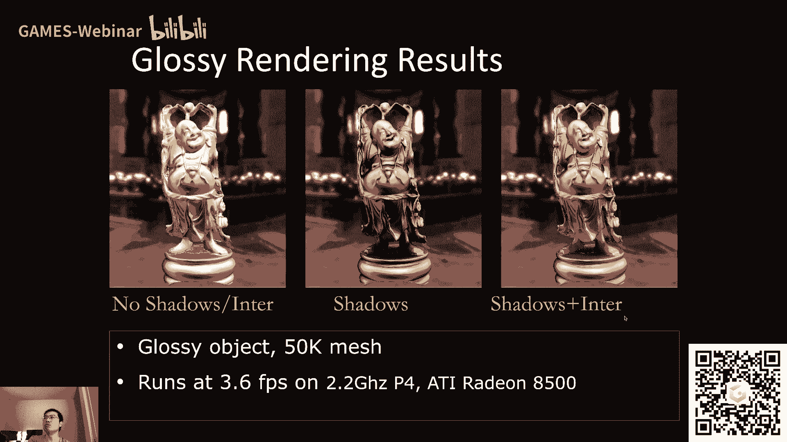

那这个要怎么理解呢，这么看啊，咱们来看这个结果呃，呃这这这样大家很明显，从左边这幅图上可以看到，这就是shading的一个呃直接光照的结果吧对吧，然后我们在games 101里面稍微提到了一点点啊。

就是在说这些就是更高阶的一些算法的时候，比如说什么photo mapping的时候，我们提到了一些关于对不同路径的分类，咱们在这里再多提一句啊，就是说啊，呃我们可以用一系列的表达式来描述，一系列的路径。

它都是什么样一个类型，比如说呢光线从发出直接就被我看到，那么我可以把它写成l啊，l就表示这个光这个光线从light里面出来了，然后e就直接进入我的眼睛，那这个这种类型的pass，我管它叫l e啊。

哎哎哎这个e就是i嘛，light就是l就是light嘛，对吧，l e就直接看到的，那大家看到左边这个直接光照，直接光照是什么呢，那自然就是light，然后谈到了一个呃什么物体上面呢。

glossy的一个物体上面去是吧，打在了一个glossy的物体上面去，然后并且被我们的眼睛看到这里面呢，如果你这个game 101又忘了的话，那那我这里先说一下，就是说正常情况人们区分材质啊。

呃在特别是在real time rendering，大家区分成三种，一种叫diffuse啊，diffuse，一种叫呃specular，specular呢就是指那种镜面，那种那种呃光滑的程度啊。

这种意思就是一个光线过来之后，它会完美地往镜面感这方向盘，这啊这个意思叫specular啊，还有一种介于中间的就叫gloy啊，就是正常金属这种，你说它像镜子吧，它还有点糊，但是你说他defuse吧。

它又不是对吧，就介于中间嗯，就差不多区分成这几类，然后如果说要求不怎么严格的话，在不怎么出现这种呃歧义的情况下，有时候说specular其实就是指glossy啊，这么个意思，如果这里呢咱们说清楚。

咱们就单独把glossy写出来好，那对于左边直接光照直接光照的呃，这个所谓啊pass的类型，这这这那就是光呃，从发出达到了一个gloy物体上，然后被你眼睛看到，那就是e最后到你眼睛没错吧。

那么呃如果是呃有呃两次棒子，像这种情况下，大家可以看到这个壶身反射出了壶嘴和壶嘴，对吧，呃在在这个地方大家可以看到对吧，呃壶身上反反射出来这么一个呃地方，它不就是这个壶嘴的这个高光对应的地方吗，对吧。

那所以这里呢大家大家会看到，如果你你的光线再多bounce一次，它是什么呢，它是从光线出发到糊嘴，然后到湖山，然后到你的眼睛没问题吧，是这么个意思，然后也就是说它可以用lg g e来来描述它。

那么对于通常的物体来说，假如说就是diffuse或者glossy，那么就是就是中间要么是d，要么是g呗，那咱们这时候可以借鉴一下，正则表达式的描述方法啊，大家都学过自动机没问题吧，啊这个正则表达式啊。

或者说模糊匹配啊，呃然后就是说light从光源出发，然后呢它可以打到任何物体上，可能是diffuse，可能是gloy，然后弹多少次，随便零次，一次两次三次对吧，我已经忘了新号能不能表示零次了啊。

然后呃没关系，反正弹射多少次，最后到你的眼睛，这不就正常，light turn transport了对吧，这个意思哈，然后你多个棒子的话，就是就是多个呗，就是就是这么一种写法，然后呢呃对于左边这种情况。

这种是很常见的一个情况，比如说光线呃，正常情况达到一个比如戒指的内壁啊，或者大家平常喝喝牛奶的时候，会比较容易看的啊，玻璃杯的内壁，然后内壁嘛这些东西都是比较光滑的，然后呃我们认为是specular啊。

就是非常光滑了，然后然后呢，他会嗯这个就反过来打到这个地面上啊，就是光线，假如说从右上角打到它的内壁上，然后打到他的这个地面上，然后最后再被你看的，这是一种典型的pass，我们管它叫l s d一啊。

l s d e，所以light打到specular，然后被聚焦到呃diffuse物体上，最后为你看的这种东西就被叫做costics啊，然后咱们之前提过对吧，然后我之前还吐槽过这件事情。

我说把它翻译成国内啊，把它翻译成焦散非常不合适，结果你它散掉你就看不见了，但没关系，我们就管它叫costics啊，然后l s d e啊，当然还可以再扩展扩展一点l s型号，然后d或者g然后也是型号e啊。

这没关系对吧，然后我为什么要这么写呢，这样写大家会发现你，你光线无论如何从light出发的，这都是l没问题吧，来看这些所有的这些light pass，它左边反正都是l，你最后被眼睛看到那中间的东西。

所有东西都是来transport，是不是这意思对吧，那如果这样一来的话，那不管它有多么复杂，不管它有多么复杂啊，我最后要算的，那那那无非就是说呃，呃就是这个整个light transport。

我只要把它给预计算出来了，那我不就知道了嘛对吧，最后的结果，所以说任何的这种light transport的这种形式，我都可以把它分成呃light和剩下的所有东西对吧，那就是这么个意思了。

呃呃所以说我们在实际上去渲染的时候，只要我们采用了p r t的一种思路哈，只要用了p r t的思路，把light和light transport拆分之后，不管你light transport有多复杂。

只要我之前预计算了，我在实际的渲染过程中，它是呃嗯非常简单的啊，就是这么个意思，就是和呃这个transport的复杂度无关的，就是你实际跑的时间啊，这个意思啊，那如果预计算呢。

当然可就是跑的时间就会越来越多了，就是渲染的时间是跟他无关的，那么自然就有同学说这要是在说明什么对吧，再说明说，你当然可以把任意复杂的light transport，都给预计算出来啊，就是想说这事嗯。

那么呃就是说呃怎么算对吧，之前咱们不是提过这个事情吗对吧，然后咱们还回到之前所说的，比如说diffuse的那个例子上来看对吧，diffuse的呃呃这块来说啊，或者说没关系吧。

就是说假如说你的light transport，然后呃这块现在是一个二维的一个情况，然后呃你要把light transport的部分，就是这个红颜色杠呃，把这部分给投影到s h上面去对吧。

这不是light transport投影到s h上面去吧，咱们上节课是出现过这样的对吧，然后呃我们上节课就说了，这个式子还可以怎么理解对吧，你是把这个函数投影到s h。

只是把这个函数和这个s h的奇函数，做了一个product integral，这是理解方式一没问题，理解方式二是这样的，你看这个公式看起来像不像就是rendering equation。

就仅仅是把lighting这一部分给改成了一个呃，某种函数，这个函数你管它多多么复杂，到底它是不是lighting，你还可以把它当成是lighting，是不是这个意思。

所以说如果你要把light transport给投影到，比如第几个basis上，比如说第16号basis上，那其实就相当于是你认为你在用第16号basis，呃，他把它给当做哈哈，把你当做一种光照。

用它来照亮每一个顶点，并且把每一个顶点上照亮的结果给记下来，那自然而然你就会得到一个，就好像是你在用这种光照来渲染这个场景一样，没问题吧，那所以说像这种情况下。

就对于任意复杂的like transport，你都可以这么认为吗，就等于是认为说给定了一个光照，这光照就是spacle harmonix的奇函数，然后你用它来渲染出来的结果。

诶诶啊回来ok然后就是说仍然是正常的渲染，那这部分正常的渲染，既然是预计算的，预计算的话，你有光照，你有这个这个running question，你用什么方法都可以解，用。

用pass tracing对吧，用什么方法都可以做得出来，所以说无论如何，它是可以做出来的，就这么理解，就把他理解成是呃，这个light transport的预计算就是一个渲染过程。

只不过这个渲染过程呢哈哈，他就是好像是在一些奇怪的lighting的情况下做，另外呢这张图显得尤为奇怪啊，我把它说明白是怎么回事，这张图看起来奇怪，这个红色蓝色是因为他用了这种可视化哈。

它把它的值给显示成了红色和蓝色，来表示它是正还是负，红的越厉害表示越越正，然后蓝的越厉害越表示负黑的表示零啊，这么个思路，然后就仅仅是因为它可视化，造成它看起来会比较奇怪啊。

如果说你要把它给显示成是其他一种，什么样的颜色呃，就是像我们平常用的这种这种可视化方法呃，那那反正就是用这种光照去得到一个。

渲染图而已啊，这个意思ok啊，就是这么个理解方式，然后呢那大家大家可以看到，那对于呃不同的b2 d f，如果你说不只是glossy吧，对任意的b2 d f，反正不也是四维的吗。

然后呃呃你就可以得到一些呃，比如说像iso topic的b2 d f的一种现象，大家可以看到类似于对着这个这个鸟啊，它肚子这么旋转着这么摩擦的这个结果哈，呃金属，然后呃中间这算是比较正常的吧。

然后呃右边这这些看起来就比较不一样了，因为大家可以发现他不止有一些，比如说类似各项异性的一个结果，它还有一个属性叫做special varying，意思就是不同的位置上。

它可能拥有完全不同的b2 d f，这里从这个弧有点生锈，这个角度上可以看出来对吗，不同的地方呃，他的b2 d f还不一样，b r d f还是四维的，但是如果你考虑整个物体的话。

它不同位置有不同的b r d f，就意味着它现在变成了一个六维的函数，两维的表示它的不同的位置，另外四位表示在这个位置上，他的b2 d2 的值对吧，然后也就是说它是一个更高维的东西，但是没关系。

就是说只要是呃你能够把它表述出来，就肯定是有办法可以用预计算来做的啊，这么个意思，然后咱们看一看当年的一个结果，ok大家可以看到呃。

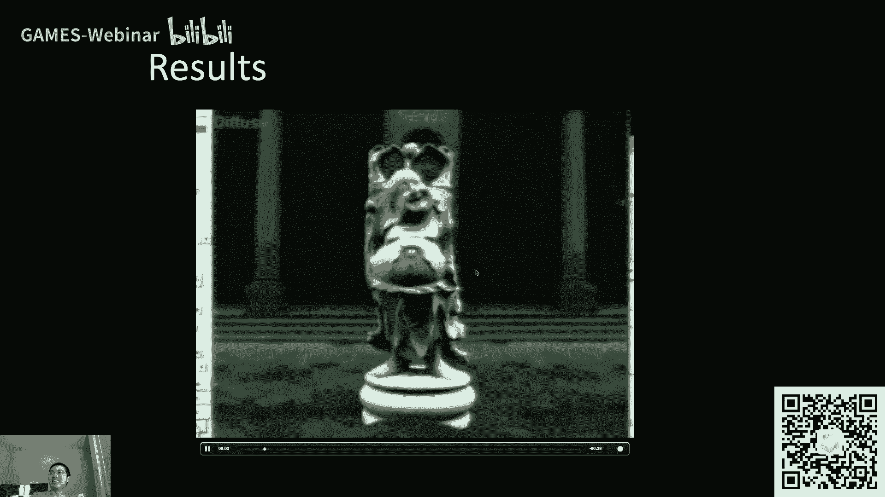

他突然换了一个光照啊，在这里对吧，然后也就是说，你只要预计算过这个光照都没问题，现在在旋转什么呢，现在好像是在旋转lighting对吧，然后哦这里现在变成了旋转视角，然后旋转lighting和旋转视角。

都是可以得到一些不错的结果哦，现在材质变成glossy，glossy的情况下，旋转光照自然而然会有不同的结果对吧，但是旋转视角的时候也会有不同的结果，这个这个大家从这壶身上的确定变化。

可以看得出来，对不对，哎所以说呢呃呃呃这是非常不错的一个效果吧。

然后这里就是之前我说的那么一个呃，就是你不管啊transport有多复杂。

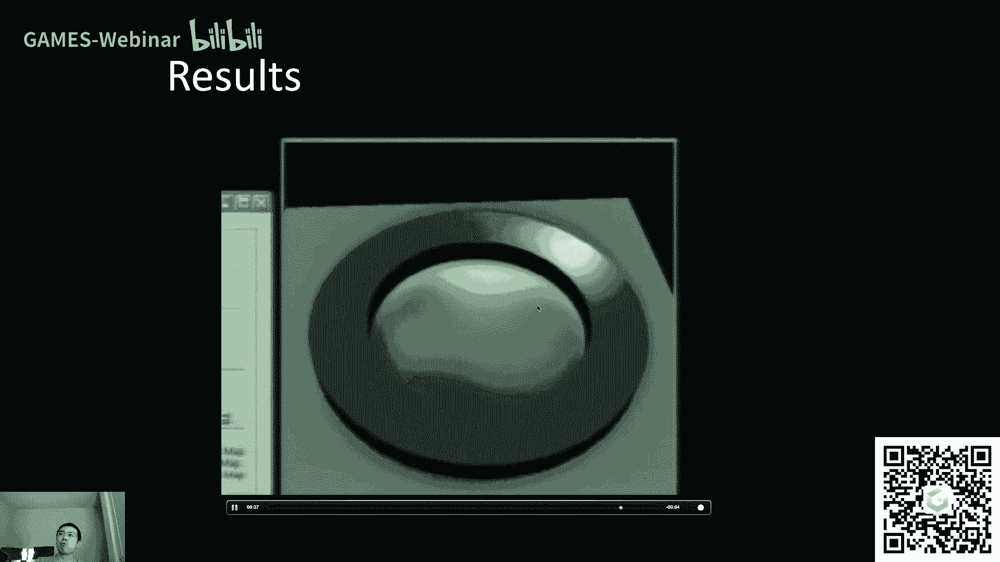

然后你肯定是都可以预计算的啊，就只说这么一个意思好。

那这个回了嗯行，那么简单总结一下，就是说嗯之前最早的这篇p2 t，然后他做了一件什么事，他提出了用spherical harmonious的奇函数来描述。

lighting和light transport两部分，然后呢呃对于diffuse的情况下，就可以在实际的呃渲染过程中，每个顶点做一个点乘的操作，然后如果是glc的情况下。

每个顶点就做一个向量乘以矩阵的一个操作啊。

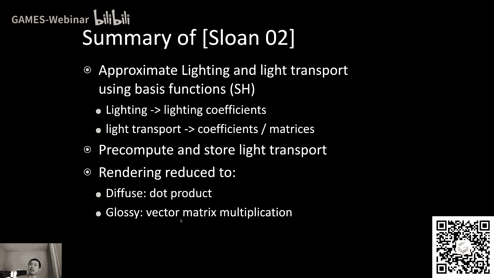

这么一个意思啊，然后当然他有他的问题，什么问题呢对吧，然后一个是他嗯，s h本身它当然有很多不错的性质对吧，但是它有一个不好的性质，那就是它基本上只适合用于描述低频的函数啊，大家注意这个措辞啊。

不是说他不能描述高频的，只要你给他足够多的这些像他就可以描述高频，没问题，但是实际中他就是就是呃，由于说你用没那么多的想得出来呃，并没有多好的高频的表示方法，而不是方法表示结果啊，然后嗯。

所以说平常人们会认为他不太适用于描述高频，比如说这里对吧，大家还记得这个例子，你就25个呃奇函数啊，你去描述这么一个相当高频的一个环境，光照对吧，然后你其实一旦恢复出来，你就基本上不剩什么了对吧。

然后你如果用，那还是一样，上节课如果没注意的同学啊，这不是26个啊，这是26平方个，也就是26阶啊，这这边n等于25，是五阶啊，这是26阶，用了那么多个，然后他他才能基本恢复出来一些高频的东西，对不对。

也就是说他不太适合做呃高频啊，然后呢呃我们之前说要关注p r t，它它的好处是什么对吧，它可以可以比较准确的算出整个环境光照下，甚至多次bs下呃，整个一个场景啊，他最后渲染出来的结果。

当然也可以考虑到它准确的visibility，这是非常好的对吧，但是不好的地方就在于他做了一个假设，要求场景，你只要预计算了，一旦预计算了，就意味着固定住了，是不是这意思对吧，那既然固定住了的话。

那呃就是说呃场景就不能再动了，所以是静态场景，然后甚至你预计预计算了它的材质，比如b2 d f都已经预计算好了，那就意味着你在场景中就不能够动态地，改变它的材质，那就非常不好对吧，然后另外一点呢。

你自然需要大量的预计算的数据，然后这些存储啊或者别的什么东西，这些都会在实际的应用中会造成不小的负担，对吧，ok那么既然他有这么一些问题。

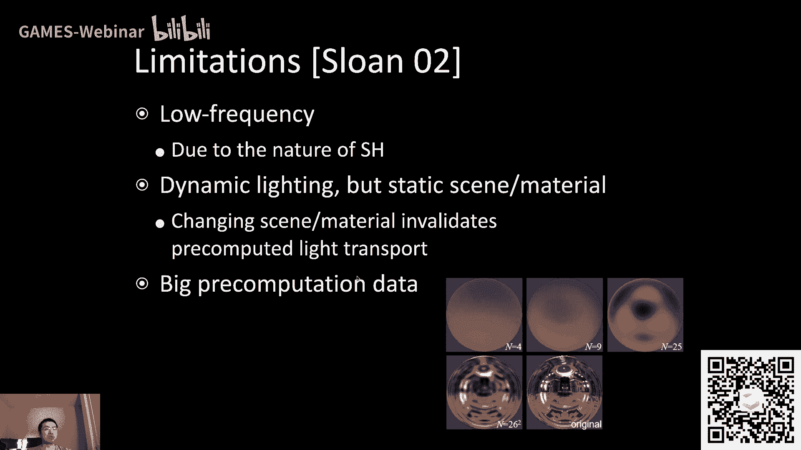

那么之后的人们呢，就嗯研究出了各种各样的方法，来试图去解决这些问题啊，那咱们看什么呢，就是说有同学研究出来了各种不同学啊，有科学家们哈，研究出来了各种各样的呃心型的啊，奇函数。

就是说咱们不用s h s h有点问题了对吧，咱们用点别的啊可以，然后呢有同学也说惯了哈，就是说啊这块这块研究呢又有人指出说这个啊，嗯嗯就是就是现在预计算了什么对吧。

预计算了lighting和light transport，但我能不能预计算更多的想，比如说我预计算lighting计算，又预计算visibility，又预计算剩下的那些部分b2 d f什么的。

哎这样的话我到时候预计算的过程中，我就不再是一个所谓dot product了，就是不是两项相乘再积分了，会变成三项相乘相乘再积分对吧，然后以及会不会有更多有这块，就是呃有相当多的研究在做这个事情好吧。

然后呢，呃呃呃有人发现这个问题说是呃静态场景呃，呃就是p r t嘛限制了场景必须得是静态，那自然是不好的，那我有什么办法能够说我又预计算，我又可以允许这个场景，一定程度上发生一些呃变化安，那就非常好了。

是不是，然后呃还有一系列研究，就把p2 t的这个思路给拿到了一些呃，复杂的一些材质上面去，比如说半透明的材质以及像头发，然后像这些啊，然后最后有一点其实非常重要的一点，那就是呃呃有人研究说啊。

这个预计算确实是不错，但是还有预计算啊，也有它很多问题嘛，那我们如何能够不预计算，然后我们争取能够把所需要的这些东西都能够，解析的解出来，呃当然要经过一些近似了，对不对，那就非常好了对吧嗯。

所以说呢在这里在这里这样啊，我说呃一点事情啊，一个是什么呢，唉从这些问题上大家可以看到啊，从这些follow up work，大家可以看到一个事情，就是说对于科学家来说，你可以看到最难的是什么对吧。

最难的其实是发现问题，而不是解决问题，因为即使是像这个来预计算，分明就把场景给相当于冻结住了，那为什么还还还会有科学家研究出来，怎么样才能让这个场景动起来又可以呃，之前预计算对不对。

也就是说只要有了这么一个问题，说我们争取能够想办法解决，科学家们总是有办法能够解决的，这是个非常非常好的事情，而最大的问题在于说呃说是发现这么些问题啊，就是特别在p r t这篇paper之前。

那人们肯定根本就看不到，说会有什么呃什什么这这这些问题对吧，就是说如果没有引入预计算这么一个概念的话，那这些问题不存在，那自然也不会有人研究了对吧，这是一个事情啊，跟大家说，发现问题总是难的。

解决问题总是简单的啊，这个意思嗯，然后呢另外一个事情是这样，这里呢有一个典型的例子，就是咱们在讲p r t之前讲的split sum，大家还记得吧，在环境光照下怎么算shading。

不算visibility的情况下对吧，怎么算shading，这个就是典型的这个解析的方法，当然呃加入了一些什么预计算的项目，就是计算了一张表嘛，大家还记得吧，二维的一张表，但是那个就非常轻量级了嘛。

然后我们就可以认为，它基本上得到了一个解析了解，那这样的话对于材质的shading，那用那种方法，那肯定会比precomputation要容易很多对吧，然后正是因为在过去差不多10年嗯，甚至15年吧。

也就是呃p r t出了几年之后，有一些方法渐渐的开始考虑，说我开始用解析的方式来解这些问题，而不用于计算，然后就导致说p r t在过去的10年内，并没有那么火啊，这么个意思，然后但是我的一个感觉啊。

我的感觉不一定对哈，就是说我觉得在未来呃，特别是这段时间real time retracing的兴起，很有可能会把p t再给重新提出来啊，这么一个思路啊，看吧啊，看看之后是个什么样的情况。

我自己也挺感兴趣啊，这个意思好，那么呃差不多我们先停一下好吧，我们先停一下，看看同学们有什么其他问题啊，ok有同学之前问说light transform复杂的情况，预计算时间是不是要变多，对没问题啊。

噪声是想说是想说我们怎么样做一个special varin，b r d f对吧，那这里是这样的，就是说p r t关注的更多是你，你知道了这个special lvarin b2 d f啊，各个各个位置啊。

不同的b2 d啊，假如说已经知道了，你还是可以计算，就是你怎么得到呢，就正常情况下，人们会用一些呃这种呃可以控制的噪声来描述，咱们咱们之前在101里面提到过一点吧对吧，什么play noise之类的。

ok呃那这样哈，如果同学们没有什么其他问题的哦，还真有glossy p r t里面视角方向怎么决定，而不是视角方向怎么决定，而是你首先要预计算对于每一个视角方向，就是每一个o你都要预计算一套啊。

这么个意思，然后就是说哦有同学说矩阵毕竟不能无限大，那没问题，说的对，那这回我理解你说的意思了，就是说你不可能说这个这个视角方向，它是有可能在整个球面上都都，这个所有方向都有可能有对吧。

你你肯定还是得从中选择一些对，没问题，正常嗯，这个大家就会呃选择一个grade，然后在grade中间去呃决定一个视角方向，然后只要你决定了一个呃这个观察的这个方向。

然后你就会把其他的所有东西都要与计算一遍，想一想，这是个非常复杂的过程对吧，然后预计算结果不是存成light map，有同学应该是把这个和呃什么light baking，什么东西给混在一块儿了是吗。

就是这块来说，因为预计算的维度是非常高的，然后你不能把它简单当成一个二维的一个表啊，ok嗯行吧，那那这块先这样啊，然后因为我说还要给大家介绍一下啊，呃这个呃其他的basis function对吧。

我们之前说小波啊行吧，在这里我先看同学们还是踊跃的问题啊，挺好的，我先回答一下吧，就是光栅化里面怎么做这个事情做不了啊，正因为做不了，所以才会有这个专门的做retracing的硬件吗，现在是可以了。

dx r是可以做的，direct x retracing啊，是已经可以结合在光栅化里面做呃，实时的re水醒了，然后另外这位同学问这个问题，是说预计算也要写在光栅化里面的。

我怀疑是其实想问这个事情不需要啊，运算出来成这个这个程序之后的结果存在，比如说硬盘等，然后你在做这个实时渲染的时候，再直接把它读出来，这么个意思，要不怎么叫预计算呢。

对吧呃p r t在工业界有什么具体应用，那太多了，基本上来说这啊一直到现在哈，电影和游戏里面还都在用这些东西啊，spherical harmonics，lighting肯定到处都是啊，这个没问题啊。

啊ok啊预计算可以理解成物理材质，可以可以理解成物理材质的一部分啊，嗯ok还有同学问到rtx，我就不再多说了哈，关于这块，因为这个说的有点远了，ok那我这样我先把web说完啊。

然后就是说大家可以看到有人研究了很多，各种各样不同类型的其他的一些奇函数对吗，然后奇函数呢，呃嗯这里给大家列举了一系列的东西，来给大家看一看，大家知道这个这块，大家研究出了多么恐怖的东西。

在markhamox之后啊，大家研究出来各种各样的什么呃，小波来描述呃这些呃二维的一些函数，然后还有人找到了一系列的数学工具，叫做zo harmonix，它和scarl harmonix什么关系呢。

咱们不说了这个意思，然后还有一些球面高斯函数，sg也是二维的函数，理论上来说啊，不应该管它叫基函数，但还行吧，没问题，然后还有之前我说的徐坤老师做的，peace with constant的基函数。

这都是呃一系列的算是经典的工作吧，然后这让我想起来，差不多在15年前那会儿就是m s2 a啊，微软亚亚洲研究院啊，做了很多很多跟p2 t相关的工作，那时候做的非常厉害啊。

ok啊那么这里呢简单的给大家介绍一个。

那就是小波，而且咱们不会详细说吧，就是呃为什么呢，因为这块来说，如果大家不学信号或者干什么，可能接触不到这个概念还是挺重要的吧，或者说挺有用的，简单跟大家提一下，那么小波是什么，小波呃。

刚才说了是一系列奇函数，不过这里呢我们说我们的理解是呃呃，或者说我们要谈论的主题是二维的小波，大家可以看到二维的小波是一系列奇函数，也正画在右边了，对不对，然后这些呃呃小波呢。

它有一些非常呃和s h不一样的性质，比如说不管任何sparkle monica的计函数啊，它是都是呃定义在整个球面上对吧，然后对于小波来说，它是定义在一个，大家可以认为是一个图像块上的。

而且呢不同的这些小波它的定义域还不同，比如说大家看到这些第三列，第三列整个右半边都没有，第三行，整个下半边都没有啊，就是说大家看到黑白的地方才是呃，这这这些小波这些函数它各自的定义域啊。

这么个意思区别了哈对吧，然后呢呃但不管怎么样，大家从右边可以看到它是写正和负，就表示这个值是正的还是负的，就有点像这个step function对吧，呃就是类似这种这种小波。

然后呢这里还说清楚小波呢有很多种，我们这里说的一种小布叫哈尔小波，h a r这种小波他是有明确的这种界限的，然后有一些小波长得非常奇怪的，但没关系，就是一系列函数呗对吧，他还是在二维的情况下对吧。

然后只不过它不定义在球面上，定义在单定义在一个块上，这也没关系嘛对吧，然后呃我当然要关心的是两件事对吗，我第一给你任何一个函数，我肯定也可以把它投影到各个不同的小波，对应的基函数上面去对吧，这没问题。

然后呢，这就是小波和spherical harmonix的不同的地方了，我们说为什么spherical harmonix，可以用来比较压缩的，或者说比较紧凑的来描述一些函数呢。

是因为我可以先给他一个阶段对吧，我就用前多少阶的s h对吧，然后我就可以恢复出来若若干频率的呃，这样的呃原始的函数就通过这种方式来压缩，那么小波的压缩方式不是这样的，小波的压缩方式是这么一种运作方式。

给你任何一个函数啊，2d的，你可以投影到任何的这些，所有的这些小波的奇函数上去，你投影到gr数上去之后呢，呃你会发现大量的时候是这样一种情况，就是很多奇函数对应的系数是接近零的，ok然后呢，这样一来。

就自然而然给了你一个非常不错的压缩思路，那就是说啊我就娶他啊，这比如说对应的系数最大的多少个，那如果其他有很多这些系数都接近零，那那些我我就不要了对吧，然后我就把那些给扔了，然后这样的话呢。

就是人们所说的所谓nonlinear approximation，就是我通过这种方式保留非零，或者说保留最大的多少个呃，然后通过这种方式来近似的描述，或者恢复一个原始的函数，那么它有一个最大最大的好处。

和s h相比，最大的好处就是它支持全频率的表示全频率，意思就是说我可以表示低频。

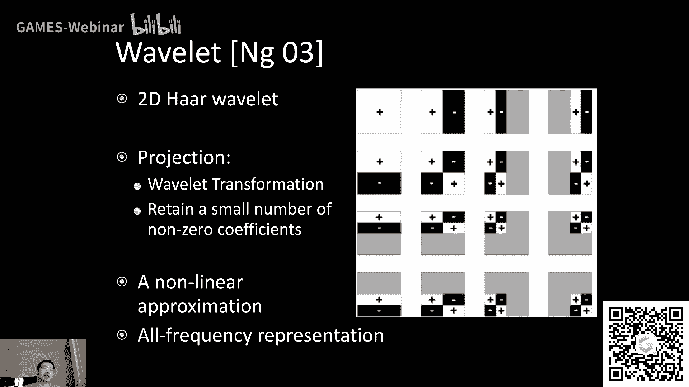

也可以表示高频，那就非常厉害了，对不对，那么咱们来看一看啊，对于这种小波平常来说，我们所关注的事情就是，怎么样把任何一个函数给投影到小波上，是不是，然后呃嘿正好有同学问这个问题啊。

如果说小波他是定义在平面上的，那么我用来描述一个呃，2d的一个球面上函数的时候不会出现缝吗，哎这种情况就是大家聪明的地方，这个时候大家就自然而然的用cube map来描述，这个22d的在球面上的函数了。

就不再用什么spherical map或者别的什么，那cube map就是六个面，每个面它都是一张图对吧，都是一个正方形的图，那咱们说清楚啊，然后对于cube map来说。

这个light大家可以看到六张图，每张图单独做wave let变换啊，就是小波变换，就是所谓把一个呃图投影成小波的系数，大家可以看到做了件什么事呢，就是说做小波变换，首先呢对于任何一个图，他都把这些呃。

比如说呃呃一些高频的一些什么信息啊，给留在呃，对于任何任何一张吧，咱们就以这张来说啊，原本他是这么一个结果对吧，原本是这个呃对于任何一张图啊，他都先把这些高频的一些信息给留在他的，这个右上呃。

右下和左下这么三个小块里面，把它稍微低频一点东西给集中到这左上去，然后那个左上还可以继续再做小波变换，然后又把高频的东西给留下了，然后低频的东西放在左上，然后大家会发现一个事情对吧。

高频的东西好少啊对吧，然后就是说对于对于这些绝大多数地方，他好像都是零，对不对，那是非常好的一件事情，然后就是说不断去做这样一系列的呃，呃小波变换，那我就可以得到一个非常不错的一个结果了。

就是这么一个思路哈，ok啊哈哈哈哈，请问对，很像四杀树说的很对，没有问题，那我这里呢多说一个事情什么呢，就是说呃大家可以看到给你任何一张图，你用小波变换，然后呃你你就是就是说先变换，然后再保留下来。

就是说非零的这些值，你会得到一个非常非常强烈的一个压缩，没问题吧，然后这个压缩质量也会非常不错，又能保证高频，这就是为什么有一种图像格式叫做jpeg的格式，jpg哈，这个格式然后他就用了啊。

我们说清楚不是小波变换，是一种类似于小波变换的一种变换，叫离散余弦变换，叫dt啊，这种和和小波变换挺像的一个道理，就是说通过我先把它投影，然后再取它的非零的投影出来的这些系数呃。

然后得到一个非常强烈的压缩啊，能这么这么一来的话，就是呃算是补充一个小知识啊，这个意思好，那么呃ok这里就是就是关于这个小波变换。

然后我再保留下来一系列的这些非零的值，那自然其他的东西都一样嘛对吧，我就是说只是嗯就是说我把小波换成了烦了啊，我把s h换成了用小波来描述哎，那用小波来描述之后，是不是可以得到一个比较好的结果呢。

大家可以看到诶，还真是对吧，用相同的存储量，这个小波呢呃可以可以，那渲染出来非常高频的阴影，没问题吧，哎高频的阴影就意味着你对这个lighting的描述。

就是你把高频的lighting的信息给你描述下来了，嘛对吧，然后大家可以看到右边这张图，这张阴影就就非常好，但是哈哈哈哈哈，有同学这就是正好问了这个问题啊对吧，就是嗯这也是特别在图形学中啊。

嗯不太能够存在，说有一种方法能够完美的，把其他的什么什么方法都给干掉哈，不太存在这种情况，小波有一个非常严重的问题，什么呢，小波不支持快速的旋转啊，这是一个非常严重的一个问题，我们之前说这个光照对吧。

光照咱们不是说可以那个吗，可以可以呃，旋转光照等于旋转basis，旋转basis呢，s h basis是很好旋转的，它的一个basis旋转之后，可以用同阶的basis来描述对吧，我们之前说过对吧。

但是s h呃，不不不，但是wavelet他就没有这么好的性质了，那就是说你要是想旋转一个光照，那对不起，你就当当它是一个新的啊，这新的光照吧，然后然后你就得把它先给解开，先给解开成。

比如说一个6x64x64的一张呃，一个cube map，再把它投影到waf lt上面去，再取他的钱多少个，那这不是没意义了嘛，对吧，就是说这样一来的话就就就比较惨。

当然所有的这些方法都有各自的好处坏处啊，这是没问题的啊，ok嗯那行吧，反正就是给大家介绍一下，然后我刚才说了对吧，有很多各种各样不同的其他的方法哦，哦这里是这样的对吧，大家看这个这个这个标题啊。

我就说这里这里是呃人们在呃用不同的basis function，不同的基函数上做的研究，而这个研究并不是针对于说解决这个呃，动态场景说怎么样去解决啊，而这块呢我就真的不能再多说了，再多说的话是这样。

我说句实话，s h呃就单讲啊，不不单讲p r t这么一个系列，咱们就已经可以开门课了，真的是这就是说可以讲非常多节，这是没有问题的，然后呢这里呢呃是差不多在这里停住，然后就是同学们就差不多知道。

p2 t的一个基本思路，然后呢u p r t也比较难写，工业界呢用的不是特别多，然后如果说大家希望在，呃非常简单，大家去参考rv的呃p r t的一个survey啊，这是写的最好的一个啊，哦说起来啊。

而这样吧之后我会补上好吧，以后也尽可能早的给大家发出来，ok啊那这就是这个这个事儿啊，说一说wait啊，另外一种表示方法，那么这里呢给大家说一说我的故事啊。

嘿嘿我的第一篇paper其实就是和p r t相关的哈，然后呃这个在做什么呢，基本上来说就是在做呃，在呃spherical gaussi，刚才我们才说啊。

spherical gen另外一种basis函数呃下，然后我怎么样用它去渲染半透明的材质，什么是半透明材质呢，大家从右边可以看到什么玉石呀，像这些皮肤啊，这这这些东西就是半透明材质。

咱们之前gm 101说过对吧，然后spherical高省简称sg啊，这个呃它有一些非常不错的性质，大家可以看到左左边，左边它呃可以描述呃，一个非常高频的一个环境光，并且可以把这些高频这些点都找到的。

非常清楚啊，这是这个事儿嗯，好然后呢呃这当年啊我第一篇paper呃，大三的时候呃发的，然后呃发在了嗯pacific graphics，2012啊，那当当时啊，然后我这反正挺难的了。

就是然后当时为了做这篇paper呃，我平常大三的，那不是大三，平常正常大学的情况下，我有点呃有点懒啊，早上不愿意早起，然后所以我天天不吃早饭，但是我大三为了做这篇paper，我天天吃早饭，为什么呢。

因为我每天在实验室，我要熬通宵，然后熬到早上差不多七点的时候，吃完之后回去睡觉，睡到11点是上午11点半，然后我再去实验室周而复始啊，大家可以看到我这个还是很努力的，对不对，这样说的。

这个正经一点的事情是对吧，你你有什么样的对手，你就得付出多大努力吗，那个时候就是说如果要付出呃，如果要做一个嗯，那至少pacific graphics，这肯定是算是世界级的呃这个这个会议了对吧。

然后为了让paper中还是要付出点努力的，这是肯定的，唉呀行吧嗯呃这就是那个时候啊，大家想一想，从距离我第一篇paper到现在，不知不觉已经过了9年了，夸张吧，这个事情哎呀行吧，就是从那个时候入坑的啊。

更早1年对吧，我大二下入坑，呵呵行吧，哦对还有一个事情啊，2021将会在新西兰惠灵顿召开啊，如果同学们要参会的话，是就是新西兰，我之前去过，然后嗯是个非常美的地方啊，非常好，然后如果同学们有兴趣的话。

去这pg参会啊，非常不错，好哎呀哎嗯对，有同学反映说我这啊我的头发经历住了考验，是的嗯嗯好嗯啊，不过说起来是这个意思，我只是说这是经历哈，我先说清楚，绝对不好绝对不好绝对不好，然后然后就说努力行。

但是尽量别挤占自己休息时间，这是真的哈，ok嗯好，那这这里还有什么问题吗，同学们，然后如果没有的话，咱们开始说这下一块的内容哈，嗯ok哦，另外是这样哈，呃同学们之后也不用特别担心说我这课之后呃。

照这样说下去，每一节都要往后面这个攒那么一点点，这不是营养进度嘛，中间我们要是什么时候需要多讲一点，就是global illumination的话，我想的这块比较重要，也许会挤占一部分的，就是后面的呃。

呃shading，就是就是呃基于物理的材质的这块的时间，所以说时间上没什么问题啊，咱们就把问题讲清楚就好，ok行吧，没什么问题，咱们开始进行下一环节啊，就是说关于呃实时的全局光照啊，ok试试诶。

还真有同学们有问嗯，好我看看哈，有有同学问有没有全局光照的作业由啊，作业三就是啊是基于屏幕空间的，不是咱们今天要讲的世界空间啊，然后讲讲retracing的时候会讲底料一下会啊，没问题，这是核心啊。

ok啊p r t是实时全局光照嘛，哎啊是这样啊，p r t能做这这全局光照没问题啊，但是我们把它给归为说可以做environment，lighting和全局光照之间吧，好吧嗯是这个意思好。

pb 2在光栅化和光线追踪下面，计算方式是一样的吗，他是这样哈，他该是一样的对吧，因为不管是用什么方式，他肯定只有一种正确的描述方法，但是p p l做了一系列的简化，然后就是说在这种合理的范围内。

然后计算方式会得到简化，但得到的结果会差不多，这个意思，信号相关后面知识用多能呃，我想了想，后面应该不会再多用了，基本上来说就是spark honics这块，我们理解一下它的频率的问题，好吧。

这个意思啊，那行那咱们现在开始继续了哈，嗯那咱们现在要讲的是新话题，新话题要讲实时的全局光照对吧，咱们刚才已经说了，全局光照非常重要的一个呃，缓解能够极大的提升真实感对吧。

然后我们要讲这两块r s m l p v好。

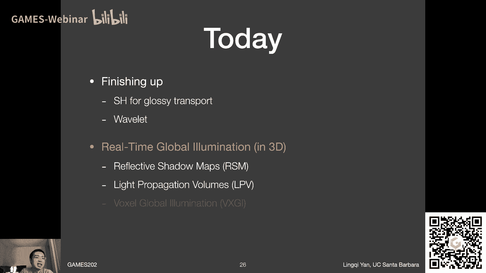

然后呃怎么样真增强真实感，大家可以看到这么一个呃图啊啊，这幅图当然渲染的结果了，然后呃这是一篇关于全局光照的一个survey paper啊，做的呃做的teaser image给大家补充点知识。

什么叫teaser image，就是指论文开头的一幅大图啊，这幅大图是用来炫耀自己做买的东西啊，这就叫ta啊，然后通常大家都会下大力气来好好做，然后大家可以看到这幅图里面呢。

很显然光照就来源于窗户那边对吗，然后就从窗户那边，当然有很多东西它不能直接照到，但是没有任何地方完全是黑的，然后也就是说光线是可以弹射很多次，然后才到人的眼睛的，所以说如果说只是用光栅画来做直接光照。

那这幅图大家可想而知，很多地方都是可以的对吧，那所以说全局光照是非常非常重要的一个环节，我们一定得想办法把它给弄出来，否则的话看看很多东西都会觉得不真实，那么有同学就会立刻联想到一件事情。

我们之前曾经做过一个hack，在games 101里面做过一个hack，然后打全局光照，这这这都不叫近似了哈，这是这完全是hack出来，就是这么一个意思啊，如果同学还记得的话。

这就是我们所说的不灵魂的光照模型，里面的对吧，然后这个模型里面呢假设了一个叫做呃环境，像ambient term对吧，还记得这回事，这个在假设说呃，这任何一个点接收来自四面八方的间接光照。

都是相同的对吧，然后呢，这个得到的最后shing的结果，和自己的normal还都没有关系对吧，做了很多这种这种假设，然后最后就认为哦，原来ambient的像就是往上面增加一个亮度对吧。

那从这幅图上大家来看，全局光照是不是都能这么high呢，不能完全不能对吗，因为大家可以看到很明显在这个书本的底下，它各个地方它的啊，它的亮度也都不一样的对吧，然后大家可以看到一些costics啊。

这些这些就是从这个金属球反射到桌面上对吧，这些东西都是完完全全不一样的，所以说简单的靠，把最后的结果往上提升一点亮度，这是绝对做不到全局光照，还有这么个意思，那呃它很复杂。

这就是我们要得到的一个结论对吗。

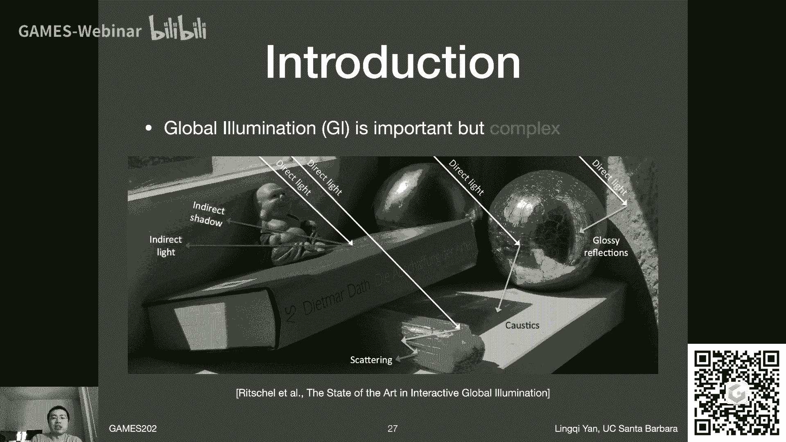

然后呢呃我们在实时渲染过程中，我们要解决什么全局光照，咱们把这个事给说清楚，因为咱们之前已经区分过概念了，全局光照其实指的就是直接光照加间接光照，没错吧，然后呢我们会认为直接光照都好做对吧。

直接光照我们完全可以做出来了，从之前所说的各种各样的方法对吧，然后呃split sama别的什么东西，比如之后也还会继续说，那么直接光照好做，那么剩下来的问题是什么呢，间接光照。

间接光照呢光线又可以在场景中弹射无数多次，那这个事情肯定是弹射越多次越不好解对吧，那怎么办呢，那就是在实时渲染中咱们说清楚，人们呃说要解决实时光照，实则就是想解决一次或者说多一次bounce的比。

比这个低比这个直接光照啊多一次，bce的间接光照，也就是大家数一数，基本上来说在这张图里面啊，光线弹射两次没问题吧，看到了吧，就是在红墙上一次在做那个呃这个小box，左边这个面上弹射一次。

然后被你看到对吧，然后这就是我们在实时渲染中要解决的呃，所谓全局光照啊，实则就是呃让比直接光照多一次的间接光照啊，然后人们当然希望两点，第一简单实践起来不麻烦，对吗，这是一个，然后另外一个呢是呃快速。

这是非常重要的事情对吧，因为全局光照非常难算，然后咱们待会儿探2s m，就知道它为什么难算了好吧，然后唉行吧，那就是说呃这就是我们要解决的问题啊，咱们说清楚一次的间接光照啊。

然后这里我们应当如何理解一次的间接光照呢，那如果有同学还记得game 101上，咱们之前说pass string的时候，哎这个时候曾经出现过这么一幅图对吧，然后然后我们说过这么一件事，如果在p点嗯。

就是就是说做tracing嘛，那肯定是从camera出发，对方打一条光线打到场景中的一个点p点，这个p点呢往各个不同的方向去发射光线，它有可能会达到一个呃光源打到光源的话呢。

那他不就是呃接收到直接光照了吗，但如果说打到的不是光源，它打的是另外一个点q点，那么它是怎么理解的对吧，他会认为从q点反射到p点的结果对吧，也就是说radiance那个就是来自于这么一个方向。

从q到p呃，它的这个radiance就是p两个，直接呃呃接收到的光照，也就是说在p点呢，他并不关心说，你接收到到底是从呃直接光照来的，从那个light来的这部分。

radiance还是反射来的radiance，这没关系的对吧，从q反射过来的readings一样在b点参与计算，那么呃从q反射到p的radiance又是什么呢，那就是在q点。

q点本身接收到的直接光照对吧，咱们之前说过这么一个事儿对吧，那么这里我们再多想一步，就可以得到一个非常不错的一个结论，什么呢，这个q点是不是就是被光线直接照射到的物体。

就是说接收到了直接光照的这么一些物体表面，这些物体表面是不是可以认为，他们在场景中会作为光源出现，并且用他们自己反射出的这些光照，然后再去照亮别人，没问题吧，所以说啊一切被直接光照照到的这些物体。

都会呢继续把自己作为光源，而且我们给它起个名字叫做次级光源，secondary light source，然后大家可以想象到，真正的光源就叫primary light source，对吧，呃这个没关系。

那那行，反正就是说呃这就这么个意思吧好吧，然后那那既然我们有这么一个理解了，那咱们现在看之前还是这么一幅图，但是呢这里我们做了一些标记什么呢，就是说啊这里就直接光照，直接光照在咱们说清楚。

直接光照可不代表说他就是要么黑，要么白的对吧，直接光照它，它如果是面光源，比如像这个场景，它这个天窗上面在相当于是巨大的面光源，所以它有的地方它肯定会有个渐变嘛，但没关系，就反正这就是直接光照对吧。

光线弹射一次能够得到的光照和阴影没关系啊，这是一个事儿，然后呃呃然后是呃什么呢，就是说后面的这个诶有同学问灯笼怎么哦，我懂了，就是啊，这这就先忽略吧，好像这暂时关系不大，ok行吧。

然后就是说整个这个场景上来看，基本上来说大家可以看到，比如说p点，p点由于它在柱子后面，直接光照，是无论如何不可能接收到任何的直接光照的，对吧，但是这个场景中间毕竟有很多地方，可以接受到直接光照。

咱们可以用一系列的这些啊，这些小太阳把它给标注标注出来对吧，是111些，当然标注的非常稀疏哈，其实任何一个表面只要被照亮，你比如说问这个nn底下这个地方，他是不是作为一个刺激光源出现了呢，是啊当然了。

任何一个被照亮的这个呃呃就是所谓surface patch吧，对吧，或者说刺激的这个光源都会用来被照亮别人，什么意思呢，也就是说p点它是怎么接收到光照的，唉他其实就是这些所有的次级光源。

然后我们用这些次级光源去照亮p，然后得到的一个结果是不是哈哈哈哈，然后所以说啊特别是考虑one bounce，这个indirect或者叫global illumination嘛对吧。

然后也就是说光线会多弹射一次，也就是说从这些次级光源，它再照亮这些物体，中间不再发生额外的弹射次数，再照亮某一个什么诶，这样的话我是不是就可以得到呃。

一次bounce的indirect illumination，加起来不就是global illumination了吗，所以就是这么一个意思哈，其实大家可以想到呃，呃这是呃。

我们对这么一个间接光照的一个理解哈，也就是说已经被直接光照照亮了的物体，或者说表面会自己作为别的呃，作为光源在照亮别人啊，这么个意思嗯，行ok嗯，那么我们要介绍的一个呃基本的一个概念哈，rs m对吧。

reflective啊，shadow mapping啊，这就是在用这么一个思路啊，来试图渲染出这种间接光照，那么他是怎么做的呢，诶他首先他会呃要解决这么一个问题对吧，什么问题呢。

就是说如果我想得到p点的这种间接光照的，shading的结果，刚才咱们看到的对吧，那个p点如果我想得到呃，就是用这些刺激光源照亮它，得到的确定结果是什么，这不是indirect nation吗。

我想得到他需要知道什么，这就是我们要问的一个呃问题，ok这是很有意思的一个事情对吧，我我为了计算这个点p，它最后的间接光照是多少，我需要知道什么，那很简单，我们需要知道两件事，第一哪些是我们的刺激光源。

换句话说，哪些这个物体表面的这些位置，会被直接光照照到，这个没问题吧对吧，然后我们问这个问题呢，呃这这肯定就会有同学就直接想到了，我们之前已经说了一种方法对吧，这种方法就完全就可以告诉你这个信息吗。

哪些哪些物体可以被这个光源照的，或者说照的有多么的亮对吧，然后从0~1对吧，然后然后就是说呃呃这块，那很显然有同学直接可以回答了，shadow mapping就是告诉我们这个信息的对吗。

假如说我们就只有一个点光源吧，还是认为简单一点好吧对吧，然后这个点光源我shadow map，就相当于从这点光源看向场景，我看到什么，那不就是这些能够照亮的吗。

哎那我就是说我可以通过shadow map来回答好，没问题，那么第二个问题是什么呢，第二个问题就是说我可以把嗯，这些所有的这些小的这些surface patch呃对吧，照直接被直接光照。

或者接收到直接光照的这些呃刺激光源的呃，把他们的贡献呃都给计算到这个点p去，就是说每一个这些刚才画的那些小太阳对吧，都有可能照亮点p吧对吧，这是没问题的，那么他们各自的贡献都是多少。

他们各自的贡献都是多少，我都求出来之后，然后我是不是就可以把它们加起来，然后这不就是我最后得到对这个p点的这个，间接光照的一个计算了吗，是不是这个意思对吧，然后呢，那我们现在这样想哈。

就是说我们刚才一直在说，每一个这个小的这些物体表面对吧，每一个小的物体表面，它既然是物体表面啊，它肯定会有一个诶，它往各个不同的方向反射，它肯定得有个radiance，这没问题。

然后他本身又有一个范围叫做area对吧，它本身有一定的这个大小，然后这个怎么算呃，一个这样的物体表面，它对点p的一个贡献，那其实就是要解一个什么呢。

是不是就要解一个呃rendering equation，并且是一个area light下面的一个render equation，那肯定有同学已经想到了。

我们之前在game 101算这个pass string的时候，我们不是说对于light有一个对对，对light进行采样一个公式吗，一个area light，然后对他采样。

然后让让他来用蒙特卡罗的方式来去做一个点，shading，也就是说我们之前曾经讲过很类似的东西对吧，所以肯定可以解决的，那么呃呃行，具体怎么解决呢，这就是咱们后面要说的这个这个事情好吧。

然后我们先high level说清楚第一步先找到哪些呃，呃物体表面处能够被直接照亮，第二步，然后我们来看这些被直接照亮的，这些小的这些块啊，然后如何贡献到这个点p去，就是他们如何在照亮点p啊。

这么个意思好嘞，那么第一个问题咱们刚才已经说了对吧，然后shadow map就可以完美的解决这么一个问题，然后呢如果说你有一个airlight。

你甚至可以用这些soft shadow mapping的方法，可以得到这么一个就是不同的点，它的入射光的强度对吧，这是没有问题的，然后嗯另外一点呢，对于shadow map。

咱们之前在说他的一些artifact的时候，我们说对于shadow map应该怎么理解呢，我们可以理解成一个shadow map上的任何一个像素，其实都对应了一个小片，是不是这意思，这没问题吧。

然后就是说呃这些小片，然后然后是场景中间的一些一些，实际上的一些小票，他们可能有场景中间自己的脑某对吧，这也没问题，然后但是嗯但是这么一种描述方法，就是对于任何呃对shadow map上的任何一个。

像素或者文素txt啊，然后呃他表述表述的这么一个场景中的一小块，刺激光源的一个一个微小的单元啊，这个没问题，或者换句话说这个意思啊，给你张shadow map呃，你从light看向场景，你你这个分辨率。

比如说512x512，那么你自然而然是不是就有了，512x512个呃这种哈嗯刺激光源的对吧，因为你每一个像素内部，你就认为是一个小图片呗对吧，这没问题啊，然后所以说你要做的事情。

其实就是说用那么多个刺激光源去照亮点，p得到的结果是什么，有同学已经想到问题了对吧，这个计算量是不是非常夸张的一件事情，但是可想而知他该是这样夸张的事情，没错吧，因为你要算呃。

就是说总共弹射两次或者一次的呃，indirect illumination，本来就是个n平方的问题嘛对吧，所有的patch都可以贡献的，所有其他的patch对吧，就是这个意思，那所以说他本来就该是这样。

那咱们怎么样把它给做快，这个没关系，但是首先咱们先想清楚，就是说shadow map给了我们一个场景的一种，离散的一种表述，每一个像素，它可以认为这就是我的一个次级光源，好，这是没问题的对吧。

理论上好嗯，然后呢对于任何一个呃这种刺激光源，然后呃我如果说我固定一个观察的方向，我肯定可以算出来它的shading的结果对吧，因为我shadow map这边生成，我就已经知道它的光照的方向了对吧。

任何一个像素嘛呃光照方向知道了，然后呢我如果观察方向知道了，我就可以算它是ding唉，但是观察方向呃这里呃有点不一样，什么呢，就是说如果你要你要呃，最后去渲染这么一个场景。

然后你要看它渲染出来的结果的话，呃然后这个时候他的观察方向就是你的camera方向，呃，可是呢我们如果是需要算一个呃，算个什么呢，就是要算嗯，诶稍等一下哈，是不是有同学反应断了，ok好像没关系吧。

好像回来了啊，我这边好像是ok的，ok行吧，那我就先先这样说，如果有问题的话，我估计到时候录播的时候应该是没问题啊，呃行好，那那是这样哈，就是说呃我刚才说哪儿来着啊，对我刚才说的是这个意思。

就是说你不是要用各个次级光源，也就是每一个像素你是要照亮点p嘛对吧，这这那也就是说你的观察方向其实是什么呀，其实相当于从点p去观察这些这些次级的，呃光源对吧，你不是从你的camera去观察他对吧。

也就是说你的出射方向你不知道，对于不同的点p来说，然后然后你出射方向是不知道的，妈咪怎么算，它是谁定的，这肯定是不能算的嘛对吧，那这个时候怎么办呢，有什么办法，才能让我们不依赖于说观察的方向呢。

那这里面自然而然就产生了一个，经典的一个假设，什么假设呢，我认为所有的反射物咱们说清楚，reflector啊，所有的反射物都是diffused对对，只要它反射物是divs。

我们知道他我不管从哪个方向看过去，我从p点上看过去，我从camera看过去，没关系，反正我看的都是一样的东西对吧，那我认为所有的反射物都是diffuse的，那就可以了行吧，那这里呢我着重强调反射物。

意思就是为了区分，我不需要假设接收物也是diffused，ok我们所说的是次级光源，我们假设它都是也就是接收到直接光照的，这么些东西，在物体表面，他们认为是diffused。

我不要求点p是diffused，ok这里说清楚，ok所以说这不是一个非常大胆的假设，这算是正常吧，我觉得问题不是特别大，正常人们去如果还把这个reflector，还认为说可以是glossy。

好像就太难了哈，这个意思啊，我觉得没问题啊，这里好，那那么这样一来的话，唉我就不用管，这是从各个不同方向上去看会是什么呢，对吧，那没问题，那么问题一算是这么解决了呗，对吧，然后我知道我看到的场景中间。

哪些是次级的光源，并且这个光源它反射出去多少能量，这我也知道了对吧，那问题二是什么呢。

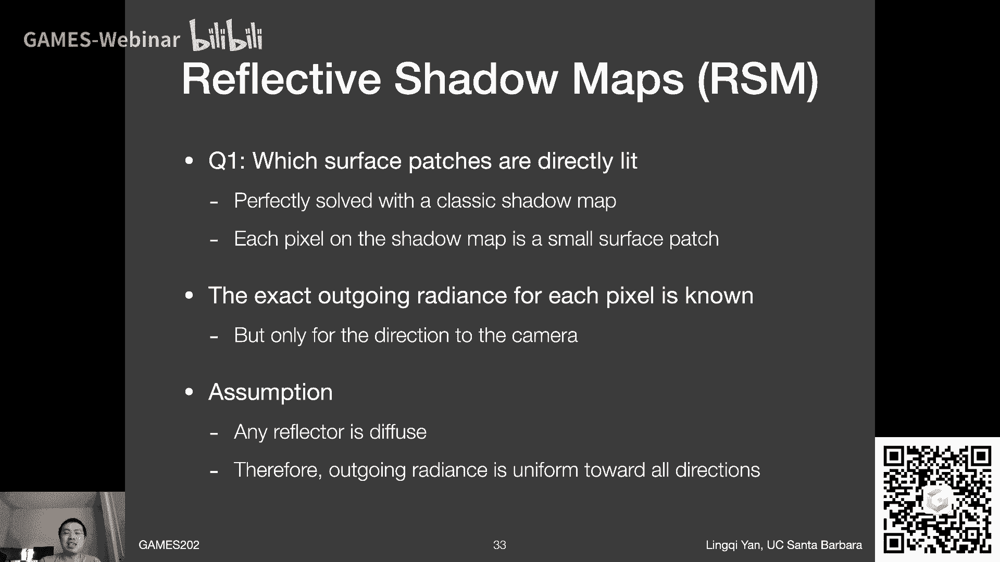

怎么用这些刺激光源去照亮这么一个shading，point p，对吧好，那么为了回答这个问题，咱们先回顾一下之前呃，电子101里面说的一些关于哈哈哈，关于这个叫什么来radiosity。

我又忘了嗯这个词他们的概念啊，就是说衡量或者准确的描述呃，嗯光照的一些属性的一些一些概念啊，什么呢，首先是嗯一个在这这这个图之外的一个概念哈，叫做flux或者叫power，大家还记得吗，哦辐射度量学。

感谢同学们，对没错，flex或者power这是一回事，这基本上来说就是表示整个的就是能量是多少，对吧，然后呢如果我们想描述一个呃，一个单位立体角上对应的能量是多少。

那么我们引入了这个概念叫做intensity对吧，其实叫做radiant intensity，这是全名，然后如果我们想想表述在一个单位的面积下，它对应的能量呃，它这这就是这就是什么呢。

这就叫irradiance对吧，那如果单位立体角又单位单位面积，然后它上面能量是多少，那这个就叫做radiance行吧，总之就是说这块不管什么时候听都是停绕的，这是嗯，但是我觉得吧待会推导这个式子的话。

还是算相对简单啊。

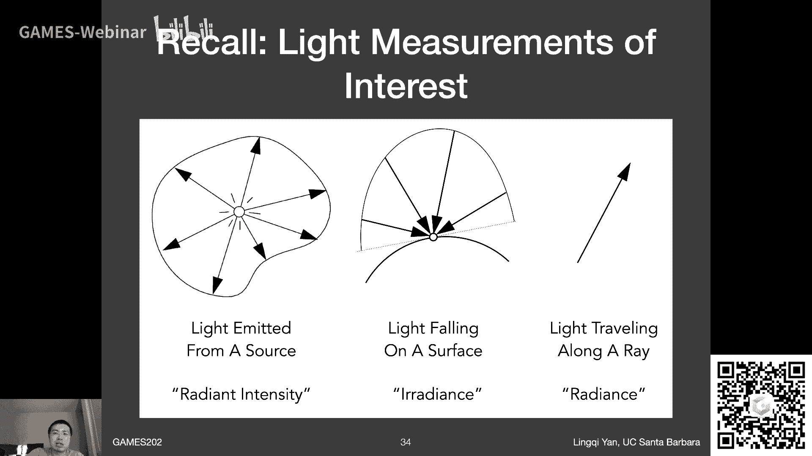

这个意思，那我现在就试图回答一下这个事吧好吧，那么现在是这样的，我们之前就说了，那所有不同的这些呃，小的这些patch是不是都有可能贡献到这个dp，那没关系，我就先考虑其中一个对吧。

我把所有的这每一个都算出来之后，我把它给算出这个加起来就可以了对吧，那我就考虑一个小的patch，然后说小啊，它是真的小对吧，它是一个像素对应的一个patch啊对吧，那这个ph是非常小的。

然后就是说这里对应到什么呢，这这个touch，基本上来说就是呃我们的rsm上面的一个呃，一个text对应的实际的一个patch啊，这么大，然后呢用它来照亮点p，然后得到的结果是什么。

那呃大家应该还记得这事儿对吧，咱们之前gg 101说，这种情况下我们原本再点p，我要算就是就是说这个light他的贡献，我原本要对整个立体角去做采样，我说这样做不好。

然后我们说呃不是浪费了很多sample嘛对吧，然后我何必不在light上面做做采样，然后直接去对p进行shading对吧，然后这样的话呢呃如果大家还记得的话，之前我们把立体角给描述成呃。

用另外一种变量替换的方式，我们描述成这个对这个呃，不是对立体角的积分了，而是对于这个area的一个积分，就是对这个light的一个积分，没问题哈，这个意思，然后也就是说上面就这个公式来说。

没有任何特殊的地方啊，这就是之前所说的内容呃，101的内容，那么这里呢呃大家可以看到，我们想要的是什么呢，我们为了算嗯，最后我看到的一个出色的一个结果，那看到的自然就是这个呃，就这这p点这l o嘛对吧。

没问题，然后呢呃我我不知道的是什么呢，我不知道的是说呃这个patch呃，他在被直接光照照亮之后往这个方向，然后它会反射出多少的radiance，确切说咱们刚才已经简单说了，其实是可以知道的对吧。

然后呃那这块就是从q点到p点，它的这个radiance是多少，然后呢，然后这个patch自然还有一个它的大小，那么咱们现在思考一下啊，如果这个patch比较小的情况下，如果比较小的情况下。

我这个积分甚至都不用积分对吧，我我直接把这个da给写成他的真正的面积，dela a把所有东西乘上，是不是就ok了对吧，这个是没有问题的，咱们想一想，黎曼积分把一个呃区间划分的足够小了之后。

那这个区间内的积分结果怎么样近似呢，这这我就取这个积分中间的某一个位置，比如说我说这个q点，就是这个patch中心的这么一个点，反正整个patch都比较小嘛对吧，然后呢那我自然而然就知道呃。

我呃呃这项是多少，咱们假设待会可以算啊，然后visibility是多少，其他东西b2 d f啊，这些项这些都没问题，最后乘以delta，那就是呃这个呃patch的area大小，那没问题。

也就是说这块是可以算了的，已经可以算了的对吧，然后那我们我我我们想一想这个事情啊，现在剩下来的就是说，怎么样准确的把这个从q点到p点反射出来的，这么一个radiance给解出来，那怎么把它解出来呢。

那首先我们说对于reflector，reflector也就是p点在的那么一个patch啊，他如果是diffuse的话，那我们就可以认为他的b2 df是呃，某个呃这个常数对吧，比如lb 6除以派嘛。

咱们之前推导过，然后这里区分一下，这里的b2 d f，指的不是这个公式里的b2 d f，这个公式的p r b2 d f是p点的b2 d f，它可以是个loy啊，然后呃这个指的就是嗯呃之前在q点处。

他的b2 d f k我应该写清楚了啊，不过还行吧，没问题啊，然后这个patch呢，我又知道他他的这个li从q点到p点，其实就是他的出色的这个radiance对吧。

我想要的就是这就是他的出色的radiance，同学们想一下这个事情啊，呃出色的radiance呃，然后怎么样和b r d f联系起来来着对吧，那就说明什么呢，说明b r d f就是我们要从什么地方入手。

b r d f定义bdf怎么定义来着，出色的radiance除以呃，呃这个叫什么来着，呃入社的irradiance没错，也就是说出色的radiance，li。

其实就应该等于b r d f乘以入射的irradiance，这里入射指的是q点的入射，也就是说直接光照的那个入射哦，ok哈哈哈，然后erence是什么，radiance就等于flux或者是哈哈行吧。

越说越麻烦了对吧，就等于是flux去除以它的这个这块的面积好吧，ok然后为什么我们要这么做啊，这么做的一个好处是，当你把这个东西描述成这个式子之后，然后你把它给带到这个li的时候。

你会发现一个更好的性质什么呢，因为这个area都已经被消掉了，看见没有，这边最后有一个delta对吧，然后这边本来也就有一个delta是吗，然后你如果说啊，对于呃呃你你想知道任何一个reflector。

它这个l是什么，你就直接用f r乘以它对应的incident，the flex就行了，incident flux是由光源决定的，他这个是没问题的，ok所以说呃对于嗯reflector。

他的b r d f是常数，然后呢他他的入射的呃呃呃这个flex指导，然后我们可以把呃呃这个five和呃这个f2 ，就这两块给成在一块，这就是人们平常所说的reflected flux啊。

这这不是一个多么标准的定义，但没关系，就是说也就是说对于radiance呃，不对于reflective shadow map，对于它上面的任何一个像素，我其实要的是什么。

为了得到他的这个反射出来的li是什么哈，我其实就要一个这个东西，这个phi乘以它的b2 d f，也就是它的reflected flux就ok了，然后这样一来的话有个好处。

我甚至都不需要知道这个patch，它对应的这块大小是多少，就是说这因为什么呢，因为这da和da消了，你会发现存flux的好处，就是我要么原本我就存它的这个叫什么呢。

就是他的incident radiance和他的area大小，都说我存两个数，现在呢我都不用存两个数，我就存一个数多好呢对吧，那所以说这这其实就是一个简化的一个，一个方案啊，就是说如果你真的就去存呃。

对于任何一个a text，你去存他的入射的incident radiance，这肯定可以吧，你从light知道了吧，你知道它的da是多少，你这个之前，因为你因为你完全可以知道这整个场景。

怎么投影到你的shadow map上的，所以你da也知道你存两个数也能解决问题，没问题啊，这就是说对于这个paper它的一个小优化，这个意思就通过这种方式，它就只用存呃，呃就是说呃还是我刚才说的啊。

incident flux乘以b2 d f，也就是reflected flux这么一个概念啊，这个意思嗯，然后呢嗯最后得到一个结果什么呢，大家会看到如果你存这个东西，这里发1p。

其实这里就是它的这个b r d f乘以，就是reflected flux啊，这两项f2 乘以y，然后那就把这一项给换掉了对吧，然后da消掉了，da消掉了，然后呃中间呃这块。

最后最后你就可以用这块的入射的呃，irradiance也就是他的这个e p啊，然后和这块的b2 d f结合在一块，积分出来的结果啊，就这么多少，ok也就是说这里并不要求说你的呃，对于点p。

他的b2 d f一定得是这个diffuse或者gloy，glassy是可以做的啊，咱们说清楚，这就是这个意思，然后呢大家会注意到两个上哪两个上，哪一个v v是什么，咱们之前在上一幅图里面。

就就这这里说的清楚对吧，就是p点到q点到底能不能看见，那反映在我们的这个呃呃呃实际的这个应用中，就是我的任何一个所谓reflector呃，或者说surface patch。

或者说呃刺激光源能不能看到我的这个点p，那那这个问题就很难了，哎为什么这个问题很难了呢，因为你这个时候就不能不再能用嗯shadow map来做，为什么你总不能允许说。

你对任何一个shading point。p你都生成一个shadow map，你去看向之前所有的那些刺激光源吧对吧，然后然后就是说就是说你要所有的四级光源。

你都要判定他们对所有可能的shading point，他们的贡献是多少，这是又是一个n平方的问题，你是不可能直接通过一张嗯no嗯，一张shadow map来得到这个visibility。

于是这个visibility不好算不好算，怎么算呢啊那就不算了，就是这么个意思，就是人们在这个呃reflective shadow maps里面，他们就不去算次级光源和。

我实际的就是第二个pass的情况下，这个可见性就是它它中间这块呃，这个确实是没法算啊，这这块嗯，因为确实它本身就是个n平方的问题啊，这个意思这是问题一啊，问题二是什么呢。

问题二是这里啊大家可以看到这个公式里面哈，就是这个公式是从呃这篇paper，这篇paper名字就叫reflected shadow maps，大家可以看看一看，找一找相关细节哈。

然后就是说呃就是说就是说这个公式里面，大家可以看到它下面有一个，这两个距离的四次方，看到这种东西了对吧，然后呢，大家可以看到说我这边推导，推导出来是什么东西呢，我推导出来是平方对吧。

然后然后这个平方很好解释，它就是就是相当于是我把立体角给换成area，measure，它必然要产生的一个，也就是说从p点到q点的一个for all of，哎就是就是这么个意思，这这没问题。

然后他这里四次方我百思不得其解，然后我觉得是这个意思啊，就是说呃我呃这样哈，我慎重的考虑了一下这个事情，然后我得出结论是他写错了啊，他真的写错了，因为工业界的话，而而且错的原因我可以猜到啊。

我可以猜到什么呢，就是说呃应该是他无脑的假设了，在工业界的一个基本假设，就是认为radiance在传播的过程中，就是这个li就是这个这个radiance，在从p到q到p的传播过程中，会有一个平方衰减。

工业界常常做这个假设，ok如果他做了这个假设之后，那这个l你算出来从q发出到达到p的时候，然后他又有一个平方衰减，这个假设是非常不对的一个假设，之所以之前人们假设，就是因为为了适应这个呃这个平方向。

也就是说他其实double count了一下这个事情啊，这是我得出来的一个结论，然后然后我我就直接下结论，他说错了啊，这真的是错了，然后就是说如果同学们有兴趣的话，自己推导一下。

如果觉得我推的不对的话啊，这么个意思，然后就是说它它绝对应该是平方，ok然后如果是四次方的话，同学们我直播吃键盘怎么样啊，这样安排哎呀行，那这就是就是说呃这个意思啊，哦另外paper里面p和q是反的哈。

然后这个嗯就是说他们会认为是是p点，照亮q点啊，这没关系啊，这个意思啊，我立flag啊，就是这么回事，ok好那这一步就解决了是吗对吧，我就知道任何一个patch呃，或者四级光源怎么样啊，照亮一个呃。

任何一个shading point对吧，还是这个意思好，那么嗯有了这个事情之后，基本这个问题就解决了，那么还剩下一些小问题，那咱们把小问题说清楚什么呢，呃第一个是这样的，就是说在r s m里面。

大家可以看到这不是光源吗对吧，光源照亮整个场景，然后这个这个那啊这上面这个p点，这就是它的这个paper里面标的就是每一个text对吧，它其实对应到你这呃实际物体上，它有一个某种patch是吧。

大小没有画出来，然后呃呃每一个这样的patch，比如说这x1 x2 ，然后左边的x-1 x2 ，他似乎应该都是对x能够有贡献的，按刚才这么一个计算方式啊，呃这个呃这个意思嗯。

然后呢嗯有时候他这些东西是根本不需要算的，就是你知道他百分之百不会有东西啊，什么时候呢，就是说呃当你出现了一些呃，呃首先当然是visibility的问题了对吧，咱们刚才已经说了。

他们会忽略一切的任何一个这种这种刺激光源，和shading point之间的一个呃可见性哈，这不考虑不考虑的问题好像也没有特别的大，因为反正是间接光照嘛，就已经不像直接光照那么的高频了对吧，这是一个。

然后另外一个方向上，从方向上其实就已经可以看出来这东西，为什么呢，因为你看啊，比如说咱们以x-1为例，x-1是哎这个shadow map记录，他应该记录的是这个桌子吧，桌子这么一个表面在这。

然后这个它的法线在哪儿呢，他法线是向上的对吧，然后这种情况你又知道桌子和这个这个，shading point的连线是往这个方向上去，所以他是根本不可能哦，哦就是说就是说这呃呃这里记录了这个patch。

而是根本不可能照亮x的啊，这是没问题的，就是说他有很多这些这些判断啊，然后就是说呃，我们当然通过这render equation本身就可以解它，只不过这里给大家一个形象的一个呃，这个这个说法。

然后嗯比如说吧这个距离肯定也是吧，咱们咱们可以认为说哦如果距离离得非常远，就咱们刚才说的那个平方对吧，呃然后如果距离离得非常远的话，然后嗯是会有这么一个呃事情呢，就是就是说他的贡献。

他本来经过了一个距离平方，他贡献就已经非常少了对吧，那所以说呢你基本上来说，给你任何一个shading point，你只用找离它距离比较足够近的这些刺激光源，是不是就ok了对吧。

这其实是一个不错的一个观察，那么这个观察就会造成一个不叫造成什么，就会引出一个很不错的一个技巧，什么呢，就是说这篇paper做了一个极大的一个假设，你怎么知道对吧。

我问给你一个shading point，你怎么知道离他比较近的，比如说某个区域里面，他们刺激光源呃，都都都是什么对吧，都都都在哪，都在shadomap的哪对吧，那么这个时候啊。

这边微博做了一个非常大胆的假设，什么呢，就是说哦我想找的是在世界坐标下，它们两个点比较接近，那么我就我这个不好找，那我就把shading point啊，p点投影到shadow map上去。

我在shadow map的周围一圈范围内，我去找，我认为shadow map上他离得比较近，或者说比如说深度会离得比较近，或者shadow map上离得比较近是吧，这么个意思，然后呢。

那我就认为它在世界坐标内离得比较近啊，通常情况下这种情况也不算不合理对吧，但是就是说这是一个比较大的一个假设吧，这是肯定的对吧，然后呢同学们肯定想到为什么要这么做呢，咱们之前说了对吧。

给你任何一个shading point的p，这个贡献都要算一遍，所有text对这个点批了这么一个贡献，那每一个shading point，你要算512平方次计算这个还得了啊，对不对。

那所以说你肯定不能这么假设，你怎么怎么办呢，就尽可能减少你要算的这些数量，那么刚才说的是一个思路啊，就是说在shadow map周围的一个范围内去查，然后即便如此，你也可能会面临着比较呃。

嗯大的一个范围之差嘛，那怎么办呢，那就是说呃呃这种情况下嗯，他就可以做一些啊比较聪明的一些采样方法吧，就是说咱们之前说pcs s也是这么一个道理，对吧，给你一个范围。

你要做blocker search对吧，你要做filtering，你不希望把这些所有的这些范围呃，那个那个text都给走一遍，你就随机的采样一些，可以没问题的，所以这个时候呢一个道理。

在shadow map的周围某个范围内，你去采样一下，然后就可以了，那至于说这个paper，提出了什么样一种采样的方案啊，比如说比如说哪些地方我多采一点，哪些地方少踩一点，但是权重会多一点对吧。

是这个意思，那你可以大胆想象啊，离你那个shading point呃，那个对应的shadow map的位置周围，那应该踩的稍微密一点，如果离得远一点，踩了输一点，但踩的疏一点，就意味着。

你其实相当于你把很多像素的贡献，当成一个了呗，那这很多像素占据的面积肯定要增大呀，它它对应的贡献他的权肯定要大一些啊，就这么一个思路，就是说这些就是很非常heuristic的一些，一些做法。

工业界的一些trick了啊，这我就不再多说了，但是不管怎么样，通过这种方式，他们把它减少到了，如果我没记错，几百个啊，400个吧，比如说对于任何一个shading point，我去取呃。

iosm上面的400个呃这种呃，这就是txt，然后来把他们当作刺激光源，然后来照亮这么一个神灵幻影皮，那那就好了，然后得到一个结果，ok那没问题，然后所以所以说这样的话就能承受了吗。

那至少400比512平方的好太多了，哈哈这个意思行吧。

那呃咱们总结一下，shadow map上多存了点东西，那shadow map本来要存depth，他还要存对吧，然后这里多存了一些世界坐标，用来判断实际上两个点的距离嘛。

咱们要钻shading的时候要用对吧，然后又要存，肯定要存这些反射物，他们的法线对吧，这肯定要知道的，然后用来算了cos一项，然后这里又要存它的flux flux，咱们说这是跟光源相关的一个属性。

它和这些不同的表面的法线都没关系，所以大家看上去就像是一个平的算数，light shading的一个感觉哈，这么个意思，然后嗯所以说基本上就是就是存这么写对吧。

为什么存这么写，咱们之前的公式就已经都已经讲清楚了，那它的效果如何呢，效果是非常好的，然后呃这里说一下啊，效果非常好，其实是怎么说呢，就是说对于某些现象非常好，特别对于什么来说，对于呃手电筒啊。

几乎这些游戏里面，现在一旦涉及到手电筒，都非常愿意去用这个啊，rs m，我猜的原因是因为手电筒啊，覆盖一个范围相对较小吧对吧，你不需要一个非常大的rs m，然后就意味着说嗯这个分辨率就会比较低对吧。

那分辨率低就意味着快对吧，那所以说适合用手电筒，那么嗯它效果的话大家从上一行和下一行啊，这这里大家可以看到这是the last of us，呃然后他下一行是开启了这个rs m的，上一行是没有的。

那大家可以看到下一行要比上一行要亮对吧，那有同学反应它好像就亮那么一点点，这有什么实际作用吗，有啊，大家看这个天花板上是不是绿一块，是那个藤蔓反射出来一个结果对吧，就是说很多这些这些啊是啊叫什么呢。

间接光照啊，他肯定要比直接光照要暗很多嘛，但是就是说就是因为这么一点点这些细节，就会让你会觉得说看起来结果就会好的特别多，这是真的啊，这么个意思，尤其是你来回切这两张图就可以看得出来。

这样看着呢不是特别明显吧，ok然后大家看到不止是the last of us啊，很多游戏都在用战争机器四，然后还有这是什么神秘海域四对吧，都在用这个呃呃呃这些呃叫什么呢，就是说用2s m来做手电筒啊。

然后大家大家当然这也就看到问题了对吧，那如果说你你要是有呃啊。

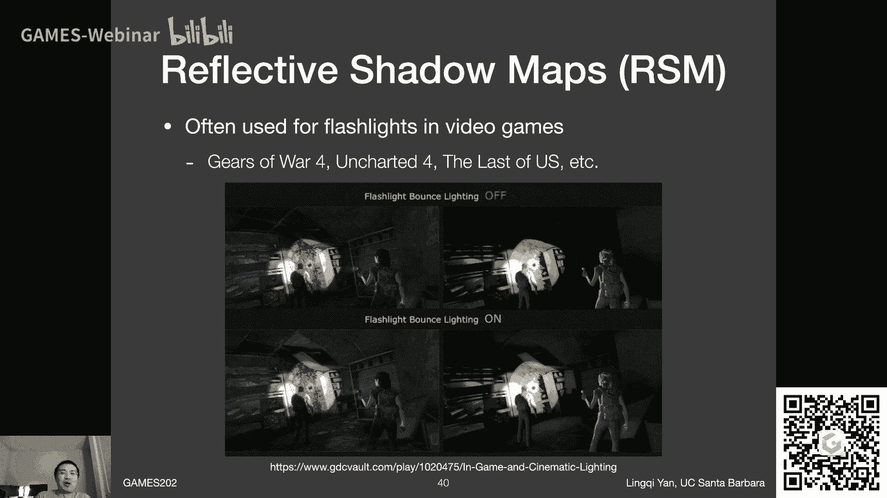

这样咱们反正之后要总结的嘛对吧，然后2s m有什么好处对吧，因为它其实就是shadow map的流程嘛对吧，他就是shadow map的流程，你第一个pass生成一个rs m。

第二个pass呢你就只管从眼睛开始看上场景，你不是每一个像素都要做shading吗，那你就那每个像素就是那个shading point p了，然后你要算所有的这些呃，他的贡献是多少，ok好吧。

那这好算对吧，然后容易实现，那么它问题问题是非常多的，一个问题是唉大家知道这是shadow map，shadow map肯定有shadow map自己的问题，不管他是什么2s m对吧。

他肯定会共享shadow map肯定会有的问题，那就是你有一个直接光源，咱们说清楚这里的light的数量啊，指的是直接光源，或者说呃primary light source的呃呃个数啊。

呃直接光源它的个数，那他有多少个直接光源，你就得做多少个shadow map，那当然就得做多少个reflective shadow map了，这就不好对吗，那就会越来越慢啊，这是一个。

然后呢啊我们刚才说在这个计算过程中，他们不去算反射物到这个shading point，之间的可见性，那自然而然会造成很多呃不真实的情况，就是人们人眼啊是非常厉害的，人们看到一些一些场景呃。

一些图片自然而然立刻就可以分辨出来，这些结果看起来不怎么自然，不怎么真实啊，或者说不是人也是人脑，还是我们平常训练的这个大脑对吧，然后呢一眼就可以看到不真实，很多情况下也是因为这个原因哈。

没有做这块儿呃，反射物到shing point的visibility啊，当然也做不了，真做不了，就是大家想一想，之前环境光到一个shading point怎么样去做呃，阴影对吧，这不完全一个问题吗。

环境光来自四面八方的圆的，都这不同方向都是不一样的，嗯然后照亮不同的shading point，他也是个n平方的，或者n乘m的这么一个级别的问题嘛，那所以说嗯大家可以看到在实时渲染中。

现在的这种n乘m的或者n平方的问题，仍然不是好不是很好解决对吧好啊，这里呃不多说，然后呢呃呃他当然做了很多不同的假设对吧，咱们咱们之前已经已经说了，对于呃假设这个反射物它得是diffuse。

然后呢嗯对于这些呃距离什么东西呢，它会认为说在shadow map上的这个这个距离，或者什么的，就是就就一定程度上能够反映说呃，实际的这个距离对吧，咱们刚才也说了，在采样的过程中对吧。

然后这些呢都有可能会对质量进行一个啊，造成一个不好的影响，这是真的，然后最后呢当然就是说你既然考虑到sample，sample的话，咱们同学们开始对pcs s，应该是已经截止了对吧。

然后所以说大家写pcs s意识到了，对不对，但现在当然是用多的sample效果就会好，用少的就会不好，但用少的就会快对吧，所以说他永远有一个这么这么一种诶，trade off在里面好吧。

那么呃在这之后呢，我再说两个呃啊我想到了两个点啊，什么呢，一个是呃2s m现在用了这么一个概念，它不是相当于把shadow map上，任何一个这个小的像素啊。

它都当成一个surface patch来看对吧，这其实和离线渲染中间的一个重要的概念，叫做virtual point light或者叫vpl方法是非常非常接近的，或者更广义一点来说啊。

这些呃vpl方法在这个实在离线渲染中，曾经在反正20年之前好像还一直有人研究呃，呃然后它属于一个更广义的呃，方法叫做instant radiosity，叫及时辐射度。

或者叫i2 instant radiosity，然后这块来说就不是基于光线追踪的啊，最早不是基于光线追踪的radiosity，然后后来及时辐射度呃，算是引入这个v p l方法。

然后它可以和关键追踪结合的非常好啊，这么个思路呃，所以说之后如果说有各种各样的文献说，提到说这些什么东西是vpl，就是virtual point light，可以理解成。

就是这种小的surface patch或者是点光源啊，都没问题，然后呃ok这是一个事情，然后另外一个事情了，大家注意到这个事情了对吧，我们平常说shadow map是呃图像空间的一个做法对吧。

因为他们在第一个pass的时候，就已经把一个场景给变成一张图了，之后我再渲染什么东西，其实就从这个图里面去寻找信息，这里是一样的。

我们其实reflective shadow maps经过一次shadow map生成，我们就已经可以得到所有的这种呃，他需要的所有信息了，我就可以得到这个信息了，然后我之后就只用第二个bounce。

我正常去从camera渲染每一个点，我就可以得到结果，所以呢其实呃，他应该算是一个图像空间的一个方法，但为什么我这里要把它给当成，3d的一个空间呢，是因为我其实希望这么来归类。

就是说这种方法他不会受到呃，最后你这个所谓camera pass是否可见呃，造成了一个信息影响，或者这样说它不存在呃，就是一开始就记录不到，就是他从从理论上来说就记录不到，就会丢失信息这么一种情况。

而这种情况是图像空间呈现的一些问题，因为你图像只能记录一个图像，而这里面呢基本上来说你就真正的记录到了，所有需要的信息了，所以我把它理解成是3d空间啊，另外一点呢，为什么是3d空间呢。

因为呃之后要提的方法也就是lpv方法，然后他会建立在rs m基础上，不过今天没时间讲了，咱们就先到这好吧，先到这哦，还是一样哈，就是说呃之前咱们不是说了吗，呃把两节课并成一节课。

咱们正常情况下时间就按照嗯差不多，这呃国内两个45分钟的课时来安排啊，然后差不多吧，我觉得这是之后就就就就这么来，然后再看之后我想一想嗯，下节课我们来讲，lpv和v x g r应该会讲的非常快。

应该会讲的非常快，就不至于说嗯，这着重来说一下这个呃具体方法怎么做好吧，嗯然后我们再讲图像空间，ok啊行吧，来看看有什么问题吗，嗯好行，如果没有的话，那咱们嗯到这吧啊作业二咱们开始说了吗。

就是呃顺利的话，这周末发布好吧啊ok啊，下节课咱们把这个3d的内容说完，然后呃看看这个图像空间的这种算法，还有好多呢，s s s就是指指屏幕空间，看大家看到好多，然后到时候我们在2月说吧啊ok行。

那今天就讲到这儿啊，行一周一节，这已经算是很多奖了，是对这算正常多讲之前是唉不好意思，哎行吧，这真真的按克容量来说足够了真的足够了，我觉得同学们平常大家想一想，正常情况下要真是按照这个时间来算。

只有像什么数学分析那种超级大课，才会出现这样的时长对吧，ok哈哈哈哈哎呀行，也不见得真的短学期变长学期啊，是是就是说呃如果过了sirrah asia之后，我要是真的有点时间，也就是在5月底之后。

如果我心情好的话，到时候再把它给变回一周两节也没问题啊。

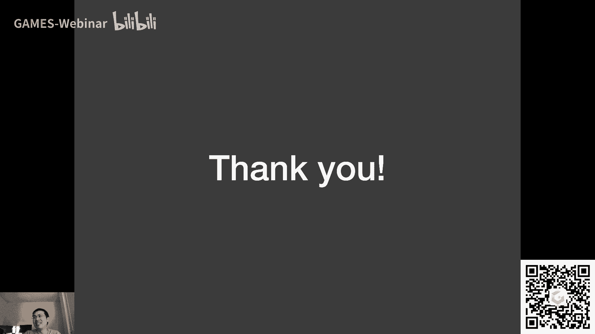

就是说到时候都好安排啊，都好安排行啊行，总之就是今天咱们就先到这儿好，不然后行吧，然后呃我看同学没什么其他问题了，先这样啊，先这样，然后还是一样，下节课啊，那就是下周国内周六对吧，然后到时候再看。

ok好，那就先这样，感谢同学们，下周咱们再见啊。