# GAMES202-高质量实时渲染 - P8：Lecture8 Real-time GLobal Illumination (screen space) - GAMES-Webinar - BV1YK4y1T7yY

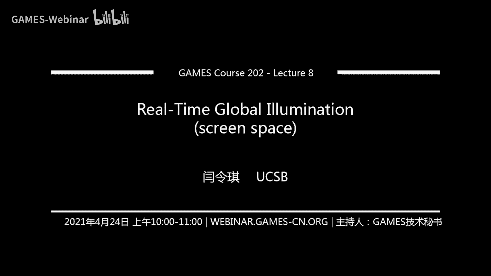

亲爱的各位同学们，大家好，欢迎来到我们的games 202的第八讲啊，今天我们会讲呃，实时的录实时的全局光照那的另外一部分，然后我们着重将讨论一下嗯，在屏幕空间的一些方法啊。

然后在今天的课程之前还是一样，我们呃说几个事儿，第一呢作业号现在已经发布了，同学们应该已经可以看到了，对不对，然后z2 呢不容易关于p2 t的，然后由于它本身就涉及到两部分，分别要编程嘛对吧。

预计算和实际渲染，然后两块都应该怎么算，然后这块反正大家这个上课呃，按照之前我们说的这些内容，然后好好理一下思路，差不多吧好吧，然后作业三呢呃有同学会关心关于什么呢，是关于屏幕空间的反射。

里面的那个洞穴的全局光照啊，这么个意思就是说呃大家可以看到一个光呃，只从这个洞穴的顶端，那照到洞穴中的某一个位置，但为什么其他地方都是亮的呢对吧，这就是因为全局光照嘛。

而且还是呃diffuse物体的全局光照，然后这一块呢我们希望用一个简单办法，就是下节课我们要安排的内容呃，screen space reflection，简称s s r屏幕空间的反射或者光线追踪吧。

一回事，然后呃我们用这个方法来把全局光照给做出来，差不多，这就是作业三的内容，然后呃有一个广告要做，就是我们的games 101，目前来说还急需要更多的grader，然后这里非常希望大家能够踊跃报名。

好吧，嗯然后呃这里稍微降低一些要求吧，就是之前我要求说大家一定之前要上过gg 01，但事实上大家想一想，之前gap 101在开课的时候，所以说不应该有这个要求，所以咱们现在把这要求给去了啊。

所以只要你会感兴趣，希望能够帮助到大家，然后都可以欢迎报名，然后呃成为grader啊，好吧，那这就是我要说的一个事情，那么上一节课呢，我们嗯主要提及的事情是这样的，就是我们把p r t部分给说完了对吧。

我们从呃glossy的部分开始，我们把p r t怎么解决glossy问题，以及他的一些代价，我们把它给说了，然后我们又说了一些呃一个吧，一个对这个之前最早的p r t的一个延伸。

那就是用wait这种奇函数，来来代替之前的s h，那么它的好处坏处对吧，然后上节课着重我们要说的是一个在3d空间，或者世界空间中的一种全局光照的方法，那就是用这所谓2s m啊。

reflective shadow maps，然后他的基本思想呢自然和shadow maps是差不多的，就是利用了这么一个思路，就是说shadow map所看到的东西，那自然就是你这个场景中。

直接会被照亮的东西对吧，而直接照亮的东西呢就可以当做刺激的光源，并且在间接光照中当做光源去照亮别人对吧，然后我们思想就是这样做的，那么呃整个的全局光照，差不多都是这么一种思路来解决的哈。

然后今天我们大家可以看到之前的两个呃，在3d空间中的方法，我们还没来得及说l pv和v x g i，然后这里呢我们都说一下好吧，然后今天我们呃在说完这块儿之后，我们就开始说呃屏幕空间的一些方法呃。

然后今天按照时间来说，我大概这么安排，咱们能够顺利把s s a o和ssd o，这两个方法给说完，嗯s2 的话呢留到下一节课去啊，大概这么安排，希望咱们今天能够时间上一切顺利好吧。

呃那咱们就从第一个要说的事情开始对吧，我们先说玩3d的这个呃一些呃，剩下来的两个方法，先说lpv lpv是什么呢，叫light propagation volumes。

然后从这里嗯这名字起的其实就非常好嘛，然后大家可以看的就比较清楚，看到这个名字，基本上就可以猜出来的是个什么思路了对吧，他是希望啊，在三维空间中是由volume这个词猜出来的对吧，那是体积嘛。

就是在三维空间中去传播这个光线，然后呢我们就可以用它来做一些间接光照。

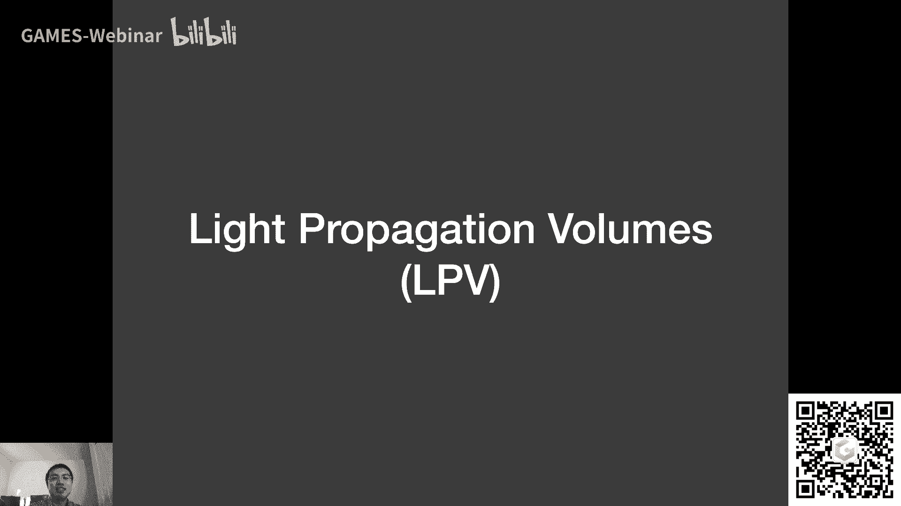

那么它是什么道理，咱们马上就会说，首先呢先说一说它的历史，lpv lpv最早是在这个cry engine 3里面引入的，然后呃我没记错的话，他就是为了做这个crisis游戏啊，就是crisis。

中文应该叫孤岛危机啊，人称显卡危机，是那个时代说，这个游戏用了很多各种各样的新技术，然后对显卡是一个非常巨大的挑战，所以人人人们又称他显卡危机，然后呢呃这其中的一项重要技术，那就是lpv。

那么lpv就可以把全局光照做得非常好对吧，然后大家可以看到这幅图啊，就是从应该是crisis里面来的，用到了lpv，然后lpv做全局光照，它有两个非常好的性质，第一它非常快，第二它质量也非常好对吧。

然后这就是为什么我们要学，我们之前不是说rs m会有它的问题嘛对吧，然后lpv这里呢就一定程度上能够解决呃，一部分问题，另外多说一句哈，就是说这个工作是谁做的。

lpv这个工作是一个叫anton anton carplan，这个大神超级大神做的，然后呃他也是我的合作伙伴，然后我们最近呃他在facebook嘛，然后我们就在讨论一些合作的项目的问题，然后呢。

嗯我们之前就是我和清华合作的一篇paper啊，待会儿跟大家说哈，就是在在做从直接光照去猜测，间接光照的一个工作，然后他非常喜欢安藤，特别喜欢，然后他最近好像在带一个队伍。

在试图从这个工作出发继续再做一做新的东西，就是用一些神经网络相关的东西，来解决全局光照问题啊，给大家说一说这块历史啊，anton这个超级大神啊，做的lpv方法。

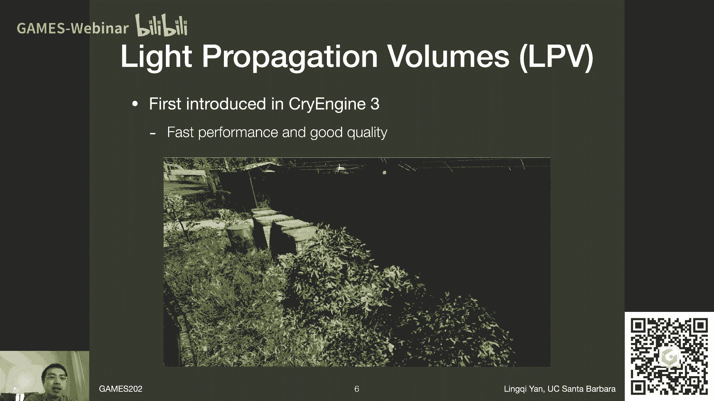

然后得到了广泛的应用，ok那么呃lpv，那它要解决的一个最核心的一个问题是什么呢，他他就是看到了这样一个点，那么我为了做全局光照，或者说为了做间接光照，我其实是要的是什么东西。

我要的是在任何一个shading point上，如果我可以立刻得到间接光照，到打我这个shading point的时候，来自于所有不同方向呃，他的这个radiance都是多少，那我就可以做间接光照了。

这话说了跟没说一样对吧，这本来就是我，我自然得知道间接光照到达这一点，从任何一个方向的reading值多少，我才能做呃，间接光照嘛对吧，然后那但是这个问题一旦被提出来之后，然后总结成这么一句话。

大家就可以针对性的来解决这个问题，好吧，那我对于任何的shading point，我是不是都得去能够立刻得到他的radiance，那这是最好的，对不对，那么这里呢lpv方法他就用了一个非常有意思。

以假设啊，这这不是假设啊，这是这是物理事实啊，就是什么呢，就是说呃radiance这么一个概念呃，它在空间传播的过程中，比如说我这这点开始呃，我发出呃某些radiance，然后我到达了另外一个位置上。

沿着一条直线在直线传播的过程中，我会认为radiance是一个不变的量，它是不变的，这个概念我们老早之前就在用对吧，我们之前在做啊，pass tracing的时候，大家还记得吧，从t点我打出任何一个点。

打到q点去，那么在q点他接受到的直接光照，打我往p点走回来的呃，这么一个出色的这个方向对应的radiance，那也就是你的p脸接收到的radiance，是我们认为沿着一条线上，它是完全一样的。

没问题对吧，那所以这是对的，radiance在传播的过程中是不不会被改变的啊，这是一个非常重要的一个概念，咱们之前radio ometry也提到了这个事情，对吧，嗯ok好的，那么呃呃有同学问平方衰减。

那是另外一个，那是另外一个量了，大家还记得intensity，那是另外一个量，那是因为在传播的过程中面积不断增大，所以单位面积上intensity就会降低嘛，这是另外一个概念哈。

然后嗯嗯radiance呢自然跟这个没关系，它本来就是定义在基本上是一条线，就是就是为了定义传输而产生的一个量啊，这就是关键，那么那么关键的解法是什么呢，咱们刚才在呃呃提到volume这个词的时候。

就已经提到呃呃差不多能够想到了对吧，怎么做的呢，就是说lpv它首先呢对一个场景做了一个网格，一个场景是3d的，对不对，你把场景分成一个3d的一个网格，切豆腐一样的对吧，然后33d的一个网格中间呢。

大家可以看到我这幅示意图，那自然是在2d中间做的对吧，然后大家可以看到这其中的一个格子，那那就是他的一个所谓vocal叫提速啊，vocal大家可以类比一下所谓texo嘛对吧，txt中文叫文素。

道理一样的，那么呃嗯把整个场景先分成格子，然后这个格子呢就是用来传播radiance的，那大家想一想，传播radiance从从哪儿传播到哪对吧，那我肯定是要传播间接光照的radiance。

那我这之前我可以先算直接光照，跟r s m是完全一样的概念对吧，我把直接光照算好，那么这些被直接照亮的物体，它们作为刺激光源往外发出的reading，哎这就是我的起点，就是我要从这里开始呢。

从这幅图上大家可以看到对吧，呃这右边这某种物体吧，不管是什么，它的任何一个点接收到了直接光照之后，它会有反射啊，这就是呃间接光照那的来源对吗，间接光照来源从这里开始，然后我要问在场景中任何一个格子上呃。

他收到的呃radiance是多少对吧，我就是想问这么一个问题，那自然就是从这个红色的这些箭头开始，然后从他们对应的格子开始啊，然后一直传播到所有场景中，所有其他格子去啊，说白了就是这么个意思对吧。

这是非常有道理的一件事情，radiance既然是在传播过程中，它是沿着直线不变的，那么自然而然可以这么来做对吧，那么下面怎么做呢，咱们就简单提一下，就是啊我先说一下，就是说关于这些3d空间的这些方法。

这两个方法啊，这两种方法都不会特别就说的特别详细，像上一节课的rs m一样，不是因为他们不重要哈哈因为非常重要呃，但是嗯就是它里面涉及到的细节实在是太多了，我尽可能能够把这个逻辑给说清楚好吧。

然后呃很可能说完了之后你还是不知道怎么写，但是你会清楚说他大概一个思路啊，这个就差不多了，因为确实非常难写好吧，呃3d空间中的这种全局光照，这是确实是一个比较大的一个挑战哈，然后我是觉得是这样。

有同学之前还问对吧，说咱们这门课最后不是有个大作业吗，大作业这大家写什么呢，再说他还真有兴趣挑战一下吧对吧，l p z或者v x t i实现一下，那没那么容易的，而且还记得我之前说的嘛。

就是可能你实现出来，跟比如说工业界实现出来他们的demo，然后效率可能差了个十倍，这是非常正常的一件事情啊啊ok啊，不管怎么样，那咱们先回到说lpv怎么做的，那最最最最high level是什么意思呢。

就是分成这么几步，第一步呢首先我要知道哪些点，它是会发出这种嗯，就是作为刺激的光源对吧，这是跟之前2s m一模一样，哪些点接收到了直接光照嘛对吧，那这是第一点，那第二点就是这些点或者这些面对吧。

呃他们接收到了直接光照，呃，我首先我要把它给放到，我把场景划分在这格子里面，我要不放到格子里面，我怎么从这格子传播到其他格子呢，对不对，然后就是说我原本我知道的指场景中的若干点，这些光源或者是面。

我先把他们给呃，这这叫注入啊，这是他们呃起了一个名字，injection，注入到场景中的这个三维的一个网格，中间的任何一个格子上面去啊，这么这么来做，这就是你的起点，那自然有了这个起点之后。

你就开始在这个三维的这个网格中，你来传播radiance这么一个做法，那么当你传播完成之后，那么你整个场景是不是就全覆盖了，你任何一个位置，你都知道间接光照传播到这一点，从任意一个方向。

他的radiance多多少，那怎么办呢，直接拿去渲染，是不是这个意思，所以说听起来是非常嗯正确的一个思路对吧，然后呢它具体稍微具体一点点怎么做的呢，那他第一步呃就是说首先生成嘛对吧。

生成呢你肯定要知道哪些surface会直接被照亮，不过这里呢大家还还记得，上一次我们说rs m有个问题对吧，有多少光源就得做多少r s m这次还是一样的，在这里还是一样的，也就是说它并不解决这个问题啊。

我是说直接的光源的数量哈，就是呃r s m找到场景中所有的呃，直接光照照亮的表面，然后呢，嗯你可以认为说不必要说我这所有的这些表面，所有这些像素呃，我我都把它当成刺激光源。

然后呢我在其中我可以采样一些对吧，这都是没问题的，然后我可以降低一下啊，这些当做刺激光源的表面的一些数量，这都没问题，咱们之前的rs m里面也这么做了对吧，然后呃这样的话。

那我就得到了一系列的虚拟的光源，这就是第一步对吧，得到了一系列虚拟的光源，那大家还记得右下角这幅图这些小的太阳，这些就是嗯次级的光源的啊，第一步完成，那第二步是什么呢，注入对吧，还记得吧。

呃如果我的一个场景中有很多小的次级光源了，大家看哎这上面这些这些哦，哦对鼠标哈，这里大家看啊，呃这个物体表面被照亮的这一部分，哎这些地方都是刺激光源对吗，那么我为了做传播，我得首先把这刺激光源。

先把他们给放到对应的格子里面，我先把它转换成格子上的属性，对不对，那呃首先我场景得有一个3d的格子吧，然后对于这块来说呢，其实呃工业界的做法是直接用一个三维的纹理，纹理来说，也不见得一定得是二维的纹理。

可以是三维的，没问题，这样的话就是有了一个3d的一个格子嘛，没问题，你可以定义任何一个text，它对应的在3d空间上是哪一个vocal，这样就没问题了，ok嗯好的，那么有这样一个信息之后呢。

你就看任何一个呃格子内部，之前这些虚拟的这些光源，对不对，它们朝向可能各不相同嘛，对不对，然后你可以把他们整个的这些呃这个格子内部，所有的虚拟光源，他们往各个不同方向的这些radiance。

你都把它们给算出来，比如加起来嘛，对不对，加起来了之后，然后这个时候大家可以已经可以看到，这个格子里面用的这个形状了对吧，但是不是很熟悉对吧，呃那这个时候加起来了之后，它往四面八方去。

他的radiance初始值都是多少，那它是一个空间上的呃，呃往不同方向上的分布，我自然可以压缩，它拿什么呢，s h啊，所以大家就看到了，spherical harmonix是非常有用的一个东西吗。

然后在这里呢呃大家可以看到在工业界上，大家用了多少s h呢，就用了四个，也就是两阶，就是前两层大家还记得吧，第一层一个，第二层三个就那么多，四个s h g函数就用来表示这么模糊的。

还一种大概的一种reading分布吧，就这么个意思好吧，然后大家可以看到是很粗糙的对吧，然后之前我还记得上节课跟大家说，ravi啊，之前推出来呃，说对于diffuse的物体，它接收到光照。

你也得至少得按照三阶来处理，但是工业界很多大胆假设两阶啊，总共四个数就可以表示这个格子，它往四面八方去，它的reading的分布初始值是什么呢，好那初始值知道了，下一步是什么呢，开始传播是不是开始传播。

怎么传播呢，那就是大家可以看右边这幅图，假如说一开始呢，嗯你就这个格子里面有呃实质性的这些呃，radiance这些内容，然后他往各个不同方向都要都要去的，对不对。

然后呢呃它应该会传播到它周围的格子上面去，对吧啊，这这肯定是没问题的，那么它怎么传播到周围的格子上面去呢，哎这时候就是说哎radiance不是按直线传播的吗。

你之前就认为说哦radiance是在一个网格的中心，然后呢它是往各个不同的方向去，当他穿过，比如说它的上表面的时候，大家知道一个格子不是六个面的对吧，一个格子是六个面。

然后我就看他的这些radiance，穿过上表面的这些radiance，很明显都会被它上面这个格子收到，对不对，那这嗯同样这个格子之前的radiance，它穿过右表面的这么一些radiance。

都会被右边这个格子收到，那这就是这里初始了，初始他先考虑右边哦，那就是一开始它的分布，你看四面八方都有的嘛，然后但是有多少方向是向右的呢，差不多只有右边这么一小块儿是向右的。

所以说唉这块儿被右边这格子收到了，夹起来啊，没问题，然后这样的话嗯你就会发现它可以向右传播，同样向左也是一样对吧，它向左大家看向左原本就挺少的，然后又是穿过左边这个面的，那就更少。

然后这是2d的一个描述嘛，那空间上总共六个面吧，那肯定一个格子会传播到它周围的六个格子，里面去啊，这是这么一个做法，那么传播刚才已经说了，就是直接的直接贡献过去，就是加起来嘛，然后这样的话呢。

呃你就知道它传播到其他的这些呃地方，然后他们的这些radiance是多少了，没问题，然后然后呢，其他的这些格子照样还都用s h来表示就好了，ok那这样的话我可以对每一个格子。

我都把它扩散到周围的六个格子里面去，我只要重复的不断的去做这么一个操作，直到最后整个的网格稳定下来就没问题了对吧，这就是呃，不管是图形学还是就整个计算机科学吧，经常用的迭代方法对吧，我可以迭代若干次。

那么有同学关心，大概多少次之后能够变得比较稳定呢，差不多迭代个四五次就比较稳定了，这是一个非常非常小的一个数目啊，这个意思啊，ok然后差不多，这就是这关于他的第三部怎么样传播，传播完了之后。

那你自然就知道整个场景呢，呃在任何一个格子上，他的radiance你就都知道了吗，知道了之后，第四步是什么呢，就是渲染对吧，那第四步就是我就已经可以对任意的shading point。

我知道他在哪个格子里，我知道他在哪个格子里呢，我就把这个格子呃，之前我算出来他接收到的incident radiance啊，所有方向吗，s h表示的嘛对吧，所有方向，然后呃都拿到都拿到之后。

那我自然就可以用它来做渲染了，没问题好吧，不过呢这么这么做会不会有什么问题对吧，诶嘿嘿嘿嘿嘿哎，这听起来是非常美好的，对不对，那么他的问题是什么呢，大家从这幅图上就可以一目了然的看到呃，这么一件事情。

什么呢，那就是诶你看啊，这里假如说这个墙原本这这这有一堵墙，它的左半边啊，就这里呃会被直接光照照亮，然后呢它会往四面八方去反射去，然后它反射那肯定是往左边去的，对不对，往左边去。

他无论如何不可能照亮右边这堵墙，咱们说清楚啊，左边这这这个点它反射出去的radiance，绝对不可能照亮右边这堵墙，但是呢由于你把整个场景分成了格子，那就是说啊在这个格子里面。

你都认为他的radiance是一样的，你还记得第一第二部在做注入的时候对吧，你会把这些所有的这些点，它发出的radiance，都认为是整个格子上都是uniform的一个radiance。

那就会出现什么情况呢，就会出现这个p点，他的radiance，你会认为在这个格子里面，全部都是这个他的radiance，那么他就会照亮他自己的这个背面，看到看到这一面对吧，唉所以说就会出现这么一个问题。

这这不出事嘛对吧，然后这叫什么呢。

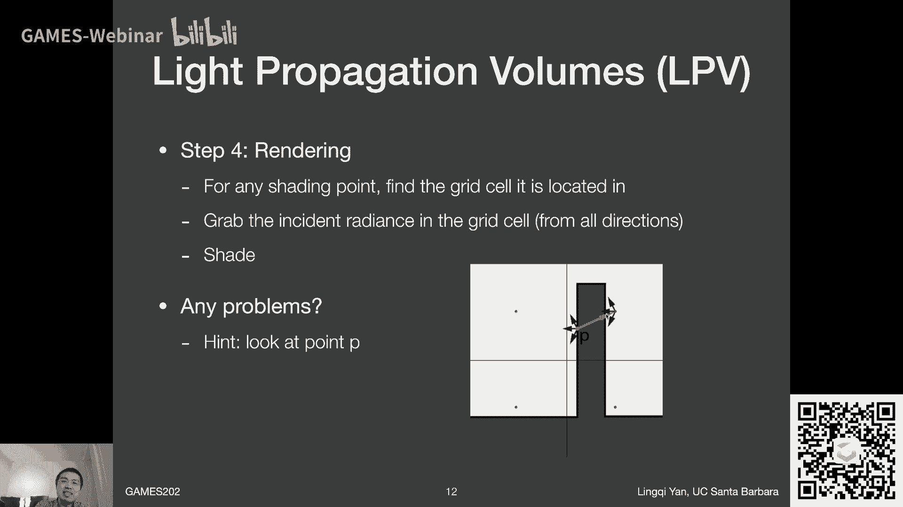

这还记得吧，这个问题就是还是之前一样，咱们再说vs m出现的问题，light leaking问题，然后就是说光线原本来说，这个这个道理就在这儿，大家看这个棚子它的顶它向上的对吧。

它怎么可能会照亮它的底下呢对吧，然后所以说正常情况你应该得到这样的结果，但是lpv却给你这样的结果，那么问题是呃就是呃就是这样产生的对吧，那么它的根本原因是什么呢，是因为啊你有你。

你有一个非常细的这么一种几何对吧，它的它的力度会比一个格子还要小了，是这个意思吧，就是当你的这些几何比这格子还小的时候，那自然就会出这个问题，那我要格子划分的无限小非常小。

唉那这样的话就不会出这么一种问题，但是肯定也有代价，我要画的足够小，至少我能想到两个问题，第一什么存储对吧，3d的空间里面，你格子画的那么细，那这个存储吃不消啊，这是一。

然后第二呢就是说你在做propagate的时候，你在做做这个传播的时候，那你要考虑格子数就更多了，是不是，所以说这样算这个事情呃，也会比较慢对吧，那就会出现这么一个问题，那么现在我集中处理一下。

同学们说的这个问题吧，有有一位同学问，问到了一个非常重要的一件事情，什么呢，在传播的过程中，你不考虑说这格子能不能看到下一个格子吗，啊这里仍然是一样，做了假设和和2s m是一样的。

呃我会认为在传播的过程中，我不考虑visibility，否则考虑的话就非常难了好吧，然后这是一第二呢，有同学说斜对角的格子不计算传播吗，呃不计算，为什么呢，因为你可以想象一下。

你穿过斜对角是怎么穿过去啊，就是说你可以认为说呃有一个中间一个点，他先传播到了他左边这个这个这个格子啊格子，然后呃这左边这个格子再传到它上面那个格子，这这不就相当于是一个道理吗，就是就是嗯。

就等于是你当前这个点传播到了它的斜对角，一格子嘛，这不是一回事吗，对吧，先先往右传，再往上传，跟你直接往右上，这是一样的，没有区别哈，ok啊然后呃有同学问说是哦很多问题哈。

咱们咱们慢慢处理哈啊六个面传播，道理就在这哈，就六个面传播，你省得你考虑27个对吧哈哈，然后嗯就是说有同学问，能不能用自适应的分割方法啊，那这应该是我说对应我们刚才说的，就是你格子要划分的大了呃。

就会出现light leaking问题，你要是格子画的小了的话，你就会出现存储啊，以及这个计算会难的问题，那能不能自适应能没问题，而且工业界会用，那就是所谓不同的分辨率的格子呃。

然后来做这么一个传输和计算，然后这位同学提的非常对啊，完全可以，而而这种基本方法在啊实时渲染的工业界，就叫做cascade，这就是这就是基本基本的这么一个思路，也是平常我不太愿意说的，然后为什么呢。

因为在实在实时线上，大家管它叫凯sk，然后在学术界或者是离线渲染，大家管它叫啊multi scale或者叫level of detail啊，都是一回事，其实呢就是相当于有一个有一个这种层次。

就是这种东西呢，正常情况下，对于这些大家设计的这些基本的结构，都会有这么一种安排，咱们马上就会说啊，vx gi也有这个上嗯，好的，那么呃有同学问格子一般多大合适，这个反正会比场景少一个数量级。

差不多是这样的啊，然后呃呃我是说比那个像素的数量哈，至少是少一个数量级啊，然后有同学说光沿格子传播的时候要改变方向，不不不会光怎么会改变方向呢，嗯ok嗯这里没有kd tree这么个概念哈。

目前来说就是空间中的一个格子，而就是如果我们没考虑所谓，multi scale或者cascade的这种概念的时候，就是空间中划分成几乘几乘几这么一个格子啊，然后并没有层次结构啊。

然后一个格子被很多格子同时贡献，当然可能啊，一个格子可能会被他来自他周围的六个面，都可能会贡献他们，他也可能会贡献到周围的六个面嘛，一样的对吧，嗯哦以及以及可能现在没有同学问哈，我说一下呃。

难道没有同学关心说我这这个传播这过程中，难道他一定最后会收敛，达到一个稳态嘛，他不会一直很不稳定的这么传播嘛，对吧，会有什么问题啊，大家可以想象一下，这就好像是你在一个池塘里面，你投入了一个石头一样。

然后它会不断地产生这些这些这些叫什么呢，就是就是波纹嘛，然后最终最终它会稳定下来嘛，就是这个意思，然后对于咱们这个光线传播来说，光线传播最后呃，他呃你可以认为又没有其他的外力。

所以他最后肯定会通过这种方式，然后达到一个稳定的状态啊，这个意思嗯对没问题，然后我确认了一下，有同学说呃，每一次迭代是每个格子像它周围的面传播，说的太对了，就是这么做哈。

ok场景中有啊这种volumetric的东西，那咱们就不再说了，好吧，有误的话其实是没问题的哈，就是只不过说这种传播方式就会变得不一样，我之前读到过一篇paper，他就在用lpv的思想来解决。

说我怎么样考虑这些在这些云烟雾里面，这些光线的传输。

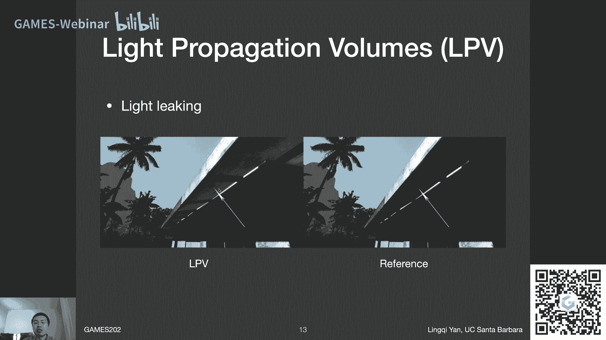

它就不再是直线了嘛，对吧，有人这么做的哈，ok那咱们继续吧，这个回答了不少问题了。

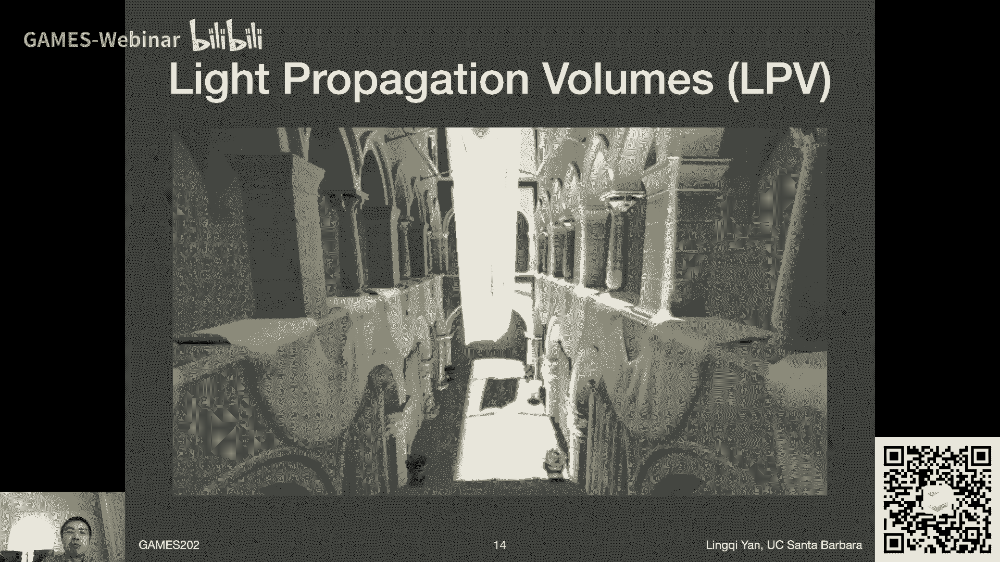

那么大家看一下这个例子哈，大家可以看到呃，挺好的，这个质量呃，除了这视频压缩的时候是有点问题啊，但是没关系，大家可以看到直接光照在发生变化的时候，间接光照也会在不断的发生变化，对不对嗯。

然后呢大家可以看到这是另外一个例子了，这是带纹理和最终颜色的，然后大家可以看到一个移动的，这么一块红色的布，使得你离近的这些地方都会反射出红色，看得很明显，对不对啊，比如说我鼠标停在这儿。

大家可以看到这儿越来越红了对吧，因为这个红布被直接光照照亮嘛，然后其他地方都会呃收到间接光照，那就说明lpv呢它是一个非常不错的一个方法，挺稳定，然后对于动态的物体处理的都非常好好吧。

那么啊这里多说一句，对于glossy的接收物同样也是没有问题的哈，咱们之前不是就这么说的嘛，对吧就是呃ok嗯行，有同学问这是不是预计算的方法，这并不是啊，这是实时的，你都要做这么一个计算哈，ok嗯嗯行。

有同学又说格子，每个格子存的是不是相当于是light transport，挺对的，没什么问题哈，对对可以这么理解，那这就是关于这块儿啊，lpv方法呃是是怎么运作的，那咱们就直接继续了好吧。

因为这里说的也不是特别详细，那我们再说另外一个方法什么呢，就是vx gi，vx gi，它是什么的缩写，vocal global illumination，大家可以看到又是提速，又一次出现了这么一个呃。

就是场景中又出现了格子这样一个概念，只不过呢他和lpv是完全不一样的一个概念，那他做的是什么呢，这里我就说的非常非常high level了哈，然后就是说它仍然是一个呃两趟的一个算法。

大家会发现有很多方法很喜欢两趟不算了对吧，rs m也是这样的，嗯其实啊算起来啊，lpv它算是四方的算法，然后比较麻烦，然后呢v x g i呢基本就是两趟差不多，实时渲染，有很多这样类似的思路啊。

拆分成不同的pass，每一个pass解决不同的问题，那么两趟的算法自然而然人们就要问，那它和2s m也是两趟的算法有什么区别呢，对吧，这里呢提供两个呃主要的区别，第一什么呢，就是说在2s m里面。

四级光源都是呃，每个像素所表示的一些微小的表面，没错吧，然后在v x g i里面，你的一个场景是已经完全离散，化成了一系列的格子呃，这个非常好理解什么呢，你就把这场景给理解成。

就变成了一个用乐高堆出来的场景就好了嘛，对吧，或者像我的世界一样，这样这样一种场景的表示方法对吧，呃然后就变成这么些格子呃，那整个一个场景划分成很多不同的格子，然后这个格子呢在这里这就是刚才有同学问的。

在这里会用到一个所谓的hierarchy，把这些格子组织成一棵树形结构，就是它有有有小的有大的啊，然后就可以认为大家看到右边这幅图呢，它这就是最最怎么说呢，最细的一个层级就是说最小的这些格子。

大家可以看到分布在这个物体表面的格子，这些所有的这些地方嘛对吧，那么多格子，然后呢你可以在上面再做一个呃，呃层级比他高，然后格子大一些对吧，然后同样道理，这样可以最后建立出来一棵树对吧，ok那没问题。

就是说啊咱们总结一下，这是第一个区别，第一个区别它在场景中的任何一个呃，所谓刺激光源，从之前的像素改成了提速变成格子哈，ok那么第二点是什么呢，这一点就是和之前lpv完全不一样的，一个思路了。

就是说之前呢嗯lpv里面呢，你你要考虑到任何一个shading point，他要接收到什么样的呃radiance对吧，然后我是靠传播的方式，我是从刺激光源开始。

然后一路传播到呃这么呃不同的shading point对吧，然后呢我传播总共要做几次，我传播总共要做一次，没错吧，就是整个场景来说，我不是做完了注入之后，不管我用多少r s m哈。

只要这一步注入这部完成之后，我传播只用传播一次，我就知道场景中所有的shading point，他他任何一个位置上，他的接收到的间接光照reading值多少对吧，那这里呢就是一个不同的地方。

当然也不同于2s m他是怎么做的呢，就是说呃v x g i的第二趟它是从camera出发，然后还是一样去渲染整个场景，就好像你有一个呃camera rain打到任何一个像素上。

然后根据这个呃根据这个像素它本身的呃材质，比如说glossy的材质，那你知道camera ray达到一个glossy材质，会变成一个类似一个锥形的东西往外反射，对不对。

然后呃这个追它会相交到这个场景中的哪些，你之前预计算好的文素，而不是叫预计算好的吧，就是就是已经存在了的元素，那么这些文素自然而然对你shading point的贡献。

就可以算出来你会发现什么怎么做的呢，它就是每个shading point他都要做一遍，所谓空tracing啊，这么个意思，咱们这种类比较retracing了一次，你trace一个光线。

而这里呢对于gloy的表面，你就trace出来一个空就好了啊，这么个意思就是圆锥哈啊，ok然后当然你这样一想就会觉得这个方法呢，那肯定会比lpv要慢嘛，因为lpv整个呃传输我就做一遍。

然后这里contracing每个像素做一遍，是不是，然后当然可以优化哈，这之后再说，那这是两个截然不同的一个呃。

呃就和rsm不同的安排啊，那么他是怎么做的呢，具体啊就是说他要对整个场景，然后先把它都变成小的这种文素和格子啊，然后呢在这些格子上建立一个所谓hierarchy，这右边这幅图呢大家会建。

这就已经比较熟了嘛，咱们之前game 101就一直提到说，咱们做re trading的时候对吧，然后我要怎么样判断一根光线，快速的和哪些这些呃三角形相交嘛对吧，然后这里一个道理了。

就是就是你场景中已经描述成了很多小的格子。

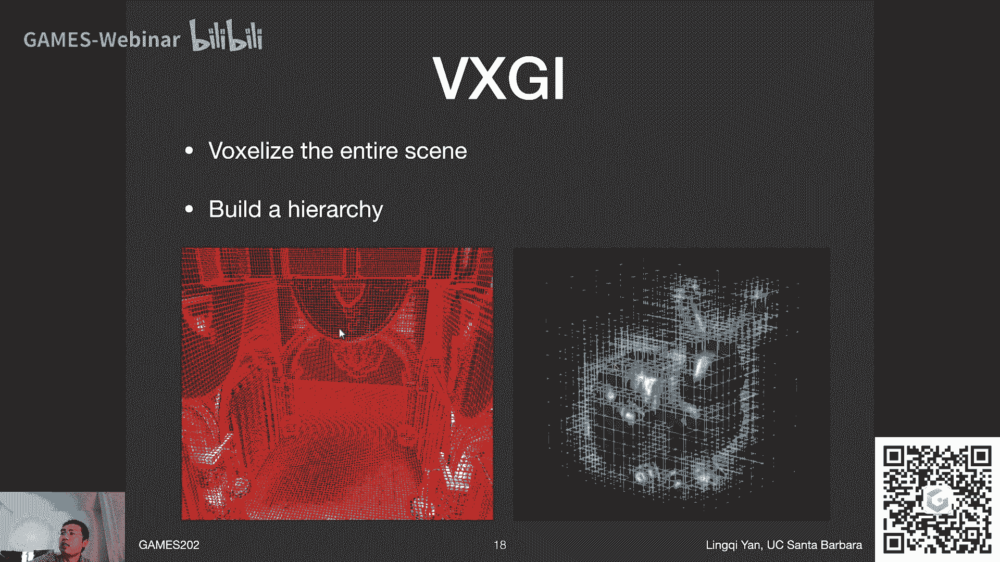

这小的格子也可以组织成这么一棵树哈，那么第一个pass在vs g i里面做了什么事儿呢，就是所谓一样的light pass来决定哪些呃地方，哪些哪些这些vocal啊会被照亮的。

当然还是要从哪些patch会被直接照亮开始啊，这里我就说了，开始简略一点哈，就是首先你要做一趟所谓light pass，你不管拿什么样的方法去做呃，rs m也行啊，别的什么方法都可以。

只要你能算直接光照，那你知道任何一个patch它的直接光照，但是呢我这个场景，首先我是我是认为说这个场景呃，是用voxl来表示的，那就是说对于任何一个小格子，跟之前的那一lpv的注入就会非常像诶。

我这个格子里面它的所有的这些表面，然后它会有一个什么样的分布，不过呢这里他会认为说我记录的不再是啊，任何一个这些呃，这些表面它的一个出色的一个分布，或者认为我这个表面都是diffuse的。

然后它是一个半圆形，半球形的一个分布，它这里呢可以支持这些反射物，也是glossy，那么他做了一个比较聪明的做法，做了什么呢，就是说我认为说呃我一个vocal里面，我记录他的光源呃。

就是所谓incident lighting啊，它的一个分布，那光源都主要从哪些范围来，这里我记成一个某种分布，lob，大家看到这绿色的一个，然后又记录说在这个vocal里面，他的这些表面问啊。

就是用来反射这些光照的这些表面们，他们的这些法线，它的分布大概都是什么样的对吧，然后这样一来的话，你有输入的这么一些呃方向，你有法呃，法线的大概在哪一个范围内，你有这两个范围。

你当然可以根据这个这个格子呃，它到底是glossy啊，还是diffuse啊，你就可以直接算出来它出色的这么一个分布，那出事的这么一个分布，那自然就比你之前一个格子啊。

我记录他这认为它的反射面都是diffuse，然后再用s h来压缩，它就比这个要准啊，这么一个思路好啊，具体怎么做，咱们就不再多说了，那么你一个格子是不是可以这么来做，记录它incident的范围。

然后normal的范围，那么对于这个这个嗯，那我就把他这些很多小的格子，他们的输入方向和这些normal，我们都都都给考虑在一块儿，然后就是相当于是呃，可以建立这么一个hierarchy啊。

这就是你的第一步这么做，所谓light pass，那第二步怎么做呢，有了这个事情之后啊，第二步就是我们刚才说的，你要开始实际考虑渲染了，实际考虑渲染，考虑你的任何一个pixel。

你知道camera的方向，那你自然知道，如果这个pixel它是glossy的，那么你这一根camera就会被反射成一个圆锥对吧，然后就是所谓这么一个空，然后有一个最最简单的最朴素的方法对吧。

哪一方法怎么做呢，从10point连出一个追，你看场景中的所有的文素所啊，体术啊，所有体术vox，所有的提速，你都你都判断一下，是不是和嗯嗯和这么一个圆锥相交相交的话呢。

你把这个提速他对这个shading point的贡献算出来，而且咱们刚才说了对吧，有能有任何一个提速它的输入的方向，光照输入的方向，又有他们的这个normal分布的方向，你肯定可以算贡献到任何一个点。

它的确定是多少，具体咱们不说了，但是你可以这么算对吧，一个空里面它相交到了所有的呃这些呃提速，那这样是不是会非常慢，而且呢咱们刚才既然已经建立了一个hierarchy，那我何必这么做呢，那我可以这样想。

在一个圆锥的传播过程中，它是不是越变越大呀对吧，大家可以看到一开始你可以认为它覆盖的范围，空间中很小，后来他越传播传播到后面，它的覆盖范围就越来越大，那么我干脆就根据它这个圆锥呃，它离你的初始点的距离。

我大概算出来某一个范围，然后根据这个范围的大小，我就直接在我对应的这个呃，之前整个场景的voxel表示的hierarchy上面，我找对应的层级对吧，我找对应的层级，使得说我找到了对应层级上的一一块。

那差不多就是我这个呃呃这个光线啊，这不是这个这个圆锥往前走的时候呃，然后他到达了这么一个呃地方，它所覆盖的范围，那那那这样的话大家可以看右边的这么一个呃，例子啊，这也是一样的对吧，这是二维的一个表示。

然后这圆锥在传播的过程中越变越大嘛，当它变得够大的时候，我就在在更大的这个层级上，我去找呃，之前记录好的呃提速的信息就好了对吧，这不就行了吗，这样的话你看我为了踹死我，为了得到吧。

多少提速能够对这个圆锥嗯的起点，shading point能有所贡献诶，我在这么一个场景下，我只用查四次就差不多了对吧，然后也就是说他其实是挺轻量级的一个做法，当然你每一个学龄point都这么做。

那还是挺慢的，对吧啊，ok那这就是他的一个基本思路啊，这样的话就可以省去你每次都查最小的文呃，呃文素对吧嗯ok嗯。

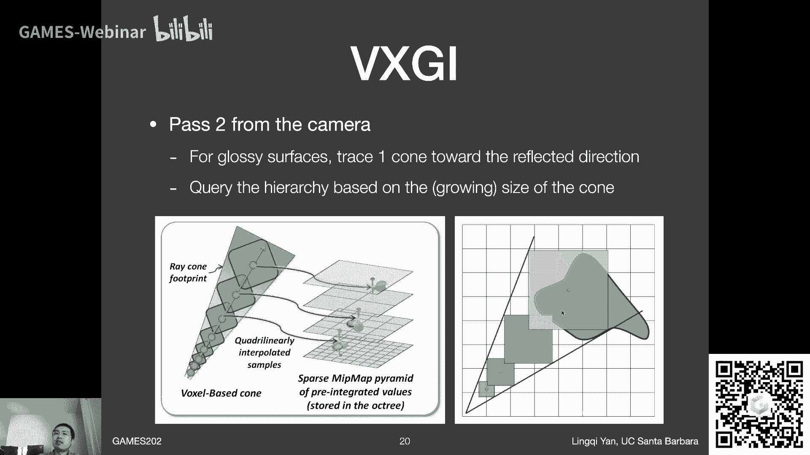

那么有同学会问这么一个问题对吧，如果对于glossy的呃物体表面，就是你camera达到的glossy的物体，那反射出去是一个圆锥，那要是diffuse，这不出事了吗，defuse的话。

你camera打到一个diffuse物体上，它往四面八方都有反射呀，那我不是反射出一个180度圆锥，不是不是这样的一个圆锥吗，那不是场景中所有东西都有嘛对吧，那这种情况下。

就是啊可以考虑成一个超大号的圆锥，但是呃嗯发明这篇paper的人们啊，他们认为说啊，我不如认为说我可以用若干小一点的圆锥，我能把整个反射的这么一个巨大的，这么一个球给覆盖住。

然后每个圆锥的贡献把它加起来就好了是吧，我这样算也不错对吧，嗯然后这样的话呢就等于大家可以看到，对于这个例子来说是画了八个圆锥，对于一个呃defuse不提，我八个圆锥差不多就覆盖了对吧。

然后之前先先预先分配好嘛，哪个圆锥的中心和大小到底是多大，因为你要覆盖一个半球，你你老早就可以算好这个应该怎么样，往不同方向应该往哪儿去，该每一个该多大对吧呃，然后又有同学可能会问到说呃。

这是大家可以看到圆锥和圆锥中间这时候有缝，然后以及他们可能会有一些overlap，这些不准问题都不大啊，基本上来说对diffuse这是完全可以接受的好吧，那基本上来说vx gi就是这么做的。

那大家可以看到他做了一件什么事，就相当于是之前lpv他是把所有的次级光源，他们的呃发出的radiance都先给传播到我的呃，整个场景的任何一个地方去，这样的话我传播做一次。

然后但是呢由于他用的格子以及ssh，表示它不怎么准对吧，但是它会比较快，然后呢v x g i它呢呃就是我我还是一样，所有的刺激的这些光源我都记录下来，并且记录成一个层次结构。

那我对于任何一个shading point，我自己去找到底哪些刺激光源能够贡献到它，我用这个所谓contracing的方式哎对吧，那这样一来的话呢，我就嗯可以得到一些比较不错的一些效果。

然后自然而然造成代价呢就是会比较慢嘛对吧。

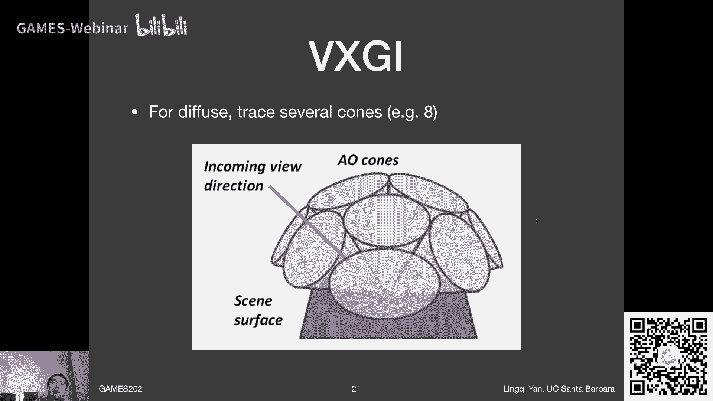

那大家可以看一看呃，这个效果来说还是不错的啊，这是nvidia当年放出来的一个官方的一个视频啊，从direct lighting开始，大家可以看到这是direct，那所以求的是下半部肯定找不亮嘛。

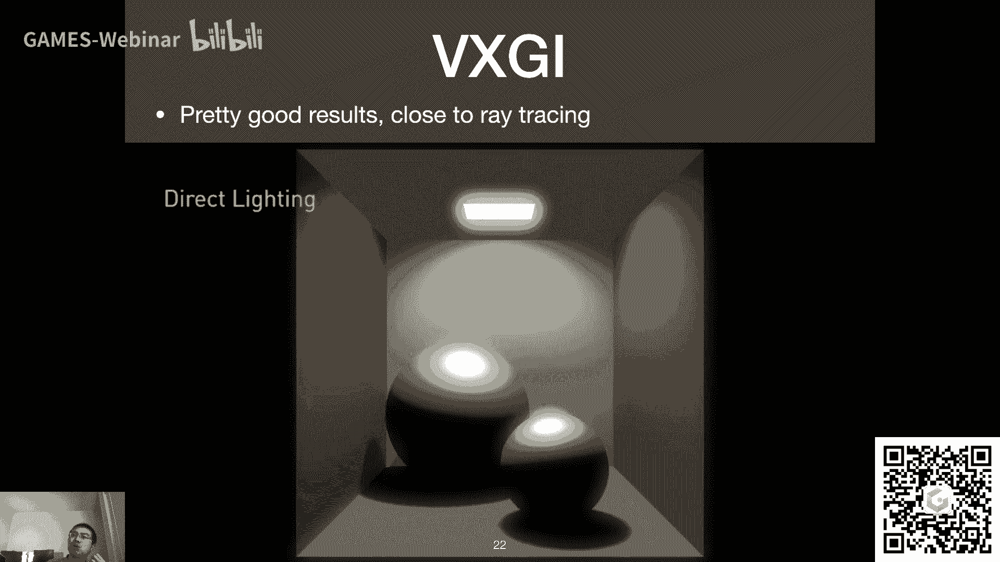

完全是黑的嘛，对吧哦，这里场景就已经被描述成为一些voxel了，大家可以看到所有表面啊，这原本的这六个大的人面也都是变成格子了啊。

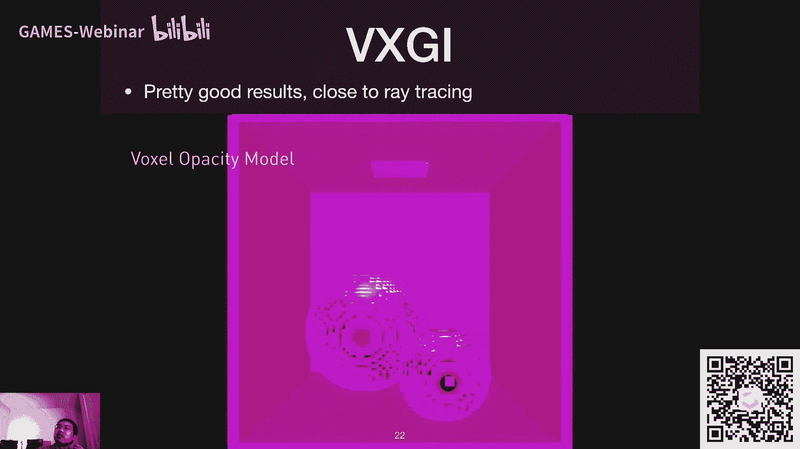

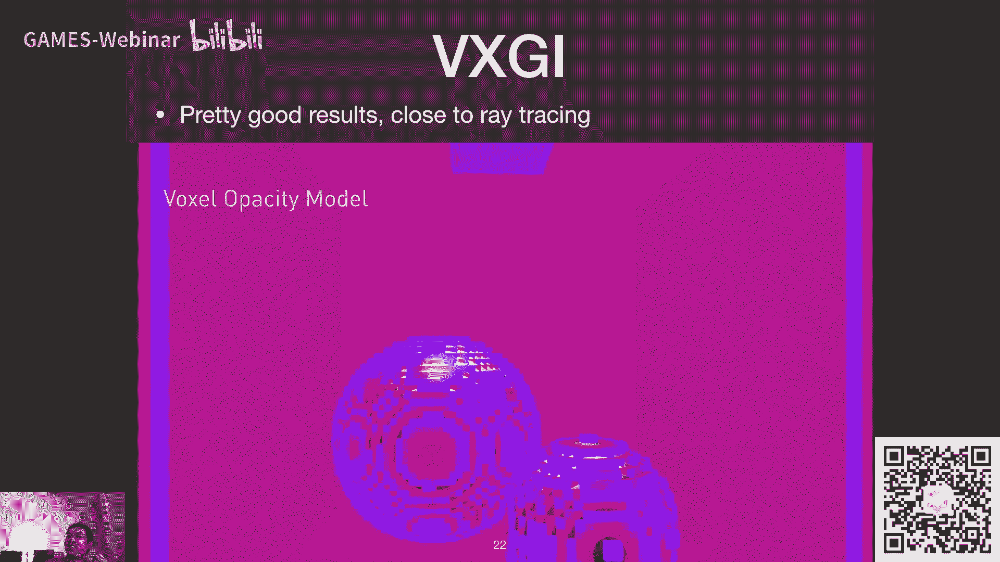

球上还可以看到一些呃artifact对吧，这些是因为呃采样造成的，这是标准的这些pattern啊，嗯ok。

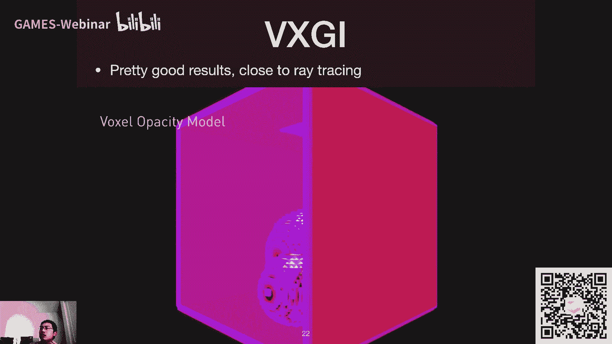

他这个视频我印象中就非常啰嗦了，他每一个地方都展示很长时间啊。

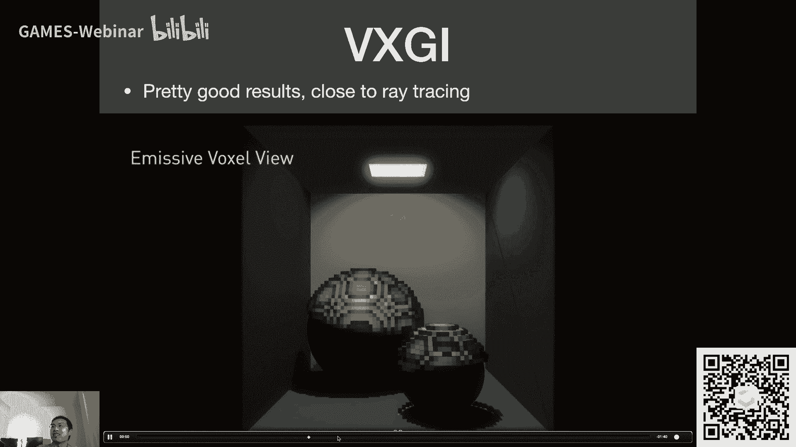

这里大家不不不太需要区分什么嗯，这些vox到底都描述的是什么东西啊。

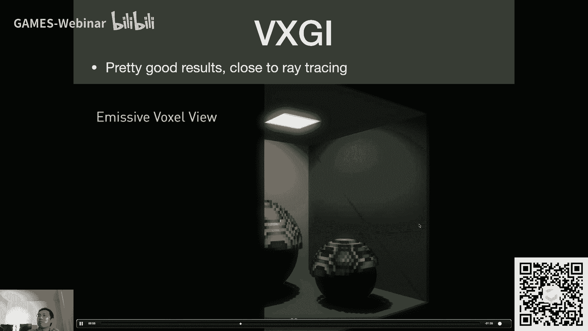

咱们就理解成差不多这样啊，然后大家可以看到呃。

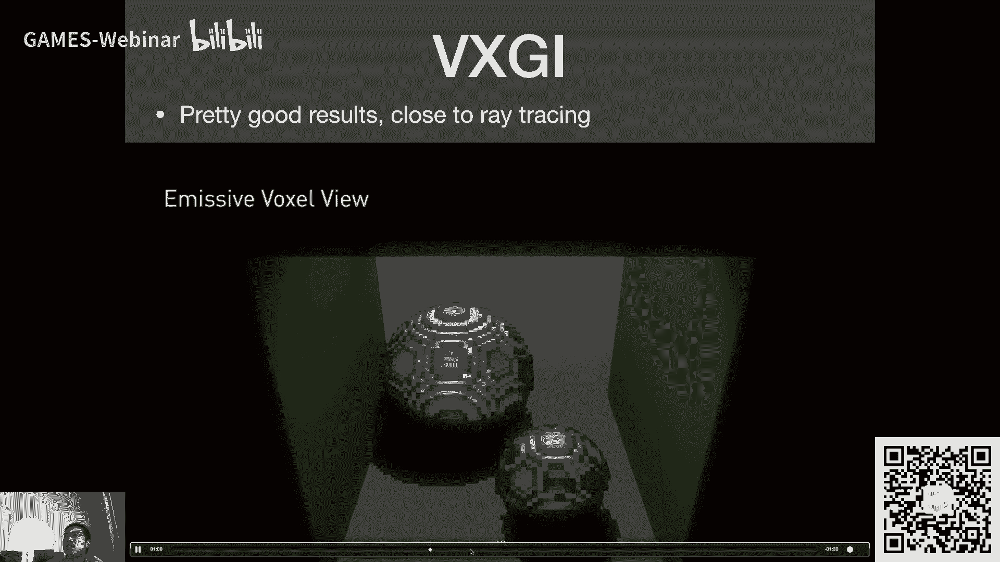

场景已经被描述成这样的格子了，然后呢。

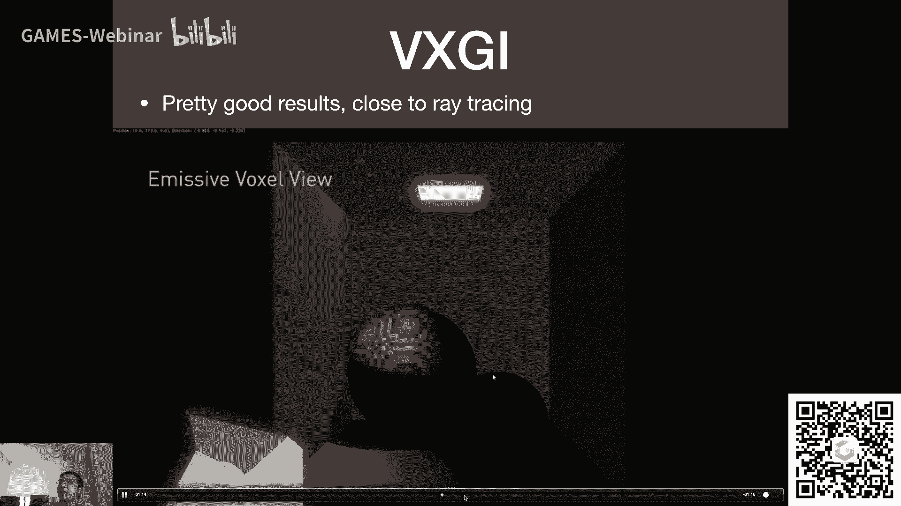

o但他应该是在调某一个什么样的光源，另外一个光源哈。

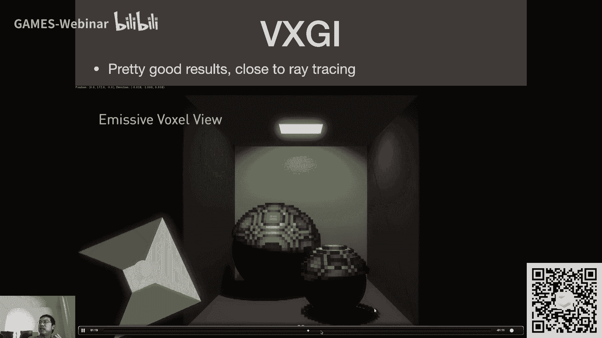

然后再照亮这个场景是什么样的，然后大家可以看到，如果我用刚才的提速，然后我来呃渲染场景的间接光照，那么我会选出这样一个结果，看起来非常漂亮，对不对，就是说就是说质量是非常高的。

因为刚才那个提速对场景的表示嘛，就表示的非常好了，已经对吧，然后呃呃大家可以看到这个间接光照，应该没什么好挑的对吧嗯。

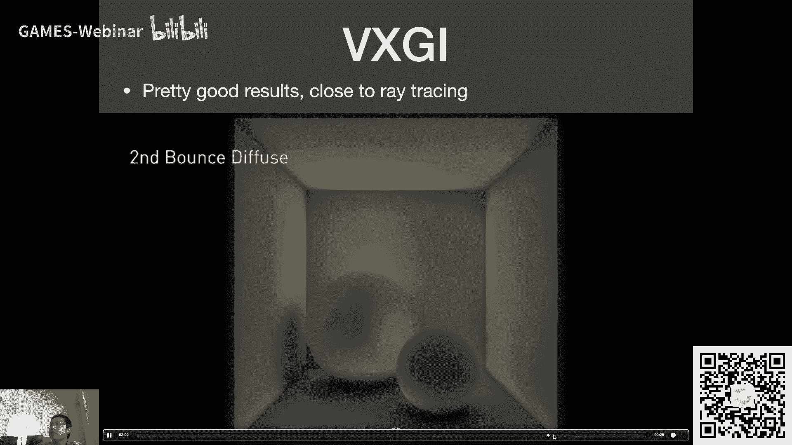

ok然后最后应该有一个对结合在一块的结果，你把间接跟直接给加在一块对吧，然后就可以得到一个看起来非常不错的一个，最终结果了。

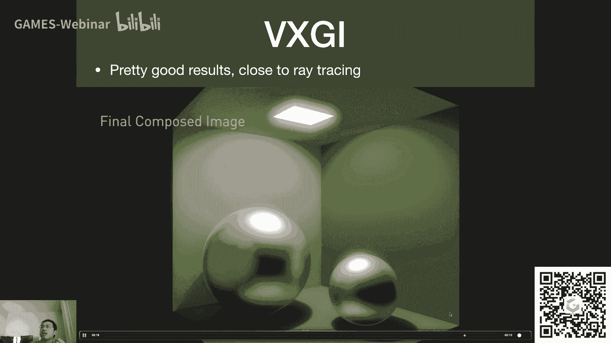

ok啊，更多的例子，大家自己可以网上找到一大堆v x g啊，因为这个早期的技术嘛。

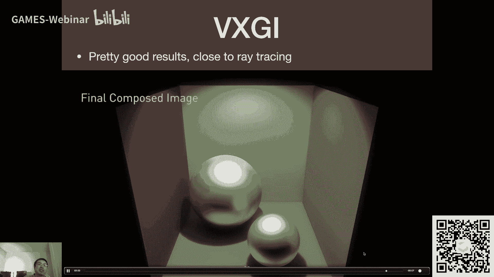

呃然后呢我是这么理解的哈，vx gi质量是在那个时候，可以认为是非常不错的，它比lpv肯定要好，然后但是由于开销还是大了一点，然后导致说嗯就是说它的应用得到了一些限制，还有一个更重要的一个原因啊。

不知道同学们想到没有，就是说你要想把一个场景先给提速化，然后这是一件非常麻烦的事情，是很可能是需要预处理的，然后特别是对于一些动态的一些事，一些物体来说，那那那它动起来每一帧是不是都要提速化。

这是非常麻烦的一件事情，你要实时的去提速化，它又会非常慢啊，这个事情，所以说嗯这是一个他的一个比较大的问题，而且大家可以看到它的提速是非常小的嘛，对不对，ok然后我看到有同学问要查多少次的问题。

就是说呃哦我刚才只是随口一说哈，像刚才一个glossy lob，他到底要查多少次，我说刚才对于2d的那么一个示意图来说，他查了四次，就是说到底查多少次不知道，然后呢以及呃对于diffuse来说。

它的呃圆锥的数量增多了嘛，要查的次数肯定也增多了嘛对吧，然后这是挺有意思的一个事情，然后呢呃嗯即便vs gi它开销很大，再稍微现代化一点的呃，我我想了想哈，对，v s c i最早应该是发在啊。

202012年的一个paper上面，我记得是这样哈，然后嗯再后来之后，比如像ps four出来了之后，然后像他们的硬件就比2012年的，要好很多了，然后我我我记得是这样的，就是说我我有一个呃博士学生。

然后叫周扬，他在他在来之前，他在加入我们组之前啊，应该是实现过vs g i，实现到p s four的蜘蛛侠游戏里面哈，然后当时不是说vs g i啊，不是v x g i，就是蜘蛛侠那个游戏。

它的全局光照做的特别好嘛，那就是因为他的v x g i这么一个技术哈，做的确实好，v x g i确实可以得得到啊，质量相当高的全局光照，然后另外一点呢，为什么它效果好，是因为大家可以看到。

它已经非常像我们之前所说的呃，啊photon mapping的方式对吧，已经很像呃，离线渲染，我在我在做的一些操作对吧，因为每一个像素我都要做一次tracing嘛，然后呃然后自然而然结果就会好一些啊。

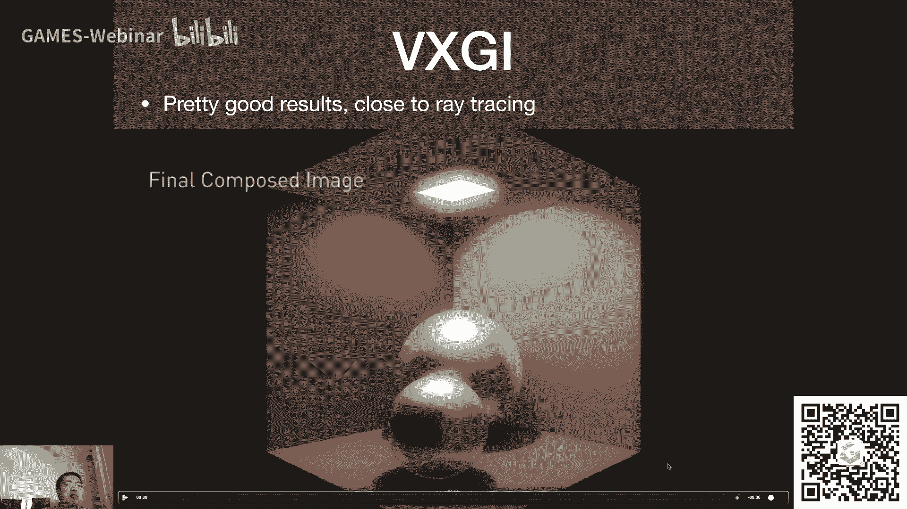

这个意思ok那关于这块大家还有什么问题，不就是这样的话，咱们这块三维空间中的这块我们就说差不多了，o我看同学目前好像没什么其他问题，那咱们就省点时间，直接开始吧，好吧嗯，那咱们就开始进行下一块啊。

好像有点延迟，那么现在有同学有问题，我看一下吧，l p v和v x g i的阅读资料，这一块我想了想哦，上一次没有说吗，啊上次我记得应该是有的哈，在课程网站上找一下吧，好吧应该是有的啊。

然后高阶的提速是平均值嘛，就是更大的提速，是不是把这些小的提速，中间记录的这些范围们都给平均起来，没那么容易，这倒是更多是收集在一块啊，嗯ok嗯，现在的游戏都用什么全局光照的方法，lpv还一直在用。

然后这是没有问题的，然后用的还是很多，现在还有一些基于probe的方法，然后咱们目前暂时先不说，是因为我想把它拿到后面和和和什么在一块呢，和实时光线追踪那块放在一块说ok嗯嗯行。

lpv有没有假设defuse reflector，这个问得好呃，好从我的感觉上来好像是假设了哈，如果我没记错的话，好像他也假设了deflector，不过好像他没必要这么假设，但是呢话又说说回来。

他虽然没必要假设reflector是啊，是diffuse的，但是他考虑他的一个voxo里面，既然用s h来表示了，那如果是一些glossy的一些物体的反射的话，呃是不是就就就就是也是会糊掉啊。

所以说他考虑不考虑diffuse reflector，只要他用了s h，基本都会认为他是diffuse reflector，咱们就认为他就只能处理diffuse吧，好吧，应该没问题啊，这样考虑ok好。

那咱们就直接开始后面一半啊，screen space啊，屏幕空间的方法同样还是为了做全局光照，那么呃什么是全局光呃，不什么是屏幕空间对吧，或者说屏幕空间方法，人们一直这么说。

到底指的是呃呃是是是哪些限制对吧，那我们想一想啊，就是屏幕空间，那自然而然顾名思义，我们就想就是说你所有能够拿到的信息，就基本上只有屏幕空间上，也就是说你屏幕上能看到的东西，也就是话话话说回来。

也就是在你做全局光照之前，你在屏幕上能够看到的东西，那么你在全做全局光照之前，在屏幕上能看到什么呢，那你自然就只能看到直接光照，是不是这个肯定是没有问题的咯，那所以说你基本上来说屏幕空间的方法。

指的就是啊，就是说嗯，你你仍然还是从这个camera角度渲染这个场景，你在做全局光照之前，你先得到的这样一个呃直接光照呃，这就差不多就是你全局光呃，就是你的屏幕空间方法呃，开始要用到的所有信息了。

就是没有其他的一些信息了，比如说嗯这沙发背后是什么，沙发背后你不知道，因为你从这个屏幕这边，就是从你的camera看，你根本看不到那边是什么，就是这么个意思，就是你所有知道的信息基本就是这张图。

direct illumination，那么你要干嘛呢，你就相当于是对这张图你要做一个后期处理，做一个后期处理，相当于做一个图像空间上的一个一个一个处理，然后你把这些啊全局光照给弄出来。

不管通过什么样的一种方式啊，啊大家还记得我刚才提到这个事情，就是啊lpv的发明者安藤，他对我们这篇paper的工作啊，这篇paper就是和清华大学在一块合作的一篇paper，很简单啊，就是说给你呃。

就是说我们想训练一个神经网络，给你直接光照，然后行，你去把这间接光照给猜出来，然后咱们把全局光照什么的加一块，那大家从这个效果上看好像还是ok的啊，然后嗯那么这就是屏幕空间。

那咱们区分一下这几个概念好吧，那如果严格意义上来说，那么我们可以把什么呢，把rs m咱们可以把它当做图像空间，叫image space，因为它毕竟啊很多信息是来自于你的，呃，从你的light开始的对吧。

你要你是从shadow map里面得到的对吧，然后呃这个叫做image space，然后呢那咱们马上要说的screen space的方法，s s a o s s d o呃。

这些那都叫screen space，就基本上来说，你的信息都来自于你当前这个屏幕，也没有什么其他视角啊，然后呢呃那lpv和v x g i啊，那自然这就是我们刚才说的3d的空间，或者叫世界空间。

world space啊，一回事，那基本上来说做就做这么一个区分好吧，屏幕空间，那大家可以认为起点就是直接光照好，这样理解，那咱们开始说呃，屏幕空间我们怎么样做一个一个东西啊。

这个东西叫ambient exclusion，然后中文叫做环境光遮蔽，环境光遮蔽，然后叫io，然后总共就叫s s a o就是屏幕空间的呃，环境光遮蔽好吧，那环境光遮蔽是什么鬼，对吧哈哈。

他们肯定要说对吧，然后还是一样，咱们从历史开始说啊，s s a o呢最早大家又又看到了crytek啊，crytek是非常夸张的，这是非常厉害的，就是说这些研究游戏引擎，他们可是有一帮人非常非常的厉害。

然后现在呢知道unity啊，unity啊，虽然他啊，虽然他这个渲染器本身它它有点弄不过arreal，但是在学术界呃，unity research还是非常猛的，然后他们发了很多高质量的一些一些文章。

所以unity还是挺有未来的哈，我们这么一说啊，ok那么crytek啊，然后他们发明这么一个screen space ambient occlusion，如果我没记错，他当时应该是引进二代啊。

如果第三代是做刚才咱们说的那lpv啊那些，然后这是二代里面就有的功能啊，s a o好吧，那么就是说呢，我们呃为什么要搞这个什么screen space，ambient collusion啊。

我到底要干什么，大家从这个图上来看就可以看的比较明白了，那什么呢，右边这一列图哈，右边这一列图是所谓没有环境光遮蔽的，ok然后呢左边这一列图是有环境光遮蔽的，那么我现在就就就直接通过对比。

咱们立刻可以得到一个直观的感受，什么是环境光遮蔽啊，对不对，环境光遮蔽，好像就是把这些物体，他们的这些相对位置给标示的更明白了，通过什么标示的更明白了呢，通过一些所谓contact shadow。

也就是物体和物体之间接触的时候，你会感觉到他们中间的这些地方会暗一些，特别是就是我很喜欢这个灯这个例子啊，大家看到这个灯对吧，这个灯放在一个物体上，然后正常情况下，你确实应该是想象着他们接触的这个地方。

会有一些阴影对吧，然后大家看这里也是一样的呃，这应该是某个什么空间站的走廊，对不对啊，这不同的物体之间，那肯定是会有一些阴影在这些东西之间呃，那也就是说啊，环境光遮蔽其实就是一系列所谓的呃。

所谓的contact shadow，给我们造成的一个嗯造成了一个感觉，什么感觉呢，就是说让物体它们的存在感更强了，不是存在感，就是说它们的相对位置感更强了，这么个意思好吧。

然后呃然后这是当然是一个重要理由了，就是因为它可以给我们提升这么一种视觉效果，那当然非常好对吧，然后另外一个呢是因为ambient occlusion，是非常非常容易实现的，对哈哈哈。

ok还有同学说立体感非常对啊，就这么个意思，就是说这就是我们为什么要做这环境光遮蔽啊，这个意思也算是一个简单定义，那么屏幕空间的环境光遮蔽到底什么东西啊，然后这里给大家一个最最最最精准的一个定义。

什么屏幕空间环境光遮蔽，首先环境光遮蔽，做的就是对于全局光照的一个近似好吗，就说为什么物体和物体它们接触了靠着较近诶，他们中间看起来就有阴影对吧，那其实是由于全局光照造成的啊，ok那咱们说清楚。

ambient collusion，首先是全局光照的一个近似，然后呢屏幕空间，那意思就是说哦我没有世界空间那些信息，有的信息呢，还只是呃在这个屏幕内部的一些东西，就是还是刚才咱们那个起点。

就是你还是从camera看过去，你能看到所有东西啊，你能看到的物体，它们的发现，他们的深度，这些东西都可以得到，因为反正是你一个camera pass能够渲染得到的东西，好吧，screen space。

但是这两个重要的事情，那么s s a o它是怎么做的呢对吧，然后他是这么一个假设啊，什么假设呢，咱们来听来听听来看啊，一个是呃，我们是不知道间接光照是什么呢，对吧。

给你任何一个shading point，你你如果不通过计算，你肯定不知道它的间接光照是什么，那么没关系，我不知道间接光照是什么，我们可以假设间接光照是一个常数。

也就是说呢对于任何的shading point，从任何一个方向过来，它的间接光照都是一个完全相同的一个数，那要这样的话，同学们有没有想到，我们之前曾经说过一模一样的一个假设啊。

这这个假设对你来说是不是非常熟悉呢，对不对，然后在这里呢给你一个图，然后作为一个提示啊，那这幅图是什么呢，对不对，然后就是说这个假设又是什么呢，那行那我相信同学们已经知道了对吧。

那就是之前我们在推这个布林冯reflectance mode，对吧，在推这一个着色模型的时候，我们说啊布林冯卓的模型里面，他会认为比如说我们之前的game教练，要说一个茶杯的背面。

它并没有被呃直接光照照亮，可是它完不完全是黑的，那是怎么做的呢，他就认为啊不管你任何一个点，他都会接收到来自环境的各种各样的光照，而这些就认为是呃就是就是多次反射啊，这些间接光照啊这么些东西。

而不管任何一点都接收到间接光照，并且任何一点接收到来自任何一个方向的呢，呃电源光照都是一样的，那这样的话它就会得到一个完全平的，一个一个一个呃这么一个一个结果，就让最后结果直接会呃提升一个亮度。

就是这么一个意思了，但是呢这里就是说screen space ambient collusion，就是ambient collusion，这一块，会比我们之前那个假设要稍微好一些的地方了。

那就是第二和第三这两个关键的想法什么呢，就是说啊这里在ao这么一个上下文理，它虽然假设啊来自于四面八方的incident，lighting是一样的，但是不见得你所有方向都能接收到，因呃这这种间接光照。

ok那就是说如果你的一个shading point周围，它有一些各种各样什么样的几何，它可以把这些物体它往各个不同的方向，而他有一种遮挡在里面，也就是说任何一个shading point。

他的visibility function不是二维的吗，往各个不同的方向都有一个visibility嘛，对吧，任何一个shading point，他的visibility function。

这里我会把它显示的考虑出来了，就是这么一个意思，就我不再说，假设说哦，我任何一个点，我真正接收到的incident lighting也都是一样，那样不就平了吗，就是说大家可以看到我所说的。

就是这么一个区别哈，你可以认为来自四面八方的这些呃，呃间接光照嗯，嗯对于任何一个shading point都是一样的，但是任何一个shading point他不见得都能接收的到，就有些地方就被挡住了。

比如说大家可以看到这是一个人的头的模型，呃，可以认为这是眉毛的眉骨吧好吧，然后这里是比如说靠近眼窝的一个位置，诶，那这个时候当你在眼窝的这么一个位置，这个地方往上看的时候，那肯定会被肋骨挡住吗。

那这样的话就认为我这就从这个方向来，就不可能接收到来自于这个方向的解决，光照了哈，那这样的话，这个地方就肯定会比其他地方要黑一点对吧，就肯定跟这额头相比，额头呢往四面八方看的都能看得到对吧。

那那那所以说这个地方就会黑一些诶，那这这两个呃是哪个好哪个不好，但是一眼就能够看出来对吧，大家肯定会更喜欢ambient conclusion，因为他少做了这么一个假设。

他不再认为visibility往各个方向都一样了，任何shing point啊，这意思，那么呃这里补充一点哈，就是说在啊一些三维的建模软件里面，也就是说在离线渲染里面也同样有这种东西，这就好像说啊。

你你去就是你考虑呃所谓uniform的间接光照，不就好像说你考虑给你一个模型，你去拿一个纯白的一个环境光去渲染，直接光照嘛，这不是一回事嘛对吧，然后这种在3d建模软件里面被称作天光天光。

然后呃他们就不不叫环境光遮蔽了，然后所以说啊，大家可以看到工业界有各种各样不同，神奇的名字，然后他同样道理，它渲染出来的结果，那就看起来就肯定跟ambient录制一模一样对吧，然后就是这么一个感觉。

用来显示一些模型挺好的啊，这个意思呃，然后我刚才说这是两个假设嘛，第第第第二个假设，第二个关键点就在于是不同的呃，visibility，郑和的shading point啊，有不同的visibility。

那么另外它还假设是diffuse物体啊，这么个意思就是说呃如果glossy这些东西，那那我不管，我就是还认为我就当是dcs物体来解他的呃。

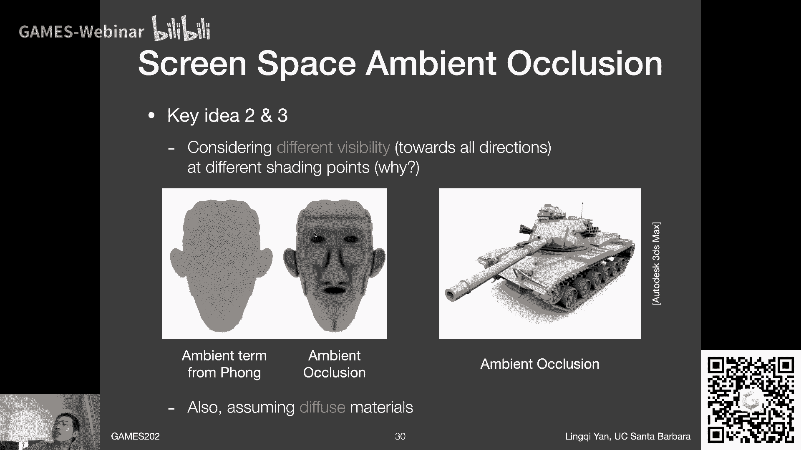

ao是什么啊，这么个意思好，那么a o呢，这到底是个怎么回事，所以咱们刚才已经说了对吧，然后给你任何一个shading point，比如说大家看左边这幅图，给你任何一个事情况，你往四面八方去看诶。

他不见得都能接收到间接光照，他如果被一些东西挡住了，他就接不到，但如果说没被挡住，它就能接到，他是这么理解哈，那么从这个点来看哦，它这往左边这三根啊，这是接收不到间接光照，右边都可以啊。

然后对于这个来说呢，大家可以看到这类似于这个瓶子内部，还可以这么理解，那他基本上往所有方向都会被遮遮挡住，只有这些方向能出去，那也就是说在这一点他不就该黑一点，是不是，然后在这一点是不是就该亮一点。

但道理是非常明确的，对不对，然后呢我们这门课我更愿意把它说的深一点哈。

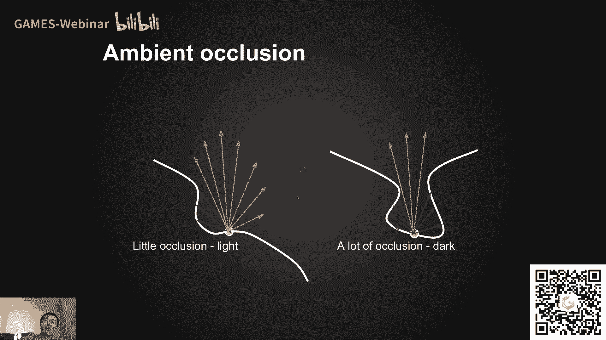

咱们把这个呃它背后的这么一个理论给说清楚，为什么我说它是对全局光照的一个近似呢，那不管怎么样，所有的这些理论，他都是要从rendering equation开始的对吧。

rendering equation没有任何问题，然后呃大家还是看到光照b2 d f可见性啊，对吧，这么三项，然后呢这里呃我们还是考虑什么呢，还是考虑之前一个，大家已经非常熟悉了的一个近似。

这个近似我们之前管它叫做a real time rendering呃，approximation或者叫real time rendering equation哈，这是我们这门课程，我们管他这么叫吧好吧。

就是把呃一个product integral，中间的某一项给拆出去嘛，大家还记得吗对吧，f x g x乘起来积分，我把fx的积分拿出去，并且呢除以一个空的积分做归一化，这就是呃这个正常的一个一个思路哈。

另外我说一句呃，这概念不存在，还是咱们这门课上，这是我起的名字，the real time rendering equation，没有这个概念，然后客场咱们当黑话用，大家知道我说什么就行了。

正式场合别这么说啊，这没这事，ok行，那么我这里要干什么来着对吧，我这里不是相当于是我要考虑任何一点的，visibility嘛是吧，然后那没关系啊，就是说我对于running equation。

那它这么复杂对吧，lighting b r d f visibility，我把visibility给拆出去就好了对吧，然后visibility拆出去怎么拆呢对吧，visibility啊，拿出去之后。

这这中间剩下的东西是这个对吧，然后visibility自己的积分除以一个空的积分，那直接应用刚才的这么一个哈，呃这这样一个呃进四嘛对吧，这是没问题的，我把facsibility拆出去，拆出去了之后呢。

嗯然后我就会发现哦，拆成两项，那左边这一项大家可以看到是什么呢对吧，visibility拆出去，上面这积分我不知道，上面这积分我不知道，可是下面这积分我再清楚不过了哈，下面这个积分没积分任何东西。

然后积分整个半球啊，半球对于cosn积分cos theta，然后对于对于立体角整个积分起来结果是什么，结果是派啊，然后呃这怎么做啊，如果同学忘了微积分的话。

你把这个立体角拆成sin theta d c a d fi对嘛，然后你再对c a和f分别积分，然后你就积分出来，结果是派啊，没问题，下面是一个定值派，然后这里呢就是呃在在这个ao这个领域。

人们管它起了个名字，就叫做ka啊，这ka是一项嗯，这一项呢大家可以看到就是就是什么呢，就相当于是在任何一个点，我往四面八方看过去，我看到的visibility的一种加权平均的一个值。

是按cos加权平均的对吧，然后可以这么理解哈，我从任何一个shading point，我往四面八方去看我，我别的都不管我，我不管什么lt不管是b2 d f我就看visibility呃。

然后我就我就发现哦，这就是我的一个平均的visibility，没问题，从0~1啊，值是非常非常明确的，从0~1k然后呢呃我我们再看另外一项，那拆出来另外一项什么东西啊，另外一项太简单了。

为什么另外一项这个积分里面积分的是谁呢，间接光照的这输入间，也就是这个间接光照的强度吧，redis对吧，readings，我我们刚才才假设呃是常数对吧，这是常数，那跟不同方向没关系，跟跟点都没关系。

其实就是相当于是是一个数，l i in in direct direct对吧，它是一个数，然后b r d f呢我又假设了，还有这个物体是defuse，也是个常数，好了好了，那那就那就太简单了对吧。

然后这两个是常数，然后我就知道哦，这个结果就应该是这两个常数呃，对于diffuse大家还记得吗，defb 2 d f是一个lbl除以派啊，这个除以派什么乘以派的这个事情搞清楚啊，然后呃还是一样。

积分本身会产生一个派派和派消掉，那最后这个结果就是呃所谓呃albedo diffuse，albedo，然后乘以它的这个呃间接光照的这么一个强度，当然这个间接光照强度你也不知道多少，你随便指定一个对吧。

然后关于这个呃嗯就是所谓diffuse物体呢，它的嗯他的lb do到底应该是多少，你也可以随便指定一个，所以也就是说这右边这一项基本就是，你随便定一个颜色就好了，没问题吧。

这是工业界也不是常常这么做了对吧，那也就是说关键的就是前面这一项，所谓ka这一项啊这个意思，然后呃ok那基本上来说就是这么一个意思了，也就是说一个常数乘上一个你所谓的平均，visibility。

这就是你能够得到的间接光照，然后在这一个点，那它的值到底是多少啊，多少啊，然后这就是呃他背后的这么一个理论，然后呢我这里说清楚，就是这里讲的是讲的深了一点啊，这是这是因为呃就反正我是这么发现的哈。

在所有的这些资料里面，对就是单讲r t r4 ，这本书里面关于ao讲的极其的混乱，非常混乱，各种各样，因为因为工作太多了，然后前后有很多这个就感觉对不上的东西啊，然后我是觉得呃。

就是说呃直接从rune question来推导，这是最对的一个做法好吗，然后所以说ao是什么，ao就是说一个平均的尾巴不得乘上任何一项，你给的数就行了，就就就这么回事啊，然后这里呢既然说的深入一点。

我们就再再说的更那个一点哈，就是说我们刚才已经提到了，说呃从一个通用的角度上来说啊，我把一个product integral，然后我把它给拆除其中一项来，并且除以空的积分，这是为了做归一化。

我们其实可以这么认为哈，认为什么呢，刚才我们已经用了就是平均的visibility，刚才才说对吧，那这里呢我就认为说我把f从这个f乘g积分，里面拆出来，其实就是呃要求一个这个f在g的support。

就g的覆盖范围上，这个f的平均值是多少，我把它拿出来就好了，没问题吧，然后所以说呢嗯大家就可以看到，看到这么一个事情啊，就是说呃这里就更简单了，大家可以甚至把咱们刚才之前的这些呃，这个理解这个给忘掉。

咱们就理解成诶给你一个product integral，你就把其中一项它在这个范围内，在它覆盖的范围内，它的平均值拿出来就可以了，没有任何问题，ok那么为什么它就是平均呀，大家可以看到之后，我们会说啊。

这里不是特别多说，嗯这这这里嗯就简单说一句，就是所谓加权和除以权衡，这是是标标准准的加权平均的做法，然后这里只不过是一个连续的写法，大家如果把它写成积分啊，写成求和的话，fx乘以w x对吧。

除以除以这个下面的这个对w x求和，那其实标标准准的就是一个求平均啊，并且让他值不至于发生一个呃，范围上的一个变化，比如说之前我们说visibility不是0~1吗，那你在一个范围内求平均之后。

他肯定还是0~1，这就是咱们刚才为什么这底下有个除以派啊，没问题啊，就ka项肯定是0~1，那行吧，没问题，这里就是我想得到一个呃，就是呃更理论上一个总结啊，fx这里你其实就是把fx拿出来。

拿出来的是什么，拿出来的就是在g的覆盖范围上，这个fx的平均值ok行，那没问题，那同样呃呃对了，说起来就是你这样拿出来什么时候是准确的哈，就是咱们之前不是说过吗，一个呢它的覆盖范围比较小。

support的小，另外一个呢它比较smooth对吧，这时候是准的，那么其实对于ambient clusion来说，这是百分之百准的，这gx是什么gx，不是说诶诶诶间接光照乘以b r d f吗。

间接光照乘以b r d f，它不就是它不就是一个常数吗，就是js常数的情况下，这个这样做是百分之百准的，也就是说ambient clusion，在这里这样一个拆分是没问题的啊，没问题。

就是你假设了diffuse，假设了这个啊，incident啊，呃间接光照呃都是常数的情况下，a o这么拆分是准确的，拆分没问题，不是个近似，ok好，那么啊这反正就是说把它说的严谨一点。

那么第二个事情我要说的更更呃，复杂一点的理解诶，这个理解就是我我非常想分享给大家哈，然后这可能要稍微更难一点，那么呃是这么一个事情啊，大家注意到什么了呢，注意到我们刚才不是做这个拆分吗。

注意注意这个拆分我是不是用的不对，哎呦同难道没有同学指出这么一个问题吗，对不对，我这我这嗯大家看哈，之前之前我这积分呃，我不是说哎fx乘以x然后对dx积分对吧，然后我我我就把fx减x拆开，都是对dx。

看见没，都是对dx积分诶，那我这里面大家可以看到我这积分是呃，对d我们一个i积分，我把v拆出来之后，我为什么不是上面是对v在d欧米伽i上积分，然后下面对于一个空的东西，在d欧米伽i上面积分。

但是现在大家发现，我是对cosin theta乘以d我ei，你会发现我我就好像红框框起来，这块是个d什么什么什么什么东西一样，是这么做的，嘿那我这样做能对吗对吧，我应该把这两个cos项这两个都给划掉啊。

就是就是拆出来的这一项，这两个cos都划掉才是我们之前的这个用法对吧，那所以说这就这这这这这是一个，我很想问大家怎么解释的一个问题哈，这样我解释给大家听一下这个意思啊，啊这么做啊，然后就是说呃。

我们为什么真正能够把那个cos想也给和这个d，我们一个i一这一块拆出来，这个时候呢我们要引入一个概念，叫做呃投影了的立体角，你听着名字麻烦啊，这这一点不麻烦，我们之前说立体角是什么来着。

立体角不就是在单位球上一个面积对吧，单位球上的一个面积，这就是这就是立体角，然后这个面积我又乘上了一个cos theta，这theta啊，大家记得球面坐标下theta的开始是北极。

从北极旋转到南极是0~180度啊，这是theta，然后就是说那我这个立体角，也就是这么一块面积乘以cos theta是什么呢，哎大家会发现正好就是啊这个这么一个面积，也就是说把这个面积啊。

从之前的这个球上给投影到了一个单位圆上，ok投影到底下一个圆上，这就是这么一个东西，也就是说cos c塔乘以d，我们伽i它是有明确的一个定义的，它其实就是一个呃微分的一个面积。

只不过它是在单位圆上的一个面积o这样说，ok所以说呃这样的话呢，我们就把刚才那个积分啊给理解成是哦，我就对呃，这是前面那几项l b2 d f v，然后在什么上面的积分呢，嗯在一个单位圆上面做一个积分。

ok然后这样的话呢我原本是连着cos theta，然后我在一个立体角上积分，然后现在就变成了不带cos theta，但是是在这个呃在一个project的立体角上积分，然后我总共呃。

呃这样同时也会告诉你这样一个事情对吧，同时告诉你，如果我做一个空积分，就是我积分对cosc的id，我们那个，积分出来结果是该是什么呢，它的物理意义是一个小的一个微元的物理，物理意义是单位圆上的一个面积。

那你总共积分出来就是单位圆的面积，单位圆面积多少派乘以一的平方派，没错吧，ok这就是呃也解释了，说刚才为什么cos积出来是呃基数还是派啊，ok那咱们回到刚才那页上的，哎咱们稍等哈，点错了。

ok啊那么在这里大家就会明白了，ok我为什么可以把cos连着一块，是因为cos c的id，我们这块就可以把它当成一个d，什么什么什么什么，ok那么我刚才积分那个公式。

那自然就是l乘以b2 d f再乘以一个v，那么我自然就可以把v给拆出来啊，这么一个事情说的非常的深啊，然后如果这块你不明白的话，很可能是因为你之前微积分忘了而已哈，没什么特别难的啊。

这个事情另外一个呢我跟大家分享一个事情，什么呢，我这块写的不对啊，这块这块儿啊什么的，就是大家看到这个呃微分某个什么东西，就是通常大家在积分式里面呃，会写了一个d什么东西哈，这里很呃，我明确跟大家说。

直接敲一个d这个字符在ltp里面是不对的，他会给你一个斜体字的d啊，这不是微积分里面用到那个地呃，微积分里面用了一个d，它是不写体的，大家可以看到对于任何正规的印刷，你都可以注意到这么一个事情。

那么他应该怎么写呢，应该写作杠max 2 m，然后里面写一个d啊，这意思非常小的细节来听课学个tag啊，哈哈ok行啊，然后就是说就是说杠max 2 m这个命令，然后里面再写d。

并且在之前最好有一个小空格，小空格是什么，杠逗号最小的一个空格，也就是平常写d的时候应该是杠逗号刚max 2 m，然后里面再写d一个非常严谨的写法啊行吧，然后有同学问几个事情哈，嗯说是哦还是一样。

就是我之前说这个拆分操作的时候，说哪篇论文有参考，没有论文有参考，这是这是基本上来说，是一个挺约定俗成的一件事情，而且你自己推一下也是对的嘛，这块没有什么，就专门提出这么一种拆分方法的一个paper。

然后刚才说的就是换元没问题啊，然后有同学说f和f和什么也得是这个单位，圆面积函数，这是呃不对吧，同学这个就这样哈，没关系哈，就反正就是说就是说这里之后再加深理解吧，就是目前我就先说到这儿哈。

整个这个框起来这东西它等于一个d呃，project soliango就ok了，好吧没问题行啊，这样咱们刚才说了是吧，嗯直接过吧，好然后咱们刚才说完这么复杂的情况，我们再回到一个呃简单的一个情况什么呢。

就是说s s a o远远没那么复杂哈，我们刚才是故意把他们给说的这么复杂，让让大家理解一下，这更多一点知识是这么回事啊，就是说其实它是非常简单的一件事情，然后就首先呢我认为呃。

如果我可以假设这种间接光照，我不是不知道吗，我假设的常数对吧，然后呃然后嗯那物体，物体的b2 d f也都是defuse，那好像也是个常数，那么这个间接光照b2 d f都是常数了。

那么我我既然知道这两项都是常数，干嘛不直接把它给从rendering equation里面拿出来，拿出来，完了这就结束了，已经结束了，大家大家可以看到什么呢，就是我不是要算间接光照。

最后结果是多少呢对吧，然后我知道这间接光照的来源，然后是个常数，拿出来了，拿到积分外面了，然后呢b r d f是defuse，拿到积分外面了，剩下来什么呢，对visibility cosn的一个积分。

只不过呢为什么我们一开始不这么说，是这样的，咱们把这个说清楚，就是说这一项并不是就这项积分还剩下来的，并不是visibility项的一个加权的平均，因为它缺了一个底下的归一化的这么一个常数。

然后如果我们这样说的话，大家就会不明白说，为什么工业界上一定要引入一个ka那么一项，也就是一个呃，就是这底下要除以一个派那么一个东西，当然我们从这一步也可以继续推对吧，这个式子我出一个派。

我外面再乘以一个派，不过为什么呢对吧，那这样不就理解不到了嘛对吧，那但是不管怎么样，还是两个得到结果是一样的，不过有一点我说清楚是这个意思，我我是完完全全不知道，为什么各种各样的书籍啊，资料里面。

为什么大家要要要推这个所谓，radiance这么一个概念，毫无必要啊，然后我到现在仍然是这么坚持，认为毫无必要去引入radiance的概念，如果大家去看ao的一些资料，推出来什么e等于什么什么什么东西。

完全没必要，因为你最后看到的就是radiance嘛，你要这个radiance干嘛呀，然后这样的话大家就会看到退役的时候，大家就会多出一个pad，大家就会觉得这个事情非常非常麻烦，就是说他其实非常容易。

就是说我说了，如果说不是为了之前，我们来理解为什么visibility项平均的话，我们就直接这么推就行了，这根本不是什么推导嘛，rendering equation，我直接把两项常数拿出来了。

就那么多少对吗，这不就是ambient flusion吗，对吧，然后这就是这就是我说嗯，咱们这节课反正独特的一个推导吧，然后就是说希望这样能够好理解一些好吧。

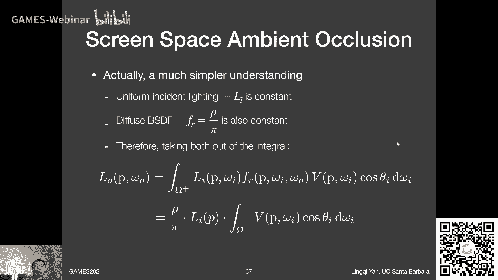

然后呢这个时候呃我们想一想缺哪一个事儿，就是咱们刚才做了这个推导之后，推出来之后，但是我说我只需要知道平均的visibility对吧，加权平均的visibility是什么诶，可是我怎么算呢对吧。

这个事情我不知道对吧，怎么算呢，那如果是在世界坐标里面，在世界坐标里面啊，那不就是整个世界空间里面啊，那我可以做reprising嘛，对吧，没问题，最简单的办法就是往四面八方，我真正就是踹死各种光脉。

然后我把他们visibility加权平均起来呗，对吧，那么就是说我们在screen space上怎么做，这才是关键对吧，ao的理论现在有了，现在我就要解任何一个shading point。

我往四面八方的去看对吧，然后就是在整个他的上半球上去看，有多少方向是挡住的，有多少不是挡住的，这怎么做，特别是在屏幕空间对吧，那行，这就是我们现在要渐渐的从ao要转向s s，这块到底在干什么。

这么一个哨上好吧，那么他在干什么呢，就是说啊嗯这么做就是就是人们聪明的地方哈，就是从这里开始，基本就是纯工业界哈哈，大家会开始又要听到各种各样骇客了，然后什么呢。

我不是要要判定说我任何一个shading point，我往任何方向去踹死，然后又有多少方向被挡住吗，但实际上我们这么说不准不准啊，为什么呢，因为大家这样想哈，我给大家举一个非常极端的一个例子。

我我给一个封闭的屋子，好给你一个封闭的一个屋子，那么我在任何一个shading point，我往任何方向去踹死，我不管打到不打到周围的物体，我无论如何，最后这光线出不去这屋子对吧。

也就是说我这光线往任何一个方向，肯定最后都得被遮挡住对吗，那这样会造成一个什么问题，造成说我这样得出来ambient的葫芦症告诉我，到处都是零，是不是这个意思，这这这不出事吗，这是为什么呢。

大家可以想象一下这个事情，反射光通常都是会从会，从不是，通常一定都是会从有限的距离里面反射过来的，我肯定不能说我去用一个无限的距离去算，我踹死无限距离能不能踹到一个物体对吧。

我反正我肯定都是从某个距离里面来的，然后所以呢正常人们会限制说，我要考虑在一定的范围里面，在一定的范围里面，我我去踹死这个光线，就往前走多远，这么一个范围里面有没有遮挡，那就够了，否则我只要走无限远。

那不肯定是那个，那我肯定是要呃就一定会被挡住嘛对吧，那我限制一个范围之后，那我就不一定了，我就考虑哦这个范围内到底有没有遮挡物，那这样的话就解决了刚才的这个呃，就所有光线都最终会被挡住这么一个问题。

但是但是这样会造成一个什么问题，这样会造成说真正来源于，比你考虑这么一个范围要更远的这种间接光照，你就把它给忽略了，你就不要了对吧，大家又看到了trade off，是不是这个意思，你限制这范围大了。

那所有东西都要被挡，最后肯定要被挡，你要限制这范围小了的话，那那那就自然而然有一部分这个呃，过来的这个这些这些嗯，就是incident的这些间接光照，你就等于是把它忽略掉了对吧。

那虽然在这个a o的环境下，你认为反正都是都是一样的呃，然后然后我们后面再说吧，后面再说，在更精准的这个范围内，你这样想就不对了，就总之就是说呢，你你限制某一个实际的这个范围呃。

它其实这是一个trade off啊，通常人们就会选一个某种范围，ok那行，那就是说给你任何一个shading point，你要考虑啊，往他的上半球各个不同的方向去踹死，并且不能踹死太远。

踹死一个最大的一个半径r，这样来说好吧，然后大家可以看到，那如果画在平面上，那就是这个范围往外出去一个半圆对吧，然后这个半圆内只要不同的方向有遮挡呃，那那就会呃我就知道这个方向的visibility呃。

零其他方向visibility 1，我最后就可以平均起来啊，没问题吧，然后呢，那我这里呃对于这样一种比较凹的一个物体啊，大家看到这个底底部，那我同样诶我考虑一个半圆，然后一定的范围。

然后我往这些不同方向去看，哪些方向能够看到呢，哦这些方向可以两边看不到啊，那也就说没问题好吧，那呃screen space a o，他其实不是这么做，他做了一个非常聪明的一个做法，什么呢。

就是说他并没有从任何一个点往四面八方去，trace光线，因为这个事情你不好做对吧，因为你screen space嘛，你知道的就只有你这个屏幕这个上面这些信息，你要做retracing。

这不是非常麻烦的一件事情吗，那他做了一个超级大胆的一个假设哈，同学们是这个意思，任何一个shading point，他都往他的周围一个半径r的球里面，然后我就采样很多的点球的内部哈。

咱们说清楚它并不指采样方向，大家知道要采样方向，我就只用球的这些呃，这球面上的不同的点就可以了对吧，他是在这个球里面，然后整个球覆盖的体积内随机砸一些点，ok随机撒一些点。

然后判断说他撒的这些点到底能不能被你，这这就是shading point啊，直接看到，那当然这是第一步，第一步，第二步，你你你仍然还是想，你仍然还是想判断说，哪些点到底能被我是云朋友看到。

而不至于被挡住对吗，就比如说你看这个点红点，他这是在物体内部的对吧，在物体内部那肯定看不着的对吧，然后这些绿点它在这些这些物体外部，那肯定这些点都能够看得到，对不对，然后同样道理这边也是一样。

那么即便如此，我仍然不好判断这么一个事情，就是说诶我我撒的这么些点，到底哪些点在物体内部，哪些点在物体外部呢，那这个时候他又做了第二个假设什么呢，还是这样想的。

就是说我screen space知道的信息太少了呀，但是screen space呢，我从camera，显然我无论如何可以知道我看到的任何一个点，它的深度是多少对吗，也就是说我会有一个深度图。

然后在深度图上，咱们之前在讲shadow map的时候，我们就提到这么一个概念，深度图是可以当做一个这个场景的一种，几何的简单近似的对吧，就相当于是我可以认为我从我camera往这个方向看。

大家看到这是看的方向，我从我camera往场景方向看，我看到的这些物体的这些表面，不都被记录成各种不同深度了嘛，也就看到了最浅的深度对吧，我都会记录下来，也就是说我看到的就是这么一条线啊。

从这里大家看到诶，我的鼠标在移动啊，这就是离你camera最近的，离你camera最近的这么1111些深度对吧，那这些深度就可以当做一个诶物体呃，是在物体里面还是在物体外面的一个简单呃，判断怎么判断呢。

很简单，跟之前shadow map一模一样哈，你你不是在一个球内部撒了那么些点吗，这些点你可以投影到camera吧，没问题吧，然后投影到camera的位置上，你可以找他之前记录的深度是多少，大。

这也没问题，你知道之前记录深度是多少，如果我的深度更深的话，那不就是在物体内部就被挡住了吗，哎然后就这种情况下就就会认为哦，那我我在shading point，我就肯定看不到物体内部啊，对不对。

然后我肯定看不到这个点，这个点就得是红的，然后呃然后这个其他这些点呢，看这个绿点，这个绿点投影到呃，比如说camera的时候，同学到camera的时候呢，大家会发现哦。

camera记录之前最想吃的都在这，那这个绿点它一定在物体外部，在物体外部呢我这个神经框架就能看到的啊，这么个意思，ok然后但是这样做呢，就是说大家可以看到这么两个假设一座，那基本都是成的哈。

基本都是成的，大家可以看到呃，这这这这三个这个例子里面，好像这些所有的点都ok了，只有一个点有问题，哪个点对吧，这个其实是鼠标已经停止了对吧，唉哪个点这么做会出现判断失误的情况就不对。

就是说你看哈这个点呃，为什么把它标成红的呢，是因为我从camera看过去，我看到的最浅深度在这里，然后这个点在他背后，在他背后，我就认为说哦在在他背后呢，这个点应该在物体内部吧，结果结果发现不对。

结果发现这个几何在这个地方拐了个弯，大家发现这个事情看见没，在这在这边有一个尖，这几何在这拐了个弯儿，但是呢你的深度如何能知道有这么个东西啊，不知道对吧，然后就是说你进入深度不是最浅的深度吗。

它的存在你是根本不知道的，所以像这种情况下，你还是认为这个点他是在物体内部，因为它的深度要比你之前记录的深度，要要要深嘛，然后你就会认为这点在这个shading point的时候，看不到的。

实则是能看到的，是不是这意思，然后就是说这点会出现问题，但是这是工业界吧对吧，没问题，就这一点点出问题的话还好啊，能接受，ok啊，这么个意思，那么另外一点什么呢，就是说咱们刚才不是说了吗。

你要判断invisibility往四面八方去，那不是得是法线所在的那半边嘛，咱们之前说render equation一直都是这么说的对吧，你是法线所在的那半边，你你应该做这个判断。

你另外半球你判断这个干嘛，就是这么个意思哈对吧，然后就是就是说，就是说你要是一个光线从物体底下打进来，这种情况不可能有贡献的嘛对吧，然后我们说考虑visibility都是半球。

我们整个的render equation，所有积分范围全部都是半球，你先把它拿到一个整球，当然整球是出现什么问题对吧，然后就是说我判断这些点，就是说你看比如说这个点，假如他反向是向下的。

那只有下面这半半球是有用的吗，我应该判断这半球，我发现他呃所有的地方都能看见，所以它的ao的值应该是零啊，不就是说最后没有任何的方向能够挡住他，我就想说这个意思对吧，就是就是就是这么个意思。

那我我这后面这这半个球的点，根本一点用也没有嘛，没错，这这是完全正确的想法，这个为什么他这么做，是因为在这个呃ao那个时代，你还不能假设说我camera ra呃，我我camera这边看向整个场景。

我渲染出来的又有深度，又有normal这么个意思，我认为深度我可以认为有任我，我不见得说我渲染出来任何一个点的法线方向，我都可以知道是这个意思，那你不知道法线方向怎么办，ok你不知道反向方向。

你不知道哪半球该去该去考虑对吧，那是不是出事了吗，那所以说他就考虑整个球，那考虑整个球的话，那很简单，这么考虑，正常情况下，如果你真的有一个平面，真真的有一个平面，那必然得是一半肯定看不着对吧。

你有一半肯定是看不着，直接在平面底下，然后有有有另外一半，那那你能看得着，那对于任何的一种几何，他做这么一种假设，说你在里面撒的，那么整个全球里面那么些点，这些点里面当只有当你看不着的那那些点。

也就是红点的个数过半的情况下，你才开始考虑ao问题，这个没问题吧，你想想一想是不是这么个道理，就是就是说像这种情况下，这个红点他他根本就站不全半球嘛对吧，也就是说也就是说像这种情况下。

他是绝对不可能发生ao的嘛，这个意思，然后就是说当你的红点个数过半的情况下，你才会认为说哦，就是说我我肯定是可见的那半球呃，也会出现一些ambient collusion，才会让红脸过班的嘛。

这样想对吧，那么红点过半过了多少，就比如说像这种情况，就是两个过半，然后这边呃呃还有三个绿点，那自然就是40%的是不可见的，60%是可见的啊，这么个意思好吧，然后他最后求出来的visibility。

就是就是用这半球来算这么个意思啊，右边同样道理，大家可以看到过半的红点，这点就不算了吧，右边只有三个过呃，过半的这么呃这些红点哦，哦哦不是是算个数啊，算个数，就是说这里12345678多少。

90 十个点啊，十个点，然后红点过半呃，也就是说考虑超过一半的这些数量，也就是说红点现在总共九个，你要减去五个，剩下的四个啊，你要考虑四个，对没错，考虑四个点都是表示这些方向会被挡住，然后有一个点呃。

这个方向没被挡住，那于是你最后得到visibility的值，那自然就是20%啊，这么个意思啊，呃ok这么一种做法，就是说你可以不知道法线，你也可以知道说我这半球上的这些呃。

那么平均的visibility，另外大家已经听出来了，这这这嗯这么考虑的话，是没有考虑什么呢，没有考虑cos对吧，你没有这个法线的信息，你也不知道这cos应该怎么加权。

于是呢你先算出来的算是一个近似的呃，往往半球上不同方向的visibility的一个平均，而不是visibility和b2 ，和这个call 3项的加权平均啊，这个意思，但是还是一样，工业界方法嘛。

对不对，你没有发现的情况下，你就只能做到这么好咯对吧，唉以及这这里就是在说我们刚才说的这个点，它会被呃误认为硕士在物体内部没关系啊，o好，那这样一来呢就会大家可以看到啊，没有s s a o的情况下。

和有s s a o的情况下的一个对比，当然这幅图呢并不是为了说明这个问题，这幅图是为了说明s s a o有什么有什么呃，就是坏的问题，大家可以看到这是一个地面，地面上有个石凳，挺矮的石凳。

像是在地铁站经常能见到那种东西啊，然后这种情况下，这个石凳和这个物体根本不应该能接触对吧，和和这个地面不应该能接受对吧，也就是说这个地方他怎么会有ambient，exclusion呢。

这就是你s s a o出现的问题，因为你s s o a s s a o啊，在做这么一个事儿，比如说我鼠标现在在地板上，在地板上，你取它周围3d空间中一个球，然后呢，它某一个方向它投影到这个呃某一个点哈。

投影到camera，你会找到这么一个石凳，这物体你会发现哦，之前记录的这不是石凳吗，也就是说啊这个背后这肯定是那个点，肯定是要被挡住的对吧，然后这不就刚才说的那个问题吗。

就是说这里他会认为你在camera上，你只能看到这么面背后这些东西它到底能挡住，挡不住，他就认为这个面它的深度会比较低，所以背后的这些点全部都得是红顶，是这么个意思。

于是就会错误地认为这个石凳会对这一点，对这个d上的a o会有贡献，所以就会出现一些所谓false econclusion，就会出现一些这种不不不自然的a o，就不该有的哈，这个意思。

ok那就是说这种情况是他的一个问题，然后呢我们把这块ao给说完，好像今天没时间说d o了哈，但是ao说完没问题，然后就是说嗯呃这样哈，就是说还有一个事情。

就是说咱们不是在任何一个shading point，他周围的一个整个球3d空间啊，3d空间这个球周围我去呃，追求周围啊，求内部选很多sample嘛，那么选多少对吧，还是一样。

这个问题跟之前pcs s是一模一样的，就是说呃p c s s里面呃，我涉及到我一个学shing point上，然后我要考虑多大范围，这个范围内我采多少sample，咱们作业都已经做了。

知道是什么情况对吧，越多散步越好嘛，但是我要是说想希望有一个好的速度，是不是不能用太多的sample呀对吧，那怎么办呢，那没关系，我还是一样用少量的sample。

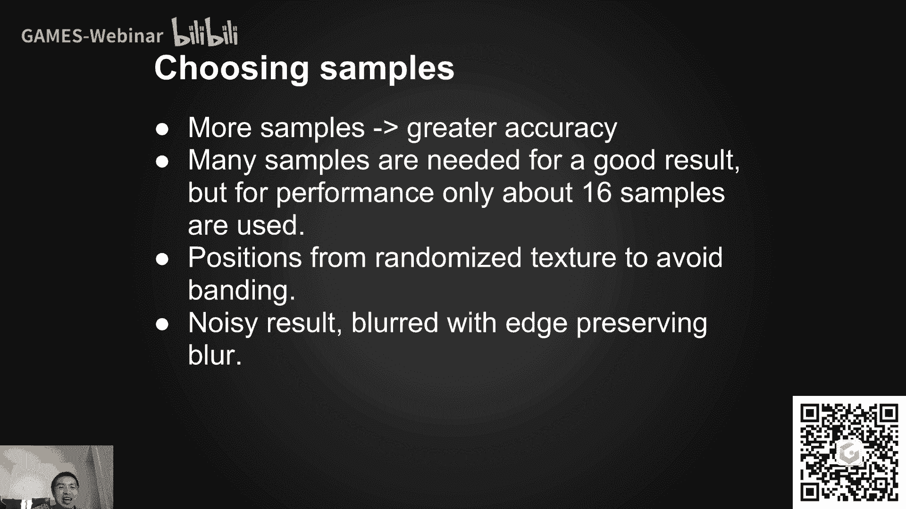

然后我先得到一张noisy，这个ao的一个结果对吧，大家看这个ao效果就非常不错了对吧，然后得到a o的一个结果之后，然后我再做一遍dnoisy，然后我把这个呃把他的ao给糊掉。

正常情况ao你很很很少单独看他对吧，你都是把它给加在其他一些直接光照啊，然后一些其他的一些什么东西上面加在这上面，然后你会得到一个呃，就是看起来基本上像这里啊，你做了the noise之后。

你还看到有一点noise，但其实你加到其他东西上面按就差不多了啊，基本上这么一个思路，ok然后呢是是这样的，就是说啊有同学正好提到了，说这法线方向我我是怎么样得到哈，没问题。

你当然可以通过采样相邻的这个text深度。

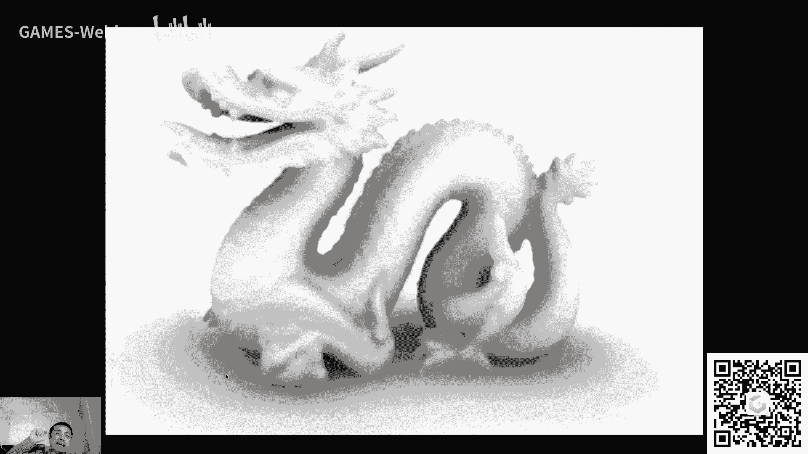

来近似一个法线方向，但是更多情况下，现代的这个图形学里面，怎么可能说你去渲染这个呃，camera这么一个一个这个整个一个场景哈，你还得不到任何一点的反而限制，开玩笑，现在假设说都有，那么有发现的情况下。

你是不是就不需要像s s a o，做那么近似的一个东西了，是不是，那那你就可以做的相对准确一点咯，你有法线，你就知道哪半球，你应该去采样，是不是这个意思，然后就是说你还是可以用之前s a o的方法。

在这个半球内去选一些，选一些点，然后你有发现知道半球的话，那你直接就可以算他们对应的，红点和蓝点的比例了，我已经忘了哈，就是反正就是说呃就是说这些visibility。

它它的一个可见的visibility一个平均嘛，就是这个意思，然后用这种方法诶，那效果就就肯定就会比你认为没有发现，你考虑整个球要准了，而且啊有发现你就可以对呃，对这叫什么。

对不同的方向你其实就可以做加权了对吧，我们不是说呃站在这个shin point上，往四面八方去看，看到的visibility，还要通过cos加权一下嘛，cos呢肯定是靠近法线之大，靠近两边只小对吧。

然后在这里你知道法线了，那你就可以对不同的方向进行加权咯。

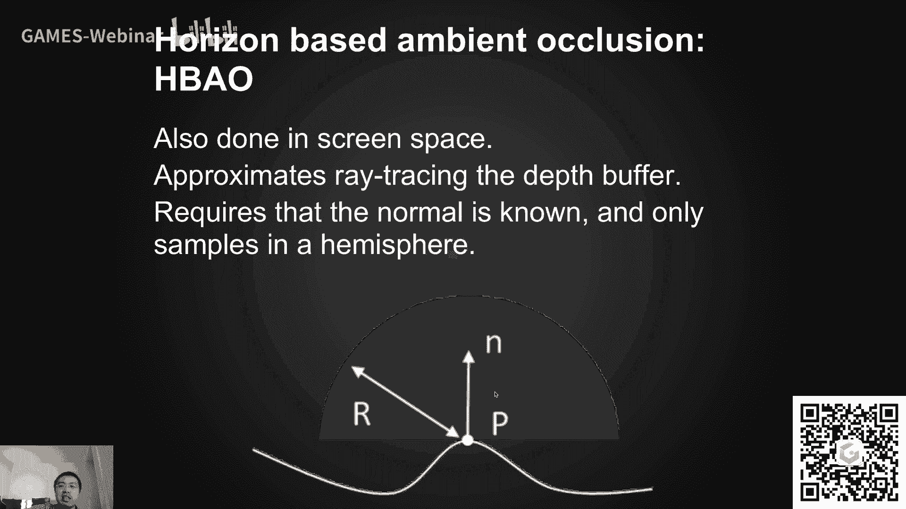

那你可能可以得到一个更准的一个值，对不对，那么这些大家可以看到说这是最后的一个结果，就是如果什么都没有这么一个地铁站，然后它是长这样的，那么如果有s s a o啊，大家想一想，如果有s s a o。

应该在哪些地方会比较看的明显对吧，就咱们下一张就是啊，下一张图就是，但是我想着同学们应该已经可以猜到了对吧，接触部分吧，比如说像这种拐角对吧，像像这些地方，咱们现在就假设把呃，还有这柱子底下和地面对吧。

这些地方都应该有接触阴影，然后这些地方呢就是说呃我们把鼠标停在这儿，然后我们切换成有s s a o a，这也可以看到哦，这里确实是有s s i a o了，这个地方变暗了对吧，这个地方变暗了变暗了对吧。

然后就是就是这么一个情况，那么哪些地方不该变暗了，大家想一想，这个地方不应该变暗对吗，s s a o，咱们刚刚刚刚分析这么一个问题，他经常出现的一个问题就是false exclusion。

就是你明摆着这俩物体离挺远的，然后你会认为这个这个靠近camera的物体，会遮挡住这个远处的物体，也就是说像这个地方它不该是黑的对吧，然后那对于h b i o来说，然后关于这块，然后他做的好一些啊。

就是咱们刚才说的那个思路哈，有有发现的这种情况，它叫hbl，大家可以看到这个地方就不再出现这种，非常明显的错误，遮挡这种这种啊，ok然后h b a o还有很多，这里面这些细节我没有说过。

关于这块他是怎么处理的，他是认为说我只考虑在一定范围内，它的遮挡路啊，这么个意思，就是说不再是像之前s s a o那样，认为说我只要这个距离呃小，不管你小多少，然后都会认为它是热挡啊，这里不会。

那这里就不会出现错误错误的这种这种遮挡了，总之呢h b a o为什么会比s s a o要好一些，然后就是因为他真正考虑了他一个比较有，有一定范围，而呃等这么一个半球啊这么一个考虑方式。

而那自然而然得到一些结果就会更准，那么呃这里算是官方圈出来的一些呃，需要看的地方，s s a o这些边缘的地方，很多地方出问题，就是因为你不考虑说它，它呃这depth到底差多远这么一个问题。

然后a h b l o就可以解决掉啊，这么个意思，切回来，这里有错误的遮挡对吧，s s l o，然后这里就没有啊一个道理，那么行，到此为止，s s a o部分差不多了，就然后呃停一下。

看看同学们有什么问题好吧，然后本来今天说s s d o也顺便讲的，但是好像呃没时间再继续，那就留到下一季，反正没多少啊，k h b a o要多存一张normal map，那是肯定的喽，对吧哈哈哈。

没问题，因为你要知道任何一个地方的这个normal，normal呃，减小采样的半径能不能减少false clusion，我想了想，这种既然是ao的话能吧，但是你会造成你整个的ao都会变淡嘛对吧。

就就是说你可以想象一个极端情况，你的半径减少的特别少，减少的特别少，你就说那基本上没什么点，它会呃有a o对吧，你这基本没有ao了，所以你减少减少false collusion的同时。

也在减少一些初额collusion，那不是出事了对吧，所以说啊，一切东西都还是一个很平衡的一个东西对吧，然后嗯ok就是说现代的rendering，真的可以这么假设，没没没有什么问题啊。

现在的实时渲染就很少，你能你能说你认为你的就是camera，这么一个信息，这是说不过去的，ok嗯深度差的阈值，就是说一切这些操作都只能说减轻这个问题，或者可能会引入一些其他的什么问题啊，这么个意思。

就是，所以说关于这些有没有什么诶更好的一些设计，然后这些事就留给大家思考了对吧，就hbo这些东西不是还在一直改进着吗对吧，还有各种各样在h b a o之后的一些呃，呃其他的一些方法在有兴趣的方式的话。

反正这这这直接网上查就可以查到了，最近大家是怎么做的，但是思路还是一样，就是这节课呢，主要就是说把这个理论上给给说的清楚一点，就是到底他想干嘛，他到底怎么会，就是就是他该计算的东西到底是什么。

而不是说他他就就就这么做对吧，s s a o他确实就是那么做的，但是它为什么这个背后这些东西，咱们把它理解清楚好吧，那就是这么个意思的啊，动态的采样半径啊，挺有意思的，我觉得应该可以吧啊ok那行。

那咱们下节课要说什么，下节课要说呃，当然了，咱们先把ssd o给说完，咱们刚才不是说s a o会假设这些，一一就是incident，就入射的间接光照，各个方向都是一样的嘛，事实上不能这么假设了对吧。

s s d o那就是说不这么假设，我真正能够把它呃，呃它的间接光照这块该是多少才是多少，把它算出来好吧，这个意思，然后下节课我们讲s s b o之后。

我们再讲screen space reflection，然后当然在这之后我们再看有没有时间，就开始下一个话题了，就开始这个pb 2这块啊，就是所谓材质这块，然后呢呃s2 这里还是一样，给大家彩蛋一下。

然后screen space reflection，屏幕空间反射或者是屏幕空间关于追踪，但是s s2 大家一提哎，我第一我第一反应想到s s2 ，肯定会想到想到阴阳师的ssr，然后是这么回事。

简单给大家介绍一下，我不是之前说我是严重的网瘾大叔嘛对吧，然后我什么游戏都打的，然后阴阳师我也打的，而且阴阳师我当年呢我这个呃叫什么来着，我当年打的很夸张的，然后然后就是说s2 全收集。

然后打到什么时候弃坑不打了呢，打到当时是间接伤害刚出来，那个时候间接伤害刚出来，然后我组了一个间接伤害反击流的对，然后当时去打斗技，我打到了全服的第11，世界的第19，怎么样截图为证啊。

这些事情是很值得我炫耀的一件事情，而且呢诶呃重点是这个重点是我，我我其实没有氪金啊，完全靠肝啊，另外还有当然这个诶这背后有有空，没事跟大家说一说这个事情跟随机数有关系的，就涉及到抽卡什么东西啊。

就是随机数这个东西呢，它多少都会有一些所谓low discrapes的性质，这个性质可以利用的啊，但不管怎么样啊，我基本上是靠靠干，然后把这些都给都给呃，都给干出来了啊，ss 2啊，然后我想了想哈。

我当时有一个网易的朋友，我我我说我应该不算是零氪，好像是就这30块人民币哈，然后我说我应该算微课，然后我的网易的朋友就就直接给我教育了一顿，说我是说我是完全没有弄明白这个什么是微课。

于是我以后再也不敢说了，我说那我基本上来说是不是就就当是零氪了，好吧，呵呵呵呵呵行吧，然后基本上来说吧，就是说这是当年打阴阳师的时候，然后这算是哦，另外说一下，虽然打这个这个斗技打的挺好。

但是呃我实力没那么强，这是一个瞬间的一个动态的状态啊，是这个意思，就是说到最后我还是调出了100名开外，这个意思ok嗯行吧，嗯然后这就是我之前的这个s2 的故事啊，ok哦另外说一下这个这个阴阳师里。

ssr什么意思啊，是指super super rare对吧，是指稀有度啊，ok啊行吧，那这就是这个今天的内容啊，好呃感谢大家，ok。

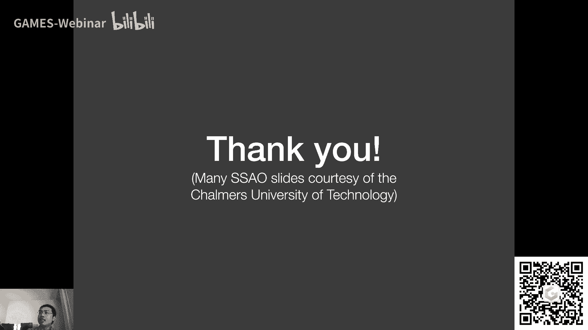

这样哈我要看看是什么问题，好像好像还好诶，ok，ok，好像因为我说这个现在就没什么哦，哦有一个技术性问题，a o作为gi的一种，那工业界常用太常用了太常用了，现在基本上来说都会有一个ao啊。

哦甚至来说你真正算上这个gi，有时候还会有人再加一个a o在上面，然后就为了表示这些物体之间这些接触感啊，这个意思好吧嗯行，那今天就到这儿，然后咱们下节课再继续好吧，ok。

