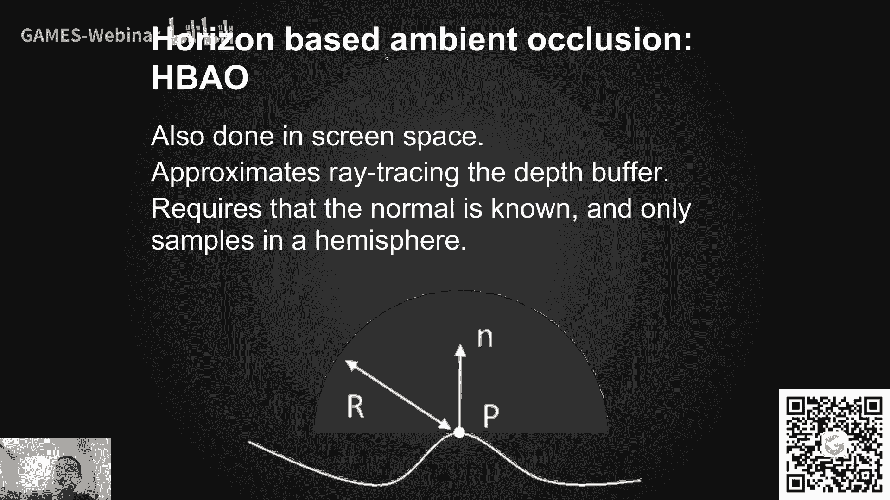
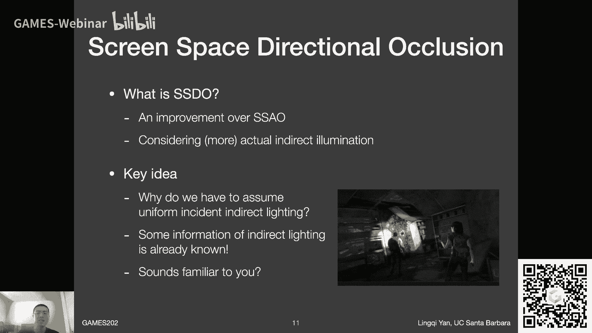
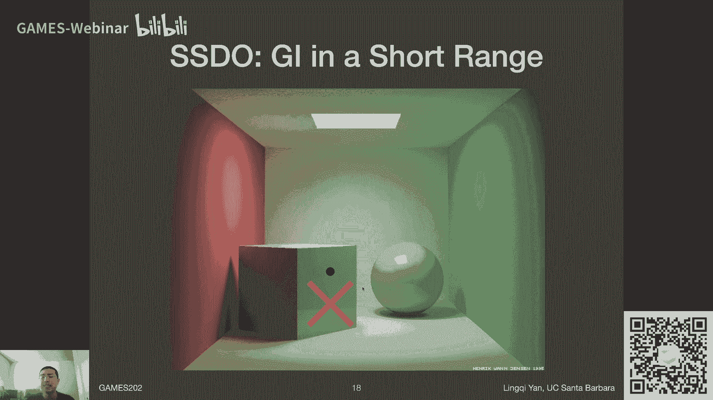
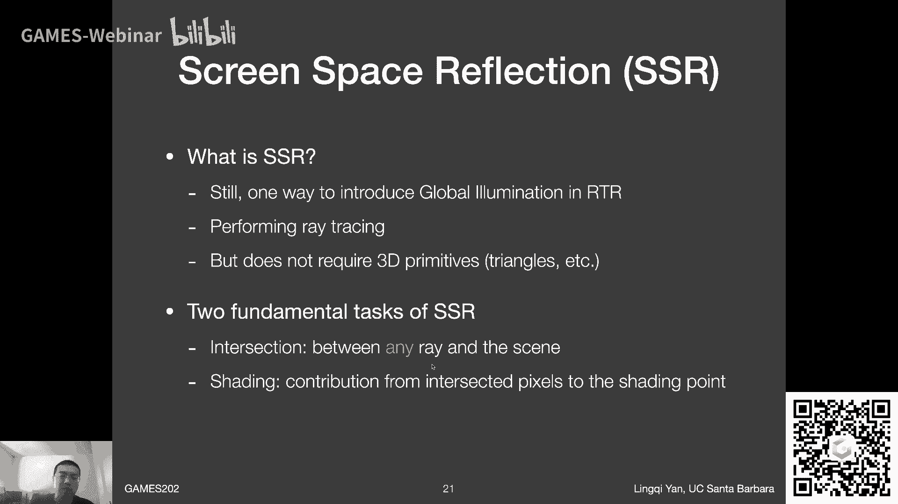
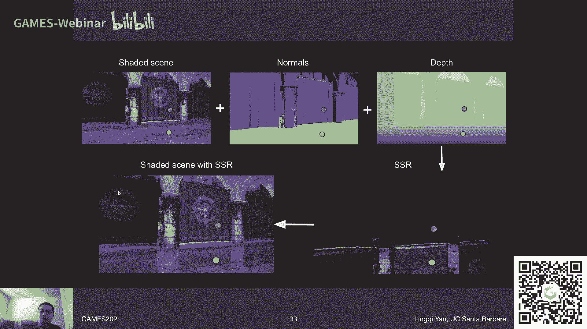
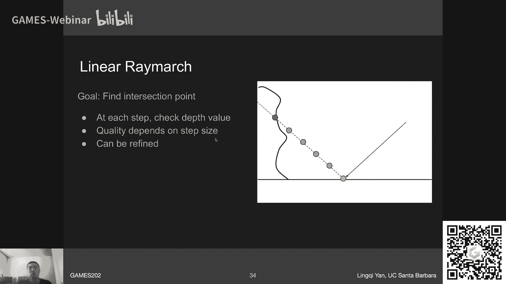
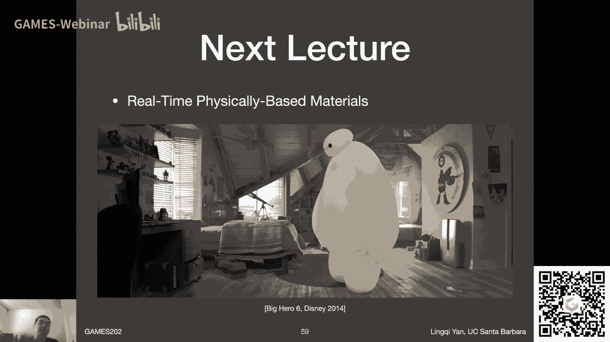

# GAMES202-高质量实时渲染 - P9：Lecture9 Real-time GLobal Illumination (screen space cont.) - GAMES-Webinar - BV1YK4y1T7yY

啊亲爱的同学们，大家好，欢迎来到games 202的第九讲，然后今天呢咱们呃沿着上一讲的话题，把实时的全局光照部分给说完好吧，嗯然后在课程开始之前呢，有个事情先告诉大家，大家现在看到的是录播。

哈哈并不是咱们五一的时候直播的内容，五一的时候嗯不是我忘了录像了，而是因为硬盘满了导致没有录进去啊，有点惨，嗯不过还好吧，不过大家错过了一个非常重大的事件，马上就说这个事，首先无论如何，还是五一快乐啊。

现在还是五一期间，然后呢有一个事情，那就是呃在这节课之后，咱们的课程就已经完成了2/3了，是不是非常快对吧，总共安排了15讲，然后今天是第九讲吧，嗯所以说之后的内容我也希望他能够继续做，好好吧。

嗯然后games 101是这样的，然后我接收到了同学们的各种各样的，这是申请吧，然后我感觉是不够，就是greater的申请，大家不够积极啊，然后这样的话就导致说嗯。

我在想要不要真正的把games那101，算是重新开起来课，就是真正的招募一些助教同学们，然后重新再开始答疑呀，以及重新制作一些作业内容呀，然后呃像这块的内容，所以说啊大家耐心一点吧好吧。

然后就是说我我也想一想看看到底要怎么办，给我点时间好吧，那games 202呃，是这样的，就是之前有同学关心这事，如果我来晚了，之前的作业一没有来得及提交，没关系，我们仍然会有补提交啊。

games 202的补提交，然后在什么时候呢，在呃大概作业二级呃，这边呃截止之后这样安排，或者是作业三开始的那个时候，那差不多跟正常的作业时间咱们错开，所以说补提交肯定是可以的啊，没问题。

那么啊最后一个事情是这样的，我整个5月份会上会非常忙，特别是5月20号之前会有这么一个可能性吧，就是说可能会突然取消掉某一节课嗯，这样安排吧，我当然希望不会了好吧，然后就是如果真的出现这样一个情况。

诶还还还请大家理解啊这么个事儿，ok那么大家在直播中错过的是什么呢，错过的就是直播吃键盘的环节，然后大家如果还记得的话，那就是前面两节课，然后我不是说呃我做了一个推导嘛，大家还记得吗。

任何一个rs m上的像素，如何对我的shading point进行一个贡献对吧，我们说那个像素呢本身有一定的面积，然后对应在面积上的积分，也就是da对吧，然后我们要把原本在shading point的。

对于啊球面立体角上的积分，然后换成对啊，所谓刺激光源，它们的表面上的积分，这样的话呢就会引入一个距离的平方，在这里对吧，这之前在pass racing，咱们也是这么说的。

light something的部分对吧，然后我就说呢嗯在那篇paper里面，嗯这里呃不是底下有一个四次方嘛对吧，paper里面写的是四次方，然后我当时立flag，我说他写错了，他应该是平方对吧。

因为我推的是平方对吧，然后嗯这里呢给大家澄清一下，他写错了没有呢，没写错，然后我写错了没有呢，也没有写错，那是怎么回事呢，就是说他这里大家看是四次方不错，可是呢它的分子上面有有这向量的点乘，看见没有。

就是法线和某个向量的点乘，然后大家会发现法线，通常咱们认为这个向量是规划的，然后另外一个向量呢是呃直接这么写，那就是这两个点形成了一个向量，并没有归一化它们之间的距离，x到xp之间距离。

所以上面多乘了两个这么个距离，所以在下面就会变成四次方了，这么个意思，所以说这我瞎了这件事情呃，直播吃键盘环节已经结束了，现在再见不到我直播吃键盘了，ok今晚把这两个圈出来啊，就是说我我再次确认一下啊。

这么一个结论，就是说呃都是没有问题的啊，两个表示的是完全是同一个事情，ok啊行，那么上一节课我们主要说的是什么呢，我们把3d空间中的实时嗯，这叫什么全局光照啊，说完了，然后主要是这两块呃，lpv方法。

v x g i方法都是非常经典的方法，然后得到广泛的应用对吧，然后呢我们又提到了屏幕空间的一些方法，然后比如说s s a o呃，s s a o之后，然后这就是我们今天要讲的两个话题。

s s d o和s2 ，ok那么呃分别是什么呢，屏幕空间的方向性的遮挡，咱们这么翻译吧好吧，然后另外一个屏幕空间的反射，或者叫屏幕空间的光线追踪啊，这么个意思，ok然后呢。

呃原本是想要有一些时间再讲一讲材质吧，然后呃我后来一想还是把它放到呃，放到下一节课去说好吧，然后咱们这节课就把这块全局光照给说完好吧，然后希望这又是录播了对吧，希望能够更有效率一点。

咱们能快点把它给结束好吧，嗯ok那么呃我们上节课主要说的一个屏幕空间，全局光照的方法对吧。

就是叫做ao啊，环境光遮蔽，然后它的一个基本思想，咱们简单回顾一下对吧，是认为任何一个shading point，他都会接收到从任何一个方向过来的，相同的间接光照对吧，它是这么一个假设，那这样的话呢。

那能不能接收到从各个方向来的呃光照，那就取决于在shading point的周围的，一个比较小的一个范围内，如果我往这个方向看过去会不会被挡住对吧，是这么一个思路，那当然对于不同的几何，像这种呃。

以及右边这种，然后他们会有不同的遮挡的情况，比如大家看到黄颜色这边哎，这些是表示没有被遮挡，那个方向能够接收到剑接光照的方向，然后这边呢就相对比较少，只有往上面这偏一点的距离对吧，那所以左边会比较亮。

右边会比较暗，就通过这种方式来做出一种嗯近似的呃，全局光照的一种效果对吧，然后他是怎么做的呢，然后我们说有两种情况，第一如果我认为啊，就是我在屏幕空间对咱们说过什么是屏幕空间，就是相机直接看向场景呃。

然后我得到了这么一个结果啊，那如果没有主点的法线的话，那么我们怎么知道哪半球是需要往外面看的呢，对吧，比如说这个点这个shading point嗯，那我嗯对于s s a o来说，还是做一个简单假设嘛。

他就往整个的这求的所有的这些方向去看，然后看哪些地方被挡住，然后我们上节课说的比较详细了对吧，然后这里做了一个基本假设，就是从shading point往某个方向呃，能不能被看到。

其实就是被他近似近似成为了说我从相机处罚，我是不是可以看得到对应的这个方向所描呃，所描述这个方向用的这些啊，在球面中随机找的点对吧，这么个意思，当然这两个不一致嘛对吧。

然后咱们这节课还会再说会造成一些问题，比如这个红点对吧，嗯然后呢，如果说整个场景我可以知道，在屏幕空间上任何一点他的发现，那我就知道对应谁令宇宙的半球，那么我就对应往某个方向上去看。

然后在限定的半球的一个半径范围内，然后我就可以知道哦，往往哪些方向看会被挡住，并且这样的话呢有好处，可以根据呃它的法线做一个啊，cos的一个衰减对吧，咱们之前推导完公式得有一个这个。

然后呢也可以考虑跟距离有一个衰减啊，这么个意思就是说这都是之后的一个改进，叫h b a o horizon based ao哈。

这个意思啊当然还是s s a o的部分，那咱们今天主要要讲的是屏幕空间的d o，那么dio是什么呢对吧，然后首先我们来看一看，首先s s d o从名字上来看对吧，他肯定是对s s a o的一个提高。

没错吧，然后呢，他的一个基本思想就是说呃我其实是可以考虑，比起ao的这么一种大胆假设，说认为啊间接光照到处都是一样的对吧，然后其实我可以考虑的更精准一点，那么呃为什么可以这样呢对吧，就是说我们思考一下。

我们完全没有必要去假设说任何一个shading point，他接收到的现金光照都是一样的，那有一些信息其实我们已经知道了对吗，那能够提供间接光照的，那不是刺激光源吗对吧。

刺激光源的信息我们不是在之前讲rsm的时候，是不是已经说过了，对不对，大家从这幅图上来看，可能大家又会想到rs m它的一个基本思路对吧，还记得就是说嗯被照亮的那么些点啊，被照亮的这这些所有的像素啊。

他们本身都可以作为次级光源，然后呃为其他的shading point提供直接光照，那那这样的话呃刺激光源提供的直接光照，那不就是场景中的间接光照吗，对吧，那也就是说间接光照其实我们是知道的，这么个意思。

一定程度上这个意思。

那么呃所谓呃s s d o，一部分呢是是说directional exclusion，那这自然就是说他怎么样办呃，间接光照给算出来这么一个一个一个方法，那么它首先又是screen space的对吧。

然后我们可以看到它又是屏幕空间的，那么他这里说明了什么呢对吧，我们想一想屏幕空间，那也就是说所有信息都来自于屏幕上，那也就是说被照亮的这些像素，什么东西也都是在屏幕上，直接被直接光照所照亮的，这些像素。

它们本身会成为提供间接光照的一些刺激光源，对吗，那也就是说咱们看这么这么这么个图哈，最左边这幅这部分呢，就是所谓的直接光照造成的一个结果哈，什么都没有，然后这里呢大家可以看到，这是有ao的一个结果嘛。

然后大家可以看到哎，在接触的地方有一些会变暗，然后这里看起来稍微夸张了一点对吧，有些地方太暗了，但是不管怎么样，这是ao的效果对吗，然后d o的话呢，咱们嗯直接看右边这幅图，这个才是我理解中。

这所谓s s d o要做的东西啊，右边这幅图，那从这里对比ao也就是第二幅图啊，不是那么明显的，咱们看什么呢，咱们可以看一下嗯，第二行第二行这边呃的一系列对比，大家可以看到ao呢。

它可以在接触的地方提供一些嗯，就是能够产生一些变亮或者变暗的一种情况，但是它并不能做一个什么样的效果呢，咱们对比一下这dio这右边这幅图啊，嗯并不能做到说所谓的color bleeding。

大家还记得我们之前所说，我们想要的一个效果对吧，在diffused嗯这种这些物体上呃，光线是完全可以从一个diffuse的物体，达到另一个物体，然后然后再继续，反正这么传播下去。

于是呢不同颜色的difficult物体，他们互相会照亮对方，像这里大家可以看到诶，蓝色的这个面上，它会接触到一点点黄光对吧，黄黄色的面上同样也会接触到一点蓝光，地面上也是一样对吧。

那也就是说这样的一个效果才是我想要的，而不是我简单的就认为这块应该暗一些对吗，就是就是这个意思了，也就是说呢，它是一个更为精准的一个能够得到啊，全局光照的一种方法啊，这么个意思。

然后呃这里多说一句什么呢，就是说这这幅图是从嗯对应的ssd o这篇paper啊，里面的呃一个图里面截出来的，然后大家可以看到我是我，我很想把它当做一个反面教材哈，是这么回事，就是在论文的编排上。

不管是论文吧还是别的什么什么上面，尽量不要这么编排，不是很好吧，他在这里比如说呃这个小的图对吧，二行一列和一行二列，这两个图才应该是对应的对吧，然后嗯第四个图应该是对应到这下面，这也是第四个图。

而中间呢是属于第一行，第三列对应了这么两个图，这是非常不合适的一个布局啊，挺难看的，然后就是说之后大家这个吸取一下，这这这篇paper的一些问题，ok啊这是闲话，ok那也就是说啊。

咱们再回到刚才s s d o这思想上面来，首先呢要用直接光照的信息，但不是从reflective shadow maps里面来的，而是从屏幕里面来的，也就是说你用的嗯，所有刺激光源的信息都在这啊。

这个意思啊好那么呃他他是怎么做的呢对吧。

这是大家比较关心的一个问题，那么他的做法其实和pass tracing是非常像的，那么它是什么意思呢，就比如说在任何一个shading point，我说我要想计算他接收到的光照，对吧对吧。

最后他的shading的结果，那我对于pass racing我应该怎么做呢对吧，我应该随机的往某一个方向去呃，打一根光线对吧，然后如果这根光线达到了一个什么物体对吧，如果达到了一个什么物体。

那么我就算你比如说我认了呀，打到了另外一个点叫做q，那我就在q点再算q点的直接光照，然后q点到p点，然后它的这个贡献，然后那就是p点，最后收到的一个间接光照的一个结果了，对不对。

那如果说我从p点往外面打一根光线，没有达到一个什么物体，那自然而然这这些呃就是嗯，那这就是说往这个方向，p点应该接收到直接光照，是不是这么个意思对吧。

所以说s s d o呢跟s s a o它其实是一样的，呃那不是跟s s a o一样，其实跟pass pass tracing相比啊，它是一样的这么一个思路，那么这里啊大家其实可以看到嗯。

就会有一个诶非常很神奇的一个事情啊，大家会发现什么呢，s s a o跟s s d o其实是完全相反的，一个假设，什么假设呢，大家想看看下面两幅图对吧，s a o假设什么呀。

s a o假设任何的shading point都可以接收到呃，就是呃四面八方来的间接光照，那如果说在某一个小的范围内，它往这些方向上看会被挡到，那他就接收不到间接光照，那什么意思呢。

就是说哎大家可以看到我这个红色框圈起来了，这么些箭头，这些箭头如果在ao里面啊，大家会认为这些方向应该是能收到间接光照，是这意思吧，然后右边这些方向由于我往这些方向打，会会被一些物体挡住。

那所以对于p2 来说，往这些方向也就是橙色的框，得到的应该是没有间接光照这么一个情况，是不是这个意思，那但是呢我们考虑pads tracing或者是d o啊，呃他其实应该是怎么回事呢。

在p p2 这么一个点哈，我往任何一个方向上去打，那我如果说我打不到任何一些反射，用来反射的面，也就是说对于红色的这些箭头来说，如果达不到一些反射面，它自然就不可能有间接光照过来，对不对，间接光照嘛。

肯定得从另外一个物体反射到这个物体，它达不到什么其他物体呢，那就只能打到黄金光了，所以说这部分呢是直接光照对吧，那也就是说这部分红圈，现在是表示没有间接光照，那么间接光照从哪来呢。

间接光照反而是从从p2 点，然后我往其他的这些方向，可能会达到这些物体对吧，达到的那些物体才有可能会反射光倒贴而上，也就是说橙色的这些方向，其实才表示的是会有见面哎，大家从从这总结上面来看。

是不是完完全全相反的一个情况是吧，嘿嘿嘿嘿嘿对吧，所以说嗯就是这么个意思了，然后这里呢我来我来说为什么会这样对吧，就是说这才是大家关心的，那上一节课我们提到说ao ao的话。

如果是在一个呃无限免的一个范围内，然后我之前说过，为什么要把a o，我们考虑在一个有限的一个呃距离内部对吧，这个意思，然后就是说，如果把整个一个物体放在了一个封闭的一个，盒子里面，或者就是室内，像这种。

那你往任何一个方向看，它最终最终都会被挡住的吗，那不是整个全黑了吗，那就不对了对吧，也就是说啊他考虑一个周围的一些地方被挡住，他会认为哦其实呃相当于是呃来自呃环境中，其他的这些物体。

他他他他们的这些间接光照啊，其实都是从比较远的地方过来对吧，还是这个意思，然后呢那d o里面，dio里面他考虑一个小的范围还是一样，虽然咱们还没说d o怎么做啊，一样跟a o一样。

考虑一个嗯嗯某一个距离的一个呃范围啊，在这个范围内，如果我能够达到一些这些呃其他物体，那其他物体都会反射出间接光，也就是说他考虑的是在一个小的范围内，他的这个呃间接光会对呃。

某一个shading point的一个影响，那这里大家就可以看到了，其实他们两个做正英文啊，他们假设间接光照的来源不一样，所以才会造成说完全相反的一个情况，ao里面假设间接光照来自于非常远的地方。

然后dio里面假设间接光照，只来自于非常近的地方，所以啊其实这两者来说都不完全正确对吧，就是说一个正确的做法，应该是把ao和dio两在一块做，然后这样的话来自于近处的呃，呃呃所谓indirect部分。

然后可以被dio来捕捉到，然后来自于远处的呃，这些间接光照部分可以被ao捕捉到，当然工业界中不知道有没有人真正用哈，但是就是理论上来说是该这样的，那么从这里大家也看到一个问题对吧。

dio它能够表示全局光照对吗，间接光照是的是可以在一个范围内表示，但是它并不能表示远距离的间接光照，所以会造成一些问题，咱们之后再说好吧，ok，那这就是和ao的一个基本思想的一个对比啊。

这里并没有矛盾啊，咱们说清楚这个意思，ok那嗯对于dio来说，嗯那我们嗯再回到他是怎么做的对吧，他无论如何肯定是解reneequation咯对吧，跟pass string一样。

在任何一个shading point p，然后我往任何一个其他方向上面去打，那如果说我打不到一些什么物体，就是说往那个方向可见啊，这个意思非等于一网的方向可见，那对于这种情况就没有间接光照。

那就是可能是来自于环境光的直接光照之类的，这些呢咱们不不关心，我们关心的是另外一部分，当你在一个10point的p往某个方向去打的时候，往某个方向去打的时候，就是就是说出现v等于零的情况。

然后打到了某个物体q，那从这个物体q反射到物体p，那这部分的入射的radiance，那它就应该是所谓间接光照对吧，那这块才是我们要的，ok嗯ok那这样的话就呃没问题，也就是说。

我们要关注的就是所谓被挡住的这一块，然后我们要把这些被挡住的这些呃面，然后我们他他他们的贡献，对shading point他们都把它算出来对吧，加起来，那他就是间接光照了，我们要得到的好吧。

那么怎么算对吧，这块呢咱们之前呃112节课，我们一直在说这个事情对吧，对于我所达到的一些，比如说一个像素，它表示了一个小片，它有多大的面积，然后假设它是diffuse的，那那这种情况下。

那么他呃它反射到任何一个shading point的radiance，跟你从camera看到它反射出的radiance，肯定是一样的对吧，因为是diffuse，假设，那么这种情况下。

我就自然而然可以直接算他的贡献，咱们咱们之前两节课一直在讲，不再多说好吧，也就是说一个像素，它对应的小票对神灵魂的贡献绝对可以算。

这样就ok了，那么核心是什么呢，那就是说我怎么样做s s d o，我来找到哪些面会被挡住对吧，然后然后会嗯对我的一个shading point p呃，会有贡献，那么他的做法和ao还是完全一样的。

那就是在呃点p的地方对吧，大家可以看这里，然后呃还是一样考虑他所在的上半球啊，那这里当然是假设我的发型就知道了对吧，考虑上半上半球，并且在这个上半球内撒一些点啊，然后我就呃问从p点呃，往a方向看。

往b方向，往c方向，往d d方向是不是会被挡住，同样道理，我们仍然不想去去啊，真正的去呃所谓trace一根光线哈，来决定说p a方向，pb方向这些会不会被挡住，而是我们还做之前那样一个假设呃。

就是说pa能不能挡住，我不管我就管从camera到a能不能被挡住，这当然还是跟之前a o一样非常大胆的假设，但是一定程度上挺有效的哈，然后那么这里看具体的情况了，a b c d这四个点。

那pa能不能被挡住呢，那我们看从camera出发，然后我之前渲染场景的时候，肯定会有一个最小深度吧，然后我会发现哦，哦往a方向看的话，呃，它其实是在这个物体的壳之后对吧。

那这样的话就说明pi方向是呃呃看不见的，那么同样道理啊，b方向也是之前记录的深度要更浅，那所以b方向也看不着，那么c方向ok没问题对吧，大家看到啊，之前记录的场景深度在这，然后那c方向在呃。

cc点其实在这里，那么pc方向也就是说不会被挡住，那没问题啊，不会被挡住，刚刚才咱们说了对吧，然后如果说我有一个环境光，那我这样的话，我就可以直接从p往c方向去查，这个环境光的值。

也就是说s s d o在解决啊，这种间接光照的时候，同时还要还解决了另外一个来自呃，就是呃从环境光来的这种直接光照，应该怎么样去做，不过这块呢我们不怎么关心啊。

我们关心的呢就是说在这里啊a b和d点对吧，我们说这三个点会被打到，也就是说这三个点会为p点提供简洁光照，那么这呃这三个点，大家从嗯，中间这幅图上可以看到这个事情了对吧。

这这三个点a b和d各自都对应了一个小的面，对吧，然后他们这这这这个面有一定的面积，然后往一定的方向，然后这些面怎么样对p点进行呃，会有一个什么样的贡献，假设a b和d之前的直接光照。

然后我们都已经算好了对吧，然后那么他们分别对p点的一个贡献是什么，嗯那大家可以看到这里，b和d肯定是对p点会会有一个非零的，有贡献的，然后a点呢由于它朝向它直接往反方向去了，他对p点应该是没有贡献。

那不管怎么样，咱们把这个ab和d这三个得贡献，对于p点把它给加起来没问题啊，啊ok那这就是关于呃d o怎么算的，那就是呃很显然分分为嗯，把你在这个p点的上半球所撒的这么一些点啊，分成两类。

一类是说呃我呃往那个方向看，不会被场景中的东西被挡住，那就没有间接光照，所以跟c没关系啊，然后呢其他a b d被挡住就会有间接光照，这么算好吧，那么嗯上一节课其实我们就已经提到了。

就是说我们做这么大胆的一个假设对吧，我不是想看从p到a这个方向是不会被挡住吗，我其实考虑从camera到a对吧，这个是是两个完全不一样的一个概念嘛，对不对，那那就是说我这么假设。

会不会有的时候会出一些大问题，其实是会的哈，右边这个结果就是在告诉大家，这里会出问题什么呢，比如说唉大家看这新的a点和b点啊，从p到a这个方向大家可以看到啊，完全没有被挡住嘛，对不对。

但是呢这种情况正好比较倒霉的情况是，a前面悬浮了一个物体，正好会被camera看过去挡到a啊，这个意思也就是说，你会认为用刚才的判定方法哦，camera看不到a那么p看向a也就会被挡住。

那不就判断错了对吧，那反过来这样也是对b点来说，camera很明显可以看到b点对吧，然后因为它记录最小深度在这儿嘛对吧，但是从p点往b方向上看过去的话，他可能会被其他的一些什么东西被挡住。

那这会儿呃这这样的话，camera的话，他的visibility就不能呃，是认为是p点往这个方向上去，他的visibility对吧，嗯那么嗯大家肯定会问这么一个问题了。

就是说呃我原本要判断就是pa和pb，那如果说我认为camera给他一个什么字母呢，q吧，那q a和qb这些这些方向的本子，不得跟p a p b肯定不一样嘛，那如果我想非常精准的话。

那我肯定得在场景中去打一条光线，真正从b往a方向上去，对不对，那在场景中我怎么样去踹死一个光线，然后嘿嘿这块就是我们之后要说的s2 了好吧，那咱们先回到s s d o上面来。

那么ssd呢，大家可以看到从刚才的这么一个计算上来看啊，嗯和s s a o好像计算量差不多，对不对，都是说我我取一个这种半球嘛，然后呃在中间打若干点。

然后根据所谓camera的可见性来近似shining point，对这些方向的可见性，那么嗯所不同的地方是，当我判定有一些方向会被挡住的时候，就是这种时候我不是简单的认为哦，这个方向看不见东西。

不是像a o这么假设，而是说被挡住的时候，我就计算所谓挡住的那些那些像素或者小片，他怎么对这个shading point进行一个贡献，就是要做额外的一些这些计算啊，shading的一些计算。

所以总体上来说还是一个非常轻量级的一个，计算方法对吧，那么嗯所以说呢，他嗯这个得到了一系列不错的广泛应用啊，这个意思，然后它的质量也是非常不错的，相当于是你和a o比嘛对吧。

他可以做一系列的这些间接光照进来的，当然是不错了，那么它有没有问题呢，有那么首先来说我们刚才已经说过了，他只能表示一个小范围内的全局光照对吗，那那呃这个是怎么回事，马上我们再继续说对吧。

然后呃另外一点是呃，他既然在shading point嗯嗯p点，那它往各个方向的可见性，是通过从camera往这些点的可见性去去判断的，那是当然不准对吧，但是他毕竟算是考虑了一点。

在次级光源和协定换人之间，他们的可能性对吧，算是考虑了，但是没考虑那么准还是不错的，这样说，那么它的一个真正的大问题在哪，大问题其实还在screen space这个事情上。

那么screen space咱们之前上节课讲过，screen space怎么理解呢，要把它理解成为一个壳，是不是什么意思，就相当于我从camera看向场景，我我就等于是不同的不同的像素。

它有一个深度对吗，然后呃它就等于把这个场景给变成了一个，我在camera这个位置往场景方向看，我所能看到的一个壳，那至于这壳背后的东西我都不知道对不对，screen space嘛。

我记录都是最浅的深度嘛，那这种情况下呢，呃就会出现一些所谓screen space会丢失信息的问题，丢失什么信息，那自然就是在我直接能看到的这层壳背后，我什么都不知道，就这个事情，那么一个很明显的例子。

就是这么下面一横，大家可以看到，对于左边这幅图来说诶，大家可以看s s s d o非常好嘛对吧，可以可以把这块这个面反射到地板的，这么一部分光线给算出来，挺好的，那它旋转了一点之后，大家可以看到多少。

还有一点吧，没问题，但是当这个正面啊，咱们还是假设这个面旋转到我们看不见的时候，那时就出手对吧，那当然它旋转过去之后呢，我更看不见，那就会出现这么一个问题对吧。

那所以说s s d o它是它是有一个问题的，就是一切s s都会有这么一个问题，就是说我认为我所有的信息都是我cameras，所直接能看到的信息，也就是说我camera可以看到，比如说上面这个面呃。

这么一个小的面，它背后那个大的那么一个面啊，我我根本就不知道它的存在对吗，就是这个意思了，所以所以说他们就更不可能说会贡献到嗯，对于呃比如说地板上它的shading对吧，他肯定不可能有贡献的。

所以是看不到的，那所以这当然就是s s d o的一个问题了好吧。

但是不管怎么样，就是整体上来说还是ok的，那么我们来看另外一个问题，就是我们刚才说的嗯，它只能解决嗯，这个一个一个小的范围内，它的间接光照，那那当然对全局光照来说也是一样的。

嗯但是呢全局光照中间有一有大量的一些例子，比如说像那个经典的corner box对吧，这算是一个改版哈，嗯我先说清楚这幅图是拿pastry啊，呃还是拿photo mapping做的。

对应该拿photo mapping方法做的，然后嗯他当然能解决完美的全屏光照，大家可以看到这个面上对吧，它会反射出这个墙来，那么如果我要考虑呃用s s d o来做，那怎么做呀，那我肯定是一开始没有反射。

然后呢我考虑说我看到了这个点，我取它周围的一个范围周围的范围，那我取再大，也应该覆盖不到右边的这个绿墙对吧，那也就是说他无论如何，他不会考虑到这边绿墙对这个点它的一个呃，一个贡献，所以说这里明确指出来。

他只能处理一个所谓，非常那小范围内的全局光照或者间接光照好吧。

那么由于这是录播哈哈就不存在问题了，咱们直接进展下一个话题吧，好吧，就是屏幕空间的反射，然后嗯屏幕空间的反射，咱们为什么要说这么一个事情对吧，然后他到底是是是干什么的，然后他核心问题是什么。

咱们要关注的几个上嗯，但在讲这个之前呢，我更愿意把它理解成screen space retracing啊，所以那样写也是ssr哈哈，ok就是说嗯其实把它理解成反射是挺狭隘的，我们马上说好吧。

那就是说什么是ssr呢对吧，s2 然后一个正确的一个理解哈，就是说它仍然是一种实现全局，在实时渲染中实现全局光照的一种方式，ok也就是说它它能够做的是，在屏幕空间上做光线追踪。

这就是它的一个更精准的一个定义，就是就是就是这么个意思呃，然后在屏幕空间做呃光影追踪是什么意思，也就是说我不需要知道整个场景，它的一些三维的一些呃网格呀，三角形啊，像这些我不需要知道，我所要知道的。

仍然还只是我屏幕空间上的那么一些呃，已有的一些知识诶，那我我们刚才才说屏幕空间上，其实就相当于是认为我看到的就只是从camera，过去场景中存在的那么一层壳对吧，就是这么个意思。

那这个壳多少它能够表示一些嗯，整个场景的一些信息了，对不对，然后这样的话，我在这么个壳上和一个光线做一个呃，光线追踪求交呃，那这应该就是我要做的所谓s2 要做的事情，但这不是所有的事情。

他要解决两个事情，第一什么呢，第一他要能嗯给给定任何的光线和呃，这么一个场景，咱们刚才才说，其实是在camera下场景能看到的，场景的这层壳和这个光线做求教啊，这是一个重要的一件事情。

另外一件事情咱们不能忽略对吧，他肯定还要找到焦点之后，我还要把最后这种反射的结果给算出来，那要算出来我肯定还要做shady对吧，我要算哦，我求求道焦点了，那个相交的那个像素。

他对shading point的一个贡献，这要怎么算，所以这两块肯定都是要算的，那么还是一样，就是说虽然它叫做screen space reflection，但我不这么认为。

我认为它应该叫screen space retracing，然后这样的话就是说我们不限于考虑呃，所谓反射光，我们考虑的是任何光线和场景的这么一层壳。

它怎么样，求教啊，这个意思，那咱们之后还会有更深入的理解，那看一下啊，就是说我们可以先看在日常生活中啊，这种呃反射的东西那是非常常见的对吧，比如说海景房对吧，嘿嘿大家可以看到呃。

地面上一些这种光滑的这些地地面，然后它会反射出来这些窗户啊，这些牌子呀，然后这边家具啊这些东西对吧，然后就是反射非常明显的，那么在下雨之后的街道上，大家也可以看到这些反射对吧。

然后大家可以看到反射出来的这有灯光，也有这些建筑物本身对吧，所以说啊在这里我就稍微停一下，说一下这个事儿，就是说反射这个事情，本质上来说，它其实就是全局光照，为什么呢，因为大家可以想象。

如果说你有camera ram达到一个shading point，假如说这个点好吧，然后它就应该往上反射，正好反射到了一个光源好，那这就是从光源到shading point到你的眼睛。

这不是直接光照的对吧，那如果说考虑另另外一个点，比如说这里好吧，这个点，然后他反射过去反射到了这个楼，我知道这个楼它又不是光源，它是被别人照亮了对吧，那所以是光源到这个楼的这个表面，到地面。

再到你的眼睛，所以反射本来做的就是全局光照，它没有什么特殊的东西对吧，然后只不过平常人们会考虑说这种呃，镜面反射啊，像这种东西可能会用的比较多，在游戏里面，所以单独的把反射拎出来，然后当做另外一种效果。

其实它就是全局光照啊，没有任何问题，那么在游戏中大家可以看到，比如说地面嗯，呃这个地面上加上了反射之后，和没有加上反射的一个效果，对吧，然后大家会会其实会这么觉得哈。

我觉得肯定有很多同学跟我是一个感受什么呢，我其实觉得这地板不该有反射，这么正常，工厂里面地板哪有那么亮吗，这么地板啊，对不对，然后我觉得右边反而更正常一点，不过呢这是作为能够秀一些技术。

那当然啊左边这个很明显可以看到反射啊，可以做出来这种反射效果还是不错的啊，这个意思啊，咱们就不评价哪个更好了，但是反射挺有用的好吧，那么咱们既然想说屏幕空间的反射，如果我想把这么一个效果给做出来啊。

就是大家可以看到雨雨后的街道，我要把它给做出来，那我假设啊是这么一个事情，就假设场景中先没有反射，那也就是这是地面上啊，没有反射出这些街道啊什么东西的，然后我现在想把反射加进去，那么我问这么一个问题啊。

就是我为了把反射给加进去，那么我肯定要知道任何一个点，它都应该反射到什么东西对吧，然后从这幅图上来呢，我可以发现一个很有意思的一个现象，大家可以看到这个白色这么一块啊，基本上来说。

这这底下这块都是呃反射呃出来的东西，那么它反射出的是什么呢，反射出的其实就是诶上面红色圈出来这么一块，那也就是说啊，其实它反射出来的这么些东西，绝大多数都是在屏幕空间中已经有了的东西，是这么个意思。

也就是说如果说我在反射之前，我就已经有这么一个人一个场景在这，我要把反射加进去，我其实不太需要额外的一些信息，我只需要说知道呃，在反射之前我这场景中的一些信息就行了。

这就是所谓screen space的一个基本思想，我会认为啊这些反射光呃，很大一部分程度上来说，反射出来的都是这个场景中已有的东西，不是不是场景中这个屏幕上已有的东西啊，当然这样假设不一定对哈。

咱们之后会说ok，但是绝大部分，比如说像这个例子就挺明显的对吧。

那么我们就想一想，如果说啊，我们现在就真的就想把这么一种类似镜面，反射的一种效果给做出来，然后假设这个场景中间已经渲染出来了，这这上面这这一部分，然后地面上还没有反射，我们要反射加进去，那怎么做呢。

那也就是说对于任何一个像素来说对吧，那我既然知道我的观察的这么一个方向，然后我肯定知道它的镜面反射方向，假如说我们要做镜面反射啊，镜面反射方向就是一个方向。

那么这个方向那自然就是说从这个shining point，然后往某一个方向上去，这是三维的，咱们先说清楚，对于光线的定义肯定是三维的某一个位置，然后我往往往某一个方向上去，这肯定是三维的一根光线。

我要让他和这个场景求交，和这个屏幕空间上它的几何去求教，也就是说和屏幕上，我能看到这个场景这么一层壳去求教求教，求到的那个点，我就用那个点当做反射光，这是最粗糙的一个做法啊对吧。

然后嗯那么这就是一个基本的思路了，如果我真的要做所谓ssr reflection，然后这里呢为了避免大家，这个就是说认为说屏幕空间反射，就真的就只能做镜面反射。

我给大家说清楚，它可以做镜面反射，没问题，看这里对吧，然后大家可以看到镜面反射非常完美的镜面哈，然后他也可以做有一定的所谓gloy的一些呃，嗯就一些材质啊，这个意思。

刚才镜面反射叫specular specular reflection，然后这种呢叫glossy reflection，它没有镜面反射那么好，但是它它也不是完全diffuse对吧，这个意思。

那么他怎么做的吧，肯定有同学会问，那我这时候过去一个camera，那这时候我知道他b r d f lob反射出来，它应该是一个某种lob对吧，咱们之前老早就已经说过，b2 d f是某一种lob。

然后呢这种情况呢，那我会不会说我要对这个logo我再取一根，反射光线就不够了，我得取多少根对吧，答案是就是这么做，哈哈就是说对于有一定roughness的一些材质来说，我给定一个入射的。

其实就是观察的方向，那出去的这些方向，然后我嗯根据他b2 d f的logo来考虑，它logo越越越细，我可以用越少的光线，如果logo越大，比如像diffuse这种啊，那他当然就会需要更多的光线。

不过没关系，肯定可以做对吧，咱们先不考虑速度什么的对吧，那可以做没问题，然后他还能做什么呢，他可以做任何的东西，比如说地面不平，如果他有一个各各个不同的位置，它有一个什么呢，有一些不同的发现呃。

然后那这样的话，反射光会往不同的方向去了对吧，那也没问题，那大家可以看到效果是可以的，甚至来说不要求地面，这个平面啊对于任何一种物体，然后反正我只要知道他的这个几何，知道它的发现。

我就可以去往任何一个方向去trace，这正好就是我之前所说的就是s2 ，或者镜面的反射，它可以做任何的光线追踪啊，这么个意思，那能做光线追踪，那就能解决任何的这种反射问题，当然了。

比如说不同的位置有不同的所谓roughness，工业界啊，比这里多提一句，工业界有时候会定义一些很奇怪的一些东西，比如说大家可以看到这里叫smoothness，之前呢。

比如说我们在说b r d f什么东西，我们平常会定义一些，比如概念叫roughness，它的粗糙程度，这里呢就是所谓光滑程度，自然就跟粗糙程度相反了，那这里就可以认为啊这块光滑程度比较高。

这块光滑程度比较低啊，没什么意思，ok那咱们想一想怎么做吧，好吧，回到刚才的呃，呃这种镜面反射作为一个例子，那么镜面反射咱们一开始说了，假设说还没反射呢对吧，这地面上看没反射，这块我先先想出来再说对吧。

然后呃我场景任何一个位置，我知道它的法线呃，这没问题，任何一个点知道它的深度也没问题，这作为正常的输入，那么我下面要做的事情，就是说我对于地面上的任何一个像素，我都想计算出来它的反射出来的值是什么对吧。

然后我最后再把反射的东西，就加到我之前这个场景里面去，这就是最基础的一个一个思路了啊，ok那么我要怎么做，现在问题就已经到了最关键的一步，我对于地面上任何一点我都知道，如果是它是镜面，那它的反射光。

它的这个光线3d的对吧，应该是怎么样描述它对吧，我清清楚楚的知道它的反射光，那么我现在就想知道这个反射光，会与场景中的哪个像素相交。

就是想做这么一个事情对吧，那么这个事情怎么做呢，其实一个最简单的一个思路是什么呢，那就是从一个呃呃比如说这里啊，呃呃就是shading point嘛，左边的虚线，这就是反射光，然后我说这个场景来说。

我既然是屏幕空间描述它，那自然啊，如果camera在右边的话，那我看到的这么一个场景，就是最外层这么一层壳，是不是这意思对吧，然后我知道这里有一个光线从这里出发，向斜上方走。

我想问他和这个壳相交的点在哪，在这对吧，大家一目了然，那么在实践中我们怎么做呢，嗯就是在任何一个shader里面对吧，我们可以取，比如比如说初始的一个点在这，然后呢我们可以往往这个方向去往这个方向。

每一次呢我往前走一点，每次往前走一点，然后直到我走到嗯这球壳所描述的对嗯，这个呃这个深度最浅的深度的背后，那么这就说明呃有有焦点了，那之前可以认为哦我的光线的起点，它的深度就是如果从camera看过去。

那肯定深度是比这球壳要比这个壳要浅的对吧，然后我在呃沿着这个光线这走的这个过程中，这些点啊我都可以再考虑哦，如果我从camera再看这个点，然后它的深度是跟我之前看到的场景，这层壳的深度相比啊。

到这里它仍然还是比呃场景的深度要浅的，到这他就比场景的深度要深了啊，那这橡胶肯定就发生在这啊，这么个意思对吧，就相当于用深度来做这么一个可见性判断，还是一样。

跟之前做s s a o和d o一模一样的做法好吧，那么这里大家就肯定想到会有一个问题对吧，我这里面我这步长要取多大，对我每一次往前走都多多远，那如果我每一次我都走得非常嗯，就是步子迈得非常大。

那会不会出现说诶我会找到一个焦点，其实都已经进到这个壳内部了对吧，那肯定就不好嘛，对不对，那么呃如果说呢我在这个点我取得不长，比较小，波长比较小，那当然就可以找到更精准，找到这么一个点对吧。

每一次我只往前走那么一点点来判断，那肯定会非常准了，但是像这种情况下，那肯定是我我做的计算量就会很大，而且大家看到这里只是在trace，一根反射光线啊。

你每一个fragment shader都要做这样一个操作，那当然操作就非常麻烦了，对不对，那所以说呢步长太大太小都不太好，那怎么办，对不对，那咱们想一想这个这个问题啊，对吧哦这里再多说一句。

这里的步长呢你必须得固定一个定值，因为这里呢又没有sdf，告诉你往前走走多少一个安全距离对吧，你怎么能知道这个信息对吧，没有s d f的情况下，你只能盲目的往前试探呢，这么个意思对吧，那那那啊。

这就是说为什么你得你得给一个补偿啊，这个意思好，那么呃我们回到说这个方法对吧，不长大的小的都不好，那么人们是很聪明的，人们就研究出来了一种我来动态决定这不长。

应该是有多大这么个意思哈，那么动态决定步长有多大，是是什么个意什么个做法啊，就是咱们还是假设考虑这么一个反射光，大概是就是从这里，然后往这个方向去嗯，那么一个一个嗯能够观察到现象是什么呢。

从这个反射光呢，我往这些方向上去看，然后我其实没必要，比如说我我每一次往前走一个很小的一个范围，呃，呃很小的一个距离，这个小的距离可以小到说一个呃在场景中，一个像素所描述的一个呃这么一个大小声对吧。

我往前走一格，咱们这这么定义吧，一个像素算是一格，我每次往前走一格固然是好的对吧，是肯定是ok的对吧，然后就是不长，小到这程度总归是够的，但是没必要，比如说像这里我会发现哦。

我往前走四格是不是都ok对吧，然后然后然后到这里都不可能和这个物体相交，那么如果我可以快速的拿到这么一个信息，就是我往前一下可以走几格这么一个信息啊，如果我能拿到这个信息，那就非常好了对吧。

嘿嘿那所以说这就是人们聪明的地方，人们研究出来的一种方法，可以让我们呃可以可以一下跳过好多步，就这么个意思哈，然后然后那这是怎么做的呢，它有一个重要的准备工作什么。

先把场景中间的这个深度做一个mip map，但是做这个map map的时候，跟我们平常所说的map map不一样，因为我们说的mip map呢，就是说形成一个图像金字塔对吧，认为呃整个最啊嗯怎么说呢。

就是最精细的那一层在最底下，然后往上每一次边长除以啊，咱们之前老早就说过对吧，mf是这么做的，然后但是呢它和正常的mmap的做法，不一样的地方在于它认为啊我在做map map的时候。

我上一层存的一个像素，不再是下一层的四个像素的平均，而是它们的最小值，ok这么个意思哈，然后比如说这一层上面一个像素，又对应这一层上面的四个像素，它的一个最小值，那么最小这里我们说清楚。

就是所谓深度离场景更近，就呃呃就是这个时候值就越小啊，这个意思，maple哈哈对吧，这个意思，那么他为什么要这么做呢。

对吧，那这是一个关键，那咱们分析分析对吧，那大家第一反应是什么对吧，不管是在什么空间里，那肯定是咱们之前讲过的呃，就是所谓层次结构对吧，我对一个场景，建立一个所谓b z h r或者kd tra。

之前都说过对吧，那么同样道理，在对于一个就是我我我在屏幕空间上，是这么一个思路哈，能允许我立刻就是相当于扔掉很多这种啊，就是一下扔掉，或者一下跳过很多不可能相交的一些像素，在这里对吧。

那就这么一个思路了，那谁能告诉我这么个信息呢，那就是说如果我可以建立一个所谓，用这个最小操作呃，最小值这么一个操作建立起来的一个啊，mip map的话，那他就会告诉我这么一个信息，为什么呢。

因为我这样的话就会得到一个保守的逻辑，什么逻辑，咱们先把这个事情说了，就是说如果一个光线，就是说呃和上层的一个节点，那这里节点就是一个呃一个像素文素对吧，一个text和上层的一个text都不可能相交。

那它绝对是不可能和它的下层的子节点相交的，那这是什么意思呢，比如说大家看这里，这是一个很明确的一个例子，这里有个光点，从这开始我问他，我们前面trace的过程中，假设我们就考虑这个节点。

那咱们先说清楚啊，比如说mmap，它当然是二维的，那反映在一维的情况下，就是嗯比如说第零层，那就这里就是123456788个格子啊，这里就是竖着的，每一个是一个格子，那第一层。

那就是说每两个格子把它给弄成一个对吧，然后那这就是第一层上一个节点，并且咱们看啊嗯深度来说，那肯定是这样的，就是对于一个场景来说，我我我每一个像素我只能记录一个深度对吧，然后最低零层我肯定比如说嗯。

对于呃这个像素来说，记录深度在这儿啊，然后那第呃第零层对于这个像素记录深度在这，那么我整个在第一层上，那我这两个像素我都要考虑他们的深度，并且取最小值，那么就取得深度取到了，这而不是一个平均在这儿啊。

这么个意思行，那么这样的话就有一个保守估计了，就是如果我是这么建立的mip map，那么大家看这根光线合着整个在第一层上，它的这样一个蓝色的块，它都不可能相交，那么它就更不可能和它在第零层的这两个块。

相交了，对嘛，这就是它的一个基本逻辑了，然后那这样的话有什么好处呢，这样的话就可以让我们快速的，跳过很多的一些格子啊，这么个意思，ok然后嗯那如果另外一种情况，当你的光线和上层的。

比如说这里大家看到四个在一块，那这自然大家知道这叫level 2对吧，从level 0开始的呢是每一个像素一个，然后level一是每两个呃形成一个像素，然后level 2呢就每四个形成一个像素。

这里是再次出进入一维的情况啊，然后那这里呢大家会发现光线啊，和这么一个呃呃一层的一个一个一个node相交，那么如果光线和这一个node相交，那我就知道光线有可能和它的两个子节点。

也就是说level一上的这两个节点，这俩和这俩啊，呃这两个节点可能会有焦点对吗，就是这么个意思，然后根据这个光线，你看这光线根据它到底是相交在了哪边，它相交在这这左边这块呢，还是右边这块呢。

你就可以知道你应该看它的下面的哪一层的，哪一呃，就这就是它们它它下面一层的哪一个节点，那大家知道应该看右边这个节点没问题啊，也就是说呃为什么要做这么一个depth map map。

并且是用最小值来定义的，其实就是对场景做了一个非常非常简单的，就是对对那个我们能看到的一个壳，这么个意思。

我们就可以方便地用它来计算，说我在这个光线啊，在传播过程中到底会相交到哪一个像素上去啊，这么个意思，那呃这里有一个非常不错的一个示意啊，怎么做呢，呃其实伪代码都在这里啊。

然后我先跟大家说一下一个基本思想是什么，基本思想呢，我借用篮球上一个术语，我们把它理解成叫做试探步啊，这么个意思，也就是说啊就是可以这么理解哦，我应该往前走多少呢，呃那我先保守一点。

往往前稍微走那么一点点对吧，走走慢点，如果走慢点的，我发现没事儿，哎我可以没事，那我就就继续往前，我就走得更快一点，就这么个意思，那如果我我也也就是说我下一步就迈得更大，然后如果还没焦点。

我下一步就可以卖的更大，然后当我发现哦什么时候有了一个焦点的时候，那我就知道唉，这这时候就意味着哦，我不不应该把步子迈这么大，因为这个时候肯定焦点就会可能会出现在啊，这呃就是就是在更低的一些层上对吧。

就是这么个意思，也就是说在危险的边缘疯狂试探，就这么一个思路哈，就是呃就这样一个试探方法，那怎么做，大家其实先不用看代码啊，先看呃整个一个示意啊，大家可以看到那最终的结果，如果从这儿有一层光线。

要和整个场景这么一个壳求交的话，那那就应该交点在这，那么这个算法是怎么做的呢，大家看，首先呢我我会先保守一点啊，我往前往前试探的走一步呃，然后我认为啊我现在最精细的那一层，我往前走一个格子啊，这个意思。

然后呢我发现这个时候没焦点对吧，你看看这个红线和记录的最小深度相比，红线还在上面呢，没焦点没焦点怎么办，那我这时候我胆子大一点了，下一次我再往前走，我可就要走两格了，或者这样理解我。

可我可就要在上一层的，就是就是更粗糙的一层的这么一个呃，层次结构上走一个格了啊，这是一回事啊，对吧啊行，那我在粗糙的一层上走一个格了，然后大家可以看到这时候诶我发现还没交点，是不是这个意思啊。

更粗糙的一层上一个呃，文素可不是表示的原本的精细的，这两个文素它的一个呃深度的最小值嘛，所以它表示的是这么一个格子对吧，他表示这么个格子，发现跟光光线还没有交点对吧，那这个时候怎么办。

那同学们已经可以想到对吧，刚才呃就是说我我就是说我在level 0对吧，然后我发现level 0往前走一格啊，ok没问题，没焦点，那我这时候就在level一上往前再走一个。

那么level一上这这样走一格我还没找到教练，那没问题，那我在level 2上再走一格吧，那level 2这我先不到下一页，大家想一想，level 2 level 2的话。

那肯定一格是表示原本level 0上四个格对吧，那四个格呢往往右边走，那应该就是说这四个格它形成了一个最小深度，形成了一个大的格子，然后那就是这点对不对，然后我会发现哦。

那我在level 2上我可终于找到焦点了，是这意思吗，对吧哎那这时候就说我不能再这么激进了，我再再往前对吧，我在trace嗯，八个格，那那那这这这不会为什么呢，因为逻辑告诉我。

这时候光线是有可能和更精细的格子相交了，这么个意思，那么大家可以看到，光线和刚才level 2上这么一个大格子，焦点在哪啊，在这在这儿的话，那意思就是说哦，他跟左边这个格子是没有交点的。

我就直接从右边这个格子考虑啊，这么个意思，那么那我就应该这个时候小心一点吧，就是说不不要再考虑这个呃，那我应该考虑更精细的一层，相当于是我要考虑这个格子啊，这么个意思看到了吗对吧。

然后那我考虑这个格子的时候发现哦，ok那这个时候还是有交点那行，那我们就更谨慎一点，我们来看它它和嗯这个就是光线，是不是要考虑和第零层的呃，这这些格子他们求教了什么意思。

那这个时候呢大家又看到一个图形学上，经典会出现一个情况，这个格子这种情况，你算不算光线和左边这个格子呃，有焦点，还是说香蕉的那个点是在右右侧，就是我们应该看哪一个格子嗯，那这里呢咱们就假设说啊。

他跟左边这个是有交点的啊，这么说清楚，那如果说考虑跟呃，就是说再考虑呃level一的情况下，焦点出现了在了左边边，那我就应该在level 0的情况下，来考虑左边这个格子，然后我会发现没有交点啊。

ok这个意思没有焦点，那么这个时候怎么办，又回到我们刚才逻辑了诶，你不是只往前看了一部吗，然后在这里不是发现呃，光线往这个方向走，和和这个level 0的一个格子没有交点吗，那怎么办呢。

我下一次再往前走，是不是又要考虑level一上，然后我我要再走啊，再走一个格子，也就是要考虑这么一个东西是不是没问题吧，然后那这样的话呢我就可以看到哦，o和level一的这个格子又有交点，并且焦点在哪。

在它左边边，那这个时候我就又回到level 0上，我来看和它是否有交点，最后找到了右焦点，没问题，算法结束，ok那所以说就是这么一个思路了，那就是说总结到代码上来看，超级简单的事情哈。

就是说啊当然这里没有写，完全就是说什么情况下我要继续往前呃，考虑这个光线继续往前走，有两个条件，第一呢你找到了焦点，也就是说也就是说level那会嗯暂时被你制成负的，然后这个意思。

然后另外一个是你在整个屏幕上都找遍了，也没有焦点，就是说当你已经走出了屏幕的时候，那这种情况也应该停下来啊，两个条件停下来不止这一句，ok但没关系，就是说它的一个基本思路就是这样的，就是说在任何时候。

你不是都知道你当前在第几层嘛对吧，你最开始你认为在最嗯就是复杂的那一层，第零层你往前走一个格子，然后根据这个不同的情况来看，如果没焦点对吧，没焦点的情况下，你就大胆一点，下次我就走两个格子。

然后再下次就走四个格子，那其实就是相当于是我把这个呃，level往前提一级对吧，然后我level 0上往前走一格，没上没焦点，那这时候我就在level一上往前再走一格，不是这意思吗。

相当于是把level往前提一层，那么如果他找到了焦点，找到了焦点的情况下，那这个时候我就知道哦，我就应该在它的更精细的一层里面，再继续找焦点，不过这里呢没有那么简单，就是这个level直接减啊。

这里面就是说工业界的实现最混乱的，其实就是这一步，那在这里希望给大家能够，提供一个一个标准化思路哈，这个意思咱们往前翻两页，那以这个为例哈，咱们咱们刚才嗯比如说在这啊，现在再来l1 ，然后发现没交点。

那怎么办，升一级level到level 2和level 2的这个点，然后进行求教，我会发现光线在往前步进的过程中，找到了这个点对吗，然后我找到这个点，我就会发现哦，我其实是知道这level 2呃。

如果我要把它划分成两个level一的子节点，它其实应该相交到的是右边这个字节点，这个事情是我立刻可以知道的，我不用挨个试啊，ok这个事情我说清楚，就是说我在找到焦点的时候，我知道焦点在哪。

知道焦点在哪儿，我就知道他应该是往往他的哪一个子节点里面，继续去寻找这么个意思啊，然后这样的话呢我就是说根据它的焦点在右边，然后我我我下一回我肯定要找所谓level呃，零的对吧。

嗯还是level 0 level一的，这是这是level 2对吧，焦点又在这，那我就应该在找焦点处所在的level 1，它的值是多少，所以他应该直接找到这么一个呃节点，而不会找到左边这个啊，咱们说清楚。

就是说就是就是说它不会一下，一个节点的两个差往下划分，那如果对应mip map的话，就是说呃2d的map map map，它就不会往四个节点啊，分别都去划分，因为你知道焦点在哪，你知道它的精细的那一层。

它会教到哪啊，这么个意思，ok好，那这样的话呢呃就说清楚了，就特别就是这个简简level的时候一定要弄清楚，就相当于是是你的焦点处所在的，就是更精细的那一层，它对应的那个格子这样说就没问题了。

然后就是说这块来说呢，有很多嗯很多就是就是就工业界实现吧，有各种各样不同的思路，然后我觉得这样做是对的，然后另外我多说一句，这一页并不是从嗯这个所谓siggraph of course，里面拿来的。

这要是我发现他他实现的和他写的有点矛盾，我给加上的哈，这么个意思就是嗯大家看这里哈，就是说嗯我就已经回到了mini map 0第零层，然后往前踹死了一下，然后往前踹死一下，发现没焦点。

这个时候我一定是应该在level一上，也就是说每两个格子形成的一个node上，然后我再去找再去找这么一个格子，然后在在这种情况下又发现相较，我才会跟level 0上这一个格子去做。

求教之前他这个给出来的例子，这个中间是没有嗯，没有经过我说的啊这样的过程的啊，然而我觉得那样是错的啊，我这么解释应该才是对的，这样的话能够代码写的就会比较干净了哈，这个意思，那么这时候我再多说一个嗯。

就是说会出现的一个问题什么呢，大家会发现啊，这里我是其实非常依赖于，在mip map的不同层之间对吧，我我我我写了这么一个最小的深度的，然后但是我们之前说mip map的时候，大家还记得吗。

我们可以做呃范围的一个查询，正方形的一个查询，这个没问题，但是呢他其实做不了，就是说呃准确的，就是他起点不在二的k次方上的这种这种查询，这什么意思呢，就比如说大家可以知道啊，我们以哪一步。

伟丽娜以这幅为例吧对吧，然后假如说啊你一个一个图，它总共就八个像素啊，还是一维的情况，就八个像素，那我会生成一个呃，就是在第一层，那我肯定变成四个像素，每两个形成一个，那我现在如果我想问哈。

就是就是说在第一层上，如果我考虑这么一个点，大家可以看到我考虑这么一个点，那他还会出现一个什么样的一个情况，就是说就是说他其实做不了这第二个格子，第三个格子这里嗯，他求一个最小值，如果我硬要的话。

我就得去算一个，就是左边这个格子它记录最小值，右边这个格子记录最小值，他们中间的一个平均我要插值啊，正的意思，其实他做不了这种起点不在二的k次方上面的，是这样一个平均，但是应该还是ok的好吗。

ok那这样的话就应该是没问题的，好行，那这样的话应该就是这块儿，算是把细节都给说清楚了，然后同学们我多说一句，我在直播的课程里面，就是昨天啊并没有说这么详细，所以说如果呃看了直播的同学们。

然后我建议还是再看一下这个就这块来说，说句实话，s2 的各种算法，在网络上是非常非常非常混乱的，然后就是说我们希望能够提供一种，就是说应该是没问题的一个一个思路啊，这么来做好。

那么现在说说了他怎么做的了对吧，然后从这个角度上看，咱们再回到刚才的出发点，我们我们我们在做什么对吧，hierarchical tracing，我们不希望一次往前走一个格子，我们希望一次可以跳好多格子。

那通过这种方法就可以动态的来决定说，我到底啊往往前面应该怎么样去跳，这样的话，我可以快速的求到任何一个光线和场景，所描述的这么一层壳，它的焦点好吧，那就太好了对吧，那也就是说我可以把这种嗯。

屏幕空间的光线追踪做得非常快。

那反射应该也可以做的非常好，那当然是没有问题，但是他会有什么问题对吧，这其实我们比较在意的事情，那么还是一样，他的问题呢完全出在screen space上，o，那screen space。

就是就是说他在这里又会有什么问题呢，一个最严重的问题就是咱们看这幅图非常明显，大家可以看到这么一只手对吧，我们刚才说screen space所描述的场景的几何，相当于是什么呢。

相当于是我从cameras所能看到的一层壳，是不是也就是说我们知道他是一个手，但是对于camera来说，他怎么可能知道他是一个手，比如说这个手心这块是什么，他他完全看不到吗，他不知道。

他会认为根本不存在它所记录的整个场景，就是他所能看到最外层的一层壳嘛，那这样的话，那你反射出来的结果就是这样的，大家会看到非常神奇的现象，这边会会感觉背后就好像没有手掌一样，特别哪里呢。

比如这里大家看这个手指的这个部分，咱们知道这背后应该手指肚对吧，但是对于screen space来说，它就只认为外面有层壳，所以它反射出来就是这么一层壳，底下这块你就看不到这个手指的指肚，这个意思啊。

很有意思的一个这种几何的一个问题啊，这个问题说清楚，这跟retracing没关系，这个问题是出在就是说我对场景来说，我对他的理解就只到这里，就只知道他外面这层壳啊，就是screen space的问题。

那么screen space还有什么问题呢，那就是咱们最早说啊，我会认为说我反射出来的那些物体啊，它都在屏幕里，但是它是不是都是对的呢，这样考虑，那答案是它不完全是对的对吧，比如说我们看这里这个点呃。

如果我们看过去，然后它会反射到哪呢，反射到这个位置上去，但是如果这个点稍微偏下一点，比如这个位置呢，它反射过去就会反射出屏幕了，它反射到上面去了，他再也找不到这个相交的几何的对吗，我们是屏幕空间呀。

对不对，我们不知道屏幕外面发生了任何事情，那所以到这儿他什么也反射不出来，就会出现一个明显的一道cut的，在这里对吧，但这个是非常不希望做到的事情，所以人们平常呢做了很多很聪明的一个做法。

比如说根据你反射光这个走的距离哈，然后做一个衰减，如果你反射光走的距离长了，然后我就认为它呃，就基本上反射的东西看不太着了啊，这个意思，然后我把这个结果最后虚化掉呢，当然对于这个边界来说就不是很明显了。

是不是这意思对吧，ok那我们到此为止，差不多就是关于呃光线追踪这块已经说明白了，但是我们刚才说啊，s s2 要解决两个问题呢对吧，第一你要知道它反射光在哪，然后第二呢你要知道怎么样去做shady。

对不对，那shading是怎么样做呢，那这里来说就是说我们刚才竟然已经提到了，所谓s s2 ，仅仅是把所谓光线追踪这一步，从原本的三维的一个嗯，这种光线和bvh求交给，改成了光线与这种这种球壳呃。

不和场景的横格求交对吗，那那也就是说，其实你之前的pass racing的任何算法，都是可以直接过来用的，那么我们看对于任何一个shading point，你看到的radiance。

那其实就是对整个场景啊，整个呃它的对应的半球做一个积分对吧，然后如果说嗯你的b2 d f，它其实是一个呃完全specular的b r d f，那么这个b2 d f是一个delta函数。

我们知道在积分里面出现一个delta函数，那积分就没了对吧，然后就是沿着反射光去找它对应的这这边呃，呃就是就是反射的光所达到的那个物体，它所反射的嗯这种radiance是多少，那这是正确的一个理解对吧。

然后如果是对于一般性的b2 d f，有些glossy这些没问题，那就是蒙特卡罗方法多采样几根，然后这样的话呃，不管怎么样，我所达到的那些物体反射过来的radiance。

一定就是我对于这个p点接收到的incident，radiance，这里是完全正确的，那么呃大家再这样想哈，就是说我们这里仍然还需要假设diffuse，reflector，就是反射物。

还必须得是diffuse，说清楚啊，就是不是反射的接收物，就是地板什么东西肯定还得还可以是glc，镜面都没有问题，我们只是说反射物得是diffuse，为什么呢，因为你在屏幕空间中，你看到的那些像素。

它反射出来的值，那都是那些像素反射到你的camera，它的radiance是多少，你并不知道那些像素q反射到呃，这任意的一个p点，它的它的reading是多少，除非你假设这些反射物都是diffuse的。

那这样的话它反射到不管是camera还是任何的方向，它他的呃radiance都是一样的啊，这回明白这个意思哈，ok那是没问题，那么其实在直播的过程中给大家了两个问题哈。

然后我觉得大家听录播也可以好好思考一下，这首就是说啊嗯呃就是说我如果这么这么做啊，大家看到我任意一点的shading怎么算，不就是这么算，那这么算的话，会不会还有一个。

那我们最早说的那么一个距离的衰减呢，答案是没有的，ok为什么呢，因为这里你在做的是b r d f3 ，对你并没有说从呃某一些呃刺激光源上，你对他的area进行积分对吧，然后来算任何刺激光源。

对这个视频point的一个贡献对吧，你算的是还是在立体角度范围内，你在shading point上做这种tracy，然后另外一个呢，那就是说这里他有没有处理好。

所谓shading point和刺激光源之间的可见性，这么一个问题呢，那这个答案是处理的好，没问题，他这里这里处理的是非常正确的做法，为什么呢，因为你在任何的p点啊，然后就是shading point。

你往任何地方去trace，你找到的都是第一个能够看到的物体对吧，第一个达到的物体，也就是说在这中间你是保证不会有呃，这边看不见的东西的，也就是说你所考虑的能够嗯对谁领跑，你的贡献的东西都是有可见性的啊。

那这样说就没有任何问题了好吧，也就是说嗯这里呢其实应该在离线渲染，多跟大家说一说这些话题啊，就是说你在做b2 d f sampling的时候，就不会有可见性和距离平方衰减这么两个问题。

然后你在做light sampling的时候，一定会出现这两个问题，并且都不好做啊，这么个意思，那么大家看到啊，在shading上，我我们刚才说了s2 来说，就是说你这个反射光。

这些光线是你自己可以随便取的，也就是说你其实在做的就是pass tracing，相当于这么个意思，就是说你既然做pass string，所以说你有很多现象是直接就可以做得到的。

就是这么个意思，什么呢，就只要你的shading做得对哈，shing可千万不是像我们之前所说，最简单，就是就是说认为说我trace到了一个像素，我就把那个颜色拿过来，那就是它反射出来的颜色好吧。

那那那这嘿这就不是正正确的，投行学应该理解的思路哈，就是说我拿到的那些东西，就是认为是diffuse的反射物，然后他们所能够出色的radiance是多少啊，这个这个意思。

那这样的话它就直接可以解决很多现象，什么现象，就是说首先你的反射可能会是呃，就比如说对于镜面来说，它反射出来的东西肯定是非常锐利的，然后你要是对于一些glossy的物体，那肯定是一些模糊的。

这个现象绝对能做，因为这就是不同的b r d f而已，我们刚才说就是不同的数量的呃，这些光线而已对吧，那么另外一点呢就是说这个现象叫contact hardening，这个现象是什么呢。

就是说我会发现对于对这个物体来说啊，大家可以看到对于它爪子，这这个反射其实挺清晰的，然后离远了呢，然后反射出来翅膀就不怎么清晰，这是怎么回事呢，那咱们可以简单做个假设，假如说物体是一个平面啊。

假如整个这些这些被反呃，就是反射物，它们是个平面，然后你的呃你如果说有一个呃嗯什么呢，有一个shading point啊，然后它会发出一个就是b2 d f load嘛，你比如有个入射光。

打到某一个入射的观察方向嘛，达到某个时间困境，它会有一个有一个这种锥形对吧，往外打，然后锥形的大小是就是由b2 d f决定的，那么这个锥形大家可以想象，如果说呃这个设定方面的，离整个反射物呃比较远。

那么它是锥形，在传播过程中越传播越大对吧，传播越来越大，你就相当于是收集了整个一个大范围里面，他们的所有的这些点，他对谁灵point的贡献，那如果说我是零point的，离这个呃离这个平面非常近。

就是离反射物，那同样一个角度的一个一个呃追啊过来，那其实就只会达到一个非常小的一个范围，那么我就要平均的一个很小的一个范围，然后这个事情都可以解释的没问题，因为你在用正确的b r d f来。

来来做这么一个操作，所以这个操作是这个结果，contact hardening，这种反射是自然而然就会有一个结果，不会有任何的额外操作啊，这么个意思，然后呃那他还能做什么呢。

这个现象叫specular elongation，这个这个意思是什么呢，大家在雨天是非常非常容易能够看到的事情，特别是如果大家在雨天坐车的情况下，你要是看到这些红绿灯什么的，你会感觉这个红绿灯什么东西。

就感觉垂直的被拉长了，是这么个意思吧，这个它的反射就是就是就是上下这么被拉长了，而这个现象是非常好解释的，为什么呢，你可以认为这里用到1年，咱们game z101 之前说过的知识啊。

认为你的地面都是各向同性的，各项同性还记得吗，normal distribution就是法线分布，法线分布是一个跟各个方向都是都是那个的，都是一样的，也就是说类似一个圆嘛，这么理解。

如果如果啊法线分布在一个横标准的一个圆上，那么你给定一个观察的这个方向，那么它反射出去的b r d f logo，其实就应该是一个长条的一个椭圆啊，这么个意思，那这样的话它就会出现嗯。

就是说呃你看到反射的这些这些物体，同样我我还是强调这么一件事情，就是说他这个现象，绝对不是一种什么特殊的现象，你正确考虑了，在刚才呃shading这一步的b2 d f项，它就一定会得到这样一个现象。

所以没有什么什么稀奇的啊，然后最后一点其实咱们已经说了，就是说呃他完全不挑这些嗯，接受反射的这些东西，它是不是个平面啊，然后以及它本身normal是怎么样啊，没关系。

因为我们本来在做的就是pass training嘛，对任何不同的点，然后他的normal不一样，它几何不一样，那又有什么关系，它只是出色的这个呃，反正数据光光线不一样的，对不对，这样写。

那么嗯在这之后呢，我再提一下，有若干嗯提高的地方吧，就是说人们现在在做的一些东西，一个很显然的事情，就是说我们之前在game 1，零幺没有什么没有特别提，但是算是提到了一句对吧。

我既然知道观察的方向过来，然后我就知道b2 d f，我知道它反射出去应该是集中的一个范围内的，这在b r d f lob内对吧，然后我没有必要说去嗯均匀的往四面八方去呃，去呃随机的采样这些光线。

我只需要用一种pdf，使得它长得跟这个logo形状一样，让我更多倾向于随机选择一些，在logo中间嗯的这么一些方向对吧，然后这样的话，我就可以把光线分布在这么个logo内，并且当然既嗯叫什么来着。

就是说一定是要正确的计算pdf的哈，这个事情啊，不过这个嗯101之前没有多说，之后再看吧，对于离线渲染的课来说，嗯以后再开的话，然后再给大家好好说一下。

关于这块important samping怎么回事，但是思路是很明白的对吧，反射它既然都是集中在这么一个方向内，你是没有必要去把它给四面八方，全部都给均匀散开的，对吧好。

那那这样的话呃对于一些glossy的一些物体，然后你就可以来做，那这里多说一句哈，就是说对于glossy的这些物体，大家可以发现，如果glossy到了一定极致的话，那就不就不就变成镜面了吗。

然后也就是说给你一个观察的方向，它的反射数据方向是完完全全就是一个方向，那这样的话不存在noise对吧，那什么时候noise最大呢，那也就是说一个光线进来之后，如果这个物体是diffuse的话。

那它就会往四面八方都会反射，那这时候你需要大量的光线，还记得v x g i吗对吧，然后把整个一个半球拆成了八个呃，空对吧，然后八个够不够还不够对吧，然后也就是说嗯。

diffuse呢一定程度上来说挺难的对吧，但是我们之前也曾经提过diffuse呢，它是最低频的东西对吧，它是constant呀对吧，用b2 d f，然后它本身你用再复杂的环境光去照亮它。

它它最后结果仍然很糊，这也就是说我们之前所说用ssh，用前几节去描述光照的一个基础嘛对吧，那这里大家就会发现一个非常神奇的现象，什么样的材质是最容易的diffic，什么样的材质又是最难的，还是tpu。

所以说这个啊比较有趣的一个现象，我跟大家说一说好吧，然后另外一个事情呢，这块反正就越越说越难了，这里我就简单提一下这个概念，什么意思呢，就是说大家会发现，如果真的有gloy的一些物体啊。

你可能一个shading point，不止要出去trace一条空间，那么你会达到对应的焦点，那这样的话你就会觉得啊这个开销好大呀对吧，那怎么办呢，就是人们会研究一些所谓时间和空间上的复用。

那么时间上咱们不再多说，在呃在那个real time retracing，我们会大量的说他那么在空间上的费用，我们应该怎么样去做呢，相当于是啊，我任何一个shading point。

我都可以利用它周围就在屏幕上啊，它周围一圈呃，像素或者稍微更大一点一个区域内，这些像素，他们trace等那些信息我都可以拿过来复用，什么意思呢，比如说啊咱们以左边这个点。

假如他trace出来的是左边这个光线打到，打到这个点，那么右边这个shading point，假如他踹死的是右边这个光线打到这么一点，那我其实可以问这个事情，那我打到的这个点。

这个点是由左边这个shading point达到的对吧，那如果这个点是由呃，右边这个shading point产生的这么一个反射光，打到他的，那我问这个点。

对于右边这个shading point的贡献是多少，我可不可以快速的把它给弄出来，答案是可以的，我可以根据这两个点，它对应的b2 d f我来调整说，如果这个点是由右边这个点trace到它的。

那它的贡献应该是多少，那这样无形之中就增加了三坡的数量了，对不对，这样想的，原本两个点各踹死一条光线，那相当于是两个光线共线，那现在来说对于这个点来说，我又可以算他对右边这个点的呃。

shading point的光线，那对于这个hit point，我又可以算他对左边这个shading point他的贡献，那这样一来就好像说我原本只踹死了两条光线，但我起到了四条光线的作用。

是不是这个意思，那就非常好了，那么这个reduce怎么做，这就很就相对来说高端一点，就是这里呢也正好再多说一句，就是一切离线渲染，他肯定背后都是要有这个呃，离线渲染的内功在的。

那既然我们是先说的离实现实时渲染，这么这么这么一门课，就有很多东西，其实是没有办法给大家说得非常深的，像像这么一个话题啊，但是之后再看吧，再在嗯以后看再给大家补啊，这么个概念。

但是high level是好理解的，没问题吧，就是就是说我复用之前，那其他的pixel踹到了的结果，这是肯定是可以的好吧，然后呢还有一个道理，咱们之前在说split sum的时候，我们说过这事儿对吧。

我对于一个环境光，我先把它给filter一遍，就预先模糊一遍，然后呢我只需要在它的镜面反射的方向上，我去查一次，就好像是我在没有filter的原始的英文文台上，然后我考虑他真正的glc反射。

然后这些范围内我去查好多次，哎，是不是这个意思，也就是说我其实可以把这个屏幕空间对吧，这里我要反射出来的东西对吧，反射物啊，它不就是屏幕空间吗，那屏幕空空间上得到这个图，我先把它做一个模糊对吧。

我把它做成模糊，然后我之后再做这种查询的时候，很可能啊我对glossy的这种面，我也只需要沿着他的specular的方向，去查一次就可以了，诶那这是非常好的事情，但是呢这里涉及到一个问题。

你的屏幕空间得到了这么一张图啊，它各个点不同深度是不一样的，然后不像我们环境光，环境光咱们之前所说假设过对吧，这些呃不同的方向，然后他都认为呃呃来自于无穷远，什么意思，但是你对于屏幕空间来说。

他自己有明确的深度，你肯定不希望说你在做模糊的时候，前景会被你糊到背景上去对吧，然后背景上的颜色，你也不希望它跑到前景上面去，那也就是说对于filter来说，这块对于他的filter是不是不太好做。

你还得考虑一下深度上的差异对吧，像这种情况下，这个filter要怎么做，然后以及说你对于深度本身，他自己是不应该filter的吧对吧，深度本身他肯定是表示任何一个像素，它本身对应的一个一个深度。

你要把连续的，比如说前景背景深度给混合在一块，那是什么意思呢，是不是就是取个平均，是是是没有什么物理意义，这个意思对吧，那也就是对于这一系列的filter，咱们再回到说对于啊对于啊这叫什么。

就整个屏幕你最后渲染出来那个结果吧，那张图怎么样做filter，那这是我们之后要说的，在嗯在实时观念追踪这块说呃，叫做joint bliteral filtering，叫做嗯可能叫联合双边滤波。

这么个意思吧，就是说挺复杂的一个概念之后呢，再跟大家说具体怎么做好吧，就是说关于filter的事情，但是呃关于这里，这肯定是一个提高方法，先filter在quer一次啊。

ok那么咱们总结一下所谓屏幕空间的啊，retracy或者叫reflection，然后他可以很快的做，比如说glossy或者specular的一些反射，这也就是说之前人们大量的用这个技术的时候。

为什么画面看起来特别的油对吧，咱们之前说过这事儿就是呃油呢，那自然就是说这种glossy的反射，稍微多了些对吧，然后如果都是diffuse的话，那当然就好。

但diffuse呢做这嗯屏幕空间的retracing，做起来会比较慢，那肯定的对于任何一个shading point，都要打出大量的光线，往四面八方去，但其实还是可以的啊，然后特别是在现在啊。

实时光线追踪的发展，然后可以让人们做一个非常嗯怎么说呢，比较高效的一些时间空间的一种filter，使得说diffuse的这些物体，你也可以放心的去做retracing，那么这里再多说一句啊。

实时光线追踪，那本身呢就是说光线追踪，就是都可以做的比较快，然后他们本身都是在解决，说快速的做光线追踪这么一个事儿，也就是说他们本质上是一样的，你就可以把它给结合到任何的一些。

就是所谓最后的shading上面去，所以从从这个角度上来说，如果r t r t可以通过用它的方法去解决，diffuse物体上面的反射，那么用spring space retracing肯定也是可以的。

这就是为什么我们的这次作业呃要做的事情，洞穴里面这些物体都是debu吧，对没问题，然后我们就用s2 来做他的呃，呃就是整个的呃间接光照，然后把全局光照给弄出来啊，这么个意思好吧，然后咱们再继续说完。

就是说呃好处呢s2 效果非常好，速度又比较快对吧，然后呢嗯呃这最后一点不，我不太想多说了，就是说他嗯没有这些exclusion的问题，也没有这些spike，spike是什么对吧嗯然后我只简单说一下。

它就是跟我们之前说距离，平方会有一定的关系啊，然后这里嗯这再说吧，我们实时现场课上就不再提这事儿了，就是反正它的好处，就是一切光线追踪能提供的好处，那么它的不好的地方，首先s就会出问题对吧。

就是屏幕空间的retracing肯定要出问题，那么另外一点，做restring对于diffuse来说是挺难做的，咱们刚才已经说了对吧，那就是这么个意思吧，行吧，那今天就到这儿，然后我看啊。

比咱们直播省了大概十几分钟的样子哈。

然后哈哈哈哈还行吧还行吧，然后呃下一节课开始，我们就开始说pb 2材质啊，所谓基于物理渲染中间用到的材质，大家可以看到这幅图是从迪士尼的嗯，big hero six里面来的，大家知道这大白。

但看起来就像那些什么嗯，什么什么什么样的塑料对吧，什么polly，什么什么什么什么英文对吧，然后这为什么看起来像呢对吧，然后我们就要研究说这些材质到底是怎么回事，它们和光线怎么样作用对吧。

然后特别是在实时渲染中又不能太复杂，那应该怎么办，那咱们下节课开始说好吧。

