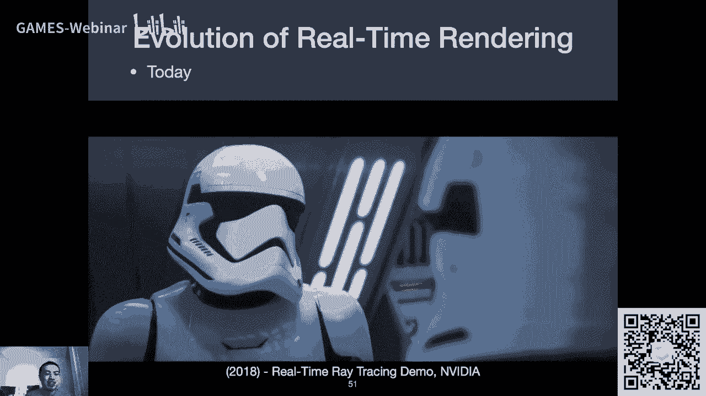
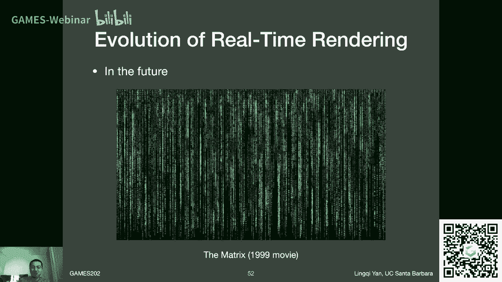

# GAMES202-高质量实时渲染 - P1：Lecture1 - 课程介绍与概述 🎮

在本节课中，我们将学习GAMES202课程的整体介绍，包括课程目标、内容范围、学习方法以及实时渲染的基本概念和发展历程。

---

## 课程介绍

我是闫令琪，来自UCSB。我的研究方向是真实感渲染，包括离线和实时渲染。这门课程名为“高质量实时渲染”，旨在探讨如何在保证实时性的前提下，实现高质量的渲染效果。

---

## 课程目标与关键词解读

本课程标题包含三个关键词：**实时**、**高质量**和**渲染**。

*   **实时**：通常指渲染速度达到或超过30帧每秒（FPS）。这个速度保证了交互性，例如在游戏中，玩家的操作能立刻得到视觉反馈。
*   **高质量**：指追求真实感，即渲染结果在物理上是正确或近似正确的。实时渲染的核心挑战就是在速度与质量之间取得平衡。
*   **渲染**：指通过计算模拟光线从光源发出，经场景中物体反射/折射后进入虚拟摄像机的过程，从而生成图像。

---

## 课程内容概览

本课程的知识点较为分散，采用专题研讨会的形式，主要涵盖以下四个核心话题：

1.  **阴影与环境光遮蔽**：探讨复杂动态场景下的阴影生成技术。
2.  **实时全局光照**：研究如何在实时或交互式速率下模拟光线在场景中的多次弹射。
3.  **基于物理的着色**：讲解真实感材质与光照模型。
4.  **实时光线追踪**：介绍现代实时光线追踪技术的发展与实现思路。

此外，课程还会涉及图像空间操作、非真实感渲染（如卡通渲染）、时域抗锯齿等现代化话题。

---

## 课程不讲什么

为了使课程聚焦于核心原理，以下内容将不会涉及：

*   3D建模与游戏引擎的使用教程。
*   离线渲染的深入探讨。
*   神经渲染的主流内容（因其目前通常难以同时满足实时与高质量的要求）。
*   OpenGL API的详细教学（但会使用GLSL编写着色器）。
*   纯粹的着色器或场景优化技巧。
*   高性能计算（如CUDA优化）。

本课程侧重于传授**渲染背后的科学原理**，而非具体的工程实现技术。将科学知识转化为产品需要优秀的工程能力，这需要大家在实践中不断积累。

---

## 学习方法与要求

上一节我们介绍了课程的内容与边界，本节中我们来看看如何学习这门课程。

**学习基础要求：**
*   对图形学有浓厚兴趣。
*   具备图形学基础知识（如上过GAMES101或类似课程）。
*   具备基础的微积分知识（下节课会复习）。
*   有能力配置环境并运行WebGL框架（作业0将帮助大家熟悉）。

**课程资源与平台：**
*   **课程网站**：将提供大纲、PPT及阅读材料。
*   **答疑**：可通过课程论坛或QQ群进行讨论。
*   **参考书**：经典的《Real-Time Rendering》一书与本课程内容交叉较少，非必需。课程主要参考前沿的论文与课程资料。

**关于观看录播视频的建议：** 为提升效率，建议使用1.25倍至1.5倍速播放。

---

## 作业安排

本课程共有5次正式作业（不含作业0）。

*   **作业形式**：主要使用**GLSL**编写着色器，在助教提供的WebGL框架中完成。框架前端使用JavaScript，但大家只需专注于着色器代码。
*   **提交时间**：采用AOE（Anywhere on Earth）时区，在截止日期前地球任何地方的时间均可提交。
*   **开发环境**：由于作业集中于少量着色器文件，使用任何文本编辑器（如VS Code, Sublime Text）即可，无需复杂的IDE。
*   **学术诚信**：请独立完成作业，欢迎讨论思路，但请勿公开分享代码框架或答案。

---

## 实时渲染的意义与发展简史

为什么我们要学习实时渲染？因为计算机图形学非常酷炫！实时渲染致力于在速度与真实感之间找到最佳平衡点。

其发展历程与游戏产业紧密相连：
*   **早期**：画面由少量多边形构成，效果简单。
*   **关键突破**：约20年前，**可编程渲染管线**的出现是重大里程碑。程序员可以编写顶点着色器和片段着色器，极大地释放了创造力，使画面质量飞速提升。
*   **重要进展**：**预计算技术**（如球谐函数）的发展，允许将复杂计算转移到渲染前，以存储换取实时渲染时的速度。
*   **交互式渲染**：约8-10年前，基于GPU的低采样率光线追踪配合降噪器，实现了交互速率的全局光照预览。
*   **当今与未来**：随着**硬件加速的光线追踪**单元普及，实时光线追踪已成为现实。实时渲染的应用也从游戏扩展到VR/AR，甚至开始用于影视制作。

---

## 总结

本节课中我们一起学习了GAMES202课程的定位、核心内容、学习方法以及实时渲染的简要历史。我们明确了本课程的重点是理解高质量实时渲染背后的**科学原理**。从下一节课开始，我们将进入具体的技术专题学习。

---
**下节课预告**：我们将快速回顾渲染管线、着色语言、渲染方程及必要的微积分知识。