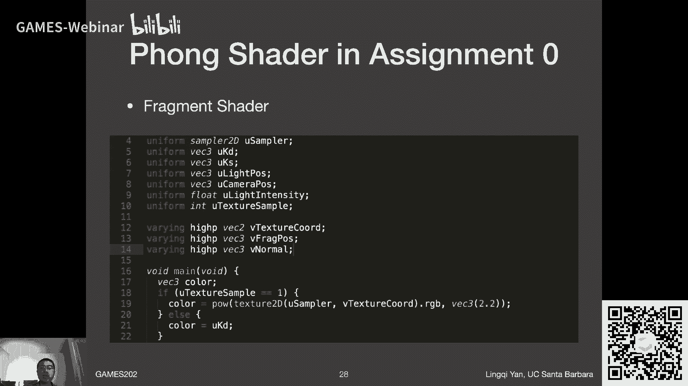

# GAMES202-高质量实时渲染 - P2：Lecture2 Recap of CG Basics - GAMES-Webinar - BV1YK4y1T7yY

hello，大家好，欢迎来到games 202的第二讲，所以说如果你上过game 101的话，你会觉得这节课无比的熟悉啊，难度并不大啊，那么在这节课的开头，我们会说几个事情，第一呢作业零啊。

我这里写的是已经发布了，而事实上是应该是我们的助教，同学们正在努力的工作中啊，然后呃应该是很快就可以发布啊，大家可以期待，反正今天肯定是没有问题的，那么嗯关于作业零呢，是这样的。

就是说大家是没有必要去提交，然后大家就去呃尝试上手一下代码，然后我们的文档我看了啊，助教同学们写的非常好非常好，然后大家就按照这个代码来，然后熟悉一下代码的流程呃，差不多就可以了好吗，作业零。

然后呃我这边呢把课程的网站哈哈哈给上线了，那么现在大家已经可以看到网站呃，上一节课的ppp p p t里面，我说到了对吧，就是那个网站那个时候还是个单占位符，然后现在已经有内容了。

并且呢呃课件的pdf版本啊，第一讲啊就已经发布在那里的，大家可以看得到，之后呢，我们就在课程网站上发布更多的呃，每一节之后发布呃它的呃呃课件啊，然后呢，我个人这边现在我算到有这么一个事情了。

我在咱们这课的第四周，也就是啊也就是4月份的6号到10号这两节课，这期间啊，我要我要出差啊，我有点事情，那所以说那段时间我也不知道说网络啊，其他什么条件会不会影响直播，所以我现在暂时有一个打算啊。

4月6号和10号这么两个课时，也许是要录播了啊，到时候我再安排看看怎么样，咱们把这个过去啊，嗯至少还有一段时间吧，我在商量好吧，那这里呃这就是咱们这课前要说的一些少，另外呢从这节课开始哈。

我也深刻反思了一下，我这第一节嗯说了很多各种各样不正经闲聊啊，然后从这节课开始的收敛一点啊，我要注意啊，然后给大家说一些，这个这真这真正说一些怎么说呢，就实际的内容吧好吧，然后呃更像一个课一点。

那么今天我们要说什么呢，是从什么开始呢，从硬件的渲染管线开始，所谓open gl以及open gl对应的着色语言，gl sl的一些基本用法和理解，在这之后会告诉大家怎么样去呃，呃就是描述光线的传播嘛。

就是之前我们说到的渲染方程，因为它会在这门课呃，或者说之前在101上，我们就该做这块工作啊，然后我们把这块的知识给补上，差不多，这就是今天的内容有点多啊，又又有点杂嗯，但是讲起来应该还是会挺快的好吧。

那么好嘞，好嗯呃当然了，我这flag立的哎好吧，尽量不拖沓啊，咱们这么说，ok那么第一部分，那么我们要说的就是渲染管线，那渲染管线呢，咱们在101里面已经说的非常清楚了对吧，我们呃说了这么一个事情。

就是我们最后要干什么对吧，渲染它一开始是什么呢，3d的模型它最后是什么呢，最后是显示出来了一张图，那么中间到底经历了一个什么过程呢，这自然就是渲染管线或者叫渲染流水线。

当然这这一个管线的设计就是现代的啊，gpu呃在完成的工作，那所以说呢我们之前电子101学了一套，它背后的这些知识，然后这里呢我们把它回顾一下，那么首先啊物体各种各样的不同的物体，3d的对吧。

在空间中怎么表示呢，肯定会表示成一堆点和它的连接关系没问题吧，那么任何的这些点啊，都会经过第一个步骤，就是顶点的处理，顶点的处理经过一系列的对吧，把它给变换到。

比如说经过model view projection，在经过viewport，最后给变换成呃屏幕上面的一个点，对不对，然后呢我们知道经过这一系列的变换关系之后，它们之间的连接关系并没有发生改变。

所以说之前的一个三角形，它是原来共原来呃是哪三个顶点呢，现在还是哪三个顶点，所以呢之前的呃就是变换过后的这些点，仍然会表示那些三角形，只不过这些三角形现在被投影到屏幕上去了。

那么既然三角形已经投影到屏幕上去了，下一步我们要做什么呢，我们做了这一步就叫做光栅化，光栅化是在干什么，就是要把原本一个连续表示的一个三角形对吧，三个点连起来，把它给离散化成屏幕空间上的一堆像素。

当然了，它不一定是像素，如果大家是嗯就是用了一些什么m s a a啊，或者一些其他的一些抗锯齿啊或者什么的，就是说这些这些一个一个的这些基本的微元，咱们可以认为管它叫做片段啊，叫fragments。

当然在对应direct x里面就管它叫像素，没有任何问题啊，咱们之后也可以就管它叫做像素，好，我们有一系列的三角形，我们要把它打散成像素，那么打散成像素的过程中呢。

肯定会涉及到一些关于遮挡的一些处理对吧，然后哪些三角形在前面，哪些三角形在后面，然后前面的靠近呃，camera这些像素或者片段一定会挡住后面的，那么我们是怎么处理的呢，大家应该还记得吧，哈哈好，然后呢。

当我确定了这些可见的呃fragment之后，然后我就可以对任何的fragment做呃着色，然后着色呢，自然就是就是去计算它应该长什么样，咱们之前也都提到过，比如说嗯布林缝着色模型。

然后这也是大家这次在啊，作业零中要实现的内容对吧，好了啊，那么最后最后当然你就会看到一幅图对吧啊，另外呢这里就是关于是先判断啊片段的顺序，然后考虑遮挡，还是说先做着色，这个其实呢呃不同的处理方法。

它会有不同的顺序，这些都是细微差别，那么整体的呃图形学渲染管线，那自然就是这样的对吧，那我们可以看，比如说你有一个物体，你规定了他们应该怎么样去运动对吧。

我给了他model view projection，然后我要去应用它，那这当然是第一步，对每一个顶点我都会去这么做对吧，那么如果说我要考虑说哎我一个三角形，我要把它给呃离散成若干不同的像素。

那么这一部发生在哪儿呢，这当然就发生在所谓光栅化这一步，我要把三角形真正的给画在屏幕上对吧，大家还记得光栅化这么一个概念，其实就是最早这个词儿就就是画对吗，就是要把它给画上去。

那么三角形到底占据了哪些像素呢，咱们之前做过一个非常深入的一个探讨对吧，好嘞，那么还有另外一些呃地方，比如说嘛我们要判断这些三角形呃，各自的这些遮挡关系，哪些离我们近，哪些离我们远。

我们是逐像素的记录一个深度对吧，这就因此有了一个所谓深度缓存，或者叫z buffer这么一个东西，然后我们始终去取最小的呃，或者说离我们最近的这个深度，始终保持着这么一个记录。

然后我们有新的呃像素填进来，我们来判断它是否被以前的像素所遮挡对吧，那么是这么一个做法，那么到了最后的着色的部分呢，着色当然得涉及到各种各样的着色模型，那么着色模型里面，我们提到过布林缝的着色模型。

对不对，那么啊布林峰的着色模型呢，它是一个呃非常惊艳式的着色模型，它是根据观察说我们看到啊不同的物体，它有不同的呃类型的呃，对光照的反应可以这样说对吧，有一些是diffused的。

有一些是specular高光，有一些呢是相当于是我去近似光线，弹射过很多次，然后让这个物体没有任何一个地方是完全黑的，那就是环境光效加起来，那就是不灵缝着色模型，那么这套模型呃。

呃很显然看起来呢它并不是百分之百的真实，然后他缺了什么呢对吧，咱们在games 101里面提到过这个事情，就是因为啊用即使是用了这个模型，即使这个模型中有一部分环境光的这么一项。

仍然他对全局光照或者说间接光照这一块，是一个非常近似的一个做法，那么我们也提到整个这么一套呃渲染的管线了，他确实对直接光照这块是可以处理的挺好的，但是他对任何一些全局的现象，比如说阴影。

比如说啊光线的多次弹射，它就处理的不好对吧，这是没有问题的，所以说呢嗯这里就是呃，关于这一套硬件的渲染管线，它的这个好处与不足啊，当然了，它的好处大家可以想象大家之前呃手写的。

用用软件去实现的c加加写的嘛对吧，渲染器啊，大家就会发现它会呃挺慢的，然后在gpu上跑慢是非常快非常快的，对不对，然后我们之前还曾经讨论过gpu的呃，它的原理它为什么可以这么快呢。

那是因为它的并行度非常的高，他不是代表它的内部的一个单元，它可以运作的多么快，而是因为它有非常非常多的单元在一起运作，这样就是为什么他可以跑的这么快啊，这个意思，那么啊呃还有一点呢。

就是说呃我在做着色的过程中，我当然还可以给嗯，比如说三角形的内部，或者说整个一个物体吧，物体的任何一个地方啊，我可以得到一个他的嗯纹理的坐标，从而呢我可以把任意一张图给贴上去，然后根据它的纹理坐标。

任何一个位置我都我都知道呃，他应该去文理的哪一个地方去查啊对吧，这就是文理映射，同时呢我们还提到了这么一个概念，叫做呃差值，那就是说啊我知道三角形的三个顶点，它对应的纹理坐标是什么。

然后呢我问你三角形内部任何一个点啊，它的纹理坐标，如果我要它有一个平滑的过渡，那它的纹理坐标是什么呢，对吧，这里我们就需要用到插值，并且我们用到一个重要的概念。

叫做barry santic coordin，对吧啊，所以说呢这就是这里的呃，关于嗯整个一套硬件的渲染管线这块的知识啊，这是简单给大家一带而过，因为我们之前说了啊，就是说呃。

我会假设大家game g101 就已经上过了，然后这块应该不是什么特别大的问题，那我们再进行下一个呃模块之前啊，我先看看同学们有没有什么问题，现在可以啊，欢迎问哈，我来看一下嗯，哦说是三角形哦。

它是怎么定义这些，哪些点要连接成一个三角形的，是想说这个意思吧，对吧啊这块我们之前曾经提过，在啊在哪一节我不记得了哈，就是呃是wave front object文件类型，在这个地方我们提到过对吧。

我们可以先定义一系列的点，然后把它给编号一到n，然后呢我再定义一系列的三角形面，这些三角形的面啊，每一个都会带着三个不同的下标，然后表示说我用这三个这点形成一个三角形，对吧，然后我可以这么来做。

对这是没有任何问题的好吧，然后哦有同学问的问题非常深刻呀，有没有适合全局光照的管线，哎哟我的天诶，可能现在还没有啊，但是但是实时光线追踪是挺适合的，这是真的啊，这之后我们肯定会提的。

ok那么嗯再看看哈体积着色啊，其实我不太清楚这是个什么概念啊，也许是工业界的说法，那就先这样好吗，那纹理坐标的uv是怎么参数化出来的，同学上过102吗，这咱们102提到的对不对。

就是说啊就是说啊给你任何一个模型哈，你怎么样得到一种合理的所谓参数化，使得你给他任意一个顶点上，然后都对应着一个uv啊，当然也可以通过一些艺术的方法来做啊，比如说你可以认为这个物体外面有一个盒子。

然后四面八方它它都会有嗯什么呢，就会把这个盒子给挤进去，最终贴在这个物体表面上对吧，你就可以看到这个物体表面上任何一个地方，它都对应着原本盒子上的一个地方，而盒子上面的uv是好定义的啊，没问题。

那么呃就是说关于这块，是有不少的方法可以做的，但是呢一个一个通用的要求是说，你要给这个物体定义的uv，又要满足它能够对你，你的纹理有一个很少的所谓扭曲啊，叫distortion对吧。

然后另外一个呢又又要保证说，尽量你嗯你纹理映射上一个物体之后，它的各个地方的拉伸程度尽量还都是一样的，就是说它的面积基本上来说，不要出现哪一块被拉的特别大，哪个地方的都特别小。

大家通常会避免这么一些问题，所以整个大家问的这么一个问题啊，叫做参数化问题，这是一个非常非常困难的几何问题，也是大家这个学术前沿在研究的一个事情，好吧，ok那咱们就这样，就是说这门课我看吧好吧。

后后续也许会有一个话题上可以跟大家说一下，就是在在什么呢，在sdf上，大家还记得s df吗，signed distance function，距离场了，有向距离场这么一个概念上。

也许还会跟大家重新提在有效距离场上，怎么样去给呃得到的一个呃形成的呃，隐函数的表面，然后做一个呃uv的参数化好吧，到时候我们来说这个事情呃，如果我还记得的话，哈哈行啊，那咱们先这样啊。

那咱们就开始进展下一个话题吧，或者说如果没有接触过的，没有任何问题啊，嗯open gl首先咱们说它是什么对吧，然后open gl是什么呢，它是一系列的啊，a p i它这个a p i呢它是怎么样运作的呢。

它是在cpu端执行的，然后呢他负责调度gpu，就是他负责安排gpu负责干什么啊，这么个意思，但是呢这一套api确实在cpu端写的，那所以说既然这么一说，大家就立立刻可以诶意识到这么一个事情对吧。

open g好，本身他拿什么语言写是一点关系也没有的，我们更关心的是gpu怎么样去执行对吧，而不是说cpu怎么让gpu去执行什么东西对吧，这是两个完全不同的事情，所以语言是没有关系的。

这就是为什么说比如说我之前学啊open gl，然后我们用c语言写，然后呢呃我拿到比如说用什么拍open解啊，我都不知道他是不是叫popen解啊，拿到之后我就立刻可以直接去用它，我只需要查一些。

查一下这个对应的语法怎么用就可以了对吧，然后同样道理，到咱们这这么一个呃作业框架里面啊，他们本身只是负责，咱们可以理解成一个前端的一个事情，就是他们怎么样去调gpu里的东西啊，这么一个意思啊。

所以这是open gl，那么open gl它有一个非常好的特点，它就是跨平台跨平台，不管你是windows还是呃linux还是mac，mac的话，可能最近有些什么问题吧，到时候咱们再看吧好吧。

然后呢呃嗯就是这，这也是我们会为什么去选择用，喷gl的一个理由哈，因为大家可以看到这里啊，direct x是也是另外一套api，然后也是挺好用的，呃但是呢它只能在windows下面跑。

van的这个东西比较新，然后作为我个人来说，我又不太熟，所以说我不敢乱说，所以咱们就用open讲，挺好的，没有，如果没有什么问题，这些呢都是工具，都是工具，没有什么问题。

不会耽误大家对咱们实时渲染背后的，一些算法的理解啊，这么个意思，那么open g哦，我们说了它的好处，它有没有什么坏处呢，答案还是有的哈，有第一呢呃它的版本是非常非常碎片化的，什么意思呢。

就是open gl，它的它的版本是这样的，它是作为一个所谓community的一款软件啊，这么一个意思，所以大家是不断在上面添砖加瓦，这么就是大家可以理解成，是有一条这个非常平滑的曲线一直在往上升啊。

是这么一个意思，这是open gl，然后呢相比于directx，directx，大家知道都是分各种各样版本的，对不对，然后呢呃呃大家会发现a direct 9到directx 10。

然后第二个s到11哦，各自的这些新特性的这些提出，这是非常非常清楚的，然后到时候比如说用directx开发的游戏，然后我们就说哦，我们要求说这个显卡要支持direct x，多少多少多少对吧。

就这么一个意思，所以它相当于是一个step方式对吧，一个阶越函数可不是一个是很多个对吧，从这一代到下一代，然后下一代再到下一代，而是这么一个意思，那也就是说open gl它这样一个平缓的一个过渡。

就会就会让人发现有这么一个问题啊，就是说就是说可能这些不同不同的版本，各自有不同的特性，然后这样的话，就就感觉用起来会不会比较麻烦啊，这么个意思，ok另外一个问题是open gl写的时候。

它作为cpu端的api对吧，然后他的最大的问题是他写的是c风格的代码，就是它的代码是完完全全是没有什么面向对象，这一说的，就是说让现代呃，我们的编程人员，写起来是非常非常不方便的一件事，情。

就完完全全是是c风格的，然后不好用，这是一个，然后呢另外还有一点是在若干年前哈哈，那大家大家既然已经听到我说这个前提了对吧，若干年前open gl的代码甚至是非常不好debug的啊。

现在当然是好很多了啊，这么个意思好嘞，那么呃行open gl呢，那我们说就是这是这是干什么的对吧，那我们干嘛要用呢，因为它快对吧，因为他是用了gpu，我们刚刚才说gpu的并行度非常高。

他可以做的非常的快，那他们就用它，而且这是在真正的去编程这个硬件，gpu怎么样去跑，那么我们如何去理解呢，我们刚才已经提到在电影101里面啊，我们会考虑我们所做的每一步。

其实在open gl里面都是有对应的，比如说我们花了大力气去推导这么一个呃，所谓透视投影，它的矩阵是什么，到了open gl里面一句话就可以把这个矩阵拿到，你就只用调用它的api就好了。

那当然非常方便了，对不对，那这就是open gl，那有同学说呃会问他会不会被ban取代啊，有可能搬的这个这个谁知道呢，对吧哈哈哈哈，ok然后debug怎么办，待会我就说啊，待会会说好嘞。

然后啊open角咱们刚刚说到，这是说我们干嘛要用对吧，然后然后现在来说我们得到sho这一步了对吧，那么怎么用open gl呢，那这个时候我说咱们做这么一个工作，我们把整个的一个渲染过程理解成。

再画一幅油画的这么一个过程，这样就好理解了啊，这个大家应该也不陌生，因为咱们之前做过类似对吧，咱们在推导所谓viewing transform的时候，我说相机他的这个呃怎么样去理解它呃。

也是用了类似的一个拍照的一个过程，那么这里呢我们理解成画油画的一个过程，那么这个过程大家可以思考一下，如果你要画一幅油画，你要怎么办呢是吧，你首先肯定要这样对吧，你首先要把物体或者说模特哎。

怎么把放那对吧，这是第一步，第二步呢，那我肯定是要把所谓的画家给放在，某一个位置上啊，大家知道油画它有一个画架对吗，这是一个很重要的一件事情，然后我把画架放在哪个地方，那就意味着我是坐在哪个地方的。

所以说我把画架放哪儿，其实就是理解成是诶，我的相机什么东西要怎么放对吧，这个没问题，那么呃把画架放好之后，我画架上要放一块画布对吧，然后因为平常大家肯定不是，画在画架的木板上的对吧。

这也是一个重要的区别，就是就是说大家好好想一想，是不是这么回事对吧，通常画叫木的，然后你要在上面画，在上面钉上啊对吧，然后呃一张纸或者是或者是那种布对吧，然后你要所谓的画布，然后你把它贴上，贴上之后。

然后你开始画，你在什么上面画呢，所以对你是在你是在这块画布上，然后画上一些东西，然后呃如果说啊你还想再画更多的画哦，那你把这块画布扯下来，然后贴另外一幅画布，然后你接着画，这是没有问题的，那么嗯当然了。

就是说如果你感觉哦这角度我画的挺好的，我收集到了几张不错的画，然后那行吧，我换一个角度，然后我再继续画，那就意味着你之前画过的那些画对吧，都可以呃，被你后续的这些呃呃绘画的这些过程拿过来用。

而这是没有任何问题的对吧，诶那这就是就是就是说你要画一幅油画，应当去怎么样画啊，当然不只是油画的对吧，素描也是一个道理，就是你需要一块板对吧，然后然后把这个画画布或者纸给贴上去。

这一个呃理解这是挺重要的一件事情，另外大家学一个词对吧，ea哈哈这个词就是啊就是画架的意思啊，ok好，那咱们为什么要做这个类比呢，因为open gl，它严格意义上其实就是做的这么a b c d。

e f这么六步，ok这是当然我个人总结啊，那咱们看看为什么呢对吧，可能有同学说他这是呃，为什么他会是做到这么几步，那咱们想一想，比如说啊我要呃我要渲染一个3d的场景，那么我们类比绘画的第一步。

那我要先把物体和模型给啊放在一个地方，那当然了，这里涉及到两个问题，第一什么物体对吧对吧，我我得我得确定我是想渲染一个stanford bunny。

还是说我想渲染一个color box还是些什么东西对吧，我得告诉这模型，说我这告诉我告诉我的程序对吧，或者告诉gpu，我的模型我应该用什么样的模型对吧，这一步肯定得有，然后呢我模型该怎么样摆放。

这些跟之前都是差不多的对吧，那么我在g我在open gl里面，我如何去告诉gpu，我要去渲染什么样的模型呢，这个时候我们需要一个呃东西啊。

open gl定义的一个东西叫做vertex buffer object，简称vb o，这也是我们一直在用的一个东西啊，就是他是在干什么，大家可以想象这些这个vb o呢，就是gpu中间的一块区域。

这个区域用来存储你的模型，这个模型怎么存储的呢，就跟刚才我说的object file存储方式非常非常相似，就是存一堆顶点的位置啊，它自然就会有一个顺序对吧，或者编号，然后呢存一堆对应的real。

然后再存一堆他们的连接方式，或者他们的啊，他们的texture的坐标啊，就是这么回事，就是说它以一定的格式，反正组织了这么一个呃物体，应该放在gpu的哪儿啊，大家看清楚v b o啊。

是用来存储这些模型的，放在gpu里啊，然后我刚才提到非常呃和o b j文件非常相似，那么剩下的是什么呢，对吧，剩下的那自然就是说呃我要给这些物体一些呃，所谓他们的运动，它给它一些矩阵，对不对。

那么这些矩阵咱们之前在games 101里面，我们提到的是说哦，那我可以首推一个这个矩阵a b c这样的，对不对，他的translate怎么写的呃，呃呃比如说他们的rotate怎么写。

但是open gl这一切都帮你做好了这个事情了好吧，这是非常简单的事情，比如说你要想想做一个啊三维空间中的平移啊，大家知道三维空间中的平移，咱们之前已经说过了，在齐次坐标的表示下，是一个4x4的矩阵。

并且只有最后一列的前三个数是呃，平移的x y and z对吧，它当然容易，但是对于3d的旋转呢，是不是就要稍微难一点对吧，但是这些open技巧都告诉你了，你只需要调用他们，用这些对应的函数的语法对吧。

我说了，open gl是a p i啊，他他做了它，它设计来就是用来让你快速的得到这些信息的，没问题，那么完全没有必要自己去写它，那么open gl这一步呃，和绘画的类比，咱们就完成了。

就是物体的所谓摆放，好吧好嘞，那这就是第一步，那第二步为什么说和呃这个画架还有关系呢，因为放置画架呀体现了两个事情，两个事情哪两个事情，第一啊是指视图变换呃，视图变换当然就意味着说是你要放相机对吧。

我们刚才说了，你花架放在哪，就意味着你坐在哪儿画这么一个场景，那当然这就是你呃，从这个位置看到这个场景的东西，就画在这这个画架上面的布上对吧，没问题，那么这里体现两个事情，第一就是你要放置相机。

第二一个更重要的事情，就是说你要在open gl里面建立一个东西，就是open gl里的画架，什么呢，叫做frame buffer，ok这是一个非常重要的一个概念，就是说你需要创建。

或者说你之前创建好了，你需要指定你要用某一个所谓frame buffer，意思就是我要用哪一个画匠啊，这个意思，那么这两个意思呢，呃我都可以呃，这呃这两块儿吧我们都可以解释呃。

呃比如说呃view transformation，对应到咱们之前game 201里面对吧，什么是视图变换呀，就是我的相机，我的相机是呃呃透视投影的还是正交投影的呢，对吧。

然后我要推出一个view transform，各种矩阵对吧，大家想一想哈哈，当时推导这些东西是多么复杂的一件事情对吧，那所以说open gl就让一切都得到了简化。

你只需要规定所谓呃相机的一些属性就可以了，比如说它的呃field of view对吧，可视的角度，这些都是呃可以，都都是咱们之前说过的一些概念啊，你只需要去调用这个函数。

它就会告诉你所谓视图变换的矩阵是什么呢，大家还记得视图变换的矩阵，最后是要用在物体上的吧对吧，大家应该还记得我们之前说过的，这么相对运动这么一个逻辑，我们试图变换的矩阵，是可以把你现在的呃。

camera的位置给变换到一个经典位置的，并且呢为了让你整个一个场景看到的东西，是完全没有发生变化的，那你对所有的物体都要做同一个啊，呃视图变换啊，就是这么个意思好，如果大家还记得的话。

这应该不是什么特别大的问题，那么下一步就是你要去使用一个画架，就是这么一个意思对吧，那么呃这一步呢你为了使用一个画家，你是一定要在上面啊，比如说呃固定一个呃画布的是这么一回事对吧。

那同样道理还是在这个油画里面啊，在油画里面我们之前还提到这么一个事情，就是说你是可以你是可以用同一个画架呃，来画很多不同的图的对吧，然后就是说你只需要换一块画布哦，你就可以画一个另外一张图。

然后再换一个画布，你又可以画另外一张图对吗，所以说呢就这里我们把这两块我们给呃在一块，说就是只要你指定了一个frame buffer，你是可以一下去渲染出很多不同的纹理的啊，这么一个意思。

这就是open gl，它的一个好处就是说我们管啊，用一个画家呃去渲染，可以一下渲染多张图，这么一个叫做multiple render target啊，具体就不再跟大家说了，那我们要干什么呢。

就是说我要我要啊对场景渲染一次，对场景渲染一次，然后就相当于我坐在某个画架之前准备画，但是我可以画很多不同的这些画，就是这么一个意思，所以我用一个frame buffer。

我可以指定这个frame buffer，它可以输出很多不同的纹理，就是这么一个意思，ok哈哈哈哈哈，所以现在这个技术已经不是什么复杂的技术了，就是说我这里简单跟大家说一下，以前是不支持的。

很早之前就说一个双buffer只能绑定一个纹理，然后就是说你你画，最后也只能画到一个纹理上面，那现在有这么一个所谓multiple render target，那就非常方便对吧。

那就是说呃你从一个角度看过去渲染一次场景，然后场景光栅化一次，你一下可以输出好几张，额管理要渲染出来的结果，可能有一张是你shading的结果，可能有一张是深度，可能有一张是什么别的一些什么东西。

这是你自己指定的，这些是由之后的frame by frame fragment shader啊，来告诉这个gpu，说你最后要写到哪一个管理里面去啊，这是可以的，那么呃。

这里有一个特殊的一个渲染的目标是什么呢，就是大家可以可以认为有一个特殊的目标，是直接渲染到屏幕，而这个事情呢，大家呃特别在现代的实质现场里面，大家并不怎么推荐这么做哈，就是说直接嗯。

我把一个frame buffer里面渲染出来的结果，直接渲染到屏幕上，因为这样的话会造成一个问题，什么呢，就是说你这一帧没有渲染完，然后下一帧又要开始渲染了，那么这个时候就出现你这帧渲染到一半。

然后下一帧开始再覆盖你这一帧看到的内容，而这个时候就会出现画面撕裂的一个情况啊，这种这种情况呢，然后通常如果大家打游戏的话对吧，大家就会看到说啊，游戏里面通常都会有一个选项叫垂直同步。

如果你把垂直同步给勾上，勾上之后它就不会出现这种情况了，然后呢呃有人的做法，那自然就是说哦，我要先把嗯渲染的结果存到一个纹理，或者存到一个缓冲区里面去啊，当我渲染好了之后，我确保没问题。

我再拿去让屏幕去显示啊，这个行为叫做双重缓冲，或者还有一些更复杂的叫做三重缓冲，所以说这几个概念都是联系在一块的，垂直同步双重缓冲，三重缓冲啊，这个意思啊，ok那这里就是说一下。

就是说呃我们frame buffer就是画架，然后画布可以有很多张，一下画很多张啊，这么个意思呃，当然这一步就是渲染一次场景啊，或者叫一趟吧，就是pass的概念，然后你可以得到很多个不同的东西啊。

由fragment shader告诉你，最后要写到哪一个纹理上面去，这么个意思好嘞，那么open gl呃，我们继续类比之前的这么一个画油画的过程啊，就是说我是可以把啊，嗯怎么说呢。

我是可以把真正最最核心的这一部分得，完全类比于我就要在画布上画画这个事情了，对吧，不管怎么样，我画画要把它给把一个场景画在画布上，那么open gl一定无论如何，我要做shading，对不对。

那我做shading怎么做呢，那这个我们之前在电子101，已经说的挺清楚的了，就是我们基本上来说呃，即使对于咱们这门课来说，基本上也只需要用到两种不同的着色器，一个是呃顶点着色器，一个是片段着色器。

或者叫像素着色器，vertex shader和fragment shader，其他的呢一些复杂的东西咱们不需要啊，暂时在咱们这门课，实现我们说的这些算法的时候，是不需要用得到的啊。

ok那么具体怎么做的呢，那大家如果还记得的话，就是说我们每一个顶点我们都要做一个操作，这个操作是谁定义的呢，这就是我们自己在顶点着色器里定义的，如果这个顶点，那肯定首先要做mvp的这个呃呃映射对吧。

或者是啊投影啊，做完之后可能有一些东西我们要呃希望它插值，然后我们就把它给呃也给算出来，并且送到呃片段着色器里面去，那么片段着色器里面得到的输入，自然就是顶点着色器的输出。

在一个顶点上面的属性啊就会被插值到呃，呃任何一个像素上面的属性，那么做这么基本上就是这两个事情，一个是顶点怎么样去运算呃，就变换了，一个是呃一些需要插值的值，我们把它告诉啊，片段着色器就好了好吧。

然后呢呃之后自然就是open gl，它来做的一个事情了，他做的事情就是把一个三角形呃给打成呵呵，一堆的像素或者是片段，那么自然而然呃这一步咱们不用管，咱们就就考虑说啊，当这些片段都已经生成了之后。

然后我们要呃嗯怎么样处理，那怎么样处理呢，我们自然要对每一个片段做着色啊，那我去着色呃，怎么样去做呢，我就说呃还是一样，就是自己写片段着色器呃，open gl会去调用它呃，自动的哈。

然后我就可以做后续的每一个片段的着色，然后他的这些lighting啊，各种各样的计算，然后同样的道理，就是说你也可以自己去写深度的测试，你也可以让open gl来帮你做深度的测试啊，通常情况现代来说。

大家可能更多的是自己去处理这个，深度的测试哈，嗯但是open gl自己是可以做的，没有问题啊，那这就是片段着色器要做的事情啊，那么大家可以看到这么一个事情的对吧，如果说你在顶点着色器的输出。

是每一个顶点上的属性，并且你告诉他，这些这些属性在片段着色器中是要被插值的，这部分啊，open gl就会帮你做好，你到fragment shader里面，到了片段着色境内，你就可以认为这些性质或者属性。

之前是每个顶点的，现在已经帮你插值好了，它已经是在对应的这些像素上，它插值出来的纸了，你就可以直接用啊，这是非常好，马上我们会看一个例子哈，好嘞，那这里那就是我们这节课，我们最需要关心的一个实际问题。

就是说啊我们自己怎么样去定义，怎么样去写顶点和片段着色器，然后其他的东西更多都是可封装的，没问题，就是整个这套这套流程下来啊，基本上来说都是可封装的，然后除了说你要写的顶点和片段着色器。

这就是我说为什么，其实我们并不是特别去需要去学open gl这些语法，因为它挺好用，我们只需要集中精力在着色语言上，当然了，这是最近呃，就是说关于整个这一套呃open gl的使用啊。

这块咱们就可以理解成directx，它自然提供的就是一套面向对象的一个写法，那自然就会比open gl要好一些嗯，好用一些啊，这么个意思，然后呃甚至比如说大家可以考虑。

我用呃各种各样的引擎实际上在干什么呢，实际上相当于就是有了一个所谓呃呃g u i的，一个一个呃操作的界面，对吧，我们可以设置各种各样不同的pass什么，我只要简单的拖拽就可以了。

实际上我们做的完全是一个事情了对吧，我们就告诉gpu说我到底要干什么是吧，ok那也就是说关于关于在所谓着色器之外的，这些open gl的这些操作，都是我们不是最关心的好吗，那咱们做一个简单的总结。

说open gl做什么事情，就是告诉gpu我该做什么，没问题吧，而且他可以告诉gpu去做多次不同的任务，比如说我这场景我可以渲染很多次对吧，然后呢我要对一次场景呃，对场景我要渲染一次，那在这之前啊。

这里是就是open gl，所谓他一个比较关键的事情，它在渲染之前一定要先告诉清楚我这gpu呃，它它它里面他的所有信息都得都得告诉gpu，是这么一个意思，否则的话这个渲染一定是不可能做的。

那么为了让这个场景能够渲染，我们要干什么呢，我们做一个总结啊，第一定义说我要渲染什么物体这些场景，然后我要定义这些物体场景啊，他们的mvp这些这些矩阵啊，当然涉及到view和projection呢。

就是跟这相机也有关系对吗，我要定义说告诉gpu我要渲染这些东西，我的相机在哪儿，mvp都是什么，然后我又要告诉gpu说我要选什么画件对吗，我我要选什么frame buffer。

frame buffer挺重要的概念啊，然后我这frame buffer它的输出是几个纹理呢，是一个还是多个呢，然后都是谁呢，那我肯定要把这些纹理我我给这个告诉说啊。

这个frame buffer说这是你的输出啊，把这些东西都给定义好，定义好，然后呢我同时还要告诉gpu我怎么渲染，是不是我告诉gpu怎么渲染呢，那我就把我的作为顶点和片段着色器，我也都告诉gpu。

当所有东西都在gpu了之后，然后我拿去渲染，就是说所有东西在渲染之前一定都得在gpu里，这是非常重要的一件事情，当然有同学会跟我抬杠，会说这个说open gl有立即模式对吧，我可以哈哈告诉他哦。

渲染一个三角形去吧，然后他就渲染一个，我说你在线上人的眼睛再来一个，那么在cpu这边我可以写一个好心红豆，可以渲染很多次，很多次，这样三角形我也可以渲染出来，但是那样会会非常慢啊。

这样的话你的cpu和gpu之间的通讯啊，这个事情是非常慢的一件事情，你应该会要尽可能减少它这么一个意思，所以你不要一遍一遍的去做这个事情哈，ok那么这里就是所谓的open gl的一个基本原理啊。

然后嗯大家是是这么回事，就是就是嗯在学open gl的时候，就是肯定会见到很多书会说，open gl它是作为一个状态机模型出现啊，其实作为我来说，我是非常非常非常不赞成这么说的，这么这么告诉新手来说。

这不是劝退吗，这是没有任何必要状态机模型，我就这么说，你为了让呃这个gpu去完成一系列的工作，你得明明确确的告诉他，他他他他要的这些东西对不对，场景得告诉他，friend ber得告诉他。

然后他你你他要渲染到哪儿，你得说清楚，然后怎么渲染也得说清楚，否则的话他怎么才能渲染的不可能的，对不对，所以说我非常不赞成用这么个词哈，当然他用的是对的，百分之百对的啊，就是说你要治什么什么呃。

状态为什么什么什么东西，就比如说你说告诉gpu说好，我现在开始要用这个a frame buffer了，这时候用的一个词汇叫bug，叫绑定啊，通常我也会愿意远离这些词汇，听起来不是多么多么嗯好好理解的哈。

是这么个意思，那咱们行吧，咱们现在回到我们刚才的总结上去哦，open gl做的就是这么一个事情，那它是煤炭渲染诶，我都做了这么一趟事情，那现在还剩下一个什么事儿，咱们刚才类比的这个事儿对吧。

哎我还可以多次的渲染，并且我以前渲染的那些结果呀，我以前每次渲染，我是不是都写到文理里面去了对吧，我以前渲染的结果得到的纹理它也是纹理啊，我也可以拿来当做我这一次渲染的参考，我可以渲染很多次诶。

那就有同学问了，为什么我的一个场景要渲染很多次呢，这个时候大家就思考一下，其实啊我们在game 1，零幺里面给大家提到了一点点，关于所谓shadow map的做法对吗。

shadow map的做法它就是一个非常经典的两趟的做法，第一先看light能看到谁，第二在看这个camera看到的这些物体，或者说这些fragment能不能被light看到对吗。

那也就是说这是一个典型的两趟的一个算法，然后也就是说这是这是非常有用的，那第一趟我得出来的所谓light，能看到的这些最最小的这些深度，它作为一个纹理，我在b2 趟我再去用它。

这是非常正常的一个一个嗯思路对不对啊，所以说这是没有问题的，那就是两趟的渲染啊，这么个意思行，那多次多次或者多烫的渲染吧，都是没有关系的，咱们就以后就说pass吧好吧，然后啊。

这样一来我们就完成了一个完整的open gl与呃，画一幅油画之间的一个类比好吧，那呃这里我再停一下，我来看看同学们有没有什么其他的问题哈，光源需要深度测试，也需要没问题，几个光源就要几趟啊。

这还真是shadow map的一些问题啊，如果光源比较多的话，那每一个光源都要做一个shadow map啊，然后open就要支持optics吗，诶这是什么意思。

是说他们的所谓interoperability是吗，也可以的，是可以的，但是你不能指望shader里面去直接去调用，一个光线和一个场景怎么样去呃运作，我就这么个意思哈，ok。

ok我来剪我能看得明白的问题，自定义swap share是可以的啊，呃怎么调试啊，对马上会说马上会说还没到shader，马上就说嗯没有提到一些其他的概念。

是因为我认为这里不是open gl最最核心的概念哈，啊ok好，他要best rendering，我会在可能把最后一节课可能会提到一点点，这个是相当工程的一件事情，没有特别大必要讲啊。

片段呢我理解成就就理解成像素就好了，没什么其他特别需要注意的区别啊，纹理是不是个buffer，其实纹理在open gl里定义它和buffer不太一样，但是呃可以这么理解吧，反正都是显存中间那一块区域。

好吧嗯，一次pass就是一个一个frame buffer渲染一次，可以认为一个场景渲染一次吧，这么个意思好吧，纹理就是张图，咱们之前game g101 说了，ok好的嗯，ok其他的东西是不是装载机啊。

这再说吧啊ok好，那咱们就先这样好吧，那我们先进展下一块啊，也是最重要的一块，哈哈虽然这里我讲的并不多啊，就是什么呢，就是open gl的所谓shading language。

那它自然从这个概念上咱们可以看到gl sl，然后它是用来干什么的呢，它是用来描述所谓着色器怎么运作的对吧，它是一种语言，用来描述着色器的各种各样不同的操作，而着色着色器的各种不同的操作。

是用来描述顶点或者像或者片段，应当如何去运算，最后应当输出什么对吧，这么个意思那行，那么呃就是说啊着色语言，着色语言呢自然就是我们刚才说的定义了啊，顶点和啊片段的着色怎么样去做啊。

然后这些着色语言呢看起来都有点像c语言啊，因为他们本身不面向对象啊，虽然有struct啊，以后哈哈哈呃，但是呃就是反正就是说非常像c语言啊，然后它有一些比c语言好用的东西吧，我这么理解啊。

嗯然后他不是有一个非常非常丰富的历史的，就是关于呃所谓着色语言啊，最早最早的时候没有着色语言啊，没有着色语言呢，那就是说大家怎么怎么编程gpu对吧，大家就要在gpu上写这个汇编啊，这是真的，这是真的。

上古时代大家就是这么就是这么做的啊，就真的要写这个汇编语言，而且在gpu上这是个非常头疼的事情，而且头疼到什么程度啊，这是我之前真真切切地听说的是呃，就现在啊还是位大神叫chris wyman。

这是nvidia的一位超级大神啊，做rendering的，然后他之前说他带过一个博士生，他写不好在gpu上的呃呃呃就是嗯循环啊，这么个意思，就是用汇编在gpu上写不好，循环是说所以说他大家可可想而知哈。

这是当时那个时代的难度啊，然后呢自然而然就有人说啊，我们如何能降低一下难度呢对吧，然后大家就想那自然而然我们开发一种语言吧，让他可以编译成呃g pu的汇编对吧。

那这就有了最早的shading language啊，着色语言，那么着色语言呢经过一系列的发展，很可能大家都会不知道或者被遗忘的，比如说一段时间之前，nvidia还有一个着色语言叫c g啊。

然后啊当然现在来说大家主流的着色语言，大家没话说对吧，肯定是h l s l叫high level着色语言，至于它为什么叫high level呢，那我相信那应该就是和所谓low level。

那就是汇编相比啊，那这些语言当然都相当于是更高级别的语言，没有问题，那么他们在directx里面，或者说hl sl里面，他管这vertex shader叫vertex shader。

然后fragment shader叫pixel shader啊，这个意思，那咱们这节课说的是open gl的着色，着色语言叫gl sl，然后呢。

他呃就是我们说的vertex和fragment shade啊，这么一个组合啊，这么一个关系，那么唉说这个历史啊，大家其实可能注意已经注意到了一个细节，什么呢，大家发明着色语言。

这着色语言之后还是要编译成gpu的汇编的，最终最终gpu执行的肯定跟cpu执行的东西，是一样的，他只能执行一些汇编指令用，对不对，所以说他一定是要做一个呃，这个编译的没问题吧。

这就是说大家用这个shader language，shading language啊，写出来的所谓着色器都要经过一步编译步骤，然后gpu去进行啊，这么个意思，ok那么呃我们来看一看正常情况下呢。

那shader要怎么样使用呢对吧，那那shader肯定是这样的，就是刚才我们说了，就是呃嗯它中间肯定得有一部是要啊，是要编译的，那么在这之前你肯定得写这个shader对吧，写了之后你要把它。

你要把它拿来，你要告诉open gl好，这是我写的shader，然后下一步什么呢，那你去编译吧对吧，那他就去编译了，他又编译了之后，那你肯定编译了些什么fragment shader。

什么vertex shader，你要把这些这些shader们都放在一块，让唉这gpu过去做着色对吧，那肯定都得指定，那所以说我们就可以建立一个东西叫做program，这个program呢，就相当于是。

它集合了你写的所有自定义的shader啊，然后呃再做一个这个程序是program的这么一个链接，这个链接过程其实就查一查，说哦，你的顶点着色器和片段着色器中间因为对得上，对不上，那就各自都是对的。

但中间能不能接得上这种运作，就是在一块有没有什么其他问题这种链接，那最后那我就是说告诉我文静啊，好我现在要渲染了，我渲染之前我告诉你，我就要用这个啊，我写的这一套折记，也就是说我刚刚链接了的这个程序啊。

这么个理解也非常非常自然的步骤对吗，这是这是没有任何问题的，所以说啊那肯定就是这么做的，那么shader的源文件是什么呢，就是你写的代码，你写的代码是什么，就是一个字符串对吧，这也是没有问题的。

那么呃所以说这里所谓编译，运行的这一系列的东西啊，就是呃和在cpu上做一些什么编译呀，链接呀，这就是执行啊，没有什么区别的，就是这样，然后呢这里给大家看一下，就比如说如果大家在这这种c风格的代码下。

去写这个呃所谓呃呃着色器啊，就是就是说呃他的从一开始呃，你写好的卓德解到你最后嗯编译，然后用它你要经过哪些代码啊，这么个意思，然后这里大家看标题。

标题是f i i意思就是for your interest的意思，你看一下是个意思啊，这块不要求大家写，绝对不要求，而且这是c风格的啊，这种代码正常情况下看起来都很难受的，那么这里干什么的呢。

大家可以看啊，我的鼠标在这里，就首先呢可以建立一个空的shader，什么也没干对吧，然后呢他去读一个从file name那里面读一个文件，读了文件之后，这个文件最后肯定是一个字符串，挺长对吧。

但是它是个字符串，然后呢呃这个字符串呢你要把它给复制到，大家可以看这经典的c语言的字符串的操作，string coffee啊，这个操作你要把它复制到某一个地方，并且告诉他哦。

这就是我的告诉告诉我open gl，大家看到gl开头的都是open gl的api对吧，然后我告诉欧文解啊，这就是我要用的shader的源文件，然后那你去编译吧，这里就是这个事，那编译是否成功呢。

然后我要去查他是否是成功，而不是从它的返回值上砍呢，这是非常麻烦的一件事，这当然就是之前大家说的所谓状态机，有很多各种各样的这些事情啊，ok然后那shader自然而然就这么编译的。

那那那大家可以编译两个不同的shader对吧，vertex shader，fragment shader，那么我们要把它给链接成为一个program，让他两个人在一块可以综合作用。

那么我要先建立一个program，然后呢我要告诉他哦，这里vertex shader呃是vertex shader，他要用的fragment shader，是他要用的fragment shader。

然后我就去链接，链接完了之后呢，然后我要看是不是链接成功了呀，链接成功了之后就可以用，哎对吧，大家可以看到这是挺复杂的对吧，但是啊但是理论上这是呃怎么说呢，这些流程。

所有不同的程序是不是都可以复用的对吧，这是没有任何问题的，也就是说什么呢，也就是说啊，这open gl的这一系列的这些有很多这些操作啊，都是可以封装成为一个非常简单的操作的。

比如说你自己完全可以写一个函数，它就用来读某一个呃，读两个文件名对吧，一个fragment的一个一个vertex，然后呢他他做所有的编译啊，所有什么什么操作，如果中间有错误的话，他告诉你哪是编译错对吗。

就这个事儿，所以这也就等于是进一步印证了这么一个事情，就是说我们就单讲这门课来说，有很多关于open gl本身的这些东西，没有必要去学的，这些确实挺麻烦的对吧，这些shader什么link啊什么的。

所以说就是说大家更愿意关注的呃，然后我们这课也是更愿意教的对吧，就是说关于shader这块，你怎么样去把咱们的讲的这些知识，这些算法什么东西给实现出来啊，这个意思好嘞啊。

当然了，这也就是说明为什么说我看大家讨论说，画个三角形，为什么要那么多行为，你画个三角形也是那么多行对吧，你去呃渲染一个很复杂的一个一个啊，o b j文件，你无非就是多了读这个东西。

以及说你怎么样去治这个vb o的事情对吧，就是这个事情，所以啊并不是特别大差别，所以没什么问题啊，好嘞那啊咱们再再具体的看一下，比如说咱们这次作业啊，作业零作业零里面呢，哎大家会问，说。

我这时候就把大家要写的vertex shader里放在这，好不好，好非常好哈，因为本来我们作业描述里面就说了嗯，就是说这里不需要大家去写什么，大家把这些东西敲到啊，或者直接复制粘贴到那呃。

我们给的框架里面，它就可以运作，主要是呢咱们一起来看一看他都在干什么，对不对，这个意思，那么顶点着色器，咱们刚才说要做两件事对吧，第一件事是说顶点的变换，我要做对吧，任何一个顶点我得知道它的。

比如说它的位置，它的位置是由谁来告诉的呢，它是由这个第一行，大家可以看到这个vertex position，然后大家可以看到它是一个呃3d的一个vector，就意味着它有个x一个y一个z。

它是三个数在一块啊，然后呢这里大家可以看到一个attribute，关键字呃，trip的关键字指的是说它是一个顶点属性，就意味着这种这种啊属性只可能会在呃，vertex shader里面出，现。

在fragment shader里面，你是绝对见不到attribute的啊，这个意思啊，它是顶点的属性，那顶点的什么属性呢，咱们从名字上就可以看出来哦，这个顶点的位置，这个顶点的法线。

这个顶点的纹理坐标，而这些是怎么定义的呢，咱们刚才说在建立v b o的时候，你就已经告诉gpo了，然后你这时候只管用就可以了，非常方便吧，而且呢我们说呃vertex shader也好。

fragment shader也好，它针对的都是每个呃，说vertex每个fragment要怎么执行，相当于for循环内的东西，那好那这个vertex position说的就是这个啊，顶顶他的位置啊。

咱们就不用管什么其他的了，那怎么办呢，那咱们可以知道呃，做model view projection对吗，然后一个顶点的位置它是一个呃呃三个数对吧，但是我们要在齐次坐标下做。

那么它既然是一个呃顶点的位置，那咱们后面加一个一点，大家可以看到，这是一个非常简单好用的一个用法，比如说我要定义一个四维的向量vex 4啊，然后我只需要里面给一个一维的向量。

在逗号后面跟最后一个数就可以了，那我甚至还可以这样做，比如说a vertex百胜点x逗号，a vertex百胜点y逗号，然后再点z逗号，然后再一点也可以，没问题，非常好用的啊，这个意思。

那么这是做第一个事情，第二个事情，顶点着色器还要干什么呀，顶点着色器还要告诉说我的，我的片段着色器里面要用到的一些，要被插值了的量，那这这些量都是通过vin关键字来来指定的啊，大家可以看到说呃。

texture coordinate，那当然是我不止是需要顶点的texture coordinate，我还需要三角形内部任何一个位置上对吧，那同样道理呢，发现我们要要做呃，先做三角形内部的反向的差值。

然后我才能用它去做shading啊，这个才是所谓的缝shading对吧，咱们之前跟你101都提过，那么这里呢就是说very in这些关键字，这些very in关键字指定的这些这些内容呢。

到fragment shader里面一定都很，还有一个跟它相同的一个定义，那就表示说哦，这里就是说我的呃呃顶点着色器要写好，并且送给啊，送给这个片段着色器的东西啊，这么个意思。

那么大家可以看到这里他确实写了对吗，这三个v开头的这些这些量啊，都把他们对应的顶点，自己的这些属性给抄了进去，就告诉他哦，那之后只剩下这些v开头这几个量呢。

到了fragment shader里面都已经插值好了，这么个意思，那么这里还有一个事情什么呢，就是这里的uniform的关键字，uniform是什么呢，uniform的理解是最好理解的。

uniform就是全局变量，直接从cpu扔到gpu来的一系列全局变量，还嗯顶点着色器也可以访问，然后呃片段着色器也有这些uniform，就是它也可以用，没问题，那么这里全局变量是什么呢。

大家可以看到从名字就看到了model view projection，因为model view projection这里呢它是理解成我这个运动呃，就是不是每个顶点它各自有一个运动。

那就变成物理形变了对吧，那model view projection，它这里就呃意味着说这个物体，整个一个物体在发生一个啊，uniform的一个嗯运动，那所以它其实就是一个固定了的矩阵。

model view projection也是我的相机固定好了，它就是一个矩阵，我不管哪个顶点，它都是这些矩阵对吧，它是全局变量好，那么我们就可以这么用，那么同样呢到了片段着色器里面，到了片段着色器。

大家会发现哦这些varying一模一样的，对不对，只不过到了这里，这些varying的这些变量，它们的值都已经经过插值了，这么个意思好吧，呃当然这里有同学会问这hip是什么。

是指high precision啊，就是说这里是定义说这是基本的精度，这块是相对现在高端一点点东西，而是这里暂时大家忽略它就好，那大家会发现fragment shader里面。

这里用到了更多的全局变量对吧，这全局变量呢用到了呃，比如说什么k d k s呀，然后呃光源的位置呀，呃相机的位置啊，这些很明显的，一看就知道这些都是用来做shading，要用的东西对吗。

然后这些都是不管我对于哪一个fragment，它都是一样的对吗，就这个意思对，然后这里一个特殊的东西什么呢，叫sampler 2 d，2/3 d指的就是说你后面定义这个东西，指的是一个texture哦。

是一个纹理，就是这是sample 2 d，就可以理解成二维的一张纹理，那么这个纹理呢，你是可以通过对它的某一个位置的查询，比如说大家可以看到这里啊，texture 2 d就是查这个纹理。

usampler他的这个texture coordinate上的值，这当然自己可以随便定义了啊，2g b a的一个呃纹理，然后我们只需要它的二gb部分，然后他那个a是什么呢。

那这就是说我们在fragment shader里面，怎么样去查一个纹理啊，就是查那个纹理在哪查对吧，你只需要这两个信息，也不需要什么别的，ok那么呃就是说关于这个的具体实现呢，那个后半段这还有对吧。

然后这些我就不再多说，但是呢有两个事情要说什么呢，就是说有一些一些关键的一些变量，比如说叫gl下划线flag color，这些是open gl给的变量。

就是说你最后要想告诉我open gl它的这个呃片段，它的颜色是什么，你就要往这个变量里面写这些值，另外大家还是否记得我之前刚刚说说嗯，你的一个framebuffer，是可以贴很多张不同的texture。

同时我就渲染出来结果的对吧，所以你的fragment shader里面，你也可以指定说我要写对哪一个啊，写到哪一个文理里面去，那就是fragment color的另外一些变种，那我就不再多说了。

那么呃回到刚才啊，texture啊，不vertex shader里面也有这么一个东西，就是说顶点的呃，顶点的位置经过变换了之后，它应该是什么，你要把它写到这这样一个固定的位置上面去。

叫固定的变量上面去叫gl position啊，这么个意思好嘞，那基本上就这么写了，然后没什么哦，另外有同学已经在讨论了对吧，这里什么为什么要对这个颜色做一个什么，2。2，这是什么对吧。

这个叫伽马矫正这块呢，我其实我其实在game的101里面该说啊，咱在这这这现在暂时没机会说，之后我再说吧好吧，就是说呃实际上你得到了radiance和最后的颜色，它不是一个线性对应的。

之后只要是要显示某一个颜色，大家都做这么一个操作就ok了，好吧啊行，那么呃这里差不多就清楚了哈。

然后我现在啊先继续把这块shader说完吧好吧，那也就是说这里就是大家关心的，怎么样去调试shader呢，那么可以说大家现在是非常幸运的，为什么呢，因为在若干年前也没有多长时间以前。

那个时候的debug，甚至来说我是完全没有办法debug的，怎么怎么办呢，当时其实有一个工具叫nvidia insight，其实应该念insight啊，就是这个意思呃。

然后呃他是在呃visual studio的，就是一块运作的嗯，那么它可以调试gl sl，调试g l s l呢，但是它需要多个g p u或者多个显卡才可以啊，然后呢他如果是h l s l呢，那个时代呃。

他就必须得h l s l在软件模拟的情况下去跑，然后他才可以调试，大家可以看到这个非常不方便的事情对吧，这是非常老的版本，没有问题，那么现在新的版本呢，大家就有办法有很多新的办法来啊。

做这些关于shader的调试，当然了，我突然忘了这些事情，我没有说shader为什么不好调试吧对吧，但是我相信大家是可以理解的，shader这些东西既然是你在渲染的过程中，我们刚才说了open gl。

你想让它渲染所有东西都得在哪啊，都得在gpu，是不是，所以说shader这些东西啊，它也已经是编译好了，在gpu上去运行，在gpu上，你很难像在cpu上一样，你家人一个什么断点。

然后呃就比如说执行到哪里，然后呃，或者说你想看到这中间的一个结果是什么，那你就势必要涉及到cpu gpu的通信对吧，像这一块儿你就得有专门的工具来做，这是肯定的，我我可以在cpu上。

比如我平常就喜欢这样呃，我要想debug什么东西，我就把中间的一些结果给print出来，就print f出来，cout出来对吧，那这样我直接在屏幕上就可以看到那个问题，是gpu它不行。

在gpu上你的一个呃片段着色器啊，这个着色器它负责这个像素，他负责不到别的什么东西，所以他没有办法在屏幕上写任何其他的，什么东西，所以它是一个非常麻烦的东西，它不好debug。

但是呢我刚才就说之前就有办法，那么现在就可选的东西就更丰富了，那第一呢呃这个insight呢提供了一个新的东西，叫inside graphics，这个东西呢它挺好。

它和visual studio是分开的哦，没关系的啊，这是这是这是一个就是你可以在任何地方用，然后呢它是跨平台的，它不再是windows的了，然后呢他他有一个坏处，他就是他只支持nvidia的gpu。

所以对于a m d e s的同学们，哈哈这个会有一点问题哈，这是那个inside graphics的事情啊，当然了，另外还有一款啊这个软件呢叫做render dog啊，非常不错的东西啊。

render dog呢也是跨平台的啊，而且呢它没有呃对gpu品牌的限制啊，ok那所以说这块是可以用的挺好的啊，那么现在是这样哈，我再告诉大家，这是好消息，那么坏消息是什么呢，坏消息是作为我自己。

我不知道这两款软件是不是能用来调试web机，ok这也没办法对吧，但是啊，但是哈工业界的朋友们肯定会比我更加有经验，对不对，所以说啊我不知道啊，有没有这个工业界的啊，同学们能说一下。

就是比如说randoc能不能第八个web gl啊对吧，那如果不能的话啊，就或者说就算能的话也没什么关系啊，就是说我其实呢经过这么些年，就是之前没有这些呃，第八第八个的工具的时候啊，呃这么一段时代。

然后我已经练出了一套方法，怎么样去debug，是谁的，怎么样去debug呢，哈哈呃这样还是一样，我要把它给打印出来，但是但是这就是问题了，这就是问题了。

我不是刚刚才说比如说一个fragment shader，他只能负责到这个，那刚才才说gl frag color对吧，他只能负责gel flag color，它没有办法在什么terminal里面。

再帮你显示个什么东西对吧，他在gpu里面，那怎么办呢，那就把它显示出来，显示出什么来，就是就这就是一个重要的事情，怎么办呢，如果你得出了某一个值，然后呢你把这个值给当成一个颜色，把它显示出来就可以了。

那怎么做呢，是这个意思，就是说呢你比如说我要显示，我要现在渲染的哈，从这个camera开始，我看这个场景我得到了某种深度对吧，我得到了某种深度，然后这个深度我大概啊，这个场景范围也就那么大。

但是深度差不多是0~200啊，差不多是这些呃，0~200之间呢，那我就把这个深度这么一个值，我就除以200点啊，那这个值是不是就变成0~1了呀，变成0~1了之后。

我是不是可以把它传给gl flag color，把它当成是颜色，把它显示出来，显示出来之后，我只需要用一系列的所谓color peer，这一系列的这种对屏幕的这些像素点，观察颜色的这么一些方法啊。

我就可以我就可以诶，就直接看到这些颜色，当然你也可以把图片存下来，然后之后再拿这个图片的这些浏览工具来看，那么就是这么一个道理，那么在macbook下面是有一个原声的软件。

叫做digital color meter啊，大家可以直接用，那对于啊对于windows或者别的一些什么东西啊，它自然而然就是，肯定会有各种各样不同的软件了哈，没问题，那么这里我再说一次啊，再说一次。

不能用这些啊，print f呀或者c out什么，因为这些shader man执行在gpu上的那些print f，或者cout都是这cpu的，所以他是没有办法写东西到到terminal里的。

他只能负责自己那一个像素对应的颜色啊，它是一个非常悲惨的一个debug的一个方式，但是很好用啊，大家之后可以试一试，就是说如果大家呃shader啊，一不小心写的不对的话。

那得到的结果就是全黑是open gl，是一点面子都不会给的，绝对是全黑啊，然后呢你就可以用这个方法，然后做一些嗯简单的抵押，你你就可以基本可以看到颜色，到底最后是对应的数值是多少了，好吧，这么来做呃。

为什么说这个呢，你看嗯我想到一个事情啊，如果大家看过三体，大家应该知道三体里面说怎么样存储时间，可以存得最久远对吧，他们探讨过这么一个问题，然后得到的答案是什么呢，刻在石头上对吧啊，这就体现了一个事情。

大道至简啊，对不对，然后像我们这么一种把这个呃，把把这些值给当成颜色显示出来，不是非常聪明的一个做法吗，那咱们又可以立刻可以看到它的值是多少，对吗对，然后呢呃有同学问负数怎么办啊。

负数呢你就先加上某个偏移，然后你再把它给呃变成一个某一个职位对吧，都可以的啊，啊到此为止，咱们再停一下好吧，然后咱们再看看大家有什么其他的问题嗯，来看看哈，哦前面大家说的有矛盾诶。

有同学说可以调试外部机啊，有同学说不能诶，这怎么办呢，之后这样吧，之后我让助教同学们来收集一下大家的呃，这些不同意见来看看，以及自己试一试对吧，哈哈哈哈ok哦有同学说这叫rgb调试法是吧，哈哈好可以。

好歹有名字，ok，ok啊read pixel说的对，没问题，这跟你输出结果是一样的，没什么没什么区别啊，好吧哎呀，所以到底能不能我真的不知道啊，这要看大家怎么说吧，之后会给大家一个结论啊。

啊所谓哭大变成了跟这个就不太一样了，哭大的话更多是所谓咱们之前说过吗，gt gpu general purpose gpu，我们没有必要，就是把它跟这个图形学的这个应用，结合在一块了，联系到一块。

这个意思就是ok啊，能演示debug吗，尽量吧，看吧好吧，a通道暂时用不着，咱们先不说啊，ok那么我们用的什么版本诶，好问题，这要问助教同学们，大家看看之后，好吧对，现在用的是什么呢，唉但是不管怎么样。

咱们刚才说的这这些应该大家都能明白吧对吧，就是呃fragment shader它的输入输出，vertex shader它的输入输出，这对得上对吧，全局变量是什么对吧，这些事应该没问题。

不同shader里定义的变量互通的吗，不是啊，嗯ok框架发布了吗，啊对我刚才就说了嘛，就是说呃应该现在已经发布了吧，我猜啊就算没有，今天肯定行啊，今天肯定行，ok好吧，那咱们就先这样好吧。

呃这里呃得哎呀任务失败对吧，哎哎得哎就这样吧，就这样吧，啊那那那咱们先继续先继续，先把rendering equation说了好吧，rendering equation我们为什么要说呢。

是因为它是一个非常重要的一个概念啊，那么嗯他呢在我们game 101里面，是扮演着非常重要的角色对吧，我们整个的pass training的一套体系，就是建立在它的基础上的，为什么呢。

它是一个正确的用来描述呃，光线传播的一个一个方法或者一个等式对吧，那么他在说什么呢，他说你看到的所谓任何一个点p它上面，它它打到你眼睛上，就是以这种米伽o方向呃，过去的radiance呃，它是多少呢。

它是这个点本身发出来的radiance对吧，也是往这个方向去的，加上呢加上所有其他达到这一点的嗯，radix乘以b r d f乘以cos 1，把它收集起来就是这么一个思路，那么简简单的一个理解是什么呢。

就是说我任何一个点啊，我如果只考虑它的反射，那他自然而然就是要考虑这个点，他从四面八方接收的光线，打到这么一个点上之后，然后并且反射到你的观测这个方向上呃，它的能量是多少，就这么个意思对吧好。

那么嗯那么大家可以看这里呢，就有很多物理上的概念这些东西了对吧，然后比如说呃为什么有cosine term呢，我们之前做过一个非常非常呃，详尽的一个分析对吧。

因为呃这incident radiance这li，然后它乘以这么cos term，我们要把它转换成对应的啊，a和b有一个i，然后把它转换成对应的呃irradiance，然后这个radiance呢。

正好根据b2 d f这么一个函数的定义，它会它定义的就是什么呢，就是outgoing radiance是除以incident irradiance，正好是irradiance就消掉了。

交掉之后出去就是radius，当然这是我们之前说的，即便大家现在听起来仍然很绕的对吧，ok仍然是很绕的，然后但是呢就是说呃不管怎么样，咱们在实时渲染中肯定还是以它为基础的，因为他才是对的嘛对吧。

那么在实时渲染中呢也会有一些细微差别，那当然这些具体的东西我就不再说了啊，什么是radiance，什么是dr df，咱们之前都已经提到过了，对吧好嘞，那么在实时渲染里面，或者咱们管它叫花t2 里面啊。

那这里呢通常会有两个区别，第一呢呃我们说b2 d f的时候，有可能指的是b2 d f，有可能指的是b2 d f和这cos km在一块哈，就是说如果平常咱们不怎么严谨的话，这是无所谓的。

咱们就认为不管是说呃就说b2 d f的时候，不管是cos的b2 d f还是原始的b2 d f，但是呃就是呃根据具体情况来看哈，这是一个另外一个呢，就是说呃人们会考虑哦。

当前这个shading point他是不是能够看到，比如说呃四面八方的光照，它会会引入这么一个所谓visibility的一个概念，这里就是呃实时渲染中。

人们怎么去考虑这个rendering equation啊，比如说我在呃这个点p往某一个方向，我们一个i去看，我知道这个方向上它是有光源的，发出光光线的，但这个光线能不能照到这个点。

或者这个点能不能看到那个方向的光源啊，这就是两说了，这就定义成一个visibility这么一个term，也就是说呢他其实啊对于实时渲染里面，人们更多关注的，相当于是说我这啊发出的光线啊。

这是li啊这么个意思，然后以及说发出的这个光线，这个这个方向上我能不能看到这是这个visibility，这里就是说我对running equation的另外一个解释啊，这么个意思。

那么呃这里就是就是呃实时渲染上和呃，呃我们说的一般情况下的一个小小的区别啊，这么个意思就是通常人们会显示的考虑visibility，而且咱们说清楚这两个理解百分之百等价的哈，一点问题也没有。

只不过是说这所谓incident lighting呃，在呃real time rendering里面，人们就会认为这是所谓光源发出的，incident liking啊，和visibility结合在一块。

才是到达这一点的，作为incident lighting啊，这么个意思，那这就是呃实时渲染的这么一个理解，那实时渲染这么理解有什么好处呢，那它自然而然就可以处理啊，这个环境光对环境光照的这种理解啊。

就会比呃之前呃不写visibility，像要更为直观什么的呢，那我环境光照咱们101里面提过对吧，就是不同的方向呃，过来的光照的强度都是多少对吧，咱们也不提什么radiance或者什么东西了。

我们管它叫incident lighting啊，它它有多强啊，这么说呃，就是淡化一下这些背后的物理概念嗯，那么就是任何一个方向可以过来的，光强度是多少呢，它有一张图来定。

那这张图有可能是一个所谓cube map，就是这个定义在一个所谓cube的内表面上的，那当然是展开了，就是留个面对吧，也可以是定义在什么上面呢，也可以定义在定义在一个球上，把这球给按照c大fy展开呃。

就好像展开成一个，就是把一个地球仪展开成世界地图对吧，咱们之前都说过啊，这就是spherical map，那就是右边这个大家看到的图，那不管怎么样，通过什么方式，我都可以定义所谓环境光照，它这个光源。

它从任何一个方向发出来的光照对吗，那这个时候我只需要考虑说，我在任何一个shading point，我往那个方向去，我看这个visibility是不是可见就可以了对吧。

那就看这个visibility像呃的作用，那么就等于是哎把这个啊，它实际上的这个光源跟我这能不能看到它哎，把这两项给拆开考虑，非常方便的一个用法啊，这么个意思，然后呢那我这里还会有另外一个问题。

就是说啊呃这两种表示咱们之前都说过，有各自的问题对吧，然后这门课上咱们还会再给大家提一些新的表，示，一个新的表示吧哈然后可以先剧透一下，就是一个八面体的表示啊，这是一个新的环境光的表示。

但是是非常好用的啊，ok那么这里呢咱们还要提呃，关于这块环境光，既然我们说到了，那我要说一下它的难度在实时渲染里面啊，我们肯定会愿意说啊，我给你一个物体，我给你一个环境光，我要去渲染它。

我要看它直接光照，咱们就先说直接光照啊，它的结果是什么，这已经很复杂了，它复杂在哪呢，它复杂在咱们上页上，那就是说我对于任何一个点这个点p对不对，我都要解这个积分我都要往四面八方去看。

往往所有方向都看完一遍，然后我把这些每一个方向的贡献都给加起来，或者说咱们积分起来才行，那这是一个fragment呀，对不对，一个像素我要这么来做，那这是不是一个非常非常复杂的一个，一个运算啊，对不对。

那我肯定承担不起啊，那这要怎么办呢对吧，那这就是我们要解决的一个问题，后续的三节课咱们会着重呃，关于阴影和环境光照，咱们会说这个话题好吧，这是工业界的一些非常聪明的一些做法嗯，那就是这样。

那另外一个话题呢是咱们的render equation，很显然它是一个递归定义对吧，那来自就是就是某个点接收到的光照，很可能那就是另外一个点，它反射出来的光照对吗，那也就是说光线呃可以从光源出发。

达到一个物体a，达到一个物体b再打到你的眼睛里面去，这就是所谓的那所谓的间接光照对吧，咱们之前也提过，那么大家可以看这幅图，大家在101里面已经见到了，这就是直接光照，什么直接光照呃。

就是怎么判定它是直接光照的呢，大家看这点p以及那墙上对吧，背后的墙上呃，走廊里面的呃，他的这是完全黑的嘛，就是说光线就只会弹射一次对吧，这里就直接光照，那么间接光照呃，比如说咱们认为光线会弹射两次。

或者人们会管它叫one bounce indirect illumination，然后嗯把它加在直接光照上面，我们就形成了一个全局光照，然后全局光照就是呃，大家现在看到这么一个结果，那就非常不错对吧。

那这里也要提两个事情什么呢，第一就是所谓全局光照，它是两个部分，那么其实大家平常说我要解决全局光照的问题，实则解决的是间接光照的问题，因为间接光照要难很多嘛对吧，而且可以考虑一个最简单的事情。

就是光光源打到物体a，达到物体b打到你的眼睛，那这个是不是一个至少一个n平方的算法对吧，你所有的物体a，所有可能的物体b都要循环一遍，那这才是最后的结果，那当然就非常的复杂对吧，那就是首先区分概念啊。

直接光照加间接光照等于全局光照，那另外一个概念就是，如果我再让间接光照多弹射一次，我得到的全局光照是什么样的呢，得到的是这样的，那得到这样的，之前在game教练让我们看到过对吧，我们还问过问题。

说我一直这么弹射下去，会收敛到一个什么值对吧，有这么个意思，但是这里呢我们换一个角度来看，我们切换一下嗯，直接光照和呃所谓一次的啊全局光照，那么大家就会看到哦，这两个差别太大了。

那当然我想要的就是这么个结果，那如果我看一下呃一次的全球光照，或者说就是就是光线弹射两次跟光线弹射三次，它们的对应的间接光照，都加上加上直接光照得到的全局光照呢，那这两个区别如果我来回切。

大家可以看到这两个区别呢就不太明显对吧，就咱们讲讲讲实话，这前两张这差别太明显了，然后这后两张差别没那么明显，这就是相当于是呃，在实时渲染界的一个非常重要的一个理论基础，通常大家要解决实时光照。

大家其实要解决的就是嗯，多一次半次的间接光照啊，这么个意思好吧，诶上面玻璃黑了，这个问题我之前不是提过吗，哈哈对吧，如果大家在101上这个呃注意的话还是好，还是能。

那这个知道为什么这个玻璃这块会出问题哈，那咱们这里暂时先不说这个问题好吧，那就是呃我们所看到的事情就是这样的，就是说在实时现实中，只要我能搞出多一次的呃，呃也就是说呃这种光源物体。

a物体b眼睛这么一种间接光照，只要能把这个搞出来就行了，更多的bus我可以暂时先不考虑，ok这就是这就是呃在实时渲染中，大家更多考虑的事情好吧，ok那这里就是这一块这块儿玩，这怎么办呢。

这这时间没控制好吧，这是哈哈哈哈哈哈，哎好吧，你看我才课前才立的flag，结果我是最后一块还没说呢，这怎么办呢，这样吧哈先我先，我先看看大家有没有什么其他的问题哈，真的挺久的了，我觉得再再拖不太好啊。

啊这样啊，这样我考虑着考虑着大家关于之前的running equation，啊，这块有什么其他的问题吗，我来看一下啊，呃，ok我看有同学说什么radiance呀，这块那这块就看101吧，好吧嗯，没关系。

咱们这个不是工业界代码啊，ok嘿嘿，现场工程知道不熟怎么办，那恭喜你，非常适合学这个实时渲染课啊，没任何问题，ok好好好好好嗯，我想一想哈，因为确实后面的东西还有点多。

这个是我之后咱们下节课开始再跟大家说吧，因为确实和下一节课可能结合的更紧密一些啊，没问题没问题，少不了这个这个这个知识点不会少的嘛对吧，ok，哎呦我去有同学们呀啊真的真的不讲了啊，今天今天不能再讲了。

咱们咱们直接到什么呢，咱们直接到next lecture啊，我也不好意思啊，之后我来我来看啊，有同学有问题说visibility和transnativity，这好像不是一回事啊，ok啊好啊。

下节课讲什么，这张图大家之前见过对吧，咱们在呃101的时候，说所谓呃shadow mapping的时候用到过这张图，然后呢呃我们会回顾一下呃基础的呃，shadow mapping的一些一些方式。

然后呢呃他会提一些更加复杂的，然后高端的一些做软阴影的方法，那这就是之前咱们没有做的东西了，好吧，没有说的东西了，而新东西然后开始要准备一些数学啊，呃这些各方面的这些知识好吧。

然后如果我们有时间再提一下这个moment shadow maps，毕竟是一个算是一个很新的东西，好吧啊这么个意思，就是这就是下一节课要讲的内容行，那咱们今天就到这啊，这非常不好意思。

那么在这呢我解释一下这这这么回事，就是我之前说过啊，就是关于呃gm 101之前我讲过很多遍哈，关于英文版的哈，呃然后所以说时间控制还是算是相当呃准确的，会拖那么一点点啊，嗯但是对于这门课来说。

很多东西是新的，虽然我也讲过对应的英文课的课程了，然后很多东西是新的，所以说我也不知道讲多长时间啊，就是这么试着讲啊，这意思呃，所以说这门课的时间会相对的不稳定，那么一些啊。

而且我会希望可能会有有有一节课，咱们讲的那结束的早一点，对不对，希望吧好吧，那下节课我会讲快一些，然后这这是非常感谢大家的支持，那咱们今天就到这儿好。

那就这样吧啊谢谢同学们，ok好啊，我就先下播了啊，同学们，咱们下节课再见。