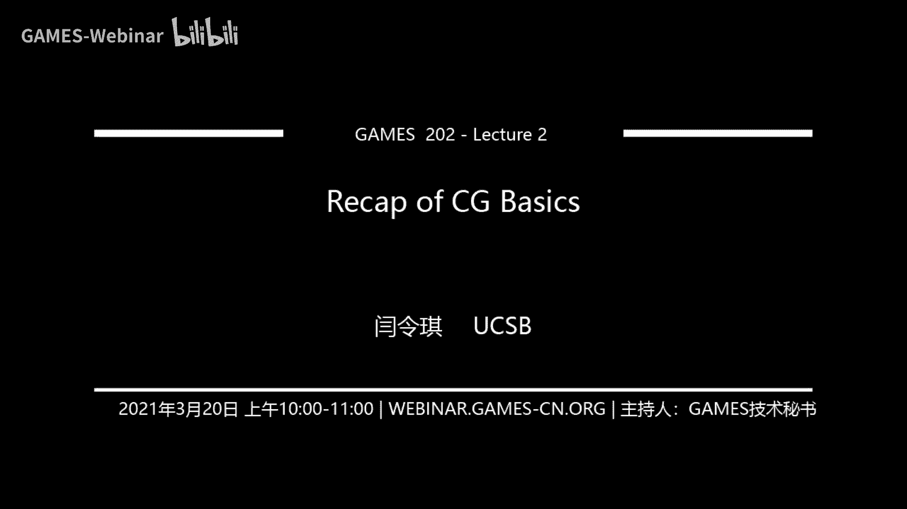
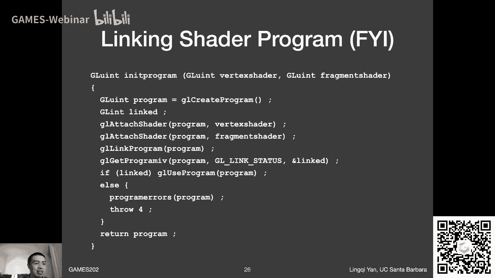
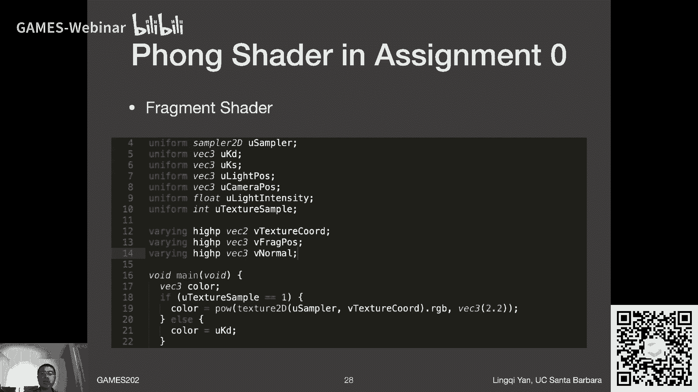

# GAMES202-高质量实时渲染 - P2：Lecture2 CG基础回顾 🎮

在本节课中，我们将回顾计算机图形学的基础知识，包括硬件渲染管线、OpenGL/GLSL的基本用法，以及描述光线传播的核心方程——渲染方程。这些内容是理解后续高质量实时渲染技术的重要基石。

## 硬件渲染管线回顾 🔄

上一节我们介绍了课程的整体安排，本节中我们来看看图形渲染的核心流程——硬件渲染管线。渲染管线描述了将3D模型最终显示为2D图像的一系列步骤。

以下是现代GPU渲染管线的主要阶段：

1.  **顶点处理**：将3D空间中的顶点通过一系列变换（如模型、视图、投影变换）转换到屏幕空间。连接关系保持不变。
2.  **光栅化**：将投影到屏幕上的连续三角形离散化为一系列像素（或称为片段）。
3.  **深度测试与遮挡处理**：使用深度缓存（Z-Buffer）逐像素记录深度信息，判断哪些片段是可见的，解决遮挡问题。
4.  **着色**：对每个可见片段计算其颜色。常用模型如布林-冯着色模型，它结合了漫反射、高光和环境光分量。
5.  **输出图像**：最终得到显示在屏幕上的图像。

这套管线能高效处理直接光照，但对于阴影、光线多次弹射等全局光照现象处理能力有限。GPU的高并行度是其速度的关键。

此外，在着色过程中还会涉及纹理映射和插值。我们使用重心坐标对三角形顶点属性进行插值，以得到内部平滑过渡的值。

## OpenGL与GLSL基础 🛠️

了解了渲染管线后，我们来看看如何通过编程接口来控制它。OpenGL是一套跨平台的图形API，运行在CPU端，负责调度GPU执行渲染任务。其对应的着色语言是GLSL。

### OpenGL的作用与特点

OpenGL的核心作用是告诉GPU要做什么。我们可以将其工作流程类比为画家作画：

1.  **准备模特与场景（定义物体与模型）**：使用顶点缓冲对象在GPU中存储模型数据（顶点位置、法线、纹理坐标等）。
2.  **摆放画架与画布（设置视图与帧缓冲）**：定义相机（视图变换）并指定渲染目标——帧缓冲。一个帧缓冲可以绑定多个纹理，实现一次渲染输出多张图（多重渲染目标）。
3.  **开始绘画（执行着色）**：这是最核心的部分，需要我们编写着色器。主要涉及两种：
    *   **顶点着色器**：处理每个顶点的变换，并输出需要插值到片段的数据。
    *   **片段着色器**：接收插值后的数据，为每个片段计算最终颜色。

OpenGL的优点是跨平台，缺点是版本碎片化且采用C风格API，编写和调试相对不便。我们更应关注着色器本身的逻辑。

### GLSL着色器代码示例

以下是作业中一个简单的着色器示例，展示了GLSL的基本结构。

**顶点着色器 (Vertex Shader)**：
```glsl
attribute vec3 aVertexPosition; // 输入：顶点位置（CPU传入）
attribute vec3 aVertexNormal;   // 输入：顶点法线
attribute vec2 aTextureCoord;   // 输入：纹理坐标

uniform mat4 uMVPMatrix;        // 全局变量：模型-视图-投影矩阵

varying vec2 vTextureCoord;     // 输出：传递给片段着色器的纹理坐标（会被插值）
varying vec3 vNormal;           // 输出：传递给片段着色器的法线（会被插值）

void main(void) {
    // 1. 顶点位置变换
    gl_Position = uMVPMatrix * vec4(aVertexPosition, 1.0);
    // 2. 传递插值数据
    vTextureCoord = aTextureCoord;
    vNormal = aVertexNormal;
}
```

**片段着色器 (Fragment Shader)**：
```glsl
precision highp float; // 声明精度



varying vec2 vTextureCoord; // 输入：从顶点着色器传来，已插值
varying vec3 vNormal;       // 输入：从顶点着色器传来，已插值

uniform sampler2D uSampler; // 全局变量：纹理采样器
uniform vec3 uLightPos;     // 全局变量：光源位置
uniform vec3 uCameraPos;    // 全局变量：相机位置

void main(void) {
    // 1. 从纹理采样颜色
    vec4 textureColor = texture2D(uSampler, vTextureCoord);
    // 2. 此处可进行光照计算（例如布林-冯模型）
    // ... (光照计算代码)
    // 3. 输出最终片段颜色
    gl_FragColor = vec4(finalColor, 1.0);
}
```
**关键概念**：
*   `attribute`：仅用于顶点着色器，表示每个顶点的属性。
*   `uniform`：全局变量，由CPU传入，所有顶点/片段共享。
*   `varying`：用于从顶点着色器向片段着色器传递数据，数据会被自动插值。
*   `gl_Position`：顶点着色器必须赋值的内置变量，表示变换后的顶点位置。
*   `gl_FragColor`：片段着色器必须赋值的内置变量，表示该片段的颜色。

### 着色器调试技巧 🐛



由于着色器运行在GPU上，无法直接使用`printf`。一个简单有效的调试方法是“颜色编码法”：将你想查看的中间值（如深度、法线方向）映射到`[0,1]`范围，然后作为颜色输出到`gl_FragColor`，通过观察屏幕颜色来推断数值。

## 渲染方程（Rendering Equation）📐

掌握了工具，我们再来回顾描述光线物理传播的核心理论。渲染方程是图形学中描述光线传播的正确数学模型。

其公式如下：
```
Lo(p, ωo) = Le(p, ωo) + ∫Ω fr(p, ωi, ωo) Li(p, ωi) (n·ωi) dωi
```
其中：
*   `Lo(p, ωo)`：从点`p`沿方向`ωo`出射的辐射率。
*   `Le(p, ωo)`：点`p`自身发出的辐射率。
*   `fr(p, ωi, ωo)`：点`p`的双向反射分布函数。
*   `Li(p, ωi)`：从方向`ωi`入射到点`p`的辐射率。
*   `(n·ωi)`：余弦项，将入射辐射率转换为辐照度。
*   `∫Ω ... dωi`：对以点`p`法线为中心的半球面所有入射方向进行积分。

在实时渲染中，我们常显式考虑**可见性**，将方程理解为：出射光 = 自发光 + 所有**可见**光源的入射光经过BRDF和余弦项作用后的贡献之和。

### 全局光照与实时渲染的挑战

渲染方程是递归定义的，包含了光线多次弹射的间接光照。全局光照 = 直接光照 + 间接光照。

实时渲染的主要挑战在于：
1.  **直接光照积分计算量大**：对每个着色点需在半球面积分，计算昂贵。
2.  **间接光照模拟困难**：涉及光线在场景中的多次弹射，复杂度高。

实践中观察发现，在直接光照基础上加入一次间接光照（即光线弹射两次）能带来显著的视觉提升，而增加更多弹射次数的收益递减。因此，实时渲染领域许多工作聚焦于高效模拟一次或少数几次间接光照。

## 总结 📚


本节课我们一起回顾了计算机图形学的核心基础。我们首先梳理了硬件渲染管线的各个阶段，理解了从3D模型到2D图像的转换过程。接着，我们学习了OpenGL/GLSL这套工具，了解了如何通过API控制GPU，并编写顶点和片段着色器来实现渲染逻辑。最后，我们重温了渲染方程这一理论基础，明确了直接光照与间接光照的区别，以及实时渲染在求解此方程时面临的挑战与主要目标。这些概念是后续深入学习实时阴影、环境光遮蔽、全局光照等高级话题的必备前提。