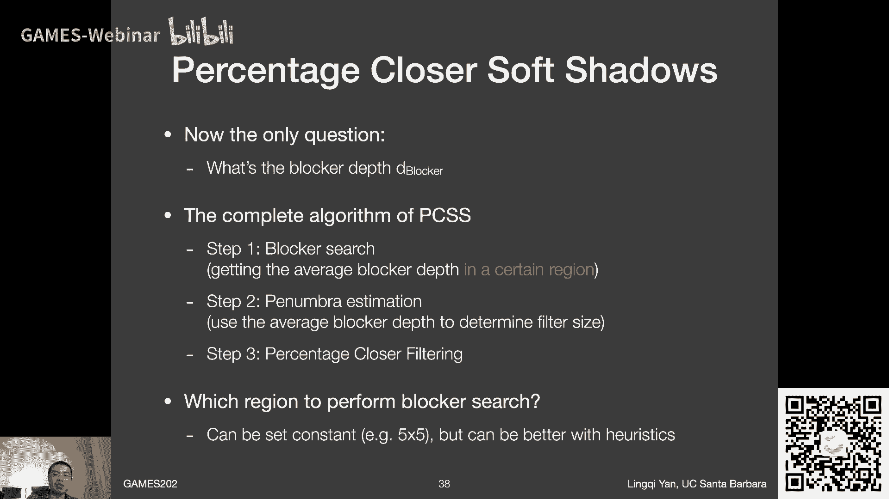

# GAMES202-高质量实时渲染 - P3：Lecture3 实时阴影 1 🎮

在本节课中，我们将学习实时渲染中阴影技术的基础知识。我们将从经典的Shadow Mapping技术开始，回顾其原理与问题，并深入探讨其背后的数学基础。最后，我们将介绍现代实时渲染中生成软阴影的主流方法——PCSS（Percentage Closer Soft Shadows）。

---

## 课程内容概述 📋

本节课将分为三个主要部分：
1.  **Shadow Mapping回顾与问题分析**：复习GAMES101中介绍的Shadow Mapping算法，并深入探讨其存在的自遮挡（Self Occlusion）和走样（Aliasing）问题。
2.  **阴影背后的数学**：探讨将可见性（Visibility）项从渲染方程中分离出来的数学近似原理，理解Shadow Mapping的理论基础。
3.  **软阴影生成：PCSS**：介绍如何利用PCF（Percentage Closer Filtering）技术来生成软阴影，并详细讲解PCSS算法的三个核心步骤。

---


## 第一部分：Shadow Mapping回顾与问题分析 🔍


上一节课我们介绍了实时渲染的管线基础。本节中，我们来看看生成阴影的核心技术——Shadow Mapping。


Shadow Mapping是一个完全在图像空间中运行的、两趟（Two-Pass）的算法。

### Shadow Mapping算法步骤


以下是Shadow Mapping的基本流程：

1.  **第一趟（生成Shadow Map）**：
    *   将摄像机放置在光源位置，看向场景。
    *   渲染整个场景，但输出的不是着色颜色，而是每个像素点到光源的**最近深度值**。这张深度图就是Shadow Map。
    *   代码概念：在Fragment Shader中，将深度值写入帧缓冲（如 `gl_FragDepth`），而非颜色值。

2.  **第二趟（实际渲染与阴影判断）**：
    *   从真正的摄像机（眼睛）位置出发，再次渲染场景。
    *   对于每个需要着色的片元（Shading Point），计算其到光源的距离。
    *   将该点投影到光源空间，找到其在Shadow Map中对应的深度值。
    *   比较**当前片元到光源的实际距离**与**Shadow Map中记录的深度值**：
        *   如果两者（近似）相等，说明该点可见，不在阴影中。
        *   如果实际距离大于Shadow Map记录的深度，说明该点被更近的物体遮挡，处于阴影中。


### Shadow Mapping的优势与问题

Shadow Mapping的优势在于，一旦生成了Shadow Map，后续的阴影查询就完全在图像空间进行，无需原始的几何信息。

然而，它也存在两个经典问题：

1.  **自遮挡（Self-Occlusion / Shadow Acne）**
    *   **现象**：物体表面出现条纹状的虚假阴影。
    *   **原因**：Shadow Map具有有限的分辨率。每个像素记录的是一个**常数值深度**，这相当于用一系列“深度小片”来离散化表示连续的场景表面。当光线以掠射角（Grazing Angle）照射时，这种离散化会导致下方的表面被误判为被上方的“小片”遮挡。
    *   **工业界解决思路**：引入一个**深度偏移（Depth Bias）**。在比较深度时，只有当实际深度比Shadow Map记录深度**大出某个阈值（Bias）**时，才判定为被遮挡。这个Bias可以根据光线与法线的夹角动态调整。
    *   **Bias的副作用**：过大的Bias会导致阴影与投射物分离，产生“悬浮”的阴影（Detached Shadow / Peter Panning）。

2.  **走样（Aliasing）**
    *   **现象**：阴影边缘出现锯齿。
    *   **原因**：Shadow Map分辨率不足，一个像素覆盖的深度块投影到场景中后，在阴影边缘形成明显的“块状”边界。
    *   **解决思路**：工业界采用多种技术，如级联阴影映射（Cascaded Shadow Maps, CSM）来为不同距离的区域分配不同分辨率的Shadow Map。本节课后续介绍的PCF也是解决该问题的一种方法。


---

## 第二部分：阴影背后的数学 🧮

上一节我们回顾了Shadow Mapping的实践方法。本节中，我们来探讨其背后的数学原理，理解为何可以将阴影计算分离出来。

这个原理基于一个在实时渲染中广泛使用的**积分近似公式**：

```
∫_Ω f(x) g(x) dx ≈ (∫_Ω f(x) dx) * (∫_Ω g(x) dx) / (∫_Ω dx)
```

这个公式将两个函数乘积的积分，近似为各自积分的乘积（并除以积分域的“体积”进行归一化）。

**这个近似在以下两种情况下比较准确：**
1.  函数 `g(x)` 的积分域（Support）非常小。
2.  函数 `g(x)` 在其积分域内变化非常平缓（低频/Smooth）。

现在，让我们将其应用于渲染方程。我们通常将渲染方程中的可见性项 `V` 单独写出：

```
L_o(p, ω_o) = ∫_Ω L_i(p, ω_i) * f_r(p, ω_i, ω_o) * cosθ_i * V(p, ω_i) dω_i
```

利用上面的近似公式，我们可以将可见性项 `V` 分离出来：

```
L_o(p, ω_o) ≈ [ ∫_Ω L_i(p, ω_i) * f_r(p, ω_i, ω_o) * cosθ_i dω_i ] * [ ∫_Ω V(p, ω_i) dω_i ] / [ ∫_Ω dω_i ]
```

**这个近似的物理意义非常关键：**
*   公式的**右边第一部分** `[ ∫_Ω L_i(...) dω_i ]` 正是**不考虑遮挡时的着色结果（Shading）**。
*   公式的**右边第二部分** `[ ∫_Ω V(p, ω_i) dω_i ] / [ ∫_Ω dω_i ]` 代表了**平均可见性**，其值在0到1之间，这正好就是**阴影的软硬程度**。

**与Shadow Mapping的关联：**
*   **对于点光源/方向光**：其光照来自一个单一方向（积分域极小，满足条件1）。此时，平均可见性 `V` 退化为非0即1的硬阴影判断，这正是经典Shadow Mapping所做的事情。
*   **对于面光源+漫反射表面**：面光源提供均匀光照（`L_i` 是常数），漫反射BRDF变化平缓（`f_r` 是常数），这满足了条件2。此时，平均可见性 `V` 就是一个介于0到1之间的值，可以用来计算**软阴影**。这为PCSS等软阴影技术提供了理论依据。


---

## 第三部分：软阴影生成：PCSS 🌓

上一节我们了解了阴影分离的数学基础。本节中，我们来看看如何利用这个思想生成视觉上更真实的软阴影。

### 从PCF到PCSS


首先需要区分两个概念：
*   **PCF (Percentage Closer Filtering)**：最初是一种**抗锯齿**技术，用于平滑Shadow Mapping产生的硬阴影锯齿。
*   **PCSS (Percentage Closer Soft Shadows)**：利用PCF的思想，通过**自适应地改变滤波范围**来**模拟面光源产生的软阴影**。

**PCF的工作原理（抗锯齿）：**
1.  对于着色点 `p`，不再只查询Shadow Map上对应单个像素的深度。
2.  而是在 `p` 投影点周围取一个区域（如 7x7 的像素块）。
3.  将该区域内**每一个像素记录的深度**都与 `p` 的实际深度进行比较，得到一系列二值结果（0表示被挡，1表示可见）。
4.  对这些二值结果进行**加权平均**，得到一个介于0到1之间的值，作为 `p` 的最终可见性。这个值不仅消除了锯齿，而且在视觉上产生了模糊效果。

**关键发现**：人们发现，PCF中使用的**滤波核（Filter Kernel）大小**直接影响阴影边缘的模糊程度。**滤波核越大，阴影越“软”**。这启发了PCSS的诞生。

### PCSS算法详解


PCSS的目标是为不同的着色点动态决定一个“正确”的滤波核大小，以模拟真实的软阴影。其算法分为三步：


#### 步骤一：遮挡物搜索（Blocker Search）
*   目标：估算在着色点 `p` 与面光源之间，**平均遮挡物的深度（`d_Blocker`）**。
*   方法：在Shadow Map上，以 `p` 的投影点为中心，在一个初始范围内（例如，根据光源大小和 `p` 的深度估算出的一个区域）搜索。
*   操作：对该区域内每个像素，判断其是否遮挡了 `p`（即其深度是否小于 `p` 的深度）。将所有遮挡物的深度值取平均，得到 `d_Blocker`。


#### 步骤二：计算滤波核大小（Penumbra Estimation）
*   目标：利用相似三角形原理，计算 `p` 点应有的半影（Penumbra）宽度，即PCF所需的滤波核大小 `W`。
*   公式：
    ```
    W_Penumbra = (d_Receiver - d_Blocker) * W_Light / d_Blocker
    ```
    *   `d_Receiver`: 着色点 `p` 到光源的深度。
    *   `W_Light`: 光源的物理大小（在场景中的度量）。
    *   `(d_Receiver - d_Blocker)`: 遮挡物到接收面的距离。距离越近，阴影越硬（`W` 越小）；距离越远，阴影越软（`W` 越大）。

#### 步骤三：执行百分比渐进滤波（Percentage Closer Filtering）
*   目标：使用步骤二计算出的滤波核大小 `W_Penumbra`，在Shadow Map上对 `p` 点执行标准的PCF操作。
*   结果：得到 `p` 点最终的、平滑过渡的可见性值（软阴影）。

### PCSS的效果与性能



PCSS能产生非常真实的软阴影效果，例如近处的阴影较硬，远处的阴影较软，符合物理观察。

然而，其性能开销巨大。每个着色点都需要进行两次密集的纹理采样（Blocker Search + PCF）。在后续课程中，我们将介绍如**Variance Shadow Mapping (VSM)** 等更高效的方法来加速软阴影的计算。


---

## 课程总结 🎯

本节课中我们一起学习了实时阴影渲染的基础与进阶知识：

1.  **回顾了Shadow Mapping**：理解了两趟算法流程，并重点分析了其固有的**自遮挡**和**走样**问题及其缓解方案（如Depth Bias）。
2.  **探讨了数学基础**：通过一个关键的积分近似公式，理解了将**可见性（阴影）** 从着色计算中分离出来的理论依据，并明确了该近似在点光源（硬阴影）和面光源+漫反射（软阴影）情况下的适用性。
3.  **学习了PCSS算法**：掌握了生成软阴影的主流方法PCSS。其核心思想是**根据遮挡物距离自适应地改变PCF的滤波核大小**。我们详细分析了其三个步骤：Blocker Search -> Penumbra Estimation -> PCF。


通过本讲，我们建立了从硬阴影到软阴影，从实践技巧到数学原理的完整知识链条。在下一讲中，我们将继续探索更高效的软阴影算法，如Variance Shadow Mapping，并进一步讨论如何对阴影进行滤波和降噪以提升性能与质量。