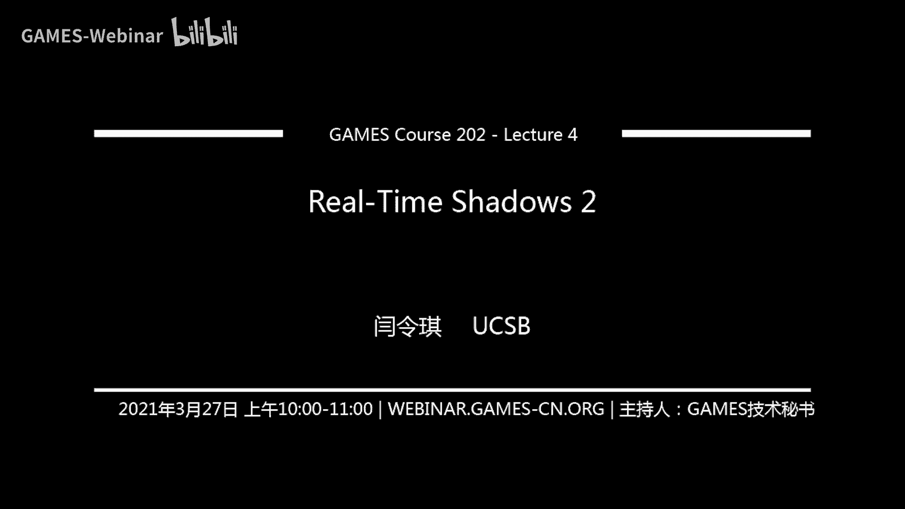
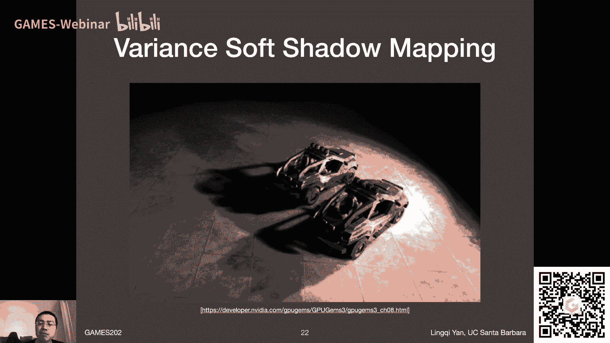
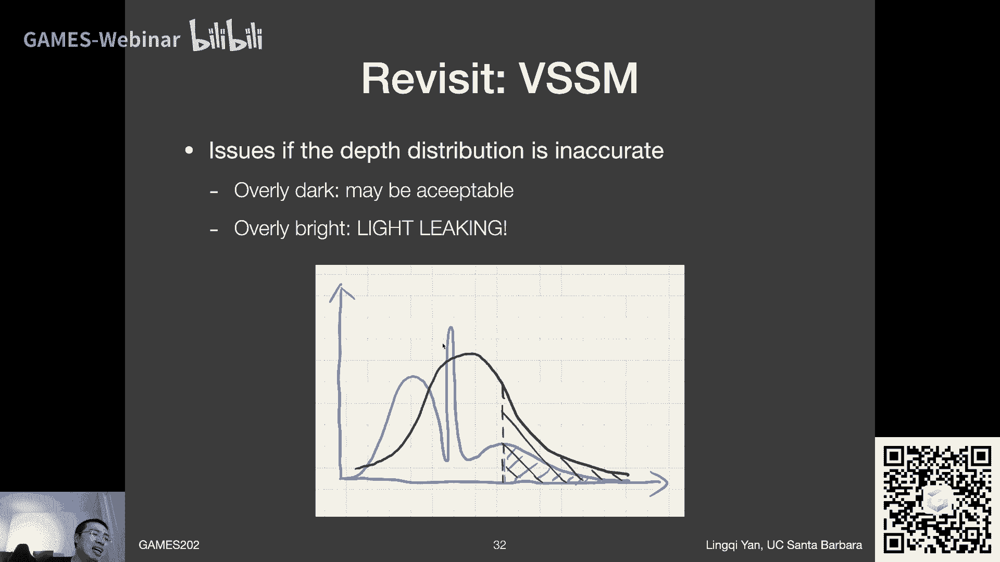
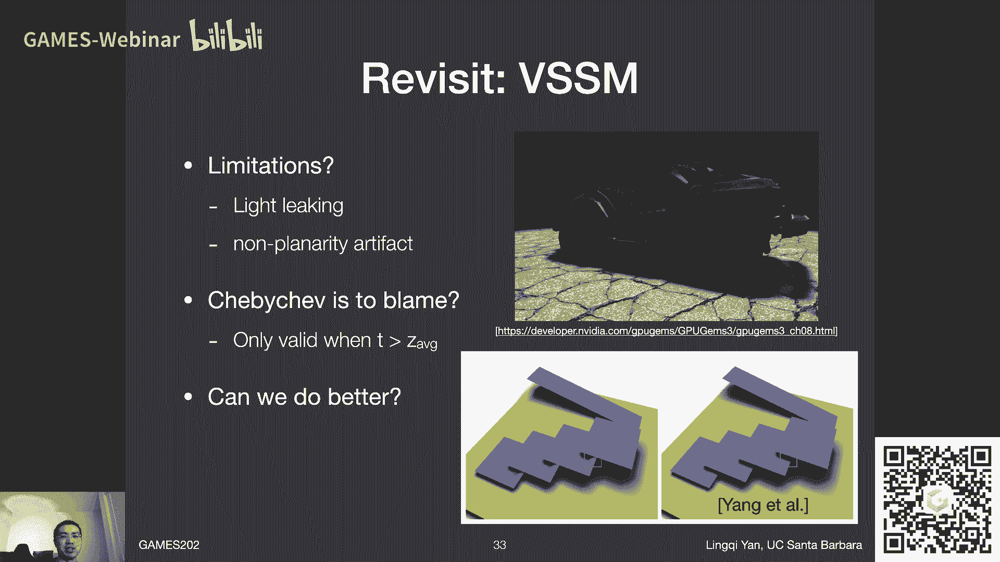

# GAMES202-高质量实时渲染 - P4：Lecture4 Real-time Shadows 2 - GAMES-Webinar - BV1YK4y1T7yY

好的各位亲爱的同学们，然后今天呢，我们会尽量把跟这些实时的阴影相关，的话题给说完啊，这么个意思，那么还是一样呃，在课程正式开始之前，我们先说一个事儿，什么呢，就是我们的作业一，我们作业一。

我们的助教同学们正在积极的筹备中，然后还需要一点点时间，请大家稍微耐心一点，好吧啊，然后呃尽量今天国内的今天可以呃，呃可以发布，如果不行的话，那就是明天了，好吧啊，然后正常情况下呢，我们这几次作业。

应该每一次作业都有1。5个星期，就按十天来算吧，差不多是有那么长时间可以做的，应该是没有问题的好吧，那么作业一虽然还没有发布，但这里已经有一位大佬同学已经哈哈哈呃，这自己把它给实现出来了，我的天。

这实在是非常夸张的一件事情啊，啊我们这个好好表扬一下maxwell同学，听一下这名字，max思维就非常厉害对吧，ok啊大佬工业界大佬啊，非常厉害，然后大家看这个渲染的效果非常的好啊。

然后大家可以看到这些阴影对吧，特别是202酱的手投影出来的这个阴影，这是很明显的软阴影对吧，然后呢，右边我和我一位朋友来聊着这样一个结果，然后他告诉我说，他以为这是这是照片，他以为这是我新买的手办。

他觉得这个做得非常和谐，然后说我这个呃教教实时的，这做的已经非常像离线了啊，非常好，然后说这位确实是大了，那么这是谁评论的呢，那当然这是另一位大佬，这就是传说中的文刀秋二。

哈哈这是edward流啊啊dlss的创始人之一吧，啊nvidia的超级大佬啊，大家可以看到啊，他都对这么一个结果做出了这么高的评价啊，非常好啊，提出表扬是这样啊，我这正好趁这个事情我多多说一句。

多说一句什么呢，然后我知道max well大佬是在在工业界的，然后就是工业界，大家可以从这幅图就可以看到，有着极其强大的工程知识动手能力，对不对，然后呢呃学术界这边呢，当然大家之后再上这门课。

或者是反正对学术界的正常理解吧，完整的知识体系与解决新问题，甚至发现新问题的研究能力，那会是一个非常相得益彰的事情啊，这更进一步印证的说确实没有问题啊，然后咱们这个课上把这个科学给说清楚。

然后技术上大家可以继续呃，然后把这个呃之后的技术都给锻炼好啊，非常好好的，那这就是咱们这课前表扬。

ok那么这节课呢啊，我原本说我砍掉了一些内容哈，但这一次呃突然今天发生了一些意外的事件啊，然后导致说我们这节课呢，有很多东西需要跟大家去讨论，那是什么事儿呢，唉这里大家可以猜一猜对吧哈，好吧啊。

不过没关系吧，我来说啊是这么回事，正常情况下呢，呃作为图形学上这所谓最高级别的会议哈，大家都知道叫srah ciraph的投稿时间是1月底，然后出review的时间是3月初，然后出结果的时间是3月底。

那么今天正好赶上他出结果，然后呢，我呃之前上个月这个时候就已经坐不住了，我想着哎review要出了嘛，然后我就觉得非常的这个坐立不安，于是我就去看节目啊，看各种各样的节目，于是我就去看了星际的一场比赛。

大家可以看到这是马路对solar的比赛，然后如果有同学看过的话呢，哈哈哈大家就会发现啊，为什么呢，是因为在这场比赛中，老仙又发功了哈哈，然后他再这幅截图的前一秒说了六个字，不可能中的呀哈哈。

然后大家的下一秒就可以看到这个sa的大部队，被马入的原子弹给打中了，诶好吧，于是呢诶当时呃我这看了之后，我觉得好嗯嗯这回sirrah应该是稳了，因为他说不可能中的，对不对，所以呢今天得到了好消息。

那么那么在这次的craft中，就我和合作伙伴嘛，然后总共有四篇paper被收录到siggraph 2021中，好吧嗯然后这里特别感谢呃，我的是全明星的同学们和合作伙伴们啊，非常感谢大家。

然后呢呃作为四篇paper的话，在渲染领域哈，今年很有可能就是今年siggraph最多的paper了，因为每1年siggraph渲染的paper非常少嘛，十篇出头吧，然后如果有四篇的话。

那应该是呃最多了好吧，然后呢由于这四篇siggraph呃中了，然后这同时造成了一个事情，那就是我的职业生涯中cirh呃，这个期刊啊，这些都是就是最顶级的了啊，加起来论文已经达到了20篇啊。

然后这是一个非常里程碑的一件事情啊，是这样啊，就是说啊咱们的不同领域不应该呢过去呃，各种各样的去比较啊，甚至子领域，就是说大家平常很难见到，说我去跟比如说什么呃simulation啊，或者是做几何的呀。

就是都是空军学内部，咱们说谁siggraph paper多，因为这个领域是相差的特别多，那么20篇呃rendering的paper，那算是非常多了，呃到一个什么程度了呢。

但我觉得吧如果我现在跟我的系主任说，我要退休，应该是可以的啊，这个意思好吧，嗯然后差不多是这么个意思啊，这就是说一下啊，炫耀一下，当然我今天非常高兴，然后我才会这么说。

大家知道我平常还是店里稍微低调一点啊，这个意思行吧，嗯然后呢嗯借这个机会呢跟大家说一说，这这这这个事儿对吧，就是关于siggraph嗯，大家有同学会说我不是已经有很多的paper了吗。

干嘛还要发那么多paper呢，那这里是一个我很想跟大家探讨的一个问题，好吧，那这这怎么说呢，就是说学术上大家平常都会关注一个啊，这个所谓数量跟质量，就是多还是基因这么一个呃权衡嘛。

这么个意思就是说有不同的啊组研究的组，不同的人不同的方向啊，大家都选择了不同的这些这些啊，这些嗯怎么说呢，方式去推动他们各自的这些科研，我自己当然也是这样，不过呢咱们从第一节课啊。

咱们从这门课的第一节课，应该跟大家说了一下这个事儿对吧啊，嗯什么呢，就是说呃实时现场对吧，我们要做到什么呢，我们要做到高质量，我们也希望他能够能够快，我们不希望权衡，我们希望我全都要对吗。

那么在这个啊科研很少，唉我其实胃口是非常大的对吧，就是说我是希望说又可以有多的paper，又可以把他们都给做得好，那这当然是目标了，是这么个意思，那么为什么我一定要这么做呢。

这其实是一个很心酸的一个背后的一件事情呢，啊那么这这这这啊说来是这样哈，就是说我在博士毕业的时候，然后当时呢我人还在berkeley啊，我和berkeley的任ng老师啊，大家还记得他对吧。

说了他好多次了，呃，和他探讨过很多，这些我要怎么样找工作的这么一个事情啊，就是在学术界转一圈，我应该怎么样去好好去面试啊，或者干什么，然后呢他当时跟我说一个事情啊。

当时算是第一个人跟我呃好好说的这么一个啊，一定是需要注意的一个事情啊，很有哲理的一个事情，什么呢，原话我不记得了，但是我可以简单说一下，嗯大概是这么个意思啊。

lji you're not just going to sell yourself，as a superstar，you're also going to sell the sports。

ok大家能听得明白这个意思吧，就是说你如果去找工作，你要做的事情不只是说把自己给推出去，作为一个超级巨星这么一个意思哈，你还得把你所做的这项工作也得把它给说出去，让别人能够接受，言下之意。

就是大家都知道rendering这个领域是非常难的，它难在很多不同的方面，它难在首先idea非常的难想，很多人就会说rendering呢这个领域大概做不动了，这么个意思。

很多的这些这些想法呢都之前都被解决掉了，或者是剩下来的都是很难的想法，那么我的一个嗯嗯感觉就是什么呢，一方面说的是对的，另一方面我不希望承认这个事情对吧，我有我自己自负的地方，这是没有问题的。

ok然后这里呢就是说嗯，嗯就是说不管在呃之前找工作吧，这些所谓cd sport的这么一个工作，所以从这个角度上来说呢，就是说哎确实从发paper的角度上来说，又得发很多的paper。

然后呢又得把这些paper的质量给做好，然后这样的话才能为别人所承认，才能让别人认为说，或者说给热爱rendering的同学们，老师们提供一个信号，说rendering还是有东西可以做的。

然后我虽不才对吧，但是这是我希望能够带给大家的一件事情好吧，那么哎我之前说我平常没事看一看nba对吧，然后大家知道我最喜欢的球星是谁吗，他是呃就是库里啊，然后就是说哎为什么我喜欢他呢。

因为一定程度上有很多东西是挺相似的对吧，大家知道库里呢，他作为一个nba的球星，他是没少啊，这是呵呵很严重的一个事情，然后呢如果他希望联盟能够认可自己的话，他就得投402个三分，他就得过了。

中场就顶着人头才会有人承认好吧，所以说一定程度上来说，然后希望能真正能够把rendering作为一个呃，呃非常不错的领域，然后这个嗯嗯带给大家rendering之后，更多的可能性吧，这么个意思好吧。

那简单跟大家说一说这背后的一个思想，就是说我又要做多又要做精，这是我一定要做到的事情，好吧好吧嗯就是这么一个事情了啊，ok啊简单说一说，这次因为这个sirh呢，然后想到了一些事跟大家分享一下。

大家不只是说从课也要学一些什么，这些基础知识，大家还得意识到说啊，这个呃各行各业工作都不太容易的，对吧啊，ok好嘞，咱们再回到刚才说的事，我说什么来着，我说我这啊，我因为这次sp了。

导致说我现在啊论文啊，这个系列的论文啊攒够到了20篇，那攒够了20篇到底有什么好事情呢，大家可以看到这是greater news，greater news是什么呢。

就是说我终于把我的ps four赎回来了，诶这是什么意思呢，啊那所以说跟大家简单说一说，我的这个故事啊，这么个意思，就是说呢，然后当时就买了，买了之后呢，哎这没打多少东西，打了些这个美国末日。

然后呢打了gta 5，然后就被领导给拿去了，家里领导哈，这这被领导拿去征用了，那这我就没办法了，那就那就给他了，然后我说那我什么时候才能把ps four赎回来呢，那领导就想问一下，领导告诉我说呃。

说等你攒够20天cig rap的时候，你就可以把它给赎回来了，然后那么今天就是这么一个历史性的时刻，哈哈我终于把ps four赎回来了好吧，然后我就可以嘿嘿嘿之后可以愉快的玩耍了。

这是非常开心的一件一件事情好吧，然后呢那肯定有同学会说这个意思，你为什么不给他买一个chrome cast，或者拿任何什么盒子，是不是这个意思吧对吧，然后呢那这么说的同学，那么非常抱歉。

看来你还没意识到你为什么单身，对不对，这领导做出的决定，你都可以质疑是吧，嘿嘿嘿嘿嘿嘿嘿诶好吧好吧好吧嗯，所以说呢就是呃这么个少啊，那么嗯哎呀还我那么那么在这之后呢，我当然还有下一步的目标。

下一步的目标是什么呢，也是领导给定好的，定好的是什么呢，就是哎我需要30篇啊，总共啊攒够30篇zoe，我就可以解锁ps 5啊，这是非常开心的一件事情，然后如果顺利的话，看看明年年底能不能完成这个任务。

如果不行的话，后年也可以啊，到时候嗯反正不区分pro，到时候也可以买，好吧啊，这么个事儿，到时候看30篇啊，希望能够做到，那么呃跟这个同时还有另外一个上，顺便跟大家说一说，就是说我在家里面。

大家可以看到我在games 101里面发了番外对吧，这个games 101做的就是就是就是弹段琴，然后现在再弹一个电子钢琴，然后我觉得我想换一个换一个真的钢琴，我就跟领导商量，哎我跟领导商量呢。

那领导领导说那行吧，你要是想换钢琴的话，那你就去你就去把激流给练了，哈哈是吧，然后我我说好啊，这个问题不大，但是我说我想换一个好点琴，我想换一个施坦威的琴，那领导想了想说，那不行。

那你就得把李斯特的钟给练好，然后我那行吧，所以说这就变成了我的下一步目标，那那那那我就练着呗，反正这个这个钟它不是一般人练的真的，然后他有个俗名叫我还能大跳，可能大家去随便看一看任何的什么视频。

大家就知道为什么会有这么个俗名了，好吧，夸张无比的唉行吧，不知道这跟30篇zh或者说ps 5，什么时候哪一个能够先到了再说吧好吧，反正就是说这是这么个事，ok嗯行吧，那这就是这一个更好的消息。

那么是这样哈，就是说我说今天呃就正好借这个机会吧，然后我顺便我一定要做一个广告呃，为什么要这么做呢，唉是因为生活所迫呀，没办法呀，我原本想着说我们找一个什么其他时间啊。

或者这课的最后能想着不趁着cirh这波，我顺便把这东西东西都给说完之后，就没什么机会了，对吧啊，哈哈哈哈好吧，然后呢嗯那这要我在说什么呢，我在说这个事儿，就是呃大家都知道了，这正常情况下。

不管看电视剧或者干什么，第二季要干什么呢，第二季肯定要用来植入广告，对不对，那所以说我在这个嗯第二节课上，我也植入一下广告，那么呃我是要干什么呢，是这样的哈，就是说啊说句非常现实的一个呃一句话哈。

就是说我现在呃这是非常非常缺银子的，那我缺银子是怎么回事，我说清楚，不是我个人缺银子，我说我缺银子，使，是没有这个对应的资金去支持我的博士生们啊，或者说去招更多的博士生们，这么个意思啊，不是个人的。

就是说嗯怎么回事呢，就是我被招到这边啊，呃来开始当这个所谓assistant professor之后，到目前为止，这个方定的是哎，就是这资金是非常非常非常呃怎么说呢，不成功的，这已经2年多了。

戏里面给的快要被我用完了，然后呢之后再没有更多的资金支持的话，就实在是养不了我的这些博士生梦啊，那我这些这些同学们就得被迫过去当助教，是不是非常惨的一件事情，对不对，所以说啊救救孩子。

这个我的工业界的伙伴们，真的我现在立刻马上真的就需要大家的支援啊，然后养一个博士生是非常非常非常便宜的，对工业界来说，真的每1年只需要5万刀左右啊，这么个意思，然后如果你有意向的话，然后请联系我。

然后嗯不管是通过什么样的形式，比如说大家可以看，通常呢工业界和这个嗯，和和和学术界的合作方式，最简单就是给学生发奖学金，然后或者说发所谓gift founding，直接发到戏里面。

然后呢或者是如果公司有一些跟rendering相关的，呃这些要求的话，然后又觉得我能力是可以的，那么我是非常开心，可以去给给大家当顾问的，那么国内呢这个合作与这边的合作是，几乎所有的公司都是可以的。

只有一个公司，you know who，我就不再说了，这是确实是不行的，这不怪我好吗，这真的不怪我，这确实不行，其他的公司都可以，欢迎联系我好吗，然后然后真的是这样，然后我希望能够用这个诶。

我的知识能够帮到大家一点，然后也希望大家能够帮到我一点，能够嗯让我能够比如说嘛招更多的学生，然后让学生们呢能够少做一些助教工作，能够更多地集中精力到呵这个科研中去好吗，然后至于我科研做的怎么样对吧。

这个没必要再说了对吧，好的那么呃一个立刻可以做的事情是什么呢，就是说这个siggraph呢，我既然知道刚刚有一些paper中了，那么paper中了之后有一个重要的事情就是要写。

致谢致谢里面呢大家可以看到啊，一个我之前写的致谢，就会把就会把啊日支持了这工作的啊，这些这些政府啊公司啊，写上名字啊，然后所以说如果你立刻联系我的话，是非常有希望可以感觉到你的。

大家可以知道我的这个不管怎么样，论文吧，他是肯定可以嗯有着不错的曝光度的对吧，然后论文呢这个东西是永久的，然后只要写在这里，那是很多年他都会一直在这里的对吧，然后所以说在这里呢可以出现贵公司的名字。

那我是非常开心的好吧，那我就说到这里，然后我另外说两件事，第一绝对不会通过任何个人的渠道，问大家收取任何费用，所以这课对同学们来说百分之百免费，绝对不会是任何问题的啊。

另外一点我需要的银子是给到戏里面的，并且写清楚是用来支援学生的，我一分都不要啊，我说清楚我自己不缺啊好吧，然后呢唉另外有同学说说老师，啊然后我跟同学们说是完全没问题，致谢就是用来做这个的。

我把你加上作者，那是绝对绝对绝对不可能的事情啊，就是说如果你给我银子，我是一定应该把你写到这个致谢里面去的，这是没有任何问题的对吧，并且我不止可以说这个对吧，以后有哎有人在问我说呀。

是您最喜欢的这什么呢，呃最喜欢的游戏角色是谁，我就我就不再说是a2 了对吧，我就说我是我最喜欢月清书对吧，鹿鸣对吧，唉这都可以呃，嗯800比丘尼，哈哈哈哈对啊，然后还能想到什么，反正很多吧啊没关系啊。

这么个意思啊啊行，对同学们来说没有任何的关系啊，是这个就是就是这么回事了，另外最后再说一句哈，那诶大家看到这个标题啊，food for thought啊，food for thought，其实是啊。

这里算是直接字面上用它了，然后呢嗯呃呃呃如果你还知道啊，food for thought alt曾经是一个密码，那恭喜你，你跟我一样年龄大了，哈哈哈哈哈哈好吧行吧行吧，那同学们今天我就说嘛。

我花点时间专门说一下这个事情，也是也是因为啊今天cirh非常开心，然后跟大家呃多讨论一些这些跟课程内容呃，不是特别相关的东西，但是呢有一点可以保证，绝对不会因此少了课程的内容哈，肯定是可以。

哈哈哈哈哈哈呃行吧啊，那咱们这就算是进入到这正常的课程中来了，好吧，那咱们上节课讲了什么呢，咱们上节课讲了shadow mapping的一些问题对吧，也基本做法，基本问题基本解决方式。

然后呢我们着重分析了一下，就是我随手写的一个什么样的一个一个公式啊，然后再在呃在呃整个实时渲染里面，大家是管这种方式叫做split sum，然后这块之后再给大家正式的引入，这么一个概念啊。

之后再说嗯然后呢给大家说到了啊，作为percentage closer soft shadow啊，这块基本上来说tcs s从tcf开始对吧，然后到这块各个不同的地方，应该飞不同大的这种大小的区域啊。

这块啊这么说清楚这个意思好，那差不多就是上节课说的这些内容，那么今天我们说什么呢，今天我们把这个啊pcf呃，和pcs s的这个内容在加强一下，我们在说的更加深入一点好吧，然后呢同时我们再引入呃。

这节课要讲的一个新话题叫variance soft shadow map，作为vs s m啊，当然也有人管它叫vance shadow mapping，叫vs m问题不大啊，这个意思好嘞，那嗯行吧。

嗯之后呢，在这在这个过程中，再跟大家说一下它的具体的一些实现方式，然后以及一个比它更高端一点的东西，叫moment shadow mapping，这样的话呢，我们差不多关于主流的阴影的技术就提到了。

然后嗯这节课肯定讲不到，那么下节课给大家多少提一下基于距离场的呃，关于shadow mapping的技术，好吧，我们这个意思行，那这样的话啊，我们就开始第一个话题啊。

咱们沿着之前上节课说的这个percentage，closer filtering对吧，大家看percentage closer filter做了什么事呢，大家还记得对吧。

那就是说对于我实际渲染的任何一个点，大家可以从这幅图里面看到x，这部x呢我知道它投影到对应的shadow map上，应该是哪个像素，只不过呢我不只考虑这么一个角色，我考虑一下周围的一圈这些像素。

甚至这些像素，它们的各自的贡献都可以加全的，它不一定是一个box，大家从这看可以有，比如说靠近这个p点的呃，他贡献多一点，远离他的少一点，没有关系，这属于取一个呃某种区域或者加权的区域。

那在这个区域里面的其他的这些点，他们各自也都会在shadowmap上，记录着他们之前记录的最小深度，然后用这个深度同样跟x它的实际深度去比，然后我来判断这整个区域内到底有多少啊，这些嗯这text对吧。

或者说fragment啊，挡住了这么个x这么一个点，对吧啊，然后这样一来呢，我就可以算出来，他们平均的这么一个visibility对吧，然后这样一来，我就可以把整个阴影给变得比较模糊。

而这个过程正是我们在数学上直接说的，叫做filter或者convolution这么一个过程，好吧啊，那么这里呢就是差不多就是说这么个意思啊，然后大家看这个看这个公式，这个公式呢就算是一种简写。

就是说如果我要对某一个函数，然后做一个convolution，我可以把它记住哦，用一个convolution w，然后打一个这个卷积，这个符号和f放在一块哦，把它定义成一个呃filter过来的。

或者卷积过了的函数啊，这么个意思，然后呢呃那他实际上做了什么事呢，实际上就是相当于啊对任意一个呃像素p，我都取它的周围的一圈啊，这这呃淋浴啊，就是大家看这个nt就是他的淋浴。

淋浴中间呢我去取一个啊嗯这个点点q啊，然后他的所有这些点q我都把它这么考虑下来，并且呢把这些所有的这些点q的值，然后按照根据啊，根据这个点q和点p，比如说他们之间的距离，然后做个加权。

然后我把它最后的值给呃，重新写回这个点p的值，那说白了就是我们在电子101之前曾经提过，对吧，就是filter嘛，它其实就是加权平均，也就是convolution，我们并不怎么特别去区分它。

那么在p c s s里面，我们到底做了一件什么事呢，那就是这样的，就是说我所谓filter的是什么，同学还记得吗，就是说对于任何一个神灵point x这里，然后呢我们都要去啊。

考虑他在shadow map上这个某一个位置对吧，考虑到某一个位置，它周围的一圈啊这么个意思，然后他在shadow map上对应，那就是x那投影到shadow map上变成点p。

那在点p的周围的一个区域，然后我们找它里面的这些所有这些点，考虑这些其他的点点q，任意一个点q是不是点q能够遮挡住x，那哪一个函数能够告诉我们，点q是不是能呃遮挡住呃这个x呢，哎那咱们就看这里就好了。

那么这里是指什么意思啊，大家看这呃，不管怎么样，它是一个经典的一个filter的这么一个过程对吧，它是一个这是全这右边那自然就是直喽，那这个值自然就是阴影比较的结果咯对吧，我们之前说呃。

我看这个点q能不能挡到x挡到的话，那这个visibility就是零嘛对吧，挡不到的话，visibility就是一嘛，所以这个函数它的值只有两个，对不对，只要么一要么是零，所以我们用这么一个函数。

这个叫做k啊，这个函数念法，他在这个ltg里面打法就叫杠c h i啊，他念作k k这个函数，我们我们定义这个函数，叫做一个所谓的符号函数，符号函数是什么意思啊，就是说嗯嗯嗯这块在微积分里面其实也定义过。

但是也非常简单，什么呢，它就是一个阶梯函数啊这么一个意思，然后他呢呃在呃，如果他的嗯变量就是整个它里面这个东西呃，就是就是它这个变量如果是呃大于零的，那我最后这个函数值k这个k函数的值呃。

它就是一如果说它是小于零的，就是它里面的变量啊，嗯它的值小于零呢，最后结果就是零啊，这么个意思明白了啊，所以说那那这不就正是阴影比较的结果吗，对吧，我每一个点q它对应的深度和x的深度，我们比较了之后。

然后我就呃我就可以知道哦，这个k这个函数告诉我们的到底是invisibility，是零还是一哦，那我把所有的这些点q它对应的visibility是零，还是一，按照某种形式加权平均起来。

或者说我不加权对吧，然后那我得到的最后结果是不是，就是我这个x这么一个点，他的呃最后的这个p c s s之后的结果对吧，那就是这就是它背后的这么一个数学的公式，那么从这个数学的公式上。

我们就可以看到说为什么我们说pcf这种方法，然后它并不是在filter shadow map，那filter shadow map是什么意思呢，那自然就是说。

shadow map上记录了这么一个任何一个点，它对应的深度的值，那就是说在shadow map上记录的这个深度，在这q位置上对吗，那shadow map被模糊了。

意思就是说我其实是相当于是呃profiltering，或者叫呃convolve呃，这样一个shadow map上面的一个图，就相当于我并不是这么做的，可以看到这里是一个不等号对吧。

我其实做的是上面什么公式，我做的根本就不是说我先把shadow map做个模糊嘛，另外其实你如果做了shadow map的模糊之后，你再去做比较，不管你跟什么值比较，最后比较出来的值也是非零即一啊。

对不对，那也就是说这样的话它并不能给你任意，那么另外一方面通过这种方式，你也可以直接就看到哦，我并不是说呃这个p c f呀，它并不是说在图像上去做一个啊，这么一个所谓的filter。

咱们上一节课给大家提到的，对不对，就是说我最后啊，我已经得到了一个有锯齿的硬阴影了，然后我在这个一有锯齿的硬硬营商，我去做一个模糊，试图去解决抗锯齿的问题，那这种做法，那实际上就是在所谓。

呃这么一个图像空间上来做哈，就是这么个意思啊，哎呀这里面有一个地方写错了哈，然后中间选一个y吧，咱们就不是p和q好吧，x的领域中选一个y，然后它的贡献就是x和y之间的某种距离。

然后它的值就是之前在y这个点上，它对应的visibility啊，这么个意思好嘞，那行吧，嗯这就是在这个pcf嗯，它背后的这些知识啊，ok那这样一来的话呢，我们就说完了关于这块的pcf。

然后呢咱们现在再回到说我们应用嗯，pcf去做啊，软硬影是怎么样去做的对吧，大家还记得这个事情好，然后呢嗯大家可以看一下，就是说我们上一节课已经说到了三分三步，对不对。

分三步就是首先呢我要做一个所谓blocker search，这么一步，那么这block search是在干什么的对吧，他就是说啊他首先他的目的是为了决定说哦，如果我呃在呃shadow map周围。

取悦某一个呃大小的区域啊，那么这个区域里面大概呃有多少是呃，这个呃所谓的blocker就是遮挡物，并且我算出来这么一个遮挡物的平均距离，我算这个遮挡物平均深度吧，这么说平均深度啊。

average blocker depth，遮挡物的平均深度，虽然这个东西是干什么的，是为了第二步用的，第二步就是说我用这个遮挡物的平均深度，我就可以估算出我在第三部。

应该在这个shading point周围，filter多大对吧，那咱们之前所说的就是这么一个逻辑了，只不过上一节课咱们是倒着说的对吧，然后呃那行啊，ok没问题哦。

有同学说我之前slide有一个呃写错了是吧，p cf简称pcs s好吧，之后我看看你慢慢改，有同学问啊，为什么空间域的卷积就是加权平均呢，啊卷积实则就是差不多是呃家卷平均分，你可以试着把卷积写成什么呢。

写成一两个函数乘起来，对应指相乘，然后再做积分这么一个形式，如果你把它写成离散化的形式，那就会变成了两个函数乘起来呃，然后并且外面把积分号改成求和号，而求和里面两个函数相乘。

这不正是呃所谓加权平均的这么一种表达式嘛，对吧，这么个意思好吧，那咱们回到pcs s上来，他分这么三步，那么我现在问一个问题对吧，咱们上节课其实提了这三步中，哪些步骤是可能会比较慢的对吧。

这是一个比较严肃的一个问题对吧，因为我们想着这p c s s呢，它可能会跑的比较慢，是因为什么呢，在这里写，原因，就是说我在第一步和第三步里面，都需要做这样一个操作，就是在整个一个区域内。

我要看他所有的这些呃，呃这个区域里面的所有的所谓taxi，它上面记录的这个深度，并且跟某个深度相比是吧，第一步我肯定也要这么做，第三步我肯定也要这么做，如果我这这两步是这样的哈，这两步如果我不采样。

那我取这么大一个区域哦，我知道他在texture上占据多少乘多少，这么一个格子，我不采用的办法，那就只能我每一个格子我都看一遍，是不是这个意思，那就是说呃这是一个非常缓慢的过程，那如果说好。

我觉得这个区域太大了，然后呢唉我不想把里面的所有的text都看一遍，然后我想在中间随机取一些样本啊，这也是咱们的作业的一个实现方式啊，在这么一个区域内，我去随机的取一些样本，那这样的话。

我就我我我也一样可以得到一个结果，只不过这个结果呢那自然就是近似的了，对不对，那就是这么一个一个思路，而这个近似会造成的结果就是所谓noise，就是最后的得得到结果，看起来就是噪声会很多。

是这么个意思好吧，然后呢那同样它还有呃另外一个问题，就是说如果我之前不采样，那我最后我得出来哦，我应该filter一个巨大的区域，64x64，那我是不是说这整个64x64个txt，我都得走一遍对吧。

那那这就会比较慢呀，那对于比较大的filter的范围，那么肯定就会比较慢，那如果说呃我去采样，那64x64原本那么大的范围，那我中间采样某个固定数量的三倍数，可以啊，当然可以。

但是呢它造成的结果就是noise呗，之前我们说过对不对，那所以说呢这是一个比较啊严重的一个问题哈，那么嗯但是正常情况下大家所做的做法啊，我说一下工业界的正常的处理方案。

就是这两部都是可以用我刚才所说的方式，去稀疏的进行一些采样的，就是说我确实可以去只看这一个区域里面的，某些txt啊，就是就是这么个意思，只看其中的若干个，然后呢。

我自然就可以降低我访问这个text的这次数，对不对，那我两部都吸收采样的，我得到的结果那肯定都是有噪声的，对不对，那最后得到的结果，也就是说我就算做完了pcs的最后一部pcf，我最后得到的结果。

那张图visibility，那么一张图仍然还是有这个噪声的，那么我们再怎么样处理呢，那这是一个自然而然的想法了，那我就做一遍所谓图像空间的一个降噪啊，这么个意思对吧。

那这样的话这样的话是不是问题就可以解决，那么呃是是这样哈，就是说关于这块降噪，我原本安排的呢是这里来说，我们把它给拿到啊，real time retracing的时候再单独讲好吧。

然后并且呢我会我会说这么一个事情，就是说呃关于降噪，它是时间和空间上，就是说关于图像域上可以直接去做滤波可以，然后还可以通过时间的累积来做这块，在之后都会说好吧，那也就是说关于怎么降噪，咱们就不再说了。

嗯这次的作业也就是大家用足够数量的sample，虽然慢一点，但得到的结果是非常干净的，还是挺好的好吧，那咱们就先这么说着啊，ok那不管怎么样，咱们回到这么一个分析上来，哪些步骤可能会变得很慢呢对吧。

那就是第一步跟第三步，所谓blocker search和这percentage closer filter filtering对吧，这会比较慢，于是呢我们嗯就想解决这两个呃很难的步骤啊。

于是就有人提出了所谓various soft shadow mapping，一种新的思路好吧，大家从这个过程中就可以看到啊，大家还会再进一步体会到这么一个事情啊，就是说很多方法，就是说发现前面这些方法。

在实际中有一个什么样什么问题，并且这问题在哪，然后我针对性的提出了一些解决方案，那这种v s s m自然就可以解决这个问题，好吧，那么讲之前，我看又有同学说边缘会不会flaker啊，那我先简单说一下。

所谓flake呢，那就是说在不同的这些针，然后你每一帧可能会取的随机数不一样，那么也就是说你每一帧呢它的这些noise呢，它长得都不一样，然后如果你每一帧都是noisy的。

然后你每一帧又连在一块很快的速度播放，你就会感觉他特别抖，这个就叫flaky啊，然后他会啊，我直接说他确实会出现这么一个问题啊，好的嗯，ok嗯这样有同学顺便问说多光源阴影会讲吧，不是特别会讲。

可能会和那个和什么呢，和多光源的直接光照这块儿啊，放在一块讲吧，多少会提一下好吧，有一些游戏是会闪，就是说temporal就所谓在时间上，如果真的就是比较noisy的话，他就是会出现这个问题。

以及我们之后还会说在dnoise的过程中，还会说就dnoisy啊，其实相当于是我们平常说的都是低通滤波，低通滤波就意味着低频的噪声也能通，那低频的噪声通了之后，然后你再哈哈你在做这个呃。

比如说把很多帧都通过低通滤波呃，滤波过去了之后，然后直接在播放会产生一个叫做所谓boiling，artifact的东西，叫做呃沸腾的一个现象，然后所以有很多游戏，确实现在还会出现什么问题啊。

ok那这是题外话，咱们就不再多说了，那咱们刚才所说的是什么呢，是嗯有人发现了pcs s啊，他在第一部跟第三部是有比较大的一些所谓，performance问题的对吧，那要是这样的话，那怎么样去处理呢。

那就有人发明了这种东西叫v s s m，然后啊这是怎么做的哈，然后就首先它针对性的解决第一步跟第三步，在pcs中慢的问题，那咱们把它做的事说清楚好吧，然后呢那咱们怎么样去考虑它呢，怎么理解它呢。

那咱们还是得从percentage closer来开始看，那么我们来看什么，我们看这么一件事情，就是嗯比如说啊咱们就说p cf也就是第三部吧，第三部我到底在干什么呢，第三部我是说啊。

在shadow map上记录了这么一个区域内，我把他们每一个点或者每个text，它的深度我都拿到我来看，有百分之多少的这些txt，它的深度其实要比我的shading point要浅。

我是不是想想问这么一个问题对吧，就是大家想一想，这是完全等价的嘛，哎我在这个区域内，我每一个点深度都拿到，然后跟我要比较的那个shading point的深度，我去比一下，得到一个结果。

然后我再把这个这这要么1万嘛，我把所有比较的结果都给平均起来，假如说咱不加群啊，假如说不加群，那不就是意思在说哦，我想看这么一个区域里面，它有百分之多少的text，它对应的深度。

其实是比我们的shading point要浅的嘛，对不对，这是完全相同的一件事，那他所说的是什么事情呢，咱们进一步理解，那意思就是说哦，在这个呃所谓嗯所要搜索的这么一个区域吧，就第三部pcf对吧。

当我们确定了一个区域，这个区域里面呃，我就直接去找有多少呃，这些这些text，它的深度要比我们当前这个shading point的深度t，要小，就是这么个意思，那么这个问题听起来是不是。

非常像另外一个问题，什么呢，就是说在一场考试中，你知道你自己拿了多少的分数对吧，然后你想问你现在是第几，是不是这个意思完全一样的道理吗，比如说对吧，你你你你就是咱们，比如说考试平均分是60分啊。

然后呢呃你假如说呃考了比如说80分，然后呢你你这个你想知道你排第几，你排第几怎么办呢，那你就把所有的其他同学们的成绩都看一遍，是不是这意思，你看你你能排到百分之多少，这不就ok了嘛，对吧，倒不是第几哈。

就是就是能排百分之几啊，这么个意思，那把所有其他同学的成绩都看一遍，那这正是我们之前percentage，closer filtering所做的一件事，对不对，那我们想避免的就是这么一个事情。

我们不想把所有的这些成绩都看一遍，是不是，那么我们怎么样去解决呢，哎这就是vs s m啊，聪明的地方，那还是同样一个问题，而在一场考试中，有多少同学做的比你好，或者说你是百分之几这么个意思。

那如果说我这场考试，我有一个呃每每个人的成绩，那自然就是刚才那种解决方案，那一个比它稍微不准一点点，但还不错的一个方法是什么呢，如果我知道这个成绩的直方图，这个直方图画的比较细，是不是比较好对吧。

然后我就我就其实就可以知道哦，根据这个直方图呃，然后呢我落在哪，比如大家看看绿的这条嘛对吧，那我就可以知道我排第几了，是不是这么个道理，那么嗯更进一步往后面想，就是说如果你不需要那么准。

甚至你连个直方图都不需要吃吧，那不需要你拿什么呢，哎你把它当成一个正态分布对吧，咱们之前统计上肯定是说过这么一件事情的，对吧，现在呢在这个呃呃就比如说在一个班上的诶，同学们的这些成绩。

他大概都符合这么一种所谓的正态分布，这么一个形状，那如果说我就算知道这么一个正态分布，我别的都不知道，我不知道背后是直方图，我就知道这么一个曲线好吧，然后我同样还可以进四的，根据我实际的成绩。

我在哪对吧，我知道，然后呢我就可以估计出我是前两轮几没问题吧，这肯定是可以的，那所以说这样一个这样一个思路就对了，就是所谓variance soft shadow mapping，意思就在这。

就是说呢我要研究说唉，我大概在整个的这么一个范围内，我大概排百分之几，我其实是不需要知道，整个一个非常精准的一个分布的好吧，我只需要近似的认为哦，这个分布我可以认为是一个正态分布。

那正态分布如果你想定义它，你需要什么呢，同学们可以想一想对吧，之前学呃正态分布的时候对吧，那我需要什么呢，我其实就需要两个事情，第一均值，第二房产对吧，就只要这两个事情，均值决定了它中心在哪对吧。

他那个尖在哪，第二方差只是决定了它有多胖，有有有多瘦，然后由于它是一个概率分布，就是说它本身这个高度什么都是定的啊，它不是一个任意某种函数对吧，我只需要知道他的这个期望和方差，就就就就可以了对吧。

呃均值就是期望哈一回事，然后那么这里v s m vs sm，那提出来的这个这个思路呢，呃就是如此，就是说呢我为了做第三部的pcf哦，我想知道我的这深度，在所有的深度中排百分之几。

那我就把所有的深度的诶平均对吧，和它的方差在某个区域内，如果我可以快速的把这个信息给拿到诶，那我就立刻可以嗯做这个计算了，对不对，那么我们现在想啊，假如说给你一张shadow map。

然后呢我给你框一块区域出来，诶，这块区域我问你这个区域内，它的平均值是多少对吧，哎那平均值是多少，这个听起来是不是非常非常熟悉对吧，诶我给你一张图，我给你签了某一个区域出来，然后呢。

我想快速的知道它的整个这个范围内，的平均值是多少，那就没任何问题了，对所以有同学们就可以立刻想到哦，可以用meat map，对，咱们在这之前的这个呃101里面，我们就说了对吧。

new map它发明来就是用来解决这一个问题的，所谓range average query对吧，然后他能解决这个问题，然后他当然有他的问题，咱们之后再说好吧，那么这里呢就是说啊我就先提一点map。

map呢他毕竟是不准的对吧，它在不同层级中间还要插值，而且他只能做这方形的嘛，咱们之前说过map只能做方形的，然后他要是呃呃正方形的啊，如果说它是个长方形区域，你可怎么办呀，对吧，是这么个意思。

那么一个更精准的能够求一个所谓，所谓任意的矩形的，一个在2d的一个一个表上面啊，给你一个任意的2d的一个矩形，一个更精准的这个数据结构叫做sunera table，简称s a t啊。

ok那么这个东西呢马上我们也会跟大家说，那么这里提到两点意思呢，就是说不管我通过什么方式，我在shadow map上，我给你个区域，我我想知道他们记录的平均的深度是多少，我怎么算都行对吧。

这两种方法都可以，马上我们详细说，但是咱们先这么着，咱们先考虑说哎那我反过来，我如果给你shadow map上一个区域，你你怎么立刻告诉我它里面方差是多少呢，是不是，这是不是一个比它比它的这一个区域内。

平均要更复杂的一个话题，对不对，诶那这个要怎么做呢，那这个时候呢其实咱们这就是这vs s m啊，非常聪明的一点，它用到了一个超级经典的一个公式，什么公式，一个结合了期望与方差之间的关系，的这么一个公式。

如果大家之前去学概率论，这个公式是必定必定是要经过推导的对吧，咱们之前是是要证明说哦，原来呃一个随机变量的方差，它应该等于等于什么呢，等于诶它的平方值呃的期望，或者说我把他所有取得值啊都取个平方。

然后我再求平均啊，这就是平方的值的期望，然后去减去它的期望的平方，是不是，那同学们之前肯定都接触过，这么一个一个公式了，只不过这个公式怎么会突然就用到这里了呢，对吧，那咱们看一眼啊。

我们刚才才说期望不就是算均值吗，没问题吧，那咱们shadow map里面存的是什么呢，存的是depth，就是distance，就是那些就是对应的x咯，那给你某一个区域，你肯定立刻可以得到他们的平均值。

那么平均值的平方也就是后面一项搞定了，已经知道了，那么前面这块怎么办呢，这ex平方，也就是说偶我现在需要另外一张所谓的shadow map，这张shadow map里面。

它的每一个元素记录的不是他的深度，而是深度的平方，ok诶是这么个意思，就是说它的他他这么一个shadow map里面，它是它是另外一个东西吧，它不是之前那个shadow map。

它的每一个呃pixel它记录的值，它其实是其实是深度的平方，然后这样一来呢，我就同样还可以再做一个所谓范围的这个，平均查询，那我平均出来的结果呢，自然就是对于这个x平方得到的一个期望，对不对。

哎那也就是说呃我为了算这个所谓的variance啊，或者叫方差呀，就是说我其实要做的是什么事呢，我只需要额外的一张shadow map，也就是说我之前一张shadow map呢。

我记录了呃各个点看到的深度，我顺便我再把他的这个每一个点，看到的深度平方，我再把它升成另外一张shadow map，好吧，这是肯定是可以做得到的，那么在实际的这个操作过程中啊。

在open gl里面大家都知道这texture嘛，一个texture它可能有四个通道，然后正常的你写depth的话，你只需要一个通道对吧，然后你写在比如说红色的通道里面，如果咱们不考虑特别高精度的话。

一个通道够了deth，那我在绿色通道里面我就写上它的值的平方呗，然后这样一来我就根本就不需要用嗯什么呢，我我我根本不需要嗯额外的一个texture，对不对，我直接把它写在另外一个通道里面了。

然后这样的话我也不需要什么所谓multiple render，target啊，这一系列的东西对吧，然后这样的话诶，直接我就可以在生成shadow map的时候。

我想说的事就是这个顺手把这个所谓dex平方，它的这种shadow map也给生成，没问题吧，诶好那就没问题，嗯好那这样的话呃这就是刚才我说的意思了，就是说你在生成shadow map的同时。

这个意思好吧，那也就是说其实你又没什么额外存储开销对吧，然后它生成的话，他你是顺手写的，你知道的depth你算个dex平方，这是个多快的事情啊，是不是，所以说呢咱们再来写进去。

所以嗯呃就是这就能等于是虚，就就就就什么呢，就是说咱们回到刚才的呃，就是就是所谓high level到底我们在干什么对吧，我们其实就是说给你shadow map，周围的某一某一个区域啊，某一个区域。

然后你去呃，能够快速的得到这个区域里面的平均和呃，就均值和方差，现在这两个事都能做到诶，是不是，所以说这是一个非常非常聪明的一件事啊，那沿着这个思路，我得到的均值和方差是要干什么来着。

同学们还记得吧对吧，我是为了把整个这块分布，近似成为一个正态分布呀对吧，那么我自然就知道说哦，我有了均值，有了方差，我就有了正态分布，我有了正态分布之后，我现在再问哦，ok我知道它的深度的平均在哪。

深度的方差是什么样的，然后实际gx的深度是多少，ok那我现在问有多少，这大概百分之多少的这些texo啊，它里面记录深度要比我记录深度小，有多少，要记录深度要比它要比它大呢，诶是吧。

那这样的话其实我要求的是什么呢，我要求的如果大家还记得在概率论里面，大家说的，这就是所谓c d f对吧，cdf我们之前所说的这个分布呢就是pdf，那么咱们就跳过这么一个cdf概念了，咱们不说了。

我们直接说什么呢，我们要的其实就是这个曲线下面的面积，ok对吧，大家看这么一个一个例子啊，假如说你有个正态的分布，正态分布的话，然后你假设你问我有百分之多少的值，是小于一的。

这里哦哦我的鼠标应该在这哎好可以，大家可以看到有百分之多少的，这个值是小于一的呢，那我只需要统计这个面积就好了对吧，哎是这个意思好的，那么就是说如果说我对每一个这个值，我都去回答一下。

有多少有百分之多少的值是小于它的，那么我再把这个函数给显示出来，那这个就是cdf啊，这里我们不不不用多说了，完全不需要多说，就是说呃呃差不多就是这个意思啊，然后就是说给你任何一个正态分布。

给你某一个呃阴影呃，它实际的啊，shading point，他他在的这么一个位置，我立刻我就可以知道诶有多少的这个啊，呃百分之几的这个值要比他小，那么有同学就问了对吧，是说我到底该怎么去算这么一个曲线。

下面的面积对吧，然后这一块儿的话呢，呃我我原本是打算多说一些了，之后再再看后面的应用是不是需要的吧，那这里我就简单跟大家说一下啊，对于一个呃所谓通用的高斯的pdf，就是说它会比那个所谓正态分布。

其实要更那个要更精准一些啊，不是要更精准，更通用一些，它能够表示比它更多的东西，但都是这种形状，然后呢呃对于这一系列的这种pdf来说，然后他是直接可以可以把这个积分的值，给打成一张表的。

而这个这个这积分出来的这么一个值，它其实是有名字，他这个名字叫做呃叫做error function啊，这名字听起来就是就是错误函数啊，就是那个error function这么个概念嗯，这块是这样。

就是我原本呃就就这块，即使是我的离线渲染的这个课需要用到它，我也是把它放在呃一个一个，就所谓给大家参考的一个额外的一个嗯ppt上，那要不这样吧，我这块真的我不多说什么啊，对它叫误差函数对嗯。

然后如果大家想知道的话，我把对应的ppt，到时候连着这个作为补充材料放出来，好了好吧，这里不再多说，然后想跟大家说的事情就是呃，第一这积分没有解析解，它能够能够写得出来，它能够有数值解。

并且这个数值解c加加，还真有大家去找一个叫e2 f的一个函数，它就是所谓error function，然后大家可以在呃，就是任意的c加加的reference上面去找到好吧，叫e2 f这个函数就能做。

这个就是就是所谓cdf，但是呢它能够竖直的帮你解出来，不代表这个呃就是所谓一个高斯的pdf，或者说一个正态分布，他的cdf是有解析解的，这是两码事啊，就是它它有数值解，没有解析解。

那么自然数值解也比达比强嘛对吧，但是他就是说打表的话，你还得额外的存储，但是无论如何还是可以，那但是但是嘛咱们说诶既然是他这么麻烦对吧，那咱们算他肯定也挺麻烦，那所以说呢vs s m他又做了。

另外一件聪明事，他干了什么呢，就是说他不知道从哪儿找到了一个不等式，哎大家还记得咱们上节课刚刚说过不等式，不等式这个东西在在哈，呃咱们这实时渲染中间是非常好用的，对不对，然后他找了一个不等式。

这个不等式叫做什么呢，叫做切比雪夫不等式啊，这么个意思啊，这个切比雪夫他是非常有名的对吧，咱们这微积分里面接触了很多次，那么这里不再多说，多说这个人啊，那咱们说一下这个不等式是干什么。

那这个不等式是这样的，就是说呢他可以告诉你一个，就是说一个随机变量，它取的值超过某一个值的概率，但是呢它又可以不履，不需要知道你这个随机变量，它所满足的具体的是一个什么样的一个分布。

它只需要知道这个分布的期望和方差，ok是这个意思啊，就是说如果你有一个正态分布，确实你知道期望知道方差呃，或者说均值和方差，你是可以定义出一个呃，所谓呃就是就是正态分布的一个函数的对吧。

然后你给你任何一个值，这个t你可以问哦，这整个呃大于t的这个概率到底是多少，也就是说在这个实际曲线下，它的呃就是打的这个这个红色阴影，这个面积对吧，但是切皮学富不等式告诉我们说啊。

我们根本都不需要知道它是个正态分布，还是个别的什么东西，虽然它背后隐含着说，我会认为它是一个比较简单的一个分布，它是一个单峰的一个分布，挺像呃挺像这个呃呃正态分布的好吧，然后他能告诉你什么呢。

他能告诉你说啊，我呃知道了一个函数，咱们看下面这张这张图哈，我知道这个这呃一个变量它的分布，它的均值一定在这，它的方差一定在这，至于它长得是不是这样一个虚线，这么一个所谓这个bell这个形状啊。

呃我不管我不管，但是呢我可以回答这么一个问题，就是说如果我真的给了你某一数这个t，我我会立刻可以知道啊，从这个t开始，一直到这个曲线结束，到这个背后，它对应的面积不会超过什么呢，大家大家听我说。

我说的是这这个面积不是说等于，而是说这面积不会超过这么一个东西啊，o所以说是这么个意思，就是对任意分布它算是的都可以这么这么来解，那么自然而然大家看这个公式好简单啊对吧。

他就不用解什么error function对吧，然后嗯他直接就可以得到一个结果，而且你看他用到什么呢，你当然肯定得跟t相关的对吧，你t不同位置，那肯定是得到的值不一样，t变大的话。

你就得出来的结果肯定越小对吧，这个意思就是有百分之多少的只是超过他了，然后他还用到这个分布的呃，所谓均值呃，缪和它的方差cm平方对吧，那也就是说啊这个公式它其实就可以告诉你哦。

这块面积给你任何一个分布的平均值和方差，它可以告诉你这块面积从t开始到最右啊，它的一个面积的上界对吧，或者说或者说它的概率的一个上界，那但是呢，但是就是说还记得咱们上节课刚刚说的，这事儿对吧。

就是说我们在呃实时渲染里面，我们平常不考虑不等，我们考虑的是约等，也就是说所有的这些啊不等式，基本如果要拿来用哈，都被人们给用来呃，当成一个约等式来看，所以这里呢咱们不考虑升上界。

咱们就考虑这是一个对这个面积的一个，不错的一个估计好吧，那也就是说如果我有一个呃任何一个分布，我知道了，然后呃知道知道它均值方差哈，然后再给你一个范围，然后我就用这个公式吧，当等于。

然后我就可以近似的得到后台，右边这块面积是多少，那这是不是就等于是这cdf我知道了对吧，那c d f是什么，不是从最左击到这块吗，就是左边这块面积，那自然就是一减去右边这个面积对吧。

所以两边的这块我都知道好吧，那这块呢就是说这个切里雪夫不等式，他到底在说什么，他说的意思其实就是非常简单，给你均值给你方差，你不必知道它是一个呃，高斯的或者是正态的分布。

那我还是可以近似的得到一个嗯它的cdf的值，虽然他是这是一减cdf这么个意思行吧，那也就是说大家就拿这个东西过来用，那就比刚才打表要方便很多了好吧那行，那这就是这么一个事情，但是但是啊千里雪夫不等式。

它是有一个非常苛刻的条件，他说啊你要查询的这个呃任意一个变量值，这个t他必须得在均值的右边，他要在均值的左边，他们这么这么一个公式就不准了啊，这么一个意思，然后嗯这是一个非常神奇的一个一个事情吧，对吧。

然后然后正常情况下，虽然他只有这半边是好用的，但是人们平常就一直这么用，然后效果还是可以的，所以大家可以看到在这么一个实时渲染里面，大家做了多少多少的假设对吧，一个是我我不用知道它分布对吧。

这是一个另外一个这块的概率，它对应右边的面积其实只是一个上界，并不是一个真实的值，在最后他不是对所有t都好用的，它只是对这个你的任意一个呃x大于t，这个t他必须得在这个均值的这个右边，才能说这个好用。

如果t在左边，那这个估计就不准了，还是这个意思好吧，那即便在这么多的限制条件下，人们还是用它，因为它太简单了对吧，看这个公式它不是比打表简单多了嘛，对吧好嘞嗯好有同学说卡了啊，我这样我先停一下啊。

呃又有同学说没卡，可可我自己看我自己好像没什么问题啊，ok那我就先继续了好吧，那那行吧，就是这个意思就是说关于切比雪夫不等式，这怎么推的，那就是另外别的事情了对吧，然后就是说哎呀我一下看到了好多弹幕。

好像是真的是会有一点点卡吧，ok啊嗯没关系吧，那我就先继续了好吧，那做了这么多工作之后，那咱们做一个简单总结哈，他要干什么，就vs s m，如果我想用它来提升我的第三步对吧，还记得吧。

第三部p cf就单讲filter，这步我要我要怎么样用它来提升这个filter质量，那我怎么样做呢，那我就诶呃我就需要在生成呃，所谓depth map就是这个shadow map的同时。

我还要把它的平方的值，然后也给写进去，写成另外一张理解成另外一张shadow map啊，然后我要做这么一件事诶那我还要干什么呢，哈哈哈哈对吧，然后这块就是我们刚才所说的，mip map或者s a t。

然后待会儿要说这块，为了让你的嗯就是shadomap或者是平方的shadow map，他们能够支持所有范围的查询，你还要做什么额外工作，咱们待会儿说，那么呃这部自然都是你生成了shadow map之后。

然后你要做的工作，那么我用shadow map的时候，那这就非常方便了，比如说我现在给你任何shading point，然后我给你刚才已经算好了的，各种各样的东西啊，deft deft平方直接map。

然后我现在给你任何一个shadow map上的某个范围，然后我立刻就可以查到它的平均是不是诶，那也就是说这里oe解决问题，甚至它就是一次操作对吧，然后呢，那我这个诶这个平方的这么一个距离啊，或者深度诶。

它这也是一张图嘛，然后我也取它的一个呃呃同样一个范围，然后取它的平均，然后这样的话有这两个信息，那我自然就知道了方差了对吧，所以均值方差就都知道了，然后那我要知道了均值，知道方差就等于知道了分布。

知道了分布，我在嗯根据我这个shading point，他具体的真正的深度，我就可以立刻回答这么一个问题，在这么个范围内有百分之几的嗯，呃text或者说fragment挡住了他，那么挡住了多少。

就意味着说他的visibility是多少啊，不就是说它的呃不可见的地方是多少对吧，比如说有30%的呃，呃东西我算出来，最后告诉我切皮学富告诉我对吧，有30%的text能挡住我这点，那我这点的可可见性。

那可不就是0。7吗，就是visibility，直接就可以得到答案了，对不对，那这样一来哦，我根本不需要在这个范围内做任何的采样，或者是循环，是不是这个意思，所以说这是非常开心的一件事情。

也就是说通过这种方式，我的第三步非常非常圆满的得到了一个解决啊，这么个意思，但是大家看到我这里打了一个问号，哈哈诶有同学问的非常到位啊，就是说如果场景中间有物体移动，你你就一定要更新mirap。

真的是就是得这样，甚至来说啊，你你如果没有物体移动，光源移动也是一样的嘛，嗯对吧，然后就是说甚至在其他东西都是静止的情况下，只要你每一帧你是新生成的shadow map呢，你肯定要做这个呃。

对应的这些mp map的这些这些操作，所以说它本身还是有一定的开销的，这是真的，但是话又说回来哈，是这个意思，就是说关于关于这一系列的这些操作，比如说给你一张图texture。

然后你要生成它的mile map，这些东西呢都是gpu的硬件，支持的非常非常到位的一件事情，你几乎可以认为这些东西不花时间啊，可以这么理解，就是说生成这个实在是太快了，给你一张texture。

然后你立刻生成它的map map，它会非常快，不过s a t会慢一点，咱们待会就会说好吧，那么嗯再说这个具体这块之前，那咱们先想办法把这vs s m啊，把这个事情和啊和什么呢。

和和和咱们之前要解决的这两个问题，咱们这关系都得先说清楚对吧，我们现在说v s s m说到这里，其实要解决的是第三部pcf对吧，可是大家还记得一件事情对吗，就是说有两部都涉及到要采样。

或者要在一个区域里面，我要找到他所有的值，那这也就是说我这第一步什么事情还没解决呢，对吧，那是不是不对，也就是说它只解决第三步的话，它并不能让这个方法变得非常快是吧，那怎么办。

那咱们回到第一步上来看第一步在干什么，大家还记得名字叫blocker search，给你一个shadow map上的一个区域，我要问在这个区域内，它的平均的遮挡物的深度，ok那也，那也就是说。

我要把他的所有的这些texo都走一遍，我要判断是不是这样的，如果是遮挡我，我把它的深度给累加到某一个什么东西上面去，对吧，然后我根据我最后累加了几个遮挡物，我把我这加核的深度除以呃。

比如说呃总共遮挡物的个数啊，这样这不就是遮挡物的平均的深度嘛对吧，就这么一个思路对吧，那这是之前我们做的做法，那当然非常慢了，他就会非常的不高效，那它就会出现呃呃什么呢。

就会出现说比如说这里诶5x5这么格子诶，我都得把它走一遍，是不是不太好对吧，那嗯这里面呢先区分一个概念，就是说我们要说的事情是遮挡物的平均深度，而不是在这整个一个块里的平均深度还是一样。

我们看这个5x5的这么一个呃这个区域吧，那在这个区域里面嗯，假如说假如说我的一个嗯确定point，它对应的深度是七啊，假如说它对应的深度是七，那么只有说这些text就是一些蓝色这些txt啊。

因为它们具能标注的这个呃，之前在shadow map上记录下来的这个距离，它要比这个七要小，它比七要小，所以说他们才是遮挡物，其他这些888999他们都不是遮挡物对吧，哎我们要算的是遮挡物的平均深度。

是这么写，蓝色的区域，它的平均深度不是整个的平均深度，整个平均深度咱们刚才解决了，是不是给你一个区域，它里面记录的全是深度信息，我反正求个平均，那不就是整个的这个深度，也就是说the average。

咱们假如说啊知道了没问题，那咱们不知道的是蓝色这部分的平均深度，是不是这个意思对吧，那所以说呢咱们要解决的，其实就是所谓的这个呃遮挡物的平均深度，下一步怎么怎么解决对吧。

那这就是呃这块的关键的这么一个想法，嗯咱们做一个定义什么呢，就是说在呃我有一个shading point，它的深度是t那谁是遮挡物呢，那就所有所有它对应的深度小于这个t的，都是遮挡物，那就是蓝色。

他们把它给记成它的平均深度啊，他们的平均深度虽然我不知道，我先把它记成z a clue呃，呃cluded啊，这么个意思，z o c c啊，然后呢，那同样道理，那不是遮挡物，谁不是遮挡物呢。

如果这个z啊它实际深呃，这个shadow map上记录的深度它是要大于呃，我的仙灵矿泉深度，那它就不是遮挡物，那它不是遮挡物，它也可以有个平均深度吧，就是这些红色的这些颜色呃，这些text它的平均深度。

我可以把它记成哎z ana cluded哎，这也没问题对吧，那所以说这样一来，咱们是不是有三个概念，整个的平均深度咱们知道早就知道了，整个这一块直接取一个就是mmap也好，s a t也好。

取平均就得到了，那么我要求的z a clude，然后我不我我这the cluded，可惜不知道，然后呢，我这zana glude，an an accluded吧，就这样说，这块区域的平均是多少呢。

呃我也不知道，但我也不关心，不是这个意思吗，对吧，然后所以说我最后要的就是遮挡物的平均深度，那么这就是这vs s m在这第一步所谓block search中，他做了一个聪明的一个做法，那那还是一样。

照我们刚才整理的这么一个思路啊，我们要计算的就是遮挡物，也是蓝色的这块平均深度，然后呢哎我们这这也有另外一方面的呃，这块不是遮挡，我们平均是我们不管，但是他们总归得满足这么一个关系吧，这是什么关系呢。

诶大家看啊，也就是说啊，比如说我有n一个呃，非遮挡物总共是n个，然后非遮挡物的平均值是这么写，然后我n2 个这个遮挡物，然后总共也是n个，然后这是遮挡物的平均深度，哎我这是在干什么。

我这不正是在做这个事情呢，就是说哦这里是一个比例，对不对，n一除以n就表示说诶，非遮挡物占据的比例是多少，然后他们的平均深度是多少，然后遮挡物它整个在这个里面占据的比例，大概百分之几都是遮挡物对吧。

然后它的平均深度是多少，那我自然而然诶，我把他们这按照这个百分比给平均加圆起来，他们肯定就得等于总共的呃，嗯这整个一二块他们所有的这个深度的平均了，那肯定是这样的，只有这两种呗。

只有这两种平均的这个深度嘛对吧，每一种平均深度是这些，然后每一种各自占的比例是多少，他们把加起来肯定就是总共的平均了，这是一个非常直观的一个呃观察，但是它非常有用，什么呢，就是说啊大家看这个事情。

就是说n一除以n对吧，n一除以n是什么，就是说嗯没有被遮挡住呃，就是说不会是能够遮挡住我，shading point的这么写txt，它到底有占了多大比例，那这是什么意思呢，对应到切比雪夫上。

大家想刚才那个分布啊对吧，这这所以有同学问的非常好，对，这不能用之前正态分布，假设正是用它的时候，正是用它的时候，这个嗯这个假设我不管是用正正态分布也好，我用切碧雪肤也好。

唉他都可以告诉我有百分之多少的呃，这这些呃呃txt对吧，有百分之多少的tt，它的值要比我的当前这个深度要大，那这不正是切比雪夫直接告诉我们事情对不对，哎那所以说我就立刻可以得到这么一个百分比。

那我知道这个百分比值了，我我另外一个百分比，那不肯定是一减它嘛，对不对，他俩加起来是百分之百嘛对吧，就是说比如说我有百分之呃，30的都不是遮挡物，那另外70%肯定就是啊这个意思，那这样一来的话。

哎我这两块的比例我知道啊，那咱们看一看啊，我们要求的什么来着，我们要求的是这个呃，they are cluded，对吧嗯，那那我们知道它整个一大块中间平均是什么，我想知道它的诶遮挡物的平均深度诶。

可是我偏偏我不知道这个东西怎么办对吧，我不知道说非遮挡物的平均深度我不知道，不知道怎么办呢，那这个时候就是他的一个更大胆的一个假设，不知道是吧，好没关系，我就认为你的非遮挡物的深度。

都跟我当前的shading point的深度一模一样，也就是说比如说我的那个shading point，那块的深度是七啊，那这些888999全部都是七啊，这么个意思好吧，哈哈哈哈哈哈啊行吧。

所以说啊这是一个不得已的一个假设哈，但是我觉得这么假设的问题不大，为什么呢，因为绝大多数的阴影的接收的东西是个平面，想一想这个事情对不对，绝大多数阴影的接收者是个平面，如果真的是个平面的话。

你就这么假设问题不大对吧，那所以说这其实它背后有一点点它的道理，那么这样一来的话呢，哎大家看average的话，唉我一次呃这个所谓范围查询就查出来了哦，这n一除以n切比雪夫。

n2 除以n一减切比切比雪夫对吧，然后z n a cluded，就是当前那么一个值是神经控制，剩下什么z o cc啊，解决了哈哈哈哈对吧，就是通过这种方式哎直接就可以解决了，让大家看他做了件什么事对吧。

他同样就是为了解决他的第一步，所谓呃呃呃这叫什么来着，block search对block search，然后这一步他用到的一个核心的，就是这么一个观察，就是这样一个公式了对吧。

这个公式是肯定百分之百对的，然后呢他就是说这些比例的什么东西，他就用这个借比雪夫来告诉我们，然后他这总共平均呢直接通过范围查询呃，然后再做一个假设，哎，我最后可以把遮挡物的平均深度就拿下了对吧。

所以说唉这是一个非常非常聪明的一个做法。

那这里就是呃v s s m能够做到的一个效果，那大家可以明显从这个图上来看，这是两个光源对吧，大家看到两个阴影交叠在一块，然后呢看起来真的是不错对吧，然后嗯当然了，他有他的问题。

咱们待会儿就会说啊，嗯不过呢到这里这样哈，我先放到这一页呃，现在同学们可以问一下问题，然后呢我我先说一下，就是说vs n s m，他确实那这这这些做法他实在是太聪明了。

就是说我每次我觉得我是嗯再思考一遍，他到底是怎么做的，我觉得有很多很多很多超级大胆的假设，然后但是同时他也有很多非常这些，很精髓的一些观察，对不对，就像刚才那么一个按按照比例去加强。

他们的平均深度这么一块，然后我就觉得，虽然啊咱们先说清楚，虽然在实际的操作当中，就是人们现在，现在更多的会去用pcss来做阴影了，为什么呢，这里说一下，就是说人们现在对噪声的容忍度，现在是越来越高。

而为什么是这样，正是因为现在对呃图像空间做降噪的这个手段，现在是做得越来越好，特别是有了这个空间和时间，这么两个东西结合在一块儿做降噪，效果就会特别的好，而这个整个这些东西都应该归功于。

一系列的这些所谓temple的方法，比如ta咱们之后还会再说好吧，然后就是说现在人们说，你能够比较快的得出一些有噪声的结果，我觉得问题不大，之后，一定是有办法可以把这个噪声干掉，好吧，咱们这么说清楚。

这就是为什么现在渐渐的pcs s要压过vs呃，呃v s s m里头啊，这么个意思好，那诶我来看看啊，同学们说嗯接收平面要是曲面怎么办，诶这是说的非常好，不只是曲面，甚至跟光源不平行的时候。

就已经会出问题了对吧，然后就是说确实是会出问题啊，然后这些就是所谓的这些，我就说嘛咱们在做呃实时渲染的过程中，有很多这些理论说的挺挺挺明白，但是在实际操作过程中就会出现一些问题，确实是会出问题。

大家可以自己试一试，artifact啊，挺明显的，做作业难吗，作业不难啊，作业嗯就是简单的p c s s没让大家写vs m吧，啊这个意思啊，好吧哦，v s s m是p c s s的快速版本的。

可以这么理解吧好吧，可以这么理解，然后就是说他嗯但是你不能替换tcs s，我觉得p c s s可以作为一个所谓的baseline啊，可以作为一个可参考的一个标准，然后目前来说反正大家就用它效果挺好的。

我们这里有，我刚才不是说了嘛对吧，我们我为什么要讲这vs vs s m，因为他实在太聪明了，这个中间这块，而且呢确实它可以做得非常非常的快啊，而且他是没有任何噪声的对吧，那这多好呢对吧。

然后如果他要写的话，其实我挺建议，那这个同学们自己没事写一写这个v s s m，然后它中间涉及到很多技巧的，特别之后我们要说的这些算法啊，这个事情啊，好哦，我再强调一下。

vs s m并没有用正态分布去估计，他用的是切比雪夫，然后就是说我说正态分布，只是为了方便大家理解一下，就切比雪夫根本连正态分布这么一部都都不用，不用经过他就已经可以得到他的c d f呃，有意思啊。

ok嗯好吧嗯噪声我其实之前说了，我就不再多说了，好吧，这这这那那现在我把这剩下来的这些这些嗯，内容呃，我快速过一遍吧，好吧啊行，那咱们下一步说什么，咱们下一步说一个遗留问题，在v s s m中间啊。

嗯嗯就是说他的一个具体的实现什么，具体的实现是一个为了让所谓shadow map，或者说嗯嗯就是记录了深度平方的那么一种，shadow map，能够支持范围查询，我们还要做一个事情对吧。

我们毕竟要生成这个呃milk map或者是sa table，然后嗯这块之前nvidia的一个经典做法，就是它引入了一个呃这个sound era table，这么一个概念，所以说咱们把这整个这块给说清楚。

这样算说完好吧，然后呃还是一样啊，为什么要说他是因为咱们之前说了，给你一个范围，你要快速的得到它的均值和方差，然后为了快速得到均值和方差，我其实要快速得到这个范围内的深度平均和，深度平方的平均对吗。

那么呃这两个其实咱们就把它当成一回事吧，那咱们就现在假设呃把它给抽象出来，变成一个更通用的情况，现在就给你一张图，给你一张图，我现在要问呃，给你这张图上的任何一块区域。

然后这块区域我应当如何去快速的得到它的呃，一个平均值，这么个意思啊，并且呢这块区域我保证它一定是一个矩形，好吧，这么个意思嗯好那么呃最简单的做法，那肯定就是mip map，咱们之前说过对吗。

map map如果大家还记得咱们在game z101 里面，map map做的是什么，做的是快速的近似的方形的范围查询，没错吧，然后就是说即便是方形，它也不见得就是说可以做到呃百分之百精确，为什么呢。

因为它有差值，一个典型的例子是这样的，就是说比如说咱们这一块，大家看到这个level 5对吧，这milk map不就是一张图，我可以生成它的这每一次减小一大分辨率，然后生成另外一张图啊对吧，这个意思。

然后现在如果我想求原图上对应这么一个哦，我的天我的鼠标不在这，ok原图上对应这么一个区域哈，啊呃这块它的值是多少呢，哎那我直接到level 5上去取这个像素，它对应的值是非常精确的一个值对吧。

那如果说我是原图上，这个我稍微把那个正方形啊往右下偏那么点，但是又没偏到这个位置，我偏到天道这中间某一个位置怎么办呢，那我是不是要对这四个地方进行一个差值对吗，插值出我的鼠标现在悬停的这么一个位置。

它的值到底是多少，而这个差值就不怎么准嘛对吧，只要涉及到差值，差值肯定是猜出来的吧，而且这还不是关键，关键是如果说我有一个查询的范围，它不是比如说二的多少次方，那么大小边长的一个正方形，它是个正方形。

但是它的边长比如说它是六，那你可怎么办呢，那你是不是要到，比如说第二点多少层去找他对吧，二点多少层找他怎么做呢，还记得吧，三线性差值就是层与层之间，我还要再做一次差值，那这样不是更不准吗。

意思就是说啊mip map能不能做范围差距，能但是不准啊，这么个意思，而且咱们刚才所说的都是说关于这个方形，正方形这的这样一个查询都已经不准了啊，更不用说哦，我如果还有个长方形，那不就是不好做了吗。

各项异性过滤能解决这个问题啊，ok那但是咱们在这里要说一个，百分之百准确的一个方式来实现它，那这怎么做呢，这就是大家引入的这么一个数据结构啊，叫做some area table。

然后同样这个sama table呢，它是紧密的和一个什么东西概念呢，和一个算法的概念叫做前缀，和这么一个概念结合起来的，那么他是做了件什么事啊，其实他做的事情挺简单的啊。

别忘了他的最早他要解决什么问题来着，他要解决范围查询对吗，范围查询意思就给你一片区域，你立刻能得到它平均，那么我现在来说这么一个事情啊，就是说他其实啊范围内求平均，跟你范围内求总和是不是完全有概念吗。

没问题吧，你得到平均之后，你反正你知道范围多大，你去乘以这个范围内的这些元素个数，它不就是总和了吗，对吧，你知道总和之后，除以这个元素个数不就是平均的吗，所以这是一回事啊。

就是范围内求和跟范围内求平均一模一样概念，那么咱们现在假设看这么一个事情，就看这个input啊，大家看一个数组一维情况下，一个数组那一维情况下范围查询是什么意思，给你一个连续的某一段对吧。

告诉你这一段它里面的值到底是平均是多少，或者总和是多少，那么总和是多少呢，那比如说咱们以刚才呃这个为例啊，以以这样一个一维的数组为例，那么我需要把三把七把一给加起来，总共11，是不是这个意思。

这没问题吧，对那我就说呃我为了算它它的复杂度是多少呢，他肯定是o n的呀，因为说你这个范围如果给的非常大，咱们给一个巨大无比的从头到尾的，那你是不是要所有东西都给加一遍。

那你现在就是不想要把它给加一遍了，对不对，那这个时候人们就提出了一种数据结构，叫做some area table，那么对于一维的这个退化情况，我不知道应该管它叫什么，咱们还管它叫s a t好吧。

s a t干什么呢，对一维的情况它非常简单，他做了一件什么事，做了件预处理的事，玉书里你拿到这么一个呃这个啊这叫什么呢，呃数组啊，一维的数组，我先花o n的时间，我从左到右走一遍，我走一遍的时候。

我就把它对应的这每一步的累加的和我给加上，比如说我一开始在一，那么它从最左加到这个的值，它就是一，然后我往右走一格走到三，那我原本已经得到了一了，我把三给加上，得到了四，然后我再往右走一格。

然后呢我就我就会算哦，我刚才已经得到了40这个核了，那我要是走到这个点的话，从左到右总共加起来是多少，那就4+5，那就是九，然后每次我就把这些每次拿到数看见没，每次拿到一个数。

就把它加到这个前面一个值上去，那我最后得到结果，那可不就是这41就是总共的总和对吧，然后那这样说，咱们的一个精准的定义就是sat上任何一个元素，它表示的都是原本的你这个一维的数组。

从最左边的这个元素加到这个元素，它的和是多少啊，这没问题对吧，那这样一来的话，他有什么好的办法能够方便我来做这个查询呢，那就是说啊大家看这个查询，他可以做到这么一个事情，就是说我不是要求这么一段呃。

这三这七是一吗，然后然后他加起来等于多少，这里有一个经典的一个思维方式，这一段加起来等于多少，那就好像是说我这这个整个的前六个数，形成了这么一段，它的和减去我这前三个数的这一段，它的和看见没。

我中间的任意一段，我都可以把它给描述成前面多少遍，这是前六项呃，德和减去前三项的和，那可不就是剩下456的嘛，对吧，哎那这里面那我问前六项加起来的和是多少呢，我刚才已经算了s a t比20。

然后前三项加起来和是多少九，那我只需要我为了回答这三个呃，值加起来是多少，我只需要找到哦，它对应的这个终点，找到它起点前面一个啊，然后前面起点前面一个，那他们一减哎，20-9多少十。

一正21 3+7+1嘛对吧，就是这么一个一个嗯很简单的一个思想，那他做的一个事情是什么呢，就是预计算的，就是他虽然这个o n呢他还是要花的这个世界，但但是呢他是你，反正这个数组它本身他他就是那么些数。

然后你要知道这些数也是欧文对吧，你要你后他就开了一个额外的欧文那个空间，然后呢他又花了欧文的时间把数组走，那边就做了这么一个事，哈哈就这么一个事情，这个算法也太过简单哈。

就是不叫太过吧啊确实可以这么说吧，就是说这个算法是嗯，就属于说就算在面试中，也算是相对低端一点的题目，就是说这块来说啊，嗯确实挺容易啊，前缀和思路，那么到二维的情况下，唉二维的情况下是什么样子呢。

唉那这是我们要解决的问题是吧，二维的情况下就看这张图就好了好吧，这是什么意思呢，二维的情况下，你有一个任意矩形，而任意矩形啊，但这算是所谓axis aligned的矩形，我们不让它能旋转啊，不不不行。

那不行，就是它必须横平竖直的矩形，那这个矩形里面的所有核啊，大家看看这个矩形里面所有的和，咱们是不是可以理解成，诶这个绿色的这么一个矩形，从左上角开始的啊，看一下啊，从左上角开始的这么一个绿色的矩形诶。

我先减去左半边，减去左半边这个黄颜色，这个矩形看见没，然后呢我再减去上面这这这半边黄颜色矩形，然后你会发现不对劲对吧，我我这是不是多剪了一个，这最上面这么一个小的矩形对吧，我再把它加回来。

这是最简单的容斥原理啊对吧，然后就是说嗯大家可以体会一下对吧，这个绿色减掉左边一半嗯，就剩右边一把又减去上面一半，你就上面左上角有多减了，把它加回来，那可能就最后变成你你就要的蓝色这块了吗。

那么这四个矩形，这四个矩形在这四步操作中，它都有一个明显的特点，什么呢，这些矩形的起点都是左上角，看见没有，都是左上角，那同样道理，我们用刚才的所谓some area table sat的这样一个道理。

我可以预计算一张表，这张表里面任何一个元素，它所表示的都是从左上角加到这个元素，这整个一个矩形里面的值对吧，那这样的话我我这所有这四个这四个矩形，我都可以通过查s a t对应的这么一个元素啊。

对应这么一个元素，白色的看见没，我就可以在sat中求这么一个值啊，然然后我只需要查四次这个表，大家可以看很明显，查四次，我得出来的s a t，我立刻就可以得到这么里面的一个精准的一个，呃求和对吧。

是这个意思，好啊，哦我倒是有同学说这个图应该以右下角为坐标，可能好一点哦，有道理，但是这样哈，反正就是说呃他就把这个箭头给忽略了好吧，就算是这些所有东西都是从，都是从左上左上角开始，那么同样道理哈。

那在二维的情况下，你如何去建立这么一张s a t呢，那那这个其实是很好做的，什么呢，每一行不都是一个一维的意味的一个数组嘛，你都这么做是吧，每一行都这么做，然后做完了之后，你是不是每一行的一个呃。

每一个点都表示哦这一行从左加到右，加到我这个当前这一点它对应的值，然后呢我每一行都这么做，做一遍之后，我再把每每一个列就竖直着，我再做一遍，就是这样的话，我是不是就就可以得到任何一个这点。

就现在s a t中间这么一个白色的一个点，它描述的就是哎这么从左上角开始，一直加到它的值是多少对吧，那所以说只用横着做一遍，竖着做一遍，那么横着做一遍，每一个呃行我都是o n的。

那么整个算起来那就是m乘n了对吧，然后呃就是行和列的这个呃呃个数各是多少啊，嗯就是就是这么说，就多少行多少列嘛，假设说m行n列，那就是mn这么个时间，那么水平一遍竖直竖直一遍，它还是mn这么个时间。

但是同学们肯定会想起上一节课我就说了对吧，就是说嗯，那咱们图形学中，关于这个复杂度的这么一个事情啊，是一个非常不认同的一件事情，对不对，哈哈哈哈啊，ok哦是这样哈，就是说我这里写o n。

这个n指的是指的是所有的这些元素的个数啊，如果这样理解的话，那它就是就是o n的哈，然后呢如果准确来说，那就是o m乘n了啊，没问题啊，都是对的，好的，那么这里呢那哦有同学问他s a t会不会溢出。

就是说分辨率很高的时候，那这位同学问的，肯定就是说是他的数值精度的问题，是会不会溢出对吧，他肯定不是说存储，因为存储来说，它的s a t的存储，跟你原图的存储是一模一样的，这是没有问题的对吧。

然后所以原图存得下你s a t，你就可以认为存得下就是o n的时间，o n的存储没问题，然后呢嗯就是说呃呃关于数值精度累加，它总归是会损失数值精度的，这是肯定的，所以说它确实是会有这样一个问题啊。

嗯但是问题不是特别大，那么这里面我想说的一个问题是什么呢，就是s a t，大家看起来这个复杂度是o n的对吧，然后我刚才提到这么一个做法啊，如果你横着做一遍呃，竖着做一遍，那你横着做一遍的时候。

就说每一行可以单独呃进行，就是我在算第一行的时候，跟第二行一点关系没有对吧，也就是说行与行之间是可以并行的对吧，然后这种情况下，就是就是说呃它的并行度还是有的，没什么，没什么特别大的问题啊。

也就是说你可以通过gpu，然后可以让它变得比较快，但是这个我之前说过这么一件事对吧，gpu的并行度是远远比这个行数要高很多的，然后这样一来的话就会嗯，就是就是说如果你这个算法写得不好的话。

呃就这个病情很可能还是会有点慢啊，这么个意思啊，这就是为什么我如果我没记错的话，我记我记得我记得呃，我记得nvidia放出来过一个什么样的实践，来来做这么一个s a t就直接把它给写出来。

然后我自己年轻时候我还写过一个，然后嗯就是这么个意思吧，就假如说你已经有shadow map了，就是open gl生成的open gl生成的呢shadow map，它肯定是个texture。

它肯定在gpu里，然后呢，我把它给当成一个呃coda的某一块的这块内存，我可以去访问它，然后用库大去呃，呃这还是可以的，但是如果我没记错，当时写的还是很不是很快的啊，这么个意思啊，然后呢呃这么个意思吧。

也就是说呃这里虽然都是o n，还是回到咱们之前实时渲染考虑的问题，我不管是不是o n，我只管它实际上跑的是不是足够快，这么个意思好吧，嗯行吧，那差不多就是这么个意思吧。

就是s a t嗯这块的构建以及它的使用，那咱们就都说清楚了，这样的话vs s m这块应该没什么死角了，应该都已经呃覆盖到了，我来看看同学们还有什么其他问题，不就是说我们其实现在还差最后那么一点点啊。

最后那么一点我也就那就这样哈，反正今天啊这这这这因为sirup这个事情了，多耽误时间，然后所以说今天是真没办法了，我待会花几分钟把它给说完好吧，嗯有同学问我为什么要用q弹，当然用shader也可以写了。

问题不大，就是说嗯sat就确实是不怎么特别好用的啊，不是不怎么特别好用，就是说它本身呢它还是有一定的开销，可以这样说啊，就是说嗯mip map的话，这里我再多说一句，就是说大家看mip map。

它我刚才不是说是近似的嘛对吧，然后他在这个阴影比较小的情况下，也不是阴影，就是软硬的，你要过滤的范围比较小的情况下呃，还是可以的，但一旦大了之后，大家会看到明显的一些artifact啊，这个意思好嘞。

哈哈哈哈哈好，ok那行s a t不是前缀和啊，sa t是一个数据结构，它对应的这个算法叫前缀和算法啊，这个意思啊啊不过没关系了，区分这个干嘛呀，嗯反正一个意思哦。

用computer sciator也可以呀，对呀肯定是可以的，对嗯，就是就是说怎么样去算这个s a t，这个问题不大，但是呢，确实刚才就之前有个同学提到这个事情了，就是说我每次生成shadow map。

我肯定就要重新算一遍mile map，或者是或者是它的对应的at对吧，然后这肯定是要花时间的，这是真的啊，ok所以说这部分得要足够的快，k s t横向二维的c e f是挺像的，哈哈哈哈是挺像的啊。

ok好那那行吧，那这样的话，那我就顺便把这最后这么一点给给说完啊，嗯就是说最后我们要提到，一个非常前沿的一个东西，叫做moment shmap，不是不算特别前沿的，但是就是说中间呃应该是1度有人用。

然后后来就还是一样嘛，就是因为所谓temple filter的方法，现在变得越来越流行，所以让之前的pcs s，所谓这个啊重新焕发升级啊，这么个意思。

所以moment gle mapping渐渐的没有人，没有特别多人用啊，他确实实现起来有点麻烦，这是真的，那么他到底在干什么对吧，咱们还是按之前的经典思路来，就是说，那么我们既然提到诶。

v s s m发明了，是为了解决这么一些哈哈，这个呃tcs s的问题对吧，那他自己会不会有问题呢，呵呵有对吧，他的问题是什么呢，那咱们刚才说了哎正好有同学问对吧，就是说v s s m的问题是什么呢。

那咱们从这幅图就可以看出来了，正是因为他是做了很多假设嘛，对不对，那他的假设不对的时候，那不就出了问题了吗，那他假设什么时候不对呢，那我这里咱们先看左边这幅图，看左边这幅图呢。

它这里有一个shading point，shing point呢，它比如说光源在这边对吧，光源应该在这投影嘛，然后我会看到哦，他这里有这么这么些可以遮挡住他的东西嘛，对吧。

因为你想这个点可能对应的就是shadow，shadow map上的某一个pixel，然后shadow map这个pixel周围的那些pixel，记录的可不就是这些数值这些东西，他们的这些深度这些分布吗。

这些是树枝什么东西这么这么复杂，呃，我把它当成一个正态分布，好像并没有什么问题对吧，那所以说我就可以得到这么一个结果啊，ok那这里呢问题就不大，那么什么时候会有问题呢。

那自然就是说我不能认为在这个范围内，他的这些呃集合就是它的fragment或者text，它的分布还是一个正态分布对吧，或者说一个光滑的一个呃，一个所谓single logo的一个分布，不能这么假设。

什么时候不能这么假设呢，其实有一些简单情况反而你不能这么假设，比如这个时候，假如说你这个shading point还是shading point，我往某个方向看，我会发现他正好穿过就这三个片好吧。

就正好穿过这三个片儿某一个位置，然后呢，那这里实际上来说它对应的这个呃分布啊，就是遮挡物，它们的分布就是也不是说这一根光线穿过啊，就整个这一片吧，这一片它的分布很明显，它应该是会集中在这三个这个呃。

深度的附近对吧，也就是说它不一定是这么三个delta，他应该是很明显的三个呃不同的峰值，就是说如果说你往这个方向去找到它对应的，shadow map的pixel，取它周围的一片。

你肯定会看到那么一个分布，而那个分布三个峰值的，你怎么可能拿一个呃高斯来描述它呢，哎这时候就说明你描述的不准对吧，哎描述的不准会出什么问题吗，那这是我们要关心的事情对吧，那描述的不准会出问题。

会出问题出在哪儿呢，那是描述的不准，那可不就是说你最后算那个百分比算的不准吗，咱们就假设先不考虑是什么blocker search内部吧，那咱们就只考虑最后的p cf这一步。

那我p cf最后就是为了告诉我一个百分比呃，多少挡住他，然后我那我那我这一减多少呢，自然就是我最后的visibility了，对不对，那那像这种情况，如果你不准，那你得到的结果要么大，要么小呗。

就是这个意思，那如果说你得到的呃，说你原本啊应该实际上有个30%的，这些呃taxi能够挡住你当前的shading point，但是呢呃您用那么一个不准的分布，然后你估计出了50%。

那这就说明他会偏黑了对吧，你得到结果就会偏黑了，偏黑了怎么办呀，那就偏黑了呗，通常情况下人们是能忍的，就是结果就是有一些地方他不该那么黑，就是他反正阴影了对吧，他黑了就黑了，那么但是有一个问题。

人们非常不希望在这个阴影的某一些地方，突然变白了，这是一个非常严重的问题，ok那么这个问题怎么样去理解呢，咱们就看下面这幅图，这幅图就比较清楚，大家可以看到，比如说实际的一个遮挡物的分布。

它其实这么一个非常不规则的一个东西来看啊，大概是这么回事对吧，然后呢诶我不管三七二十一，我用的还是这么一个正态分布去描述它，那我我我们之前刚刚说这个不管是什么，真的用正态分布还是切力雪佛。

他都会假设大概有一个那么样的一个分布，然后那这时候我会估计出什么来诶，我会估计出哦有百分之这么个红色面积，它算是能挡能挡住我这个shading point，然后实则是呢，这个呃。

呃不是不是不是他的深度会比这个shading point，他要大，就意味挡不住啊，挡不住，然后它实际上来说只有那么小的一部分，蓝色的阴影面积是深度要大的，也就是挡不住的，那也就是说你这会造成的一个结果。

就是假如说他实际只有20%都挡不住，然后你先告诉他，这有有50%的都挡不住，那就得到结果呢不就会变白吗，就是说这两种情况肯定都会发生的对吧。

诶变白了会出现一个什么情况，就好像会出现这么一个情况一样，大家看这个车子哈，大家看这车子，看这车子有没有感觉哪个地方特别奇怪，哪儿呢，这儿大家看见没来看这块，就正常情况下，这个车子底下得有底板的。

没问题吧，对他肯定不可能光直接照到它，那为什么这里面它突然会变白了一下呢，哎那这里大家就可以可以解释了，就是说啊，这车大家看起来是一个非常镂空的一个情况，对不对。

也就是说如果我这个shading point，往light那个方向上去看，我会看到哦，有一部分这些呃text哦，就是就是说对它的深度就集中在这个附近，还有一些零零散散的深度集中在这个附近。

就是它不是一个镂空的吗，还是车子上面有个夹子嘛，对不对，然后就是说底板上这是一块，然后这个这个天窗上这这边又是一块，然后它很明显它不是一个正态分布吧对吧，它不是个正态分布，你强行拿正态分布去描述。

它肯定会变得有的地方暗，有的地方亮对吧，有的地方暗的地方你看不出来，有的地方亮你就会看出问题了，就好像是这light会渗过去对吧，就是说这个就是管它叫做light leaking，没问题吧。

这就是我们怎么样解释的对嗯，然后呢呃这里面呢我我再说一个概念吧，就是说呃工业界上有很多啊，这怎么说呢，嗯很很很多说法管它叫light bleeding啊，这块我不不建议这么用。

因为这样的话和全局光照里面的那个所谓，color bleeding这概念就有点有点混淆这个意思，所以我更愿意管它叫light leaking，就是漏漏光嘛，这是挺正常的一件一件事情对吧。

那那就是说呃这肯定是不好的对吧，那么另外一些不好的地方，那如果你的接收物咱们刚才才说嘛，接收物不是一个平面的话，它就会出现一些问题，那这这这些地方大家可以看到，有一些这些明显是rtfx这阴影断了对吧。

然后呢呃切比雪夫不等式这边自己也有问题，咱们之前说过切比雪夫不等式，它只有在这个呃你你要查询的那个深度，他是在超过平均值的情况下才是准的，否则它不准对吧，然后这里也可能会造成问题。

那么这些很多这些东西呢它都都会造成问题，那么这时候呃就是说人们就想了。

我能不能避免vs s m的其中一个问题，那就是描述分布描述的不准啊，ok就是说就是说他解决不了什么什么，我就说moment shadow mapping，他他确实这样说吧。

不是用来解决什么非平面接收物或者什么，它解决的问题很清楚，就是说我的vs s m里面，我描述一个分布深度的一个分布，我现在希望他描述的更准，我就想解决这么一个问题好吧，那么它怎么样去解决，它。

引入了一个方法，就是使用更高阶的moments，moments是什么东西呢，中文的翻译叫做矩矩阵的矩啊，就是就是这一个字，它不是矩阵矩啊，就是就是高阶的矩去描述一个呃一个分布啊，这这是是什么鬼对吧。

那那举是什么呢，这举这个概念啊，在在这个啊各种各样的数学资料里面，它定义的是非常非常五花八门的，就是是各种什么什么什么中心举什么杂七杂八，各种各样还是什么sin cosin的，是什么三角举啊，都非常多。

但是呢嗯最简单的一系列的定义的举，它是怎么定义的呢，就是说哦我我我就我就直接可以用这个什么呢，就是用某一个数，某一个数，我去我去记录这个数，我记录这个数的平方，记录这个数的三次方，记录这个数的四次方。

然后然后就一直这么这么记录下来就ok了，然后就是说我记录多少次方，那就是保留前多少阶的局啊，这么个意思好吧，那从这嗯，这个最最最直观的这么这么一个结论上来看，大家就可以看到哦。

那v s s m做了件什么事对吧，那它其实就等于用了前两阶的局嘛，因为前两阶的局呢就是就是任何一个点嗯，就是shadow map上面任何一个像素，它对应的x和x的平方嘛，就是深度和深度的平方吗。

还记得吧，而用这两个两个像在一块儿一倒腾，我就可以倒腾出来一个呃，virus就是它的分差对吗，就这个意思，那么我自然而然可以想象，那如果我多记录几阶呢，那它记录它的三次方，记录它的四次方。

那我是不是对这个分布，对这个分布，它的它的这样一种一种估计就更准了呢，诶答案是的，然后但是这里呢我并不打算跟大家说，为什么是的好吧，因为这个过程实在是太复杂了，就是说我直接给大家到结论这里什么呢。

就是说如果你保留前m阶的局，那么它嗯就是用这几阶的局啊，它就可以表示一个函数，一个什么函数，一个由一系列的这些接节约函数，堆起来的一个函数，并且它能表示几个台阶呢，它能表示二分之m个台阶啊。

这么有意思啊，这直接讲着这个听起来有点难懂，但是呢很简单，看图就可以看出来了，我们要表示的什么呀，还记得吗，要么是pdf，要么是cdf对吧，就是说pdf的话就是正态分布。

cdf呢就是一个就一直往上升的一个函数嘛，这两个呃一样的，最后我们肯定要用的是cdf吗，那这里面呢咱们就假设哦，这里我可以用前m结局去描述这个呃这个函数，一维的一个cdf。

那这个cdf呢哎大家可以看到呃，哪一个是用前四阶局描述的函数啊，这个绿色的线啊，深绿的一条线，这这里一个光滑的深绿的线，然后说清诶我的鼠标真糟糕，我老是想着我鼠标在那啊，这里啊深绿的这么一条线。

ok大家可以看哎，ok所以大家可以看，这里面很明显有两个台阶嘛对吧，有两个台阶，那这就意味着说哦这个函数我用四个呃，前四阶局就是z z平方，z3 次方，z4 次方诶，我就可以描述这个函数。

也就是说给我这四个数啊，我立刻就可以恢复出这么一个cdf来，我有这cdf之后，那可就为所欲为了，对不对，那不是所有的这些这些查询，有百分之多少的东西比他比他大，这个cdf立刻就可以告诉我了对吧。

那所以说嘛这就是呃这个举这么一个概念，说白了什么，刚才有同学说的太对了，就等于某种展开没问题，就跟什么泰勒展开啊，跟那些什么什么傅里叶展开都是一个道理的，就是说我就把它展开成前多少项，那我这前多少项。

那我有可能不能恢复完整我之前的函数，但是我至少可以做到一，恢复成一个什么样的函数，那对于举来说就是这样的，我保证前呃呃保留前m阶局，我就可以描述一个由由m除以二个台阶，的一个函数。

这是非常方便的一件事情对吧，那所以说呢诶呃嗯就是说呃我之前说过对吧，他这个作者就是crystal peters，他算是我朋友啊，然后他这个啊呃他做的这么一个呃呃工作，然后他发现正常情况下。

咱们用四阶举购这些举，也就是说表示两个台阶已经足够了，然后呢他还这个唉跟pcf做了一个比较啊，pcf那得到的一个结果就是哎类似这样的，那它四阶的矩a挺相似的，非常不错。

那p c f们就可以认为是挺准的了对吧，就是除了有一点噪声之外，那么大家会看到，但是像这种三阶三阶，你算什么一个半台阶嘛，就是说它会比这个呃四阶要差一些，比两阶的好一些啊，只能这么说啊，这么个意思好吧。

然后呢哎他如果用前两节，那这就是virus shadow map嘛，对不对，然后呢大家可以看到，那这恢复出来的cdf和实际的是分布的cdf，就差了好多了对吧，诶那所以说嘛就是就是这么一个思路啊。

那当然大家可以想象到，我用的举当然越多越好咯，越多就越准呢对吧，而我们想要什么呃，这这里有同学说的呃不完全正确哈，就是说展开了会过拟合，我们要的就是过拟合没问题吧，我要的是真实的分布呀对吧。

他越真实越好呀，所以当然是越多越好，但是呢越多越好，他肯定他他不能无限多，多了都要存储的对吧，大家想一想，我每一个pixel我都要存储，原来是深度，然后用vs s m的话可以深度平方。

那现在用举的话和三次方四次方我都要存的，是不是存储就往上要涨了，对不对，那呃但是没关系，就是说反正就是说呢，这个思路就跟v s s m就非常像了，我用motlemap无非就是增加了这么两项，然后呢。

让他能够对这个分布有一个更精准的一个估计，那那vs sm做的是两部block search和pc f他都可以做，没有问题对吧，然后呢嗯哦这里顺便多说一句吧，就是说像这种数字挺多的，如果说不考虑精度的话。

工业界有一个常见的做法叫做packing，and i'm packing，意思就是相当于是我有两个，比如说呃float 32位的两个数吧，我可以把它给表示成半精度的，就float 16星。

然后把两个float 16给拼在一块，还作为一个float 32的channel去存，那不是省一半存储吗，哎这些都是一些常用技巧，甚至有一些划分到那个具体多少位的啊，这么个意思。

然后就是说这块肯定是嗯有很多工作在做的啊，我就说一点，这这这什么呢，你如果这样做了之后，你就不能插值了哈，如果差值的话，那这个就没意义了吗，你两个16位的东西拼在一块，然后得到一个32位的。

你又重新解释这32位的，某是某一个其他什么数，你在差值的时候把它当成一个32位的数，这差值中间值就全乱了，这么个意思啊，说一下，这就是工业界的一个做法，packing and packing啊。

这两个小小的一个事情啊，然后呢呃就是说总结一下moon channel mapping，那当然他能得到非常好的结果，那咱们看vs s m，或者说他这里就管它直接叫vance shadomapping了。

无所谓，vs m也是他，那么这里大家看到哦，这里light leaking非常严重的现象，对不对，然后但是在moon shadow map里面是非常非常干净的。

他就说这边完全不会有shadow shadow呃，不是light leaking对吧，这个意思，那么问题咱们刚才说了，存储存储也许不是什么问题对吧，也许说我这啊我就这挤一挤对吧。

就是总归总归我用刚才我说的这么这么些呃，什么方法，然后我可以节省一些存储，甚至存储都不是什么问题，但问题更多的是什么，这是我刚才没说的，给你前四结局，你怎么得到那么一个有两个台阶的函数哈。

这个事情是一直没说的，对不对，而算这个东西是非常非常复杂的，然后这块来说，如果大家要看的话，就只能是从呃从peter的这个啊，呃ristopher的这个paper里面看了，好吧。

然后然后就是这么一篇paper就叫moment channel mapping，然后这块的话嗯，而平常大家如果初学这块的话也用不着啊，而且确实paper写的也比较难懂一点。

然后但是嗯就有用的东西还是挺多，我觉得工业界的朋友们倒是可以多了解一下，好吧，这是我个人建议了嗯，到此为止，今天的内容就讲完了好吧，然后欢迎同学们呃再问一些问题哦，我再停一下好吧，那同学问题的时候。

我再简单说一下，下节课我打算这样，如果有时间的话，先讲这个所谓distance field呃，这个这个这个软件到底怎么回事啊，然后就是说为什么这个现在大家开始在用，我也不知道之后会不会用的更多啊。

还是怎么着，这是一个，然后另外一个就是说，我们要开始进入到下一个话题了，我们要开始说环境光环境光照了好吧，阴影差不多了，嗯大概就是这么个意思啊，我来看看啊，目前我没见到有同学有什么其他问题。

当然有可能是因为我卡了呗，哈哈那我就先这样吧，今天确实是因为sirh的事情嘛，挺开心，然后跟大家聊的东西也比较多，哈哈呃行啊，这个非常感谢大家理解，然后以及大家能够听我在这说这些事儿呃，行吧啊。

然后希望大家这个能够跟我一样开心啊，这是好东西，大家分享啊，好心情，大家分享这个意思好嘞。

那嗯咱们今天就到这儿啊，哦作业一的话，我刚刚说今天如果不行的话，就看明天吧，好吧好了，sdf的梯度对，打扫时看吧，好吧行吧，感谢同学们，我下播了哈啊给同学们赶紧吃饭吧。

