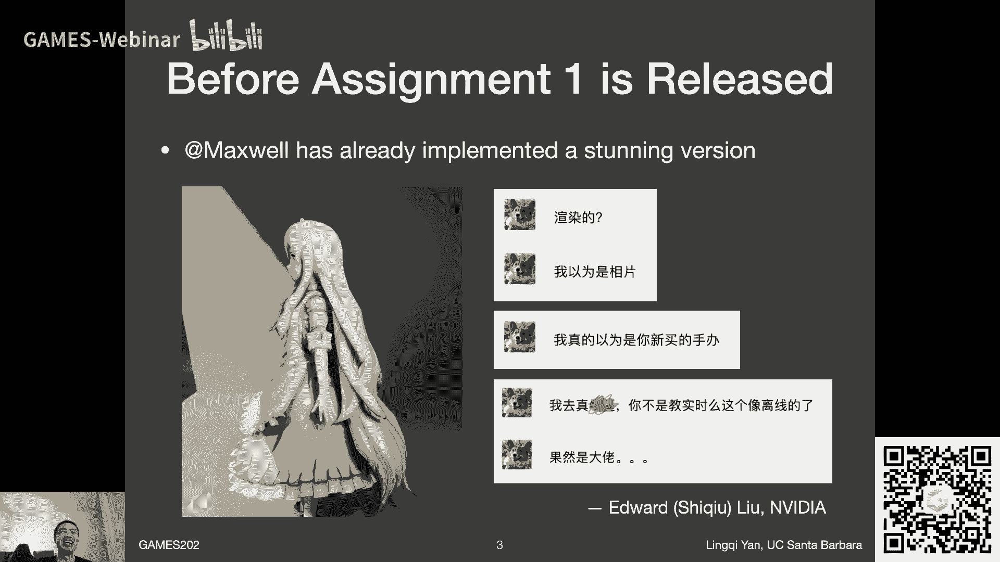
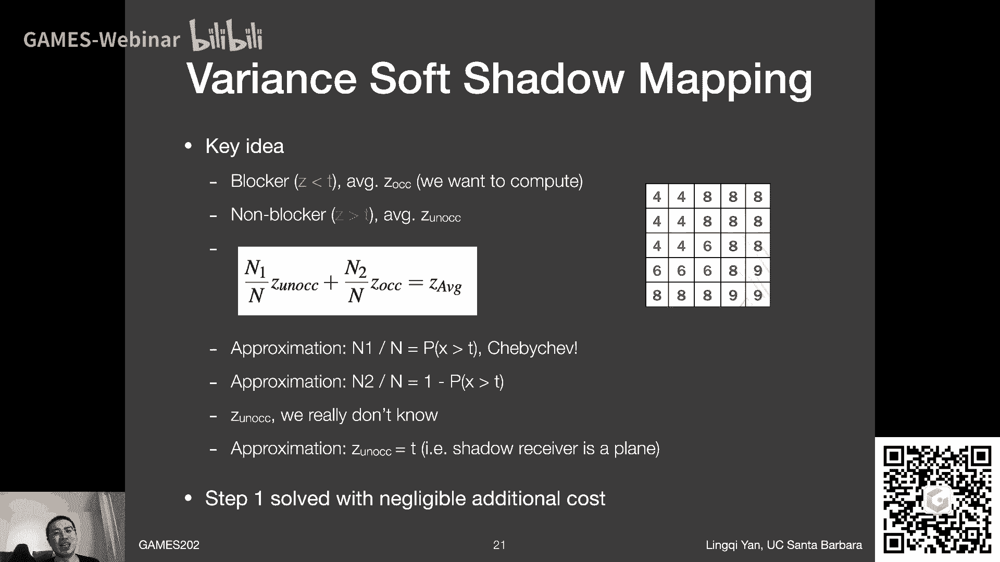
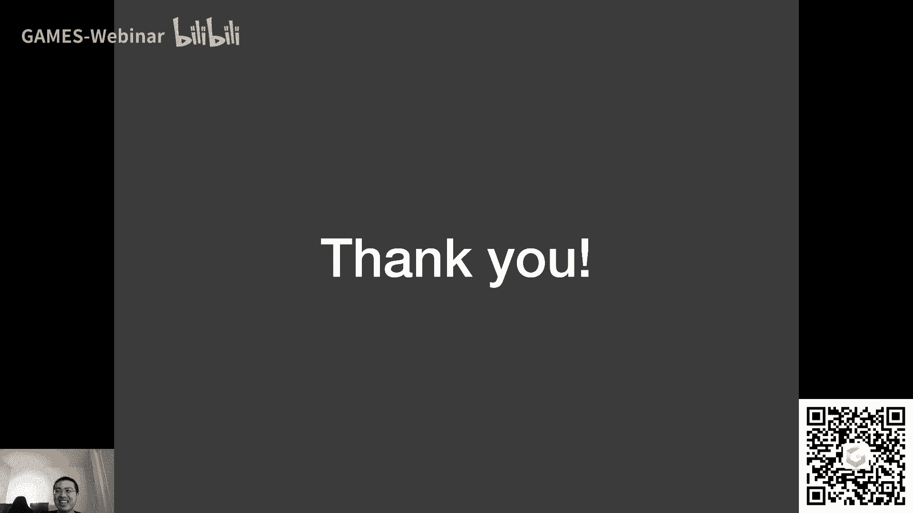

# GAMES202-高质量实时渲染 - P4：Lecture4 实时阴影 2 🎮

## 概述
在本节课中，我们将继续深入探讨实时阴影技术。我们将详细分析百分比渐近软阴影（PCSS）的数学原理，并介绍一种更高效的替代方案——方差软阴影映射（VSSM）。同时，我们也会简要了解其进阶版本——矩阴影映射（Moment Shadow Mapping）。课程旨在让初学者理解这些技术的核心思想、优势与局限。

---

## 上节回顾与本节引入
上一节我们介绍了阴影映射（Shadow Mapping）的基本原理、存在问题以及百分比渐近过滤（PCF）和百分比渐近软阴影（PCSS）的基本思路。本节中，我们将首先从数学公式角度深入理解PCF/PCSS，然后探讨其性能瓶颈，并引出旨在解决这些瓶颈的VSSM方法。

---

## 深入理解PCF：背后的数学 🧮

PCF并非在模糊阴影贴图本身，而是在对可见性函数进行卷积（滤波）。对于着色点 \(x\)，我们考虑其在阴影贴图上对应像素 \(p\) 周围邻域 \(N(p)\) 内的一系列点 \(q\)。

以下是PCF操作的数学描述：

1.  **定义比较函数**：我们使用一个阶跃函数 \(\chi\)（chi）来表示遮挡比较结果。
    \[
    \chi(z) = 
    \begin{cases} 
    1 & \text{if } z > 0 \\
    0 & \text{otherwise}
    \end{cases}
    \]
    其中，\(z = d_{SM}(q) - d_{scene}(x)\)，\(d_{SM}(q)\) 是阴影贴图在 \(q\) 点记录的深度，\(d_{scene}(x)\) 是着色点 \(x\) 的实际深度。若 \(z > 0\)，表示 \(q\) 点记录的表面比 \(x\) 点更远（未遮挡），可见性为1；反之则为0。

2.  **卷积过程**：PCF计算的是该邻域内所有点 \(q\) 的可见性值的加权平均。
    \[
    V(x) = \sum_{q \in N(p)} w(p, q) \cdot \chi(d_{SM}(q) - d_{scene}(x))
    \]
    其中，\(w(p, q)\) 是取决于 \(p\) 和 \(q\) 距离的权重（例如高斯权重）。这本质上是在对二值的可见性函数进行滤波，从而产生柔和的阴影边缘。

**关键点**：PCF滤波的是“深度比较的结果”（非0即1），而非深度值本身。直接模糊深度贴图再进行比较，得到的结果依然是二值的，无法产生平滑过渡。

---

## PCSS的性能瓶颈与解决思路 ⚡

PCSS算法分为三步：遮挡物搜索（Blocker Search）、确定滤波范围、执行PCF。其中，第一步和第三步需要在阴影贴图的一个区域内进行大量采样（或遍历所有纹素），这是主要的性能瓶颈。

*   **慢的原因**：对于大的滤波区域，逐纹素采样或遍历计算成本高昂。若采用稀疏随机采样来加速，则会引入噪声（Noise）。
*   **工业界常见方案**：接受第一步和第三步的近似噪声结果，然后在图像空间进行时域/空域降噪（Denoising）。这将在后续课程中详细讨论。
*   **新的思路**：能否避免耗时的区域采样，直接快速估算出“该区域内有百分之多少的纹素深度小于当前着色点深度”？这引出了VSSM方法。

---

## 方差软阴影映射（VSSM）💡

VSSM的核心思想非常巧妙：将一个区域内的深度分布近似为一个概率分布，并通过该分布的统计特性来快速估算可见性百分比，从而避免采样。

### 核心类比：考试排名
问题：“在一个区域内，有多少比例的纹素深度比当前着色点深度 \(t\) 浅？” 这类似于：“已知全班成绩分布，问分数低于 \(t\) 的学生占多少比例？”

*   **原始方法（PCF）**：逐一查看每个同学的成绩——计算量大。
*   **VSSM方法**：假设成绩服从正态分布。我们只需要知道全班的**平均分（均值）**和**成绩的分散程度（方差）**，就能估算出分数低于 \(t\) 的大致比例。

### VSSM的具体步骤

1.  **生成深度与深度平方贴图**：在生成阴影贴图时，不仅存储深度 \(z\)，还在另一个通道（如G通道）存储深度的平方 \(z^2\)。这几乎没有额外开销。
    *   **均值 \(E(z)\)**：通过查询区域内的平均深度获得。
    *   **方差 \(Var(z)\)**：利用公式 \(Var(z) = E(z^2) - [E(z)]^2\) 计算。其中 \(E(z^2)\) 可通过查询深度平方贴图的区域平均值获得。

2.  **快速范围查询**：为了快速得到任意矩形区域内的 \(E(z)\) 和 \(E(z^2)\)，需要使用支持快速范围求和的数据结构。
    *   **Mipmap**：能快速进行近似的方形区域查询，但不精确，尤其对非方形区域。
    *   **SAT（Summed-Area Table）**：通过前缀和原理，能在常数时间内精确计算任意轴对齐矩形区域内的总和，从而得到精确均值。虽然需要 \(O(n)\) 的预处理时间，但在GPU上可以高效并行实现。

3.  **估算累积分布函数（CDF）**：知道了均值 \(\mu\) 和方差 \(\sigma^2\)，我们就定义了近似的深度分布。我们需要计算该分布中深度值小于 \(t\) 的概率 \(P(z < t)\)，即CDF。
    *   **切比雪夫不等式（Chebyshev's Inequality）**：VSSM使用了一个关键工具。对于任意分布，只要知道其均值 \(\mu\) 和方差 \(\sigma^2\)，就可以估算 \(P(z > t)\) 的上界：
        \[
        P(z > t) \leq \frac{\sigma^2}{\sigma^2 + (t - \mu)^2}, \quad \text{for } t > \mu
        \]
    *   **在渲染中的使用**：在实时渲染中，我们常将这个上界不等式当作近似等式来使用，即：
        \[
        P(z > t) \approx \frac{\sigma^2}{\sigma^2 + (t - \mu)^2}
        \]
        那么，可见性（深度小于 \(t\) 的比例）近似为：
        \[
        V \approx 1 - P(z > t)
        \]
    *   **限制**：切比雪夫不等式在 \(t > \mu\) 时估计较准，当 \(t \leq \mu\) 时可能不准，但实践中整体效果可以接受。

### 解决PCSS的第一步：遮挡物平均深度
PCSS的第一步需要计算区域内**遮挡物**（深度小于 \(t\) 的纹素）的平均深度 \(z_{occ}\)。

VSSM通过一个巧妙的观察来解决：
设区域内所有纹素的平均深度为 \(z_{Avg}\)，遮挡物的平均深度为 \(z_{occ}\)，非遮挡物的平均深度为 \(z_{unocc}\)。它们满足以下关系（\(N\) 为总纹素数，\(N_1\) 为非遮挡物数量）：
\[
\frac{N_1}{N} \cdot z_{unocc} + (1 - \frac{N_1}{N}) \cdot z_{occ} = z_{Avg}
\]
*   \(\frac{N_1}{N}\)（非遮挡物比例）：可由切比雪夫不等式估算，即 \(P(z > t)\)。
*   \(z_{Avg}\)：通过SAT等范围查询得到。
*   \(z_{unocc}\)（非遮挡物平均深度）：VSSM做了一个大胆但合理的假设——**所有非遮挡物的深度都等于当前着色点深度 \(t\)**。这对于常见的平面接收物是近似成立的。

将上述已知量代入公式，即可解出唯一的未知量 \(z_{occ}\)。

### VSSM的优势与问题
*   **优势**：速度快，无噪声。完全避免了PCSS中耗时的区域采样步骤。
*   **问题（Light Leaking）**：当区域内的深度分布复杂（多峰，例如栅栏、镂空物体）时，用单峰的正态分布来近似会严重失真。这可能导致本应被完全遮挡的区域被错误地估计为部分可见，产生“漏光”瑕疵。此外，对于非平面的阴影接收体，其假设也可能导致瑕疵。

---

## 矩阴影映射（Moment Shadow Mapping）🚀

为了克服VSSM在描述复杂深度分布时的不足，矩阴影映射被提出。

### 核心思想：使用更高阶矩
*   **矩（Moments）**：在VSSM中，我们实际上使用了深度 \(z\) 的前两阶矩：一阶矩 \(E(z)\)（均值）和二阶矩 \(E(z^2)\)（用于求方差）。
*   **高阶矩**：矩阴影映射存储更高阶的矩，例如 \(z, z^2, z^3, z^4\)（前四阶矩）。数学上证明，使用前 \(m\) 阶矩可以重建一个具有最多 \(m/2\) 个“台阶”的分布函数。这意味着四阶矩可以描述双峰分布，从而更好地处理镂空物体等复杂情况。

### 效果与代价
*   **效果**：能显著减轻VSSM中的漏光问题，得到更接近参考PCF（无噪声版）的质量。
*   **代价**：
    1.  **存储**：需要存储更多数据（如RGBA四个通道存四阶矩）。
    2.  **计算**：从存储的矩重建CDF的过程比切比雪夫不等式复杂得多。
*   **现状**：由于时域降噪技术的成熟，能够有效处理PCSS的噪声，且PCSS实现更简单，因此PCSS在工业界应用更广泛。矩阴影映射作为一种高质量无噪声方案，多用于特定场合或研究。

---

## 总结
本节课我们一起深入学习了实时软阴影的进阶技术：
1.  **数学本质**：明确了PCF是对二值可见性函数进行滤波，而非模糊深度图。
2.  **性能分析**：指出了PCSS算法中遮挡物搜索和PCF滤波是性能瓶颈。
3.  **VSSM**：学习了其利用均值、方差和切比雪夫不等式来快速、无噪声地估算软阴影的核心思想，包括其快速范围查询（SAT）的实现和解决PCSS第一步的巧妙方法，同时也了解了其漏光缺陷。
4.  **矩阴影映射**：了解了通过存储更高阶矩来更精确描述深度分布，以改善VSSM缺陷的思路。

这些技术体现了实时渲染中经典的权衡艺术：在速度、质量、实现复杂度之间寻找平衡，并运用了概率统计等数学工具来优化性能。下节课我们将开始新的主题——环境光照。