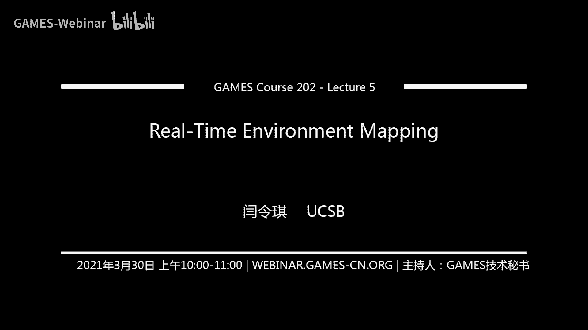
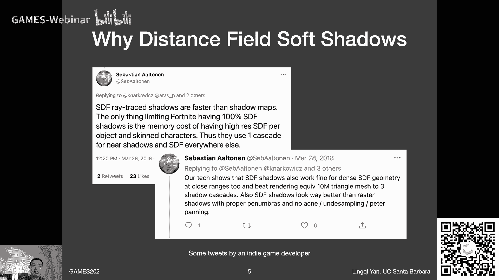
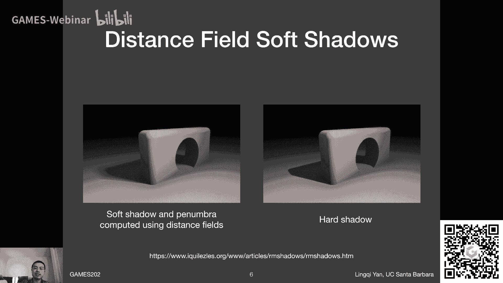
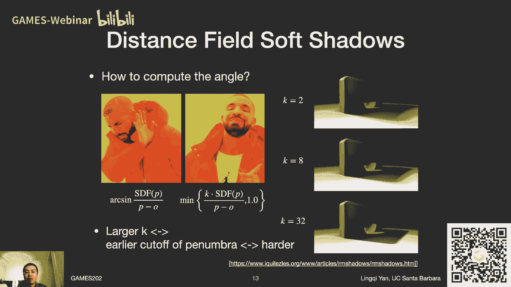
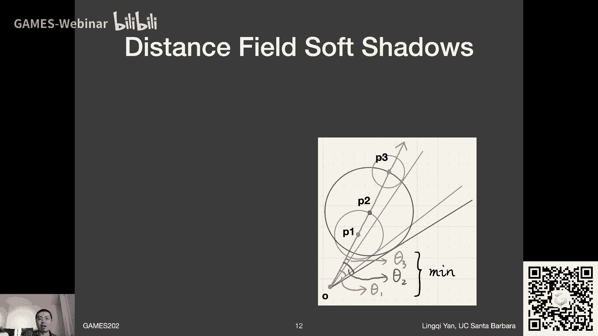
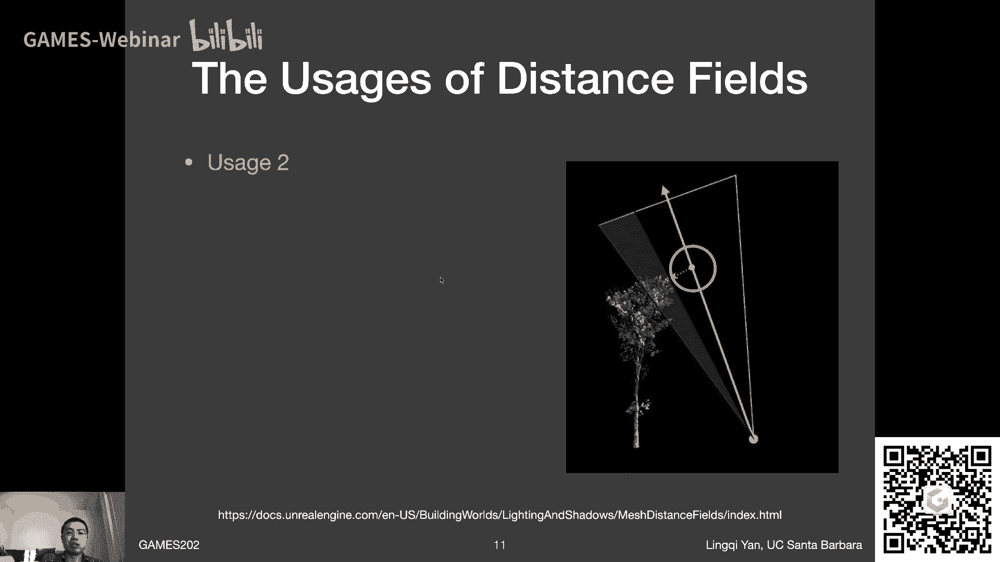
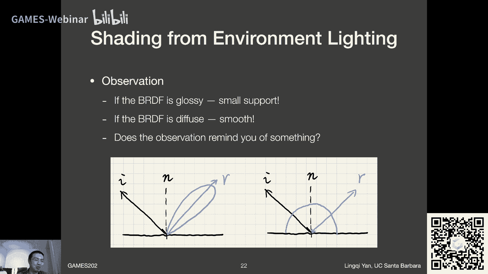
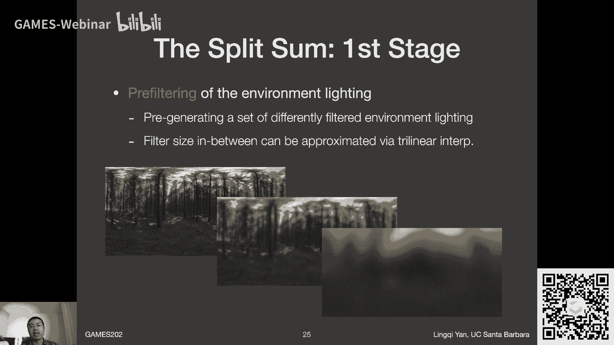

# GAMES202-高质量实时渲染 - 第五讲：实时环境光照映射 📚

在本节课中，我们将学习如何处理实时环境光照，即如何在忽略阴影的情况下，计算场景中任意点的着色。我们将从距离场阴影开始，然后深入探讨环境光照下的着色问题，并介绍一种无需采样的高效方法——Split Sum近似。

---

## 课前事项 📢

作业一即将发布，内容涉及PCSS和Shadow Mapping的实现，大约有十天时间完成。


下周（4月1日当周）将暂停一次课程直播与录播，课程将在下下周恢复。关于GAMES101作业重新提交与批改的事宜，将在之后启动并发布正式通知。





---

## 上节课回顾 🔍


上一节课我们深入探讨了PCSS，并介绍了其聪明的优化版本——VSSM。VSSM通过使用范围查询来避免采样，从而高效地解决了PCSS中某些步骤缓慢的问题。我们还提到了其延伸版本，引入了更高阶的“矩”的概念。虽然VSSM在近期随着时域去噪等方法的兴起，应用可能不如PCSS广泛，但其精妙的算法思想非常值得我们学习。

---

## 本节课内容概览 🎯

本节课我们将首先完成关于阴影知识的最后一块拼图——**距离场软阴影**。这是一种新兴且前景广阔的技术。随后，我们将进入本节课的核心主题：**环境光照下的着色计算**。我们将重点介绍一种名为 **Split Sum** 的高效近似方法，它允许我们在不进行昂贵采样的情况下，完成环境光照的渲染。


> 请注意：本节课讨论的环境光照“着色”问题，暂时忽略了阴影（Visibility）的影响。

---

## 第一部分：距离场软阴影 🎭

### 为什么需要距离场阴影？

距离场阴影具有速度快、没有自遮挡和阴影悬浮问题等优点。虽然它需要较大的存储空间，并且对动态形变物体的支持有限，但其在生成高质量软阴影方面的潜力，使其成为近年来的研究热点。

### 什么是距离场？

距离场，或称有向距离函数，定义了空间中任意一点到某个物体表面的最小距离。在物体内部的点，距离通常定义为负值；在物体外部，则为正值。

**公式定义**：
对于一个点 **p** 和物体表面 **S**，有向距离函数 **SDF(p)** 可以表示为：
`SDF(p) = min_{q ∈ S} ||p - q|| * sign( p 在 S 外部 ? 1 : -1 )`

可视化上，距离场看起来像是物体轮廓向外“膨胀”的模糊版本，或者像地图上的等高线。


### 距离场的优势与应用

距离场的一个关键优势是它能很好地表示物体边界，使得在不同形状间进行混合变得容易，无需关心它们之间的拓扑关系。这背后与“最优传输”理论密切相关。

以下是距离场的两种主要应用：

#### 应用一：光线步进追踪

这是一种利用距离场进行光线追踪的经典方法，称为**球体追踪**。其核心思想是：空间中某点的SDF值给出了一个“安全距离”。从该点沿光线方向前进不超过这个距离，**一定不会**与任何物体相交。



**算法伪代码**：
```glsl
float RayMarch(vec3 origin, vec3 direction) {
    float totalDistance = 0.0;
    for (int i = 0; i < MAX_STEPS; i++) {
        vec3 p = origin + totalDistance * direction;
        float safeDist = SDF(p); // 查询当前点的SDF值
        totalDistance += safeDist;
        if (safeDist < EPSILON) return totalDistance; // 命中表面
        if (totalDistance > MAX_DIST) break; // 超出范围
    }
    return INFINITY; // 未命中
}
```
利用这一性质，我们可以从起点开始，每次前进当前点的SDF值所指示的安全距离，迭代直至接近表面或超出范围。




> **关于SDF的生成与存储**：SDF是一个定义在整个3D空间中的标量场，预计算和存储开销很大。通常需要使用层次化结构（如八叉树）进行优化存储，只为接近物体表面的区域存储精细数据。对于多个刚体物体，整个场景的SDF可通过取各物体SDF的最小值获得。但对于形变物体，SDF需要重新计算。

#### 应用二：生成软阴影



我们可以利用在光线步进过程中获得的信息，来近似计算软阴影。观察发现，在着色点向光源方向步进时，路径上各点的SDF值定义了一个“安全角度”。这个角度越小，意味着该方向被遮挡的可能性越大，阴影就越“硬”、越暗。

**核心近似**：
在步进过程中，对于路径上的每个点，我们计算其安全角度 θ 的近似值：`θ ≈ k * (SDF(p) / distance(p, shadingPoint))`。
其中，`k` 是一个控制阴影软硬程度的系数。`k` 值越大，阴影越硬（过渡带越窄）；`k` 值越小，阴影越软。

**最终可见性计算**：
在整条步进路径上，我们取所有点计算出的最小角度近似值，并与1取最小值，作为该方向最终的可见性估计。
`Visibility = min(1.0, k * min_{along ray} (SDF / distance))`

这是一个非常大胆但有效的近似。它假设遮挡物可能出现在安全角度所定义的整个锥形区域内的任何位置。

### 距离场阴影的总结

**优点**：
*   **速度快**：在Shader中通过几次SDF查询和光线步进即可完成，尤其在不考虑SDF生成时间的情况下，相比传统Shadow Map有速度优势。
*   **质量高**：能产生视觉上令人满意的软阴影，没有传统Shadow Mapping的许多瑕疵。

**缺点与挑战**：
*   **存储开销大**：需要预计算并存储3D距离场。
*   **不支持动态形变**：物体形变后需要重新计算SDF。
*   **生成SDF本身是开销**：预计算过程可能很耗时。
*   **存在Artifact**：在接缝等处可能有不自然的效果。

> **扩展知识**：距离场还可用于实现无限分辨率的字体渲染，通过存储字体的SDF并在渲染时进行插值，可以在任何距离下都获得清晰的轮廓。

---

## 第二部分：环境光照下的着色计算 🌍

上一节我们介绍了如何利用距离场生成阴影，本节中我们来看看环境光照的核心挑战：如何高效计算不考虑阴影时的着色。

### 问题定义：图像基础光照

环境光照通常用一张环境贴图表示，它记录了从场景中某点向所有方向看去的光照强度，并假设所有光源都位于无限远处。这种技术常被称为**基于图像的光照**。



我们的目标是：给定一张环境贴图，计算场景中任意着色点 **x** 的出射光亮度 **Lo**。
这需要求解渲染方程中不考虑可见性项的积分：

**渲染方程（简化）**：
`Lo = ∫_{Ω} L_i(ω_i) * BRDF(ω_i, ω_o) * cosθ_i dω_i`

其中：
*   `L_i(ω_i)` 是环境贴图给出的入射光亮度。
*   `BRDF` 是双向反射分布函数。
*   `cosθ_i` 是入射方向与法线的点乘。
*   `Ω` 是法线定义的半球。

直接使用蒙特卡洛积分求解这个积分需要大量采样，在实时渲染中代价过高。因此，我们需要寻找无需采样的近似方法。

### 核心洞察：Split Sum 近似



观察渲染方程中的被积函数，它是光照函数 `L_i` 和 BRDF函数（含cos项）的乘积。回顾我们在阴影课程中引入的“积分近似拆分”思路，当两个函数满足一定条件时，可以将它们的乘积积分近似拆分为两个独立积分的运算。

幸运的是，在环境光照着色中，BRDF项通常满足以下两个条件之一：
1.  **支撑集小**：对于Glossy材质，BRDF的lobe只覆盖球面上很小一块区域。
2.  **变化平滑**：对于Diffuse材质，BRDF的值在整个半球上变化缓慢。

这正是应用近似拆分公式的理想情况！我们可以将光照项 `L_i` “拆”出积分号外。

**拆分公式**：
`∫_{Ω} f(x) g(x) dx ≈ (∫_{Ω} f(x) dx) / (∫_{Ω} dx) * ∫_{Ω} g(x) dx`
（在g的支撑集上近似成立）


应用到我们的问题上：
`Lo ≈ (∫_{Ω_{BRDF}} L_i(ω_i) dω_i) / (∫_{Ω_{BRDF}} dω_i) * ∫_{Ω} BRDF * cosθ_i dω_i`

这个拆分带来了巨大的好处：
1.  **第一部分**：`(∫ L_i dω_i) / (∫ dω_i)` 仅仅是对环境贴图 `L_i` 在BRDF lobe所覆盖区域进行**滤波**，并取平均值。这可以**预计算**！我们可以为环境贴图生成一系列不同模糊程度（对应不同BRDF粗糙度）的模糊版本，存储在类似Mipmap的结构中。
2.  **第二部分**：`∫ BRDF * cosθ_i dω_i` 是一个纯BRDF的积分，与具体场景光照无关。

### 处理BRDF积分：进一步的预计算

第二部分仍然是一个积分，我们需要避免在实时计算中采样。这里，我们假设使用基于微表面模型的BRDF（如GGX）。这类BRDF主要受两个因素影响：
1.  **菲涅尔项**：决定基础反射率和随角度变化的反射率。
2.  **法线分布函数**：决定表面的粗糙程度，用 `roughness` 表示。


直接预计算一个包含 `roughness`、入射角 `θ` 和基础反射率 `F0` 的高维表格是不现实的。人们发现，利用**Schlick近似**对菲涅尔项进行简化后，可以将BRDF积分拆解为两个部分，从而将预计算表格的维度降至2维。

**Schlick菲涅尔近似**：
`F(θ) ≈ F0 + (1 - F0) * (1 - cosθ)^5`

通过巧妙的数学变换，可以将原始的BRDF积分重写为：
`∫ BRDF * cosθ_i dω_i ≈ F0 * Scale + Offset`

其中，`Scale` 和 `Offset` 这两个值**仅依赖于粗糙度 `roughness` 和入射角 `cosθ`**，而与基础反射率 `F0` 无关。


这意味着，我们可以将 `Scale` 和 `Offset` 预计算为一张2D查找表（纹理）：
*   **横轴**：`cosθ` (或 `roughness`)
*   **纵轴**：`roughness` (或 `cosθ`)
*   **纹理的R通道**：存储 `Scale` 值
*   **纹理的G通道**：存储 `Offset` 值

在实时渲染时，对于一个具体的着色点，我们：
1.  根据其粗糙度和视角方向（可转换为半角向量等），去预计算的2D BRDF积分纹理中查找，得到 `Scale` 和 `Offset`。
2.  根据材质的基础反射率 `F0`，组合公式 `F0 * Scale + Offset`，即可得到第二部分积分的近似值。

### Split Sum 方法总结

综上所述，**Split Sum** 方法通过两次“拆分”和“预计算”，彻底避免了在着色时的采样操作：
1.  **第一次拆分**：将渲染方程拆分为“滤波后的环境光”和“BRDF积分”两部分。
2.  **第二次拆分**：利用BRDF模型的性质，将BRDF积分进一步拆分为与 `F0` 相关的线性组合，并将系数预计算为2D纹理。

**实时着色步骤**：
1.  **环境光部分**：根据表面粗糙度，选择预计算好的相应层级的环境光模糊贴图，在镜面反射方向（对Glossy）或法线方向（对Diffuse）上进行一次纹理查询。
2.  **BRDF部分**：根据粗糙度和入射角，查询预计算的BRDF积分纹理（2D LUT），得到 `Scale` 和 `Offset`，再与 `F0` 结合计算。
3.  **最终结果**：将两部分的结果相乘，得到最终的着色颜色。

这种方法在工业界（如Unreal Engine的PBR管线中）被广泛使用，它能在几乎没有性能开销的情况下，得到与离线渲染参考图非常接近的高质量环境光照效果。

---

## 下节课预告 🚀

在本节课中，我们一起学习了如何利用距离场生成高质量的软阴影，并深入探讨了环境光照下着色的核心解决方案——Split Sum近似。这种方法通过巧妙的拆分和预计算，实现了无需采样的实时高性能渲染。

下节课，我们将进入一个更为复杂和前沿的领域：**实时全局光照**。我们将探讨在3D空间、屏幕空间以及通过预计算来实现全局光照的各种技术，例如LPV、VXGI、RTX GI等。敬请期待！


---
**备注**：本节课提到的补充资料链接将在课后提供。