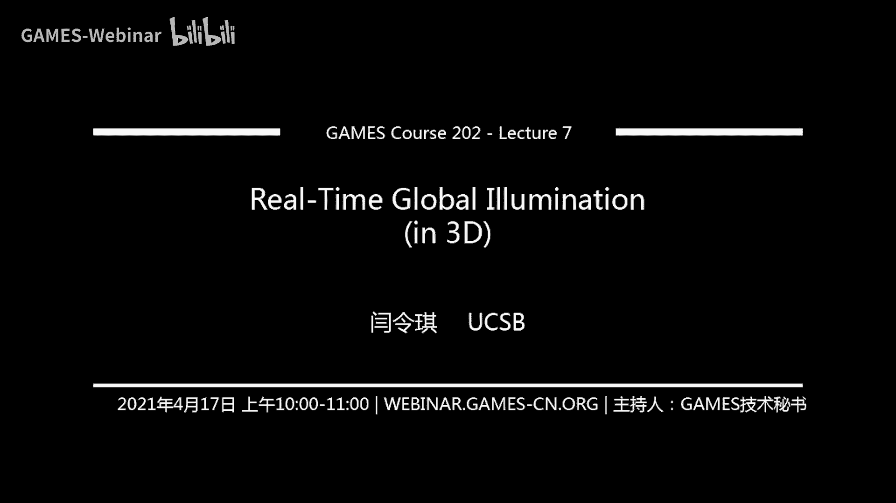

# GAMES202-高质量实时渲染 - P7：Lecture7 实时全局光照（三维空间） 🌐

在本节课中，我们将学习三维空间中的实时全局光照方法。首先，我们会完成上节课遗留的预计算辐射度传输（PRT）内容的讲解，然后重点介绍两种重要的实时全局光照技术：反射阴影贴图（RSM）和光传播体积（LPV）。

---

## 回顾：预计算辐射度传输（PRT）🔁

上一节我们介绍了PRT的基本概念，它将渲染方程分解为光照（Lighting）和光传输（Light Transport）两部分进行预计算，以实现实时渲染。

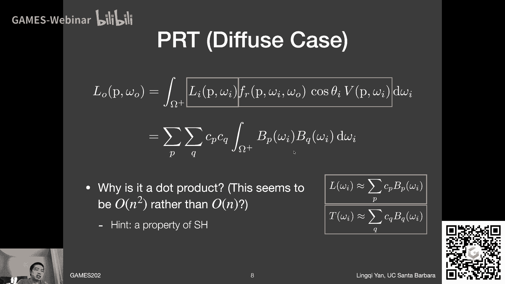

### 核心公式回顾

对于漫反射（Diffuse）表面，着色点 `p` 的出射辐射度 `L_o(p, ω_o)` 可近似为：

```
L_o(p, ω_o) ≈ Σ_i (l_i * t_i)
```

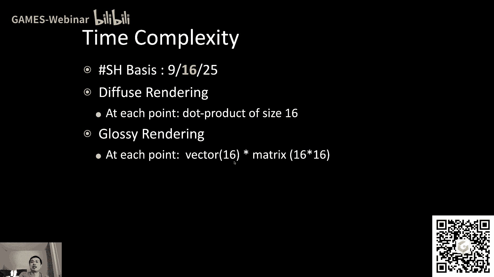

其中：
*   `l_i` 是环境光照投影到球谐函数（Spherical Harmonics, SH）基函数上的系数向量。
*   `t_i` 是光传输项（包含可见性、BRDF等）投影到相同SH基函数上的系数向量。
*   实际渲染时，只需计算两个向量的点积，复杂度为 **O(n)**。

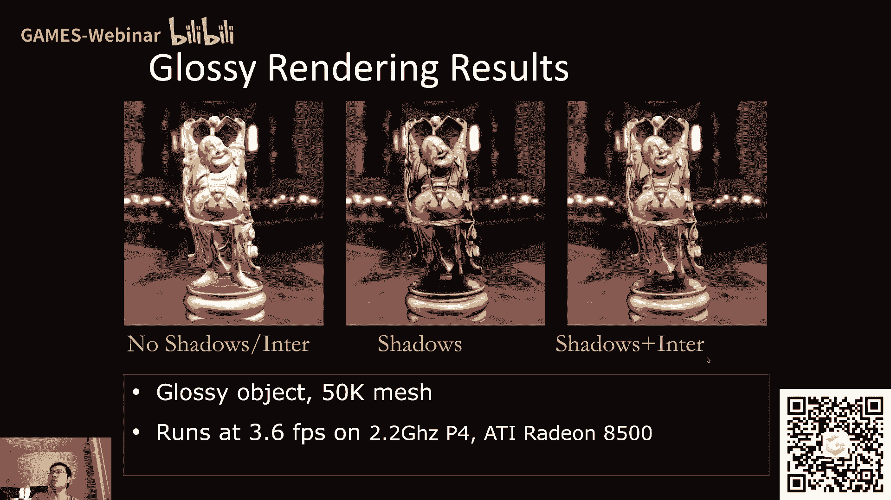

### 光泽表面（Glossy）的PRT

对于光泽表面，其BRDF是四维函数（与入射方向 `ω_i` 和出射方向 `ω_o` 均相关）。因此，光传输项 `t` 不再是简单的向量，而是一个矩阵 `T`。

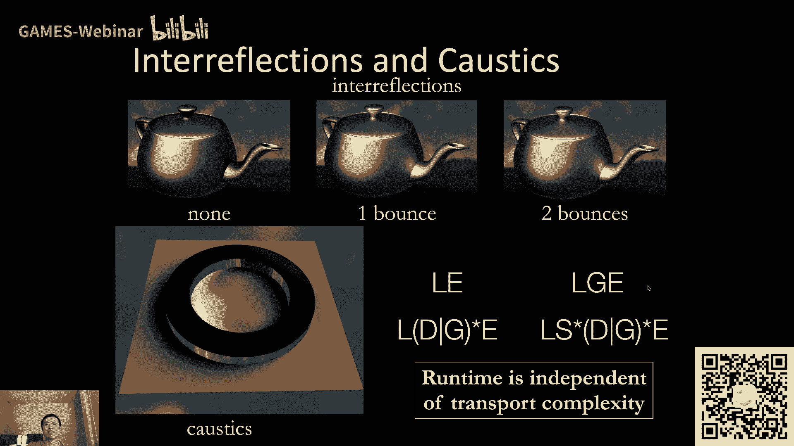

*   **预计算**：对于每个着色点，需要预计算一个光传输矩阵 `T`。
*   **实时渲染**：计算变为向量与矩阵的乘法：`L_o ≈ l · T`。如果使用 `n` 阶SH（即 `n²` 个基函数），则存储和计算复杂度为 **O(n²)**。

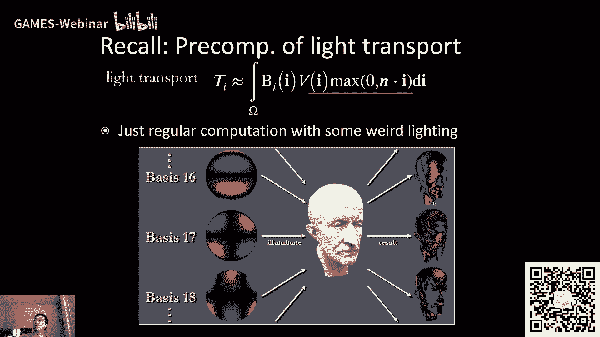

**效果与局限**：PRT能高质量地处理低频光照和复杂的光传输（包括间接光照和阴影），但要求场景和材质是静态的，且预计算数据量较大。

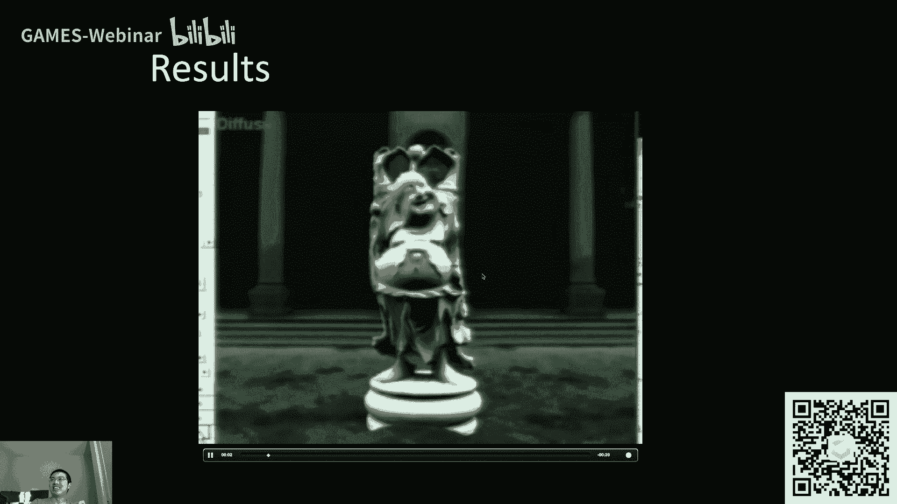

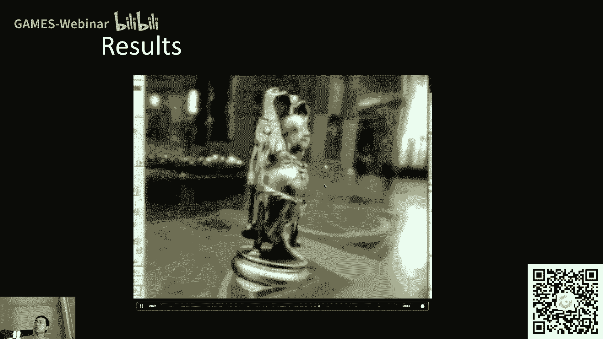

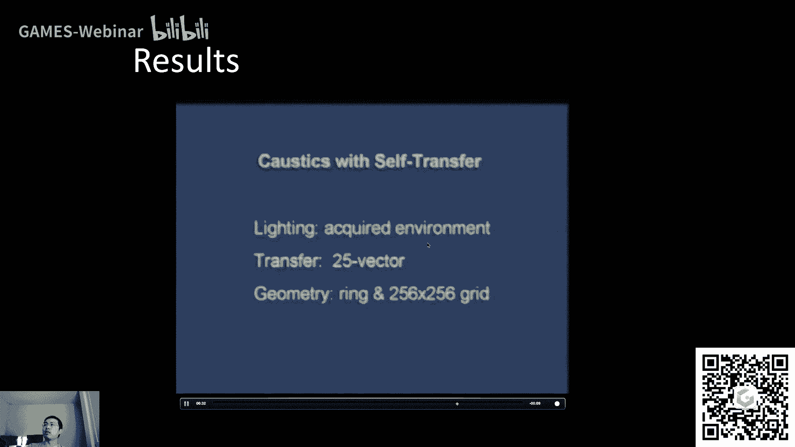

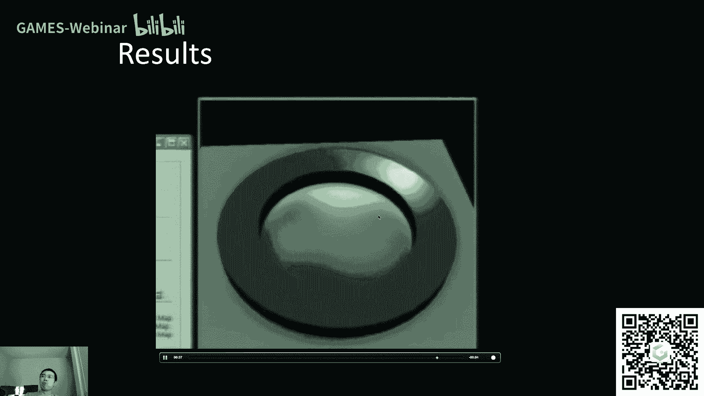

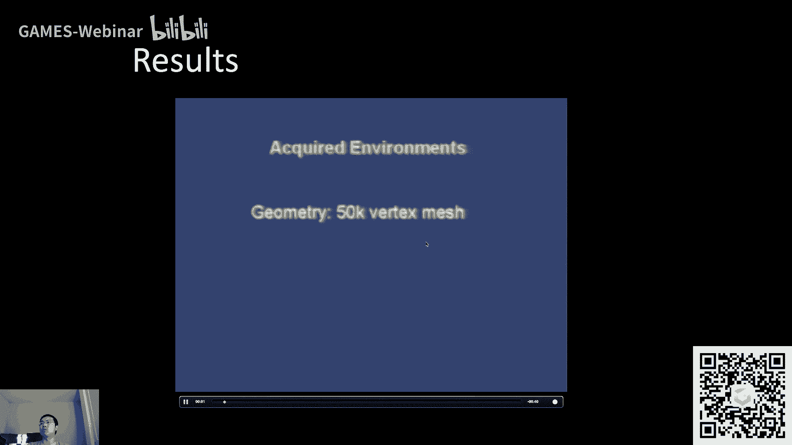

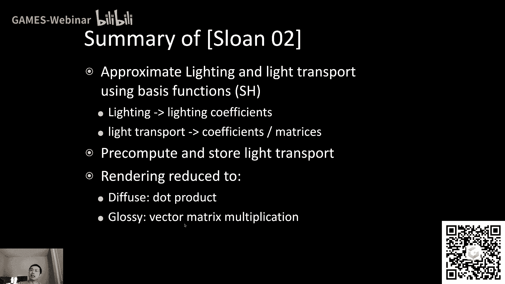

---

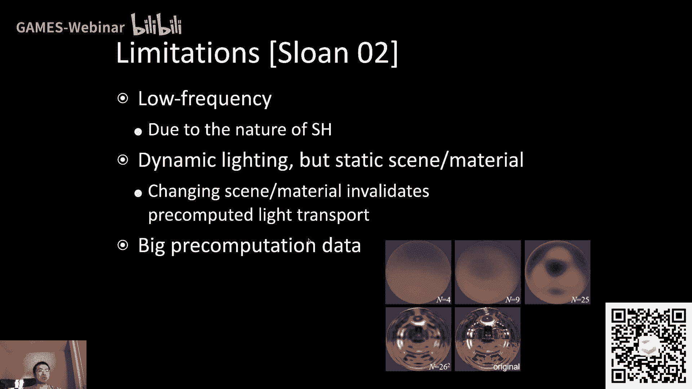

## 其他基函数介绍：小波（Wavelets）🌊

除了球谐函数，小波是另一类用于描述函数的基函数，尤其在图像压缩（如JPEG）中广泛应用。

以下是球谐函数与小波的主要区别：

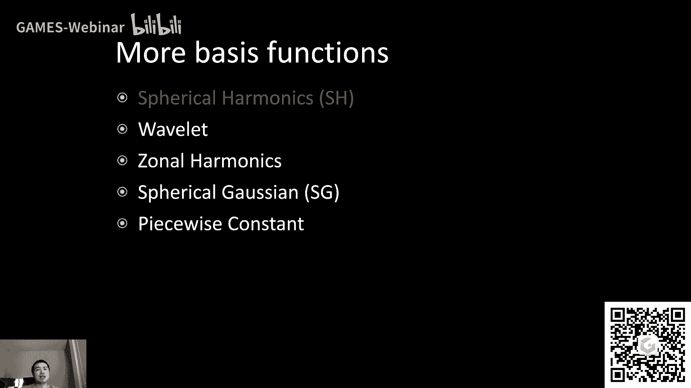

| 特性 | 球谐函数 (SH) | 小波 (Wavelets) |
| :--- | :--- | :--- |
| **定义域** | 定义在整个球面上。 | 定义在局部区域（如图像块）。 |
| **频率表示** | 全局性基函数，擅长表示低频信号。 | 局部性基函数，能同时表示**高频和低频**信号。 |
| **压缩方式** | 截断高阶项（线性逼近）。 | 保留系数最大的项，丢弃接近零的项（非线性逼近）。 |
| **旋转操作** | 支持快速、精确的旋转。 | **不支持**快速的旋转操作。 |
| **适用场景** | 环境光照等低频球面函数。 | 高频细节丰富的图像或Cube Map。 |

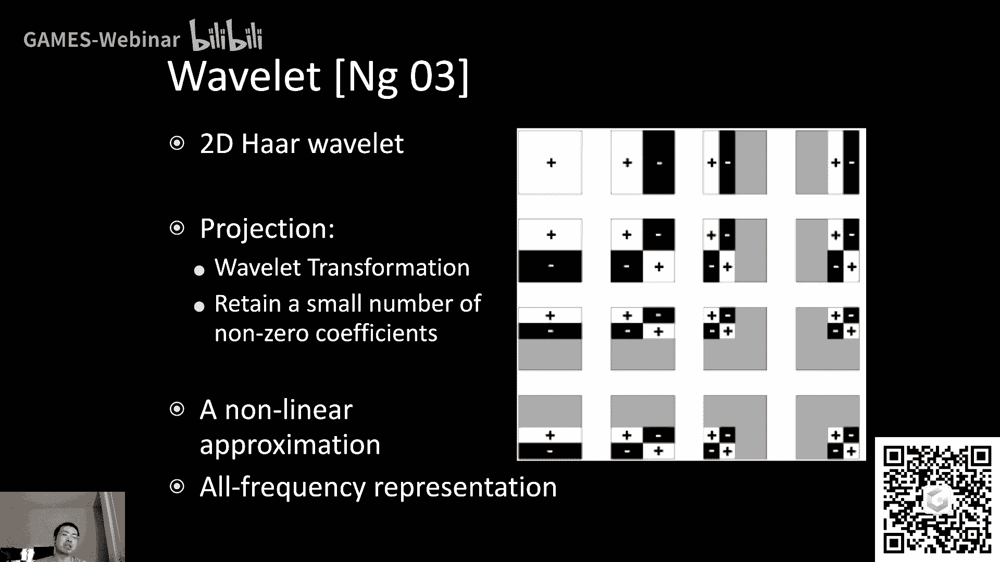

**小结**：小波能全频率地表示函数，在描述高频细节（如锐利阴影）时优于SH。但其不支持快速旋转的特性限制了它在动态光照场景中的应用。

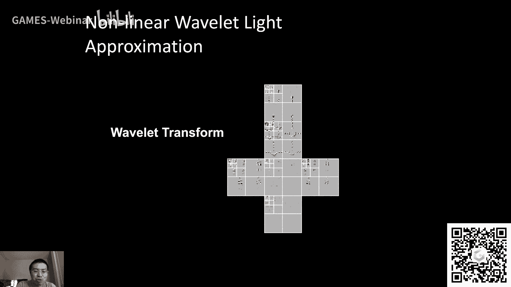

---

## 实时全局光照（3D方法）💡

全局光照对于渲染的真实感至关重要。在实时渲染中，我们主要关注解决**一次反射的间接光照**。

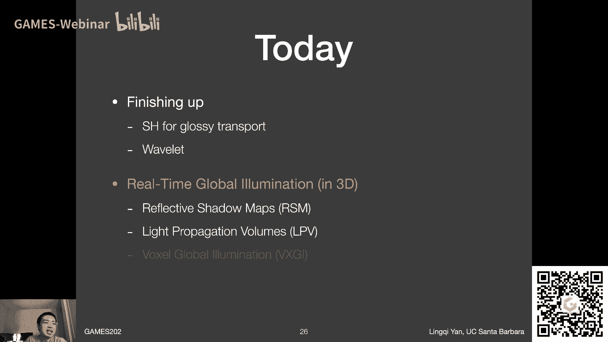

核心思路是：**将被直接光照照亮的物体表面视为次级光源（Secondary Light Source）**，然后用这些次级光源去照亮场景中的其他点。

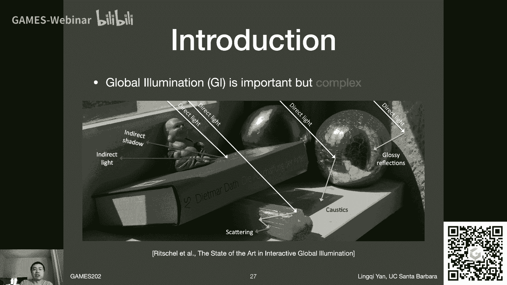

### 方法一：反射阴影贴图（Reflective Shadow Maps, RSM）

RSM基于上述思路，利用阴影贴图的扩展来实现间接光照。

#### RSM工作原理

1.  **生成RSM**：
    *   从主光源视角渲染场景，生成一张特殊的阴影贴图（RSM）。
    *   RSM的每个纹素不仅存储深度，还额外存储以下信息：
        *   世界空间位置（World Position）
        *   法线（Normal）
        *   反射通量（Reflected Flux, `Φ_p * f_r`）：即该点接收的直接光照能量与其BRDF的乘积。

2.  **渲染间接光照**：
    *   从摄像机视角渲染场景。对于每个着色点 `p`，需要计算所有次级光源对它的贡献。
    *   贡献计算公式（简化版）为：

        ```
        L_indirect(p) = Σ_q ( (Φ_q * f_r) * V(p, q) * G(p, q) )
        ```
        其中：
        *   `q` 是RSM中的一个纹素（代表一个次级光源）。
        *   `Φ_q * f_r` 是该次级光源的反射通量（从RSM中读取）。
        *   `V(p, q)` 是 `p` 到 `q` 的可见性（**RSM中通常忽略此项**，这是其主要误差来源）。
        *   `G(p, q)` 是几何项，包含距离衰减和余弦项。

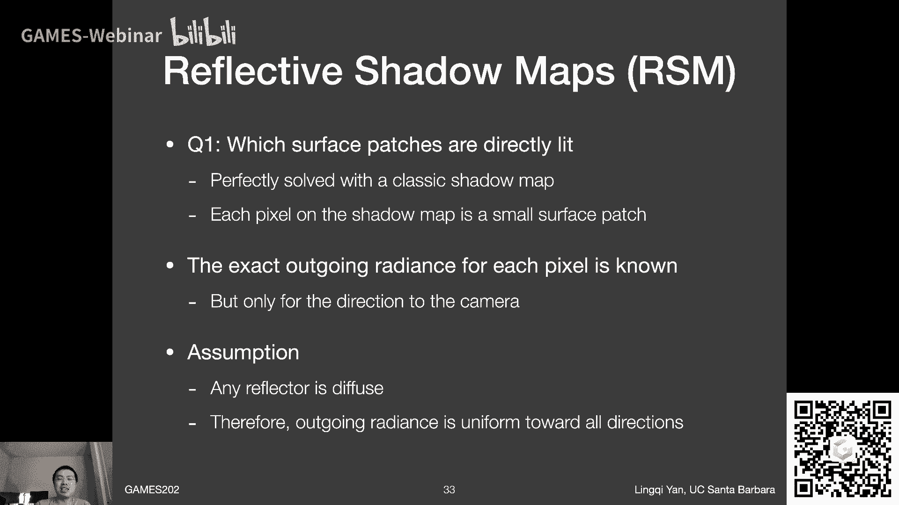

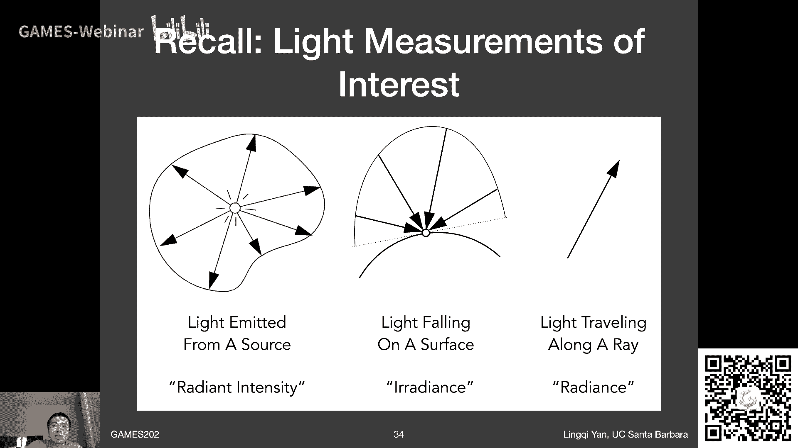

3.  **性能优化**：
    *   直接计算所有RSM纹素对 `p` 的贡献（如512x512次）是不可行的。
    *   **关键技巧**：将着色点 `p` 投影到RSM上，只在投影点**周围一定范围内**采样若干纹素作为有效的次级光源（例如采样400个），从而大幅减少计算量。

#### RSM的优缺点

**优点**：
*   易于实现，基于标准的阴影贴图流程。
*   能产生有效的间接光照效果，特别适合局部光源（如手电筒）。

**缺点**：
*   次级光源数量与主光源数量成正比，多光源下性能压力大。
*   **忽略次级光源与着色点之间的可见性**，可能导致漏光等不真实现象。
*   依赖于“在RSM空间邻近在世界空间也邻近”的假设，可能不准确。
*   采样数目的多少需要在质量和性能之间权衡。

**应用**：在《最后生还者》、《战争机器4》、《神秘海域4》等游戏中用于手电筒等局部光源的间接光照。

---

## 总结 📚

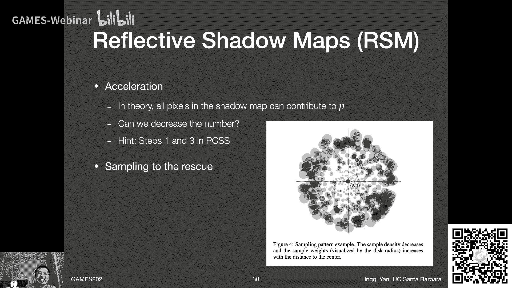

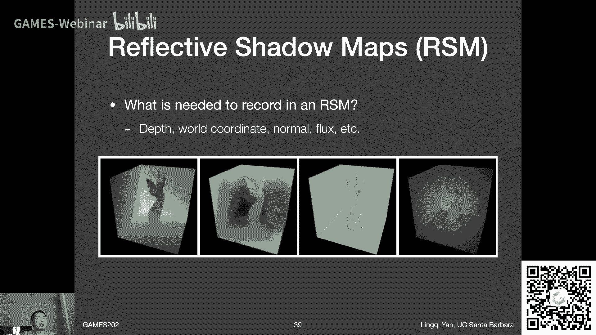

本节课我们一起学习了三维空间中的实时全局光照技术。

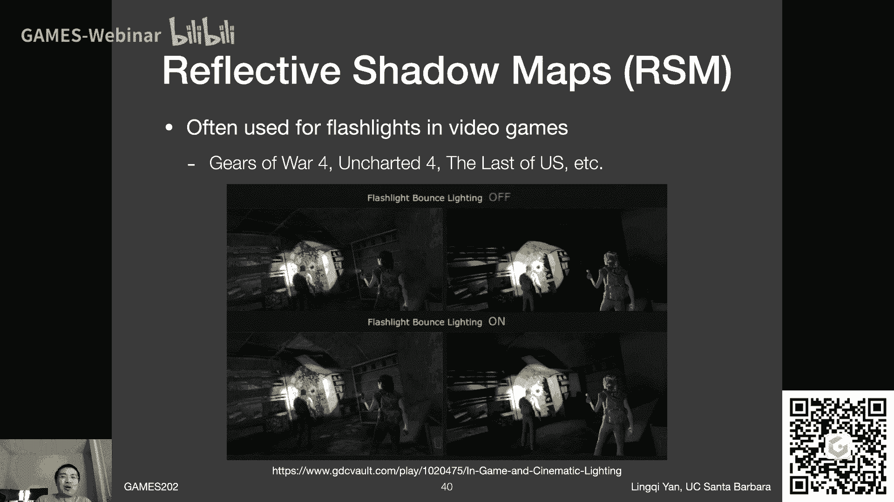

1.  **完成了PRT的讲解**：探讨了光泽表面的PRT实现（光传输矩阵）以及球谐函数的局限性，并介绍了小波作为另一种基函数的特点。
2.  **引入了实时全局光照的核心思想**：将直接光照照亮的表面作为次级光源。
3.  **详细讲解了反射阴影贴图（RSM）**：
    *   其通过扩展阴影贴图来存储次级光源信息。
    *   渲染时，通过采样着色点在RSM投影附近的纹素来计算间接光照。
    *   分析了RSM高效的原因及其固有的近似与缺陷。

RSM可以看作是离线渲染中“虚拟点光源（VPL）”或“即时辐射度（Instant Radiosity）”方法在实时渲染中的一种高效实现。虽然存在简化，但它为在动态场景中实现实时、可接受的间接光照提供了一条实用路径。

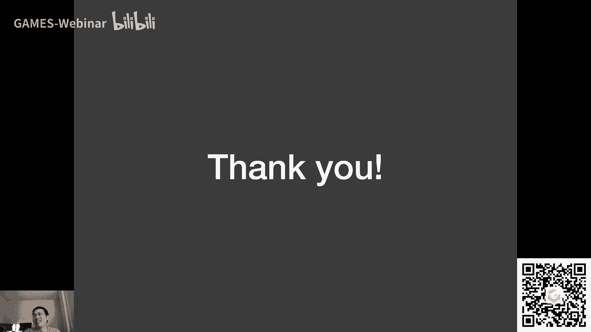

下节课，我们将继续学习另一种重要的三维全局光照方法——光传播体积（LPV），并开始探讨屏幕空间（Screen-Space）的全局光照技术。