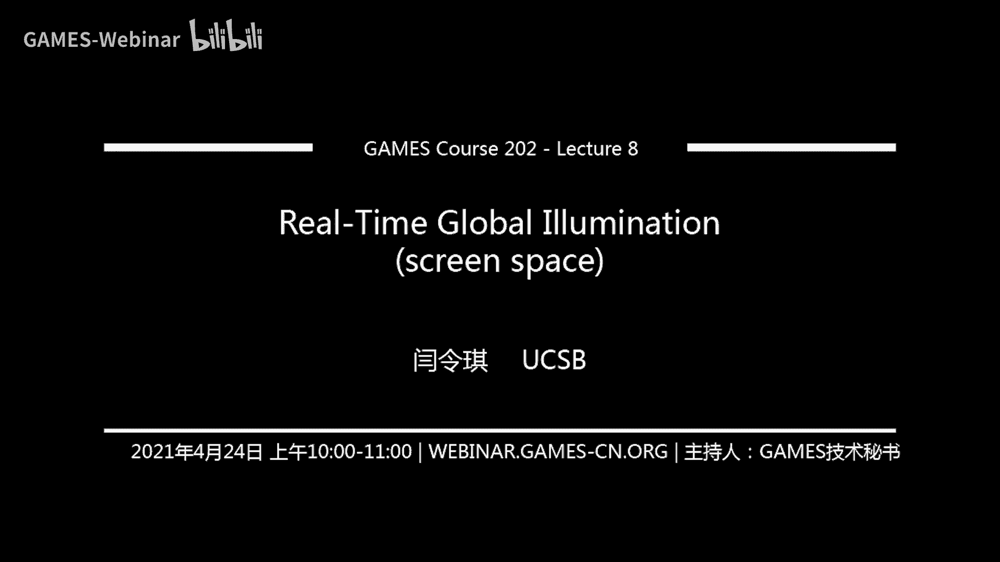

# GAMES202-高质量实时渲染 - 课程8：实时全局光照（屏幕空间方法） 🌟

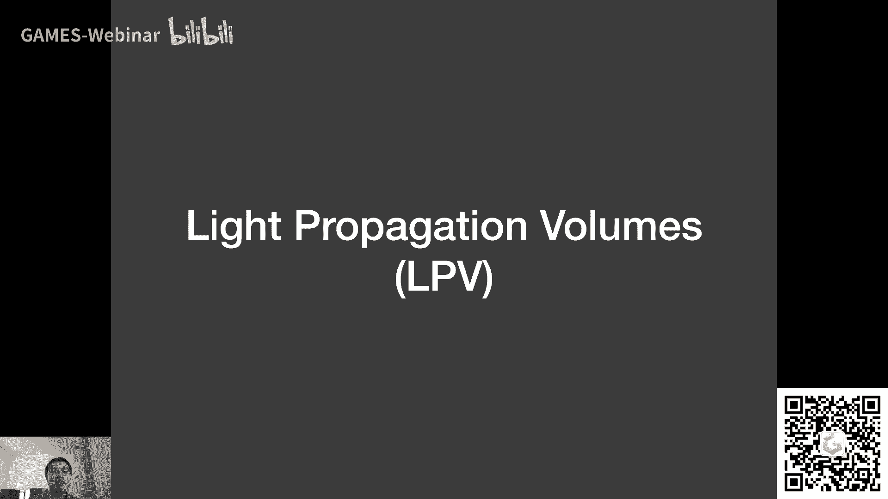

在本节课中，我们将学习实时全局光照的屏幕空间方法。我们将从回顾上节课的内容开始，然后深入探讨两种在三维空间中处理全局光照的剩余方法：LPV和VXGI。接着，我们将重点转向屏幕空间，详细讲解屏幕空间环境光遮蔽（SSAO）的原理、推导和实现思路。

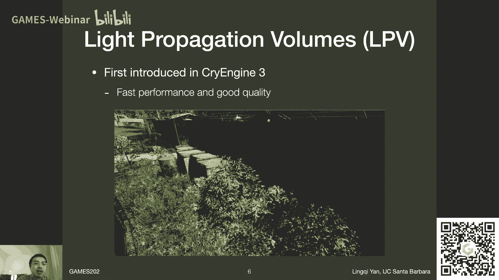

## 课程概述与回顾

上一节课我们主要讨论了PRT方法如何处理Glossy表面及其代价，并介绍了使用Wavelet基函数替代SH的扩展方法。我们还重点介绍了一种在世界空间中进行全局光照的方法：反射阴影贴图（RSM）。其基本思想与阴影贴图类似，即被直接照亮的表面可以作为次级光源，在间接光照中照亮其他物体。

本节课，我们将首先完成对三维空间中另外两种全局光照方法——LPV和VXGI的讲解。之后，我们将进入本节课的核心内容：屏幕空间方法，并重点学习SSAO和SSDO。

## 三维空间全局光照方法续

### Light Propagation Volumes (LPV) 💡

LPV，即光传播体积，最早在《孤岛危机》（Crysis）的CryEngine 3中引入。该方法的核心思想是在三维空间中传播光线，用于计算间接光照。

**核心思路**：
LPV解决的关键问题是：对于任意着色点，如何立即获得从所有方向到达该点的间接光照辐亮度（Radiance）。它利用了一个重要的物理事实：**Radiance在直线传播过程中保持不变**。

**实现步骤**：
LPV的实现可以分为四个主要步骤：

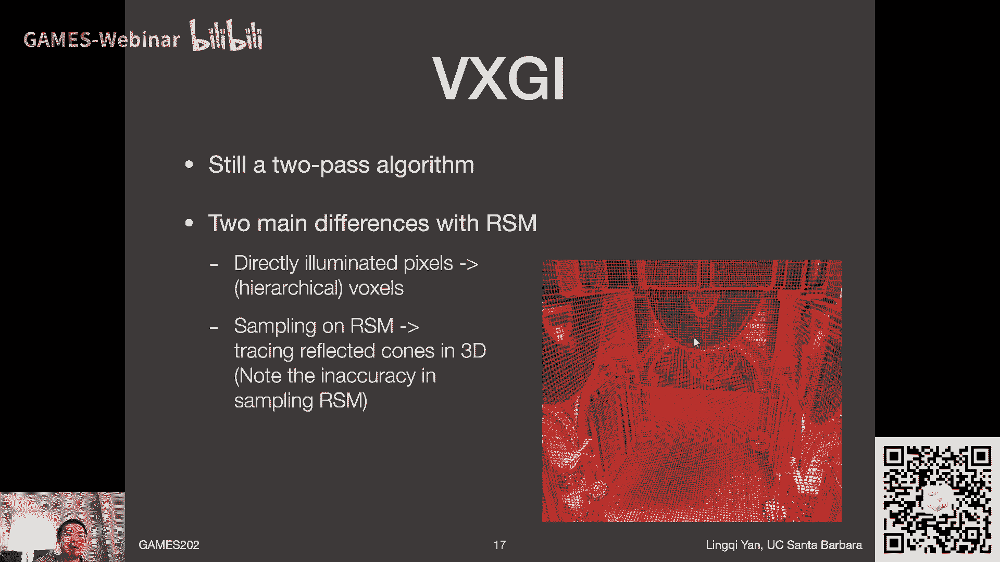

1.  **识别次级光源**：与RSM类似，首先计算场景的直接光照，被直接照亮的表面将成为次级光源。
2.  **注入（Injection）**：将场景划分为一个三维网格（体素）。对于每个包含次级光源的体素，计算其向各个方向发出的Radiance初始分布，并使用低阶（如前两阶，共4个系数）球谐函数（SH）进行压缩表示。
3.  **传播（Propagation）**：在每个体素中，将其存储的Radiance分布传播到相邻的六个面所对应的体素中。这是一个迭代过程，通常迭代4-5次即可达到稳定状态。
4.  **渲染**：对于任意着色点，找到其所在的体素，获取该体素存储的（代表入射间接光照的）SH系数，即可用于计算该点的间接光照。

**优点与问题**：
*   **优点**：速度较快，质量较好，能较好地处理动态场景。
*   **问题**：存在**光线泄漏（Light Leaking）** 问题。当场景几何的细节比体素网格更精细时（例如薄墙），一个体素内可能同时包含墙的两侧。在注入阶段，墙一侧光源的Radiance会被平均到整个体素，导致错误地照亮墙的另一侧。虽然可以通过细化网格来缓解，但会增加存储和计算开销。

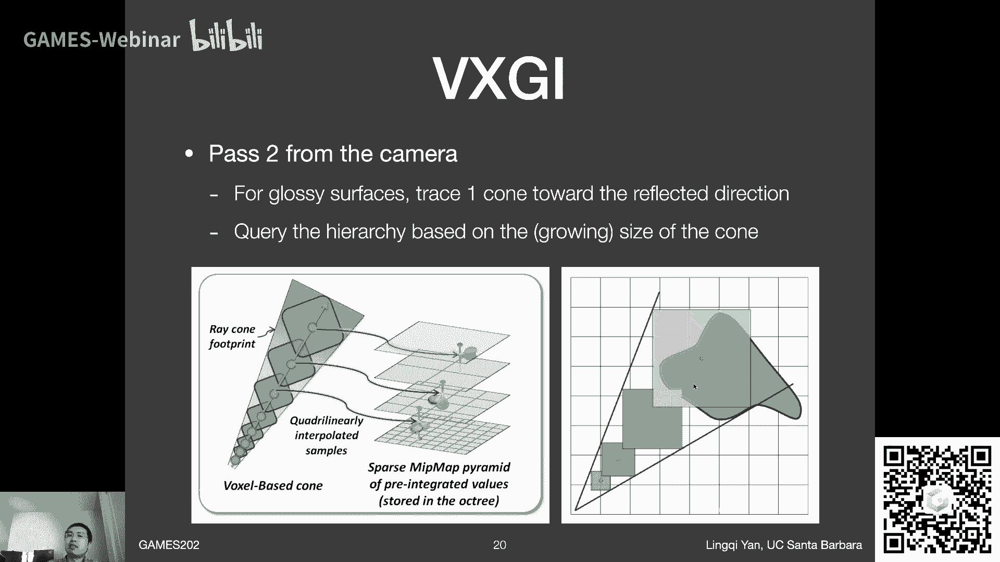

### Voxel Global Illumination (VXGI) 🧊

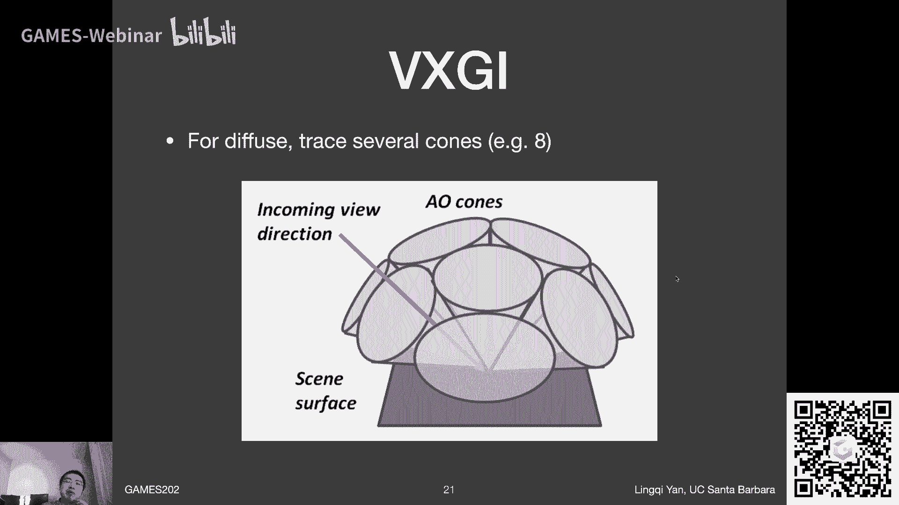

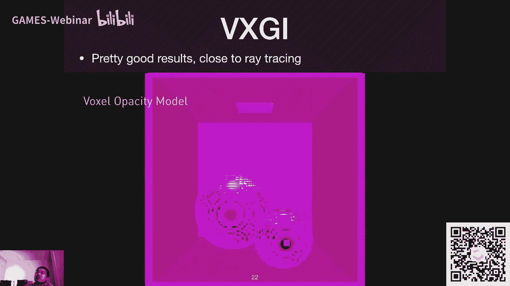

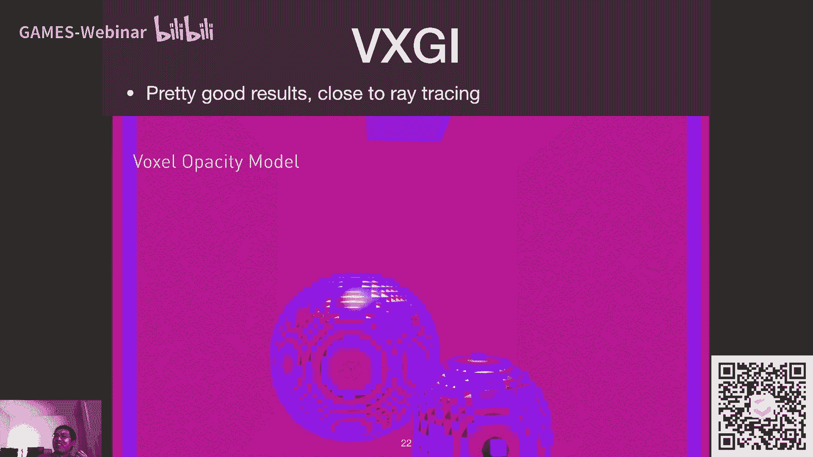

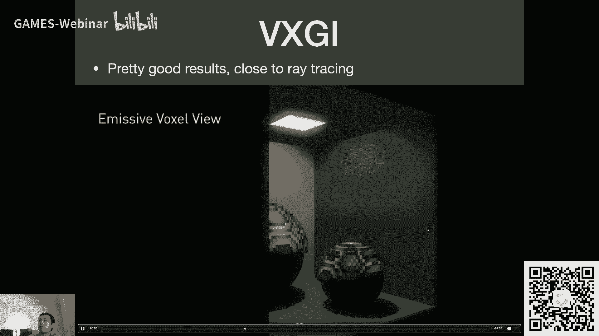

VXGI，即体素全局光照，采用了与LPV不同的思路。它也是一个两趟（Two-Pass）算法。

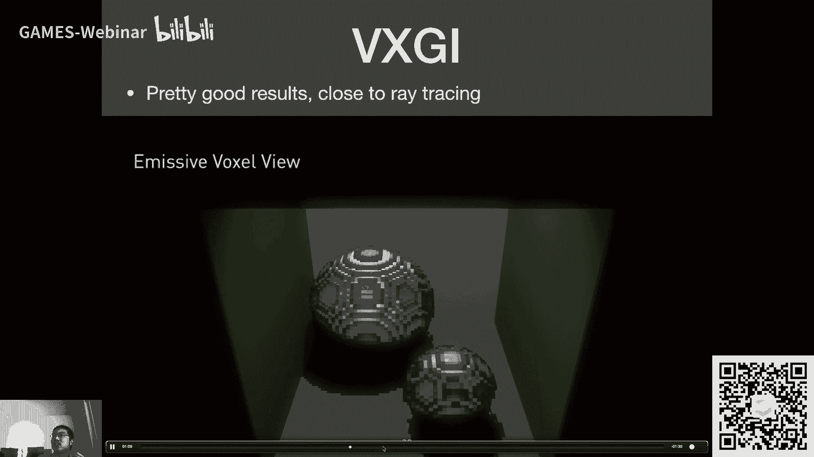

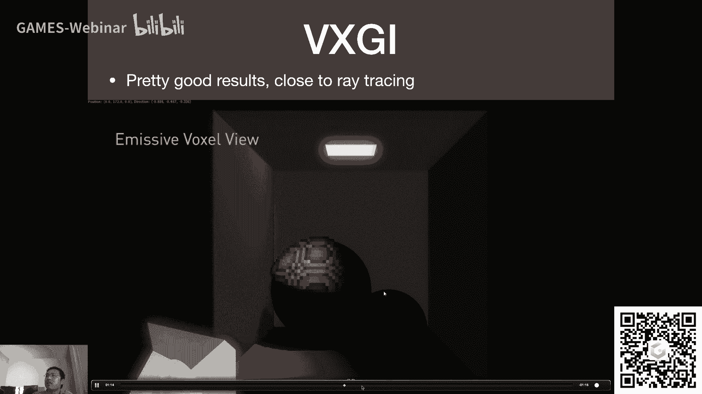

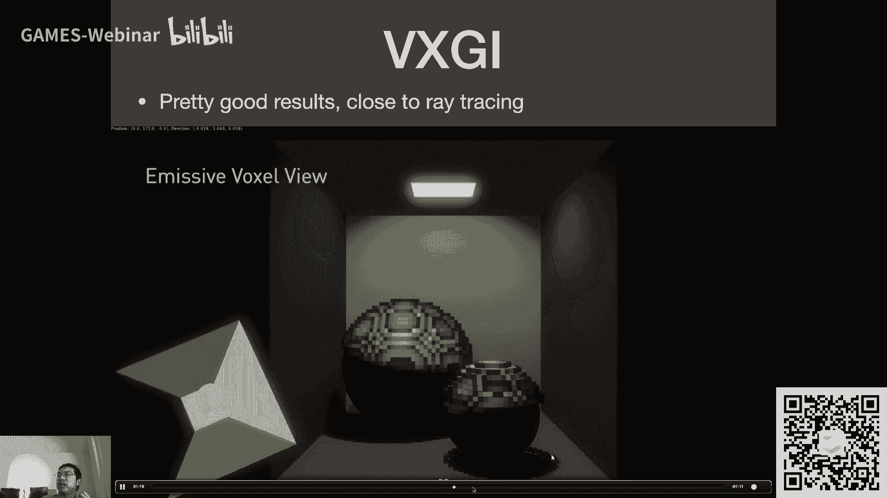

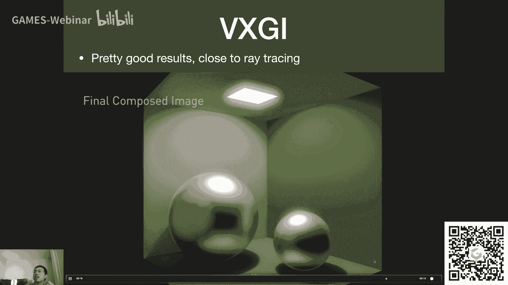

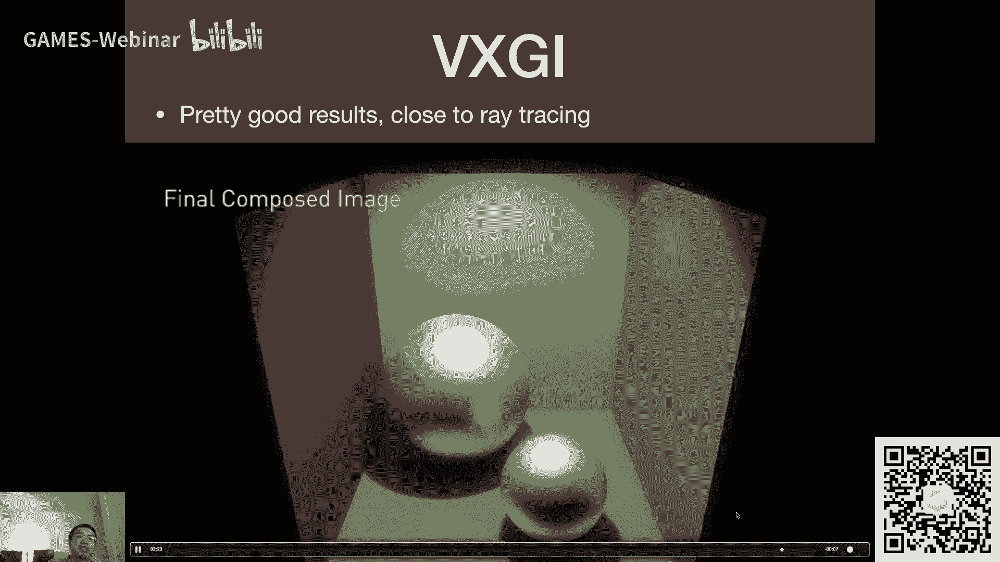

**核心思路**：
1.  **体素化与层级构建**：首先将整个场景体素化，类似于用乐高积木表示场景。然后为这些体素建立一个层级结构（树形结构），从小体素逐步聚合为大体素。
2.  **光照Pass（Light Pass）**：计算直接光照，并记录每个体素内**入射光照的方向分布**和**表面法线分布**。这比单纯记录出射Radiance更精确，能支持Glossy表面。
3.  **渲染Pass（Render Pass）**：从摄像机出发进行渲染。对于每个着色点：
    *   如果是Glossy表面，则根据视角方向反射出一个**圆锥（Cone）**。
    *   沿着这个圆锥在场景的体素层级结构中进行**圆锥追踪（Cone Tracing）**。根据圆锥当前的大小，在对应层级的体素中查找，并累加其对着色点的光照贡献。
    *   如果是Diffuse表面，则用多个（例如8个）较小的圆锥来覆盖整个半球，分别追踪并累加贡献。

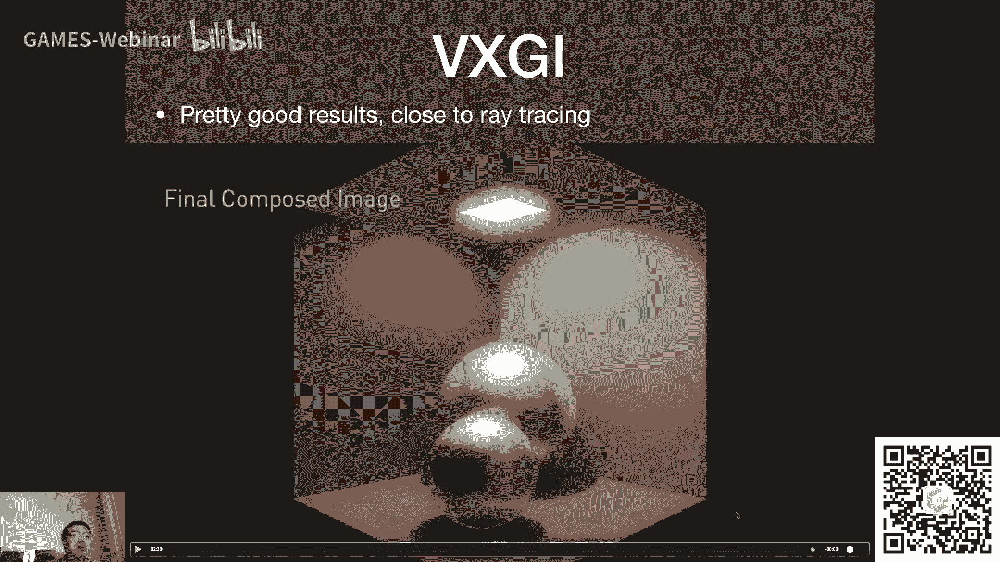

**优点与问题**：
*   **优点**：光照质量很高，更接近离线渲染的效果（如光子映射）。
*   **问题**：计算开销比LPV大；动态场景的实时体素化本身具有挑战性；需要预处理来构建层级结构。

---

## 屏幕空间全局光照方法

上一节我们介绍了在三维空间中处理全局光照的方法，本节我们来看看屏幕空间的方法。屏幕空间方法意味着我们只能利用从当前摄像机视角渲染得到的信息（主要是直接光照结果、深度、法线等），并在此基础上通过图像后处理的方式来近似全局光照。

### Screen Space Ambient Occlusion (SSAO) 🕶️

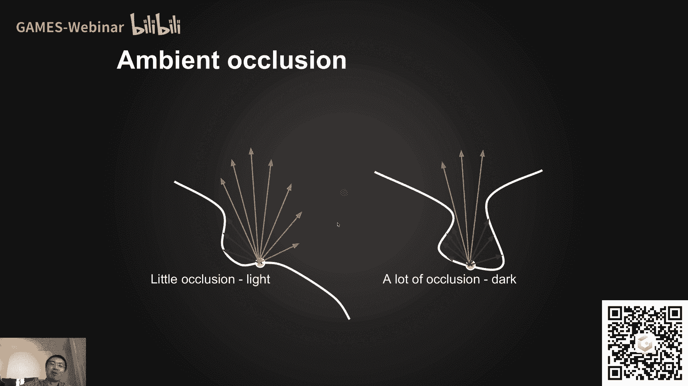

环境光遮蔽（AO）是一种对全局光照的近似，它能够增强物体间的相对位置感和立体感，主要通过接触阴影（Contact Shadow）来体现。屏幕空间环境光遮蔽（SSAO）则是在屏幕空间内实现AO的技术。

**核心理论推导**：
我们从渲染方程出发，并对间接光照部分做两个关键假设：
1.  来自所有方向的**间接光照入射辐亮度 `L_i(indirect)` 是常数**。
2.  物体表面是**Diffuse**的，即BRDF `f_r` 也是常数。

基于此，着色点 `p` 的间接光照 `L_o` 计算可以简化为：
`L_o(p) = (1/π) * ρ * L_i(indirect) * ∫_Ω V(p, ω_i) cosθ_i dω_i`
其中，`ρ` 是反照率，`V` 是可见性函数，`cosθ_i` 是夹角余弦。

令 `k_A(p) = (1/π) ∫_Ω V(p, ω_i) cosθ_i dω_i`， 它表示在法线半球上，**按 `cosθ` 加权的平均可见性**，值在0到1之间。
那么，`L_o(p) = ρ * L_i(indirect) * k_A(p)`。

因此，**AO的核心就是计算每个着色点的 `k_A`**，即其周围被遮挡的程度。`k_A` 越小，该点越暗（遮蔽越强）。

**屏幕空间实现思路**：
在屏幕空间，我们无法进行真正的光线追踪来计算半球上的积分。SSAO采用了一种巧妙的近似方法：

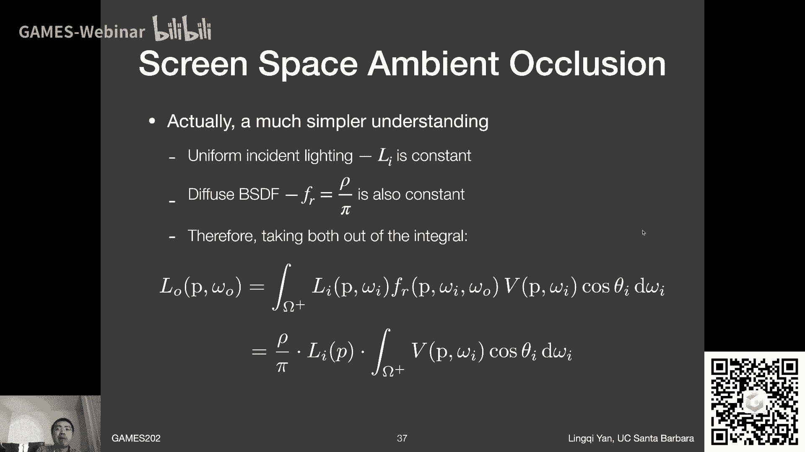

1.  **采样**：对于屏幕上的每个像素（着色点），在其**周围三维空间的一个球体**内随机采样一系列点。
2.  **可见性判断**：对于每个采样点，将其**投影回屏幕空间**，查询该投影位置在**深度缓冲（Depth Buffer）** 中记录的深度值。
    *   如果采样点的深度值**大于**深度缓冲中记录的值，说明该采样点位于“实际看到的”表面**背后**，即从着色点看向该方向可能被遮挡。记为“不可见”。
    *   反之，则可能“可见”。
3.  **计算 `k_A`**：统计被判断为“不可见”的采样点所占的比例，作为 `k_A` 的近似。更精确的做法会考虑采样点与法线的夹角（`cosθ` 加权），但这需要法线信息。

**存在的问题**：
*   **错误遮蔽（False Occlusion）**：这是SSAO的典型问题。如图所示，地面上的点A，其采样球可能包含石凳上的点B。将B投影到屏幕后，其深度值可能比A的深度值更小（离摄像机更近），因此A点会错误地认为B方向被遮挡，导致地面出现不该有的暗影。
*   **采样噪声**：由于采样点数量有限，直接得到的AO图噪声很大。通常会在计算后进行一次**降噪（Denoising）** 处理。

**进阶方法：HBAO**
当屏幕空间信息包含**法线纹理（Normal G-Buffer）** 时，可以实现更准确的** Horizon-Based Ambient Occlusion**。HBAO只考虑法线所指的半球空间，并且更精确地计算沿地平线的遮挡角度，能够有效减少SSAO中的错误遮蔽现象。

---

## 课程总结

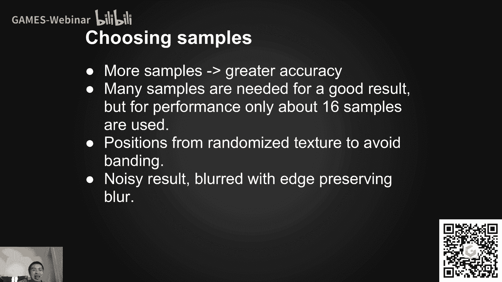

本节课我们一起学习了实时全局光照的多种方法。

我们首先补充了三维空间中的两种方案：**LPV**通过将Radiance注入体素网格并迭代传播来实现快速的间接光照扩散；**VXGI**则通过体素化场景和圆锥追踪，以更大的开销换取更高质量的间接光照。

然后，我们重点深入探讨了屏幕空间方法**SSAO**。我们从渲染方程出发，推导出环境光遮蔽的理论基础是计算加权平均可见性 `k_A`。在屏幕空间中，SSAO通过深度缓冲来近似判断采样点的可见性，从而高效地模拟接触阴影，增强场景的立体感。同时，我们也分析了其存在的错误遮蔽等问题以及HBAO等改进思路。

下节课，我们将继续屏幕空间的话题，学习Screen Space Directional Occlusion (SSDO) 和 Screen Space Reflection (SSR)。