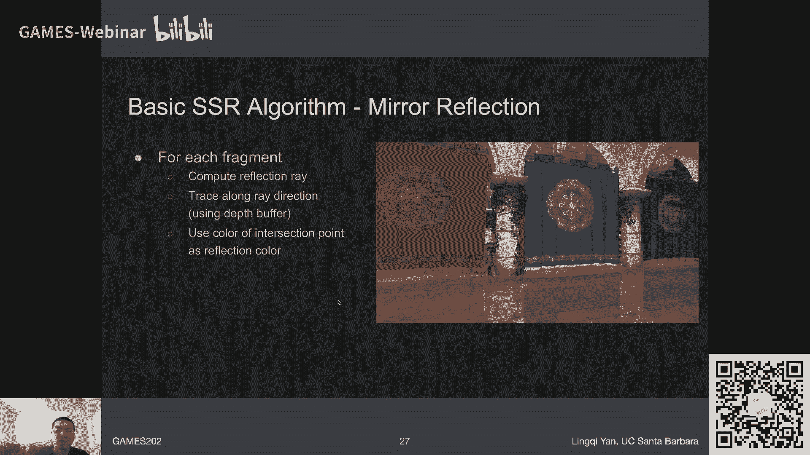
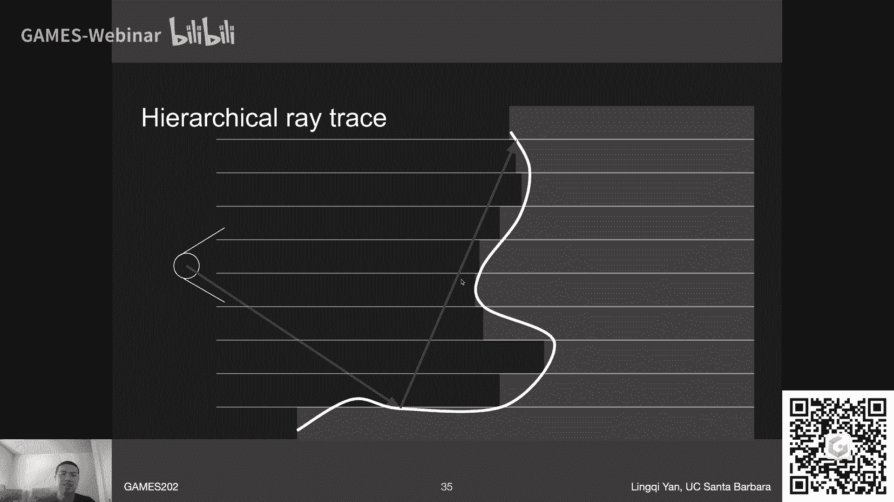

# GAMES202-高质量实时渲染 - 第九讲：实时全局光照（屏幕空间方法续）🌐

在本节课中，我们将继续学习屏幕空间下的实时全局光照方法。我们将深入探讨屏幕空间方向性遮挡（SSDO）和屏幕空间反射/光线追踪（SSR）的核心原理、实现细节以及各自的优缺点。

---

## 概述

上一讲我们介绍了3D空间中的实时全局光照方法，如LPV和VXGI，并引入了屏幕空间方法，例如SSAO。本节我们将聚焦于两种更先进的屏幕空间技术：**SSDO** 和 **SSR**。它们旨在提供比SSAO更精确的间接光照效果，特别是颜色溢出（Color Bleeding）和镜面/光泽反射。

---

## 屏幕空间方向性遮挡（SSDO）🔍

SSDO是对SSAO的改进。其核心思想是：我们无需假设着色点接收来自所有方向的间接光照强度相同。相反，我们可以利用已知信息——那些被直接照亮的像素（即次级光源）——来更精确地计算间接光照贡献。

### 基本思想对比：SSAO vs. SSDO

以下是SSDO与SSAO和路径追踪（Path Tracing）思路的对比：

*   **SSAO**：假设间接光照来自**无限远处**。在着色点周围一个小范围内，如果往某个方向看被遮挡，则认为该方向**无法**接收到（来自远处的）间接光照。
*   **SSDO/Path Tracing**：假设间接光照来自**场景中的其他表面**（次级光源）。在着色点周围一个小范围内，如果往某个方向看**被遮挡**，则意味着光线击中了另一个表面，该表面**可能**作为次级光源提供间接光照。如果方向**未被遮挡**，则意味着光线逃逸到了环境（如天空盒），提供的是**直接**环境光照。

因此，SSAO和SSDO对于“遮挡”与“间接光照来源”的假设是**相反**的。一个理想的方案应结合两者：SSDO处理**近处**物体间的相互反射，SSAO处理**远处**的环境遮蔽。

### SSDO算法步骤

SSDO的实现步骤与屏幕空间方法类似：

1.  **采样**：对于着色点 **P**，在其法线方向的半球内随机生成一系列采样点。
2.  **可见性测试**：判断从 **P** 点到每个采样点的方向是否被遮挡。这里采用与SSAO相同的**近似**：使用相机视角的深度缓冲来判断可见性。即，如果从相机看向采样点被遮挡，则近似认为从 **P** 点看向该方向也被遮挡。
3.  **贡献计算**：
    *   如果方向**未被遮挡**，则该方向贡献来自环境光的直接光照。
    *   如果方向**被遮挡**，则击中点 **Q** 被视为一个次级光源。我们需要计算 **Q** 点（对应一个微小面片）对 **P** 点的光照贡献。假设 **Q** 点是漫反射表面，其出射辐射度在各个方向相同，因此可以使用 **Q** 点对着色器直接可见时的颜色（即直接光照结果）来计算其对 **P** 点的贡献。公式近似为：
        `贡献 = (Q点颜色) * BRDF项 * 几何项`
4.  **求和**：将所有被遮挡方向对应的次级光源贡献累加，得到 **P** 点的间接光照。

### SSDO的优点与局限性

**优点**：
*   计算量相对较轻（与SSAO类似，但增加了击中点的着色计算）。
*   能够实现**颜色溢出**效果，即不同颜色的漫反射表面相互照亮。
*   比SSAO更符合物理的间接光照模型。

**局限性**：
1.  **屏幕空间固有缺陷**：只能处理相机直接可见的几何信息（“一层壳”）。被遮挡的物体无法提供间接光照。
    
    如图，当墙面旋转到相机不可见时，地面将无法接收到其反射光。
2.  **有限范围**：只能处理着色点**附近小范围内**的间接光照，无法处理远距离的间接光照（如经典Cornell Box场景中对面墙的照亮）。
3.  **可见性近似误差**：使用相机深度缓冲近似着色点的可见性，在几何关系复杂时可能出错（如右图所示）。
    

---

## 屏幕空间反射/光线追踪（SSR）💎

SSR，更准确地应称为**屏幕空间光线追踪（Screen Space Ray Tracing）**。它是一种在屏幕空间数据（深度、法线、颜色）构成的“壳”上进行光线求交的技术，用于实现反射等全局光照效果。

### 为什么需要SSR？

反射本质上是全局光照的一种表现形式。光滑表面反射出的周围景物，正是其他表面被照亮后的结果。SSR的目标是高效地模拟这种效果。

### SSR核心：光线步进与层次化追踪

在屏幕空间进行光线追踪的关键是：给定一条从着色点 **P** 出发的光线 **R**，如何高效地找到它与屏幕深度缓冲所表示“壳”的第一个交点。

**基础方法：线性步进**
从光线起点开始，以固定步长前进，每次步进后检查当前点在屏幕空间的深度值是否大于该像素处记录的场景深度（即是否穿过了“壳”）。这种方法简单但效率低下，步长选择困难。

**高效方法：层次化深度缓冲追踪**
核心思想是利用预计算的**层次化深度图（Hierarchical Depth Buffer）**，实现变步长跳跃，快速跳过不可能相交的区域。

1.  **构建层次深度图**：类似于Mipmap，但每一层存储的是下一层对应区域深度的**最小值**（即离相机最近的距离）。这形成了一个保守的深度金字塔。
    

2.  **追踪算法（试探步进）**：
    *   从最精细的层级（第0层）开始，步进一个像素。
    *   如果当前光线段与当前层级的深度块**未相交**，则进入更粗糙的层级（如第1层），步进一个更大的块（相当于跳跃多个像素）。
    *   如果在某个粗糙层级发现**可能相交**，则回退到更精细的层级进行更精确的检测。
    *   重复此过程，直到在最精细的层级找到精确的交点，或光线超出屏幕范围。
    
    这种“保守-激进”相结合的步进策略能显著加速求交过程。

### SSR的着色计算

找到交点 **Q** 后，需要计算 **Q** 点对 **P** 点的光照贡献。这里有一个重要假设：**被反射的物体（Q点）是漫反射的**。这样，**Q** 点反射到相机方向的光辐射度，可以近似等于它反射到 **P** 点方向的光辐射度。

因此，着色计算简化为：
1.  对于**镜面反射**，只需沿着反射方向追踪一条光线，取交点 **Q** 的颜色。
2.  对于**光泽反射**，需要在BRDF波瓣内采样多条光线，分别追踪并取交点颜色的加权平均。
3.  这个过程本质上是**路径追踪**中的一次光线弹射，因此**自然地**解决了以下问题：
    *   **距离衰减**：包含在立体角积分中。
    *   **可见性**：追踪找到的就是第一个可见点。
    *   **接触硬化**：离反射表面越近，反射锥覆盖的源区域越小，反射越清晰。
    *   **镜面拉长**：各向异性BRDF（如地面）会导致反射图像在特定方向上拉长。

### SSR的优点与局限性

**优点**：
*   效果真实，能实现精确的镜面和光泽反射。
*   无需预计算，适应动态场景。
*   算法效率较高（得益于层次化追踪）。

**局限性**：
1.  **屏幕空间固有缺陷**：只能反射相机可见的内容。对于遮挡部分或屏幕外的物体，反射信息会缺失或错误。
    
    如图，手背的反射中缺失了手掌部分。
2.  **性能**：对于粗糙的漫反射表面，需要采样大量光线，性能开销大。通常需要结合**重要性采样**、**时空复用**和**滤波**（如联合双边滤波）来优化。
3.  **边界处理**：光线追踪出屏幕时会产生生硬的截断，通常需要通过距离衰减等方式进行模糊软化。

---

## 总结

本节课我们一起深入学习了两种重要的屏幕空间全局光照技术：

*   **SSDO**：通过将遮挡点视为次级光源，计算近处物体间的漫反射互映（颜色溢出）。它比SSAO更物理，但受限于屏幕空间信息和有限作用范围。
*   **SSR**：通过在屏幕空间“壳”上进行层次化光线追踪，实现精确的镜面/光泽反射。它能产生高质量的反射效果，但同样受限于屏幕信息，且对漫反射表面计算成本较高。

这两种技术是实时渲染中实现逼真全局光照的重要手段。它们巧妙地利用屏幕空间信息，在性能和质量之间取得了良好平衡。然而，它们的根本局限都源于“屏幕空间”这一前提——只能处理相机可见的信息。下一节课，我们将开始探讨基于物理的材质模型，这是构成逼真渲染的另一个基石。