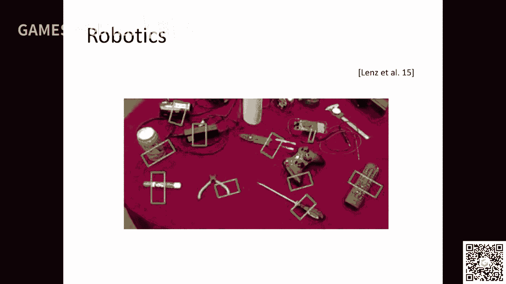

# GAMES203：三维重建和理解 - P1：Lecture 1 课程介绍与三维扫描 📚

## 课程概述

在本节课中，我们将学习三维重建与理解这门课程的整体框架、学习目标以及三维扫描的基本原理。课程旨在融合计算机图形学中的几何处理与计算机视觉中的三维视觉，为初学者打下扎实的基础。

## 课程背景与动机

本课程使用中文授课，但幻灯片和学术术语将使用英文，以确保精确性。开设这门课的主要动机在于连接两个紧密相关的领域：计算机图形学中的几何处理和计算机视觉中的三维视觉。

几何处理领域，也称为几何建模，主要研究三维物体的表示、重建与理解。三维视觉领域则专注于从图像中恢复和理解三维结构。近年来，这两个领域融合得越来越紧密。本课程希望提供一个共同的视角，将这两个领域打通。

课程将侧重于从逆向工程和视觉的角度来看待几何处理，有时也称为扫描处理。同时，三维视觉中对物体的理解也离不开对物体表示的研究。本课程的目标正是架起这两个领域之间的桥梁。

## 讲师与课程安排

讲师目前是助理教授。课程时间为北京时间每周五上午10点。如有学术问题，可以通过电子邮件联系讲师。

课程将包含两次作业和一些可选的大作业项目。课程会提供一些潜在的研究方向供选择。

## 几何处理简介

几何处理领域已存在至少30-40年，其核心是用计算的方法来研究物理对象。这个过程的第一步，也是至关重要的一步，就是重建。

我们生活中有许多物理对象，我们需要通过硬件扫描将其转化为三维模型。得到模型后，再进行各种处理和分析，例如研究如何更好地表示物体、如何进行参数化、如何贴纹理，以及如何将二维图像转换为三维物体等。

简而言之，几何处理就是在计算机中为物理世界创建一个虚拟副本。在这个虚拟世界中，我们可以对物体进行计算分析，例如识别物体的组成部分、寻找不同物体间的对应关系，或者组合物体以创建新物体。

处理和分析完成后，我们还可以通过三维打印等技术，将虚拟世界中的编辑结果返回到物理世界。因此，几何处理的流程主要包含两个部分：**重建** 与 **处理/分析**。

## 三维视觉简介

三维视觉领域的范围更广。传统三维视觉的核心问题是：从图像中恢复其隐含的三维结构。这是一个基础且终极的问题。

其中涉及的关键问题包括运动恢复结构和多视角立体视觉，这是三维重建中两个最重要的问题。当然，三维视觉还包括其他问题，如姿态估计。

传统三维视觉的重建框架与几何处理中的重建框架有所不同，但存在一些共同的问题，例如配准。

近年来，随着海量三维模型数据集的涌现（如ImageNet推动了二维视觉的发展），三维视觉的研究重点逐渐从单纯的重建转向了**理解**与**合成**。这与几何处理中的处理与分析产生了共性。

现在研究的问题包括分类、分割、检测等。这就引出一个问题：三维视觉与二维视觉的区别究竟在哪里？

从机器学习角度看，无论是处理图片还是三维物体，我们都需要将数据表示为向量（如 `x` 和 `y`），然后学习它们之间的变换关系。关键在于，三维数据有多种不同的表示方式，例如：
*   **体素网格**
*   **三角网格**
*   **点云**
*   **多视角图像集合**
*   **场景图**

这些表示方式与几何处理领域紧密相关。本课程的一个重要部分就是探讨这些不同的数据表示及其相互转换。

## 课程内容结构

本课程将分为三个主要部分：

**第一部分：重建**
我们将介绍两条技术路线。
1.  第一条路线源于几何处理：从硬件扫描开始，讲解三维扫描的原理，然后是多视角扫描数据的**配准**，最后是**曲面重建**。
2.  第二条路线源于三维视觉：从图像出发，讲解**运动恢复结构**（得到相机姿态和稀疏点云）和**多视角立体视觉**（得到稠密重建）。我们还会探讨**同步定位与地图构建**中与三维重建相关的部分，以及多物体场景下的**分割**问题。

**第二部分：表示**
我们将从数据表示的角度，系统性地介绍各种三维表示方法，如网格、点云、隐式曲面等。重点探讨不同表示之间的转换问题，例如：
*   如何将隐式曲面（如公式 `x² + y² + z² = 1` 表示的球面）转换为三角网格。
*   如何将扫描得到的点云转换为连续的曲面。

**第三部分：理解**
我们将讲解分类、分割等理解任务，特别是与深度学习相关的方法。课程将兼顾经典算法与最新进展，强调对基础原理的透彻理解。

## 基础的重要性

本课程强调基本功。在深度学习时代，许多工作缺乏扎实的数学基础和充分的实验验证。本课程旨在弥补这一不足，推荐阅读的文献也包含许多经典论文。

真正解决复杂问题（如机器人、自动驾驶）时，最终都会回归到基础：如何表示、如何重建、如何分类。这些基础模块是构建复杂系统的基石。

所需的数学基础包括线性代数、射影几何，以及一些拓扑学知识。课程会尽量讲解清楚。

## 数值优化

优化是三维重建和理解中的核心工具。无论是从图像恢复三维结构，还是进行模型拟合，本质上都是在求解一个优化问题。

一个优化问题通常包含一个**目标函数**和需要优化的**变量**。我们的目标是找到使目标函数值最小（或最大）的变量值。例如，最小二乘法就是一个优化问题。

优化问题种类繁多，例如：
*   **连续优化** vs **离散优化**（如图割算法）
*   **凸优化** vs **非凸优化**
*   **确定性优化** vs **随机优化**（如深度学习中的随机梯度下降）

我们将学习一些常用的优化算法。理解优化对于从事几何处理或三维视觉研究至关重要。

## 作业与项目

课程有两个主要作业：
1.  **深度重建**：实现一个三维重建流程。
2.  **基元提取**：从数据中提取基本的几何形状。

此外，课程还会提供一些可选的大项目方向，例如：
*   从互联网产品图片中进行三维重建。
*   从单张图片进行三维理解与重建。
*   设计适用于新型三维表示（如三角网格）的神经网络。
*   融合不同传感器（激光雷达、相机）的数据进行重建。
*   研究在深度学习中如何强制执行几何约束。
*   研究模型预测结果的不确定性度量。

## 三维扫描技术介绍

接下来，我们进入本节课的第二个主题：三维扫描。这部分内容偏向硬件和应用，大家了解基本原理即可。

扫描是三维重建流程的第一步：如何获取物理对象表面的三维点云。由于单次扫描只能覆盖一个视角，我们需要将多个视角的点云**配准**在一起，最终通过**曲面重建**得到一个完整的模型。

扫描技术主要分为两类：
1.  **接触式扫描**：例如使用机械臂触碰物体表面来记录点的三维坐标。这种方法精度高但速度慢，早期计算机模型曾用此方法。
2.  **非接触式扫描（光学扫描）**：这是当前的主流，又可分为：
    *   **被动式**：仅利用采集到的图像（如双目立体视觉）来计算深度信息。本课程后续在运动恢复结构部分会涉及。
    *   **主动式**：主动向物体投射特定模式的光，以辅助重建。本节重点介绍此类。

### 主动式扫描原理：三角测量

主动式扫描的核心思想是**三角测量**。其原理非常简单：已知两条射线的方向，且知道它们相交于空间中的一点，就可以计算出该点的位置。

在扫描中，我们制造这样两条射线：
1.  第一条射线来自一个可控的**光源**（如投影仪），它将一个特定的光模式投射到物体表面。我们知道这条投射光线的方向。
2.  第二条射线来自一个**相机**，它从另一个角度拍摄物体表面，并识别出光源投射的模式在图像中的位置。通过相机模型，我们可以知道这条观察光线的方向。

由于光源和相机之间的相对位置（基线 `b`）是固定的，根据简单的几何关系（相似三角形原理），我们就可以计算出物体表面点的深度 `z`。

公式可以简化为：`z ∝ (f * b) / (x - x')`，其中 `f` 是焦距，`(x - x')` 是投影点在两个视角图像中的视差。

### 模式设计的关键

整个流程中最关键也最具挑战性的部分是：**如何让相机自动、唯一地识别出图像中每个像素点对应的是光源投射的哪一条光线（即哪个模式元素）？**

这引出了**模式设计**的问题。设计的目标是让每个投射模式元素都有一个独一无二的“ID”，使得相机在捕获的图像中能将其准确识别出来。常见的模式设计思路有：

1.  **彩色编码**：为每条投射光线赋予不同的颜色。只要物体表面颜色不失真，就能直接识别。
2.  **时序编码**：投射一系列黑白二值模式（如格雷码）。同一个空间点在不同时间被不同序列的模式照射，从而形成一个独特的二进制时间序列编码作为其ID。
3.  **空间连续性**：投射规则的点阵或网格。利用物体表面连续性的假设，通过相邻点的关系来推断每个点的ID。

这些方法各有优缺点，例如彩色编码受物体本色影响，时序编码要求场景静止，空间连续性在物体边界不连续处会失效。目前一些商用扫描仪（如结构光扫描仪）融合了多种技术来解决这些问题。

## 课程总结

本节课我们一起学习了以下内容：
1.  **课程框架**：了解了本课程融合几何处理与三维视觉的目标，以及重建、表示、理解三大模块的结构。
2.  **基础重要性**：强调了扎实的数学、优化和算法基础对于前沿研究的关键作用。
3.  **三维扫描原理**：介绍了主动式三维扫描的基本思想——三角测量，并讲解了其核心挑战“模式设计”的几种思路。

下节课我们将深入讲解三维重建流程中的下一个关键步骤：**多视角点云配准**，重点介绍迭代最近点算法及其变种。

